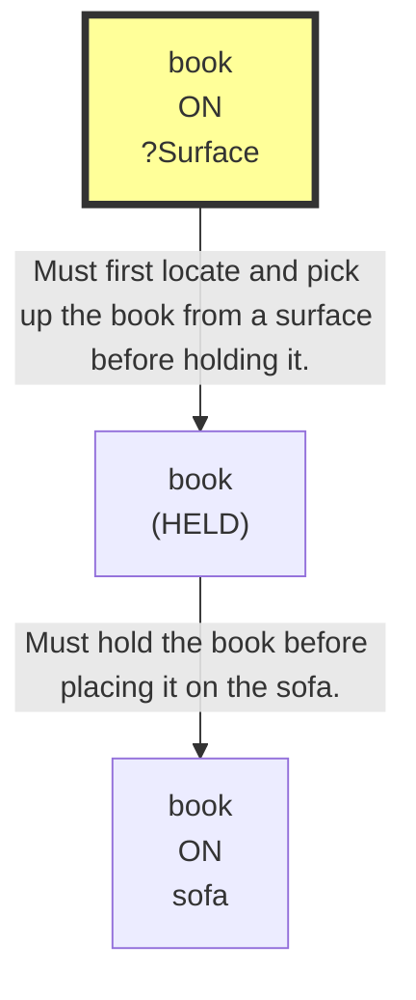
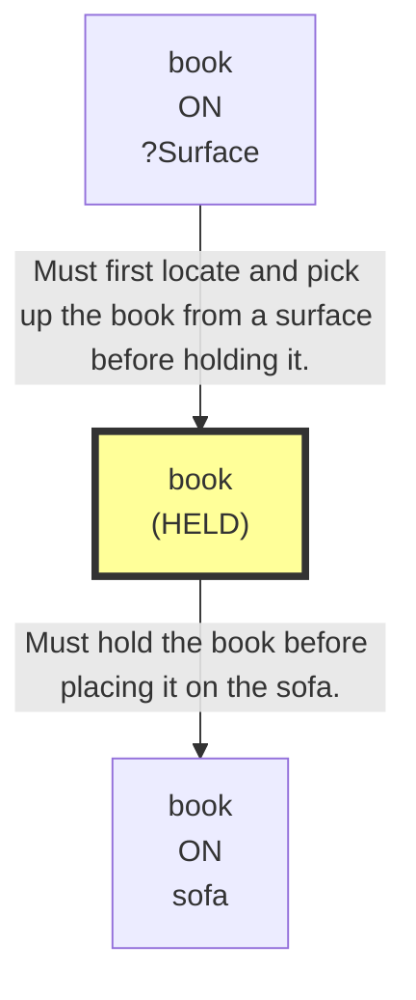
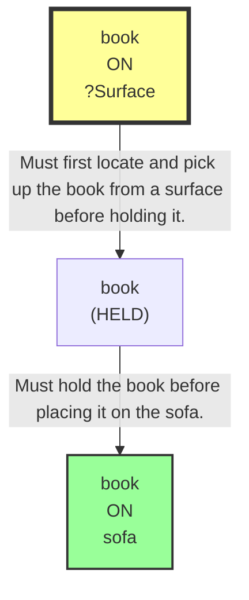
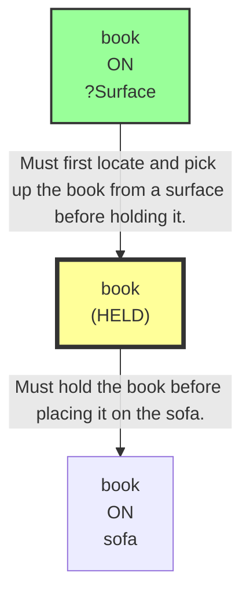
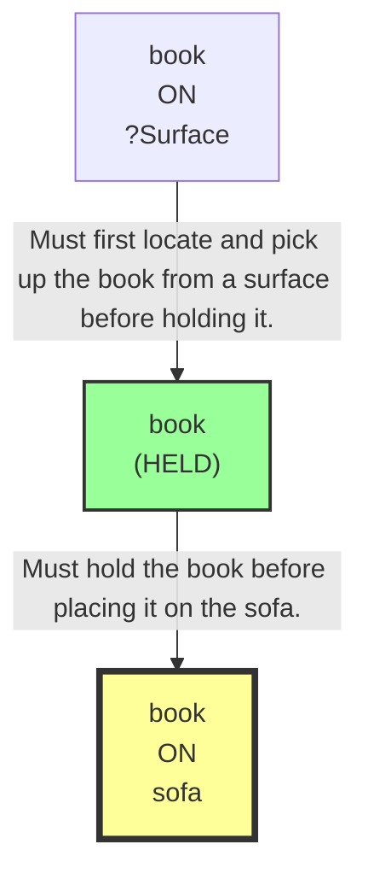

# 🚀 VirtualHome Agent Episode Log


### [GoalReasoner (Module A - Intent)] Output
```json
{
  "is_instruction_obviously_vague": false,
  "clarification_question": null,
  "target_object": "book",
  "location_hint": "sofa",
  "reasoning_chain": [
    {
      "question": "Why does the user want this object?",
      "answer": "To move a book that is out of place to a specific resting area."
    },
    {
      "question": "Why is that important?",
      "answer": "To organize the space by placing the book where it belongs or where it is meant to be kept temporarily."
    },
    {
      "question": "What fundamental need does this fulfill?",
      "answer": "It fulfills the need to restore order in the living area."
    },
    {
      "question": "Are there any deeper psychological or physical motivations?",
      "answer": "The user may want a tidier environment and easier access to the book in a common seating area."
    }
  ],
  "deep_intent": "The user wants to restore order in the indoor space by relocating misplaced reading material to a designated resting area.",
  "acceptable_alternatives_properties": [
    {
      "priority": 1,
      "description": "Other similar reading materials, such as magazines, notebooks, or journals, if a book is unavailable."
    },
    {
      "priority": 2,
      "description": "Other paper-based items that are commonly kept together in a living area, such as catalogs or manuals."
    },
    {
      "priority": 3,
      "description": "Other small portable items that are out of place and meant to be tidied into a common resting area."
    },
    {
      "priority": 4,
      "description": "Other household items that can be organized by moving them from an unorganized spot to a sofa-side placement."
    }
  ]
}
```

### [PerceptionFilter] Output
```json
{
  "reasoning": "The goal is to move a book onto the sofa, so the necessary classes are the target object and the destination surface. The SDG also implies the book must be found on some surface, but that surface is unspecified, so no extra location class is required. No tool is needed beyond the book and sofa for this placement task.",
  "selected_classes": [
    "sofa",
    "character",
    "book"
  ],
  "raw_class_count": 27
}
```

### [LLMExecutor] Output
```json
{
  "reasoning": "The goal is to place a book on the sofa. In the current graph, book(105) is the only book already close to the character, making it the best candidate to grab next. To satisfy N2, I must first move to the book before grabbing it. The sofa(214) is the intended final surface for N1, but I cannot place anything yet until the book is held.",
  "satisfied_nodes": [],
  "current_node_focus": "N3",
  "mapped_variables": {},
  "action": "[walk] <book> (105)"
}
```

### [RoboStateMultiTaskController] Output
```json
{
  "action": "[walk] <book> (105)",
  "active_task_id": "task_1",
  "task_context": {
    "active_task_id": "task_1",
    "pending_task_ids": [],
    "satisfied_task_ids": []
  },
  "source": "llm_executor"
}
```
## Step 0
- **Action**: `[walk] <book> (105)`
- **Action Success**: `True`
- **Action Message**: {'0': {'message': 'Success'}}
- **Active Task**: `task_1`
- **Decision Source**: `llm_executor`
- **Task Progress**: E1_03=pending
- **SDG Status**:

- **Observed Items (10)**: sofa(214), book(229) [CLOSED], book(230) [CLOSED], book(105) [CLOSED], character(1), kitchen(11), livingroom(183), bedroom(241), bathroom(285), bedroom(346)


### [PerceptionFilter] Output
```json
{
  "reasoning": "Reused cached class selection.",
  "selected_classes": [
    "sofa",
    "character",
    "book"
  ],
  "raw_class_count": 27
}
```

### [LLMExecutor] Output
```json
{
  "reasoning": "The book to move is most likely book(105), since it is already close to the character and was the object approached in the previous step. The SDG requires first holding the book before placing it on the sofa. Since I am already near book(105), the next atomic step is to grab it.",
  "satisfied_nodes": [],
  "current_node_focus": "N3",
  "mapped_variables": {},
  "action": "[grab] <book> (105)"
}
```

### [RoboStateMultiTaskController] Output
```json
{
  "action": "[grab] <book> (105)",
  "active_task_id": "task_1",
  "task_context": {
    "active_task_id": "task_1",
    "pending_task_ids": [],
    "satisfied_task_ids": []
  },
  "source": "llm_executor"
}
```
## Step 1
- **Action**: `[grab] <book> (105)`
- **Action Success**: `False`
- **Action Message**: temporary_unavailable: target disappeared; wait or search and retry
- **Active Task**: `task_1`
- **Decision Source**: `llm_executor`
- **Task Progress**: E1_03=pending
- **SDG Status**:

- **Observed Items (10)**: sofa(214), book(229) [CLOSED], book(230) [CLOSED], book(105) [CLOSED], character(1), kitchen(11), livingroom(183), bedroom(241), bathroom(285), bedroom(346)


### [PerceptionFilter] Output
```json
{
  "reasoning": "Reused cached class selection.",
  "selected_classes": [
    "sofa",
    "character",
    "book"
  ],
  "raw_class_count": 27
}
```

### [LLMExecutor] Output
```json
{
  "reasoning": "The previous grab on book(105) failed because the target temporarily disappeared, which fits the temporary_unavailable case. The current graph still shows book(105) close to the character in the living room, so the best autonomous recovery is to wait in place for the object to reappear rather than switching targets. This keeps progress toward N3/N2/N1 without violating the disappearance strategy.",
  "satisfied_nodes": [],
  "current_node_focus": "N3",
  "mapped_variables": {},
  "action": "[wait]"
}
```

### [RoboStateMultiTaskController] Output
```json
{
  "action": "[wait]",
  "active_task_id": "task_1",
  "task_context": {
    "active_task_id": "task_1",
    "pending_task_ids": [],
    "satisfied_task_ids": []
  },
  "source": "llm_executor"
}
```
## Step 2
- **Action**: `[wait]`
- **Action Success**: `True`
- **Action Message**: Time passes. You waited for a while.
- **Active Task**: `task_1`
- **Decision Source**: `llm_executor`
- **Task Progress**: E1_03=pending
- **SDG Status**:

- **Observed Items (10)**: sofa(214), book(229) [CLOSED], book(230) [CLOSED], book(105) [CLOSED], character(1), kitchen(11), livingroom(183), bedroom(241), bathroom(285), bedroom(346)


### [PerceptionFilter] Output
```json
{
  "reasoning": "Reused cached class selection.",
  "selected_classes": [
    "sofa",
    "character",
    "book"
  ],
  "raw_class_count": 27
}
```

### [LLMExecutor] Output
```json
{
  "reasoning": "The previous book(105) disappeared temporarily when I tried to grab it, and after waiting it is still present but the graph now shows book(105) as close to the character. Since the task is to move the book onto the sofa, the next required step is to grab the same book now that it is available again, before any placement action. This will satisfy the held-state prerequisite for putting it on the sofa.",
  "satisfied_nodes": [],
  "current_node_focus": "N2",
  "mapped_variables": {},
  "action": "[grab] <book> (105)"
}
```

### [RoboStateMultiTaskController] Output
```json
{
  "action": "[grab] <book> (105)",
  "active_task_id": "task_1",
  "task_context": {
    "active_task_id": "task_1",
    "pending_task_ids": [],
    "satisfied_task_ids": []
  },
  "source": "llm_executor"
}
```
## Step 3
- **Action**: `[grab] <book> (105)`
- **Action Success**: `False`
- **Action Message**: temporary_unavailable: target is temporarily hidden
- **Active Task**: `task_1`
- **Decision Source**: `llm_executor`
- **Task Progress**: E1_03=pending
- **SDG Status**:

- **Observed Items (10)**: sofa(214), book(229) [CLOSED], book(230) [CLOSED], book(105) [CLOSED], character(1), kitchen(11), livingroom(183), bedroom(241), bathroom(285), bedroom(346)


### [PerceptionFilter] Output
```json
{
  "reasoning": "Reused cached class selection.",
  "selected_classes": [
    "sofa",
    "character",
    "book"
  ],
  "raw_class_count": 27
}
```

### [LLMExecutor] Output
```json
{
  "reasoning": "The originally targeted book(105) was temporarily unavailable, but a different book instance is now visible in the living room. The task is to move a book onto the sofa, and book(229) matches the target object class while the sofa(214) is the destination. Since the next step toward satisfying the holding prerequisite is to approach the newly visible book before grabbing it, I will walk to book(229).",
  "satisfied_nodes": [
    "N1"
  ],
  "current_node_focus": "N3",
  "mapped_variables": {
    "?Surface": "livingroom surface holding book(229)"
  },
  "action": "[walk] <book> (229)"
}
```

### [RoboStateMultiTaskController] Output
```json
{
  "action": "[walk] <book> (229)",
  "active_task_id": "task_1",
  "task_context": {
    "active_task_id": "task_1",
    "pending_task_ids": [],
    "satisfied_task_ids": []
  },
  "source": "llm_executor"
}
```
## Step 4
- **Action**: `[walk] <book> (229)`
- **Action Success**: `True`
- **Action Message**: {'0': {'message': 'Success'}}
- **Active Task**: `task_1`
- **Decision Source**: `llm_executor`
- **Task Progress**: E1_03=pending
- **SDG Status**:

- **Observed Items (10)**: sofa(214), book(229) [CLOSED], book(230) [CLOSED], book(105) [CLOSED], character(1), kitchen(11), livingroom(183), bedroom(241), bathroom(285), bedroom(346)


### [PerceptionFilter] Output
```json
{
  "reasoning": "Reused cached class selection.",
  "selected_classes": [
    "sofa",
    "character",
    "book"
  ],
  "raw_class_count": 27
}
```

### [LLMExecutor] Output
```json
{
  "reasoning": "The SDG requires first satisfying N3 by locating and picking up the book from a surface, which then enables holding it for later placement on the sofa. The current graph shows book(229) is close to the character, and we already walked to it in the last step, so the next atomic action is to grab it. Book(229) is the best candidate because it is currently near us, while book(105) previously disappeared temporarily and is not the immediate actionable target. No other SDG nodes are yet satisfied because the book is not held and not on the sofa.",
  "satisfied_nodes": [],
  "current_node_focus": "N3",
  "mapped_variables": {},
  "action": "[grab] <book> (229)"
}
```

### [RoboStateMultiTaskController] Output
```json
{
  "action": "[grab] <book> (229)",
  "active_task_id": "task_1",
  "task_context": {
    "active_task_id": "task_1",
    "pending_task_ids": [],
    "satisfied_task_ids": []
  },
  "source": "llm_executor"
}
```
## Step 5
- **Action**: `[grab] <book> (229)`
- **Action Success**: `False`
- **Action Message**: temporary_unavailable: target disappeared; wait or search and retry
- **Active Task**: `task_1`
- **Decision Source**: `llm_executor`
- **Task Progress**: E1_03=pending
- **SDG Status**:

- **Observed Items (10)**: sofa(214), book(229) [CLOSED], book(230) [CLOSED], book(105) [CLOSED], character(1), kitchen(11), livingroom(183), bedroom(241), bathroom(285), bedroom(346)


### [PerceptionFilter] Output
```json
{
  "reasoning": "Reused cached class selection.",
  "selected_classes": [
    "sofa",
    "character",
    "book"
  ],
  "raw_class_count": 27
}
```

### [LLMExecutor] Output
```json
{
  "reasoning": "The book target has not yet been successfully picked up, and the previous grab attempts failed because the book was temporarily unavailable. A new book instance (book(230)) is currently close to the character in the living room, so the best next step is to retry grabbing this visible, nearby book to satisfy N2 (HELD).",
  "satisfied_nodes": [
    "N3"
  ],
  "current_node_focus": "N2",
  "mapped_variables": {},
  "action": "[grab] <book> (230)"
}
```

### [RoboStateMultiTaskController] Output
```json
{
  "action": "[grab] <book> (230)",
  "active_task_id": "task_1",
  "task_context": {
    "active_task_id": "task_1",
    "pending_task_ids": [],
    "satisfied_task_ids": []
  },
  "source": "llm_executor"
}
```
## Step 6
- **Action**: `[grab] <book> (230)`
- **Action Success**: `False`
- **Action Message**: temporary_unavailable: target disappeared; wait or search and retry
- **Active Task**: `task_1`
- **Decision Source**: `llm_executor`
- **Task Progress**: E1_03=pending
- **SDG Status**:

- **Observed Items (10)**: sofa(214), book(229) [CLOSED], book(230) [CLOSED], book(105) [CLOSED], character(1), kitchen(11), livingroom(183), bedroom(241), bathroom(285), bedroom(346)


### [RoboStateMultiTaskController] Output
```json
{
  "action": "[walk] <kitchen> (11)",
  "active_task_id": null,
  "task_context": {
    "active_task_id": null,
    "pending_task_ids": [
      "task_1"
    ],
    "satisfied_task_ids": []
  },
  "source": "loop_recovery_room_revisit"
}
```
## Step 7
- **Action**: `[walk] <kitchen> (11)`
- **Action Success**: `True`
- **Action Message**: {'0': {'message': 'Success'}}
- **Decision Source**: `loop_recovery_room_revisit`
- **Task Progress**: E1_03=pending
- **SDG Status**:
No SDG active.
- **Observed Items (59)**: floor(184), floor(185), floor(186), floor(187), floor(188), floor(189), wall(190), wall(191), wall(192), wall(193), wall(194), wall(195), ceiling(196), ceiling(197), ceiling(198)...


### [PerceptionFilter] Output
```json
{
  "reasoning": "Needed items are the target book, the destination sofa, and the minimal implied support for moving a held object from an unknown surface. No extra tools are required for simply picking up and placing a book.",
  "selected_classes": [
    "door",
    "sofa",
    "character",
    "book"
  ],
  "raw_class_count": 59
}
```

### [LLMExecutor] Output
```json
{
  "reasoning": "The book target is still not held, and the previous attempt to grab book(229) failed because it was temporarily unavailable. Since book(229) and book(230) are both currently visible in the living room and close to the character, the best next step is to retry grabbing one of the candidate books. I will target book(229) again to satisfy N2 (HELD), which is the prerequisite for placing it on the sofa. The sofa relation N1 is not yet satisfied.",
  "satisfied_nodes": [
    "N3"
  ],
  "current_node_focus": "N2",
  "mapped_variables": {},
  "action": "[grab] <book> (229)"
}
```

### [RoboStateMultiTaskController] Output
```json
{
  "action": "[walk] <bedroom> (241)",
  "active_task_id": null,
  "task_context": {
    "active_task_id": null,
    "pending_task_ids": [
      "task_1"
    ],
    "satisfied_task_ids": []
  },
  "source": "loop_recovery_room_revisit"
}
```
## Step 8
- **Action**: `[walk] <bedroom> (241)`
- **Action Success**: `True`
- **Action Message**: {'0': {'message': 'Success'}}
- **Decision Source**: `loop_recovery_room_revisit`
- **Task Progress**: E1_03=pending
- **SDG Status**:
No SDG active.
- **Observed Items (212)**: floor(184), floor(185), floor(186), floor(187), floor(188), floor(189), wall(190), wall(191), wall(192), wall(193), wall(194), wall(195), ceiling(196), ceiling(197), ceiling(198)...


### [PerceptionFilter] Output
```json
{
  "reasoning": "The goal is to move a book onto the sofa. The SDG requires the book itself, the destination sofa, and a surface from which the book can be picked up, so I keep the book, sofa, and likely support surfaces that could hold it. I exclude unrelated objects and decorations.",
  "selected_classes": [
    "box",
    "coffeetable",
    "table",
    "floor",
    "door",
    "sofa",
    "bed",
    "character",
    "kitchentable",
    "bookshelf",
    "book",
    "chair",
    "bench",
    "desk",
    "nightstand"
  ],
  "raw_class_count": 65
}
```

### [LLMExecutor] Output
```json
{
  "reasoning": "The goal is to place a book on the sofa. The current graph shows the closest viable target book is book(275) in the bedroom, and the character is already close to it. The book on the sofa relation is not yet satisfied, and the book is not currently held. Since I must be near an object before grabbing it, the next step is to grab book(275).",
  "satisfied_nodes": [],
  "current_node_focus": "N3",
  "mapped_variables": {},
  "action": "[grab] <book> (275)"
}
```

### [RoboStateMultiTaskController] Output
```json
{
  "action": "[grab] <book> (275)",
  "active_task_id": "task_1",
  "task_context": {
    "active_task_id": "task_1",
    "pending_task_ids": [],
    "satisfied_task_ids": []
  },
  "source": "llm_executor"
}
```
## Step 9
- **Action**: `[grab] <book> (275)`
- **Action Success**: `True`
- **Action Message**: {'0': {'message': 'Success'}}
- **Active Task**: `task_1`
- **Decision Source**: `llm_executor`
- **Task Progress**: E1_03=pending
- **SDG Status**:

- **Observed Items (54)**: floor(184), floor(185), floor(186), floor(187), floor(188), floor(189), bookshelf(210), bookshelf(211), sofa(214), coffeetable(215), book(229) [CLOSED], book(230) [CLOSED], box(231) [CLOSED], book(105) [CLOSED], character(1)...


### [PerceptionFilter] Output
```json
{
  "reasoning": "Reused cached class selection.",
  "selected_classes": [
    "box",
    "coffeetable",
    "table",
    "floor",
    "door",
    "sofa",
    "bed",
    "character",
    "kitchentable",
    "bookshelf",
    "book",
    "chair",
    "bench",
    "desk",
    "nightstand"
  ],
  "raw_class_count": 65
}
```

### [LLMExecutor] Output
```json
{
  "reasoning": "The current goal is to place a book on the sofa. We already have a valid book candidate (book 275) and the last action successfully grabbed it, so the book-held prerequisite (N2) is satisfied. The next required step toward the final goal is to move to the sofa before placing it there. Since putback requires being explicitly walked to the destination first, the best next atomic action is to walk to sofa(214).",
  "satisfied_nodes": [
    "N2"
  ],
  "current_node_focus": "N1",
  "mapped_variables": {},
  "action": "[walk] <sofa> (214)"
}
```

### [RoboStateMultiTaskController] Output
```json
{
  "action": "[walk] <sofa> (214)",
  "active_task_id": "task_1",
  "task_context": {
    "active_task_id": "task_1",
    "pending_task_ids": [],
    "satisfied_task_ids": []
  },
  "source": "llm_executor"
}
```
## Step 10
- **Action**: `[walk] <sofa> (214)`
- **Action Success**: `True`
- **Action Message**: {'0': {'message': 'Success'}}
- **Active Task**: `task_1`
- **Decision Source**: `llm_executor`
- **Task Progress**: E1_03=pending
- **SDG Status**:

- **Observed Items (54)**: floor(184), floor(185), floor(186), floor(187), floor(188), floor(189), bookshelf(210), bookshelf(211), sofa(214), coffeetable(215), book(229) [CLOSED], book(230) [CLOSED], box(231) [CLOSED], book(105) [CLOSED], character(1)...


### [PerceptionFilter] Output
```json
{
  "reasoning": "Reused cached class selection.",
  "selected_classes": [
    "box",
    "coffeetable",
    "table",
    "floor",
    "door",
    "sofa",
    "bed",
    "character",
    "kitchentable",
    "bookshelf",
    "book",
    "chair",
    "bench",
    "desk",
    "nightstand"
  ],
  "raw_class_count": 65
}
```

### [LLMExecutor] Output
```json
{
  "reasoning": "The book to place is already held: book(275) is in the character's right hand. The destination sofa(214) is already close to the character. According to the SDG, the next unsatisfied goal is to put the held book onto the sofa, which requires staying near the sofa and then placing the book there. Since the previous action was a walk to the sofa, the single next step should be the placement action.",
  "satisfied_nodes": [
    "N2"
  ],
  "current_node_focus": "N1",
  "mapped_variables": {},
  "action": "[putback] <book> (275) <sofa> (214)"
}
```

### [RoboStateMultiTaskController] Output
```json
{
  "action": "[putback] <book> (275) <sofa> (214)",
  "active_task_id": "task_1",
  "task_context": {
    "active_task_id": "task_1",
    "pending_task_ids": [],
    "satisfied_task_ids": []
  },
  "source": "llm_executor"
}
```
## Step 11
- **Action**: `[putback] <book> (275) <sofa> (214)`
- **Action Success**: `True`
- **Action Message**: {'0': {'message': 'Success'}}
- **Active Task**: `task_1`
- **Decision Source**: `llm_executor`
- **Task Progress**: E1_03=done
- **SDG Status**:

- **Observed Items (54)**: floor(184), floor(185), floor(186), floor(187), floor(188), floor(189), bookshelf(210), bookshelf(211), sofa(214), coffeetable(215), book(229) [CLOSED], book(230) [CLOSED], box(231) [CLOSED], book(105) [CLOSED], character(1)...

