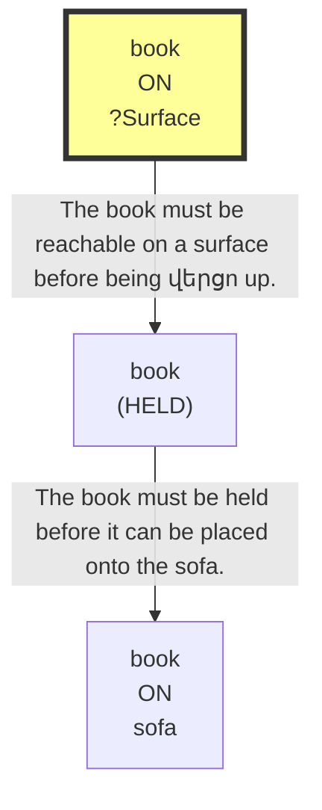
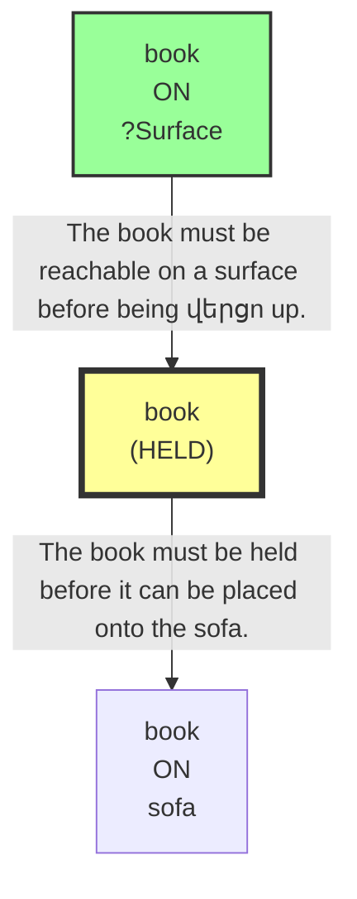
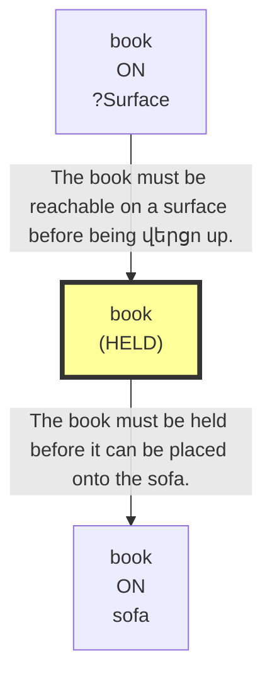
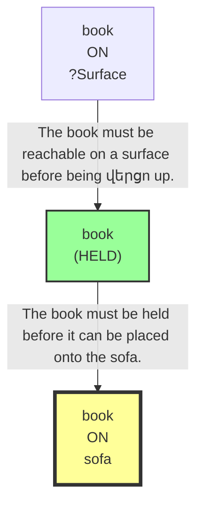

# 🚀 VirtualHome Agent Episode Log


### [GoalReasoner (Module A - Intent)] Output
```json
{
  "is_instruction_obviously_vague": false,
  "clarification_question": null,
  "target_object": "book",
  "location_hint": "sofa",
  "reasoning_chain": [
    {
      "question": "Why does the user want this object?",
      "answer": "To move an unorganized book to the sofa."
    },
    {
      "question": "Why is that important?",
      "answer": "To place the book in the desired resting area and reduce clutter elsewhere."
    },
    {
      "question": "What fundamental need does this fulfill?",
      "answer": "To organize or relocate an item into a preferred location."
    },
    {
      "question": "Are there any deeper psychological or physical motivations?",
      "answer": "It may help maintain tidiness, make the book easier to access, or keep the surrounding area orderly."
    }
  ],
  "deep_intent": "The user wants to organize and relocate an item to a preferred resting place.",
  "acceptable_alternatives_properties": [
    {
      "priority": 1,
      "description": "Other small portable reading materials or similar handheld items that can be placed on the sofa, such as a magazine or notebook."
    },
    {
      "priority": 2,
      "description": "Other household items that are meant to be stored or kept on the sofa temporarily, such as a tablet or remote control."
    },
    {
      "priority": 3,
      "description": "Other clutter items that can be tidied by moving them to a designated seating area or storage spot."
    },
    {
      "priority": 4,
      "description": "Any portable household item that can be relocated to reduce disorganization, even if it is not a reading material."
    }
  ]
}
```

### [PerceptionFilter] Output
```json
{
  "reasoning": "The goal is to move the book onto the sofa. The SDG requires the target object book, the destination sofa, and a reachable surface (?Surface) from which the book can be picked up. From the visible objects, the relevant surface is coffeetable. No additional tools are needed.",
  "selected_classes": [
    "book",
    "coffeetable",
    "character",
    "sofa"
  ],
  "raw_class_count": 27
}
```

### [LLMExecutor] Output
```json
{
  "reasoning": "The goal is to place a book on the sofa. The only book already reachable and close to the character is book(105) on the coffeetable. Since the book must be held before it can be placed on the sofa, the next atomic step is to pick it up. I am not yet at the sofa, so I should not attempt placement now.",
  "satisfied_nodes": [],
  "current_node_focus": "N3",
  "mapped_variables": {},
  "action": "[grab] <book> (105)"
}
```

### [RoboStateMultiTaskController] Output
```json
{
  "action": "[grab] <book> (105)",
  "active_task_id": "task_1",
  "task_context": {
    "active_task_id": "task_1",
    "pending_task_ids": [],
    "satisfied_task_ids": []
  },
  "source": "llm_executor"
}
```
## Step 0
- **Action**: `[grab] <book> (105)`
- **Action Success**: `False`
- **Action Message**: temporary_unavailable: target disappeared; wait or search and retry
- **Active Task**: `task_1`
- **Decision Source**: `llm_executor`
- **Task Progress**: E1_03=pending
- **SDG Status**:

- **Observed Items (11)**: sofa(214), coffeetable(215), book(229) [CLOSED], book(230) [CLOSED], book(105) [CLOSED], character(1), kitchen(11), livingroom(183), bedroom(241), bathroom(285), bedroom(346)


### [PerceptionFilter] Output
```json
{
  "reasoning": "Reused cached class selection.",
  "selected_classes": [
    "book",
    "coffeetable",
    "character",
    "sofa"
  ],
  "raw_class_count": 27
}
```

### [LLMExecutor] Output
```json
{
  "reasoning": "The previous attempt to grab book(105) failed because it temporarily disappeared, but it is now visible again on the coffeetable and is close to the character. Since the task is to place a book on the sofa, the next required step is to get near the exact book instance before grabbing it. The sofa is visible as the target surface, but we are not yet holding the book, so we must first walk to the book(105) and then grab it in a later step.",
  "satisfied_nodes": [],
  "current_node_focus": "N3",
  "mapped_variables": {},
  "action": "[walk] <book> (105)"
}
```

### [RoboStateMultiTaskController] Output
```json
{
  "action": "[walk] <book> (105)",
  "active_task_id": "task_1",
  "task_context": {
    "active_task_id": "task_1",
    "pending_task_ids": [],
    "satisfied_task_ids": []
  },
  "source": "llm_executor"
}
```
## Step 1
- **Action**: `[walk] <book> (105)`
- **Action Success**: `False`
- **Action Message**: temporary_unavailable: target is temporarily hidden
- **Active Task**: `task_1`
- **Decision Source**: `llm_executor`
- **Task Progress**: E1_03=pending
- **SDG Status**:

- **Observed Items (11)**: sofa(214), coffeetable(215), book(229) [CLOSED], book(230) [CLOSED], book(105) [CLOSED], character(1), kitchen(11), livingroom(183), bedroom(241), bathroom(285), bedroom(346)


### [RoboStateMultiTaskController] Output
```json
{
  "action": "[walk] <kitchen> (11)",
  "active_task_id": null,
  "task_context": {
    "active_task_id": null,
    "pending_task_ids": [
      "task_1"
    ],
    "satisfied_task_ids": []
  },
  "source": "loop_recovery_room_revisit"
}
```
## Step 2
- **Action**: `[walk] <kitchen> (11)`
- **Action Success**: `True`
- **Action Message**: {'0': {'message': 'Success'}}
- **Decision Source**: `loop_recovery_room_revisit`
- **Task Progress**: E1_03=pending
- **SDG Status**:
No SDG active.
- **Observed Items (59)**: floor(184), floor(185), floor(186), floor(187), floor(188), floor(189), wall(190), wall(191), wall(192), wall(193), wall(194), wall(195), ceiling(196), ceiling(197), ceiling(198)...


### [PerceptionFilter] Output
```json
{
  "reasoning": "The goal is to move a book onto the sofa. Required classes are the target object book and the destination sofa. The SDG also implies the book starts on some surface and must be held first, but no specific extra tool or receptacle is required from the visible objects beyond the book and sofa.",
  "selected_classes": [
    "book",
    "character",
    "sofa"
  ],
  "raw_class_count": 59
}
```

### [LLMExecutor] Output
```json
{
  "reasoning": "The previous target book(105) was temporarily unavailable, and the graph now shows book(105) again, but the character is in the kitchen while the book is in the living room. To satisfy the prerequisite that the book be held before placing it on the sofa, the next atomic step is to walk to the current target book instance. The sofa target is available in the living room, and no other task is active.",
  "satisfied_nodes": [],
  "current_node_focus": "N3",
  "mapped_variables": {},
  "action": "[walk] <book> (105)"
}
```

### [RoboStateMultiTaskController] Output
```json
{
  "action": "[walk] <book> (105)",
  "active_task_id": "task_1",
  "task_context": {
    "active_task_id": "task_1",
    "pending_task_ids": [],
    "satisfied_task_ids": []
  },
  "source": "llm_executor"
}
```
## Step 3
- **Action**: `[walk] <book> (105)`
- **Action Success**: `False`
- **Action Message**: temporary_unavailable: target is temporarily hidden
- **Active Task**: `task_1`
- **Decision Source**: `llm_executor`
- **Task Progress**: E1_03=pending
- **SDG Status**:

- **Observed Items (10)**: sofa(214), book(229) [CLOSED], book(230) [CLOSED], book(105) [CLOSED], character(1), kitchen(11), livingroom(183), bedroom(241), bathroom(285), bedroom(346)


### [RoboStateMultiTaskController] Output
```json
{
  "action": "[walk] <bedroom> (241)",
  "active_task_id": null,
  "task_context": {
    "active_task_id": null,
    "pending_task_ids": [
      "task_1"
    ],
    "satisfied_task_ids": []
  },
  "source": "loop_recovery_room_revisit"
}
```
## Step 4
- **Action**: `[walk] <bedroom> (241)`
- **Action Success**: `True`
- **Action Message**: {'0': {'message': 'Success'}}
- **Decision Source**: `loop_recovery_room_revisit`
- **Task Progress**: E1_03=pending
- **SDG Status**:
No SDG active.
- **Observed Items (212)**: floor(184), floor(185), floor(186), floor(187), floor(188), floor(189), wall(190), wall(191), wall(192), wall(193), wall(194), wall(195), ceiling(196), ceiling(197), ceiling(198)...


### [PerceptionFilter] Output
```json
{
  "reasoning": "The goal is to move the book onto the sofa. The SDG requires the book itself, the destination sofa, and a reachable surface to վերց/hold the book from before placing it. No other tools or locations are necessary.",
  "selected_classes": [
    "book",
    "table",
    "character",
    "sofa"
  ],
  "raw_class_count": 65
}
```

### [LLMExecutor] Output
```json
{
  "reasoning": "The previous book(105) was temporarily unavailable, but the current graph now shows it nearby in the bedroom and close to the character. The goal requires the book to end up on the sofa. Since N3 is the prerequisite state of the book being on some reachable surface before it can be held, the next logical step is to move adjacent to the book so it can be grabbed next. Because I just walked to the bedroom and should not repeat the same walk action, the best next move is to approach the specific target book object for a future grab.",
  "satisfied_nodes": [],
  "current_node_focus": "N3",
  "mapped_variables": {},
  "action": "[walk] <book> (105)"
}
```

### [RoboStateMultiTaskController] Output
```json
{
  "action": "[walk] <book> (105)",
  "active_task_id": "task_1",
  "task_context": {
    "active_task_id": "task_1",
    "pending_task_ids": [],
    "satisfied_task_ids": []
  },
  "source": "llm_executor"
}
```
## Step 5
- **Action**: `[walk] <book> (105)`
- **Action Success**: `True`
- **Action Message**: {'0': {'message': 'Success'}}
- **Active Task**: `task_1`
- **Decision Source**: `llm_executor`
- **Task Progress**: E1_03=pending
- **SDG Status**:

- **Observed Items (11)**: sofa(214), book(229) [CLOSED], book(230) [CLOSED], book(105) [CLOSED], character(1), kitchen(11), livingroom(183), bedroom(241), bathroom(285), bedroom(346), book(275) [CLOSED]


### [PerceptionFilter] Output
```json
{
  "reasoning": "Reused cached class selection.",
  "selected_classes": [
    "book",
    "table",
    "character",
    "sofa"
  ],
  "raw_class_count": 65
}
```

### [LLMExecutor] Output
```json
{
  "reasoning": "The goal is to place a book on the sofa. The SDG requires first holding a book (N2) before the final on-sofa relation (N1). The previously tracked book(105) is now close to the character in the living room, so it is the best candidate to grab next. No hands are currently shown occupied, and the sofa is already nearby, but grabbing must happen before placing. This action advances toward satisfying N2.",
  "satisfied_nodes": [
    "N3"
  ],
  "current_node_focus": "N2",
  "mapped_variables": {},
  "action": "[grab] <book> (105)"
}
```

### [RoboStateMultiTaskController] Output
```json
{
  "action": "[grab] <book> (105)",
  "active_task_id": "task_1",
  "task_context": {
    "active_task_id": "task_1",
    "pending_task_ids": [],
    "satisfied_task_ids": []
  },
  "source": "llm_executor"
}
```
## Step 6
- **Action**: `[grab] <book> (105)`
- **Action Success**: `False`
- **Action Message**: temporary_unavailable: target disappeared; wait or search and retry
- **Active Task**: `task_1`
- **Decision Source**: `llm_executor`
- **Task Progress**: E1_03=pending
- **SDG Status**:

- **Observed Items (11)**: sofa(214), book(229) [CLOSED], book(230) [CLOSED], book(105) [CLOSED], character(1), kitchen(11), livingroom(183), bedroom(241), bathroom(285), bedroom(346), book(275) [CLOSED]


### [PerceptionFilter] Output
```json
{
  "reasoning": "Reused cached class selection.",
  "selected_classes": [
    "book",
    "table",
    "character",
    "sofa"
  ],
  "raw_class_count": 65
}
```

### [LLMExecutor] Output
```json
{
  "reasoning": "The goal is to place a book on the sofa. The sofa is already close to the character, and the filtered graph shows book(105) is close to the character in the living room, but the previous grab attempt failed because it temporarily disappeared. Per the temporary-unavailable rule, the correct next step is to wait for it to reappear rather than changing targets. This should preserve progress toward satisfying N3 -> N2 -> N1.",
  "satisfied_nodes": [
    "N3"
  ],
  "current_node_focus": "N2",
  "mapped_variables": {},
  "action": "[wait]"
}
```

### [RoboStateMultiTaskController] Output
```json
{
  "action": "[wait]",
  "active_task_id": "task_1",
  "task_context": {
    "active_task_id": "task_1",
    "pending_task_ids": [],
    "satisfied_task_ids": []
  },
  "source": "llm_executor"
}
```
## Step 7
- **Action**: `[wait]`
- **Action Success**: `True`
- **Action Message**: Time passes. You waited for a while.
- **Active Task**: `task_1`
- **Decision Source**: `llm_executor`
- **Task Progress**: E1_03=pending
- **SDG Status**:

- **Observed Items (11)**: sofa(214), book(229) [CLOSED], book(230) [CLOSED], book(105) [CLOSED], character(1), kitchen(11), livingroom(183), bedroom(241), bathroom(285), bedroom(346), book(275) [CLOSED]


### [PerceptionFilter] Output
```json
{
  "reasoning": "Reused cached class selection.",
  "selected_classes": [
    "book",
    "table",
    "character",
    "sofa"
  ],
  "raw_class_count": 65
}
```

### [LLMExecutor] Output
```json
{
  "reasoning": "The goal is to place a book on the sofa. The book(105) is currently close to the character in the living room, and we are already close to the sofa(214). The previous grab failed because the book temporarily disappeared, but it is now visible again and near us. Since grabbing requires being near the object and we already walked to it previously, the next needed step is to try grabbing the same book again so we can then place it on the sofa.",
  "satisfied_nodes": [],
  "current_node_focus": "N2",
  "mapped_variables": {},
  "action": "[grab] <book> (105)"
}
```

### [RoboStateMultiTaskController] Output
```json
{
  "action": "[grab] <book> (105)",
  "active_task_id": "task_1",
  "task_context": {
    "active_task_id": "task_1",
    "pending_task_ids": [],
    "satisfied_task_ids": []
  },
  "source": "llm_executor"
}
```
## Step 8
- **Action**: `[grab] <book> (105)`
- **Action Success**: `False`
- **Action Message**: temporary_unavailable: target is temporarily hidden
- **Active Task**: `task_1`
- **Decision Source**: `llm_executor`
- **Task Progress**: E1_03=pending
- **SDG Status**:

- **Observed Items (11)**: sofa(214), book(229) [CLOSED], book(230) [CLOSED], book(105) [CLOSED], character(1), kitchen(11), livingroom(183), bedroom(241), bathroom(285), bedroom(346), book(275) [CLOSED]


### [PerceptionFilter] Output
```json
{
  "reasoning": "Reused cached class selection.",
  "selected_classes": [
    "book",
    "table",
    "character",
    "sofa"
  ],
  "raw_class_count": 65
}
```

### [LLMExecutor] Output
```json
{
  "reasoning": "The original book(105) has been temporarily unavailable repeatedly, and the filtered graph now shows multiple candidate books in the living room. To continue autonomously, I should use memory alignment and pick a nearby reachable substitute that matches the target object's class. book(229) is in the living room and is currently not being manipulated, so the next step toward satisfying the HOLD prerequisite is to walk to it before attempting a grab. I will not repeat a walk to the same object I just walked to previously; the last successful walk was to book(105), which is no longer a viable target.",
  "satisfied_nodes": [],
  "current_node_focus": "N3",
  "mapped_variables": {},
  "action": "[walk] <book> (229)"
}
```

### [RoboStateMultiTaskController] Output
```json
{
  "action": "[walk] <book> (229)",
  "active_task_id": "task_1",
  "task_context": {
    "active_task_id": "task_1",
    "pending_task_ids": [],
    "satisfied_task_ids": []
  },
  "source": "llm_executor"
}
```
## Step 9
- **Action**: `[walk] <book> (229)`
- **Action Success**: `True`
- **Action Message**: {'0': {'message': 'Success'}}
- **Active Task**: `task_1`
- **Decision Source**: `llm_executor`
- **Task Progress**: E1_03=pending
- **SDG Status**:

- **Observed Items (11)**: sofa(214), book(229) [CLOSED], book(230) [CLOSED], book(105) [CLOSED], character(1), kitchen(11), livingroom(183), bedroom(241), bathroom(285), bedroom(346), book(275) [CLOSED]


### [PerceptionFilter] Output
```json
{
  "reasoning": "Reused cached class selection.",
  "selected_classes": [
    "book",
    "table",
    "character",
    "sofa"
  ],
  "raw_class_count": 65
}
```

### [LLMExecutor] Output
```json
{
  "reasoning": "The current best candidate for the task is book(229), which is already close to the character in the living room. The SDG requires the book to be held before it can be placed on the sofa. Since we are not yet holding it and we just walked to it, the next atomic step is to grab it. This advances toward N2 while preserving the target of placing the book on sofa(214).",
  "satisfied_nodes": [
    "N3"
  ],
  "current_node_focus": "N2",
  "mapped_variables": {},
  "action": "[grab] <book> (229)"
}
```

### [RoboStateMultiTaskController] Output
```json
{
  "action": "[grab] <book> (229)",
  "active_task_id": "task_1",
  "task_context": {
    "active_task_id": "task_1",
    "pending_task_ids": [],
    "satisfied_task_ids": []
  },
  "source": "llm_executor"
}
```
## Step 10
- **Action**: `[grab] <book> (229)`
- **Action Success**: `True`
- **Action Message**: {'0': {'message': 'Success'}}
- **Active Task**: `task_1`
- **Decision Source**: `llm_executor`
- **Task Progress**: E1_03=pending
- **SDG Status**:

- **Observed Items (11)**: sofa(214), book(229) [CLOSED], book(230) [CLOSED], book(105) [CLOSED], character(1), kitchen(11), livingroom(183), bedroom(241), bathroom(285), bedroom(346), book(275) [CLOSED]


### [PerceptionFilter] Output
```json
{
  "reasoning": "Reused cached class selection.",
  "selected_classes": [
    "book",
    "table",
    "character",
    "sofa"
  ],
  "raw_class_count": 65
}
```

### [LLMExecutor] Output
```json
{
  "reasoning": "The active goal is to place a book on the sofa. The current graph shows I am already holding book(229), and the sofa(214) is the correct target surface in the living room. The next required step is to move to the sofa before placing the held book onto it. N2 (book held) is satisfied; N1 is the current focus. I will not repeat a walk to the book because the book is already in hand.",
  "satisfied_nodes": [
    "N2"
  ],
  "current_node_focus": "N1",
  "mapped_variables": {},
  "action": "[walk] <sofa> (214)"
}
```

### [RoboStateMultiTaskController] Output
```json
{
  "action": "[walk] <sofa> (214)",
  "active_task_id": "task_1",
  "task_context": {
    "active_task_id": "task_1",
    "pending_task_ids": [],
    "satisfied_task_ids": []
  },
  "source": "llm_executor"
}
```
## Step 11
- **Action**: `[walk] <sofa> (214)`
- **Action Success**: `True`
- **Action Message**: {'0': {'message': 'Success'}}
- **Active Task**: `task_1`
- **Decision Source**: `llm_executor`
- **Task Progress**: E1_03=pending
- **SDG Status**:

- **Observed Items (11)**: sofa(214), book(229) [CLOSED], book(230) [CLOSED], book(105) [CLOSED], character(1), kitchen(11), livingroom(183), bedroom(241), bathroom(285), bedroom(346), book(275) [CLOSED]


### [PerceptionFilter] Output
```json
{
  "reasoning": "Reused cached class selection.",
  "selected_classes": [
    "book",
    "table",
    "character",
    "sofa"
  ],
  "raw_class_count": 65
}
```

### [LLMExecutor] Output
```json
{
  "reasoning": "The book is already held in the right hand (book(229)), and we are already close to the sofa(214). The next step toward satisfying N1 is to place the held book onto the sofa surface. Since putback requires being near the target surface and the proximity condition is already met, I can directly perform the placement.",
  "satisfied_nodes": [
    "N2"
  ],
  "current_node_focus": "N1",
  "mapped_variables": {},
  "action": "[putback] <book> (229) <sofa> (214)"
}
```

### [RoboStateMultiTaskController] Output
```json
{
  "action": "[putback] <book> (229) <sofa> (214)",
  "active_task_id": "task_1",
  "task_context": {
    "active_task_id": "task_1",
    "pending_task_ids": [],
    "satisfied_task_ids": []
  },
  "source": "llm_executor"
}
```
## Step 12
- **Action**: `[putback] <book> (229) <sofa> (214)`
- **Action Success**: `True`
- **Action Message**: {'0': {'message': 'Success'}}
- **Active Task**: `task_1`
- **Decision Source**: `llm_executor`
- **Task Progress**: E1_03=done
- **SDG Status**:

- **Observed Items (11)**: sofa(214), book(229) [CLOSED], book(230) [CLOSED], book(105) [CLOSED], character(1), kitchen(11), livingroom(183), bedroom(241), bathroom(285), bedroom(346), book(275) [CLOSED]

