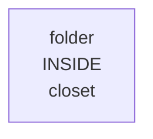
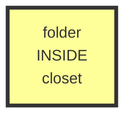

# 🚀 VirtualHome Agent Episode Log


### [GoalReasoner (Module A - Intent)] Output
```json
{
  "is_instruction_obviously_vague": false,
  "clarification_question": null,
  "target_object": "folder",
  "location_hint": "closet",
  "reasoning_chain": [
    {
      "question": "Why does the user want this object?",
      "answer": "They want the folder stored away in a designated place."
    },
    {
      "question": "Why is that important?",
      "answer": "It likely helps organize the space or keep the folder from being left out."
    },
    {
      "question": "What fundamental need does this fulfill?",
      "answer": "It fulfills a need for organization and proper storage of an item."
    },
    {
      "question": "Are there any deeper psychological or physical motivations?",
      "answer": "The user may be aiming to reduce clutter, protect the folder, or make the area easier to manage."
    }
  ],
  "deep_intent": "The user wants to organize and store an item in a designated enclosed storage space.",
  "acceptable_alternatives_properties": [
    {
      "priority": 1,
      "description": "Other paper documents or files that can be stored in the same enclosed storage area"
    },
    {
      "priority": 2,
      "description": "Similar office or school paper items, such as notebooks or binders, that are commonly kept with documents"
    },
    {
      "priority": 3,
      "description": "Small flat household items that can be neatly stored away to reduce clutter"
    },
    {
      "priority": 4,
      "description": "Any manageable item that serves the same purpose of decluttering and organized storage"
    }
  ]
}
```

### [RoboStateMultiTaskController] Output
```json
{
  "action": "[walk] <kitchen> (11)",
  "active_task_id": "task_1",
  "task_context": {
    "active_task_id": "task_1",
    "pending_task_ids": [],
    "satisfied_task_ids": []
  },
  "source": "room_frontier"
}
```
## Step 0
- **Action**: `[walk] <kitchen> (11)`
- **Action Success**: `True`
- **Action Message**: {'0': {'message': 'Success'}}
- **Active Task**: `task_1`
- **Decision Source**: `room_frontier`
- **Task Progress**: E1_15=pending
- **SDG Status**:

- **Observed Items (39)**: floor(242), floor(243), floor(244), floor(245), ceiling(246), ceiling(247), ceiling(248), ceiling(249), wall(250), wall(251), wall(252), wall(253), door(254) [OPEN], ceilinglamp(255), tablelamp(256) [ON]...


### [RoboStateMultiTaskController] Output
```json
{
  "action": "[walk] <livingroom> (183)",
  "active_task_id": "task_1",
  "task_context": {
    "active_task_id": "task_1",
    "pending_task_ids": [],
    "satisfied_task_ids": []
  },
  "source": "room_frontier"
}
```
## Step 1
- **Action**: `[walk] <livingroom> (183)`
- **Action Success**: `True`
- **Action Message**: {'0': {'message': 'Success'}}
- **Active Task**: `task_1`
- **Decision Source**: `room_frontier`
- **Task Progress**: E1_15=pending
- **SDG Status**:

- **Observed Items (192)**: floor(242), floor(243), floor(244), floor(245), ceiling(246), ceiling(247), ceiling(248), ceiling(249), wall(250), wall(251), wall(252), wall(253), door(254) [OPEN], ceilinglamp(255), tablelamp(256) [ON]...


### [RoboStateMultiTaskController] Output
```json
{
  "action": "[walk] <bathroom> (285)",
  "active_task_id": "task_1",
  "task_context": {
    "active_task_id": "task_1",
    "pending_task_ids": [],
    "satisfied_task_ids": []
  },
  "source": "room_frontier"
}
```
## Step 2
- **Action**: `[walk] <bathroom> (285)`
- **Action Success**: `True`
- **Action Message**: {'0': {'message': 'Success'}}
- **Active Task**: `task_1`
- **Decision Source**: `room_frontier`
- **Task Progress**: E1_15=pending
- **SDG Status**:

- **Observed Items (244)**: floor(242), floor(243), floor(244), floor(245), ceiling(246), ceiling(247), ceiling(248), ceiling(249), wall(250), wall(251), wall(252), wall(253), door(254) [OPEN], ceilinglamp(255), tablelamp(256) [ON]...


### [RoboStateMultiTaskController] Output
```json
{
  "action": "[walk] <bedroom> (346)",
  "active_task_id": "task_1",
  "task_context": {
    "active_task_id": "task_1",
    "pending_task_ids": [],
    "satisfied_task_ids": []
  },
  "source": "room_frontier"
}
```
## Step 3
- **Action**: `[walk] <bedroom> (346)`
- **Action Success**: `True`
- **Action Message**: {'0': {'message': 'Success'}}
- **Active Task**: `task_1`
- **Decision Source**: `room_frontier`
- **Task Progress**: E1_15=pending
- **SDG Status**:

- **Observed Items (304)**: floor(242), floor(243), floor(244), floor(245), ceiling(246), ceiling(247), ceiling(248), ceiling(249), wall(250), wall(251), wall(252), wall(253), door(254) [OPEN], ceilinglamp(255), tablelamp(256) [ON]...


### [PerceptionFilter] Output
```json
{
  "reasoning": "The goal is to store the folder in the closet. Only the target object and the destination storage location are needed; no tools or alternatives are required for this simple placement task.",
  "selected_classes": [
    "book",
    "closet",
    "folder",
    "character"
  ],
  "raw_class_count": 91
}
```

### [LLMExecutor] Output
```json
{
  "reasoning": "The goal is to have a folder inside the closet. We are currently in bedroom(346), and the closet(395) is already OPEN and in the same room, so the next required step is to move to the closet before any put action. There are multiple folders in bedroom(241), but no folder is currently near or held. The filtered graph shows folder(276), folder(277), and folder(121) as valid folder instances; I will proceed toward the closet first, then later retrieve a folder and place it inside.",
  "satisfied_nodes": [],
  "current_node_focus": "N1",
  "mapped_variables": {},
  "action": "[walk] <closet> (395)"
}
```

### [RoboStateMultiTaskController] Output
```json
{
  "action": "[walk] <closet> (395)",
  "active_task_id": "task_1",
  "task_context": {
    "active_task_id": "task_1",
    "pending_task_ids": [],
    "satisfied_task_ids": []
  },
  "source": "llm_executor"
}
```
## Step 4
- **Action**: `[walk] <closet> (395)`
- **Action Success**: `True`
- **Action Message**: {'0': {'message': 'Success'}}
- **Active Task**: `task_1`
- **Decision Source**: `llm_executor`
- **Task Progress**: E1_15=pending
- **SDG Status**:

- **Observed Items (13)**: book(275) [CLOSED], folder(276) [CLOSED], folder(277) [CLOSED], folder(121) [CLOSED], character(1), kitchen(11), livingroom(183), bedroom(241), bathroom(285), bedroom(346), book(229) [CLOSED], book(230) [CLOSED], closet(395) [OPEN]


### [PerceptionFilter] Output
```json
{
  "reasoning": "Reused cached class selection.",
  "selected_classes": [
    "book",
    "closet",
    "folder",
    "character"
  ],
  "raw_class_count": 91
}
```

### [LLMExecutor] Output
```json
{
  "reasoning": "The closet is already open and the character is close to it, but the folder to store is not yet selected from the current room state. Since the SDG requires any folder inside the closet, the next step is to move to the specific folder so it can be grabbed before being placed inside the closet. Among the observed folders, folder(276) is a valid grabbable candidate in the bedroom and matches the target object class.",
  "satisfied_nodes": [],
  "current_node_focus": "N1",
  "mapped_variables": {
    "?Container": "closet(395)"
  },
  "action": "[walk] <folder> (276)"
}
```

### [RoboStateMultiTaskController] Output
```json
{
  "action": "[walk] <folder> (276)",
  "active_task_id": "task_1",
  "task_context": {
    "active_task_id": "task_1",
    "pending_task_ids": [],
    "satisfied_task_ids": []
  },
  "source": "llm_executor"
}
```
## Step 5
- **Action**: `[walk] <folder> (276)`
- **Action Success**: `True`
- **Action Message**: {'0': {'message': 'Success'}}
- **Active Task**: `task_1`
- **Decision Source**: `llm_executor`
- **Task Progress**: E1_15=pending
- **SDG Status**:

- **Observed Items (13)**: book(275) [CLOSED], folder(276) [CLOSED], folder(277) [CLOSED], folder(121) [CLOSED], character(1), kitchen(11), livingroom(183), bedroom(241), bathroom(285), bedroom(346), book(229) [CLOSED], book(230) [CLOSED], closet(395) [OPEN]


### [PerceptionFilter] Output
```json
{
  "reasoning": "Reused cached class selection.",
  "selected_classes": [
    "book",
    "closet",
    "folder",
    "character"
  ],
  "raw_class_count": 91
}
```

### [LLMExecutor] Output
```json
{
  "reasoning": "The goal is to place a folder inside the closet. The closet(395) is already open and the character is close to it, but the folder target is ambiguous because there are three folders present. Since no specific folder ID is given, the best available choice is to continue with the nearest clearly visible folder that is close to the character and can be stored in the closet. Before any put-in action, I must be holding the folder and be near the destination; however, I am not yet holding any folder. The most immediate next atomic step is to grab one folder after having walked to it previously; since the last action already walked to folder(276), the next valid step is to grab it.",
  "satisfied_nodes": [],
  "current_node_focus": "N1",
  "mapped_variables": {
    "?Container": "closet(395)"
  },
  "action": "[grab] <folder> (276)"
}
```

### [RoboStateMultiTaskController] Output
```json
{
  "action": "[grab] <folder> (276)",
  "active_task_id": "task_1",
  "task_context": {
    "active_task_id": "task_1",
    "pending_task_ids": [],
    "satisfied_task_ids": []
  },
  "source": "llm_executor"
}
```
## Step 6
- **Action**: `[grab] <folder> (276)`
- **Action Success**: `True`
- **Action Message**: {'0': {'message': 'Success'}}
- **Active Task**: `task_1`
- **Decision Source**: `llm_executor`
- **Task Progress**: E1_15=pending
- **SDG Status**:

- **Observed Items (13)**: book(275) [CLOSED], folder(276) [CLOSED], folder(277) [CLOSED], folder(121) [CLOSED], character(1), kitchen(11), livingroom(183), bedroom(241), bathroom(285), bedroom(346), book(229) [CLOSED], book(230) [CLOSED], closet(395) [OPEN]


### [PerceptionFilter] Output
```json
{
  "reasoning": "Reused cached class selection.",
  "selected_classes": [
    "book",
    "closet",
    "folder",
    "character"
  ],
  "raw_class_count": 91
}
```

### [LLMExecutor] Output
```json
{
  "reasoning": "The folder target is already in my right hand and I am currently close to the closet, which is open. The remaining SDG gap is to place folder(276) inside closet(395). To satisfy the destination-placement rule, I must explicitly walk to the closet before using putin.",
  "satisfied_nodes": [],
  "current_node_focus": "N1",
  "mapped_variables": {
    "?Container": "closet(395)"
  },
  "action": "[walk] <closet> (395)"
}
```

### [RoboStateMultiTaskController] Output
```json
{
  "action": "[walk] <closet> (395)",
  "active_task_id": "task_1",
  "task_context": {
    "active_task_id": "task_1",
    "pending_task_ids": [],
    "satisfied_task_ids": []
  },
  "source": "llm_executor"
}
```
## Step 7
- **Action**: `[walk] <closet> (395)`
- **Action Success**: `True`
- **Action Message**: {'0': {'message': 'Success'}}
- **Active Task**: `task_1`
- **Decision Source**: `llm_executor`
- **Task Progress**: E1_15=pending
- **SDG Status**:

- **Observed Items (13)**: book(275) [CLOSED], folder(276) [CLOSED], folder(277) [CLOSED], folder(121) [CLOSED], character(1), kitchen(11), livingroom(183), bedroom(241), bathroom(285), bedroom(346), book(229) [CLOSED], book(230) [CLOSED], closet(395) [OPEN]


### [PerceptionFilter] Output
```json
{
  "reasoning": "Reused cached class selection.",
  "selected_classes": [
    "book",
    "closet",
    "folder",
    "character"
  ],
  "raw_class_count": 91
}
```

### [LLMExecutor] Output
```json
{
  "reasoning": "The closet(395) is already open and the robot is close to it. The target folder(276) is currently held in the right hand, so the only remaining step to satisfy N1 is to place the folder inside the closet. Because the closet is a container and the folder is held, the correct next atomic action is to put it in the closet.",
  "satisfied_nodes": [],
  "current_node_focus": "N1",
  "mapped_variables": {
    "?Container": "closet(395)"
  },
  "action": "[putin] <folder> (276) <closet> (395)"
}
```

### [RoboStateMultiTaskController] Output
```json
{
  "action": "[putin] <folder> (276) <closet> (395)",
  "active_task_id": "task_1",
  "task_context": {
    "active_task_id": "task_1",
    "pending_task_ids": [],
    "satisfied_task_ids": []
  },
  "source": "llm_executor"
}
```
## Step 8
- **Action**: `[putin] <folder> (276) <closet> (395)`
- **Action Success**: `True`
- **Action Message**: {'0': {'message': 'Success'}}
- **Active Task**: `task_1`
- **Decision Source**: `llm_executor`
- **Task Progress**: E1_15=done
- **SDG Status**:

- **Observed Items (13)**: book(275) [CLOSED], folder(276) [CLOSED], folder(277) [CLOSED], folder(121) [CLOSED], character(1), kitchen(11), livingroom(183), bedroom(241), bathroom(285), bedroom(346), book(229) [CLOSED], book(230) [CLOSED], closet(395) [OPEN]

