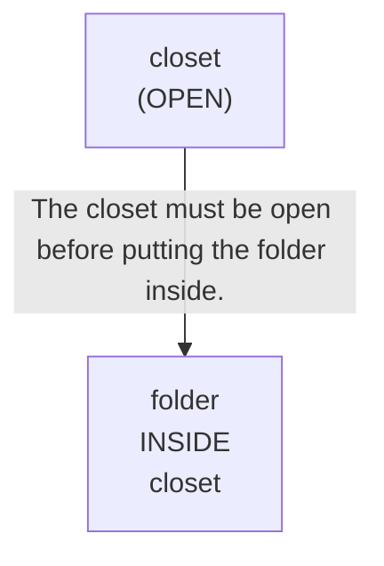
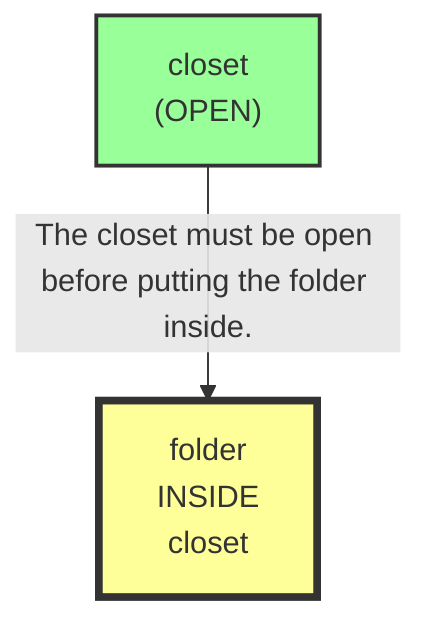

# 🚀 VirtualHome Agent Episode Log


### [GoalReasoner (Module A - Intent)] Output
```json
{
  "is_instruction_obviously_vague": false,
  "clarification_question": null,
  "target_object": "folder",
  "location_hint": "closet",
  "reasoning_chain": [
    {
      "question": "Why does the user want this object placed there?",
      "answer": "To put the folder away in a storage location."
    },
    {
      "question": "Why is that important?",
      "answer": "To organize or clear the current area and keep the folder stored properly."
    },
    {
      "question": "What fundamental need does this fulfill?",
      "answer": "The user wants to organize stored documents or belongings."
    },
    {
      "question": "Are there any deeper psychological or physical motivations?",
      "answer": "It may reduce clutter, make the space tidier, or keep the folder accessible in a designated place."
    }
  ],
  "deep_intent": "The user wants to organize and store an item in a designated indoor storage location.",
  "acceptable_alternatives_properties": [
    {
      "priority": 1,
      "description": "Other document or paper storage items, such as a binder, file, or paperwork"
    },
    {
      "priority": 2,
      "description": "Other small flat office supplies that can be stored away, such as notebooks or envelopes"
    },
    {
      "priority": 3,
      "description": "Other household items meant for organized storage, such as boxes or organizers"
    },
    {
      "priority": 4,
      "description": "Any portable object that can be put away to reduce clutter"
    }
  ]
}
```

### [RoboStateMultiTaskController] Output
```json
{
  "action": "[walk] <kitchen> (11)",
  "active_task_id": "task_1",
  "task_context": {
    "active_task_id": "task_1",
    "pending_task_ids": [],
    "satisfied_task_ids": []
  },
  "source": "room_frontier"
}
```
## Step 0
- **Action**: `[walk] <kitchen> (11)`
- **Action Success**: `True`
- **Action Message**: {'0': {'message': 'Success'}}
- **Active Task**: `task_1`
- **Decision Source**: `room_frontier`
- **Task Progress**: E1_15=pending
- **SDG Status**:

- **Observed Items (39)**: floor(242), floor(243), floor(244), floor(245), ceiling(246), ceiling(247), ceiling(248), ceiling(249), wall(250), wall(251), wall(252), wall(253), door(254) [OPEN], ceilinglamp(255), tablelamp(256) [ON]...


### [RoboStateMultiTaskController] Output
```json
{
  "action": "[walk] <livingroom> (183)",
  "active_task_id": "task_1",
  "task_context": {
    "active_task_id": "task_1",
    "pending_task_ids": [],
    "satisfied_task_ids": []
  },
  "source": "room_frontier"
}
```
## Step 1
- **Action**: `[walk] <livingroom> (183)`
- **Action Success**: `True`
- **Action Message**: {'0': {'message': 'Success'}}
- **Active Task**: `task_1`
- **Decision Source**: `room_frontier`
- **Task Progress**: E1_15=pending
- **SDG Status**:

- **Observed Items (192)**: floor(242), floor(243), floor(244), floor(245), ceiling(246), ceiling(247), ceiling(248), ceiling(249), wall(250), wall(251), wall(252), wall(253), door(254) [OPEN], ceilinglamp(255), tablelamp(256) [ON]...


### [RoboStateMultiTaskController] Output
```json
{
  "action": "[walk] <bathroom> (285)",
  "active_task_id": "task_1",
  "task_context": {
    "active_task_id": "task_1",
    "pending_task_ids": [],
    "satisfied_task_ids": []
  },
  "source": "room_frontier"
}
```
## Step 2
- **Action**: `[walk] <bathroom> (285)`
- **Action Success**: `True`
- **Action Message**: {'0': {'message': 'Success'}}
- **Active Task**: `task_1`
- **Decision Source**: `room_frontier`
- **Task Progress**: E1_15=pending
- **SDG Status**:

- **Observed Items (244)**: floor(242), floor(243), floor(244), floor(245), ceiling(246), ceiling(247), ceiling(248), ceiling(249), wall(250), wall(251), wall(252), wall(253), door(254) [OPEN], ceilinglamp(255), tablelamp(256) [ON]...


### [RoboStateMultiTaskController] Output
```json
{
  "action": "[walk] <bedroom> (346)",
  "active_task_id": "task_1",
  "task_context": {
    "active_task_id": "task_1",
    "pending_task_ids": [],
    "satisfied_task_ids": []
  },
  "source": "room_frontier"
}
```
## Step 3
- **Action**: `[walk] <bedroom> (346)`
- **Action Success**: `True`
- **Action Message**: {'0': {'message': 'Success'}}
- **Active Task**: `task_1`
- **Decision Source**: `room_frontier`
- **Task Progress**: E1_15=pending
- **SDG Status**:

- **Observed Items (304)**: floor(242), floor(243), floor(244), floor(245), ceiling(246), ceiling(247), ceiling(248), ceiling(249), wall(250), wall(251), wall(252), wall(253), door(254) [OPEN], ceilinglamp(255), tablelamp(256) [ON]...


### [PerceptionFilter] Output
```json
{
  "reasoning": "The goal is to place the folder inside the closet, and the SDG requires the closet to be open first. Only the target object and the required storage location/state are needed.",
  "selected_classes": [
    "folder",
    "character",
    "closet",
    "door",
    "book",
    "box"
  ],
  "raw_class_count": 91
}
```

### [LLMExecutor] Output
```json
{
  "reasoning": "The goal requires placing a folder inside the closet, and the closet is already open (N2 satisfied). The remaining gap is to move a suitable folder into the closet. The character is currently in bedroom(346), while the available folders are in bedroom(241), so the first required step is to walk to one of the folder instances before grabbing it. I will target folder(121) as a valid grabbable folder matching the goal.",
  "satisfied_nodes": [
    "N2"
  ],
  "current_node_focus": "N1",
  "mapped_variables": {
    "?Container": "closet(395)"
  },
  "action": "[walk] <folder> (121)"
}
```

### [RoboStateMultiTaskController] Output
```json
{
  "action": "[walk] <folder> (121)",
  "active_task_id": "task_1",
  "task_context": {
    "active_task_id": "task_1",
    "pending_task_ids": [],
    "satisfied_task_ids": []
  },
  "source": "llm_executor"
}
```
## Step 4
- **Action**: `[walk] <folder> (121)`
- **Action Success**: `True`
- **Action Message**: {'0': {'message': 'Success'}}
- **Active Task**: `task_1`
- **Decision Source**: `llm_executor`
- **Task Progress**: E1_15=pending
- **SDG Status**:

- **Observed Items (18)**: door(254) [OPEN], box(270) [CLOSED], book(275) [CLOSED], folder(276) [CLOSED], folder(277) [CLOSED], folder(121) [CLOSED], character(1), kitchen(11), livingroom(183), bedroom(241), bathroom(285), bedroom(346), door(47) [OPEN], book(229) [CLOSED], book(230) [CLOSED]...


### [PerceptionFilter] Output
```json
{
  "reasoning": "Reused cached class selection.",
  "selected_classes": [
    "folder",
    "character",
    "closet",
    "door",
    "book",
    "box"
  ],
  "raw_class_count": 91
}
```

### [LLMExecutor] Output
```json
{
  "reasoning": "The target folder for the active task is folder(121), and the required destination closet is closet(395). The SDG requires the closet to be OPEN, and the current graph already shows closet(395) as OPEN. The folder is currently in the bedroom and we are close to it, but to place it inside the closet we must first walk to the closet before any putin action. This action progresses toward satisfying N1 by positioning me at the destination receptacle.",
  "satisfied_nodes": [
    "N2"
  ],
  "current_node_focus": "N1",
  "mapped_variables": {
    "?Container": "closet(395)"
  },
  "action": "[walk] <closet> (395)"
}
```

### [RoboStateMultiTaskController] Output
```json
{
  "action": "[walk] <closet> (395)",
  "active_task_id": "task_1",
  "task_context": {
    "active_task_id": "task_1",
    "pending_task_ids": [],
    "satisfied_task_ids": []
  },
  "source": "llm_executor"
}
```
## Step 5
- **Action**: `[walk] <closet> (395)`
- **Action Success**: `True`
- **Action Message**: {'0': {'message': 'Success'}}
- **Active Task**: `task_1`
- **Decision Source**: `llm_executor`
- **Task Progress**: E1_15=pending
- **SDG Status**:

- **Observed Items (18)**: door(254) [OPEN], box(270) [CLOSED], book(275) [CLOSED], folder(276) [CLOSED], folder(277) [CLOSED], folder(121) [CLOSED], character(1), kitchen(11), livingroom(183), bedroom(241), bathroom(285), bedroom(346), door(47) [OPEN], book(229) [CLOSED], book(230) [CLOSED]...


### [PerceptionFilter] Output
```json
{
  "reasoning": "Reused cached class selection.",
  "selected_classes": [
    "folder",
    "character",
    "closet",
    "door",
    "book",
    "box"
  ],
  "raw_class_count": 91
}
```

### [LLMExecutor] Output
```json
{
  "reasoning": "The closet needed for the goal is already open, and the character is close to it. The folder object currently aligned with the task is folder(121), which is in the bedroom and available to grab. Since the next required step toward placing it inside the open closet is to pick it up, the single next action is to grab the folder.",
  "satisfied_nodes": [
    "N2"
  ],
  "current_node_focus": "N1",
  "mapped_variables": {
    "?Container": "closet(395)"
  },
  "action": "[grab] <folder> (121)"
}
```

### [RoboStateMultiTaskController] Output
```json
{
  "action": "[grab] <folder> (121)",
  "active_task_id": "task_1",
  "task_context": {
    "active_task_id": "task_1",
    "pending_task_ids": [],
    "satisfied_task_ids": []
  },
  "source": "llm_executor"
}
```
## Step 6
- **Action**: `[grab] <folder> (121)`
- **Action Success**: `False`
- **Action Message**: temporary_unavailable: target disappeared; wait or search and retry
- **Active Task**: `task_1`
- **Decision Source**: `llm_executor`
- **Task Progress**: E1_15=pending
- **SDG Status**:

- **Observed Items (18)**: door(254) [OPEN], box(270) [CLOSED], book(275) [CLOSED], folder(276) [CLOSED], folder(277) [CLOSED], folder(121) [CLOSED], character(1), kitchen(11), livingroom(183), bedroom(241), bathroom(285), bedroom(346), door(47) [OPEN], book(229) [CLOSED], book(230) [CLOSED]...


### [PerceptionFilter] Output
```json
{
  "reasoning": "Reused cached class selection.",
  "selected_classes": [
    "folder",
    "character",
    "closet",
    "door",
    "book",
    "box"
  ],
  "raw_class_count": 91
}
```

### [LLMExecutor] Output
```json
{
  "reasoning": "The closet required by the SDG is already OPEN (closet 395). The previous grab attempt on folder 121 failed because that specific folder temporarily disappeared, but the current graph shows three folder instances available nearby in the bedroom, with folder 276 closest to the character. The next step is to move to a specific available folder so we can retry grabbing it before placing it into the open closet.",
  "satisfied_nodes": [
    "N2"
  ],
  "current_node_focus": "N1",
  "mapped_variables": {
    "?Container": "closet(395)"
  },
  "action": "[walk] <folder> (276)"
}
```

### [RoboStateMultiTaskController] Output
```json
{
  "action": "[walk] <folder> (276)",
  "active_task_id": "task_1",
  "task_context": {
    "active_task_id": "task_1",
    "pending_task_ids": [],
    "satisfied_task_ids": []
  },
  "source": "llm_executor"
}
```
## Step 7
- **Action**: `[walk] <folder> (276)`
- **Action Success**: `True`
- **Action Message**: {'0': {'message': 'Success'}}
- **Active Task**: `task_1`
- **Decision Source**: `llm_executor`
- **Task Progress**: E1_15=pending
- **SDG Status**:

- **Observed Items (18)**: door(254) [OPEN], box(270) [CLOSED], book(275) [CLOSED], folder(276) [CLOSED], folder(277) [CLOSED], folder(121) [CLOSED], character(1), kitchen(11), livingroom(183), bedroom(241), bathroom(285), bedroom(346), door(47) [OPEN], book(229) [CLOSED], book(230) [CLOSED]...


### [PerceptionFilter] Output
```json
{
  "reasoning": "Reused cached class selection.",
  "selected_classes": [
    "folder",
    "character",
    "closet",
    "door",
    "book",
    "box"
  ],
  "raw_class_count": 91
}
```

### [LLMExecutor] Output
```json
{
  "reasoning": "The folder task is to place a folder inside the closet. The closet(395) is already open and the current graph shows the target folder candidates; folder(276) is closest to the character and was just walked to after the previous folder disappeared, so it is the best current binding for ?Folder. Since the next required physical step toward putting it away is to pick it up, I should grab folder(276) now.",
  "satisfied_nodes": [
    "N2"
  ],
  "current_node_focus": "N1",
  "mapped_variables": {
    "?Folder": "folder(276)",
    "?Container": "closet(395)"
  },
  "action": "[grab] <folder> (276)"
}
```

### [RoboStateMultiTaskController] Output
```json
{
  "action": "[grab] <folder> (276)",
  "active_task_id": "task_1",
  "task_context": {
    "active_task_id": "task_1",
    "pending_task_ids": [],
    "satisfied_task_ids": []
  },
  "source": "llm_executor"
}
```
## Step 8
- **Action**: `[grab] <folder> (276)`
- **Action Success**: `False`
- **Action Message**: temporary_unavailable: target disappeared; wait or search and retry
- **Active Task**: `task_1`
- **Decision Source**: `llm_executor`
- **Task Progress**: E1_15=pending
- **SDG Status**:

- **Observed Items (18)**: door(254) [OPEN], box(270) [CLOSED], book(275) [CLOSED], folder(276) [CLOSED], folder(277) [CLOSED], folder(121) [CLOSED], character(1), kitchen(11), livingroom(183), bedroom(241), bathroom(285), bedroom(346), door(47) [OPEN], book(229) [CLOSED], book(230) [CLOSED]...


### [PerceptionFilter] Output
```json
{
  "reasoning": "Reused cached class selection.",
  "selected_classes": [
    "folder",
    "character",
    "closet",
    "door",
    "book",
    "box"
  ],
  "raw_class_count": 91
}
```

### [LLMExecutor] Output
```json
{
  "reasoning": "The closet required by the SDG is already OPEN (N2 satisfied). The remaining gap is to place a folder inside that closet. The previous folder instances at the character's location disappeared when approached, so per the disappearing-object rule I should wait for a temporarily unavailable folder to reappear rather than switching to a different folder or attempting to interact from a distance. However, since the closet is already open and a folder is still present in the graph (folder(276)) but unavailable on grab, the most appropriate next step is to wait in place for the folder to return so it can be grabbed and put inside the open closet.",
  "satisfied_nodes": [
    "N2"
  ],
  "current_node_focus": "N1",
  "mapped_variables": {
    "?Container": "closet(395)"
  },
  "action": "[wait]"
}
```

### [RoboStateMultiTaskController] Output
```json
{
  "action": "[wait]",
  "active_task_id": "task_1",
  "task_context": {
    "active_task_id": "task_1",
    "pending_task_ids": [],
    "satisfied_task_ids": []
  },
  "source": "llm_executor"
}
```
## Step 9
- **Action**: `[wait]`
- **Action Success**: `True`
- **Action Message**: Time passes. You waited for a while.
- **Active Task**: `task_1`
- **Decision Source**: `llm_executor`
- **Task Progress**: E1_15=pending
- **SDG Status**:

- **Observed Items (18)**: door(254) [OPEN], box(270) [CLOSED], book(275) [CLOSED], folder(276) [CLOSED], folder(277) [CLOSED], folder(121) [CLOSED], character(1), kitchen(11), livingroom(183), bedroom(241), bathroom(285), bedroom(346), door(47) [OPEN], book(229) [CLOSED], book(230) [CLOSED]...


### [PerceptionFilter] Output
```json
{
  "reasoning": "Reused cached class selection.",
  "selected_classes": [
    "folder",
    "character",
    "closet",
    "door",
    "book",
    "box"
  ],
  "raw_class_count": 91
}
```

### [LLMExecutor] Output
```json
{
  "reasoning": "The closet target for the SDG is already open (closet(395) has state OPEN), so N2 is satisfied. The folder must be put inside that closet next. The current graph shows three candidate folders in the bedroom; folder(276) is the closest viable target because it is close to the character and was the last attempted folder after the original disappeared. However, I cannot put it in yet because I am not holding it. The single next step must therefore be to walk to folder(276) again so I can retry grabbing it on the following step, since the previous grab attempt failed due to temporary disappearance and the rule says to wait/search and retry. Here, the closet is already open, so the remaining goal is to obtain a folder and place it inside the closet.",
  "satisfied_nodes": [
    "N2"
  ],
  "current_node_focus": "N1",
  "mapped_variables": {
    "?Container": "closet(395)"
  },
  "action": "[walk] <folder> (276)"
}
```

### [RoboStateMultiTaskController] Output
```json
{
  "action": "[walk] <folder> (276)",
  "active_task_id": "task_1",
  "task_context": {
    "active_task_id": "task_1",
    "pending_task_ids": [],
    "satisfied_task_ids": []
  },
  "source": "llm_executor"
}
```
## Step 10
- **Action**: `[walk] <folder> (276)`
- **Action Success**: `False`
- **Action Message**: temporary_unavailable: target is temporarily hidden
- **Active Task**: `task_1`
- **Decision Source**: `llm_executor`
- **Task Progress**: E1_15=pending
- **SDG Status**:

- **Observed Items (18)**: door(254) [OPEN], box(270) [CLOSED], book(275) [CLOSED], folder(276) [CLOSED], folder(277) [CLOSED], folder(121) [CLOSED], character(1), kitchen(11), livingroom(183), bedroom(241), bathroom(285), bedroom(346), door(47) [OPEN], book(229) [CLOSED], book(230) [CLOSED]...


### [PerceptionFilter] Output
```json
{
  "reasoning": "Reused cached class selection.",
  "selected_classes": [
    "folder",
    "character",
    "closet",
    "door",
    "book",
    "box"
  ],
  "raw_class_count": 91
}
```

### [LLMExecutor] Output
```json
{
  "reasoning": "The closet target is already open (closet(395) has state OPEN), so SDG node N2 is satisfied. The remaining gap is to move a folder into the closet, but the only folder currently close to the character appears to be temporarily hidden/unavailable after a failed grab attempt. Per the disappearing-object rule, the correct next step is to wait for the folder to reappear rather than changing tasks or forcing a different object.",
  "satisfied_nodes": [
    "N2"
  ],
  "current_node_focus": "N1",
  "mapped_variables": {
    "?Container": "closet(395)"
  },
  "action": "[wait]"
}
```

### [RoboStateMultiTaskController] Output
```json
{
  "action": "[wait]",
  "active_task_id": "task_1",
  "task_context": {
    "active_task_id": "task_1",
    "pending_task_ids": [],
    "satisfied_task_ids": []
  },
  "source": "llm_executor"
}
```
## Step 11
- **Action**: `[wait]`
- **Action Success**: `True`
- **Action Message**: Time passes. You waited for a while.
- **Active Task**: `task_1`
- **Decision Source**: `llm_executor`
- **Task Progress**: E1_15=pending
- **SDG Status**:

- **Observed Items (18)**: door(254) [OPEN], box(270) [CLOSED], book(275) [CLOSED], folder(276) [CLOSED], folder(277) [CLOSED], folder(121) [CLOSED], character(1), kitchen(11), livingroom(183), bedroom(241), bathroom(285), bedroom(346), door(47) [OPEN], book(229) [CLOSED], book(230) [CLOSED]...


### [PerceptionFilter] Output
```json
{
  "reasoning": "Reused cached class selection.",
  "selected_classes": [
    "folder",
    "character",
    "closet",
    "door",
    "book",
    "box"
  ],
  "raw_class_count": 91
}
```

### [LLMExecutor] Output
```json
{
  "reasoning": "The closet required by the SDG is already OPEN (closet 395), so N2 is satisfied. The remaining gap is to get a folder inside that closet. The character is close to folder 276 and closet 395, and folder 276 is a valid folder instance in the same bedroom. Since I cannot put an object without holding it, the next step must be to grab the folder. Because the previous grab attempts on 121 and 276 failed due to temporary unavailability, and the closet is already open, the best next action is to retry grabbing the nearby folder 276 now that it is visible/close.",
  "satisfied_nodes": [
    "N2"
  ],
  "current_node_focus": "N1",
  "mapped_variables": {
    "?Container": "closet(395)"
  },
  "action": "[grab] <folder> (276)"
}
```

### [RoboStateMultiTaskController] Output
```json
{
  "action": "[grab] <folder> (276)",
  "active_task_id": "task_1",
  "task_context": {
    "active_task_id": "task_1",
    "pending_task_ids": [],
    "satisfied_task_ids": []
  },
  "source": "llm_executor"
}
```
## Step 12
- **Action**: `[grab] <folder> (276)`
- **Action Success**: `False`
- **Action Message**: temporary_unavailable: target disappeared; wait or search and retry
- **Active Task**: `task_1`
- **Decision Source**: `llm_executor`
- **Task Progress**: E1_15=pending
- **SDG Status**:

- **Observed Items (18)**: door(254) [OPEN], box(270) [CLOSED], book(275) [CLOSED], folder(276) [CLOSED], folder(277) [CLOSED], folder(121) [CLOSED], character(1), kitchen(11), livingroom(183), bedroom(241), bathroom(285), bedroom(346), door(47) [OPEN], book(229) [CLOSED], book(230) [CLOSED]...


### [PerceptionFilter] Output
```json
{
  "reasoning": "Reused cached class selection.",
  "selected_classes": [
    "folder",
    "character",
    "closet",
    "door",
    "book",
    "box"
  ],
  "raw_class_count": 91
}
```

### [LLMExecutor] Output
```json
{
  "reasoning": "The closet required by the SDG is already OPEN, so N2 is satisfied. The remaining gap is to get a folder into the closet. The best available folder instance is folder(276): it is a movable, grabbable folder and is currently CLOSE to the character, making it the most likely reachable candidate after the earlier temporary disappearance issues. To place it inside the closet, I must first be near the folder before grabbing it; no other prerequisite action is needed right now.",
  "satisfied_nodes": [
    "N2"
  ],
  "current_node_focus": "N1",
  "mapped_variables": {
    "?Container": "closet(395)"
  },
  "action": "[walk] <folder> (276)"
}
```

### [RoboStateMultiTaskController] Output
```json
{
  "action": "[walk] <folder> (276)",
  "active_task_id": "task_1",
  "task_context": {
    "active_task_id": "task_1",
    "pending_task_ids": [],
    "satisfied_task_ids": []
  },
  "source": "llm_executor"
}
```
## Step 13
- **Action**: `[walk] <folder> (276)`
- **Action Success**: `False`
- **Action Message**: temporary_unavailable: target is temporarily hidden
- **Active Task**: `task_1`
- **Decision Source**: `llm_executor`
- **Task Progress**: E1_15=pending
- **SDG Status**:

- **Observed Items (18)**: door(254) [OPEN], box(270) [CLOSED], book(275) [CLOSED], folder(276) [CLOSED], folder(277) [CLOSED], folder(121) [CLOSED], character(1), kitchen(11), livingroom(183), bedroom(241), bathroom(285), bedroom(346), door(47) [OPEN], book(229) [CLOSED], book(230) [CLOSED]...


### [RoboStateMultiTaskController] Output
```json
{
  "action": "[walk] <kitchen> (11)",
  "active_task_id": null,
  "task_context": {
    "active_task_id": null,
    "pending_task_ids": [
      "task_1"
    ],
    "satisfied_task_ids": []
  },
  "source": "loop_recovery_room_revisit"
}
```
## Step 14
- **Action**: `[walk] <kitchen> (11)`
- **Action Success**: `True`
- **Action Message**: {'0': {'message': 'Success'}}
- **Decision Source**: `loop_recovery_room_revisit`
- **Task Progress**: E1_15=pending
- **SDG Status**:
No SDG active.
- **Observed Items (362)**: floor(242), floor(243), floor(244), floor(245), ceiling(246), ceiling(247), ceiling(248), ceiling(249), wall(250), wall(251), wall(252), wall(253), door(254) [OPEN], ceilinglamp(255), tablelamp(256) [ON]...


### [PerceptionFilter] Output
```json
{
  "reasoning": "Reused cached class selection.",
  "selected_classes": [
    "folder",
    "character",
    "closet",
    "door",
    "book",
    "box"
  ],
  "raw_class_count": 91
}
```

### [LLMExecutor] Output
```json
{
  "reasoning": "The closet(395) is already OPEN, satisfying N2. The folder target currently available near the character is folder(276), which matches the required object class and is not marked as held or inside another inaccessible container. Since the goal is to place the folder inside the closet, the next required step is to move close to the closet before any putin action can be attempted. I should use the closet instance already identified in the bedroom.",
  "satisfied_nodes": [
    "N2"
  ],
  "current_node_focus": "N1",
  "mapped_variables": {
    "?Container": "closet(395)"
  },
  "action": "[walk] <closet> (395)"
}
```

### [RoboStateMultiTaskController] Output
```json
{
  "action": "[walk] <closet> (395)",
  "active_task_id": "task_1",
  "task_context": {
    "active_task_id": "task_1",
    "pending_task_ids": [],
    "satisfied_task_ids": []
  },
  "source": "llm_executor"
}
```
## Step 15
- **Action**: `[walk] <closet> (395)`
- **Action Success**: `True`
- **Action Message**: {'0': {'message': 'Success'}}
- **Active Task**: `task_1`
- **Decision Source**: `llm_executor`
- **Task Progress**: E1_15=pending
- **SDG Status**:

- **Observed Items (18)**: door(254) [OPEN], box(270) [CLOSED], book(275) [CLOSED], folder(276) [CLOSED], folder(277) [CLOSED], folder(121) [CLOSED], character(1), kitchen(11), livingroom(183), bedroom(241), bathroom(285), bedroom(346), door(47) [OPEN], book(229) [CLOSED], book(230) [CLOSED]...


### [PerceptionFilter] Output
```json
{
  "reasoning": "Reused cached class selection.",
  "selected_classes": [
    "folder",
    "character",
    "closet",
    "door",
    "book",
    "box"
  ],
  "raw_class_count": 91
}
```

### [LLMExecutor] Output
```json
{
  "reasoning": "The closet required by the SDG is already OPEN, so N2 is satisfied. The remaining gap is to place a folder inside that open closet. I am currently close to closet(395), and the best matching folder candidate in the current graph is folder(276), which is a grabbable, movable folder. Since I cannot put an object in a container unless I am holding it, the next step is to grab the folder before moving it into the closet.",
  "satisfied_nodes": [
    "N2"
  ],
  "current_node_focus": "N1",
  "mapped_variables": {
    "?Container": "closet(395)"
  },
  "action": "[grab] <folder> (276)"
}
```

### [RoboStateMultiTaskController] Output
```json
{
  "action": "[grab] <folder> (276)",
  "active_task_id": "task_1",
  "task_context": {
    "active_task_id": "task_1",
    "pending_task_ids": [],
    "satisfied_task_ids": []
  },
  "source": "llm_executor"
}
```
## Step 16
- **Action**: `[grab] <folder> (276)`
- **Action Success**: `True`
- **Action Message**: {'0': {'message': 'Success'}}
- **Active Task**: `task_1`
- **Decision Source**: `llm_executor`
- **Task Progress**: E1_15=pending
- **SDG Status**:

- **Observed Items (18)**: door(254) [OPEN], box(270) [CLOSED], book(275) [CLOSED], folder(276) [CLOSED], folder(277) [CLOSED], folder(121) [CLOSED], character(1), kitchen(11), livingroom(183), bedroom(241), bathroom(285), bedroom(346), door(47) [OPEN], book(229) [CLOSED], book(230) [CLOSED]...


### [PerceptionFilter] Output
```json
{
  "reasoning": "Reused cached class selection.",
  "selected_classes": [
    "folder",
    "character",
    "closet",
    "door",
    "book",
    "box"
  ],
  "raw_class_count": 91
}
```

### [LLMExecutor] Output
```json
{
  "reasoning": "The active goal is to place the held folder into the open closet. The closet is already OPEN and the character is CLOSE to both the folder and the closet, while the folder is currently held in the right hand. The next required step is to put the folder inside the closet. I should not walk again because I am already at the destination and the prior action was a successful grab.",
  "satisfied_nodes": [
    "N2"
  ],
  "current_node_focus": "N1",
  "mapped_variables": {
    "?Container": "closet(395)"
  },
  "action": "[putin] <folder> (276) <closet> (395)"
}
```

### [RoboStateMultiTaskController] Output
```json
{
  "action": "[putin] <folder> (276) <closet> (395)",
  "active_task_id": "task_1",
  "task_context": {
    "active_task_id": "task_1",
    "pending_task_ids": [],
    "satisfied_task_ids": []
  },
  "source": "llm_executor"
}
```
## Step 17
- **Action**: `[putin] <folder> (276) <closet> (395)`
- **Action Success**: `True`
- **Action Message**: {'0': {'message': 'Success'}}
- **Active Task**: `task_1`
- **Decision Source**: `llm_executor`
- **Task Progress**: E1_15=done
- **SDG Status**:

- **Observed Items (18)**: door(254) [OPEN], box(270) [CLOSED], book(275) [CLOSED], folder(276) [CLOSED], folder(277) [CLOSED], folder(121) [CLOSED], character(1), kitchen(11), livingroom(183), bedroom(241), bathroom(285), bedroom(346), door(47) [OPEN], book(229) [CLOSED], book(230) [CLOSED]...

