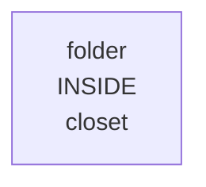
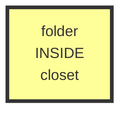

# 🚀 VirtualHome Agent Episode Log


### [GoalReasoner (Module A - Intent)] Output
```json
{
  "is_instruction_obviously_vague": false,
  "clarification_question": null,
  "target_object": "folder",
  "location_hint": "closet",
  "reasoning_chain": [
    {
      "question": "Why does the user want this object?",
      "answer": "To have the folder stored in a designated place."
    },
    {
      "question": "Why is that important?",
      "answer": "To organize or put away the item so it is not left out."
    },
    {
      "question": "What fundamental need does this fulfill?",
      "answer": "The need to organize and store an item in a contained location."
    },
    {
      "question": "Are there any deeper psychological or physical motivations?",
      "answer": "It may reduce clutter, keep the area tidy, or make the item easier to find later."
    }
  ],
  "deep_intent": "The user wants to store an item in a designated enclosed storage space.",
  "acceptable_alternatives_properties": [
    {
      "priority": 1,
      "description": "Other flat paper organizers or document holders that can be stored in the same enclosed space, such as a binder or document tray."
    },
    {
      "priority": 2,
      "description": "Similar storage-friendly office items that fit neatly into a closet, such as a box of papers or files."
    },
    {
      "priority": 3,
      "description": "Other small household items that can be put away to reduce clutter, as long as they are meant for storage."
    },
    {
      "priority": 4,
      "description": "Any portable object that can be safely placed into enclosed storage to organize the area."
    }
  ]
}
```

### [RoboStateMultiTaskController] Output
```json
{
  "action": "[walk] <kitchen> (11)",
  "active_task_id": "task_1",
  "task_context": {
    "active_task_id": "task_1",
    "pending_task_ids": [],
    "satisfied_task_ids": []
  },
  "source": "room_frontier"
}
```
## Step 0
- **Action**: `[walk] <kitchen> (11)`
- **Action Success**: `True`
- **Action Message**: {'0': {'message': 'Success'}}
- **Active Task**: `task_1`
- **Decision Source**: `room_frontier`
- **Task Progress**: E1_15=pending
- **SDG Status**:

- **Observed Items (39)**: floor(242), floor(243), floor(244), floor(245), ceiling(246), ceiling(247), ceiling(248), ceiling(249), wall(250), wall(251), wall(252), wall(253), door(254) [OPEN], ceilinglamp(255), tablelamp(256) [ON]...


### [RoboStateMultiTaskController] Output
```json
{
  "action": "[walk] <livingroom> (183)",
  "active_task_id": "task_1",
  "task_context": {
    "active_task_id": "task_1",
    "pending_task_ids": [],
    "satisfied_task_ids": []
  },
  "source": "room_frontier"
}
```
## Step 1
- **Action**: `[walk] <livingroom> (183)`
- **Action Success**: `True`
- **Action Message**: {'0': {'message': 'Success'}}
- **Active Task**: `task_1`
- **Decision Source**: `room_frontier`
- **Task Progress**: E1_15=pending
- **SDG Status**:

- **Observed Items (192)**: floor(242), floor(243), floor(244), floor(245), ceiling(246), ceiling(247), ceiling(248), ceiling(249), wall(250), wall(251), wall(252), wall(253), door(254) [OPEN], ceilinglamp(255), tablelamp(256) [ON]...


### [RoboStateMultiTaskController] Output
```json
{
  "action": "[walk] <bathroom> (285)",
  "active_task_id": "task_1",
  "task_context": {
    "active_task_id": "task_1",
    "pending_task_ids": [],
    "satisfied_task_ids": []
  },
  "source": "room_frontier"
}
```
## Step 2
- **Action**: `[walk] <bathroom> (285)`
- **Action Success**: `True`
- **Action Message**: {'0': {'message': 'Success'}}
- **Active Task**: `task_1`
- **Decision Source**: `room_frontier`
- **Task Progress**: E1_15=pending
- **SDG Status**:

- **Observed Items (244)**: floor(242), floor(243), floor(244), floor(245), ceiling(246), ceiling(247), ceiling(248), ceiling(249), wall(250), wall(251), wall(252), wall(253), door(254) [OPEN], ceilinglamp(255), tablelamp(256) [ON]...


### [RoboStateMultiTaskController] Output
```json
{
  "action": "[walk] <bedroom> (346)",
  "active_task_id": "task_1",
  "task_context": {
    "active_task_id": "task_1",
    "pending_task_ids": [],
    "satisfied_task_ids": []
  },
  "source": "room_frontier"
}
```
## Step 3
- **Action**: `[walk] <bedroom> (346)`
- **Action Success**: `True`
- **Action Message**: {'0': {'message': 'Success'}}
- **Active Task**: `task_1`
- **Decision Source**: `room_frontier`
- **Task Progress**: E1_15=pending
- **SDG Status**:

- **Observed Items (304)**: floor(242), floor(243), floor(244), floor(245), ceiling(246), ceiling(247), ceiling(248), ceiling(249), wall(250), wall(251), wall(252), wall(253), door(254) [OPEN], ceilinglamp(255), tablelamp(256) [ON]...


### [PerceptionFilter] Output
```json
{
  "reasoning": "The goal is to store the folder in the closet, so the only strictly necessary objects are the target item and the destination location. No tools or alternatives are required beyond the exact classes named in the SDG.",
  "selected_classes": [
    "folder",
    "box",
    "character",
    "closet"
  ],
  "raw_class_count": 91
}
```

### [LLMExecutor] Output
```json
{
  "reasoning": "The goal is to place a folder inside the closet. The closet(395) is already OPEN and the current room contains multiple folder candidates. The best binding is folder(276), which is a portable grabbable folder located in the same bedroom(241) as the closet(395). Since putting an item into a container requires holding the item first and being near the destination, the next needed step is to walk to the chosen folder before grabbing it.",
  "satisfied_nodes": [],
  "current_node_focus": "N1",
  "mapped_variables": {
    "?Container": "closet(395)",
    "?Folder": "folder(276)"
  },
  "action": "[walk] <folder> (276)"
}
```

### [RoboStateMultiTaskController] Output
```json
{
  "action": "[walk] <folder> (276)",
  "active_task_id": "task_1",
  "task_context": {
    "active_task_id": "task_1",
    "pending_task_ids": [],
    "satisfied_task_ids": []
  },
  "source": "llm_executor"
}
```
## Step 4
- **Action**: `[walk] <folder> (276)`
- **Action Success**: `True`
- **Action Message**: {'0': {'message': 'Success'}}
- **Active Task**: `task_1`
- **Decision Source**: `llm_executor`
- **Task Progress**: E1_15=pending
- **SDG Status**:

- **Observed Items (12)**: box(270) [CLOSED], folder(276) [CLOSED], folder(277) [CLOSED], folder(121) [CLOSED], character(1), kitchen(11), livingroom(183), bedroom(241), bathroom(285), bedroom(346), box(231) [CLOSED], closet(395) [OPEN]


### [PerceptionFilter] Output
```json
{
  "reasoning": "Reused cached class selection.",
  "selected_classes": [
    "folder",
    "box",
    "character",
    "closet"
  ],
  "raw_class_count": 91
}
```

### [LLMExecutor] Output
```json
{
  "reasoning": "The goal is to place a folder inside the closet. The closet(395) is already open and available in the environment. I am currently close to folder(276) from the prior walk, and the folder is grabbable and not dirty. The next required step toward satisfying N1 is to pick up the folder before moving it into the closet.",
  "satisfied_nodes": [],
  "current_node_focus": "N1",
  "mapped_variables": {
    "?Container": "closet(395)"
  },
  "action": "[grab] <folder> (276)"
}
```

### [RoboStateMultiTaskController] Output
```json
{
  "action": "[grab] <folder> (276)",
  "active_task_id": "task_1",
  "task_context": {
    "active_task_id": "task_1",
    "pending_task_ids": [],
    "satisfied_task_ids": []
  },
  "source": "llm_executor"
}
```
## Step 5
- **Action**: `[grab] <folder> (276)`
- **Action Success**: `False`
- **Action Message**: temporary_unavailable: target disappeared; wait or search and retry
- **Active Task**: `task_1`
- **Decision Source**: `llm_executor`
- **Task Progress**: E1_15=pending
- **SDG Status**:

- **Observed Items (12)**: box(270) [CLOSED], folder(276) [CLOSED], folder(277) [CLOSED], folder(121) [CLOSED], character(1), kitchen(11), livingroom(183), bedroom(241), bathroom(285), bedroom(346), box(231) [CLOSED], closet(395) [OPEN]


### [PerceptionFilter] Output
```json
{
  "reasoning": "Reused cached class selection.",
  "selected_classes": [
    "folder",
    "box",
    "character",
    "closet"
  ],
  "raw_class_count": 91
}
```

### [LLMExecutor] Output
```json
{
  "reasoning": "The folder target is currently in the bedroom and there are multiple candidate folders. Since the previous grab failed because the target temporarily disappeared, the correct next step is to retry with the same nearby folder that matches the task. We are already in the bedroom and the folder is marked CLOSE to the character, so a grab is now appropriate. The closet goal is still unmet, but we first need the folder in hand before moving it there.",
  "satisfied_nodes": [],
  "current_node_focus": "N1",
  "mapped_variables": {
    "?Folder": "folder(276)",
    "?Container": "closet(395)"
  },
  "action": "[grab] <folder> (276)"
}
```

### [RoboStateMultiTaskController] Output
```json
{
  "action": "[grab] <folder> (276)",
  "active_task_id": "task_1",
  "task_context": {
    "active_task_id": "task_1",
    "pending_task_ids": [],
    "satisfied_task_ids": []
  },
  "source": "llm_executor"
}
```
## Step 6
- **Action**: `[grab] <folder> (276)`
- **Action Success**: `False`
- **Action Message**: temporary_unavailable: target is temporarily hidden
- **Active Task**: `task_1`
- **Decision Source**: `llm_executor`
- **Task Progress**: E1_15=pending
- **SDG Status**:

- **Observed Items (12)**: box(270) [CLOSED], folder(276) [CLOSED], folder(277) [CLOSED], folder(121) [CLOSED], character(1), kitchen(11), livingroom(183), bedroom(241), bathroom(285), bedroom(346), box(231) [CLOSED], closet(395) [OPEN]


### [RoboStateMultiTaskController] Output
```json
{
  "action": "[walk] <kitchen> (11)",
  "active_task_id": null,
  "task_context": {
    "active_task_id": null,
    "pending_task_ids": [
      "task_1"
    ],
    "satisfied_task_ids": []
  },
  "source": "loop_recovery_room_revisit"
}
```
## Step 7
- **Action**: `[walk] <kitchen> (11)`
- **Action Success**: `True`
- **Action Message**: {'0': {'message': 'Success'}}
- **Decision Source**: `loop_recovery_room_revisit`
- **Task Progress**: E1_15=pending
- **SDG Status**:
No SDG active.
- **Observed Items (362)**: floor(242), floor(243), floor(244), floor(245), ceiling(246), ceiling(247), ceiling(248), ceiling(249), wall(250), wall(251), wall(252), wall(253), door(254) [OPEN], ceilinglamp(255), tablelamp(256) [ON]...


### [PerceptionFilter] Output
```json
{
  "reasoning": "Reused cached class selection.",
  "selected_classes": [
    "folder",
    "box",
    "character",
    "closet"
  ],
  "raw_class_count": 91
}
```

### [LLMExecutor] Output
```json
{
  "reasoning": "The goal is to get a folder inside the closet. The closet is currently open, and there are multiple folder instances in the bedroom. The previously targeted folder(276) was temporarily unavailable, but it is now visible again and is close to the character. Since the folder must be grabbed before it can be put into the closet, the next step is to pick up folder(276).",
  "satisfied_nodes": [],
  "current_node_focus": "N1",
  "mapped_variables": {
    "?Container": "closet(395)"
  },
  "action": "[grab] <folder> (276)"
}
```

### [RoboStateMultiTaskController] Output
```json
{
  "action": "[grab] <folder> (276)",
  "active_task_id": "task_1",
  "task_context": {
    "active_task_id": "task_1",
    "pending_task_ids": [],
    "satisfied_task_ids": []
  },
  "source": "llm_executor"
}
```
## Step 8
- **Action**: `[grab] <folder> (276)`
- **Action Success**: `False`
- **Action Message**: temporary_unavailable: target is temporarily hidden
- **Active Task**: `task_1`
- **Decision Source**: `llm_executor`
- **Task Progress**: E1_15=pending
- **SDG Status**:

- **Observed Items (12)**: box(270) [CLOSED], folder(276) [CLOSED], folder(277) [CLOSED], folder(121) [CLOSED], character(1), kitchen(11), livingroom(183), bedroom(241), bathroom(285), bedroom(346), box(231) [CLOSED], closet(395) [OPEN]


### [RoboStateMultiTaskController] Output
```json
{
  "action": "[walk] <livingroom> (183)",
  "active_task_id": null,
  "task_context": {
    "active_task_id": null,
    "pending_task_ids": [
      "task_1"
    ],
    "satisfied_task_ids": []
  },
  "source": "loop_recovery_room_revisit"
}
```
## Step 9
- **Action**: `[walk] <livingroom> (183)`
- **Action Success**: `True`
- **Action Message**: {'0': {'message': 'Success'}}
- **Decision Source**: `loop_recovery_room_revisit`
- **Task Progress**: E1_15=pending
- **SDG Status**:
No SDG active.
- **Observed Items (362)**: floor(242), floor(243), floor(244), floor(245), ceiling(246), ceiling(247), ceiling(248), ceiling(249), wall(250), wall(251), wall(252), wall(253), door(254) [OPEN], ceilinglamp(255), tablelamp(256) [ON]...


### [PerceptionFilter] Output
```json
{
  "reasoning": "Reused cached class selection.",
  "selected_classes": [
    "folder",
    "box",
    "character",
    "closet"
  ],
  "raw_class_count": 91
}
```

### [LLMExecutor] Output
```json
{
  "reasoning": "The goal is to place a folder inside the closet. The closet is currently OPEN, but the folder previously targeted (276) was temporarily unavailable. The current graph shows three folders in bedroom(241), and the closet is in bedroom(346). Since the task is to store any folder, the best next step is to move to the bedroom containing the available folders and then grab one. We should not repeat the last walk to livingroom; the next needed step is to approach the folder location.",
  "satisfied_nodes": [],
  "current_node_focus": "N1",
  "mapped_variables": {
    "?Container": "closet(395)"
  },
  "action": "[walk] <bedroom> (241)"
}
```

### [RoboStateMultiTaskController] Output
```json
{
  "action": "[walk] <bedroom> (241)",
  "active_task_id": "task_1",
  "task_context": {
    "active_task_id": "task_1",
    "pending_task_ids": [],
    "satisfied_task_ids": []
  },
  "source": "llm_executor"
}
```
## Step 10
- **Action**: `[walk] <bedroom> (241)`
- **Action Success**: `True`
- **Action Message**: {'0': {'message': 'Success'}}
- **Active Task**: `task_1`
- **Decision Source**: `llm_executor`
- **Task Progress**: E1_15=pending
- **SDG Status**:

- **Observed Items (12)**: box(270) [CLOSED], folder(276) [CLOSED], folder(277) [CLOSED], folder(121) [CLOSED], character(1), kitchen(11), livingroom(183), bedroom(241), bathroom(285), bedroom(346), box(231) [CLOSED], closet(395) [OPEN]


### [PerceptionFilter] Output
```json
{
  "reasoning": "Reused cached class selection.",
  "selected_classes": [
    "folder",
    "box",
    "character",
    "closet"
  ],
  "raw_class_count": 91
}
```

### [LLMExecutor] Output
```json
{
  "reasoning": "The target folder is currently visible in bedroom(241), while the closet exists in bedroom(346) and is already OPEN. The last successful action was walking to bedroom(241), so I am now adjacent to the folder location. Since the folder was previously temporarily unavailable, I should retry by approaching and then grabbing it before moving to the closet. The next atomic step is to get near the specific folder instance again.",
  "satisfied_nodes": [],
  "current_node_focus": "N1",
  "mapped_variables": {
    "?Container": "closet(395)"
  },
  "action": "[walk] <folder> (276)"
}
```

### [RoboStateMultiTaskController] Output
```json
{
  "action": "[walk] <folder> (276)",
  "active_task_id": "task_1",
  "task_context": {
    "active_task_id": "task_1",
    "pending_task_ids": [],
    "satisfied_task_ids": []
  },
  "source": "llm_executor"
}
```
## Step 11
- **Action**: `[walk] <folder> (276)`
- **Action Success**: `True`
- **Action Message**: {'0': {'message': 'Success'}}
- **Active Task**: `task_1`
- **Decision Source**: `llm_executor`
- **Task Progress**: E1_15=pending
- **SDG Status**:

- **Observed Items (12)**: box(270) [CLOSED], folder(276) [CLOSED], folder(277) [CLOSED], folder(121) [CLOSED], character(1), kitchen(11), livingroom(183), bedroom(241), bathroom(285), bedroom(346), box(231) [CLOSED], closet(395) [OPEN]


### [PerceptionFilter] Output
```json
{
  "reasoning": "Reused cached class selection.",
  "selected_classes": [
    "folder",
    "box",
    "character",
    "closet"
  ],
  "raw_class_count": 91
}
```

### [LLMExecutor] Output
```json
{
  "reasoning": "The SDG requires the folder to be inside the closet. The closet(395) is already OPEN and present in the graph, but the current folder candidates are all in the bedroom and none is yet held. Since the last action was walking to folder(276), the next atomic step should be to grab that nearby folder. This is the necessary first step before walking to the closet and putting it inside.",
  "satisfied_nodes": [],
  "current_node_focus": "N1",
  "mapped_variables": {
    "?Container": "closet(395)"
  },
  "action": "[grab] <folder> (276)"
}
```

### [RoboStateMultiTaskController] Output
```json
{
  "action": "[grab] <folder> (276)",
  "active_task_id": "task_1",
  "task_context": {
    "active_task_id": "task_1",
    "pending_task_ids": [],
    "satisfied_task_ids": []
  },
  "source": "llm_executor"
}
```
## Step 12
- **Action**: `[grab] <folder> (276)`
- **Action Success**: `True`
- **Action Message**: {'0': {'message': 'Success'}}
- **Active Task**: `task_1`
- **Decision Source**: `llm_executor`
- **Task Progress**: E1_15=pending
- **SDG Status**:

- **Observed Items (12)**: box(270) [CLOSED], folder(276) [CLOSED], folder(277) [CLOSED], folder(121) [CLOSED], character(1), kitchen(11), livingroom(183), bedroom(241), bathroom(285), bedroom(346), box(231) [CLOSED], closet(395) [OPEN]


### [PerceptionFilter] Output
```json
{
  "reasoning": "Reused cached class selection.",
  "selected_classes": [
    "folder",
    "box",
    "character",
    "closet"
  ],
  "raw_class_count": 91
}
```

### [LLMExecutor] Output
```json
{
  "reasoning": "The folder is currently being held in the right hand, and the closet is the required destination for the SDG node N1. The closet is open, so the next progress-making step is to move to the closet before placing the folder inside it. I should not put it down elsewhere because that would not satisfy the goal.",
  "satisfied_nodes": [],
  "current_node_focus": "N1",
  "mapped_variables": {
    "?Container": "closet(395)"
  },
  "action": "[walk] <closet> (395)"
}
```

### [RoboStateMultiTaskController] Output
```json
{
  "action": "[walk] <closet> (395)",
  "active_task_id": "task_1",
  "task_context": {
    "active_task_id": "task_1",
    "pending_task_ids": [],
    "satisfied_task_ids": []
  },
  "source": "llm_executor"
}
```
## Step 13
- **Action**: `[walk] <closet> (395)`
- **Action Success**: `True`
- **Action Message**: {'0': {'message': 'Success'}}
- **Active Task**: `task_1`
- **Decision Source**: `llm_executor`
- **Task Progress**: E1_15=pending
- **SDG Status**:

- **Observed Items (12)**: box(270) [CLOSED], folder(276) [CLOSED], folder(277) [CLOSED], folder(121) [CLOSED], character(1), kitchen(11), livingroom(183), bedroom(241), bathroom(285), bedroom(346), box(231) [CLOSED], closet(395) [OPEN]


### [PerceptionFilter] Output
```json
{
  "reasoning": "Reused cached class selection.",
  "selected_classes": [
    "folder",
    "box",
    "character",
    "closet"
  ],
  "raw_class_count": 91
}
```

### [LLMExecutor] Output
```json
{
  "reasoning": "The goal is to have folder(276) inside closet(395). I am already close to the open closet, and the folder is currently being held in my right hand, so the next required step is to place it into the closet. The closet is open, so no opening action is needed.",
  "satisfied_nodes": [],
  "current_node_focus": "N1",
  "mapped_variables": {},
  "action": "[putin] <folder> (276) <closet> (395)"
}
```

### [RoboStateMultiTaskController] Output
```json
{
  "action": "[putin] <folder> (276) <closet> (395)",
  "active_task_id": "task_1",
  "task_context": {
    "active_task_id": "task_1",
    "pending_task_ids": [],
    "satisfied_task_ids": []
  },
  "source": "llm_executor"
}
```
## Step 14
- **Action**: `[putin] <folder> (276) <closet> (395)`
- **Action Success**: `True`
- **Action Message**: {'0': {'message': 'Success'}}
- **Active Task**: `task_1`
- **Decision Source**: `llm_executor`
- **Task Progress**: E1_15=done
- **SDG Status**:

- **Observed Items (12)**: box(270) [CLOSED], folder(276) [CLOSED], folder(277) [CLOSED], folder(121) [CLOSED], character(1), kitchen(11), livingroom(183), bedroom(241), bathroom(285), bedroom(346), box(231) [CLOSED], closet(395) [OPEN]

