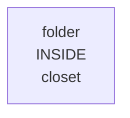
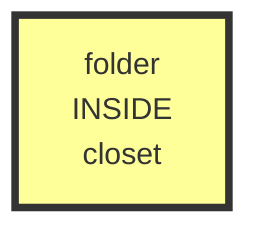

# 🚀 VirtualHome Agent Episode Log


### [GoalReasoner (Module A - Intent)] Output
```json
{
  "is_instruction_obviously_vague": false,
  "clarification_question": null,
  "target_object": "folder",
  "location_hint": "closet",
  "reasoning_chain": [
    {
      "question": "Why does the user want this object?",
      "answer": "To have the folder placed in a storage location."
    },
    {
      "question": "Why is that important?",
      "answer": "To organize or store the folder out of the way."
    },
    {
      "question": "What fundamental need does this fulfill?",
      "answer": "It fulfills a need for tidiness and document storage."
    },
    {
      "question": "Are there any deeper psychological or physical motivations?",
      "answer": "It may reduce clutter, protect the folder, or make the space easier to manage."
    }
  ],
  "deep_intent": "The user wants to organize and store a document container in a storage area.",
  "acceptable_alternatives_properties": [
    {
      "priority": 1,
      "description": "Other paper document holders or office file organizers that can be stored in the closet"
    },
    {
      "priority": 2,
      "description": "Related office storage items such as binders, envelopes, or document boxes"
    },
    {
      "priority": 3,
      "description": "Other small organizational items that can be put away to reduce clutter"
    },
    {
      "priority": 4,
      "description": "Any lightweight household item intended for storage rather than immediate use"
    }
  ]
}
```

### [RoboStateMultiTaskController] Output
```json
{
  "action": "[walk] <kitchen> (11)",
  "active_task_id": "task_1",
  "task_context": {
    "active_task_id": "task_1",
    "pending_task_ids": [],
    "satisfied_task_ids": []
  },
  "source": "room_frontier"
}
```
## Step 0
- **Action**: `[walk] <kitchen> (11)`
- **Action Success**: `True`
- **Action Message**: {'0': {'message': 'Success'}}
- **Active Task**: `task_1`
- **Decision Source**: `room_frontier`
- **Task Progress**: E1_15=pending
- **SDG Status**:

- **Observed Items (39)**: floor(242), floor(243), floor(244), floor(245), ceiling(246), ceiling(247), ceiling(248), ceiling(249), wall(250), wall(251), wall(252), wall(253), door(254) [OPEN], ceilinglamp(255), tablelamp(256) [ON]...


### [RoboStateMultiTaskController] Output
```json
{
  "action": "[walk] <livingroom> (183)",
  "active_task_id": "task_1",
  "task_context": {
    "active_task_id": "task_1",
    "pending_task_ids": [],
    "satisfied_task_ids": []
  },
  "source": "room_frontier"
}
```
## Step 1
- **Action**: `[walk] <livingroom> (183)`
- **Action Success**: `True`
- **Action Message**: {'0': {'message': 'Success'}}
- **Active Task**: `task_1`
- **Decision Source**: `room_frontier`
- **Task Progress**: E1_15=pending
- **SDG Status**:

- **Observed Items (192)**: floor(242), floor(243), floor(244), floor(245), ceiling(246), ceiling(247), ceiling(248), ceiling(249), wall(250), wall(251), wall(252), wall(253), door(254) [OPEN], ceilinglamp(255), tablelamp(256) [ON]...


### [RoboStateMultiTaskController] Output
```json
{
  "action": "[walk] <bathroom> (285)",
  "active_task_id": "task_1",
  "task_context": {
    "active_task_id": "task_1",
    "pending_task_ids": [],
    "satisfied_task_ids": []
  },
  "source": "room_frontier"
}
```
## Step 2
- **Action**: `[walk] <bathroom> (285)`
- **Action Success**: `True`
- **Action Message**: {'0': {'message': 'Success'}}
- **Active Task**: `task_1`
- **Decision Source**: `room_frontier`
- **Task Progress**: E1_15=pending
- **SDG Status**:

- **Observed Items (244)**: floor(242), floor(243), floor(244), floor(245), ceiling(246), ceiling(247), ceiling(248), ceiling(249), wall(250), wall(251), wall(252), wall(253), door(254) [OPEN], ceilinglamp(255), tablelamp(256) [ON]...


### [RoboStateMultiTaskController] Output
```json
{
  "action": "[walk] <bedroom> (346)",
  "active_task_id": "task_1",
  "task_context": {
    "active_task_id": "task_1",
    "pending_task_ids": [],
    "satisfied_task_ids": []
  },
  "source": "room_frontier"
}
```
## Step 3
- **Action**: `[walk] <bedroom> (346)`
- **Action Success**: `True`
- **Action Message**: {'0': {'message': 'Success'}}
- **Active Task**: `task_1`
- **Decision Source**: `room_frontier`
- **Task Progress**: E1_15=pending
- **SDG Status**:

- **Observed Items (304)**: floor(242), floor(243), floor(244), floor(245), ceiling(246), ceiling(247), ceiling(248), ceiling(249), wall(250), wall(251), wall(252), wall(253), door(254) [OPEN], ceilinglamp(255), tablelamp(256) [ON]...


### [PerceptionFilter] Output
```json
{
  "reasoning": "The goal is to store the folder in a closet. The only strictly necessary objects are the target item and the destination location; no tools or alternative storage appliances are needed beyond the closet itself.",
  "selected_classes": [
    "box",
    "closet",
    "folder",
    "character"
  ],
  "raw_class_count": 91
}
```

### [LLMExecutor] Output
```json
{
  "reasoning": "The goal is to have a folder inside the closet. We are currently in bedroom(346), and the closet(395) is available and already OPEN. The nearest matching target object is folder(276) in the bedroom(241), but since the task only asks for one next atomic action, the correct progression is to first move toward the folder before grabbing it. This also follows the required walk-before-grab rule. The closet itself is already open, so no need to open it now.",
  "satisfied_nodes": [],
  "current_node_focus": "N1",
  "mapped_variables": {
    "?Container": "closet(395)"
  },
  "action": "[walk] <folder> (276)"
}
```

### [RoboStateMultiTaskController] Output
```json
{
  "action": "[walk] <folder> (276)",
  "active_task_id": "task_1",
  "task_context": {
    "active_task_id": "task_1",
    "pending_task_ids": [],
    "satisfied_task_ids": []
  },
  "source": "llm_executor"
}
```
## Step 4
- **Action**: `[walk] <folder> (276)`
- **Action Success**: `True`
- **Action Message**: {'0': {'message': 'Success'}}
- **Active Task**: `task_1`
- **Decision Source**: `llm_executor`
- **Task Progress**: E1_15=pending
- **SDG Status**:

- **Observed Items (12)**: box(270) [CLOSED], folder(276) [CLOSED], folder(277) [CLOSED], folder(121) [CLOSED], character(1), kitchen(11), livingroom(183), bedroom(241), bathroom(285), bedroom(346), box(231) [CLOSED], closet(395) [OPEN]


### [PerceptionFilter] Output
```json
{
  "reasoning": "Reused cached class selection.",
  "selected_classes": [
    "box",
    "closet",
    "folder",
    "character"
  ],
  "raw_class_count": 91
}
```

### [LLMExecutor] Output
```json
{
  "reasoning": "The goal node N1 requires a folder to be INSIDE the closet. The closet(395) is already OPEN and reachable in the current graph, but the folder must be physically moved there. Since I am currently close to folder(276) from the previous walk, the next necessary step is to pick it up before transporting it to the closet. Folder(276) matches the target object class and is grabbable.",
  "satisfied_nodes": [],
  "current_node_focus": "N1",
  "mapped_variables": {
    "?Container": "closet(395)"
  },
  "action": "[grab] <folder> (276)"
}
```

### [RoboStateMultiTaskController] Output
```json
{
  "action": "[grab] <folder> (276)",
  "active_task_id": "task_1",
  "task_context": {
    "active_task_id": "task_1",
    "pending_task_ids": [],
    "satisfied_task_ids": []
  },
  "source": "llm_executor"
}
```
## Step 5
- **Action**: `[grab] <folder> (276)`
- **Action Success**: `True`
- **Action Message**: {'0': {'message': 'Success'}}
- **Active Task**: `task_1`
- **Decision Source**: `llm_executor`
- **Task Progress**: E1_15=pending
- **SDG Status**:

- **Observed Items (12)**: box(270) [CLOSED], folder(276) [CLOSED], folder(277) [CLOSED], folder(121) [CLOSED], character(1), kitchen(11), livingroom(183), bedroom(241), bathroom(285), bedroom(346), box(231) [CLOSED], closet(395) [OPEN]


### [PerceptionFilter] Output
```json
{
  "reasoning": "Reused cached class selection.",
  "selected_classes": [
    "box",
    "closet",
    "folder",
    "character"
  ],
  "raw_class_count": 91
}
```

### [LLMExecutor] Output
```json
{
  "reasoning": "The folder is already in hand (folder(276) is held by the character), and the target closet(395) is open. To satisfy N1, the next required step is to move to the closet before putting the folder inside it. I should not put it in yet because proximity to the destination is required first.",
  "satisfied_nodes": [],
  "current_node_focus": "N1",
  "mapped_variables": {},
  "action": "[walk] <closet> (395)"
}
```

### [RoboStateMultiTaskController] Output
```json
{
  "action": "[walk] <closet> (395)",
  "active_task_id": "task_1",
  "task_context": {
    "active_task_id": "task_1",
    "pending_task_ids": [],
    "satisfied_task_ids": []
  },
  "source": "llm_executor"
}
```
## Step 6
- **Action**: `[walk] <closet> (395)`
- **Action Success**: `True`
- **Action Message**: {'0': {'message': 'Success'}}
- **Active Task**: `task_1`
- **Decision Source**: `llm_executor`
- **Task Progress**: E1_15=pending
- **SDG Status**:

- **Observed Items (12)**: box(270) [CLOSED], folder(276) [CLOSED], folder(277) [CLOSED], folder(121) [CLOSED], character(1), kitchen(11), livingroom(183), bedroom(241), bathroom(285), bedroom(346), box(231) [CLOSED], closet(395) [OPEN]


### [PerceptionFilter] Output
```json
{
  "reasoning": "Reused cached class selection.",
  "selected_classes": [
    "box",
    "closet",
    "folder",
    "character"
  ],
  "raw_class_count": 91
}
```

### [LLMExecutor] Output
```json
{
  "reasoning": "The goal is to place the held folder(276) inside closet(395). We are already close to the closet and the closet is open, so the next required step is to put the held folder into it. The folder is currently in hand, and no other prerequisites are needed.",
  "satisfied_nodes": [],
  "current_node_focus": "N1",
  "mapped_variables": {
    "?Container": "closet(395)"
  },
  "action": "[putin] <folder> (276) <closet> (395)"
}
```

### [RoboStateMultiTaskController] Output
```json
{
  "action": "[putin] <folder> (276) <closet> (395)",
  "active_task_id": "task_1",
  "task_context": {
    "active_task_id": "task_1",
    "pending_task_ids": [],
    "satisfied_task_ids": []
  },
  "source": "llm_executor"
}
```
## Step 7
- **Action**: `[putin] <folder> (276) <closet> (395)`
- **Action Success**: `True`
- **Action Message**: {'0': {'message': 'Success'}}
- **Active Task**: `task_1`
- **Decision Source**: `llm_executor`
- **Task Progress**: E1_15=done
- **SDG Status**:

- **Observed Items (12)**: box(270) [CLOSED], folder(276) [CLOSED], folder(277) [CLOSED], folder(121) [CLOSED], character(1), kitchen(11), livingroom(183), bedroom(241), bathroom(285), bedroom(346), box(231) [CLOSED], closet(395) [OPEN]

