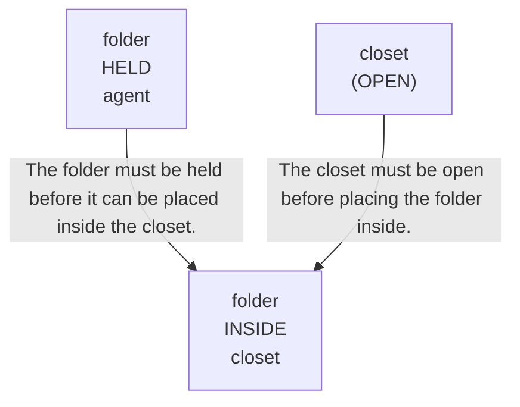
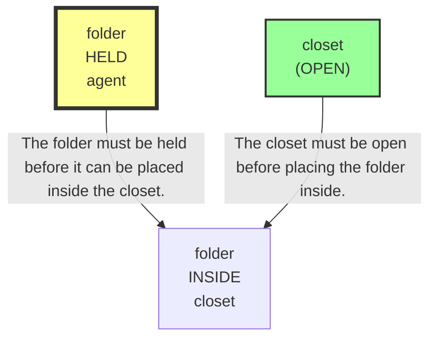
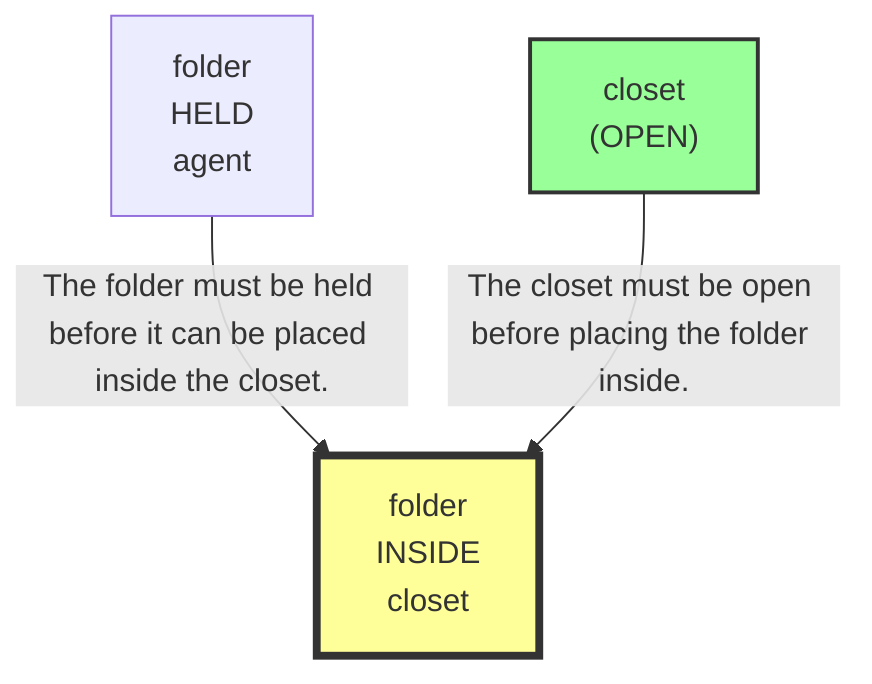
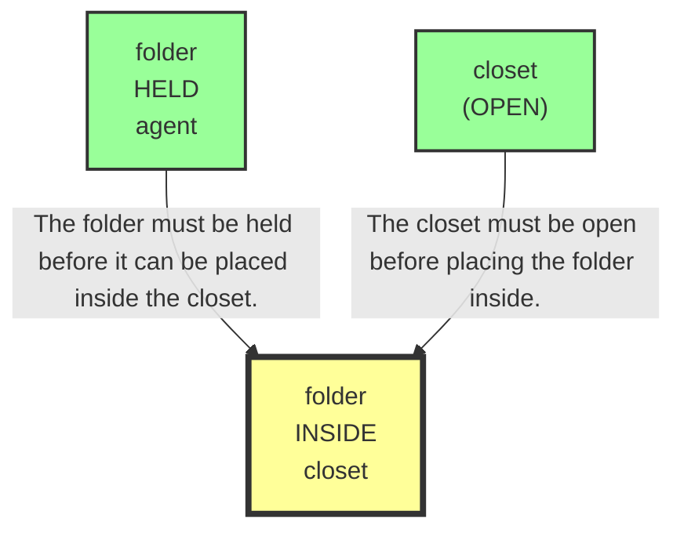

# 🚀 VirtualHome Agent Episode Log


### [GoalReasoner (Module A - Intent)] Output
```json
{
  "is_instruction_obviously_vague": false,
  "clarification_question": null,
  "target_object": "folder",
  "location_hint": "closet",
  "reasoning_chain": [
    {
      "question": "Why does the user want this object?",
      "answer": "To have the folder placed in a storage location."
    },
    {
      "question": "Why is that important?",
      "answer": "To organize or store the folder away."
    },
    {
      "question": "What fundamental need does this fulfill?",
      "answer": "The need to arrange and store an item in a designated place."
    },
    {
      "question": "Are there any deeper psychological or physical motivations?",
      "answer": "It may reduce clutter, keep the item accessible later, or maintain an orderly environment."
    }
  ],
  "deep_intent": "The user wants to store an item in a designated indoor location for organization or safekeeping.",
  "acceptable_alternatives_properties": [
    {
      "priority": 1,
      "description": "Other paper-based storage items such as binders, documents, or envelopes that can be placed in a closet"
    },
    {
      "priority": 2,
      "description": "Other small office or household items that are normally stored away for organization"
    },
    {
      "priority": 3,
      "description": "Similar flat storage-related items like files or magazines"
    },
    {
      "priority": 4,
      "description": "Any portable household item that can be safely put away in a closet to reduce clutter"
    }
  ]
}
```

### [RoboStateMultiTaskController] Output
```json
{
  "action": "[walk] <kitchen> (11)",
  "active_task_id": "task_1",
  "task_context": {
    "active_task_id": "task_1",
    "pending_task_ids": [],
    "satisfied_task_ids": []
  },
  "source": "room_frontier"
}
```
## Step 0
- **Action**: `[walk] <kitchen> (11)`
- **Action Success**: `True`
- **Action Message**: {'0': {'message': 'Success'}}
- **Active Task**: `task_1`
- **Decision Source**: `room_frontier`
- **Task Progress**: E1_15=pending
- **SDG Status**:

- **Observed Items (39)**: floor(242), floor(243), floor(244), floor(245), ceiling(246), ceiling(247), ceiling(248), ceiling(249), wall(250), wall(251), wall(252), wall(253), door(254) [OPEN], ceilinglamp(255), tablelamp(256) [ON]...


### [RoboStateMultiTaskController] Output
```json
{
  "action": "[walk] <livingroom> (183)",
  "active_task_id": "task_1",
  "task_context": {
    "active_task_id": "task_1",
    "pending_task_ids": [],
    "satisfied_task_ids": []
  },
  "source": "room_frontier"
}
```
## Step 1
- **Action**: `[walk] <livingroom> (183)`
- **Action Success**: `True`
- **Action Message**: {'0': {'message': 'Success'}}
- **Active Task**: `task_1`
- **Decision Source**: `room_frontier`
- **Task Progress**: E1_15=pending
- **SDG Status**:

- **Observed Items (192)**: floor(242), floor(243), floor(244), floor(245), ceiling(246), ceiling(247), ceiling(248), ceiling(249), wall(250), wall(251), wall(252), wall(253), door(254) [OPEN], ceilinglamp(255), tablelamp(256) [ON]...


### [RoboStateMultiTaskController] Output
```json
{
  "action": "[walk] <bathroom> (285)",
  "active_task_id": "task_1",
  "task_context": {
    "active_task_id": "task_1",
    "pending_task_ids": [],
    "satisfied_task_ids": []
  },
  "source": "room_frontier"
}
```
## Step 2
- **Action**: `[walk] <bathroom> (285)`
- **Action Success**: `True`
- **Action Message**: {'0': {'message': 'Success'}}
- **Active Task**: `task_1`
- **Decision Source**: `room_frontier`
- **Task Progress**: E1_15=pending
- **SDG Status**:

- **Observed Items (244)**: floor(242), floor(243), floor(244), floor(245), ceiling(246), ceiling(247), ceiling(248), ceiling(249), wall(250), wall(251), wall(252), wall(253), door(254) [OPEN], ceilinglamp(255), tablelamp(256) [ON]...


### [RoboStateMultiTaskController] Output
```json
{
  "action": "[walk] <bedroom> (346)",
  "active_task_id": "task_1",
  "task_context": {
    "active_task_id": "task_1",
    "pending_task_ids": [],
    "satisfied_task_ids": []
  },
  "source": "room_frontier"
}
```
## Step 3
- **Action**: `[walk] <bedroom> (346)`
- **Action Success**: `True`
- **Action Message**: {'0': {'message': 'Success'}}
- **Active Task**: `task_1`
- **Decision Source**: `room_frontier`
- **Task Progress**: E1_15=pending
- **SDG Status**:

- **Observed Items (304)**: floor(242), floor(243), floor(244), floor(245), ceiling(246), ceiling(247), ceiling(248), ceiling(249), wall(250), wall(251), wall(252), wall(253), door(254) [OPEN], ceilinglamp(255), tablelamp(256) [ON]...


### [PerceptionFilter] Output
```json
{
  "reasoning": "The goal is to store the folder in a closet. The SDG requires the folder, the closet as the destination, and the closet being open before placement. No other tools or alternative storage locations are needed for this task.",
  "selected_classes": [
    "closet",
    "character",
    "folder",
    "door"
  ],
  "raw_class_count": 91
}
```

### [LLMExecutor] Output
```json
{
  "reasoning": "The closet required by the SDG is already open (closet(395) has state OPEN), so N2 is satisfied. The folder is not yet held and must be grabbed before it can be placed inside the closet, so the next step is to move near a suitable folder. Among the available folder instances, folder(121) is an appropriate grabbable target in the current bedroom and is a valid binding for the goal object.",
  "satisfied_nodes": [
    "N2"
  ],
  "current_node_focus": "N3",
  "mapped_variables": {
    "?Container": "closet(395)"
  },
  "action": "[walk] <folder> (121)"
}
```

### [RoboStateMultiTaskController] Output
```json
{
  "action": "[walk] <folder> (121)",
  "active_task_id": "task_1",
  "task_context": {
    "active_task_id": "task_1",
    "pending_task_ids": [],
    "satisfied_task_ids": []
  },
  "source": "llm_executor"
}
```
## Step 4
- **Action**: `[walk] <folder> (121)`
- **Action Success**: `True`
- **Action Message**: {'0': {'message': 'Success'}}
- **Active Task**: `task_1`
- **Decision Source**: `llm_executor`
- **Task Progress**: E1_15=pending
- **SDG Status**:

- **Observed Items (13)**: door(254) [OPEN], folder(276) [CLOSED], folder(277) [CLOSED], folder(121) [CLOSED], character(1), kitchen(11), livingroom(183), bedroom(241), bathroom(285), bedroom(346), door(47) [OPEN], door(305) [OPEN], closet(395) [OPEN]


### [PerceptionFilter] Output
```json
{
  "reasoning": "Reused cached class selection.",
  "selected_classes": [
    "closet",
    "character",
    "folder",
    "door"
  ],
  "raw_class_count": 91
}
```

### [LLMExecutor] Output
```json
{
  "reasoning": "The folder target is visible and close to the agent in the bedroom, but it is not yet held. The closet exists in a different bedroom area and is already open, so the next required step in the SDG is to pick up the folder before transporting it to the closet. I will bind ?Folder to folder(121) because it is a valid grabbable folder currently close to the character.",
  "satisfied_nodes": [
    "N2"
  ],
  "current_node_focus": "N3",
  "mapped_variables": {
    "?Folder": "folder(121)",
    "?Closet": "closet(395)"
  },
  "action": "[grab] <folder> (121)"
}
```

### [RoboStateMultiTaskController] Output
```json
{
  "action": "[grab] <folder> (121)",
  "active_task_id": "task_1",
  "task_context": {
    "active_task_id": "task_1",
    "pending_task_ids": [],
    "satisfied_task_ids": []
  },
  "source": "llm_executor"
}
```
## Step 5
- **Action**: `[grab] <folder> (121)`
- **Action Success**: `False`
- **Action Message**: temporary_unavailable: target disappeared; wait or search and retry
- **Active Task**: `task_1`
- **Decision Source**: `llm_executor`
- **Task Progress**: E1_15=pending
- **SDG Status**:

- **Observed Items (13)**: door(254) [OPEN], folder(276) [CLOSED], folder(277) [CLOSED], folder(121) [CLOSED], character(1), kitchen(11), livingroom(183), bedroom(241), bathroom(285), bedroom(346), door(47) [OPEN], door(305) [OPEN], closet(395) [OPEN]


### [PerceptionFilter] Output
```json
{
  "reasoning": "Reused cached class selection.",
  "selected_classes": [
    "closet",
    "character",
    "folder",
    "door"
  ],
  "raw_class_count": 91
}
```

### [LLMExecutor] Output
```json
{
  "reasoning": "The folder target is currently in bedroom(241) and the previous grab attempt on folder(121) failed because that exact instance disappeared temporarily. Since folder(276) is now visible in the same room, it is a valid substitute matching the same required physical properties. The closet(395) is already OPEN, so the remaining prerequisite for placing the folder inside it is to hold the folder. Because I am already close to the folder and do not need to walk again, the best next atomic action is to grab folder(276).",
  "satisfied_nodes": [
    "N2"
  ],
  "current_node_focus": "N3",
  "mapped_variables": {
    "?Container": "closet(395)"
  },
  "action": "[grab] <folder> (276)"
}
```

### [RoboStateMultiTaskController] Output
```json
{
  "action": "[grab] <folder> (276)",
  "active_task_id": "task_1",
  "task_context": {
    "active_task_id": "task_1",
    "pending_task_ids": [],
    "satisfied_task_ids": []
  },
  "source": "llm_executor"
}
```
## Step 6
- **Action**: `[grab] <folder> (276)`
- **Action Success**: `False`
- **Action Message**: temporary_unavailable: target disappeared; wait or search and retry
- **Active Task**: `task_1`
- **Decision Source**: `llm_executor`
- **Task Progress**: E1_15=pending
- **SDG Status**:

- **Observed Items (13)**: door(254) [OPEN], folder(276) [CLOSED], folder(277) [CLOSED], folder(121) [CLOSED], character(1), kitchen(11), livingroom(183), bedroom(241), bathroom(285), bedroom(346), door(47) [OPEN], door(305) [OPEN], closet(395) [OPEN]


### [RoboStateMultiTaskController] Output
```json
{
  "action": "[walk] <kitchen> (11)",
  "active_task_id": null,
  "task_context": {
    "active_task_id": null,
    "pending_task_ids": [
      "task_1"
    ],
    "satisfied_task_ids": []
  },
  "source": "loop_recovery_room_revisit"
}
```
## Step 7
- **Action**: `[walk] <kitchen> (11)`
- **Action Success**: `True`
- **Action Message**: {'0': {'message': 'Success'}}
- **Decision Source**: `loop_recovery_room_revisit`
- **Task Progress**: E1_15=pending
- **SDG Status**:
No SDG active.
- **Observed Items (362)**: floor(242), floor(243), floor(244), floor(245), ceiling(246), ceiling(247), ceiling(248), ceiling(249), wall(250), wall(251), wall(252), wall(253), door(254) [OPEN], ceilinglamp(255), tablelamp(256) [ON]...


### [PerceptionFilter] Output
```json
{
  "reasoning": "Reused cached class selection.",
  "selected_classes": [
    "closet",
    "character",
    "folder",
    "door"
  ],
  "raw_class_count": 91
}
```

### [LLMExecutor] Output
```json
{
  "reasoning": "The folder goal is not yet satisfied because the folder is not held and the closet is open but currently in a different room (bedroom 346). The most direct next step is to move to the closet before attempting any interaction with it. I will focus on the closet relation/state prerequisite first; the folder can be handled after reaching the closet or by returning to the bedroom to grab it if needed. Since the last action was already a walk to the kitchen, I should not repeat that. The closet instance is closet(395) and it is already OPEN, so no open action is needed now.",
  "satisfied_nodes": [
    "N2"
  ],
  "current_node_focus": "N1",
  "mapped_variables": {
    "?Container": "closet(395)"
  },
  "action": "[walk] <closet> (395)"
}
```

### [RoboStateMultiTaskController] Output
```json
{
  "action": "[walk] <closet> (395)",
  "active_task_id": "task_1",
  "task_context": {
    "active_task_id": "task_1",
    "pending_task_ids": [],
    "satisfied_task_ids": []
  },
  "source": "llm_executor"
}
```
## Step 8
- **Action**: `[walk] <closet> (395)`
- **Action Success**: `True`
- **Action Message**: {'0': {'message': 'Success'}}
- **Active Task**: `task_1`
- **Decision Source**: `llm_executor`
- **Task Progress**: E1_15=pending
- **SDG Status**:

- **Observed Items (13)**: door(254) [OPEN], folder(276) [CLOSED], folder(277) [CLOSED], folder(121) [CLOSED], character(1), kitchen(11), livingroom(183), bedroom(241), bathroom(285), bedroom(346), door(47) [OPEN], door(305) [OPEN], closet(395) [OPEN]


### [PerceptionFilter] Output
```json
{
  "reasoning": "Reused cached class selection.",
  "selected_classes": [
    "closet",
    "character",
    "folder",
    "door"
  ],
  "raw_class_count": 91
}
```

### [LLMExecutor] Output
```json
{
  "reasoning": "The closet is already open and we are close to it, satisfying N2. The remaining gap is holding a folder so it can be placed inside the closet. The current graph shows several folders in the bedroom and close to the agent; the best available candidate is folder(121), which matches the task object and is nearby in the current area. The next required step is to get that folder into hand. Because the last attempt to grab folder(121) failed due to temporary disappearance, but the folder is now visible again, the correct autonomous recovery is to walk to the specific folder before attempting to grab it again.",
  "satisfied_nodes": [
    "N2"
  ],
  "current_node_focus": "N3",
  "mapped_variables": {},
  "action": "[walk] <folder> (121)"
}
```

### [RoboStateMultiTaskController] Output
```json
{
  "action": "[walk] <folder> (121)",
  "active_task_id": "task_1",
  "task_context": {
    "active_task_id": "task_1",
    "pending_task_ids": [],
    "satisfied_task_ids": []
  },
  "source": "llm_executor"
}
```
## Step 9
- **Action**: `[walk] <folder> (121)`
- **Action Success**: `True`
- **Action Message**: {'0': {'message': 'Success'}}
- **Active Task**: `task_1`
- **Decision Source**: `llm_executor`
- **Task Progress**: E1_15=pending
- **SDG Status**:

- **Observed Items (13)**: door(254) [OPEN], folder(276) [CLOSED], folder(277) [CLOSED], folder(121) [CLOSED], character(1), kitchen(11), livingroom(183), bedroom(241), bathroom(285), bedroom(346), door(47) [OPEN], door(305) [OPEN], closet(395) [OPEN]


### [PerceptionFilter] Output
```json
{
  "reasoning": "Reused cached class selection.",
  "selected_classes": [
    "closet",
    "character",
    "folder",
    "door"
  ],
  "raw_class_count": 91
}
```

### [LLMExecutor] Output
```json
{
  "reasoning": "The closet is already open and we are close to it, so the remaining prerequisite for placing the folder inside is to hold a folder. The most recent folder(121) is still nearby and is the best aligned candidate from memory, so the next step is to grab it before attempting to store it.",
  "satisfied_nodes": [
    "N2"
  ],
  "current_node_focus": "N3",
  "mapped_variables": {},
  "action": "[grab] <folder> (121)"
}
```

### [RoboStateMultiTaskController] Output
```json
{
  "action": "[grab] <folder> (121)",
  "active_task_id": "task_1",
  "task_context": {
    "active_task_id": "task_1",
    "pending_task_ids": [],
    "satisfied_task_ids": []
  },
  "source": "llm_executor"
}
```
## Step 10
- **Action**: `[grab] <folder> (121)`
- **Action Success**: `True`
- **Action Message**: {'0': {'message': 'Success'}}
- **Active Task**: `task_1`
- **Decision Source**: `llm_executor`
- **Task Progress**: E1_15=pending
- **SDG Status**:

- **Observed Items (13)**: door(254) [OPEN], folder(276) [CLOSED], folder(277) [CLOSED], folder(121) [CLOSED], character(1), kitchen(11), livingroom(183), bedroom(241), bathroom(285), bedroom(346), door(47) [OPEN], door(305) [OPEN], closet(395) [OPEN]


### [PerceptionFilter] Output
```json
{
  "reasoning": "Reused cached class selection.",
  "selected_classes": [
    "closet",
    "character",
    "folder",
    "door"
  ],
  "raw_class_count": 91
}
```

### [LLMExecutor] Output
```json
{
  "reasoning": "The folder target is already held in the right hand: folder(121) satisfies N3. The closet(395) is already open, satisfying N2. The remaining unmet node is to place the held folder inside the closet, which requires walking to the closet before a putin action. Since the last action was a walk to the folder, I should now move to the destination closet.",
  "satisfied_nodes": [
    "N2",
    "N3"
  ],
  "current_node_focus": "N1",
  "mapped_variables": {
    "?Container": "closet(395)"
  },
  "action": "[walk] <closet> (395)"
}
```

### [RoboStateMultiTaskController] Output
```json
{
  "action": "[walk] <closet> (395)",
  "active_task_id": "task_1",
  "task_context": {
    "active_task_id": "task_1",
    "pending_task_ids": [],
    "satisfied_task_ids": []
  },
  "source": "llm_executor"
}
```
## Step 11
- **Action**: `[walk] <closet> (395)`
- **Action Success**: `True`
- **Action Message**: {'0': {'message': 'Success'}}
- **Active Task**: `task_1`
- **Decision Source**: `llm_executor`
- **Task Progress**: E1_15=pending
- **SDG Status**:

- **Observed Items (13)**: door(254) [OPEN], folder(276) [CLOSED], folder(277) [CLOSED], folder(121) [CLOSED], character(1), kitchen(11), livingroom(183), bedroom(241), bathroom(285), bedroom(346), door(47) [OPEN], door(305) [OPEN], closet(395) [OPEN]


### [PerceptionFilter] Output
```json
{
  "reasoning": "Reused cached class selection.",
  "selected_classes": [
    "closet",
    "character",
    "folder",
    "door"
  ],
  "raw_class_count": 91
}
```

### [LLMExecutor] Output
```json
{
  "reasoning": "The folder is already held in the right hand, satisfying N3. The closet is already open, satisfying N2. The remaining unmet goal is to place the held folder inside the closet. Since putin requires being near the destination and we just walked to the closet in the previous step, the next atomic action is to put the folder into closet(395).",
  "satisfied_nodes": [
    "N2",
    "N3"
  ],
  "current_node_focus": "N1",
  "mapped_variables": {
    "?Container": "closet(395)"
  },
  "action": "[putin] <folder> (121) <closet> (395)"
}
```

### [RoboStateMultiTaskController] Output
```json
{
  "action": "[putin] <folder> (121) <closet> (395)",
  "active_task_id": "task_1",
  "task_context": {
    "active_task_id": "task_1",
    "pending_task_ids": [],
    "satisfied_task_ids": []
  },
  "source": "llm_executor"
}
```
## Step 12
- **Action**: `[putin] <folder> (121) <closet> (395)`
- **Action Success**: `True`
- **Action Message**: {'0': {'message': 'Success'}}
- **Active Task**: `task_1`
- **Decision Source**: `llm_executor`
- **Task Progress**: E1_15=done
- **SDG Status**:

- **Observed Items (13)**: door(254) [OPEN], folder(276) [CLOSED], folder(277) [CLOSED], folder(121) [CLOSED], character(1), kitchen(11), livingroom(183), bedroom(241), bathroom(285), bedroom(346), door(47) [OPEN], door(305) [OPEN], closet(395) [OPEN]

