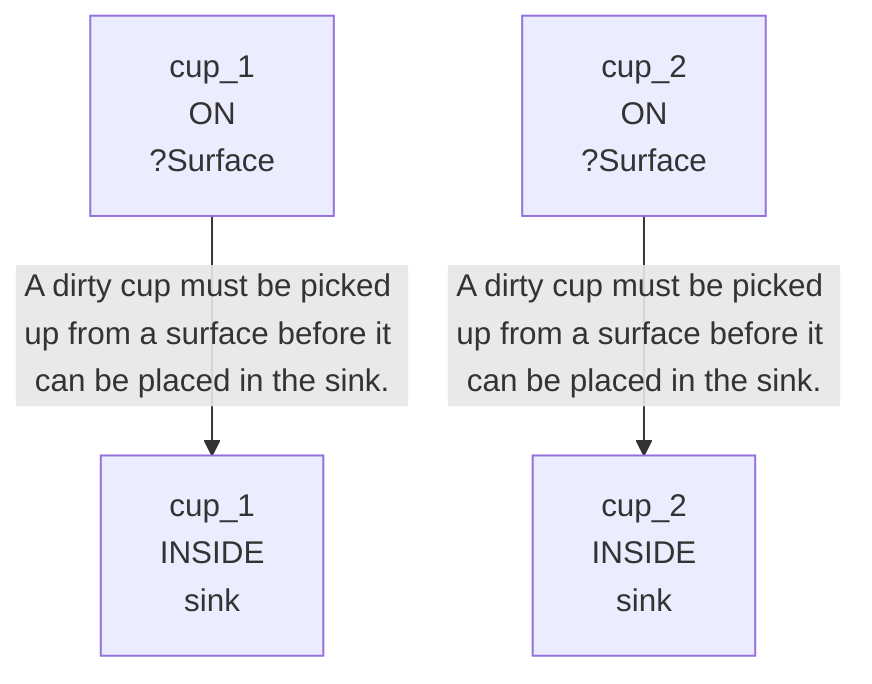

# 🚀 VirtualHome Agent Episode Log


### [GoalReasoner (Module A - Intent)] Output
```json
{
  "is_instruction_obviously_vague": false,
  "clarification_question": null,
  "target_object": "dirty cups",
  "location_hint": "sink",
  "reasoning_chain": [
    {
      "question": "Why does the user want this object?",
      "answer": "To remove dirty cups from where they are found and place them in the sink immediately."
    },
    {
      "question": "Why is that important?",
      "answer": "To keep the area tidy and prevent dirty dishes from being left out."
    },
    {
      "question": "What fundamental need does this fulfill?",
      "answer": "Maintaining household cleanliness and organization."
    },
    {
      "question": "Are there any deeper psychological or physical motivations?",
      "answer": "It likely reduces visual clutter, supports sanitation, and makes later washing easier."
    }
  ],
  "deep_intent": "The user wants to maintain cleanliness and order by promptly collecting dirty dishes.",
  "acceptable_alternatives_properties": [
    {
      "priority": 1,
      "description": "Other dirty dishware or drinkware that should be moved to the sink, such as plates, bowls, or mugs"
    },
    {
      "priority": 2,
      "description": "Other used kitchen items that belong with dirty dishes, such as utensils or servingware"
    },
    {
      "priority": 3,
      "description": "Other clutter items in the immediate area that can be cleared to keep the space tidy"
    },
    {
      "priority": 4,
      "description": "Any household items that are out of place and can be relocated to restore order"
    }
  ]
}
```

### [RoboStateMultiTaskController] Output
```json
{
  "action": "[walk] <livingroom> (183)",
  "active_task_id": "task_1",
  "task_context": {
    "active_task_id": "task_1",
    "pending_task_ids": [],
    "satisfied_task_ids": []
  },
  "source": "room_frontier"
}
```
## Step 0
- **Action**: `[walk] <livingroom> (183)`
- **Action Success**: `True`
- **Action Message**: {'0': {'message': 'Success'}}
- **Active Task**: `task_1`
- **Decision Source**: `room_frontier`
- **Task Progress**: M1_03=pending
- **SDG Status**:

- **Observed Items (159)**: wall(12), wall(13), wall(14), wall(15), wall(16), wall(17), wall(18), wall(19), wall(20), wall(21), floor(22), floor(23), floor(24), floor(25), floor(26)...


### [RoboStateMultiTaskController] Output
```json
{
  "action": "[walk] <bedroom> (241)",
  "active_task_id": "task_1",
  "task_context": {
    "active_task_id": "task_1",
    "pending_task_ids": [],
    "satisfied_task_ids": []
  },
  "source": "room_frontier"
}
```
## Step 1
- **Action**: `[walk] <bedroom> (241)`
- **Action Success**: `True`
- **Action Message**: {'0': {'message': 'Success'}}
- **Active Task**: `task_1`
- **Decision Source**: `room_frontier`
- **Task Progress**: M1_03=pending
- **SDG Status**:

- **Observed Items (211)**: wall(12), wall(13), wall(14), wall(15), wall(16), wall(17), wall(18), wall(19), wall(20), wall(21), floor(22), floor(23), floor(24), floor(25), floor(26)...


### [RoboStateMultiTaskController] Output
```json
{
  "action": "[walk] <bathroom> (285)",
  "active_task_id": "task_1",
  "task_context": {
    "active_task_id": "task_1",
    "pending_task_ids": [],
    "satisfied_task_ids": []
  },
  "source": "room_frontier"
}
```
## Step 2
- **Action**: `[walk] <bathroom> (285)`
- **Action Success**: `True`
- **Action Message**: {'0': {'message': 'Success'}}
- **Active Task**: `task_1`
- **Decision Source**: `room_frontier`
- **Task Progress**: M1_03=pending
- **SDG Status**:

- **Observed Items (243)**: wall(12), wall(13), wall(14), wall(15), wall(16), wall(17), wall(18), wall(19), wall(20), wall(21), floor(22), floor(23), floor(24), floor(25), floor(26)...


### [RoboStateMultiTaskController] Output
```json
{
  "action": "[walk] <bedroom> (346)",
  "active_task_id": "task_1",
  "task_context": {
    "active_task_id": "task_1",
    "pending_task_ids": [],
    "satisfied_task_ids": []
  },
  "source": "room_frontier"
}
```
## Step 3
- **Action**: `[walk] <bedroom> (346)`
- **Action Success**: `True`
- **Action Message**: {'0': {'message': 'Success'}}
- **Active Task**: `task_1`
- **Decision Source**: `room_frontier`
- **Task Progress**: M1_03=pending
- **SDG Status**:

- **Observed Items (303)**: wall(12), wall(13), wall(14), wall(15), wall(16), wall(17), wall(18), wall(19), wall(20), wall(21), floor(22), floor(23), floor(24), floor(25), floor(26)...


### [RoboStateMultiTaskController] Output
```json
{
  "action": "[walk] <kitchen> (11)",
  "active_task_id": null,
  "task_context": {
    "active_task_id": null,
    "pending_task_ids": [
      "task_1"
    ],
    "satisfied_task_ids": []
  },
  "source": "loop_recovery_room_revisit"
}
```
## Step 4
- **Action**: `[walk] <kitchen> (11)`
- **Action Success**: `True`
- **Action Message**: {'0': {'message': 'Success'}}
- **Decision Source**: `loop_recovery_room_revisit`
- **Task Progress**: M1_03=pending
- **SDG Status**:
No SDG active.
- **Observed Items (361)**: wall(12), wall(13), wall(14), wall(15), wall(16), wall(17), wall(18), wall(19), wall(20), wall(21), floor(22), floor(23), floor(24), floor(25), floor(26)...


### [RoboStateMultiTaskController] Output
```json
{
  "action": "[walk] <livingroom> (183)",
  "active_task_id": null,
  "task_context": {
    "active_task_id": null,
    "pending_task_ids": [
      "task_1"
    ],
    "satisfied_task_ids": []
  },
  "source": "loop_recovery_room_revisit"
}
```
## Step 5
- **Action**: `[walk] <livingroom> (183)`
- **Action Success**: `True`
- **Action Message**: {'0': {'message': 'Success'}}
- **Decision Source**: `loop_recovery_room_revisit`
- **Task Progress**: M1_03=pending
- **SDG Status**:
No SDG active.
- **Observed Items (361)**: wall(12), wall(13), wall(14), wall(15), wall(16), wall(17), wall(18), wall(19), wall(20), wall(21), floor(22), floor(23), floor(24), floor(25), floor(26)...


### [RoboStateMultiTaskController] Output
```json
{
  "action": "[walk] <bedroom> (241)",
  "active_task_id": null,
  "task_context": {
    "active_task_id": null,
    "pending_task_ids": [
      "task_1"
    ],
    "satisfied_task_ids": []
  },
  "source": "loop_recovery_room_revisit"
}
```
## Step 6
- **Action**: `[walk] <bedroom> (241)`
- **Action Success**: `True`
- **Action Message**: {'0': {'message': 'Success'}}
- **Decision Source**: `loop_recovery_room_revisit`
- **Task Progress**: M1_03=pending
- **SDG Status**:
No SDG active.
- **Observed Items (361)**: wall(12), wall(13), wall(14), wall(15), wall(16), wall(17), wall(18), wall(19), wall(20), wall(21), floor(22), floor(23), floor(24), floor(25), floor(26)...


### [RoboStateMultiTaskController] Output
```json
{
  "action": "[walk] <bathroom> (285)",
  "active_task_id": null,
  "task_context": {
    "active_task_id": null,
    "pending_task_ids": [
      "task_1"
    ],
    "satisfied_task_ids": []
  },
  "source": "loop_recovery_room_revisit"
}
```
## Step 7
- **Action**: `[walk] <bathroom> (285)`
- **Action Success**: `True`
- **Action Message**: {'0': {'message': 'Success'}}
- **Decision Source**: `loop_recovery_room_revisit`
- **Task Progress**: M1_03=pending
- **SDG Status**:
No SDG active.
- **Observed Items (361)**: wall(12), wall(13), wall(14), wall(15), wall(16), wall(17), wall(18), wall(19), wall(20), wall(21), floor(22), floor(23), floor(24), floor(25), floor(26)...


### [RoboStateMultiTaskController] Output
```json
{
  "action": "[walk] <bedroom> (346)",
  "active_task_id": null,
  "task_context": {
    "active_task_id": null,
    "pending_task_ids": [
      "task_1"
    ],
    "satisfied_task_ids": []
  },
  "source": "loop_recovery_room_revisit"
}
```
## Step 8
- **Action**: `[walk] <bedroom> (346)`
- **Action Success**: `True`
- **Action Message**: {'0': {'message': 'Success'}}
- **Decision Source**: `loop_recovery_room_revisit`
- **Task Progress**: M1_03=pending
- **SDG Status**:
No SDG active.
- **Observed Items (361)**: wall(12), wall(13), wall(14), wall(15), wall(16), wall(17), wall(18), wall(19), wall(20), wall(21), floor(22), floor(23), floor(24), floor(25), floor(26)...


### [RoboStateMultiTaskController] Output
```json
{
  "action": "[walk] <kitchen> (11)",
  "active_task_id": null,
  "task_context": {
    "active_task_id": null,
    "pending_task_ids": [
      "task_1"
    ],
    "satisfied_task_ids": []
  },
  "source": "loop_recovery_room_revisit"
}
```
## Step 9
- **Action**: `[walk] <kitchen> (11)`
- **Action Success**: `True`
- **Action Message**: {'0': {'message': 'Success'}}
- **Decision Source**: `loop_recovery_room_revisit`
- **Task Progress**: M1_03=pending
- **SDG Status**:
No SDG active.
- **Observed Items (361)**: wall(12), wall(13), wall(14), wall(15), wall(16), wall(17), wall(18), wall(19), wall(20), wall(21), floor(22), floor(23), floor(24), floor(25), floor(26)...


### [RoboStateMultiTaskController] Output
```json
{
  "action": "[walk] <livingroom> (183)",
  "active_task_id": null,
  "task_context": {
    "active_task_id": null,
    "pending_task_ids": [
      "task_1"
    ],
    "satisfied_task_ids": []
  },
  "source": "loop_recovery_room_revisit"
}
```
## Step 10
- **Action**: `[walk] <livingroom> (183)`
- **Action Success**: `True`
- **Action Message**: {'0': {'message': 'Success'}}
- **Decision Source**: `loop_recovery_room_revisit`
- **Task Progress**: M1_03=pending
- **SDG Status**:
No SDG active.
- **Observed Items (361)**: wall(12), wall(13), wall(14), wall(15), wall(16), wall(17), wall(18), wall(19), wall(20), wall(21), floor(22), floor(23), floor(24), floor(25), floor(26)...


### [RoboStateMultiTaskController] Output
```json
{
  "action": "[walk] <bedroom> (241)",
  "active_task_id": null,
  "task_context": {
    "active_task_id": null,
    "pending_task_ids": [
      "task_1"
    ],
    "satisfied_task_ids": []
  },
  "source": "loop_recovery_room_revisit"
}
```
## Step 11
- **Action**: `[walk] <bedroom> (241)`
- **Action Success**: `True`
- **Action Message**: {'0': {'message': 'Success'}}
- **Decision Source**: `loop_recovery_room_revisit`
- **Task Progress**: M1_03=pending
- **SDG Status**:
No SDG active.
- **Observed Items (361)**: wall(12), wall(13), wall(14), wall(15), wall(16), wall(17), wall(18), wall(19), wall(20), wall(21), floor(22), floor(23), floor(24), floor(25), floor(26)...


### [RoboStateMultiTaskController] Output
```json
{
  "action": "[walk] <bathroom> (285)",
  "active_task_id": null,
  "task_context": {
    "active_task_id": null,
    "pending_task_ids": [
      "task_1"
    ],
    "satisfied_task_ids": []
  },
  "source": "loop_recovery_room_revisit"
}
```
## Step 12
- **Action**: `[walk] <bathroom> (285)`
- **Action Success**: `True`
- **Action Message**: {'0': {'message': 'Success'}}
- **Decision Source**: `loop_recovery_room_revisit`
- **Task Progress**: M1_03=pending
- **SDG Status**:
No SDG active.
- **Observed Items (361)**: wall(12), wall(13), wall(14), wall(15), wall(16), wall(17), wall(18), wall(19), wall(20), wall(21), floor(22), floor(23), floor(24), floor(25), floor(26)...


### [RoboStateMultiTaskController] Output
```json
{
  "action": "[walk] <bedroom> (346)",
  "active_task_id": null,
  "task_context": {
    "active_task_id": null,
    "pending_task_ids": [
      "task_1"
    ],
    "satisfied_task_ids": []
  },
  "source": "loop_recovery_room_revisit"
}
```
## Step 13
- **Action**: `[walk] <bedroom> (346)`
- **Action Success**: `True`
- **Action Message**: {'0': {'message': 'Success'}}
- **Decision Source**: `loop_recovery_room_revisit`
- **Task Progress**: M1_03=pending
- **SDG Status**:
No SDG active.
- **Observed Items (361)**: wall(12), wall(13), wall(14), wall(15), wall(16), wall(17), wall(18), wall(19), wall(20), wall(21), floor(22), floor(23), floor(24), floor(25), floor(26)...


### [RoboStateMultiTaskController] Output
```json
{
  "action": "[walk] <kitchen> (11)",
  "active_task_id": null,
  "task_context": {
    "active_task_id": null,
    "pending_task_ids": [
      "task_1"
    ],
    "satisfied_task_ids": []
  },
  "source": "loop_recovery_room_revisit"
}
```
## Step 14
- **Action**: `[walk] <kitchen> (11)`
- **Action Success**: `True`
- **Action Message**: {'0': {'message': 'Success'}}
- **Decision Source**: `loop_recovery_room_revisit`
- **Task Progress**: M1_03=pending
- **SDG Status**:
No SDG active.
- **Observed Items (361)**: wall(12), wall(13), wall(14), wall(15), wall(16), wall(17), wall(18), wall(19), wall(20), wall(21), floor(22), floor(23), floor(24), floor(25), floor(26)...


### [RoboStateMultiTaskController] Output
```json
{
  "action": "[walk] <livingroom> (183)",
  "active_task_id": null,
  "task_context": {
    "active_task_id": null,
    "pending_task_ids": [
      "task_1"
    ],
    "satisfied_task_ids": []
  },
  "source": "loop_recovery_room_revisit"
}
```
## Step 15
- **Action**: `[walk] <livingroom> (183)`
- **Action Success**: `True`
- **Action Message**: {'0': {'message': 'Success'}}
- **Decision Source**: `loop_recovery_room_revisit`
- **Task Progress**: M1_03=pending
- **SDG Status**:
No SDG active.
- **Observed Items (361)**: wall(12), wall(13), wall(14), wall(15), wall(16), wall(17), wall(18), wall(19), wall(20), wall(21), floor(22), floor(23), floor(24), floor(25), floor(26)...


### [RoboStateMultiTaskController] Output
```json
{
  "action": "[walk] <bedroom> (241)",
  "active_task_id": null,
  "task_context": {
    "active_task_id": null,
    "pending_task_ids": [
      "task_1"
    ],
    "satisfied_task_ids": []
  },
  "source": "loop_recovery_room_revisit"
}
```
## Step 16
- **Action**: `[walk] <bedroom> (241)`
- **Action Success**: `True`
- **Action Message**: {'0': {'message': 'Success'}}
- **Decision Source**: `loop_recovery_room_revisit`
- **Task Progress**: M1_03=pending
- **SDG Status**:
No SDG active.
- **Observed Items (361)**: wall(12), wall(13), wall(14), wall(15), wall(16), wall(17), wall(18), wall(19), wall(20), wall(21), floor(22), floor(23), floor(24), floor(25), floor(26)...


### [RoboStateMultiTaskController] Output
```json
{
  "action": "[walk] <bathroom> (285)",
  "active_task_id": null,
  "task_context": {
    "active_task_id": null,
    "pending_task_ids": [
      "task_1"
    ],
    "satisfied_task_ids": []
  },
  "source": "loop_recovery_room_revisit"
}
```
## Step 17
- **Action**: `[walk] <bathroom> (285)`
- **Action Success**: `True`
- **Action Message**: {'0': {'message': 'Success'}}
- **Decision Source**: `loop_recovery_room_revisit`
- **Task Progress**: M1_03=pending
- **SDG Status**:
No SDG active.
- **Observed Items (361)**: wall(12), wall(13), wall(14), wall(15), wall(16), wall(17), wall(18), wall(19), wall(20), wall(21), floor(22), floor(23), floor(24), floor(25), floor(26)...

