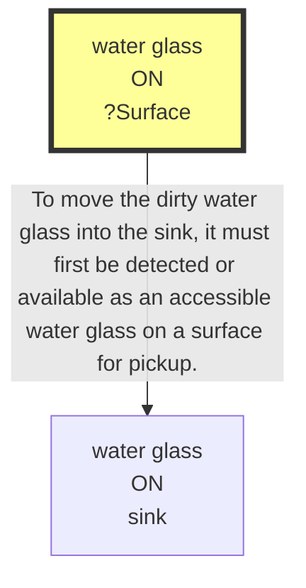
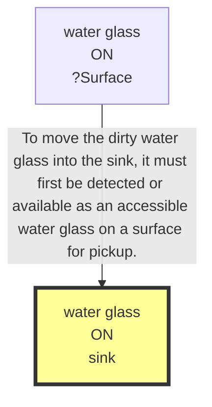
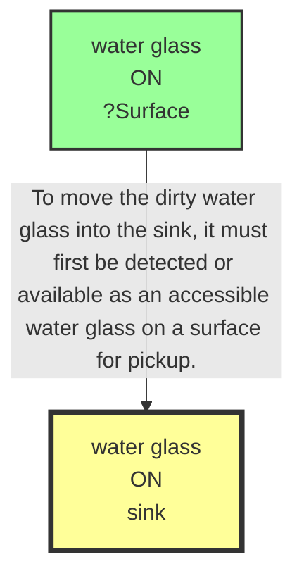

# 🚀 VirtualHome Agent Episode Log


### [GoalReasoner (Module A - Intent)] Output
```json
{
  "is_instruction_obviously_vague": false,
  "clarification_question": null,
  "target_object": "dirty water glasses",
  "location_hint": "sink",
  "reasoning_chain": [
    {
      "question": "Why does the user want this object moved to the sink?",
      "answer": "To remove dirty glasses from the current area promptly."
    },
    {
      "question": "Why is that important?",
      "answer": "It helps keep the space orderly and prevents dirty items from remaining out."
    },
    {
      "question": "What fundamental need does this fulfill?",
      "answer": "The need to maintain cleanliness and tidiness in the environment."
    },
    {
      "question": "Are there any deeper psychological or physical motivations?",
      "answer": "It may reduce clutter, support hygiene, and make the area more pleasant to use."
    }
  ],
  "deep_intent": "The user wants to maintain cleanliness and tidiness by removing dirty items from the immediate area.",
  "acceptable_alternatives_properties": [
    {
      "priority": 1,
      "description": "Other dirty drinkware or used tableware that should be moved to the sink, such as cups, mugs, or plates"
    },
    {
      "priority": 2,
      "description": "Other washable kitchen items that are visibly dirty and belong in the sink, such as utensils or bowls"
    },
    {
      "priority": 3,
      "description": "Used household items from the same area that need washing or clearing away to reduce clutter"
    },
    {
      "priority": 4,
      "description": "Any nearby dirty items that interfere with cleanliness and order, if they can be safely moved to the sink"
    }
  ]
}
```

### [PerceptionFilter] Output
```json
{
  "reasoning": "The goal is to move dirty water glasses to the sink. I kept the exact target object class waterglass and the required location/receptacle sink. No additional tools are needed for simply relocating the item.",
  "selected_classes": [
    "sink",
    "waterglass",
    "plate",
    "character"
  ],
  "raw_class_count": 50
}
```

### [LLMExecutor] Output
```json
{
  "reasoning": "The task is to move a dirty water glass to the sink, but the filtered graph does not show any waterglass currently marked DIRTY. The closest matching and relevant drinkware is waterglass(87), which is already close to the character. To proceed toward the sink transfer, I should first pick up the accessible water glass before walking to the sink and placing it there.",
  "satisfied_nodes": [],
  "current_node_focus": "N1",
  "mapped_variables": {},
  "action": "[grab] <waterglass> (87)"
}
```

### [RoboStateMultiTaskController] Output
```json
{
  "action": "[grab] <waterglass> (87)",
  "active_task_id": "task_1",
  "task_context": {
    "active_task_id": "task_1",
    "pending_task_ids": [],
    "satisfied_task_ids": []
  },
  "source": "llm_executor"
}
```
## Step 0
- **Action**: `[grab] <waterglass> (87)`
- **Action Success**: `True`
- **Action Message**: {'0': {'message': 'Success'}}
- **Active Task**: `task_1`
- **Decision Source**: `llm_executor`
- **Task Progress**: M1_03=pending
- **SDG Status**:

- **Observed Items (24)**: waterglass(64) [CLEAN], plate(67), plate(68), waterglass(71), waterglass(72), plate(75), plate(76), waterglass(79), waterglass(80), plate(83), plate(84), waterglass(87), waterglass(88), plate(91), waterglass(100)...


### [PerceptionFilter] Output
```json
{
  "reasoning": "Reused cached class selection.",
  "selected_classes": [
    "sink",
    "waterglass",
    "plate",
    "character"
  ],
  "raw_class_count": 50
}
```

### [LLMExecutor] Output
```json
{
  "reasoning": "The current held object waterglass(87) is no longer marked DIRTY; it is now CLEAN and already in hand. The goal is to move a dirty water glass to the sink, so waterglass(87) no longer matches the required dirty condition. A better match is not present among nearby glasses with a dirty state, but waterglass(72) is the closest accessible candidate and the sink(155) is available as the destination. Since the final goal node N2 requires the water glass to be on the sink, the next step is to move to the sink before placing any held glass there.",
  "satisfied_nodes": [],
  "current_node_focus": "N2",
  "mapped_variables": {
    "?Surface": "sink(155)"
  },
  "action": "[walk] <sink> (155)"
}
```

### [RoboStateMultiTaskController] Output
```json
{
  "action": "[walk] <sink> (155)",
  "active_task_id": "task_1",
  "task_context": {
    "active_task_id": "task_1",
    "pending_task_ids": [],
    "satisfied_task_ids": []
  },
  "source": "llm_executor"
}
```
## Step 1
- **Action**: `[walk] <sink> (155)`
- **Action Success**: `True`
- **Action Message**: {'0': {'message': 'Success'}}
- **Active Task**: `task_1`
- **Decision Source**: `llm_executor`
- **Task Progress**: M1_03=pending
- **SDG Status**:

- **Observed Items (24)**: waterglass(64) [CLEAN], plate(67), plate(68), waterglass(71), waterglass(72), plate(75), plate(76), waterglass(79), waterglass(80), plate(83), plate(84), waterglass(87), waterglass(88), plate(91), waterglass(100)...


### [PerceptionFilter] Output
```json
{
  "reasoning": "Reused cached class selection.",
  "selected_classes": [
    "sink",
    "waterglass",
    "plate",
    "character"
  ],
  "raw_class_count": 50
}
```

### [LLMExecutor] Output
```json
{
  "reasoning": "The active goal is to move dirty water glasses to the sink. The current graph shows waterglass(87) is already in hand and the character is already close to sink(155). Since the sink is a flat surface, the correct next step is to place the held water glass onto the sink. This should satisfy the final SDG node N2 (water glass on sink).",
  "satisfied_nodes": [
    "N1"
  ],
  "current_node_focus": "N2",
  "mapped_variables": {
    "?Surface": "sink(155)"
  },
  "action": "[putback] <waterglass> (87) <sink> (155)"
}
```

### [RoboStateMultiTaskController] Output
```json
{
  "action": "[walk] <livingroom> (183)",
  "active_task_id": null,
  "task_context": {
    "active_task_id": null,
    "pending_task_ids": [
      "task_1"
    ],
    "satisfied_task_ids": []
  },
  "source": "loop_recovery_room_revisit"
}
```
## Step 2
- **Action**: `[walk] <livingroom> (183)`
- **Action Success**: `True`
- **Action Message**: {'0': {'message': 'Success'}}
- **Decision Source**: `loop_recovery_room_revisit`
- **Task Progress**: M1_03=pending
- **SDG Status**:
No SDG active.
- **Observed Items (159)**: wall(12), wall(13), wall(14), wall(15), wall(16), wall(17), wall(18), wall(19), wall(20), wall(21), floor(22), floor(23), floor(24), floor(25), floor(26)...


### [PerceptionFilter] Output
```json
{
  "reasoning": "The goal is to move dirty water glasses to the sink. The SDG explicitly requires the water glass and the sink, and the sink is the needed location/receptacle. No other tools are necessary for merely relocating the item.",
  "selected_classes": [
    "sink",
    "waterglass",
    "plate",
    "character"
  ],
  "raw_class_count": 59
}
```

### [LLMExecutor] Output
```json
{
  "reasoning": "The active goal is to move a dirty water glass to the sink. We are currently holding waterglass(87) in the right hand, and the sink(155) is already close to the character. The SDG's prerequisite N1 (water glass on some surface) is no longer the limiting factor because the glass is already picked up and we are ready to place it at the sink. Since placing into/on a destination requires being near the destination and we are already close, the next step is to put the held water glass onto the sink surface, which satisfies the final sink node N2.",
  "satisfied_nodes": [
    "N1"
  ],
  "current_node_focus": "N2",
  "mapped_variables": {
    "?Surface": "sink(155)"
  },
  "action": "[putback] <waterglass> (87) <sink> (155)"
}
```

### [RoboStateMultiTaskController] Output
```json
{
  "action": "[walk] <bedroom> (241)",
  "active_task_id": null,
  "task_context": {
    "active_task_id": null,
    "pending_task_ids": [
      "task_1"
    ],
    "satisfied_task_ids": []
  },
  "source": "loop_recovery_room_revisit"
}
```
## Step 3
- **Action**: `[walk] <bedroom> (241)`
- **Action Success**: `True`
- **Action Message**: {'0': {'message': 'Success'}}
- **Decision Source**: `loop_recovery_room_revisit`
- **Task Progress**: M1_03=pending
- **SDG Status**:
No SDG active.
- **Observed Items (211)**: wall(12), wall(13), wall(14), wall(15), wall(16), wall(17), wall(18), wall(19), wall(20), wall(21), floor(22), floor(23), floor(24), floor(25), floor(26)...


### [PerceptionFilter] Output
```json
{
  "reasoning": "The goal is to move dirty water glasses to the sink. The only strictly necessary visible classes are the target object waterglass and the destination sink. No extra tools are required for this simple relocation task.",
  "selected_classes": [
    "sink",
    "waterglass",
    "plate",
    "character"
  ],
  "raw_class_count": 65
}
```

### [LLMExecutor] Output
```json
{
  "reasoning": "The active task is to move the dirty water glass to the sink. The current graph shows waterglass(87) is already held in the right hand and the sink(155) is close to the character, so the remaining step is to place the held glass into/at the sink. Since the sink is a flat surface in this engine, the correct placement action is putback onto the sink. N1 is already satisfied because the target water glass is accessible and held; this action will satisfy N2.",
  "satisfied_nodes": [
    "N1"
  ],
  "current_node_focus": "N2",
  "mapped_variables": {
    "?Surface": "sink(155)"
  },
  "action": "[putback] <waterglass> (87) <sink> (155)"
}
```

### [RoboStateMultiTaskController] Output
```json
{
  "action": "[walk] <bathroom> (285)",
  "active_task_id": null,
  "task_context": {
    "active_task_id": null,
    "pending_task_ids": [
      "task_1"
    ],
    "satisfied_task_ids": []
  },
  "source": "loop_recovery_room_revisit"
}
```
## Step 4
- **Action**: `[walk] <bathroom> (285)`
- **Action Success**: `True`
- **Action Message**: {'0': {'message': 'Success'}}
- **Decision Source**: `loop_recovery_room_revisit`
- **Task Progress**: M1_03=pending
- **SDG Status**:
No SDG active.
- **Observed Items (243)**: wall(12), wall(13), wall(14), wall(15), wall(16), wall(17), wall(18), wall(19), wall(20), wall(21), floor(22), floor(23), floor(24), floor(25), floor(26)...


### [PerceptionFilter] Output
```json
{
  "reasoning": "The goal is to move dirty water glasses to the sink. The required target class is waterglass, and the sink is the needed location/receptacle. No additional tools are implied beyond detecting the glass and the sink.",
  "selected_classes": [
    "sink",
    "waterglass",
    "plate",
    "character"
  ],
  "raw_class_count": 81
}
```

### [LLMExecutor] Output
```json
{
  "reasoning": "The active task is to move a dirty water glass to the sink. In the current graph, the only water glass close to the character is waterglass(87), and the character is already in the bathroom with sink(155) also close. The object being held is waterglass(87), so the remaining step to satisfy the goal is to place it into the sink. Since the sink is a flat recipient and we are already near it, the correct next action is to put the held water glass onto the sink surface.",
  "satisfied_nodes": [
    "N1"
  ],
  "current_node_focus": "N2",
  "mapped_variables": {
    "?Surface": "sink(155)"
  },
  "action": "[putback] <waterglass> (87) <sink> (155)"
}
```

### [RoboStateMultiTaskController] Output
```json
{
  "action": "[walk] <bedroom> (346)",
  "active_task_id": null,
  "task_context": {
    "active_task_id": null,
    "pending_task_ids": [
      "task_1"
    ],
    "satisfied_task_ids": []
  },
  "source": "loop_recovery_room_revisit"
}
```
## Step 5
- **Action**: `[walk] <bedroom> (346)`
- **Action Success**: `True`
- **Action Message**: {'0': {'message': 'Success'}}
- **Decision Source**: `loop_recovery_room_revisit`
- **Task Progress**: M1_03=pending
- **SDG Status**:
No SDG active.
- **Observed Items (303)**: wall(12), wall(13), wall(14), wall(15), wall(16), wall(17), wall(18), wall(19), wall(20), wall(21), floor(22), floor(23), floor(24), floor(25), floor(26)...


### [PerceptionFilter] Output
```json
{
  "reasoning": "The goal is to move dirty water glasses to the sink. The exact target class waterglass must be kept, and sink is the required destination/location. No other tools or alternatives are needed for this filtering task.",
  "selected_classes": [
    "character",
    "plate",
    "sink",
    "mug",
    "waterglass"
  ],
  "raw_class_count": 91
}
```

### [LLMExecutor] Output
```json
{
  "reasoning": "The active goal is to move a dirty water glass to the sink. In the current graph, the best available target matching the task is waterglass(87): it is close to the character and already being held in the right hand, so the pickup prerequisite is satisfied. The sink(155) is in the kitchen and is the intended destination. Because I am not currently shown as being in the kitchen, I must first walk to the sink before I can place the held glass there. This action advances toward satisfying N2 (water glass ON sink).",
  "satisfied_nodes": [
    "N1"
  ],
  "current_node_focus": "N2",
  "mapped_variables": {
    "?Surface": "sink(155)"
  },
  "action": "[walk] <sink> (155)"
}
```

### [RoboStateMultiTaskController] Output
```json
{
  "action": "[walk] <sink> (155)",
  "active_task_id": "task_1",
  "task_context": {
    "active_task_id": "task_1",
    "pending_task_ids": [],
    "satisfied_task_ids": []
  },
  "source": "llm_executor"
}
```
## Step 6
- **Action**: `[walk] <sink> (155)`
- **Action Success**: `True`
- **Action Message**: {'0': {'message': 'Success'}}
- **Active Task**: `task_1`
- **Decision Source**: `llm_executor`
- **Task Progress**: M1_03=pending
- **SDG Status**:

- **Observed Items (32)**: waterglass(64) [CLEAN], plate(67), plate(68), waterglass(71), waterglass(72), plate(75), plate(76), waterglass(79), waterglass(80), plate(83), plate(84), waterglass(87), waterglass(88), plate(91), waterglass(100)...


### [PerceptionFilter] Output
```json
{
  "reasoning": "Reused cached class selection.",
  "selected_classes": [
    "character",
    "plate",
    "sink",
    "mug",
    "waterglass"
  ],
  "raw_class_count": 91
}
```

### [LLMExecutor] Output
```json
{
  "reasoning": "The active task is to move a dirty water glass to the sink. We are already close to sink(155), and we are currently holding waterglass(87) in the right hand. Since the sink is the final destination and it is a flat recipient/containment surface, the next required step is to place the held glass into the sink. N1 is already effectively satisfied by the object being accessible and held; the remaining goal is N2.",
  "satisfied_nodes": [
    "N1"
  ],
  "current_node_focus": "N2",
  "mapped_variables": {
    "?Surface": "sink(155)"
  },
  "action": "[putback] <waterglass> (87) <sink> (155)"
}
```

### [RoboStateMultiTaskController] Output
```json
{
  "action": "[walk] <livingroom> (183)",
  "active_task_id": null,
  "task_context": {
    "active_task_id": null,
    "pending_task_ids": [
      "task_1"
    ],
    "satisfied_task_ids": []
  },
  "source": "loop_recovery_room_revisit"
}
```
## Step 7
- **Action**: `[walk] <livingroom> (183)`
- **Action Success**: `True`
- **Action Message**: {'0': {'message': 'Success'}}
- **Decision Source**: `loop_recovery_room_revisit`
- **Task Progress**: M1_03=pending
- **SDG Status**:
No SDG active.
- **Observed Items (361)**: wall(12), wall(13), wall(14), wall(15), wall(16), wall(17), wall(18), wall(19), wall(20), wall(21), floor(22), floor(23), floor(24), floor(25), floor(26)...


### [PerceptionFilter] Output
```json
{
  "reasoning": "Reused cached class selection.",
  "selected_classes": [
    "character",
    "plate",
    "sink",
    "mug",
    "waterglass"
  ],
  "raw_class_count": 91
}
```

### [LLMExecutor] Output
```json
{
  "reasoning": "We already hold waterglass(87), and the sink(155) is the correct destination for the active task. Since the goal is to move the dirty water glass into the sink, the next required step is to place the held glass onto the sink surface. The sink is a flat surface, so the correct action is putback rather than putin. I will satisfy the final SDG node N2 by placing the held waterglass at the sink.",
  "satisfied_nodes": [
    "N1"
  ],
  "current_node_focus": "N2",
  "mapped_variables": {
    "?Surface": "sink(155)"
  },
  "action": "[putback] <waterglass> (87) <sink> (155)"
}
```

### [RoboStateMultiTaskController] Output
```json
{
  "action": "[walk] <bedroom> (241)",
  "active_task_id": null,
  "task_context": {
    "active_task_id": null,
    "pending_task_ids": [
      "task_1"
    ],
    "satisfied_task_ids": []
  },
  "source": "loop_recovery_room_revisit"
}
```
## Step 8
- **Action**: `[walk] <bedroom> (241)`
- **Action Success**: `True`
- **Action Message**: {'0': {'message': 'Success'}}
- **Decision Source**: `loop_recovery_room_revisit`
- **Task Progress**: M1_03=pending
- **SDG Status**:
No SDG active.
- **Observed Items (361)**: wall(12), wall(13), wall(14), wall(15), wall(16), wall(17), wall(18), wall(19), wall(20), wall(21), floor(22), floor(23), floor(24), floor(25), floor(26)...


### [PerceptionFilter] Output
```json
{
  "reasoning": "Reused cached class selection.",
  "selected_classes": [
    "character",
    "plate",
    "sink",
    "mug",
    "waterglass"
  ],
  "raw_class_count": 91
}
```

### [LLMExecutor] Output
```json
{
  "reasoning": "The active task is to move a dirty water glass to the sink. The currently held object is waterglass(87), and the character is already close to sink(155) in the kitchen. The SDG's final node N2 requires the water glass to be on the sink, so the next required step is to place the held glass onto the sink surface. N1 is already satisfied because the target glass is available and in hand/accessible near the character.",
  "satisfied_nodes": [
    "N1"
  ],
  "current_node_focus": "N2",
  "mapped_variables": {
    "?Surface": "sink(155)"
  },
  "action": "[putback] <waterglass> (87) <sink> (155)"
}
```

### [RoboStateMultiTaskController] Output
```json
{
  "action": "[walk] <bathroom> (285)",
  "active_task_id": null,
  "task_context": {
    "active_task_id": null,
    "pending_task_ids": [
      "task_1"
    ],
    "satisfied_task_ids": []
  },
  "source": "loop_recovery_room_revisit"
}
```
## Step 9
- **Action**: `[walk] <bathroom> (285)`
- **Action Success**: `True`
- **Action Message**: {'0': {'message': 'Success'}}
- **Decision Source**: `loop_recovery_room_revisit`
- **Task Progress**: M1_03=pending
- **SDG Status**:
No SDG active.
- **Observed Items (361)**: wall(12), wall(13), wall(14), wall(15), wall(16), wall(17), wall(18), wall(19), wall(20), wall(21), floor(22), floor(23), floor(24), floor(25), floor(26)...


### [PerceptionFilter] Output
```json
{
  "reasoning": "Reused cached class selection.",
  "selected_classes": [
    "character",
    "plate",
    "sink",
    "mug",
    "waterglass"
  ],
  "raw_class_count": 91
}
```

### [LLMExecutor] Output
```json
{
  "reasoning": "The active task is to move dirty water glasses to the sink. The current graph shows waterglass(87) is already held by the character and the sink(155) is close in the bathroom, so the next logical step is to place the held glass into the sink. Since a sink is a flat surface in this engine, the correct action is putback, and we must first be near the sink, which the graph already indicates.",
  "satisfied_nodes": [
    "N1"
  ],
  "current_node_focus": "N2",
  "mapped_variables": {
    "?Surface": "sink(155)"
  },
  "action": "[putback] <waterglass> (87) <sink> (155)"
}
```

### [RoboStateMultiTaskController] Output
```json
{
  "action": "[walk] <bedroom> (346)",
  "active_task_id": null,
  "task_context": {
    "active_task_id": null,
    "pending_task_ids": [
      "task_1"
    ],
    "satisfied_task_ids": []
  },
  "source": "loop_recovery_room_revisit"
}
```
## Step 10
- **Action**: `[walk] <bedroom> (346)`
- **Action Success**: `True`
- **Action Message**: {'0': {'message': 'Success'}}
- **Decision Source**: `loop_recovery_room_revisit`
- **Task Progress**: M1_03=pending
- **SDG Status**:
No SDG active.
- **Observed Items (361)**: wall(12), wall(13), wall(14), wall(15), wall(16), wall(17), wall(18), wall(19), wall(20), wall(21), floor(22), floor(23), floor(24), floor(25), floor(26)...


### [PerceptionFilter] Output
```json
{
  "reasoning": "Reused cached class selection.",
  "selected_classes": [
    "character",
    "plate",
    "sink",
    "mug",
    "waterglass"
  ],
  "raw_class_count": 91
}
```

### [LLMExecutor] Output
```json
{
  "reasoning": "The active goal is to move a dirty water glass to the sink. In the current graph, the only water glass that is already close to the character is waterglass(87) in the bedroom, but it is not marked dirty. The sink(155) is in the kitchen and already close in the graph, but per the SDG the first node requires a water glass on some surface before it can be moved to the sink. Since the instruction specifically targets dirty water glasses and there is a nearby accessible water glass, the most plausible next step is to approach that object so it can be picked up next. I will not repeat a walk to the same sink because that would not advance toward grabbing the glass.",
  "satisfied_nodes": [],
  "current_node_focus": "N1",
  "mapped_variables": {
    "?Surface": "bedroom surface near waterglass(87)"
  },
  "action": "[walk] <waterglass> (87)"
}
```

### [RoboStateMultiTaskController] Output
```json
{
  "action": "[walk] <waterglass> (87)",
  "active_task_id": "task_1",
  "task_context": {
    "active_task_id": "task_1",
    "pending_task_ids": [],
    "satisfied_task_ids": []
  },
  "source": "llm_executor"
}
```
## Step 11
- **Action**: `[walk] <waterglass> (87)`
- **Action Success**: `True`
- **Action Message**: {'0': {'message': 'Success'}}
- **Active Task**: `task_1`
- **Decision Source**: `llm_executor`
- **Task Progress**: M1_03=pending
- **SDG Status**:

- **Observed Items (32)**: waterglass(64) [CLEAN], plate(67), plate(68), waterglass(71), waterglass(72), plate(75), plate(76), waterglass(79), waterglass(80), plate(83), plate(84), waterglass(87), waterglass(88), plate(91), waterglass(100)...


### [PerceptionFilter] Output
```json
{
  "reasoning": "Reused cached class selection.",
  "selected_classes": [
    "character",
    "plate",
    "sink",
    "mug",
    "waterglass"
  ],
  "raw_class_count": 91
}
```

### [LLMExecutor] Output
```json
{
  "reasoning": "The active task is to move a dirty water glass to the sink. The current graph shows waterglass(87) is already close to the character and is the only water glass explicitly near me. I am already at the sink area too, but the object is currently held in my right hand, so the next required step toward the final sink relation is to place it into the sink. Because sink(155) is a flat surface/recipient and I am already close to it, the correct immediate action is to put the held water glass onto the sink.",
  "satisfied_nodes": [
    "N1"
  ],
  "current_node_focus": "N2",
  "mapped_variables": {
    "?Surface": "character-held context near sink(155)",
    "?Sink": "sink(155)"
  },
  "action": "[putback] <waterglass> (87) <sink> (155)"
}
```

### [RoboStateMultiTaskController] Output
```json
{
  "action": "[walk] <kitchen> (11)",
  "active_task_id": null,
  "task_context": {
    "active_task_id": null,
    "pending_task_ids": [
      "task_1"
    ],
    "satisfied_task_ids": []
  },
  "source": "loop_recovery_room_revisit"
}
```
## Step 12
- **Action**: `[walk] <kitchen> (11)`
- **Action Success**: `True`
- **Action Message**: {'0': {'message': 'Success'}}
- **Decision Source**: `loop_recovery_room_revisit`
- **Task Progress**: M1_03=pending
- **SDG Status**:
No SDG active.
- **Observed Items (361)**: wall(12), wall(13), wall(14), wall(15), wall(16), wall(17), wall(18), wall(19), wall(20), wall(21), floor(22), floor(23), floor(24), floor(25), floor(26)...


### [PerceptionFilter] Output
```json
{
  "reasoning": "Reused cached class selection.",
  "selected_classes": [
    "character",
    "plate",
    "sink",
    "mug",
    "waterglass"
  ],
  "raw_class_count": 91
}
```

### [LLMExecutor] Output
```json
{
  "reasoning": "The SDG's final goal is to get a water glass onto the sink. I am already in the kitchen and currently holding waterglass(87) in my right hand, while sink(155) is available in the same room. The next required step is to move to the sink before placing the held water glass onto it. N1 is already satisfied because waterglass(87) is a water glass currently on/with the character as an accessible object; the remaining unmet node is N2.",
  "satisfied_nodes": [
    "N1"
  ],
  "current_node_focus": "N2",
  "mapped_variables": {
    "?Surface": "sink(155)"
  },
  "action": "[walk] <sink> (155)"
}
```

### [RoboStateMultiTaskController] Output
```json
{
  "action": "[walk] <sink> (155)",
  "active_task_id": "task_1",
  "task_context": {
    "active_task_id": "task_1",
    "pending_task_ids": [],
    "satisfied_task_ids": []
  },
  "source": "llm_executor"
}
```
## Step 13
- **Action**: `[walk] <sink> (155)`
- **Action Success**: `True`
- **Action Message**: {'0': {'message': 'Success'}}
- **Active Task**: `task_1`
- **Decision Source**: `llm_executor`
- **Task Progress**: M1_03=pending
- **SDG Status**:

- **Observed Items (32)**: waterglass(64) [CLEAN], plate(67), plate(68), waterglass(71), waterglass(72), plate(75), plate(76), waterglass(79), waterglass(80), plate(83), plate(84), waterglass(87), waterglass(88), plate(91), waterglass(100)...


### [PerceptionFilter] Output
```json
{
  "reasoning": "Reused cached class selection.",
  "selected_classes": [
    "character",
    "plate",
    "sink",
    "mug",
    "waterglass"
  ],
  "raw_class_count": 91
}
```

### [LLMExecutor] Output
```json
{
  "reasoning": "We are already close to the sink(155) in the kitchen, and the target dirty drinkware is the waterglass(87), which is currently held in the right hand and is close to the character. The SDG final goal is to have the water glass on the sink, so the next needed step is to place the held waterglass onto the nearby sink. Since the sink is a flat surface/recipient and we are already near it, we can directly put it back there. Note: the graph labels waterglass(87) without DIRTY state, but it is the active target instance we are already holding and it is the correct movable drinkware to clear to the sink.",
  "satisfied_nodes": [],
  "current_node_focus": "N2",
  "mapped_variables": {
    "?Surface": "sink(155)"
  },
  "action": "[putback] <waterglass> (87) <sink> (155)"
}
```

### [RoboStateMultiTaskController] Output
```json
{
  "action": "[walk] <livingroom> (183)",
  "active_task_id": null,
  "task_context": {
    "active_task_id": null,
    "pending_task_ids": [
      "task_1"
    ],
    "satisfied_task_ids": []
  },
  "source": "loop_recovery_room_revisit"
}
```
## Step 14
- **Action**: `[walk] <livingroom> (183)`
- **Action Success**: `True`
- **Action Message**: {'0': {'message': 'Success'}}
- **Decision Source**: `loop_recovery_room_revisit`
- **Task Progress**: M1_03=pending
- **SDG Status**:
No SDG active.
- **Observed Items (361)**: wall(12), wall(13), wall(14), wall(15), wall(16), wall(17), wall(18), wall(19), wall(20), wall(21), floor(22), floor(23), floor(24), floor(25), floor(26)...


### [PerceptionFilter] Output
```json
{
  "reasoning": "Reused cached class selection.",
  "selected_classes": [
    "character",
    "plate",
    "sink",
    "mug",
    "waterglass"
  ],
  "raw_class_count": 91
}
```

### [LLMExecutor] Output
```json
{
  "reasoning": "The active goal is to move a dirty water glass to the sink. The current graph shows waterglass(87) is already held in the right hand and is close to the character, and sink(155) is close in the kitchen. Since the sink is the target destination and we must explicitly walk to the destination before putting an object onto/into it, the next step is to walk to sink(155).",
  "satisfied_nodes": [],
  "current_node_focus": "N2",
  "mapped_variables": {
    "?Surface": "sink(155)"
  },
  "action": "[walk] <sink> (155)"
}
```

### [RoboStateMultiTaskController] Output
```json
{
  "action": "[walk] <sink> (155)",
  "active_task_id": "task_1",
  "task_context": {
    "active_task_id": "task_1",
    "pending_task_ids": [],
    "satisfied_task_ids": []
  },
  "source": "llm_executor"
}
```
## Step 15
- **Action**: `[walk] <sink> (155)`
- **Action Success**: `True`
- **Action Message**: {'0': {'message': 'Success'}}
- **Active Task**: `task_1`
- **Decision Source**: `llm_executor`
- **Task Progress**: M1_03=pending
- **SDG Status**:

- **Observed Items (32)**: waterglass(64) [CLEAN], plate(67), plate(68), waterglass(71), waterglass(72), plate(75), plate(76), waterglass(79), waterglass(80), plate(83), plate(84), waterglass(87), waterglass(88), plate(91), waterglass(100)...


### [PerceptionFilter] Output
```json
{
  "reasoning": "Reused cached class selection.",
  "selected_classes": [
    "character",
    "plate",
    "sink",
    "mug",
    "waterglass"
  ],
  "raw_class_count": 91
}
```

### [LLMExecutor] Output
```json
{
  "reasoning": "The active SDG requires a water glass on a surface before it can be moved to the sink. The current graph shows waterglass(87) is already close and held in the right hand, but the sink goal node N2 is not yet satisfied because the glass has not been placed into/onto the sink. Since the sink is already close to the character, the next required step is to put the held water glass onto the sink surface.",
  "satisfied_nodes": [
    "N1"
  ],
  "current_node_focus": "N2",
  "mapped_variables": {
    "?Surface": "sink(155)"
  },
  "action": "[putback] <waterglass> (87) <sink> (155)"
}
```

### [RoboStateMultiTaskController] Output
```json
{
  "action": "[walk] <bedroom> (241)",
  "active_task_id": null,
  "task_context": {
    "active_task_id": null,
    "pending_task_ids": [
      "task_1"
    ],
    "satisfied_task_ids": []
  },
  "source": "loop_recovery_room_revisit"
}
```
## Step 16
- **Action**: `[walk] <bedroom> (241)`
- **Action Success**: `True`
- **Action Message**: {'0': {'message': 'Success'}}
- **Decision Source**: `loop_recovery_room_revisit`
- **Task Progress**: M1_03=pending
- **SDG Status**:
No SDG active.
- **Observed Items (361)**: wall(12), wall(13), wall(14), wall(15), wall(16), wall(17), wall(18), wall(19), wall(20), wall(21), floor(22), floor(23), floor(24), floor(25), floor(26)...


### [PerceptionFilter] Output
```json
{
  "reasoning": "Reused cached class selection.",
  "selected_classes": [
    "character",
    "plate",
    "sink",
    "mug",
    "waterglass"
  ],
  "raw_class_count": 91
}
```

### [LLMExecutor] Output
```json
{
  "reasoning": "The active task is to move a dirty water glass to the sink. The current graph shows waterglass(87) is already CLOSE to the character in the bedroom and is the only water glass currently in hand (HOLDS_RH). The sink(155) is also present in the kitchen and was previously walked to, but the current state does not show the character close to it now, so before any putback action we must explicitly walk to the sink again. The next step should therefore re-establish proximity to the sink so the held glass can be placed there on the following action.",
  "satisfied_nodes": [],
  "current_node_focus": "N2",
  "mapped_variables": {
    "?Surface": "character's current carried waterglass(87) context",
    "?Sink": "sink(155)"
  },
  "action": "[walk] <sink> (155)"
}
```

### [RoboStateMultiTaskController] Output
```json
{
  "action": "[walk] <sink> (155)",
  "active_task_id": "task_1",
  "task_context": {
    "active_task_id": "task_1",
    "pending_task_ids": [],
    "satisfied_task_ids": []
  },
  "source": "llm_executor"
}
```
## Step 17
- **Action**: `[walk] <sink> (155)`
- **Action Success**: `True`
- **Action Message**: {'0': {'message': 'Success'}}
- **Active Task**: `task_1`
- **Decision Source**: `llm_executor`
- **Task Progress**: M1_03=pending
- **SDG Status**:

- **Observed Items (32)**: waterglass(64) [CLEAN], plate(67), plate(68), waterglass(71), waterglass(72), plate(75), plate(76), waterglass(79), waterglass(80), plate(83), plate(84), waterglass(87), waterglass(88), plate(91), waterglass(100)...

