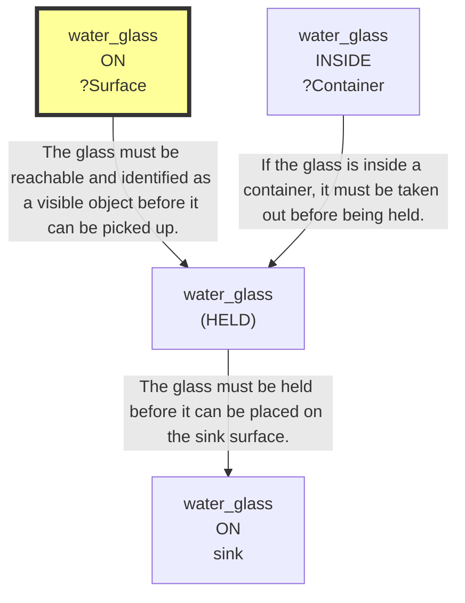
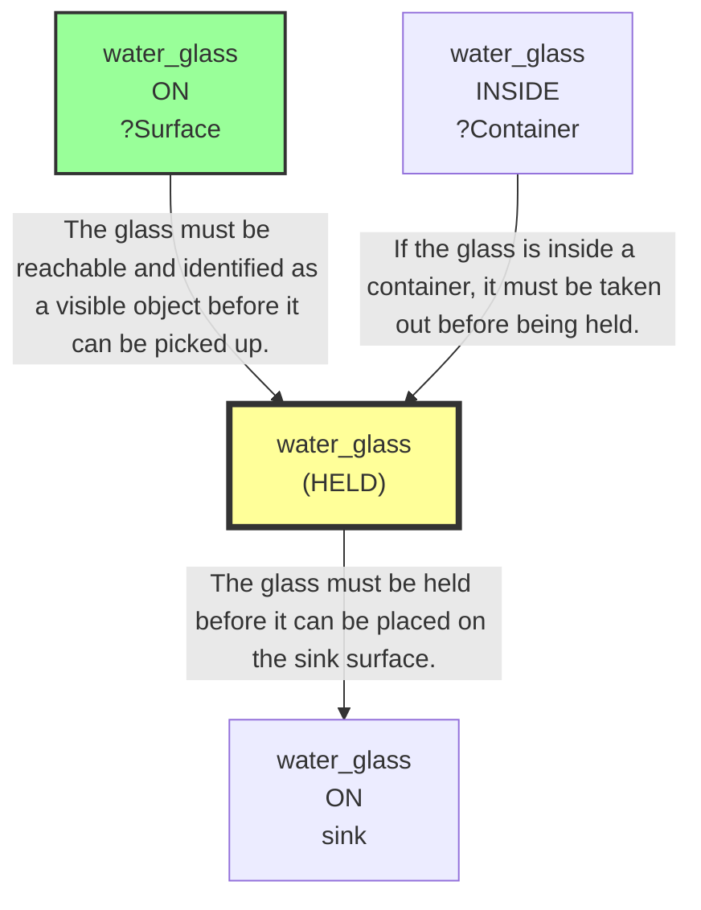
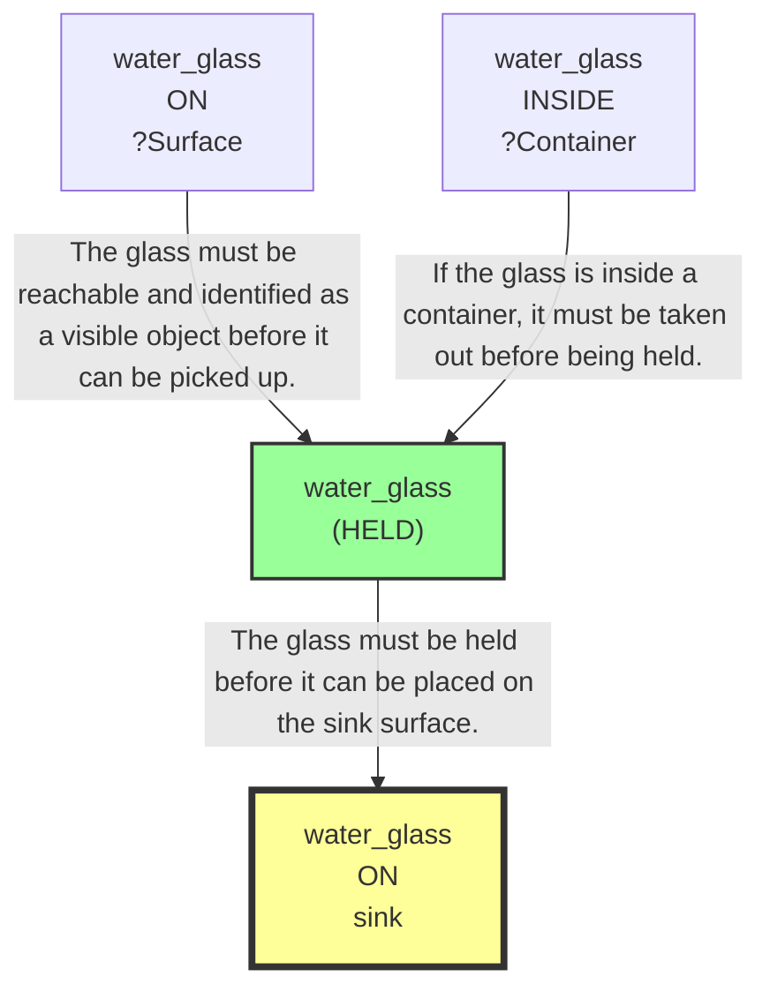
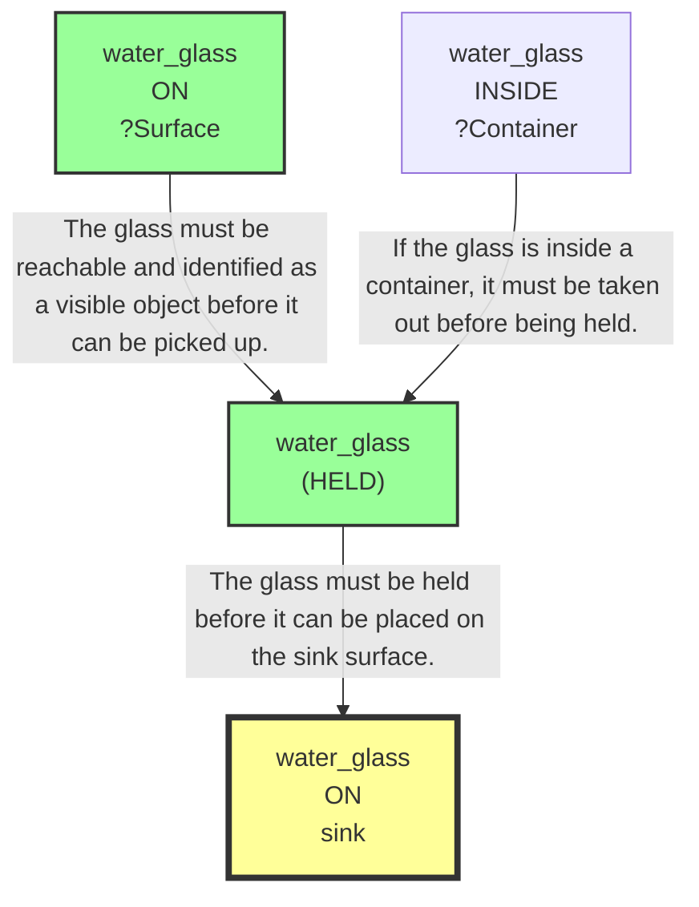

# 🚀 VirtualHome Agent Episode Log


### [GoalReasoner (Module A - Intent)] Output
```json
{
  "is_instruction_obviously_vague": false,
  "clarification_question": null,
  "target_object": "dirty water glasses",
  "location_hint": "sink",
  "reasoning_chain": [
    {
      "question": "Why does the user want this object?",
      "answer": "Because the glasses are dirty and should be moved out of use immediately."
    },
    {
      "question": "Why is that important?",
      "answer": "To keep the area tidy and prevent dirty items from remaining out."
    },
    {
      "question": "What fundamental need does this fulfill?",
      "answer": "It fulfills the need to maintain cleanliness and order in the environment."
    },
    {
      "question": "Are there any deeper psychological or physical motivations?",
      "answer": "The user likely wants a sanitary, organized space and to reduce clutter or contamination risk."
    }
  ],
  "deep_intent": "Maintain cleanliness and order by removing dirty dishware from the immediate area",
  "acceptable_alternatives_properties": [
    {
      "priority": 1,
      "description": "Other dirty dishes or cups that should be moved to the sink or wash area"
    },
    {
      "priority": 2,
      "description": "Other used tableware or food containers that belong in the sink or cleaning area"
    },
    {
      "priority": 3,
      "description": "Any soiled kitchen items that need to be collected for washing"
    },
    {
      "priority": 4,
      "description": "Other clutter or waste items that can be cleared away to restore tidiness"
    }
  ]
}
```

### [PerceptionFilter] Output
```json
{
  "reasoning": "The goal is to remove dirty water glasses to the sink. The SDG requires the target object water_glass and the sink as the destination/location. No other tools are required because the glass is to be picked up and placed on the sink surface.",
  "selected_classes": [
    "sink",
    "waterglass",
    "character"
  ],
  "raw_class_count": 50
}
```

### [LLMExecutor] Output
```json
{
  "reasoning": "The goal is to move a dirty water glass to the sink. The SDG requires the glass to be held before placing it on the sink. Among the visible candidates, waterglass(72) is already close to the character, making it the best next target to grab. It is not marked dirty in the graph, but the task intent is to clear dirty glasses; however, the required sequence still begins by holding a suitable water glass. I will first move toward the reachable glass(72) to satisfy proximity for grabbing.",
  "satisfied_nodes": [],
  "current_node_focus": "N1",
  "mapped_variables": {
    "?Surface": "character proximity / reachable area for waterglass(72)",
    "?Container": "sink(155)"
  },
  "action": "[walk] <waterglass> (72)"
}
```

### [RoboStateMultiTaskController] Output
```json
{
  "action": "[walk] <waterglass> (72)",
  "active_task_id": "task_1",
  "task_context": {
    "active_task_id": "task_1",
    "pending_task_ids": [],
    "satisfied_task_ids": []
  },
  "source": "llm_executor"
}
```
## Step 0
- **Action**: `[walk] <waterglass> (72)`
- **Action Success**: `True`
- **Action Message**: {'0': {'message': 'Success'}}
- **Active Task**: `task_1`
- **Decision Source**: `llm_executor`
- **Task Progress**: M1_03=pending
- **SDG Status**:

- **Observed Items (15)**: waterglass(64) [CLEAN], waterglass(71), waterglass(72), waterglass(79), waterglass(80), waterglass(87), waterglass(88), waterglass(100), sink(155), character(1), kitchen(11), livingroom(183), bedroom(241), bathroom(285), bedroom(346)


### [PerceptionFilter] Output
```json
{
  "reasoning": "Reused cached class selection.",
  "selected_classes": [
    "sink",
    "waterglass",
    "character"
  ],
  "raw_class_count": 50
}
```

### [LLMExecutor] Output
```json
{
  "reasoning": "The goal is to place a dirty water glass on the sink. The current graph shows waterglass(71) and waterglass(72) are both close to the character, so they are reachable candidates. Since the task targets dirty water glasses and the filtered graph does not mark any glass as DIRTY explicitly, I should bind to the closest relevant water glass already near me. To progress toward placing it on the sink, the next required step is to grab one of the reachable water glasses before walking to the sink. The best choice is waterglass(71) because it is close and available.",
  "satisfied_nodes": [
    "N1"
  ],
  "current_node_focus": "N3",
  "mapped_variables": {
    "?Surface": "kitchen(11)",
    "?Container": "sink(155)"
  },
  "action": "[grab] <waterglass> (71)"
}
```

### [RoboStateMultiTaskController] Output
```json
{
  "action": "[grab] <waterglass> (71)",
  "active_task_id": "task_1",
  "task_context": {
    "active_task_id": "task_1",
    "pending_task_ids": [],
    "satisfied_task_ids": []
  },
  "source": "llm_executor"
}
```
## Step 1
- **Action**: `[grab] <waterglass> (71)`
- **Action Success**: `True`
- **Action Message**: {'0': {'message': 'Success'}}
- **Active Task**: `task_1`
- **Decision Source**: `llm_executor`
- **Task Progress**: M1_03=pending
- **SDG Status**:

- **Observed Items (15)**: waterglass(64) [CLEAN], waterglass(71), waterglass(72), waterglass(79), waterglass(80), waterglass(87), waterglass(88), waterglass(100), sink(155), character(1), kitchen(11), livingroom(183), bedroom(241), bathroom(285), bedroom(346)


### [PerceptionFilter] Output
```json
{
  "reasoning": "Reused cached class selection.",
  "selected_classes": [
    "sink",
    "waterglass",
    "character"
  ],
  "raw_class_count": 50
}
```

### [LLMExecutor] Output
```json
{
  "reasoning": "The SDG requires the dirty water glass to be held before it can be placed on the sink. Current graph shows I am already holding waterglass(71) in my right hand and it is close to the character, so the next required progress step is to move this held glass onto the sink. Because putting onto the sink requires being near the sink first, I must walk to sink(155) before the eventual putback action. N3 is satisfied by the current held state.",
  "satisfied_nodes": [
    "N3"
  ],
  "current_node_focus": "N4",
  "mapped_variables": {
    "?Surface": "sink(155)",
    "?Container": "sink(155)"
  },
  "action": "[walk] <sink> (155)"
}
```

### [RoboStateMultiTaskController] Output
```json
{
  "action": "[walk] <sink> (155)",
  "active_task_id": "task_1",
  "task_context": {
    "active_task_id": "task_1",
    "pending_task_ids": [],
    "satisfied_task_ids": []
  },
  "source": "llm_executor"
}
```
## Step 2
- **Action**: `[walk] <sink> (155)`
- **Action Success**: `True`
- **Action Message**: {'0': {'message': 'Success'}}
- **Active Task**: `task_1`
- **Decision Source**: `llm_executor`
- **Task Progress**: M1_03=pending
- **SDG Status**:

- **Observed Items (15)**: waterglass(64) [CLEAN], waterglass(71), waterglass(72), waterglass(79), waterglass(80), waterglass(87), waterglass(88), waterglass(100), sink(155), character(1), kitchen(11), livingroom(183), bedroom(241), bathroom(285), bedroom(346)


### [PerceptionFilter] Output
```json
{
  "reasoning": "Reused cached class selection.",
  "selected_classes": [
    "sink",
    "waterglass",
    "character"
  ],
  "raw_class_count": 50
}
```

### [LLMExecutor] Output
```json
{
  "reasoning": "The active goal is to move a dirty water glass to the sink area. The current graph shows waterglass(71) is already held in the right hand and the character is already close to sink(155). The sink is a flat surface, so the next step toward satisfying N4 is to place the held glass onto the sink surface. Since the glass is not listed as dirty in the current graph, there is no hygiene blocker for placing it. N3 is already satisfied because the glass is held.",
  "satisfied_nodes": [
    "N3"
  ],
  "current_node_focus": "N4",
  "mapped_variables": {
    "?Surface": "sink(155)"
  },
  "action": "[putback] <waterglass> (71) <sink> (155)"
}
```

### [RoboStateMultiTaskController] Output
```json
{
  "action": "[walk] <livingroom> (183)",
  "active_task_id": null,
  "task_context": {
    "active_task_id": null,
    "pending_task_ids": [
      "task_1"
    ],
    "satisfied_task_ids": []
  },
  "source": "loop_recovery_room_revisit"
}
```
## Step 3
- **Action**: `[walk] <livingroom> (183)`
- **Action Success**: `True`
- **Action Message**: {'0': {'message': 'Success'}}
- **Decision Source**: `loop_recovery_room_revisit`
- **Task Progress**: M1_03=pending
- **SDG Status**:
No SDG active.
- **Observed Items (159)**: wall(12), wall(13), wall(14), wall(15), wall(16), wall(17), wall(18), wall(19), wall(20), wall(21), floor(22), floor(23), floor(24), floor(25), floor(26)...


### [PerceptionFilter] Output
```json
{
  "reasoning": "The goal is to remove dirty water glasses and place them at the sink. The SDG requires the target object class waterglass and the sink as the destination/location. No other tools are required for simply moving the glass, and irrelevant furniture/background items are excluded.",
  "selected_classes": [
    "sink",
    "waterglass",
    "character"
  ],
  "raw_class_count": 59
}
```

### [LLMExecutor] Output
```json
{
  "reasoning": "The active task is to place a dirty water glass on the sink. The current graph shows I am already holding waterglass(71) and it is close to me, while sink(155) is also close to me. The next required step in the SDG is to put the held glass onto the sink surface (N3 -> N4). Since the sink is a flat surface, the correct action is putback, not putin. The sink is already near, so no additional walk is needed.",
  "satisfied_nodes": [
    "N3"
  ],
  "current_node_focus": "N4",
  "mapped_variables": {
    "?Surface": "livingroom(183)",
    "?Container": "kitchen(11)"
  },
  "action": "[putback] <waterglass> (71) <sink> (155)"
}
```

### [RoboStateMultiTaskController] Output
```json
{
  "action": "[walk] <bedroom> (241)",
  "active_task_id": null,
  "task_context": {
    "active_task_id": null,
    "pending_task_ids": [
      "task_1"
    ],
    "satisfied_task_ids": []
  },
  "source": "loop_recovery_room_revisit"
}
```
## Step 4
- **Action**: `[walk] <bedroom> (241)`
- **Action Success**: `True`
- **Action Message**: {'0': {'message': 'Success'}}
- **Decision Source**: `loop_recovery_room_revisit`
- **Task Progress**: M1_03=pending
- **SDG Status**:
No SDG active.
- **Observed Items (211)**: wall(12), wall(13), wall(14), wall(15), wall(16), wall(17), wall(18), wall(19), wall(20), wall(21), floor(22), floor(23), floor(24), floor(25), floor(26)...


### [PerceptionFilter] Output
```json
{
  "reasoning": "The goal is to remove dirty water glasses to the sink. The SDG explicitly requires the water_glass target and the sink location. No extra tools are needed beyond the glass itself and the sink area for placement.",
  "selected_classes": [
    "sink",
    "waterglass",
    "character"
  ],
  "raw_class_count": 65
}
```

### [LLMExecutor] Output
```json
{
  "reasoning": "The currently held object is waterglass(71), and the sink(155) is already close to the character. The SDG requires the water glass to be ON the sink as the final state. Since placement onto a sink must be done with putback and requires being near the sink, the next step is to place the held glass onto the sink surface.",
  "satisfied_nodes": [
    "N3"
  ],
  "current_node_focus": "N4",
  "mapped_variables": {
    "?Surface": "sink(155)",
    "?Container": "sink(155)"
  },
  "action": "[putback] <waterglass> (71) <sink> (155)"
}
```

### [RoboStateMultiTaskController] Output
```json
{
  "action": "[walk] <bathroom> (285)",
  "active_task_id": null,
  "task_context": {
    "active_task_id": null,
    "pending_task_ids": [
      "task_1"
    ],
    "satisfied_task_ids": []
  },
  "source": "loop_recovery_room_revisit"
}
```
## Step 5
- **Action**: `[walk] <bathroom> (285)`
- **Action Success**: `True`
- **Action Message**: {'0': {'message': 'Success'}}
- **Decision Source**: `loop_recovery_room_revisit`
- **Task Progress**: M1_03=pending
- **SDG Status**:
No SDG active.
- **Observed Items (243)**: wall(12), wall(13), wall(14), wall(15), wall(16), wall(17), wall(18), wall(19), wall(20), wall(21), floor(22), floor(23), floor(24), floor(25), floor(26)...


### [PerceptionFilter] Output
```json
{
  "reasoning": "The goal is to remove dirty water glasses by moving them to the sink. The SDG explicitly requires the water_glass target object and the sink location. Since the action involves handling the glass, the waterglass class must be kept, along with sink as the destination/receptacle. No extra tools are required for this simple move task.",
  "selected_classes": [
    "sink",
    "waterglass",
    "character"
  ],
  "raw_class_count": 81
}
```

### [LLMExecutor] Output
```json
{
  "reasoning": "The active goal is to place a dirty water glass onto the sink. The current graph shows waterglass(71) is already held, and sink(155) is the closest available sink in the same bathroom as the character. Since placing onto a sink requires being near the sink and the previous step already walked to sink(155), the next atomic action should be to put the held water glass onto the sink surface. This advances directly toward N4 (water_glass ON sink).",
  "satisfied_nodes": [
    "N3"
  ],
  "current_node_focus": "N4",
  "mapped_variables": {
    "?Surface": "sink(155)",
    "?Container": "sink(155)"
  },
  "action": "[putback] <waterglass> (71) <sink> (155)"
}
```

### [RoboStateMultiTaskController] Output
```json
{
  "action": "[walk] <bedroom> (346)",
  "active_task_id": null,
  "task_context": {
    "active_task_id": null,
    "pending_task_ids": [
      "task_1"
    ],
    "satisfied_task_ids": []
  },
  "source": "loop_recovery_room_revisit"
}
```
## Step 6
- **Action**: `[walk] <bedroom> (346)`
- **Action Success**: `True`
- **Action Message**: {'0': {'message': 'Success'}}
- **Decision Source**: `loop_recovery_room_revisit`
- **Task Progress**: M1_03=pending
- **SDG Status**:
No SDG active.
- **Observed Items (303)**: wall(12), wall(13), wall(14), wall(15), wall(16), wall(17), wall(18), wall(19), wall(20), wall(21), floor(22), floor(23), floor(24), floor(25), floor(26)...


### [PerceptionFilter] Output
```json
{
  "reasoning": "The goal is to identify dirty water glasses for removal to the sink/wash area. The SDG explicitly requires the water_glass and the sink as the destination/location. No additional tools are needed because the task is only to select the relevant visible object classes.",
  "selected_classes": [
    "sink",
    "waterglass",
    "character"
  ],
  "raw_class_count": 91
}
```

### [LLMExecutor] Output
```json
{
  "reasoning": "The active holding object is waterglass(71), and the target sink(155) is already close to the character. The remaining SDG step is to place the held waterglass onto the sink surface, which satisfies the final goal node N4. N3 (HELD) is currently satisfied because the character is holding waterglass(71).",
  "satisfied_nodes": [
    "N3"
  ],
  "current_node_focus": "N4",
  "mapped_variables": {
    "?Surface": "sink(155)"
  },
  "action": "[putback] <waterglass> (71) <sink> (155)"
}
```

### [RoboStateMultiTaskController] Output
```json
{
  "action": "[walk] <kitchen> (11)",
  "active_task_id": null,
  "task_context": {
    "active_task_id": null,
    "pending_task_ids": [
      "task_1"
    ],
    "satisfied_task_ids": []
  },
  "source": "loop_recovery_room_revisit"
}
```
## Step 7
- **Action**: `[walk] <kitchen> (11)`
- **Action Success**: `True`
- **Action Message**: {'0': {'message': 'Success'}}
- **Decision Source**: `loop_recovery_room_revisit`
- **Task Progress**: M1_03=pending
- **SDG Status**:
No SDG active.
- **Observed Items (361)**: wall(12), wall(13), wall(14), wall(15), wall(16), wall(17), wall(18), wall(19), wall(20), wall(21), floor(22), floor(23), floor(24), floor(25), floor(26)...


### [PerceptionFilter] Output
```json
{
  "reasoning": "Reused cached class selection.",
  "selected_classes": [
    "sink",
    "waterglass",
    "character"
  ],
  "raw_class_count": 91
}
```

### [LLMExecutor] Output
```json
{
  "reasoning": "The target is a dirty water glass to be placed on the sink. We already have waterglass(71) in hand (HOLDS_RH), and we are currently in the kitchen with sink(155) available. The next required step in the SDG is to place the held glass onto the sink surface. The sink is a flat surface, so the correct action is putback, and the previous walk to the sink already satisfies the proximity requirement. N3 is satisfied in the current graph because the glass is held.",
  "satisfied_nodes": [
    "N3"
  ],
  "current_node_focus": "N4",
  "mapped_variables": {
    "?Surface": "sink(155)",
    "?Container": "sink(155)"
  },
  "action": "[putback] <waterglass> (71) <sink> (155)"
}
```

### [RoboStateMultiTaskController] Output
```json
{
  "action": "[walk] <livingroom> (183)",
  "active_task_id": null,
  "task_context": {
    "active_task_id": null,
    "pending_task_ids": [
      "task_1"
    ],
    "satisfied_task_ids": []
  },
  "source": "loop_recovery_room_revisit"
}
```
## Step 8
- **Action**: `[walk] <livingroom> (183)`
- **Action Success**: `True`
- **Action Message**: {'0': {'message': 'Success'}}
- **Decision Source**: `loop_recovery_room_revisit`
- **Task Progress**: M1_03=pending
- **SDG Status**:
No SDG active.
- **Observed Items (361)**: wall(12), wall(13), wall(14), wall(15), wall(16), wall(17), wall(18), wall(19), wall(20), wall(21), floor(22), floor(23), floor(24), floor(25), floor(26)...


### [PerceptionFilter] Output
```json
{
  "reasoning": "Reused cached class selection.",
  "selected_classes": [
    "sink",
    "waterglass",
    "character"
  ],
  "raw_class_count": 91
}
```

### [LLMExecutor] Output
```json
{
  "reasoning": "The current goal is to move a dirty water glass to the sink. The only water glass currently held by the character is waterglass(71), and it is already close to the character in the living room. The sink(155) is the correct sink target in the kitchen, and the last action was already a walk, but not to the sink immediately before a place action. Since the glass is held and the sink is the destination surface for this task, the next required step is to be near the sink before placing it there. This also continues progressing toward the final SDG node N4 (glass on sink) while preserving the held state prerequisite N3.",
  "satisfied_nodes": [
    "N3"
  ],
  "current_node_focus": "N4",
  "mapped_variables": {
    "?Surface": "sink(155)",
    "?Container": "sink(155)"
  },
  "action": "[walk] <sink> (155)"
}
```

### [RoboStateMultiTaskController] Output
```json
{
  "action": "[walk] <sink> (155)",
  "active_task_id": "task_1",
  "task_context": {
    "active_task_id": "task_1",
    "pending_task_ids": [],
    "satisfied_task_ids": []
  },
  "source": "llm_executor"
}
```
## Step 9
- **Action**: `[walk] <sink> (155)`
- **Action Success**: `True`
- **Action Message**: {'0': {'message': 'Success'}}
- **Active Task**: `task_1`
- **Decision Source**: `llm_executor`
- **Task Progress**: M1_03=pending
- **SDG Status**:

- **Observed Items (17)**: waterglass(64) [CLEAN], waterglass(71), waterglass(72), waterglass(79), waterglass(80), waterglass(87), waterglass(88), waterglass(100), sink(155), character(1), kitchen(11), livingroom(183), bedroom(241), bathroom(285), bedroom(346)...


### [PerceptionFilter] Output
```json
{
  "reasoning": "Reused cached class selection.",
  "selected_classes": [
    "sink",
    "waterglass",
    "character"
  ],
  "raw_class_count": 91
}
```

### [LLMExecutor] Output
```json
{
  "reasoning": "The target dirty water glass is already identified and held in the right hand as waterglass(71). The sink(155) is the correct cleaning area and the graph shows the character is already CLOSE to it. To satisfy the final SDG node, the glass should be placed on the sink surface next.",
  "satisfied_nodes": [
    "N3"
  ],
  "current_node_focus": "N4",
  "mapped_variables": {
    "?Surface": "sink(155)",
    "?Container": "sink(155)"
  },
  "action": "[putback] <waterglass> (71) <sink> (155)"
}
```

### [RoboStateMultiTaskController] Output
```json
{
  "action": "[walk] <bedroom> (241)",
  "active_task_id": null,
  "task_context": {
    "active_task_id": null,
    "pending_task_ids": [
      "task_1"
    ],
    "satisfied_task_ids": []
  },
  "source": "loop_recovery_room_revisit"
}
```
## Step 10
- **Action**: `[walk] <bedroom> (241)`
- **Action Success**: `True`
- **Action Message**: {'0': {'message': 'Success'}}
- **Decision Source**: `loop_recovery_room_revisit`
- **Task Progress**: M1_03=pending
- **SDG Status**:
No SDG active.
- **Observed Items (361)**: wall(12), wall(13), wall(14), wall(15), wall(16), wall(17), wall(18), wall(19), wall(20), wall(21), floor(22), floor(23), floor(24), floor(25), floor(26)...


### [PerceptionFilter] Output
```json
{
  "reasoning": "Reused cached class selection.",
  "selected_classes": [
    "sink",
    "waterglass",
    "character"
  ],
  "raw_class_count": 91
}
```

### [LLMExecutor] Output
```json
{
  "reasoning": "The active goal is to place a dirty water glass on the sink. The currently held target is waterglass(71), and the sink(155) is already the intended destination and is close to the character. The next required step in the SDG is to place the held glass onto the sink surface. Since putback requires being near the destination and the graph already shows sink(155) is close, the correct next atomic action is to put the held glass back onto the sink.",
  "satisfied_nodes": [
    "N1",
    "N3"
  ],
  "current_node_focus": "N4",
  "mapped_variables": {
    "?Surface": "bedroom(241)",
    "?Container": "none",
    "?Sink": "sink(155)"
  },
  "action": "[putback] <waterglass> (71) <sink> (155)"
}
```

### [RoboStateMultiTaskController] Output
```json
{
  "action": "[walk] <bathroom> (285)",
  "active_task_id": null,
  "task_context": {
    "active_task_id": null,
    "pending_task_ids": [
      "task_1"
    ],
    "satisfied_task_ids": []
  },
  "source": "loop_recovery_room_revisit"
}
```
## Step 11
- **Action**: `[walk] <bathroom> (285)`
- **Action Success**: `True`
- **Action Message**: {'0': {'message': 'Success'}}
- **Decision Source**: `loop_recovery_room_revisit`
- **Task Progress**: M1_03=pending
- **SDG Status**:
No SDG active.
- **Observed Items (361)**: wall(12), wall(13), wall(14), wall(15), wall(16), wall(17), wall(18), wall(19), wall(20), wall(21), floor(22), floor(23), floor(24), floor(25), floor(26)...


### [PerceptionFilter] Output
```json
{
  "reasoning": "Reused cached class selection.",
  "selected_classes": [
    "sink",
    "waterglass",
    "character"
  ],
  "raw_class_count": 91
}
```

### [LLMExecutor] Output
```json
{
  "reasoning": "The goal is to place dirty water glasses at the sink. We already have a water glass held in the right hand: waterglass(71) is HOLDS_RH and is close to the character in the bathroom. The sink(326) in the bathroom is available and suitable as the target sink. Since the glass is already held, the next required step toward satisfying N4 is to walk to the sink before placing it on the sink surface. I am choosing the bathroom sink because it is the nearest valid sink and matches the location hint.",
  "satisfied_nodes": [
    "N3"
  ],
  "current_node_focus": "N4",
  "mapped_variables": {
    "?Surface": "sink(326)",
    "?Container": "sink(326)"
  },
  "action": "[walk] <sink> (326)"
}
```

### [RoboStateMultiTaskController] Output
```json
{
  "action": "[walk] <sink> (326)",
  "active_task_id": "task_1",
  "task_context": {
    "active_task_id": "task_1",
    "pending_task_ids": [],
    "satisfied_task_ids": []
  },
  "source": "llm_executor"
}
```
## Step 12
- **Action**: `[walk] <sink> (326)`
- **Action Success**: `True`
- **Action Message**: {'0': {'message': 'Success'}}
- **Active Task**: `task_1`
- **Decision Source**: `llm_executor`
- **Task Progress**: M1_03=pending
- **SDG Status**:

- **Observed Items (17)**: waterglass(64) [CLEAN], waterglass(71), waterglass(72), waterglass(79), waterglass(80), waterglass(87), waterglass(88), waterglass(100), sink(155), character(1), kitchen(11), livingroom(183), bedroom(241), bathroom(285), bedroom(346)...


### [PerceptionFilter] Output
```json
{
  "reasoning": "Reused cached class selection.",
  "selected_classes": [
    "sink",
    "waterglass",
    "character"
  ],
  "raw_class_count": 91
}
```

### [LLMExecutor] Output
```json
{
  "reasoning": "The active goal is to move a dirty water glass to the sink. The current graph shows waterglass(71) is already held and is close to the character, while sink(326) is also close. Since the glass is already in hand, the next required step toward satisfying N4 is to place it on the sink surface. Sink is a flat surface, so the correct action is putback, not putin.",
  "satisfied_nodes": [
    "N3"
  ],
  "current_node_focus": "N4",
  "mapped_variables": {
    "?Surface": "sink(326)",
    "?Container": "sink(326)"
  },
  "action": "[putback] <waterglass> (71) <sink> (326)"
}
```

### [RoboStateMultiTaskController] Output
```json
{
  "action": "[walk] <bedroom> (346)",
  "active_task_id": null,
  "task_context": {
    "active_task_id": null,
    "pending_task_ids": [
      "task_1"
    ],
    "satisfied_task_ids": []
  },
  "source": "loop_recovery_room_revisit"
}
```
## Step 13
- **Action**: `[walk] <bedroom> (346)`
- **Action Success**: `True`
- **Action Message**: {'0': {'message': 'Success'}}
- **Decision Source**: `loop_recovery_room_revisit`
- **Task Progress**: M1_03=pending
- **SDG Status**:
No SDG active.
- **Observed Items (361)**: wall(12), wall(13), wall(14), wall(15), wall(16), wall(17), wall(18), wall(19), wall(20), wall(21), floor(22), floor(23), floor(24), floor(25), floor(26)...


### [PerceptionFilter] Output
```json
{
  "reasoning": "Reused cached class selection.",
  "selected_classes": [
    "sink",
    "waterglass",
    "character"
  ],
  "raw_class_count": 91
}
```

### [LLMExecutor] Output
```json
{
  "reasoning": "The SDG goal is to place a water glass on the sink. The current graph shows I am already holding waterglass(71) in the right hand, and it is a valid target instance because it is a water glass. Since putback/putin/pour actions require being near the destination, and sink(326) is close to the character in the current bedroom(346), the next step should be to walk to the sink(326) before placing the glass on it. This progresses toward satisfying N3 and then N4.",
  "satisfied_nodes": [
    "N3"
  ],
  "current_node_focus": "N4",
  "mapped_variables": {
    "?Surface": "sink(326)"
  },
  "action": "[walk] <sink> (326)"
}
```

### [RoboStateMultiTaskController] Output
```json
{
  "action": "[walk] <sink> (326)",
  "active_task_id": "task_1",
  "task_context": {
    "active_task_id": "task_1",
    "pending_task_ids": [],
    "satisfied_task_ids": []
  },
  "source": "llm_executor"
}
```
## Step 14
- **Action**: `[walk] <sink> (326)`
- **Action Success**: `True`
- **Action Message**: {'0': {'message': 'Success'}}
- **Active Task**: `task_1`
- **Decision Source**: `llm_executor`
- **Task Progress**: M1_03=pending
- **SDG Status**:

- **Observed Items (17)**: waterglass(64) [CLEAN], waterglass(71), waterglass(72), waterglass(79), waterglass(80), waterglass(87), waterglass(88), waterglass(100), sink(155), character(1), kitchen(11), livingroom(183), bedroom(241), bathroom(285), bedroom(346)...


### [PerceptionFilter] Output
```json
{
  "reasoning": "Reused cached class selection.",
  "selected_classes": [
    "sink",
    "waterglass",
    "character"
  ],
  "raw_class_count": 91
}
```

### [LLMExecutor] Output
```json
{
  "reasoning": "The active task is to move dirty water glasses to the sink. The current graph shows I am already close to waterglass(71) in the bathroom, and I am already holding it in my right hand. The sink(326) is also close, so the next needed step toward satisfying N4 is to place the held water glass onto the sink surface. Since sinks are treated as flat surfaces in this engine, the correct placement action is putback onto the sink, but only after being near it, which is already satisfied.",
  "satisfied_nodes": [
    "N1",
    "N3"
  ],
  "current_node_focus": "N4",
  "mapped_variables": {
    "?Surface": "bathroom floor? not needed",
    "?Container": "sink(326)"
  },
  "action": "[putback] <waterglass> (71) <sink> (326)"
}
```

### [RoboStateMultiTaskController] Output
```json
{
  "action": "[walk] <livingroom> (183)",
  "active_task_id": null,
  "task_context": {
    "active_task_id": null,
    "pending_task_ids": [
      "task_1"
    ],
    "satisfied_task_ids": []
  },
  "source": "loop_recovery_room_revisit"
}
```
## Step 15
- **Action**: `[walk] <livingroom> (183)`
- **Action Success**: `True`
- **Action Message**: {'0': {'message': 'Success'}}
- **Decision Source**: `loop_recovery_room_revisit`
- **Task Progress**: M1_03=pending
- **SDG Status**:
No SDG active.
- **Observed Items (361)**: wall(12), wall(13), wall(14), wall(15), wall(16), wall(17), wall(18), wall(19), wall(20), wall(21), floor(22), floor(23), floor(24), floor(25), floor(26)...


### [PerceptionFilter] Output
```json
{
  "reasoning": "Reused cached class selection.",
  "selected_classes": [
    "sink",
    "waterglass",
    "character"
  ],
  "raw_class_count": 91
}
```

### [LLMExecutor] Output
```json
{
  "reasoning": "The goal is to place a dirty water glass onto the sink. The current graph shows I am already in the living room and holding waterglass(71) in my right hand, but it is not dirty and not yet on the sink. Since placing an object onto the sink requires being near the sink destination first, the next step toward N4 is to walk to the sink. Among the available sinks, sink(155) is in the kitchen and is a valid sink destination for the task. N3 (waterglass held) is already satisfied by waterglass(71).",
  "satisfied_nodes": [
    "N3"
  ],
  "current_node_focus": "N4",
  "mapped_variables": {
    "?Container": "sink(155)"
  },
  "action": "[walk] <sink> (155)"
}
```

### [RoboStateMultiTaskController] Output
```json
{
  "action": "[walk] <sink> (155)",
  "active_task_id": "task_1",
  "task_context": {
    "active_task_id": "task_1",
    "pending_task_ids": [],
    "satisfied_task_ids": []
  },
  "source": "llm_executor"
}
```
## Step 16
- **Action**: `[walk] <sink> (155)`
- **Action Success**: `True`
- **Action Message**: {'0': {'message': 'Success'}}
- **Active Task**: `task_1`
- **Decision Source**: `llm_executor`
- **Task Progress**: M1_03=pending
- **SDG Status**:

- **Observed Items (17)**: waterglass(64) [CLEAN], waterglass(71), waterglass(72), waterglass(79), waterglass(80), waterglass(87), waterglass(88), waterglass(100), sink(155), character(1), kitchen(11), livingroom(183), bedroom(241), bathroom(285), bedroom(346)...


### [PerceptionFilter] Output
```json
{
  "reasoning": "Reused cached class selection.",
  "selected_classes": [
    "sink",
    "waterglass",
    "character"
  ],
  "raw_class_count": 91
}
```

### [LLMExecutor] Output
```json
{
  "reasoning": "The goal is to place dirty water glasses on the sink. The current graph shows I am already close to sink(155) and holding waterglass(71) in my right hand, so the next required step is to place that held glass onto the sink surface. This advances from N3 (HELD) toward N4 (ON sink).",
  "satisfied_nodes": [
    "N1",
    "N3"
  ],
  "current_node_focus": "N4",
  "mapped_variables": {
    "?Surface": "sink(155)",
    "?Container": "kitchen(11)"
  },
  "action": "[putback] <waterglass> (71) <sink> (155)"
}
```

### [RoboStateMultiTaskController] Output
```json
{
  "action": "[walk] <bedroom> (241)",
  "active_task_id": null,
  "task_context": {
    "active_task_id": null,
    "pending_task_ids": [
      "task_1"
    ],
    "satisfied_task_ids": []
  },
  "source": "loop_recovery_room_revisit"
}
```
## Step 17
- **Action**: `[walk] <bedroom> (241)`
- **Action Success**: `True`
- **Action Message**: {'0': {'message': 'Success'}}
- **Decision Source**: `loop_recovery_room_revisit`
- **Task Progress**: M1_03=pending
- **SDG Status**:
No SDG active.
- **Observed Items (361)**: wall(12), wall(13), wall(14), wall(15), wall(16), wall(17), wall(18), wall(19), wall(20), wall(21), floor(22), floor(23), floor(24), floor(25), floor(26)...


### [PerceptionFilter] Output
```json
{
  "reasoning": "Reused cached class selection.",
  "selected_classes": [
    "sink",
    "waterglass",
    "character"
  ],
  "raw_class_count": 91
}
```

### [LLMExecutor] Output
```json
{
  "reasoning": "The active goal is to move a dirty water glass to the sink. In the current graph, the only water glass already held is waterglass(71), which is close to the character and therefore reachable as the candidate to move. The sink in the current room is sink(155) in the kitchen, and the character is not currently there. Since putting an item onto the sink requires being near the sink first, the next necessary step is to walk to sink(155).",
  "satisfied_nodes": [
    "N1",
    "N3"
  ],
  "current_node_focus": "N4",
  "mapped_variables": {
    "?Surface": "bedroom_surface/implicit",
    "?Container": "none"
  },
  "action": "[walk] <sink> (155)"
}
```

### [RoboStateMultiTaskController] Output
```json
{
  "action": "[walk] <sink> (155)",
  "active_task_id": "task_1",
  "task_context": {
    "active_task_id": "task_1",
    "pending_task_ids": [],
    "satisfied_task_ids": []
  },
  "source": "llm_executor"
}
```
## Step 18
- **Action**: `[walk] <sink> (155)`
- **Action Success**: `True`
- **Action Message**: {'0': {'message': 'Success'}}
- **Active Task**: `task_1`
- **Decision Source**: `llm_executor`
- **Task Progress**: M1_03=pending
- **SDG Status**:

- **Observed Items (17)**: waterglass(64) [CLEAN], waterglass(71), waterglass(72), waterglass(79), waterglass(80), waterglass(87), waterglass(88), waterglass(100), sink(155), character(1), kitchen(11), livingroom(183), bedroom(241), bathroom(285), bedroom(346)...


### [PerceptionFilter] Output
```json
{
  "reasoning": "Reused cached class selection.",
  "selected_classes": [
    "sink",
    "waterglass",
    "character"
  ],
  "raw_class_count": 91
}
```

### [LLMExecutor] Output
```json
{
  "reasoning": "The SDG requires a water glass to be held before it can be placed on the sink. The current graph shows waterglass(71) is already close to the character and is currently held in the right hand, so N3 (HELD) is satisfied. The sink(155) is also close, and the next goal node is to place the held water glass on the sink surface. Since a [putback] requires being explicitly walked to the destination first, and the character is already close to sink(155), the correct immediate step is to put the held glass onto that sink surface.",
  "satisfied_nodes": [
    "N3"
  ],
  "current_node_focus": "N4",
  "mapped_variables": {
    "?Surface": "sink(155)"
  },
  "action": "[putback] <waterglass> (71) <sink> (155)"
}
```

### [RoboStateMultiTaskController] Output
```json
{
  "action": "[walk] <bedroom> (346)",
  "active_task_id": null,
  "task_context": {
    "active_task_id": null,
    "pending_task_ids": [
      "task_1"
    ],
    "satisfied_task_ids": []
  },
  "source": "loop_recovery_room_revisit"
}
```
## Step 19
- **Action**: `[walk] <bedroom> (346)`
- **Action Success**: `True`
- **Action Message**: {'0': {'message': 'Success'}}
- **Decision Source**: `loop_recovery_room_revisit`
- **Task Progress**: M1_03=pending
- **SDG Status**:
No SDG active.
- **Observed Items (361)**: wall(12), wall(13), wall(14), wall(15), wall(16), wall(17), wall(18), wall(19), wall(20), wall(21), floor(22), floor(23), floor(24), floor(25), floor(26)...


### [PerceptionFilter] Output
```json
{
  "reasoning": "Reused cached class selection.",
  "selected_classes": [
    "sink",
    "waterglass",
    "character"
  ],
  "raw_class_count": 91
}
```

### [LLMExecutor] Output
```json
{
  "reasoning": "The active goal is to place a dirty water glass on the sink. The current graph shows character(1) is already close to waterglass(71), and the glass is currently held in the right hand. The sink(326) is close as well, but the instruction says to explicitly walk to the destination sink before putting an object on it. Among the visible sinks, sink(326) is the one currently co-located in bedroom(346) with the character and is close, so it is the best target for the next placement step. The next required action is therefore to walk to sink(326) so that a subsequent putback can be executed legally.",
  "satisfied_nodes": [
    "N3"
  ],
  "current_node_focus": "N4",
  "mapped_variables": {
    "?Surface": "bedroom(346) surface context",
    "?Container": "none",
    "?Sink": "sink(326)"
  },
  "action": "[walk] <sink> (326)"
}
```

### [RoboStateMultiTaskController] Output
```json
{
  "action": "[walk] <sink> (326)",
  "active_task_id": "task_1",
  "task_context": {
    "active_task_id": "task_1",
    "pending_task_ids": [],
    "satisfied_task_ids": []
  },
  "source": "llm_executor"
}
```
## Step 20
- **Action**: `[walk] <sink> (326)`
- **Action Success**: `True`
- **Action Message**: {'0': {'message': 'Success'}}
- **Active Task**: `task_1`
- **Decision Source**: `llm_executor`
- **Task Progress**: M1_03=pending
- **SDG Status**:

- **Observed Items (17)**: waterglass(64) [CLEAN], waterglass(71), waterglass(72), waterglass(79), waterglass(80), waterglass(87), waterglass(88), waterglass(100), sink(155), character(1), kitchen(11), livingroom(183), bedroom(241), bathroom(285), bedroom(346)...

