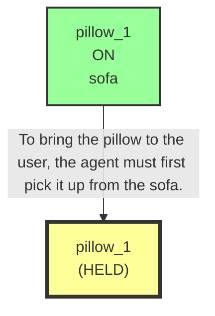

# 🚀 VirtualHome Agent Episode Log


### [GoalReasoner (Module A - Intent)] Output
```json
{
  "is_instruction_obviously_vague": false,
  "clarification_question": null,
  "target_object": "pillow",
  "location_hint": "sofa",
  "reasoning_chain": [
    {
      "question": "Why does the user want this object?",
      "answer": "To have something soft and cushioned."
    },
    {
      "question": "Why is that important?",
      "answer": "It can provide comfort or support."
    },
    {
      "question": "What fundamental need does this fulfill?",
      "answer": "The user wants to improve physical comfort."
    },
    {
      "question": "Are there any deeper psychological or physical motivations?",
      "answer": "The user may want to rest, relax, or support their body more comfortably."
    }
  ],
  "deep_intent": "The user wants to improve physical comfort.",
  "acceptable_alternatives_properties": [
    {
      "priority": 1,
      "description": "Other soft cushions or similar household comfort items, such as a couch cushion or throw pillow"
    },
    {
      "priority": 2,
      "description": "Other padded support items, such as a blanket folded for cushioning or a cushion seat pad"
    },
    {
      "priority": 3,
      "description": "Any soft household item that can provide comfort or support"
    },
    {
      "priority": 4,
      "description": "A folded towel or similar soft fabric item that can offer temporary cushioning"
    }
  ]
}
```

### [PerceptionFilter] Output
```json
{
  "reasoning": "The goal is to obtain the pillow, which is currently on the sofa and must be picked up. The only needed classes are the target object and the location/furniture that contains it.",
  "selected_classes": [
    "pillow",
    "sofa",
    "character"
  ],
  "raw_class_count": 30
}
```

### [LLMExecutor] Output
```json
{
  "reasoning": "The SDG has two nodes: the pillow must be on the sofa, and then it must be held. The current graph already shows pillow(303) ON sofa(288), so N1 is satisfied. The character is already CLOSE to sofa(288), so the next required step is to pick up the pillow to satisfy the held state.",
  "satisfied_nodes": [
    "N1"
  ],
  "current_node_focus": "N2",
  "mapped_variables": {},
  "action": "[grab] <pillow> (303)"
}
```

### [RoboStateMultiTaskController] Output
```json
{
  "action": "[walk] <pillow> (303)",
  "active_task_id": "task_1",
  "task_context": {
    "active_task_id": "task_1",
    "pending_task_ids": [],
    "satisfied_task_ids": []
  },
  "source": "llm_executor_repaired"
}
```
## Step 0
- **Action**: `[walk] <pillow> (303)`
- **Action Success**: `True`
- **Action Message**: {'0': {'message': 'Success'}}
- **Active Task**: `task_1`
- **Decision Source**: `llm_executor_repaired`
- **Task Progress**: M1_04=pending
- **SDG Status**:

- **Observed Items (7)**: sofa(288), pillow(303), character(1), bathroom(11), bedroom(50), kitchen(126), livingroom(261)


### [PerceptionFilter] Output
```json
{
  "reasoning": "Reused cached class selection.",
  "selected_classes": [
    "pillow",
    "sofa",
    "character"
  ],
  "raw_class_count": 30
}
```

### [LLMExecutor] Output
```json
{
  "reasoning": "The pillow_1 target is already within reach: the filtered graph shows pillow(303) is CLOSE to the character and on the sofa, which satisfies the prerequisite relation N1. The remaining unsatisfied node is N2 (pillow held). Since I am already near the pillow, the correct next step is to grab it.",
  "satisfied_nodes": [
    "N1"
  ],
  "current_node_focus": "N2",
  "mapped_variables": {},
  "action": "[grab] <pillow> (303)"
}
```

### [RoboStateMultiTaskController] Output
```json
{
  "action": "[grab] <pillow> (303)",
  "active_task_id": "task_1",
  "task_context": {
    "active_task_id": "task_1",
    "pending_task_ids": [],
    "satisfied_task_ids": []
  },
  "source": "llm_executor"
}
```
## Step 1
- **Action**: `[grab] <pillow> (303)`
- **Action Success**: `False`
- **Action Message**: temporary_unavailable: target disappeared; wait or search and retry
- **Active Task**: `task_1`
- **Decision Source**: `llm_executor`
- **Task Progress**: M1_04=pending
- **SDG Status**:

- **Observed Items (7)**: sofa(288), pillow(303), character(1), bathroom(11), bedroom(50), kitchen(126), livingroom(261)


### [PerceptionFilter] Output
```json
{
  "reasoning": "Reused cached class selection.",
  "selected_classes": [
    "pillow",
    "sofa",
    "character"
  ],
  "raw_class_count": 30
}
```

### [LLMExecutor] Output
```json
{
  "reasoning": "The previous grab on pillow(303) failed temporarily because the target disappeared, and the current graph now shows the pillow back ON the sofa and CLOSE to the character. Since this is a temporary unavailability event and the object is present again, the correct next step is to retry grabbing it from the current position to satisfy the HELD node and progress the task.",
  "satisfied_nodes": [
    "N1"
  ],
  "current_node_focus": "N2",
  "mapped_variables": {},
  "action": "[grab] <pillow> (303)"
}
```

### [RoboStateMultiTaskController] Output
```json
{
  "action": "[grab] <pillow> (303)",
  "active_task_id": "task_1",
  "task_context": {
    "active_task_id": "task_1",
    "pending_task_ids": [],
    "satisfied_task_ids": []
  },
  "source": "llm_executor"
}
```
## Step 2
- **Action**: `[grab] <pillow> (303)`
- **Action Success**: `False`
- **Action Message**: temporary_unavailable: target is temporarily hidden
- **Active Task**: `task_1`
- **Decision Source**: `llm_executor`
- **Task Progress**: M1_04=pending
- **SDG Status**:

- **Observed Items (7)**: sofa(288), pillow(303), character(1), bathroom(11), bedroom(50), kitchen(126), livingroom(261)


### [RoboStateMultiTaskController] Output
```json
{
  "action": "[walk] <bathroom> (11)",
  "active_task_id": null,
  "task_context": {
    "active_task_id": null,
    "pending_task_ids": [
      "task_1"
    ],
    "satisfied_task_ids": []
  },
  "source": "loop_recovery_room_revisit"
}
```
## Step 3
- **Action**: `[walk] <bathroom> (11)`
- **Action Success**: `True`
- **Action Message**: {'0': {'message': 'Success'}}
- **Decision Source**: `loop_recovery_room_revisit`
- **Task Progress**: M1_04=pending
- **SDG Status**:
No SDG active.
- **Observed Items (64)**: wall(262), wall(263), wall(264), wall(265), wall(266), wall(267), wall(268), wall(269), ceiling(270), ceiling(271), ceiling(272), ceiling(273), ceiling(274), ceiling(275), ceiling(276)...


### [PerceptionFilter] Output
```json
{
  "reasoning": "The goal is to retrieve the target pillow from the sofa, so the necessary classes are the target object pillow and the location furniture sofa. No other tools or receptacles are required.",
  "selected_classes": [
    "pillow",
    "sofa",
    "character"
  ],
  "raw_class_count": 46
}
```

### [LLMExecutor] Output
```json
{
  "reasoning": "The pillow is already back in the graph at its original location: on the sofa and close to the character. The previous grab attempts failed because it was temporarily unavailable, so the correct autonomous recovery step is to try grabbing it again now. This targets N2 (pillow held) and also advances beyond N1 by taking the pillow from the sofa.",
  "satisfied_nodes": [
    "N1"
  ],
  "current_node_focus": "N2",
  "mapped_variables": {},
  "action": "[grab] <pillow> (303)"
}
```

### [RoboStateMultiTaskController] Output
```json
{
  "action": "[grab] <pillow> (303)",
  "active_task_id": "task_1",
  "task_context": {
    "active_task_id": "task_1",
    "pending_task_ids": [],
    "satisfied_task_ids": []
  },
  "source": "llm_executor"
}
```
## Step 4
- **Action**: `[grab] <pillow> (303)`
- **Action Success**: `False`
- **Action Message**: temporary_unavailable: target is temporarily hidden
- **Active Task**: `task_1`
- **Decision Source**: `llm_executor`
- **Task Progress**: M1_04=pending
- **SDG Status**:

- **Observed Items (7)**: sofa(288), pillow(303), character(1), bathroom(11), bedroom(50), kitchen(126), livingroom(261)


### [RoboStateMultiTaskController] Output
```json
{
  "action": "[walk] <bedroom> (50)",
  "active_task_id": null,
  "task_context": {
    "active_task_id": null,
    "pending_task_ids": [
      "task_1"
    ],
    "satisfied_task_ids": []
  },
  "source": "loop_recovery_room_revisit"
}
```
## Step 5
- **Action**: `[walk] <bedroom> (50)`
- **Action Success**: `True`
- **Action Message**: {'0': {'message': 'Success'}}
- **Decision Source**: `loop_recovery_room_revisit`
- **Task Progress**: M1_04=pending
- **SDG Status**:
No SDG active.
- **Observed Items (102)**: wall(262), wall(263), wall(264), wall(265), wall(266), wall(267), wall(268), wall(269), ceiling(270), ceiling(271), ceiling(272), ceiling(273), ceiling(274), ceiling(275), ceiling(276)...


### [PerceptionFilter] Output
```json
{
  "reasoning": "The goal is to obtain the pillow, and the SDG says it is on the sofa and must be held. So the only required classes are the target pillow and the location furniture sofa.",
  "selected_classes": [
    "pillow",
    "sofa",
    "character"
  ],
  "raw_class_count": 61
}
```

### [LLMExecutor] Output
```json
{
  "reasoning": "The original target pillow_1 is temporarily unavailable, but it has reappeared in the current graph as pillow(303), still ON sofa(288) and CLOSE to the character. The last action was a walk to the bedroom, so repeating walk would be redundant. The next required step toward satisfying the SDG is to pick up the pillow, which will satisfy the HELD state node once successful.",
  "satisfied_nodes": [
    "N1"
  ],
  "current_node_focus": "N2",
  "mapped_variables": {},
  "action": "[grab] <pillow> (303)"
}
```

### [RoboStateMultiTaskController] Output
```json
{
  "action": "[grab] <pillow> (303)",
  "active_task_id": "task_1",
  "task_context": {
    "active_task_id": "task_1",
    "pending_task_ids": [],
    "satisfied_task_ids": []
  },
  "source": "llm_executor"
}
```
## Step 6
- **Action**: `[grab] <pillow> (303)`
- **Action Success**: `False`
- **Action Message**: temporary_unavailable: target disappeared; wait or search and retry
- **Active Task**: `task_1`
- **Decision Source**: `llm_executor`
- **Task Progress**: M1_04=pending
- **SDG Status**:

- **Observed Items (9)**: sofa(288), pillow(303), character(1), bathroom(11), bedroom(50), kitchen(126), livingroom(261), sofa(85), pillow(122)


### [RoboStateMultiTaskController] Output
```json
{
  "action": "[walk] <kitchen> (126)",
  "active_task_id": null,
  "task_context": {
    "active_task_id": null,
    "pending_task_ids": [
      "task_1"
    ],
    "satisfied_task_ids": []
  },
  "source": "loop_recovery_room_revisit"
}
```
## Step 7
- **Action**: `[walk] <kitchen> (126)`
- **Action Success**: `True`
- **Action Message**: {'0': {'message': 'Success'}}
- **Decision Source**: `loop_recovery_room_revisit`
- **Task Progress**: M1_04=pending
- **SDG Status**:
No SDG active.
- **Observed Items (172)**: wall(262), wall(263), wall(264), wall(265), wall(266), wall(267), wall(268), wall(269), ceiling(270), ceiling(271), ceiling(272), ceiling(273), ceiling(274), ceiling(275), ceiling(276)...


### [PerceptionFilter] Output
```json
{
  "reasoning": "The goal is to obtain the target pillow, and the SDG says it is on the sofa and must be held. So the only necessary classes are the target object and its location furniture.",
  "selected_classes": [
    "pillow",
    "sofa",
    "character"
  ],
  "raw_class_count": 86
}
```

### [LLMExecutor] Output
```json
{
  "reasoning": "The original target pillow_1 is temporarily unavailable, but the current graph shows an equivalent pillow(303) now visible in the living room, on the sofa and close to the character. Since the task goal is to obtain a pillow and the SDG requires the pillow to end up HELD, the next step is to attempt a grab on this same pillow while already nearby. This also satisfies the prerequisite ON-sofa relation as we pick it up.",
  "satisfied_nodes": [
    "N1"
  ],
  "current_node_focus": "N2",
  "mapped_variables": {
    "?Pillow": "pillow(303)"
  },
  "action": "[grab] <pillow> (303)"
}
```

### [RoboStateMultiTaskController] Output
```json
{
  "action": "[grab] <pillow> (303)",
  "active_task_id": "task_1",
  "task_context": {
    "active_task_id": "task_1",
    "pending_task_ids": [],
    "satisfied_task_ids": []
  },
  "source": "llm_executor"
}
```
## Step 8
- **Action**: `[grab] <pillow> (303)`
- **Action Success**: `False`
- **Action Message**: temporary_unavailable: target is temporarily hidden
- **Active Task**: `task_1`
- **Decision Source**: `llm_executor`
- **Task Progress**: M1_04=pending
- **SDG Status**:

- **Observed Items (15)**: sofa(288), pillow(303), character(1), bathroom(11), bedroom(50), kitchen(126), livingroom(261), sofa(85), pillow(122), pillow(188), pillow(189), pillow(190), pillow(191), pillow(192), pillow(193)


### [RoboStateMultiTaskController] Output
```json
{
  "action": "[walk] <livingroom> (261)",
  "active_task_id": null,
  "task_context": {
    "active_task_id": null,
    "pending_task_ids": [
      "task_1"
    ],
    "satisfied_task_ids": []
  },
  "source": "loop_recovery_room_revisit"
}
```
## Step 9
- **Action**: `[walk] <livingroom> (261)`
- **Action Success**: `True`
- **Action Message**: {'0': {'message': 'Success'}}
- **Decision Source**: `loop_recovery_room_revisit`
- **Task Progress**: M1_04=pending
- **SDG Status**:
No SDG active.
- **Observed Items (291)**: wall(262), wall(263), wall(264), wall(265), wall(266), wall(267), wall(268), wall(269), ceiling(270), ceiling(271), ceiling(272), ceiling(273), ceiling(274), ceiling(275), ceiling(276)...


### [PerceptionFilter] Output
```json
{
  "reasoning": "Reused cached class selection.",
  "selected_classes": [
    "pillow",
    "sofa",
    "character"
  ],
  "raw_class_count": 86
}
```

### [LLMExecutor] Output
```json
{
  "reasoning": "The active goal is to have pillow_1 held. The current Filtered Graph shows pillow(303) is the matching pillow in the living room and is on sofa(288), with the character already close to that sofa. Previous grabs failed because the pillow was temporarily unavailable, and the object is now visible again, so the correct next step is to retry grabbing it rather than walking elsewhere.",
  "satisfied_nodes": [
    "N1"
  ],
  "current_node_focus": "N2",
  "mapped_variables": {},
  "action": "[grab] <pillow> (303)"
}
```

### [RoboStateMultiTaskController] Output
```json
{
  "action": "[walk] <pillow> (303)",
  "active_task_id": "task_1",
  "task_context": {
    "active_task_id": "task_1",
    "pending_task_ids": [],
    "satisfied_task_ids": []
  },
  "source": "llm_executor_repaired"
}
```
## Step 10
- **Action**: `[walk] <pillow> (303)`
- **Action Success**: `True`
- **Action Message**: {'0': {'message': 'Success'}}
- **Active Task**: `task_1`
- **Decision Source**: `llm_executor_repaired`
- **Task Progress**: M1_04=pending
- **SDG Status**:

- **Observed Items (15)**: sofa(288), pillow(303), character(1), bathroom(11), bedroom(50), kitchen(126), livingroom(261), sofa(85), pillow(122), pillow(188), pillow(189), pillow(190), pillow(191), pillow(192), pillow(193)


### [PerceptionFilter] Output
```json
{
  "reasoning": "Reused cached class selection.",
  "selected_classes": [
    "pillow",
    "sofa",
    "character"
  ],
  "raw_class_count": 86
}
```

### [LLMExecutor] Output
```json
{
  "reasoning": "The target pillow_1 is already confirmed ON the sofa and CLOSE to the character in the current living room. Since the SDG requires first satisfying the ON relation and then the HELD state, the next atomic step is to pick up the pillow. The previous walk to the pillow has already been completed, so repeating walk is unnecessary. The most direct progress is to grab the exact target pillow(303).",
  "satisfied_nodes": [
    "N1"
  ],
  "current_node_focus": "N2",
  "mapped_variables": {},
  "action": "[grab] <pillow> (303)"
}
```

### [RoboStateMultiTaskController] Output
```json
{
  "action": "[grab] <pillow> (303)",
  "active_task_id": "task_1",
  "task_context": {
    "active_task_id": "task_1",
    "pending_task_ids": [],
    "satisfied_task_ids": []
  },
  "source": "llm_executor"
}
```
## Step 11
- **Action**: `[grab] <pillow> (303)`
- **Action Success**: `False`
- **Action Message**: temporary_unavailable: target disappeared; wait or search and retry
- **Active Task**: `task_1`
- **Decision Source**: `llm_executor`
- **Task Progress**: M1_04=pending
- **SDG Status**:

- **Observed Items (15)**: sofa(288), pillow(303), character(1), bathroom(11), bedroom(50), kitchen(126), livingroom(261), sofa(85), pillow(122), pillow(188), pillow(189), pillow(190), pillow(191), pillow(192), pillow(193)


### [PerceptionFilter] Output
```json
{
  "reasoning": "Reused cached class selection.",
  "selected_classes": [
    "pillow",
    "sofa",
    "character"
  ],
  "raw_class_count": 86
}
```

### [LLMExecutor] Output
```json
{
  "reasoning": "The target pillow_303 is currently visible and marked CLOSE character(1) and ON sofa(288), so the state gap for N1 is already satisfied in the current graph. The remaining unsatisfied node is N2, which requires the pillow to be HELD. Since the last attempt to grab pillow_303 failed due to temporary unavailability, but it is now present and close, the correct next step is to retry grabbing it. No additional walk is needed because we are already close to the pillow.",
  "satisfied_nodes": [
    "N1"
  ],
  "current_node_focus": "N2",
  "mapped_variables": {},
  "action": "[grab] <pillow> (303)"
}
```

### [RoboStateMultiTaskController] Output
```json
{
  "action": "[grab] <pillow> (303)",
  "active_task_id": "task_1",
  "task_context": {
    "active_task_id": "task_1",
    "pending_task_ids": [],
    "satisfied_task_ids": []
  },
  "source": "llm_executor"
}
```
## Step 12
- **Action**: `[grab] <pillow> (303)`
- **Action Success**: `False`
- **Action Message**: temporary_unavailable: target is temporarily hidden
- **Active Task**: `task_1`
- **Decision Source**: `llm_executor`
- **Task Progress**: M1_04=pending
- **SDG Status**:

- **Observed Items (15)**: sofa(288), pillow(303), character(1), bathroom(11), bedroom(50), kitchen(126), livingroom(261), sofa(85), pillow(122), pillow(188), pillow(189), pillow(190), pillow(191), pillow(192), pillow(193)


### [RoboStateMultiTaskController] Output
```json
{
  "action": "[walk] <bathroom> (11)",
  "active_task_id": null,
  "task_context": {
    "active_task_id": null,
    "pending_task_ids": [
      "task_1"
    ],
    "satisfied_task_ids": []
  },
  "source": "loop_recovery_room_revisit"
}
```
## Step 13
- **Action**: `[walk] <bathroom> (11)`
- **Action Success**: `True`
- **Action Message**: {'0': {'message': 'Success'}}
- **Decision Source**: `loop_recovery_room_revisit`
- **Task Progress**: M1_04=pending
- **SDG Status**:
No SDG active.
- **Observed Items (291)**: wall(262), wall(263), wall(264), wall(265), wall(266), wall(267), wall(268), wall(269), ceiling(270), ceiling(271), ceiling(272), ceiling(273), ceiling(274), ceiling(275), ceiling(276)...


### [PerceptionFilter] Output
```json
{
  "reasoning": "Reused cached class selection.",
  "selected_classes": [
    "pillow",
    "sofa",
    "character"
  ],
  "raw_class_count": 86
}
```

### [LLMExecutor] Output
```json
{
  "reasoning": "The target pillow_1 (303) is currently close to the character and explicitly on sofa(288), satisfying the relation node N1. The only remaining unmet SDG node is to hold the pillow. Since the character is already in the bathroom and the pillow is nearby/close per the graph, the next atomic step is to grab it. I will continue with the specific pillow_1 instance rather than alternate pillows because the SDG names this exact object.",
  "satisfied_nodes": [
    "N1"
  ],
  "current_node_focus": "N2",
  "mapped_variables": {},
  "action": "[grab] <pillow> (303)"
}
```

### [RoboStateMultiTaskController] Output
```json
{
  "action": "[grab] <pillow> (303)",
  "active_task_id": "task_1",
  "task_context": {
    "active_task_id": "task_1",
    "pending_task_ids": [],
    "satisfied_task_ids": []
  },
  "source": "llm_executor"
}
```
## Step 14
- **Action**: `[grab] <pillow> (303)`
- **Action Success**: `False`
- **Action Message**: temporary_unavailable: target is temporarily hidden
- **Active Task**: `task_1`
- **Decision Source**: `llm_executor`
- **Task Progress**: M1_04=pending
- **SDG Status**:

- **Observed Items (15)**: sofa(288), pillow(303), character(1), bathroom(11), bedroom(50), kitchen(126), livingroom(261), sofa(85), pillow(122), pillow(188), pillow(189), pillow(190), pillow(191), pillow(192), pillow(193)


### [RoboStateMultiTaskController] Output
```json
{
  "action": "[walk] <bedroom> (50)",
  "active_task_id": null,
  "task_context": {
    "active_task_id": null,
    "pending_task_ids": [
      "task_1"
    ],
    "satisfied_task_ids": []
  },
  "source": "loop_recovery_room_revisit"
}
```
## Step 15
- **Action**: `[walk] <bedroom> (50)`
- **Action Success**: `True`
- **Action Message**: {'0': {'message': 'Success'}}
- **Decision Source**: `loop_recovery_room_revisit`
- **Task Progress**: M1_04=pending
- **SDG Status**:
No SDG active.
- **Observed Items (291)**: wall(262), wall(263), wall(264), wall(265), wall(266), wall(267), wall(268), wall(269), ceiling(270), ceiling(271), ceiling(272), ceiling(273), ceiling(274), ceiling(275), ceiling(276)...


### [PerceptionFilter] Output
```json
{
  "reasoning": "Reused cached class selection.",
  "selected_classes": [
    "pillow",
    "sofa",
    "character"
  ],
  "raw_class_count": 86
}
```

### [LLMExecutor] Output
```json
{
  "reasoning": "The target pillow_1 is currently visible, on the sofa(288), and close to the character in the living room. The remaining unsatisfied SDG focus is to pick it up so it becomes HELD. Since the last action was a walk to bedroom and we should not repeat a walk action immediately, the correct next step is to grab the exact pillow instance that matches the SDG and current graph.",
  "satisfied_nodes": [
    "N1"
  ],
  "current_node_focus": "N2",
  "mapped_variables": {},
  "action": "[grab] <pillow> (303)"
}
```

### [RoboStateMultiTaskController] Output
```json
{
  "action": "[grab] <pillow> (303)",
  "active_task_id": "task_1",
  "task_context": {
    "active_task_id": "task_1",
    "pending_task_ids": [],
    "satisfied_task_ids": []
  },
  "source": "llm_executor"
}
```
## Step 16
- **Action**: `[grab] <pillow> (303)`
- **Action Success**: `True`
- **Action Message**: {'0': {'message': 'Success'}}
- **Active Task**: `task_1`
- **Decision Source**: `llm_executor`
- **Task Progress**: M1_04=done
- **SDG Status**:

- **Observed Items (15)**: sofa(288), pillow(303), character(1), bathroom(11), bedroom(50), kitchen(126), livingroom(261), sofa(85), pillow(122), pillow(188), pillow(189), pillow(190), pillow(191), pillow(192), pillow(193)

