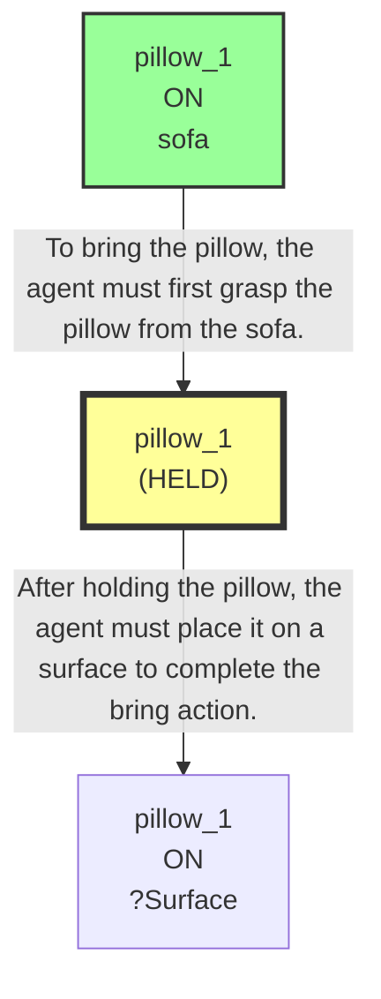

# 🚀 VirtualHome Agent Episode Log


### [GoalReasoner (Module A - Intent)] Output
```json
{
  "is_instruction_obviously_vague": false,
  "clarification_question": null,
  "target_object": "pillow",
  "location_hint": "sofa",
  "reasoning_chain": [
    {
      "question": "Why does the user want this object?",
      "answer": "To obtain something from the sofa."
    },
    {
      "question": "Why is that important?",
      "answer": "Because the user wants to have it brought to them."
    },
    {
      "question": "What fundamental need does this fulfill?",
      "answer": "The user wants access to a soft item for comfort or use."
    },
    {
      "question": "Are there any deeper psychological or physical motivations?",
      "answer": "Likely to increase physical comfort, rest support, or convenience."
    }
  ],
  "deep_intent": "The user wants to improve comfort or support.",
  "acceptable_alternatives_properties": [
    {
      "priority": 1,
      "description": "Another soft cushion or cushion-like item that can serve the same comfort function."
    },
    {
      "priority": 2,
      "description": "A similar upholstered or padded item used for resting or support, such as a throw cushion."
    },
    {
      "priority": 3,
      "description": "Other soft household comfort items that can provide cushioning or support."
    },
    {
      "priority": 4,
      "description": "A folded blanket or other soft fabric item that can be used for added comfort."
    }
  ]
}
```

### [PerceptionFilter] Output
```json
{
  "reasoning": "The goal is to bring the pillow from the sofa and place it on a surface. The only strictly necessary object classes are the target pillow, the sofa where it is located, and a valid surface to place it on; from the visible objects, the coffee table is the relevant surface. ",
  "selected_classes": [
    "coffeetable",
    "sofa",
    "character",
    "pillow"
  ],
  "raw_class_count": 30
}
```

### [LLMExecutor] Output
```json
{
  "reasoning": "The SDG requires the pillow to be on the sofa first (N1). The current graph shows pillow(303) is already ON sofa(288), so N1 is satisfied. The next unmet node is N2, which requires the pillow to be HELD. Since the character is already CLOSE to the sofa, the correct next atomic step is to grab the pillow.",
  "satisfied_nodes": [
    "N1"
  ],
  "current_node_focus": "N2",
  "mapped_variables": {},
  "action": "[grab] <pillow> (303)"
}
```

### [RoboStateMultiTaskController] Output
```json
{
  "action": "[walk] <pillow> (303)",
  "active_task_id": "task_1",
  "task_context": {
    "active_task_id": "task_1",
    "pending_task_ids": [],
    "satisfied_task_ids": []
  },
  "source": "llm_executor_repaired"
}
```
## Step 0
- **Action**: `[walk] <pillow> (303)`
- **Action Success**: `True`
- **Action Message**: {'0': {'message': 'Success'}}
- **Active Task**: `task_1`
- **Decision Source**: `llm_executor_repaired`
- **Task Progress**: M1_04=pending
- **SDG Status**:

- **Observed Items (8)**: sofa(288), coffeetable(289), pillow(303), character(1), bathroom(11), bedroom(50), kitchen(126), livingroom(261)


### [PerceptionFilter] Output
```json
{
  "reasoning": "Reused cached class selection.",
  "selected_classes": [
    "coffeetable",
    "sofa",
    "character",
    "pillow"
  ],
  "raw_class_count": 30
}
```

### [LLMExecutor] Output
```json
{
  "reasoning": "The pillow is already identified on the sofa and is close to the character, so the prerequisite relation N1 is satisfied. The next required SDG step is to hold the pillow (N2), which requires a grab action now that we are near it. The previous action was a walk to the pillow, so I should not repeat walking.",
  "satisfied_nodes": [
    "N1"
  ],
  "current_node_focus": "N2",
  "mapped_variables": {},
  "action": "[grab] <pillow> (303)"
}
```

### [RoboStateMultiTaskController] Output
```json
{
  "action": "[grab] <pillow> (303)",
  "active_task_id": "task_1",
  "task_context": {
    "active_task_id": "task_1",
    "pending_task_ids": [],
    "satisfied_task_ids": []
  },
  "source": "llm_executor"
}
```
## Step 1
- **Action**: `[grab] <pillow> (303)`
- **Action Success**: `False`
- **Action Message**: temporary_unavailable: target disappeared; wait or search and retry
- **Active Task**: `task_1`
- **Decision Source**: `llm_executor`
- **Task Progress**: M1_04=pending
- **SDG Status**:

- **Observed Items (8)**: sofa(288), coffeetable(289), pillow(303), character(1), bathroom(11), bedroom(50), kitchen(126), livingroom(261)


### [PerceptionFilter] Output
```json
{
  "reasoning": "Reused cached class selection.",
  "selected_classes": [
    "coffeetable",
    "sofa",
    "character",
    "pillow"
  ],
  "raw_class_count": 30
}
```

### [LLMExecutor] Output
```json
{
  "reasoning": "The pillow is currently visible and reported ON the sofa, while the previous grab failed only because it temporarily disappeared. Since it has now reappeared in the filtered graph and the robot is already close to the sofa, the correct next step is to retry grabbing the pillow to satisfy N1 and progress toward holding it for N2.",
  "satisfied_nodes": [
    "N1"
  ],
  "current_node_focus": "N2",
  "mapped_variables": {},
  "action": "[grab] <pillow> (303)"
}
```

### [RoboStateMultiTaskController] Output
```json
{
  "action": "[grab] <pillow> (303)",
  "active_task_id": "task_1",
  "task_context": {
    "active_task_id": "task_1",
    "pending_task_ids": [],
    "satisfied_task_ids": []
  },
  "source": "llm_executor"
}
```
## Step 2
- **Action**: `[grab] <pillow> (303)`
- **Action Success**: `False`
- **Action Message**: temporary_unavailable: target is temporarily hidden
- **Active Task**: `task_1`
- **Decision Source**: `llm_executor`
- **Task Progress**: M1_04=pending
- **SDG Status**:

- **Observed Items (8)**: sofa(288), coffeetable(289), pillow(303), character(1), bathroom(11), bedroom(50), kitchen(126), livingroom(261)


### [RoboStateMultiTaskController] Output
```json
{
  "action": "[walk] <bathroom> (11)",
  "active_task_id": null,
  "task_context": {
    "active_task_id": null,
    "pending_task_ids": [
      "task_1"
    ],
    "satisfied_task_ids": []
  },
  "source": "loop_recovery_room_revisit"
}
```
## Step 3
- **Action**: `[walk] <bathroom> (11)`
- **Action Success**: `True`
- **Action Message**: {'0': {'message': 'Success'}}
- **Decision Source**: `loop_recovery_room_revisit`
- **Task Progress**: M1_04=pending
- **SDG Status**:
No SDG active.
- **Observed Items (64)**: wall(262), wall(263), wall(264), wall(265), wall(266), wall(267), wall(268), wall(269), ceiling(270), ceiling(271), ceiling(272), ceiling(273), ceiling(274), ceiling(275), ceiling(276)...


### [PerceptionFilter] Output
```json
{
  "reasoning": "The goal is to obtain the pillow from the sofa and bring it to the user. The only strictly necessary target object is the pillow, and the relevant location/furniture explicitly required by the SDG is the sofa.",
  "selected_classes": [
    "sofa",
    "character",
    "pillow"
  ],
  "raw_class_count": 46
}
```

### [LLMExecutor] Output
```json
{
  "reasoning": "The pillow is visible again in the living room and is close to the character, while the previous grab attempts failed due to temporary hiding. Since the task is to bring the pillow from the sofa, the next required step is to attempt grabbing it again. This is the only action that can progress N1 toward N2, and no alternative object is needed because the target pillow has reappeared.",
  "satisfied_nodes": [
    "N1"
  ],
  "current_node_focus": "N2",
  "mapped_variables": {
    "?Surface": "unknown"
  },
  "action": "[grab] <pillow> (303)"
}
```

### [RoboStateMultiTaskController] Output
```json
{
  "action": "[grab] <pillow> (303)",
  "active_task_id": "task_1",
  "task_context": {
    "active_task_id": "task_1",
    "pending_task_ids": [],
    "satisfied_task_ids": []
  },
  "source": "llm_executor"
}
```
## Step 4
- **Action**: `[grab] <pillow> (303)`
- **Action Success**: `False`
- **Action Message**: temporary_unavailable: target is temporarily hidden
- **Active Task**: `task_1`
- **Decision Source**: `llm_executor`
- **Task Progress**: M1_04=pending
- **SDG Status**:

- **Observed Items (7)**: sofa(288), pillow(303), character(1), bathroom(11), bedroom(50), kitchen(126), livingroom(261)


### [RoboStateMultiTaskController] Output
```json
{
  "action": "[walk] <bedroom> (50)",
  "active_task_id": null,
  "task_context": {
    "active_task_id": null,
    "pending_task_ids": [
      "task_1"
    ],
    "satisfied_task_ids": []
  },
  "source": "loop_recovery_room_revisit"
}
```
## Step 5
- **Action**: `[walk] <bedroom> (50)`
- **Action Success**: `True`
- **Action Message**: {'0': {'message': 'Success'}}
- **Decision Source**: `loop_recovery_room_revisit`
- **Task Progress**: M1_04=pending
- **SDG Status**:
No SDG active.
- **Observed Items (102)**: wall(262), wall(263), wall(264), wall(265), wall(266), wall(267), wall(268), wall(269), ceiling(270), ceiling(271), ceiling(272), ceiling(273), ceiling(274), ceiling(275), ceiling(276)...


### [PerceptionFilter] Output
```json
{
  "reasoning": "The goal is to bring the pillow from the sofa, so the only strictly necessary classes are the target item and its location. No extra tools or alternative comfort items are required by the SDG.",
  "selected_classes": [
    "sofa",
    "character",
    "pillow"
  ],
  "raw_class_count": 61
}
```

### [LLMExecutor] Output
```json
{
  "reasoning": "The target pillow_1 is currently visible again in the livingroom and is on sofa(288), satisfying the prerequisite relation N1. The next unmet SDG node is to grasp the pillow, and since the previous temporary unavailability has resolved, I should retry the grab now while already near the object. I will not repeat a walk because I just walked to the bedroom and the graph now shows the pillow close to the character.",
  "satisfied_nodes": [
    "N1"
  ],
  "current_node_focus": "N2",
  "mapped_variables": {},
  "action": "[grab] <pillow> (303)"
}
```

### [RoboStateMultiTaskController] Output
```json
{
  "action": "[grab] <pillow> (303)",
  "active_task_id": "task_1",
  "task_context": {
    "active_task_id": "task_1",
    "pending_task_ids": [],
    "satisfied_task_ids": []
  },
  "source": "llm_executor"
}
```
## Step 6
- **Action**: `[grab] <pillow> (303)`
- **Action Success**: `False`
- **Action Message**: temporary_unavailable: target disappeared; wait or search and retry
- **Active Task**: `task_1`
- **Decision Source**: `llm_executor`
- **Task Progress**: M1_04=pending
- **SDG Status**:

- **Observed Items (9)**: sofa(288), pillow(303), character(1), bathroom(11), bedroom(50), kitchen(126), livingroom(261), sofa(85), pillow(122)


### [RoboStateMultiTaskController] Output
```json
{
  "action": "[walk] <kitchen> (126)",
  "active_task_id": null,
  "task_context": {
    "active_task_id": null,
    "pending_task_ids": [
      "task_1"
    ],
    "satisfied_task_ids": []
  },
  "source": "loop_recovery_room_revisit"
}
```
## Step 7
- **Action**: `[walk] <kitchen> (126)`
- **Action Success**: `True`
- **Action Message**: {'0': {'message': 'Success'}}
- **Decision Source**: `loop_recovery_room_revisit`
- **Task Progress**: M1_04=pending
- **SDG Status**:
No SDG active.
- **Observed Items (172)**: wall(262), wall(263), wall(264), wall(265), wall(266), wall(267), wall(268), wall(269), ceiling(270), ceiling(271), ceiling(272), ceiling(273), ceiling(274), ceiling(275), ceiling(276)...


### [PerceptionFilter] Output
```json
{
  "reasoning": "The goal is to obtain the target soft comfort item from the sofa. The SDG explicitly requires the pillow and the sofa as the source location. No additional tools or alternative receptacles are needed for this task.",
  "selected_classes": [
    "sofa",
    "character",
    "pillow"
  ],
  "raw_class_count": 86
}
```

### [LLMExecutor] Output
```json
{
  "reasoning": "The target pillow_303 is currently visible in the living room and is marked ON sofa(288), with the character already CLOSE to it. Previous grab attempts failed because it was temporarily hidden; however, the object is now present again, so the correct next step is to retry grabbing it from the current location. This is needed to satisfy N1 first and then progress toward holding the pillow for N2.",
  "satisfied_nodes": [
    "N1"
  ],
  "current_node_focus": "N2",
  "mapped_variables": {},
  "action": "[grab] <pillow> (303)"
}
```

### [RoboStateMultiTaskController] Output
```json
{
  "action": "[grab] <pillow> (303)",
  "active_task_id": "task_1",
  "task_context": {
    "active_task_id": "task_1",
    "pending_task_ids": [],
    "satisfied_task_ids": []
  },
  "source": "llm_executor"
}
```
## Step 8
- **Action**: `[grab] <pillow> (303)`
- **Action Success**: `False`
- **Action Message**: temporary_unavailable: target is temporarily hidden
- **Active Task**: `task_1`
- **Decision Source**: `llm_executor`
- **Task Progress**: M1_04=pending
- **SDG Status**:

- **Observed Items (15)**: sofa(288), pillow(303), character(1), bathroom(11), bedroom(50), kitchen(126), livingroom(261), sofa(85), pillow(122), pillow(188), pillow(189), pillow(190), pillow(191), pillow(192), pillow(193)


### [RoboStateMultiTaskController] Output
```json
{
  "action": "[walk] <livingroom> (261)",
  "active_task_id": null,
  "task_context": {
    "active_task_id": null,
    "pending_task_ids": [
      "task_1"
    ],
    "satisfied_task_ids": []
  },
  "source": "loop_recovery_room_revisit"
}
```
## Step 9
- **Action**: `[walk] <livingroom> (261)`
- **Action Success**: `True`
- **Action Message**: {'0': {'message': 'Success'}}
- **Decision Source**: `loop_recovery_room_revisit`
- **Task Progress**: M1_04=pending
- **SDG Status**:
No SDG active.
- **Observed Items (291)**: wall(262), wall(263), wall(264), wall(265), wall(266), wall(267), wall(268), wall(269), ceiling(270), ceiling(271), ceiling(272), ceiling(273), ceiling(274), ceiling(275), ceiling(276)...


### [PerceptionFilter] Output
```json
{
  "reasoning": "Reused cached class selection.",
  "selected_classes": [
    "sofa",
    "character",
    "pillow"
  ],
  "raw_class_count": 86
}
```

### [LLMExecutor] Output
```json
{
  "reasoning": "The active goal is to bring pillow(303) from the sofa. The current graph shows pillow(303) is on sofa(288) and the character is already close to sofa(288), so the next step toward satisfying N1 and then N2 is to attempt to grab the pillow. The previous grab failures were due to the pillow being temporarily hidden, but it is now visible again on the sofa, so retrying the grab is appropriate.",
  "satisfied_nodes": [
    "N1"
  ],
  "current_node_focus": "N2",
  "mapped_variables": {},
  "action": "[grab] <pillow> (303)"
}
```

### [RoboStateMultiTaskController] Output
```json
{
  "action": "[walk] <pillow> (303)",
  "active_task_id": "task_1",
  "task_context": {
    "active_task_id": "task_1",
    "pending_task_ids": [],
    "satisfied_task_ids": []
  },
  "source": "llm_executor_repaired"
}
```
## Step 10
- **Action**: `[walk] <pillow> (303)`
- **Action Success**: `True`
- **Action Message**: {'0': {'message': 'Success'}}
- **Active Task**: `task_1`
- **Decision Source**: `llm_executor_repaired`
- **Task Progress**: M1_04=pending
- **SDG Status**:

- **Observed Items (15)**: sofa(288), pillow(303), character(1), bathroom(11), bedroom(50), kitchen(126), livingroom(261), sofa(85), pillow(122), pillow(188), pillow(189), pillow(190), pillow(191), pillow(192), pillow(193)


### [PerceptionFilter] Output
```json
{
  "reasoning": "Reused cached class selection.",
  "selected_classes": [
    "sofa",
    "character",
    "pillow"
  ],
  "raw_class_count": 86
}
```

### [LLMExecutor] Output
```json
{
  "reasoning": "The target pillow_303 is now close to the character and is already on the sofa in the living room, satisfying the prerequisite relation N1. The next required step in the SDG is to hold the pillow, so I should grab this exact pillow instance now.",
  "satisfied_nodes": [
    "N1"
  ],
  "current_node_focus": "N2",
  "mapped_variables": {},
  "action": "[grab] <pillow> (303)"
}
```

### [RoboStateMultiTaskController] Output
```json
{
  "action": "[grab] <pillow> (303)",
  "active_task_id": "task_1",
  "task_context": {
    "active_task_id": "task_1",
    "pending_task_ids": [],
    "satisfied_task_ids": []
  },
  "source": "llm_executor"
}
```
## Step 11
- **Action**: `[grab] <pillow> (303)`
- **Action Success**: `True`
- **Action Message**: {'0': {'message': 'Success'}}
- **Active Task**: `task_1`
- **Decision Source**: `llm_executor`
- **Task Progress**: M1_04=done
- **SDG Status**:

- **Observed Items (15)**: sofa(288), pillow(303), character(1), bathroom(11), bedroom(50), kitchen(126), livingroom(261), sofa(85), pillow(122), pillow(188), pillow(189), pillow(190), pillow(191), pillow(192), pillow(193)

