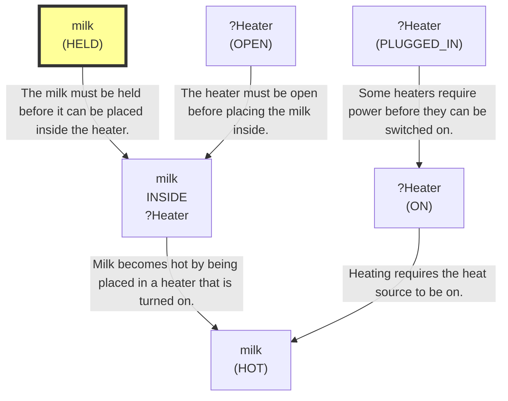
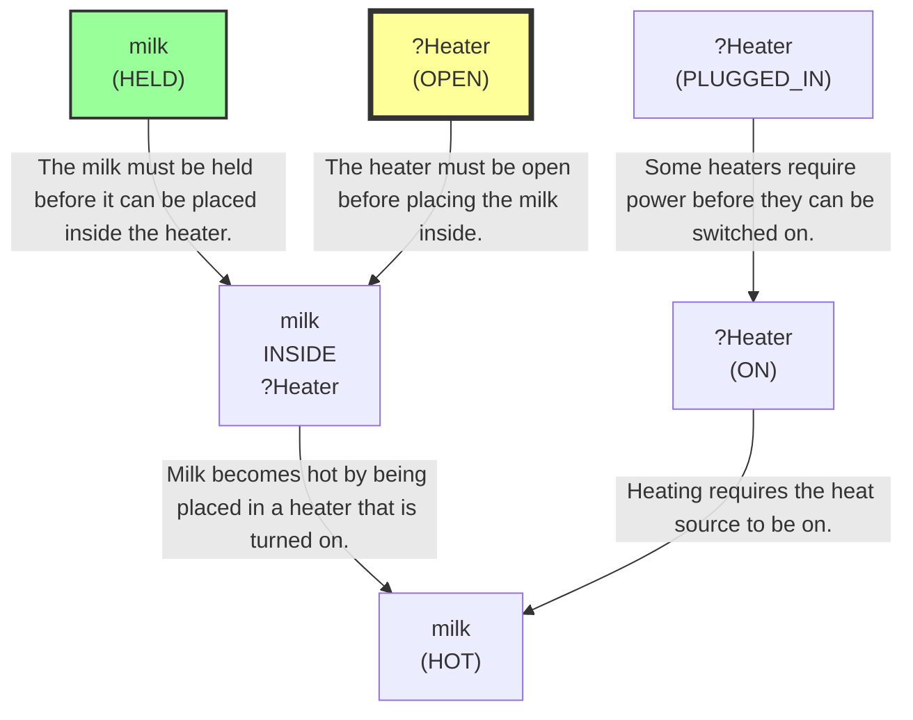
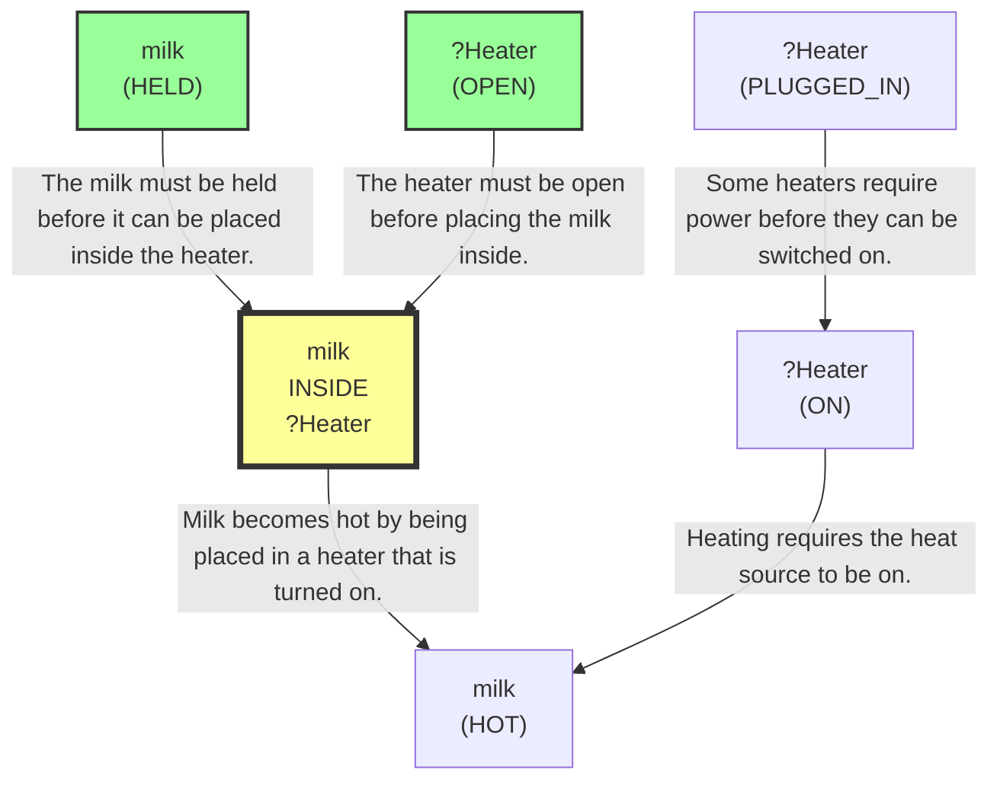
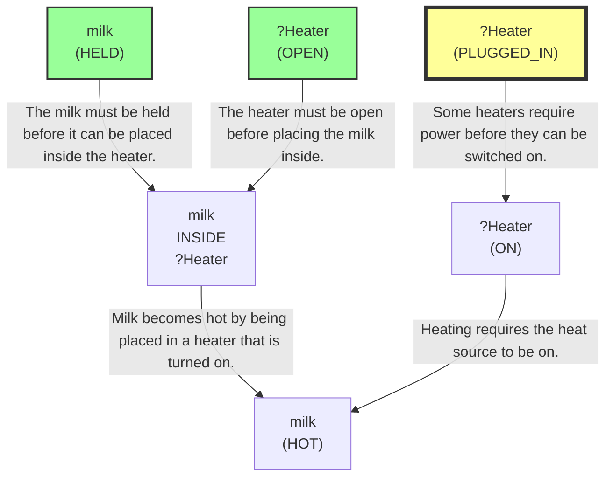
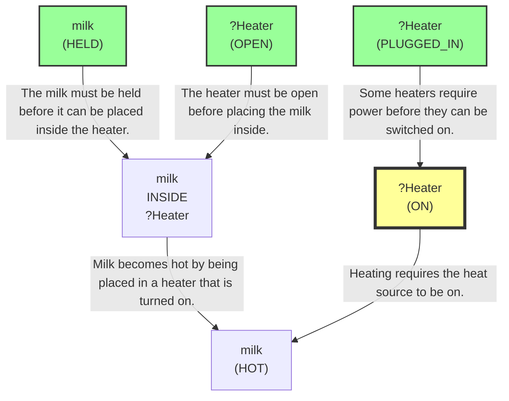

# 🚀 VirtualHome Agent Episode Log


### [GoalReasoner (Module A - Intent)] Output
```json
{
  "is_instruction_obviously_vague": false,
  "clarification_question": null,
  "target_object": "milk",
  "location_hint": null,
  "reasoning_chain": [
    {
      "question": "Why does the user want this object?",
      "answer": "To warm the milk if it is currently cold."
    },
    {
      "question": "Why is that important?",
      "answer": "Because the user wants the milk to be at a warmer, usable temperature."
    },
    {
      "question": "What fundamental need does this fulfill?",
      "answer": "It fulfills the need to have a beverage or ingredient at a desired warm temperature."
    },
    {
      "question": "Are there any deeper psychological or physical motivations?",
      "answer": "The likely motivation is comfort, palatability, or preparing the milk for immediate consumption or use."
    }
  ],
  "deep_intent": "The user wants to warm a cold liquid to a more suitable temperature for use or consumption.",
  "acceptable_alternatives_properties": [
    {
      "priority": 1,
      "description": "Other cold liquids that need warming for use, such as cream or a prepared drink."
    },
    {
      "priority": 2,
      "description": "Other dairy-based beverages or similar liquids that can be heated and consumed warm."
    },
    {
      "priority": 3,
      "description": "Warmable drinks or liquids that serve the same comfort or preparation purpose."
    },
    {
      "priority": 4,
      "description": "Other items used for a warm beverage experience, such as tea or hot cocoa."
    }
  ]
}
```

### [PerceptionFilter] Output
```json
{
  "reasoning": "The goal is to warm milk. The SDG requires the milk target plus a heater that is open, powered, and on; among visible objects, the relevant heater options are microwave, stove, coffeemaker, dishwasher, and fridge. For holding the milk before heating, milk itself must be included as the target item. No extra furniture or decor is needed.",
  "selected_classes": [
    "milk",
    "dishwasher",
    "fridge",
    "stove",
    "character",
    "microwave",
    "coffeemaker"
  ],
  "raw_class_count": 50
}
```

### [LLMExecutor] Output
```json
{
  "reasoning": "The goal is to heat milk. The SDG requires the milk to be HELD before it can be placed inside a heater, and no object is currently held. There are two milk instances: milk(176) is already COLD, making it the best match for warming, while milk(177) has no cold/hot state shown. The next required step is to move next to the target milk so it can be grabbed on a subsequent action.",
  "satisfied_nodes": [],
  "current_node_focus": "N4",
  "mapped_variables": {},
  "action": "[walk] <milk> (176)"
}
```

### [RoboStateMultiTaskController] Output
```json
{
  "action": "[walk] <milk> (176)",
  "active_task_id": "task_1",
  "task_context": {
    "active_task_id": "task_1",
    "pending_task_ids": [],
    "satisfied_task_ids": []
  },
  "source": "llm_executor"
}
```
## Step 0
- **Action**: `[walk] <milk> (176)`
- **Action Success**: `True`
- **Action Message**: {'0': {'message': 'Success'}}
- **Active Task**: `task_1`
- **Decision Source**: `llm_executor`
- **Task Progress**: M1_05=pending
- **SDG Status**:

- **Observed Items (13)**: fridge(162) [CLOSED], stove(163) [OFF,CLOSED], dishwasher(165) [CLOSED,OFF], coffeemaker(169) [OFF], microwave(171) [CLOSED,OFF], milk(177) [CLOSED], milk(176) [COLD,CLOSED], character(1), kitchen(11), livingroom(183), bedroom(241), bathroom(285), bedroom(346)


### [PerceptionFilter] Output
```json
{
  "reasoning": "Reused cached class selection.",
  "selected_classes": [
    "milk",
    "dishwasher",
    "fridge",
    "stove",
    "character",
    "microwave",
    "coffeemaker"
  ],
  "raw_class_count": 50
}
```

### [LLMExecutor] Output
```json
{
  "reasoning": "The target milk is visible and the past action successfully moved us close to milk(176). The SDG requires the milk to be held before it can be placed into a heater. Since the milk is already in the same location and not yet held, the next progress-making step is to grab it. No heater interaction can happen until N4 is satisfied.",
  "satisfied_nodes": [],
  "current_node_focus": "N4",
  "mapped_variables": {},
  "action": "[grab] <milk> (176)"
}
```

### [RoboStateMultiTaskController] Output
```json
{
  "action": "[grab] <milk> (176)",
  "active_task_id": "task_1",
  "task_context": {
    "active_task_id": "task_1",
    "pending_task_ids": [],
    "satisfied_task_ids": []
  },
  "source": "llm_executor"
}
```
## Step 1
- **Action**: `[grab] <milk> (176)`
- **Action Success**: `False`
- **Action Message**: temporary_unavailable: target disappeared; wait or search and retry
- **Active Task**: `task_1`
- **Decision Source**: `llm_executor`
- **Task Progress**: M1_05=pending
- **SDG Status**:

- **Observed Items (13)**: fridge(162) [CLOSED], stove(163) [OFF,CLOSED], dishwasher(165) [CLOSED,OFF], coffeemaker(169) [OFF], microwave(171) [CLOSED,OFF], milk(177) [CLOSED], milk(176) [COLD,CLOSED], character(1), kitchen(11), livingroom(183), bedroom(241), bathroom(285), bedroom(346)


### [PerceptionFilter] Output
```json
{
  "reasoning": "Reused cached class selection.",
  "selected_classes": [
    "milk",
    "dishwasher",
    "fridge",
    "stove",
    "character",
    "microwave",
    "coffeemaker"
  ],
  "raw_class_count": 50
}
```

### [LLMExecutor] Output
```json
{
  "reasoning": "The previous grab attempt on milk(176) failed because that exact instance temporarily disappeared, which indicates another agent may be using it. There is a substitute milk(177) currently visible in the same kitchen and it matches the required target class and properties. Since the task is to warm milk, the next step is to re-approach the substitute milk before attempting to grab it again.",
  "satisfied_nodes": [],
  "current_node_focus": "N4",
  "mapped_variables": {},
  "action": "[walk] <milk> (177)"
}
```

### [RoboStateMultiTaskController] Output
```json
{
  "action": "[walk] <milk> (177)",
  "active_task_id": "task_1",
  "task_context": {
    "active_task_id": "task_1",
    "pending_task_ids": [],
    "satisfied_task_ids": []
  },
  "source": "llm_executor"
}
```
## Step 2
- **Action**: `[walk] <milk> (177)`
- **Action Success**: `True`
- **Action Message**: {'0': {'message': 'Success'}}
- **Active Task**: `task_1`
- **Decision Source**: `llm_executor`
- **Task Progress**: M1_05=pending
- **SDG Status**:

- **Observed Items (13)**: fridge(162) [CLOSED], stove(163) [OFF,CLOSED], dishwasher(165) [CLOSED,OFF], coffeemaker(169) [OFF], microwave(171) [CLOSED,OFF], milk(177) [CLOSED], milk(176) [COLD,CLOSED], character(1), kitchen(11), livingroom(183), bedroom(241), bathroom(285), bedroom(346)


### [PerceptionFilter] Output
```json
{
  "reasoning": "Reused cached class selection.",
  "selected_classes": [
    "milk",
    "dishwasher",
    "fridge",
    "stove",
    "character",
    "microwave",
    "coffeemaker"
  ],
  "raw_class_count": 50
}
```

### [LLMExecutor] Output
```json
{
  "reasoning": "The active task is to warm milk. The SDG requires a held milk object (N4) before placing it into an open, powered heater. We already moved close to milk(177), which is a suitable milk instance because it is close and pourable/grabbable. Since the previous grab on milk(176) failed due to temporary disappearance, and milk(177) is now the reachable target, the next atomic step is to grab it. This progresses toward N4 and is the necessary prerequisite before interacting with any heater.",
  "satisfied_nodes": [],
  "current_node_focus": "N4",
  "mapped_variables": {},
  "action": "[grab] <milk> (177)"
}
```

### [RoboStateMultiTaskController] Output
```json
{
  "action": "[grab] <milk> (177)",
  "active_task_id": "task_1",
  "task_context": {
    "active_task_id": "task_1",
    "pending_task_ids": [],
    "satisfied_task_ids": []
  },
  "source": "llm_executor"
}
```
## Step 3
- **Action**: `[grab] <milk> (177)`
- **Action Success**: `False`
- **Action Message**: temporary_unavailable: target disappeared; wait or search and retry
- **Active Task**: `task_1`
- **Decision Source**: `llm_executor`
- **Task Progress**: M1_05=pending
- **SDG Status**:

- **Observed Items (13)**: fridge(162) [CLOSED], stove(163) [OFF,CLOSED], dishwasher(165) [CLOSED,OFF], coffeemaker(169) [OFF], microwave(171) [CLOSED,OFF], milk(177) [CLOSED], milk(176) [COLD,CLOSED], character(1), kitchen(11), livingroom(183), bedroom(241), bathroom(285), bedroom(346)


### [PerceptionFilter] Output
```json
{
  "reasoning": "Reused cached class selection.",
  "selected_classes": [
    "milk",
    "dishwasher",
    "fridge",
    "stove",
    "character",
    "microwave",
    "coffeemaker"
  ],
  "raw_class_count": 50
}
```

### [LLMExecutor] Output
```json
{
  "reasoning": "The previously targeted milk objects disappeared when approached, which indicates a temporary unavailability by another agent. Per the failure-handling rule, I should wait rather than switching objects or guessing. The task still requires warming milk, and the current graph shows two milk instances nearby, but neither is currently grabbable due to the temporary disappearance error. Waiting is the correct next atomic action to allow the milk to reappear.",
  "satisfied_nodes": [],
  "current_node_focus": "N4",
  "mapped_variables": {},
  "action": "[wait]"
}
```

### [RoboStateMultiTaskController] Output
```json
{
  "action": "[wait]",
  "active_task_id": "task_1",
  "task_context": {
    "active_task_id": "task_1",
    "pending_task_ids": [],
    "satisfied_task_ids": []
  },
  "source": "llm_executor"
}
```
## Step 4
- **Action**: `[wait]`
- **Action Success**: `True`
- **Action Message**: Time passes. You waited for a while.
- **Active Task**: `task_1`
- **Decision Source**: `llm_executor`
- **Task Progress**: M1_05=pending
- **SDG Status**:

- **Observed Items (13)**: fridge(162) [CLOSED], stove(163) [OFF,CLOSED], dishwasher(165) [CLOSED,OFF], coffeemaker(169) [OFF], microwave(171) [CLOSED,OFF], milk(177) [CLOSED], milk(176) [COLD,CLOSED], character(1), kitchen(11), livingroom(183), bedroom(241), bathroom(285), bedroom(346)


### [PerceptionFilter] Output
```json
{
  "reasoning": "Reused cached class selection.",
  "selected_classes": [
    "milk",
    "dishwasher",
    "fridge",
    "stove",
    "character",
    "microwave",
    "coffeemaker"
  ],
  "raw_class_count": 50
}
```

### [LLMExecutor] Output
```json
{
  "reasoning": "The current gap is that milk is still not held, and the SDG requires N4 (milk HELD) before it can be placed inside a heater. We already attempted to grab both milk instances and they temporarily disappeared, then we waited. Since the task is not impossible and the milk is now visible again in the graph, the next progress-making step is to walk to the currently closest relevant milk instance, milk(177), which is already marked CLOSE to the character and will allow another grab attempt next.",
  "satisfied_nodes": [],
  "current_node_focus": "N4",
  "mapped_variables": {},
  "action": "[walk] <milk> (177)"
}
```

### [RoboStateMultiTaskController] Output
```json
{
  "action": "[walk] <milk> (177)",
  "active_task_id": "task_1",
  "task_context": {
    "active_task_id": "task_1",
    "pending_task_ids": [],
    "satisfied_task_ids": []
  },
  "source": "llm_executor"
}
```
## Step 5
- **Action**: `[walk] <milk> (177)`
- **Action Success**: `False`
- **Action Message**: temporary_unavailable: target is temporarily hidden
- **Active Task**: `task_1`
- **Decision Source**: `llm_executor`
- **Task Progress**: M1_05=pending
- **SDG Status**:

- **Observed Items (13)**: fridge(162) [CLOSED], stove(163) [OFF,CLOSED], dishwasher(165) [CLOSED,OFF], coffeemaker(169) [OFF], microwave(171) [CLOSED,OFF], milk(177) [CLOSED], milk(176) [COLD,CLOSED], character(1), kitchen(11), livingroom(183), bedroom(241), bathroom(285), bedroom(346)


### [PerceptionFilter] Output
```json
{
  "reasoning": "Reused cached class selection.",
  "selected_classes": [
    "milk",
    "dishwasher",
    "fridge",
    "stove",
    "character",
    "microwave",
    "coffeemaker"
  ],
  "raw_class_count": 50
}
```

### [LLMExecutor] Output
```json
{
  "reasoning": "The currently visible milk candidate that matches the heating task best is milk(176), which is explicitly COLD and therefore needs warming. The previous attempts targeted milk(177), but that object was temporarily unavailable and is no longer the best available choice for the task. To progress toward placing milk inside a heater, the next required step is to get near the cold milk(176) so it can be grabbed afterward.",
  "satisfied_nodes": [],
  "current_node_focus": "N4",
  "mapped_variables": {
    "?Heater": "microwave(171)"
  },
  "action": "[walk] <milk> (176)"
}
```

### [RoboStateMultiTaskController] Output
```json
{
  "action": "[walk] <milk> (176)",
  "active_task_id": "task_1",
  "task_context": {
    "active_task_id": "task_1",
    "pending_task_ids": [],
    "satisfied_task_ids": []
  },
  "source": "llm_executor"
}
```
## Step 6
- **Action**: `[walk] <milk> (176)`
- **Action Success**: `True`
- **Action Message**: {'0': {'message': 'Success'}}
- **Active Task**: `task_1`
- **Decision Source**: `llm_executor`
- **Task Progress**: M1_05=pending
- **SDG Status**:

- **Observed Items (13)**: fridge(162) [CLOSED], stove(163) [OFF,CLOSED], dishwasher(165) [CLOSED,OFF], coffeemaker(169) [OFF], microwave(171) [CLOSED,OFF], milk(177) [CLOSED], milk(176) [COLD,CLOSED], character(1), kitchen(11), livingroom(183), bedroom(241), bathroom(285), bedroom(346)


### [PerceptionFilter] Output
```json
{
  "reasoning": "Reused cached class selection.",
  "selected_classes": [
    "milk",
    "dishwasher",
    "fridge",
    "stove",
    "character",
    "microwave",
    "coffeemaker"
  ],
  "raw_class_count": 50
}
```

### [LLMExecutor] Output
```json
{
  "reasoning": "Milk(176) is the best binding for the target milk because it is currently close to the character and explicitly marked COLD, which matches the heating task. However, it is temporarily unavailable/hidden on recent grab attempts, and the last successful action was walking to milk(176). Since the object has temporarily disappeared rather than being permanently missing, the correct autonomous response is to wait in place for it to reappear before retrying the grab. No heater interaction is possible yet because the milk has not been secured.",
  "satisfied_nodes": [],
  "current_node_focus": "N4",
  "mapped_variables": {
    "?Heater": "microwave(171)"
  },
  "action": "[wait]"
}
```

### [RoboStateMultiTaskController] Output
```json
{
  "action": "[wait]",
  "active_task_id": "task_1",
  "task_context": {
    "active_task_id": "task_1",
    "pending_task_ids": [],
    "satisfied_task_ids": []
  },
  "source": "llm_executor"
}
```
## Step 7
- **Action**: `[wait]`
- **Action Success**: `True`
- **Action Message**: Time passes. You waited for a while.
- **Active Task**: `task_1`
- **Decision Source**: `llm_executor`
- **Task Progress**: M1_05=pending
- **SDG Status**:

- **Observed Items (13)**: fridge(162) [CLOSED], stove(163) [OFF,CLOSED], dishwasher(165) [CLOSED,OFF], coffeemaker(169) [OFF], microwave(171) [CLOSED,OFF], milk(177) [CLOSED], milk(176) [COLD,CLOSED], character(1), kitchen(11), livingroom(183), bedroom(241), bathroom(285), bedroom(346)


### [PerceptionFilter] Output
```json
{
  "reasoning": "Reused cached class selection.",
  "selected_classes": [
    "milk",
    "dishwasher",
    "fridge",
    "stove",
    "character",
    "microwave",
    "coffeemaker"
  ],
  "raw_class_count": 50
}
```

### [LLMExecutor] Output
```json
{
  "reasoning": "The active task is to warm milk, and the SDG requires the milk to be held, the heater to be open/plugged in/on, and the milk to be inside the heater. The two milk instances have different states: milk(176) is COLD and CLOSE to the character, while milk(177) is just CLOSED and has been temporarily unavailable before. Since the task is specifically to warm milk, milk(176) is the best binding because it is explicitly cold and already near the agent. We previously walked to milk(176), but the graph does not show it as held yet, and the last action was a wait after temporary unavailability of the other milk. The next required progress is to try grabbing the nearby cold milk now that we are positioned close to it.",
  "satisfied_nodes": [],
  "current_node_focus": "N4",
  "mapped_variables": {
    "?Heater": "microwave(171)"
  },
  "action": "[grab] <milk> (176)"
}
```

### [RoboStateMultiTaskController] Output
```json
{
  "action": "[grab] <milk> (176)",
  "active_task_id": "task_1",
  "task_context": {
    "active_task_id": "task_1",
    "pending_task_ids": [],
    "satisfied_task_ids": []
  },
  "source": "llm_executor"
}
```
## Step 8
- **Action**: `[grab] <milk> (176)`
- **Action Success**: `True`
- **Action Message**: {'0': {'message': 'Success'}}
- **Active Task**: `task_1`
- **Decision Source**: `llm_executor`
- **Task Progress**: M1_05=pending
- **SDG Status**:

- **Observed Items (13)**: fridge(162) [CLOSED], stove(163) [OFF,CLOSED], dishwasher(165) [CLOSED,OFF], coffeemaker(169) [OFF], microwave(171) [CLOSED,OFF], milk(177) [CLOSED], milk(176) [COLD,CLOSED], character(1), kitchen(11), livingroom(183), bedroom(241), bathroom(285), bedroom(346)


### [PerceptionFilter] Output
```json
{
  "reasoning": "Reused cached class selection.",
  "selected_classes": [
    "milk",
    "dishwasher",
    "fridge",
    "stove",
    "character",
    "microwave",
    "coffeemaker"
  ],
  "raw_class_count": 50
}
```

### [LLMExecutor] Output
```json
{
  "reasoning": "The active milk object is now successfully held in the right hand (milk(176)), which satisfies N4. To make progress toward heating it, the next required step is to move to a suitable heater that can be opened and switched on. Among the available heater-like appliances, the microwave(171) is the best candidate for heating milk because it has CAN_OPEN, HAS_SWITCH, and HAS_PLUG. I will walk to the microwave next so I can open it afterward.",
  "satisfied_nodes": [
    "N4"
  ],
  "current_node_focus": "N5",
  "mapped_variables": {
    "?Heater": "microwave(171)"
  },
  "action": "[walk] <microwave> (171)"
}
```

### [RoboStateMultiTaskController] Output
```json
{
  "action": "[walk] <microwave> (171)",
  "active_task_id": "task_1",
  "task_context": {
    "active_task_id": "task_1",
    "pending_task_ids": [],
    "satisfied_task_ids": []
  },
  "source": "llm_executor"
}
```
## Step 9
- **Action**: `[walk] <microwave> (171)`
- **Action Success**: `True`
- **Action Message**: {'0': {'message': 'Success'}}
- **Active Task**: `task_1`
- **Decision Source**: `llm_executor`
- **Task Progress**: M1_05=pending
- **SDG Status**:

- **Observed Items (13)**: fridge(162) [CLOSED], stove(163) [OFF,CLOSED], dishwasher(165) [CLOSED,OFF], coffeemaker(169) [OFF], microwave(171) [CLOSED,OFF], milk(177) [CLOSED], milk(176) [COLD,CLOSED], character(1), kitchen(11), livingroom(183), bedroom(241), bathroom(285), bedroom(346)


### [PerceptionFilter] Output
```json
{
  "reasoning": "Reused cached class selection.",
  "selected_classes": [
    "milk",
    "dishwasher",
    "fridge",
    "stove",
    "character",
    "microwave",
    "coffeemaker"
  ],
  "raw_class_count": 50
}
```

### [LLMExecutor] Output
```json
{
  "reasoning": "Milk(176) is currently held in the right hand and is the best binding for the target milk because it is the only milk already under control and it is cold, matching the heating task. The next missing prerequisite for putting milk into the heater is to open the heater. The microwave(171) is the best heater binding because it is a plug-in appliance, can open, and is already close to the character. We have already walked to the microwave, so the next atomic action should be to open it.",
  "satisfied_nodes": [
    "N4"
  ],
  "current_node_focus": "N5",
  "mapped_variables": {
    "?Heater": "microwave(171)"
  },
  "action": "[open] <microwave> (171)"
}
```

### [RoboStateMultiTaskController] Output
```json
{
  "action": "[open] <microwave> (171)",
  "active_task_id": "task_1",
  "task_context": {
    "active_task_id": "task_1",
    "pending_task_ids": [],
    "satisfied_task_ids": []
  },
  "source": "llm_executor"
}
```
## Step 10
- **Action**: `[open] <microwave> (171)`
- **Action Success**: `True`
- **Action Message**: {'0': {'message': 'Success'}}
- **Active Task**: `task_1`
- **Decision Source**: `llm_executor`
- **Task Progress**: M1_05=pending
- **SDG Status**:

- **Observed Items (13)**: fridge(162) [CLOSED], stove(163) [OFF,CLOSED], dishwasher(165) [CLOSED,OFF], coffeemaker(169) [OFF], microwave(171) [CLOSED,OFF], milk(177) [CLOSED], milk(176) [COLD,CLOSED], character(1), kitchen(11), livingroom(183), bedroom(241), bathroom(285), bedroom(346)


### [PerceptionFilter] Output
```json
{
  "reasoning": "Reused cached class selection.",
  "selected_classes": [
    "milk",
    "dishwasher",
    "fridge",
    "stove",
    "character",
    "microwave",
    "coffeemaker"
  ],
  "raw_class_count": 50
}
```

### [LLMExecutor] Output
```json
{
  "reasoning": "The active task is to warm the milk. We already have milk(176) in hand and are positioned next to the open microwave(171). The next required SDG step is to place the held milk inside the open heater. Since the microwave is already open and we are close to it, the correct atomic progression is to put the milk into the microwave.",
  "satisfied_nodes": [
    "N4",
    "N5"
  ],
  "current_node_focus": "N3",
  "mapped_variables": {
    "?Heater": "microwave(171)"
  },
  "action": "[putin] <milk> (176) <microwave> (171)"
}
```

### [RoboStateMultiTaskController] Output
```json
{
  "action": "[putin] <milk> (176) <microwave> (171)",
  "active_task_id": "task_1",
  "task_context": {
    "active_task_id": "task_1",
    "pending_task_ids": [],
    "satisfied_task_ids": []
  },
  "source": "llm_executor"
}
```
## Step 11
- **Action**: `[putin] <milk> (176) <microwave> (171)`
- **Action Success**: `True`
- **Action Message**: {'0': {'message': 'Success'}}
- **Active Task**: `task_1`
- **Decision Source**: `llm_executor`
- **Task Progress**: M1_05=pending
- **SDG Status**:

- **Observed Items (13)**: fridge(162) [CLOSED], stove(163) [OFF,CLOSED], dishwasher(165) [CLOSED,OFF], coffeemaker(169) [OFF], microwave(171) [OPEN,OFF], milk(177) [CLOSED], milk(176) [COLD,CLOSED], character(1), kitchen(11), livingroom(183), bedroom(241), bathroom(285), bedroom(346)


### [PerceptionFilter] Output
```json
{
  "reasoning": "Reused cached class selection.",
  "selected_classes": [
    "milk",
    "dishwasher",
    "fridge",
    "stove",
    "character",
    "microwave",
    "coffeemaker"
  ],
  "raw_class_count": 50
}
```

### [LLMExecutor] Output
```json
{
  "reasoning": "Milk(176) is already inside the microwave, which is open and close to the character. The next missing prerequisite for heating is to turn the heater on. The microwave has a plug, but it is already in the kitchen and we have not been shown it as plugged in; however the SDG requires N6 only if needed, and the current safe progression is to power the microwave by plugging it in before switching it on. Since the microwave is open and accessible, the next atomic step is to plug it in.",
  "satisfied_nodes": [
    "N4",
    "N5"
  ],
  "current_node_focus": "N6",
  "mapped_variables": {
    "?Heater": "microwave(171)"
  },
  "action": "[plugin] <microwave> (171)"
}
```

### [RoboStateMultiTaskController] Output
```json
{
  "action": "[plugin] <microwave> (171)",
  "active_task_id": "task_1",
  "task_context": {
    "active_task_id": "task_1",
    "pending_task_ids": [],
    "satisfied_task_ids": []
  },
  "source": "llm_executor"
}
```
## Step 12
- **Action**: `[plugin] <microwave> (171)`
- **Action Success**: `True`
- **Action Message**: Faked plug operation in Python layer
- **Active Task**: `task_1`
- **Decision Source**: `llm_executor`
- **Task Progress**: M1_05=pending
- **SDG Status**:

- **Observed Items (13)**: fridge(162) [CLOSED], stove(163) [OFF,CLOSED], dishwasher(165) [CLOSED,OFF], coffeemaker(169) [OFF], microwave(171) [OPEN,OFF], milk(177) [CLOSED], milk(176) [COLD,CLOSED], character(1), kitchen(11), livingroom(183), bedroom(241), bathroom(285), bedroom(346)


### [PerceptionFilter] Output
```json
{
  "reasoning": "Reused cached class selection.",
  "selected_classes": [
    "milk",
    "dishwasher",
    "fridge",
    "stove",
    "character",
    "microwave",
    "coffeemaker"
  ],
  "raw_class_count": 50
}
```

### [LLMExecutor] Output
```json
{
  "reasoning": "The milk is already inside the open, plugged-in microwave, but the microwave is still OFF. To progress toward HOT milk, the next required state is the heater turning ON. Since we are already close to the microwave and it is open, the best next atomic step is to switch it on.",
  "satisfied_nodes": [
    "N4",
    "N5",
    "N6"
  ],
  "current_node_focus": "N2",
  "mapped_variables": {
    "?Heater": "microwave(171)"
  },
  "action": "[switchon] <microwave> (171)"
}
```

### [RoboStateMultiTaskController] Output
```json
{
  "action": "[switchon] <microwave> (171)",
  "active_task_id": "task_1",
  "task_context": {
    "active_task_id": "task_1",
    "pending_task_ids": [],
    "satisfied_task_ids": []
  },
  "source": "llm_executor"
}
```
## Step 13
- **Action**: `[switchon] <microwave> (171)`
- **Action Success**: `True`
- **Action Message**: Faked switch operation in Python layer (bypassed Unity failure)
- **Active Task**: `task_1`
- **Decision Source**: `llm_executor`
- **Task Progress**: M1_05=done
- **SDG Status**:

- **Observed Items (13)**: fridge(162) [CLOSED], stove(163) [OFF,CLOSED], dishwasher(165) [CLOSED,OFF], coffeemaker(169) [OFF], microwave(171) [PLUGGED_IN,OPEN,OFF], milk(177) [CLOSED], milk(176) [COLD,CLOSED], character(1), kitchen(11), livingroom(183), bedroom(241), bathroom(285), bedroom(346)

