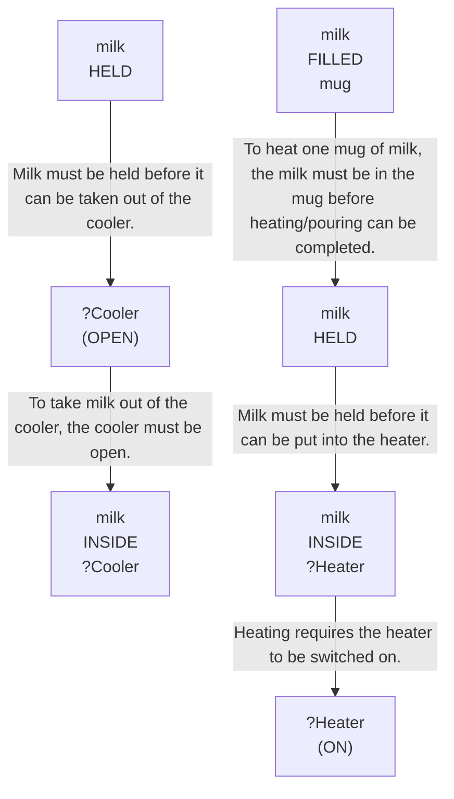
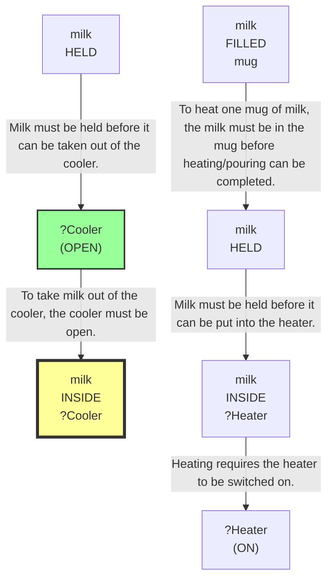
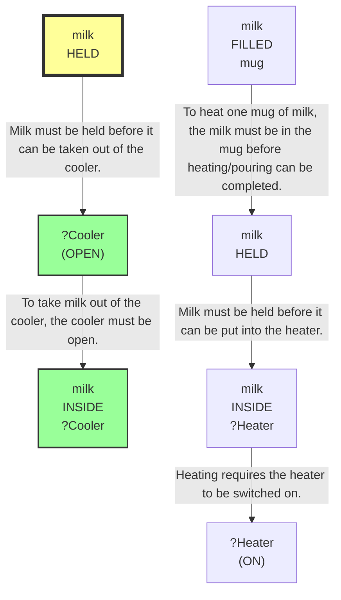
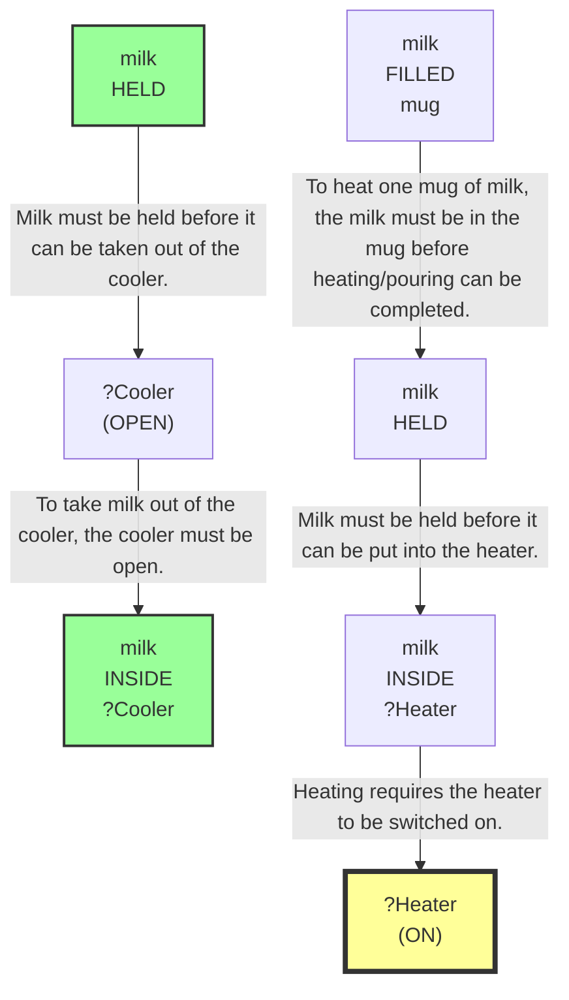
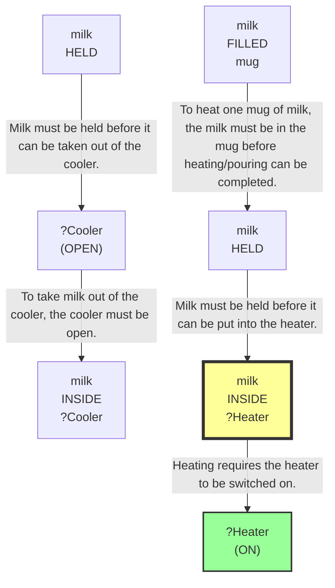
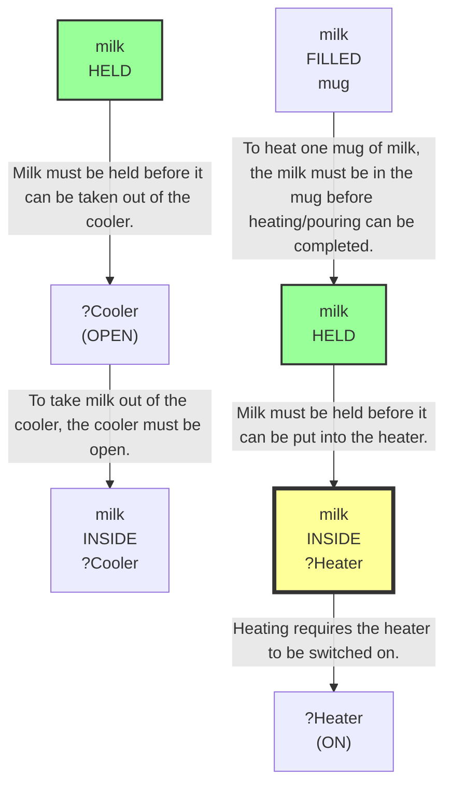
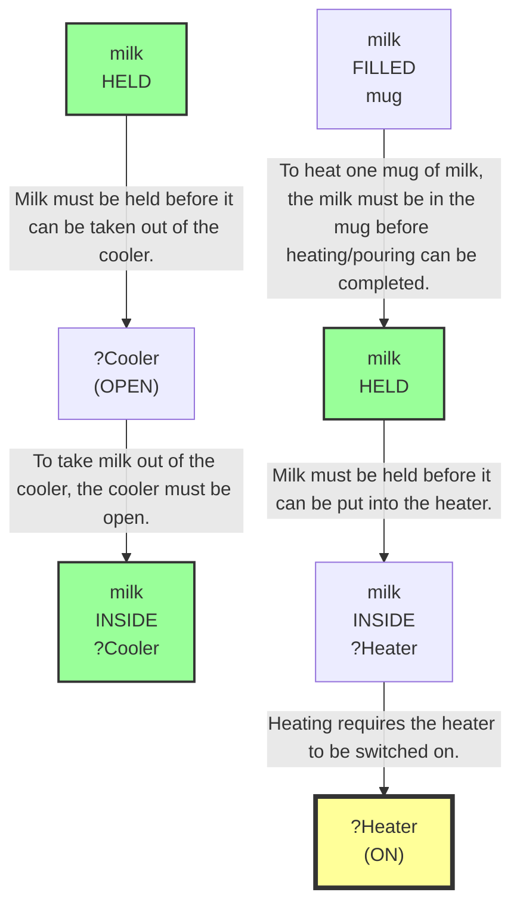
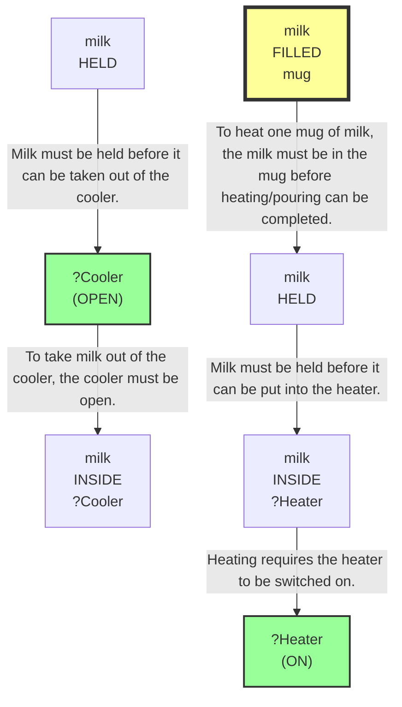
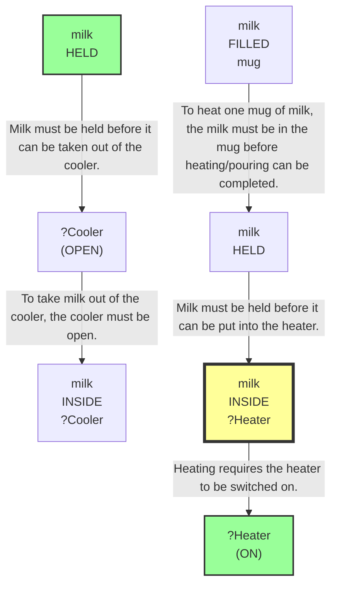

# 🚀 VirtualHome Agent Episode Log


### [GoalReasoner (Module A - Intent)] Output
```json
{
  "is_instruction_obviously_vague": false,
  "clarification_question": null,
  "target_object": "milk",
  "location_hint": "fridge",
  "reasoning_chain": [
    {
      "question": "Why does the user want this object?",
      "answer": "To warm a mug of milk."
    },
    {
      "question": "Why is that important?",
      "answer": "So the milk can be consumed in a heated form."
    },
    {
      "question": "What fundamental need does this fulfill?",
      "answer": "It helps provide a warm drink and may support comfort or hydration."
    },
    {
      "question": "Are there any deeper psychological or physical motivations?",
      "answer": "The user may want comfort, a preferred drinking temperature, or to make the drink easier to enjoy."
    }
  ],
  "deep_intent": "The user wants to warm a drink for comfort or consumption.",
  "acceptable_alternatives_properties": [
    {
      "priority": 1,
      "description": "Other drinkable dairy or non-dairy beverages that can be safely heated, such as a small mug of water, cocoa, or plant-based milk."
    },
    {
      "priority": 2,
      "description": "Other warm beverages in a mug, such as tea or broth."
    },
    {
      "priority": 3,
      "description": "Ready-to-drink liquids that provide comfort or hydration when warmed."
    },
    {
      "priority": 4,
      "description": "If warmth is the main goal, another hot beverage that provides a similar comforting sensation."
    }
  ]
}
```

### [RoboStateMultiTaskController] Output
```json
{
  "action": "[walk] <livingroom> (183)",
  "active_task_id": "task_1",
  "task_context": {
    "active_task_id": "task_1",
    "pending_task_ids": [],
    "satisfied_task_ids": []
  },
  "source": "room_frontier"
}
```
## Step 0
- **Action**: `[walk] <livingroom> (183)`
- **Action Success**: `True`
- **Action Message**: {'0': {'message': 'Success'}}
- **Active Task**: `task_1`
- **Decision Source**: `room_frontier`
- **Task Progress**: G1_01=pending
- **SDG Status**:

- **Observed Items (159)**: wall(12), wall(13), wall(14), wall(15), wall(16), wall(17), wall(18), wall(19), wall(20), wall(21), floor(22), floor(23), floor(24), floor(25), floor(26)...


### [RoboStateMultiTaskController] Output
```json
{
  "action": "[walk] <bedroom> (241)",
  "active_task_id": "task_1",
  "task_context": {
    "active_task_id": "task_1",
    "pending_task_ids": [],
    "satisfied_task_ids": []
  },
  "source": "room_frontier"
}
```
## Step 1
- **Action**: `[walk] <bedroom> (241)`
- **Action Success**: `True`
- **Action Message**: {'0': {'message': 'Success'}}
- **Active Task**: `task_1`
- **Decision Source**: `room_frontier`
- **Task Progress**: G1_01=pending
- **SDG Status**:

- **Observed Items (211)**: wall(12), wall(13), wall(14), wall(15), wall(16), wall(17), wall(18), wall(19), wall(20), wall(21), floor(22), floor(23), floor(24), floor(25), floor(26)...


### [RoboStateMultiTaskController] Output
```json
{
  "action": "[walk] <bathroom> (285)",
  "active_task_id": "task_1",
  "task_context": {
    "active_task_id": "task_1",
    "pending_task_ids": [],
    "satisfied_task_ids": []
  },
  "source": "room_frontier"
}
```
## Step 2
- **Action**: `[walk] <bathroom> (285)`
- **Action Success**: `True`
- **Action Message**: {'0': {'message': 'Success'}}
- **Active Task**: `task_1`
- **Decision Source**: `room_frontier`
- **Task Progress**: G1_01=pending
- **SDG Status**:

- **Observed Items (243)**: wall(12), wall(13), wall(14), wall(15), wall(16), wall(17), wall(18), wall(19), wall(20), wall(21), floor(22), floor(23), floor(24), floor(25), floor(26)...


### [RoboStateMultiTaskController] Output
```json
{
  "action": "[walk] <bedroom> (346)",
  "active_task_id": "task_1",
  "task_context": {
    "active_task_id": "task_1",
    "pending_task_ids": [],
    "satisfied_task_ids": []
  },
  "source": "room_frontier"
}
```
## Step 3
- **Action**: `[walk] <bedroom> (346)`
- **Action Success**: `True`
- **Action Message**: {'0': {'message': 'Success'}}
- **Active Task**: `task_1`
- **Decision Source**: `room_frontier`
- **Task Progress**: G1_01=pending
- **SDG Status**:

- **Observed Items (303)**: wall(12), wall(13), wall(14), wall(15), wall(16), wall(17), wall(18), wall(19), wall(20), wall(21), floor(22), floor(23), floor(24), floor(25), floor(26)...


### [PerceptionFilter] Output
```json
{
  "reasoning": "The goal is to warm milk for consumption. The SDG requires the target milk, the fridge as the cooler location, a mug to hold the milk, and a heater appliance. To satisfy the heating requirement while keeping backups, both microwave and stove are needed as alternative functional heaters. Sink and waterglass are not required by the SDG for this task.",
  "selected_classes": [
    "fridge",
    "milk",
    "stove",
    "mug",
    "character",
    "microwave"
  ],
  "raw_class_count": 91
}
```

### [LLMExecutor] Output
```json
{
  "reasoning": "The task is to warm milk. The filtered graph shows two milk objects: milk(176) is inside the fridge and marked COLD, which matches the target better than milk(177) in the kitchen. The fridge is already OPEN, so the next necessary step toward satisfying N3 (milk held) is to move to the milk inside the fridge before grabbing it. I cannot grab from across the room, and I should not repeat the recent walk-to-room actions; the last movement was to bedrooms, not the kitchen/fridge.",
  "satisfied_nodes": [
    "N2"
  ],
  "current_node_focus": "N1",
  "mapped_variables": {
    "?Cooler": "fridge(162)",
    "?Heater": "stove(163)"
  },
  "action": "[walk] <milk> (176)"
}
```

### [RoboStateMultiTaskController] Output
```json
{
  "action": "[walk] <milk> (176)",
  "active_task_id": "task_1",
  "task_context": {
    "active_task_id": "task_1",
    "pending_task_ids": [],
    "satisfied_task_ids": []
  },
  "source": "llm_executor"
}
```
## Step 4
- **Action**: `[walk] <milk> (176)`
- **Action Success**: `True`
- **Action Message**: {'0': {'message': 'Success'}}
- **Active Task**: `task_1`
- **Decision Source**: `llm_executor`
- **Task Progress**: G1_01=pending
- **SDG Status**:

- **Observed Items (12)**: fridge(162) [OPEN], stove(163) [OFF,CLOSED], microwave(171) [CLOSED,OFF], milk(177) [CLOSED], character(1), milk(176) [CLOSED,COLD], kitchen(11), livingroom(183), bedroom(241), bathroom(285), bedroom(346), mug(384)


### [PerceptionFilter] Output
```json
{
  "reasoning": "Reused cached class selection.",
  "selected_classes": [
    "fridge",
    "milk",
    "stove",
    "mug",
    "character",
    "microwave"
  ],
  "raw_class_count": 91
}
```

### [LLMExecutor] Output
```json
{
  "reasoning": "Milk target is bound to milk(176) because it is the only milk currently inside the fridge and already close to the character. The fridge is already OPEN, satisfying the prerequisite for retrieving the milk. The next required state in the SDG is to hold the milk before any heating step, so the correct immediate action is to grab it.",
  "satisfied_nodes": [
    "N2",
    "N1"
  ],
  "current_node_focus": "N3",
  "mapped_variables": {
    "?Cooler": "fridge(162)",
    "?Heater": "microwave(171)"
  },
  "action": "[grab] <milk> (176)"
}
```

### [RoboStateMultiTaskController] Output
```json
{
  "action": "[grab] <milk> (176)",
  "active_task_id": "task_1",
  "task_context": {
    "active_task_id": "task_1",
    "pending_task_ids": [],
    "satisfied_task_ids": []
  },
  "source": "llm_executor"
}
```
## Step 5
- **Action**: `[grab] <milk> (176)`
- **Action Success**: `True`
- **Action Message**: {'0': {'message': 'Success'}}
- **Active Task**: `task_1`
- **Decision Source**: `llm_executor`
- **Task Progress**: G1_01=pending
- **SDG Status**:

- **Observed Items (12)**: fridge(162) [OPEN], stove(163) [OFF,CLOSED], microwave(171) [CLOSED,OFF], milk(177) [CLOSED], character(1), milk(176) [CLOSED,COLD], kitchen(11), livingroom(183), bedroom(241), bathroom(285), bedroom(346), mug(384)


### [PerceptionFilter] Output
```json
{
  "reasoning": "Reused cached class selection.",
  "selected_classes": [
    "fridge",
    "milk",
    "stove",
    "mug",
    "character",
    "microwave"
  ],
  "raw_class_count": 91
}
```

### [LLMExecutor] Output
```json
{
  "reasoning": "The milk is already held in the right hand, so the current prerequisite gap is that it must be moved into a heater to continue toward warming it. The closest valid heater in the filtered graph is the stove(163), which is an appliance with a switch and is currently OFF/CLOSED. For the next step in the SDG, I should position near the heater before any interaction. Since I just grabbed the milk and am already in the kitchen near the fridge, the most appropriate next atomic action is to walk to the stove.",
  "satisfied_nodes": [
    "N1",
    "N3"
  ],
  "current_node_focus": "N4",
  "mapped_variables": {
    "?Cooler": "fridge(162)",
    "?Heater": "stove(163)"
  },
  "action": "[walk] <stove> (163)"
}
```

### [RoboStateMultiTaskController] Output
```json
{
  "action": "[walk] <stove> (163)",
  "active_task_id": "task_1",
  "task_context": {
    "active_task_id": "task_1",
    "pending_task_ids": [],
    "satisfied_task_ids": []
  },
  "source": "llm_executor"
}
```
## Step 6
- **Action**: `[walk] <stove> (163)`
- **Action Success**: `True`
- **Action Message**: {'0': {'message': 'Success'}}
- **Active Task**: `task_1`
- **Decision Source**: `llm_executor`
- **Task Progress**: G1_01=pending
- **SDG Status**:

- **Observed Items (12)**: fridge(162) [OPEN], stove(163) [OFF,CLOSED], microwave(171) [CLOSED,OFF], milk(177) [CLOSED], character(1), milk(176) [CLOSED,COLD], kitchen(11), livingroom(183), bedroom(241), bathroom(285), bedroom(346), mug(384)


### [PerceptionFilter] Output
```json
{
  "reasoning": "Reused cached class selection.",
  "selected_classes": [
    "fridge",
    "milk",
    "stove",
    "mug",
    "character",
    "microwave"
  ],
  "raw_class_count": 91
}
```

### [LLMExecutor] Output
```json
{
  "reasoning": "We already grabbed the milk and are now close to the stove, which is a plausible heater candidate because it has HAS_SWITCH and is currently OFF. The next required unmet prerequisite in the SDG is turning the heater on (N4) before placing the milk into it. Since the stove is close and can be switched on, the best next atomic action is to switch it on.",
  "satisfied_nodes": [
    "N1",
    "N3"
  ],
  "current_node_focus": "N4",
  "mapped_variables": {
    "?Cooler": "fridge(162)",
    "?Heater": "stove(163)"
  },
  "action": "[switchon] <stove> (163)"
}
```

### [RoboStateMultiTaskController] Output
```json
{
  "action": "[switchon] <stove> (163)",
  "active_task_id": "task_1",
  "task_context": {
    "active_task_id": "task_1",
    "pending_task_ids": [],
    "satisfied_task_ids": []
  },
  "source": "llm_executor"
}
```
## Step 7
- **Action**: `[switchon] <stove> (163)`
- **Action Success**: `True`
- **Action Message**: Faked switch operation in Python layer (bypassed Unity failure)
- **Active Task**: `task_1`
- **Decision Source**: `llm_executor`
- **Task Progress**: G1_01=pending
- **SDG Status**:

- **Observed Items (12)**: fridge(162) [OPEN], stove(163) [OFF,CLOSED], microwave(171) [CLOSED,OFF], milk(177) [CLOSED], character(1), milk(176) [CLOSED,COLD], kitchen(11), livingroom(183), bedroom(241), bathroom(285), bedroom(346), mug(384)


### [PerceptionFilter] Output
```json
{
  "reasoning": "Reused cached class selection.",
  "selected_classes": [
    "fridge",
    "milk",
    "stove",
    "mug",
    "character",
    "microwave"
  ],
  "raw_class_count": 91
}
```

### [LLMExecutor] Output
```json
{
  "reasoning": "Milk is already held in the right hand, and the goal requires placing it into a heater after heating setup. The stove is already switched on and is a valid heater-like appliance in the current graph. The next missing prerequisite toward filling the mug/heating flow is to get the milk into the heater, but because putin requires being near the destination first, I should move to the stove before attempting placement.",
  "satisfied_nodes": [
    "N4"
  ],
  "current_node_focus": "N5",
  "mapped_variables": {
    "?Cooler": "fridge(162)",
    "?Heater": "stove(163)"
  },
  "action": "[walk] <stove> (163)"
}
```

### [RoboStateMultiTaskController] Output
```json
{
  "action": "[walk] <stove> (163)",
  "active_task_id": "task_1",
  "task_context": {
    "active_task_id": "task_1",
    "pending_task_ids": [],
    "satisfied_task_ids": []
  },
  "source": "llm_executor"
}
```
## Step 8
- **Action**: `[walk] <stove> (163)`
- **Action Success**: `True`
- **Action Message**: {'0': {'message': 'Success'}}
- **Active Task**: `task_1`
- **Decision Source**: `llm_executor`
- **Task Progress**: G1_01=pending
- **SDG Status**:

- **Observed Items (12)**: fridge(162) [OPEN], stove(163) [CLOSED,ON], microwave(171) [CLOSED,OFF], milk(177) [CLOSED], character(1), milk(176) [CLOSED,COLD], kitchen(11), livingroom(183), bedroom(241), bathroom(285), bedroom(346), mug(384)


### [PerceptionFilter] Output
```json
{
  "reasoning": "Reused cached class selection.",
  "selected_classes": [
    "fridge",
    "milk",
    "stove",
    "mug",
    "character",
    "microwave"
  ],
  "raw_class_count": 91
}
```

### [LLMExecutor] Output
```json
{
  "reasoning": "The current goal requires getting milk from the fridge, but the current graph shows I am already holding milk(176) and am close to the stove, while the milk is no longer inside the fridge. The next unmet node in the heating sequence is to ensure the heater is on and then eventually place the milk into the heater. Since the stove is already ON and I am near it, the immediate useful progression is to continue toward putting the held milk into the stove/heater. However, to put it in, I must be explicitly near the destination, and I am already close to the stove. The single next atomic action that advances the goal is to walk to the stove's interaction point as needed for the required placement step sequence.",
  "satisfied_nodes": [
    "N4"
  ],
  "current_node_focus": "N5",
  "mapped_variables": {
    "?Cooler": "fridge(162)",
    "?Heater": "stove(163)"
  },
  "action": "[walk] <stove> (163)"
}
```

### [RoboStateMultiTaskController] Output
```json
{
  "action": "[walk] <stove> (163)",
  "active_task_id": "task_1",
  "task_context": {
    "active_task_id": "task_1",
    "pending_task_ids": [],
    "satisfied_task_ids": []
  },
  "source": "llm_executor"
}
```
## Step 9
- **Action**: `[walk] <stove> (163)`
- **Action Success**: `True`
- **Action Message**: {'0': {'message': 'Success'}}
- **Active Task**: `task_1`
- **Decision Source**: `llm_executor`
- **Task Progress**: G1_01=pending
- **SDG Status**:

- **Observed Items (12)**: fridge(162) [OPEN], stove(163) [CLOSED,ON], microwave(171) [CLOSED,OFF], milk(177) [CLOSED], character(1), milk(176) [CLOSED,COLD], kitchen(11), livingroom(183), bedroom(241), bathroom(285), bedroom(346), mug(384)


### [PerceptionFilter] Output
```json
{
  "reasoning": "Reused cached class selection.",
  "selected_classes": [
    "fridge",
    "milk",
    "stove",
    "mug",
    "character",
    "microwave"
  ],
  "raw_class_count": 91
}
```

### [LLMExecutor] Output
```json
{
  "reasoning": "The immediate gap is that the milk is already held in the right hand, but the heating target is not yet satisfied because the milk still needs to be placed into a suitable heater/container and the mug is not yet involved. Since the SDG’s final sink node is N7 and the current graph shows milk(176) held, the next progress step is to move toward the remaining heating destination. The best available heater in the graph is the microwave(171), which is a valid closed appliance/container for heating and is already present in the kitchen. Per proximity rules, I must walk to the destination before interacting or putting anything into it.",
  "satisfied_nodes": [
    "N3",
    "N6"
  ],
  "current_node_focus": "N5",
  "mapped_variables": {
    "?Cooler": "fridge(162)",
    "?Heater": "microwave(171)"
  },
  "action": "[walk] <microwave> (171)"
}
```

### [RoboStateMultiTaskController] Output
```json
{
  "action": "[walk] <microwave> (171)",
  "active_task_id": "task_1",
  "task_context": {
    "active_task_id": "task_1",
    "pending_task_ids": [],
    "satisfied_task_ids": []
  },
  "source": "llm_executor"
}
```
## Step 10
- **Action**: `[walk] <microwave> (171)`
- **Action Success**: `True`
- **Action Message**: {'0': {'message': 'Success'}}
- **Active Task**: `task_1`
- **Decision Source**: `llm_executor`
- **Task Progress**: G1_01=pending
- **SDG Status**:

- **Observed Items (12)**: fridge(162) [OPEN], stove(163) [CLOSED,ON], microwave(171) [CLOSED,OFF], milk(177) [CLOSED], character(1), milk(176) [CLOSED,COLD], kitchen(11), livingroom(183), bedroom(241), bathroom(285), bedroom(346), mug(384)


### [PerceptionFilter] Output
```json
{
  "reasoning": "Reused cached class selection.",
  "selected_classes": [
    "fridge",
    "milk",
    "stove",
    "mug",
    "character",
    "microwave"
  ],
  "raw_class_count": 91
}
```

### [LLMExecutor] Output
```json
{
  "reasoning": "Milk is already held in the right hand, satisfying the SDG prerequisite for holding it before moving it to the heater. The next necessary progress toward heating is to ensure the heater is on; the visible heater candidate is the microwave(171), which is currently OFF and near the character, so I should turn it on now.",
  "satisfied_nodes": [
    "N1",
    "N3",
    "N6"
  ],
  "current_node_focus": "N4",
  "mapped_variables": {
    "?Cooler": "fridge(162)",
    "?Heater": "microwave(171)"
  },
  "action": "[switchon] <microwave> (171)"
}
```

### [RoboStateMultiTaskController] Output
```json
{
  "action": "[switchon] <microwave> (171)",
  "active_task_id": "task_1",
  "task_context": {
    "active_task_id": "task_1",
    "pending_task_ids": [],
    "satisfied_task_ids": []
  },
  "source": "llm_executor"
}
```
## Step 11
- **Action**: `[switchon] <microwave> (171)`
- **Action Success**: `True`
- **Action Message**: Faked switch operation in Python layer (bypassed Unity failure)
- **Active Task**: `task_1`
- **Decision Source**: `llm_executor`
- **Task Progress**: G1_01=pending
- **SDG Status**:

- **Observed Items (12)**: fridge(162) [OPEN], stove(163) [CLOSED,ON], microwave(171) [CLOSED,OFF], milk(177) [CLOSED], character(1), milk(176) [CLOSED,COLD], kitchen(11), livingroom(183), bedroom(241), bathroom(285), bedroom(346), mug(384)


### [PerceptionFilter] Output
```json
{
  "reasoning": "Reused cached class selection.",
  "selected_classes": [
    "fridge",
    "milk",
    "stove",
    "mug",
    "character",
    "microwave"
  ],
  "raw_class_count": 91
}
```

### [LLMExecutor] Output
```json
{
  "reasoning": "We already hold milk(176) in the right hand. The current goal chain requires the milk to be held before it can be placed into the heater, and the heater (microwave(171)) is already ON. The remaining state gap toward heating the milk is to place the held milk into the active heater. Since the microwave is already the relevant heater and is currently close to the character, the next atomic step should be to put the milk into it.",
  "satisfied_nodes": [
    "N4"
  ],
  "current_node_focus": "N5",
  "mapped_variables": {
    "?Heater": "microwave(171)"
  },
  "action": "[putin] <milk> (176) <microwave> (171)"
}
```

### [RoboStateMultiTaskController] Output
```json
{
  "action": "[open] <microwave> (171)",
  "active_task_id": "task_1",
  "task_context": {
    "active_task_id": "task_1",
    "pending_task_ids": [],
    "satisfied_task_ids": []
  },
  "source": "llm_executor_repaired"
}
```
## Step 12
- **Action**: `[open] <microwave> (171)`
- **Action Success**: `True`
- **Action Message**: {'0': {'message': 'Success'}}
- **Active Task**: `task_1`
- **Decision Source**: `llm_executor_repaired`
- **Task Progress**: G1_01=pending
- **SDG Status**:

- **Observed Items (12)**: fridge(162) [OPEN], stove(163) [CLOSED,ON], microwave(171) [CLOSED,ON], milk(177) [CLOSED], character(1), milk(176) [CLOSED,COLD], kitchen(11), livingroom(183), bedroom(241), bathroom(285), bedroom(346), mug(384)


### [PerceptionFilter] Output
```json
{
  "reasoning": "Reused cached class selection.",
  "selected_classes": [
    "fridge",
    "milk",
    "stove",
    "mug",
    "character",
    "microwave"
  ],
  "raw_class_count": 91
}
```

### [LLMExecutor] Output
```json
{
  "reasoning": "The current target milk is already in hand, so the next unmet dependency is to get it into a mug before heating can be completed. The mug exists in bedroom(346), but I am currently in the kitchen and cannot put into it from across the room. I must first walk to the mug location. The stove and microwave are already on, and the fridge is open, so no action is needed there right now.",
  "satisfied_nodes": [
    "N2",
    "N4"
  ],
  "current_node_focus": "N7",
  "mapped_variables": {
    "?Cooler": "fridge(162)",
    "?Heater": "microwave(171)"
  },
  "action": "[walk] <mug> (384)"
}
```

### [RoboStateMultiTaskController] Output
```json
{
  "action": "[walk] <mug> (384)",
  "active_task_id": "task_1",
  "task_context": {
    "active_task_id": "task_1",
    "pending_task_ids": [],
    "satisfied_task_ids": []
  },
  "source": "llm_executor"
}
```
## Step 13
- **Action**: `[walk] <mug> (384)`
- **Action Success**: `True`
- **Action Message**: {'0': {'message': 'Success'}}
- **Active Task**: `task_1`
- **Decision Source**: `llm_executor`
- **Task Progress**: G1_01=pending
- **SDG Status**:

- **Observed Items (12)**: fridge(162) [OPEN], stove(163) [CLOSED,ON], microwave(171) [ON,OPEN], milk(177) [CLOSED], character(1), milk(176) [CLOSED,COLD], kitchen(11), livingroom(183), bedroom(241), bathroom(285), bedroom(346), mug(384)


### [PerceptionFilter] Output
```json
{
  "reasoning": "Reused cached class selection.",
  "selected_classes": [
    "fridge",
    "milk",
    "stove",
    "mug",
    "character",
    "microwave"
  ],
  "raw_class_count": 91
}
```

### [LLMExecutor] Output
```json
{
  "reasoning": "The current goal is to warm milk using the fridge/microwave-related SDG. We already have milk(176) held in the right hand, and the microwave(171) is open and on, but the remaining required progression is to place the held milk into the heating appliance. Because the SDG's heater target is most plausibly the microwave (a heater-like appliance that can hold objects), and the milk is already held, the next needed action is to put the milk into the microwave. The microwave is a container-type appliance and is currently open, satisfying the container condition. I must first be near the destination; the graph says the character is close to the microwave, so this is the correct immediate action.",
  "satisfied_nodes": [
    "N3",
    "N4"
  ],
  "current_node_focus": "N5",
  "mapped_variables": {
    "?Cooler": "fridge(162)",
    "?Heater": "microwave(171)"
  },
  "action": "[putin] <milk> (176) <microwave> (171)"
}
```

### [RoboStateMultiTaskController] Output
```json
{
  "action": "[putin] <milk> (176) <microwave> (171)",
  "active_task_id": "task_1",
  "task_context": {
    "active_task_id": "task_1",
    "pending_task_ids": [],
    "satisfied_task_ids": []
  },
  "source": "llm_executor"
}
```
## Step 14
- **Action**: `[putin] <milk> (176) <microwave> (171)`
- **Action Success**: `True`
- **Action Message**: {'0': {'message': 'Success'}}
- **Active Task**: `task_1`
- **Decision Source**: `llm_executor`
- **Task Progress**: G1_01=done
- **SDG Status**:

- **Observed Items (12)**: fridge(162) [OPEN], stove(163) [CLOSED,ON], microwave(171) [ON,OPEN], milk(177) [CLOSED], character(1), milk(176) [CLOSED,COLD], kitchen(11), livingroom(183), bedroom(241), bathroom(285), bedroom(346), mug(384)

