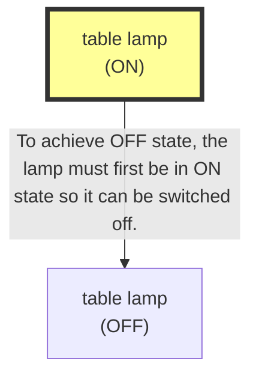

# 🚀 VirtualHome Agent Episode Log


### [GoalReasoner (Module A - Intent)] Output
```json
{
  "is_instruction_obviously_vague": false,
  "clarification_question": null,
  "target_object": "table lamp",
  "location_hint": null,
  "reasoning_chain": [
    {
      "question": "Why does the user want this object?",
      "answer": "To control the lamp's power state."
    },
    {
      "question": "Why is that important?",
      "answer": "To stop the lamp from emitting light when it is currently on."
    },
    {
      "question": "What fundamental need does this fulfill?",
      "answer": "To reduce or remove illumination from the current environment."
    },
    {
      "question": "Are there any deeper psychological or physical motivations?",
      "answer": "The user likely wants to avoid unnecessary light, improve comfort, or conserve energy."
    }
  ],
  "deep_intent": "The user wants to reduce illumination in the environment.",
  "acceptable_alternatives_properties": [
    {
      "priority": 1,
      "description": "Other nearby artificial light sources that can be turned off to reduce light, such as a desk lamp or floor lamp"
    },
    {
      "priority": 2,
      "description": "Any household light fixture or portable light that is currently on and serving the same lighting role"
    },
    {
      "priority": 3,
      "description": "Other sources of indoor illumination that can be disabled, such as a ceiling light or string lights"
    },
    {
      "priority": 4,
      "description": "Closing blinds or curtains to reduce incoming light if the goal is to darken the room"
    }
  ]
}
```

### [PerceptionFilter] Output
```json
{
  "reasoning": "The goal is to reduce illumination by turning off the target light source. The SDG requires the table lamp to transition from ON to OFF, so the table lamp must be kept. Because the goal also allows alternative light sources and room-darkening controls, I retain other relevant light fixtures and controls that could be used to reduce light: ceilinglamp, candle, lightswitch, curtains, and window.",
  "selected_classes": [
    "desk",
    "floor",
    "curtains",
    "lightswitch",
    "window",
    "candle",
    "tablelamp",
    "character",
    "ceiling",
    "ceilinglamp"
  ],
  "raw_class_count": 33
}
```

### [LLMExecutor] Output
```json
{
  "reasoning": "The active goal is to make the table lamp OFF. The filtered graph shows two table lamps (102, 103) and both are currently ON. Since the SDG requires transitioning from ON to OFF, the single next step should target one specific table lamp and switch it off. Choosing tablelamp(102) is valid because it matches the required class and currently has the needed ON state for the transition.",
  "satisfied_nodes": [],
  "current_node_focus": "N2",
  "mapped_variables": {},
  "action": "[switchoff] <tablelamp> (102)"
}
```

### [RoboStateMultiTaskController] Output
```json
{
  "action": "[walk] <tablelamp> (102)",
  "active_task_id": "task_1",
  "task_context": {
    "active_task_id": "task_1",
    "pending_task_ids": [],
    "satisfied_task_ids": []
  },
  "source": "llm_executor_repaired"
}
```
## Step 0
- **Action**: `[walk] <tablelamp> (102)`
- **Action Success**: `True`
- **Action Message**: {'0': {'message': 'Success'}}
- **Active Task**: `task_1`
- **Decision Source**: `llm_executor_repaired`
- **Task Progress**: G1_04=pending
- **SDG Status**:

- **Observed Items (33)**: floor(74), floor(75), floor(76), floor(77), floor(78), floor(79), floor(80), floor(81), floor(82), window(91) [CLOSED], ceiling(92), ceiling(93), ceiling(94), ceiling(95), ceiling(96)...


### [PerceptionFilter] Output
```json
{
  "reasoning": "Reused cached class selection.",
  "selected_classes": [
    "desk",
    "floor",
    "curtains",
    "lightswitch",
    "window",
    "candle",
    "tablelamp",
    "character",
    "ceiling",
    "ceilinglamp"
  ],
  "raw_class_count": 33
}
```

### [LLMExecutor] Output
```json
{
  "reasoning": "The active goal is to turn the table lamp OFF. The filtered graph shows tablelamp(102) is currently ON and the character is already CLOSE to it, so no additional walking is needed. The correct next atomic action is to switch off the same lamp instance.",
  "satisfied_nodes": [],
  "current_node_focus": "N2",
  "mapped_variables": {
    "?Lamp": "tablelamp(102)"
  },
  "action": "[switchoff] <tablelamp> (102)"
}
```

### [RoboStateMultiTaskController] Output
```json
{
  "action": "[switchoff] <tablelamp> (102)",
  "active_task_id": "task_1",
  "task_context": {
    "active_task_id": "task_1",
    "pending_task_ids": [],
    "satisfied_task_ids": []
  },
  "source": "llm_executor"
}
```
## Step 1
- **Action**: `[switchoff] <tablelamp> (102)`
- **Action Success**: `True`
- **Action Message**: Faked switch operation in Python layer (bypassed Unity failure)
- **Active Task**: `task_1`
- **Decision Source**: `llm_executor`
- **Task Progress**: G1_04=done
- **SDG Status**:

- **Observed Items (33)**: floor(74), floor(75), floor(76), floor(77), floor(78), floor(79), floor(80), floor(81), floor(82), window(91) [CLOSED], ceiling(92), ceiling(93), ceiling(94), ceiling(95), ceiling(96)...

