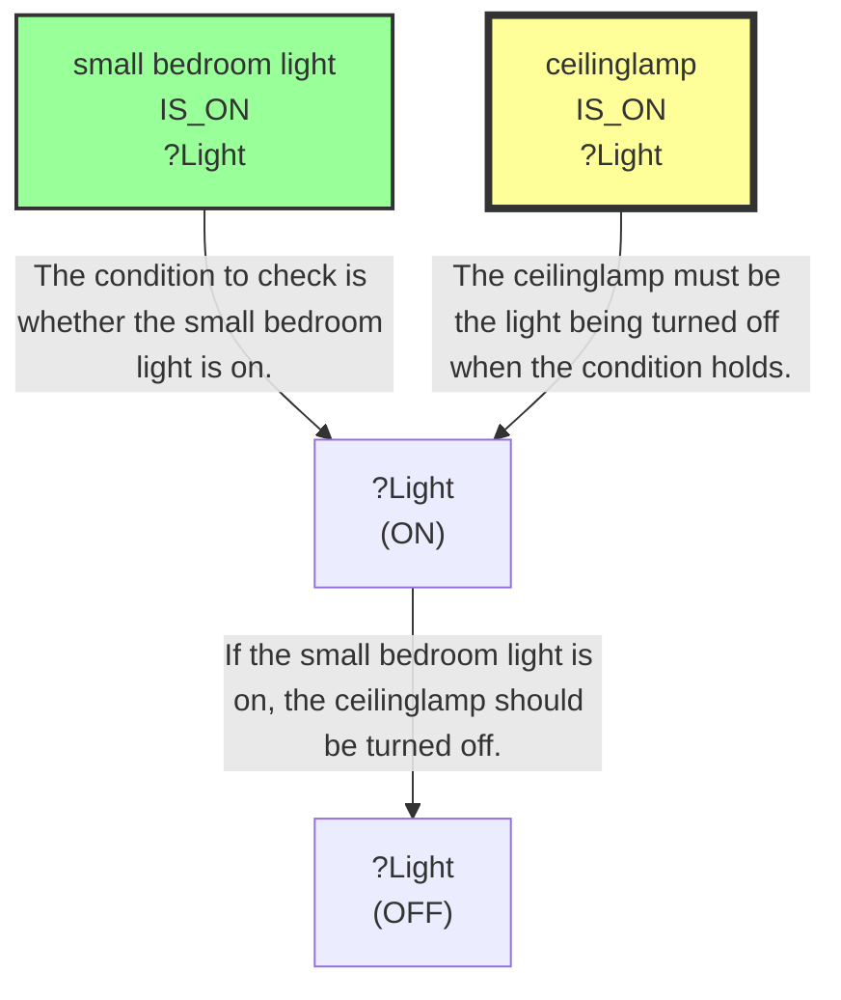
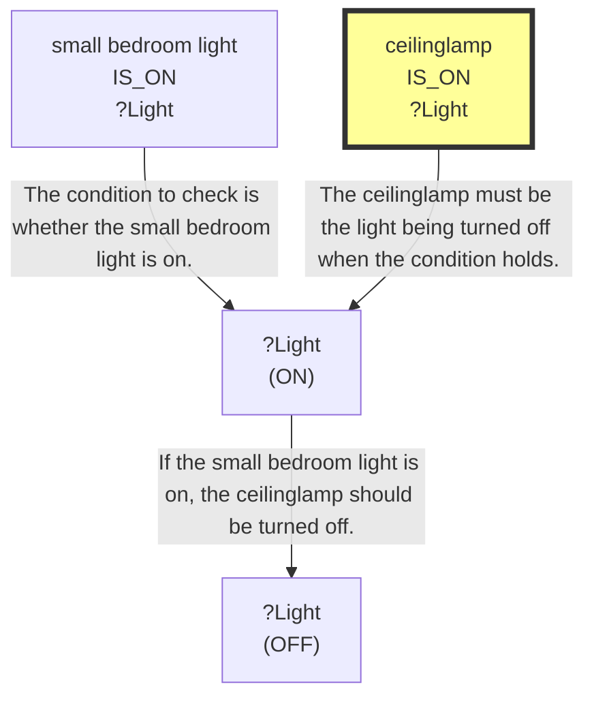
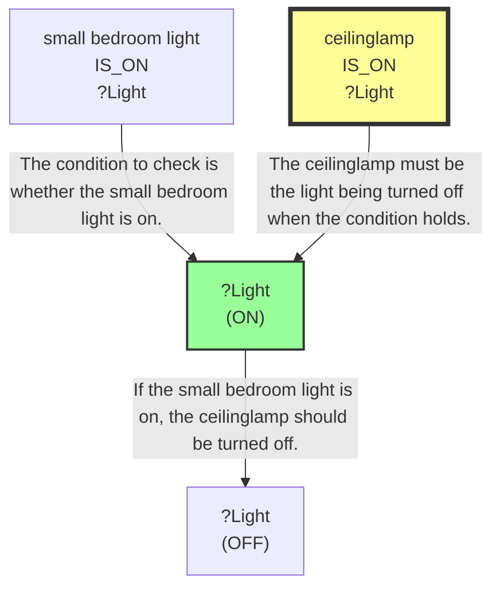
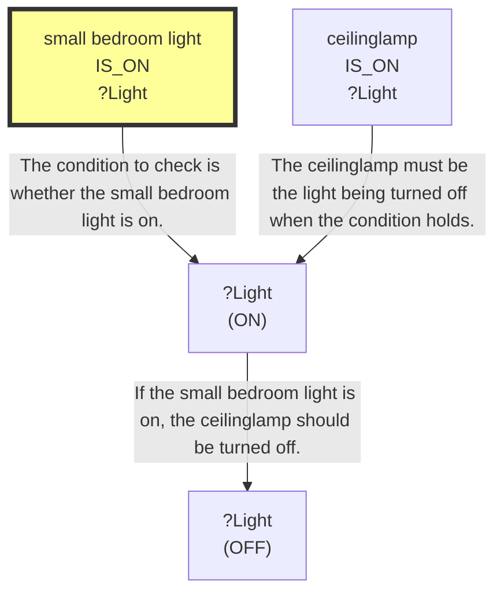
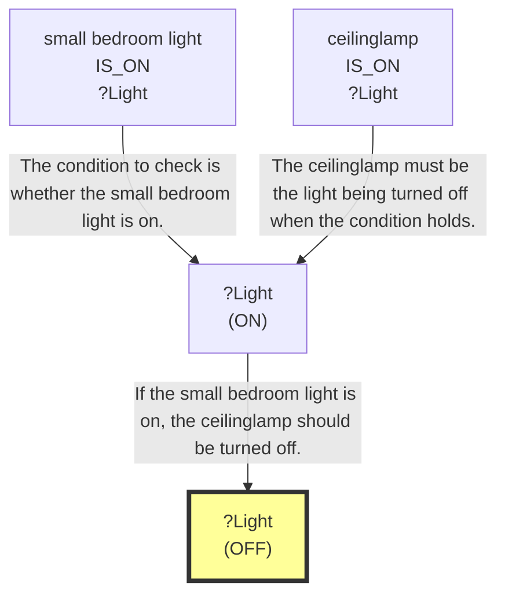
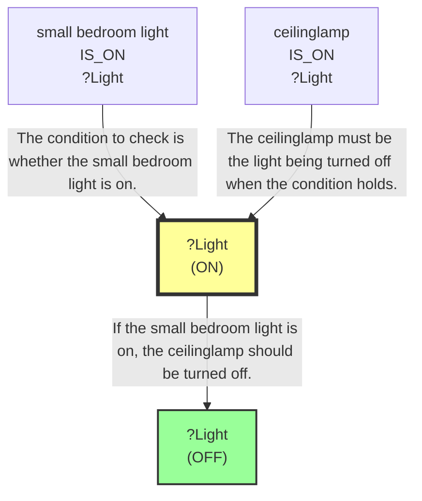
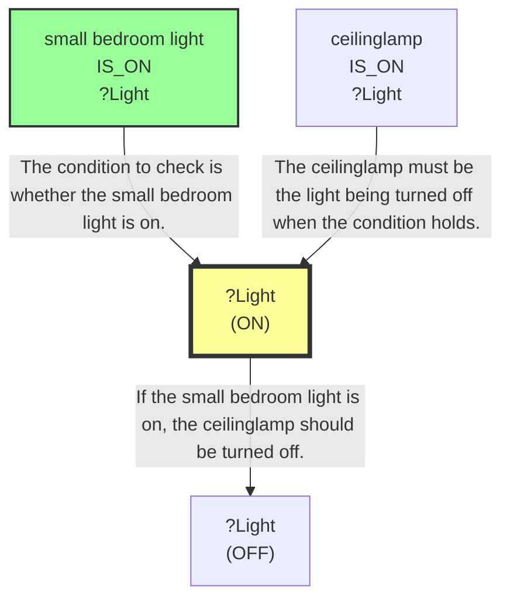

# 🚀 VirtualHome Agent Episode Log


### [GoalReasoner (Module A - Intent)] Output
```json
{
  "is_instruction_obviously_vague": false,
  "clarification_question": null,
  "target_object": "ceilinglamp",
  "location_hint": "small bedroom",
  "reasoning_chain": [
    {
      "question": "Why does the user want this object?",
      "answer": "To change the lighting state in the small bedroom if another light is already on."
    },
    {
      "question": "Why is that important?",
      "answer": "It likely helps reduce unnecessary illumination or adjust the room lighting condition."
    },
    {
      "question": "What fundamental need does this fulfill?",
      "answer": "It fulfills the need to control illumination in a room."
    },
    {
      "question": "Are there any deeper psychological or physical motivations?",
      "answer": "It may be for comfort, energy saving, or creating a preferred lighting environment."
    }
  ],
  "deep_intent": "The user wants to control room illumination by turning off an unnecessary light source when another light is already on.",
  "acceptable_alternatives_properties": [
    {
      "priority": 1,
      "description": "Other indoor light fixtures that can be switched off, such as a lamp or overhead light"
    },
    {
      "priority": 2,
      "description": "Any comparable bedroom lighting source that can be turned off to reduce brightness"
    },
    {
      "priority": 3,
      "description": "Alternative room lighting controls, such as a wall switch or dimmer, if they achieve the same lighting reduction"
    },
    {
      "priority": 4,
      "description": "Other ways to reduce indoor brightness, such as closing blinds or curtains, if direct light switching is not available"
    }
  ]
}
```

### [PerceptionFilter] Output
```json
{
  "reasoning": "The goal is to reduce room illumination in a small bedroom by turning off the specified ceilinglamp, so we must keep the target light fixture and any alternative lighting controls or comparable bedroom light sources that could also achieve the same outcome. The bedroom context also implies possible brightness-reduction alternatives like curtains/window if direct switching is unavailable.",
  "selected_classes": [
    "bed",
    "window",
    "wall",
    "lightswitch",
    "character",
    "ceiling",
    "ceilinglamp",
    "curtains",
    "tablelamp"
  ],
  "raw_class_count": 33
}
```

### [LLMExecutor] Output
```json
{
  "reasoning": "The goal is to turn off the ceilinglamp in the small bedroom if a bedroom light is on. The filtered graph shows ceilinglamp(101) exists in the bedroom, but no object yet indicates it is ON. The only explicitly ON lighting-related objects are tablelamp(102), tablelamp(103), and lightswitch(173). Since the SDG specifically requires ceilinglamp as the light to turn off, the immediate next step is to get near it before attempting any switch action. No prior walk has occurred, so proximity is not yet established.",
  "satisfied_nodes": [
    "N3"
  ],
  "current_node_focus": "N4",
  "mapped_variables": {
    "?Light": "ceilinglamp(101)"
  },
  "action": "[walk] <ceilinglamp> (101)"
}
```

### [RoboStateMultiTaskController] Output
```json
{
  "action": "[walk] <ceilinglamp> (101)",
  "active_task_id": "task_1",
  "task_context": {
    "active_task_id": "task_1",
    "pending_task_ids": [],
    "satisfied_task_ids": []
  },
  "source": "llm_executor"
}
```
## Step 0
- **Action**: `[walk] <ceilinglamp> (101)`
- **Action Success**: `True`
- **Action Message**: {'0': {'message': 'Success'}}
- **Active Task**: `task_1`
- **Decision Source**: `llm_executor`
- **Task Progress**: G1_04=pending
- **SDG Status**:

- **Observed Items (31)**: wall(83), wall(84), wall(85), wall(86), wall(87), wall(88), wall(89), wall(90), window(91) [CLOSED], ceiling(92), ceiling(93), ceiling(94), ceiling(95), ceiling(96), ceiling(97)...


### [PerceptionFilter] Output
```json
{
  "reasoning": "Reused cached class selection.",
  "selected_classes": [
    "bed",
    "window",
    "wall",
    "lightswitch",
    "character",
    "ceiling",
    "ceilinglamp",
    "curtains",
    "tablelamp"
  ],
  "raw_class_count": 33
}
```

### [LLMExecutor] Output
```json
{
  "reasoning": "The ceilinglamp(101) is already the correct target light fixture in the small bedroom, and the goal is to turn it off when another light is on. We are already positioned near it from the previous successful walk, so the next atomic step is to switch it off. This should satisfy the OFF state for the target light while addressing the bedroom lighting condition.",
  "satisfied_nodes": [],
  "current_node_focus": "N1",
  "mapped_variables": {
    "?Light": "ceilinglamp(101)"
  },
  "action": "[switchoff] <ceilinglamp> (101)"
}
```

### [RoboStateMultiTaskController] Output
```json
{
  "action": "[walk] <bathroom> (11)",
  "active_task_id": null,
  "task_context": {
    "active_task_id": null,
    "pending_task_ids": [
      "task_1"
    ],
    "satisfied_task_ids": []
  },
  "source": "loop_recovery_room_revisit"
}
```
## Step 1
- **Action**: `[walk] <bathroom> (11)`
- **Action Success**: `True`
- **Action Message**: {'0': {'message': 'Success'}}
- **Decision Source**: `loop_recovery_room_revisit`
- **Task Progress**: G1_04=pending
- **SDG Status**:
No SDG active.
- **Observed Items (74)**: floor(74), floor(75), floor(76), floor(77), floor(78), floor(79), floor(80), floor(81), floor(82), wall(83), wall(84), wall(85), wall(86), wall(87), wall(88)...


### [PerceptionFilter] Output
```json
{
  "reasoning": "The goal is to turn off a bedroom light, so the necessary classes are the target light fixture and any alternative lighting controls explicitly relevant to the task. Since the SDG names ceilinglamp as the light to be turned off, it must be kept. The acceptable alternatives include another bedroom light fixture and a wall control, so tablelamp, walllamp, and lightswitch are retained as backups/controls. Curtains are also retained as a fallback way to reduce brightness if direct switching is unavailable. The small bedroom furniture is not needed for the action itself.",
  "selected_classes": [
    "bed",
    "wall",
    "walllamp",
    "lightswitch",
    "character",
    "ceiling",
    "ceilinglamp",
    "curtains",
    "tablelamp",
    "door"
  ],
  "raw_class_count": 54
}
```

### [LLMExecutor] Output
```json
{
  "reasoning": "The active task is to turn off the ceilinglamp in the small bedroom if the bedroom light is on. The Filtered Graph shows the target ceilinglamp(101) is in the bedroom and the bedroom also has an ON lightswitch(173) and ON tablelamps, but the specific goal node N4 references ceilinglamp as the light to turn off. I am currently in the bathroom, so I must first move to the target light before I can interact with it. Since the previous action was walking to the bathroom, the next necessary step is to walk back to the ceilinglamp in the bedroom.",
  "satisfied_nodes": [],
  "current_node_focus": "N4",
  "mapped_variables": {
    "?Light": "ceilinglamp(101)"
  },
  "action": "[walk] <ceilinglamp> (101)"
}
```

### [RoboStateMultiTaskController] Output
```json
{
  "action": "[walk] <ceilinglamp> (101)",
  "active_task_id": "task_1",
  "task_context": {
    "active_task_id": "task_1",
    "pending_task_ids": [],
    "satisfied_task_ids": []
  },
  "source": "llm_executor"
}
```
## Step 2
- **Action**: `[walk] <ceilinglamp> (101)`
- **Action Success**: `True`
- **Action Message**: {'0': {'message': 'Success'}}
- **Active Task**: `task_1`
- **Decision Source**: `llm_executor`
- **Task Progress**: G1_04=pending
- **SDG Status**:

- **Observed Items (52)**: wall(83), wall(84), wall(85), wall(86), wall(87), wall(88), wall(89), wall(90), ceiling(92), ceiling(93), ceiling(94), ceiling(95), ceiling(96), ceiling(97), ceiling(98)...


### [PerceptionFilter] Output
```json
{
  "reasoning": "Reused cached class selection.",
  "selected_classes": [
    "bed",
    "wall",
    "walllamp",
    "lightswitch",
    "character",
    "ceiling",
    "ceilinglamp",
    "curtains",
    "tablelamp",
    "door"
  ],
  "raw_class_count": 54
}
```

### [LLMExecutor] Output
```json
{
  "reasoning": "The small bedroom contains multiple candidate light sources: ceilinglamp(101) and two tablelamps(102,103), all currently in the bedroom. The SDG requires the target light (?Light) to be ON first, then OFF; the current graph shows tablelamp(102) and tablelamp(103) are ON, while ceilinglamp(101) has no ON/OFF state yet. Since the goal intent specifically names the ceilinglamp as the preferred light to turn off, and we are already at/near the bedroom bed area with no need to walk again right after prior walk, the most direct next step is to switch off the ceilinglamp if it is the intended light source. However, because the current graph does not show ceilinglamp(101) as ON, the SDG indicates the focus should be satisfying N2/N4 by interacting with the relevant light source; the closest actionable step is to turn off the ceilinglamp candidate in the bedroom. This is the best match to the named target object and the illumination-reduction intent.",
  "satisfied_nodes": [],
  "current_node_focus": "N4",
  "mapped_variables": {
    "?Light": "ceilinglamp(101)"
  },
  "action": "[switchoff] <ceilinglamp> (101)"
}
```

### [RoboStateMultiTaskController] Output
```json
{
  "action": "[walk] <kitchen> (205)",
  "active_task_id": null,
  "task_context": {
    "active_task_id": null,
    "pending_task_ids": [
      "task_1"
    ],
    "satisfied_task_ids": []
  },
  "source": "loop_recovery_room_revisit"
}
```
## Step 3
- **Action**: `[walk] <kitchen> (205)`
- **Action Success**: `True`
- **Action Message**: {'0': {'message': 'Success'}}
- **Decision Source**: `loop_recovery_room_revisit`
- **Task Progress**: G1_04=pending
- **SDG Status**:
No SDG active.
- **Observed Items (135)**: floor(74), floor(75), floor(76), floor(77), floor(78), floor(79), floor(80), floor(81), floor(82), wall(83), wall(84), wall(85), wall(86), wall(87), wall(88)...


### [PerceptionFilter] Output
```json
{
  "reasoning": "The goal is to turn off the bedroom light, so we need the target light fixture and any alternative controls or lighting sources that could achieve the same lighting reduction. From the observed objects, the relevant classes are the ceilinglamp itself, another bedroom light option (tablelamp, walllamp), and a direct control (lightswitch). Curtains/window are also retained as a fallback way to reduce brightness if direct switching is unavailable.",
  "selected_classes": [
    "bed",
    "window",
    "wall",
    "walllamp",
    "lightswitch",
    "character",
    "ceiling",
    "ceilinglamp",
    "curtains",
    "tablelamp",
    "door"
  ],
  "raw_class_count": 91
}
```

### [LLMExecutor] Output
```json
{
  "reasoning": "The active SDG requires turning OFF the target light ?Light, and the only matching bedroom fixture in the filtered graph is ceilinglamp(101). The previous action already walked near ceilinglamp(101), so I can directly operate it now. The current graph shows ceilinglamp(101) is in the bedroom and not yet OFF, while another bedroom light source (tablelamp(102) and tablelamp(103)) is ON, which supports the intent of reducing unnecessary lighting. The next atomic step is to switch off the ceilinglamp.",
  "satisfied_nodes": [
    "N3",
    "N4"
  ],
  "current_node_focus": "N2",
  "mapped_variables": {
    "?Light": "ceilinglamp(101)"
  },
  "action": "[switchoff] <ceilinglamp> (101)"
}
```

### [RoboStateMultiTaskController] Output
```json
{
  "action": "[walk] <livingroom> (335)",
  "active_task_id": null,
  "task_context": {
    "active_task_id": null,
    "pending_task_ids": [
      "task_1"
    ],
    "satisfied_task_ids": []
  },
  "source": "loop_recovery_room_revisit"
}
```
## Step 4
- **Action**: `[walk] <livingroom> (335)`
- **Action Success**: `True`
- **Action Message**: {'0': {'message': 'Success'}}
- **Decision Source**: `loop_recovery_room_revisit`
- **Task Progress**: G1_04=pending
- **SDG Status**:
No SDG active.
- **Observed Items (242)**: floor(74), floor(75), floor(76), floor(77), floor(78), floor(79), floor(80), floor(81), floor(82), wall(83), wall(84), wall(85), wall(86), wall(87), wall(88)...


### [PerceptionFilter] Output
```json
{
  "reasoning": "The goal is to turn off the bedroom lighting, so the target light fixture must be kept. Since the intent allows comparable indoor light sources and light controls as backups, I also keep the other visible room light fixtures and direct control needed to switch lighting off in the bedroom.",
  "selected_classes": [
    "bed",
    "window",
    "wall",
    "walllamp",
    "lightswitch",
    "character",
    "ceiling",
    "ceilinglamp",
    "curtains",
    "tablelamp",
    "door"
  ],
  "raw_class_count": 101
}
```

### [LLMExecutor] Output
```json
{
  "reasoning": "The current goal is to turn OFF the ceilinglamp in the small bedroom if the corresponding bedroom light is ON. In the filtered graph, the bedroom contains ceilinglamp(101) and there is no explicit ON state on it yet, but the active task's SDG targets that exact ceilinglamp. Since the prior action history shows the robot already walked to ceilinglamp(101), the next atomic action should be to switch it off, which is the direct way to satisfy the required OFF state.",
  "satisfied_nodes": [
    "N3"
  ],
  "current_node_focus": "N1",
  "mapped_variables": {
    "?Light": "ceilinglamp(101)"
  },
  "action": "[switchoff] <ceilinglamp> (101)"
}
```

### [RoboStateMultiTaskController] Output
```json
{
  "action": "[walk] <bathroom> (11)",
  "active_task_id": null,
  "task_context": {
    "active_task_id": null,
    "pending_task_ids": [
      "task_1"
    ],
    "satisfied_task_ids": []
  },
  "source": "loop_recovery_room_revisit"
}
```
## Step 5
- **Action**: `[walk] <bathroom> (11)`
- **Action Success**: `True`
- **Action Message**: {'0': {'message': 'Success'}}
- **Decision Source**: `loop_recovery_room_revisit`
- **Task Progress**: G1_04=pending
- **SDG Status**:
No SDG active.
- **Observed Items (316)**: floor(74), floor(75), floor(76), floor(77), floor(78), floor(79), floor(80), floor(81), floor(82), wall(83), wall(84), wall(85), wall(86), wall(87), wall(88)...


### [PerceptionFilter] Output
```json
{
  "reasoning": "Reused cached class selection.",
  "selected_classes": [
    "bed",
    "window",
    "wall",
    "walllamp",
    "lightswitch",
    "character",
    "ceiling",
    "ceilinglamp",
    "curtains",
    "tablelamp",
    "door"
  ],
  "raw_class_count": 101
}
```

### [LLMExecutor] Output
```json
{
  "reasoning": "The task is to turn off the ceilinglamp in the small bedroom when another light is on. The current graph shows the small bedroom is the bedroom(73), and the relevant target light is ceilinglamp(101) inside that room. The character is currently in the bathroom, so before any switch action I must move to the target light. Since the instruction specifically concerns the bedroom ceilinglamp and it is not already off, the next step is to walk to that lamp so I can interact with it next.",
  "satisfied_nodes": [
    "N2"
  ],
  "current_node_focus": "N4",
  "mapped_variables": {
    "?Light": "ceilinglamp(101)"
  },
  "action": "[walk] <ceilinglamp> (101)"
}
```

### [RoboStateMultiTaskController] Output
```json
{
  "action": "[walk] <ceilinglamp> (101)",
  "active_task_id": "task_1",
  "task_context": {
    "active_task_id": "task_1",
    "pending_task_ids": [],
    "satisfied_task_ids": []
  },
  "source": "llm_executor"
}
```
## Step 6
- **Action**: `[walk] <ceilinglamp> (101)`
- **Action Success**: `True`
- **Action Message**: {'0': {'message': 'Success'}}
- **Active Task**: `task_1`
- **Decision Source**: `llm_executor`
- **Task Progress**: G1_04=pending
- **SDG Status**:

- **Observed Items (97)**: wall(83), wall(84), wall(85), wall(86), wall(87), wall(88), wall(89), wall(90), window(91) [CLOSED], ceiling(92), ceiling(93), ceiling(94), ceiling(95), ceiling(96), ceiling(97)...


### [PerceptionFilter] Output
```json
{
  "reasoning": "Reused cached class selection.",
  "selected_classes": [
    "bed",
    "window",
    "wall",
    "walllamp",
    "lightswitch",
    "character",
    "ceiling",
    "ceilinglamp",
    "curtains",
    "tablelamp",
    "door"
  ],
  "raw_class_count": 101
}
```

### [LLMExecutor] Output
```json
{
  "reasoning": "The active task is to turn off the ceilinglamp in the small bedroom if the bedroom light is on. In the bedroom, the ceilinglamp(101) is the target light fixture and the bedroom also has a lightswitch(173) that is ON. Since the prior action already walked to the ceilinglamp and we should not repeat a walk action, the next atomic step is to switch off the ceilinglamp itself. This directly advances N4 and N1 by turning the target light OFF.",
  "satisfied_nodes": [
    "N2",
    "N3"
  ],
  "current_node_focus": "N4",
  "mapped_variables": {
    "?Light": "ceilinglamp(101)"
  },
  "action": "[switchoff] <ceilinglamp> (101)"
}
```

### [RoboStateMultiTaskController] Output
```json
{
  "action": "[walk] <kitchen> (205)",
  "active_task_id": null,
  "task_context": {
    "active_task_id": null,
    "pending_task_ids": [
      "task_1"
    ],
    "satisfied_task_ids": []
  },
  "source": "loop_recovery_room_revisit"
}
```
## Step 7
- **Action**: `[walk] <kitchen> (205)`
- **Action Success**: `True`
- **Action Message**: {'0': {'message': 'Success'}}
- **Decision Source**: `loop_recovery_room_revisit`
- **Task Progress**: G1_04=pending
- **SDG Status**:
No SDG active.
- **Observed Items (316)**: floor(74), floor(75), floor(76), floor(77), floor(78), floor(79), floor(80), floor(81), floor(82), wall(83), wall(84), wall(85), wall(86), wall(87), wall(88)...


### [PerceptionFilter] Output
```json
{
  "reasoning": "Reused cached class selection.",
  "selected_classes": [
    "bed",
    "window",
    "wall",
    "walllamp",
    "lightswitch",
    "character",
    "ceiling",
    "ceilinglamp",
    "curtains",
    "tablelamp",
    "door"
  ],
  "raw_class_count": 101
}
```

### [LLMExecutor] Output
```json
{
  "reasoning": "The active task is to turn off the ceilinglamp in the small bedroom if the bedroom light is on. In the filtered graph, the small bedroom contains ceilinglamp(101) and there is no explicit ON state for it yet, but the task intent targets this specific fixture. The character is currently in the kitchen, so due to the proximity rule I must first move to the bedroom light fixture before any switch interaction. Ceilinglamp(101) is the best bind for ?Light and satisfies the location hint 'small bedroom'.",
  "satisfied_nodes": [],
  "current_node_focus": "N4",
  "mapped_variables": {
    "?Light": "ceilinglamp(101)"
  },
  "action": "[walk] <ceilinglamp> (101)"
}
```

### [RoboStateMultiTaskController] Output
```json
{
  "action": "[walk] <ceilinglamp> (101)",
  "active_task_id": "task_1",
  "task_context": {
    "active_task_id": "task_1",
    "pending_task_ids": [],
    "satisfied_task_ids": []
  },
  "source": "llm_executor"
}
```
## Step 8
- **Action**: `[walk] <ceilinglamp> (101)`
- **Action Success**: `True`
- **Action Message**: {'0': {'message': 'Success'}}
- **Active Task**: `task_1`
- **Decision Source**: `llm_executor`
- **Task Progress**: G1_04=pending
- **SDG Status**:

- **Observed Items (97)**: wall(83), wall(84), wall(85), wall(86), wall(87), wall(88), wall(89), wall(90), window(91) [CLOSED], ceiling(92), ceiling(93), ceiling(94), ceiling(95), ceiling(96), ceiling(97)...


### [PerceptionFilter] Output
```json
{
  "reasoning": "Reused cached class selection.",
  "selected_classes": [
    "bed",
    "window",
    "wall",
    "walllamp",
    "lightswitch",
    "character",
    "ceiling",
    "ceilinglamp",
    "curtains",
    "tablelamp",
    "door"
  ],
  "raw_class_count": 101
}
```

### [LLMExecutor] Output
```json
{
  "reasoning": "The goal targets the bedroom ceilinglamp, but the SDG says to turn off the light only if the small bedroom light is on. In the bedroom, the likely controlling light sources are the bedroom ceilinglamp(101) and bedroom lightswitch-related fixtures. We are already in the bedroom and previously walked to ceilinglamp(101), so the next necessary step is to switch it off if it is the active bedroom light. Turning it off moves toward satisfying N2->N1 for the ceilinglamp branch.",
  "satisfied_nodes": [
    "N3"
  ],
  "current_node_focus": "N4",
  "mapped_variables": {
    "?Light": "ceilinglamp(101)"
  },
  "action": "[switchoff] <ceilinglamp> (101)"
}
```

### [RoboStateMultiTaskController] Output
```json
{
  "action": "[walk] <livingroom> (335)",
  "active_task_id": null,
  "task_context": {
    "active_task_id": null,
    "pending_task_ids": [
      "task_1"
    ],
    "satisfied_task_ids": []
  },
  "source": "loop_recovery_room_revisit"
}
```
## Step 9
- **Action**: `[walk] <livingroom> (335)`
- **Action Success**: `True`
- **Action Message**: {'0': {'message': 'Success'}}
- **Decision Source**: `loop_recovery_room_revisit`
- **Task Progress**: G1_04=pending
- **SDG Status**:
No SDG active.
- **Observed Items (316)**: floor(74), floor(75), floor(76), floor(77), floor(78), floor(79), floor(80), floor(81), floor(82), wall(83), wall(84), wall(85), wall(86), wall(87), wall(88)...


### [PerceptionFilter] Output
```json
{
  "reasoning": "Reused cached class selection.",
  "selected_classes": [
    "bed",
    "window",
    "wall",
    "walllamp",
    "lightswitch",
    "character",
    "ceiling",
    "ceilinglamp",
    "curtains",
    "tablelamp",
    "door"
  ],
  "raw_class_count": 101
}
```

### [LLMExecutor] Output
```json
{
  "reasoning": "The active goal is to turn off the ceilinglamp in the small bedroom when the bedroom light condition holds. In the current bedroom graph, the only clearly lit bedroom fixture matching the target is ceilinglamp(101) by location, but it has no ON state shown; the actual ON bedroom light appears to be lightswitch(173), which is inside the bedroom and currently ON. Since the task intent is to reduce bedroom illumination and the SDG requires ?Light to be ON before turning it OFF, the best next step is to approach the active switch/light control in the bedroom and then operate it. Because I am currently in the livingroom, I need to walk to the bedroom-side light control first. The most relevant controllable light object in the target room is lightswitch(173), and I already know I am not near it.",
  "satisfied_nodes": [],
  "current_node_focus": "N3",
  "mapped_variables": {
    "?Light": "lightswitch(173)"
  },
  "action": "[walk] <lightswitch> (173)"
}
```

### [RoboStateMultiTaskController] Output
```json
{
  "action": "[walk] <lightswitch> (173)",
  "active_task_id": "task_1",
  "task_context": {
    "active_task_id": "task_1",
    "pending_task_ids": [],
    "satisfied_task_ids": []
  },
  "source": "llm_executor"
}
```
## Step 10
- **Action**: `[walk] <lightswitch> (173)`
- **Action Success**: `True`
- **Action Message**: {'0': {'message': 'Success'}}
- **Active Task**: `task_1`
- **Decision Source**: `llm_executor`
- **Task Progress**: G1_04=pending
- **SDG Status**:

- **Observed Items (97)**: wall(83), wall(84), wall(85), wall(86), wall(87), wall(88), wall(89), wall(90), window(91) [CLOSED], ceiling(92), ceiling(93), ceiling(94), ceiling(95), ceiling(96), ceiling(97)...


### [PerceptionFilter] Output
```json
{
  "reasoning": "Reused cached class selection.",
  "selected_classes": [
    "bed",
    "window",
    "wall",
    "walllamp",
    "lightswitch",
    "character",
    "ceiling",
    "ceilinglamp",
    "curtains",
    "tablelamp",
    "door"
  ],
  "raw_class_count": 101
}
```

### [LLMExecutor] Output
```json
{
  "reasoning": "The active goal is to turn off the ceilinglamp in the small bedroom if the bedroom light is on. In the current graph, the small bedroom contains ceilinglamp(101), and the nearby controllable light source is lightswitch(173) with state ON and CLOSE character(1). Since the task is to control room illumination, switching off the nearby bedroom lightswitch is the most direct action to satisfy the 'light is on' condition by turning the relevant bedroom light off. I am already close to lightswitch(173), so the next atomic action is to switch it off.",
  "satisfied_nodes": [],
  "current_node_focus": "N1",
  "mapped_variables": {
    "?Light": "lightswitch(173)"
  },
  "action": "[switchoff] <lightswitch> (173)"
}
```

### [RoboStateMultiTaskController] Output
```json
{
  "action": "[switchoff] <lightswitch> (173)",
  "active_task_id": "task_1",
  "task_context": {
    "active_task_id": "task_1",
    "pending_task_ids": [],
    "satisfied_task_ids": []
  },
  "source": "llm_executor"
}
```
## Step 11
- **Action**: `[switchoff] <lightswitch> (173)`
- **Action Success**: `True`
- **Action Message**: Faked switch operation in Python layer (bypassed Unity failure)
- **Active Task**: `task_1`
- **Decision Source**: `llm_executor`
- **Task Progress**: G1_04=pending
- **SDG Status**:

- **Observed Items (97)**: wall(83), wall(84), wall(85), wall(86), wall(87), wall(88), wall(89), wall(90), window(91) [CLOSED], ceiling(92), ceiling(93), ceiling(94), ceiling(95), ceiling(96), ceiling(97)...


### [PerceptionFilter] Output
```json
{
  "reasoning": "Reused cached class selection.",
  "selected_classes": [
    "bed",
    "window",
    "wall",
    "walllamp",
    "lightswitch",
    "character",
    "ceiling",
    "ceilinglamp",
    "curtains",
    "tablelamp",
    "door"
  ],
  "raw_class_count": 101
}
```

### [LLMExecutor] Output
```json
{
  "reasoning": "The active goal is to turn off the ceilinglamp in the small bedroom when the corresponding bedroom light is on. In the current graph, the small bedroom's candidate lightswitch is already OFF, and the ceilinglamp(101) itself has no ON state. The bedroom also contains another obvious controllable light source, tablelamp(102), which is ON and matches the goal intent's acceptable alternative lighting source to switch off. I have not yet interacted with tablelamp(102), so the next step is to move to it before turning it off.",
  "satisfied_nodes": [
    "N1"
  ],
  "current_node_focus": "N2",
  "mapped_variables": {
    "?Light": "tablelamp(102)"
  },
  "action": "[walk] <tablelamp> (102)"
}
```

### [RoboStateMultiTaskController] Output
```json
{
  "action": "[walk] <tablelamp> (102)",
  "active_task_id": "task_1",
  "task_context": {
    "active_task_id": "task_1",
    "pending_task_ids": [],
    "satisfied_task_ids": []
  },
  "source": "llm_executor"
}
```
## Step 12
- **Action**: `[walk] <tablelamp> (102)`
- **Action Success**: `True`
- **Action Message**: {'0': {'message': 'Success'}}
- **Active Task**: `task_1`
- **Decision Source**: `llm_executor`
- **Task Progress**: G1_04=pending
- **SDG Status**:

- **Observed Items (97)**: wall(83), wall(84), wall(85), wall(86), wall(87), wall(88), wall(89), wall(90), window(91) [CLOSED], ceiling(92), ceiling(93), ceiling(94), ceiling(95), ceiling(96), ceiling(97)...


### [PerceptionFilter] Output
```json
{
  "reasoning": "Reused cached class selection.",
  "selected_classes": [
    "bed",
    "window",
    "wall",
    "walllamp",
    "lightswitch",
    "character",
    "ceiling",
    "ceilinglamp",
    "curtains",
    "tablelamp",
    "door"
  ],
  "raw_class_count": 101
}
```

### [LLMExecutor] Output
```json
{
  "reasoning": "The active goal is to turn off the bedroom ceilinglamp only if the small bedroom light is on. In the current filtered graph, the bedroom ceilinglamp(101) is present, but there is no explicit ON state for it, while the bedroom tablelamp(102) is ON and already close to the character. The SDG allows the ceilinglamp as the target light, but the current graph does not confirm it is on. Since the task intent is to reduce room lighting and there is a currently ON bedroom light fixture nearby, the next best physically valid step is to switch off the nearby tablelamp to reduce illumination. I am using the nearby bedroom tablelamp(102) as the best alternative light source matching the intent and current accessibility.",
  "satisfied_nodes": [
    "N3"
  ],
  "current_node_focus": "N2",
  "mapped_variables": {
    "?Light": "tablelamp(102)"
  },
  "action": "[switchoff] <tablelamp> (102)"
}
```

### [RoboStateMultiTaskController] Output
```json
{
  "action": "[switchoff] <tablelamp> (102)",
  "active_task_id": "task_1",
  "task_context": {
    "active_task_id": "task_1",
    "pending_task_ids": [],
    "satisfied_task_ids": []
  },
  "source": "llm_executor"
}
```
## Step 13
- **Action**: `[switchoff] <tablelamp> (102)`
- **Action Success**: `True`
- **Action Message**: Faked switch operation in Python layer (bypassed Unity failure)
- **Active Task**: `task_1`
- **Decision Source**: `llm_executor`
- **Task Progress**: G1_04=done
- **SDG Status**:

- **Observed Items (97)**: wall(83), wall(84), wall(85), wall(86), wall(87), wall(88), wall(89), wall(90), window(91) [CLOSED], ceiling(92), ceiling(93), ceiling(94), ceiling(95), ceiling(96), ceiling(97)...

