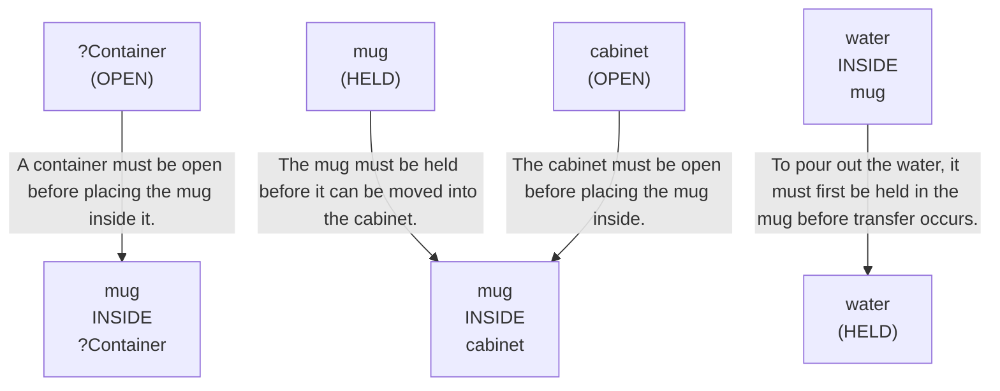

# 🚀 VirtualHome Agent Episode Log


### [GoalReasoner (Module A - Intent)] Output
```json
{
  "is_instruction_obviously_vague": false,
  "clarification_question": null,
  "target_object": "mug",
  "location_hint": "cabinet",
  "reasoning_chain": [
    {
      "question": "Why does the user want this object?",
      "answer": "To have the mug emptied and stored away."
    },
    {
      "question": "Why is that important?",
      "answer": "So the mug is no longer holding water and is placed in its storage location."
    },
    {
      "question": "What fundamental need does this fulfill?",
      "answer": "It helps with tidying up and organizing household items."
    },
    {
      "question": "Are there any deeper psychological or physical motivations?",
      "answer": "The user may want to reduce clutter, prevent spills, or return the mug to a designated place for later use."
    }
  ],
  "deep_intent": "The user wants to tidy and organize a household item by emptying it and storing it away.",
  "acceptable_alternatives_properties": [
    {
      "priority": 1,
      "description": "Other small drink containers or cups that can be emptied and put away"
    },
    {
      "priority": 2,
      "description": "Other washable kitchenware items that are meant to be stored in a cabinet, such as bowls or glasses"
    },
    {
      "priority": 3,
      "description": "Any empty reusable beverage container that can be dried and stored"
    },
    {
      "priority": 4,
      "description": "Other household items that need to be cleared and returned to storage, if the exact container is unavailable"
    }
  ]
}
```

### [RoboStateMultiTaskController] Output
```json
{
  "action": "[walk] <bathroom> (11)",
  "active_task_id": "task_1",
  "task_context": {
    "active_task_id": "task_1",
    "pending_task_ids": [],
    "satisfied_task_ids": []
  },
  "source": "room_frontier"
}
```
## Step 0
- **Action**: `[walk] <bathroom> (11)`
- **Action Success**: `True`
- **Action Message**: {'0': {'message': 'Success'}}
- **Active Task**: `task_1`
- **Decision Source**: `room_frontier`
- **Task Progress**: G1_05=pending
- **SDG Status**:

- **Observed Items (113)**: floor(206), floor(207), floor(208), floor(209), floor(210), floor(211), wall(212), wall(213), wall(214), wall(215), wall(216), wall(217), ceiling(218), ceiling(219), ceiling(220)...


### [RoboStateMultiTaskController] Output
```json
{
  "action": "[walk] <bedroom> (73)",
  "active_task_id": "task_1",
  "task_context": {
    "active_task_id": "task_1",
    "pending_task_ids": [],
    "satisfied_task_ids": []
  },
  "source": "room_frontier"
}
```
## Step 1
- **Action**: `[walk] <bedroom> (73)`
- **Action Success**: `True`
- **Action Message**: {'0': {'message': 'Success'}}
- **Active Task**: `task_1`
- **Decision Source**: `room_frontier`
- **Task Progress**: G1_05=pending
- **SDG Status**:

- **Observed Items (174)**: floor(206), floor(207), floor(208), floor(209), floor(210), floor(211), wall(212), wall(213), wall(214), wall(215), wall(216), wall(217), ceiling(218), ceiling(219), ceiling(220)...


### [RoboStateMultiTaskController] Output
```json
{
  "action": "[walk] <livingroom> (335)",
  "active_task_id": "task_1",
  "task_context": {
    "active_task_id": "task_1",
    "pending_task_ids": [],
    "satisfied_task_ids": []
  },
  "source": "room_frontier"
}
```
## Step 2
- **Action**: `[walk] <livingroom> (335)`
- **Action Success**: `True`
- **Action Message**: {'0': {'message': 'Success'}}
- **Active Task**: `task_1`
- **Decision Source**: `room_frontier`
- **Task Progress**: G1_05=pending
- **SDG Status**:

- **Observed Items (242)**: floor(206), floor(207), floor(208), floor(209), floor(210), floor(211), wall(212), wall(213), wall(214), wall(215), wall(216), wall(217), ceiling(218), ceiling(219), ceiling(220)...


### [RoboStateMultiTaskController] Output
```json
{
  "action": "[walk] <kitchen> (205)",
  "active_task_id": null,
  "task_context": {
    "active_task_id": null,
    "pending_task_ids": [
      "task_1"
    ],
    "satisfied_task_ids": []
  },
  "source": "loop_recovery_room_revisit"
}
```
## Step 3
- **Action**: `[walk] <kitchen> (205)`
- **Action Success**: `True`
- **Action Message**: {'0': {'message': 'Success'}}
- **Decision Source**: `loop_recovery_room_revisit`
- **Task Progress**: G1_05=pending
- **SDG Status**:
No SDG active.
- **Observed Items (316)**: floor(206), floor(207), floor(208), floor(209), floor(210), floor(211), wall(212), wall(213), wall(214), wall(215), wall(216), wall(217), ceiling(218), ceiling(219), ceiling(220)...


### [RoboStateMultiTaskController] Output
```json
{
  "action": "[walk] <bathroom> (11)",
  "active_task_id": null,
  "task_context": {
    "active_task_id": null,
    "pending_task_ids": [
      "task_1"
    ],
    "satisfied_task_ids": []
  },
  "source": "loop_recovery_room_revisit"
}
```
## Step 4
- **Action**: `[walk] <bathroom> (11)`
- **Action Success**: `True`
- **Action Message**: {'0': {'message': 'Success'}}
- **Decision Source**: `loop_recovery_room_revisit`
- **Task Progress**: G1_05=pending
- **SDG Status**:
No SDG active.
- **Observed Items (316)**: floor(206), floor(207), floor(208), floor(209), floor(210), floor(211), wall(212), wall(213), wall(214), wall(215), wall(216), wall(217), ceiling(218), ceiling(219), ceiling(220)...


### [RoboStateMultiTaskController] Output
```json
{
  "action": "[walk] <bedroom> (73)",
  "active_task_id": null,
  "task_context": {
    "active_task_id": null,
    "pending_task_ids": [
      "task_1"
    ],
    "satisfied_task_ids": []
  },
  "source": "loop_recovery_room_revisit"
}
```
## Step 5
- **Action**: `[walk] <bedroom> (73)`
- **Action Success**: `True`
- **Action Message**: {'0': {'message': 'Success'}}
- **Decision Source**: `loop_recovery_room_revisit`
- **Task Progress**: G1_05=pending
- **SDG Status**:
No SDG active.
- **Observed Items (316)**: floor(206), floor(207), floor(208), floor(209), floor(210), floor(211), wall(212), wall(213), wall(214), wall(215), wall(216), wall(217), ceiling(218), ceiling(219), ceiling(220)...


### [RoboStateMultiTaskController] Output
```json
{
  "action": "[walk] <livingroom> (335)",
  "active_task_id": null,
  "task_context": {
    "active_task_id": null,
    "pending_task_ids": [
      "task_1"
    ],
    "satisfied_task_ids": []
  },
  "source": "loop_recovery_room_revisit"
}
```
## Step 6
- **Action**: `[walk] <livingroom> (335)`
- **Action Success**: `True`
- **Action Message**: {'0': {'message': 'Success'}}
- **Decision Source**: `loop_recovery_room_revisit`
- **Task Progress**: G1_05=pending
- **SDG Status**:
No SDG active.
- **Observed Items (316)**: floor(206), floor(207), floor(208), floor(209), floor(210), floor(211), wall(212), wall(213), wall(214), wall(215), wall(216), wall(217), ceiling(218), ceiling(219), ceiling(220)...


### [RoboStateMultiTaskController] Output
```json
{
  "action": "[walk] <kitchen> (205)",
  "active_task_id": null,
  "task_context": {
    "active_task_id": null,
    "pending_task_ids": [
      "task_1"
    ],
    "satisfied_task_ids": []
  },
  "source": "loop_recovery_room_revisit"
}
```
## Step 7
- **Action**: `[walk] <kitchen> (205)`
- **Action Success**: `True`
- **Action Message**: {'0': {'message': 'Success'}}
- **Decision Source**: `loop_recovery_room_revisit`
- **Task Progress**: G1_05=pending
- **SDG Status**:
No SDG active.
- **Observed Items (316)**: floor(206), floor(207), floor(208), floor(209), floor(210), floor(211), wall(212), wall(213), wall(214), wall(215), wall(216), wall(217), ceiling(218), ceiling(219), ceiling(220)...


### [RoboStateMultiTaskController] Output
```json
{
  "action": "[walk] <bathroom> (11)",
  "active_task_id": null,
  "task_context": {
    "active_task_id": null,
    "pending_task_ids": [
      "task_1"
    ],
    "satisfied_task_ids": []
  },
  "source": "loop_recovery_room_revisit"
}
```
## Step 8
- **Action**: `[walk] <bathroom> (11)`
- **Action Success**: `True`
- **Action Message**: {'0': {'message': 'Success'}}
- **Decision Source**: `loop_recovery_room_revisit`
- **Task Progress**: G1_05=pending
- **SDG Status**:
No SDG active.
- **Observed Items (316)**: floor(206), floor(207), floor(208), floor(209), floor(210), floor(211), wall(212), wall(213), wall(214), wall(215), wall(216), wall(217), ceiling(218), ceiling(219), ceiling(220)...


### [RoboStateMultiTaskController] Output
```json
{
  "action": "[walk] <bedroom> (73)",
  "active_task_id": null,
  "task_context": {
    "active_task_id": null,
    "pending_task_ids": [
      "task_1"
    ],
    "satisfied_task_ids": []
  },
  "source": "loop_recovery_room_revisit"
}
```
## Step 9
- **Action**: `[walk] <bedroom> (73)`
- **Action Success**: `True`
- **Action Message**: {'0': {'message': 'Success'}}
- **Decision Source**: `loop_recovery_room_revisit`
- **Task Progress**: G1_05=pending
- **SDG Status**:
No SDG active.
- **Observed Items (316)**: floor(206), floor(207), floor(208), floor(209), floor(210), floor(211), wall(212), wall(213), wall(214), wall(215), wall(216), wall(217), ceiling(218), ceiling(219), ceiling(220)...


### [RoboStateMultiTaskController] Output
```json
{
  "action": "[walk] <livingroom> (335)",
  "active_task_id": null,
  "task_context": {
    "active_task_id": null,
    "pending_task_ids": [
      "task_1"
    ],
    "satisfied_task_ids": []
  },
  "source": "loop_recovery_room_revisit"
}
```
## Step 10
- **Action**: `[walk] <livingroom> (335)`
- **Action Success**: `True`
- **Action Message**: {'0': {'message': 'Success'}}
- **Decision Source**: `loop_recovery_room_revisit`
- **Task Progress**: G1_05=pending
- **SDG Status**:
No SDG active.
- **Observed Items (316)**: floor(206), floor(207), floor(208), floor(209), floor(210), floor(211), wall(212), wall(213), wall(214), wall(215), wall(216), wall(217), ceiling(218), ceiling(219), ceiling(220)...


### [RoboStateMultiTaskController] Output
```json
{
  "action": "[walk] <kitchen> (205)",
  "active_task_id": null,
  "task_context": {
    "active_task_id": null,
    "pending_task_ids": [
      "task_1"
    ],
    "satisfied_task_ids": []
  },
  "source": "loop_recovery_room_revisit"
}
```
## Step 11
- **Action**: `[walk] <kitchen> (205)`
- **Action Success**: `True`
- **Action Message**: {'0': {'message': 'Success'}}
- **Decision Source**: `loop_recovery_room_revisit`
- **Task Progress**: G1_05=pending
- **SDG Status**:
No SDG active.
- **Observed Items (316)**: floor(206), floor(207), floor(208), floor(209), floor(210), floor(211), wall(212), wall(213), wall(214), wall(215), wall(216), wall(217), ceiling(218), ceiling(219), ceiling(220)...


### [RoboStateMultiTaskController] Output
```json
{
  "action": "[walk] <bathroom> (11)",
  "active_task_id": null,
  "task_context": {
    "active_task_id": null,
    "pending_task_ids": [
      "task_1"
    ],
    "satisfied_task_ids": []
  },
  "source": "loop_recovery_room_revisit"
}
```
## Step 12
- **Action**: `[walk] <bathroom> (11)`
- **Action Success**: `True`
- **Action Message**: {'0': {'message': 'Success'}}
- **Decision Source**: `loop_recovery_room_revisit`
- **Task Progress**: G1_05=pending
- **SDG Status**:
No SDG active.
- **Observed Items (316)**: floor(206), floor(207), floor(208), floor(209), floor(210), floor(211), wall(212), wall(213), wall(214), wall(215), wall(216), wall(217), ceiling(218), ceiling(219), ceiling(220)...


### [RoboStateMultiTaskController] Output
```json
{
  "action": "[walk] <bedroom> (73)",
  "active_task_id": null,
  "task_context": {
    "active_task_id": null,
    "pending_task_ids": [
      "task_1"
    ],
    "satisfied_task_ids": []
  },
  "source": "loop_recovery_room_revisit"
}
```
## Step 13
- **Action**: `[walk] <bedroom> (73)`
- **Action Success**: `True`
- **Action Message**: {'0': {'message': 'Success'}}
- **Decision Source**: `loop_recovery_room_revisit`
- **Task Progress**: G1_05=pending
- **SDG Status**:
No SDG active.
- **Observed Items (316)**: floor(206), floor(207), floor(208), floor(209), floor(210), floor(211), wall(212), wall(213), wall(214), wall(215), wall(216), wall(217), ceiling(218), ceiling(219), ceiling(220)...


### [RoboStateMultiTaskController] Output
```json
{
  "action": "[walk] <livingroom> (335)",
  "active_task_id": null,
  "task_context": {
    "active_task_id": null,
    "pending_task_ids": [
      "task_1"
    ],
    "satisfied_task_ids": []
  },
  "source": "loop_recovery_room_revisit"
}
```
## Step 14
- **Action**: `[walk] <livingroom> (335)`
- **Action Success**: `True`
- **Action Message**: {'0': {'message': 'Success'}}
- **Decision Source**: `loop_recovery_room_revisit`
- **Task Progress**: G1_05=pending
- **SDG Status**:
No SDG active.
- **Observed Items (316)**: floor(206), floor(207), floor(208), floor(209), floor(210), floor(211), wall(212), wall(213), wall(214), wall(215), wall(216), wall(217), ceiling(218), ceiling(219), ceiling(220)...

