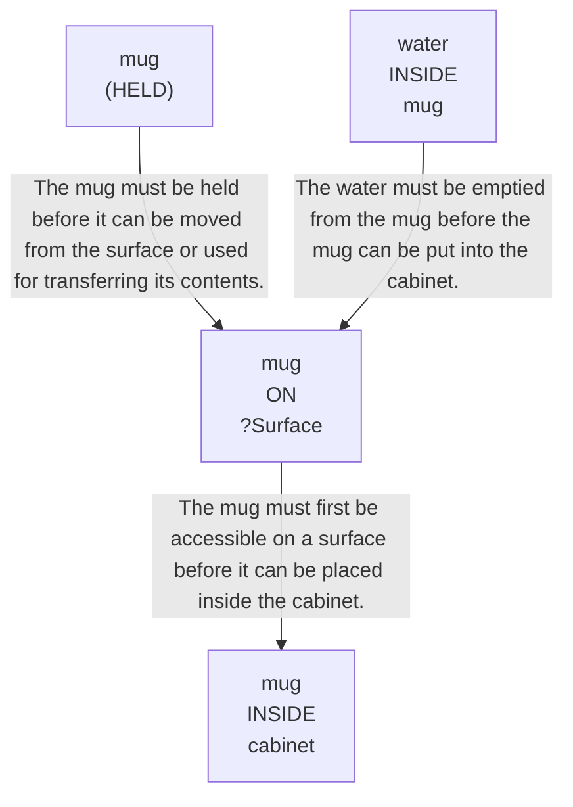
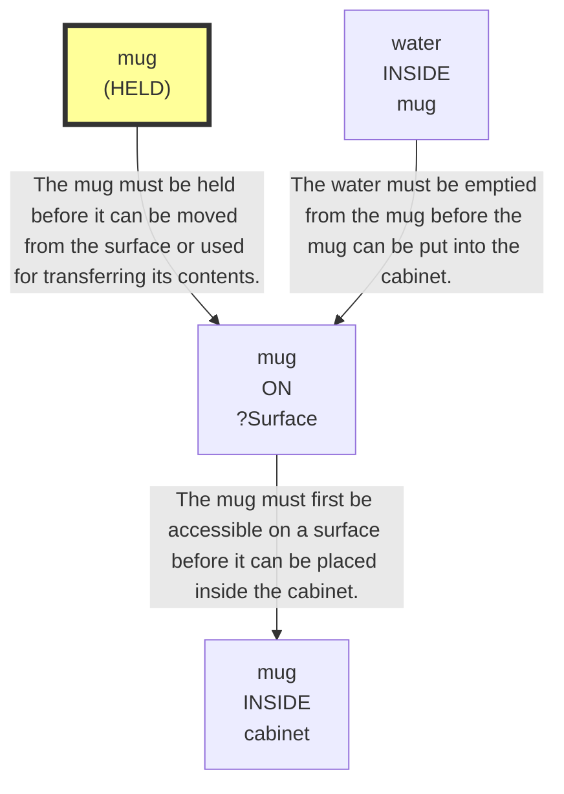
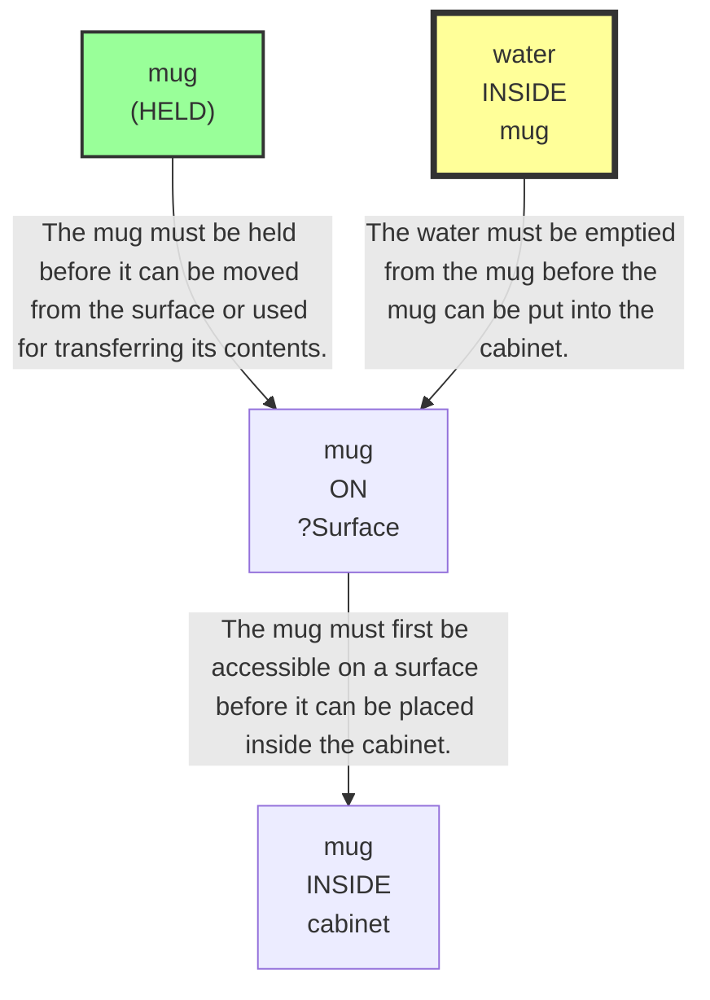
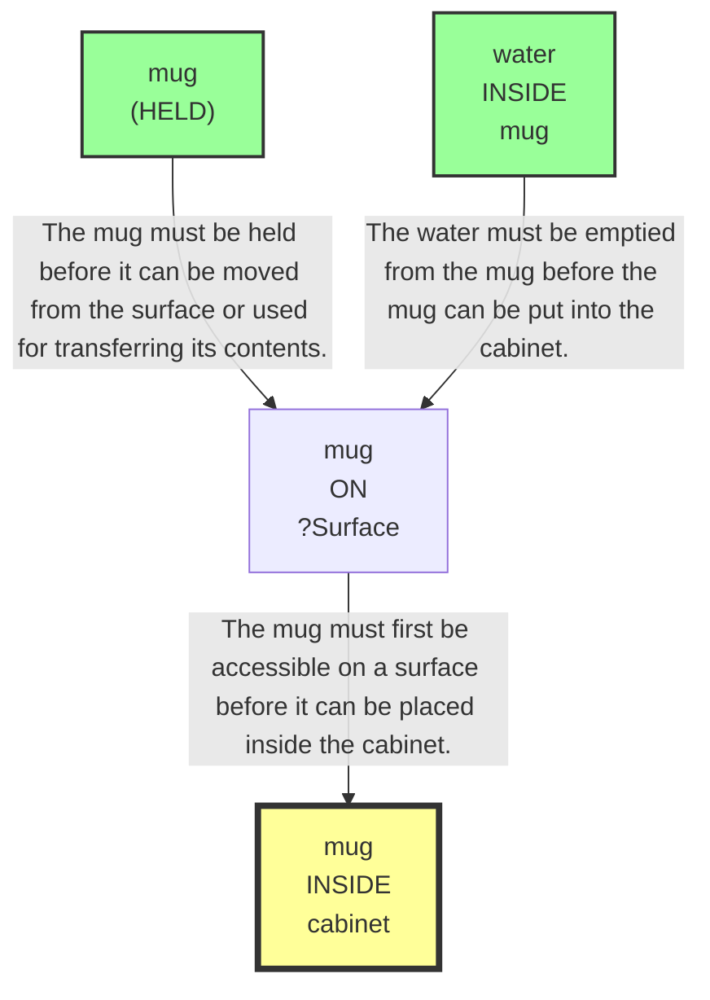

# 🚀 VirtualHome Agent Episode Log


### [GoalReasoner (Module A - Intent)] Output
```json
{
  "is_instruction_obviously_vague": false,
  "clarification_question": null,
  "target_object": "mug",
  "location_hint": "cabinet",
  "reasoning_chain": [
    {
      "question": "Why does the user want this object?",
      "answer": "They want the mug emptied of water and stored away."
    },
    {
      "question": "Why is that important?",
      "answer": "So the mug is no longer holding liquid and can be put away cleanly."
    },
    {
      "question": "What fundamental need does this fulfill?",
      "answer": "It fulfills the need to organize and store household items while removing unwanted liquid."
    },
    {
      "question": "Are there any deeper psychological or physical motivations?",
      "answer": "It may be to tidy the space, prevent spills, or make the mug ready for later use."
    }
  ],
  "deep_intent": "The user wants to remove liquid from a container and store the container in a designated place.",
  "acceptable_alternatives_properties": [
    {
      "priority": 1,
      "description": "Any similar drinkware or small container that can be emptied and put away, such as a cup or glass"
    },
    {
      "priority": 2,
      "description": "Other empty, washable household containers that can be stored in a cabinet"
    },
    {
      "priority": 3,
      "description": "Kitchen items that are currently holding liquid and need draining before storage"
    },
    {
      "priority": 4,
      "description": "Other household items that need to be cleared of contents and organized for storage"
    }
  ]
}
```

### [RoboStateMultiTaskController] Output
```json
{
  "action": "[walk] <bathroom> (11)",
  "active_task_id": "task_1",
  "task_context": {
    "active_task_id": "task_1",
    "pending_task_ids": [],
    "satisfied_task_ids": []
  },
  "source": "room_frontier"
}
```
## Step 0
- **Action**: `[walk] <bathroom> (11)`
- **Action Success**: `True`
- **Action Message**: {'0': {'message': 'Success'}}
- **Active Task**: `task_1`
- **Decision Source**: `room_frontier`
- **Task Progress**: G1_05=pending
- **SDG Status**:

- **Observed Items (113)**: floor(206), floor(207), floor(208), floor(209), floor(210), floor(211), wall(212), wall(213), wall(214), wall(215), wall(216), wall(217), ceiling(218), ceiling(219), ceiling(220)...


### [RoboStateMultiTaskController] Output
```json
{
  "action": "[walk] <bedroom> (73)",
  "active_task_id": "task_1",
  "task_context": {
    "active_task_id": "task_1",
    "pending_task_ids": [],
    "satisfied_task_ids": []
  },
  "source": "room_frontier"
}
```
## Step 1
- **Action**: `[walk] <bedroom> (73)`
- **Action Success**: `True`
- **Action Message**: {'0': {'message': 'Success'}}
- **Active Task**: `task_1`
- **Decision Source**: `room_frontier`
- **Task Progress**: G1_05=pending
- **SDG Status**:

- **Observed Items (174)**: floor(206), floor(207), floor(208), floor(209), floor(210), floor(211), wall(212), wall(213), wall(214), wall(215), wall(216), wall(217), ceiling(218), ceiling(219), ceiling(220)...


### [RoboStateMultiTaskController] Output
```json
{
  "action": "[walk] <livingroom> (335)",
  "active_task_id": "task_1",
  "task_context": {
    "active_task_id": "task_1",
    "pending_task_ids": [],
    "satisfied_task_ids": []
  },
  "source": "room_frontier"
}
```
## Step 2
- **Action**: `[walk] <livingroom> (335)`
- **Action Success**: `True`
- **Action Message**: {'0': {'message': 'Success'}}
- **Active Task**: `task_1`
- **Decision Source**: `room_frontier`
- **Task Progress**: G1_05=pending
- **SDG Status**:

- **Observed Items (242)**: floor(206), floor(207), floor(208), floor(209), floor(210), floor(211), wall(212), wall(213), wall(214), wall(215), wall(216), wall(217), ceiling(218), ceiling(219), ceiling(220)...


### [PerceptionFilter] Output
```json
{
  "reasoning": "The goal requires the target mug, its destination cabinet, and the support surface implied by the SDG. Because the mug contains water, a sink is the necessary tool to empty it. Since a similar drinkware backup is acceptable, the waterglass is also retained as a functional alternative container class.",
  "selected_classes": [
    "character",
    "mug",
    "cabinet",
    "waterglass",
    "sink"
  ],
  "raw_class_count": 101
}
```

### [LLMExecutor] Output
```json
{
  "reasoning": "The active goal is to empty a mug of water and store it in the cabinet. In the current graph, mug(194) is the best match because it is explicitly FILLED_WATER, while mug(447) is empty and already in the livingroom, so it does not satisfy the water-removal part. The cabinet(415) is closed and in the livingroom, but the next required step toward the SDG is to first access and hold the filled mug before any pouring or storage. Since the mug is in the kitchen and the character is currently in the livingroom, the immediate legal action is to walk to the filled mug.",
  "satisfied_nodes": [],
  "current_node_focus": "N4",
  "mapped_variables": {
    "?Surface": "sink(247)"
  },
  "action": "[walk] <mug> (194)"
}
```

### [RoboStateMultiTaskController] Output
```json
{
  "action": "[walk] <mug> (194)",
  "active_task_id": "task_1",
  "task_context": {
    "active_task_id": "task_1",
    "pending_task_ids": [],
    "satisfied_task_ids": []
  },
  "source": "llm_executor"
}
```
## Step 3
- **Action**: `[walk] <mug> (194)`
- **Action Success**: `True`
- **Action Message**: {'0': {'message': 'Success'}}
- **Active Task**: `task_1`
- **Decision Source**: `llm_executor`
- **Task Progress**: G1_05=pending
- **SDG Status**:

- **Observed Items (14)**: sink(247), waterglass(270), waterglass(274), waterglass(281), waterglass(282), mug(194) [FILLED_WATER], character(1), bathroom(11), bedroom(73), kitchen(205), livingroom(335), waterglass(64), cabinet(415) [CLOSED], mug(447)


### [PerceptionFilter] Output
```json
{
  "reasoning": "Reused cached class selection.",
  "selected_classes": [
    "character",
    "mug",
    "cabinet",
    "waterglass",
    "sink"
  ],
  "raw_class_count": 101
}
```

### [LLMExecutor] Output
```json
{
  "reasoning": "The target mug(194) is already close to the character and is filled with water, so the next required step in the SDG is to remove its contents before it can be stored in the cabinet. Since pouring water requires holding the source mug and being near a valid target, the immediate prerequisite is to grab the mug. The mug is a better binding than mug(447) because it is already close and currently contains water.",
  "satisfied_nodes": [],
  "current_node_focus": "N4",
  "mapped_variables": {},
  "action": "[grab] <mug> (194)"
}
```

### [RoboStateMultiTaskController] Output
```json
{
  "action": "[grab] <mug> (194)",
  "active_task_id": "task_1",
  "task_context": {
    "active_task_id": "task_1",
    "pending_task_ids": [],
    "satisfied_task_ids": []
  },
  "source": "llm_executor"
}
```
## Step 4
- **Action**: `[grab] <mug> (194)`
- **Action Success**: `True`
- **Action Message**: {'0': {'message': 'Success'}}
- **Active Task**: `task_1`
- **Decision Source**: `llm_executor`
- **Task Progress**: G1_05=pending
- **SDG Status**:

- **Observed Items (14)**: sink(247), waterglass(270), waterglass(274), waterglass(281), waterglass(282), mug(194) [FILLED_WATER], character(1), bathroom(11), bedroom(73), kitchen(205), livingroom(335), waterglass(64), cabinet(415) [CLOSED], mug(447)


### [PerceptionFilter] Output
```json
{
  "reasoning": "Reused cached class selection.",
  "selected_classes": [
    "character",
    "mug",
    "cabinet",
    "waterglass",
    "sink"
  ],
  "raw_class_count": 101
}
```

### [LLMExecutor] Output
```json
{
  "reasoning": "The active mug(194) is already held and currently FILLED_WATER, so the next required step is to remove the water before it can be stored in the cabinet. The nearest valid destination for pouring out liquid is the sink(247), which is a recipient/CONTAINER in the kitchen and does not need opening. Since pouring requires being near the target sink and already holding the source mug, the correct next atomic action is to walk to the sink first.",
  "satisfied_nodes": [
    "N4"
  ],
  "current_node_focus": "N3",
  "mapped_variables": {
    "?Surface": "sink(247)"
  },
  "action": "[walk] <sink> (247)"
}
```

### [RoboStateMultiTaskController] Output
```json
{
  "action": "[walk] <sink> (247)",
  "active_task_id": "task_1",
  "task_context": {
    "active_task_id": "task_1",
    "pending_task_ids": [],
    "satisfied_task_ids": []
  },
  "source": "llm_executor"
}
```
## Step 5
- **Action**: `[walk] <sink> (247)`
- **Action Success**: `True`
- **Action Message**: {'0': {'message': 'Success'}}
- **Active Task**: `task_1`
- **Decision Source**: `llm_executor`
- **Task Progress**: G1_05=pending
- **SDG Status**:

- **Observed Items (14)**: sink(247), waterglass(270), waterglass(274), waterglass(281), waterglass(282), mug(194) [FILLED_WATER], character(1), bathroom(11), bedroom(73), kitchen(205), livingroom(335), waterglass(64), cabinet(415) [CLOSED], mug(447)


### [PerceptionFilter] Output
```json
{
  "reasoning": "Reused cached class selection.",
  "selected_classes": [
    "character",
    "mug",
    "cabinet",
    "waterglass",
    "sink"
  ],
  "raw_class_count": 101
}
```

### [LLMExecutor] Output
```json
{
  "reasoning": "The current held mug(194) is in the kitchen and already near the sink, but it still contains water. To satisfy the SDG, the water must be emptied before the mug can be moved toward the cabinet. Since the target for pouring can be the sink and we are already close to sink(247), the next atomic action is to pour the water from the held mug into the sink.",
  "satisfied_nodes": [
    "N4"
  ],
  "current_node_focus": "N3",
  "mapped_variables": {
    "?Surface": "sink(247)"
  },
  "action": "[pour] <mug> (194) <sink> (247)"
}
```

### [RoboStateMultiTaskController] Output
```json
{
  "action": "[pour] <mug> (194) <sink> (247)",
  "active_task_id": "task_1",
  "task_context": {
    "active_task_id": "task_1",
    "pending_task_ids": [],
    "satisfied_task_ids": []
  },
  "source": "llm_executor"
}
```
## Step 6
- **Action**: `[pour] <mug> (194) <sink> (247)`
- **Action Success**: `True`
- **Action Message**: Poured into sink successfully.
- **Active Task**: `task_1`
- **Decision Source**: `llm_executor`
- **Task Progress**: G1_05=pending
- **SDG Status**:

- **Observed Items (14)**: sink(247), waterglass(270), waterglass(274), waterglass(281), waterglass(282), mug(194) [FILLED_WATER], character(1), bathroom(11), bedroom(73), kitchen(205), livingroom(335), waterglass(64), cabinet(415) [CLOSED], mug(447)


### [PerceptionFilter] Output
```json
{
  "reasoning": "Reused cached class selection.",
  "selected_classes": [
    "character",
    "mug",
    "cabinet",
    "waterglass",
    "sink"
  ],
  "raw_class_count": 101
}
```

### [LLMExecutor] Output
```json
{
  "reasoning": "The active mug(194) has been emptied successfully and is still held in the right hand. The next goal step is to place the mug into the cabinet, but the cabinet(415) is currently in the living room and closed, so I must first walk to the cabinet before I can open it and eventually store the mug. This action progresses toward N1 via the required accessibility step.",
  "satisfied_nodes": [
    "N3",
    "N4"
  ],
  "current_node_focus": "N1",
  "mapped_variables": {
    "?Surface": "sink(247)"
  },
  "action": "[walk] <cabinet> (415)"
}
```

### [RoboStateMultiTaskController] Output
```json
{
  "action": "[walk] <cabinet> (415)",
  "active_task_id": "task_1",
  "task_context": {
    "active_task_id": "task_1",
    "pending_task_ids": [],
    "satisfied_task_ids": []
  },
  "source": "llm_executor"
}
```
## Step 7
- **Action**: `[walk] <cabinet> (415)`
- **Action Success**: `True`
- **Action Message**: {'0': {'message': 'Success'}}
- **Active Task**: `task_1`
- **Decision Source**: `llm_executor`
- **Task Progress**: G1_05=pending
- **SDG Status**:

- **Observed Items (14)**: sink(247), waterglass(270), waterglass(274), waterglass(281), waterglass(282), mug(194) [EMPTY], character(1), bathroom(11), bedroom(73), kitchen(205), livingroom(335), waterglass(64), cabinet(415) [CLOSED], mug(447)


### [PerceptionFilter] Output
```json
{
  "reasoning": "Reused cached class selection.",
  "selected_classes": [
    "character",
    "mug",
    "cabinet",
    "waterglass",
    "sink"
  ],
  "raw_class_count": 101
}
```

### [LLMExecutor] Output
```json
{
  "reasoning": "The mug is currently held and empty, and we are already close to the cabinet. The cabinet is closed, so the next required step toward placing the mug inside it is to open the cabinet. This advances from the current state toward satisfying the final goal node N1.",
  "satisfied_nodes": [
    "N3",
    "N4"
  ],
  "current_node_focus": "N1",
  "mapped_variables": {
    "?Surface": "livingroom surface via cabinet access (cabinet(415))"
  },
  "action": "[open] <cabinet> (415)"
}
```

### [RoboStateMultiTaskController] Output
```json
{
  "action": "[open] <cabinet> (415)",
  "active_task_id": "task_1",
  "task_context": {
    "active_task_id": "task_1",
    "pending_task_ids": [],
    "satisfied_task_ids": []
  },
  "source": "llm_executor"
}
```
## Step 8
- **Action**: `[open] <cabinet> (415)`
- **Action Success**: `True`
- **Action Message**: {'0': {'message': 'Success'}}
- **Active Task**: `task_1`
- **Decision Source**: `llm_executor`
- **Task Progress**: G1_05=pending
- **SDG Status**:

- **Observed Items (14)**: sink(247), waterglass(270), waterglass(274), waterglass(281), waterglass(282), mug(194) [EMPTY], character(1), bathroom(11), bedroom(73), kitchen(205), livingroom(335), waterglass(64), cabinet(415) [CLOSED], mug(447)


### [PerceptionFilter] Output
```json
{
  "reasoning": "Reused cached class selection.",
  "selected_classes": [
    "character",
    "mug",
    "cabinet",
    "waterglass",
    "sink"
  ],
  "raw_class_count": 101
}
```

### [LLMExecutor] Output
```json
{
  "reasoning": "The mug(194) has already been emptied and is currently held in the right hand. The cabinet(415) is already open and the character is close to it, so the only remaining step toward the goal is to place the held mug inside the cabinet. This will satisfy the final storage goal for the active task.",
  "satisfied_nodes": [
    "N3",
    "N4"
  ],
  "current_node_focus": "N1",
  "mapped_variables": {
    "?Surface": "cabinet(415)"
  },
  "action": "[putin] <mug> (194) <cabinet> (415)"
}
```

### [RoboStateMultiTaskController] Output
```json
{
  "action": "[putin] <mug> (194) <cabinet> (415)",
  "active_task_id": "task_1",
  "task_context": {
    "active_task_id": "task_1",
    "pending_task_ids": [],
    "satisfied_task_ids": []
  },
  "source": "llm_executor"
}
```
## Step 9
- **Action**: `[putin] <mug> (194) <cabinet> (415)`
- **Action Success**: `True`
- **Action Message**: {'0': {'message': 'Success'}}
- **Active Task**: `task_1`
- **Decision Source**: `llm_executor`
- **Task Progress**: G1_05=done
- **SDG Status**:

- **Observed Items (14)**: sink(247), waterglass(270), waterglass(274), waterglass(281), waterglass(282), mug(194) [EMPTY], character(1), bathroom(11), bedroom(73), kitchen(205), livingroom(335), waterglass(64), cabinet(415) [OPEN], mug(447)

