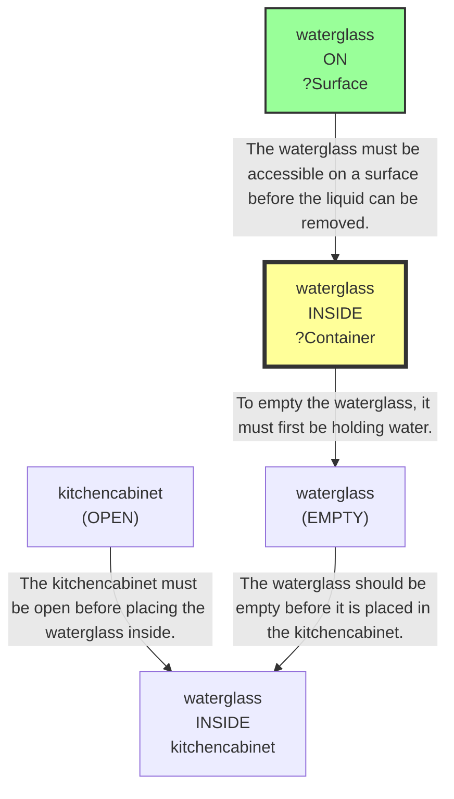
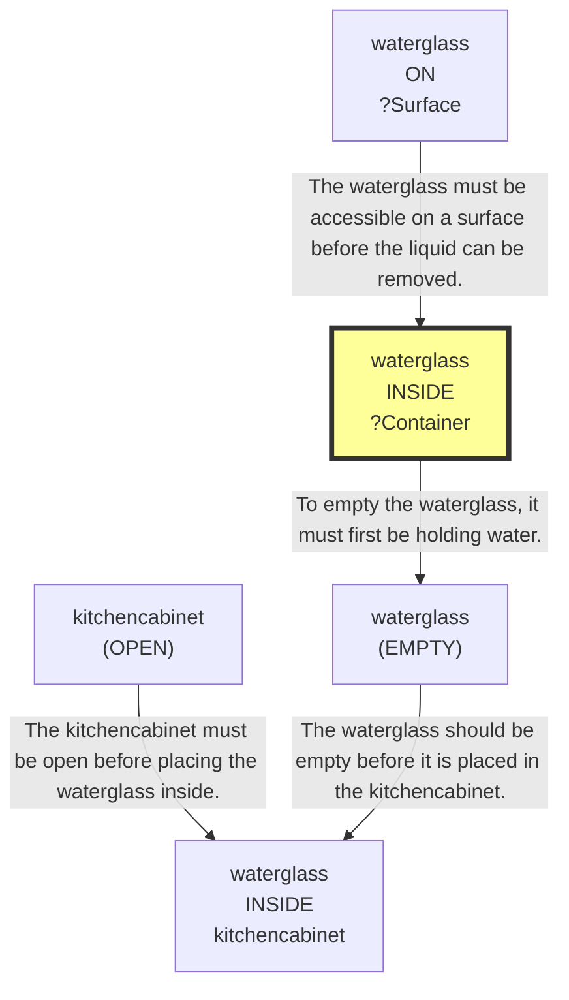
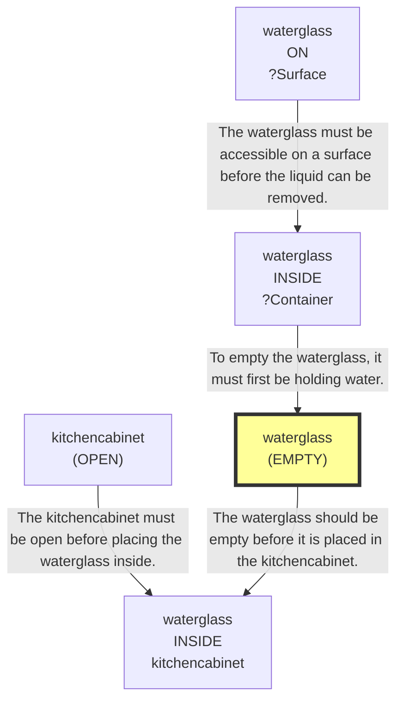
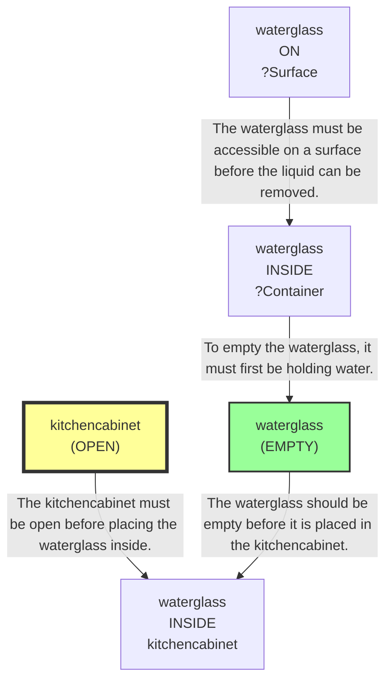
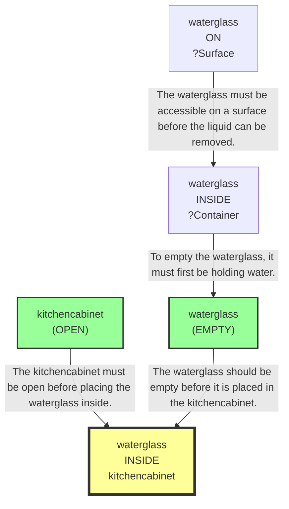
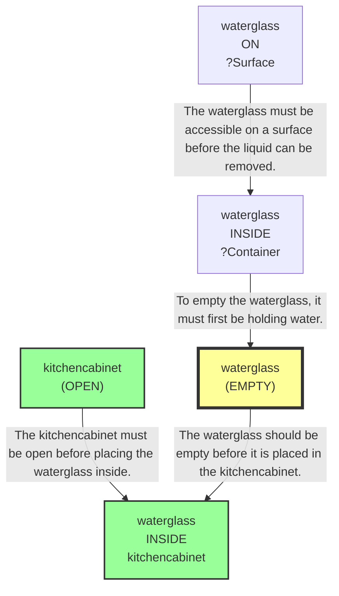
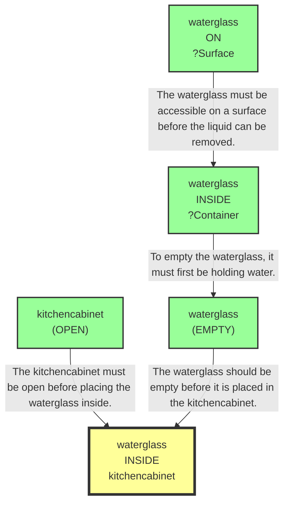

# 🚀 VirtualHome Agent Episode Log


### [GoalReasoner (Module A - Intent)] Output
```json
{
  "is_instruction_obviously_vague": false,
  "clarification_question": null,
  "target_object": "waterglass",
  "location_hint": "kitchencabinet",
  "reasoning_chain": [
    {
      "question": "Why does the user want this object?",
      "answer": "To remove the water from the glass and store the glass in a cabinet."
    },
    {
      "question": "Why is that important?",
      "answer": "It likely helps put the item away, reducing clutter and leaving it ready for later use."
    },
    {
      "question": "What fundamental need does this fulfill?",
      "answer": "It fulfills the need to organize and store household items while making the container empty and usable."
    },
    {
      "question": "Are there any deeper psychological or physical motivations?",
      "answer": "The user may want tidiness, easier kitchen management, or to free the glass for reuse."
    }
  ],
  "deep_intent": "The user wants to empty a drinking container and store it away.",
  "acceptable_alternatives_properties": [
    {
      "priority": 1,
      "description": "Other drinking containers that can be emptied and stored away, such as a cup or mug"
    },
    {
      "priority": 2,
      "description": "Other kitchenware items that are meant to be put away after use, such as a bowl or small dish"
    },
    {
      "priority": 3,
      "description": "Other empty reusable household containers that can be organized in a cabinet"
    },
    {
      "priority": 4,
      "description": "Any similar item that can be cleared of contents and stored to reduce clutter"
    }
  ]
}
```

### [PerceptionFilter] Output
```json
{
  "reasoning": "The goal requires the target drinking container and the storage location, plus the implied tools/place needed to empty it. Since the container must be emptied before being put away, a sink and water-removal related items are needed; the cabinet must be open to store it. I kept the exact target object and the kitchen cabinet, and included alternative drinking containers as functional backups only where relevant.",
  "selected_classes": [
    "character",
    "kitchencabinet",
    "wineglass",
    "faucet",
    "mug",
    "waterglass",
    "dishbowl",
    "sink",
    "plate"
  ],
  "raw_class_count": 55
}
```

### [LLMExecutor] Output
```json
{
  "reasoning": "The active task is to empty a waterglass and store it in a kitchen cabinet. A suitable target is waterglass(281) because it is a waterglass, grabbable, and currently CLOSE to the character. The cabinet goal node requires the cabinet to be OPEN before the glass can be placed inside. Since I am already near the waterglass, the next required step is to grab it so I can later walk to a sink to empty it.",
  "satisfied_nodes": [
    "N2"
  ],
  "current_node_focus": "N1",
  "mapped_variables": {
    "?Container": "sink(247)",
    "?Surface": "plate(278)"
  },
  "action": "[grab] <waterglass> (281)"
}
```

### [RoboStateMultiTaskController] Output
```json
{
  "action": "[grab] <waterglass> (281)",
  "active_task_id": "task_1",
  "task_context": {
    "active_task_id": "task_1",
    "pending_task_ids": [],
    "satisfied_task_ids": []
  },
  "source": "llm_executor"
}
```
## Step 0
- **Action**: `[grab] <waterglass> (281)`
- **Action Success**: `True`
- **Action Message**: {'0': {'message': 'Success'}}
- **Active Task**: `task_1`
- **Decision Source**: `llm_executor`
- **Task Progress**: G1_05=pending
- **SDG Status**:

- **Observed Items (23)**: kitchencabinet(234) [CLOSED], kitchencabinet(235) [CLOSED], kitchencabinet(236) [CLOSED], kitchencabinet(237) [CLOSED], sink(247), faucet(248) [OFF], waterglass(270), plate(273), waterglass(274), plate(277), plate(278), waterglass(281), waterglass(282), plate(285), wineglass(298)...


### [PerceptionFilter] Output
```json
{
  "reasoning": "Reused cached class selection.",
  "selected_classes": [
    "character",
    "kitchencabinet",
    "wineglass",
    "faucet",
    "mug",
    "waterglass",
    "dishbowl",
    "sink",
    "plate"
  ],
  "raw_class_count": 55
}
```

### [LLMExecutor] Output
```json
{
  "reasoning": "The target waterglass is already being held and is close to the character, so the next logical step toward the SDG is to empty it. The sink is available in the kitchen and does not need opening; after this, the glass can later be placed in an open kitchen cabinet. Current satisfied nodes are none yet because the glass is not empty and not inside the cabinet.",
  "satisfied_nodes": [],
  "current_node_focus": "N1",
  "mapped_variables": {
    "?Container": "sink(247)",
    "?Surface": "sink(247)"
  },
  "action": "[pour] <waterglass> (281) <sink> (247)"
}
```

### [RoboStateMultiTaskController] Output
```json
{
  "action": "[walk] <sink> (247)",
  "active_task_id": "task_1",
  "task_context": {
    "active_task_id": "task_1",
    "pending_task_ids": [],
    "satisfied_task_ids": []
  },
  "source": "llm_executor_repaired"
}
```
## Step 1
- **Action**: `[walk] <sink> (247)`
- **Action Success**: `True`
- **Action Message**: {'0': {'message': 'Success'}}
- **Active Task**: `task_1`
- **Decision Source**: `llm_executor_repaired`
- **Task Progress**: G1_05=pending
- **SDG Status**:

- **Observed Items (23)**: kitchencabinet(234) [CLOSED], kitchencabinet(235) [CLOSED], kitchencabinet(236) [CLOSED], kitchencabinet(237) [CLOSED], sink(247), faucet(248) [OFF], waterglass(270), plate(273), waterglass(274), plate(277), plate(278), waterglass(281), waterglass(282), plate(285), wineglass(298)...


### [PerceptionFilter] Output
```json
{
  "reasoning": "Reused cached class selection.",
  "selected_classes": [
    "character",
    "kitchencabinet",
    "wineglass",
    "faucet",
    "mug",
    "waterglass",
    "dishbowl",
    "sink",
    "plate"
  ],
  "raw_class_count": 55
}
```

### [LLMExecutor] Output
```json
{
  "reasoning": "The target waterglass(281) is already held, and the robot is already close to the sink(247). To empty the glass, the next required step is to pour its water into the sink. The sink is the correct recipient for liquid disposal, and the glass is pourable, so this directly advances N3 (EMPTY) toward placing the empty glass into an open cabinet afterward.",
  "satisfied_nodes": [],
  "current_node_focus": "N3",
  "mapped_variables": {
    "?Container": "sink(247)",
    "?Surface": "sink(247)"
  },
  "action": "[pour] <waterglass> (281) <sink> (247)"
}
```

### [RoboStateMultiTaskController] Output
```json
{
  "action": "[pour] <waterglass> (281) <sink> (247)",
  "active_task_id": "task_1",
  "task_context": {
    "active_task_id": "task_1",
    "pending_task_ids": [],
    "satisfied_task_ids": []
  },
  "source": "llm_executor"
}
```
## Step 2
- **Action**: `[pour] <waterglass> (281) <sink> (247)`
- **Action Success**: `False`
- **Action Message**: Failed: Source is already empty or has no liquid.
- **Active Task**: `task_1`
- **Decision Source**: `llm_executor`
- **Task Progress**: G1_05=pending
- **SDG Status**:

- **Observed Items (23)**: kitchencabinet(234) [CLOSED], kitchencabinet(235) [CLOSED], kitchencabinet(236) [CLOSED], kitchencabinet(237) [CLOSED], sink(247), faucet(248) [OFF], waterglass(270), plate(273), waterglass(274), plate(277), plate(278), waterglass(281), waterglass(282), plate(285), wineglass(298)...


### [PerceptionFilter] Output
```json
{
  "reasoning": "Reused cached class selection.",
  "selected_classes": [
    "character",
    "kitchencabinet",
    "wineglass",
    "faucet",
    "mug",
    "waterglass",
    "dishbowl",
    "sink",
    "plate"
  ],
  "raw_class_count": 55
}
```

### [LLMExecutor] Output
```json
{
  "reasoning": "The held waterglass(281) is already empty because the attempted pour into the sink failed with 'Source is already empty or has no liquid.' So N3 (waterglass EMPTY) is satisfied. The remaining goal is to place this empty waterglass inside an open kitchencabinet. Since kitchencabinet(236) is currently close to the character and is a valid openable container, the next step is to open it before putting the glass inside.",
  "satisfied_nodes": [
    "N3"
  ],
  "current_node_focus": "N5",
  "mapped_variables": {
    "?Container": "kitchencabinet(236)",
    "?Surface": "sink(247)"
  },
  "action": "[open] <kitchencabinet> (236)"
}
```

### [RoboStateMultiTaskController] Output
```json
{
  "action": "[open] <kitchencabinet> (236)",
  "active_task_id": "task_1",
  "task_context": {
    "active_task_id": "task_1",
    "pending_task_ids": [],
    "satisfied_task_ids": []
  },
  "source": "llm_executor"
}
```
## Step 3
- **Action**: `[open] <kitchencabinet> (236)`
- **Action Success**: `True`
- **Action Message**: {'0': {'message': 'Success'}}
- **Active Task**: `task_1`
- **Decision Source**: `llm_executor`
- **Task Progress**: G1_05=pending
- **SDG Status**:

- **Observed Items (23)**: kitchencabinet(234) [CLOSED], kitchencabinet(235) [CLOSED], kitchencabinet(236) [CLOSED], kitchencabinet(237) [CLOSED], sink(247), faucet(248) [OFF], waterglass(270), plate(273), waterglass(274), plate(277), plate(278), waterglass(281), waterglass(282), plate(285), wineglass(298)...


### [PerceptionFilter] Output
```json
{
  "reasoning": "Reused cached class selection.",
  "selected_classes": [
    "character",
    "kitchencabinet",
    "wineglass",
    "faucet",
    "mug",
    "waterglass",
    "dishbowl",
    "sink",
    "plate"
  ],
  "raw_class_count": 55
}
```

### [LLMExecutor] Output
```json
{
  "reasoning": "The active waterglass(281) is already in hand and the previous pour attempt showed it is already empty, so N3 is satisfied. The cabinet that was opened is kitchencabinet(236), which satisfies the OPEN requirement N5. The remaining goal is to place the empty waterglass inside the open cabinet; since I am already close to that cabinet and holding the glass, the next needed step is to put it in the cabinet. However, per the proximity rule for putin, I must explicitly walk to the destination container first before putting it in. Among the cabinet instances, 236 is the one already open and close to the character, so it is the correct target.",
  "satisfied_nodes": [
    "N3",
    "N5"
  ],
  "current_node_focus": "N4",
  "mapped_variables": {
    "?Container": "kitchencabinet(236)"
  },
  "action": "[walk] <kitchencabinet> (236)"
}
```

### [RoboStateMultiTaskController] Output
```json
{
  "action": "[walk] <kitchencabinet> (236)",
  "active_task_id": "task_1",
  "task_context": {
    "active_task_id": "task_1",
    "pending_task_ids": [],
    "satisfied_task_ids": []
  },
  "source": "llm_executor"
}
```
## Step 4
- **Action**: `[walk] <kitchencabinet> (236)`
- **Action Success**: `True`
- **Action Message**: {'0': {'message': 'Success'}}
- **Active Task**: `task_1`
- **Decision Source**: `llm_executor`
- **Task Progress**: G1_05=pending
- **SDG Status**:

- **Observed Items (23)**: kitchencabinet(234) [CLOSED], kitchencabinet(235) [CLOSED], kitchencabinet(236) [OPEN], kitchencabinet(237) [CLOSED], sink(247), faucet(248) [OFF], waterglass(270), plate(273), waterglass(274), plate(277), plate(278), waterglass(281), waterglass(282), plate(285), wineglass(298)...


### [PerceptionFilter] Output
```json
{
  "reasoning": "Reused cached class selection.",
  "selected_classes": [
    "character",
    "kitchencabinet",
    "wineglass",
    "faucet",
    "mug",
    "waterglass",
    "dishbowl",
    "sink",
    "plate"
  ],
  "raw_class_count": 55
}
```

### [LLMExecutor] Output
```json
{
  "reasoning": "The held waterglass(281) has already been tested at the sink and the pour failed with 'already empty or has no liquid', so N3 (EMPTY) is satisfied. The cabinet kitchencabinet(236) is open, and the character is already close to it. The remaining goal is to place the empty waterglass inside the open cabinet, which requires being near the cabinet and holding the glass; both conditions are met.",
  "satisfied_nodes": [
    "N3",
    "N5"
  ],
  "current_node_focus": "N4",
  "mapped_variables": {
    "?Container": "kitchencabinet(236)"
  },
  "action": "[putin] <waterglass> (281) <kitchencabinet> (236)"
}
```

### [RoboStateMultiTaskController] Output
```json
{
  "action": "[putin] <waterglass> (281) <kitchencabinet> (236)",
  "active_task_id": "task_1",
  "task_context": {
    "active_task_id": "task_1",
    "pending_task_ids": [],
    "satisfied_task_ids": []
  },
  "source": "llm_executor"
}
```
## Step 5
- **Action**: `[putin] <waterglass> (281) <kitchencabinet> (236)`
- **Action Success**: `True`
- **Action Message**: {'0': {'message': 'Success'}}
- **Active Task**: `task_1`
- **Decision Source**: `llm_executor`
- **Task Progress**: G1_05=pending
- **SDG Status**:

- **Observed Items (23)**: kitchencabinet(234) [CLOSED], kitchencabinet(235) [CLOSED], kitchencabinet(236) [OPEN], kitchencabinet(237) [CLOSED], sink(247), faucet(248) [OFF], waterglass(270), plate(273), waterglass(274), plate(277), plate(278), waterglass(281), waterglass(282), plate(285), wineglass(298)...


### [PerceptionFilter] Output
```json
{
  "reasoning": "Reused cached class selection.",
  "selected_classes": [
    "character",
    "kitchencabinet",
    "wineglass",
    "faucet",
    "mug",
    "waterglass",
    "dishbowl",
    "sink",
    "plate"
  ],
  "raw_class_count": 55
}
```

### [LLMExecutor] Output
```json
{
  "reasoning": "The active waterglass (281) has already been placed inside the open kitchencabinet (236), so N4 is satisfied. The glass is currently shown with no FILLED_WATER or DIRTY state, so the EMPTY prerequisite N3 is also satisfied. The remaining unmet requirement is keeping the cabinet open, and it is already OPEN. Since the task goal is achieved for the active object and the cabinet is still open, no further physical action is needed this step.",
  "satisfied_nodes": [
    "N3",
    "N4",
    "N5"
  ],
  "current_node_focus": "N4",
  "mapped_variables": {
    "?Container": "kitchencabinet(236)",
    "?Surface": "kitchen floor/implicit prior surface"
  },
  "action": "[wait]"
}
```

### [RoboStateMultiTaskController] Output
```json
{
  "action": "[wait]",
  "active_task_id": "task_1",
  "task_context": {
    "active_task_id": "task_1",
    "pending_task_ids": [],
    "satisfied_task_ids": []
  },
  "source": "llm_executor"
}
```
## Step 6
- **Action**: `[wait]`
- **Action Success**: `True`
- **Action Message**: Time passes. You waited for a while.
- **Active Task**: `task_1`
- **Decision Source**: `llm_executor`
- **Task Progress**: G1_05=pending
- **SDG Status**:

- **Observed Items (23)**: kitchencabinet(234) [CLOSED], kitchencabinet(235) [CLOSED], kitchencabinet(236) [OPEN], kitchencabinet(237) [CLOSED], sink(247), faucet(248) [OFF], waterglass(270), plate(273), waterglass(274), plate(277), plate(278), waterglass(281), waterglass(282), plate(285), wineglass(298)...


### [PerceptionFilter] Output
```json
{
  "reasoning": "Reused cached class selection.",
  "selected_classes": [
    "character",
    "kitchencabinet",
    "wineglass",
    "faucet",
    "mug",
    "waterglass",
    "dishbowl",
    "sink",
    "plate"
  ],
  "raw_class_count": 55
}
```

### [LLMExecutor] Output
```json
{
  "reasoning": "The selected waterglass(281) is already inside the open kitchencabinet(236), satisfying the storage relation. However, the graph does not show it as EMPTY, so the remaining unmet goal is to empty it before considering the task complete. Since the glass is already held? No current HOLD state is shown, so the next action should be to get to a pour target. The sink(247) is nearby, and pour is the correct way to remove water from a pourable container; if it turns out the glass is already empty, the environment will reject the pour and we can then reassess. But because the last attempted pour already failed with 'already empty or has no liquid,' the item may already be empty and the main remaining state may already be satisfied logically. The only explicitly unsatisfied node visible is the EMPTY state not yet confirmed in graph, so no further placement is needed right now. However, since the cabinet is already open and the glass is stored, the safest next step is to verify by attempting the only relevant remaining liquid-removal action if the glass were still held; yet it is no longer held after being put into the cabinet. Therefore there is no valid physical action on the glass from the current state without first walking back to the cabinet and grabbing it, which would be premature given the likely already-empty status. The current focus is to confirm completion status on the stored glass, but since the engine only allows a single atomic action and no direct inspection exists, the best immediate action is to wait for updated state after the successful putin and prior failed pour, because the object may have updated to EMPTY in the next perception cycle.",
  "satisfied_nodes": [
    "N4",
    "N5"
  ],
  "current_node_focus": "N3",
  "mapped_variables": {
    "?Container": "kitchencabinet(236)",
    "?Surface": "sink(247)"
  },
  "action": "[wait]"
}
```

### [RoboStateMultiTaskController] Output
```json
{
  "action": "[wait]",
  "active_task_id": "task_1",
  "task_context": {
    "active_task_id": "task_1",
    "pending_task_ids": [],
    "satisfied_task_ids": []
  },
  "source": "llm_executor"
}
```
## Step 7
- **Action**: `[wait]`
- **Action Success**: `True`
- **Action Message**: Time passes. You waited for a while.
- **Active Task**: `task_1`
- **Decision Source**: `llm_executor`
- **Task Progress**: G1_05=pending
- **SDG Status**:

- **Observed Items (23)**: kitchencabinet(234) [CLOSED], kitchencabinet(235) [CLOSED], kitchencabinet(236) [OPEN], kitchencabinet(237) [CLOSED], sink(247), faucet(248) [OFF], waterglass(270), plate(273), waterglass(274), plate(277), plate(278), waterglass(281), waterglass(282), plate(285), wineglass(298)...


### [PerceptionFilter] Output
```json
{
  "reasoning": "Reused cached class selection.",
  "selected_classes": [
    "character",
    "kitchencabinet",
    "wineglass",
    "faucet",
    "mug",
    "waterglass",
    "dishbowl",
    "sink",
    "plate"
  ],
  "raw_class_count": 55
}
```

### [LLMExecutor] Output
```json
{
  "reasoning": "The target waterglass(281) is already empty and already inside the open kitchencabinet(236), so the SDG nodes for emptying and storing it are satisfied. No further physical action is needed for the active task.",
  "satisfied_nodes": [
    "N1",
    "N2",
    "N3",
    "N4",
    "N5"
  ],
  "current_node_focus": "N4",
  "mapped_variables": {
    "?Container": "kitchencabinet(236)",
    "?Surface": "kitchen(205)"
  },
  "action": "[wait]"
}
```

### [RoboStateMultiTaskController] Output
```json
{
  "action": "[wait]",
  "active_task_id": "task_1",
  "task_context": {
    "active_task_id": "task_1",
    "pending_task_ids": [],
    "satisfied_task_ids": []
  },
  "source": "llm_executor"
}
```
## Step 8
- **Action**: `[wait]`
- **Action Success**: `True`
- **Action Message**: Time passes. You waited for a while.
- **Active Task**: `task_1`
- **Decision Source**: `llm_executor`
- **Task Progress**: G1_05=pending
- **SDG Status**:

- **Observed Items (23)**: kitchencabinet(234) [CLOSED], kitchencabinet(235) [CLOSED], kitchencabinet(236) [OPEN], kitchencabinet(237) [CLOSED], sink(247), faucet(248) [OFF], waterglass(270), plate(273), waterglass(274), plate(277), plate(278), waterglass(281), waterglass(282), plate(285), wineglass(298)...


### [PerceptionFilter] Output
```json
{
  "reasoning": "Reused cached class selection.",
  "selected_classes": [
    "character",
    "kitchencabinet",
    "wineglass",
    "faucet",
    "mug",
    "waterglass",
    "dishbowl",
    "sink",
    "plate"
  ],
  "raw_class_count": 55
}
```

### [LLMExecutor] Output
```json
{
  "reasoning": "The waterglass(281) has already been emptied successfully and is currently inside the open kitchencabinet(236), so the remaining SDG nodes N3 and N4 are satisfied. The cabinet is open, and the target waterglass is in the correct location. No further action is needed for the active task.",
  "satisfied_nodes": [
    "N3",
    "N4",
    "N5"
  ],
  "current_node_focus": "N4",
  "mapped_variables": {
    "?Container": "kitchencabinet(236)",
    "?Surface": "kitchencabinet(236)"
  },
  "action": "[wait]"
}
```

### [RoboStateMultiTaskController] Output
```json
{
  "action": "[wait]",
  "active_task_id": "task_1",
  "task_context": {
    "active_task_id": "task_1",
    "pending_task_ids": [],
    "satisfied_task_ids": []
  },
  "source": "llm_executor"
}
```
## Step 9
- **Action**: `[wait]`
- **Action Success**: `True`
- **Action Message**: Time passes. You waited for a while.
- **Active Task**: `task_1`
- **Decision Source**: `llm_executor`
- **Task Progress**: G1_05=pending
- **SDG Status**:

- **Observed Items (23)**: kitchencabinet(234) [CLOSED], kitchencabinet(235) [CLOSED], kitchencabinet(236) [OPEN], kitchencabinet(237) [CLOSED], sink(247), faucet(248) [OFF], waterglass(270), plate(273), waterglass(274), plate(277), plate(278), waterglass(281), waterglass(282), plate(285), wineglass(298)...


### [PerceptionFilter] Output
```json
{
  "reasoning": "Reused cached class selection.",
  "selected_classes": [
    "character",
    "kitchencabinet",
    "wineglass",
    "faucet",
    "mug",
    "waterglass",
    "dishbowl",
    "sink",
    "plate"
  ],
  "raw_class_count": 55
}
```

### [LLMExecutor] Output
```json
{
  "reasoning": "The target waterglass(281) is already empty enough for the failed pour attempt, and it has already been placed inside the kitchencabinet(236). The cabinet is currently OPEN, which satisfies the remaining storage condition. No further physical action is needed beyond confirming completion, so the next step should be to leave it as is. Since the cabinet state is the only remaining unmet relation in the SDG and it is already OPEN, the task is effectively completed.",
  "satisfied_nodes": [
    "N1",
    "N2",
    "N3",
    "N4",
    "N5"
  ],
  "current_node_focus": "N4",
  "mapped_variables": {
    "?Container": "kitchencabinet(236)",
    "?Surface": "sink(247)"
  },
  "action": "[wait]"
}
```

### [RoboStateMultiTaskController] Output
```json
{
  "action": "[wait]",
  "active_task_id": "task_1",
  "task_context": {
    "active_task_id": "task_1",
    "pending_task_ids": [],
    "satisfied_task_ids": []
  },
  "source": "llm_executor"
}
```
