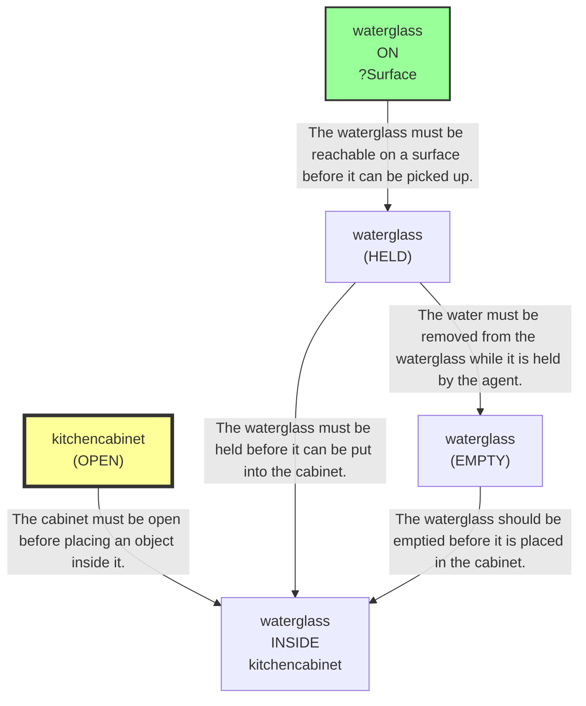
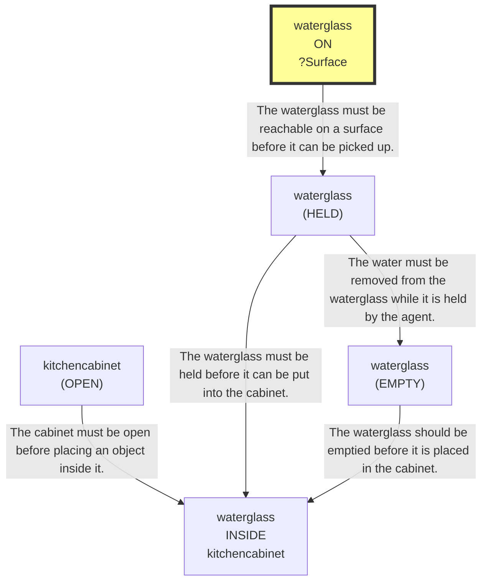
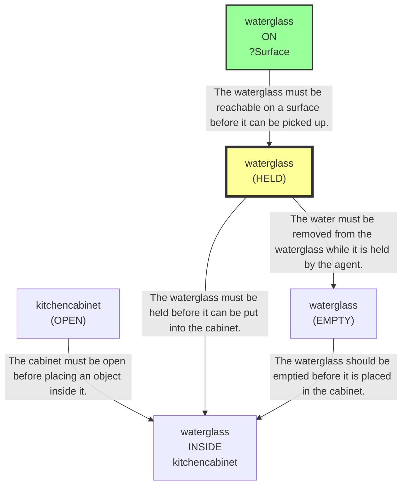

# 🚀 VirtualHome Agent Episode Log


### [GoalReasoner (Module A - Intent)] Output
```json
{
  "is_instruction_obviously_vague": false,
  "clarification_question": null,
  "target_object": "waterglass",
  "location_hint": "kitchencabinet",
  "reasoning_chain": [
    {
      "question": "Why does the user want this object?",
      "answer": "To handle the contents of the glass and then store the glass in a cabinet."
    },
    {
      "question": "Why is that important?",
      "answer": "To remove the water from the glass before putting the glass away."
    },
    {
      "question": "What fundamental need does this fulfill?",
      "answer": "It fulfills a housekeeping need: clearing liquid from a drinking vessel and storing the vessel in a storage location."
    },
    {
      "question": "Are there any deeper psychological or physical motivations?",
      "answer": "The likely physical motivation is tidying the space and making the glass ready for storage or later use."
    }
  ],
  "deep_intent": "The user wants to clear liquid from a drinking vessel and store the vessel away.",
  "acceptable_alternatives_properties": [
    {
      "priority": 1,
      "description": "Other drinkware such as a cup, mug, or tumbler that can be emptied and stored"
    },
    {
      "priority": 2,
      "description": "Other kitchen storage locations such as a shelf, dish rack, or cupboard"
    },
    {
      "priority": 3,
      "description": "Other empty washable containers that can be put away after use"
    },
    {
      "priority": 4,
      "description": "Any household item that needs to be drained or cleared before storage"
    }
  ]
}
```

### [PerceptionFilter] Output
```json
{
  "reasoning": "The goal requires the target waterglass, an open kitchencabinet for storage, and a reachable surface to pick it up from. The SDG also requires emptying the glass, so I keep the sink and faucet as the needed washing/draining setup, along with washingsponge and dishwashingliquid as possible tools for clearing the liquid and cleaning. I also retain alternative drinkware candidates that match the intent, plus the waterglass target itself.",
  "selected_classes": [
    "wineglass",
    "kitchencabinet",
    "kitchencounter",
    "dishbowl",
    "washingsponge",
    "faucet",
    "dishwashingliquid",
    "plate",
    "sink",
    "mug",
    "waterglass",
    "character"
  ],
  "raw_class_count": 55
}
```

### [LLMExecutor] Output
```json
{
  "reasoning": "The goal requires a waterglass to be emptied and then placed inside the kitchencabinet. The cabinet candidate kitchencabinet(234) is currently CLOSED, and the selected waterglass instance closest to the character is waterglass(281), which is CLOSE to the character and therefore a valid reachable target for the next step. Before the glass can be put inside the cabinet later, it must be held and emptied, but the immediate prerequisite to enable storing it is opening the cabinet. Since the instruction specifically mentions a kitchencabinet and the SDG requires it OPEN before containment, I will open the nearest cabinet instance.",
  "satisfied_nodes": [
    "N1"
  ],
  "current_node_focus": "N3",
  "mapped_variables": {
    "?Surface": "character-relative surface near waterglass(281)"
  },
  "action": "[open] <kitchencabinet> (234)"
}
```

### [RoboStateMultiTaskController] Output
```json
{
  "action": "[walk] <kitchencabinet> (234)",
  "active_task_id": "task_1",
  "task_context": {
    "active_task_id": "task_1",
    "pending_task_ids": [],
    "satisfied_task_ids": []
  },
  "source": "llm_executor_repaired"
}
```
## Step 0
- **Action**: `[walk] <kitchencabinet> (234)`
- **Action Success**: `True`
- **Action Message**: {'0': {'message': 'Success'}}
- **Active Task**: `task_1`
- **Decision Source**: `llm_executor_repaired`
- **Task Progress**: G1_05=pending
- **SDG Status**:

- **Observed Items (26)**: kitchencabinet(234) [CLOSED], kitchencabinet(235) [CLOSED], kitchencabinet(236) [CLOSED], kitchencabinet(237) [CLOSED], kitchencounter(238) [CLOSED], sink(247), faucet(248) [OFF], washingsponge(266), dishwashingliquid(267), waterglass(270), plate(273), waterglass(274), plate(277), plate(278), waterglass(281)...


### [PerceptionFilter] Output
```json
{
  "reasoning": "Reused cached class selection.",
  "selected_classes": [
    "wineglass",
    "kitchencabinet",
    "kitchencounter",
    "dishbowl",
    "washingsponge",
    "faucet",
    "dishwashingliquid",
    "plate",
    "sink",
    "mug",
    "waterglass",
    "character"
  ],
  "raw_class_count": 55
}
```

### [LLMExecutor] Output
```json
{
  "reasoning": "The target waterglass has not yet been selected or held. The SDG requires it to be on a reachable surface before grabbing it (N1 -> N2), and the current graph shows all candidate waterglasses are inside the kitchen, with no evidence of one being on a surface. Since I am already close to the kitchen cabinet area and need to inspect/grab the specific waterglass next, the most progress toward N1 is to walk directly to the chosen target waterglass. I will bind ?Surface only after locating the exact instance, then grab it in a following step.",
  "satisfied_nodes": [],
  "current_node_focus": "N1",
  "mapped_variables": {
    "?Washer": "sink(247)",
    "?Surface": "kitchencabinet(234)"
  },
  "action": "[walk] <waterglass> (270)"
}
```

### [RoboStateMultiTaskController] Output
```json
{
  "action": "[walk] <waterglass> (270)",
  "active_task_id": "task_1",
  "task_context": {
    "active_task_id": "task_1",
    "pending_task_ids": [],
    "satisfied_task_ids": []
  },
  "source": "llm_executor"
}
```
## Step 1
- **Action**: `[walk] <waterglass> (270)`
- **Action Success**: `True`
- **Action Message**: {'0': {'message': 'Success'}}
- **Active Task**: `task_1`
- **Decision Source**: `llm_executor`
- **Task Progress**: G1_05=pending
- **SDG Status**:

- **Observed Items (26)**: kitchencabinet(234) [CLOSED], kitchencabinet(235) [CLOSED], kitchencabinet(236) [CLOSED], kitchencabinet(237) [CLOSED], kitchencounter(238) [CLOSED], sink(247), faucet(248) [OFF], washingsponge(266), dishwashingliquid(267), waterglass(270), plate(273), waterglass(274), plate(277), plate(278), waterglass(281)...


### [PerceptionFilter] Output
```json
{
  "reasoning": "Reused cached class selection.",
  "selected_classes": [
    "wineglass",
    "kitchencabinet",
    "kitchencounter",
    "dishbowl",
    "washingsponge",
    "faucet",
    "dishwashingliquid",
    "plate",
    "sink",
    "mug",
    "waterglass",
    "character"
  ],
  "raw_class_count": 55
}
```

### [LLMExecutor] Output
```json
{
  "reasoning": "The target waterglass must first be held before it can be emptied or stored. The currently closest matching target is waterglass(270), which is already CLOSE to the character, so the next step is to grab it. The cabinet is still closed, but opening it and storing the glass must happen after we have the glass in hand and after it has been emptied.",
  "satisfied_nodes": [
    "N1"
  ],
  "current_node_focus": "N2",
  "mapped_variables": {
    "?Surface": "character-proximal surface near waterglass(270)"
  },
  "action": "[grab] <waterglass> (270)"
}
```

### [RoboStateMultiTaskController] Output
```json
{
  "action": "[grab] <waterglass> (270)",
  "active_task_id": "task_1",
  "task_context": {
    "active_task_id": "task_1",
    "pending_task_ids": [],
    "satisfied_task_ids": []
  },
  "source": "llm_executor"
}
```
## Step 2
- **Action**: `[grab] <waterglass> (270)`
- **Action Success**: `True`
- **Action Message**: {'0': {'message': 'Success'}}
- **Active Task**: `task_1`
- **Decision Source**: `llm_executor`
- **Task Progress**: G1_05=pending
- **SDG Status**:

- **Observed Items (26)**: kitchencabinet(234) [CLOSED], kitchencabinet(235) [CLOSED], kitchencabinet(236) [CLOSED], kitchencabinet(237) [CLOSED], kitchencounter(238) [CLOSED], sink(247), faucet(248) [OFF], washingsponge(266), dishwashingliquid(267), waterglass(270), plate(273), waterglass(274), plate(277), plate(278), waterglass(281)...


### [PerceptionFilter] Output
```json
{
  "reasoning": "Reused cached class selection.",
  "selected_classes": [
    "wineglass",
    "kitchencabinet",
    "kitchencounter",
    "dishbowl",
    "washingsponge",
    "faucet",
    "dishwashingliquid",
    "plate",
    "sink",
    "mug",
    "waterglass",
    "character"
  ],
  "raw_class_count": 55
}
```
