# 🚀 VirtualHome Agent Episode Log


### [GoalReasoner (Module A - Intent)] Output
```json
{
  "is_instruction_obviously_vague": false,
  "clarification_question": null,
  "target_object": "waterglass",
  "location_hint": "kitchencabinet",
  "reasoning_chain": [
    {
      "question": "Why does the user want this object?",
      "answer": "They want the glass to be emptied of water and then put away."
    },
    {
      "question": "Why is that important?",
      "answer": "To leave the container dry and stored in its designated place."
    },
    {
      "question": "What fundamental need does this fulfill?",
      "answer": "It fulfills the need to tidy up and organize kitchen items."
    },
    {
      "question": "Are there any deeper psychological or physical motivations?",
      "answer": "It may support cleanliness, reduce clutter, and make the item ready for later use."
    }
  ],
  "deep_intent": "The user wants to tidy and store a kitchen container properly.",
  "acceptable_alternatives_properties": [
    {
      "priority": 1,
      "description": "Other similar drinking containers that can be emptied and put away, such as a cup or mug"
    },
    {
      "priority": 2,
      "description": "Other kitchen vessels or storage-safe drinkware that can be dried and stored, such as a tumbler or glass"
    },
    {
      "priority": 3,
      "description": "Other washable household containers that are meant to be put in a cabinet after use"
    },
    {
      "priority": 4,
      "description": "Any comparable empty, cleanable item that can be organized away in indoor storage"
    }
  ]
}
```

### [PerceptionFilter] Output
```json
{
  "reasoning": "The goal is to empty and store the target waterglass in the kitchencabinet. So I must keep the target object and the required location/receptacle classes involved in the SDG: kitchencabinet, plus the likely supporting surface and openable storage context. Since emptying/cleaning is implied, I also keep the sink and washingsponge as necessary tools, and retain similar drinkware alternatives/backups mentioned by the goal context (mug, wineglass) for functional equivalence.",
  "selected_classes": [
    "character",
    "kitchencounter",
    "washingsponge",
    "wineglass",
    "sink",
    "mug",
    "waterglass",
    "kitchencabinet",
    "door"
  ],
  "raw_class_count": 55
}
```

### [LLMExecutor] Output
```json
{
  "reasoning": "The target waterglass is currently reachable and close to the robot, so the next prerequisite toward emptying and storing it is to grab it. Among the visible instances, waterglass(270) is close to the character and is a valid bind for the goal object. No cabinet interaction is possible yet because the glass is not held, and the cabinet is currently closed but that comes later after retrieval and placing the glass away.",
  "satisfied_nodes": [],
  "current_node_focus": "N2",
  "mapped_variables": {
    "?Surface": "unknown_surface",
    "?Container": "kitchencabinet(234)"
  },
  "action": "[grab] <waterglass> (270)"
}
```

### [RoboStateMultiTaskController] Output
```json
{
  "action": "[grab] <waterglass> (270)",
  "active_task_id": "task_1",
  "task_context": {
    "active_task_id": "task_1",
    "pending_task_ids": [],
    "satisfied_task_ids": []
  },
  "source": "llm_executor"
}
```
## Step 0
- **Action**: `[grab] <waterglass> (270)`
- **Action Success**: `True`
- **Action Message**: {'0': {'message': 'Success'}}
- **Active Task**: `task_1`
- **Decision Source**: `llm_executor`
- **Task Progress**: G1_05=pending
- **SDG Status**:
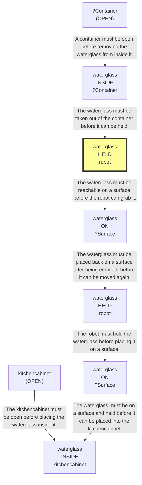
- **Observed Items (20)**: door(224) [OPEN], kitchencabinet(234) [CLOSED], kitchencabinet(235) [CLOSED], kitchencabinet(236) [CLOSED], kitchencabinet(237) [CLOSED], kitchencounter(238) [CLOSED], sink(247), washingsponge(266), waterglass(270), waterglass(274), waterglass(281), waterglass(282), wineglass(298), wineglass(299), mug(194) [FILLED_WATER]...


### [PerceptionFilter] Output
```json
{
  "reasoning": "Reused cached class selection.",
  "selected_classes": [
    "character",
    "kitchencounter",
    "washingsponge",
    "wineglass",
    "sink",
    "mug",
    "waterglass",
    "kitchencabinet",
    "door"
  ],
  "raw_class_count": 55
}
```

### [LLMExecutor] Output
```json
{
  "reasoning": "The target waterglass(270) is already held in the robot's right hand, which satisfies the grab prerequisite. The next required step in the SDG is to place the glass on a surface before later moving it into the kitchencabinet. The current graph shows kitchencounter(238) is a valid surface in the kitchen, so I should move toward that surface now before any putback action. This progresses toward making the glass reachable for the cabinet placement sequence.",
  "satisfied_nodes": [
    "N2"
  ],
  "current_node_focus": "N1",
  "mapped_variables": {
    "?Surface": "kitchencounter(238)"
  },
  "action": "[walk] <kitchencounter> (238)"
}
```

### [RoboStateMultiTaskController] Output
```json
{
  "action": "[walk] <kitchencounter> (238)",
  "active_task_id": "task_1",
  "task_context": {
    "active_task_id": "task_1",
    "pending_task_ids": [],
    "satisfied_task_ids": []
  },
  "source": "llm_executor"
}
```
## Step 1
- **Action**: `[walk] <kitchencounter> (238)`
- **Action Success**: `True`
- **Action Message**: {'0': {'message': 'Success'}}
- **Active Task**: `task_1`
- **Decision Source**: `llm_executor`
- **Task Progress**: G1_05=pending
- **SDG Status**:
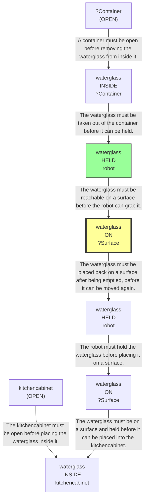
- **Observed Items (20)**: door(224) [OPEN], kitchencabinet(234) [CLOSED], kitchencabinet(235) [CLOSED], kitchencabinet(236) [CLOSED], kitchencabinet(237) [CLOSED], kitchencounter(238) [CLOSED], sink(247), washingsponge(266), waterglass(270), waterglass(274), waterglass(281), waterglass(282), wineglass(298), wineglass(299), mug(194) [FILLED_WATER]...


### [PerceptionFilter] Output
```json
{
  "reasoning": "Reused cached class selection.",
  "selected_classes": [
    "character",
    "kitchencounter",
    "washingsponge",
    "wineglass",
    "sink",
    "mug",
    "waterglass",
    "kitchencabinet",
    "door"
  ],
  "raw_class_count": 55
}
```

### [LLMExecutor] Output
```json
{
  "reasoning": "The waterglass is already held by the robot (N2 is satisfied), and the next required progression is to empty it before putting it away. The robot is currently close to the sink, which is the correct destination for pouring out the water. Since pouring requires holding the source and being near the target, the single next atomic action should be to pour the held waterglass into the sink. This should move the task toward the eventual cabinet storage steps after the glass is emptied.",
  "satisfied_nodes": [
    "N2"
  ],
  "current_node_focus": "N5",
  "mapped_variables": {
    "?Surface": "sink(247)",
    "?Container": "kitchencabinet(235)"
  },
  "action": "[pour] <waterglass> (270) <sink> (247)"
}
```

### [RoboStateMultiTaskController] Output
```json
{
  "action": "[pour] <waterglass> (270) <sink> (247)",
  "active_task_id": "task_1",
  "task_context": {
    "active_task_id": "task_1",
    "pending_task_ids": [],
    "satisfied_task_ids": []
  },
  "source": "llm_executor"
}
```
## Step 2
- **Action**: `[pour] <waterglass> (270) <sink> (247)`
- **Action Success**: `False`
- **Action Message**: Failed: Source is already empty or has no liquid.
- **Active Task**: `task_1`
- **Decision Source**: `llm_executor`
- **Task Progress**: G1_05=pending
- **SDG Status**:
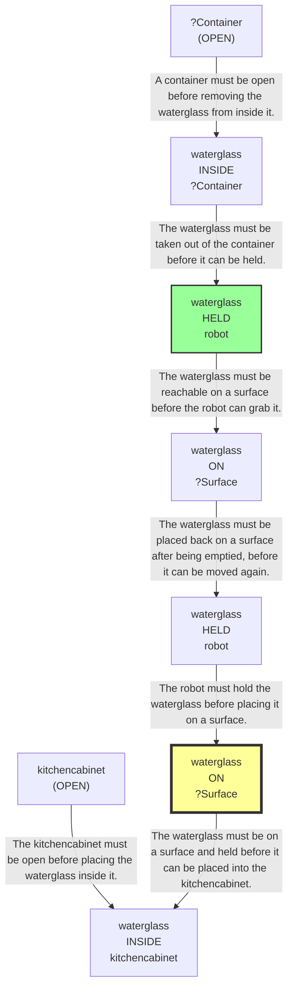
- **Observed Items (20)**: door(224) [OPEN], kitchencabinet(234) [CLOSED], kitchencabinet(235) [CLOSED], kitchencabinet(236) [CLOSED], kitchencabinet(237) [CLOSED], kitchencounter(238) [CLOSED], sink(247), washingsponge(266), waterglass(270), waterglass(274), waterglass(281), waterglass(282), wineglass(298), wineglass(299), mug(194) [FILLED_WATER]...


### [PerceptionFilter] Output
```json
{
  "reasoning": "Reused cached class selection.",
  "selected_classes": [
    "character",
    "kitchencounter",
    "washingsponge",
    "wineglass",
    "sink",
    "mug",
    "waterglass",
    "kitchencabinet",
    "door"
  ],
  "raw_class_count": 55
}
```

### [LLMExecutor] Output
```json
{
  "reasoning": "The current held waterglass(270) is already empty, so the failed pour indicates no liquid-removal step is needed. The SDG still requires the glass to be placed away inside an open kitchencabinet. Since I am currently close to kitchencabinet(235) but it is closed, the next prerequisite is to open a cabinet. I will use the closest candidate cabinet instance as the target for opening.",
  "satisfied_nodes": [
    "N2"
  ],
  "current_node_focus": "N8",
  "mapped_variables": {
    "?Container": "kitchencabinet(235)",
    "?Surface": "kitchencounter(238)"
  },
  "action": "[open] <kitchencabinet> (235)"
}
```

### [RoboStateMultiTaskController] Output
```json
{
  "action": "[open] <kitchencabinet> (235)",
  "active_task_id": "task_1",
  "task_context": {
    "active_task_id": "task_1",
    "pending_task_ids": [],
    "satisfied_task_ids": []
  },
  "source": "llm_executor"
}
```
## Step 3
- **Action**: `[open] <kitchencabinet> (235)`
- **Action Success**: `True`
- **Action Message**: {'0': {'message': 'Success'}}
- **Active Task**: `task_1`
- **Decision Source**: `llm_executor`
- **Task Progress**: G1_05=pending
- **SDG Status**:
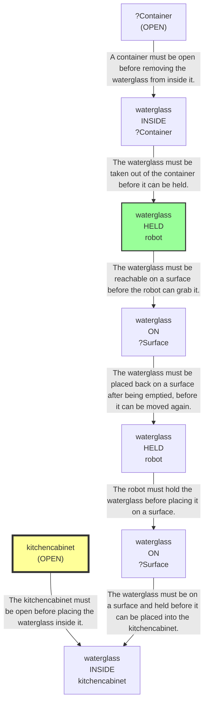
- **Observed Items (20)**: door(224) [OPEN], kitchencabinet(234) [CLOSED], kitchencabinet(235) [CLOSED], kitchencabinet(236) [CLOSED], kitchencabinet(237) [CLOSED], kitchencounter(238) [CLOSED], sink(247), washingsponge(266), waterglass(270), waterglass(274), waterglass(281), waterglass(282), wineglass(298), wineglass(299), mug(194) [FILLED_WATER]...


### [PerceptionFilter] Output
```json
{
  "reasoning": "Reused cached class selection.",
  "selected_classes": [
    "character",
    "kitchencounter",
    "washingsponge",
    "wineglass",
    "sink",
    "mug",
    "waterglass",
    "kitchencabinet",
    "door"
  ],
  "raw_class_count": 55
}
```

### [LLMExecutor] Output
```json
{
  "reasoning": "The waterglass (270) is already held, and the previous pour attempt failed because it is empty, so emptying is complete. The remaining goal is to store it in the kitchen cabinet. The relevant cabinet is kitchencabinet(235), which is already OPEN, satisfying the container prerequisite. I should now move it into that cabinet; per the proximity rule, I must walk to the destination before putting it in.",
  "satisfied_nodes": [
    "N2",
    "N6",
    "N4",
    "N8"
  ],
  "current_node_focus": "N7",
  "mapped_variables": {
    "?Container": "kitchencabinet(235)",
    "?Surface": "kitchencounter(238)"
  },
  "action": "[walk] <kitchencabinet> (235)"
}
```

### [RoboStateMultiTaskController] Output
```json
{
  "action": "[walk] <kitchencabinet> (235)",
  "active_task_id": "task_1",
  "task_context": {
    "active_task_id": "task_1",
    "pending_task_ids": [],
    "satisfied_task_ids": []
  },
  "source": "llm_executor"
}
```
## Step 4
- **Action**: `[walk] <kitchencabinet> (235)`
- **Action Success**: `True`
- **Action Message**: {'0': {'message': 'Success'}}
- **Active Task**: `task_1`
- **Decision Source**: `llm_executor`
- **Task Progress**: G1_05=pending
- **SDG Status**:
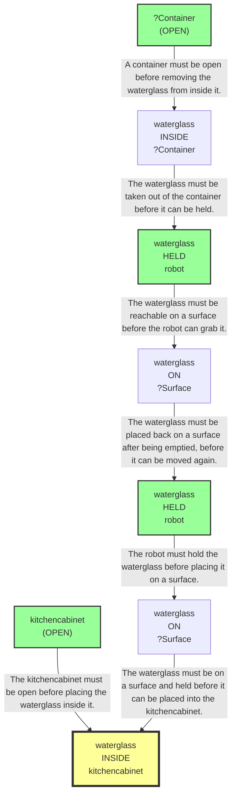
- **Observed Items (20)**: door(224) [OPEN], kitchencabinet(234) [CLOSED], kitchencabinet(235) [OPEN], kitchencabinet(236) [CLOSED], kitchencabinet(237) [CLOSED], kitchencounter(238) [CLOSED], sink(247), washingsponge(266), waterglass(270), waterglass(274), waterglass(281), waterglass(282), wineglass(298), wineglass(299), mug(194) [FILLED_WATER]...


### [PerceptionFilter] Output
```json
{
  "reasoning": "Reused cached class selection.",
  "selected_classes": [
    "character",
    "kitchencounter",
    "washingsponge",
    "wineglass",
    "sink",
    "mug",
    "waterglass",
    "kitchencabinet",
    "door"
  ],
  "raw_class_count": 55
}
```

### [LLMExecutor] Output
```json
{
  "reasoning": "The waterglass(270) is already held and the prior pour attempt failed because it is empty, so the next goal step is to place the empty glass into the open kitchen cabinet. Since the cabinet is already open and we are close to it, the single next action is to put the held waterglass into kitchencabinet(235).",
  "satisfied_nodes": [
    "N2",
    "N8"
  ],
  "current_node_focus": "N7",
  "mapped_variables": {
    "?Container": "kitchencabinet(235)"
  },
  "action": "[putin] <waterglass> (270) <kitchencabinet> (235)"
}
```

### [RoboStateMultiTaskController] Output
```json
{
  "action": "[putin] <waterglass> (270) <kitchencabinet> (235)",
  "active_task_id": "task_1",
  "task_context": {
    "active_task_id": "task_1",
    "pending_task_ids": [],
    "satisfied_task_ids": []
  },
  "source": "llm_executor"
}
```
## Step 5
- **Action**: `[putin] <waterglass> (270) <kitchencabinet> (235)`
- **Action Success**: `True`
- **Action Message**: {'0': {'message': 'Success'}}
- **Active Task**: `task_1`
- **Decision Source**: `llm_executor`
- **Task Progress**: G1_05=pending
- **SDG Status**:
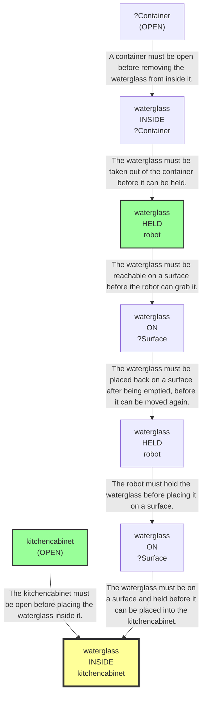
- **Observed Items (20)**: door(224) [OPEN], kitchencabinet(234) [CLOSED], kitchencabinet(235) [OPEN], kitchencabinet(236) [CLOSED], kitchencabinet(237) [CLOSED], kitchencounter(238) [CLOSED], sink(247), washingsponge(266), waterglass(270), waterglass(274), waterglass(281), waterglass(282), wineglass(298), wineglass(299), mug(194) [FILLED_WATER]...


### [PerceptionFilter] Output
```json
{
  "reasoning": "Reused cached class selection.",
  "selected_classes": [
    "character",
    "kitchencounter",
    "washingsponge",
    "wineglass",
    "sink",
    "mug",
    "waterglass",
    "kitchencabinet",
    "door"
  ],
  "raw_class_count": 55
}
```

### [LLMExecutor] Output
```json
{
  "reasoning": "The waterglass(270) is already inside the open kitchencabinet(235), and the cabinet is currently open, satisfying the prerequisite for storage. The previous pour failed because the glass was already empty, so no further emptying is needed. The remaining goal is to ensure the glass is placed in the cabinet; the graph already shows it inside the correct cabinet, so the task is effectively at the final storage state. No additional physical action is required to progress safely.",
  "satisfied_nodes": [
    "N4",
    "N3",
    "N8",
    "N7"
  ],
  "current_node_focus": "N7",
  "mapped_variables": {
    "?Container": "kitchencabinet(235)",
    "?Surface": "kitchencounter(238)"
  },
  "action": "[wait]"
}
```

### [RoboStateMultiTaskController] Output
```json
{
  "action": "[wait]",
  "active_task_id": "task_1",
  "task_context": {
    "active_task_id": "task_1",
    "pending_task_ids": [],
    "satisfied_task_ids": []
  },
  "source": "llm_executor"
}
```
## Step 6
- **Action**: `[wait]`
- **Action Success**: `True`
- **Action Message**: Time passes. You waited for a while.
- **Active Task**: `task_1`
- **Decision Source**: `llm_executor`
- **Task Progress**: G1_05=pending
- **SDG Status**:
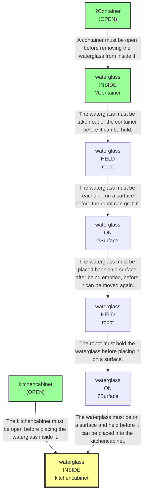
- **Observed Items (20)**: door(224) [OPEN], kitchencabinet(234) [CLOSED], kitchencabinet(235) [OPEN], kitchencabinet(236) [CLOSED], kitchencabinet(237) [CLOSED], kitchencounter(238) [CLOSED], sink(247), washingsponge(266), waterglass(270), waterglass(274), waterglass(281), waterglass(282), wineglass(298), wineglass(299), mug(194) [FILLED_WATER]...


### [PerceptionFilter] Output
```json
{
  "reasoning": "Reused cached class selection.",
  "selected_classes": [
    "character",
    "kitchencounter",
    "washingsponge",
    "wineglass",
    "sink",
    "mug",
    "waterglass",
    "kitchencabinet",
    "door"
  ],
  "raw_class_count": 55
}
```

### [LLMExecutor] Output
```json
{
  "reasoning": "The waterglass (270) has already been taken out, emptied, and placed inside the open kitchencabinet (235). This satisfies the final storage intent: the glass is put away in the cabinet. No further physical action is needed for the active goal.",
  "satisfied_nodes": [
    "N2",
    "N4",
    "N3",
    "N8",
    "N7"
  ],
  "current_node_focus": "N7",
  "mapped_variables": {
    "?Container": "kitchencabinet(235)",
    "?Surface": "kitchencabinet(235)"
  },
  "action": "[wait]"
}
```

### [RoboStateMultiTaskController] Output
```json
{
  "action": "[wait]",
  "active_task_id": "task_1",
  "task_context": {
    "active_task_id": "task_1",
    "pending_task_ids": [],
    "satisfied_task_ids": []
  },
  "source": "llm_executor"
}
```
## Step 7
- **Action**: `[wait]`
- **Action Success**: `True`
- **Action Message**: Time passes. You waited for a while.
- **Active Task**: `task_1`
- **Decision Source**: `llm_executor`
- **Task Progress**: G1_05=pending
- **SDG Status**:
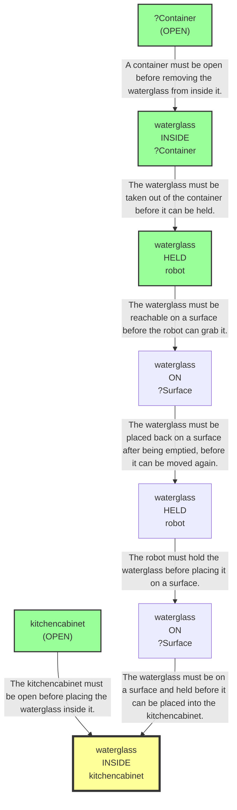
- **Observed Items (20)**: door(224) [OPEN], kitchencabinet(234) [CLOSED], kitchencabinet(235) [OPEN], kitchencabinet(236) [CLOSED], kitchencabinet(237) [CLOSED], kitchencounter(238) [CLOSED], sink(247), washingsponge(266), waterglass(270), waterglass(274), waterglass(281), waterglass(282), wineglass(298), wineglass(299), mug(194) [FILLED_WATER]...


### [PerceptionFilter] Output
```json
{
  "reasoning": "Reused cached class selection.",
  "selected_classes": [
    "character",
    "kitchencounter",
    "washingsponge",
    "wineglass",
    "sink",
    "mug",
    "waterglass",
    "kitchencabinet",
    "door"
  ],
  "raw_class_count": 55
}
```

### [LLMExecutor] Output
```json
{
  "reasoning": "The target waterglass(270) is currently inside the open kitchencabinet(235), and the next required step in the SDG is to have it held by the robot (N3 -> N2). Since the cabinet is already open and the robot is close to the cabinet, the correct next atomic action is to grab the waterglass from inside it. The earlier pour failure indicates the glass was already empty, so no further emptying is needed.",
  "satisfied_nodes": [
    "N4",
    "N8"
  ],
  "current_node_focus": "N2",
  "mapped_variables": {
    "?Container": "kitchencabinet(235)"
  },
  "action": "[grab] <waterglass> (270)"
}
```

### [RoboStateMultiTaskController] Output
```json
{
  "action": "[grab] <waterglass> (270)",
  "active_task_id": "task_1",
  "task_context": {
    "active_task_id": "task_1",
    "pending_task_ids": [],
    "satisfied_task_ids": []
  },
  "source": "llm_executor"
}
```
## Step 8
- **Action**: `[grab] <waterglass> (270)`
- **Action Success**: `True`
- **Action Message**: {'0': {'message': 'Success'}}
- **Active Task**: `task_1`
- **Decision Source**: `llm_executor`
- **Task Progress**: G1_05=pending
- **SDG Status**:
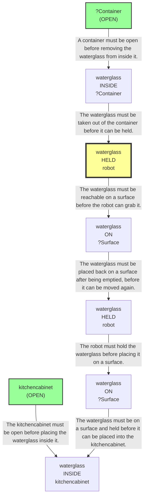
- **Observed Items (20)**: door(224) [OPEN], kitchencabinet(234) [CLOSED], kitchencabinet(235) [OPEN], kitchencabinet(236) [CLOSED], kitchencabinet(237) [CLOSED], kitchencounter(238) [CLOSED], sink(247), washingsponge(266), waterglass(270), waterglass(274), waterglass(281), waterglass(282), wineglass(298), wineglass(299), mug(194) [FILLED_WATER]...


### [PerceptionFilter] Output
```json
{
  "reasoning": "Reused cached class selection.",
  "selected_classes": [
    "character",
    "kitchencounter",
    "washingsponge",
    "wineglass",
    "sink",
    "mug",
    "waterglass",
    "kitchencabinet",
    "door"
  ],
  "raw_class_count": 55
}
```

### [LLMExecutor] Output
```json
{
  "reasoning": "The waterglass is already held by the robot (HOLDS_RH waterglass(270)) and the open cabinet is nearby. The SDG still requires the glass to end up inside the open kitchencabinet, so the next needed step is to place the held glass into the cabinet. Since putin requires being near the destination, I should first move to the open cabinet. The cabinet 235 is already OPEN and is the correct container for the final storage step.",
  "satisfied_nodes": [
    "N2",
    "N4",
    "N8"
  ],
  "current_node_focus": "N7",
  "mapped_variables": {
    "?Container": "kitchencabinet(235)",
    "?Surface": "kitchencounter(238)"
  },
  "action": "[walk] <kitchencabinet> (235)"
}
```

### [RoboStateMultiTaskController] Output
```json
{
  "action": "[walk] <kitchencabinet> (235)",
  "active_task_id": "task_1",
  "task_context": {
    "active_task_id": "task_1",
    "pending_task_ids": [],
    "satisfied_task_ids": []
  },
  "source": "llm_executor"
}
```
## Step 9
- **Action**: `[walk] <kitchencabinet> (235)`
- **Action Success**: `True`
- **Action Message**: {'0': {'message': 'Success'}}
- **Active Task**: `task_1`
- **Decision Source**: `llm_executor`
- **Task Progress**: G1_05=pending
- **SDG Status**:
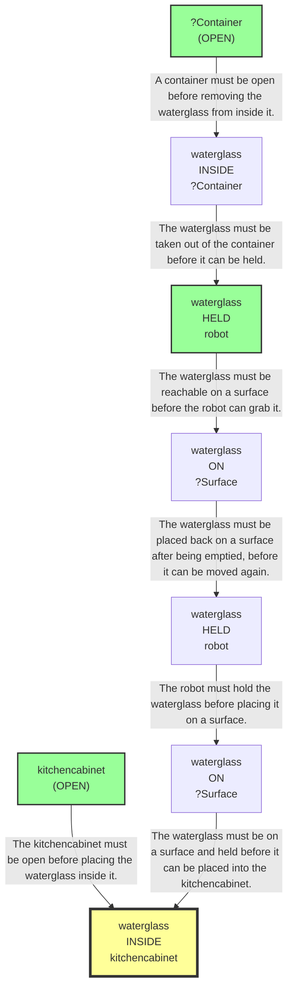
- **Observed Items (20)**: door(224) [OPEN], kitchencabinet(234) [CLOSED], kitchencabinet(235) [OPEN], kitchencabinet(236) [CLOSED], kitchencabinet(237) [CLOSED], kitchencounter(238) [CLOSED], sink(247), washingsponge(266), waterglass(270), waterglass(274), waterglass(281), waterglass(282), wineglass(298), wineglass(299), mug(194) [FILLED_WATER]...


### [PerceptionFilter] Output
```json
{
  "reasoning": "Reused cached class selection.",
  "selected_classes": [
    "character",
    "kitchencounter",
    "washingsponge",
    "wineglass",
    "sink",
    "mug",
    "waterglass",
    "kitchencabinet",
    "door"
  ],
  "raw_class_count": 55
}
```

### [LLMExecutor] Output
```json
{
  "reasoning": "The waterglass(270) is currently held by the robot and appears empty, so the next SDG step is to place it on a surface before later moving it into the open kitchencabinet. The robot is already close to the kitchencounter(238), which is a valid flat surface, so I will satisfy the intermediate ON relation by putting the glass there.",
  "satisfied_nodes": [
    "N2",
    "N4",
    "N8"
  ],
  "current_node_focus": "N5",
  "mapped_variables": {
    "?Surface": "kitchencounter(238)",
    "?Container": "kitchencabinet(235)"
  },
  "action": "[putback] <waterglass> (270) <kitchencounter> (238)"
}
```

### [RoboStateMultiTaskController] Output
```json
{
  "action": "[putback] <waterglass> (270) <kitchencounter> (238)",
  "active_task_id": "task_1",
  "task_context": {
    "active_task_id": "task_1",
    "pending_task_ids": [],
    "satisfied_task_ids": []
  },
  "source": "llm_executor"
}
```
## Step 10
- **Action**: `[putback] <waterglass> (270) <kitchencounter> (238)`
- **Action Success**: `True`
- **Action Message**: {'0': {'message': 'Success'}}
- **Active Task**: `task_1`
- **Decision Source**: `llm_executor`
- **Task Progress**: G1_05=pending
- **SDG Status**:
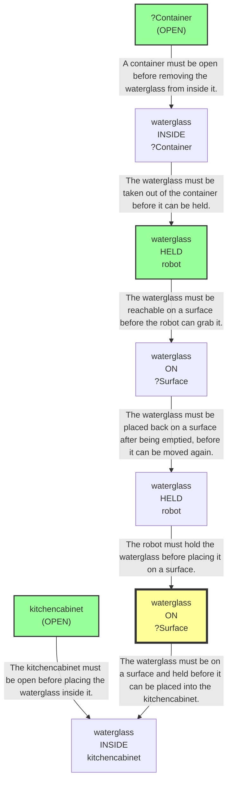
- **Observed Items (20)**: door(224) [OPEN], kitchencabinet(234) [CLOSED], kitchencabinet(235) [OPEN], kitchencabinet(236) [CLOSED], kitchencabinet(237) [CLOSED], kitchencounter(238) [CLOSED], sink(247), washingsponge(266), waterglass(270), waterglass(274), waterglass(281), waterglass(282), wineglass(298), wineglass(299), mug(194) [FILLED_WATER]...


### [PerceptionFilter] Output
```json
{
  "reasoning": "Reused cached class selection.",
  "selected_classes": [
    "character",
    "kitchencounter",
    "washingsponge",
    "wineglass",
    "sink",
    "mug",
    "waterglass",
    "kitchencabinet",
    "door"
  ],
  "raw_class_count": 55
}
```

### [LLMExecutor] Output
```json
{
  "reasoning": "The waterglass (270) is already outside the cabinet and on the kitchencounter, so the final storage container is accessible. The active cabinet target is kitchencabinet(235), which is currently OPEN, satisfying the prerequisite for putting the glass inside. We already walked to the cabinet recently, and the object is not being held right now in the current graph? Actually the graph shows waterglass(270) on kitchencounter and close to the robot, so the next necessary step to progress toward the goal is to pick it up before placing it into the open cabinet.",
  "satisfied_nodes": [
    "N1",
    "N7",
    "N8"
  ],
  "current_node_focus": "N6",
  "mapped_variables": {
    "?Container": "kitchencabinet(235)",
    "?Surface": "kitchencounter(238)"
  },
  "action": "[grab] <waterglass> (270)"
}
```

### [RoboStateMultiTaskController] Output
```json
{
  "action": "[grab] <waterglass> (270)",
  "active_task_id": "task_1",
  "task_context": {
    "active_task_id": "task_1",
    "pending_task_ids": [],
    "satisfied_task_ids": []
  },
  "source": "llm_executor"
}
```
## Step 11
- **Action**: `[grab] <waterglass> (270)`
- **Action Success**: `True`
- **Action Message**: {'0': {'message': 'Success'}}
- **Active Task**: `task_1`
- **Decision Source**: `llm_executor`
- **Task Progress**: G1_05=pending
- **SDG Status**:
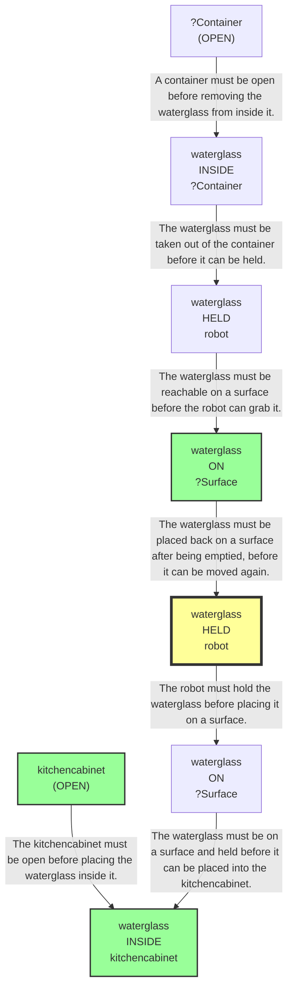
- **Observed Items (20)**: door(224) [OPEN], kitchencabinet(234) [CLOSED], kitchencabinet(235) [OPEN], kitchencabinet(236) [CLOSED], kitchencabinet(237) [CLOSED], kitchencounter(238) [CLOSED], sink(247), washingsponge(266), waterglass(270), waterglass(274), waterglass(281), waterglass(282), wineglass(298), wineglass(299), mug(194) [FILLED_WATER]...


### [PerceptionFilter] Output
```json
{
  "reasoning": "Reused cached class selection.",
  "selected_classes": [
    "character",
    "kitchencounter",
    "washingsponge",
    "wineglass",
    "sink",
    "mug",
    "waterglass",
    "kitchencabinet",
    "door"
  ],
  "raw_class_count": 55
}
```

### [LLMExecutor] Output
```json
{
  "reasoning": "The waterglass (270) is already held in the robot's right hand and is close to the sink and cabinet area. The pour attempt already failed because the glass is empty, so the remaining task is just to store the empty glass in the open kitchencabinet(235). According to the SDG, the next needed step toward N7 is to place the held waterglass into the open cabinet, and we are already near that destination from the prior context.",
  "satisfied_nodes": [
    "N2",
    "N6"
  ],
  "current_node_focus": "N7",
  "mapped_variables": {
    "?Container": "kitchencabinet(235)"
  },
  "action": "[putin] <waterglass> (270) <kitchencabinet> (235)"
}
```

### [RoboStateMultiTaskController] Output
```json
{
  "action": "[putin] <waterglass> (270) <kitchencabinet> (235)",
  "active_task_id": "task_1",
  "task_context": {
    "active_task_id": "task_1",
    "pending_task_ids": [],
    "satisfied_task_ids": []
  },
  "source": "llm_executor"
}
```
## Step 12
- **Action**: `[putin] <waterglass> (270) <kitchencabinet> (235)`
- **Action Success**: `True`
- **Action Message**: {'0': {'message': 'Success'}}
- **Active Task**: `task_1`
- **Decision Source**: `llm_executor`
- **Task Progress**: G1_05=pending
- **SDG Status**:
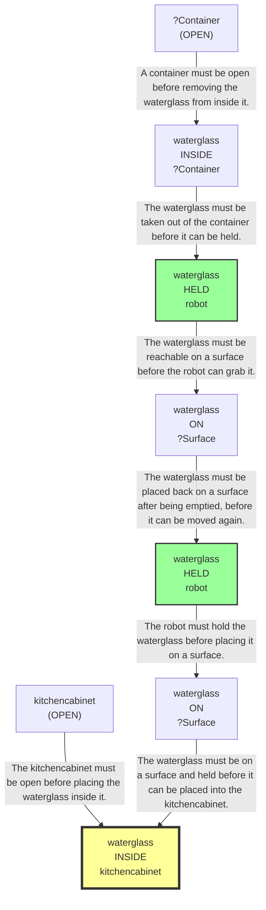
- **Observed Items (20)**: door(224) [OPEN], kitchencabinet(234) [CLOSED], kitchencabinet(235) [OPEN], kitchencabinet(236) [CLOSED], kitchencabinet(237) [CLOSED], kitchencounter(238) [CLOSED], sink(247), washingsponge(266), waterglass(270), waterglass(274), waterglass(281), waterglass(282), wineglass(298), wineglass(299), mug(194) [FILLED_WATER]...


### [PerceptionFilter] Output
```json
{
  "reasoning": "Reused cached class selection.",
  "selected_classes": [
    "character",
    "kitchencounter",
    "washingsponge",
    "wineglass",
    "sink",
    "mug",
    "waterglass",
    "kitchencabinet",
    "door"
  ],
  "raw_class_count": 55
}
```

### [LLMExecutor] Output
```json
{
  "reasoning": "The waterglass is currently inside the open kitchencabinet (235), but the task requires it to end up stored in the cabinet after being emptied. The current graph shows waterglass(270) inside kitchencabinet(235), and the cabinet is already OPEN, so the remaining necessary progression is to get the glass out and then put it away appropriately if needed. However, because the last successful action already put the waterglass into the cabinet, the immediate next step should be to verify/continue toward the final placement state by approaching the cabinet and preparing for interaction. Since interacting with an object inside a cabinet requires being near it first, the next atomic action is to walk to the open cabinet containing the target glass.",
  "satisfied_nodes": [
    "N8",
    "N7"
  ],
  "current_node_focus": "N7",
  "mapped_variables": {
    "?Container": "kitchencabinet(235)",
    "?Surface": "kitchencounter(238)"
  },
  "action": "[walk] <kitchencabinet> (235)"
}
```

### [RoboStateMultiTaskController] Output
```json
{
  "action": "[walk] <kitchencabinet> (235)",
  "active_task_id": "task_1",
  "task_context": {
    "active_task_id": "task_1",
    "pending_task_ids": [],
    "satisfied_task_ids": []
  },
  "source": "llm_executor"
}
```
## Step 13
- **Action**: `[walk] <kitchencabinet> (235)`
- **Action Success**: `True`
- **Action Message**: {'0': {'message': 'Success'}}
- **Active Task**: `task_1`
- **Decision Source**: `llm_executor`
- **Task Progress**: G1_05=pending
- **SDG Status**:
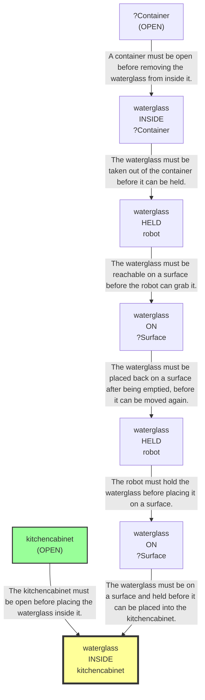
- **Observed Items (20)**: door(224) [OPEN], kitchencabinet(234) [CLOSED], kitchencabinet(235) [OPEN], kitchencabinet(236) [CLOSED], kitchencabinet(237) [CLOSED], kitchencounter(238) [CLOSED], sink(247), washingsponge(266), waterglass(270), waterglass(274), waterglass(281), waterglass(282), wineglass(298), wineglass(299), mug(194) [FILLED_WATER]...


### [PerceptionFilter] Output
```json
{
  "reasoning": "Reused cached class selection.",
  "selected_classes": [
    "character",
    "kitchencounter",
    "washingsponge",
    "wineglass",
    "sink",
    "mug",
    "waterglass",
    "kitchencabinet",
    "door"
  ],
  "raw_class_count": 55
}
```

### [LLMExecutor] Output
```json
{
  "reasoning": "The target waterglass(270) is currently inside the open kitchencabinet(235), and the robot is already close to that cabinet. To continue toward the goal of emptying and storing the glass, the next required step is to take it out and hold it. This satisfies the SDG prerequisite for the glass being held before it can be moved or emptied further.",
  "satisfied_nodes": [
    "N8"
  ],
  "current_node_focus": "N2",
  "mapped_variables": {
    "?Container": "kitchencabinet(235)",
    "?Surface": "kitchencounter(238)"
  },
  "action": "[grab] <waterglass> (270)"
}
```

### [RoboStateMultiTaskController] Output
```json
{
  "action": "[grab] <waterglass> (270)",
  "active_task_id": "task_1",
  "task_context": {
    "active_task_id": "task_1",
    "pending_task_ids": [],
    "satisfied_task_ids": []
  },
  "source": "llm_executor"
}
```
## Step 14
- **Action**: `[grab] <waterglass> (270)`
- **Action Success**: `True`
- **Action Message**: {'0': {'message': 'Success'}}
- **Active Task**: `task_1`
- **Decision Source**: `llm_executor`
- **Task Progress**: G1_05=pending
- **SDG Status**:
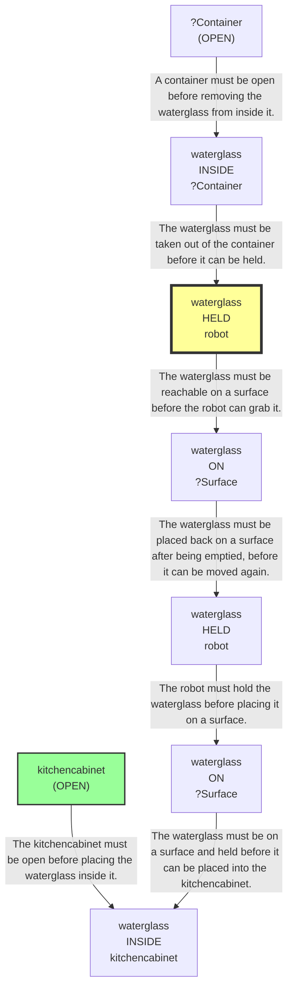
- **Observed Items (20)**: door(224) [OPEN], kitchencabinet(234) [CLOSED], kitchencabinet(235) [OPEN], kitchencabinet(236) [CLOSED], kitchencabinet(237) [CLOSED], kitchencounter(238) [CLOSED], sink(247), washingsponge(266), waterglass(270), waterglass(274), waterglass(281), waterglass(282), wineglass(298), wineglass(299), mug(194) [FILLED_WATER]...

