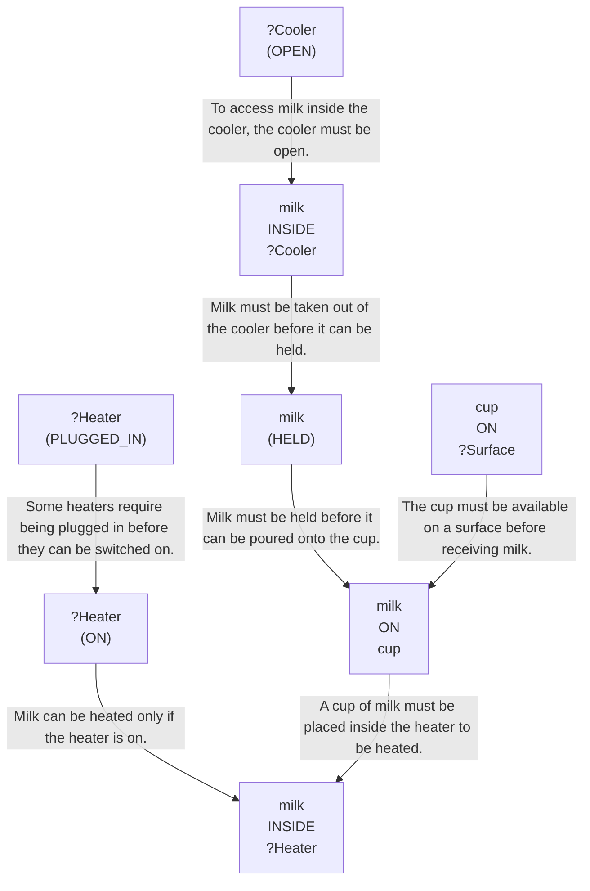
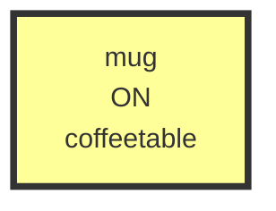
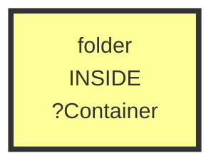
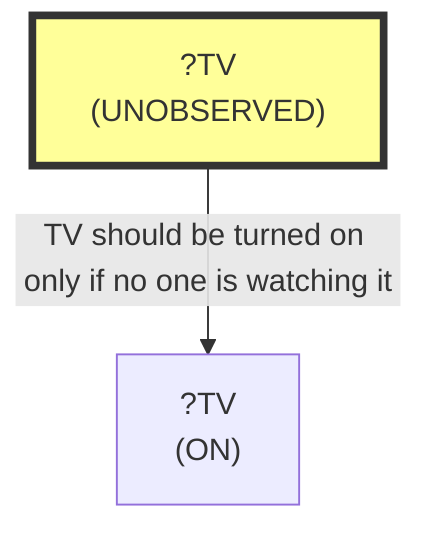
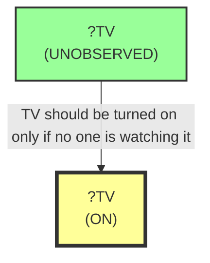
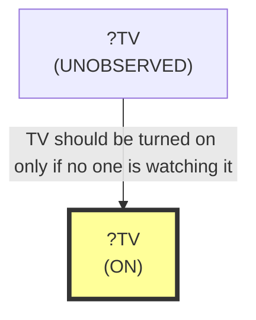
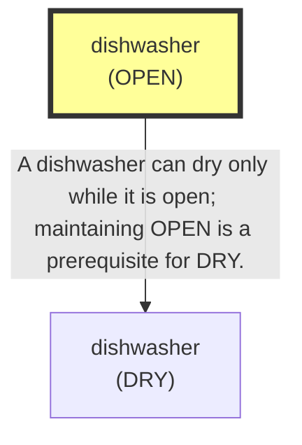

# 🚀 VirtualHome Agent Episode Log


### [GoalReasoner (Module A - Intent)] Output
```json
{
  "is_instruction_obviously_vague": false,
  "clarification_question": null,
  "target_object": "milk",
  "location_hint": "fridge",
  "reasoning_chain": [
    {
      "question": "Why does the user want this object?",
      "answer": "To obtain milk that can be heated and consumed."
    },
    {
      "question": "Why is that important?",
      "answer": "Heating it makes it suitable for drinking in a warm form."
    },
    {
      "question": "What fundamental need does this fulfill?",
      "answer": "It helps satisfy a desire for a warm beverage and possibly hydration or comfort."
    },
    {
      "question": "Are there any deeper psychological or physical motivations?",
      "answer": "The user may want warmth, comfort, or a simple drink prepared in an easy, ready-to-use way."
    }
  ],
  "deep_intent": "The user wants a warm drink for comfort, hydration, or convenience.",
  "acceptable_alternatives_properties": [
    {
      "priority": 1,
      "description": "Other drinkable dairy or plant-based beverages that can be heated, such as oat milk, soy milk, or lactose-free milk."
    },
    {
      "priority": 2,
      "description": "Other warm beverages, such as cocoa or chai, if available and suitable for microwaving."
    },
    {
      "priority": 3,
      "description": "Ready-to-drink beverages that provide warmth and comfort, such as tea or broth."
    },
    {
      "priority": 4,
      "description": "Any warm indoor beverage that can serve the same comfort/hydration purpose, such as warm water with lemon."
    }
  ]
}
```

### [RoboStateMultiTaskController] Output
```json
{
  "action": "[walk] <livingroom> (183)",
  "active_task_id": "task_1",
  "task_context": {
    "active_task_id": "task_1",
    "pending_task_ids": [
      "task_2",
      "task_3",
      "task_4",
      "task_5",
      "task_6",
      "task_7"
    ],
    "satisfied_task_ids": []
  },
  "source": "room_frontier"
}
```
## Step 0
- **Action**: `[walk] <livingroom> (183)`
- **Action Success**: `True`
- **Action Message**: {'0': {'message': 'Success'}}
- **Active Task**: `task_1`
- **Decision Source**: `room_frontier`
- **Task Progress**: G1_01=pending, E1_01=pending, E1_03=pending, E1_04=pending, E1_07=pending, E1_11=pending, E1_15=pending
- **SDG Status**:

- **Observed Items (160)**: wall(12), wall(13), wall(14), wall(15), wall(16), wall(17), wall(18), wall(19), wall(20), wall(21), floor(22), floor(23), floor(24), floor(25), floor(26)...


### [RoboStateMultiTaskController] Output
```json
{
  "action": "[walk] <bedroom> (241)",
  "active_task_id": "task_1",
  "task_context": {
    "active_task_id": "task_1",
    "pending_task_ids": [
      "task_2",
      "task_3",
      "task_4",
      "task_5",
      "task_6",
      "task_7"
    ],
    "satisfied_task_ids": []
  },
  "source": "room_frontier"
}
```
## Step 1
- **Action**: `[walk] <bedroom> (241)`
- **Action Success**: `True`
- **Action Message**: {'0': {'message': 'Success'}}
- **Active Task**: `task_1`
- **Decision Source**: `room_frontier`
- **Task Progress**: G1_01=pending, E1_01=pending, E1_03=pending, E1_04=pending, E1_07=pending, E1_11=pending, E1_15=pending
- **SDG Status**:

- **Observed Items (213)**: wall(12), wall(13), wall(14), wall(15), wall(16), wall(17), wall(18), wall(19), wall(20), wall(21), floor(22), floor(23), floor(24), floor(25), floor(26)...


### [RoboStateMultiTaskController] Output
```json
{
  "action": "[walk] <bathroom> (285)",
  "active_task_id": "task_1",
  "task_context": {
    "active_task_id": "task_1",
    "pending_task_ids": [
      "task_2",
      "task_3",
      "task_4",
      "task_5",
      "task_6",
      "task_7"
    ],
    "satisfied_task_ids": []
  },
  "source": "room_frontier"
}
```
## Step 2
- **Action**: `[walk] <bathroom> (285)`
- **Action Success**: `True`
- **Action Message**: {'0': {'message': 'Success'}}
- **Active Task**: `task_1`
- **Decision Source**: `room_frontier`
- **Task Progress**: G1_01=pending, E1_01=pending, E1_03=pending, E1_04=pending, E1_07=pending, E1_11=pending, E1_15=pending
- **SDG Status**:

- **Observed Items (246)**: wall(12), wall(13), wall(14), wall(15), wall(16), wall(17), wall(18), wall(19), wall(20), wall(21), floor(22), floor(23), floor(24), floor(25), floor(26)...


### [RoboStateMultiTaskController] Output
```json
{
  "action": "[walk] <bedroom> (346)",
  "active_task_id": "task_1",
  "task_context": {
    "active_task_id": "task_1",
    "pending_task_ids": [
      "task_2",
      "task_3",
      "task_4",
      "task_5",
      "task_6",
      "task_7"
    ],
    "satisfied_task_ids": []
  },
  "source": "room_frontier"
}
```
## Step 3
- **Action**: `[walk] <bedroom> (346)`
- **Action Success**: `True`
- **Action Message**: {'0': {'message': 'Success'}}
- **Active Task**: `task_1`
- **Decision Source**: `room_frontier`
- **Task Progress**: G1_01=pending, E1_01=pending, E1_03=pending, E1_04=pending, E1_07=pending, E1_11=pending, E1_15=pending
- **SDG Status**:

- **Observed Items (306)**: wall(12), wall(13), wall(14), wall(15), wall(16), wall(17), wall(18), wall(19), wall(20), wall(21), floor(22), floor(23), floor(24), floor(25), floor(26)...


### [GoalReasoner (Module A - Intent)] Output
```json
{
  "is_instruction_obviously_vague": false,
  "clarification_question": null,
  "target_object": "book",
  "location_hint": "sofa",
  "reasoning_chain": [
    {
      "question": "Why does the user want this object moved?",
      "answer": "To place an unorganized book into a more appropriate location."
    },
    {
      "question": "Why is that important?",
      "answer": "To organize the book and reduce clutter in the current area."
    },
    {
      "question": "What fundamental need does this fulfill?",
      "answer": "The user wants to improve order and tidiness in the indoor environment."
    },
    {
      "question": "Are there any deeper psychological or physical motivations?",
      "answer": "The user may want a neater space, easier access to reading material, or a more comfortable living area."
    }
  ],
  "deep_intent": "The user wants to organize a misplaced item and reduce clutter in the indoor space.",
  "acceptable_alternatives_properties": [
    {
      "priority": 1,
      "description": "Other misplaced household items that can be put in a designated resting area, such as magazines or notebooks."
    },
    {
      "priority": 2,
      "description": "Similar paper-based reading materials that are out of place, such as newspapers or journals."
    },
    {
      "priority": 3,
      "description": "Small household items that are commonly organized by moving them to a seating or living area storage spot, such as remote controls or tablets."
    },
    {
      "priority": 4,
      "description": "Any nearby clutter item that can be relocated to improve tidiness in the room."
    }
  ]
}
```

### [PerceptionFilter] Output
```json
{
  "reasoning": "The goal is to move a book that is on a sofa, so the only strictly necessary classes are the target object and the location mentioned in the SDG/goal. No tool is required for a simple relocation task.",
  "selected_classes": [
    "book",
    "character",
    "door",
    "sofa"
  ],
  "raw_class_count": 91
}
```

### [LLMExecutor] Output
```json
{
  "reasoning": "The active goal is to get a book onto the sofa. The character is currently inside bedroom(346), while the relevant sofa(214) and several books are in the livingroom(183). Since we cannot grab an object across rooms and the book is not currently near us, the next step is to move to the room containing the target/book. I will head to the living room first so I can then choose the correct book instance and eventually place it on the sofa.",
  "satisfied_nodes": [],
  "current_node_focus": "N1",
  "mapped_variables": {
    "?TargetRoom": "livingroom(183)",
    "?Book": "book(229)"
  },
  "action": "[walk] <livingroom> (183)"
}
```

### [RoboStateMultiTaskController] Output
```json
{
  "action": "[walk] <livingroom> (183)",
  "active_task_id": "task_3",
  "task_context": {
    "active_task_id": "task_3",
    "pending_task_ids": [
      "task_1",
      "task_2",
      "task_4",
      "task_5",
      "task_6",
      "task_7"
    ],
    "satisfied_task_ids": []
  },
  "source": "llm_executor"
}
```
## Step 4
- **Action**: `[walk] <livingroom> (183)`
- **Action Success**: `True`
- **Action Message**: {'0': {'message': 'Success'}}
- **Active Task**: `task_3`
- **Decision Source**: `llm_executor`
- **Task Progress**: G1_01=pending, E1_01=pending, E1_03=pending, E1_04=pending, E1_07=pending, E1_11=pending, E1_15=pending
- **SDG Status**:

- **Observed Items (14)**: door(47) [OPEN], character(1), kitchen(11), livingroom(183), bedroom(241), bathroom(285), bedroom(346), sofa(214), book(229) [CLOSED], book(230) [CLOSED], book(105) [CLOSED], door(254) [OPEN], book(275) [CLOSED], door(305) [OPEN]


### [PerceptionFilter] Output
```json
{
  "reasoning": "Reused cached class selection.",
  "selected_classes": [
    "book",
    "character",
    "door",
    "sofa"
  ],
  "raw_class_count": 91
}
```

### [LLMExecutor] Output
```json
{
  "reasoning": "The active goal is to make a book be ON the sofa. I am currently in the living room, and the target sofa(214) is also in the living room. No book is shown on the sofa yet. The closest eligible book is book(105), which is already near the character and in the living room. To satisfy the final SDG relation, the next step should be to move to the sofa before placing the book there; since [putback] requires being explicitly walked to the destination first, I must first walk to the sofa.",
  "satisfied_nodes": [],
  "current_node_focus": "N1",
  "mapped_variables": {
    "?Surface": "sofa(214)"
  },
  "action": "[walk] <sofa> (214)"
}
```

### [RoboStateMultiTaskController] Output
```json
{
  "action": "[walk] <sofa> (214)",
  "active_task_id": "task_3",
  "task_context": {
    "active_task_id": "task_3",
    "pending_task_ids": [
      "task_1",
      "task_2",
      "task_4",
      "task_5",
      "task_6",
      "task_7"
    ],
    "satisfied_task_ids": []
  },
  "source": "llm_executor"
}
```
## Step 5
- **Action**: `[walk] <sofa> (214)`
- **Action Success**: `True`
- **Action Message**: {'0': {'message': 'Success'}}
- **Active Task**: `task_3`
- **Decision Source**: `llm_executor`
- **Task Progress**: G1_01=pending, E1_01=pending, E1_03=pending, E1_04=pending, E1_07=pending, E1_11=pending, E1_15=pending
- **SDG Status**:

- **Observed Items (14)**: door(47) [OPEN], character(1), kitchen(11), livingroom(183), bedroom(241), bathroom(285), bedroom(346), sofa(214), book(229) [CLOSED], book(230) [CLOSED], book(105) [CLOSED], door(254) [OPEN], book(275) [CLOSED], door(305) [OPEN]


### [PerceptionFilter] Output
```json
{
  "reasoning": "Reused cached class selection.",
  "selected_classes": [
    "book",
    "character",
    "door",
    "sofa"
  ],
  "raw_class_count": 91
}
```

### [LLMExecutor] Output
```json
{
  "reasoning": "The active SDG requires a book to be ON the sofa. I am already close to the sofa, and book(105) is the only book explicitly marked CLOSE to the character in the living room, so it is the best candidate to pick up and place onto the sofa. To progress toward the goal, the next atomic step is to grab that nearby book before walking back to the sofa surface for placement.",
  "satisfied_nodes": [],
  "current_node_focus": "N1",
  "mapped_variables": {},
  "action": "[grab] <book> (105)"
}
```

### [RoboStateMultiTaskController] Output
```json
{
  "action": "[grab] <book> (105)",
  "active_task_id": "task_3",
  "task_context": {
    "active_task_id": "task_3",
    "pending_task_ids": [
      "task_1",
      "task_2",
      "task_4",
      "task_5",
      "task_6",
      "task_7"
    ],
    "satisfied_task_ids": []
  },
  "source": "llm_executor"
}
```
## Step 6
- **Action**: `[grab] <book> (105)`
- **Action Success**: `True`
- **Action Message**: {'0': {'message': 'Success'}}
- **Active Task**: `task_3`
- **Decision Source**: `llm_executor`
- **Task Progress**: G1_01=pending, E1_01=pending, E1_03=pending, E1_04=pending, E1_07=pending, E1_11=pending, E1_15=pending
- **SDG Status**:

- **Observed Items (14)**: door(47) [OPEN], character(1), kitchen(11), livingroom(183), bedroom(241), bathroom(285), bedroom(346), sofa(214), book(229) [CLOSED], book(230) [CLOSED], book(105) [CLOSED], door(254) [OPEN], book(275) [CLOSED], door(305) [OPEN]


### [PerceptionFilter] Output
```json
{
  "reasoning": "Reused cached class selection.",
  "selected_classes": [
    "book",
    "character",
    "door",
    "sofa"
  ],
  "raw_class_count": 91
}
```

### [LLMExecutor] Output
```json
{
  "reasoning": "The active goal is to have the book on the sofa. The target book 105 is already held, and the character is currently close to sofa 214, so the remaining step is to place the book onto the sofa. Since putback requires being near the destination and the graph shows CLOSE sofa(214), this is the correct next atomic action.",
  "satisfied_nodes": [],
  "current_node_focus": "N1",
  "mapped_variables": {
    "?TargetSurface": "sofa(214)"
  },
  "action": "[putback] <book> (105) <sofa> (214)"
}
```

### [RoboStateMultiTaskController] Output
```json
{
  "action": "[putback] <book> (105) <sofa> (214)",
  "active_task_id": "task_3",
  "task_context": {
    "active_task_id": "task_3",
    "pending_task_ids": [
      "task_1",
      "task_2",
      "task_4",
      "task_5",
      "task_6",
      "task_7"
    ],
    "satisfied_task_ids": []
  },
  "source": "llm_executor"
}
```
## Step 7
- **Action**: `[putback] <book> (105) <sofa> (214)`
- **Action Success**: `True`
- **Action Message**: {'0': {'message': 'Success'}}
- **Active Task**: `task_3`
- **Decision Source**: `llm_executor`
- **Task Progress**: G1_01=pending, E1_01=pending, E1_03=done, E1_04=pending, E1_07=pending, E1_11=pending, E1_15=pending
- **SDG Status**:

- **Observed Items (14)**: door(47) [OPEN], character(1), kitchen(11), livingroom(183), bedroom(241), bathroom(285), bedroom(346), sofa(214), book(229) [CLOSED], book(230) [CLOSED], book(105) [CLOSED], door(254) [OPEN], book(275) [CLOSED], door(305) [OPEN]


### [GoalReasoner (Module A - Intent)] Output
```json
{
  "is_instruction_obviously_vague": false,
  "clarification_question": null,
  "target_object": "mug",
  "location_hint": "coffeetable",
  "reasoning_chain": [
    {
      "question": "Why does the user want this object in that place?",
      "answer": "To keep the mug positioned on the coffeetable."
    },
    {
      "question": "Why is that important?",
      "answer": "To maintain a specific placement and order in the room."
    },
    {
      "question": "What fundamental need does this fulfill?",
      "answer": "It fulfills a need to organize and control the mug's location."
    },
    {
      "question": "Are there any deeper psychological or physical motivations?",
      "answer": "It may reflect a desire for tidiness, convenience, or to prevent the mug from being left elsewhere."
    }
  ],
  "deep_intent": "The user wants an item kept in a specific location for organization and convenience.",
  "acceptable_alternatives_properties": [
    {
      "priority": 1,
      "description": "Other drinkware or small table items that can be kept on the coffeetable in the same organized location"
    },
    {
      "priority": 2,
      "description": "Any similar handheld household container or object that can serve the same placement-and-order function"
    },
    {
      "priority": 3,
      "description": "Other small household items that help maintain an organized surface"
    },
    {
      "priority": 4,
      "description": "Objects kept in a designated spot to support tidiness and consistent room organization"
    }
  ]
}
```

### [PerceptionFilter] Output
```json
{
  "reasoning": "The goal and SDG require keeping the mug on the coffeetable. The target object is mug, and the required location/furniture is coffeetable. No other tools or alternatives are needed for this placement task.",
  "selected_classes": [
    "mug",
    "character",
    "coffeetable"
  ],
  "raw_class_count": 91
}
```

### [LLMExecutor] Output
```json
{
  "reasoning": "The active goal is to have mug(384) ON coffeetable(215). I am already CLOSE to the coffeetable, but the mug is currently INSIDE kitchen(11), so I must first walk to the mug before I can grab it. No other SDG node is satisfied yet.",
  "satisfied_nodes": [],
  "current_node_focus": "N1",
  "mapped_variables": {
    "?TargetObject": "mug(384)",
    "?TargetSurface": "coffeetable(215)"
  },
  "action": "[walk] <mug> (384)"
}
```

### [RoboStateMultiTaskController] Output
```json
{
  "action": "[walk] <mug> (384)",
  "active_task_id": "task_5",
  "task_context": {
    "active_task_id": "task_5",
    "pending_task_ids": [
      "task_1",
      "task_2",
      "task_4",
      "task_6",
      "task_7"
    ],
    "satisfied_task_ids": [
      "task_3"
    ]
  },
  "source": "llm_executor"
}
```
## Step 8
- **Action**: `[walk] <mug> (384)`
- **Action Success**: `True`
- **Action Message**: {'0': {'message': 'Success'}}
- **Active Task**: `task_5`
- **Decision Source**: `llm_executor`
- **Task Progress**: G1_01=pending, E1_01=pending, E1_03=done, E1_04=pending, E1_07=pending, E1_11=pending, E1_15=pending
- **SDG Status**:

- **Observed Items (8)**: mug(384), character(1), kitchen(11), livingroom(183), bedroom(241), bathroom(285), bedroom(346), coffeetable(215)


### [PerceptionFilter] Output
```json
{
  "reasoning": "Reused cached class selection.",
  "selected_classes": [
    "mug",
    "character",
    "coffeetable"
  ],
  "raw_class_count": 91
}
```

### [LLMExecutor] Output
```json
{
  "reasoning": "The active task is to place the mug on the coffeetable. The mug is already close to the character, so grabbing it is the next required step before walking to the coffeetable and putting it down. The coffeetable is a valid flat surface for [putback], and no cleanliness or access constraints are indicated.",
  "satisfied_nodes": [],
  "current_node_focus": "N1",
  "mapped_variables": {},
  "action": "[grab] <mug> (384)"
}
```

### [RoboStateMultiTaskController] Output
```json
{
  "action": "[grab] <mug> (384)",
  "active_task_id": "task_5",
  "task_context": {
    "active_task_id": "task_5",
    "pending_task_ids": [
      "task_1",
      "task_2",
      "task_4",
      "task_6",
      "task_7"
    ],
    "satisfied_task_ids": [
      "task_3"
    ]
  },
  "source": "llm_executor"
}
```
## Step 9
- **Action**: `[grab] <mug> (384)`
- **Action Success**: `True`
- **Action Message**: {'0': {'message': 'Success'}}
- **Active Task**: `task_5`
- **Decision Source**: `llm_executor`
- **Task Progress**: G1_01=pending, E1_01=pending, E1_03=done, E1_04=pending, E1_07=pending, E1_11=pending, E1_15=pending
- **SDG Status**:

- **Observed Items (8)**: mug(384), character(1), kitchen(11), livingroom(183), bedroom(241), bathroom(285), bedroom(346), coffeetable(215)


### [PerceptionFilter] Output
```json
{
  "reasoning": "Reused cached class selection.",
  "selected_classes": [
    "mug",
    "character",
    "coffeetable"
  ],
  "raw_class_count": 91
}
```

### [LLMExecutor] Output
```json
{
  "reasoning": "The active task is to place the mug on the coffeetable. The mug is already held in the right hand, and the coffeetable is currently close to the character. To satisfy the ON relation, the next required step is to move to the coffeetable before any putback action. This preserves the held mug and progresses directly toward N1.",
  "satisfied_nodes": [],
  "current_node_focus": "N1",
  "mapped_variables": {
    "?TargetSurface": "coffeetable(215)"
  },
  "action": "[walk] <coffeetable> (215)"
}
```

### [RoboStateMultiTaskController] Output
```json
{
  "action": "[walk] <coffeetable> (215)",
  "active_task_id": "task_5",
  "task_context": {
    "active_task_id": "task_5",
    "pending_task_ids": [
      "task_1",
      "task_2",
      "task_4",
      "task_6",
      "task_7"
    ],
    "satisfied_task_ids": [
      "task_3"
    ]
  },
  "source": "llm_executor"
}
```
## Step 10
- **Action**: `[walk] <coffeetable> (215)`
- **Action Success**: `True`
- **Action Message**: {'0': {'message': 'Success'}}
- **Active Task**: `task_5`
- **Decision Source**: `llm_executor`
- **Task Progress**: G1_01=pending, E1_01=pending, E1_03=done, E1_04=pending, E1_07=pending, E1_11=pending, E1_15=pending
- **SDG Status**:

- **Observed Items (8)**: mug(384), character(1), kitchen(11), livingroom(183), bedroom(241), bathroom(285), bedroom(346), coffeetable(215)


### [PerceptionFilter] Output
```json
{
  "reasoning": "Reused cached class selection.",
  "selected_classes": [
    "mug",
    "character",
    "coffeetable"
  ],
  "raw_class_count": 91
}
```

### [LLMExecutor] Output
```json
{
  "reasoning": "The active goal is to have the mug on the coffeetable. I am already holding mug(384) and am already close to coffeetable(215), so the next required step is to place it on the surface. No other SDG nodes are satisfied yet because the mug is not yet on the coffeetable.",
  "satisfied_nodes": [],
  "current_node_focus": "N1",
  "mapped_variables": {},
  "action": "[putback] <mug> (384) <coffeetable> (215)"
}
```

### [RoboStateMultiTaskController] Output
```json
{
  "action": "[putback] <mug> (384) <coffeetable> (215)",
  "active_task_id": "task_5",
  "task_context": {
    "active_task_id": "task_5",
    "pending_task_ids": [
      "task_1",
      "task_2",
      "task_4",
      "task_6",
      "task_7"
    ],
    "satisfied_task_ids": [
      "task_3"
    ]
  },
  "source": "llm_executor"
}
```
## Step 11
- **Action**: `[putback] <mug> (384) <coffeetable> (215)`
- **Action Success**: `True`
- **Action Message**: {'0': {'message': 'Success'}}
- **Active Task**: `task_5`
- **Decision Source**: `llm_executor`
- **Task Progress**: G1_01=pending, E1_01=pending, E1_03=done, E1_04=pending, E1_07=done, E1_11=pending, E1_15=pending
- **SDG Status**:

- **Observed Items (8)**: mug(384), character(1), kitchen(11), livingroom(183), bedroom(241), bathroom(285), bedroom(346), coffeetable(215)


### [GoalReasoner (Module A - Intent)] Output
```json
{
  "is_instruction_obviously_vague": false,
  "clarification_question": null,
  "target_object": "folder",
  "location_hint": "closet",
  "reasoning_chain": [
    {
      "question": "Why does the user want this object to be put in the closet?",
      "answer": "To store it away in a designated storage area."
    },
    {
      "question": "Why is that important?",
      "answer": "To keep the space organized and free up the current area."
    },
    {
      "question": "What fundamental need does this fulfill?",
      "answer": "The user wants to organize and store an item out of the way."
    },
    {
      "question": "Are there any deeper psychological or physical motivations?",
      "answer": "Likely to reduce clutter, protect the item, or make the room easier to use."
    }
  ],
  "deep_intent": "The user wants to store an item in a designated storage space to reduce clutter and organize the area.",
  "acceptable_alternatives_properties": [
    {
      "priority": 1,
      "description": "Other lightweight paper or office storage items that can be stored in a closet, such as documents, notebooks, or binders"
    },
    {
      "priority": 2,
      "description": "Similar flat organizational items that fit in closet storage, such as files, envelopes, or magazines"
    },
    {
      "priority": 3,
      "description": "Other small household items that can be neatly stored away in a closet"
    },
    {
      "priority": 4,
      "description": "Any portable item that the user wants removed from the current area and placed into storage"
    }
  ]
}
```

### [PerceptionFilter] Output
```json
{
  "reasoning": "The goal is to store the target item, a folder, in the closet. The SDG requires the folder and a container/location to place it inside, so the closet must be retained. No other tools or alternatives are necessary for this storage task.",
  "selected_classes": [
    "closet",
    "book",
    "character",
    "folder"
  ],
  "raw_class_count": 91
}
```

### [LLMExecutor] Output
```json
{
  "reasoning": "The active goal is to place a folder inside the closet. A suitable target folder is visible in the bedroom: folder(276). The closet(395) is open and available in bedroom(346). Since I am currently in the livingroom and not near the folder, the next required step is to walk to the folder before I can grab it. This advances toward the final INSIDE relation for folder(276) in closet(395).",
  "satisfied_nodes": [],
  "current_node_focus": "N1",
  "mapped_variables": {
    "?Container": "closet(395)"
  },
  "action": "[walk] <folder> (276)"
}
```

### [RoboStateMultiTaskController] Output
```json
{
  "action": "[walk] <folder> (276)",
  "active_task_id": "task_7",
  "task_context": {
    "active_task_id": "task_7",
    "pending_task_ids": [
      "task_1",
      "task_2",
      "task_4",
      "task_6"
    ],
    "satisfied_task_ids": [
      "task_3",
      "task_5"
    ]
  },
  "source": "llm_executor"
}
```
## Step 12
- **Action**: `[walk] <folder> (276)`
- **Action Success**: `True`
- **Action Message**: {'0': {'message': 'Success'}}
- **Active Task**: `task_7`
- **Decision Source**: `llm_executor`
- **Task Progress**: G1_01=pending, E1_01=pending, E1_03=done, E1_04=pending, E1_07=done, E1_11=pending, E1_15=pending
- **SDG Status**:

- **Observed Items (14)**: character(1), kitchen(11), livingroom(183), bedroom(241), bathroom(285), bedroom(346), book(229) [CLOSED], book(230) [CLOSED], book(105) [CLOSED], book(275) [CLOSED], folder(276) [CLOSED], folder(277) [CLOSED], folder(121) [CLOSED], closet(395) [OPEN]


### [PerceptionFilter] Output
```json
{
  "reasoning": "Reused cached class selection.",
  "selected_classes": [
    "closet",
    "book",
    "character",
    "folder"
  ],
  "raw_class_count": 91
}
```

### [LLMExecutor] Output
```json
{
  "reasoning": "The active goal is to place a folder inside the closet. The current graph shows folder(276) is already close to the character in bedroom(241), and the closet(395) is open but located in a different room instance, bedroom(346). Since we are already near the folder and need to hold it before moving it, the next step is to grab the folder first. This keeps us on track toward the final INSIDE-closet relation without violating the required walk/grab/put sequence.",
  "satisfied_nodes": [],
  "current_node_focus": "N1",
  "mapped_variables": {
    "?Container": "closet(395)"
  },
  "action": "[grab] <folder> (276)"
}
```

### [RoboStateMultiTaskController] Output
```json
{
  "action": "[grab] <folder> (276)",
  "active_task_id": "task_7",
  "task_context": {
    "active_task_id": "task_7",
    "pending_task_ids": [
      "task_1",
      "task_2",
      "task_4",
      "task_6"
    ],
    "satisfied_task_ids": [
      "task_3",
      "task_5"
    ]
  },
  "source": "llm_executor"
}
```
## Step 13
- **Action**: `[grab] <folder> (276)`
- **Action Success**: `True`
- **Action Message**: {'0': {'message': 'Success'}}
- **Active Task**: `task_7`
- **Decision Source**: `llm_executor`
- **Task Progress**: G1_01=pending, E1_01=pending, E1_03=done, E1_04=pending, E1_07=done, E1_11=pending, E1_15=pending
- **SDG Status**:

- **Observed Items (14)**: character(1), kitchen(11), livingroom(183), bedroom(241), bathroom(285), bedroom(346), book(229) [CLOSED], book(230) [CLOSED], book(105) [CLOSED], book(275) [CLOSED], folder(276) [CLOSED], folder(277) [CLOSED], folder(121) [CLOSED], closet(395) [OPEN]


### [PerceptionFilter] Output
```json
{
  "reasoning": "Reused cached class selection.",
  "selected_classes": [
    "closet",
    "book",
    "character",
    "folder"
  ],
  "raw_class_count": 91
}
```

### [LLMExecutor] Output
```json
{
  "reasoning": "The active task is to place the folder inside the closet. We are already holding folder(276), and the closet(395) is open. The next required step toward satisfying N1 is to move near the closet before putting the folder inside it.",
  "satisfied_nodes": [],
  "current_node_focus": "N1",
  "mapped_variables": {
    "?Container": "closet(395)"
  },
  "action": "[walk] <closet> (395)"
}
```

### [RoboStateMultiTaskController] Output
```json
{
  "action": "[walk] <closet> (395)",
  "active_task_id": "task_7",
  "task_context": {
    "active_task_id": "task_7",
    "pending_task_ids": [
      "task_1",
      "task_2",
      "task_4",
      "task_6"
    ],
    "satisfied_task_ids": [
      "task_3",
      "task_5"
    ]
  },
  "source": "llm_executor"
}
```
## Step 14
- **Action**: `[walk] <closet> (395)`
- **Action Success**: `True`
- **Action Message**: {'0': {'message': 'Success'}}
- **Active Task**: `task_7`
- **Decision Source**: `llm_executor`
- **Task Progress**: G1_01=pending, E1_01=pending, E1_03=done, E1_04=pending, E1_07=done, E1_11=pending, E1_15=pending
- **SDG Status**:

- **Observed Items (14)**: character(1), kitchen(11), livingroom(183), bedroom(241), bathroom(285), bedroom(346), book(229) [CLOSED], book(230) [CLOSED], book(105) [CLOSED], book(275) [CLOSED], folder(276) [CLOSED], folder(277) [CLOSED], folder(121) [CLOSED], closet(395) [OPEN]


### [PerceptionFilter] Output
```json
{
  "reasoning": "Reused cached class selection.",
  "selected_classes": [
    "closet",
    "book",
    "character",
    "folder"
  ],
  "raw_class_count": 91
}
```

### [LLMExecutor] Output
```json
{
  "reasoning": "We are already holding the target folder(276) and are close to the closet(395), which is open. The SDG requires the folder to be INSIDE a container; the closet is the best match for ?Container. The next required atomic step is to place the held folder into the already-open closet.",
  "satisfied_nodes": [],
  "current_node_focus": "N1",
  "mapped_variables": {
    "?Container": "closet(395)"
  },
  "action": "[putin] <folder> (276) <closet> (395)"
}
```

### [RoboStateMultiTaskController] Output
```json
{
  "action": "[putin] <folder> (276) <closet> (395)",
  "active_task_id": "task_7",
  "task_context": {
    "active_task_id": "task_7",
    "pending_task_ids": [
      "task_1",
      "task_2",
      "task_4",
      "task_6"
    ],
    "satisfied_task_ids": [
      "task_3",
      "task_5"
    ]
  },
  "source": "llm_executor"
}
```
## Step 15
- **Action**: `[putin] <folder> (276) <closet> (395)`
- **Action Success**: `True`
- **Action Message**: {'0': {'message': 'Success'}}
- **Active Task**: `task_7`
- **Decision Source**: `llm_executor`
- **Task Progress**: G1_01=pending, E1_01=pending, E1_03=done, E1_04=pending, E1_07=done, E1_11=pending, E1_15=done
- **SDG Status**:

- **Observed Items (14)**: character(1), kitchen(11), livingroom(183), bedroom(241), bathroom(285), bedroom(346), book(229) [CLOSED], book(230) [CLOSED], book(105) [CLOSED], book(275) [CLOSED], folder(276) [CLOSED], folder(277) [CLOSED], folder(121) [CLOSED], closet(395) [OPEN]


### [GoalReasoner (Module A - Intent)] Output
```json
{
  "is_instruction_obviously_vague": true,
  "clarification_question": "Which TV should I turn on, and what exactly counts as 'no one is watching' in this situation?",
  "target_object": "TV",
  "location_hint": null,
  "reasoning_chain": [
    {
      "question": "Why does the user want this object?",
      "answer": "To have the television on when it is unattended."
    },
    {
      "question": "Why is that important?",
      "answer": "The user likely wants the TV to be active under a certain condition."
    },
    {
      "question": "What fundamental need does this fulfill?",
      "answer": "It fulfills the need to control the state of a device based on occupancy or attention."
    },
    {
      "question": "Are there any deeper psychological or physical motivations?",
      "answer": "Possibly convenience, automation, or maintaining the TV's state when no one is watching."
    }
  ],
  "deep_intent": "The user wants to control a device’s power state based on whether it is being observed or used.",
  "acceptable_alternatives_properties": [
    {
      "priority": 1,
      "description": "Other household media devices that can be powered on or off, such as a monitor, streaming box, or radio."
    },
    {
      "priority": 2,
      "description": "Other electronics with a simple on/off state, such as a lamp or speaker."
    },
    {
      "priority": 3,
      "description": "Devices that can be set to an idle or active state automatically, such as a smart display or computer."
    },
    {
      "priority": 4,
      "description": "Any household device that can remain on when unattended, if the intent is simply to keep something active."
    }
  ]
}
```

### [PerceptionFilter] Output
```json
{
  "reasoning": "The goal is to turn on a TV when it is unobserved. The only required target object is the TV itself, and no extra tools or locations are needed from the SDG beyond the TV state. Since the task is about controlling the TV’s power state, the minimum necessary class is the TV.",
  "selected_classes": [
    "radio",
    "box",
    "tv",
    "computer",
    "character"
  ],
  "raw_class_count": 91
}
```

### [LLMExecutor] Output
```json
{
  "reasoning": "The active task is explicitly marked vague: it asks which TV and what counts as 'no one is watching.' Per the clarification rule, I must ask before taking physical actions. The current graph shows one TV (tv(238)) in the living room, but the ambiguity about the observation condition prevents safe execution of the SDG.",
  "satisfied_nodes": [],
  "current_node_focus": "N2",
  "mapped_variables": {},
  "action": "[ask] Which TV should I turn on, and what exactly counts as 'no one is watching' in this situation?"
}
```

### [RoboStateMultiTaskController] Output
```json
{
  "action": "[ask] Which TV should I turn on, and what exactly counts as 'no one is watching' in this situation?",
  "active_task_id": "task_2",
  "task_context": {
    "active_task_id": "task_2",
    "pending_task_ids": [
      "task_1",
      "task_4",
      "task_6"
    ],
    "satisfied_task_ids": [
      "task_3",
      "task_5",
      "task_7"
    ]
  },
  "source": "llm_executor"
}
```
## Step 16
- **Action**: `[ask] Which TV should I turn on, and what exactly counts as 'no one is watching' in this situation?`
- **Action Success**: `True`
- **Action Message**: nothing to claim
- **Active Task**: `task_2`
- **Decision Source**: `llm_executor`
- **Task Progress**: G1_01=pending, E1_01=pending, E1_03=done, E1_04=pending, E1_07=done, E1_11=pending, E1_15=done
- **SDG Status**:

- **Observed Items (11)**: character(1), kitchen(11), livingroom(183), bedroom(241), bathroom(285), bedroom(346), box(231) [CLOSED], tv(238) [OFF], box(270) [CLOSED], computer(397) [OFF], radio(403) [OFF]


### [PerceptionFilter] Output
```json
{
  "reasoning": "Reused cached class selection.",
  "selected_classes": [
    "radio",
    "box",
    "tv",
    "computer",
    "character"
  ],
  "raw_class_count": 91
}
```

### [LLMExecutor] Output
```json
{
  "reasoning": "The active goal is to satisfy the TV state ON and UNOBSERVED. The filtered graph shows a single eligible TV object, tv(238), located in the living room and currently OFF. Since the clarification was already handled and asking again is forbidden, we should proceed autonomously. The next needed step is to get near the TV before any interaction such as switching it on. No other prerequisite state is currently indicated in the graph.",
  "satisfied_nodes": [
    "N2"
  ],
  "current_node_focus": "N1",
  "mapped_variables": {
    "?TV": "tv(238)"
  },
  "action": "[walk] <tv> (238)"
}
```

### [RoboStateMultiTaskController] Output
```json
{
  "action": "[walk] <tv> (238)",
  "active_task_id": "task_2",
  "task_context": {
    "active_task_id": "task_2",
    "pending_task_ids": [
      "task_1",
      "task_4",
      "task_6"
    ],
    "satisfied_task_ids": [
      "task_3",
      "task_5",
      "task_7"
    ]
  },
  "source": "llm_executor"
}
```
## Step 17
- **Action**: `[walk] <tv> (238)`
- **Action Success**: `True`
- **Action Message**: {'0': {'message': 'Success'}}
- **Active Task**: `task_2`
- **Decision Source**: `llm_executor`
- **Task Progress**: G1_01=pending, E1_01=pending, E1_03=done, E1_04=pending, E1_07=done, E1_11=pending, E1_15=done
- **SDG Status**:

- **Observed Items (11)**: character(1), kitchen(11), livingroom(183), bedroom(241), bathroom(285), bedroom(346), box(231) [CLOSED], tv(238) [OFF], box(270) [CLOSED], computer(397) [OFF], radio(403) [OFF]


### [PerceptionFilter] Output
```json
{
  "reasoning": "Reused cached class selection.",
  "selected_classes": [
    "radio",
    "box",
    "tv",
    "computer",
    "character"
  ],
  "raw_class_count": 91
}
```

### [LLMExecutor] Output
```json
{
  "reasoning": "The clarification has already been handled, so I must continue autonomously. The active SDG has two nodes: the TV must be UNOBSERVED before it is ON. I am already close to the selected TV(238), and it is currently OFF. There is no explicit graph evidence that anyone is observing it beyond the robot itself being close, but the task asks for the TV to be turned on under the unobserved condition. Since I cannot ask again and no alternative physical condition is available to establish unobserved state directly, the next actionable step toward the goal is to switch the TV on.",
  "satisfied_nodes": [],
  "current_node_focus": "N1",
  "mapped_variables": {
    "?TV": "tv(238)"
  },
  "action": "[switchon] <tv> (238)"
}
```

### [RoboStateMultiTaskController] Output
```json
{
  "action": "[switchon] <tv> (238)",
  "active_task_id": "task_2",
  "task_context": {
    "active_task_id": "task_2",
    "pending_task_ids": [
      "task_1",
      "task_4",
      "task_6"
    ],
    "satisfied_task_ids": [
      "task_3",
      "task_5",
      "task_7"
    ]
  },
  "source": "llm_executor"
}
```
## Step 18
- **Action**: `[switchon] <tv> (238)`
- **Action Success**: `True`
- **Action Message**: Faked switch operation in Python layer (bypassed Unity failure)
- **Active Task**: `task_2`
- **Decision Source**: `llm_executor`
- **Task Progress**: G1_01=pending, E1_01=done, E1_03=done, E1_04=pending, E1_07=done, E1_11=pending, E1_15=done
- **SDG Status**:

- **Observed Items (11)**: character(1), kitchen(11), livingroom(183), bedroom(241), bathroom(285), bedroom(346), box(231) [CLOSED], tv(238) [OFF], box(270) [CLOSED], computer(397) [OFF], radio(403) [OFF]


### [GoalReasoner (Module A - Intent)] Output
```json
{
  "is_instruction_obviously_vague": false,
  "clarification_question": null,
  "target_object": "dishwasher",
  "location_hint": null,
  "reasoning_chain": [
    {
      "question": "Why does the user want this object?",
      "answer": "To keep the dishwasher open."
    },
    {
      "question": "Why is that important?",
      "answer": "To allow it to dry."
    },
    {
      "question": "What fundamental need does this fulfill?",
      "answer": "To remove moisture and prevent dampness inside the appliance."
    },
    {
      "question": "Are there any deeper psychological or physical motivations?",
      "answer": "The user likely wants to reduce residual water, avoid odors or mold, and maintain the appliance in a dry state."
    }
  ],
  "deep_intent": "The user wants to keep an appliance dry and moisture-free.",
  "acceptable_alternatives_properties": [
    {
      "priority": 1,
      "description": "Other household appliances or enclosed containers that can be left open to air-dry, such as a washer, sink basin, or storage bin."
    },
    {
      "priority": 2,
      "description": "Other closed compartments or household items that need ventilation to dry, such as cabinets, drawers, or coolers."
    },
    {
      "priority": 3,
      "description": "Any indoor item or surface that benefits from being left open to remove moisture and prevent dampness."
    },
    {
      "priority": 4,
      "description": "Methods or items that reduce humidity or moisture in the area, such as a fan or drying rack, if leaving the appliance open is not possible."
    }
  ]
}
```

### [PerceptionFilter] Output
```json
{
  "reasoning": "The goal is to keep the dishwasher open so it can dry. The only strictly necessary target object is the dishwasher itself; no other tool or location is required by the SDG or intent.",
  "selected_classes": [
    "cabinet",
    "character",
    "sink",
    "dishwasher",
    "door"
  ],
  "raw_class_count": 91
}
```

### [LLMExecutor] Output
```json
{
  "reasoning": "The active task is to keep the dishwasher open so it can dry. In the current graph, dishwasher(165) is CLOSED and OFF, and the character is in the livingroom while the dishwasher is in the kitchen. Since opening requires proximity, the next step must be to walk to the dishwasher before it can be opened. N1 is not yet satisfied; N2 cannot be satisfied before N1.",
  "satisfied_nodes": [],
  "current_node_focus": "N1",
  "mapped_variables": {
    "?Dishwasher": "dishwasher(165)"
  },
  "action": "[walk] <dishwasher> (165)"
}
```

### [RoboStateMultiTaskController] Output
```json
{
  "action": "[walk] <dishwasher> (165)",
  "active_task_id": "task_4",
  "task_context": {
    "active_task_id": "task_4",
    "pending_task_ids": [
      "task_1",
      "task_6"
    ],
    "satisfied_task_ids": [
      "task_2",
      "task_3",
      "task_5",
      "task_7"
    ]
  },
  "source": "llm_executor"
}
```
## Step 19
- **Action**: `[walk] <dishwasher> (165)`
- **Action Success**: `True`
- **Action Message**: {'0': {'message': 'Success'}}
- **Active Task**: `task_4`
- **Decision Source**: `llm_executor`
- **Task Progress**: G1_01=pending, E1_01=done, E1_03=done, E1_04=pending, E1_07=done, E1_11=pending, E1_15=done
- **SDG Status**:

- **Observed Items (13)**: door(47) [OPEN], sink(155), dishwasher(165) [OFF,CLOSED], character(1), kitchen(11), livingroom(183), bedroom(241), bathroom(285), bedroom(346), door(254) [OPEN], door(305) [OPEN], sink(326), cabinet(396) [CLOSED]


### [PerceptionFilter] Output
```json
{
  "reasoning": "Reused cached class selection.",
  "selected_classes": [
    "cabinet",
    "character",
    "sink",
    "dishwasher",
    "door"
  ],
  "raw_class_count": 91
}
```

### [LLMExecutor] Output
```json
{
  "reasoning": "The active task is to keep the dishwasher open so it can dry. In the current graph, dishwasher(165) is CLOSED and I am already CLOSE to it, so the immediate prerequisite node N1 (OPEN) is unsatisfied. The next atomic action should therefore open the dishwasher before any drying can occur.",
  "satisfied_nodes": [],
  "current_node_focus": "N1",
  "mapped_variables": {
    "?Container": "dishwasher(165)"
  },
  "action": "[open] <dishwasher> (165)"
}
```

### [RoboStateMultiTaskController] Output
```json
{
  "action": "[open] <dishwasher> (165)",
  "active_task_id": "task_4",
  "task_context": {
    "active_task_id": "task_4",
    "pending_task_ids": [
      "task_1",
      "task_6"
    ],
    "satisfied_task_ids": [
      "task_2",
      "task_3",
      "task_5",
      "task_7"
    ]
  },
  "source": "llm_executor"
}
```
## Step 20
- **Action**: `[open] <dishwasher> (165)`
- **Action Success**: `True`
- **Action Message**: {'0': {'message': 'Success'}}
- **Active Task**: `task_4`
- **Decision Source**: `llm_executor`
- **Task Progress**: G1_01=pending, E1_01=done, E1_03=done, E1_04=done, E1_07=done, E1_11=pending, E1_15=done
- **SDG Status**:
```mermaid
graph TD
    N1["dishwasher<br>(OPEN)"]
    style N1 fill:#ff9,stroke:#333,stroke-width:4px
    N2["dishwasher<br>(DRY)"]
    N1 -->|"A dishwasher can dry only while it is open; maintaining OPEN is a prerequisite for DRY."| N2
```
- **Observed Items (13)**: door(47) [OPEN], sink(155), dishwasher(165) [OFF,CLOSED], character(1), kitchen(11), livingroom(183), bedroom(241), bathroom(285), bedroom(346), door(254) [OPEN], door(305) [OPEN], sink(326), cabinet(396) [CLOSED]


### [GoalReasoner (Module A - Intent)] Output
```json
{
  "is_instruction_obviously_vague": false,
  "clarification_question": null,
  "target_object": "computer",
  "location_hint": null,
  "reasoning_chain": [
    {
      "question": "Why does the user want this object?",
      "answer": "To have the computer operating instead of remaining powered off."
    },
    {
      "question": "Why is that important?",
      "answer": "Because the user needs the computer to be usable for whatever task they intend to do."
    },
    {
      "question": "What fundamental need does this fulfill?",
      "answer": "It restores access to a functioning device for work, communication, or other computing tasks."
    },
    {
      "question": "Are there any deeper psychological or physical motivations?",
      "answer": "The user likely wants to remove a barrier to completing a task and regain control over the device's state."
    }
  ],
  "deep_intent": "The user wants a powered-on, usable computer.",
  "acceptable_alternatives_properties": [
    {
      "priority": 1,
      "description": "A functioning alternative computer or laptop that is already powered on and ready to use"
    },
    {
      "priority": 2,
      "description": "Another indoor computing device with the same function, such as a tablet or desktop terminal"
    },
    {
      "priority": 3,
      "description": "Any available electronic device that can provide access to the needed digital task, such as a shared workstation"
    },
    {
      "priority": 4,
      "description": "A nearby device that can serve the same immediate purpose, such as a smartphone or tablet if a full computer is unavailable"
    }
  ]
}
```

### [PerceptionFilter] Output
```json
{
  "reasoning": "The goal is to get a computer powered on and usable. The only strictly necessary object class from the visible set is the computer itself, since the SDG only requires the computer to be ON. No alternative computing devices are explicitly required by the SDG, and no extra tool or location is implied.",
  "selected_classes": [
    "computer",
    "character",
    "door",
    "desk"
  ],
  "raw_class_count": 91
}
```

### [LLMExecutor] Output
```json
{
  "reasoning": "The active task is to turn the computer ON. The current graph shows the target computer(397) is in bedroom(346) and currently OFF. Since switching on requires being near the device, and we are not currently in the same room/at the object, the next step must be to walk to the computer first. I will focus on satisfying N1 by moving to the computer.",
  "satisfied_nodes": [],
  "current_node_focus": "N1",
  "mapped_variables": {},
  "action": "[walk] <computer> (397)"
}
```

### [RoboStateMultiTaskController] Output
```json
{
  "action": "[walk] <computer> (397)",
  "active_task_id": "task_6",
  "task_context": {
    "active_task_id": "task_6",
    "pending_task_ids": [
      "task_1"
    ],
    "satisfied_task_ids": [
      "task_2",
      "task_3",
      "task_4",
      "task_5",
      "task_7"
    ]
  },
  "source": "llm_executor"
}
```
## Step 21
- **Action**: `[walk] <computer> (397)`
- **Action Success**: `True`
- **Action Message**: {'0': {'message': 'Success'}}
- **Active Task**: `task_6`
- **Decision Source**: `llm_executor`
- **Task Progress**: G1_01=pending, E1_01=done, E1_03=done, E1_04=done, E1_07=done, E1_11=pending, E1_15=done
- **SDG Status**:
```mermaid
graph TD
    N1["computer<br>(ON)"]
    style N1 fill:#ff9,stroke:#333,stroke-width:4px
```
- **Observed Items (12)**: door(47) [OPEN], character(1), kitchen(11), livingroom(183), bedroom(241), bathroom(285), bedroom(346), door(254) [OPEN], desk(281) [CLOSED], door(305) [OPEN], desk(393) [CLOSED], computer(397) [OFF]


### [PerceptionFilter] Output
```json
{
  "reasoning": "Reused cached class selection.",
  "selected_classes": [
    "computer",
    "character",
    "door",
    "desk"
  ],
  "raw_class_count": 91
}
```

### [LLMExecutor] Output
```json
{
  "reasoning": "The active goal is to make the computer ON. The current graph shows the character is already CLOSE to computer(397), and the computer has HAS_SWITCH with state OFF. Since it is already in reach, the next atomic step is to switch it on. No other prerequisites are needed.",
  "satisfied_nodes": [],
  "current_node_focus": "N1",
  "mapped_variables": {},
  "action": "[switchon] <computer> (397)"
}
```

### [RoboStateMultiTaskController] Output
```json
{
  "action": "[switchon] <computer> (397)",
  "active_task_id": "task_6",
  "task_context": {
    "active_task_id": "task_6",
    "pending_task_ids": [
      "task_1"
    ],
    "satisfied_task_ids": [
      "task_2",
      "task_3",
      "task_4",
      "task_5",
      "task_7"
    ]
  },
  "source": "llm_executor"
}
```
## Step 22
- **Action**: `[switchon] <computer> (397)`
- **Action Success**: `True`
- **Action Message**: Faked switch operation in Python layer (bypassed Unity failure)
- **Active Task**: `task_6`
- **Decision Source**: `llm_executor`
- **Task Progress**: G1_01=pending, E1_01=done, E1_03=done, E1_04=done, E1_07=done, E1_11=done, E1_15=done
- **SDG Status**:
```mermaid
graph TD
    N1["computer<br>(ON)"]
    style N1 fill:#ff9,stroke:#333,stroke-width:4px
```
- **Observed Items (12)**: door(47) [OPEN], character(1), kitchen(11), livingroom(183), bedroom(241), bathroom(285), bedroom(346), door(254) [OPEN], desk(281) [CLOSED], door(305) [OPEN], desk(393) [CLOSED], computer(397) [OFF]


### [RoboStateMultiTaskController] Output
```json
{
  "action": "[walk] <bathroom> (285)",
  "active_task_id": null,
  "task_context": {
    "active_task_id": null,
    "pending_task_ids": [
      "task_1"
    ],
    "satisfied_task_ids": [
      "task_2",
      "task_3",
      "task_4",
      "task_5",
      "task_6",
      "task_7"
    ]
  },
  "source": "loop_recovery_room_revisit"
}
```
## Step 23
- **Action**: `[walk] <bathroom> (285)`
- **Action Success**: `True`
- **Action Message**: {'0': {'message': 'Success'}}
- **Decision Source**: `loop_recovery_room_revisit`
- **Task Progress**: G1_01=pending, E1_01=done, E1_03=done, E1_04=done, E1_07=done, E1_11=done, E1_15=done
- **SDG Status**:
No SDG active.
- **Observed Items (364)**: wall(12), wall(13), wall(14), wall(15), wall(16), wall(17), wall(18), wall(19), wall(20), wall(21), floor(22), floor(23), floor(24), floor(25), floor(26)...


### [RoboStateMultiTaskController] Output
```json
{
  "action": "[walk] <bedroom> (241)",
  "active_task_id": null,
  "task_context": {
    "active_task_id": null,
    "pending_task_ids": [
      "task_1"
    ],
    "satisfied_task_ids": [
      "task_2",
      "task_3",
      "task_4",
      "task_5",
      "task_6",
      "task_7"
    ]
  },
  "source": "loop_recovery_room_revisit"
}
```
## Step 24
- **Action**: `[walk] <bedroom> (241)`
- **Action Success**: `True`
- **Action Message**: {'0': {'message': 'Success'}}
- **Decision Source**: `loop_recovery_room_revisit`
- **Task Progress**: G1_01=pending, E1_01=done, E1_03=done, E1_04=done, E1_07=done, E1_11=done, E1_15=done
- **SDG Status**:
No SDG active.
- **Observed Items (364)**: wall(12), wall(13), wall(14), wall(15), wall(16), wall(17), wall(18), wall(19), wall(20), wall(21), floor(22), floor(23), floor(24), floor(25), floor(26)...


### [RoboStateMultiTaskController] Output
```json
{
  "action": "[walk] <livingroom> (183)",
  "active_task_id": null,
  "task_context": {
    "active_task_id": null,
    "pending_task_ids": [
      "task_1"
    ],
    "satisfied_task_ids": [
      "task_2",
      "task_3",
      "task_4",
      "task_5",
      "task_6",
      "task_7"
    ]
  },
  "source": "loop_recovery_room_revisit"
}
```
## Step 25
- **Action**: `[walk] <livingroom> (183)`
- **Action Success**: `True`
- **Action Message**: {'0': {'message': 'Success'}}
- **Decision Source**: `loop_recovery_room_revisit`
- **Task Progress**: G1_01=pending, E1_01=done, E1_03=done, E1_04=done, E1_07=done, E1_11=done, E1_15=done
- **SDG Status**:
No SDG active.
- **Observed Items (364)**: wall(12), wall(13), wall(14), wall(15), wall(16), wall(17), wall(18), wall(19), wall(20), wall(21), floor(22), floor(23), floor(24), floor(25), floor(26)...


### [RoboStateMultiTaskController] Output
```json
{
  "action": "[walk] <kitchen> (11)",
  "active_task_id": null,
  "task_context": {
    "active_task_id": null,
    "pending_task_ids": [
      "task_1"
    ],
    "satisfied_task_ids": [
      "task_2",
      "task_3",
      "task_4",
      "task_5",
      "task_6",
      "task_7"
    ]
  },
  "source": "loop_recovery_room_revisit"
}
```
## Step 26
- **Action**: `[walk] <kitchen> (11)`
- **Action Success**: `True`
- **Action Message**: {'0': {'message': 'Success'}}
- **Decision Source**: `loop_recovery_room_revisit`
- **Task Progress**: G1_01=pending, E1_01=done, E1_03=done, E1_04=done, E1_07=done, E1_11=done, E1_15=done
- **SDG Status**:
No SDG active.
- **Observed Items (364)**: wall(12), wall(13), wall(14), wall(15), wall(16), wall(17), wall(18), wall(19), wall(20), wall(21), floor(22), floor(23), floor(24), floor(25), floor(26)...


### [RoboStateMultiTaskController] Output
```json
{
  "action": "[walk] <bedroom> (346)",
  "active_task_id": null,
  "task_context": {
    "active_task_id": null,
    "pending_task_ids": [
      "task_1"
    ],
    "satisfied_task_ids": [
      "task_2",
      "task_3",
      "task_4",
      "task_5",
      "task_6",
      "task_7"
    ]
  },
  "source": "loop_recovery_room_revisit"
}
```
## Step 27
- **Action**: `[walk] <bedroom> (346)`
- **Action Success**: `True`
- **Action Message**: {'0': {'message': 'Success'}}
- **Decision Source**: `loop_recovery_room_revisit`
- **Task Progress**: G1_01=pending, E1_01=done, E1_03=done, E1_04=done, E1_07=done, E1_11=done, E1_15=done
- **SDG Status**:
No SDG active.
- **Observed Items (364)**: wall(12), wall(13), wall(14), wall(15), wall(16), wall(17), wall(18), wall(19), wall(20), wall(21), floor(22), floor(23), floor(24), floor(25), floor(26)...


### [RoboStateMultiTaskController] Output
```json
{
  "action": "[walk] <bathroom> (285)",
  "active_task_id": null,
  "task_context": {
    "active_task_id": null,
    "pending_task_ids": [
      "task_1"
    ],
    "satisfied_task_ids": [
      "task_2",
      "task_3",
      "task_4",
      "task_5",
      "task_6",
      "task_7"
    ]
  },
  "source": "loop_recovery_room_revisit"
}
```
## Step 28
- **Action**: `[walk] <bathroom> (285)`
- **Action Success**: `True`
- **Action Message**: {'0': {'message': 'Success'}}
- **Decision Source**: `loop_recovery_room_revisit`
- **Task Progress**: G1_01=pending, E1_01=done, E1_03=done, E1_04=done, E1_07=done, E1_11=done, E1_15=done
- **SDG Status**:
No SDG active.
- **Observed Items (364)**: wall(12), wall(13), wall(14), wall(15), wall(16), wall(17), wall(18), wall(19), wall(20), wall(21), floor(22), floor(23), floor(24), floor(25), floor(26)...


### [RoboStateMultiTaskController] Output
```json
{
  "action": "[walk] <bedroom> (241)",
  "active_task_id": null,
  "task_context": {
    "active_task_id": null,
    "pending_task_ids": [
      "task_1"
    ],
    "satisfied_task_ids": [
      "task_2",
      "task_3",
      "task_4",
      "task_5",
      "task_6",
      "task_7"
    ]
  },
  "source": "loop_recovery_room_revisit"
}
```
## Step 29
- **Action**: `[walk] <bedroom> (241)`
- **Action Success**: `True`
- **Action Message**: {'0': {'message': 'Success'}}
- **Decision Source**: `loop_recovery_room_revisit`
- **Task Progress**: G1_01=pending, E1_01=done, E1_03=done, E1_04=done, E1_07=done, E1_11=done, E1_15=done
- **SDG Status**:
No SDG active.
- **Observed Items (364)**: wall(12), wall(13), wall(14), wall(15), wall(16), wall(17), wall(18), wall(19), wall(20), wall(21), floor(22), floor(23), floor(24), floor(25), floor(26)...


### [RoboStateMultiTaskController] Output
```json
{
  "action": "[walk] <livingroom> (183)",
  "active_task_id": null,
  "task_context": {
    "active_task_id": null,
    "pending_task_ids": [
      "task_1"
    ],
    "satisfied_task_ids": [
      "task_2",
      "task_3",
      "task_4",
      "task_5",
      "task_6",
      "task_7"
    ]
  },
  "source": "loop_recovery_room_revisit"
}
```
## Step 30
- **Action**: `[walk] <livingroom> (183)`
- **Action Success**: `True`
- **Action Message**: {'0': {'message': 'Success'}}
- **Decision Source**: `loop_recovery_room_revisit`
- **Task Progress**: G1_01=pending, E1_01=done, E1_03=done, E1_04=done, E1_07=done, E1_11=done, E1_15=done
- **SDG Status**:
No SDG active.
- **Observed Items (364)**: wall(12), wall(13), wall(14), wall(15), wall(16), wall(17), wall(18), wall(19), wall(20), wall(21), floor(22), floor(23), floor(24), floor(25), floor(26)...


### [RoboStateMultiTaskController] Output
```json
{
  "action": "[walk] <kitchen> (11)",
  "active_task_id": null,
  "task_context": {
    "active_task_id": null,
    "pending_task_ids": [
      "task_1"
    ],
    "satisfied_task_ids": [
      "task_2",
      "task_3",
      "task_4",
      "task_5",
      "task_6",
      "task_7"
    ]
  },
  "source": "loop_recovery_room_revisit"
}
```
## Step 31
- **Action**: `[walk] <kitchen> (11)`
- **Action Success**: `True`
- **Action Message**: {'0': {'message': 'Success'}}
- **Decision Source**: `loop_recovery_room_revisit`
- **Task Progress**: G1_01=pending, E1_01=done, E1_03=done, E1_04=done, E1_07=done, E1_11=done, E1_15=done
- **SDG Status**:
No SDG active.
- **Observed Items (364)**: wall(12), wall(13), wall(14), wall(15), wall(16), wall(17), wall(18), wall(19), wall(20), wall(21), floor(22), floor(23), floor(24), floor(25), floor(26)...


### [RoboStateMultiTaskController] Output
```json
{
  "action": "[walk] <bedroom> (346)",
  "active_task_id": null,
  "task_context": {
    "active_task_id": null,
    "pending_task_ids": [
      "task_1"
    ],
    "satisfied_task_ids": [
      "task_2",
      "task_3",
      "task_4",
      "task_5",
      "task_6",
      "task_7"
    ]
  },
  "source": "loop_recovery_room_revisit"
}
```
## Step 32
- **Action**: `[walk] <bedroom> (346)`
- **Action Success**: `True`
- **Action Message**: {'0': {'message': 'Success'}}
- **Decision Source**: `loop_recovery_room_revisit`
- **Task Progress**: G1_01=pending, E1_01=done, E1_03=done, E1_04=done, E1_07=done, E1_11=done, E1_15=done
- **SDG Status**:
No SDG active.
- **Observed Items (364)**: wall(12), wall(13), wall(14), wall(15), wall(16), wall(17), wall(18), wall(19), wall(20), wall(21), floor(22), floor(23), floor(24), floor(25), floor(26)...


### [RoboStateMultiTaskController] Output
```json
{
  "action": "[walk] <bathroom> (285)",
  "active_task_id": null,
  "task_context": {
    "active_task_id": null,
    "pending_task_ids": [
      "task_1"
    ],
    "satisfied_task_ids": [
      "task_2",
      "task_3",
      "task_4",
      "task_5",
      "task_6",
      "task_7"
    ]
  },
  "source": "loop_recovery_room_revisit"
}
```
## Step 33
- **Action**: `[walk] <bathroom> (285)`
- **Action Success**: `True`
- **Action Message**: {'0': {'message': 'Success'}}
- **Decision Source**: `loop_recovery_room_revisit`
- **Task Progress**: G1_01=pending, E1_01=done, E1_03=done, E1_04=done, E1_07=done, E1_11=done, E1_15=done
- **SDG Status**:
No SDG active.
- **Observed Items (364)**: wall(12), wall(13), wall(14), wall(15), wall(16), wall(17), wall(18), wall(19), wall(20), wall(21), floor(22), floor(23), floor(24), floor(25), floor(26)...


### [RoboStateMultiTaskController] Output
```json
{
  "action": "[walk] <bedroom> (241)",
  "active_task_id": null,
  "task_context": {
    "active_task_id": null,
    "pending_task_ids": [
      "task_1"
    ],
    "satisfied_task_ids": [
      "task_2",
      "task_3",
      "task_4",
      "task_5",
      "task_6",
      "task_7"
    ]
  },
  "source": "loop_recovery_room_revisit"
}
```
## Step 34
- **Action**: `[walk] <bedroom> (241)`
- **Action Success**: `True`
- **Action Message**: {'0': {'message': 'Success'}}
- **Decision Source**: `loop_recovery_room_revisit`
- **Task Progress**: G1_01=pending, E1_01=done, E1_03=done, E1_04=done, E1_07=done, E1_11=done, E1_15=done
- **SDG Status**:
No SDG active.
- **Observed Items (364)**: wall(12), wall(13), wall(14), wall(15), wall(16), wall(17), wall(18), wall(19), wall(20), wall(21), floor(22), floor(23), floor(24), floor(25), floor(26)...


### [RoboStateMultiTaskController] Output
```json
{
  "action": "[walk] <livingroom> (183)",
  "active_task_id": null,
  "task_context": {
    "active_task_id": null,
    "pending_task_ids": [
      "task_1"
    ],
    "satisfied_task_ids": [
      "task_2",
      "task_3",
      "task_4",
      "task_5",
      "task_6",
      "task_7"
    ]
  },
  "source": "loop_recovery_room_revisit"
}
```
## Step 35
- **Action**: `[walk] <livingroom> (183)`
- **Action Success**: `True`
- **Action Message**: {'0': {'message': 'Success'}}
- **Decision Source**: `loop_recovery_room_revisit`
- **Task Progress**: G1_01=pending, E1_01=done, E1_03=done, E1_04=done, E1_07=done, E1_11=done, E1_15=done
- **SDG Status**:
No SDG active.
- **Observed Items (364)**: wall(12), wall(13), wall(14), wall(15), wall(16), wall(17), wall(18), wall(19), wall(20), wall(21), floor(22), floor(23), floor(24), floor(25), floor(26)...


### [RoboStateMultiTaskController] Output
```json
{
  "action": "[walk] <kitchen> (11)",
  "active_task_id": null,
  "task_context": {
    "active_task_id": null,
    "pending_task_ids": [
      "task_1"
    ],
    "satisfied_task_ids": [
      "task_2",
      "task_3",
      "task_4",
      "task_5",
      "task_6",
      "task_7"
    ]
  },
  "source": "loop_recovery_room_revisit"
}
```
## Step 36
- **Action**: `[walk] <kitchen> (11)`
- **Action Success**: `True`
- **Action Message**: {'0': {'message': 'Success'}}
- **Decision Source**: `loop_recovery_room_revisit`
- **Task Progress**: G1_01=pending, E1_01=done, E1_03=done, E1_04=done, E1_07=done, E1_11=done, E1_15=done
- **SDG Status**:
No SDG active.
- **Observed Items (364)**: wall(12), wall(13), wall(14), wall(15), wall(16), wall(17), wall(18), wall(19), wall(20), wall(21), floor(22), floor(23), floor(24), floor(25), floor(26)...


### [RoboStateMultiTaskController] Output
```json
{
  "action": "[walk] <bedroom> (346)",
  "active_task_id": null,
  "task_context": {
    "active_task_id": null,
    "pending_task_ids": [
      "task_1"
    ],
    "satisfied_task_ids": [
      "task_2",
      "task_3",
      "task_4",
      "task_5",
      "task_6",
      "task_7"
    ]
  },
  "source": "loop_recovery_room_revisit"
}
```
## Step 37
- **Action**: `[walk] <bedroom> (346)`
- **Action Success**: `True`
- **Action Message**: {'0': {'message': 'Success'}}
- **Decision Source**: `loop_recovery_room_revisit`
- **Task Progress**: G1_01=pending, E1_01=done, E1_03=done, E1_04=done, E1_07=done, E1_11=done, E1_15=done
- **SDG Status**:
No SDG active.
- **Observed Items (364)**: wall(12), wall(13), wall(14), wall(15), wall(16), wall(17), wall(18), wall(19), wall(20), wall(21), floor(22), floor(23), floor(24), floor(25), floor(26)...

