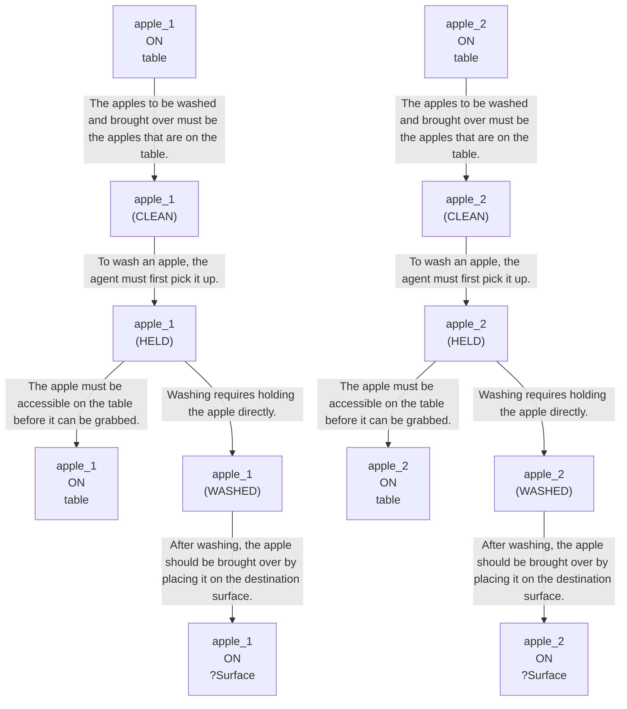
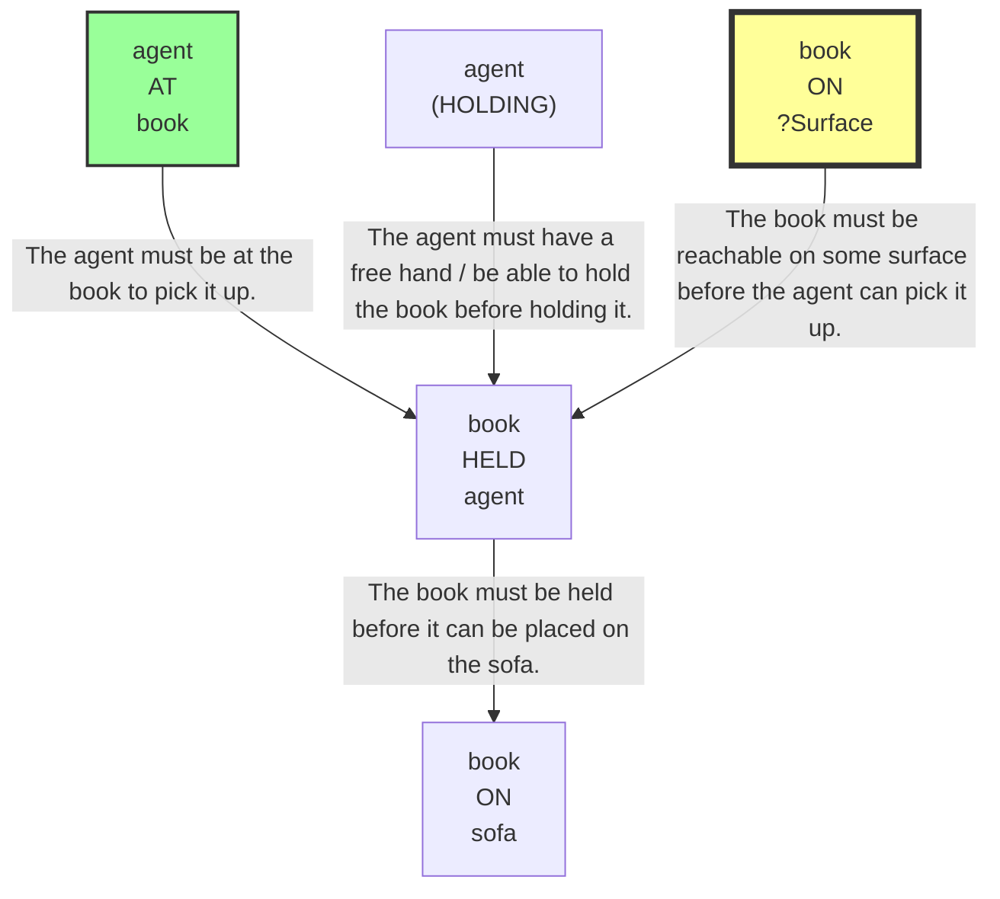
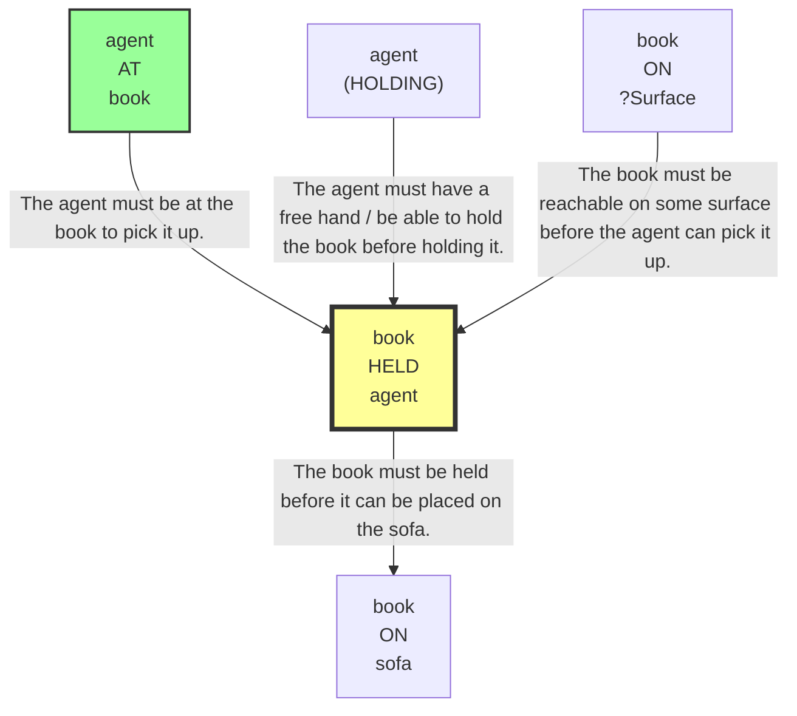
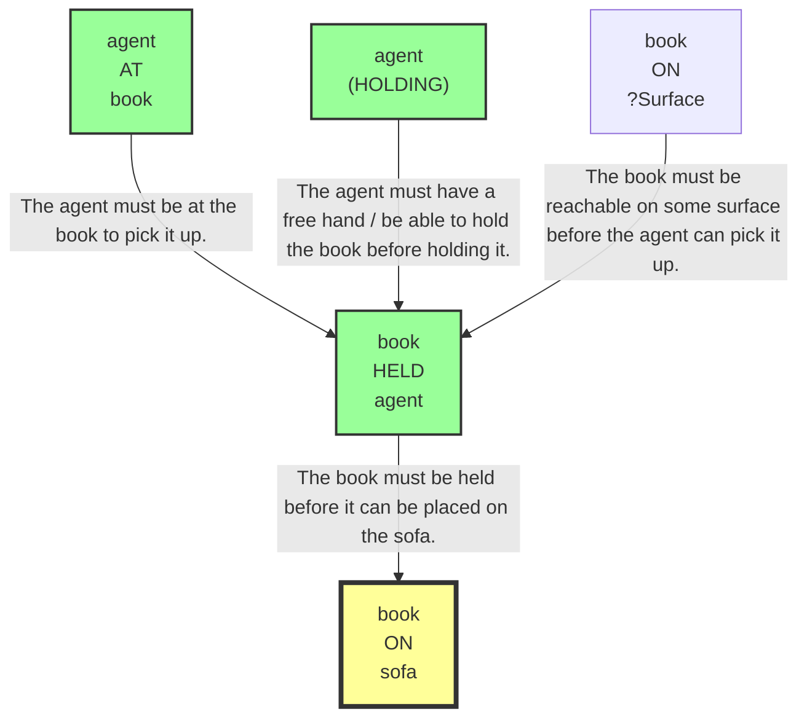
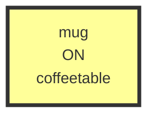
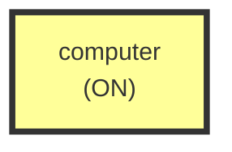

# 🚀 VirtualHome Agent Episode Log


### [GoalReasoner (Module A - Intent)] Output
```json
{
  "is_instruction_obviously_vague": false,
  "clarification_question": null,
  "target_object": "apples",
  "location_hint": "the table",
  "reasoning_chain": [
    {
      "question": "Why does the user want this object?",
      "answer": "They want the apples cleaned and delivered to them."
    },
    {
      "question": "Why is that important?",
      "answer": "So the apples are ready for use or consumption and accessible to the user."
    },
    {
      "question": "What fundamental need does this fulfill?",
      "answer": "It helps provide clean food and supports the need to eat."
    },
    {
      "question": "Are there any deeper psychological or physical motivations?",
      "answer": "The primary motivation is to obtain safe, ready-to-eat food with minimal effort."
    }
  ],
  "deep_intent": "The user wants to obtain clean, ready-to-eat food.",
  "acceptable_alternatives_properties": [
    {
      "priority": 1,
      "description": "Other fresh fruit that can be washed and eaten, such as pears or grapes"
    },
    {
      "priority": 2,
      "description": "Other whole foods that can be cleaned and served, such as oranges or plums"
    },
    {
      "priority": 3,
      "description": "Other ready-to-eat snack foods that satisfy hunger, such as crackers or a granola bar"
    },
    {
      "priority": 4,
      "description": "Any nearby edible item that can serve as a quick source of nourishment"
    }
  ]
}
```

### [RoboStateMultiTaskController] Output
```json
{
  "action": "[walk] <bathroom> (11)",
  "active_task_id": "task_1",
  "task_context": {
    "active_task_id": "task_1",
    "pending_task_ids": [
      "task_2",
      "task_3",
      "task_4",
      "task_5"
    ],
    "satisfied_task_ids": []
  },
  "source": "room_frontier"
}
```
## Step 0
- **Action**: `[walk] <bathroom> (11)`
- **Action Success**: `True`
- **Action Message**: {'0': {'message': 'Success'}}
- **Active Task**: `task_1`
- **Decision Source**: `room_frontier`
- **Task Progress**: G1_02=pending, E1_11=pending, E1_03=pending, E1_17=pending, E1_07=pending
- **SDG Status**:

- **Observed Items (114)**: floor(206), floor(207), floor(208), floor(209), floor(210), floor(211), wall(212), wall(213), wall(214), wall(215), wall(216), wall(217), ceiling(218), ceiling(219), ceiling(220)...


### [RoboStateMultiTaskController] Output
```json
{
  "action": "[walk] <bedroom> (73)",
  "active_task_id": "task_1",
  "task_context": {
    "active_task_id": "task_1",
    "pending_task_ids": [
      "task_2",
      "task_3",
      "task_4",
      "task_5"
    ],
    "satisfied_task_ids": []
  },
  "source": "room_frontier"
}
```
## Step 1
- **Action**: `[walk] <bedroom> (73)`
- **Action Success**: `True`
- **Action Message**: {'0': {'message': 'Success'}}
- **Active Task**: `task_1`
- **Decision Source**: `room_frontier`
- **Task Progress**: G1_02=pending, E1_11=pending, E1_03=pending, E1_17=pending, E1_07=pending
- **SDG Status**:

- **Observed Items (175)**: floor(206), floor(207), floor(208), floor(209), floor(210), floor(211), wall(212), wall(213), wall(214), wall(215), wall(216), wall(217), ceiling(218), ceiling(219), ceiling(220)...


### [RoboStateMultiTaskController] Output
```json
{
  "action": "[walk] <livingroom> (335)",
  "active_task_id": "task_1",
  "task_context": {
    "active_task_id": "task_1",
    "pending_task_ids": [
      "task_2",
      "task_3",
      "task_4",
      "task_5"
    ],
    "satisfied_task_ids": []
  },
  "source": "room_frontier"
}
```
## Step 2
- **Action**: `[walk] <livingroom> (335)`
- **Action Success**: `True`
- **Action Message**: {'0': {'message': 'Success'}}
- **Active Task**: `task_1`
- **Decision Source**: `room_frontier`
- **Task Progress**: G1_02=pending, E1_11=pending, E1_03=pending, E1_17=pending, E1_07=pending
- **SDG Status**:

- **Observed Items (244)**: floor(206), floor(207), floor(208), floor(209), floor(210), floor(211), wall(212), wall(213), wall(214), wall(215), wall(216), wall(217), ceiling(218), ceiling(219), ceiling(220)...


### [GoalReasoner (Module A - Intent)] Output
```json
{
  "is_instruction_obviously_vague": false,
  "clarification_question": null,
  "target_object": "book",
  "location_hint": "sofa",
  "reasoning_chain": [
    {
      "question": "Why does the user want this object?",
      "answer": "To relocate a book that is out of place to the sofa."
    },
    {
      "question": "Why is that important?",
      "answer": "To organize or gather the book in a designated resting area."
    },
    {
      "question": "What fundamental need does this fulfill?",
      "answer": "It supports tidiness and orderly placement of household items."
    },
    {
      "question": "Are there any deeper psychological or physical motivations?",
      "answer": "The user likely wants reduced clutter and a more organized living space."
    }
  ],
  "deep_intent": "The user wants to organize misplaced household items by moving them to a designated resting area.",
  "acceptable_alternatives_properties": [
    {
      "priority": 1,
      "description": "Other small household reading materials or paper items that are similarly out of place and can be placed on the sofa, such as magazines or notebooks"
    },
    {
      "priority": 2,
      "description": "Other loose personal items that are commonly gathered together in a living area, such as remote controls or folders"
    },
    {
      "priority": 3,
      "description": "Other lightweight items that can be tidied into a common spot to reduce clutter"
    },
    {
      "priority": 4,
      "description": "Any misplaced household object that can be relocated to a sitting area to improve organization"
    }
  ]
}
```

### [PerceptionFilter] Output
```json
{
  "reasoning": "The task is to move the target object, book, onto the sofa. The SDG requires the book itself and the destination sofa, plus the surface where the book is currently located if needed to pick it up. No extra tools are implied beyond being able to hold the book.",
  "selected_classes": [
    "bookshelf",
    "sofa",
    "nightstand",
    "bed",
    "book",
    "desk",
    "table",
    "chair",
    "folder",
    "paper",
    "coffeetable",
    "character",
    "floor"
  ],
  "raw_class_count": 101
}
```

### [LLMExecutor] Output
```json
{
  "reasoning": "The active task is to move a book onto the sofa. In the current graph, the robot is already close to the sofa in the living room, and there are two books available. Book(190) is already in the living room on the coffeetable, so it is the most direct candidate for relocation to the nearby sofa. To satisfy the prerequisite before grabbing, the next step must be to walk to that specific book.",
  "satisfied_nodes": [
    "N4"
  ],
  "current_node_focus": "N3",
  "mapped_variables": {
    "?Surface": "sofa(368)"
  },
  "action": "[walk] <book> (190)"
}
```

### [RoboStateMultiTaskController] Output
```json
{
  "action": "[walk] <book> (190)",
  "active_task_id": "task_3",
  "task_context": {
    "active_task_id": "task_3",
    "pending_task_ids": [
      "task_1",
      "task_2",
      "task_4",
      "task_5"
    ],
    "satisfied_task_ids": []
  },
  "source": "llm_executor"
}
```
## Step 3
- **Action**: `[walk] <book> (190)`
- **Action Success**: `True`
- **Action Message**: {'0': {'message': 'Success'}}
- **Active Task**: `task_3`
- **Decision Source**: `llm_executor`
- **Task Progress**: G1_02=pending, E1_11=pending, E1_03=pending, E1_17=pending, E1_07=pending
- **SDG Status**:

- **Observed Items (53)**: floor(206), floor(207), floor(208), floor(209), floor(210), floor(211), bookshelf(249), book(268) [CLOSED], character(1), bathroom(11), bedroom(73), kitchen(205), livingroom(335), floor(12), floor(13)...


### [PerceptionFilter] Output
```json
{
  "reasoning": "Reused cached class selection.",
  "selected_classes": [
    "bookshelf",
    "sofa",
    "nightstand",
    "bed",
    "book",
    "desk",
    "table",
    "chair",
    "folder",
    "paper",
    "coffeetable",
    "character",
    "floor"
  ],
  "raw_class_count": 101
}
```

### [LLMExecutor] Output
```json
{
  "reasoning": "The active task is to move a book onto the sofa. The SDG requires first being at the book, then holding it, then placing it on the sofa. The current graph shows book(190) is close to the agent in the bedroom, so the next atomic step is to grab it. The sofa(368) in the living room is the target destination, but placement will come after the book is held.",
  "satisfied_nodes": [
    "N4"
  ],
  "current_node_focus": "N2",
  "mapped_variables": {
    "?Surface": "sofa(368)"
  },
  "action": "[grab] <book> (190)"
}
```

### [RoboStateMultiTaskController] Output
```json
{
  "action": "[grab] <book> (190)",
  "active_task_id": "task_3",
  "task_context": {
    "active_task_id": "task_3",
    "pending_task_ids": [
      "task_1",
      "task_2",
      "task_4",
      "task_5"
    ],
    "satisfied_task_ids": []
  },
  "source": "llm_executor"
}
```
## Step 4
- **Action**: `[grab] <book> (190)`
- **Action Success**: `True`
- **Action Message**: {'0': {'message': 'Success'}}
- **Active Task**: `task_3`
- **Decision Source**: `llm_executor`
- **Task Progress**: G1_02=pending, E1_11=pending, E1_03=pending, E1_17=pending, E1_07=pending
- **SDG Status**:

- **Observed Items (53)**: floor(206), floor(207), floor(208), floor(209), floor(210), floor(211), bookshelf(249), book(268) [CLOSED], character(1), bathroom(11), bedroom(73), kitchen(205), livingroom(335), floor(12), floor(13)...


### [PerceptionFilter] Output
```json
{
  "reasoning": "Reused cached class selection.",
  "selected_classes": [
    "bookshelf",
    "sofa",
    "nightstand",
    "bed",
    "book",
    "desk",
    "table",
    "chair",
    "folder",
    "paper",
    "coffeetable",
    "character",
    "floor"
  ],
  "raw_class_count": 101
}
```

### [LLMExecutor] Output
```json
{
  "reasoning": "The target book for the active task is book(190), which is already in hand (HOLDS_RH) and the agent is close to the living room sofa(368). The remaining goal node is to place the held book onto the sofa. Since putback requires being at the destination first and we are already close to the sofa, the next atomic action is to place the book on the sofa.",
  "satisfied_nodes": [
    "N2",
    "N4",
    "N5"
  ],
  "current_node_focus": "N1",
  "mapped_variables": {},
  "action": "[putback] <book> (190) <sofa> (368)"
}
```

### [RoboStateMultiTaskController] Output
```json
{
  "action": "[putback] <book> (190) <sofa> (368)",
  "active_task_id": "task_3",
  "task_context": {
    "active_task_id": "task_3",
    "pending_task_ids": [
      "task_1",
      "task_2",
      "task_4",
      "task_5"
    ],
    "satisfied_task_ids": []
  },
  "source": "llm_executor"
}
```
## Step 5
- **Action**: `[putback] <book> (190) <sofa> (368)`
- **Action Success**: `True`
- **Action Message**: {'0': {'message': 'Success'}}
- **Active Task**: `task_3`
- **Decision Source**: `llm_executor`
- **Task Progress**: G1_02=pending, E1_11=pending, E1_03=done, E1_17=pending, E1_07=pending
- **SDG Status**:

- **Observed Items (53)**: floor(206), floor(207), floor(208), floor(209), floor(210), floor(211), bookshelf(249), book(268) [CLOSED], character(1), bathroom(11), bedroom(73), kitchen(205), livingroom(335), floor(12), floor(13)...


### [GoalReasoner (Module A - Intent)] Output
```json
{
  "is_instruction_obviously_vague": false,
  "clarification_question": null,
  "target_object": "mug",
  "location_hint": "coffeetable",
  "reasoning_chain": [
    {
      "question": "Why does the user want this object?",
      "answer": "They want the mug to be kept on the coffeetable."
    },
    {
      "question": "Why is that important?",
      "answer": "They likely want the mug to remain in a specific, stable location rather than being moved elsewhere."
    },
    {
      "question": "What fundamental need does this fulfill?",
      "answer": "It fulfills the need to maintain the mug in an accessible and expected place."
    },
    {
      "question": "Are there any deeper psychological or physical motivations?",
      "answer": "The user may want convenience, order, or to prevent the mug from being misplaced."
    }
  ],
  "deep_intent": "The user wants an object to be kept in a specific accessible location.",
  "acceptable_alternatives_properties": [
    {
      "priority": 1,
      "description": "Other small everyday items that can be kept on the coffeetable, such as a cup or glass"
    },
    {
      "priority": 2,
      "description": "Similar tabletop household items that can remain in a visible, accessible place"
    },
    {
      "priority": 3,
      "description": "Other small personal items that are commonly stored on a table for convenience"
    },
    {
      "priority": 4,
      "description": "Any household object that can be placed and kept on a flat surface if the exact item is unavailable"
    }
  ]
}
```

### [PerceptionFilter] Output
```json
{
  "reasoning": "The goal explicitly requires the mug and the coffeetable, and the SDG specifies the mug must be ON the coffeetable. No additional tools or alternative location/receptacle classes are needed.",
  "selected_classes": [
    "mug",
    "character",
    "coffeetable"
  ],
  "raw_class_count": 101
}
```

### [LLMExecutor] Output
```json
{
  "reasoning": "The active goal is to have a mug on the coffeetable. The character is currently close to coffeetable(371), and there are two mug candidates. mug(194) is inside the kitchen, so it is not the best immediate choice because we are already near a coffeetable in the livingroom. mug(447) is inside the livingroom, matching the current area and likely easier to reach. To satisfy the ON relation, the next step is to go to the mug before grabbing it; I should not attempt to grab from across the room. Since the current position is already near the coffeetable but not necessarily near the mug, the single next atomic action is to walk to the livingroom mug.",
  "satisfied_nodes": [],
  "current_node_focus": "N1",
  "mapped_variables": {},
  "action": "[walk] <mug> (447)"
}
```

### [RoboStateMultiTaskController] Output
```json
{
  "action": "[walk] <mug> (447)",
  "active_task_id": "task_5",
  "task_context": {
    "active_task_id": "task_5",
    "pending_task_ids": [
      "task_1",
      "task_2",
      "task_4"
    ],
    "satisfied_task_ids": [
      "task_3"
    ]
  },
  "source": "llm_executor"
}
```
## Step 6
- **Action**: `[walk] <mug> (447)`
- **Action Success**: `True`
- **Action Message**: {'0': {'message': 'Success'}}
- **Active Task**: `task_5`
- **Decision Source**: `llm_executor`
- **Task Progress**: G1_02=pending, E1_11=pending, E1_03=done, E1_17=pending, E1_07=pending
- **SDG Status**:

- **Observed Items (9)**: mug(194), character(1), bathroom(11), bedroom(73), kitchen(205), livingroom(335), coffeetable(111), coffeetable(371), mug(447)


### [PerceptionFilter] Output
```json
{
  "reasoning": "Reused cached class selection.",
  "selected_classes": [
    "mug",
    "character",
    "coffeetable"
  ],
  "raw_class_count": 101
}
```

### [LLMExecutor] Output
```json
{
  "reasoning": "The active goal is to place the mug on a coffeetable. I am currently close to mug(447) in the livingroom, but to satisfy the final ON relation I must first have the mug in hand before moving to the coffeetable. The graph shows mug(447) is grabbable and currently close, so the next atomic step should be to grab it. I will focus on satisfying N1 by taking the mug so it can then be placed on the coffeetable in a subsequent step.",
  "satisfied_nodes": [],
  "current_node_focus": "N1",
  "mapped_variables": {},
  "action": "[grab] <mug> (447)"
}
```

### [RoboStateMultiTaskController] Output
```json
{
  "action": "[grab] <mug> (447)",
  "active_task_id": "task_5",
  "task_context": {
    "active_task_id": "task_5",
    "pending_task_ids": [
      "task_1",
      "task_2",
      "task_4"
    ],
    "satisfied_task_ids": [
      "task_3"
    ]
  },
  "source": "llm_executor"
}
```
## Step 7
- **Action**: `[grab] <mug> (447)`
- **Action Success**: `True`
- **Action Message**: {'0': {'message': 'Success'}}
- **Active Task**: `task_5`
- **Decision Source**: `llm_executor`
- **Task Progress**: G1_02=pending, E1_11=pending, E1_03=done, E1_17=pending, E1_07=pending
- **SDG Status**:

- **Observed Items (9)**: mug(194), character(1), bathroom(11), bedroom(73), kitchen(205), livingroom(335), coffeetable(111), coffeetable(371), mug(447)


### [PerceptionFilter] Output
```json
{
  "reasoning": "Reused cached class selection.",
  "selected_classes": [
    "mug",
    "character",
    "coffeetable"
  ],
  "raw_class_count": 101
}
```

### [LLMExecutor] Output
```json
{
  "reasoning": "The active goal is to place mug(447) on a coffeetable. I am currently holding mug(447) and the filtered graph shows coffeetable(111) is in the bedroom and is not currently close to the character, while coffeetable(371) is in the livingroom. Since the goal only specifies 'coffeetable' and both are valid instances, the best next step is to move to the visible coffeetable(371) in the current room before placing the mug there. I cannot putback from across the room, so walking is required first.",
  "satisfied_nodes": [],
  "current_node_focus": "N1",
  "mapped_variables": {},
  "action": "[walk] <coffeetable> (371)"
}
```

### [RoboStateMultiTaskController] Output
```json
{
  "action": "[walk] <coffeetable> (371)",
  "active_task_id": "task_5",
  "task_context": {
    "active_task_id": "task_5",
    "pending_task_ids": [
      "task_1",
      "task_2",
      "task_4"
    ],
    "satisfied_task_ids": [
      "task_3"
    ]
  },
  "source": "llm_executor"
}
```
## Step 8
- **Action**: `[walk] <coffeetable> (371)`
- **Action Success**: `True`
- **Action Message**: {'0': {'message': 'Success'}}
- **Active Task**: `task_5`
- **Decision Source**: `llm_executor`
- **Task Progress**: G1_02=pending, E1_11=pending, E1_03=done, E1_17=pending, E1_07=pending
- **SDG Status**:

- **Observed Items (9)**: mug(194), character(1), bathroom(11), bedroom(73), kitchen(205), livingroom(335), coffeetable(111), coffeetable(371), mug(447)


### [PerceptionFilter] Output
```json
{
  "reasoning": "Reused cached class selection.",
  "selected_classes": [
    "mug",
    "character",
    "coffeetable"
  ],
  "raw_class_count": 101
}
```

### [LLMExecutor] Output
```json
{
  "reasoning": "The active goal is to place the mug on the coffeetable. I am already close to coffeetable(371), and the currently held mug is mug(447), which matches the task better than the unrelated mug(194) in the kitchen. Since the mug is already in hand and the destination surface is nearby, the next required step is to put it down onto the coffeetable.",
  "satisfied_nodes": [],
  "current_node_focus": "N1",
  "mapped_variables": {},
  "action": "[putback] <mug> (447) <coffeetable> (371)"
}
```

### [RoboStateMultiTaskController] Output
```json
{
  "action": "[putback] <mug> (447) <coffeetable> (371)",
  "active_task_id": "task_5",
  "task_context": {
    "active_task_id": "task_5",
    "pending_task_ids": [
      "task_1",
      "task_2",
      "task_4"
    ],
    "satisfied_task_ids": [
      "task_3"
    ]
  },
  "source": "llm_executor"
}
```
## Step 9
- **Action**: `[putback] <mug> (447) <coffeetable> (371)`
- **Action Success**: `True`
- **Action Message**: {'0': {'message': 'Success'}}
- **Active Task**: `task_5`
- **Decision Source**: `llm_executor`
- **Task Progress**: G1_02=pending, E1_11=pending, E1_03=done, E1_17=pending, E1_07=done
- **SDG Status**:

- **Observed Items (9)**: mug(194), character(1), bathroom(11), bedroom(73), kitchen(205), livingroom(335), coffeetable(111), coffeetable(371), mug(447)


### [GoalReasoner (Module A - Intent)] Output
```json
{
  "is_instruction_obviously_vague": false,
  "clarification_question": null,
  "target_object": "computer",
  "location_hint": null,
  "reasoning_chain": [
    {
      "question": "Why does the user want this object?",
      "answer": "To make the computer switch from an off state to an on state."
    },
    {
      "question": "Why is that important?",
      "answer": "Because the computer needs to be powered on in order to be used."
    },
    {
      "question": "What fundamental need does this fulfill?",
      "answer": "The user wants to enable device operation and access computing functionality."
    },
    {
      "question": "Are there any deeper psychological or physical motivations?",
      "answer": "They likely want to continue a task, access information, or use the computer for work or interaction."
    }
  ],
  "deep_intent": "The user wants to enable device operation.",
  "acceptable_alternatives_properties": [
    {
      "priority": 1,
      "description": "Other powered-off electronic devices that can be turned on to provide the needed function, such as a laptop, monitor, or desktop tower."
    },
    {
      "priority": 2,
      "description": "Similar household electronics that serve the same operational purpose, such as a tablet or smart display."
    },
    {
      "priority": 3,
      "description": "Any available device that can provide computing access or interactive functionality."
    },
    {
      "priority": 4,
      "description": "A different way to continue the task if the computer cannot be powered on, such as using another functioning computer or device."
    }
  ]
}
```

### [PerceptionFilter] Output
```json
{
  "reasoning": "The goal is to power on the computer, so the only strictly necessary class is the computer itself. No additional tools or locations are required by the SDG.",
  "selected_classes": [
    "computer",
    "character",
    "desk"
  ],
  "raw_class_count": 101
}
```

### [LLMExecutor] Output
```json
{
  "reasoning": "The active goal is to turn a computer ON. There are two OFF computers available: computer(174) in the bedroom and computer(433) in the living room. Since the agent is currently in the living room and the instruction does not specify a particular computer, the closest valid target is computer(433). To switch it on, I must first be near it, and I am already in the same room, so the next atomic action is to switch it on.",
  "satisfied_nodes": [],
  "current_node_focus": "N1",
  "mapped_variables": {},
  "action": "[switchon] <computer> (433)"
}
```

### [RoboStateMultiTaskController] Output
```json
{
  "action": "[walk] <computer> (433)",
  "active_task_id": "task_2",
  "task_context": {
    "active_task_id": "task_2",
    "pending_task_ids": [
      "task_1",
      "task_4"
    ],
    "satisfied_task_ids": [
      "task_3",
      "task_5"
    ]
  },
  "source": "llm_executor_repaired"
}
```
## Step 10
- **Action**: `[walk] <computer> (433)`
- **Action Success**: `True`
- **Action Message**: {'0': {'message': 'Success'}}
- **Active Task**: `task_2`
- **Decision Source**: `llm_executor_repaired`
- **Task Progress**: G1_02=pending, E1_11=pending, E1_03=done, E1_17=pending, E1_07=done
- **SDG Status**:

- **Observed Items (9)**: character(1), bathroom(11), bedroom(73), kitchen(205), livingroom(335), desk(108) [CLOSED], computer(174) [OFF], desk(373) [CLOSED], computer(433) [OFF]


### [PerceptionFilter] Output
```json
{
  "reasoning": "Reused cached class selection.",
  "selected_classes": [
    "computer",
    "character",
    "desk"
  ],
  "raw_class_count": 101
}
```

### [LLMExecutor] Output
```json
{
  "reasoning": "The active goal is to make a computer ON. In the current filtered graph, computer(433) is OFF and is CLOSE to the character, so the next required action is to switch it on. No power/plugging requirement is indicated for this computer, and I should not repeat the recent walk. The bedroom computer(174) is a different instance and not currently relevant because the living room computer(433) is already nearby.",
  "satisfied_nodes": [],
  "current_node_focus": "N1",
  "mapped_variables": {},
  "action": "[switchon] <computer> (433)"
}
```

### [RoboStateMultiTaskController] Output
```json
{
  "action": "[switchon] <computer> (433)",
  "active_task_id": "task_2",
  "task_context": {
    "active_task_id": "task_2",
    "pending_task_ids": [
      "task_1",
      "task_4"
    ],
    "satisfied_task_ids": [
      "task_3",
      "task_5"
    ]
  },
  "source": "llm_executor"
}
```
## Step 11
- **Action**: `[switchon] <computer> (433)`
- **Action Success**: `True`
- **Action Message**: Faked switch operation in Python layer (bypassed Unity failure)
- **Active Task**: `task_2`
- **Decision Source**: `llm_executor`
- **Task Progress**: G1_02=pending, E1_11=done, E1_03=done, E1_17=pending, E1_07=done
- **SDG Status**:

- **Observed Items (9)**: character(1), bathroom(11), bedroom(73), kitchen(205), livingroom(335), desk(108) [CLOSED], computer(174) [OFF], desk(373) [CLOSED], computer(433) [OFF]


### [GoalReasoner (Module A - Intent)] Output
```json
{
  "is_instruction_obviously_vague": false,
  "clarification_question": null,
  "target_object": "radio",
  "location_hint": null,
  "reasoning_chain": [
    {
      "question": "Why does the user want this object?",
      "answer": "To have the radio turned on if it is currently off."
    },
    {
      "question": "Why is that important?",
      "answer": "Because turning it on enables the radio to function and produce audio output."
    },
    {
      "question": "What fundamental need does this fulfill?",
      "answer": "It fulfills the need to operate or access an audio source for listening."
    },
    {
      "question": "Are there any deeper psychological or physical motivations?",
      "answer": "The user likely wants to hear broadcast content, music, news, or other audio, or simply ensure the device is powered on."
    }
  ],
  "deep_intent": "The user wants to enable access to audio output from a device.",
  "acceptable_alternatives_properties": [
    {
      "priority": 1,
      "description": "Other audio-playing devices that can be powered on, such as a speaker, stereo, or television with sound."
    },
    {
      "priority": 2,
      "description": "Any household device that can provide audio content, such as a music player or smart display."
    },
    {
      "priority": 3,
      "description": "Portable or stationary devices capable of producing sound for listening."
    },
    {
      "priority": 4,
      "description": "Alternative ways to access audio content, such as a phone or tablet playing media aloud."
    }
  ]
}
```

### [RoboStateMultiTaskController] Output
```json
{
  "action": "[walk] <kitchen> (205)",
  "active_task_id": null,
  "task_context": {
    "active_task_id": null,
    "pending_task_ids": [
      "task_1",
      "task_4"
    ],
    "satisfied_task_ids": [
      "task_2",
      "task_3",
      "task_5"
    ]
  },
  "source": "loop_recovery_room_revisit"
}
```
## Step 12
- **Action**: `[walk] <kitchen> (205)`
- **Action Success**: `True`
- **Action Message**: {'0': {'message': 'Success'}}
- **Decision Source**: `loop_recovery_room_revisit`
- **Task Progress**: G1_02=pending, E1_11=done, E1_03=done, E1_17=pending, E1_07=done
- **SDG Status**:
No SDG active.
- **Observed Items (317)**: floor(206), floor(207), floor(208), floor(209), floor(210), floor(211), wall(212), wall(213), wall(214), wall(215), wall(216), wall(217), ceiling(218), ceiling(219), ceiling(220)...


### [RoboStateMultiTaskController] Output
```json
{
  "action": "[walk] <bathroom> (11)",
  "active_task_id": null,
  "task_context": {
    "active_task_id": null,
    "pending_task_ids": [
      "task_1",
      "task_4"
    ],
    "satisfied_task_ids": [
      "task_2",
      "task_3",
      "task_5"
    ]
  },
  "source": "loop_recovery_room_revisit"
}
```
## Step 13
- **Action**: `[walk] <bathroom> (11)`
- **Action Success**: `True`
- **Action Message**: {'0': {'message': 'Success'}}
- **Decision Source**: `loop_recovery_room_revisit`
- **Task Progress**: G1_02=pending, E1_11=done, E1_03=done, E1_17=pending, E1_07=done
- **SDG Status**:
No SDG active.
- **Observed Items (317)**: floor(206), floor(207), floor(208), floor(209), floor(210), floor(211), wall(212), wall(213), wall(214), wall(215), wall(216), wall(217), ceiling(218), ceiling(219), ceiling(220)...


### [RoboStateMultiTaskController] Output
```json
{
  "action": "[walk] <bedroom> (73)",
  "active_task_id": null,
  "task_context": {
    "active_task_id": null,
    "pending_task_ids": [
      "task_1",
      "task_4"
    ],
    "satisfied_task_ids": [
      "task_2",
      "task_3",
      "task_5"
    ]
  },
  "source": "loop_recovery_room_revisit"
}
```
## Step 14
- **Action**: `[walk] <bedroom> (73)`
- **Action Success**: `True`
- **Action Message**: {'0': {'message': 'Success'}}
- **Decision Source**: `loop_recovery_room_revisit`
- **Task Progress**: G1_02=pending, E1_11=done, E1_03=done, E1_17=pending, E1_07=done
- **SDG Status**:
No SDG active.
- **Observed Items (317)**: floor(206), floor(207), floor(208), floor(209), floor(210), floor(211), wall(212), wall(213), wall(214), wall(215), wall(216), wall(217), ceiling(218), ceiling(219), ceiling(220)...


### [RoboStateMultiTaskController] Output
```json
{
  "action": "[walk] <livingroom> (335)",
  "active_task_id": null,
  "task_context": {
    "active_task_id": null,
    "pending_task_ids": [
      "task_1",
      "task_4"
    ],
    "satisfied_task_ids": [
      "task_2",
      "task_3",
      "task_5"
    ]
  },
  "source": "loop_recovery_room_revisit"
}
```
## Step 15
- **Action**: `[walk] <livingroom> (335)`
- **Action Success**: `True`
- **Action Message**: {'0': {'message': 'Success'}}
- **Decision Source**: `loop_recovery_room_revisit`
- **Task Progress**: G1_02=pending, E1_11=done, E1_03=done, E1_17=pending, E1_07=done
- **SDG Status**:
No SDG active.
- **Observed Items (317)**: floor(206), floor(207), floor(208), floor(209), floor(210), floor(211), wall(212), wall(213), wall(214), wall(215), wall(216), wall(217), ceiling(218), ceiling(219), ceiling(220)...


### [RoboStateMultiTaskController] Output
```json
{
  "action": "[walk] <kitchen> (205)",
  "active_task_id": null,
  "task_context": {
    "active_task_id": null,
    "pending_task_ids": [
      "task_1",
      "task_4"
    ],
    "satisfied_task_ids": [
      "task_2",
      "task_3",
      "task_5"
    ]
  },
  "source": "loop_recovery_room_revisit"
}
```
## Step 16
- **Action**: `[walk] <kitchen> (205)`
- **Action Success**: `True`
- **Action Message**: {'0': {'message': 'Success'}}
- **Decision Source**: `loop_recovery_room_revisit`
- **Task Progress**: G1_02=pending, E1_11=done, E1_03=done, E1_17=pending, E1_07=done
- **SDG Status**:
No SDG active.
- **Observed Items (317)**: floor(206), floor(207), floor(208), floor(209), floor(210), floor(211), wall(212), wall(213), wall(214), wall(215), wall(216), wall(217), ceiling(218), ceiling(219), ceiling(220)...


### [RoboStateMultiTaskController] Output
```json
{
  "action": "[walk] <bathroom> (11)",
  "active_task_id": null,
  "task_context": {
    "active_task_id": null,
    "pending_task_ids": [
      "task_1",
      "task_4"
    ],
    "satisfied_task_ids": [
      "task_2",
      "task_3",
      "task_5"
    ]
  },
  "source": "loop_recovery_room_revisit"
}
```
## Step 17
- **Action**: `[walk] <bathroom> (11)`
- **Action Success**: `True`
- **Action Message**: {'0': {'message': 'Success'}}
- **Decision Source**: `loop_recovery_room_revisit`
- **Task Progress**: G1_02=pending, E1_11=done, E1_03=done, E1_17=pending, E1_07=done
- **SDG Status**:
No SDG active.
- **Observed Items (317)**: floor(206), floor(207), floor(208), floor(209), floor(210), floor(211), wall(212), wall(213), wall(214), wall(215), wall(216), wall(217), ceiling(218), ceiling(219), ceiling(220)...


### [RoboStateMultiTaskController] Output
```json
{
  "action": "[walk] <bedroom> (73)",
  "active_task_id": null,
  "task_context": {
    "active_task_id": null,
    "pending_task_ids": [
      "task_1",
      "task_4"
    ],
    "satisfied_task_ids": [
      "task_2",
      "task_3",
      "task_5"
    ]
  },
  "source": "loop_recovery_room_revisit"
}
```
## Step 18
- **Action**: `[walk] <bedroom> (73)`
- **Action Success**: `True`
- **Action Message**: {'0': {'message': 'Success'}}
- **Decision Source**: `loop_recovery_room_revisit`
- **Task Progress**: G1_02=pending, E1_11=done, E1_03=done, E1_17=pending, E1_07=done
- **SDG Status**:
No SDG active.
- **Observed Items (317)**: floor(206), floor(207), floor(208), floor(209), floor(210), floor(211), wall(212), wall(213), wall(214), wall(215), wall(216), wall(217), ceiling(218), ceiling(219), ceiling(220)...


### [RoboStateMultiTaskController] Output
```json
{
  "action": "[walk] <livingroom> (335)",
  "active_task_id": null,
  "task_context": {
    "active_task_id": null,
    "pending_task_ids": [
      "task_1",
      "task_4"
    ],
    "satisfied_task_ids": [
      "task_2",
      "task_3",
      "task_5"
    ]
  },
  "source": "loop_recovery_room_revisit"
}
```
## Step 19
- **Action**: `[walk] <livingroom> (335)`
- **Action Success**: `True`
- **Action Message**: {'0': {'message': 'Success'}}
- **Decision Source**: `loop_recovery_room_revisit`
- **Task Progress**: G1_02=pending, E1_11=done, E1_03=done, E1_17=pending, E1_07=done
- **SDG Status**:
No SDG active.
- **Observed Items (317)**: floor(206), floor(207), floor(208), floor(209), floor(210), floor(211), wall(212), wall(213), wall(214), wall(215), wall(216), wall(217), ceiling(218), ceiling(219), ceiling(220)...


### [RoboStateMultiTaskController] Output
```json
{
  "action": "[walk] <kitchen> (205)",
  "active_task_id": null,
  "task_context": {
    "active_task_id": null,
    "pending_task_ids": [
      "task_1",
      "task_4"
    ],
    "satisfied_task_ids": [
      "task_2",
      "task_3",
      "task_5"
    ]
  },
  "source": "loop_recovery_room_revisit"
}
```
## Step 20
- **Action**: `[walk] <kitchen> (205)`
- **Action Success**: `True`
- **Action Message**: {'0': {'message': 'Success'}}
- **Decision Source**: `loop_recovery_room_revisit`
- **Task Progress**: G1_02=pending, E1_11=done, E1_03=done, E1_17=pending, E1_07=done
- **SDG Status**:
No SDG active.
- **Observed Items (317)**: floor(206), floor(207), floor(208), floor(209), floor(210), floor(211), wall(212), wall(213), wall(214), wall(215), wall(216), wall(217), ceiling(218), ceiling(219), ceiling(220)...


### [RoboStateMultiTaskController] Output
```json
{
  "action": "[walk] <bathroom> (11)",
  "active_task_id": null,
  "task_context": {
    "active_task_id": null,
    "pending_task_ids": [
      "task_1",
      "task_4"
    ],
    "satisfied_task_ids": [
      "task_2",
      "task_3",
      "task_5"
    ]
  },
  "source": "loop_recovery_room_revisit"
}
```
## Step 21
- **Action**: `[walk] <bathroom> (11)`
- **Action Success**: `True`
- **Action Message**: {'0': {'message': 'Success'}}
- **Decision Source**: `loop_recovery_room_revisit`
- **Task Progress**: G1_02=pending, E1_11=done, E1_03=done, E1_17=pending, E1_07=done
- **SDG Status**:
No SDG active.
- **Observed Items (317)**: floor(206), floor(207), floor(208), floor(209), floor(210), floor(211), wall(212), wall(213), wall(214), wall(215), wall(216), wall(217), ceiling(218), ceiling(219), ceiling(220)...


### [RoboStateMultiTaskController] Output
```json
{
  "action": "[walk] <bedroom> (73)",
  "active_task_id": null,
  "task_context": {
    "active_task_id": null,
    "pending_task_ids": [
      "task_1",
      "task_4"
    ],
    "satisfied_task_ids": [
      "task_2",
      "task_3",
      "task_5"
    ]
  },
  "source": "loop_recovery_room_revisit"
}
```
## Step 22
- **Action**: `[walk] <bedroom> (73)`
- **Action Success**: `True`
- **Action Message**: {'0': {'message': 'Success'}}
- **Decision Source**: `loop_recovery_room_revisit`
- **Task Progress**: G1_02=pending, E1_11=done, E1_03=done, E1_17=pending, E1_07=done
- **SDG Status**:
No SDG active.
- **Observed Items (317)**: floor(206), floor(207), floor(208), floor(209), floor(210), floor(211), wall(212), wall(213), wall(214), wall(215), wall(216), wall(217), ceiling(218), ceiling(219), ceiling(220)...


### [RoboStateMultiTaskController] Output
```json
{
  "action": "[walk] <livingroom> (335)",
  "active_task_id": null,
  "task_context": {
    "active_task_id": null,
    "pending_task_ids": [
      "task_1",
      "task_4"
    ],
    "satisfied_task_ids": [
      "task_2",
      "task_3",
      "task_5"
    ]
  },
  "source": "loop_recovery_room_revisit"
}
```
## Step 23
- **Action**: `[walk] <livingroom> (335)`
- **Action Success**: `True`
- **Action Message**: {'0': {'message': 'Success'}}
- **Decision Source**: `loop_recovery_room_revisit`
- **Task Progress**: G1_02=pending, E1_11=done, E1_03=done, E1_17=pending, E1_07=done
- **SDG Status**:
No SDG active.
- **Observed Items (317)**: floor(206), floor(207), floor(208), floor(209), floor(210), floor(211), wall(212), wall(213), wall(214), wall(215), wall(216), wall(217), ceiling(218), ceiling(219), ceiling(220)...


### [RoboStateMultiTaskController] Output
```json
{
  "action": "[walk] <kitchen> (205)",
  "active_task_id": null,
  "task_context": {
    "active_task_id": null,
    "pending_task_ids": [
      "task_1",
      "task_4"
    ],
    "satisfied_task_ids": [
      "task_2",
      "task_3",
      "task_5"
    ]
  },
  "source": "loop_recovery_room_revisit"
}
```
## Step 24
- **Action**: `[walk] <kitchen> (205)`
- **Action Success**: `True`
- **Action Message**: {'0': {'message': 'Success'}}
- **Decision Source**: `loop_recovery_room_revisit`
- **Task Progress**: G1_02=pending, E1_11=done, E1_03=done, E1_17=pending, E1_07=done
- **SDG Status**:
No SDG active.
- **Observed Items (317)**: floor(206), floor(207), floor(208), floor(209), floor(210), floor(211), wall(212), wall(213), wall(214), wall(215), wall(216), wall(217), ceiling(218), ceiling(219), ceiling(220)...


### [RoboStateMultiTaskController] Output
```json
{
  "action": "[walk] <bathroom> (11)",
  "active_task_id": null,
  "task_context": {
    "active_task_id": null,
    "pending_task_ids": [
      "task_1",
      "task_4"
    ],
    "satisfied_task_ids": [
      "task_2",
      "task_3",
      "task_5"
    ]
  },
  "source": "loop_recovery_room_revisit"
}
```
## Step 25
- **Action**: `[walk] <bathroom> (11)`
- **Action Success**: `True`
- **Action Message**: {'0': {'message': 'Success'}}
- **Decision Source**: `loop_recovery_room_revisit`
- **Task Progress**: G1_02=pending, E1_11=done, E1_03=done, E1_17=pending, E1_07=done
- **SDG Status**:
No SDG active.
- **Observed Items (317)**: floor(206), floor(207), floor(208), floor(209), floor(210), floor(211), wall(212), wall(213), wall(214), wall(215), wall(216), wall(217), ceiling(218), ceiling(219), ceiling(220)...


### [RoboStateMultiTaskController] Output
```json
{
  "action": "[walk] <bedroom> (73)",
  "active_task_id": null,
  "task_context": {
    "active_task_id": null,
    "pending_task_ids": [
      "task_1",
      "task_4"
    ],
    "satisfied_task_ids": [
      "task_2",
      "task_3",
      "task_5"
    ]
  },
  "source": "loop_recovery_room_revisit"
}
```
## Step 26
- **Action**: `[walk] <bedroom> (73)`
- **Action Success**: `True`
- **Action Message**: {'0': {'message': 'Success'}}
- **Decision Source**: `loop_recovery_room_revisit`
- **Task Progress**: G1_02=pending, E1_11=done, E1_03=done, E1_17=pending, E1_07=done
- **SDG Status**:
No SDG active.
- **Observed Items (317)**: floor(206), floor(207), floor(208), floor(209), floor(210), floor(211), wall(212), wall(213), wall(214), wall(215), wall(216), wall(217), ceiling(218), ceiling(219), ceiling(220)...

