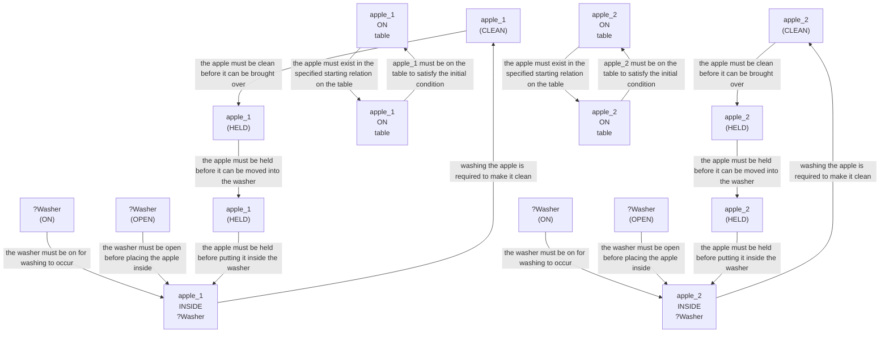

# 🚀 VirtualHome Agent Episode Log


### [GoalReasoner (Module A - Intent)] Output
```json
{
  "is_instruction_obviously_vague": false,
  "clarification_question": null,
  "target_object": "apples",
  "location_hint": "the table",
  "reasoning_chain": [
    {
      "question": "Why does the user want this object?",
      "answer": "To obtain the apples from the table and have them available elsewhere."
    },
    {
      "question": "Why is that important?",
      "answer": "Because the apples are likely intended for later use or consumption, and the user wants them cleaned before being moved."
    },
    {
      "question": "What fundamental need does this fulfill?",
      "answer": "It fulfills the need to prepare food items for safe handling or eating and to relocate them to the user."
    },
    {
      "question": "Are there any deeper psychological or physical motivations?",
      "answer": "The user likely wants convenience, readiness for use, and hygiene."
    }
  ],
  "deep_intent": "The user wants to obtain and prepare food for later use or consumption.",
  "acceptable_alternatives_properties": [
    {
      "priority": 1,
      "description": "Other fresh fruit that can be washed and brought over, such as pears or oranges"
    },
    {
      "priority": 2,
      "description": "Other washable ready-to-eat produce items found indoors, such as grapes or peaches"
    },
    {
      "priority": 3,
      "description": "Other food items that can be safely handled and delivered, such as packaged snacks"
    },
    {
      "priority": 4,
      "description": "Other edible items that satisfy hunger or serve as a snack, even if they are not fruit"
    }
  ]
}
```

### [RoboStateMultiTaskController] Output
```json
{
  "action": "[walk] <bathroom> (11)",
  "active_task_id": "task_1",
  "task_context": {
    "active_task_id": "task_1",
    "pending_task_ids": [
      "task_2",
      "task_3",
      "task_4",
      "task_5",
      "task_6",
      "task_7"
    ],
    "satisfied_task_ids": []
  },
  "source": "room_frontier"
}
```
## Step 0
- **Action**: `[walk] <bathroom> (11)`
- **Action Success**: `True`
- **Action Message**: {'0': {'message': 'Success'}}
- **Active Task**: `task_1`
- **Decision Source**: `room_frontier`
- **Task Progress**: G1_02=pending, E1_11=pending, E1_03=pending, E1_17=pending, E1_07=pending, E1_01=pending, E1_15=pending
- **SDG Status**:

- **Observed Items (114)**: floor(206), floor(207), floor(208), floor(209), floor(210), floor(211), wall(212), wall(213), wall(214), wall(215), wall(216), wall(217), ceiling(218), ceiling(219), ceiling(220)...


### [RoboStateMultiTaskController] Output
```json
{
  "action": "[walk] <bedroom> (73)",
  "active_task_id": "task_1",
  "task_context": {
    "active_task_id": "task_1",
    "pending_task_ids": [
      "task_2",
      "task_3",
      "task_4",
      "task_5",
      "task_6",
      "task_7"
    ],
    "satisfied_task_ids": []
  },
  "source": "room_frontier"
}
```
## Step 1
- **Action**: `[walk] <bedroom> (73)`
- **Action Success**: `True`
- **Action Message**: {'0': {'message': 'Success'}}
- **Active Task**: `task_1`
- **Decision Source**: `room_frontier`
- **Task Progress**: G1_02=pending, E1_11=pending, E1_03=pending, E1_17=pending, E1_07=pending, E1_01=pending, E1_15=pending
- **SDG Status**:

- **Observed Items (175)**: floor(206), floor(207), floor(208), floor(209), floor(210), floor(211), wall(212), wall(213), wall(214), wall(215), wall(216), wall(217), ceiling(218), ceiling(219), ceiling(220)...


### [RoboStateMultiTaskController] Output
```json
{
  "action": "[walk] <livingroom> (335)",
  "active_task_id": "task_1",
  "task_context": {
    "active_task_id": "task_1",
    "pending_task_ids": [
      "task_2",
      "task_3",
      "task_4",
      "task_5",
      "task_6",
      "task_7"
    ],
    "satisfied_task_ids": []
  },
  "source": "room_frontier"
}
```
## Step 2
- **Action**: `[walk] <livingroom> (335)`
- **Action Success**: `True`
- **Action Message**: {'0': {'message': 'Success'}}
- **Active Task**: `task_1`
- **Decision Source**: `room_frontier`
- **Task Progress**: G1_02=pending, E1_11=pending, E1_03=pending, E1_17=pending, E1_07=pending, E1_01=pending, E1_15=pending
- **SDG Status**:

- **Observed Items (259)**: floor(206), floor(207), floor(208), floor(209), floor(210), floor(211), wall(212), wall(213), wall(214), wall(215), wall(216), wall(217), ceiling(218), ceiling(219), ceiling(220)...


### [GoalReasoner (Module A - Intent)] Output
```json
{
  "is_instruction_obviously_vague": false,
  "clarification_question": null,
  "target_object": "book",
  "location_hint": "sofa",
  "reasoning_chain": [
    {
      "question": "Why does the user want this object?",
      "answer": "To relocate a book that is in an unorganized place."
    },
    {
      "question": "Why is that important?",
      "answer": "To place the book in the sofa area instead of leaving it out of place."
    },
    {
      "question": "What fundamental need does this fulfill?",
      "answer": "It helps organize or tidy the living space by moving the book to a designated resting location."
    },
    {
      "question": "Are there any deeper psychological or physical motivations?",
      "answer": "The user likely wants a more orderly environment and reduced clutter."
    }
  ],
  "deep_intent": "The user wants to organize clutter by moving a misplaced item to a designated resting area.",
  "acceptable_alternatives_properties": [
    {
      "priority": 1,
      "description": "Other small household items that are out of place and can be tidied onto the sofa area, such as magazines or notebooks"
    },
    {
      "priority": 2,
      "description": "Other readable paper items or personal items that are commonly kept near seating areas, such as a tablet, remote, or notebook"
    },
    {
      "priority": 3,
      "description": "Miscellaneous lightweight items from the same area that can be organized to reduce clutter"
    },
    {
      "priority": 4,
      "description": "Any nearby household object that can be moved to its intended resting place to improve organization"
    }
  ]
}
```

### [PerceptionFilter] Output
```json
{
  "reasoning": "The goal and SDG require placing a book on a sofa, so the only strictly necessary object classes are the target item and the destination furniture. No tools or alternative receptacles are needed for this simple relocation task.",
  "selected_classes": [
    "book",
    "character",
    "sofa",
    "paper"
  ],
  "raw_class_count": 103
}
```

### [LLMExecutor] Output
```json
{
  "reasoning": "The active goal is to place a book on the sofa. The current graph shows book(268) is the best candidate for the target object: it is a grabbable book, located in the kitchen, and the character is currently in the livingroom close to the sofa. Since I cannot place the book on the sofa unless I am holding it first, and I am already near the sofa rather than the book, the next necessary atomic step is to walk to the book in the kitchen so I can grab it afterward.",
  "satisfied_nodes": [],
  "current_node_focus": "N1",
  "mapped_variables": {
    "?Book": "book(268)",
    "?TargetSurface": "sofa(368)"
  },
  "action": "[walk] <book> (268)"
}
```

### [RoboStateMultiTaskController] Output
```json
{
  "action": "[walk] <book> (268)",
  "active_task_id": "task_3",
  "task_context": {
    "active_task_id": "task_3",
    "pending_task_ids": [
      "task_1",
      "task_2",
      "task_4",
      "task_5",
      "task_6",
      "task_7"
    ],
    "satisfied_task_ids": []
  },
  "source": "llm_executor"
}
```
## Step 3
- **Action**: `[walk] <book> (268)`
- **Action Success**: `True`
- **Action Message**: {'0': {'message': 'Success'}}
- **Active Task**: `task_3`
- **Decision Source**: `llm_executor`
- **Task Progress**: G1_02=pending, E1_11=pending, E1_03=pending, E1_17=pending, E1_07=pending, E1_01=pending, E1_15=pending
- **SDG Status**:

- **Observed Items (9)**: book(268) [CLOSED], character(1), bathroom(11), bedroom(73), kitchen(205), livingroom(335), book(190) [CLOSED], sofa(368), paper(451)


### [PerceptionFilter] Output
```json
{
  "reasoning": "Reused cached class selection.",
  "selected_classes": [
    "book",
    "character",
    "sofa",
    "paper"
  ],
  "raw_class_count": 103
}
```

### [LLMExecutor] Output
```json
{
  "reasoning": "The active goal is to place the book on the sofa. The current graph shows the character is already close to book(268), and the sofa(368) is also close. Since putback requires being near the destination and holding the object, the next needed step is to grab the book before moving it. The selected book is the best match for the target object; no alternative is needed.",
  "satisfied_nodes": [],
  "current_node_focus": "N1",
  "mapped_variables": {},
  "action": "[grab] <book> (268)"
}
```

### [RoboStateMultiTaskController] Output
```json
{
  "action": "[grab] <book> (268)",
  "active_task_id": "task_3",
  "task_context": {
    "active_task_id": "task_3",
    "pending_task_ids": [
      "task_1",
      "task_2",
      "task_4",
      "task_5",
      "task_6",
      "task_7"
    ],
    "satisfied_task_ids": []
  },
  "source": "llm_executor"
}
```
## Step 4
- **Action**: `[grab] <book> (268)`
- **Action Success**: `True`
- **Action Message**: {'0': {'message': 'Success'}}
- **Active Task**: `task_3`
- **Decision Source**: `llm_executor`
- **Task Progress**: G1_02=pending, E1_11=pending, E1_03=pending, E1_17=pending, E1_07=pending, E1_01=pending, E1_15=pending
- **SDG Status**:

- **Observed Items (9)**: book(268) [CLOSED], character(1), bathroom(11), bedroom(73), kitchen(205), livingroom(335), book(190) [CLOSED], sofa(368), paper(451)


### [PerceptionFilter] Output
```json
{
  "reasoning": "Reused cached class selection.",
  "selected_classes": [
    "book",
    "character",
    "sofa",
    "paper"
  ],
  "raw_class_count": 103
}
```

### [LLMExecutor] Output
```json
{
  "reasoning": "The active SDG requires book(268) to be ON the sofa(368). I am already holding book(268), and the sofa is the correct destination surface. Since putback requires being explicitly walked to the destination first, the next atomic step is to walk to the sofa before placing the book there.",
  "satisfied_nodes": [],
  "current_node_focus": "N1",
  "mapped_variables": {},
  "action": "[walk] <sofa> (368)"
}
```

### [RoboStateMultiTaskController] Output
```json
{
  "action": "[walk] <sofa> (368)",
  "active_task_id": "task_3",
  "task_context": {
    "active_task_id": "task_3",
    "pending_task_ids": [
      "task_1",
      "task_2",
      "task_4",
      "task_5",
      "task_6",
      "task_7"
    ],
    "satisfied_task_ids": []
  },
  "source": "llm_executor"
}
```
## Step 5
- **Action**: `[walk] <sofa> (368)`
- **Action Success**: `True`
- **Action Message**: {'0': {'message': 'Success'}}
- **Active Task**: `task_3`
- **Decision Source**: `llm_executor`
- **Task Progress**: G1_02=pending, E1_11=pending, E1_03=pending, E1_17=pending, E1_07=pending, E1_01=pending, E1_15=pending
- **SDG Status**:

- **Observed Items (9)**: book(268) [CLOSED], character(1), bathroom(11), bedroom(73), kitchen(205), livingroom(335), book(190) [CLOSED], sofa(368), paper(451)


### [PerceptionFilter] Output
```json
{
  "reasoning": "Reused cached class selection.",
  "selected_classes": [
    "book",
    "character",
    "sofa",
    "paper"
  ],
  "raw_class_count": 103
}
```

### [LLMExecutor] Output
```json
{
  "reasoning": "The book intended for the active task is already held in the right hand and we are already close to the sofa. The SDG node N1 requires the book to be ON the sofa, so the next atomic step is to place the held book onto the sofa surface. The sofa is a flat surface, so [putback] is the correct action.",
  "satisfied_nodes": [],
  "current_node_focus": "N1",
  "mapped_variables": {},
  "action": "[putback] <book> (268) <sofa> (368)"
}
```

### [RoboStateMultiTaskController] Output
```json
{
  "action": "[putback] <book> (268) <sofa> (368)",
  "active_task_id": "task_3",
  "task_context": {
    "active_task_id": "task_3",
    "pending_task_ids": [
      "task_1",
      "task_2",
      "task_4",
      "task_5",
      "task_6",
      "task_7"
    ],
    "satisfied_task_ids": []
  },
  "source": "llm_executor"
}
```
## Step 6
- **Action**: `[putback] <book> (268) <sofa> (368)`
- **Action Success**: `True`
- **Action Message**: {'0': {'message': 'Success'}}
- **Active Task**: `task_3`
- **Decision Source**: `llm_executor`
- **Task Progress**: G1_02=pending, E1_11=pending, E1_03=pending, E1_17=pending, E1_07=pending, E1_01=pending, E1_15=pending
- **SDG Status**:

- **Observed Items (9)**: book(268) [CLOSED], character(1), bathroom(11), bedroom(73), kitchen(205), livingroom(335), book(190) [CLOSED], sofa(368), paper(451)


### [PerceptionFilter] Output
```json
{
  "reasoning": "Reused cached class selection.",
  "selected_classes": [
    "book",
    "character",
    "sofa",
    "paper"
  ],
  "raw_class_count": 103
}
```

### [LLMExecutor] Output
```json
{
  "reasoning": "The active SDG node N1 requires the book to be ON the sofa. The filtered graph shows book(268) is already ON sofa(368), so the goal state is satisfied. No further physical action is needed for the active task, and we should avoid unnecessary repeats.",
  "satisfied_nodes": [
    "N1"
  ],
  "current_node_focus": "N1",
  "mapped_variables": {},
  "action": "[wait]"
}
```

### [RoboStateMultiTaskController] Output
```json
{
  "action": "[wait]",
  "active_task_id": "task_3",
  "task_context": {
    "active_task_id": "task_3",
    "pending_task_ids": [
      "task_1",
      "task_2",
      "task_4",
      "task_5",
      "task_6",
      "task_7"
    ],
    "satisfied_task_ids": []
  },
  "source": "llm_executor"
}
```
## Step 7
- **Action**: `[wait]`
- **Action Success**: `True`
- **Action Message**: Time passes. You waited for a while.
- **Active Task**: `task_3`
- **Decision Source**: `llm_executor`
- **Task Progress**: G1_02=pending, E1_11=pending, E1_03=pending, E1_17=pending, E1_07=pending, E1_01=pending, E1_15=pending
- **SDG Status**:

- **Observed Items (9)**: book(268) [CLOSED], character(1), bathroom(11), bedroom(73), kitchen(205), livingroom(335), book(190) [CLOSED], sofa(368), paper(451)


### [PerceptionFilter] Output
```json
{
  "reasoning": "Reused cached class selection.",
  "selected_classes": [
    "book",
    "character",
    "sofa",
    "paper"
  ],
  "raw_class_count": 103
}
```

### [LLMExecutor] Output
```json
{
  "reasoning": "The active goal is to have the book on the sofa. The current graph already shows book(268) ON sofa(368), so the SDG node N1 is satisfied. Since the instruction says not to repeat a walk action if we just did it, and there is no further physical change needed for this task, the best next step is to wait for the environment to confirm stability rather than unnecessarily acting on the already satisfied state.",
  "satisfied_nodes": [
    "N1"
  ],
  "current_node_focus": "N1",
  "mapped_variables": {
    "?TargetBook": "book(268)",
    "?TargetSurface": "sofa(368)"
  },
  "action": "[wait]"
}
```

### [RoboStateMultiTaskController] Output
```json
{
  "action": "[wait]",
  "active_task_id": "task_3",
  "task_context": {
    "active_task_id": "task_3",
    "pending_task_ids": [
      "task_1",
      "task_2",
      "task_4",
      "task_5",
      "task_6",
      "task_7"
    ],
    "satisfied_task_ids": []
  },
  "source": "llm_executor"
}
```
## Step 8
- **Action**: `[wait]`
- **Action Success**: `True`
- **Action Message**: Time passes. You waited for a while.
- **Active Task**: `task_3`
- **Decision Source**: `llm_executor`
- **Task Progress**: G1_02=pending, E1_11=pending, E1_03=pending, E1_17=pending, E1_07=pending, E1_01=pending, E1_15=pending
- **SDG Status**:

- **Observed Items (9)**: book(268) [CLOSED], character(1), bathroom(11), bedroom(73), kitchen(205), livingroom(335), book(190) [CLOSED], sofa(368), paper(451)


### [PerceptionFilter] Output
```json
{
  "reasoning": "Reused cached class selection.",
  "selected_classes": [
    "book",
    "character",
    "sofa",
    "paper"
  ],
  "raw_class_count": 103
}
```

### [LLMExecutor] Output
```json
{
  "reasoning": "The active SDG node N1 requires the book to be ON the sofa. The current filtered graph already shows book(268) with relation ON sofa(368), so the goal state is satisfied. No further physical action is needed for this task.",
  "satisfied_nodes": [
    "N1"
  ],
  "current_node_focus": "N1",
  "mapped_variables": {
    "?TargetBook": "book(268)",
    "?TargetSurface": "sofa(368)"
  },
  "action": "[wait]"
}
```

### [RoboStateMultiTaskController] Output
```json
{
  "action": "[wait]",
  "active_task_id": "task_3",
  "task_context": {
    "active_task_id": "task_3",
    "pending_task_ids": [
      "task_1",
      "task_2",
      "task_4",
      "task_5",
      "task_6",
      "task_7"
    ],
    "satisfied_task_ids": []
  },
  "source": "llm_executor"
}
```
## Step 9
- **Action**: `[wait]`
- **Action Success**: `True`
- **Action Message**: Time passes. You waited for a while.
- **Active Task**: `task_3`
- **Decision Source**: `llm_executor`
- **Task Progress**: G1_02=pending, E1_11=pending, E1_03=pending, E1_17=pending, E1_07=pending, E1_01=pending, E1_15=pending
- **SDG Status**:

- **Observed Items (9)**: book(268) [CLOSED], character(1), bathroom(11), bedroom(73), kitchen(205), livingroom(335), book(190) [CLOSED], sofa(368), paper(451)


### [PerceptionFilter] Output
```json
{
  "reasoning": "Reused cached class selection.",
  "selected_classes": [
    "book",
    "character",
    "sofa",
    "paper"
  ],
  "raw_class_count": 103
}
```

### [LLMExecutor] Output
```json
{
  "reasoning": "The active SDG node N1 requires the book to be ON the sofa. The current graph already shows book(268) ON sofa(368), so the goal condition is satisfied. No further physical action is needed for this task, and the instructions say not to repeat a walk action if we just did it. Since there is no explicit 'done' action available, the safest single next atomic action is to wait and preserve the satisfied state.",
  "satisfied_nodes": [
    "N1"
  ],
  "current_node_focus": "N1",
  "mapped_variables": {
    "?Book": "book(268)",
    "?TargetSurface": "sofa(368)"
  },
  "action": "[wait]"
}
```

### [RoboStateMultiTaskController] Output
```json
{
  "action": "[wait]",
  "active_task_id": "task_3",
  "task_context": {
    "active_task_id": "task_3",
    "pending_task_ids": [
      "task_1",
      "task_2",
      "task_4",
      "task_5",
      "task_6",
      "task_7"
    ],
    "satisfied_task_ids": []
  },
  "source": "llm_executor"
}
```
## Step 10
- **Action**: `[wait]`
- **Action Success**: `True`
- **Action Message**: Time passes. You waited for a while.
- **Active Task**: `task_3`
- **Decision Source**: `llm_executor`
- **Task Progress**: G1_02=pending, E1_11=pending, E1_03=pending, E1_17=pending, E1_07=pending, E1_01=pending, E1_15=pending
- **SDG Status**:

- **Observed Items (9)**: book(268) [CLOSED], character(1), bathroom(11), bedroom(73), kitchen(205), livingroom(335), book(190) [CLOSED], sofa(368), paper(451)


### [PerceptionFilter] Output
```json
{
  "reasoning": "Reused cached class selection.",
  "selected_classes": [
    "book",
    "character",
    "sofa",
    "paper"
  ],
  "raw_class_count": 103
}
```

### [LLMExecutor] Output
```json
{
  "reasoning": "The SDG node N1 requires the book to be ON the sofa. The current graph already shows book(268) ON sofa(368), so the goal state for the active task is satisfied. No further physical action is needed for this task; with the active task complete, the best next step is to wait rather than alter the environment or touch other objects.",
  "satisfied_nodes": [
    "N1"
  ],
  "current_node_focus": "N1",
  "mapped_variables": {
    "?Book": "book(268)",
    "?TargetSurface": "sofa(368)"
  },
  "action": "[wait]"
}
```

### [RoboStateMultiTaskController] Output
```json
{
  "action": "[wait]",
  "active_task_id": "task_3",
  "task_context": {
    "active_task_id": "task_3",
    "pending_task_ids": [
      "task_1",
      "task_2",
      "task_4",
      "task_5",
      "task_6",
      "task_7"
    ],
    "satisfied_task_ids": []
  },
  "source": "llm_executor"
}
```
