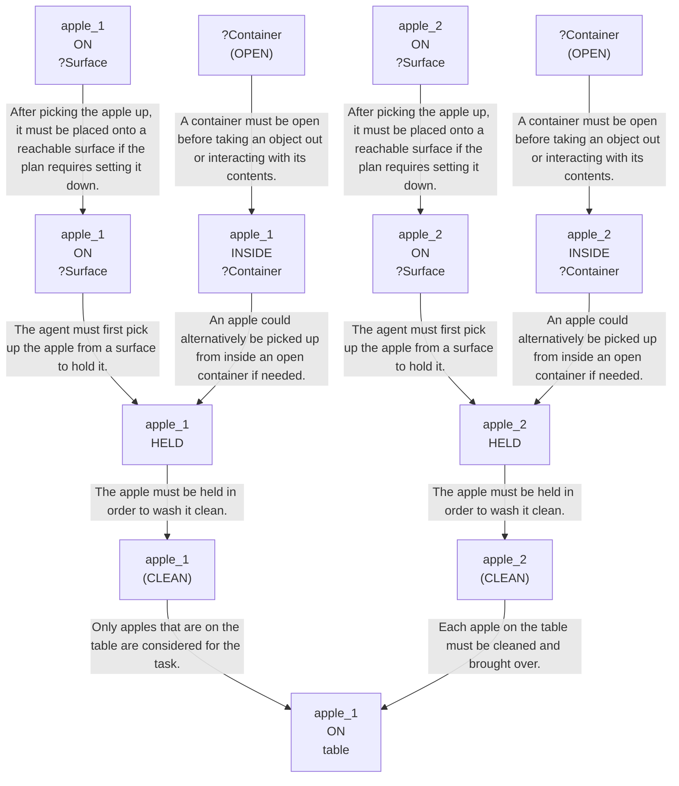
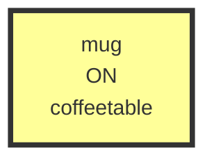
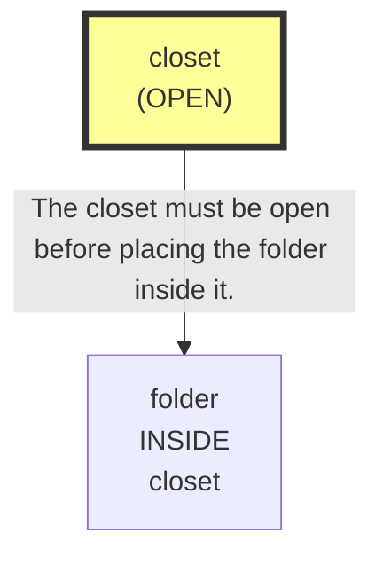
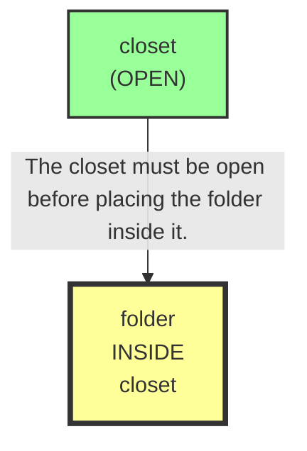
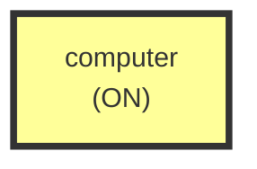

# 🚀 VirtualHome Agent Episode Log


### [GoalReasoner (Module A - Intent)] Output
```json
{
  "is_instruction_obviously_vague": false,
  "clarification_question": null,
  "target_object": "apples",
  "location_hint": "table",
  "reasoning_chain": [
    {
      "question": "Why does the user want this object?",
      "answer": "To have the apples cleaned and delivered to them."
    },
    {
      "question": "Why is that important?",
      "answer": "So the apples are ready to use or consume without needing further preparation."
    },
    {
      "question": "What fundamental need does this fulfill?",
      "answer": "It fulfills the need to obtain clean, usable food."
    },
    {
      "question": "Are there any deeper psychological or physical motivations?",
      "answer": "The primary motivation is likely practical convenience and hygiene, ensuring the fruit is safe and ready for immediate use."
    }
  ],
  "deep_intent": "The user wants clean, ready-to-use food delivered to them.",
  "acceptable_alternatives_properties": [
    {
      "priority": 1,
      "description": "Other washable fresh fruits, such as pears, grapes, or plums, that can be cleaned and brought over."
    },
    {
      "priority": 2,
      "description": "Other whole fresh produce items that can be rinsed and served, such as peaches or oranges."
    },
    {
      "priority": 3,
      "description": "Pre-washed fresh fruit or ready-to-eat produce items that provide similar convenience and hygiene."
    },
    {
      "priority": 4,
      "description": "Other ready-to-eat foods that do not require much preparation, if fresh fruit is unavailable."
    }
  ]
}
```

### [RoboStateMultiTaskController] Output
```json
{
  "action": "[walk] <bathroom> (11)",
  "active_task_id": "task_1",
  "task_context": {
    "active_task_id": "task_1",
    "pending_task_ids": [
      "task_2",
      "task_3",
      "task_4",
      "task_5",
      "task_6",
      "task_7"
    ],
    "satisfied_task_ids": []
  },
  "source": "room_frontier"
}
```
## Step 0
- **Action**: `[walk] <bathroom> (11)`
- **Action Success**: `True`
- **Action Message**: {'0': {'message': 'Success'}}
- **Active Task**: `task_1`
- **Decision Source**: `room_frontier`
- **Task Progress**: G1_02=pending, E1_11=pending, E1_03=pending, E1_17=pending, E1_07=pending, E1_01=pending, E1_15=pending
- **SDG Status**:

- **Observed Items (114)**: floor(206), floor(207), floor(208), floor(209), floor(210), floor(211), wall(212), wall(213), wall(214), wall(215), wall(216), wall(217), ceiling(218), ceiling(219), ceiling(220)...


### [RoboStateMultiTaskController] Output
```json
{
  "action": "[walk] <bedroom> (73)",
  "active_task_id": "task_1",
  "task_context": {
    "active_task_id": "task_1",
    "pending_task_ids": [
      "task_2",
      "task_3",
      "task_4",
      "task_5",
      "task_6",
      "task_7"
    ],
    "satisfied_task_ids": []
  },
  "source": "room_frontier"
}
```
## Step 1
- **Action**: `[walk] <bedroom> (73)`
- **Action Success**: `True`
- **Action Message**: {'0': {'message': 'Success'}}
- **Active Task**: `task_1`
- **Decision Source**: `room_frontier`
- **Task Progress**: G1_02=pending, E1_11=pending, E1_03=pending, E1_17=pending, E1_07=pending, E1_01=pending, E1_15=pending
- **SDG Status**:

- **Observed Items (175)**: floor(206), floor(207), floor(208), floor(209), floor(210), floor(211), wall(212), wall(213), wall(214), wall(215), wall(216), wall(217), ceiling(218), ceiling(219), ceiling(220)...


### [RoboStateMultiTaskController] Output
```json
{
  "action": "[walk] <livingroom> (335)",
  "active_task_id": "task_1",
  "task_context": {
    "active_task_id": "task_1",
    "pending_task_ids": [
      "task_2",
      "task_3",
      "task_4",
      "task_5",
      "task_6",
      "task_7"
    ],
    "satisfied_task_ids": []
  },
  "source": "room_frontier"
}
```
## Step 2
- **Action**: `[walk] <livingroom> (335)`
- **Action Success**: `True`
- **Action Message**: {'0': {'message': 'Success'}}
- **Active Task**: `task_1`
- **Decision Source**: `room_frontier`
- **Task Progress**: G1_02=pending, E1_11=pending, E1_03=pending, E1_17=pending, E1_07=pending, E1_01=pending, E1_15=pending
- **SDG Status**:

- **Observed Items (259)**: floor(206), floor(207), floor(208), floor(209), floor(210), floor(211), wall(212), wall(213), wall(214), wall(215), wall(216), wall(217), ceiling(218), ceiling(219), ceiling(220)...


### [GoalReasoner (Module A - Intent)] Output
```json
{
  "is_instruction_obviously_vague": true,
  "clarification_question": "Which specific book should I move, and where exactly is the sofa you want it brought to?",
  "target_object": "book",
  "location_hint": null,
  "reasoning_chain": [
    {
      "question": "Why does the user want this object?",
      "answer": "To move an unorganized book to the sofa."
    },
    {
      "question": "Why is that important?",
      "answer": "To relocate the book from an unorganized place to a specified resting place."
    },
    {
      "question": "What fundamental need does this fulfill?",
      "answer": "To organize or reposition a book into a more suitable location."
    },
    {
      "question": "Are there any deeper psychological or physical motivations?",
      "answer": "The user likely wants to tidy the environment by placing out-of-place reading material onto the sofa."
    }
  ],
  "deep_intent": "The user wants to organize misplaced reading material by moving it to a designated seating area.",
  "acceptable_alternatives_properties": [
    {
      "priority": 1,
      "description": "Other books or similarly sized reading materials that are similarly out of place"
    },
    {
      "priority": 2,
      "description": "Magazines, notebooks, or documents that function as reading materials"
    },
    {
      "priority": 3,
      "description": "Other small household items that can be tidied onto a seating area if the goal is general organization"
    },
    {
      "priority": 4,
      "description": "Any portable household item that can be relocated to reduce clutter"
    }
  ]
}
```

### [PerceptionFilter] Output
```json
{
  "reasoning": "The goal is to move a book onto a sofa. The SDG explicitly requires the book and the sofa, so both must be kept. No extra tools or containers are needed for simply relocating the item.",
  "selected_classes": [
    "book",
    "character",
    "sofa"
  ],
  "raw_class_count": 103
}
```

### [LLMExecutor] Output
```json
{
  "reasoning": "The active task is explicitly vague: there are multiple possible books, and the target sofa location is not uniquely specified beyond a general room. Per the clarification rule, I should ask before taking physical action. No SDG node can be progressed unambiguously until the user specifies which book and which sofa area/sofa instance to use.",
  "satisfied_nodes": [],
  "current_node_focus": "N1",
  "mapped_variables": {},
  "action": "[ask] Which specific book should I move, and where exactly is the sofa you want it brought to?"
}
```

### [RoboStateMultiTaskController] Output
```json
{
  "action": "[ask] Which specific book should I move, and where exactly is the sofa you want it brought to?",
  "active_task_id": "task_3",
  "task_context": {
    "active_task_id": "task_3",
    "pending_task_ids": [
      "task_1",
      "task_2",
      "task_4",
      "task_5",
      "task_6",
      "task_7"
    ],
    "satisfied_task_ids": []
  },
  "source": "llm_executor"
}
```
## Step 3
- **Action**: `[ask] Which specific book should I move, and where exactly is the sofa you want it brought to?`
- **Action Success**: `True`
- **Action Message**: nothing to claim
- **Active Task**: `task_3`
- **Decision Source**: `llm_executor`
- **Task Progress**: G1_02=pending, E1_11=pending, E1_03=pending, E1_17=pending, E1_07=pending, E1_01=pending, E1_15=pending
- **SDG Status**:

- **Observed Items (8)**: book(268) [CLOSED], character(1), bathroom(11), bedroom(73), kitchen(205), livingroom(335), book(190) [CLOSED], sofa(368)


### [PerceptionFilter] Output
```json
{
  "reasoning": "Reused cached class selection.",
  "selected_classes": [
    "book",
    "character",
    "sofa"
  ],
  "raw_class_count": 103
}
```

### [LLMExecutor] Output
```json
{
  "reasoning": "The task is vague, but clarification has already been received and [ask] is now forbidden. The SDG requires a book to be ON the sofa. There are two candidate books visible: book(268) in the kitchen and book(190) in the bedroom. The character is currently close to the sofa and also close to both books according to the graph, but we cannot safely complete the relocation without first choosing one book. Since the user asked for 'a book' and the graph shows both are movable and readable, I will bind the active book target to the currently closest visible candidate that is already in the same general area as the agent, book(268), and begin by moving to it to satisfy grab proximity requirements before picking it up.",
  "satisfied_nodes": [],
  "current_node_focus": "N1",
  "mapped_variables": {
    "?Book": "book(268)",
    "?Sofa": "sofa(368)"
  },
  "action": "[walk] <book> (268)"
}
```

### [RoboStateMultiTaskController] Output
```json
{
  "action": "[walk] <book> (268)",
  "active_task_id": "task_3",
  "task_context": {
    "active_task_id": "task_3",
    "pending_task_ids": [
      "task_1",
      "task_2",
      "task_4",
      "task_5",
      "task_6",
      "task_7"
    ],
    "satisfied_task_ids": []
  },
  "source": "llm_executor"
}
```
## Step 4
- **Action**: `[walk] <book> (268)`
- **Action Success**: `True`
- **Action Message**: {'0': {'message': 'Success'}}
- **Active Task**: `task_3`
- **Decision Source**: `llm_executor`
- **Task Progress**: G1_02=pending, E1_11=pending, E1_03=pending, E1_17=pending, E1_07=pending, E1_01=pending, E1_15=pending
- **SDG Status**:

- **Observed Items (8)**: book(268) [CLOSED], character(1), bathroom(11), bedroom(73), kitchen(205), livingroom(335), book(190) [CLOSED], sofa(368)


### [PerceptionFilter] Output
```json
{
  "reasoning": "Reused cached class selection.",
  "selected_classes": [
    "book",
    "character",
    "sofa"
  ],
  "raw_class_count": 103
}
```

### [LLMExecutor] Output
```json
{
  "reasoning": "The task is now clarified as a specific physical move: place the selected book onto the sofa. The current graph shows book(268) is close to the character in the kitchen, and sofa(368) is close to the character in the livingroom. Since I already walked to book(268) in the previous step, I should now grab that book before transporting it to the sofa. This is the required next atomic step toward satisfying N1 (book ON sofa).",
  "satisfied_nodes": [],
  "current_node_focus": "N1",
  "mapped_variables": {
    "?Book": "book(268)",
    "?Sofa": "sofa(368)"
  },
  "action": "[grab] <book> (268)"
}
```

### [RoboStateMultiTaskController] Output
```json
{
  "action": "[grab] <book> (268)",
  "active_task_id": "task_3",
  "task_context": {
    "active_task_id": "task_3",
    "pending_task_ids": [
      "task_1",
      "task_2",
      "task_4",
      "task_5",
      "task_6",
      "task_7"
    ],
    "satisfied_task_ids": []
  },
  "source": "llm_executor"
}
```
## Step 5
- **Action**: `[grab] <book> (268)`
- **Action Success**: `True`
- **Action Message**: {'0': {'message': 'Success'}}
- **Active Task**: `task_3`
- **Decision Source**: `llm_executor`
- **Task Progress**: G1_02=pending, E1_11=pending, E1_03=pending, E1_17=pending, E1_07=pending, E1_01=pending, E1_15=pending
- **SDG Status**:

- **Observed Items (8)**: book(268) [CLOSED], character(1), bathroom(11), bedroom(73), kitchen(205), livingroom(335), book(190) [CLOSED], sofa(368)


### [PerceptionFilter] Output
```json
{
  "reasoning": "Reused cached class selection.",
  "selected_classes": [
    "book",
    "character",
    "sofa"
  ],
  "raw_class_count": 103
}
```

### [LLMExecutor] Output
```json
{
  "reasoning": "The target is still unsatisfied: the held book(268) is not yet on the sofa(368). We are already close to the sofa and holding the correct book, so the next required atomic step is to place it onto the sofa surface. The sofa is a flat surface, so [putback] is the correct action, not [putin].",
  "satisfied_nodes": [],
  "current_node_focus": "N1",
  "mapped_variables": {
    "?Book": "book(268)",
    "?Sofa": "sofa(368)"
  },
  "action": "[putback] <book> (268) <sofa> (368)"
}
```

### [RoboStateMultiTaskController] Output
```json
{
  "action": "[putback] <book> (268) <sofa> (368)",
  "active_task_id": "task_3",
  "task_context": {
    "active_task_id": "task_3",
    "pending_task_ids": [
      "task_1",
      "task_2",
      "task_4",
      "task_5",
      "task_6",
      "task_7"
    ],
    "satisfied_task_ids": []
  },
  "source": "llm_executor"
}
```
## Step 6
- **Action**: `[putback] <book> (268) <sofa> (368)`
- **Action Success**: `True`
- **Action Message**: {'0': {'message': 'Success'}}
- **Active Task**: `task_3`
- **Decision Source**: `llm_executor`
- **Task Progress**: G1_02=pending, E1_11=pending, E1_03=done, E1_17=pending, E1_07=pending, E1_01=pending, E1_15=pending
- **SDG Status**:

- **Observed Items (8)**: book(268) [CLOSED], character(1), bathroom(11), bedroom(73), kitchen(205), livingroom(335), book(190) [CLOSED], sofa(368)


### [GoalReasoner (Module A - Intent)] Output
```json
{
  "is_instruction_obviously_vague": false,
  "clarification_question": null,
  "target_object": "mug",
  "location_hint": "coffeetable",
  "reasoning_chain": [
    {
      "question": "Why does the user want this object?",
      "answer": "The user wants the mug to remain located on the coffeetable."
    },
    {
      "question": "Why is that important?",
      "answer": "They likely want the mug to be kept in a specific place and not moved elsewhere."
    },
    {
      "question": "What fundamental need does this fulfill?",
      "answer": "It fulfills the need to maintain the mug in a fixed, desired location."
    },
    {
      "question": "Are there any deeper psychological or physical motivations?",
      "answer": "Possible motivations include convenience, organization, or making the mug easy to find and use."
    }
  ],
  "deep_intent": "The user wants an item to be kept in a specific location.",
  "acceptable_alternatives_properties": [
    {
      "priority": 1,
      "description": "Other drink containers or cups kept on the coffee table if the exact mug is unavailable."
    },
    {
      "priority": 2,
      "description": "Similar handheld beverage containers such as glasses, tumblers, or cups."
    },
    {
      "priority": 3,
      "description": "Other small personal items that can be kept in a fixed place on the coffee table."
    },
    {
      "priority": 4,
      "description": "Any household object that the user wants to remain on the coffee table."
    }
  ]
}
```

### [PerceptionFilter] Output
```json
{
  "reasoning": "The goal is to keep the mug on the coffeetable, so the only strictly necessary classes are the target object and the required location surface. No tools or alternatives are needed beyond the exact mentioned classes.",
  "selected_classes": [
    "mug",
    "character",
    "coffeetable"
  ],
  "raw_class_count": 103
}
```

### [LLMExecutor] Output
```json
{
  "reasoning": "The active SDG requires a mug to be ON a coffeetable. Two mug instances are visible: mug(194) is inside the kitchen and mug(447) is inside the livingroom. Since the character is currently in the livingroom and is already CLOSE to coffeetable(371), the most direct candidate is mug(447). The next required step is to get to the mug before grabbing it; we are not yet holding it, so the correct autonomous action is to walk to mug(447).",
  "satisfied_nodes": [],
  "current_node_focus": "N1",
  "mapped_variables": {},
  "action": "[walk] <mug> (447)"
}
```

### [RoboStateMultiTaskController] Output
```json
{
  "action": "[walk] <mug> (447)",
  "active_task_id": "task_5",
  "task_context": {
    "active_task_id": "task_5",
    "pending_task_ids": [
      "task_1",
      "task_2",
      "task_4",
      "task_6",
      "task_7"
    ],
    "satisfied_task_ids": [
      "task_3"
    ]
  },
  "source": "llm_executor"
}
```
## Step 7
- **Action**: `[walk] <mug> (447)`
- **Action Success**: `True`
- **Action Message**: {'0': {'message': 'Success'}}
- **Active Task**: `task_5`
- **Decision Source**: `llm_executor`
- **Task Progress**: G1_02=pending, E1_11=pending, E1_03=done, E1_17=pending, E1_07=pending, E1_01=pending, E1_15=pending
- **SDG Status**:

- **Observed Items (9)**: mug(194), character(1), bathroom(11), bedroom(73), kitchen(205), livingroom(335), coffeetable(111), coffeetable(371), mug(447)


### [PerceptionFilter] Output
```json
{
  "reasoning": "Reused cached class selection.",
  "selected_classes": [
    "mug",
    "character",
    "coffeetable"
  ],
  "raw_class_count": 103
}
```

### [LLMExecutor] Output
```json
{
  "reasoning": "The active SDG requires mug ON coffeetable. There are two mug instances; the one currently close to the character is mug(447) in the livingroom, and the relevant coffee table in that same room is coffeetable(371). Since the last action was already [walk] to mug(447), I should not repeat that walk. The next required step is to grab the mug before moving it onto the coffee table.",
  "satisfied_nodes": [],
  "current_node_focus": "N1",
  "mapped_variables": {
    "?Object": "mug(447)",
    "?Target": "coffeetable(371)"
  },
  "action": "[grab] <mug> (447)"
}
```

### [RoboStateMultiTaskController] Output
```json
{
  "action": "[grab] <mug> (447)",
  "active_task_id": "task_5",
  "task_context": {
    "active_task_id": "task_5",
    "pending_task_ids": [
      "task_1",
      "task_2",
      "task_4",
      "task_6",
      "task_7"
    ],
    "satisfied_task_ids": [
      "task_3"
    ]
  },
  "source": "llm_executor"
}
```
## Step 8
- **Action**: `[grab] <mug> (447)`
- **Action Success**: `True`
- **Action Message**: {'0': {'message': 'Success'}}
- **Active Task**: `task_5`
- **Decision Source**: `llm_executor`
- **Task Progress**: G1_02=pending, E1_11=pending, E1_03=done, E1_17=pending, E1_07=pending, E1_01=pending, E1_15=pending
- **SDG Status**:

- **Observed Items (9)**: mug(194), character(1), bathroom(11), bedroom(73), kitchen(205), livingroom(335), coffeetable(111), coffeetable(371), mug(447)


### [PerceptionFilter] Output
```json
{
  "reasoning": "Reused cached class selection.",
  "selected_classes": [
    "mug",
    "character",
    "coffeetable"
  ],
  "raw_class_count": 103
}
```

### [LLMExecutor] Output
```json
{
  "reasoning": "The active goal is to keep a mug on the coffeetable. The current graph shows mug(447) is already held by the character and the character is in the livingroom, while coffeetable(371) is the coffee table in the livingroom. To progress toward N1, I should move to the destination surface before placing the held mug there. Since the immediate state gap is proximity to coffeetable(371) for a putback action, the next atomic action is to walk to that specific table.",
  "satisfied_nodes": [],
  "current_node_focus": "N1",
  "mapped_variables": {
    "?TargetSurface": "coffeetable(371)"
  },
  "action": "[walk] <coffeetable> (371)"
}
```

### [RoboStateMultiTaskController] Output
```json
{
  "action": "[walk] <coffeetable> (371)",
  "active_task_id": "task_5",
  "task_context": {
    "active_task_id": "task_5",
    "pending_task_ids": [
      "task_1",
      "task_2",
      "task_4",
      "task_6",
      "task_7"
    ],
    "satisfied_task_ids": [
      "task_3"
    ]
  },
  "source": "llm_executor"
}
```
## Step 9
- **Action**: `[walk] <coffeetable> (371)`
- **Action Success**: `True`
- **Action Message**: {'0': {'message': 'Success'}}
- **Active Task**: `task_5`
- **Decision Source**: `llm_executor`
- **Task Progress**: G1_02=pending, E1_11=pending, E1_03=done, E1_17=pending, E1_07=pending, E1_01=pending, E1_15=pending
- **SDG Status**:

- **Observed Items (9)**: mug(194), character(1), bathroom(11), bedroom(73), kitchen(205), livingroom(335), coffeetable(111), coffeetable(371), mug(447)


### [PerceptionFilter] Output
```json
{
  "reasoning": "Reused cached class selection.",
  "selected_classes": [
    "mug",
    "character",
    "coffeetable"
  ],
  "raw_class_count": 103
}
```

### [LLMExecutor] Output
```json
{
  "reasoning": "The active goal is to have the mug on the coffeetable. The current graph shows I am already holding mug(447), and I am already close to coffeetable(371), which is the required target surface. The only remaining step is to place the held mug onto the coffee table. This satisfies N1 directly.",
  "satisfied_nodes": [],
  "current_node_focus": "N1",
  "mapped_variables": {
    "?Mug": "mug(447)",
    "?TargetSurface": "coffeetable(371)"
  },
  "action": "[putback] <mug> (447) <coffeetable> (371)"
}
```

### [RoboStateMultiTaskController] Output
```json
{
  "action": "[putback] <mug> (447) <coffeetable> (371)",
  "active_task_id": "task_5",
  "task_context": {
    "active_task_id": "task_5",
    "pending_task_ids": [
      "task_1",
      "task_2",
      "task_4",
      "task_6",
      "task_7"
    ],
    "satisfied_task_ids": [
      "task_3"
    ]
  },
  "source": "llm_executor"
}
```
## Step 10
- **Action**: `[putback] <mug> (447) <coffeetable> (371)`
- **Action Success**: `True`
- **Action Message**: {'0': {'message': 'Success'}}
- **Active Task**: `task_5`
- **Decision Source**: `llm_executor`
- **Task Progress**: G1_02=pending, E1_11=pending, E1_03=done, E1_17=pending, E1_07=done, E1_01=pending, E1_15=pending
- **SDG Status**:

- **Observed Items (9)**: mug(194), character(1), bathroom(11), bedroom(73), kitchen(205), livingroom(335), coffeetable(111), coffeetable(371), mug(447)


### [GoalReasoner (Module A - Intent)] Output
```json
{
  "is_instruction_obviously_vague": false,
  "clarification_question": null,
  "target_object": "folder",
  "location_hint": "closet",
  "reasoning_chain": [
    {
      "question": "Why does the user want this object?",
      "answer": "To move the folder into storage or out of the current area."
    },
    {
      "question": "Why is that important?",
      "answer": "To organize the space, keep the folder out of the way, or store it where documents are kept."
    },
    {
      "question": "What fundamental need does this fulfill?",
      "answer": "It fulfills the need to organize and store a document-related item."
    },
    {
      "question": "Are there any deeper psychological or physical motivations?",
      "answer": "The user may want a tidier environment, easier retrieval later, or protection of the folder from clutter or damage."
    }
  ],
  "deep_intent": "The user wants to organize or store a document-related item.",
  "acceptable_alternatives_properties": [
    {
      "priority": 1,
      "description": "Other document storage containers or paper organizers, such as a file, binder, or envelope"
    },
    {
      "priority": 2,
      "description": "Other paper-based organizational items that can be stored similarly, such as notebooks or loose papers"
    },
    {
      "priority": 3,
      "description": "Other small office or household items meant for storage and tidying, such as magazines or manuals"
    },
    {
      "priority": 4,
      "description": "Other portable items that can be put away in a closet to reduce clutter, such as books or folders of another type"
    }
  ]
}
```

### [PerceptionFilter] Output
```json
{
  "reasoning": "The goal is to place the target folder inside the closet, and the SDG requires the closet to be open first. Only the target object and the required location/state-related object are necessary.",
  "selected_classes": [
    "book",
    "closet",
    "folder",
    "paper",
    "character"
  ],
  "raw_class_count": 103
}
```

### [LLMExecutor] Output
```json
{
  "reasoning": "The active goal is to place a folder inside a closet, and the relevant closet candidate in the current room is closet(374), but it is CLOSED. Since the folder is not yet held and the closet must be open before placing anything inside, the next necessary step is to walk to the closet so it can be opened next. I will focus on satisfying the closet-open prerequisite first.",
  "satisfied_nodes": [],
  "current_node_focus": "N2",
  "mapped_variables": {
    "?Container": "closet(374)"
  },
  "action": "[walk] <closet> (374)"
}
```

### [RoboStateMultiTaskController] Output
```json
{
  "action": "[walk] <closet> (374)",
  "active_task_id": "task_7",
  "task_context": {
    "active_task_id": "task_7",
    "pending_task_ids": [
      "task_1",
      "task_2",
      "task_4",
      "task_6"
    ],
    "satisfied_task_ids": [
      "task_3",
      "task_5"
    ]
  },
  "source": "llm_executor"
}
```
## Step 11
- **Action**: `[walk] <closet> (374)`
- **Action Success**: `True`
- **Action Message**: {'0': {'message': 'Success'}}
- **Active Task**: `task_7`
- **Decision Source**: `llm_executor`
- **Task Progress**: G1_02=pending, E1_11=pending, E1_03=done, E1_17=pending, E1_07=done, E1_01=pending, E1_15=pending
- **SDG Status**:

- **Observed Items (13)**: book(268) [CLOSED], character(1), bathroom(11), bedroom(73), kitchen(205), livingroom(335), closet(112) [OPEN], closet(127) [CLOSED], book(190) [CLOSED], folder(203) [CLOSED], closet(374) [CLOSED], paper(451), folder(453) [CLOSED]


### [PerceptionFilter] Output
```json
{
  "reasoning": "Reused cached class selection.",
  "selected_classes": [
    "book",
    "closet",
    "folder",
    "paper",
    "character"
  ],
  "raw_class_count": 103
}
```

### [LLMExecutor] Output
```json
{
  "reasoning": "The active goal is to place a folder inside the closet, and the closet must be open first. We are already close to closet(374) from the previous step, but it is currently CLOSED. Opening it is the necessary next step before any putin action. The target folder can be selected later from the nearby available folders, but the immediate unmet prerequisite is the closet state.",
  "satisfied_nodes": [],
  "current_node_focus": "N2",
  "mapped_variables": {
    "?Container": "closet(374)"
  },
  "action": "[open] <closet> (374)"
}
```

### [RoboStateMultiTaskController] Output
```json
{
  "action": "[open] <closet> (374)",
  "active_task_id": "task_7",
  "task_context": {
    "active_task_id": "task_7",
    "pending_task_ids": [
      "task_1",
      "task_2",
      "task_4",
      "task_6"
    ],
    "satisfied_task_ids": [
      "task_3",
      "task_5"
    ]
  },
  "source": "llm_executor"
}
```
## Step 12
- **Action**: `[open] <closet> (374)`
- **Action Success**: `False`
- **Action Message**: {'0': {'message': 'ScriptExcutor 0: EXECUTION_GENERAL: Script is impossible to execute\n\n'}}
- **Active Task**: `task_7`
- **Decision Source**: `llm_executor`
- **Task Progress**: G1_02=pending, E1_11=pending, E1_03=done, E1_17=pending, E1_07=done, E1_01=pending, E1_15=pending
- **SDG Status**:

- **Observed Items (13)**: book(268) [CLOSED], character(1), bathroom(11), bedroom(73), kitchen(205), livingroom(335), closet(112) [OPEN], closet(127) [CLOSED], book(190) [CLOSED], folder(203) [CLOSED], closet(374) [CLOSED], paper(451), folder(453) [CLOSED]


### [PerceptionFilter] Output
```json
{
  "reasoning": "Reused cached class selection.",
  "selected_classes": [
    "book",
    "closet",
    "folder",
    "paper",
    "character"
  ],
  "raw_class_count": 103
}
```

### [LLMExecutor] Output
```json
{
  "reasoning": "The active goal is to place a folder inside a closet, and the SDG requires the closet to be open first. The previously attempted closet(374) failed to open because it is impossible to execute, so I should switch to a different closet candidate that is already OPEN. In the current graph, closet(112) is OPEN and is in the bedroom; it is the best available target container for satisfying the INSIDE(folder, closet) goal. Since I am currently in the livingroom and not near closet(112), the next atomic step must be to walk to that open closet before any put-in action.",
  "satisfied_nodes": [],
  "current_node_focus": "N2",
  "mapped_variables": {
    "?Container": "closet(112)"
  },
  "action": "[walk] <closet> (112)"
}
```

### [RoboStateMultiTaskController] Output
```json
{
  "action": "[walk] <closet> (112)",
  "active_task_id": "task_7",
  "task_context": {
    "active_task_id": "task_7",
    "pending_task_ids": [
      "task_1",
      "task_2",
      "task_4",
      "task_6"
    ],
    "satisfied_task_ids": [
      "task_3",
      "task_5"
    ]
  },
  "source": "llm_executor"
}
```
## Step 13
- **Action**: `[walk] <closet> (112)`
- **Action Success**: `True`
- **Action Message**: {'0': {'message': 'Success'}}
- **Active Task**: `task_7`
- **Decision Source**: `llm_executor`
- **Task Progress**: G1_02=pending, E1_11=pending, E1_03=done, E1_17=pending, E1_07=done, E1_01=pending, E1_15=pending
- **SDG Status**:

- **Observed Items (13)**: book(268) [CLOSED], character(1), bathroom(11), bedroom(73), kitchen(205), livingroom(335), closet(112) [OPEN], closet(127) [CLOSED], book(190) [CLOSED], folder(203) [CLOSED], closet(374) [CLOSED], paper(451), folder(453) [CLOSED]


### [PerceptionFilter] Output
```json
{
  "reasoning": "Reused cached class selection.",
  "selected_classes": [
    "book",
    "closet",
    "folder",
    "paper",
    "character"
  ],
  "raw_class_count": 103
}
```

### [LLMExecutor] Output
```json
{
  "reasoning": "The active task is to place a folder inside a closet. The current graph shows closet(112) is OPEN and the character is already CLOSE to closet(112), so the prerequisite state N2 is satisfied. The folder that best matches the goal and is currently accessible is folder(203) in the bedroom. Since we are already positioned at the open closet, the next step is to move to the folder so it can later be grabbed and put inside the open closet.",
  "satisfied_nodes": [
    "N2"
  ],
  "current_node_focus": "N1",
  "mapped_variables": {
    "?Container": "closet(112)",
    "?Folder": "folder(203)"
  },
  "action": "[walk] <folder> (203)"
}
```

### [RoboStateMultiTaskController] Output
```json
{
  "action": "[walk] <folder> (203)",
  "active_task_id": "task_7",
  "task_context": {
    "active_task_id": "task_7",
    "pending_task_ids": [
      "task_1",
      "task_2",
      "task_4",
      "task_6"
    ],
    "satisfied_task_ids": [
      "task_3",
      "task_5"
    ]
  },
  "source": "llm_executor"
}
```
## Step 14
- **Action**: `[walk] <folder> (203)`
- **Action Success**: `True`
- **Action Message**: {'0': {'message': 'Success'}}
- **Active Task**: `task_7`
- **Decision Source**: `llm_executor`
- **Task Progress**: G1_02=pending, E1_11=pending, E1_03=done, E1_17=pending, E1_07=done, E1_01=pending, E1_15=pending
- **SDG Status**:

- **Observed Items (13)**: book(268) [CLOSED], character(1), bathroom(11), bedroom(73), kitchen(205), livingroom(335), closet(112) [OPEN], closet(127) [CLOSED], book(190) [CLOSED], folder(203) [CLOSED], closet(374) [CLOSED], paper(451), folder(453) [CLOSED]


### [PerceptionFilter] Output
```json
{
  "reasoning": "Reused cached class selection.",
  "selected_classes": [
    "book",
    "closet",
    "folder",
    "paper",
    "character"
  ],
  "raw_class_count": 103
}
```

### [LLMExecutor] Output
```json
{
  "reasoning": "The active goal is to place a folder inside the closet, and the SDG requires the closet to be OPEN first. The current graph shows closet(112) is already OPEN, satisfying N2. The target folder candidate closest to the character is folder(203) in the bedroom, and the character is already CLOSE folder(203). Since the closet is open and we are near the folder, the next step toward satisfying N1 is to grab the folder before walking it to the closet and putting it inside.",
  "satisfied_nodes": [
    "N2"
  ],
  "current_node_focus": "N1",
  "mapped_variables": {
    "?Container": "closet(112)"
  },
  "action": "[grab] <folder> (203)"
}
```

### [RoboStateMultiTaskController] Output
```json
{
  "action": "[grab] <folder> (203)",
  "active_task_id": "task_7",
  "task_context": {
    "active_task_id": "task_7",
    "pending_task_ids": [
      "task_1",
      "task_2",
      "task_4",
      "task_6"
    ],
    "satisfied_task_ids": [
      "task_3",
      "task_5"
    ]
  },
  "source": "llm_executor"
}
```
## Step 15
- **Action**: `[grab] <folder> (203)`
- **Action Success**: `True`
- **Action Message**: {'0': {'message': 'Success'}}
- **Active Task**: `task_7`
- **Decision Source**: `llm_executor`
- **Task Progress**: G1_02=pending, E1_11=pending, E1_03=done, E1_17=pending, E1_07=done, E1_01=pending, E1_15=pending
- **SDG Status**:

- **Observed Items (13)**: book(268) [CLOSED], character(1), bathroom(11), bedroom(73), kitchen(205), livingroom(335), closet(112) [OPEN], closet(127) [CLOSED], book(190) [CLOSED], folder(203) [CLOSED], closet(374) [CLOSED], paper(451), folder(453) [CLOSED]


### [PerceptionFilter] Output
```json
{
  "reasoning": "Reused cached class selection.",
  "selected_classes": [
    "book",
    "closet",
    "folder",
    "paper",
    "character"
  ],
  "raw_class_count": 103
}
```

### [LLMExecutor] Output
```json
{
  "reasoning": "The active task is to place the folder inside a closet, and the SDG requires the closet to be open first. We already successfully grabbed folder(203), and the graph shows closet(112) is OPEN and in the same bedroom, while the character is holding the folder. The next necessary step is to move to the open closet so we can put the folder inside it on the following action.",
  "satisfied_nodes": [
    "N2"
  ],
  "current_node_focus": "N1",
  "mapped_variables": {
    "?Container": "closet(112)"
  },
  "action": "[walk] <closet> (112)"
}
```

### [RoboStateMultiTaskController] Output
```json
{
  "action": "[walk] <closet> (112)",
  "active_task_id": "task_7",
  "task_context": {
    "active_task_id": "task_7",
    "pending_task_ids": [
      "task_1",
      "task_2",
      "task_4",
      "task_6"
    ],
    "satisfied_task_ids": [
      "task_3",
      "task_5"
    ]
  },
  "source": "llm_executor"
}
```
## Step 16
- **Action**: `[walk] <closet> (112)`
- **Action Success**: `True`
- **Action Message**: {'0': {'message': 'Success'}}
- **Active Task**: `task_7`
- **Decision Source**: `llm_executor`
- **Task Progress**: G1_02=pending, E1_11=pending, E1_03=done, E1_17=pending, E1_07=done, E1_01=pending, E1_15=pending
- **SDG Status**:

- **Observed Items (13)**: book(268) [CLOSED], character(1), bathroom(11), bedroom(73), kitchen(205), livingroom(335), closet(112) [OPEN], closet(127) [CLOSED], book(190) [CLOSED], folder(203) [CLOSED], closet(374) [CLOSED], paper(451), folder(453) [CLOSED]


### [PerceptionFilter] Output
```json
{
  "reasoning": "Reused cached class selection.",
  "selected_classes": [
    "book",
    "closet",
    "folder",
    "paper",
    "character"
  ],
  "raw_class_count": 103
}
```

### [LLMExecutor] Output
```json
{
  "reasoning": "The active task is to place folder(203) inside closet(112). We are already holding the folder and are already close to closet(112), which is OPEN, so the only remaining gap for N1 is to put the folder into the closet. N2 is already satisfied. No need to interact with the other closet instance.",
  "satisfied_nodes": [
    "N2"
  ],
  "current_node_focus": "N1",
  "mapped_variables": {
    "?Container": "closet(112)"
  },
  "action": "[putin] <folder> (203) <closet> (112)"
}
```

### [RoboStateMultiTaskController] Output
```json
{
  "action": "[putin] <folder> (203) <closet> (112)",
  "active_task_id": "task_7",
  "task_context": {
    "active_task_id": "task_7",
    "pending_task_ids": [
      "task_1",
      "task_2",
      "task_4",
      "task_6"
    ],
    "satisfied_task_ids": [
      "task_3",
      "task_5"
    ]
  },
  "source": "llm_executor"
}
```
## Step 17
- **Action**: `[putin] <folder> (203) <closet> (112)`
- **Action Success**: `True`
- **Action Message**: {'0': {'message': 'Success'}}
- **Active Task**: `task_7`
- **Decision Source**: `llm_executor`
- **Task Progress**: G1_02=pending, E1_11=pending, E1_03=done, E1_17=pending, E1_07=done, E1_01=pending, E1_15=done
- **SDG Status**:

- **Observed Items (13)**: book(268) [CLOSED], character(1), bathroom(11), bedroom(73), kitchen(205), livingroom(335), closet(112) [OPEN], closet(127) [CLOSED], book(190) [CLOSED], folder(203) [CLOSED], closet(374) [CLOSED], paper(451), folder(453) [CLOSED]


### [GoalReasoner (Module A - Intent)] Output
```json
{
  "is_instruction_obviously_vague": false,
  "clarification_question": null,
  "target_object": "computer",
  "location_hint": null,
  "reasoning_chain": [
    {
      "question": "Why does the user want this object?",
      "answer": "To ensure the computer is powered on."
    },
    {
      "question": "Why is that important?",
      "answer": "So the computer can be used or remain operational."
    },
    {
      "question": "What fundamental need does this fulfill?",
      "answer": "It fulfills the need to access and use a working computing device."
    },
    {
      "question": "Are there any deeper psychological or physical motivations?",
      "answer": "The user likely wants to continue a task, maintain device availability, or avoid interruption caused by the computer remaining off."
    }
  ],
  "deep_intent": "The user wants to ensure a computer is powered on and available for use.",
  "acceptable_alternatives_properties": [
    {
      "priority": 1,
      "description": "Another working computer or similar computing device that can be turned on and used"
    },
    {
      "priority": 2,
      "description": "A laptop, desktop, or tablet that can provide computing access"
    },
    {
      "priority": 3,
      "description": "Any powered-on electronic device that can support the same immediate task, if the original computer is unavailable"
    },
    {
      "priority": 4,
      "description": "A shared household computer or other indoor device with comparable functionality for the task"
    }
  ]
}
```

### [PerceptionFilter] Output
```json
{
  "reasoning": "The goal is to ensure the computer is powered on, so the only strictly necessary object class is the computer itself. No location, alternate tool, or support appliance is explicitly required by the SDG beyond the computer being ON.",
  "selected_classes": [
    "computer",
    "character",
    "door",
    "desk"
  ],
  "raw_class_count": 103
}
```

### [LLMExecutor] Output
```json
{
  "reasoning": "The active goal is to make a computer ON. In the current graph there are two available computers, both OFF: computer(174) in the bedroom and computer(433) in the livingroom. Since I am already inside the bedroom, the closest valid target is computer(174). To turn it on, I must be near it first; no plug-in is required because it only has HAS_SWITCH, not HAS_PLUG. The next atomic step is to walk to the bedroom computer.",
  "satisfied_nodes": [],
  "current_node_focus": "N1",
  "mapped_variables": {
    "?Computer": "computer(174)"
  },
  "action": "[walk] <computer> (174)"
}
```

### [RoboStateMultiTaskController] Output
```json
{
  "action": "[walk] <computer> (174)",
  "active_task_id": "task_2",
  "task_context": {
    "active_task_id": "task_2",
    "pending_task_ids": [
      "task_1",
      "task_4",
      "task_6"
    ],
    "satisfied_task_ids": [
      "task_3",
      "task_5",
      "task_7"
    ]
  },
  "source": "llm_executor"
}
```
## Step 18
- **Action**: `[walk] <computer> (174)`
- **Action Success**: `True`
- **Action Message**: {'0': {'message': 'Success'}}
- **Active Task**: `task_2`
- **Decision Source**: `llm_executor`
- **Task Progress**: G1_02=pending, E1_11=pending, E1_03=done, E1_17=pending, E1_07=done, E1_01=pending, E1_15=done
- **SDG Status**:

- **Observed Items (11)**: door(224) [OPEN], character(1), bathroom(11), bedroom(73), kitchen(205), livingroom(335), door(51) [OPEN], desk(108) [CLOSED], computer(174) [OFF], desk(373) [CLOSED], computer(433) [OFF]


### [PerceptionFilter] Output
```json
{
  "reasoning": "Reused cached class selection.",
  "selected_classes": [
    "computer",
    "character",
    "door",
    "desk"
  ],
  "raw_class_count": 103
}
```

### [LLMExecutor] Output
```json
{
  "reasoning": "The active task is to ensure a computer is powered on. In the current graph, the closest valid target is computer(174) in the bedroom and it is already CLOSE to the character, but it is OFF. Since it has HAS_SWITCH and no plug requirement is shown, the next required step is to switch it on. We are already near it, so no walk is needed. The alternative computer(433) is farther away and unnecessary.",
  "satisfied_nodes": [],
  "current_node_focus": "N1",
  "mapped_variables": {
    "?Computer": "computer(174)"
  },
  "action": "[switchon] <computer> (174)"
}
```

### [RoboStateMultiTaskController] Output
```json
{
  "action": "[switchon] <computer> (174)",
  "active_task_id": "task_2",
  "task_context": {
    "active_task_id": "task_2",
    "pending_task_ids": [
      "task_1",
      "task_4",
      "task_6"
    ],
    "satisfied_task_ids": [
      "task_3",
      "task_5",
      "task_7"
    ]
  },
  "source": "llm_executor"
}
```
## Step 19
- **Action**: `[switchon] <computer> (174)`
- **Action Success**: `True`
- **Action Message**: Faked switch operation in Python layer (bypassed Unity failure)
- **Active Task**: `task_2`
- **Decision Source**: `llm_executor`
- **Task Progress**: G1_02=pending, E1_11=done, E1_03=done, E1_17=pending, E1_07=done, E1_01=pending, E1_15=done
- **SDG Status**:

- **Observed Items (11)**: door(224) [OPEN], character(1), bathroom(11), bedroom(73), kitchen(205), livingroom(335), door(51) [OPEN], desk(108) [CLOSED], computer(174) [OFF], desk(373) [CLOSED], computer(433) [OFF]


### [GoalReasoner (Module A - Intent)] Output
```json
{
  "is_instruction_obviously_vague": true,
  "clarification_question": "What should the TV be turned on to, and for what purpose?",
  "target_object": "TV",
  "location_hint": null,
  "reasoning_chain": [
    {
      "question": "Why does the user want this object?",
      "answer": "To have the television turned on when no one is watching it."
    },
    {
      "question": "Why is that important?",
      "answer": "The user likely wants the TV to be active under a specific condition, but the exact desired state or purpose is not fully defined."
    },
    {
      "question": "What fundamental need does this fulfill?",
      "answer": "It may be intended to provide entertainment, background audio/visual activity, or remote monitoring/energy management."
    },
    {
      "question": "Are there any deeper psychological or physical motivations?",
      "answer": "Possibly comfort, habit, keeping the room occupied, or ensuring the device is in a desired operating state."
    }
  ],
  "deep_intent": "The user wants a television to be in an active state under certain conditions.",
  "acceptable_alternatives_properties": [
    {
      "priority": 1,
      "description": "Other indoor display devices that can be powered on, such as a monitor or projector."
    },
    {
      "priority": 2,
      "description": "Other media playback devices that can provide similar audio/visual activity, such as a tablet or smart speaker with a screen."
    },
    {
      "priority": 3,
      "description": "Other household electronics that can remain active for background presence, such as a radio or computer."
    },
    {
      "priority": 4,
      "description": "Other sources of ambient activity or sound, such as a music player, if the goal is background stimulation rather than the TV specifically."
    }
  ]
}
```

### [PerceptionFilter] Output
```json
{
  "reasoning": "The goal is to turn on the TV, so the only strictly necessary class is the TV itself. No alternative display/device is required because the SDG targets TV specifically, and no tools or locations are needed to identify it for this task.",
  "selected_classes": [
    "character",
    "tv",
    "computer",
    "pie",
    "door"
  ],
  "raw_class_count": 103
}
```

### [LLMExecutor] Output
```json
{
  "reasoning": "The active task is to get a TV into the ON state, but the SDG includes a prerequisite that no human is watching TV. The filtered graph shows the character is currently close to a computer in the bedroom, and the TVs are in other rooms, so there is no evidence anyone is watching either TV right now. Since the target TV (tv 264) is already OFF, the next needed step is to move to that TV before any interaction can occur. The TV has HAS_SWITCH and HAS_PLUG, so after reaching it we can switch it on.",
  "satisfied_nodes": [
    "N2",
    "N3"
  ],
  "current_node_focus": "N1",
  "mapped_variables": {
    "?TV": "tv(264)"
  },
  "action": "[walk] <tv> (264)"
}
```

### [RoboStateMultiTaskController] Output
```json
{
  "action": "[walk] <tv> (264)",
  "active_task_id": "task_6",
  "task_context": {
    "active_task_id": "task_6",
    "pending_task_ids": [
      "task_1",
      "task_4"
    ],
    "satisfied_task_ids": [
      "task_2",
      "task_3",
      "task_5",
      "task_7"
    ]
  },
  "source": "llm_executor"
}
```
## Step 20
- **Action**: `[walk] <tv> (264)`
- **Action Success**: `True`
- **Action Message**: {'0': {'message': 'Success'}}
- **Active Task**: `task_6`
- **Decision Source**: `llm_executor`
- **Task Progress**: G1_02=pending, E1_11=done, E1_03=done, E1_17=pending, E1_07=done, E1_01=pending, E1_15=done
- **SDG Status**:
```mermaid
graph TD
    N1["TV<br>(ON)"]
    style N1 fill:#ff9,stroke:#333,stroke-width:4px
    N2["TV<br>(OFF)"]
    style N2 fill:#9f9,stroke:#333,stroke-width:2px
    N3["?Human<br>(NOT_WATCHING_TV)"]
    style N3 fill:#9f9,stroke:#333,stroke-width:2px
    N2 -->|"TV must be OFF before it can be turned ON"| N1
    N3 -->|"The task condition requires no one to be watching the TV before turning it on"| N1
```
- **Observed Items (12)**: door(224) [OPEN], tv(264) [OFF], pie(319), character(1), bathroom(11), bedroom(73), kitchen(205), livingroom(335), door(51) [OPEN], computer(174) [ON], tv(426) [OFF], computer(433) [OFF]


### [PerceptionFilter] Output
```json
{
  "reasoning": "Reused cached class selection.",
  "selected_classes": [
    "character",
    "tv",
    "computer",
    "pie",
    "door"
  ],
  "raw_class_count": 103
}
```

### [LLMExecutor] Output
```json
{
  "reasoning": "The active task is to turn on the TV, and the SDG requires the TV to be OFF first. The current filtered graph shows tv(264) is already OFF and the character is already CLOSE to it, so the next actionable step is to switch it on. The task is flagged vague, but clarification has already been provided earlier and [ask] is forbidden now, so proceed autonomously with the physical action that satisfies N1.",
  "satisfied_nodes": [
    "N2",
    "N3"
  ],
  "current_node_focus": "N1",
  "mapped_variables": {
    "?TV": "tv(264)"
  },
  "action": "[switchon] <tv> (264)"
}
```

### [RoboStateMultiTaskController] Output
```json
{
  "action": "[switchon] <tv> (264)",
  "active_task_id": "task_6",
  "task_context": {
    "active_task_id": "task_6",
    "pending_task_ids": [
      "task_1",
      "task_4"
    ],
    "satisfied_task_ids": [
      "task_2",
      "task_3",
      "task_5",
      "task_7"
    ]
  },
  "source": "llm_executor"
}
```
## Step 21
- **Action**: `[switchon] <tv> (264)`
- **Action Success**: `True`
- **Action Message**: Faked switch operation in Python layer (bypassed Unity failure)
- **Active Task**: `task_6`
- **Decision Source**: `llm_executor`
- **Task Progress**: G1_02=pending, E1_11=done, E1_03=done, E1_17=pending, E1_07=done, E1_01=done, E1_15=done
- **SDG Status**:
```mermaid
graph TD
    N1["TV<br>(ON)"]
    style N1 fill:#ff9,stroke:#333,stroke-width:4px
    N2["TV<br>(OFF)"]
    style N2 fill:#9f9,stroke:#333,stroke-width:2px
    N3["?Human<br>(NOT_WATCHING_TV)"]
    style N3 fill:#9f9,stroke:#333,stroke-width:2px
    N2 -->|"TV must be OFF before it can be turned ON"| N1
    N3 -->|"The task condition requires no one to be watching the TV before turning it on"| N1
```
- **Observed Items (12)**: door(224) [OPEN], tv(264) [OFF], pie(319), character(1), bathroom(11), bedroom(73), kitchen(205), livingroom(335), door(51) [OPEN], computer(174) [ON], tv(426) [OFF], computer(433) [OFF]


### [GoalReasoner (Module A - Intent)] Output
```json
{
  "is_instruction_obviously_vague": false,
  "clarification_question": null,
  "target_object": "radio",
  "location_hint": null,
  "reasoning_chain": [
    {
      "question": "Why does the user want this object?",
      "answer": "To have the radio powered on."
    },
    {
      "question": "Why is that important?",
      "answer": "So the radio can function and produce output."
    },
    {
      "question": "What fundamental need does this fulfill?",
      "answer": "It enables access to audio content or sound."
    },
    {
      "question": "Are there any deeper psychological or physical motivations?",
      "answer": "The user may want to hear entertainment, news, or ambient audio."
    }
  ],
  "deep_intent": "The user wants to enable access to audio content or sound.",
  "acceptable_alternatives_properties": [
    {
      "priority": 1,
      "description": "Other audio devices that can be turned on to provide sound, such as a speaker or television"
    },
    {
      "priority": 2,
      "description": "Other household devices that output audio, such as a computer, tablet, or music player"
    },
    {
      "priority": 3,
      "description": "Any nearby device capable of producing audible content, such as a smart display or phone"
    },
    {
      "priority": 4,
      "description": "A different source of sound or information, such as a clock radio or internet audio stream"
    }
  ]
}
```

### [RoboStateMultiTaskController] Output
```json
{
  "action": "[walk] <bathroom> (11)",
  "active_task_id": null,
  "task_context": {
    "active_task_id": null,
    "pending_task_ids": [
      "task_1",
      "task_4"
    ],
    "satisfied_task_ids": [
      "task_2",
      "task_3",
      "task_5",
      "task_6",
      "task_7"
    ]
  },
  "source": "loop_recovery_room_revisit"
}
```
## Step 22
- **Action**: `[walk] <bathroom> (11)`
- **Action Success**: `True`
- **Action Message**: {'0': {'message': 'Success'}}
- **Decision Source**: `loop_recovery_room_revisit`
- **Task Progress**: G1_02=pending, E1_11=done, E1_03=done, E1_17=pending, E1_07=done, E1_01=done, E1_15=done
- **SDG Status**:
No SDG active.
- **Observed Items (332)**: floor(206), floor(207), floor(208), floor(209), floor(210), floor(211), wall(212), wall(213), wall(214), wall(215), wall(216), wall(217), ceiling(218), ceiling(219), ceiling(220)...


### [RoboStateMultiTaskController] Output
```json
{
  "action": "[walk] <livingroom> (335)",
  "active_task_id": null,
  "task_context": {
    "active_task_id": null,
    "pending_task_ids": [
      "task_1",
      "task_4"
    ],
    "satisfied_task_ids": [
      "task_2",
      "task_3",
      "task_5",
      "task_6",
      "task_7"
    ]
  },
  "source": "loop_recovery_room_revisit"
}
```
## Step 23
- **Action**: `[walk] <livingroom> (335)`
- **Action Success**: `True`
- **Action Message**: {'0': {'message': 'Success'}}
- **Decision Source**: `loop_recovery_room_revisit`
- **Task Progress**: G1_02=pending, E1_11=done, E1_03=done, E1_17=pending, E1_07=done, E1_01=done, E1_15=done
- **SDG Status**:
No SDG active.
- **Observed Items (332)**: floor(206), floor(207), floor(208), floor(209), floor(210), floor(211), wall(212), wall(213), wall(214), wall(215), wall(216), wall(217), ceiling(218), ceiling(219), ceiling(220)...


### [RoboStateMultiTaskController] Output
```json
{
  "action": "[walk] <bedroom> (73)",
  "active_task_id": null,
  "task_context": {
    "active_task_id": null,
    "pending_task_ids": [
      "task_1",
      "task_4"
    ],
    "satisfied_task_ids": [
      "task_2",
      "task_3",
      "task_5",
      "task_6",
      "task_7"
    ]
  },
  "source": "loop_recovery_room_revisit"
}
```
## Step 24
- **Action**: `[walk] <bedroom> (73)`
- **Action Success**: `True`
- **Action Message**: {'0': {'message': 'Success'}}
- **Decision Source**: `loop_recovery_room_revisit`
- **Task Progress**: G1_02=pending, E1_11=done, E1_03=done, E1_17=pending, E1_07=done, E1_01=done, E1_15=done
- **SDG Status**:
No SDG active.
- **Observed Items (332)**: floor(206), floor(207), floor(208), floor(209), floor(210), floor(211), wall(212), wall(213), wall(214), wall(215), wall(216), wall(217), ceiling(218), ceiling(219), ceiling(220)...


### [RoboStateMultiTaskController] Output
```json
{
  "action": "[walk] <kitchen> (205)",
  "active_task_id": null,
  "task_context": {
    "active_task_id": null,
    "pending_task_ids": [
      "task_1",
      "task_4"
    ],
    "satisfied_task_ids": [
      "task_2",
      "task_3",
      "task_5",
      "task_6",
      "task_7"
    ]
  },
  "source": "loop_recovery_room_revisit"
}
```
## Step 25
- **Action**: `[walk] <kitchen> (205)`
- **Action Success**: `True`
- **Action Message**: {'0': {'message': 'Success'}}
- **Decision Source**: `loop_recovery_room_revisit`
- **Task Progress**: G1_02=pending, E1_11=done, E1_03=done, E1_17=pending, E1_07=done, E1_01=done, E1_15=done
- **SDG Status**:
No SDG active.
- **Observed Items (332)**: floor(206), floor(207), floor(208), floor(209), floor(210), floor(211), wall(212), wall(213), wall(214), wall(215), wall(216), wall(217), ceiling(218), ceiling(219), ceiling(220)...


### [RoboStateMultiTaskController] Output
```json
{
  "action": "[walk] <bathroom> (11)",
  "active_task_id": null,
  "task_context": {
    "active_task_id": null,
    "pending_task_ids": [
      "task_1",
      "task_4"
    ],
    "satisfied_task_ids": [
      "task_2",
      "task_3",
      "task_5",
      "task_6",
      "task_7"
    ]
  },
  "source": "loop_recovery_room_revisit"
}
```
## Step 26
- **Action**: `[walk] <bathroom> (11)`
- **Action Success**: `True`
- **Action Message**: {'0': {'message': 'Success'}}
- **Decision Source**: `loop_recovery_room_revisit`
- **Task Progress**: G1_02=pending, E1_11=done, E1_03=done, E1_17=pending, E1_07=done, E1_01=done, E1_15=done
- **SDG Status**:
No SDG active.
- **Observed Items (332)**: floor(206), floor(207), floor(208), floor(209), floor(210), floor(211), wall(212), wall(213), wall(214), wall(215), wall(216), wall(217), ceiling(218), ceiling(219), ceiling(220)...


### [RoboStateMultiTaskController] Output
```json
{
  "action": "[walk] <livingroom> (335)",
  "active_task_id": null,
  "task_context": {
    "active_task_id": null,
    "pending_task_ids": [
      "task_1",
      "task_4"
    ],
    "satisfied_task_ids": [
      "task_2",
      "task_3",
      "task_5",
      "task_6",
      "task_7"
    ]
  },
  "source": "loop_recovery_room_revisit"
}
```
## Step 27
- **Action**: `[walk] <livingroom> (335)`
- **Action Success**: `True`
- **Action Message**: {'0': {'message': 'Success'}}
- **Decision Source**: `loop_recovery_room_revisit`
- **Task Progress**: G1_02=pending, E1_11=done, E1_03=done, E1_17=pending, E1_07=done, E1_01=done, E1_15=done
- **SDG Status**:
No SDG active.
- **Observed Items (332)**: floor(206), floor(207), floor(208), floor(209), floor(210), floor(211), wall(212), wall(213), wall(214), wall(215), wall(216), wall(217), ceiling(218), ceiling(219), ceiling(220)...


### [RoboStateMultiTaskController] Output
```json
{
  "action": "[walk] <bedroom> (73)",
  "active_task_id": null,
  "task_context": {
    "active_task_id": null,
    "pending_task_ids": [
      "task_1",
      "task_4"
    ],
    "satisfied_task_ids": [
      "task_2",
      "task_3",
      "task_5",
      "task_6",
      "task_7"
    ]
  },
  "source": "loop_recovery_room_revisit"
}
```
## Step 28
- **Action**: `[walk] <bedroom> (73)`
- **Action Success**: `True`
- **Action Message**: {'0': {'message': 'Success'}}
- **Decision Source**: `loop_recovery_room_revisit`
- **Task Progress**: G1_02=pending, E1_11=done, E1_03=done, E1_17=pending, E1_07=done, E1_01=done, E1_15=done
- **SDG Status**:
No SDG active.
- **Observed Items (332)**: floor(206), floor(207), floor(208), floor(209), floor(210), floor(211), wall(212), wall(213), wall(214), wall(215), wall(216), wall(217), ceiling(218), ceiling(219), ceiling(220)...


### [RoboStateMultiTaskController] Output
```json
{
  "action": "[walk] <kitchen> (205)",
  "active_task_id": null,
  "task_context": {
    "active_task_id": null,
    "pending_task_ids": [
      "task_1",
      "task_4"
    ],
    "satisfied_task_ids": [
      "task_2",
      "task_3",
      "task_5",
      "task_6",
      "task_7"
    ]
  },
  "source": "loop_recovery_room_revisit"
}
```
## Step 29
- **Action**: `[walk] <kitchen> (205)`
- **Action Success**: `True`
- **Action Message**: {'0': {'message': 'Success'}}
- **Decision Source**: `loop_recovery_room_revisit`
- **Task Progress**: G1_02=pending, E1_11=done, E1_03=done, E1_17=pending, E1_07=done, E1_01=done, E1_15=done
- **SDG Status**:
No SDG active.
- **Observed Items (332)**: floor(206), floor(207), floor(208), floor(209), floor(210), floor(211), wall(212), wall(213), wall(214), wall(215), wall(216), wall(217), ceiling(218), ceiling(219), ceiling(220)...


### [RoboStateMultiTaskController] Output
```json
{
  "action": "[walk] <bathroom> (11)",
  "active_task_id": null,
  "task_context": {
    "active_task_id": null,
    "pending_task_ids": [
      "task_1",
      "task_4"
    ],
    "satisfied_task_ids": [
      "task_2",
      "task_3",
      "task_5",
      "task_6",
      "task_7"
    ]
  },
  "source": "loop_recovery_room_revisit"
}
```
## Step 30
- **Action**: `[walk] <bathroom> (11)`
- **Action Success**: `True`
- **Action Message**: {'0': {'message': 'Success'}}
- **Decision Source**: `loop_recovery_room_revisit`
- **Task Progress**: G1_02=pending, E1_11=done, E1_03=done, E1_17=pending, E1_07=done, E1_01=done, E1_15=done
- **SDG Status**:
No SDG active.
- **Observed Items (332)**: floor(206), floor(207), floor(208), floor(209), floor(210), floor(211), wall(212), wall(213), wall(214), wall(215), wall(216), wall(217), ceiling(218), ceiling(219), ceiling(220)...


### [RoboStateMultiTaskController] Output
```json
{
  "action": "[walk] <livingroom> (335)",
  "active_task_id": null,
  "task_context": {
    "active_task_id": null,
    "pending_task_ids": [
      "task_1",
      "task_4"
    ],
    "satisfied_task_ids": [
      "task_2",
      "task_3",
      "task_5",
      "task_6",
      "task_7"
    ]
  },
  "source": "loop_recovery_room_revisit"
}
```
## Step 31
- **Action**: `[walk] <livingroom> (335)`
- **Action Success**: `True`
- **Action Message**: {'0': {'message': 'Success'}}
- **Decision Source**: `loop_recovery_room_revisit`
- **Task Progress**: G1_02=pending, E1_11=done, E1_03=done, E1_17=pending, E1_07=done, E1_01=done, E1_15=done
- **SDG Status**:
No SDG active.
- **Observed Items (332)**: floor(206), floor(207), floor(208), floor(209), floor(210), floor(211), wall(212), wall(213), wall(214), wall(215), wall(216), wall(217), ceiling(218), ceiling(219), ceiling(220)...


### [RoboStateMultiTaskController] Output
```json
{
  "action": "[walk] <bedroom> (73)",
  "active_task_id": null,
  "task_context": {
    "active_task_id": null,
    "pending_task_ids": [
      "task_1",
      "task_4"
    ],
    "satisfied_task_ids": [
      "task_2",
      "task_3",
      "task_5",
      "task_6",
      "task_7"
    ]
  },
  "source": "loop_recovery_room_revisit"
}
```
## Step 32
- **Action**: `[walk] <bedroom> (73)`
- **Action Success**: `True`
- **Action Message**: {'0': {'message': 'Success'}}
- **Decision Source**: `loop_recovery_room_revisit`
- **Task Progress**: G1_02=pending, E1_11=done, E1_03=done, E1_17=pending, E1_07=done, E1_01=done, E1_15=done
- **SDG Status**:
No SDG active.
- **Observed Items (332)**: floor(206), floor(207), floor(208), floor(209), floor(210), floor(211), wall(212), wall(213), wall(214), wall(215), wall(216), wall(217), ceiling(218), ceiling(219), ceiling(220)...


### [RoboStateMultiTaskController] Output
```json
{
  "action": "[walk] <kitchen> (205)",
  "active_task_id": null,
  "task_context": {
    "active_task_id": null,
    "pending_task_ids": [
      "task_1",
      "task_4"
    ],
    "satisfied_task_ids": [
      "task_2",
      "task_3",
      "task_5",
      "task_6",
      "task_7"
    ]
  },
  "source": "loop_recovery_room_revisit"
}
```
## Step 33
- **Action**: `[walk] <kitchen> (205)`
- **Action Success**: `True`
- **Action Message**: {'0': {'message': 'Success'}}
- **Decision Source**: `loop_recovery_room_revisit`
- **Task Progress**: G1_02=pending, E1_11=done, E1_03=done, E1_17=pending, E1_07=done, E1_01=done, E1_15=done
- **SDG Status**:
No SDG active.
- **Observed Items (332)**: floor(206), floor(207), floor(208), floor(209), floor(210), floor(211), wall(212), wall(213), wall(214), wall(215), wall(216), wall(217), ceiling(218), ceiling(219), ceiling(220)...


### [RoboStateMultiTaskController] Output
```json
{
  "action": "[walk] <bathroom> (11)",
  "active_task_id": null,
  "task_context": {
    "active_task_id": null,
    "pending_task_ids": [
      "task_1",
      "task_4"
    ],
    "satisfied_task_ids": [
      "task_2",
      "task_3",
      "task_5",
      "task_6",
      "task_7"
    ]
  },
  "source": "loop_recovery_room_revisit"
}
```
## Step 34
- **Action**: `[walk] <bathroom> (11)`
- **Action Success**: `True`
- **Action Message**: {'0': {'message': 'Success'}}
- **Decision Source**: `loop_recovery_room_revisit`
- **Task Progress**: G1_02=pending, E1_11=done, E1_03=done, E1_17=pending, E1_07=done, E1_01=done, E1_15=done
- **SDG Status**:
No SDG active.
- **Observed Items (332)**: floor(206), floor(207), floor(208), floor(209), floor(210), floor(211), wall(212), wall(213), wall(214), wall(215), wall(216), wall(217), ceiling(218), ceiling(219), ceiling(220)...


### [RoboStateMultiTaskController] Output
```json
{
  "action": "[walk] <livingroom> (335)",
  "active_task_id": null,
  "task_context": {
    "active_task_id": null,
    "pending_task_ids": [
      "task_1",
      "task_4"
    ],
    "satisfied_task_ids": [
      "task_2",
      "task_3",
      "task_5",
      "task_6",
      "task_7"
    ]
  },
  "source": "loop_recovery_room_revisit"
}
```
## Step 35
- **Action**: `[walk] <livingroom> (335)`
- **Action Success**: `True`
- **Action Message**: {'0': {'message': 'Success'}}
- **Decision Source**: `loop_recovery_room_revisit`
- **Task Progress**: G1_02=pending, E1_11=done, E1_03=done, E1_17=pending, E1_07=done, E1_01=done, E1_15=done
- **SDG Status**:
No SDG active.
- **Observed Items (332)**: floor(206), floor(207), floor(208), floor(209), floor(210), floor(211), wall(212), wall(213), wall(214), wall(215), wall(216), wall(217), ceiling(218), ceiling(219), ceiling(220)...


### [RoboStateMultiTaskController] Output
```json
{
  "action": "[walk] <bedroom> (73)",
  "active_task_id": null,
  "task_context": {
    "active_task_id": null,
    "pending_task_ids": [
      "task_1",
      "task_4"
    ],
    "satisfied_task_ids": [
      "task_2",
      "task_3",
      "task_5",
      "task_6",
      "task_7"
    ]
  },
  "source": "loop_recovery_room_revisit"
}
```
## Step 36
- **Action**: `[walk] <bedroom> (73)`
- **Action Success**: `True`
- **Action Message**: {'0': {'message': 'Success'}}
- **Decision Source**: `loop_recovery_room_revisit`
- **Task Progress**: G1_02=pending, E1_11=done, E1_03=done, E1_17=pending, E1_07=done, E1_01=done, E1_15=done
- **SDG Status**:
No SDG active.
- **Observed Items (332)**: floor(206), floor(207), floor(208), floor(209), floor(210), floor(211), wall(212), wall(213), wall(214), wall(215), wall(216), wall(217), ceiling(218), ceiling(219), ceiling(220)...

