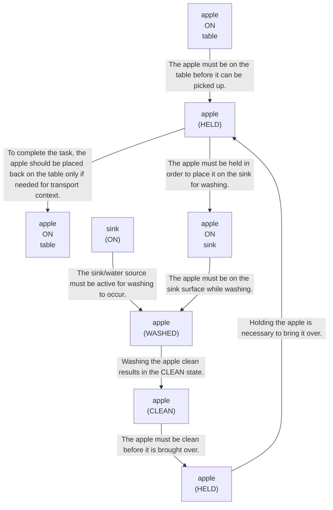
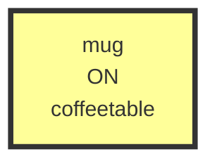
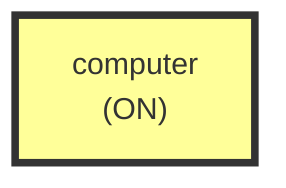
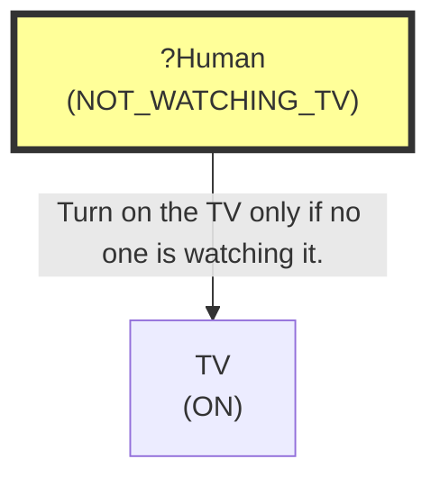
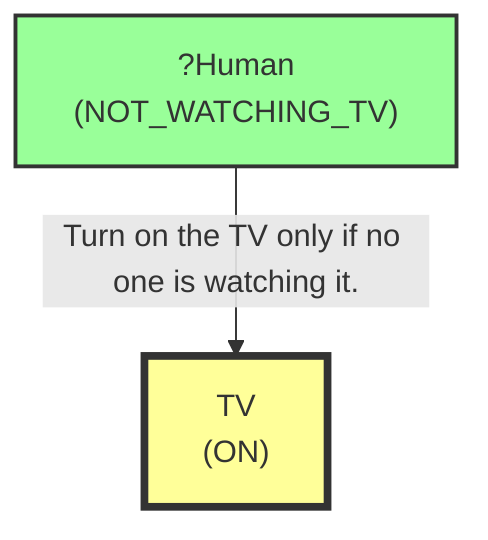

# 🚀 VirtualHome Agent Episode Log


### [GoalReasoner (Module A - Intent)] Output
```json
{
  "is_instruction_obviously_vague": false,
  "clarification_question": null,
  "target_object": "apples",
  "location_hint": "the table",
  "reasoning_chain": [
    {
      "question": "Why does the user want this object?",
      "answer": "To have the apples cleaned and delivered from the table."
    },
    {
      "question": "Why is that important?",
      "answer": "So the apples are in a desirable state for use or consumption and are available where the user wants them."
    },
    {
      "question": "What fundamental need does this fulfill?",
      "answer": "It fulfills the need to obtain and prepare food for eating."
    },
    {
      "question": "Are there any deeper psychological or physical motivations?",
      "answer": "The main physical motivation is to reduce hunger or make the food ready and convenient to use."
    }
  ],
  "deep_intent": "The user wants to obtain and prepare food for eating.",
  "acceptable_alternatives_properties": [
    {
      "priority": 1,
      "description": "Other similar ready-to-eat fruits that can be washed and brought over, such as pears, grapes, or oranges."
    },
    {
      "priority": 2,
      "description": "Other whole produce items in the same general category, such as berries or stone fruits."
    },
    {
      "priority": 3,
      "description": "Other fresh snack foods that can satisfy hunger and be handled similarly indoors."
    },
    {
      "priority": 4,
      "description": "Other edible items that can serve the same purpose of providing a clean, convenient food item to eat."
    }
  ]
}
```

### [RoboStateMultiTaskController] Output
```json
{
  "action": "[walk] <bathroom> (11)",
  "active_task_id": "task_1",
  "task_context": {
    "active_task_id": "task_1",
    "pending_task_ids": [
      "task_2",
      "task_3",
      "task_4",
      "task_5",
      "task_6",
      "task_7"
    ],
    "satisfied_task_ids": []
  },
  "source": "room_frontier"
}
```
## Step 0
- **Action**: `[walk] <bathroom> (11)`
- **Action Success**: `True`
- **Action Message**: {'0': {'message': 'Success'}}
- **Active Task**: `task_1`
- **Decision Source**: `room_frontier`
- **Task Progress**: G1_02=pending, E1_11=pending, E1_03=pending, E1_17=pending, E1_07=pending, E1_01=pending, E1_15=pending
- **SDG Status**:

- **Observed Items (114)**: floor(206), floor(207), floor(208), floor(209), floor(210), floor(211), wall(212), wall(213), wall(214), wall(215), wall(216), wall(217), ceiling(218), ceiling(219), ceiling(220)...


### [RoboStateMultiTaskController] Output
```json
{
  "action": "[walk] <bedroom> (73)",
  "active_task_id": "task_1",
  "task_context": {
    "active_task_id": "task_1",
    "pending_task_ids": [
      "task_2",
      "task_3",
      "task_4",
      "task_5",
      "task_6",
      "task_7"
    ],
    "satisfied_task_ids": []
  },
  "source": "room_frontier"
}
```
## Step 1
- **Action**: `[walk] <bedroom> (73)`
- **Action Success**: `True`
- **Action Message**: {'0': {'message': 'Success'}}
- **Active Task**: `task_1`
- **Decision Source**: `room_frontier`
- **Task Progress**: G1_02=pending, E1_11=pending, E1_03=pending, E1_17=pending, E1_07=pending, E1_01=pending, E1_15=pending
- **SDG Status**:

- **Observed Items (175)**: floor(206), floor(207), floor(208), floor(209), floor(210), floor(211), wall(212), wall(213), wall(214), wall(215), wall(216), wall(217), ceiling(218), ceiling(219), ceiling(220)...


### [RoboStateMultiTaskController] Output
```json
{
  "action": "[walk] <livingroom> (335)",
  "active_task_id": "task_1",
  "task_context": {
    "active_task_id": "task_1",
    "pending_task_ids": [
      "task_2",
      "task_3",
      "task_4",
      "task_5",
      "task_6",
      "task_7"
    ],
    "satisfied_task_ids": []
  },
  "source": "room_frontier"
}
```
## Step 2
- **Action**: `[walk] <livingroom> (335)`
- **Action Success**: `True`
- **Action Message**: {'0': {'message': 'Success'}}
- **Active Task**: `task_1`
- **Decision Source**: `room_frontier`
- **Task Progress**: G1_02=pending, E1_11=pending, E1_03=pending, E1_17=pending, E1_07=pending, E1_01=pending, E1_15=pending
- **SDG Status**:

- **Observed Items (259)**: floor(206), floor(207), floor(208), floor(209), floor(210), floor(211), wall(212), wall(213), wall(214), wall(215), wall(216), wall(217), ceiling(218), ceiling(219), ceiling(220)...


### [GoalReasoner (Module A - Intent)] Output
```json
{
  "is_instruction_obviously_vague": false,
  "clarification_question": null,
  "target_object": "book",
  "location_hint": "sofa",
  "reasoning_chain": [
    {
      "question": "Why does the user want this object moved?",
      "answer": "To relocate an unorganized book from where it was found to the sofa."
    },
    {
      "question": "Why is that important?",
      "answer": "To improve organization by placing the book in a designated resting or gathering area."
    },
    {
      "question": "What fundamental need does this fulfill?",
      "answer": "It fulfills the need to tidy and organize household items."
    },
    {
      "question": "Are there any deeper psychological or physical motivations?",
      "answer": "The user may want to reduce clutter, make the space look neater, or put the book in a more convenient place for later use."
    }
  ],
  "deep_intent": "The user wants to organize household items by moving an out-of-place item to a resting area.",
  "acceptable_alternatives_properties": [
    {
      "priority": 1,
      "description": "Other small loose household items that are out of place and can be placed on the sofa, such as magazines, notebooks, or papers"
    },
    {
      "priority": 2,
      "description": "Other reading materials or flat personal items that are similarly unorganized and easy to move, such as documents or catalogs"
    },
    {
      "priority": 3,
      "description": "General clutter items from the room that can be tidied into a common surface area"
    },
    {
      "priority": 4,
      "description": "Nearby portable household objects that need to be gathered into one spot for organization"
    }
  ]
}
```

### [PerceptionFilter] Output
```json
{
  "reasoning": "The goal is to move the target object book to the sofa. The required classes are the target book and the destination sofa; no additional tools or alternative receptacles are needed for this relocation task.",
  "selected_classes": [
    "book",
    "character",
    "sofa",
    "paper"
  ],
  "raw_class_count": 103
}
```

### [LLMExecutor] Output
```json
{
  "reasoning": "The active goal is to place a book on the sofa. In the current graph, the character is already close to the sofa, and book(268) is also close to the character, making it the best available target to move. The sofa is a valid flat surface for putback, so the next step should be to grab the nearby book before moving it onto the sofa.",
  "satisfied_nodes": [],
  "current_node_focus": "N1",
  "mapped_variables": {
    "?Book": "book(268)",
    "?TargetSurface": "sofa(368)"
  },
  "action": "[grab] <book> (268)"
}
```

### [RoboStateMultiTaskController] Output
```json
{
  "action": "[grab] <book> (268)",
  "active_task_id": "task_3",
  "task_context": {
    "active_task_id": "task_3",
    "pending_task_ids": [
      "task_1",
      "task_2",
      "task_4",
      "task_5",
      "task_6",
      "task_7"
    ],
    "satisfied_task_ids": []
  },
  "source": "llm_executor"
}
```
## Step 3
- **Action**: `[grab] <book> (268)`
- **Action Success**: `True`
- **Action Message**: {'0': {'message': 'Success'}}
- **Active Task**: `task_3`
- **Decision Source**: `llm_executor`
- **Task Progress**: G1_02=pending, E1_11=pending, E1_03=pending, E1_17=pending, E1_07=pending, E1_01=pending, E1_15=pending
- **SDG Status**:

- **Observed Items (9)**: book(268) [CLOSED], character(1), bathroom(11), bedroom(73), kitchen(205), livingroom(335), book(190) [CLOSED], sofa(368), paper(451)


### [PerceptionFilter] Output
```json
{
  "reasoning": "Reused cached class selection.",
  "selected_classes": [
    "book",
    "character",
    "sofa",
    "paper"
  ],
  "raw_class_count": 103
}
```

### [LLMExecutor] Output
```json
{
  "reasoning": "The active goal is to place a book on the sofa. I am already holding book(268), and the sofa(368) is available as the destination surface. The next required step is to move to the sofa before I can put the book down there. No other SDG node is satisfied yet because the book is not on the sofa.",
  "satisfied_nodes": [],
  "current_node_focus": "N1",
  "mapped_variables": {
    "?TargetSurface": "sofa(368)"
  },
  "action": "[walk] <sofa> (368)"
}
```

### [RoboStateMultiTaskController] Output
```json
{
  "action": "[walk] <sofa> (368)",
  "active_task_id": "task_3",
  "task_context": {
    "active_task_id": "task_3",
    "pending_task_ids": [
      "task_1",
      "task_2",
      "task_4",
      "task_5",
      "task_6",
      "task_7"
    ],
    "satisfied_task_ids": []
  },
  "source": "llm_executor"
}
```
## Step 4
- **Action**: `[walk] <sofa> (368)`
- **Action Success**: `True`
- **Action Message**: {'0': {'message': 'Success'}}
- **Active Task**: `task_3`
- **Decision Source**: `llm_executor`
- **Task Progress**: G1_02=pending, E1_11=pending, E1_03=pending, E1_17=pending, E1_07=pending, E1_01=pending, E1_15=pending
- **SDG Status**:

- **Observed Items (9)**: book(268) [CLOSED], character(1), bathroom(11), bedroom(73), kitchen(205), livingroom(335), book(190) [CLOSED], sofa(368), paper(451)


### [PerceptionFilter] Output
```json
{
  "reasoning": "Reused cached class selection.",
  "selected_classes": [
    "book",
    "character",
    "sofa",
    "paper"
  ],
  "raw_class_count": 103
}
```

### [LLMExecutor] Output
```json
{
  "reasoning": "The target book(268) is already being held in the right hand, and the character is currently close to the sofa(368). The SDG requires the book to be ON the sofa, so the next atomic step is to place the held book onto the sofa surface.",
  "satisfied_nodes": [],
  "current_node_focus": "N1",
  "mapped_variables": {},
  "action": "[putback] <book> (268) <sofa> (368)"
}
```

### [RoboStateMultiTaskController] Output
```json
{
  "action": "[putback] <book> (268) <sofa> (368)",
  "active_task_id": "task_3",
  "task_context": {
    "active_task_id": "task_3",
    "pending_task_ids": [
      "task_1",
      "task_2",
      "task_4",
      "task_5",
      "task_6",
      "task_7"
    ],
    "satisfied_task_ids": []
  },
  "source": "llm_executor"
}
```
## Step 5
- **Action**: `[putback] <book> (268) <sofa> (368)`
- **Action Success**: `True`
- **Action Message**: {'0': {'message': 'Success'}}
- **Active Task**: `task_3`
- **Decision Source**: `llm_executor`
- **Task Progress**: G1_02=pending, E1_11=pending, E1_03=done, E1_17=pending, E1_07=pending, E1_01=pending, E1_15=pending
- **SDG Status**:

- **Observed Items (9)**: book(268) [CLOSED], character(1), bathroom(11), bedroom(73), kitchen(205), livingroom(335), book(190) [CLOSED], sofa(368), paper(451)


### [GoalReasoner (Module A - Intent)] Output
```json
{
  "is_instruction_obviously_vague": false,
  "clarification_question": null,
  "target_object": "mug",
  "location_hint": "coffeetable",
  "reasoning_chain": [
    {
      "question": "Why does the user want this object?",
      "answer": "To keep the mug in a specific place."
    },
    {
      "question": "Why is that important?",
      "answer": "To ensure the mug remains on the coffeetable rather than elsewhere."
    },
    {
      "question": "What fundamental need does this fulfill?",
      "answer": "It fulfills the need to organize and maintain the mug's placement in the room."
    },
    {
      "question": "Are there any deeper psychological or physical motivations?",
      "answer": "The user may want the mug to be readily accessible, visible, or kept tidy in a designated spot."
    }
  ],
  "deep_intent": "The user wants to maintain an item in a designated household location.",
  "acceptable_alternatives_properties": [
    {
      "priority": 1,
      "description": "Other drinkware items such as a cup or tumbler that can be kept on the coffeetable"
    },
    {
      "priority": 2,
      "description": "Other small tabletop items that can be placed and kept on the coffeetable"
    },
    {
      "priority": 3,
      "description": "Similar handheld container items used for drinking and display"
    },
    {
      "priority": 4,
      "description": "Any comparable personal item that can occupy the same designated surface location"
    }
  ]
}
```

### [PerceptionFilter] Output
```json
{
  "reasoning": "The goal is to keep a mug on a coffeetable, so the only strictly necessary classes are the target item and the specified location surface.",
  "selected_classes": [
    "character",
    "coffeetable",
    "mug"
  ],
  "raw_class_count": 103
}
```

### [LLMExecutor] Output
```json
{
  "reasoning": "The active goal is to ensure a mug is ON the coffeetable. The current graph shows the character is already CLOSE to coffeetable(371) in the living room, and mug(447) is also in the living room. Since the mug is grabbable and the destination surface is already nearby, the next necessary step is to move to the mug before grabbing it. I choose mug(447) because it is the visible mug instance in the same room and can be placed onto the coffeetable afterward.",
  "satisfied_nodes": [],
  "current_node_focus": "N1",
  "mapped_variables": {
    "?TargetMug": "mug(447)",
    "?Surface": "coffeetable(371)"
  },
  "action": "[walk] <mug> (447)"
}
```

### [RoboStateMultiTaskController] Output
```json
{
  "action": "[walk] <mug> (447)",
  "active_task_id": "task_5",
  "task_context": {
    "active_task_id": "task_5",
    "pending_task_ids": [
      "task_1",
      "task_2",
      "task_4",
      "task_6",
      "task_7"
    ],
    "satisfied_task_ids": [
      "task_3"
    ]
  },
  "source": "llm_executor"
}
```
## Step 6
- **Action**: `[walk] <mug> (447)`
- **Action Success**: `True`
- **Action Message**: {'0': {'message': 'Success'}}
- **Active Task**: `task_5`
- **Decision Source**: `llm_executor`
- **Task Progress**: G1_02=pending, E1_11=pending, E1_03=done, E1_17=pending, E1_07=pending, E1_01=pending, E1_15=pending
- **SDG Status**:

- **Observed Items (9)**: mug(194), character(1), bathroom(11), bedroom(73), kitchen(205), livingroom(335), coffeetable(111), coffeetable(371), mug(447)


### [PerceptionFilter] Output
```json
{
  "reasoning": "Reused cached class selection.",
  "selected_classes": [
    "character",
    "coffeetable",
    "mug"
  ],
  "raw_class_count": 103
}
```

### [LLMExecutor] Output
```json
{
  "reasoning": "The active goal is to have the mug on a coffeetable. I am already close to mug(447), but it is not yet on any coffeetable. The best next step is to grab this mug so I can transport it to the appropriate coffeetable next. The living room currently contains mug(447), and coffeetable(371) is also in the living room, making it a plausible destination once I hold the mug.",
  "satisfied_nodes": [],
  "current_node_focus": "N1",
  "mapped_variables": {},
  "action": "[grab] <mug> (447)"
}
```

### [RoboStateMultiTaskController] Output
```json
{
  "action": "[grab] <mug> (447)",
  "active_task_id": "task_5",
  "task_context": {
    "active_task_id": "task_5",
    "pending_task_ids": [
      "task_1",
      "task_2",
      "task_4",
      "task_6",
      "task_7"
    ],
    "satisfied_task_ids": [
      "task_3"
    ]
  },
  "source": "llm_executor"
}
```
## Step 7
- **Action**: `[grab] <mug> (447)`
- **Action Success**: `True`
- **Action Message**: {'0': {'message': 'Success'}}
- **Active Task**: `task_5`
- **Decision Source**: `llm_executor`
- **Task Progress**: G1_02=pending, E1_11=pending, E1_03=done, E1_17=pending, E1_07=pending, E1_01=pending, E1_15=pending
- **SDG Status**:

- **Observed Items (9)**: mug(194), character(1), bathroom(11), bedroom(73), kitchen(205), livingroom(335), coffeetable(111), coffeetable(371), mug(447)


### [PerceptionFilter] Output
```json
{
  "reasoning": "Reused cached class selection.",
  "selected_classes": [
    "character",
    "coffeetable",
    "mug"
  ],
  "raw_class_count": 103
}
```

### [LLMExecutor] Output
```json
{
  "reasoning": "The active goal is to have the mug on a coffeetable. The current held mug is mug(447), and there are two coffeetables visible. Since mug(447) is inside the livingroom and coffeetable(371) is also in the livingroom, the most direct next step is to walk to the relevant destination surface before placing the mug. The prior action was a grab, so I should not repeat walking to a different room; I need to move to the coffeetable first, then place the mug.",
  "satisfied_nodes": [],
  "current_node_focus": "N1",
  "mapped_variables": {
    "?TargetObject": "mug(447)",
    "?Surface": "coffeetable(371)"
  },
  "action": "[walk] <coffeetable> (371)"
}
```

### [RoboStateMultiTaskController] Output
```json
{
  "action": "[walk] <coffeetable> (371)",
  "active_task_id": "task_5",
  "task_context": {
    "active_task_id": "task_5",
    "pending_task_ids": [
      "task_1",
      "task_2",
      "task_4",
      "task_6",
      "task_7"
    ],
    "satisfied_task_ids": [
      "task_3"
    ]
  },
  "source": "llm_executor"
}
```
## Step 8
- **Action**: `[walk] <coffeetable> (371)`
- **Action Success**: `True`
- **Action Message**: {'0': {'message': 'Success'}}
- **Active Task**: `task_5`
- **Decision Source**: `llm_executor`
- **Task Progress**: G1_02=pending, E1_11=pending, E1_03=done, E1_17=pending, E1_07=pending, E1_01=pending, E1_15=pending
- **SDG Status**:

- **Observed Items (9)**: mug(194), character(1), bathroom(11), bedroom(73), kitchen(205), livingroom(335), coffeetable(111), coffeetable(371), mug(447)


### [PerceptionFilter] Output
```json
{
  "reasoning": "Reused cached class selection.",
  "selected_classes": [
    "character",
    "coffeetable",
    "mug"
  ],
  "raw_class_count": 103
}
```

### [LLMExecutor] Output
```json
{
  "reasoning": "The active goal is to place the mug on the coffeetable. The current filtered graph shows the character is already CLOSE to coffeetable (371) and holding mug (447) in the right hand. Therefore the next step is to place the held mug onto that surface. No other prerequisites are needed.",
  "satisfied_nodes": [],
  "current_node_focus": "N1",
  "mapped_variables": {},
  "action": "[putback] <mug> (447) <coffeetable> (371)"
}
```

### [RoboStateMultiTaskController] Output
```json
{
  "action": "[putback] <mug> (447) <coffeetable> (371)",
  "active_task_id": "task_5",
  "task_context": {
    "active_task_id": "task_5",
    "pending_task_ids": [
      "task_1",
      "task_2",
      "task_4",
      "task_6",
      "task_7"
    ],
    "satisfied_task_ids": [
      "task_3"
    ]
  },
  "source": "llm_executor"
}
```
## Step 9
- **Action**: `[putback] <mug> (447) <coffeetable> (371)`
- **Action Success**: `True`
- **Action Message**: {'0': {'message': 'Success'}}
- **Active Task**: `task_5`
- **Decision Source**: `llm_executor`
- **Task Progress**: G1_02=pending, E1_11=pending, E1_03=done, E1_17=pending, E1_07=done, E1_01=pending, E1_15=pending
- **SDG Status**:

- **Observed Items (9)**: mug(194), character(1), bathroom(11), bedroom(73), kitchen(205), livingroom(335), coffeetable(111), coffeetable(371), mug(447)


### [GoalReasoner (Module A - Intent)] Output
```json
{
  "is_instruction_obviously_vague": false,
  "clarification_question": null,
  "target_object": "folder",
  "location_hint": "closet",
  "reasoning_chain": [
    {
      "question": "Why does the user want this object placed there?",
      "answer": "To store the folder in a designated indoor storage location."
    },
    {
      "question": "Why is that important?",
      "answer": "To keep the item organized and out of the way."
    },
    {
      "question": "What fundamental need does this fulfill?",
      "answer": "It fulfills the need to organize and store belongings in a specific place."
    },
    {
      "question": "Are there any deeper psychological or physical motivations?",
      "answer": "It may reduce clutter, protect the item, and make the space easier to use."
    }
  ],
  "deep_intent": "The user wants to organize and store an item in a designated storage area.",
  "acceptable_alternatives_properties": [
    {
      "priority": 1,
      "description": "Other flat paper-containing items or documents that can be stored in the same way, such as a binder, file, or stack of papers."
    },
    {
      "priority": 2,
      "description": "Other office or household storage items that serve similar organizing purposes, such as notebooks or envelopes."
    },
    {
      "priority": 3,
      "description": "Similar lightweight personal belongings that can be placed in storage, such as magazines or manuals."
    },
    {
      "priority": 4,
      "description": "Any small household item that can be tidied away to reduce clutter, if the exact object is unavailable."
    }
  ]
}
```

### [PerceptionFilter] Output
```json
{
  "reasoning": "The goal requires storing the folder inside the closet, and the SDG says the closet must be open. I only need the target object and the required location/state object.",
  "selected_classes": [
    "closet",
    "paper",
    "folder",
    "book",
    "character",
    "door"
  ],
  "raw_class_count": 103
}
```

### [LLMExecutor] Output
```json
{
  "reasoning": "The active goal is to place the folder inside the closet, and the required closet must be open first. In the bedroom there are two closets; closet(112) is already OPEN, so it best satisfies the SDG state node N2. The folder we should target is folder(203) in the bedroom. Since I am currently in the livingroom and not near the bedroom closet, the next required step is to walk to the open closet before attempting to grab or put the folder. This advances toward the final relation while respecting the proximity rule.",
  "satisfied_nodes": [
    "N2"
  ],
  "current_node_focus": "N1",
  "mapped_variables": {
    "?Container": "closet(112)"
  },
  "action": "[walk] <closet> (112)"
}
```

### [RoboStateMultiTaskController] Output
```json
{
  "action": "[walk] <closet> (112)",
  "active_task_id": "task_7",
  "task_context": {
    "active_task_id": "task_7",
    "pending_task_ids": [
      "task_1",
      "task_2",
      "task_4",
      "task_6"
    ],
    "satisfied_task_ids": [
      "task_3",
      "task_5"
    ]
  },
  "source": "llm_executor"
}
```
## Step 10
- **Action**: `[walk] <closet> (112)`
- **Action Success**: `True`
- **Action Message**: {'0': {'message': 'Success'}}
- **Active Task**: `task_7`
- **Decision Source**: `llm_executor`
- **Task Progress**: G1_02=pending, E1_11=pending, E1_03=done, E1_17=pending, E1_07=done, E1_01=pending, E1_15=pending
- **SDG Status**:

- **Observed Items (15)**: door(224) [OPEN], book(268) [CLOSED], character(1), bathroom(11), bedroom(73), kitchen(205), livingroom(335), door(51) [OPEN], closet(112) [OPEN], closet(127) [CLOSED], book(190) [CLOSED], folder(203) [CLOSED], closet(374) [CLOSED], paper(451), folder(453) [CLOSED]


### [PerceptionFilter] Output
```json
{
  "reasoning": "Reused cached class selection.",
  "selected_classes": [
    "closet",
    "paper",
    "folder",
    "book",
    "character",
    "door"
  ],
  "raw_class_count": 103
}
```

### [LLMExecutor] Output
```json
{
  "reasoning": "The active goal is to place the folder inside a closet, and the required closet must be open first. I am already close to closet(112) and it is currently OPEN, so N2 is satisfied. The folder object is available in the bedroom as folder(203), which is the best match for the target object. To progress toward N1, I must next go to the folder before I can grab it.",
  "satisfied_nodes": [
    "N2"
  ],
  "current_node_focus": "N1",
  "mapped_variables": {
    "?Container": "closet(112)"
  },
  "action": "[walk] <folder> (203)"
}
```

### [RoboStateMultiTaskController] Output
```json
{
  "action": "[walk] <folder> (203)",
  "active_task_id": "task_7",
  "task_context": {
    "active_task_id": "task_7",
    "pending_task_ids": [
      "task_1",
      "task_2",
      "task_4",
      "task_6"
    ],
    "satisfied_task_ids": [
      "task_3",
      "task_5"
    ]
  },
  "source": "llm_executor"
}
```
## Step 11
- **Action**: `[walk] <folder> (203)`
- **Action Success**: `True`
- **Action Message**: {'0': {'message': 'Success'}}
- **Active Task**: `task_7`
- **Decision Source**: `llm_executor`
- **Task Progress**: G1_02=pending, E1_11=pending, E1_03=done, E1_17=pending, E1_07=done, E1_01=pending, E1_15=pending
- **SDG Status**:

- **Observed Items (15)**: door(224) [OPEN], book(268) [CLOSED], character(1), bathroom(11), bedroom(73), kitchen(205), livingroom(335), door(51) [OPEN], closet(112) [OPEN], closet(127) [CLOSED], book(190) [CLOSED], folder(203) [CLOSED], closet(374) [CLOSED], paper(451), folder(453) [CLOSED]


### [PerceptionFilter] Output
```json
{
  "reasoning": "Reused cached class selection.",
  "selected_classes": [
    "closet",
    "paper",
    "folder",
    "book",
    "character",
    "door"
  ],
  "raw_class_count": 103
}
```

### [LLMExecutor] Output
```json
{
  "reasoning": "The active goal is to place the folder inside an open closet. In the current graph, closet(112) is already OPEN and the target folder can be bound to folder(203), which is in the bedroom and currently close to the character. Since the closet is open and the folder is the correct target object for the active task, the next required step is to grab the folder before it can be put inside the closet. We should not repeat the recent walk action to the folder.",
  "satisfied_nodes": [
    "N2"
  ],
  "current_node_focus": "N1",
  "mapped_variables": {
    "?Container": "closet(112)"
  },
  "action": "[grab] <folder> (203)"
}
```

### [RoboStateMultiTaskController] Output
```json
{
  "action": "[grab] <folder> (203)",
  "active_task_id": "task_7",
  "task_context": {
    "active_task_id": "task_7",
    "pending_task_ids": [
      "task_1",
      "task_2",
      "task_4",
      "task_6"
    ],
    "satisfied_task_ids": [
      "task_3",
      "task_5"
    ]
  },
  "source": "llm_executor"
}
```
## Step 12
- **Action**: `[grab] <folder> (203)`
- **Action Success**: `True`
- **Action Message**: {'0': {'message': 'Success'}}
- **Active Task**: `task_7`
- **Decision Source**: `llm_executor`
- **Task Progress**: G1_02=pending, E1_11=pending, E1_03=done, E1_17=pending, E1_07=done, E1_01=pending, E1_15=pending
- **SDG Status**:

- **Observed Items (15)**: door(224) [OPEN], book(268) [CLOSED], character(1), bathroom(11), bedroom(73), kitchen(205), livingroom(335), door(51) [OPEN], closet(112) [OPEN], closet(127) [CLOSED], book(190) [CLOSED], folder(203) [CLOSED], closet(374) [CLOSED], paper(451), folder(453) [CLOSED]


### [PerceptionFilter] Output
```json
{
  "reasoning": "Reused cached class selection.",
  "selected_classes": [
    "closet",
    "paper",
    "folder",
    "book",
    "character",
    "door"
  ],
  "raw_class_count": 103
}
```

### [LLMExecutor] Output
```json
{
  "reasoning": "The active task is to place the folder inside the closet. I am already holding folder(203), and the target closet(112) is available but currently CLOSED. Since the SDG requires the closet to be OPEN before the folder can be put inside, the next necessary step is to open closet(112).",
  "satisfied_nodes": [],
  "current_node_focus": "N2",
  "mapped_variables": {
    "?Container": "closet(112)"
  },
  "action": "[open] <closet> (112)"
}
```

### [RoboStateMultiTaskController] Output
```json
{
  "action": "[walk] <closet> (112)",
  "active_task_id": "task_7",
  "task_context": {
    "active_task_id": "task_7",
    "pending_task_ids": [
      "task_1",
      "task_2",
      "task_4",
      "task_6"
    ],
    "satisfied_task_ids": [
      "task_3",
      "task_5"
    ]
  },
  "source": "llm_executor_repaired"
}
```
## Step 13
- **Action**: `[walk] <closet> (112)`
- **Action Success**: `True`
- **Action Message**: {'0': {'message': 'Success'}}
- **Active Task**: `task_7`
- **Decision Source**: `llm_executor_repaired`
- **Task Progress**: G1_02=pending, E1_11=pending, E1_03=done, E1_17=pending, E1_07=done, E1_01=pending, E1_15=pending
- **SDG Status**:

- **Observed Items (15)**: door(224) [OPEN], book(268) [CLOSED], character(1), bathroom(11), bedroom(73), kitchen(205), livingroom(335), door(51) [OPEN], closet(112) [OPEN], closet(127) [CLOSED], book(190) [CLOSED], folder(203) [CLOSED], closet(374) [CLOSED], paper(451), folder(453) [CLOSED]


### [PerceptionFilter] Output
```json
{
  "reasoning": "Reused cached class selection.",
  "selected_classes": [
    "closet",
    "paper",
    "folder",
    "book",
    "character",
    "door"
  ],
  "raw_class_count": 103
}
```

### [LLMExecutor] Output
```json
{
  "reasoning": "The folder is already held and we are close to the target closet(112), which is already OPEN. The remaining gap for the active task is to place the held folder inside this open closet. Since the last action was already a walk to the closet, the next atomic step should be putting the folder in the closet.",
  "satisfied_nodes": [
    "N2"
  ],
  "current_node_focus": "N1",
  "mapped_variables": {
    "?Container": "closet(112)"
  },
  "action": "[putin] <folder> (203) <closet> (112)"
}
```

### [RoboStateMultiTaskController] Output
```json
{
  "action": "[putin] <folder> (203) <closet> (112)",
  "active_task_id": "task_7",
  "task_context": {
    "active_task_id": "task_7",
    "pending_task_ids": [
      "task_1",
      "task_2",
      "task_4",
      "task_6"
    ],
    "satisfied_task_ids": [
      "task_3",
      "task_5"
    ]
  },
  "source": "llm_executor"
}
```
## Step 14
- **Action**: `[putin] <folder> (203) <closet> (112)`
- **Action Success**: `True`
- **Action Message**: {'0': {'message': 'Success'}}
- **Active Task**: `task_7`
- **Decision Source**: `llm_executor`
- **Task Progress**: G1_02=pending, E1_11=pending, E1_03=done, E1_17=pending, E1_07=done, E1_01=pending, E1_15=done
- **SDG Status**:

- **Observed Items (15)**: door(224) [OPEN], book(268) [CLOSED], character(1), bathroom(11), bedroom(73), kitchen(205), livingroom(335), door(51) [OPEN], closet(112) [OPEN], closet(127) [CLOSED], book(190) [CLOSED], folder(203) [CLOSED], closet(374) [CLOSED], paper(451), folder(453) [CLOSED]


### [GoalReasoner (Module A - Intent)] Output
```json
{
  "is_instruction_obviously_vague": false,
  "clarification_question": null,
  "target_object": "computer",
  "location_hint": null,
  "reasoning_chain": [
    {
      "question": "Why does the user want this object?",
      "answer": "To have the computer powered on instead of remaining off."
    },
    {
      "question": "Why is that important?",
      "answer": "Because the computer must be on in order to be usable or to continue whatever task depends on it."
    },
    {
      "question": "What fundamental need does this fulfill?",
      "answer": "It fulfills the need to use the computer for work, communication, information access, or other digital tasks."
    },
    {
      "question": "Are there any deeper psychological or physical motivations?",
      "answer": "The user likely wants to remove a barrier preventing activity or interaction with the device."
    }
  ],
  "deep_intent": "The user wants to make the computer usable by powering it on.",
  "acceptable_alternatives_properties": [
    {
      "priority": 1,
      "description": "Another available computer or similar computing device that can be powered on"
    },
    {
      "priority": 2,
      "description": "A tablet or laptop that can serve the same function if the desktop computer is unavailable"
    },
    {
      "priority": 3,
      "description": "A different device for accessing digital content or completing the intended task"
    },
    {
      "priority": 4,
      "description": "Any nearby electronic device that can provide access to the needed information or functionality"
    }
  ]
}
```

### [PerceptionFilter] Output
```json
{
  "reasoning": "The goal is to power on the computer, so the only strictly necessary object class is the computer itself. No other tools or locations are required by the SDG.",
  "selected_classes": [
    "computer",
    "character",
    "desk"
  ],
  "raw_class_count": 103
}
```

### [LLMExecutor] Output
```json
{
  "reasoning": "The active task is to power on a computer. There are two candidate computers in the graph, both currently OFF. Since the current character is already inside the bedroom where computer(174) is located, and no closer interaction is shown, the most direct next step is to walk to that computer before attempting to switch it on. This respects the proximity rule and avoids manipulating unrelated objects.",
  "satisfied_nodes": [],
  "current_node_focus": "N1",
  "mapped_variables": {},
  "action": "[walk] <computer> (174)"
}
```

### [RoboStateMultiTaskController] Output
```json
{
  "action": "[walk] <computer> (174)",
  "active_task_id": "task_2",
  "task_context": {
    "active_task_id": "task_2",
    "pending_task_ids": [
      "task_1",
      "task_4",
      "task_6"
    ],
    "satisfied_task_ids": [
      "task_3",
      "task_5",
      "task_7"
    ]
  },
  "source": "llm_executor"
}
```
## Step 15
- **Action**: `[walk] <computer> (174)`
- **Action Success**: `True`
- **Action Message**: {'0': {'message': 'Success'}}
- **Active Task**: `task_2`
- **Decision Source**: `llm_executor`
- **Task Progress**: G1_02=pending, E1_11=pending, E1_03=done, E1_17=pending, E1_07=done, E1_01=pending, E1_15=done
- **SDG Status**:

- **Observed Items (9)**: character(1), bathroom(11), bedroom(73), kitchen(205), livingroom(335), desk(108) [CLOSED], computer(174) [OFF], desk(373) [CLOSED], computer(433) [OFF]


### [PerceptionFilter] Output
```json
{
  "reasoning": "Reused cached class selection.",
  "selected_classes": [
    "computer",
    "character",
    "desk"
  ],
  "raw_class_count": 103
}
```

### [LLMExecutor] Output
```json
{
  "reasoning": "The active goal is to make the computer usable by powering it on. We are already close to computer(174), which is the best match because it is in the same room and currently OFF. Since the computer has HAS_SWITCH and there is no plug requirement shown, the next atomic action is to switch it on.",
  "satisfied_nodes": [],
  "current_node_focus": "N1",
  "mapped_variables": {
    "?Computer": "computer(174)"
  },
  "action": "[switchon] <computer> (174)"
}
```

### [RoboStateMultiTaskController] Output
```json
{
  "action": "[switchon] <computer> (174)",
  "active_task_id": "task_2",
  "task_context": {
    "active_task_id": "task_2",
    "pending_task_ids": [
      "task_1",
      "task_4",
      "task_6"
    ],
    "satisfied_task_ids": [
      "task_3",
      "task_5",
      "task_7"
    ]
  },
  "source": "llm_executor"
}
```
## Step 16
- **Action**: `[switchon] <computer> (174)`
- **Action Success**: `True`
- **Action Message**: Faked switch operation in Python layer (bypassed Unity failure)
- **Active Task**: `task_2`
- **Decision Source**: `llm_executor`
- **Task Progress**: G1_02=pending, E1_11=done, E1_03=done, E1_17=pending, E1_07=done, E1_01=pending, E1_15=done
- **SDG Status**:

- **Observed Items (9)**: character(1), bathroom(11), bedroom(73), kitchen(205), livingroom(335), desk(108) [CLOSED], computer(174) [OFF], desk(373) [CLOSED], computer(433) [OFF]


### [GoalReasoner (Module A - Intent)] Output
```json
{
  "is_instruction_obviously_vague": false,
  "clarification_question": null,
  "target_object": "TV",
  "location_hint": null,
  "reasoning_chain": [
    {
      "question": "Why does the user want this object?",
      "answer": "To have the television turned on when it is not being watched."
    },
    {
      "question": "Why is that important?",
      "answer": "To ensure the TV is on only under the specified condition."
    },
    {
      "question": "What fundamental need does this fulfill?",
      "answer": "The user wants automated control of a device based on occupancy/attention status."
    },
    {
      "question": "Are there any deeper psychological or physical motivations?",
      "answer": "It may be to save power, maintain a desired room state, or ensure the TV is available when unattended."
    }
  ],
  "deep_intent": "The user wants device state to be controlled based on whether it is being watched.",
  "acceptable_alternatives_properties": [
    {
      "priority": 1,
      "description": "Other household media devices or displays that can be switched on/off based on whether someone is viewing them."
    },
    {
      "priority": 2,
      "description": "Any indoor electronic screen or entertainment device with similar occupancy-based control."
    },
    {
      "priority": 3,
      "description": "Appliances that can be automatically activated when a room is unattended, such as lights or fans, if the control goal is broader automation."
    },
    {
      "priority": 4,
      "description": "Other household devices whose operation can be conditioned on presence or attention, even if they are not screens."
    }
  ]
}
```

### [PerceptionFilter] Output
```json
{
  "reasoning": "The goal is to control a TV based on whether it is being watched, so the only strictly necessary visible class is the TV itself. No additional tools, receptacles, or locations are required from the SDG beyond the target device.",
  "selected_classes": [
    "character",
    "door",
    "tv"
  ],
  "raw_class_count": 103
}
```

### [LLMExecutor] Output
```json
{
  "reasoning": "The active task is to turn the TV on only when it is not being watched. The filtered graph shows tv(426) is OFF and CLOSE to the character, so it is the best bind for the TV goal. Since the character is currently in the bedroom and tv(426) is in the living room, I cannot switch it on from here. The next required step is to walk to the TV before any interaction. No evidence suggests the human is watching it, but the SDG requires NOT_WATCHING_TV as a prerequisite and that is the condition being targeted by the task.",
  "satisfied_nodes": [],
  "current_node_focus": "N2",
  "mapped_variables": {
    "?Human": "character(1)",
    "TV": "tv(426)"
  },
  "action": "[walk] <tv> (426)"
}
```

### [RoboStateMultiTaskController] Output
```json
{
  "action": "[walk] <tv> (426)",
  "active_task_id": "task_6",
  "task_context": {
    "active_task_id": "task_6",
    "pending_task_ids": [
      "task_1",
      "task_4"
    ],
    "satisfied_task_ids": [
      "task_2",
      "task_3",
      "task_5",
      "task_7"
    ]
  },
  "source": "llm_executor"
}
```
## Step 17
- **Action**: `[walk] <tv> (426)`
- **Action Success**: `True`
- **Action Message**: {'0': {'message': 'Success'}}
- **Active Task**: `task_6`
- **Decision Source**: `llm_executor`
- **Task Progress**: G1_02=pending, E1_11=done, E1_03=done, E1_17=pending, E1_07=done, E1_01=pending, E1_15=done
- **SDG Status**:

- **Observed Items (9)**: door(224) [OPEN], tv(264) [OFF], character(1), bathroom(11), bedroom(73), kitchen(205), livingroom(335), door(51) [OPEN], tv(426) [OFF]


### [PerceptionFilter] Output
```json
{
  "reasoning": "Reused cached class selection.",
  "selected_classes": [
    "character",
    "door",
    "tv"
  ],
  "raw_class_count": 103
}
```

### [LLMExecutor] Output
```json
{
  "reasoning": "The active SDG requires the TV to be ON while the human is NOT watching it. The current graph shows the character is CLOSE to tv(426), which is the relevant TV instance in the current room, and it is currently OFF. Since the previous step already walked to this TV, the next atomic step is to switch it on. No clarification is needed because the task is unambiguous.",
  "satisfied_nodes": [
    "N2"
  ],
  "current_node_focus": "N1",
  "mapped_variables": {},
  "action": "[switchon] <tv> (426)"
}
```

### [RoboStateMultiTaskController] Output
```json
{
  "action": "[switchon] <tv> (426)",
  "active_task_id": "task_6",
  "task_context": {
    "active_task_id": "task_6",
    "pending_task_ids": [
      "task_1",
      "task_4"
    ],
    "satisfied_task_ids": [
      "task_2",
      "task_3",
      "task_5",
      "task_7"
    ]
  },
  "source": "llm_executor"
}
```
## Step 18
- **Action**: `[switchon] <tv> (426)`
- **Action Success**: `True`
- **Action Message**: Faked switch operation in Python layer (bypassed Unity failure)
- **Active Task**: `task_6`
- **Decision Source**: `llm_executor`
- **Task Progress**: G1_02=pending, E1_11=done, E1_03=done, E1_17=pending, E1_07=done, E1_01=done, E1_15=done
- **SDG Status**:

- **Observed Items (9)**: door(224) [OPEN], tv(264) [OFF], character(1), bathroom(11), bedroom(73), kitchen(205), livingroom(335), door(51) [OPEN], tv(426) [OFF]


### [GoalReasoner (Module A - Intent)] Output
```json
{
  "is_instruction_obviously_vague": false,
  "clarification_question": null,
  "target_object": "radio",
  "location_hint": null,
  "reasoning_chain": [
    {
      "question": "Why does the user want this object?",
      "answer": "To have the radio turned on if it is currently off."
    },
    {
      "question": "Why is that important?",
      "answer": "So the device is in an active state and can provide audio output."
    },
    {
      "question": "What fundamental need does this fulfill?",
      "answer": "It fulfills the need to hear audio or receive broadcast content."
    },
    {
      "question": "Are there any deeper psychological or physical motivations?",
      "answer": "The user may want entertainment, information, or background sound."
    }
  ],
  "deep_intent": "The user wants to enable audio playback or broadcast reception.",
  "acceptable_alternatives_properties": [
    {
      "priority": 1,
      "description": "Other indoor audio devices that can be powered on to provide sound, such as a speaker or stereo system."
    },
    {
      "priority": 2,
      "description": "Similar household media devices that can be activated for listening, such as a television or music player."
    },
    {
      "priority": 3,
      "description": "Any available device that can provide background audio or spoken content, such as a smart speaker."
    },
    {
      "priority": 4,
      "description": "Other ways to obtain auditory information or entertainment in the room, such as playing audio on a phone or tablet."
    }
  ]
}
```

### [RoboStateMultiTaskController] Output
```json
{
  "action": "[walk] <bathroom> (11)",
  "active_task_id": null,
  "task_context": {
    "active_task_id": null,
    "pending_task_ids": [
      "task_1",
      "task_4"
    ],
    "satisfied_task_ids": [
      "task_2",
      "task_3",
      "task_5",
      "task_6",
      "task_7"
    ]
  },
  "source": "loop_recovery_room_revisit"
}
```
## Step 19
- **Action**: `[walk] <bathroom> (11)`
- **Action Success**: `True`
- **Action Message**: {'0': {'message': 'Success'}}
- **Decision Source**: `loop_recovery_room_revisit`
- **Task Progress**: G1_02=pending, E1_11=done, E1_03=done, E1_17=pending, E1_07=done, E1_01=done, E1_15=done
- **SDG Status**:
No SDG active.
- **Observed Items (332)**: floor(206), floor(207), floor(208), floor(209), floor(210), floor(211), wall(212), wall(213), wall(214), wall(215), wall(216), wall(217), ceiling(218), ceiling(219), ceiling(220)...


### [RoboStateMultiTaskController] Output
```json
{
  "action": "[walk] <kitchen> (205)",
  "active_task_id": null,
  "task_context": {
    "active_task_id": null,
    "pending_task_ids": [
      "task_1",
      "task_4"
    ],
    "satisfied_task_ids": [
      "task_2",
      "task_3",
      "task_5",
      "task_6",
      "task_7"
    ]
  },
  "source": "loop_recovery_room_revisit"
}
```
## Step 20
- **Action**: `[walk] <kitchen> (205)`
- **Action Success**: `True`
- **Action Message**: {'0': {'message': 'Success'}}
- **Decision Source**: `loop_recovery_room_revisit`
- **Task Progress**: G1_02=pending, E1_11=done, E1_03=done, E1_17=pending, E1_07=done, E1_01=done, E1_15=done
- **SDG Status**:
No SDG active.
- **Observed Items (332)**: floor(206), floor(207), floor(208), floor(209), floor(210), floor(211), wall(212), wall(213), wall(214), wall(215), wall(216), wall(217), ceiling(218), ceiling(219), ceiling(220)...


### [RoboStateMultiTaskController] Output
```json
{
  "action": "[walk] <bedroom> (73)",
  "active_task_id": null,
  "task_context": {
    "active_task_id": null,
    "pending_task_ids": [
      "task_1",
      "task_4"
    ],
    "satisfied_task_ids": [
      "task_2",
      "task_3",
      "task_5",
      "task_6",
      "task_7"
    ]
  },
  "source": "loop_recovery_room_revisit"
}
```
## Step 21
- **Action**: `[walk] <bedroom> (73)`
- **Action Success**: `True`
- **Action Message**: {'0': {'message': 'Success'}}
- **Decision Source**: `loop_recovery_room_revisit`
- **Task Progress**: G1_02=pending, E1_11=done, E1_03=done, E1_17=pending, E1_07=done, E1_01=done, E1_15=done
- **SDG Status**:
No SDG active.
- **Observed Items (332)**: floor(206), floor(207), floor(208), floor(209), floor(210), floor(211), wall(212), wall(213), wall(214), wall(215), wall(216), wall(217), ceiling(218), ceiling(219), ceiling(220)...


### [RoboStateMultiTaskController] Output
```json
{
  "action": "[walk] <livingroom> (335)",
  "active_task_id": null,
  "task_context": {
    "active_task_id": null,
    "pending_task_ids": [
      "task_1",
      "task_4"
    ],
    "satisfied_task_ids": [
      "task_2",
      "task_3",
      "task_5",
      "task_6",
      "task_7"
    ]
  },
  "source": "loop_recovery_room_revisit"
}
```
## Step 22
- **Action**: `[walk] <livingroom> (335)`
- **Action Success**: `True`
- **Action Message**: {'0': {'message': 'Success'}}
- **Decision Source**: `loop_recovery_room_revisit`
- **Task Progress**: G1_02=pending, E1_11=done, E1_03=done, E1_17=pending, E1_07=done, E1_01=done, E1_15=done
- **SDG Status**:
No SDG active.
- **Observed Items (332)**: floor(206), floor(207), floor(208), floor(209), floor(210), floor(211), wall(212), wall(213), wall(214), wall(215), wall(216), wall(217), ceiling(218), ceiling(219), ceiling(220)...


### [RoboStateMultiTaskController] Output
```json
{
  "action": "[walk] <bathroom> (11)",
  "active_task_id": null,
  "task_context": {
    "active_task_id": null,
    "pending_task_ids": [
      "task_1",
      "task_4"
    ],
    "satisfied_task_ids": [
      "task_2",
      "task_3",
      "task_5",
      "task_6",
      "task_7"
    ]
  },
  "source": "loop_recovery_room_revisit"
}
```
## Step 23
- **Action**: `[walk] <bathroom> (11)`
- **Action Success**: `True`
- **Action Message**: {'0': {'message': 'Success'}}
- **Decision Source**: `loop_recovery_room_revisit`
- **Task Progress**: G1_02=pending, E1_11=done, E1_03=done, E1_17=pending, E1_07=done, E1_01=done, E1_15=done
- **SDG Status**:
No SDG active.
- **Observed Items (332)**: floor(206), floor(207), floor(208), floor(209), floor(210), floor(211), wall(212), wall(213), wall(214), wall(215), wall(216), wall(217), ceiling(218), ceiling(219), ceiling(220)...


### [RoboStateMultiTaskController] Output
```json
{
  "action": "[walk] <kitchen> (205)",
  "active_task_id": null,
  "task_context": {
    "active_task_id": null,
    "pending_task_ids": [
      "task_1",
      "task_4"
    ],
    "satisfied_task_ids": [
      "task_2",
      "task_3",
      "task_5",
      "task_6",
      "task_7"
    ]
  },
  "source": "loop_recovery_room_revisit"
}
```
## Step 24
- **Action**: `[walk] <kitchen> (205)`
- **Action Success**: `True`
- **Action Message**: {'0': {'message': 'Success'}}
- **Decision Source**: `loop_recovery_room_revisit`
- **Task Progress**: G1_02=pending, E1_11=done, E1_03=done, E1_17=pending, E1_07=done, E1_01=done, E1_15=done
- **SDG Status**:
No SDG active.
- **Observed Items (332)**: floor(206), floor(207), floor(208), floor(209), floor(210), floor(211), wall(212), wall(213), wall(214), wall(215), wall(216), wall(217), ceiling(218), ceiling(219), ceiling(220)...


### [RoboStateMultiTaskController] Output
```json
{
  "action": "[walk] <bedroom> (73)",
  "active_task_id": null,
  "task_context": {
    "active_task_id": null,
    "pending_task_ids": [
      "task_1",
      "task_4"
    ],
    "satisfied_task_ids": [
      "task_2",
      "task_3",
      "task_5",
      "task_6",
      "task_7"
    ]
  },
  "source": "loop_recovery_room_revisit"
}
```
## Step 25
- **Action**: `[walk] <bedroom> (73)`
- **Action Success**: `True`
- **Action Message**: {'0': {'message': 'Success'}}
- **Decision Source**: `loop_recovery_room_revisit`
- **Task Progress**: G1_02=pending, E1_11=done, E1_03=done, E1_17=pending, E1_07=done, E1_01=done, E1_15=done
- **SDG Status**:
No SDG active.
- **Observed Items (332)**: floor(206), floor(207), floor(208), floor(209), floor(210), floor(211), wall(212), wall(213), wall(214), wall(215), wall(216), wall(217), ceiling(218), ceiling(219), ceiling(220)...


### [RoboStateMultiTaskController] Output
```json
{
  "action": "[walk] <livingroom> (335)",
  "active_task_id": null,
  "task_context": {
    "active_task_id": null,
    "pending_task_ids": [
      "task_1",
      "task_4"
    ],
    "satisfied_task_ids": [
      "task_2",
      "task_3",
      "task_5",
      "task_6",
      "task_7"
    ]
  },
  "source": "loop_recovery_room_revisit"
}
```
## Step 26
- **Action**: `[walk] <livingroom> (335)`
- **Action Success**: `True`
- **Action Message**: {'0': {'message': 'Success'}}
- **Decision Source**: `loop_recovery_room_revisit`
- **Task Progress**: G1_02=pending, E1_11=done, E1_03=done, E1_17=pending, E1_07=done, E1_01=done, E1_15=done
- **SDG Status**:
No SDG active.
- **Observed Items (332)**: floor(206), floor(207), floor(208), floor(209), floor(210), floor(211), wall(212), wall(213), wall(214), wall(215), wall(216), wall(217), ceiling(218), ceiling(219), ceiling(220)...


### [RoboStateMultiTaskController] Output
```json
{
  "action": "[walk] <bathroom> (11)",
  "active_task_id": null,
  "task_context": {
    "active_task_id": null,
    "pending_task_ids": [
      "task_1",
      "task_4"
    ],
    "satisfied_task_ids": [
      "task_2",
      "task_3",
      "task_5",
      "task_6",
      "task_7"
    ]
  },
  "source": "loop_recovery_room_revisit"
}
```
## Step 27
- **Action**: `[walk] <bathroom> (11)`
- **Action Success**: `True`
- **Action Message**: {'0': {'message': 'Success'}}
- **Decision Source**: `loop_recovery_room_revisit`
- **Task Progress**: G1_02=pending, E1_11=done, E1_03=done, E1_17=pending, E1_07=done, E1_01=done, E1_15=done
- **SDG Status**:
No SDG active.
- **Observed Items (332)**: floor(206), floor(207), floor(208), floor(209), floor(210), floor(211), wall(212), wall(213), wall(214), wall(215), wall(216), wall(217), ceiling(218), ceiling(219), ceiling(220)...


### [RoboStateMultiTaskController] Output
```json
{
  "action": "[walk] <kitchen> (205)",
  "active_task_id": null,
  "task_context": {
    "active_task_id": null,
    "pending_task_ids": [
      "task_1",
      "task_4"
    ],
    "satisfied_task_ids": [
      "task_2",
      "task_3",
      "task_5",
      "task_6",
      "task_7"
    ]
  },
  "source": "loop_recovery_room_revisit"
}
```
## Step 28
- **Action**: `[walk] <kitchen> (205)`
- **Action Success**: `True`
- **Action Message**: {'0': {'message': 'Success'}}
- **Decision Source**: `loop_recovery_room_revisit`
- **Task Progress**: G1_02=pending, E1_11=done, E1_03=done, E1_17=pending, E1_07=done, E1_01=done, E1_15=done
- **SDG Status**:
No SDG active.
- **Observed Items (332)**: floor(206), floor(207), floor(208), floor(209), floor(210), floor(211), wall(212), wall(213), wall(214), wall(215), wall(216), wall(217), ceiling(218), ceiling(219), ceiling(220)...


### [RoboStateMultiTaskController] Output
```json
{
  "action": "[walk] <bedroom> (73)",
  "active_task_id": null,
  "task_context": {
    "active_task_id": null,
    "pending_task_ids": [
      "task_1",
      "task_4"
    ],
    "satisfied_task_ids": [
      "task_2",
      "task_3",
      "task_5",
      "task_6",
      "task_7"
    ]
  },
  "source": "loop_recovery_room_revisit"
}
```
## Step 29
- **Action**: `[walk] <bedroom> (73)`
- **Action Success**: `True`
- **Action Message**: {'0': {'message': 'Success'}}
- **Decision Source**: `loop_recovery_room_revisit`
- **Task Progress**: G1_02=pending, E1_11=done, E1_03=done, E1_17=pending, E1_07=done, E1_01=done, E1_15=done
- **SDG Status**:
No SDG active.
- **Observed Items (332)**: floor(206), floor(207), floor(208), floor(209), floor(210), floor(211), wall(212), wall(213), wall(214), wall(215), wall(216), wall(217), ceiling(218), ceiling(219), ceiling(220)...


### [RoboStateMultiTaskController] Output
```json
{
  "action": "[walk] <livingroom> (335)",
  "active_task_id": null,
  "task_context": {
    "active_task_id": null,
    "pending_task_ids": [
      "task_1",
      "task_4"
    ],
    "satisfied_task_ids": [
      "task_2",
      "task_3",
      "task_5",
      "task_6",
      "task_7"
    ]
  },
  "source": "loop_recovery_room_revisit"
}
```
## Step 30
- **Action**: `[walk] <livingroom> (335)`
- **Action Success**: `True`
- **Action Message**: {'0': {'message': 'Success'}}
- **Decision Source**: `loop_recovery_room_revisit`
- **Task Progress**: G1_02=pending, E1_11=done, E1_03=done, E1_17=pending, E1_07=done, E1_01=done, E1_15=done
- **SDG Status**:
No SDG active.
- **Observed Items (332)**: floor(206), floor(207), floor(208), floor(209), floor(210), floor(211), wall(212), wall(213), wall(214), wall(215), wall(216), wall(217), ceiling(218), ceiling(219), ceiling(220)...


### [RoboStateMultiTaskController] Output
```json
{
  "action": "[walk] <bathroom> (11)",
  "active_task_id": null,
  "task_context": {
    "active_task_id": null,
    "pending_task_ids": [
      "task_1",
      "task_4"
    ],
    "satisfied_task_ids": [
      "task_2",
      "task_3",
      "task_5",
      "task_6",
      "task_7"
    ]
  },
  "source": "loop_recovery_room_revisit"
}
```
## Step 31
- **Action**: `[walk] <bathroom> (11)`
- **Action Success**: `True`
- **Action Message**: {'0': {'message': 'Success'}}
- **Decision Source**: `loop_recovery_room_revisit`
- **Task Progress**: G1_02=pending, E1_11=done, E1_03=done, E1_17=pending, E1_07=done, E1_01=done, E1_15=done
- **SDG Status**:
No SDG active.
- **Observed Items (332)**: floor(206), floor(207), floor(208), floor(209), floor(210), floor(211), wall(212), wall(213), wall(214), wall(215), wall(216), wall(217), ceiling(218), ceiling(219), ceiling(220)...


### [RoboStateMultiTaskController] Output
```json
{
  "action": "[walk] <kitchen> (205)",
  "active_task_id": null,
  "task_context": {
    "active_task_id": null,
    "pending_task_ids": [
      "task_1",
      "task_4"
    ],
    "satisfied_task_ids": [
      "task_2",
      "task_3",
      "task_5",
      "task_6",
      "task_7"
    ]
  },
  "source": "loop_recovery_room_revisit"
}
```
## Step 32
- **Action**: `[walk] <kitchen> (205)`
- **Action Success**: `True`
- **Action Message**: {'0': {'message': 'Success'}}
- **Decision Source**: `loop_recovery_room_revisit`
- **Task Progress**: G1_02=pending, E1_11=done, E1_03=done, E1_17=pending, E1_07=done, E1_01=done, E1_15=done
- **SDG Status**:
No SDG active.
- **Observed Items (332)**: floor(206), floor(207), floor(208), floor(209), floor(210), floor(211), wall(212), wall(213), wall(214), wall(215), wall(216), wall(217), ceiling(218), ceiling(219), ceiling(220)...


### [RoboStateMultiTaskController] Output
```json
{
  "action": "[walk] <bedroom> (73)",
  "active_task_id": null,
  "task_context": {
    "active_task_id": null,
    "pending_task_ids": [
      "task_1",
      "task_4"
    ],
    "satisfied_task_ids": [
      "task_2",
      "task_3",
      "task_5",
      "task_6",
      "task_7"
    ]
  },
  "source": "loop_recovery_room_revisit"
}
```
## Step 33
- **Action**: `[walk] <bedroom> (73)`
- **Action Success**: `True`
- **Action Message**: {'0': {'message': 'Success'}}
- **Decision Source**: `loop_recovery_room_revisit`
- **Task Progress**: G1_02=pending, E1_11=done, E1_03=done, E1_17=pending, E1_07=done, E1_01=done, E1_15=done
- **SDG Status**:
No SDG active.
- **Observed Items (332)**: floor(206), floor(207), floor(208), floor(209), floor(210), floor(211), wall(212), wall(213), wall(214), wall(215), wall(216), wall(217), ceiling(218), ceiling(219), ceiling(220)...

