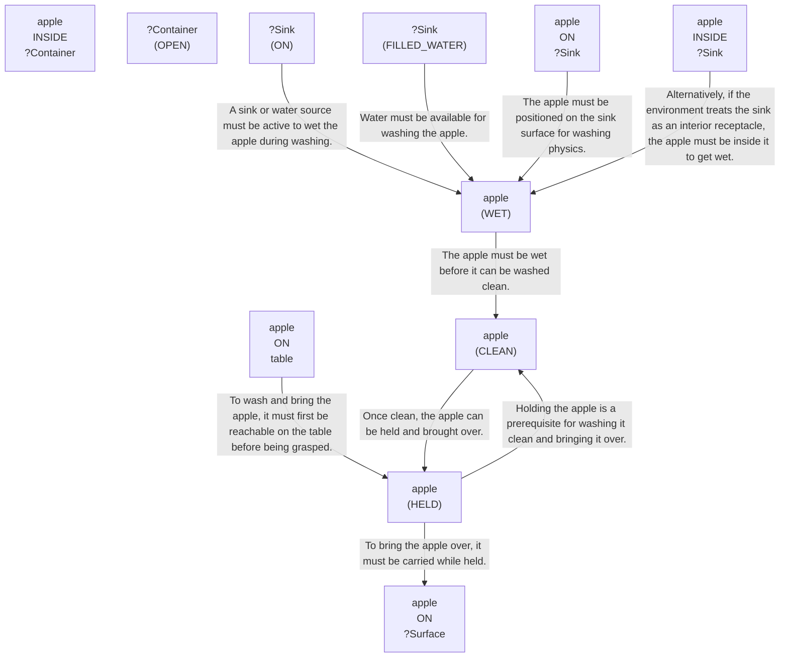
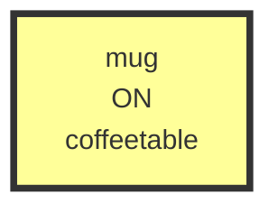
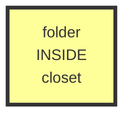
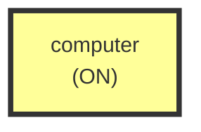
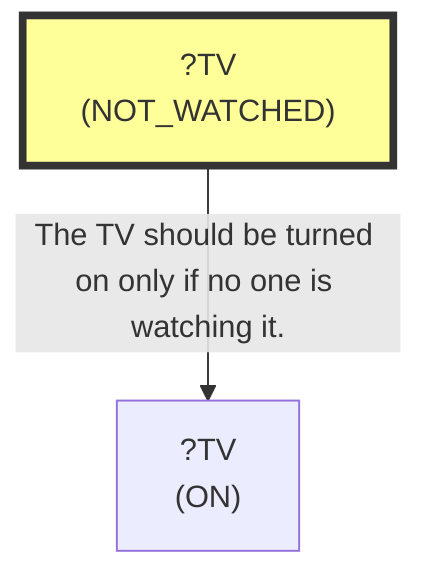

# 🚀 VirtualHome Agent Episode Log


### [GoalReasoner (Module A - Intent)] Output
```json
{
  "is_instruction_obviously_vague": false,
  "clarification_question": null,
  "target_object": "apples",
  "location_hint": "the table",
  "reasoning_chain": [
    {
      "question": "Why does the user want this object?",
      "answer": "To have the apples available after they are cleaned."
    },
    {
      "question": "Why is that important?",
      "answer": "The user likely wants to use or consume the apples in a cleaned state."
    },
    {
      "question": "What fundamental need does this fulfill?",
      "answer": "It supports getting food ready for use or eating."
    },
    {
      "question": "Are there any deeper psychological or physical motivations?",
      "answer": "The user may be trying to satisfy hunger, convenience, or a preference for cleanliness before handling or eating food."
    }
  ],
  "deep_intent": "The user wants cleaned food brought to them so it is ready for use or consumption.",
  "acceptable_alternatives_properties": [
    {
      "priority": 1,
      "description": "Other whole fruits that can be washed and brought over, such as pears, grapes, or oranges."
    },
    {
      "priority": 2,
      "description": "Other edible produce items that are typically rinsed before use, such as plums, peaches, or berries."
    },
    {
      "priority": 3,
      "description": "Other ready-to-handle snack foods that can be brought over cleanly, such as packaged fruit cups or prewashed fruit."
    },
    {
      "priority": 4,
      "description": "Other foods that can satisfy a need for a ready-to-eat item, even if they are not fruit."
    }
  ]
}
```

### [RoboStateMultiTaskController] Output
```json
{
  "action": "[walk] <bathroom> (11)",
  "active_task_id": "task_1",
  "task_context": {
    "active_task_id": "task_1",
    "pending_task_ids": [
      "task_2",
      "task_3",
      "task_4",
      "task_5",
      "task_6",
      "task_7"
    ],
    "satisfied_task_ids": []
  },
  "source": "room_frontier"
}
```
## Step 0
- **Action**: `[walk] <bathroom> (11)`
- **Action Success**: `True`
- **Action Message**: {'0': {'message': 'Success'}}
- **Active Task**: `task_1`
- **Decision Source**: `room_frontier`
- **Task Progress**: G1_02=pending, E1_11=pending, E1_03=pending, E1_17=pending, E1_07=pending, E1_01=pending, E1_15=pending
- **SDG Status**:

- **Observed Items (114)**: floor(206), floor(207), floor(208), floor(209), floor(210), floor(211), wall(212), wall(213), wall(214), wall(215), wall(216), wall(217), ceiling(218), ceiling(219), ceiling(220)...


### [RoboStateMultiTaskController] Output
```json
{
  "action": "[walk] <bedroom> (73)",
  "active_task_id": "task_1",
  "task_context": {
    "active_task_id": "task_1",
    "pending_task_ids": [
      "task_2",
      "task_3",
      "task_4",
      "task_5",
      "task_6",
      "task_7"
    ],
    "satisfied_task_ids": []
  },
  "source": "room_frontier"
}
```
## Step 1
- **Action**: `[walk] <bedroom> (73)`
- **Action Success**: `True`
- **Action Message**: {'0': {'message': 'Success'}}
- **Active Task**: `task_1`
- **Decision Source**: `room_frontier`
- **Task Progress**: G1_02=pending, E1_11=pending, E1_03=pending, E1_17=pending, E1_07=pending, E1_01=pending, E1_15=pending
- **SDG Status**:

- **Observed Items (175)**: floor(206), floor(207), floor(208), floor(209), floor(210), floor(211), wall(212), wall(213), wall(214), wall(215), wall(216), wall(217), ceiling(218), ceiling(219), ceiling(220)...


### [RoboStateMultiTaskController] Output
```json
{
  "action": "[walk] <livingroom> (335)",
  "active_task_id": "task_1",
  "task_context": {
    "active_task_id": "task_1",
    "pending_task_ids": [
      "task_2",
      "task_3",
      "task_4",
      "task_5",
      "task_6",
      "task_7"
    ],
    "satisfied_task_ids": []
  },
  "source": "room_frontier"
}
```
## Step 2
- **Action**: `[walk] <livingroom> (335)`
- **Action Success**: `True`
- **Action Message**: {'0': {'message': 'Success'}}
- **Active Task**: `task_1`
- **Decision Source**: `room_frontier`
- **Task Progress**: G1_02=pending, E1_11=pending, E1_03=pending, E1_17=pending, E1_07=pending, E1_01=pending, E1_15=pending
- **SDG Status**:

- **Observed Items (259)**: floor(206), floor(207), floor(208), floor(209), floor(210), floor(211), wall(212), wall(213), wall(214), wall(215), wall(216), wall(217), ceiling(218), ceiling(219), ceiling(220)...


### [GoalReasoner (Module A - Intent)] Output
```json
{
  "is_instruction_obviously_vague": false,
  "clarification_question": null,
  "target_object": "book",
  "location_hint": "sofa",
  "reasoning_chain": [
    {
      "question": "Why does the user want this object moved?",
      "answer": "To place an unorganized book in a specific resting area."
    },
    {
      "question": "Why is that important?",
      "answer": "To organize the book by relocating it to the sofa."
    },
    {
      "question": "What fundamental need does this fulfill?",
      "answer": "It fulfills the need to tidy or organize a space by putting an item in a designated location."
    },
    {
      "question": "Are there any deeper psychological or physical motivations?",
      "answer": "The user likely wants to reduce clutter, keep the environment orderly, or make the book easier to find or use later."
    }
  ],
  "deep_intent": "The user wants to organize a misplaced item by moving it to a designated indoor location.",
  "acceptable_alternatives_properties": [
    {
      "priority": 1,
      "description": "Other book-like reading materials, such as magazines or notebooks, that are similarly out of place and can be moved to the sofa."
    },
    {
      "priority": 2,
      "description": "Other small paper-based items that are unorganized, such as documents or manuals, if they are intended to be grouped with reading material."
    },
    {
      "priority": 3,
      "description": "Other loose household items that belong in a living-area resting spot, if the goal is general tidying rather than book-specific organization."
    },
    {
      "priority": 4,
      "description": "Any nearby portable item that needs to be relocated to reduce clutter, when the main intent is overall organization rather than the specific object type."
    }
  ]
}
```

### [PerceptionFilter] Output
```json
{
  "reasoning": "The goal is to move a book onto the sofa, so the only required objects are the target item and the destination location. No tools or alternative functional objects are needed for this simple relocation task.",
  "selected_classes": [
    "character",
    "door",
    "sofa",
    "book",
    "paper"
  ],
  "raw_class_count": 103
}
```

### [LLMExecutor] Output
```json
{
  "reasoning": "The active goal is to place a book on the sofa. The character is already close to the sofa in the living room, but the book is not nearby: book(268) is inside the kitchen and book(190) is inside the bedroom. Since the task only requires a book to end up ON the sofa, the best available choice is to move the closest matching book currently visible, book(190) in the bedroom, toward the sofa. The next necessary step is to walk to that book before grabbing it.",
  "satisfied_nodes": [],
  "current_node_focus": "N1",
  "mapped_variables": {},
  "action": "[walk] <book> (190)"
}
```

### [RoboStateMultiTaskController] Output
```json
{
  "action": "[walk] <book> (190)",
  "active_task_id": "task_3",
  "task_context": {
    "active_task_id": "task_3",
    "pending_task_ids": [
      "task_1",
      "task_2",
      "task_4",
      "task_5",
      "task_6",
      "task_7"
    ],
    "satisfied_task_ids": []
  },
  "source": "llm_executor"
}
```
## Step 3
- **Action**: `[walk] <book> (190)`
- **Action Success**: `True`
- **Action Message**: {'0': {'message': 'Success'}}
- **Active Task**: `task_3`
- **Decision Source**: `llm_executor`
- **Task Progress**: G1_02=pending, E1_11=pending, E1_03=pending, E1_17=pending, E1_07=pending, E1_01=pending, E1_15=pending
- **SDG Status**:

- **Observed Items (11)**: door(224) [OPEN], book(268) [CLOSED], character(1), bathroom(11), bedroom(73), kitchen(205), livingroom(335), door(51) [OPEN], book(190) [CLOSED], sofa(368), paper(451)


### [PerceptionFilter] Output
```json
{
  "reasoning": "Reused cached class selection.",
  "selected_classes": [
    "character",
    "door",
    "sofa",
    "book",
    "paper"
  ],
  "raw_class_count": 103
}
```

### [LLMExecutor] Output
```json
{
  "reasoning": "The active task is to place a book on the sofa. The current graph shows book(190) is in the bedroom, while the sofa(368) is in the living room and is a valid flat surface. Since the book is already close to the character in the bedroom, the next necessary step toward completing the task is to pick up the correct book instance. I will target book(190) because it is the book currently near the character and not the unrelated book(268) in the kitchen.",
  "satisfied_nodes": [],
  "current_node_focus": "N1",
  "mapped_variables": {
    "?Book": "book(190)",
    "?TargetSurface": "sofa(368)"
  },
  "action": "[grab] <book> (190)"
}
```

### [RoboStateMultiTaskController] Output
```json
{
  "action": "[grab] <book> (190)",
  "active_task_id": "task_3",
  "task_context": {
    "active_task_id": "task_3",
    "pending_task_ids": [
      "task_1",
      "task_2",
      "task_4",
      "task_5",
      "task_6",
      "task_7"
    ],
    "satisfied_task_ids": []
  },
  "source": "llm_executor"
}
```
## Step 4
- **Action**: `[grab] <book> (190)`
- **Action Success**: `True`
- **Action Message**: {'0': {'message': 'Success'}}
- **Active Task**: `task_3`
- **Decision Source**: `llm_executor`
- **Task Progress**: G1_02=pending, E1_11=pending, E1_03=pending, E1_17=pending, E1_07=pending, E1_01=pending, E1_15=pending
- **SDG Status**:

- **Observed Items (11)**: door(224) [OPEN], book(268) [CLOSED], character(1), bathroom(11), bedroom(73), kitchen(205), livingroom(335), door(51) [OPEN], book(190) [CLOSED], sofa(368), paper(451)


### [PerceptionFilter] Output
```json
{
  "reasoning": "Reused cached class selection.",
  "selected_classes": [
    "character",
    "door",
    "sofa",
    "book",
    "paper"
  ],
  "raw_class_count": 103
}
```

### [LLMExecutor] Output
```json
{
  "reasoning": "The active goal is to place a book on the sofa. The currently held book is book(190), and the sofa(368) is already visible in the livingroom and close to the character. Since putback requires being explicitly walked to the destination first, the next step should be to move to the sofa before placing the book there.",
  "satisfied_nodes": [],
  "current_node_focus": "N1",
  "mapped_variables": {
    "?TargetObject": "book(190)",
    "?Destination": "sofa(368)"
  },
  "action": "[walk] <sofa> (368)"
}
```

### [RoboStateMultiTaskController] Output
```json
{
  "action": "[walk] <sofa> (368)",
  "active_task_id": "task_3",
  "task_context": {
    "active_task_id": "task_3",
    "pending_task_ids": [
      "task_1",
      "task_2",
      "task_4",
      "task_5",
      "task_6",
      "task_7"
    ],
    "satisfied_task_ids": []
  },
  "source": "llm_executor"
}
```
## Step 5
- **Action**: `[walk] <sofa> (368)`
- **Action Success**: `True`
- **Action Message**: {'0': {'message': 'Success'}}
- **Active Task**: `task_3`
- **Decision Source**: `llm_executor`
- **Task Progress**: G1_02=pending, E1_11=pending, E1_03=pending, E1_17=pending, E1_07=pending, E1_01=pending, E1_15=pending
- **SDG Status**:

- **Observed Items (11)**: door(224) [OPEN], book(268) [CLOSED], character(1), bathroom(11), bedroom(73), kitchen(205), livingroom(335), door(51) [OPEN], book(190) [CLOSED], sofa(368), paper(451)


### [PerceptionFilter] Output
```json
{
  "reasoning": "Reused cached class selection.",
  "selected_classes": [
    "character",
    "door",
    "sofa",
    "book",
    "paper"
  ],
  "raw_class_count": 103
}
```

### [LLMExecutor] Output
```json
{
  "reasoning": "The active goal is to place book(190) on sofa(368). The current graph shows character(1) is already close to both the held book(190) and the sofa(368), so the prerequisite walk is already satisfied. The book is currently held in the right hand, and the sofa is a valid flat surface for putback. Therefore the next atomic action is to place the held book onto the sofa.",
  "satisfied_nodes": [],
  "current_node_focus": "N1",
  "mapped_variables": {},
  "action": "[putback] <book> (190) <sofa> (368)"
}
```

### [RoboStateMultiTaskController] Output
```json
{
  "action": "[putback] <book> (190) <sofa> (368)",
  "active_task_id": "task_3",
  "task_context": {
    "active_task_id": "task_3",
    "pending_task_ids": [
      "task_1",
      "task_2",
      "task_4",
      "task_5",
      "task_6",
      "task_7"
    ],
    "satisfied_task_ids": []
  },
  "source": "llm_executor"
}
```
## Step 6
- **Action**: `[putback] <book> (190) <sofa> (368)`
- **Action Success**: `True`
- **Action Message**: {'0': {'message': 'Success'}}
- **Active Task**: `task_3`
- **Decision Source**: `llm_executor`
- **Task Progress**: G1_02=pending, E1_11=pending, E1_03=done, E1_17=pending, E1_07=pending, E1_01=pending, E1_15=pending
- **SDG Status**:

- **Observed Items (11)**: door(224) [OPEN], book(268) [CLOSED], character(1), bathroom(11), bedroom(73), kitchen(205), livingroom(335), door(51) [OPEN], book(190) [CLOSED], sofa(368), paper(451)


### [GoalReasoner (Module A - Intent)] Output
```json
{
  "is_instruction_obviously_vague": false,
  "clarification_question": null,
  "target_object": "mug",
  "location_hint": "coffeetable",
  "reasoning_chain": [
    {
      "question": "Why does the user want this object?",
      "answer": "They want the mug to be kept on the coffeetable."
    },
    {
      "question": "Why is that important?",
      "answer": "They want the mug to remain in a specific place rather than being elsewhere."
    },
    {
      "question": "What fundamental need does this fulfill?",
      "answer": "It fulfills a need for organized object placement and predictable access to the mug."
    },
    {
      "question": "Are there any deeper psychological or physical motivations?",
      "answer": "The user may want a tidy, stable arrangement in the room and easy reachability of the mug."
    }
  ],
  "deep_intent": "The user wants an object to remain in a specific location for organization and easy access.",
  "acceptable_alternatives_properties": [
    {
      "priority": 1,
      "description": "Other small drink containers or similar handheld vessels that can be kept on the same surface"
    },
    {
      "priority": 2,
      "description": "Other tabletop personal items that can stay on the coffeetable without interfering with the space"
    },
    {
      "priority": 3,
      "description": "Any stable household item that can be placed and left on a flat surface for organization"
    },
    {
      "priority": 4,
      "description": "A different nearby flat surface that serves the same organizational purpose if the coffeetable is unavailable"
    }
  ]
}
```

### [PerceptionFilter] Output
```json
{
  "reasoning": "The goal is to keep the mug on the coffeetable, so the only strictly necessary classes are the target object and its specified location/surface. No extra tools or alternatives are required for a simple placement task.",
  "selected_classes": [
    "mug",
    "character",
    "coffeetable"
  ],
  "raw_class_count": 103
}
```

### [LLMExecutor] Output
```json
{
  "reasoning": "The active goal is to have a mug on the coffeetable. The character is already CLOSE to coffeetable(371), so the remaining gap is to place a mug onto that surface. There are two mug candidates: mug(194) is inside the kitchen, and mug(447) is already in the livingroom. Since the task only requires a mug on the coffeetable and we should choose the nearest suitable instance, the best next step is to walk to the nearby mug(447) so it can be grabbed next.",
  "satisfied_nodes": [],
  "current_node_focus": "N1",
  "mapped_variables": {
    "?TargetMug": "mug(447)",
    "?Surface": "coffeetable(371)"
  },
  "action": "[walk] <mug> (447)"
}
```

### [RoboStateMultiTaskController] Output
```json
{
  "action": "[walk] <mug> (447)",
  "active_task_id": "task_5",
  "task_context": {
    "active_task_id": "task_5",
    "pending_task_ids": [
      "task_1",
      "task_2",
      "task_4",
      "task_6",
      "task_7"
    ],
    "satisfied_task_ids": [
      "task_3"
    ]
  },
  "source": "llm_executor"
}
```
## Step 7
- **Action**: `[walk] <mug> (447)`
- **Action Success**: `True`
- **Action Message**: {'0': {'message': 'Success'}}
- **Active Task**: `task_5`
- **Decision Source**: `llm_executor`
- **Task Progress**: G1_02=pending, E1_11=pending, E1_03=done, E1_17=pending, E1_07=pending, E1_01=pending, E1_15=pending
- **SDG Status**:

- **Observed Items (9)**: mug(194), character(1), bathroom(11), bedroom(73), kitchen(205), livingroom(335), coffeetable(111), coffeetable(371), mug(447)


### [PerceptionFilter] Output
```json
{
  "reasoning": "Reused cached class selection.",
  "selected_classes": [
    "mug",
    "character",
    "coffeetable"
  ],
  "raw_class_count": 103
}
```

### [LLMExecutor] Output
```json
{
  "reasoning": "The active goal is to place the mug on a coffeetable. The current graph shows mug(447) is already close to the character and in the livingroom, so the next required step is to grab it before moving it to a coffeetable. There are two coffeetable instances: coffeetable(111) in the bedroom and coffeetable(371) in the livingroom. Since the mug is currently in the livingroom and the goal only specifies 'coffeetable' with no further disambiguation, the best match is the livingroom coffeetable(371). However, to satisfy the proximity rule for placement, the immediate next action must be to pick up the mug first.",
  "satisfied_nodes": [],
  "current_node_focus": "N1",
  "mapped_variables": {},
  "action": "[grab] <mug> (447)"
}
```

### [RoboStateMultiTaskController] Output
```json
{
  "action": "[grab] <mug> (447)",
  "active_task_id": "task_5",
  "task_context": {
    "active_task_id": "task_5",
    "pending_task_ids": [
      "task_1",
      "task_2",
      "task_4",
      "task_6",
      "task_7"
    ],
    "satisfied_task_ids": [
      "task_3"
    ]
  },
  "source": "llm_executor"
}
```
## Step 8
- **Action**: `[grab] <mug> (447)`
- **Action Success**: `True`
- **Action Message**: {'0': {'message': 'Success'}}
- **Active Task**: `task_5`
- **Decision Source**: `llm_executor`
- **Task Progress**: G1_02=pending, E1_11=pending, E1_03=done, E1_17=pending, E1_07=pending, E1_01=pending, E1_15=pending
- **SDG Status**:

- **Observed Items (9)**: mug(194), character(1), bathroom(11), bedroom(73), kitchen(205), livingroom(335), coffeetable(111), coffeetable(371), mug(447)


### [PerceptionFilter] Output
```json
{
  "reasoning": "Reused cached class selection.",
  "selected_classes": [
    "mug",
    "character",
    "coffeetable"
  ],
  "raw_class_count": 103
}
```

### [LLMExecutor] Output
```json
{
  "reasoning": "The active goal is to place a mug on a coffeetable. The current graph shows mug(447) is already held by the character, so the next required step is to move to a valid coffeetable before using putback. There are two coffeetables: coffeetable(111) is in the bedroom and coffeetable(371) is in the livingroom. Since the character is already in the livingroom and coffeetable(371) is in the same room, it is the best target for the placement.",
  "satisfied_nodes": [],
  "current_node_focus": "N1",
  "mapped_variables": {
    "?TargetSurface": "coffeetable(371)"
  },
  "action": "[walk] <coffeetable> (371)"
}
```

### [RoboStateMultiTaskController] Output
```json
{
  "action": "[walk] <coffeetable> (371)",
  "active_task_id": "task_5",
  "task_context": {
    "active_task_id": "task_5",
    "pending_task_ids": [
      "task_1",
      "task_2",
      "task_4",
      "task_6",
      "task_7"
    ],
    "satisfied_task_ids": [
      "task_3"
    ]
  },
  "source": "llm_executor"
}
```
## Step 9
- **Action**: `[walk] <coffeetable> (371)`
- **Action Success**: `True`
- **Action Message**: {'0': {'message': 'Success'}}
- **Active Task**: `task_5`
- **Decision Source**: `llm_executor`
- **Task Progress**: G1_02=pending, E1_11=pending, E1_03=done, E1_17=pending, E1_07=pending, E1_01=pending, E1_15=pending
- **SDG Status**:

- **Observed Items (9)**: mug(194), character(1), bathroom(11), bedroom(73), kitchen(205), livingroom(335), coffeetable(111), coffeetable(371), mug(447)


### [PerceptionFilter] Output
```json
{
  "reasoning": "Reused cached class selection.",
  "selected_classes": [
    "mug",
    "character",
    "coffeetable"
  ],
  "raw_class_count": 103
}
```

### [LLMExecutor] Output
```json
{
  "reasoning": "The active goal is to place the mug on the coffeetable. The currently held mug(447) is already close to coffeetable(371), so the next required step is to put it down on that surface. I will use the exact mug instance already in hand and the nearby coffeetable in the living room.",
  "satisfied_nodes": [],
  "current_node_focus": "N1",
  "mapped_variables": {},
  "action": "[putback] <mug> (447) <coffeetable> (371)"
}
```

### [RoboStateMultiTaskController] Output
```json
{
  "action": "[putback] <mug> (447) <coffeetable> (371)",
  "active_task_id": "task_5",
  "task_context": {
    "active_task_id": "task_5",
    "pending_task_ids": [
      "task_1",
      "task_2",
      "task_4",
      "task_6",
      "task_7"
    ],
    "satisfied_task_ids": [
      "task_3"
    ]
  },
  "source": "llm_executor"
}
```
## Step 10
- **Action**: `[putback] <mug> (447) <coffeetable> (371)`
- **Action Success**: `True`
- **Action Message**: {'0': {'message': 'Success'}}
- **Active Task**: `task_5`
- **Decision Source**: `llm_executor`
- **Task Progress**: G1_02=pending, E1_11=pending, E1_03=done, E1_17=pending, E1_07=done, E1_01=pending, E1_15=pending
- **SDG Status**:

- **Observed Items (9)**: mug(194), character(1), bathroom(11), bedroom(73), kitchen(205), livingroom(335), coffeetable(111), coffeetable(371), mug(447)


### [GoalReasoner (Module A - Intent)] Output
```json
{
  "is_instruction_obviously_vague": false,
  "clarification_question": null,
  "target_object": "folder",
  "location_hint": "closet",
  "reasoning_chain": [
    {
      "question": "Why does the user want this object?",
      "answer": "To store the folder away in a designated place."
    },
    {
      "question": "Why is that important?",
      "answer": "To keep the folder organized and out of the way."
    },
    {
      "question": "What fundamental need does this fulfill?",
      "answer": "It fulfills the need to organize and tidy the indoor environment."
    },
    {
      "question": "Are there any deeper psychological or physical motivations?",
      "answer": "The user likely wants reduced clutter and easier retrieval of the item later."
    }
  ],
  "deep_intent": "The user wants to organize and store an item away.",
  "acceptable_alternatives_properties": [
    {
      "priority": 1,
      "description": "Other paper document holders or small storage organizers that can keep papers neatly stored"
    },
    {
      "priority": 2,
      "description": "Similar household organizers such as binders, file sleeves, or document boxes"
    },
    {
      "priority": 3,
      "description": "Any compact storage container suitable for keeping paperwork organized"
    },
    {
      "priority": 4,
      "description": "Other indoor storage locations or organizers that serve the same tidying purpose"
    }
  ]
}
```

### [PerceptionFilter] Output
```json
{
  "reasoning": "The goal is to store a folder away in a closet. The required target object is folder, and the explicitly mentioned location is closet. No additional tools are needed for this storage task.",
  "selected_classes": [
    "character",
    "door",
    "folder",
    "box",
    "closet",
    "paper"
  ],
  "raw_class_count": 103
}
```

### [LLMExecutor] Output
```json
{
  "reasoning": "The active goal is to place a folder inside a closet. In the current graph, there are two folders, and the one in the bedroom (folder 203) is the best match because it is already in the target area hinted by the goal. However, I cannot interact with it from the living room, and the last action was not a walk to this folder. The correct next step is to walk to folder 203 so I can later grab it and move it into the closet.",
  "satisfied_nodes": [],
  "current_node_focus": "N1",
  "mapped_variables": {
    "?Folder": "folder(203)",
    "?Closet": "closet(112)"
  },
  "action": "[walk] <folder> (203)"
}
```

### [RoboStateMultiTaskController] Output
```json
{
  "action": "[walk] <folder> (203)",
  "active_task_id": "task_7",
  "task_context": {
    "active_task_id": "task_7",
    "pending_task_ids": [
      "task_1",
      "task_2",
      "task_4",
      "task_6"
    ],
    "satisfied_task_ids": [
      "task_3",
      "task_5"
    ]
  },
  "source": "llm_executor"
}
```
## Step 11
- **Action**: `[walk] <folder> (203)`
- **Action Success**: `True`
- **Action Message**: {'0': {'message': 'Success'}}
- **Active Task**: `task_7`
- **Decision Source**: `llm_executor`
- **Task Progress**: G1_02=pending, E1_11=pending, E1_03=done, E1_17=pending, E1_07=done, E1_01=pending, E1_15=pending
- **SDG Status**:

- **Observed Items (15)**: door(224) [OPEN], box(300) [CLOSED], character(1), bathroom(11), bedroom(73), kitchen(205), livingroom(335), door(51) [OPEN], closet(112) [OPEN], closet(127) [CLOSED], folder(203) [CLOSED], closet(374) [CLOSED], box(435) [CLOSED], paper(451), folder(453) [CLOSED]


### [PerceptionFilter] Output
```json
{
  "reasoning": "Reused cached class selection.",
  "selected_classes": [
    "character",
    "door",
    "folder",
    "box",
    "closet",
    "paper"
  ],
  "raw_class_count": 103
}
```

### [LLMExecutor] Output
```json
{
  "reasoning": "The active goal is to place the folder inside a closet. The current graph shows folder(203) is already close to the character, and closet(112) is an open closet in the bedroom, making it the best target for the INSIDE relation. Because I must explicitly walk to the destination before putting an object inside it, the next step is to approach closet(112).",
  "satisfied_nodes": [],
  "current_node_focus": "N1",
  "mapped_variables": {
    "?Container": "closet(112)"
  },
  "action": "[walk] <closet> (112)"
}
```

### [RoboStateMultiTaskController] Output
```json
{
  "action": "[walk] <closet> (112)",
  "active_task_id": "task_7",
  "task_context": {
    "active_task_id": "task_7",
    "pending_task_ids": [
      "task_1",
      "task_2",
      "task_4",
      "task_6"
    ],
    "satisfied_task_ids": [
      "task_3",
      "task_5"
    ]
  },
  "source": "llm_executor"
}
```
## Step 12
- **Action**: `[walk] <closet> (112)`
- **Action Success**: `True`
- **Action Message**: {'0': {'message': 'Success'}}
- **Active Task**: `task_7`
- **Decision Source**: `llm_executor`
- **Task Progress**: G1_02=pending, E1_11=pending, E1_03=done, E1_17=pending, E1_07=done, E1_01=pending, E1_15=pending
- **SDG Status**:

- **Observed Items (15)**: door(224) [OPEN], box(300) [CLOSED], character(1), bathroom(11), bedroom(73), kitchen(205), livingroom(335), door(51) [OPEN], closet(112) [OPEN], closet(127) [CLOSED], folder(203) [CLOSED], closet(374) [CLOSED], box(435) [CLOSED], paper(451), folder(453) [CLOSED]


### [PerceptionFilter] Output
```json
{
  "reasoning": "Reused cached class selection.",
  "selected_classes": [
    "character",
    "door",
    "folder",
    "box",
    "closet",
    "paper"
  ],
  "raw_class_count": 103
}
```

### [LLMExecutor] Output
```json
{
  "reasoning": "The active goal is to place the folder inside the closet. We have already walked to closet(112), which is open and in the same room as the robot. The current folder candidate closest to the last known target is folder(203) in the bedroom, and it is grabbable. The next required step is to get the folder into hand before it can be placed into the closet.",
  "satisfied_nodes": [],
  "current_node_focus": "N1",
  "mapped_variables": {
    "?Container": "folder(203)",
    "?Closet": "closet(112)"
  },
  "action": "[grab] <folder> (203)"
}
```

### [RoboStateMultiTaskController] Output
```json
{
  "action": "[walk] <folder> (203)",
  "active_task_id": "task_7",
  "task_context": {
    "active_task_id": "task_7",
    "pending_task_ids": [
      "task_1",
      "task_2",
      "task_4",
      "task_6"
    ],
    "satisfied_task_ids": [
      "task_3",
      "task_5"
    ]
  },
  "source": "llm_executor_repaired"
}
```
## Step 13
- **Action**: `[walk] <folder> (203)`
- **Action Success**: `True`
- **Action Message**: {'0': {'message': 'Success'}}
- **Active Task**: `task_7`
- **Decision Source**: `llm_executor_repaired`
- **Task Progress**: G1_02=pending, E1_11=pending, E1_03=done, E1_17=pending, E1_07=done, E1_01=pending, E1_15=pending
- **SDG Status**:

- **Observed Items (15)**: door(224) [OPEN], box(300) [CLOSED], character(1), bathroom(11), bedroom(73), kitchen(205), livingroom(335), door(51) [OPEN], closet(112) [OPEN], closet(127) [CLOSED], folder(203) [CLOSED], closet(374) [CLOSED], box(435) [CLOSED], paper(451), folder(453) [CLOSED]


### [PerceptionFilter] Output
```json
{
  "reasoning": "Reused cached class selection.",
  "selected_classes": [
    "character",
    "door",
    "folder",
    "box",
    "closet",
    "paper"
  ],
  "raw_class_count": 103
}
```

### [LLMExecutor] Output
```json
{
  "reasoning": "The active goal is to place a folder inside a closet. The current graph shows folder(203) is in the bedroom and character(1) is close to it, while closet(112) in the bedroom is OPEN, so the prerequisite destination is already available. Because I just walked to the folder in the previous step, the next valid step is to grab the folder before transporting it to the closet.",
  "satisfied_nodes": [],
  "current_node_focus": "N1",
  "mapped_variables": {
    "?Container": "closet(112)",
    "?Object": "folder(203)"
  },
  "action": "[grab] <folder> (203)"
}
```

### [RoboStateMultiTaskController] Output
```json
{
  "action": "[grab] <folder> (203)",
  "active_task_id": "task_7",
  "task_context": {
    "active_task_id": "task_7",
    "pending_task_ids": [
      "task_1",
      "task_2",
      "task_4",
      "task_6"
    ],
    "satisfied_task_ids": [
      "task_3",
      "task_5"
    ]
  },
  "source": "llm_executor"
}
```
## Step 14
- **Action**: `[grab] <folder> (203)`
- **Action Success**: `True`
- **Action Message**: {'0': {'message': 'Success'}}
- **Active Task**: `task_7`
- **Decision Source**: `llm_executor`
- **Task Progress**: G1_02=pending, E1_11=pending, E1_03=done, E1_17=pending, E1_07=done, E1_01=pending, E1_15=pending
- **SDG Status**:

- **Observed Items (15)**: door(224) [OPEN], box(300) [CLOSED], character(1), bathroom(11), bedroom(73), kitchen(205), livingroom(335), door(51) [OPEN], closet(112) [OPEN], closet(127) [CLOSED], folder(203) [CLOSED], closet(374) [CLOSED], box(435) [CLOSED], paper(451), folder(453) [CLOSED]


### [PerceptionFilter] Output
```json
{
  "reasoning": "Reused cached class selection.",
  "selected_classes": [
    "character",
    "door",
    "folder",
    "box",
    "closet",
    "paper"
  ],
  "raw_class_count": 103
}
```

### [LLMExecutor] Output
```json
{
  "reasoning": "The active goal is to get folder(203) inside closet(112). The folder is already being held in the right hand, and the target closet(112) is open. Since put-in actions require being explicitly walked to the destination first, the next step is to move near the open closet so the folder can be placed inside on the following action.",
  "satisfied_nodes": [],
  "current_node_focus": "N1",
  "mapped_variables": {
    "?Container": "closet(112)"
  },
  "action": "[walk] <closet> (112)"
}
```

### [RoboStateMultiTaskController] Output
```json
{
  "action": "[walk] <closet> (112)",
  "active_task_id": "task_7",
  "task_context": {
    "active_task_id": "task_7",
    "pending_task_ids": [
      "task_1",
      "task_2",
      "task_4",
      "task_6"
    ],
    "satisfied_task_ids": [
      "task_3",
      "task_5"
    ]
  },
  "source": "llm_executor"
}
```
## Step 15
- **Action**: `[walk] <closet> (112)`
- **Action Success**: `True`
- **Action Message**: {'0': {'message': 'Success'}}
- **Active Task**: `task_7`
- **Decision Source**: `llm_executor`
- **Task Progress**: G1_02=pending, E1_11=pending, E1_03=done, E1_17=pending, E1_07=done, E1_01=pending, E1_15=pending
- **SDG Status**:

- **Observed Items (15)**: door(224) [OPEN], box(300) [CLOSED], character(1), bathroom(11), bedroom(73), kitchen(205), livingroom(335), door(51) [OPEN], closet(112) [OPEN], closet(127) [CLOSED], folder(203) [CLOSED], closet(374) [CLOSED], box(435) [CLOSED], paper(451), folder(453) [CLOSED]


### [PerceptionFilter] Output
```json
{
  "reasoning": "Reused cached class selection.",
  "selected_classes": [
    "character",
    "door",
    "folder",
    "box",
    "closet",
    "paper"
  ],
  "raw_class_count": 103
}
```

### [LLMExecutor] Output
```json
{
  "reasoning": "The target folder is already in hand (HOLDS_RH folder(203)) and the robot is already close to the correct destination closet(112). The SDG goal is to have the folder inside the closet, so the next required step is to place the held folder into the open closet. No other task objects should be touched.",
  "satisfied_nodes": [],
  "current_node_focus": "N1",
  "mapped_variables": {
    "?Container": "closet(112)"
  },
  "action": "[putin] <folder> (203) <closet> (112)"
}
```

### [RoboStateMultiTaskController] Output
```json
{
  "action": "[putin] <folder> (203) <closet> (112)",
  "active_task_id": "task_7",
  "task_context": {
    "active_task_id": "task_7",
    "pending_task_ids": [
      "task_1",
      "task_2",
      "task_4",
      "task_6"
    ],
    "satisfied_task_ids": [
      "task_3",
      "task_5"
    ]
  },
  "source": "llm_executor"
}
```
## Step 16
- **Action**: `[putin] <folder> (203) <closet> (112)`
- **Action Success**: `True`
- **Action Message**: {'0': {'message': 'Success'}}
- **Active Task**: `task_7`
- **Decision Source**: `llm_executor`
- **Task Progress**: G1_02=pending, E1_11=pending, E1_03=done, E1_17=pending, E1_07=done, E1_01=pending, E1_15=done
- **SDG Status**:

- **Observed Items (15)**: door(224) [OPEN], box(300) [CLOSED], character(1), bathroom(11), bedroom(73), kitchen(205), livingroom(335), door(51) [OPEN], closet(112) [OPEN], closet(127) [CLOSED], folder(203) [CLOSED], closet(374) [CLOSED], box(435) [CLOSED], paper(451), folder(453) [CLOSED]


### [GoalReasoner (Module A - Intent)] Output
```json
{
  "is_instruction_obviously_vague": false,
  "clarification_question": null,
  "target_object": "computer",
  "location_hint": null,
  "reasoning_chain": [
    {
      "question": "Why does the user want this object?",
      "answer": "To have the computer powered on if it is currently off."
    },
    {
      "question": "Why is that important?",
      "answer": "Because the computer being off prevents it from being usable."
    },
    {
      "question": "What fundamental need does this fulfill?",
      "answer": "It fulfills the need to use a functioning computer."
    },
    {
      "question": "Are there any deeper psychological or physical motivations?",
      "answer": "The user likely wants to continue a task, access information, or interact with the computer without interruption."
    }
  ],
  "deep_intent": "The user wants to enable access to a usable computer.",
  "acceptable_alternatives_properties": [
    {
      "priority": 1,
      "description": "Another usable computer or similar computing device that is already powered on"
    },
    {
      "priority": 2,
      "description": "A different powered-on device capable of performing the same task, such as a laptop, tablet, or desktop computer"
    },
    {
      "priority": 3,
      "description": "A ready-to-use electronic device that can provide access to the needed function or information"
    },
    {
      "priority": 4,
      "description": "Any household digital device that can substitute for the intended computer use, such as a smart tablet or workstation"
    }
  ]
}
```

### [PerceptionFilter] Output
```json
{
  "reasoning": "The goal is to have the computer powered on. The only strictly necessary object class from the observed list is the computer itself; no extra tool or location is required by the SDG. The powered state is a property of the computer, not a separate object class to keep.",
  "selected_classes": [
    "desk",
    "character",
    "computer"
  ],
  "raw_class_count": 103
}
```

### [LLMExecutor] Output
```json
{
  "reasoning": "The active SDG has a single node: computer ON. There are two candidate computers, both currently OFF. Since the instruction is to make the computer powered on and the goal does not specify which one, either usable computer can satisfy the task. I should target the nearby bedroom computer first. Because I must be adjacent before switching it on, the next atomic action is to walk to computer(174).",
  "satisfied_nodes": [],
  "current_node_focus": "N1",
  "mapped_variables": {},
  "action": "[walk] <computer> (174)"
}
```

### [RoboStateMultiTaskController] Output
```json
{
  "action": "[walk] <computer> (174)",
  "active_task_id": "task_2",
  "task_context": {
    "active_task_id": "task_2",
    "pending_task_ids": [
      "task_1",
      "task_4",
      "task_6"
    ],
    "satisfied_task_ids": [
      "task_3",
      "task_5",
      "task_7"
    ]
  },
  "source": "llm_executor"
}
```
## Step 17
- **Action**: `[walk] <computer> (174)`
- **Action Success**: `True`
- **Action Message**: {'0': {'message': 'Success'}}
- **Active Task**: `task_2`
- **Decision Source**: `llm_executor`
- **Task Progress**: G1_02=pending, E1_11=pending, E1_03=done, E1_17=pending, E1_07=done, E1_01=pending, E1_15=done
- **SDG Status**:

- **Observed Items (9)**: character(1), bathroom(11), bedroom(73), kitchen(205), livingroom(335), desk(108) [CLOSED], computer(174) [OFF], desk(373) [CLOSED], computer(433) [OFF]


### [PerceptionFilter] Output
```json
{
  "reasoning": "Reused cached class selection.",
  "selected_classes": [
    "desk",
    "character",
    "computer"
  ],
  "raw_class_count": 103
}
```

### [LLMExecutor] Output
```json
{
  "reasoning": "The active SDG has a single final node: computer(174) must be ON. The filtered graph shows computer(174) is OFF and currently CLOSE to the character, so the next step is to turn it on. No plug-in step is needed because the computer has HAS_SWITCH and no plug-related requirement is shown.",
  "satisfied_nodes": [],
  "current_node_focus": "N1",
  "mapped_variables": {},
  "action": "[switchon] <computer> (174)"
}
```

### [RoboStateMultiTaskController] Output
```json
{
  "action": "[switchon] <computer> (174)",
  "active_task_id": "task_2",
  "task_context": {
    "active_task_id": "task_2",
    "pending_task_ids": [
      "task_1",
      "task_4",
      "task_6"
    ],
    "satisfied_task_ids": [
      "task_3",
      "task_5",
      "task_7"
    ]
  },
  "source": "llm_executor"
}
```
## Step 18
- **Action**: `[switchon] <computer> (174)`
- **Action Success**: `True`
- **Action Message**: Faked switch operation in Python layer (bypassed Unity failure)
- **Active Task**: `task_2`
- **Decision Source**: `llm_executor`
- **Task Progress**: G1_02=pending, E1_11=done, E1_03=done, E1_17=pending, E1_07=done, E1_01=pending, E1_15=done
- **SDG Status**:

- **Observed Items (9)**: character(1), bathroom(11), bedroom(73), kitchen(205), livingroom(335), desk(108) [CLOSED], computer(174) [OFF], desk(373) [CLOSED], computer(433) [OFF]


### [GoalReasoner (Module A - Intent)] Output
```json
{
  "is_instruction_obviously_vague": true,
  "clarification_question": "What should I do if no one is watching the TV—turn it on to a specific channel/input or just power it on, and do you mean the TV in a particular room?",
  "target_object": "TV",
  "location_hint": null,
  "reasoning_chain": [
    {
      "question": "Why does the user want this object?",
      "answer": "To have the television powered on when it is not being watched."
    },
    {
      "question": "Why is that important?",
      "answer": "It may be for convenience, ambient background use, or to keep the TV ready for viewing."
    },
    {
      "question": "What fundamental need does this fulfill?",
      "answer": "Maintain an active entertainment or information display state."
    },
    {
      "question": "Are there any deeper psychological or physical motivations?",
      "answer": "Possibly to avoid leaving the TV idle, to provide background noise/light, or to ensure it is prepared for immediate use."
    }
  ],
  "deep_intent": "The user wants to keep a media display active when it is not being directly attended to.",
  "acceptable_alternatives_properties": [
    {
      "priority": 1,
      "description": "Other indoor media displays or screens that can be powered on for viewing or background use, such as a monitor or tablet"
    },
    {
      "priority": 2,
      "description": "Other entertainment devices that can provide continuous visual content, such as a projector or smart display"
    },
    {
      "priority": 3,
      "description": "Audio-visual devices that can remain active for background presence, such as a radio or speaker with media playback"
    },
    {
      "priority": 4,
      "description": "Other household devices that can provide ambient activity or presence, such as a lamp or digital clock display"
    }
  ]
}
```

### [PerceptionFilter] Output
```json
{
  "reasoning": "The goal is to keep a TV active when not being watched. The only strictly necessary target class is the TV itself; no specific room or supporting appliance is required by the SDG, and no alternative display/device is needed because the target is explicitly TV.",
  "selected_classes": [
    "clock",
    "character",
    "door",
    "tv"
  ],
  "raw_class_count": 103
}
```

### [LLMExecutor] Output
```json
{
  "reasoning": "The active task is explicitly ambiguous: the goal asks to turn on the TV when no one is watching, but it does not specify which TV to use or whether I should just power it on versus select a channel/input. The filtered graph contains two candidate TVs in different rooms (tv(264) in the kitchen and tv(426) in the living room). Per the clarification rule, I should ask before taking any physical action.",
  "satisfied_nodes": [],
  "current_node_focus": "N2",
  "mapped_variables": {},
  "action": "[ask] What should I do if no one is watching the TV—turn it on to a specific channel/input or just power it on, and do you mean the TV in a particular room?"
}
```

### [RoboStateMultiTaskController] Output
```json
{
  "action": "[ask] What should I do if no one is watching the TV—turn it on to a specific channel/input or just power it on, and do you mean the TV in a particular room?",
  "active_task_id": "task_6",
  "task_context": {
    "active_task_id": "task_6",
    "pending_task_ids": [
      "task_1",
      "task_4"
    ],
    "satisfied_task_ids": [
      "task_2",
      "task_3",
      "task_5",
      "task_7"
    ]
  },
  "source": "llm_executor"
}
```
## Step 19
- **Action**: `[ask] What should I do if no one is watching the TV—turn it on to a specific channel/input or just power it on, and do you mean the TV in a particular room?`
- **Action Success**: `True`
- **Action Message**: nothing to claim
- **Active Task**: `task_6`
- **Decision Source**: `llm_executor`
- **Task Progress**: G1_02=pending, E1_11=done, E1_03=done, E1_17=pending, E1_07=done, E1_01=pending, E1_15=done
- **SDG Status**:

- **Observed Items (10)**: door(224) [OPEN], tv(264) [OFF], clock(265) [OFF], character(1), bathroom(11), bedroom(73), kitchen(205), livingroom(335), door(51) [OPEN], tv(426) [OFF]


### [PerceptionFilter] Output
```json
{
  "reasoning": "Reused cached class selection.",
  "selected_classes": [
    "clock",
    "character",
    "door",
    "tv"
  ],
  "raw_class_count": 103
}
```

### [LLMExecutor] Output
```json
{
  "reasoning": "The task is to keep the TV ON while not watched. The clarification has already been handled, so I must act autonomously. There are two candidate TVs in the graph: tv(264) in the kitchen and tv(426) in the livingroom. Since the character is currently in the bedroom and tv(426) is close to the character, it is the most immediate valid binding for ?TV. The current gap is that tv(426) is OFF, and the SDG requires it to be ON. To interact with its switch, I must first walk to it.",
  "satisfied_nodes": [
    "N2"
  ],
  "current_node_focus": "N1",
  "mapped_variables": {
    "?TV": "tv(426)"
  },
  "action": "[walk] <tv> (426)"
}
```

### [RoboStateMultiTaskController] Output
```json
{
  "action": "[walk] <tv> (426)",
  "active_task_id": "task_6",
  "task_context": {
    "active_task_id": "task_6",
    "pending_task_ids": [
      "task_1",
      "task_4"
    ],
    "satisfied_task_ids": [
      "task_2",
      "task_3",
      "task_5",
      "task_7"
    ]
  },
  "source": "llm_executor"
}
```
## Step 20
- **Action**: `[walk] <tv> (426)`
- **Action Success**: `True`
- **Action Message**: {'0': {'message': 'Success'}}
- **Active Task**: `task_6`
- **Decision Source**: `llm_executor`
- **Task Progress**: G1_02=pending, E1_11=done, E1_03=done, E1_17=pending, E1_07=done, E1_01=pending, E1_15=done
- **SDG Status**:
```mermaid
graph TD
    N1["?TV<br>(ON)"]
    style N1 fill:#ff9,stroke:#333,stroke-width:4px
    N2["?TV<br>(NOT_WATCHED)"]
    style N2 fill:#9f9,stroke:#333,stroke-width:2px
    N2 -->|"The TV should be turned on only if no one is watching it."| N1
```
- **Observed Items (10)**: door(224) [OPEN], tv(264) [OFF], clock(265) [OFF], character(1), bathroom(11), bedroom(73), kitchen(205), livingroom(335), door(51) [OPEN], tv(426) [OFF]


### [PerceptionFilter] Output
```json
{
  "reasoning": "Reused cached class selection.",
  "selected_classes": [
    "clock",
    "character",
    "door",
    "tv"
  ],
  "raw_class_count": 103
}
```

### [LLMExecutor] Output
```json
{
  "reasoning": "The active SDG requires the TV to be NOT_WATCHED before it is ON. The current graph shows tv(426) is already CLOSE to the character and is OFF, so the next logical step is to turn it on. There is no active global rule blocking interaction, and the clarification has already been resolved, so I must act autonomously. I will target the TV in the current room (tv 426), not the kitchen TV, because I am already close to tv(426).",
  "satisfied_nodes": [
    "N2"
  ],
  "current_node_focus": "N1",
  "mapped_variables": {
    "?TV": "tv(426)"
  },
  "action": "[switchon] <tv> (426)"
}
```

### [RoboStateMultiTaskController] Output
```json
{
  "action": "[switchon] <tv> (426)",
  "active_task_id": "task_6",
  "task_context": {
    "active_task_id": "task_6",
    "pending_task_ids": [
      "task_1",
      "task_4"
    ],
    "satisfied_task_ids": [
      "task_2",
      "task_3",
      "task_5",
      "task_7"
    ]
  },
  "source": "llm_executor"
}
```
## Step 21
- **Action**: `[switchon] <tv> (426)`
- **Action Success**: `True`
- **Action Message**: Faked switch operation in Python layer (bypassed Unity failure)
- **Active Task**: `task_6`
- **Decision Source**: `llm_executor`
- **Task Progress**: G1_02=pending, E1_11=done, E1_03=done, E1_17=pending, E1_07=done, E1_01=done, E1_15=done
- **SDG Status**:
```mermaid
graph TD
    N1["?TV<br>(ON)"]
    style N1 fill:#ff9,stroke:#333,stroke-width:4px
    N2["?TV<br>(NOT_WATCHED)"]
    style N2 fill:#9f9,stroke:#333,stroke-width:2px
    N2 -->|"The TV should be turned on only if no one is watching it."| N1
```
- **Observed Items (10)**: door(224) [OPEN], tv(264) [OFF], clock(265) [OFF], character(1), bathroom(11), bedroom(73), kitchen(205), livingroom(335), door(51) [OPEN], tv(426) [OFF]


### [GoalReasoner (Module A - Intent)] Output
```json
{
  "is_instruction_obviously_vague": false,
  "clarification_question": null,
  "target_object": "radio",
  "location_hint": null,
  "reasoning_chain": [
    {
      "question": "Why does the user want this object?",
      "answer": "To have the radio powered on."
    },
    {
      "question": "Why is that important?",
      "answer": "So it can play audio or provide access to radio output."
    },
    {
      "question": "What fundamental need does this fulfill?",
      "answer": "The need to receive audio entertainment or information."
    },
    {
      "question": "Are there any deeper psychological or physical motivations?",
      "answer": "The user may want to hear content, create background sound, or confirm the device is active."
    }
  ],
  "deep_intent": "Receive audio entertainment or information",
  "acceptable_alternatives_properties": [
    {
      "priority": 1,
      "description": "Other audio playback devices that can be turned on, such as a speaker, music player, or TV with sound enabled"
    },
    {
      "priority": 2,
      "description": "Other household devices that provide audible content, such as a clock radio or smart display with audio"
    },
    {
      "priority": 3,
      "description": "Any device that can produce background audio, such as a tablet or phone with media playback"
    },
    {
      "priority": 4,
      "description": "Other sources of sound or spoken content that satisfy the same need for audio input, such as a computer"
    }
  ]
}
```

### [RoboStateMultiTaskController] Output
```json
{
  "action": "[walk] <kitchen> (205)",
  "active_task_id": null,
  "task_context": {
    "active_task_id": null,
    "pending_task_ids": [
      "task_1",
      "task_4"
    ],
    "satisfied_task_ids": [
      "task_2",
      "task_3",
      "task_5",
      "task_6",
      "task_7"
    ]
  },
  "source": "loop_recovery_room_revisit"
}
```
## Step 22
- **Action**: `[walk] <kitchen> (205)`
- **Action Success**: `True`
- **Action Message**: {'0': {'message': 'Success'}}
- **Decision Source**: `loop_recovery_room_revisit`
- **Task Progress**: G1_02=pending, E1_11=done, E1_03=done, E1_17=pending, E1_07=done, E1_01=done, E1_15=done
- **SDG Status**:
No SDG active.
- **Observed Items (332)**: floor(206), floor(207), floor(208), floor(209), floor(210), floor(211), wall(212), wall(213), wall(214), wall(215), wall(216), wall(217), ceiling(218), ceiling(219), ceiling(220)...


### [RoboStateMultiTaskController] Output
```json
{
  "action": "[walk] <bathroom> (11)",
  "active_task_id": null,
  "task_context": {
    "active_task_id": null,
    "pending_task_ids": [
      "task_1",
      "task_4"
    ],
    "satisfied_task_ids": [
      "task_2",
      "task_3",
      "task_5",
      "task_6",
      "task_7"
    ]
  },
  "source": "loop_recovery_room_revisit"
}
```
## Step 23
- **Action**: `[walk] <bathroom> (11)`
- **Action Success**: `True`
- **Action Message**: {'0': {'message': 'Success'}}
- **Decision Source**: `loop_recovery_room_revisit`
- **Task Progress**: G1_02=pending, E1_11=done, E1_03=done, E1_17=pending, E1_07=done, E1_01=done, E1_15=done
- **SDG Status**:
No SDG active.
- **Observed Items (332)**: floor(206), floor(207), floor(208), floor(209), floor(210), floor(211), wall(212), wall(213), wall(214), wall(215), wall(216), wall(217), ceiling(218), ceiling(219), ceiling(220)...


### [RoboStateMultiTaskController] Output
```json
{
  "action": "[walk] <bedroom> (73)",
  "active_task_id": null,
  "task_context": {
    "active_task_id": null,
    "pending_task_ids": [
      "task_1",
      "task_4"
    ],
    "satisfied_task_ids": [
      "task_2",
      "task_3",
      "task_5",
      "task_6",
      "task_7"
    ]
  },
  "source": "loop_recovery_room_revisit"
}
```
## Step 24
- **Action**: `[walk] <bedroom> (73)`
- **Action Success**: `True`
- **Action Message**: {'0': {'message': 'Success'}}
- **Decision Source**: `loop_recovery_room_revisit`
- **Task Progress**: G1_02=pending, E1_11=done, E1_03=done, E1_17=pending, E1_07=done, E1_01=done, E1_15=done
- **SDG Status**:
No SDG active.
- **Observed Items (332)**: floor(206), floor(207), floor(208), floor(209), floor(210), floor(211), wall(212), wall(213), wall(214), wall(215), wall(216), wall(217), ceiling(218), ceiling(219), ceiling(220)...


### [RoboStateMultiTaskController] Output
```json
{
  "action": "[walk] <livingroom> (335)",
  "active_task_id": null,
  "task_context": {
    "active_task_id": null,
    "pending_task_ids": [
      "task_1",
      "task_4"
    ],
    "satisfied_task_ids": [
      "task_2",
      "task_3",
      "task_5",
      "task_6",
      "task_7"
    ]
  },
  "source": "loop_recovery_room_revisit"
}
```
## Step 25
- **Action**: `[walk] <livingroom> (335)`
- **Action Success**: `True`
- **Action Message**: {'0': {'message': 'Success'}}
- **Decision Source**: `loop_recovery_room_revisit`
- **Task Progress**: G1_02=pending, E1_11=done, E1_03=done, E1_17=pending, E1_07=done, E1_01=done, E1_15=done
- **SDG Status**:
No SDG active.
- **Observed Items (332)**: floor(206), floor(207), floor(208), floor(209), floor(210), floor(211), wall(212), wall(213), wall(214), wall(215), wall(216), wall(217), ceiling(218), ceiling(219), ceiling(220)...


### [RoboStateMultiTaskController] Output
```json
{
  "action": "[walk] <kitchen> (205)",
  "active_task_id": null,
  "task_context": {
    "active_task_id": null,
    "pending_task_ids": [
      "task_1",
      "task_4"
    ],
    "satisfied_task_ids": [
      "task_2",
      "task_3",
      "task_5",
      "task_6",
      "task_7"
    ]
  },
  "source": "loop_recovery_room_revisit"
}
```
## Step 26
- **Action**: `[walk] <kitchen> (205)`
- **Action Success**: `True`
- **Action Message**: {'0': {'message': 'Success'}}
- **Decision Source**: `loop_recovery_room_revisit`
- **Task Progress**: G1_02=pending, E1_11=done, E1_03=done, E1_17=pending, E1_07=done, E1_01=done, E1_15=done
- **SDG Status**:
No SDG active.
- **Observed Items (332)**: floor(206), floor(207), floor(208), floor(209), floor(210), floor(211), wall(212), wall(213), wall(214), wall(215), wall(216), wall(217), ceiling(218), ceiling(219), ceiling(220)...


### [RoboStateMultiTaskController] Output
```json
{
  "action": "[walk] <bathroom> (11)",
  "active_task_id": null,
  "task_context": {
    "active_task_id": null,
    "pending_task_ids": [
      "task_1",
      "task_4"
    ],
    "satisfied_task_ids": [
      "task_2",
      "task_3",
      "task_5",
      "task_6",
      "task_7"
    ]
  },
  "source": "loop_recovery_room_revisit"
}
```
## Step 27
- **Action**: `[walk] <bathroom> (11)`
- **Action Success**: `True`
- **Action Message**: {'0': {'message': 'Success'}}
- **Decision Source**: `loop_recovery_room_revisit`
- **Task Progress**: G1_02=pending, E1_11=done, E1_03=done, E1_17=pending, E1_07=done, E1_01=done, E1_15=done
- **SDG Status**:
No SDG active.
- **Observed Items (332)**: floor(206), floor(207), floor(208), floor(209), floor(210), floor(211), wall(212), wall(213), wall(214), wall(215), wall(216), wall(217), ceiling(218), ceiling(219), ceiling(220)...


### [RoboStateMultiTaskController] Output
```json
{
  "action": "[walk] <bedroom> (73)",
  "active_task_id": null,
  "task_context": {
    "active_task_id": null,
    "pending_task_ids": [
      "task_1",
      "task_4"
    ],
    "satisfied_task_ids": [
      "task_2",
      "task_3",
      "task_5",
      "task_6",
      "task_7"
    ]
  },
  "source": "loop_recovery_room_revisit"
}
```
## Step 28
- **Action**: `[walk] <bedroom> (73)`
- **Action Success**: `True`
- **Action Message**: {'0': {'message': 'Success'}}
- **Decision Source**: `loop_recovery_room_revisit`
- **Task Progress**: G1_02=pending, E1_11=done, E1_03=done, E1_17=pending, E1_07=done, E1_01=done, E1_15=done
- **SDG Status**:
No SDG active.
- **Observed Items (332)**: floor(206), floor(207), floor(208), floor(209), floor(210), floor(211), wall(212), wall(213), wall(214), wall(215), wall(216), wall(217), ceiling(218), ceiling(219), ceiling(220)...


### [RoboStateMultiTaskController] Output
```json
{
  "action": "[walk] <livingroom> (335)",
  "active_task_id": null,
  "task_context": {
    "active_task_id": null,
    "pending_task_ids": [
      "task_1",
      "task_4"
    ],
    "satisfied_task_ids": [
      "task_2",
      "task_3",
      "task_5",
      "task_6",
      "task_7"
    ]
  },
  "source": "loop_recovery_room_revisit"
}
```
## Step 29
- **Action**: `[walk] <livingroom> (335)`
- **Action Success**: `True`
- **Action Message**: {'0': {'message': 'Success'}}
- **Decision Source**: `loop_recovery_room_revisit`
- **Task Progress**: G1_02=pending, E1_11=done, E1_03=done, E1_17=pending, E1_07=done, E1_01=done, E1_15=done
- **SDG Status**:
No SDG active.
- **Observed Items (332)**: floor(206), floor(207), floor(208), floor(209), floor(210), floor(211), wall(212), wall(213), wall(214), wall(215), wall(216), wall(217), ceiling(218), ceiling(219), ceiling(220)...


### [RoboStateMultiTaskController] Output
```json
{
  "action": "[walk] <kitchen> (205)",
  "active_task_id": null,
  "task_context": {
    "active_task_id": null,
    "pending_task_ids": [
      "task_1",
      "task_4"
    ],
    "satisfied_task_ids": [
      "task_2",
      "task_3",
      "task_5",
      "task_6",
      "task_7"
    ]
  },
  "source": "loop_recovery_room_revisit"
}
```
## Step 30
- **Action**: `[walk] <kitchen> (205)`
- **Action Success**: `True`
- **Action Message**: {'0': {'message': 'Success'}}
- **Decision Source**: `loop_recovery_room_revisit`
- **Task Progress**: G1_02=pending, E1_11=done, E1_03=done, E1_17=pending, E1_07=done, E1_01=done, E1_15=done
- **SDG Status**:
No SDG active.
- **Observed Items (332)**: floor(206), floor(207), floor(208), floor(209), floor(210), floor(211), wall(212), wall(213), wall(214), wall(215), wall(216), wall(217), ceiling(218), ceiling(219), ceiling(220)...


### [RoboStateMultiTaskController] Output
```json
{
  "action": "[walk] <bathroom> (11)",
  "active_task_id": null,
  "task_context": {
    "active_task_id": null,
    "pending_task_ids": [
      "task_1",
      "task_4"
    ],
    "satisfied_task_ids": [
      "task_2",
      "task_3",
      "task_5",
      "task_6",
      "task_7"
    ]
  },
  "source": "loop_recovery_room_revisit"
}
```
## Step 31
- **Action**: `[walk] <bathroom> (11)`
- **Action Success**: `True`
- **Action Message**: {'0': {'message': 'Success'}}
- **Decision Source**: `loop_recovery_room_revisit`
- **Task Progress**: G1_02=pending, E1_11=done, E1_03=done, E1_17=pending, E1_07=done, E1_01=done, E1_15=done
- **SDG Status**:
No SDG active.
- **Observed Items (332)**: floor(206), floor(207), floor(208), floor(209), floor(210), floor(211), wall(212), wall(213), wall(214), wall(215), wall(216), wall(217), ceiling(218), ceiling(219), ceiling(220)...


### [RoboStateMultiTaskController] Output
```json
{
  "action": "[walk] <bedroom> (73)",
  "active_task_id": null,
  "task_context": {
    "active_task_id": null,
    "pending_task_ids": [
      "task_1",
      "task_4"
    ],
    "satisfied_task_ids": [
      "task_2",
      "task_3",
      "task_5",
      "task_6",
      "task_7"
    ]
  },
  "source": "loop_recovery_room_revisit"
}
```
## Step 32
- **Action**: `[walk] <bedroom> (73)`
- **Action Success**: `True`
- **Action Message**: {'0': {'message': 'Success'}}
- **Decision Source**: `loop_recovery_room_revisit`
- **Task Progress**: G1_02=pending, E1_11=done, E1_03=done, E1_17=pending, E1_07=done, E1_01=done, E1_15=done
- **SDG Status**:
No SDG active.
- **Observed Items (332)**: floor(206), floor(207), floor(208), floor(209), floor(210), floor(211), wall(212), wall(213), wall(214), wall(215), wall(216), wall(217), ceiling(218), ceiling(219), ceiling(220)...


### [RoboStateMultiTaskController] Output
```json
{
  "action": "[walk] <livingroom> (335)",
  "active_task_id": null,
  "task_context": {
    "active_task_id": null,
    "pending_task_ids": [
      "task_1",
      "task_4"
    ],
    "satisfied_task_ids": [
      "task_2",
      "task_3",
      "task_5",
      "task_6",
      "task_7"
    ]
  },
  "source": "loop_recovery_room_revisit"
}
```
## Step 33
- **Action**: `[walk] <livingroom> (335)`
- **Action Success**: `True`
- **Action Message**: {'0': {'message': 'Success'}}
- **Decision Source**: `loop_recovery_room_revisit`
- **Task Progress**: G1_02=pending, E1_11=done, E1_03=done, E1_17=pending, E1_07=done, E1_01=done, E1_15=done
- **SDG Status**:
No SDG active.
- **Observed Items (332)**: floor(206), floor(207), floor(208), floor(209), floor(210), floor(211), wall(212), wall(213), wall(214), wall(215), wall(216), wall(217), ceiling(218), ceiling(219), ceiling(220)...


### [RoboStateMultiTaskController] Output
```json
{
  "action": "[walk] <kitchen> (205)",
  "active_task_id": null,
  "task_context": {
    "active_task_id": null,
    "pending_task_ids": [
      "task_1",
      "task_4"
    ],
    "satisfied_task_ids": [
      "task_2",
      "task_3",
      "task_5",
      "task_6",
      "task_7"
    ]
  },
  "source": "loop_recovery_room_revisit"
}
```
## Step 34
- **Action**: `[walk] <kitchen> (205)`
- **Action Success**: `True`
- **Action Message**: {'0': {'message': 'Success'}}
- **Decision Source**: `loop_recovery_room_revisit`
- **Task Progress**: G1_02=pending, E1_11=done, E1_03=done, E1_17=pending, E1_07=done, E1_01=done, E1_15=done
- **SDG Status**:
No SDG active.
- **Observed Items (332)**: floor(206), floor(207), floor(208), floor(209), floor(210), floor(211), wall(212), wall(213), wall(214), wall(215), wall(216), wall(217), ceiling(218), ceiling(219), ceiling(220)...


### [RoboStateMultiTaskController] Output
```json
{
  "action": "[walk] <bathroom> (11)",
  "active_task_id": null,
  "task_context": {
    "active_task_id": null,
    "pending_task_ids": [
      "task_1",
      "task_4"
    ],
    "satisfied_task_ids": [
      "task_2",
      "task_3",
      "task_5",
      "task_6",
      "task_7"
    ]
  },
  "source": "loop_recovery_room_revisit"
}
```
## Step 35
- **Action**: `[walk] <bathroom> (11)`
- **Action Success**: `True`
- **Action Message**: {'0': {'message': 'Success'}}
- **Decision Source**: `loop_recovery_room_revisit`
- **Task Progress**: G1_02=pending, E1_11=done, E1_03=done, E1_17=pending, E1_07=done, E1_01=done, E1_15=done
- **SDG Status**:
No SDG active.
- **Observed Items (332)**: floor(206), floor(207), floor(208), floor(209), floor(210), floor(211), wall(212), wall(213), wall(214), wall(215), wall(216), wall(217), ceiling(218), ceiling(219), ceiling(220)...


### [RoboStateMultiTaskController] Output
```json
{
  "action": "[walk] <bedroom> (73)",
  "active_task_id": null,
  "task_context": {
    "active_task_id": null,
    "pending_task_ids": [
      "task_1",
      "task_4"
    ],
    "satisfied_task_ids": [
      "task_2",
      "task_3",
      "task_5",
      "task_6",
      "task_7"
    ]
  },
  "source": "loop_recovery_room_revisit"
}
```
## Step 36
- **Action**: `[walk] <bedroom> (73)`
- **Action Success**: `True`
- **Action Message**: {'0': {'message': 'Success'}}
- **Decision Source**: `loop_recovery_room_revisit`
- **Task Progress**: G1_02=pending, E1_11=done, E1_03=done, E1_17=pending, E1_07=done, E1_01=done, E1_15=done
- **SDG Status**:
No SDG active.
- **Observed Items (332)**: floor(206), floor(207), floor(208), floor(209), floor(210), floor(211), wall(212), wall(213), wall(214), wall(215), wall(216), wall(217), ceiling(218), ceiling(219), ceiling(220)...

