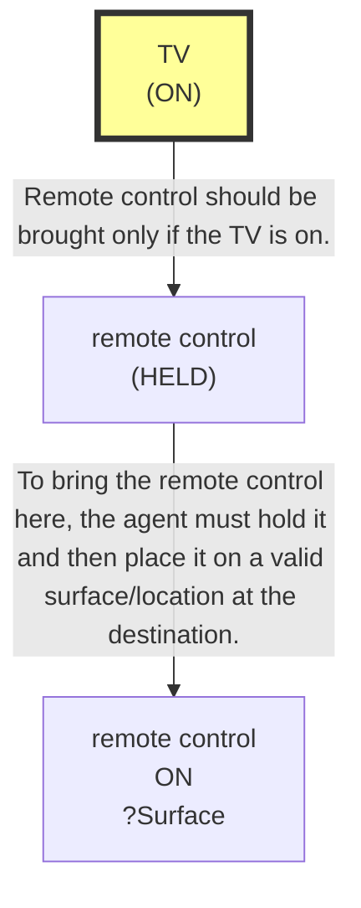
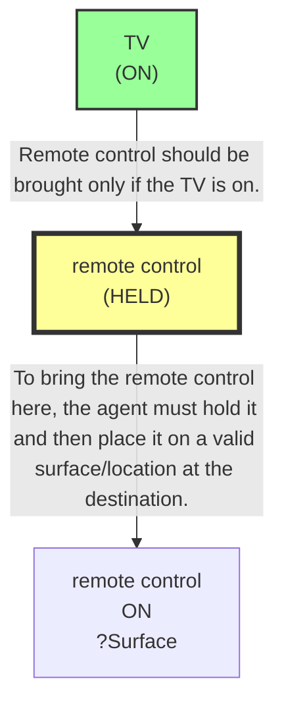
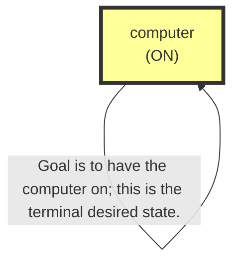

# 🚀 VirtualHome Agent Episode Log


### [GoalReasoner (Module A - Intent)] Output
```json
{
  "is_instruction_obviously_vague": false,
  "clarification_question": null,
  "target_object": "remote control",
  "location_hint": "here",
  "reasoning_chain": [
    {
      "question": "Why does the user want this object?",
      "answer": "To control the TV if it is currently on."
    },
    {
      "question": "Why is that important?",
      "answer": "Because having the control device nearby lets the user manage the TV without getting up or searching for it."
    },
    {
      "question": "What fundamental need does this fulfill?",
      "answer": "It fulfills the need to conveniently operate an active entertainment device."
    },
    {
      "question": "Are there any deeper psychological or physical motivations?",
      "answer": "The user likely wants ease, convenience, and immediate access to TV controls."
    }
  ],
  "deep_intent": "The user wants convenient control of an active entertainment device.",
  "acceptable_alternatives_properties": [
    {
      "priority": 1,
      "description": "Other nearby TV control devices or compatible controllers, such as a universal remote or a spare remote"
    },
    {
      "priority": 2,
      "description": "Any handheld device that can control the TV, such as a phone app or smart-home controller"
    },
    {
      "priority": 3,
      "description": "Alternative input devices that can operate the same entertainment system, such as a set-top box remote"
    },
    {
      "priority": 4,
      "description": "A direct way to operate the TV itself, such as physical buttons on the television"
    }
  ]
}
```

### [PerceptionFilter] Output
```json
{
  "reasoning": "The goal is to obtain convenient control of the TV, so the target object class remotecontrol must be kept, along with TV because the SDG requires the TV to be ON. The SDG also requires the remote to be held and placed on a surface, so a valid surface/furniture for placement should be retained; among visible classes, coffeetable and tvstand are the relevant surfaces associated with placing a remote near the TV. Nearby alternative control devices are also retained as backups per instruction, including cellphone and computer.",
  "selected_classes": [
    "character",
    "computer",
    "box",
    "tv",
    "tvstand",
    "coffeetable",
    "cellphone",
    "remotecontrol"
  ],
  "raw_class_count": 40
}
```

### [LLMExecutor] Output
```json
{
  "reasoning": "The active task is to bring the remote control here, but the SDG says the remote should be brought only if the TV is ON. The current graph shows the TV is OFF, so the prerequisite N1 is not satisfied yet. The closest valid next step is to turn the TV on. I can do that because the character is already CLOSE to the TV, and the TV has a switch.",
  "satisfied_nodes": [],
  "current_node_focus": "N1",
  "mapped_variables": {},
  "action": "[switchon] <tv> (426)"
}
```

### [RoboStateMultiTaskController] Output
```json
{
  "action": "[switchon] <tv> (426)",
  "active_task_id": "task_1",
  "task_context": {
    "active_task_id": "task_1",
    "pending_task_ids": [
      "task_2",
      "task_3"
    ],
    "satisfied_task_ids": []
  },
  "source": "llm_executor"
}
```
## Step 0
- **Action**: `[switchon] <tv> (426)`
- **Action Success**: `True`
- **Action Message**: Faked switch operation in Python layer (bypassed Unity failure)
- **Active Task**: `task_1`
- **Decision Source**: `llm_executor`
- **Task Progress**: G1_03=pending, E1_11=pending, E1_03=pending
- **SDG Status**:

- **Observed Items (13)**: tvstand(369), coffeetable(371), tv(426) [OFF], computer(433) [OFF], box(435) [CLOSED], cellphone(448) [OFF], cellphone(449) [OFF], remotecontrol(452) [OFF], character(1), bathroom(11), bedroom(73), kitchen(205), livingroom(335)


### [PerceptionFilter] Output
```json
{
  "reasoning": "Reused cached class selection.",
  "selected_classes": [
    "character",
    "computer",
    "box",
    "tv",
    "tvstand",
    "coffeetable",
    "cellphone",
    "remotecontrol"
  ],
  "raw_class_count": 40
}
```

### [LLMExecutor] Output
```json
{
  "reasoning": "The TV is already ON, so N1 is satisfied. The remote control exists in the living room as remotecontrol(452), but it is not yet held, so N2 is the current focus. Because I must be near an object before grabbing it, and the character is already close to the living room furniture but not explicitly close to the remote itself, the safest next step is to walk directly to the remote control before attempting to grab it.",
  "satisfied_nodes": [
    "N1"
  ],
  "current_node_focus": "N2",
  "mapped_variables": {},
  "action": "[walk] <remotecontrol> (452)"
}
```

### [RoboStateMultiTaskController] Output
```json
{
  "action": "[walk] <remotecontrol> (452)",
  "active_task_id": "task_1",
  "task_context": {
    "active_task_id": "task_1",
    "pending_task_ids": [
      "task_2",
      "task_3"
    ],
    "satisfied_task_ids": []
  },
  "source": "llm_executor"
}
```
## Step 1
- **Action**: `[walk] <remotecontrol> (452)`
- **Action Success**: `True`
- **Action Message**: {'0': {'message': 'Success'}}
- **Active Task**: `task_1`
- **Decision Source**: `llm_executor`
- **Task Progress**: G1_03=pending, E1_11=pending, E1_03=pending
- **SDG Status**:

- **Observed Items (13)**: tvstand(369), coffeetable(371), tv(426) [ON], computer(433) [OFF], box(435) [CLOSED], cellphone(448) [OFF], cellphone(449) [OFF], remotecontrol(452) [OFF], character(1), bathroom(11), bedroom(73), kitchen(205), livingroom(335)


### [PerceptionFilter] Output
```json
{
  "reasoning": "Reused cached class selection.",
  "selected_classes": [
    "character",
    "computer",
    "box",
    "tv",
    "tvstand",
    "coffeetable",
    "cellphone",
    "remotecontrol"
  ],
  "raw_class_count": 40
}
```

### [LLMExecutor] Output
```json
{
  "reasoning": "The TV is already ON, so N1 is satisfied. The remote control is already CLOSE to the character, so the next unmet requirement is to hold it for N2. Since the previous step already walked to remotecontrol(452), the correct next atomic action is to grab it.",
  "satisfied_nodes": [
    "N1"
  ],
  "current_node_focus": "N2",
  "mapped_variables": {},
  "action": "[grab] <remotecontrol> (452)"
}
```

### [RoboStateMultiTaskController] Output
```json
{
  "action": "[grab] <remotecontrol> (452)",
  "active_task_id": "task_1",
  "task_context": {
    "active_task_id": "task_1",
    "pending_task_ids": [
      "task_2",
      "task_3"
    ],
    "satisfied_task_ids": []
  },
  "source": "llm_executor"
}
```
## Step 2
- **Action**: `[grab] <remotecontrol> (452)`
- **Action Success**: `True`
- **Action Message**: {'0': {'message': 'Success'}}
- **Active Task**: `task_1`
- **Decision Source**: `llm_executor`
- **Task Progress**: G1_03=done, E1_11=pending, E1_03=pending
- **SDG Status**:

- **Observed Items (13)**: tvstand(369), coffeetable(371), tv(426) [ON], computer(433) [OFF], box(435) [CLOSED], cellphone(448) [OFF], cellphone(449) [OFF], remotecontrol(452) [OFF], character(1), bathroom(11), bedroom(73), kitchen(205), livingroom(335)


### [GoalReasoner (Module A - Intent)] Output
```json
{
  "is_instruction_obviously_vague": false,
  "clarification_question": null,
  "target_object": "computer",
  "location_hint": null,
  "reasoning_chain": [
    {
      "question": "Why does the user want this object?",
      "answer": "To have the computer powered on if it is currently off."
    },
    {
      "question": "Why is that important?",
      "answer": "Because the computer needs to be on in order to be used."
    },
    {
      "question": "What fundamental need does this fulfill?",
      "answer": "It enables the user to access and operate the computer."
    },
    {
      "question": "Are there any deeper psychological or physical motivations?",
      "answer": "The user likely wants to continue a task, interact with digital content, or restore normal device operation."
    }
  ],
  "deep_intent": "The user wants to restore access to a working computer.",
  "acceptable_alternatives_properties": [
    {
      "priority": 1,
      "description": "Other powered computing devices that can provide similar access, such as a laptop or tablet"
    },
    {
      "priority": 2,
      "description": "A different computer system or terminal that can accomplish the same task"
    },
    {
      "priority": 3,
      "description": "Any functional electronic device that can support the needed digital activity"
    },
    {
      "priority": 4,
      "description": "A temporary manual or paper-based method to continue the task if computation is not essential"
    }
  ]
}
```

### [PerceptionFilter] Output
```json
{
  "reasoning": "The goal is to restore access to a working computer, and the SDG requires the computer to be ON. Minimal needed classes are the computer itself plus the likely interaction tools for powering or operating it: keyboard and mouse. A powersocket is also retained as an essential power-related backup in case the computer is currently unpowered or needs to be plugged in.",
  "selected_classes": [
    "powersocket",
    "keyboard",
    "mouse",
    "paper",
    "computer",
    "character"
  ],
  "raw_class_count": 40
}
```

### [LLMExecutor] Output
```json
{
  "reasoning": "The active goal is to make the computer ON. The current graph shows computer(433) is OFF and is in the livingroom. Since switching it on requires being near it, and no prior action has moved us to the computer yet, the next step should be to walk to the computer before attempting switchon. No other task needs attention.",
  "satisfied_nodes": [],
  "current_node_focus": "N1",
  "mapped_variables": {
    "?Computer": "computer(433)"
  },
  "action": "[walk] <computer> (433)"
}
```

### [RoboStateMultiTaskController] Output
```json
{
  "action": "[walk] <computer> (433)",
  "active_task_id": "task_2",
  "task_context": {
    "active_task_id": "task_2",
    "pending_task_ids": [
      "task_3"
    ],
    "satisfied_task_ids": [
      "task_1"
    ]
  },
  "source": "llm_executor"
}
```
## Step 3
- **Action**: `[walk] <computer> (433)`
- **Action Success**: `True`
- **Action Message**: {'0': {'message': 'Success'}}
- **Active Task**: `task_2`
- **Decision Source**: `llm_executor`
- **Task Progress**: G1_03=done, E1_11=pending, E1_03=pending
- **SDG Status**:

- **Observed Items (10)**: powersocket(428), mouse(429), keyboard(431), computer(433) [OFF], paper(451), character(1), bathroom(11), bedroom(73), kitchen(205), livingroom(335)


### [PerceptionFilter] Output
```json
{
  "reasoning": "Reused cached class selection.",
  "selected_classes": [
    "powersocket",
    "keyboard",
    "mouse",
    "paper",
    "computer",
    "character"
  ],
  "raw_class_count": 40
}
```

### [LLMExecutor] Output
```json
{
  "reasoning": "The active goal is to make the computer ON. The computer(433) is already in the same room and the character is CLOSE to it, so the next required atomic step is to operate its switch. No plug-in is needed because the graph does not show a HAS_PLUG requirement for the computer. The current state gap is simply computer OFF -> ON.",
  "satisfied_nodes": [],
  "current_node_focus": "N1",
  "mapped_variables": {},
  "action": "[switchon] <computer> (433)"
}
```

### [RoboStateMultiTaskController] Output
```json
{
  "action": "[switchon] <computer> (433)",
  "active_task_id": "task_2",
  "task_context": {
    "active_task_id": "task_2",
    "pending_task_ids": [
      "task_3"
    ],
    "satisfied_task_ids": [
      "task_1"
    ]
  },
  "source": "llm_executor"
}
```
## Step 4
- **Action**: `[switchon] <computer> (433)`
- **Action Success**: `True`
- **Action Message**: Faked switch operation in Python layer (bypassed Unity failure)
- **Active Task**: `task_2`
- **Decision Source**: `llm_executor`
- **Task Progress**: G1_03=done, E1_11=done, E1_03=pending
- **SDG Status**:

- **Observed Items (10)**: powersocket(428), mouse(429), keyboard(431), computer(433) [OFF], paper(451), character(1), bathroom(11), bedroom(73), kitchen(205), livingroom(335)


### [GoalReasoner (Module A - Intent)] Output
```json
{
  "is_instruction_obviously_vague": false,
  "clarification_question": null,
  "target_object": "book",
  "location_hint": "sofa",
  "reasoning_chain": [
    {
      "question": "Why does the user want this object?",
      "answer": "To relocate a book that is out of place or unorganized."
    },
    {
      "question": "Why is that important?",
      "answer": "To put the book in a more organized or intended resting place."
    },
    {
      "question": "What fundamental need does this fulfill?",
      "answer": "It helps organize the living space and reduce clutter."
    },
    {
      "question": "Are there any deeper psychological or physical motivations?",
      "answer": "The user likely wants the environment to feel tidier, more orderly, and easier to navigate."
    }
  ],
  "deep_intent": "The user wants to organize a cluttered living space by moving misplaced items to a designated resting area.",
  "acceptable_alternatives_properties": [
    {
      "priority": 1,
      "description": "Other small household items that are out of place and can be moved to the sofa for temporary staging, such as magazines or notebooks."
    },
    {
      "priority": 2,
      "description": "Similar lightweight personal items that are part of household clutter, such as papers or remote controls."
    },
    {
      "priority": 3,
      "description": "Other easy-to-relocate objects that help tidy the area, such as blankets or cushions if they are clearly being rearranged."
    },
    {
      "priority": 4,
      "description": "Any misplaced household item that can be safely moved to reduce clutter in the room."
    }
  ]
}
```

### [RoboStateMultiTaskController] Output
```json
{
  "action": "[walk] <bathroom> (11)",
  "active_task_id": "task_3",
  "task_context": {
    "active_task_id": "task_3",
    "pending_task_ids": [],
    "satisfied_task_ids": [
      "task_1",
      "task_2"
    ]
  },
  "source": "room_frontier"
}
```
## Step 5
- **Action**: `[walk] <bathroom> (11)`
- **Action Success**: `True`
- **Action Message**: {'0': {'message': 'Success'}}
- **Active Task**: `task_3`
- **Decision Source**: `room_frontier`
- **Task Progress**: G1_03=done, E1_11=done, E1_03=pending
- **SDG Status**:

- **Observed Items (79)**: floor(336), floor(337), floor(338), floor(339), floor(340), floor(341), floor(342), floor(343), floor(344), wall(345), wall(346), wall(347), wall(348), wall(349), wall(350)...


### [RoboStateMultiTaskController] Output
```json
{
  "action": "[walk] <bedroom> (73)",
  "active_task_id": "task_3",
  "task_context": {
    "active_task_id": "task_3",
    "pending_task_ids": [],
    "satisfied_task_ids": [
      "task_1",
      "task_2"
    ]
  },
  "source": "room_frontier"
}
```
## Step 6
- **Action**: `[walk] <bedroom> (73)`
- **Action Success**: `True`
- **Action Message**: {'0': {'message': 'Success'}}
- **Active Task**: `task_3`
- **Decision Source**: `room_frontier`
- **Task Progress**: G1_03=done, E1_11=done, E1_03=pending
- **SDG Status**:

- **Observed Items (140)**: floor(336), floor(337), floor(338), floor(339), floor(340), floor(341), floor(342), floor(343), floor(344), wall(345), wall(346), wall(347), wall(348), wall(349), wall(350)...


### [PerceptionFilter] Output
```json
{
  "reasoning": "The task is to relocate a book to the sofa, so the minimum needed classes are the target object and the destination/location explicitly required by the SDG and goal. No extra tools are implied for simply moving the book.",
  "selected_classes": [
    "book",
    "character",
    "sofa",
    "paper"
  ],
  "raw_class_count": 70
}
```

### [LLMExecutor] Output
```json
{
  "reasoning": "The active SDG requires the book to be ON the sofa. The current graph shows book(190) is already close to the character in the bedroom, but the sofa(368) is in the livingroom. To place the book on the sofa, I must first walk to the sofa before any putback action. No other node is satisfied yet because the book is not on the sofa.",
  "satisfied_nodes": [],
  "current_node_focus": "N1",
  "mapped_variables": {},
  "action": "[walk] <sofa> (368)"
}
```

### [RoboStateMultiTaskController] Output
```json
{
  "action": "[walk] <sofa> (368)",
  "active_task_id": "task_3",
  "task_context": {
    "active_task_id": "task_3",
    "pending_task_ids": [],
    "satisfied_task_ids": [
      "task_1",
      "task_2"
    ]
  },
  "source": "llm_executor"
}
```
## Step 7
- **Action**: `[walk] <sofa> (368)`
- **Action Success**: `True`
- **Action Message**: {'0': {'message': 'Success'}}
- **Active Task**: `task_3`
- **Decision Source**: `llm_executor`
- **Task Progress**: G1_03=done, E1_11=done, E1_03=pending
- **SDG Status**:

- **Observed Items (8)**: sofa(368), paper(451), character(1), bathroom(11), bedroom(73), kitchen(205), livingroom(335), book(190) [CLOSED]


### [PerceptionFilter] Output
```json
{
  "reasoning": "Reused cached class selection.",
  "selected_classes": [
    "book",
    "character",
    "sofa",
    "paper"
  ],
  "raw_class_count": 70
}
```

### [LLMExecutor] Output
```json
{
  "reasoning": "The active SDG requires the book to be ON the sofa. The book is currently in the bedroom and already CLOSE to the character, but the sofa is the destination surface and I must explicitly walk to it before any putback action. I do not yet hold the book, so the next step should move me to the sofa to prepare for grabbing and placing the book there.",
  "satisfied_nodes": [],
  "current_node_focus": "N1",
  "mapped_variables": {},
  "action": "[walk] <sofa> (368)"
}
```

### [RoboStateMultiTaskController] Output
```json
{
  "action": "[walk] <sofa> (368)",
  "active_task_id": "task_3",
  "task_context": {
    "active_task_id": "task_3",
    "pending_task_ids": [],
    "satisfied_task_ids": [
      "task_1",
      "task_2"
    ]
  },
  "source": "llm_executor"
}
```
## Step 8
- **Action**: `[walk] <sofa> (368)`
- **Action Success**: `True`
- **Action Message**: {'0': {'message': 'Success'}}
- **Active Task**: `task_3`
- **Decision Source**: `llm_executor`
- **Task Progress**: G1_03=done, E1_11=done, E1_03=pending
- **SDG Status**:

- **Observed Items (8)**: sofa(368), paper(451), character(1), bathroom(11), bedroom(73), kitchen(205), livingroom(335), book(190) [CLOSED]


### [PerceptionFilter] Output
```json
{
  "reasoning": "Reused cached class selection.",
  "selected_classes": [
    "book",
    "character",
    "sofa",
    "paper"
  ],
  "raw_class_count": 70
}
```

### [LLMExecutor] Output
```json
{
  "reasoning": "The active goal is to place the book on the sofa. The current graph shows the sofa is already close to the character, but the book is in the bedroom and only close to the character, not yet on the sofa. Since I must be adjacent to the target object before grabbing it, the next step is to walk to the book to prepare for pickup.",
  "satisfied_nodes": [],
  "current_node_focus": "N1",
  "mapped_variables": {},
  "action": "[walk] <book> (190)"
}
```

### [RoboStateMultiTaskController] Output
```json
{
  "action": "[walk] <book> (190)",
  "active_task_id": "task_3",
  "task_context": {
    "active_task_id": "task_3",
    "pending_task_ids": [],
    "satisfied_task_ids": [
      "task_1",
      "task_2"
    ]
  },
  "source": "llm_executor"
}
```
## Step 9
- **Action**: `[walk] <book> (190)`
- **Action Success**: `True`
- **Action Message**: {'0': {'message': 'Success'}}
- **Active Task**: `task_3`
- **Decision Source**: `llm_executor`
- **Task Progress**: G1_03=done, E1_11=done, E1_03=pending
- **SDG Status**:

- **Observed Items (8)**: sofa(368), paper(451), character(1), bathroom(11), bedroom(73), kitchen(205), livingroom(335), book(190) [CLOSED]


### [PerceptionFilter] Output
```json
{
  "reasoning": "Reused cached class selection.",
  "selected_classes": [
    "book",
    "character",
    "sofa",
    "paper"
  ],
  "raw_class_count": 70
}
```

### [LLMExecutor] Output
```json
{
  "reasoning": "The active SDG requires book on sofa. The character is currently close to book(190), but there is no indication the book is already on the sofa. Since I am near the book, the next necessary step is to grab it before transporting it to the sofa. The book is grabbable and no cleanliness or tool constraints apply.",
  "satisfied_nodes": [],
  "current_node_focus": "N1",
  "mapped_variables": {},
  "action": "[grab] <book> (190)"
}
```

### [RoboStateMultiTaskController] Output
```json
{
  "action": "[grab] <book> (190)",
  "active_task_id": "task_3",
  "task_context": {
    "active_task_id": "task_3",
    "pending_task_ids": [],
    "satisfied_task_ids": [
      "task_1",
      "task_2"
    ]
  },
  "source": "llm_executor"
}
```
## Step 10
- **Action**: `[grab] <book> (190)`
- **Action Success**: `True`
- **Action Message**: {'0': {'message': 'Success'}}
- **Active Task**: `task_3`
- **Decision Source**: `llm_executor`
- **Task Progress**: G1_03=done, E1_11=done, E1_03=pending
- **SDG Status**:

- **Observed Items (8)**: sofa(368), paper(451), character(1), bathroom(11), bedroom(73), kitchen(205), livingroom(335), book(190) [CLOSED]


### [PerceptionFilter] Output
```json
{
  "reasoning": "Reused cached class selection.",
  "selected_classes": [
    "book",
    "character",
    "sofa",
    "paper"
  ],
  "raw_class_count": 70
}
```

### [LLMExecutor] Output
```json
{
  "reasoning": "The active goal is to place the book on the sofa. The current graph shows the book is already held in the left hand (HOLDS_LH) and the sofa is close to the character. Since placement onto a flat surface requires being near the surface, and we are already close to the sofa, the next atomic step is to put the held book onto the sofa.",
  "satisfied_nodes": [],
  "current_node_focus": "N1",
  "mapped_variables": {},
  "action": "[putback] <book> (190) <sofa> (368)"
}
```

### [RoboStateMultiTaskController] Output
```json
{
  "action": "[putback] <book> (190) <sofa> (368)",
  "active_task_id": "task_3",
  "task_context": {
    "active_task_id": "task_3",
    "pending_task_ids": [],
    "satisfied_task_ids": [
      "task_1",
      "task_2"
    ]
  },
  "source": "llm_executor"
}
```
## Step 11
- **Action**: `[putback] <book> (190) <sofa> (368)`
- **Action Success**: `True`
- **Action Message**: {'0': {'message': 'Success'}}
- **Active Task**: `task_3`
- **Decision Source**: `llm_executor`
- **Task Progress**: G1_03=done, E1_11=done, E1_03=done
- **SDG Status**:

- **Observed Items (8)**: sofa(368), paper(451), character(1), bathroom(11), bedroom(73), kitchen(205), livingroom(335), book(190) [CLOSED]

