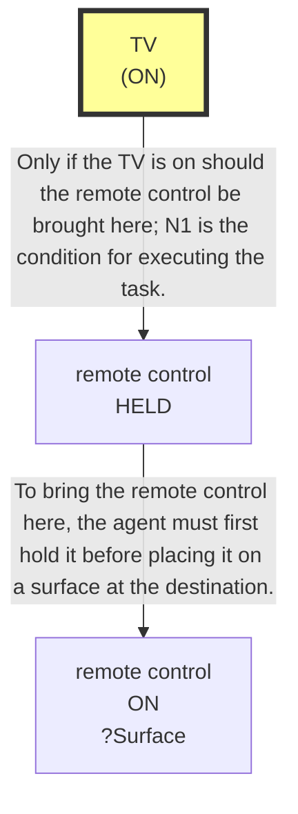
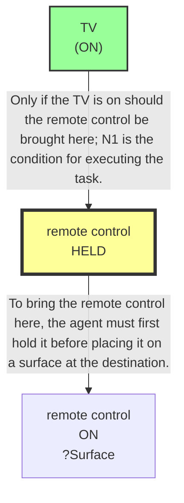
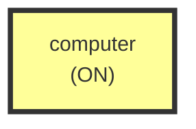

# 🚀 VirtualHome Agent Episode Log


### [GoalReasoner (Module A - Intent)] Output
```json
{
  "is_instruction_obviously_vague": false,
  "clarification_question": null,
  "target_object": "remote control",
  "location_hint": null,
  "reasoning_chain": [
    {
      "question": "Why does the user want this object?",
      "answer": "To control the TV if it is currently on."
    },
    {
      "question": "Why is that important?",
      "answer": "Having the control device nearby lets the user operate the television without getting up or searching for it."
    },
    {
      "question": "What fundamental need does this fulfill?",
      "answer": "It fulfills the need to conveniently manage a currently active entertainment device."
    },
    {
      "question": "Are there any deeper psychological or physical motivations?",
      "answer": "The user likely wants convenience, immediate access, and reduced effort in interacting with the TV."
    }
  ],
  "deep_intent": "The user wants convenient control over an active entertainment device.",
  "acceptable_alternatives_properties": [
    {
      "priority": 1,
      "description": "Other input devices that can control the TV, such as a universal remote or a replacement remote."
    },
    {
      "priority": 2,
      "description": "Any nearby device used to operate the TV, such as a remote app on a phone or a tablet."
    },
    {
      "priority": 3,
      "description": "Another handheld control interface for a household screen, such as a media controller or gamepad if it can operate the TV."
    },
    {
      "priority": 4,
      "description": "A different way to manage the viewing experience, such as turning the TV off or adjusting settings directly on the TV if no remote is available."
    }
  ]
}
```

### [PerceptionFilter] Output
```json
{
  "reasoning": "The goal is to retrieve and place the remote control, with the TV already on as the condition. The only strictly necessary visible target object is the remote control, and the TV must be retained because it is explicitly required by the SDG as an active state condition. No extra tools or furniture are required beyond the implied surface for placing the remote, which is unspecified.",
  "selected_classes": [
    "tv",
    "character",
    "remotecontrol"
  ],
  "raw_class_count": 40
}
```

### [LLMExecutor] Output
```json
{
  "reasoning": "The active task requires bringing the remote control only if the TV is ON. The current graph shows tv(426) is OFF, so the prerequisite state N1 is not satisfied. Since the SDG conditions this task on the TV being on, the correct next step is to turn the TV on first. The TV is already CLOSE to the character, so no walk is needed before switching it on.",
  "satisfied_nodes": [],
  "current_node_focus": "N1",
  "mapped_variables": {},
  "action": "[switchon] <tv> (426)"
}
```

### [RoboStateMultiTaskController] Output
```json
{
  "action": "[switchon] <tv> (426)",
  "active_task_id": "task_1",
  "task_context": {
    "active_task_id": "task_1",
    "pending_task_ids": [
      "task_2",
      "task_3"
    ],
    "satisfied_task_ids": []
  },
  "source": "llm_executor"
}
```
## Step 0
- **Action**: `[switchon] <tv> (426)`
- **Action Success**: `True`
- **Action Message**: Faked switch operation in Python layer (bypassed Unity failure)
- **Active Task**: `task_1`
- **Decision Source**: `llm_executor`
- **Task Progress**: G1_03=pending, E1_11=pending, E1_03=pending
- **SDG Status**:

- **Observed Items (7)**: tv(426) [OFF], remotecontrol(452) [OFF], character(1), bathroom(11), bedroom(73), kitchen(205), livingroom(335)


### [PerceptionFilter] Output
```json
{
  "reasoning": "Reused cached class selection.",
  "selected_classes": [
    "tv",
    "character",
    "remotecontrol"
  ],
  "raw_class_count": 40
}
```

### [LLMExecutor] Output
```json
{
  "reasoning": "The TV is already ON, so N1 is satisfied. The remote control is present in the living room but not yet held, which is required before it can be placed on a surface for the task goal. Since the character is already close to the TV and in the same living room, the next needed step is to walk to the remote control before grabbing it.",
  "satisfied_nodes": [
    "N1"
  ],
  "current_node_focus": "N2",
  "mapped_variables": {
    "?Surface": "livingroom(335)"
  },
  "action": "[walk] <remotecontrol> (452)"
}
```

### [RoboStateMultiTaskController] Output
```json
{
  "action": "[walk] <remotecontrol> (452)",
  "active_task_id": "task_1",
  "task_context": {
    "active_task_id": "task_1",
    "pending_task_ids": [
      "task_2",
      "task_3"
    ],
    "satisfied_task_ids": []
  },
  "source": "llm_executor"
}
```
## Step 1
- **Action**: `[walk] <remotecontrol> (452)`
- **Action Success**: `True`
- **Action Message**: {'0': {'message': 'Success'}}
- **Active Task**: `task_1`
- **Decision Source**: `llm_executor`
- **Task Progress**: G1_03=pending, E1_11=pending, E1_03=pending
- **SDG Status**:

- **Observed Items (7)**: tv(426) [ON], remotecontrol(452) [OFF], character(1), bathroom(11), bedroom(73), kitchen(205), livingroom(335)


### [PerceptionFilter] Output
```json
{
  "reasoning": "Reused cached class selection.",
  "selected_classes": [
    "tv",
    "character",
    "remotecontrol"
  ],
  "raw_class_count": 40
}
```

### [LLMExecutor] Output
```json
{
  "reasoning": "The TV is already ON, satisfying N1. The remote control is already close to the character, so the next required step toward holding it is to grab it. No placement action can be done until it is held.",
  "satisfied_nodes": [
    "N1"
  ],
  "current_node_focus": "N2",
  "mapped_variables": {},
  "action": "[grab] <remotecontrol> (452)"
}
```

### [RoboStateMultiTaskController] Output
```json
{
  "action": "[grab] <remotecontrol> (452)",
  "active_task_id": "task_1",
  "task_context": {
    "active_task_id": "task_1",
    "pending_task_ids": [
      "task_2",
      "task_3"
    ],
    "satisfied_task_ids": []
  },
  "source": "llm_executor"
}
```
## Step 2
- **Action**: `[grab] <remotecontrol> (452)`
- **Action Success**: `True`
- **Action Message**: {'0': {'message': 'Success'}}
- **Active Task**: `task_1`
- **Decision Source**: `llm_executor`
- **Task Progress**: G1_03=done, E1_11=pending, E1_03=pending
- **SDG Status**:

- **Observed Items (7)**: tv(426) [ON], remotecontrol(452) [OFF], character(1), bathroom(11), bedroom(73), kitchen(205), livingroom(335)


### [GoalReasoner (Module A - Intent)] Output
```json
{
  "is_instruction_obviously_vague": false,
  "clarification_question": null,
  "target_object": "computer",
  "location_hint": null,
  "reasoning_chain": [
    {
      "question": "Why does the user want this object?",
      "answer": "To have the computer in an on state instead of staying off."
    },
    {
      "question": "Why is that important?",
      "answer": "Because the computer needs power to be usable and to perform tasks."
    },
    {
      "question": "What fundamental need does this fulfill?",
      "answer": "It fulfills the need to use a computing device for interaction, work, or access to information."
    },
    {
      "question": "Are there any deeper psychological or physical motivations?",
      "answer": "The user likely wants to resume an interrupted activity or restore functionality so the device is available when needed."
    }
  ],
  "deep_intent": "The user wants to restore the computer to an operational powered-on state.",
  "acceptable_alternatives_properties": [
    {
      "priority": 1,
      "description": "Other powered-on computing devices that can serve the same immediate function, such as a laptop, desktop, or tablet."
    },
    {
      "priority": 2,
      "description": "A different computer device that is already on and ready to use."
    },
    {
      "priority": 3,
      "description": "Any nearby electronic device that can provide similar access to digital tasks, such as a workstation or terminal."
    },
    {
      "priority": 4,
      "description": "A non-computer method of accomplishing the same task, if the goal is simply to access information or communicate, such as using a phone or another connected device."
    }
  ]
}
```

### [PerceptionFilter] Output
```json
{
  "reasoning": "The goal is to restore the computer to an ON state, so the target object computer must be kept. Since powering it on may require access to electrical power, the powersocket is the only relevant support object to retain. Other alternatives like cellphone, tv, or furniture are not necessary for this specific state change.",
  "selected_classes": [
    "character",
    "desk",
    "computer",
    "powersocket"
  ],
  "raw_class_count": 40
}
```

### [LLMExecutor] Output
```json
{
  "reasoning": "The active goal is to make the computer ON. The filtered graph shows the computer(433) is currently OFF and is in the livingroom with the character, so the next progress step is to interact with it directly. Because switch actions require proximity, and no prior walk to the computer was made in the last action sequence, the best next step is to walk to the computer before attempting to switch it on.",
  "satisfied_nodes": [],
  "current_node_focus": "N1",
  "mapped_variables": {
    "?Computer": "computer(433)"
  },
  "action": "[walk] <computer> (433)"
}
```

### [RoboStateMultiTaskController] Output
```json
{
  "action": "[walk] <computer> (433)",
  "active_task_id": "task_2",
  "task_context": {
    "active_task_id": "task_2",
    "pending_task_ids": [
      "task_3"
    ],
    "satisfied_task_ids": [
      "task_1"
    ]
  },
  "source": "llm_executor"
}
```
## Step 3
- **Action**: `[walk] <computer> (433)`
- **Action Success**: `True`
- **Action Message**: {'0': {'message': 'Success'}}
- **Active Task**: `task_2`
- **Decision Source**: `llm_executor`
- **Task Progress**: G1_03=done, E1_11=pending, E1_03=pending
- **SDG Status**:

- **Observed Items (8)**: desk(373) [CLOSED], powersocket(428), computer(433) [OFF], character(1), bathroom(11), bedroom(73), kitchen(205), livingroom(335)


### [PerceptionFilter] Output
```json
{
  "reasoning": "Reused cached class selection.",
  "selected_classes": [
    "character",
    "desk",
    "computer",
    "powersocket"
  ],
  "raw_class_count": 40
}
```

### [LLMExecutor] Output
```json
{
  "reasoning": "The active task is to restore the computer to ON. The current graph shows the computer(433) is already close to the character and has a switch, so the next action should directly toggle it on. No other prerequisite like plug-in is indicated, and the last action was a walk to the computer, so repeating walk is unnecessary.",
  "satisfied_nodes": [],
  "current_node_focus": "N1",
  "mapped_variables": {
    "?Computer": "computer(433)"
  },
  "action": "[switchon] <computer> (433)"
}
```

### [RoboStateMultiTaskController] Output
```json
{
  "action": "[switchon] <computer> (433)",
  "active_task_id": "task_2",
  "task_context": {
    "active_task_id": "task_2",
    "pending_task_ids": [
      "task_3"
    ],
    "satisfied_task_ids": [
      "task_1"
    ]
  },
  "source": "llm_executor"
}
```
## Step 4
- **Action**: `[switchon] <computer> (433)`
- **Action Success**: `True`
- **Action Message**: Faked switch operation in Python layer (bypassed Unity failure)
- **Active Task**: `task_2`
- **Decision Source**: `llm_executor`
- **Task Progress**: G1_03=done, E1_11=pending, E1_03=pending
- **SDG Status**:

- **Observed Items (8)**: desk(373) [CLOSED], powersocket(428), computer(433) [OFF], character(1), bathroom(11), bedroom(73), kitchen(205), livingroom(335)


### [PerceptionFilter] Output
```json
{
  "reasoning": "Reused cached class selection.",
  "selected_classes": [
    "character",
    "desk",
    "computer",
    "powersocket"
  ],
  "raw_class_count": 40
}
```

### [LLMExecutor] Output
```json
{
  "reasoning": "The active SDG requires computer(433) to be ON. The current Filtered Graph already shows computer(433) with state ON and the character is close to it, so the goal node N1 is satisfied. No further physical action is needed for the active task, and the next step should not repeat the previous walk or switch action.",
  "satisfied_nodes": [
    "N1"
  ],
  "current_node_focus": "N1",
  "mapped_variables": {
    "?Computer": "computer(433)"
  },
  "action": "[wait]"
}
```

### [RoboStateMultiTaskController] Output
```json
{
  "action": "[wait]",
  "active_task_id": "task_2",
  "task_context": {
    "active_task_id": "task_2",
    "pending_task_ids": [
      "task_3"
    ],
    "satisfied_task_ids": [
      "task_1"
    ]
  },
  "source": "llm_executor"
}
```
## Step 5
- **Action**: `[wait]`
- **Action Success**: `True`
- **Action Message**: Time passes. You waited for a while.
- **Active Task**: `task_2`
- **Decision Source**: `llm_executor`
- **Task Progress**: G1_03=done, E1_11=pending, E1_03=pending
- **SDG Status**:

- **Observed Items (8)**: desk(373) [CLOSED], powersocket(428), computer(433) [ON], character(1), bathroom(11), bedroom(73), kitchen(205), livingroom(335)


### [PerceptionFilter] Output
```json
{
  "reasoning": "Reused cached class selection.",
  "selected_classes": [
    "character",
    "desk",
    "computer",
    "powersocket"
  ],
  "raw_class_count": 40
}
```

### [LLMExecutor] Output
```json
{
  "reasoning": "The active task is to make the computer ON. The current filtered graph already shows computer(433) with state ON and close to the character, so the SDG node N1 is already satisfied. No further physical action is needed; repeating switchon or walking would be redundant.",
  "satisfied_nodes": [
    "N1"
  ],
  "current_node_focus": "N1",
  "mapped_variables": {
    "?Computer": "computer(433)"
  },
  "action": "[wait]"
}
```

### [RoboStateMultiTaskController] Output
```json
{
  "action": "[wait]",
  "active_task_id": "task_2",
  "task_context": {
    "active_task_id": "task_2",
    "pending_task_ids": [
      "task_3"
    ],
    "satisfied_task_ids": [
      "task_1"
    ]
  },
  "source": "llm_executor"
}
```
## Step 6
- **Action**: `[wait]`
- **Action Success**: `True`
- **Action Message**: Time passes. You waited for a while.
- **Active Task**: `task_2`
- **Decision Source**: `llm_executor`
- **Task Progress**: G1_03=done, E1_11=pending, E1_03=pending
- **SDG Status**:

- **Observed Items (8)**: desk(373) [CLOSED], powersocket(428), computer(433) [ON], character(1), bathroom(11), bedroom(73), kitchen(205), livingroom(335)


### [PerceptionFilter] Output
```json
{
  "reasoning": "Reused cached class selection.",
  "selected_classes": [
    "character",
    "desk",
    "computer",
    "powersocket"
  ],
  "raw_class_count": 40
}
```

### [LLMExecutor] Output
```json
{
  "reasoning": "The active SDG node N1 requires the computer to be ON. The current Filtered Graph already shows computer(433) with state ON, and the character is close to it, so the goal state is satisfied. No further physical action is needed for this task. Since the instruction asks for a single next action and there is nothing left to progress on this active task, the safest choice is to wait rather than disturb the already satisfied state.",
  "satisfied_nodes": [
    "N1"
  ],
  "current_node_focus": "N1",
  "mapped_variables": {
    "?Computer": "computer(433)"
  },
  "action": "[wait]"
}
```

### [RoboStateMultiTaskController] Output
```json
{
  "action": "[wait]",
  "active_task_id": "task_2",
  "task_context": {
    "active_task_id": "task_2",
    "pending_task_ids": [
      "task_3"
    ],
    "satisfied_task_ids": [
      "task_1"
    ]
  },
  "source": "llm_executor"
}
```
## Step 7
- **Action**: `[wait]`
- **Action Success**: `True`
- **Action Message**: Time passes. You waited for a while.
- **Active Task**: `task_2`
- **Decision Source**: `llm_executor`
- **Task Progress**: G1_03=done, E1_11=pending, E1_03=pending
- **SDG Status**:

- **Observed Items (8)**: desk(373) [CLOSED], powersocket(428), computer(433) [ON], character(1), bathroom(11), bedroom(73), kitchen(205), livingroom(335)


### [PerceptionFilter] Output
```json
{
  "reasoning": "Reused cached class selection.",
  "selected_classes": [
    "character",
    "desk",
    "computer",
    "powersocket"
  ],
  "raw_class_count": 40
}
```

### [LLMExecutor] Output
```json
{
  "reasoning": "The active task is to ensure the computer is ON. The current filtered graph already shows computer(433) with state ON and close to the character, so the SDG node N1 is already satisfied. No further physical action is needed for this task, and we should not repeat a walk or switch action.",
  "satisfied_nodes": [
    "N1"
  ],
  "current_node_focus": "N1",
  "mapped_variables": {
    "?Computer": "computer(433)"
  },
  "action": "[wait]"
}
```

### [RoboStateMultiTaskController] Output
```json
{
  "action": "[wait]",
  "active_task_id": "task_2",
  "task_context": {
    "active_task_id": "task_2",
    "pending_task_ids": [
      "task_3"
    ],
    "satisfied_task_ids": [
      "task_1"
    ]
  },
  "source": "llm_executor"
}
```
## Step 8
- **Action**: `[wait]`
- **Action Success**: `True`
- **Action Message**: Time passes. You waited for a while.
- **Active Task**: `task_2`
- **Decision Source**: `llm_executor`
- **Task Progress**: G1_03=done, E1_11=pending, E1_03=pending
- **SDG Status**:

- **Observed Items (8)**: desk(373) [CLOSED], powersocket(428), computer(433) [ON], character(1), bathroom(11), bedroom(73), kitchen(205), livingroom(335)


### [PerceptionFilter] Output
```json
{
  "reasoning": "Reused cached class selection.",
  "selected_classes": [
    "character",
    "desk",
    "computer",
    "powersocket"
  ],
  "raw_class_count": 40
}
```

### [LLMExecutor] Output
```json
{
  "reasoning": "The active task is to ensure the computer is ON. The current filtered graph already shows computer(433) with state ON and the character is close to it, so SDG node N1 is satisfied. No further physical action is needed for this task, and we should not repeat the recent walk or switch actions.",
  "satisfied_nodes": [
    "N1"
  ],
  "current_node_focus": "N1",
  "mapped_variables": {
    "?Computer": "computer(433)"
  },
  "action": "[wait]"
}
```

### [RoboStateMultiTaskController] Output
```json
{
  "action": "[wait]",
  "active_task_id": "task_2",
  "task_context": {
    "active_task_id": "task_2",
    "pending_task_ids": [
      "task_3"
    ],
    "satisfied_task_ids": [
      "task_1"
    ]
  },
  "source": "llm_executor"
}
```
