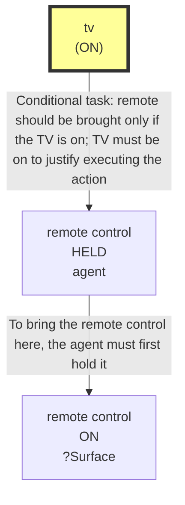
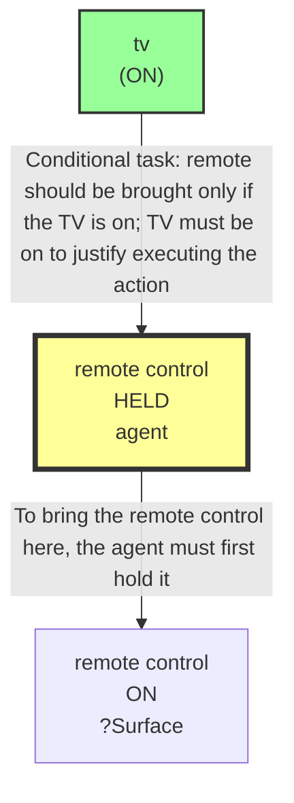
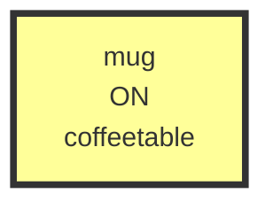
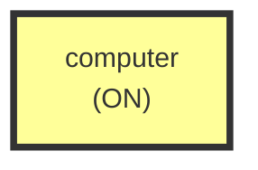
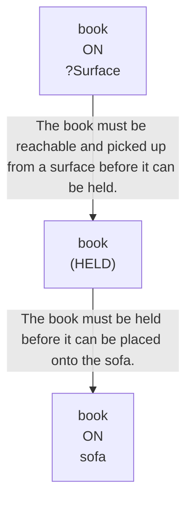
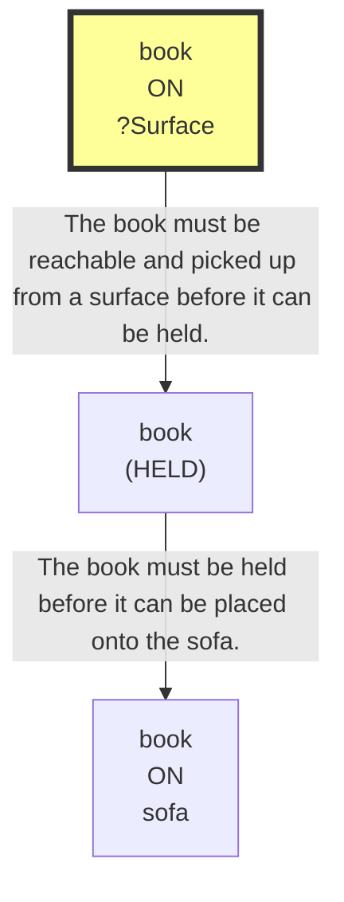
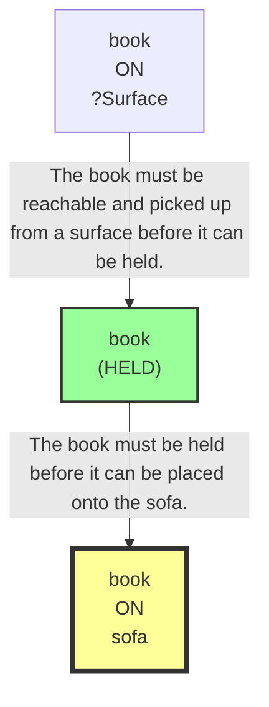
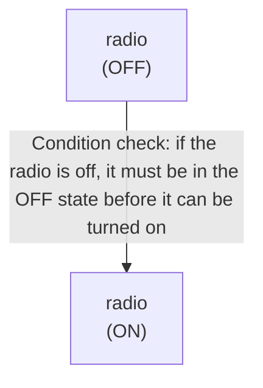

# 🚀 VirtualHome Agent Episode Log


### [LLMExecutor] Output
```json
{
  "reasoning": "",
  "satisfied_nodes": [],
  "current_node_focus": "",
  "mapped_variables": {},
  "action": "WAIT"
}
```

### [RoboStateMultiTaskController] Output
```json
{
  "action": "[wait]",
  "active_task_id": "task_1",
  "task_context": {
    "active_task_id": "task_1",
    "pending_task_ids": [
      "task_2",
      "task_3",
      "task_4",
      "task_5"
    ],
    "satisfied_task_ids": []
  },
  "source": "llm_executor"
}
```
## Step 0
- **Action**: `[wait]`
- **Action Success**: `True`
- **Action Message**: Time passes. You waited for a while.
- **Active Task**: `task_1`
- **Decision Source**: `llm_executor`
- **Task Progress**: G1_03=pending, E1_11=pending, E1_03=pending, E1_17=pending, E1_07=pending
- **SDG Status**:
No SDG active.
- **Observed Items (79)**: floor(336), floor(337), floor(338), floor(339), floor(340), floor(341), floor(342), floor(343), floor(344), wall(345), wall(346), wall(347), wall(348), wall(349), wall(350)...


### [LLMExecutor] Output
```json
{
  "reasoning": "",
  "satisfied_nodes": [],
  "current_node_focus": "",
  "mapped_variables": {},
  "action": "WAIT"
}
```

### [RoboStateMultiTaskController] Output
```json
{
  "action": "[wait]",
  "active_task_id": "task_1",
  "task_context": {
    "active_task_id": "task_1",
    "pending_task_ids": [
      "task_2",
      "task_3",
      "task_4",
      "task_5"
    ],
    "satisfied_task_ids": []
  },
  "source": "llm_executor"
}
```
## Step 1
- **Action**: `[wait]`
- **Action Success**: `True`
- **Action Message**: Time passes. You waited for a while.
- **Active Task**: `task_1`
- **Decision Source**: `llm_executor`
- **Task Progress**: G1_03=pending, E1_11=pending, E1_03=pending, E1_17=pending, E1_07=pending
- **SDG Status**:
No SDG active.
- **Observed Items (79)**: floor(336), floor(337), floor(338), floor(339), floor(340), floor(341), floor(342), floor(343), floor(344), wall(345), wall(346), wall(347), wall(348), wall(349), wall(350)...


### [LLMExecutor] Output
```json
{
  "reasoning": "No goal intent or SDG is provided for the active task, so there is no concrete target state to progress toward. Under the ambiguity rule, I cannot infer a physical objective. I should request clarification before taking any manipulation action.",
  "satisfied_nodes": [],
  "current_node_focus": "N/A",
  "mapped_variables": {},
  "action": "[ask] What is the goal for the active task? Please specify the object and desired final state."
}
```

### [RoboStateMultiTaskController] Output
```json
{
  "action": "[ask] What is the goal for the active task? Please specify the object and desired final state.",
  "active_task_id": "task_1",
  "task_context": {
    "active_task_id": "task_1",
    "pending_task_ids": [
      "task_2",
      "task_3",
      "task_4",
      "task_5"
    ],
    "satisfied_task_ids": []
  },
  "source": "llm_executor"
}
```
## Step 2
- **Action**: `[ask] What is the goal for the active task? Please specify the object and desired final state.`
- **Action Success**: `True`
- **Action Message**: nothing to claim
- **Active Task**: `task_1`
- **Decision Source**: `llm_executor`
- **Task Progress**: G1_03=pending, E1_11=pending, E1_03=pending, E1_17=pending, E1_07=pending
- **SDG Status**:
No SDG active.
- **Observed Items (79)**: floor(336), floor(337), floor(338), floor(339), floor(340), floor(341), floor(342), floor(343), floor(344), wall(345), wall(346), wall(347), wall(348), wall(349), wall(350)...


### [PerceptionFilter] Output
```json
{
  "reasoning": "The goal depends on the TV being on and the remote control being held, so the only necessary visible classes are the TV and the remote control. The remote is the target object and must be retained; the TV is required by the SDG condition.",
  "selected_classes": [
    "character",
    "tv",
    "remotecontrol"
  ],
  "raw_class_count": 40
}
```

### [LLMExecutor] Output
```json
{
  "reasoning": "The SDG requires the TV to be ON before the remote can be brought. The current graph shows tv(426) is OFF and the agent is already close to it, with no need to manipulate the remote yet. The next logical step is to turn on the TV directly, which will satisfy N1 and unlock progress toward holding the remote control.",
  "satisfied_nodes": [],
  "current_node_focus": "N1",
  "mapped_variables": {},
  "action": "[switchon] <tv> (426)"
}
```

### [RoboStateMultiTaskController] Output
```json
{
  "action": "[switchon] <tv> (426)",
  "active_task_id": "task_1",
  "task_context": {
    "active_task_id": "task_1",
    "pending_task_ids": [
      "task_2",
      "task_3",
      "task_4",
      "task_5"
    ],
    "satisfied_task_ids": []
  },
  "source": "llm_executor"
}
```
## Step 3
- **Action**: `[switchon] <tv> (426)`
- **Action Success**: `True`
- **Action Message**: Faked switch operation in Python layer (bypassed Unity failure)
- **Active Task**: `task_1`
- **Decision Source**: `llm_executor`
- **Task Progress**: G1_03=pending, E1_11=pending, E1_03=pending, E1_17=pending, E1_07=pending
- **SDG Status**:

- **Observed Items (7)**: tv(426) [OFF], remotecontrol(452) [OFF], character(1), bathroom(11), bedroom(73), kitchen(205), livingroom(335)


### [PerceptionFilter] Output
```json
{
  "reasoning": "Reused cached class selection.",
  "selected_classes": [
    "character",
    "tv",
    "remotecontrol"
  ],
  "raw_class_count": 40
}
```

### [LLMExecutor] Output
```json
{
  "reasoning": "The TV is already ON, so the prerequisite node N1 is satisfied. The remaining unmet state is to have the remote control held by the agent (N2), which is a prerequisite for placing it on some surface in N3. The remote is in the living room and grabbable, and the agent is already in the living room and close to the TV; however, to satisfy the held relation, the next required atomic action is to grab the remote control.",
  "satisfied_nodes": [
    "N1"
  ],
  "current_node_focus": "N2",
  "mapped_variables": {},
  "action": "[grab] <remotecontrol> (452)"
}
```

### [RoboStateMultiTaskController] Output
```json
{
  "action": "[walk] <remotecontrol> (452)",
  "active_task_id": "task_1",
  "task_context": {
    "active_task_id": "task_1",
    "pending_task_ids": [
      "task_2",
      "task_3",
      "task_4",
      "task_5"
    ],
    "satisfied_task_ids": []
  },
  "source": "llm_executor_repaired"
}
```
## Step 4
- **Action**: `[walk] <remotecontrol> (452)`
- **Action Success**: `True`
- **Action Message**: {'0': {'message': 'Success'}}
- **Active Task**: `task_1`
- **Decision Source**: `llm_executor_repaired`
- **Task Progress**: G1_03=pending, E1_11=pending, E1_03=pending, E1_17=pending, E1_07=pending
- **SDG Status**:

- **Observed Items (7)**: tv(426) [ON], remotecontrol(452) [OFF], character(1), bathroom(11), bedroom(73), kitchen(205), livingroom(335)


### [PerceptionFilter] Output
```json
{
  "reasoning": "Reused cached class selection.",
  "selected_classes": [
    "character",
    "tv",
    "remotecontrol"
  ],
  "raw_class_count": 40
}
```

### [LLMExecutor] Output
```json
{
  "reasoning": "The TV is already ON, satisfying N1. The remote control is already CLOSE to the agent and is GRABBABLE, so the next step toward holding it is to grab it. This directly advances N2, while N3 will be addressed after the remote is in hand.",
  "satisfied_nodes": [
    "N1"
  ],
  "current_node_focus": "N2",
  "mapped_variables": {},
  "action": "[grab] <remotecontrol> (452)"
}
```

### [RoboStateMultiTaskController] Output
```json
{
  "action": "[grab] <remotecontrol> (452)",
  "active_task_id": "task_1",
  "task_context": {
    "active_task_id": "task_1",
    "pending_task_ids": [
      "task_2",
      "task_3",
      "task_4",
      "task_5"
    ],
    "satisfied_task_ids": []
  },
  "source": "llm_executor"
}
```
## Step 5
- **Action**: `[grab] <remotecontrol> (452)`
- **Action Success**: `True`
- **Action Message**: {'0': {'message': 'Success'}}
- **Active Task**: `task_1`
- **Decision Source**: `llm_executor`
- **Task Progress**: G1_03=done, E1_11=pending, E1_03=pending, E1_17=pending, E1_07=pending
- **SDG Status**:

- **Observed Items (7)**: tv(426) [ON], remotecontrol(452) [OFF], character(1), bathroom(11), bedroom(73), kitchen(205), livingroom(335)


### [GoalReasoner (Module A - Intent)] Output
```json
{
  "is_instruction_obviously_vague": false,
  "clarification_question": null,
  "target_object": "mug",
  "location_hint": "coffeetable",
  "reasoning_chain": [
    {
      "question": "Why does the user want this object?",
      "answer": "To keep the mug in a specific place."
    },
    {
      "question": "Why is that important?",
      "answer": "To maintain a desired arrangement or prevent the mug from being elsewhere."
    },
    {
      "question": "What fundamental need does this fulfill?",
      "answer": "The user wants order and stable object placement in the living space."
    },
    {
      "question": "Are there any deeper psychological or physical motivations?",
      "answer": "It may be for convenience, tidiness, habit, or to avoid misplacing the mug."
    }
  ],
  "deep_intent": "The user wants to maintain order by keeping an item in a fixed location.",
  "acceptable_alternatives_properties": [
    {
      "priority": 1,
      "description": "Other drink containers or everyday small items that can be kept in the same fixed spot, such as a cup, glass, or bowl."
    },
    {
      "priority": 2,
      "description": "Similar tabletop personal items that can serve as a designated stationary object, such as a coaster, remote, or small dish."
    },
    {
      "priority": 3,
      "description": "Any household object that can help preserve an organized, consistent surface arrangement."
    },
    {
      "priority": 4,
      "description": "A different stable, easily observed item placed in a designated location to satisfy the desire for a fixed, orderly setup."
    }
  ]
}
```

### [PerceptionFilter] Output
```json
{
  "reasoning": "The goal and SDG only require the mug and the coffeetable, since the task is to keep the mug in a fixed location. No tools or alternative functional receptacles are needed for this placement task.",
  "selected_classes": [
    "mug",
    "character",
    "coffeetable"
  ],
  "raw_class_count": 40
}
```

### [LLMExecutor] Output
```json
{
  "reasoning": "The active SDG has a single unsatisfied node: the mug must be ON the coffeetable. The current graph shows the coffeetable is already close to the character, but the mug is only known to be inside the livingroom, not yet held or at the table. Since placing an object on a surface requires first being near that surface, and the next needed step toward satisfying N1 is to get to the mug before grabbing it, I will walk to the mug now. I am not repeating the previous walk to the remotecontrol because that was a different object and is irrelevant to the active task.",
  "satisfied_nodes": [],
  "current_node_focus": "N1",
  "mapped_variables": {
    "?TargetObject": "mug(447)",
    "?Surface": "coffeetable(371)"
  },
  "action": "[walk] <mug> (447)"
}
```

### [RoboStateMultiTaskController] Output
```json
{
  "action": "[walk] <mug> (447)",
  "active_task_id": "task_5",
  "task_context": {
    "active_task_id": "task_5",
    "pending_task_ids": [
      "task_2",
      "task_3",
      "task_4"
    ],
    "satisfied_task_ids": [
      "task_1"
    ]
  },
  "source": "llm_executor"
}
```
## Step 6
- **Action**: `[walk] <mug> (447)`
- **Action Success**: `True`
- **Action Message**: {'0': {'message': 'Success'}}
- **Active Task**: `task_5`
- **Decision Source**: `llm_executor`
- **Task Progress**: G1_03=done, E1_11=pending, E1_03=pending, E1_17=pending, E1_07=pending
- **SDG Status**:

- **Observed Items (7)**: coffeetable(371), mug(447), character(1), bathroom(11), bedroom(73), kitchen(205), livingroom(335)


### [PerceptionFilter] Output
```json
{
  "reasoning": "Reused cached class selection.",
  "selected_classes": [
    "mug",
    "character",
    "coffeetable"
  ],
  "raw_class_count": 40
}
```

### [LLMExecutor] Output
```json
{
  "reasoning": "The active goal is to ensure the mug is on the coffeetable. The current graph shows the mug is already close to the character, but not yet on the coffeetable. Since I just walked to the mug, the next atomic step should be to grab it before moving to the table and placing it there. The mug is grabbable and there is no evidence it is dirty or otherwise unsuitable.",
  "satisfied_nodes": [],
  "current_node_focus": "N1",
  "mapped_variables": {},
  "action": "[grab] <mug> (447)"
}
```

### [RoboStateMultiTaskController] Output
```json
{
  "action": "[grab] <mug> (447)",
  "active_task_id": "task_5",
  "task_context": {
    "active_task_id": "task_5",
    "pending_task_ids": [
      "task_2",
      "task_3",
      "task_4"
    ],
    "satisfied_task_ids": [
      "task_1"
    ]
  },
  "source": "llm_executor"
}
```
## Step 7
- **Action**: `[grab] <mug> (447)`
- **Action Success**: `True`
- **Action Message**: {'0': {'message': 'Success'}}
- **Active Task**: `task_5`
- **Decision Source**: `llm_executor`
- **Task Progress**: G1_03=done, E1_11=pending, E1_03=pending, E1_17=pending, E1_07=pending
- **SDG Status**:

- **Observed Items (7)**: coffeetable(371), mug(447), character(1), bathroom(11), bedroom(73), kitchen(205), livingroom(335)


### [PerceptionFilter] Output
```json
{
  "reasoning": "Reused cached class selection.",
  "selected_classes": [
    "mug",
    "character",
    "coffeetable"
  ],
  "raw_class_count": 40
}
```

### [LLMExecutor] Output
```json
{
  "reasoning": "The active goal is to have the mug on the coffeetable. I am already holding mug(447), and the coffeetable(371) is the required destination surface. Since putback requires being near the destination and I have not yet walked to the coffeetable, the correct next step is to move there first.",
  "satisfied_nodes": [],
  "current_node_focus": "N1",
  "mapped_variables": {
    "?TargetObject": "mug(447)",
    "?Destination": "coffeetable(371)"
  },
  "action": "[walk] <coffeetable> (371)"
}
```

### [RoboStateMultiTaskController] Output
```json
{
  "action": "[walk] <coffeetable> (371)",
  "active_task_id": "task_5",
  "task_context": {
    "active_task_id": "task_5",
    "pending_task_ids": [
      "task_2",
      "task_3",
      "task_4"
    ],
    "satisfied_task_ids": [
      "task_1"
    ]
  },
  "source": "llm_executor"
}
```
## Step 8
- **Action**: `[walk] <coffeetable> (371)`
- **Action Success**: `True`
- **Action Message**: {'0': {'message': 'Success'}}
- **Active Task**: `task_5`
- **Decision Source**: `llm_executor`
- **Task Progress**: G1_03=done, E1_11=pending, E1_03=pending, E1_17=pending, E1_07=pending
- **SDG Status**:

- **Observed Items (7)**: coffeetable(371), mug(447), character(1), bathroom(11), bedroom(73), kitchen(205), livingroom(335)


### [PerceptionFilter] Output
```json
{
  "reasoning": "Reused cached class selection.",
  "selected_classes": [
    "mug",
    "character",
    "coffeetable"
  ],
  "raw_class_count": 40
}
```

### [LLMExecutor] Output
```json
{
  "reasoning": "The active SDG node N1 requires the mug to be ON the coffeetable. The current graph shows I am already close to the coffeetable and currently holding mug(447) in my left hand, so the remaining gap is to place it onto the table. Because putback requires being explicitly walked to the destination first and that was already done in the previous step, the next atomic action is to put the held mug on the coffeetable.",
  "satisfied_nodes": [],
  "current_node_focus": "N1",
  "mapped_variables": {},
  "action": "[putback] <mug> (447) <coffeetable> (371)"
}
```

### [RoboStateMultiTaskController] Output
```json
{
  "action": "[putback] <mug> (447) <coffeetable> (371)",
  "active_task_id": "task_5",
  "task_context": {
    "active_task_id": "task_5",
    "pending_task_ids": [
      "task_2",
      "task_3",
      "task_4"
    ],
    "satisfied_task_ids": [
      "task_1"
    ]
  },
  "source": "llm_executor"
}
```
## Step 9
- **Action**: `[putback] <mug> (447) <coffeetable> (371)`
- **Action Success**: `True`
- **Action Message**: {'0': {'message': 'Success'}}
- **Active Task**: `task_5`
- **Decision Source**: `llm_executor`
- **Task Progress**: G1_03=done, E1_11=pending, E1_03=pending, E1_17=pending, E1_07=done
- **SDG Status**:

- **Observed Items (7)**: coffeetable(371), mug(447), character(1), bathroom(11), bedroom(73), kitchen(205), livingroom(335)


### [GoalReasoner (Module A - Intent)] Output
```json
{
  "is_instruction_obviously_vague": false,
  "clarification_question": null,
  "target_object": "computer",
  "location_hint": null,
  "reasoning_chain": [
    {
      "question": "Why does the user want this object?",
      "answer": "To have the computer powered on and available for use."
    },
    {
      "question": "Why is that important?",
      "answer": "Because the computer being off prevents it from performing tasks or being interacted with."
    },
    {
      "question": "What fundamental need does this fulfill?",
      "answer": "It fulfills the need to use a functioning computing device."
    },
    {
      "question": "Are there any deeper psychological or physical motivations?",
      "answer": "The user likely wants to restore access, productivity, or operation of the device."
    }
  ],
  "deep_intent": "The user wants to restore access to a functioning computing device.",
  "acceptable_alternatives_properties": [
    {
      "priority": 1,
      "description": "Other powered-on computing devices such as a laptop, desktop, or tablet that can be used for the same task."
    },
    {
      "priority": 2,
      "description": "A nearby spare computer or similar personal device that is already on and usable."
    },
    {
      "priority": 3,
      "description": "Any household digital device that can provide the needed computing function, such as a workstation or terminal."
    },
    {
      "priority": 4,
      "description": "A different device that can still satisfy the same information-processing need, such as a smartphone or tablet if a full computer is unavailable."
    }
  ]
}
```

### [PerceptionFilter] Output
```json
{
  "reasoning": "The goal is to have a computer powered on and usable. The SDG explicitly requires the computer in ON state, so the computer must be kept. To make it usable, the directly associated interaction peripherals visible here are the keyboard, mouse, and cpuscreen. I also retain the nearby power source needed for restoring power if necessary. Alternative computing devices are not needed because the target is specifically a computer and the SDG state is about that device.",
  "selected_classes": [
    "powersocket",
    "keyboard",
    "mouse",
    "desk",
    "cpuscreen",
    "computer",
    "character"
  ],
  "raw_class_count": 40
}
```

### [LLMExecutor] Output
```json
{
  "reasoning": "The active task is to get the computer ON. The filtered graph shows the target computer(433) is currently OFF and has a switch, so the next required step is to get near it before switching it on. I should not repeat the previous walk to unrelated objects; there is no indication I am already at the computer, so the safest progress-making action is to walk to the computer.",
  "satisfied_nodes": [],
  "current_node_focus": "N1",
  "mapped_variables": {
    "?Computer": "computer(433)"
  },
  "action": "[walk] <computer> (433)"
}
```

### [RoboStateMultiTaskController] Output
```json
{
  "action": "[walk] <computer> (433)",
  "active_task_id": "task_2",
  "task_context": {
    "active_task_id": "task_2",
    "pending_task_ids": [
      "task_3",
      "task_4"
    ],
    "satisfied_task_ids": [
      "task_1",
      "task_5"
    ]
  },
  "source": "llm_executor"
}
```
## Step 10
- **Action**: `[walk] <computer> (433)`
- **Action Success**: `True`
- **Action Message**: {'0': {'message': 'Success'}}
- **Active Task**: `task_2`
- **Decision Source**: `llm_executor`
- **Task Progress**: G1_03=done, E1_11=pending, E1_03=pending, E1_17=pending, E1_07=done
- **SDG Status**:

- **Observed Items (11)**: desk(373) [CLOSED], powersocket(428), mouse(429), keyboard(431), cpuscreen(432), computer(433) [OFF], character(1), bathroom(11), bedroom(73), kitchen(205), livingroom(335)


### [PerceptionFilter] Output
```json
{
  "reasoning": "Reused cached class selection.",
  "selected_classes": [
    "powersocket",
    "keyboard",
    "mouse",
    "desk",
    "cpuscreen",
    "computer",
    "character"
  ],
  "raw_class_count": 40
}
```

### [LLMExecutor] Output
```json
{
  "reasoning": "The active task is to make the computer ON. The filtered graph shows computer(433) is OFF and already CLOSE to the character, so no additional walking is needed. Since the computer has HAS_SWITCH and is the exact target object, the next atomic step is to switch it on.",
  "satisfied_nodes": [],
  "current_node_focus": "N1",
  "mapped_variables": {
    "?Computer": "computer(433)"
  },
  "action": "[switchon] <computer> (433)"
}
```

### [RoboStateMultiTaskController] Output
```json
{
  "action": "[switchon] <computer> (433)",
  "active_task_id": "task_2",
  "task_context": {
    "active_task_id": "task_2",
    "pending_task_ids": [
      "task_3",
      "task_4"
    ],
    "satisfied_task_ids": [
      "task_1",
      "task_5"
    ]
  },
  "source": "llm_executor"
}
```
## Step 11
- **Action**: `[switchon] <computer> (433)`
- **Action Success**: `True`
- **Action Message**: Faked switch operation in Python layer (bypassed Unity failure)
- **Active Task**: `task_2`
- **Decision Source**: `llm_executor`
- **Task Progress**: G1_03=done, E1_11=done, E1_03=pending, E1_17=pending, E1_07=done
- **SDG Status**:

- **Observed Items (11)**: desk(373) [CLOSED], powersocket(428), mouse(429), keyboard(431), cpuscreen(432), computer(433) [OFF], character(1), bathroom(11), bedroom(73), kitchen(205), livingroom(335)


### [GoalReasoner (Module A - Intent)] Output
```json
{
  "is_instruction_obviously_vague": false,
  "clarification_question": null,
  "target_object": "book",
  "location_hint": "sofa",
  "reasoning_chain": [
    {
      "question": "Why does the user want this object moved to the sofa?",
      "answer": "To place an unorganized book in a more appropriate, accessible resting spot."
    },
    {
      "question": "Why is that important?",
      "answer": "It helps organize the space by moving the book away from wherever it is out of place."
    },
    {
      "question": "What fundamental need does this fulfill?",
      "answer": "The need to organize and tidy the environment."
    },
    {
      "question": "Are there any deeper psychological or physical motivations?",
      "answer": "It may reduce clutter, improve orderliness, and make the living area more usable and visually neat."
    }
  ],
  "deep_intent": "The user wants to organize the living space by relocating misplaced reading material to a resting area.",
  "acceptable_alternatives_properties": [
    {
      "priority": 1,
      "description": "Other small reading materials or paper items that are out of place, such as magazines or notebooks, moved to the sofa if that is the intended resting spot."
    },
    {
      "priority": 2,
      "description": "Similar household items that belong in a common seating area, such as a blanket or remote, if they are meant to be kept there."
    },
    {
      "priority": 3,
      "description": "Other clutter items that can be tidied from surfaces into an appropriate indoor resting or storage location."
    },
    {
      "priority": 4,
      "description": "Any misplaced household item that can be moved to improve overall organization, even if it is not a reading material."
    }
  ]
}
```

### [RoboStateMultiTaskController] Output
```json
{
  "action": "[walk] <bathroom> (11)",
  "active_task_id": "task_3",
  "task_context": {
    "active_task_id": "task_3",
    "pending_task_ids": [
      "task_4"
    ],
    "satisfied_task_ids": [
      "task_1",
      "task_2",
      "task_5"
    ]
  },
  "source": "room_frontier"
}
```
## Step 12
- **Action**: `[walk] <bathroom> (11)`
- **Action Success**: `True`
- **Action Message**: {'0': {'message': 'Success'}}
- **Active Task**: `task_3`
- **Decision Source**: `room_frontier`
- **Task Progress**: G1_03=done, E1_11=done, E1_03=pending, E1_17=pending, E1_07=done
- **SDG Status**:

- **Observed Items (79)**: floor(336), floor(337), floor(338), floor(339), floor(340), floor(341), floor(342), floor(343), floor(344), wall(345), wall(346), wall(347), wall(348), wall(349), wall(350)...


### [RoboStateMultiTaskController] Output
```json
{
  "action": "[walk] <bedroom> (73)",
  "active_task_id": "task_3",
  "task_context": {
    "active_task_id": "task_3",
    "pending_task_ids": [
      "task_4"
    ],
    "satisfied_task_ids": [
      "task_1",
      "task_2",
      "task_5"
    ]
  },
  "source": "room_frontier"
}
```
## Step 13
- **Action**: `[walk] <bedroom> (73)`
- **Action Success**: `True`
- **Action Message**: {'0': {'message': 'Success'}}
- **Active Task**: `task_3`
- **Decision Source**: `room_frontier`
- **Task Progress**: G1_03=done, E1_11=done, E1_03=pending, E1_17=pending, E1_07=done
- **SDG Status**:

- **Observed Items (140)**: floor(336), floor(337), floor(338), floor(339), floor(340), floor(341), floor(342), floor(343), floor(344), wall(345), wall(346), wall(347), wall(348), wall(349), wall(350)...


### [PerceptionFilter] Output
```json
{
  "reasoning": "The goal is to move a book onto the sofa, so the only strictly necessary classes are the target object and the destination location. No extra tool is required for this simple pick-and-place task.",
  "selected_classes": [
    "sofa",
    "book",
    "paper",
    "character",
    "door"
  ],
  "raw_class_count": 70
}
```

### [LLMExecutor] Output
```json
{
  "reasoning": "The active task is to move the book to the sofa. The book(190) is currently close to the character in the bedroom and is not yet held. To satisfy the SDG, the next prerequisite is to pick it up. Since the character is already close to the book, no additional walk is needed before grabbing. The sofa(368) will be the eventual target for the placement step after the book is held.",
  "satisfied_nodes": [],
  "current_node_focus": "N1",
  "mapped_variables": {
    "?Surface": "bedroom(73)"
  },
  "action": "[grab] <book> (190)"
}
```

### [RoboStateMultiTaskController] Output
```json
{
  "action": "[grab] <book> (190)",
  "active_task_id": "task_3",
  "task_context": {
    "active_task_id": "task_3",
    "pending_task_ids": [
      "task_4"
    ],
    "satisfied_task_ids": [
      "task_1",
      "task_2",
      "task_5"
    ]
  },
  "source": "llm_executor"
}
```
## Step 14
- **Action**: `[grab] <book> (190)`
- **Action Success**: `True`
- **Action Message**: {'0': {'message': 'Success'}}
- **Active Task**: `task_3`
- **Decision Source**: `llm_executor`
- **Task Progress**: G1_03=done, E1_11=done, E1_03=pending, E1_17=pending, E1_07=done
- **SDG Status**:

- **Observed Items (9)**: sofa(368), paper(451), character(1), bathroom(11), bedroom(73), kitchen(205), livingroom(335), door(51) [OPEN], book(190) [CLOSED]


### [PerceptionFilter] Output
```json
{
  "reasoning": "Reused cached class selection.",
  "selected_classes": [
    "sofa",
    "book",
    "paper",
    "character",
    "door"
  ],
  "raw_class_count": 70
}
```

### [LLMExecutor] Output
```json
{
  "reasoning": "The book object is already held in the left hand, which satisfies N2. The remaining gap is to place it onto the sofa in the living room. Since putback requires being near the destination, the next step must be to walk to the sofa before any placement action.",
  "satisfied_nodes": [
    "N2"
  ],
  "current_node_focus": "N3",
  "mapped_variables": {},
  "action": "[walk] <sofa> (368)"
}
```

### [RoboStateMultiTaskController] Output
```json
{
  "action": "[walk] <sofa> (368)",
  "active_task_id": "task_3",
  "task_context": {
    "active_task_id": "task_3",
    "pending_task_ids": [
      "task_4"
    ],
    "satisfied_task_ids": [
      "task_1",
      "task_2",
      "task_5"
    ]
  },
  "source": "llm_executor"
}
```
## Step 15
- **Action**: `[walk] <sofa> (368)`
- **Action Success**: `True`
- **Action Message**: {'0': {'message': 'Success'}}
- **Active Task**: `task_3`
- **Decision Source**: `llm_executor`
- **Task Progress**: G1_03=done, E1_11=done, E1_03=pending, E1_17=pending, E1_07=done
- **SDG Status**:

- **Observed Items (9)**: sofa(368), paper(451), character(1), bathroom(11), bedroom(73), kitchen(205), livingroom(335), door(51) [OPEN], book(190) [CLOSED]


### [PerceptionFilter] Output
```json
{
  "reasoning": "Reused cached class selection.",
  "selected_classes": [
    "sofa",
    "book",
    "paper",
    "character",
    "door"
  ],
  "raw_class_count": 70
}
```

### [LLMExecutor] Output
```json
{
  "reasoning": "The active SDG shows the book is already held (N2 satisfied) and I am already close to the sofa. The next required state is placing the held book onto the sofa (N3). Since putback requires being near the destination and the current graph already indicates CLOSE sofa(368), the correct next atomic action is to put the book on the sofa.",
  "satisfied_nodes": [
    "N2"
  ],
  "current_node_focus": "N3",
  "mapped_variables": {},
  "action": "[putback] <book> (190) <sofa> (368)"
}
```

### [RoboStateMultiTaskController] Output
```json
{
  "action": "[putback] <book> (190) <sofa> (368)",
  "active_task_id": "task_3",
  "task_context": {
    "active_task_id": "task_3",
    "pending_task_ids": [
      "task_4"
    ],
    "satisfied_task_ids": [
      "task_1",
      "task_2",
      "task_5"
    ]
  },
  "source": "llm_executor"
}
```
## Step 16
- **Action**: `[putback] <book> (190) <sofa> (368)`
- **Action Success**: `True`
- **Action Message**: {'0': {'message': 'Success'}}
- **Active Task**: `task_3`
- **Decision Source**: `llm_executor`
- **Task Progress**: G1_03=done, E1_11=done, E1_03=done, E1_17=pending, E1_07=done
- **SDG Status**:

- **Observed Items (9)**: sofa(368), paper(451), character(1), bathroom(11), bedroom(73), kitchen(205), livingroom(335), door(51) [OPEN], book(190) [CLOSED]


### [GoalReasoner (Module A - Intent)] Output
```json
{
  "is_instruction_obviously_vague": false,
  "clarification_question": null,
  "target_object": "radio",
  "location_hint": null,
  "reasoning_chain": [
    {
      "question": "Why does the user want this object?",
      "answer": "To have the radio powered on and functioning."
    },
    {
      "question": "Why is that important?",
      "answer": "So it can produce sound or provide audio output."
    },
    {
      "question": "What fundamental need does this fulfill?",
      "answer": "It fulfills the need to access audio/entertainment or information."
    },
    {
      "question": "Are there any deeper psychological or physical motivations?",
      "answer": "The user may want background sound, music, news, or a more active environment."
    }
  ],
  "deep_intent": "The user wants to activate an audio source for sound or information.",
  "acceptable_alternatives_properties": [
    {
      "priority": 1,
      "description": "Other indoor audio devices that can be turned on to produce sound, such as a speaker or television"
    },
    {
      "priority": 2,
      "description": "Other sound-producing household electronics, such as a stereo or computer speakers"
    },
    {
      "priority": 3,
      "description": "Any available device that provides audio playback or spoken information"
    },
    {
      "priority": 4,
      "description": "A different source of background sound or information, such as a phone playing audio"
    }
  ]
}
```

### [RoboStateMultiTaskController] Output
```json
{
  "action": "[walk] <kitchen> (205)",
  "active_task_id": "task_4",
  "task_context": {
    "active_task_id": "task_4",
    "pending_task_ids": [],
    "satisfied_task_ids": [
      "task_1",
      "task_2",
      "task_3",
      "task_5"
    ]
  },
  "source": "room_frontier"
}
```
## Step 17
- **Action**: `[walk] <kitchen> (205)`
- **Action Success**: `True`
- **Action Message**: {'0': {'message': 'Success'}}
- **Active Task**: `task_4`
- **Decision Source**: `room_frontier`
- **Task Progress**: G1_03=done, E1_11=done, E1_03=done, E1_17=pending, E1_07=done
- **SDG Status**:

- **Observed Items (209)**: floor(336), floor(337), floor(338), floor(339), floor(340), floor(341), floor(342), floor(343), floor(344), wall(345), wall(346), wall(347), wall(348), wall(349), wall(350)...


### [RoboStateMultiTaskController] Output
```json
{
  "action": "[walk] <bathroom> (11)",
  "active_task_id": null,
  "task_context": {
    "active_task_id": null,
    "pending_task_ids": [
      "task_4"
    ],
    "satisfied_task_ids": [
      "task_1",
      "task_2",
      "task_3",
      "task_5"
    ]
  },
  "source": "loop_recovery_room_revisit"
}
```
## Step 18
- **Action**: `[walk] <bathroom> (11)`
- **Action Success**: `True`
- **Action Message**: {'0': {'message': 'Success'}}
- **Decision Source**: `loop_recovery_room_revisit`
- **Task Progress**: G1_03=done, E1_11=done, E1_03=done, E1_17=pending, E1_07=done
- **SDG Status**:
No SDG active.
- **Observed Items (317)**: floor(336), floor(337), floor(338), floor(339), floor(340), floor(341), floor(342), floor(343), floor(344), wall(345), wall(346), wall(347), wall(348), wall(349), wall(350)...


### [RoboStateMultiTaskController] Output
```json
{
  "action": "[walk] <bedroom> (73)",
  "active_task_id": null,
  "task_context": {
    "active_task_id": null,
    "pending_task_ids": [
      "task_4"
    ],
    "satisfied_task_ids": [
      "task_1",
      "task_2",
      "task_3",
      "task_5"
    ]
  },
  "source": "loop_recovery_room_revisit"
}
```
## Step 19
- **Action**: `[walk] <bedroom> (73)`
- **Action Success**: `True`
- **Action Message**: {'0': {'message': 'Success'}}
- **Decision Source**: `loop_recovery_room_revisit`
- **Task Progress**: G1_03=done, E1_11=done, E1_03=done, E1_17=pending, E1_07=done
- **SDG Status**:
No SDG active.
- **Observed Items (317)**: floor(336), floor(337), floor(338), floor(339), floor(340), floor(341), floor(342), floor(343), floor(344), wall(345), wall(346), wall(347), wall(348), wall(349), wall(350)...


### [RoboStateMultiTaskController] Output
```json
{
  "action": "[walk] <livingroom> (335)",
  "active_task_id": null,
  "task_context": {
    "active_task_id": null,
    "pending_task_ids": [
      "task_4"
    ],
    "satisfied_task_ids": [
      "task_1",
      "task_2",
      "task_3",
      "task_5"
    ]
  },
  "source": "loop_recovery_room_revisit"
}
```
## Step 20
- **Action**: `[walk] <livingroom> (335)`
- **Action Success**: `True`
- **Action Message**: {'0': {'message': 'Success'}}
- **Decision Source**: `loop_recovery_room_revisit`
- **Task Progress**: G1_03=done, E1_11=done, E1_03=done, E1_17=pending, E1_07=done
- **SDG Status**:
No SDG active.
- **Observed Items (317)**: floor(336), floor(337), floor(338), floor(339), floor(340), floor(341), floor(342), floor(343), floor(344), wall(345), wall(346), wall(347), wall(348), wall(349), wall(350)...


### [RoboStateMultiTaskController] Output
```json
{
  "action": "[walk] <kitchen> (205)",
  "active_task_id": null,
  "task_context": {
    "active_task_id": null,
    "pending_task_ids": [
      "task_4"
    ],
    "satisfied_task_ids": [
      "task_1",
      "task_2",
      "task_3",
      "task_5"
    ]
  },
  "source": "loop_recovery_room_revisit"
}
```
## Step 21
- **Action**: `[walk] <kitchen> (205)`
- **Action Success**: `True`
- **Action Message**: {'0': {'message': 'Success'}}
- **Decision Source**: `loop_recovery_room_revisit`
- **Task Progress**: G1_03=done, E1_11=done, E1_03=done, E1_17=pending, E1_07=done
- **SDG Status**:
No SDG active.
- **Observed Items (317)**: floor(336), floor(337), floor(338), floor(339), floor(340), floor(341), floor(342), floor(343), floor(344), wall(345), wall(346), wall(347), wall(348), wall(349), wall(350)...


### [RoboStateMultiTaskController] Output
```json
{
  "action": "[walk] <bathroom> (11)",
  "active_task_id": null,
  "task_context": {
    "active_task_id": null,
    "pending_task_ids": [
      "task_4"
    ],
    "satisfied_task_ids": [
      "task_1",
      "task_2",
      "task_3",
      "task_5"
    ]
  },
  "source": "loop_recovery_room_revisit"
}
```
## Step 22
- **Action**: `[walk] <bathroom> (11)`
- **Action Success**: `True`
- **Action Message**: {'0': {'message': 'Success'}}
- **Decision Source**: `loop_recovery_room_revisit`
- **Task Progress**: G1_03=done, E1_11=done, E1_03=done, E1_17=pending, E1_07=done
- **SDG Status**:
No SDG active.
- **Observed Items (317)**: floor(336), floor(337), floor(338), floor(339), floor(340), floor(341), floor(342), floor(343), floor(344), wall(345), wall(346), wall(347), wall(348), wall(349), wall(350)...


### [RoboStateMultiTaskController] Output
```json
{
  "action": "[walk] <bedroom> (73)",
  "active_task_id": null,
  "task_context": {
    "active_task_id": null,
    "pending_task_ids": [
      "task_4"
    ],
    "satisfied_task_ids": [
      "task_1",
      "task_2",
      "task_3",
      "task_5"
    ]
  },
  "source": "loop_recovery_room_revisit"
}
```
## Step 23
- **Action**: `[walk] <bedroom> (73)`
- **Action Success**: `True`
- **Action Message**: {'0': {'message': 'Success'}}
- **Decision Source**: `loop_recovery_room_revisit`
- **Task Progress**: G1_03=done, E1_11=done, E1_03=done, E1_17=pending, E1_07=done
- **SDG Status**:
No SDG active.
- **Observed Items (317)**: floor(336), floor(337), floor(338), floor(339), floor(340), floor(341), floor(342), floor(343), floor(344), wall(345), wall(346), wall(347), wall(348), wall(349), wall(350)...


### [RoboStateMultiTaskController] Output
```json
{
  "action": "[walk] <livingroom> (335)",
  "active_task_id": null,
  "task_context": {
    "active_task_id": null,
    "pending_task_ids": [
      "task_4"
    ],
    "satisfied_task_ids": [
      "task_1",
      "task_2",
      "task_3",
      "task_5"
    ]
  },
  "source": "loop_recovery_room_revisit"
}
```
## Step 24
- **Action**: `[walk] <livingroom> (335)`
- **Action Success**: `True`
- **Action Message**: {'0': {'message': 'Success'}}
- **Decision Source**: `loop_recovery_room_revisit`
- **Task Progress**: G1_03=done, E1_11=done, E1_03=done, E1_17=pending, E1_07=done
- **SDG Status**:
No SDG active.
- **Observed Items (317)**: floor(336), floor(337), floor(338), floor(339), floor(340), floor(341), floor(342), floor(343), floor(344), wall(345), wall(346), wall(347), wall(348), wall(349), wall(350)...


### [RoboStateMultiTaskController] Output
```json
{
  "action": "[walk] <kitchen> (205)",
  "active_task_id": null,
  "task_context": {
    "active_task_id": null,
    "pending_task_ids": [
      "task_4"
    ],
    "satisfied_task_ids": [
      "task_1",
      "task_2",
      "task_3",
      "task_5"
    ]
  },
  "source": "loop_recovery_room_revisit"
}
```
## Step 25
- **Action**: `[walk] <kitchen> (205)`
- **Action Success**: `True`
- **Action Message**: {'0': {'message': 'Success'}}
- **Decision Source**: `loop_recovery_room_revisit`
- **Task Progress**: G1_03=done, E1_11=done, E1_03=done, E1_17=pending, E1_07=done
- **SDG Status**:
No SDG active.
- **Observed Items (317)**: floor(336), floor(337), floor(338), floor(339), floor(340), floor(341), floor(342), floor(343), floor(344), wall(345), wall(346), wall(347), wall(348), wall(349), wall(350)...


### [RoboStateMultiTaskController] Output
```json
{
  "action": "[walk] <bathroom> (11)",
  "active_task_id": null,
  "task_context": {
    "active_task_id": null,
    "pending_task_ids": [
      "task_4"
    ],
    "satisfied_task_ids": [
      "task_1",
      "task_2",
      "task_3",
      "task_5"
    ]
  },
  "source": "loop_recovery_room_revisit"
}
```
## Step 26
- **Action**: `[walk] <bathroom> (11)`
- **Action Success**: `True`
- **Action Message**: {'0': {'message': 'Success'}}
- **Decision Source**: `loop_recovery_room_revisit`
- **Task Progress**: G1_03=done, E1_11=done, E1_03=done, E1_17=pending, E1_07=done
- **SDG Status**:
No SDG active.
- **Observed Items (317)**: floor(336), floor(337), floor(338), floor(339), floor(340), floor(341), floor(342), floor(343), floor(344), wall(345), wall(346), wall(347), wall(348), wall(349), wall(350)...


### [RoboStateMultiTaskController] Output
```json
{
  "action": "[walk] <bedroom> (73)",
  "active_task_id": null,
  "task_context": {
    "active_task_id": null,
    "pending_task_ids": [
      "task_4"
    ],
    "satisfied_task_ids": [
      "task_1",
      "task_2",
      "task_3",
      "task_5"
    ]
  },
  "source": "loop_recovery_room_revisit"
}
```
## Step 27
- **Action**: `[walk] <bedroom> (73)`
- **Action Success**: `True`
- **Action Message**: {'0': {'message': 'Success'}}
- **Decision Source**: `loop_recovery_room_revisit`
- **Task Progress**: G1_03=done, E1_11=done, E1_03=done, E1_17=pending, E1_07=done
- **SDG Status**:
No SDG active.
- **Observed Items (317)**: floor(336), floor(337), floor(338), floor(339), floor(340), floor(341), floor(342), floor(343), floor(344), wall(345), wall(346), wall(347), wall(348), wall(349), wall(350)...


### [RoboStateMultiTaskController] Output
```json
{
  "action": "[walk] <livingroom> (335)",
  "active_task_id": null,
  "task_context": {
    "active_task_id": null,
    "pending_task_ids": [
      "task_4"
    ],
    "satisfied_task_ids": [
      "task_1",
      "task_2",
      "task_3",
      "task_5"
    ]
  },
  "source": "loop_recovery_room_revisit"
}
```
## Step 28
- **Action**: `[walk] <livingroom> (335)`
- **Action Success**: `True`
- **Action Message**: {'0': {'message': 'Success'}}
- **Decision Source**: `loop_recovery_room_revisit`
- **Task Progress**: G1_03=done, E1_11=done, E1_03=done, E1_17=pending, E1_07=done
- **SDG Status**:
No SDG active.
- **Observed Items (317)**: floor(336), floor(337), floor(338), floor(339), floor(340), floor(341), floor(342), floor(343), floor(344), wall(345), wall(346), wall(347), wall(348), wall(349), wall(350)...


### [RoboStateMultiTaskController] Output
```json
{
  "action": "[walk] <kitchen> (205)",
  "active_task_id": null,
  "task_context": {
    "active_task_id": null,
    "pending_task_ids": [
      "task_4"
    ],
    "satisfied_task_ids": [
      "task_1",
      "task_2",
      "task_3",
      "task_5"
    ]
  },
  "source": "loop_recovery_room_revisit"
}
```
## Step 29
- **Action**: `[walk] <kitchen> (205)`
- **Action Success**: `True`
- **Action Message**: {'0': {'message': 'Success'}}
- **Decision Source**: `loop_recovery_room_revisit`
- **Task Progress**: G1_03=done, E1_11=done, E1_03=done, E1_17=pending, E1_07=done
- **SDG Status**:
No SDG active.
- **Observed Items (317)**: floor(336), floor(337), floor(338), floor(339), floor(340), floor(341), floor(342), floor(343), floor(344), wall(345), wall(346), wall(347), wall(348), wall(349), wall(350)...


### [RoboStateMultiTaskController] Output
```json
{
  "action": "[walk] <bathroom> (11)",
  "active_task_id": null,
  "task_context": {
    "active_task_id": null,
    "pending_task_ids": [
      "task_4"
    ],
    "satisfied_task_ids": [
      "task_1",
      "task_2",
      "task_3",
      "task_5"
    ]
  },
  "source": "loop_recovery_room_revisit"
}
```
## Step 30
- **Action**: `[walk] <bathroom> (11)`
- **Action Success**: `True`
- **Action Message**: {'0': {'message': 'Success'}}
- **Decision Source**: `loop_recovery_room_revisit`
- **Task Progress**: G1_03=done, E1_11=done, E1_03=done, E1_17=pending, E1_07=done
- **SDG Status**:
No SDG active.
- **Observed Items (317)**: floor(336), floor(337), floor(338), floor(339), floor(340), floor(341), floor(342), floor(343), floor(344), wall(345), wall(346), wall(347), wall(348), wall(349), wall(350)...


### [RoboStateMultiTaskController] Output
```json
{
  "action": "[walk] <bedroom> (73)",
  "active_task_id": null,
  "task_context": {
    "active_task_id": null,
    "pending_task_ids": [
      "task_4"
    ],
    "satisfied_task_ids": [
      "task_1",
      "task_2",
      "task_3",
      "task_5"
    ]
  },
  "source": "loop_recovery_room_revisit"
}
```
## Step 31
- **Action**: `[walk] <bedroom> (73)`
- **Action Success**: `True`
- **Action Message**: {'0': {'message': 'Success'}}
- **Decision Source**: `loop_recovery_room_revisit`
- **Task Progress**: G1_03=done, E1_11=done, E1_03=done, E1_17=pending, E1_07=done
- **SDG Status**:
No SDG active.
- **Observed Items (317)**: floor(336), floor(337), floor(338), floor(339), floor(340), floor(341), floor(342), floor(343), floor(344), wall(345), wall(346), wall(347), wall(348), wall(349), wall(350)...

