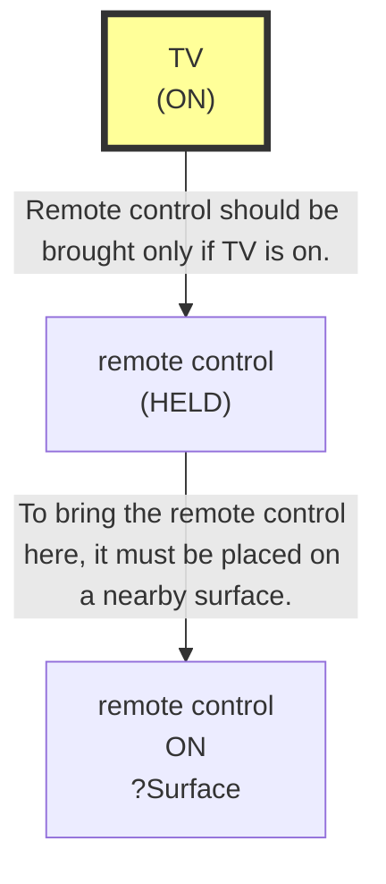
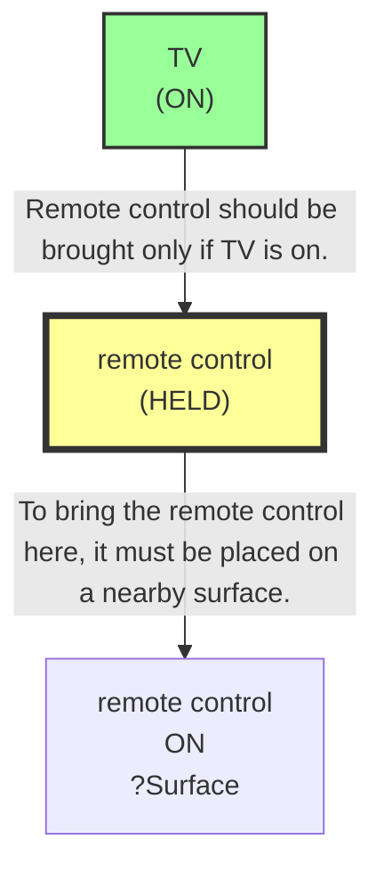
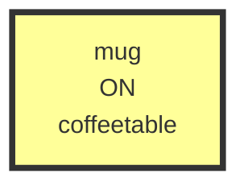
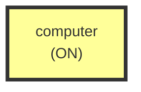

# 🚀 VirtualHome Agent Episode Log


### [GoalReasoner (Module A - Intent)] Output
```json
{
  "is_instruction_obviously_vague": false,
  "clarification_question": null,
  "target_object": "remote control",
  "location_hint": null,
  "reasoning_chain": [
    {
      "question": "Why does the user want this object?",
      "answer": "To control the television without walking to it or using manual controls."
    },
    {
      "question": "Why is that important?",
      "answer": "It allows the user to change the TV state or settings conveniently from their current location."
    },
    {
      "question": "What fundamental need does this fulfill?",
      "answer": "It supports convenient remote operation of an entertainment device."
    },
    {
      "question": "Are there any deeper psychological or physical motivations?",
      "answer": "The user likely wants ease, reduced effort, and immediate control over the TV experience from where they are."
    }
  ],
  "deep_intent": "The user wants convenient control over the television from their current location.",
  "acceptable_alternatives_properties": [
    {
      "priority": 1,
      "description": "Any other device used to control the television, such as a replacement remote or a universal remote"
    },
    {
      "priority": 2,
      "description": "A handheld control device that can operate the television's main functions"
    },
    {
      "priority": 3,
      "description": "A physical interface or accessory that enables television control from nearby"
    },
    {
      "priority": 4,
      "description": "Direct manual control of the television itself, if no remote is available"
    }
  ]
}
```

### [PerceptionFilter] Output
```json
{
  "reasoning": "The goal is to obtain and place the remote control, with the TV already relevant per the SDG. To satisfy the required states, only the target object, the television, and a nearby surface for placing the remote are needed; the visible candidate surface is the coffeetable, which is the minimal retained surface for the ON relation.",
  "selected_classes": [
    "tv",
    "character",
    "coffeetable",
    "remotecontrol"
  ],
  "raw_class_count": 40
}
```

### [LLMExecutor] Output
```json
{
  "reasoning": "The SDG requires the TV to be ON before the remote control is brought/held. In the current graph, tv(426) is OFF and the character is already CLOSE to it, so the best next step is to turn the TV on. The remote control is present but should not be retrieved yet because N1 must be satisfied first.",
  "satisfied_nodes": [],
  "current_node_focus": "N1",
  "mapped_variables": {
    "?Surface": "coffeetable(371)"
  },
  "action": "[switchon] <tv> (426)"
}
```

### [RoboStateMultiTaskController] Output
```json
{
  "action": "[switchon] <tv> (426)",
  "active_task_id": "task_1",
  "task_context": {
    "active_task_id": "task_1",
    "pending_task_ids": [
      "task_2",
      "task_3",
      "task_4",
      "task_5"
    ],
    "satisfied_task_ids": []
  },
  "source": "llm_executor"
}
```
## Step 0
- **Action**: `[switchon] <tv> (426)`
- **Action Success**: `True`
- **Action Message**: Faked switch operation in Python layer (bypassed Unity failure)
- **Active Task**: `task_1`
- **Decision Source**: `llm_executor`
- **Task Progress**: G1_03=pending, E1_11=pending, E1_03=pending, E1_17=pending, E1_07=pending
- **SDG Status**:

- **Observed Items (8)**: coffeetable(371), tv(426) [OFF], remotecontrol(452) [OFF], character(1), bathroom(11), bedroom(73), kitchen(205), livingroom(335)


### [PerceptionFilter] Output
```json
{
  "reasoning": "Reused cached class selection.",
  "selected_classes": [
    "tv",
    "character",
    "coffeetable",
    "remotecontrol"
  ],
  "raw_class_count": 40
}
```

### [LLMExecutor] Output
```json
{
  "reasoning": "The TV is already ON, so N1 is satisfied. The remote control is present in the living room but not yet held, and the character is already close to both the remote's environment and the coffee table. To satisfy N2, the next step is to move to the remote control so it can be grabbed on the following action. I should not skip directly to grab because proximity is required.",
  "satisfied_nodes": [
    "N1"
  ],
  "current_node_focus": "N2",
  "mapped_variables": {},
  "action": "[walk] <remotecontrol> (452)"
}
```

### [RoboStateMultiTaskController] Output
```json
{
  "action": "[walk] <remotecontrol> (452)",
  "active_task_id": "task_1",
  "task_context": {
    "active_task_id": "task_1",
    "pending_task_ids": [
      "task_2",
      "task_3",
      "task_4",
      "task_5"
    ],
    "satisfied_task_ids": []
  },
  "source": "llm_executor"
}
```
## Step 1
- **Action**: `[walk] <remotecontrol> (452)`
- **Action Success**: `True`
- **Action Message**: {'0': {'message': 'Success'}}
- **Active Task**: `task_1`
- **Decision Source**: `llm_executor`
- **Task Progress**: G1_03=pending, E1_11=pending, E1_03=pending, E1_17=pending, E1_07=pending
- **SDG Status**:

- **Observed Items (8)**: coffeetable(371), tv(426) [ON], remotecontrol(452) [OFF], character(1), bathroom(11), bedroom(73), kitchen(205), livingroom(335)


### [PerceptionFilter] Output
```json
{
  "reasoning": "Reused cached class selection.",
  "selected_classes": [
    "tv",
    "character",
    "coffeetable",
    "remotecontrol"
  ],
  "raw_class_count": 40
}
```

### [LLMExecutor] Output
```json
{
  "reasoning": "The TV is already ON, satisfying N1. The remote control is currently CLOSE to the character and GRABBABLE, so the next step toward satisfying N2 is to pick it up. We are not yet at the placement stage for N3 because the remote is not held yet.",
  "satisfied_nodes": [
    "N1"
  ],
  "current_node_focus": "N2",
  "mapped_variables": {},
  "action": "[grab] <remotecontrol> (452)"
}
```

### [RoboStateMultiTaskController] Output
```json
{
  "action": "[grab] <remotecontrol> (452)",
  "active_task_id": "task_1",
  "task_context": {
    "active_task_id": "task_1",
    "pending_task_ids": [
      "task_2",
      "task_3",
      "task_4",
      "task_5"
    ],
    "satisfied_task_ids": []
  },
  "source": "llm_executor"
}
```
## Step 2
- **Action**: `[grab] <remotecontrol> (452)`
- **Action Success**: `True`
- **Action Message**: {'0': {'message': 'Success'}}
- **Active Task**: `task_1`
- **Decision Source**: `llm_executor`
- **Task Progress**: G1_03=done, E1_11=pending, E1_03=pending, E1_17=pending, E1_07=pending
- **SDG Status**:

- **Observed Items (8)**: coffeetable(371), tv(426) [ON], remotecontrol(452) [OFF], character(1), bathroom(11), bedroom(73), kitchen(205), livingroom(335)


### [GoalReasoner (Module A - Intent)] Output
```json
{
  "is_instruction_obviously_vague": false,
  "clarification_question": null,
  "target_object": "mug",
  "location_hint": "coffeetable",
  "reasoning_chain": [
    {
      "question": "Why does the user want this object?",
      "answer": "They want the mug to be kept on the coffeetable."
    },
    {
      "question": "Why is that important?",
      "answer": "To maintain the mug in a specific physical location and arrangement."
    },
    {
      "question": "What fundamental need does this fulfill?",
      "answer": "The need to keep an item placed in a designated spot for organization or accessibility."
    },
    {
      "question": "Are there any deeper psychological or physical motivations?",
      "answer": "It may support tidiness, consistency, or making the mug easy to find and use."
    }
  ],
  "deep_intent": "The user wants an item to remain in a designated location for organization and accessibility.",
  "acceptable_alternatives_properties": [
    {
      "priority": 1,
      "description": "Other small household items that can be kept in a designated spot on the coffee table, such as a cup, glass, or bowl"
    },
    {
      "priority": 2,
      "description": "Similar tabletop items that help keep a surface organized, such as a coaster or small tray"
    },
    {
      "priority": 3,
      "description": "Any frequently used personal item that can be stored in a consistent place, such as a remote control or phone"
    },
    {
      "priority": 4,
      "description": "Other portable household objects that can be placed and kept in one area for easy access"
    }
  ]
}
```

### [PerceptionFilter] Output
```json
{
  "reasoning": "The goal is to keep the mug on the coffeetable, so the only necessary classes are the target object and the required location. No extra tools or receptacles are needed.",
  "selected_classes": [
    "character",
    "mug",
    "coffeetable"
  ],
  "raw_class_count": 40
}
```

### [LLMExecutor] Output
```json
{
  "reasoning": "The active goal is to ensure the mug is on the coffeetable. The mug is currently in the living room and the character is already close to the coffeetable, but not yet holding the mug. To place it on the table, the next necessary step is to approach the mug first before grabbing it. The coffeetable task node is not yet satisfied.",
  "satisfied_nodes": [],
  "current_node_focus": "N1",
  "mapped_variables": {
    "?Mug": "mug(447)",
    "?Table": "coffeetable(371)"
  },
  "action": "[walk] <mug> (447)"
}
```

### [RoboStateMultiTaskController] Output
```json
{
  "action": "[walk] <mug> (447)",
  "active_task_id": "task_5",
  "task_context": {
    "active_task_id": "task_5",
    "pending_task_ids": [
      "task_2",
      "task_3",
      "task_4"
    ],
    "satisfied_task_ids": [
      "task_1"
    ]
  },
  "source": "llm_executor"
}
```
## Step 3
- **Action**: `[walk] <mug> (447)`
- **Action Success**: `True`
- **Action Message**: {'0': {'message': 'Success'}}
- **Active Task**: `task_5`
- **Decision Source**: `llm_executor`
- **Task Progress**: G1_03=done, E1_11=pending, E1_03=pending, E1_17=pending, E1_07=pending
- **SDG Status**:

- **Observed Items (7)**: coffeetable(371), mug(447), character(1), bathroom(11), bedroom(73), kitchen(205), livingroom(335)


### [PerceptionFilter] Output
```json
{
  "reasoning": "Reused cached class selection.",
  "selected_classes": [
    "character",
    "mug",
    "coffeetable"
  ],
  "raw_class_count": 40
}
```

### [LLMExecutor] Output
```json
{
  "reasoning": "The active task is to place the mug on the coffeetable. The mug is already close to the character, so the next required step toward satisfying N1 is to move to the destination surface before any putback action. The coffeetable is available and is a valid flat surface. No other task objects should be manipulated.",
  "satisfied_nodes": [],
  "current_node_focus": "N1",
  "mapped_variables": {
    "?TargetSurface": "coffeetable(371)"
  },
  "action": "[walk] <coffeetable> (371)"
}
```

### [RoboStateMultiTaskController] Output
```json
{
  "action": "[walk] <coffeetable> (371)",
  "active_task_id": "task_5",
  "task_context": {
    "active_task_id": "task_5",
    "pending_task_ids": [
      "task_2",
      "task_3",
      "task_4"
    ],
    "satisfied_task_ids": [
      "task_1"
    ]
  },
  "source": "llm_executor"
}
```
## Step 4
- **Action**: `[walk] <coffeetable> (371)`
- **Action Success**: `True`
- **Action Message**: {'0': {'message': 'Success'}}
- **Active Task**: `task_5`
- **Decision Source**: `llm_executor`
- **Task Progress**: G1_03=done, E1_11=pending, E1_03=pending, E1_17=pending, E1_07=pending
- **SDG Status**:

- **Observed Items (7)**: coffeetable(371), mug(447), character(1), bathroom(11), bedroom(73), kitchen(205), livingroom(335)


### [PerceptionFilter] Output
```json
{
  "reasoning": "Reused cached class selection.",
  "selected_classes": [
    "character",
    "mug",
    "coffeetable"
  ],
  "raw_class_count": 40
}
```

### [LLMExecutor] Output
```json
{
  "reasoning": "The active SDG node N1 requires the mug to be ON the coffeetable. We are already close to the coffeetable, and the mug is a grabbable portable object currently in the livingroom. To satisfy the relation, the next atomic step is to grab the mug so it can then be placed on the coffeetable in a subsequent action.",
  "satisfied_nodes": [],
  "current_node_focus": "N1",
  "mapped_variables": {},
  "action": "[grab] <mug> (447)"
}
```

### [RoboStateMultiTaskController] Output
```json
{
  "action": "[walk] <mug> (447)",
  "active_task_id": "task_5",
  "task_context": {
    "active_task_id": "task_5",
    "pending_task_ids": [
      "task_2",
      "task_3",
      "task_4"
    ],
    "satisfied_task_ids": [
      "task_1"
    ]
  },
  "source": "llm_executor_repaired"
}
```
## Step 5
- **Action**: `[walk] <mug> (447)`
- **Action Success**: `True`
- **Action Message**: {'0': {'message': 'Success'}}
- **Active Task**: `task_5`
- **Decision Source**: `llm_executor_repaired`
- **Task Progress**: G1_03=done, E1_11=pending, E1_03=pending, E1_17=pending, E1_07=pending
- **SDG Status**:

- **Observed Items (7)**: coffeetable(371), mug(447), character(1), bathroom(11), bedroom(73), kitchen(205), livingroom(335)


### [PerceptionFilter] Output
```json
{
  "reasoning": "Reused cached class selection.",
  "selected_classes": [
    "character",
    "mug",
    "coffeetable"
  ],
  "raw_class_count": 40
}
```

### [LLMExecutor] Output
```json
{
  "reasoning": "The active SDG requires mug(447) to be ON coffeetable(371). The mug is currently close to the character, and the coffee table is the destination surface. Since placement actions require being explicitly walked to the destination first, the next step must be to walk to the coffeetable before any putback action. No other SDG nodes are satisfied yet because the mug is not on the table.",
  "satisfied_nodes": [],
  "current_node_focus": "N1",
  "mapped_variables": {},
  "action": "[walk] <coffeetable> (371)"
}
```

### [RoboStateMultiTaskController] Output
```json
{
  "action": "[walk] <coffeetable> (371)",
  "active_task_id": "task_5",
  "task_context": {
    "active_task_id": "task_5",
    "pending_task_ids": [
      "task_2",
      "task_3",
      "task_4"
    ],
    "satisfied_task_ids": [
      "task_1"
    ]
  },
  "source": "llm_executor"
}
```
## Step 6
- **Action**: `[walk] <coffeetable> (371)`
- **Action Success**: `True`
- **Action Message**: {'0': {'message': 'Success'}}
- **Active Task**: `task_5`
- **Decision Source**: `llm_executor`
- **Task Progress**: G1_03=done, E1_11=pending, E1_03=pending, E1_17=pending, E1_07=pending
- **SDG Status**:

- **Observed Items (7)**: coffeetable(371), mug(447), character(1), bathroom(11), bedroom(73), kitchen(205), livingroom(335)


### [PerceptionFilter] Output
```json
{
  "reasoning": "Reused cached class selection.",
  "selected_classes": [
    "character",
    "mug",
    "coffeetable"
  ],
  "raw_class_count": 40
}
```

### [LLMExecutor] Output
```json
{
  "reasoning": "The active task is to place the mug on the coffeetable. The current graph shows the character is already close to coffeetable(371), and mug(447) is available in the livingroom with no dirty/blocked state. The next required step toward satisfying N1 is to grab the mug before it can be placed on the table.",
  "satisfied_nodes": [],
  "current_node_focus": "N1",
  "mapped_variables": {
    "?Object": "mug(447)",
    "?Target": "coffeetable(371)"
  },
  "action": "[grab] <mug> (447)"
}
```

### [RoboStateMultiTaskController] Output
```json
{
  "action": "[walk] <mug> (447)",
  "active_task_id": "task_5",
  "task_context": {
    "active_task_id": "task_5",
    "pending_task_ids": [
      "task_2",
      "task_3",
      "task_4"
    ],
    "satisfied_task_ids": [
      "task_1"
    ]
  },
  "source": "llm_executor_repaired"
}
```
## Step 7
- **Action**: `[walk] <mug> (447)`
- **Action Success**: `True`
- **Action Message**: {'0': {'message': 'Success'}}
- **Active Task**: `task_5`
- **Decision Source**: `llm_executor_repaired`
- **Task Progress**: G1_03=done, E1_11=pending, E1_03=pending, E1_17=pending, E1_07=pending
- **SDG Status**:

- **Observed Items (7)**: coffeetable(371), mug(447), character(1), bathroom(11), bedroom(73), kitchen(205), livingroom(335)


### [PerceptionFilter] Output
```json
{
  "reasoning": "Reused cached class selection.",
  "selected_classes": [
    "character",
    "mug",
    "coffeetable"
  ],
  "raw_class_count": 40
}
```

### [LLMExecutor] Output
```json
{
  "reasoning": "The active goal is to have mug(447) ON coffeetable(371). The mug is currently close to the character and the coffee table is available as the destination surface. Since putback requires being near the destination, and we are already near the mug but not yet confirmed near the coffeetable in the current step sequence, the next atomic step should be to walk to the coffeetable before placing the mug there. This progresses directly toward satisfying N1.",
  "satisfied_nodes": [],
  "current_node_focus": "N1",
  "mapped_variables": {
    "?Surface": "coffeetable(371)"
  },
  "action": "[walk] <coffeetable> (371)"
}
```

### [GoalReasoner (Module A - Intent)] Output
```json
{
  "is_instruction_obviously_vague": false,
  "clarification_question": null,
  "target_object": "computer",
  "location_hint": null,
  "reasoning_chain": [
    {
      "question": "Why does the user want this object?",
      "answer": "To have the computer powered on instead of remaining off."
    },
    {
      "question": "Why is that important?",
      "answer": "So the computer can be used or made available for operation."
    },
    {
      "question": "What fundamental need does this fulfill?",
      "answer": "Enabling access to a functioning computing device."
    },
    {
      "question": "Are there any deeper psychological or physical motivations?",
      "answer": "The user likely wants to resume work, access information, or perform a task that requires the computer to be on."
    }
  ],
  "deep_intent": "The user wants to ensure a computing device is operational and available for use.",
  "acceptable_alternatives_properties": [
    {
      "priority": 1,
      "description": "Other powered-on computing devices that can perform the same task, such as a laptop, desktop, or tablet."
    },
    {
      "priority": 2,
      "description": "A different computer in the same indoor environment that is already on and usable."
    },
    {
      "priority": 3,
      "description": "A nearby internet-connected device that can provide similar access to information or work functions."
    },
    {
      "priority": 4,
      "description": "Any functional electronic device that can fulfill the immediate need to access digital tools or information."
    }
  ]
}
```

### [PerceptionFilter] Output
```json
{
  "reasoning": "The goal is to have a computer powered on, so the essential target is the computer itself and the nearby input/power-related peripherals needed to use or ensure it is operational. No locations or special receptacles are explicitly required beyond the computer setup.",
  "selected_classes": [
    "cpuscreen",
    "keyboard",
    "desk",
    "mouse",
    "powersocket",
    "character",
    "computer"
  ],
  "raw_class_count": 40
}
```

### [LLMExecutor] Output
```json
{
  "reasoning": "The active task is to make the computer ON. The filtered graph shows computer(433) is currently OFF and the character is already CLOSE to it. Since turning on requires proximity and no other prerequisite (it has HAS_SWITCH and is not plugged requirement-limited), the next atomic action is to switch it on.",
  "satisfied_nodes": [],
  "current_node_focus": "N1",
  "mapped_variables": {
    "?Computer": "computer(433)"
  },
  "action": "[switchon] <computer> (433)"
}
```

### [RoboStateMultiTaskController] Output
```json
{
  "action": "[switchon] <computer> (433)",
  "active_task_id": "task_2",
  "task_context": {
    "active_task_id": "task_2",
    "pending_task_ids": [
      "task_3",
      "task_4",
      "task_5"
    ],
    "satisfied_task_ids": [
      "task_1"
    ]
  },
  "source": "llm_executor"
}
```
## Step 8
- **Action**: `[switchon] <computer> (433)`
- **Action Success**: `True`
- **Action Message**: Faked switch operation in Python layer (bypassed Unity failure)
- **Active Task**: `task_2`
- **Decision Source**: `llm_executor`
- **Task Progress**: G1_03=done, E1_11=pending, E1_03=pending, E1_17=pending, E1_07=pending
- **SDG Status**:

- **Observed Items (11)**: desk(373) [CLOSED], powersocket(428), mouse(429), keyboard(431), cpuscreen(432), computer(433) [OFF], character(1), bathroom(11), bedroom(73), kitchen(205), livingroom(335)


### [PerceptionFilter] Output
```json
{
  "reasoning": "Reused cached class selection.",
  "selected_classes": [
    "cpuscreen",
    "keyboard",
    "desk",
    "mouse",
    "powersocket",
    "character",
    "computer"
  ],
  "raw_class_count": 40
}
```

### [LLMExecutor] Output
```json
{
  "reasoning": "The active task is to ensure the computer is ON. The filtered graph already shows computer(433) with state ON, so the SDG node N1 is satisfied. No further physical action is needed for this task.",
  "satisfied_nodes": [
    "N1"
  ],
  "current_node_focus": "N1",
  "mapped_variables": {
    "?Computer": "computer(433)"
  },
  "action": "[wait]"
}
```

### [RoboStateMultiTaskController] Output
```json
{
  "action": "[wait]",
  "active_task_id": "task_2",
  "task_context": {
    "active_task_id": "task_2",
    "pending_task_ids": [
      "task_3",
      "task_4",
      "task_5"
    ],
    "satisfied_task_ids": [
      "task_1"
    ]
  },
  "source": "llm_executor"
}
```
## Step 9
- **Action**: `[wait]`
- **Action Success**: `True`
- **Action Message**: Time passes. You waited for a while.
- **Active Task**: `task_2`
- **Decision Source**: `llm_executor`
- **Task Progress**: G1_03=done, E1_11=pending, E1_03=pending, E1_17=pending, E1_07=pending
- **SDG Status**:

- **Observed Items (11)**: desk(373) [CLOSED], powersocket(428), mouse(429), keyboard(431), cpuscreen(432), computer(433) [ON], character(1), bathroom(11), bedroom(73), kitchen(205), livingroom(335)


### [PerceptionFilter] Output
```json
{
  "reasoning": "Reused cached class selection.",
  "selected_classes": [
    "cpuscreen",
    "keyboard",
    "desk",
    "mouse",
    "powersocket",
    "character",
    "computer"
  ],
  "raw_class_count": 40
}
```

### [LLMExecutor] Output
```json
{
  "reasoning": "The active task is to ensure the computer is ON. The current filtered graph already shows computer(433) with state ON and the character is close to it, so the SDG node N1 is already satisfied. No further physical action is needed for this task.",
  "satisfied_nodes": [
    "N1"
  ],
  "current_node_focus": "N1",
  "mapped_variables": {
    "?Computer": "computer(433)"
  },
  "action": "[wait]"
}
```

### [RoboStateMultiTaskController] Output
```json
{
  "action": "[wait]",
  "active_task_id": "task_2",
  "task_context": {
    "active_task_id": "task_2",
    "pending_task_ids": [
      "task_3",
      "task_4",
      "task_5"
    ],
    "satisfied_task_ids": [
      "task_1"
    ]
  },
  "source": "llm_executor"
}
```
## Step 10
- **Action**: `[wait]`
- **Action Success**: `True`
- **Action Message**: Time passes. You waited for a while.
- **Active Task**: `task_2`
- **Decision Source**: `llm_executor`
- **Task Progress**: G1_03=done, E1_11=pending, E1_03=pending, E1_17=pending, E1_07=pending
- **SDG Status**:

- **Observed Items (11)**: desk(373) [CLOSED], powersocket(428), mouse(429), keyboard(431), cpuscreen(432), computer(433) [ON], character(1), bathroom(11), bedroom(73), kitchen(205), livingroom(335)


### [PerceptionFilter] Output
```json
{
  "reasoning": "Reused cached class selection.",
  "selected_classes": [
    "cpuscreen",
    "keyboard",
    "desk",
    "mouse",
    "powersocket",
    "character",
    "computer"
  ],
  "raw_class_count": 40
}
```

### [LLMExecutor] Output
```json
{
  "reasoning": "The active SDG node N1 requires the computer to be ON. The filtered graph already shows computer(433) with state ON, so the goal state is satisfied. No further physical action is needed.",
  "satisfied_nodes": [
    "N1"
  ],
  "current_node_focus": "N1",
  "mapped_variables": {
    "?Computer": "computer(433)"
  },
  "action": "[wait]"
}
```

### [RoboStateMultiTaskController] Output
```json
{
  "action": "[wait]",
  "active_task_id": "task_2",
  "task_context": {
    "active_task_id": "task_2",
    "pending_task_ids": [
      "task_3",
      "task_4",
      "task_5"
    ],
    "satisfied_task_ids": [
      "task_1"
    ]
  },
  "source": "llm_executor"
}
```
## Step 11
- **Action**: `[wait]`
- **Action Success**: `True`
- **Action Message**: Time passes. You waited for a while.
- **Active Task**: `task_2`
- **Decision Source**: `llm_executor`
- **Task Progress**: G1_03=done, E1_11=pending, E1_03=pending, E1_17=pending, E1_07=pending
- **SDG Status**:

- **Observed Items (11)**: desk(373) [CLOSED], powersocket(428), mouse(429), keyboard(431), cpuscreen(432), computer(433) [ON], character(1), bathroom(11), bedroom(73), kitchen(205), livingroom(335)


### [PerceptionFilter] Output
```json
{
  "reasoning": "Reused cached class selection.",
  "selected_classes": [
    "cpuscreen",
    "keyboard",
    "desk",
    "mouse",
    "powersocket",
    "character",
    "computer"
  ],
  "raw_class_count": 40
}
```

### [LLMExecutor] Output
```json
{
  "reasoning": "The SDG requires the computer to be ON. The filtered graph already shows computer(433) with state ON, so the target node is satisfied. No further physical action is needed for the active task.",
  "satisfied_nodes": [
    "N1"
  ],
  "current_node_focus": "N1",
  "mapped_variables": {
    "?Computer": "computer(433)"
  },
  "action": "[wait]"
}
```

### [RoboStateMultiTaskController] Output
```json
{
  "action": "[wait]",
  "active_task_id": "task_2",
  "task_context": {
    "active_task_id": "task_2",
    "pending_task_ids": [
      "task_3",
      "task_4",
      "task_5"
    ],
    "satisfied_task_ids": [
      "task_1"
    ]
  },
  "source": "llm_executor"
}
```
## Step 12
- **Action**: `[wait]`
- **Action Success**: `True`
- **Action Message**: Time passes. You waited for a while.
- **Active Task**: `task_2`
- **Decision Source**: `llm_executor`
- **Task Progress**: G1_03=done, E1_11=pending, E1_03=pending, E1_17=pending, E1_07=pending
- **SDG Status**:

- **Observed Items (11)**: desk(373) [CLOSED], powersocket(428), mouse(429), keyboard(431), cpuscreen(432), computer(433) [ON], character(1), bathroom(11), bedroom(73), kitchen(205), livingroom(335)


### [PerceptionFilter] Output
```json
{
  "reasoning": "Reused cached class selection.",
  "selected_classes": [
    "cpuscreen",
    "keyboard",
    "desk",
    "mouse",
    "powersocket",
    "character",
    "computer"
  ],
  "raw_class_count": 40
}
```

### [LLMExecutor] Output
```json
{
  "reasoning": "The active SDG requires the computer to be ON. The filtered graph already shows computer(433) with state ON, so the goal state is satisfied and no further physical action is needed. Since the current task is complete, the best next step is to do nothing rather than risk an unnecessary interaction.",
  "satisfied_nodes": [
    "N1"
  ],
  "current_node_focus": "N1",
  "mapped_variables": {
    "?Computer": "computer(433)"
  },
  "action": "[wait]"
}
```

### [RoboStateMultiTaskController] Output
```json
{
  "action": "[wait]",
  "active_task_id": "task_2",
  "task_context": {
    "active_task_id": "task_2",
    "pending_task_ids": [
      "task_3",
      "task_4",
      "task_5"
    ],
    "satisfied_task_ids": [
      "task_1"
    ]
  },
  "source": "llm_executor"
}
```
