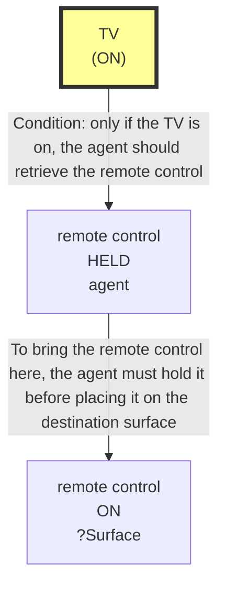
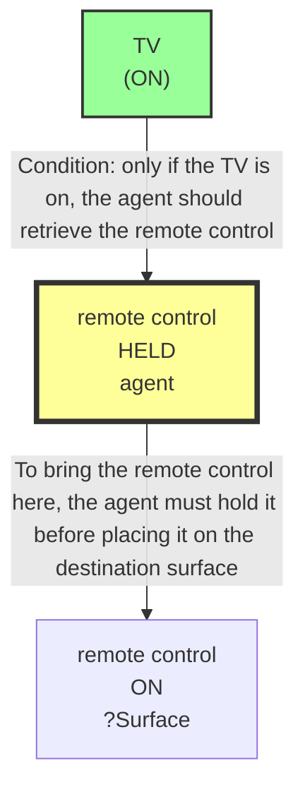
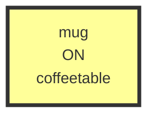
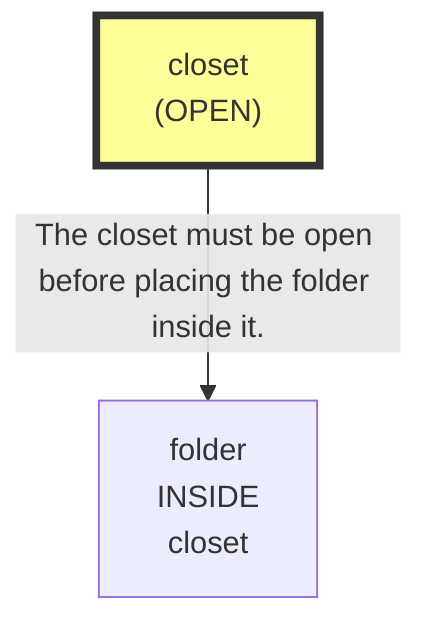
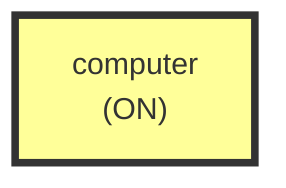

# 🚀 VirtualHome Agent Episode Log


### [GoalReasoner (Module A - Intent)] Output
```json
{
  "is_instruction_obviously_vague": false,
  "clarification_question": null,
  "target_object": "remote control",
  "location_hint": null,
  "reasoning_chain": [
    {
      "question": "Why does the user want this object?",
      "answer": "To use it to control the television."
    },
    {
      "question": "Why is that important?",
      "answer": "To change or manage the television's state or settings without going to the TV."
    },
    {
      "question": "What fundamental need does this fulfill?",
      "answer": "The user wants convenient control over an active household device."
    },
    {
      "question": "Are there any deeper psychological or physical motivations?",
      "answer": "The user likely wants to avoid unnecessary movement and maintain easy access to the control device."
    }
  ],
  "deep_intent": "The user wants convenient control over an active household device.",
  "acceptable_alternatives_properties": [
    {
      "priority": 1,
      "description": "Other control devices for the television, such as a universal remote or a paired phone app if available"
    },
    {
      "priority": 2,
      "description": "Any handheld device used to operate the television, such as a spare remote"
    },
    {
      "priority": 3,
      "description": "Other simple input devices that can control a household screen, such as a streaming device remote"
    },
    {
      "priority": 4,
      "description": "A nearby person can also control the television directly if the goal is simply to adjust the TV state"
    }
  ]
}
```

### [PerceptionFilter] Output
```json
{
  "reasoning": "The goal is to retrieve the remote control for TV use. The SDG explicitly requires the TV to be ON and the remote control to be held, then placed on a surface. To satisfy this with minimum necessary objects, keep the target remote control, the TV, and one plausible surface for placing/holding it (tvstand).",
  "selected_classes": [
    "character",
    "tv",
    "remotecontrol",
    "tvstand"
  ],
  "raw_class_count": 40
}
```

### [LLMExecutor] Output
```json
{
  "reasoning": "The SDG requires the TV to be ON before retrieving the remote control. The current graph shows tv(426) is OFF, and the character is already CLOSE to the TV and tvstand, so the next step is to switch on the TV. The TV has HAS_SWITCH and HAS_PLUG, but it is already close, so no walk is needed for the switch action itself. This action moves toward satisfying N1, which must be completed before N2 and N3 can be addressed.",
  "satisfied_nodes": [],
  "current_node_focus": "N1",
  "mapped_variables": {},
  "action": "[switchon] <tv> (426)"
}
```

### [RoboStateMultiTaskController] Output
```json
{
  "action": "[switchon] <tv> (426)",
  "active_task_id": "task_1",
  "task_context": {
    "active_task_id": "task_1",
    "pending_task_ids": [
      "task_2",
      "task_3",
      "task_4",
      "task_5",
      "task_6",
      "task_7"
    ],
    "satisfied_task_ids": []
  },
  "source": "llm_executor"
}
```
## Step 0
- **Action**: `[switchon] <tv> (426)`
- **Action Success**: `True`
- **Action Message**: Faked switch operation in Python layer (bypassed Unity failure)
- **Active Task**: `task_1`
- **Decision Source**: `llm_executor`
- **Task Progress**: G1_03=pending, E1_11=pending, E1_03=pending, E1_17=pending, E1_07=pending, E1_05=pending, E1_15=pending
- **SDG Status**:

- **Observed Items (8)**: tvstand(369), tv(426) [OFF], remotecontrol(452) [OFF], character(1), bathroom(11), bedroom(73), kitchen(205), livingroom(335)


### [PerceptionFilter] Output
```json
{
  "reasoning": "Reused cached class selection.",
  "selected_classes": [
    "character",
    "tv",
    "remotecontrol",
    "tvstand"
  ],
  "raw_class_count": 40
}
```

### [LLMExecutor] Output
```json
{
  "reasoning": "The TV is already ON, satisfying N1. The remote control exists in the living room and is grabbable. To satisfy N2, I need to be near it before grabbing; no other prerequisite or tool is needed. I should walk to the remote control now, then grab it on the next step.",
  "satisfied_nodes": [
    "N1"
  ],
  "current_node_focus": "N2",
  "mapped_variables": {},
  "action": "[walk] <remotecontrol> (452)"
}
```

### [RoboStateMultiTaskController] Output
```json
{
  "action": "[walk] <remotecontrol> (452)",
  "active_task_id": "task_1",
  "task_context": {
    "active_task_id": "task_1",
    "pending_task_ids": [
      "task_2",
      "task_3",
      "task_4",
      "task_5",
      "task_6",
      "task_7"
    ],
    "satisfied_task_ids": []
  },
  "source": "llm_executor"
}
```
## Step 1
- **Action**: `[walk] <remotecontrol> (452)`
- **Action Success**: `True`
- **Action Message**: {'0': {'message': 'Success'}}
- **Active Task**: `task_1`
- **Decision Source**: `llm_executor`
- **Task Progress**: G1_03=pending, E1_11=pending, E1_03=pending, E1_17=pending, E1_07=pending, E1_05=pending, E1_15=pending
- **SDG Status**:

- **Observed Items (8)**: tvstand(369), tv(426) [ON], remotecontrol(452) [OFF], character(1), bathroom(11), bedroom(73), kitchen(205), livingroom(335)


### [PerceptionFilter] Output
```json
{
  "reasoning": "Reused cached class selection.",
  "selected_classes": [
    "character",
    "tv",
    "remotecontrol",
    "tvstand"
  ],
  "raw_class_count": 40
}
```

### [LLMExecutor] Output
```json
{
  "reasoning": "The TV is already ON, satisfying N1. The remote control is currently CLOSE to the character and is grabbable, so the next step to satisfy the HOLD relation in N2 is to pick it up. We should not place it anywhere yet because N3 depends on already holding it first.",
  "satisfied_nodes": [
    "N1"
  ],
  "current_node_focus": "N2",
  "mapped_variables": {},
  "action": "[grab] <remotecontrol> (452)"
}
```

### [RoboStateMultiTaskController] Output
```json
{
  "action": "[grab] <remotecontrol> (452)",
  "active_task_id": "task_1",
  "task_context": {
    "active_task_id": "task_1",
    "pending_task_ids": [
      "task_2",
      "task_3",
      "task_4",
      "task_5",
      "task_6",
      "task_7"
    ],
    "satisfied_task_ids": []
  },
  "source": "llm_executor"
}
```
## Step 2
- **Action**: `[grab] <remotecontrol> (452)`
- **Action Success**: `True`
- **Action Message**: {'0': {'message': 'Success'}}
- **Active Task**: `task_1`
- **Decision Source**: `llm_executor`
- **Task Progress**: G1_03=done, E1_11=pending, E1_03=pending, E1_17=pending, E1_07=pending, E1_05=pending, E1_15=pending
- **SDG Status**:

- **Observed Items (8)**: tvstand(369), tv(426) [ON], remotecontrol(452) [OFF], character(1), bathroom(11), bedroom(73), kitchen(205), livingroom(335)


### [GoalReasoner (Module A - Intent)] Output
```json
{
  "is_instruction_obviously_vague": false,
  "clarification_question": null,
  "target_object": "mug",
  "location_hint": "coffeetable",
  "reasoning_chain": [
    {
      "question": "Why does the user want this object?",
      "answer": "To keep the mug in a specific place."
    },
    {
      "question": "Why is that important?",
      "answer": "To maintain the mug on the coffeetable as desired."
    },
    {
      "question": "What fundamental need does this fulfill?",
      "answer": "The user wants to keep a drink-related container in a consistent, designated location."
    },
    {
      "question": "Are there any deeper psychological or physical motivations?",
      "answer": "It likely supports organization, convenience, and ensuring the mug is easy to find or use."
    }
  ],
  "deep_intent": "The user wants a household item kept in a fixed, designated location for organization and convenience.",
  "acceptable_alternatives_properties": [
    {
      "priority": 1,
      "description": "Other drink containers or cups that can be kept on the coffeetable in place of the mug."
    },
    {
      "priority": 2,
      "description": "Similar tabletop drinkware such as tumblers, glasses, or other cups."
    },
    {
      "priority": 3,
      "description": "Other small household items that can be kept neatly on the coffeetable if the goal is organization rather than the mug specifically."
    },
    {
      "priority": 4,
      "description": "Any accessible container used for holding beverages, if the exact mug is unavailable."
    }
  ]
}
```

### [PerceptionFilter] Output
```json
{
  "reasoning": "The goal and SDG only require the mug and the coffeetable, since the task is to keep the mug in that designated location. No extra tools or alternative receptacles are needed because the object is already specified and the location is explicit.",
  "selected_classes": [
    "mug",
    "character",
    "coffeetable"
  ],
  "raw_class_count": 40
}
```

### [LLMExecutor] Output
```json
{
  "reasoning": "The active goal is to place the mug on the coffeetable. The character is already close to the coffeetable, but the mug is only shown as inside the livingroom and not yet held. To satisfy N1, the next required step is to get near the mug before grabbing it. Since a grab must be preceded by walking to the object itself, the best next atomic action is to walk to mug(447).",
  "satisfied_nodes": [],
  "current_node_focus": "N1",
  "mapped_variables": {},
  "action": "[walk] <mug> (447)"
}
```

### [RoboStateMultiTaskController] Output
```json
{
  "action": "[walk] <mug> (447)",
  "active_task_id": "task_5",
  "task_context": {
    "active_task_id": "task_5",
    "pending_task_ids": [
      "task_2",
      "task_3",
      "task_4",
      "task_6",
      "task_7"
    ],
    "satisfied_task_ids": [
      "task_1"
    ]
  },
  "source": "llm_executor"
}
```
## Step 3
- **Action**: `[walk] <mug> (447)`
- **Action Success**: `True`
- **Action Message**: {'0': {'message': 'Success'}}
- **Active Task**: `task_5`
- **Decision Source**: `llm_executor`
- **Task Progress**: G1_03=done, E1_11=pending, E1_03=pending, E1_17=pending, E1_07=pending, E1_05=pending, E1_15=pending
- **SDG Status**:

- **Observed Items (7)**: coffeetable(371), mug(447), character(1), bathroom(11), bedroom(73), kitchen(205), livingroom(335)


### [PerceptionFilter] Output
```json
{
  "reasoning": "Reused cached class selection.",
  "selected_classes": [
    "mug",
    "character",
    "coffeetable"
  ],
  "raw_class_count": 40
}
```

### [LLMExecutor] Output
```json
{
  "reasoning": "The active goal is to place the mug on the coffeetable. The mug is already close to the character, and the coffeetable is the target surface. According to the proximity rule, before putting an object onto a surface I must first walk to that surface. The mug is not currently on the coffeetable, so the next step is to move near the coffeetable to enable the required putback action afterward.",
  "satisfied_nodes": [],
  "current_node_focus": "N1",
  "mapped_variables": {
    "?TargetSurface": "coffeetable(371)"
  },
  "action": "[walk] <coffeetable> (371)"
}
```

### [RoboStateMultiTaskController] Output
```json
{
  "action": "[walk] <coffeetable> (371)",
  "active_task_id": "task_5",
  "task_context": {
    "active_task_id": "task_5",
    "pending_task_ids": [
      "task_2",
      "task_3",
      "task_4",
      "task_6",
      "task_7"
    ],
    "satisfied_task_ids": [
      "task_1"
    ]
  },
  "source": "llm_executor"
}
```
## Step 4
- **Action**: `[walk] <coffeetable> (371)`
- **Action Success**: `True`
- **Action Message**: {'0': {'message': 'Success'}}
- **Active Task**: `task_5`
- **Decision Source**: `llm_executor`
- **Task Progress**: G1_03=done, E1_11=pending, E1_03=pending, E1_17=pending, E1_07=pending, E1_05=pending, E1_15=pending
- **SDG Status**:

- **Observed Items (7)**: coffeetable(371), mug(447), character(1), bathroom(11), bedroom(73), kitchen(205), livingroom(335)


### [PerceptionFilter] Output
```json
{
  "reasoning": "Reused cached class selection.",
  "selected_classes": [
    "mug",
    "character",
    "coffeetable"
  ],
  "raw_class_count": 40
}
```

### [LLMExecutor] Output
```json
{
  "reasoning": "The active goal is to have mug(447) ON coffeetable(371). The current graph shows the character is already close to the coffeetable, and the mug is also in the same room. To place an object onto a surface, I must first be near the destination surface, which is already satisfied. The mug is not yet held, so the next required step toward the goal is to walk to the mug before grabbing it. I should not repeat the walk to the coffeetable since that was just done.",
  "satisfied_nodes": [],
  "current_node_focus": "N1",
  "mapped_variables": {},
  "action": "[walk] <mug> (447)"
}
```

### [RoboStateMultiTaskController] Output
```json
{
  "action": "[walk] <mug> (447)",
  "active_task_id": "task_5",
  "task_context": {
    "active_task_id": "task_5",
    "pending_task_ids": [
      "task_2",
      "task_3",
      "task_4",
      "task_6",
      "task_7"
    ],
    "satisfied_task_ids": [
      "task_1"
    ]
  },
  "source": "llm_executor"
}
```
## Step 5
- **Action**: `[walk] <mug> (447)`
- **Action Success**: `True`
- **Action Message**: {'0': {'message': 'Success'}}
- **Active Task**: `task_5`
- **Decision Source**: `llm_executor`
- **Task Progress**: G1_03=done, E1_11=pending, E1_03=pending, E1_17=pending, E1_07=pending, E1_05=pending, E1_15=pending
- **SDG Status**:

- **Observed Items (7)**: coffeetable(371), mug(447), character(1), bathroom(11), bedroom(73), kitchen(205), livingroom(335)


### [PerceptionFilter] Output
```json
{
  "reasoning": "Reused cached class selection.",
  "selected_classes": [
    "mug",
    "character",
    "coffeetable"
  ],
  "raw_class_count": 40
}
```

### [LLMExecutor] Output
```json
{
  "reasoning": "The active goal is to have mug(447) ON coffeetable(371). The mug is already close to the character, but the current graph does not show it on the coffeetable yet. Since the last action was a walk to the mug and we must not repeat a walk action if we just did it, the next atomic step is to grab the mug so it can then be placed on the coffeetable in a subsequent step.",
  "satisfied_nodes": [],
  "current_node_focus": "N1",
  "mapped_variables": {},
  "action": "[grab] <mug> (447)"
}
```

### [RoboStateMultiTaskController] Output
```json
{
  "action": "[grab] <mug> (447)",
  "active_task_id": "task_5",
  "task_context": {
    "active_task_id": "task_5",
    "pending_task_ids": [
      "task_2",
      "task_3",
      "task_4",
      "task_6",
      "task_7"
    ],
    "satisfied_task_ids": [
      "task_1"
    ]
  },
  "source": "llm_executor"
}
```
## Step 6
- **Action**: `[grab] <mug> (447)`
- **Action Success**: `True`
- **Action Message**: {'0': {'message': 'Success'}}
- **Active Task**: `task_5`
- **Decision Source**: `llm_executor`
- **Task Progress**: G1_03=done, E1_11=pending, E1_03=pending, E1_17=pending, E1_07=pending, E1_05=pending, E1_15=pending
- **SDG Status**:

- **Observed Items (7)**: coffeetable(371), mug(447), character(1), bathroom(11), bedroom(73), kitchen(205), livingroom(335)


### [PerceptionFilter] Output
```json
{
  "reasoning": "Reused cached class selection.",
  "selected_classes": [
    "mug",
    "character",
    "coffeetable"
  ],
  "raw_class_count": 40
}
```

### [LLMExecutor] Output
```json
{
  "reasoning": "The active goal is to have mug(447) ON coffeetable(371). The mug is currently held in the left hand and the coffeetable is a valid flat surface. Since the last action already walked to the coffeetable, the next required step is to place the held mug onto it.",
  "satisfied_nodes": [],
  "current_node_focus": "N1",
  "mapped_variables": {},
  "action": "[putback] <mug> (447) <coffeetable> (371)"
}
```

### [RoboStateMultiTaskController] Output
```json
{
  "action": "[walk] <coffeetable> (371)",
  "active_task_id": "task_5",
  "task_context": {
    "active_task_id": "task_5",
    "pending_task_ids": [
      "task_2",
      "task_3",
      "task_4",
      "task_6",
      "task_7"
    ],
    "satisfied_task_ids": [
      "task_1"
    ]
  },
  "source": "llm_executor_repaired"
}
```
## Step 7
- **Action**: `[walk] <coffeetable> (371)`
- **Action Success**: `True`
- **Action Message**: {'0': {'message': 'Success'}}
- **Active Task**: `task_5`
- **Decision Source**: `llm_executor_repaired`
- **Task Progress**: G1_03=done, E1_11=pending, E1_03=pending, E1_17=pending, E1_07=pending, E1_05=pending, E1_15=pending
- **SDG Status**:

- **Observed Items (7)**: coffeetable(371), mug(447), character(1), bathroom(11), bedroom(73), kitchen(205), livingroom(335)


### [PerceptionFilter] Output
```json
{
  "reasoning": "Reused cached class selection.",
  "selected_classes": [
    "mug",
    "character",
    "coffeetable"
  ],
  "raw_class_count": 40
}
```

### [LLMExecutor] Output
```json
{
  "reasoning": "The active SDG node N1 requires the mug to be ON the coffeetable. The current graph shows the mug is already being held in the left hand and the character is already close to the coffeetable, so the remaining gap is to place the mug onto that surface. Since putback requires being near the destination and we already are, the next atomic action is to put the mug on the coffeetable.",
  "satisfied_nodes": [],
  "current_node_focus": "N1",
  "mapped_variables": {},
  "action": "[putback] <mug> (447) <coffeetable> (371)"
}
```

### [RoboStateMultiTaskController] Output
```json
{
  "action": "[putback] <mug> (447) <coffeetable> (371)",
  "active_task_id": "task_5",
  "task_context": {
    "active_task_id": "task_5",
    "pending_task_ids": [
      "task_2",
      "task_3",
      "task_4",
      "task_6",
      "task_7"
    ],
    "satisfied_task_ids": [
      "task_1"
    ]
  },
  "source": "llm_executor"
}
```
## Step 8
- **Action**: `[putback] <mug> (447) <coffeetable> (371)`
- **Action Success**: `True`
- **Action Message**: {'0': {'message': 'Success'}}
- **Active Task**: `task_5`
- **Decision Source**: `llm_executor`
- **Task Progress**: G1_03=done, E1_11=pending, E1_03=pending, E1_17=pending, E1_07=done, E1_05=pending, E1_15=pending
- **SDG Status**:

- **Observed Items (7)**: coffeetable(371), mug(447), character(1), bathroom(11), bedroom(73), kitchen(205), livingroom(335)


### [GoalReasoner (Module A - Intent)] Output
```json
{
  "is_instruction_obviously_vague": false,
  "clarification_question": null,
  "target_object": "folder",
  "location_hint": "closet",
  "reasoning_chain": [
    {
      "question": "Why does the user want this object moved?",
      "answer": "To store or organize the folder in a designated place."
    },
    {
      "question": "Why is that important?",
      "answer": "To keep the environment tidy and make the folder easier to find or keep out of the way."
    },
    {
      "question": "What fundamental need does this fulfill?",
      "answer": "Organization and safe storage of an item."
    },
    {
      "question": "Are there any deeper psychological or physical motivations?",
      "answer": "It may reduce clutter, protect the folder from damage, or help maintain an orderly space."
    }
  ],
  "deep_intent": "The user wants to organize and store an item in a designated storage area.",
  "acceptable_alternatives_properties": [
    {
      "priority": 1,
      "description": "Other paper documents or files that can be neatly stored away in the same storage area"
    },
    {
      "priority": 2,
      "description": "Small office supplies or paperwork-related items that belong in a storage space"
    },
    {
      "priority": 3,
      "description": "Loose household items that need tidying and stowing"
    },
    {
      "priority": 4,
      "description": "Any portable item that can be put away to reduce clutter"
    }
  ]
}
```

### [PerceptionFilter] Output
```json
{
  "reasoning": "The goal is to store the folder in the closet, and the SDG explicitly requires the closet to be open. So the only necessary classes are the target item and the required storage location. No tools or alternatives are needed beyond that.",
  "selected_classes": [
    "closet",
    "character",
    "folder",
    "paper"
  ],
  "raw_class_count": 40
}
```

### [LLMExecutor] Output
```json
{
  "reasoning": "The active goal is to store the folder inside the closet, and the SDG shows the closet must be open first. The closet is currently CLOSED and the folder is available in the living room. Since the next required prerequisite is opening the closet, I should first move to the closet before interacting with it. This does not repeat the immediately previous action, and it sets up satisfaction of N2, which then enables N1.",
  "satisfied_nodes": [],
  "current_node_focus": "N2",
  "mapped_variables": {
    "?Container": "closet(374)"
  },
  "action": "[walk] <closet> (374)"
}
```

### [RoboStateMultiTaskController] Output
```json
{
  "action": "[walk] <closet> (374)",
  "active_task_id": "task_7",
  "task_context": {
    "active_task_id": "task_7",
    "pending_task_ids": [
      "task_2",
      "task_3",
      "task_4",
      "task_6"
    ],
    "satisfied_task_ids": [
      "task_1",
      "task_5"
    ]
  },
  "source": "llm_executor"
}
```
## Step 9
- **Action**: `[walk] <closet> (374)`
- **Action Success**: `True`
- **Action Message**: {'0': {'message': 'Success'}}
- **Active Task**: `task_7`
- **Decision Source**: `llm_executor`
- **Task Progress**: G1_03=done, E1_11=pending, E1_03=pending, E1_17=pending, E1_07=done, E1_05=pending, E1_15=pending
- **SDG Status**:

- **Observed Items (8)**: closet(374) [CLOSED], paper(451), folder(453) [CLOSED], character(1), bathroom(11), bedroom(73), kitchen(205), livingroom(335)


### [PerceptionFilter] Output
```json
{
  "reasoning": "Reused cached class selection.",
  "selected_classes": [
    "closet",
    "character",
    "folder",
    "paper"
  ],
  "raw_class_count": 40
}
```

### [LLMExecutor] Output
```json
{
  "reasoning": "The active goal is to place the folder inside the closet, and the closet is currently CLOSED. The SDG explicitly requires the closet to be OPEN before the folder can be placed inside. We are already close to the closet from the previous step, so the next atomic action should open it. Folder(453) is the best match for the target object, but it cannot be inserted until the closet is open.",
  "satisfied_nodes": [],
  "current_node_focus": "N2",
  "mapped_variables": {
    "?Container": "closet(374)"
  },
  "action": "[open] <closet> (374)"
}
```

### [RoboStateMultiTaskController] Output
```json
{
  "action": "[open] <closet> (374)",
  "active_task_id": "task_7",
  "task_context": {
    "active_task_id": "task_7",
    "pending_task_ids": [
      "task_2",
      "task_3",
      "task_4",
      "task_6"
    ],
    "satisfied_task_ids": [
      "task_1",
      "task_5"
    ]
  },
  "source": "llm_executor"
}
```
## Step 10
- **Action**: `[open] <closet> (374)`
- **Action Success**: `False`
- **Action Message**: {'0': {'message': 'ScriptExcutor 0: EXECUTION_GENERAL: Script is impossible to execute\n\n'}}
- **Active Task**: `task_7`
- **Decision Source**: `llm_executor`
- **Task Progress**: G1_03=done, E1_11=pending, E1_03=pending, E1_17=pending, E1_07=done, E1_05=pending, E1_15=pending
- **SDG Status**:

- **Observed Items (8)**: closet(374) [CLOSED], paper(451), folder(453) [CLOSED], character(1), bathroom(11), bedroom(73), kitchen(205), livingroom(335)


### [PerceptionFilter] Output
```json
{
  "reasoning": "Reused cached class selection.",
  "selected_classes": [
    "closet",
    "character",
    "folder",
    "paper"
  ],
  "raw_class_count": 40
}
```

### [LLMExecutor] Output
```json
{
  "reasoning": "The closet is the correct destination and the previous open attempt failed despite being close, so the safest next step is to retry opening it rather than moving away. This directly advances the only unsatisfied prerequisite (closet OPEN) for putting the folder inside.",
  "satisfied_nodes": [],
  "current_node_focus": "N2",
  "mapped_variables": {},
  "action": "[open] <closet> (374)"
}
```

### [RoboStateMultiTaskController] Output
```json
{
  "action": "[open] <closet> (374)",
  "active_task_id": "task_7",
  "task_context": {
    "active_task_id": "task_7",
    "pending_task_ids": [
      "task_2",
      "task_3",
      "task_4",
      "task_6"
    ],
    "satisfied_task_ids": [
      "task_1",
      "task_5"
    ]
  },
  "source": "llm_executor"
}
```
## Step 11
- **Action**: `[open] <closet> (374)`
- **Action Success**: `False`
- **Action Message**: {'0': {'message': 'ScriptExcutor 0: EXECUTION_GENERAL: Script is impossible to execute\n\n'}}
- **Active Task**: `task_7`
- **Decision Source**: `llm_executor`
- **Task Progress**: G1_03=done, E1_11=pending, E1_03=pending, E1_17=pending, E1_07=done, E1_05=pending, E1_15=pending
- **SDG Status**:

- **Observed Items (8)**: closet(374) [CLOSED], paper(451), folder(453) [CLOSED], character(1), bathroom(11), bedroom(73), kitchen(205), livingroom(335)


### [GoalReasoner (Module A - Intent)] Output
```json
{
  "is_instruction_obviously_vague": false,
  "clarification_question": null,
  "target_object": "computer",
  "location_hint": null,
  "reasoning_chain": [
    {
      "question": "Why does the user want this object?",
      "answer": "To have the computer powered on."
    },
    {
      "question": "Why is that important?",
      "answer": "So the computer is available for use instead of remaining off."
    },
    {
      "question": "What fundamental need does this fulfill?",
      "answer": "It enables access to computing functionality and whatever task the user intends to do on the computer."
    },
    {
      "question": "Are there any deeper psychological or physical motivations?",
      "answer": "The user likely wants to continue an activity that requires a working computer and avoid interruption or downtime."
    }
  ],
  "deep_intent": "The user wants to restore computer availability and usability.",
  "acceptable_alternatives_properties": [
    {
      "priority": 1,
      "description": "Other powered-on computing devices that can provide similar access, such as a laptop, tablet, or desktop computer."
    },
    {
      "priority": 2,
      "description": "A different computer in the same environment that is already on and ready to use."
    },
    {
      "priority": 3,
      "description": "A device that can perform the needed digital task, such as a workstation or shared terminal."
    },
    {
      "priority": 4,
      "description": "Any available electronic device that can let the user continue the intended activity, such as a tablet or smartphone if it supports the required function."
    }
  ]
}
```

### [PerceptionFilter] Output
```json
{
  "reasoning": "The goal is to have a computer powered on and usable. The SDG explicitly requires the computer, and a powered state implies keeping the computer plus any obvious interaction/power-related peripherals or backup computing devices that could satisfy the intent. From the visible objects, the necessary classes are the computer itself, its screen and input devices, and the power source needed to restore/use it. Since acceptable alternatives include other usable computing devices, cellphone is also retained as a backup option.",
  "selected_classes": [
    "powersocket",
    "keyboard",
    "character",
    "mouse",
    "desk",
    "cpuscreen",
    "computer",
    "cellphone"
  ],
  "raw_class_count": 40
}
```

### [LLMExecutor] Output
```json
{
  "reasoning": "The active task is to power on the computer. The computer(433) is currently OFF and has a switch, so the next needed action is to switch it on. The prior failed closet actions are irrelevant to this task. I am not already at the computer's exact interaction point from the graph, but switching on requires being near the target; the filtered graph places the computer in the livingroom and no closer interaction target is specified. Since the prompt says not to repeat a walk action if I just did it, and the computer is the direct target, I will attempt the switch-on as the immediate next step.",
  "satisfied_nodes": [],
  "current_node_focus": "N1",
  "mapped_variables": {
    "?Device": "computer(433)"
  },
  "action": "[switchon] <computer> (433)"
}
```

### [RoboStateMultiTaskController] Output
```json
{
  "action": "[walk] <computer> (433)",
  "active_task_id": "task_2",
  "task_context": {
    "active_task_id": "task_2",
    "pending_task_ids": [
      "task_3",
      "task_4",
      "task_6",
      "task_7"
    ],
    "satisfied_task_ids": [
      "task_1",
      "task_5"
    ]
  },
  "source": "llm_executor_repaired"
}
```
## Step 12
- **Action**: `[walk] <computer> (433)`
- **Action Success**: `True`
- **Action Message**: {'0': {'message': 'Success'}}
- **Active Task**: `task_2`
- **Decision Source**: `llm_executor_repaired`
- **Task Progress**: G1_03=done, E1_11=pending, E1_03=pending, E1_17=pending, E1_07=done, E1_05=pending, E1_15=pending
- **SDG Status**:

- **Observed Items (13)**: desk(373) [CLOSED], powersocket(428), mouse(429), keyboard(431), cpuscreen(432), computer(433) [OFF], cellphone(448) [OFF], cellphone(449) [OFF], character(1), bathroom(11), bedroom(73), kitchen(205), livingroom(335)


### [PerceptionFilter] Output
```json
{
  "reasoning": "Reused cached class selection.",
  "selected_classes": [
    "powersocket",
    "keyboard",
    "character",
    "mouse",
    "desk",
    "cpuscreen",
    "computer",
    "cellphone"
  ],
  "raw_class_count": 40
}
```

### [LLMExecutor] Output
```json
{
  "reasoning": "The active task is to power on the computer. The filtered graph shows computer(433) is OFF and the character is already CLOSE to it, so no walk is needed. The computer has a switch and can be turned on directly. This should satisfy N1.",
  "satisfied_nodes": [],
  "current_node_focus": "N1",
  "mapped_variables": {
    "?Computer": "computer(433)"
  },
  "action": "[switchon] <computer> (433)"
}
```

### [RoboStateMultiTaskController] Output
```json
{
  "action": "[switchon] <computer> (433)",
  "active_task_id": "task_2",
  "task_context": {
    "active_task_id": "task_2",
    "pending_task_ids": [
      "task_3",
      "task_4",
      "task_6",
      "task_7"
    ],
    "satisfied_task_ids": [
      "task_1",
      "task_5"
    ]
  },
  "source": "llm_executor"
}
```
## Step 13
- **Action**: `[switchon] <computer> (433)`
- **Action Success**: `True`
- **Action Message**: Faked switch operation in Python layer (bypassed Unity failure)
- **Active Task**: `task_2`
- **Decision Source**: `llm_executor`
- **Task Progress**: G1_03=done, E1_11=done, E1_03=pending, E1_17=pending, E1_07=done, E1_05=pending, E1_15=pending
- **SDG Status**:

- **Observed Items (13)**: desk(373) [CLOSED], powersocket(428), mouse(429), keyboard(431), cpuscreen(432), computer(433) [OFF], cellphone(448) [OFF], cellphone(449) [OFF], character(1), bathroom(11), bedroom(73), kitchen(205), livingroom(335)


### [PerceptionFilter] Output
```json
{
  "reasoning": "Reused cached class selection.",
  "selected_classes": [
    "closet",
    "character",
    "folder",
    "paper"
  ],
  "raw_class_count": 40
}
```

### [LLMExecutor] Output
```json
{
  "reasoning": "The active SDG requires the folder to be inside the closet, and the closet must be open first. The closet is currently CLOSED and we are already at the closet from the prior walk, so the next required step is to open it. The previous open attempts failed with a generic execution error, but this is not a permanently impossible condition; no clarification is needed. This action targets the prerequisite node N2.",
  "satisfied_nodes": [],
  "current_node_focus": "N2",
  "mapped_variables": {
    "?Container": "closet(374)"
  },
  "action": "[open] <closet> (374)"
}
```

### [RoboStateMultiTaskController] Output
```json
{
  "action": "[walk] <closet> (374)",
  "active_task_id": "task_7",
  "task_context": {
    "active_task_id": "task_7",
    "pending_task_ids": [
      "task_3",
      "task_4",
      "task_6"
    ],
    "satisfied_task_ids": [
      "task_1",
      "task_2",
      "task_5"
    ]
  },
  "source": "llm_executor_repaired"
}
```
## Step 14
- **Action**: `[walk] <closet> (374)`
- **Action Success**: `True`
- **Action Message**: {'0': {'message': 'Success'}}
- **Active Task**: `task_7`
- **Decision Source**: `llm_executor_repaired`
- **Task Progress**: G1_03=done, E1_11=done, E1_03=pending, E1_17=pending, E1_07=done, E1_05=pending, E1_15=pending
- **SDG Status**:

- **Observed Items (8)**: closet(374) [CLOSED], paper(451), folder(453) [CLOSED], character(1), bathroom(11), bedroom(73), kitchen(205), livingroom(335)


### [PerceptionFilter] Output
```json
{
  "reasoning": "Reused cached class selection.",
  "selected_classes": [
    "closet",
    "character",
    "folder",
    "paper"
  ],
  "raw_class_count": 40
}
```

### [LLMExecutor] Output
```json
{
  "reasoning": "The active goal is to place the folder inside the closet, and the SDG requires the closet to be open first. We are already close to closet(374), but previous open attempts failed because the closet is currently CLOSED. Since the closet is an openable container and the task can progress only after it is opened, the single next action should be to try opening the closet again so we can then place the folder inside it.",
  "satisfied_nodes": [],
  "current_node_focus": "N2",
  "mapped_variables": {
    "?Container": "closet(374)"
  },
  "action": "[open] <closet> (374)"
}
```

### [RoboStateMultiTaskController] Output
```json
{
  "action": "[open] <closet> (374)",
  "active_task_id": "task_7",
  "task_context": {
    "active_task_id": "task_7",
    "pending_task_ids": [
      "task_3",
      "task_4",
      "task_6"
    ],
    "satisfied_task_ids": [
      "task_1",
      "task_2",
      "task_5"
    ]
  },
  "source": "llm_executor"
}
```
## Step 15
- **Action**: `[open] <closet> (374)`
- **Action Success**: `False`
- **Action Message**: {'0': {'message': 'ScriptExcutor 0: EXECUTION_GENERAL: Script is impossible to execute\n\n'}}
- **Active Task**: `task_7`
- **Decision Source**: `llm_executor`
- **Task Progress**: G1_03=done, E1_11=done, E1_03=pending, E1_17=pending, E1_07=done, E1_05=pending, E1_15=pending
- **SDG Status**:

- **Observed Items (8)**: closet(374) [CLOSED], paper(451), folder(453) [CLOSED], character(1), bathroom(11), bedroom(73), kitchen(205), livingroom(335)


### [PerceptionFilter] Output
```json
{
  "reasoning": "Reused cached class selection.",
  "selected_classes": [
    "closet",
    "character",
    "folder",
    "paper"
  ],
  "raw_class_count": 40
}
```

### [LLMExecutor] Output
```json
{
  "reasoning": "The active goal is to place the folder inside the closet, and the closet must be OPEN first. The closet is currently CLOSED and I am already CLOSE to it, but previous open attempts failed with a general execution error. Since the task is not ambiguous and the closet is a valid target, the next step is to try opening the closet again to satisfy N2 before attempting to move the folder.",
  "satisfied_nodes": [],
  "current_node_focus": "N2",
  "mapped_variables": {
    "?Container": "closet(374)"
  },
  "action": "[open] <closet> (374)"
}
```

### [RoboStateMultiTaskController] Output
```json
{
  "action": "[open] <closet> (374)",
  "active_task_id": "task_7",
  "task_context": {
    "active_task_id": "task_7",
    "pending_task_ids": [
      "task_3",
      "task_4",
      "task_6"
    ],
    "satisfied_task_ids": [
      "task_1",
      "task_2",
      "task_5"
    ]
  },
  "source": "llm_executor"
}
```
## Step 16
- **Action**: `[open] <closet> (374)`
- **Action Success**: `False`
- **Action Message**: {'0': {'message': 'ScriptExcutor 0: EXECUTION_GENERAL: Script is impossible to execute\n\n'}}
- **Active Task**: `task_7`
- **Decision Source**: `llm_executor`
- **Task Progress**: G1_03=done, E1_11=done, E1_03=pending, E1_17=pending, E1_07=done, E1_05=pending, E1_15=pending
- **SDG Status**:

- **Observed Items (8)**: closet(374) [CLOSED], paper(451), folder(453) [CLOSED], character(1), bathroom(11), bedroom(73), kitchen(205), livingroom(335)


### [GoalReasoner (Module A - Intent)] Output
```json
{
  "is_instruction_obviously_vague": false,
  "clarification_question": null,
  "target_object": "book",
  "location_hint": "sofa",
  "reasoning_chain": [
    {
      "question": "Why does the user want this object?",
      "answer": "To move an unorganized book to the sofa."
    },
    {
      "question": "Why is that important?",
      "answer": "To place the book in a specific resting or gathering location instead of leaving it elsewhere."
    },
    {
      "question": "What fundamental need does this fulfill?",
      "answer": "To organize or reposition an item within the living space."
    },
    {
      "question": "Are there any deeper psychological or physical motivations?",
      "answer": "The user likely wants to reduce clutter, keep the area tidier, or make the book readily accessible on the sofa."
    }
  ],
  "deep_intent": "The user wants to organize an item by relocating it to a designated seating area.",
  "acceptable_alternatives_properties": [
    {
      "priority": 1,
      "description": "Other small portable reading materials or similarly sized personal items that can be placed on the sofa"
    },
    {
      "priority": 2,
      "description": "Other books or magazines that are out of place and need to be gathered onto the sofa"
    },
    {
      "priority": 3,
      "description": "Nearby loose items that contribute to clutter and can be tidied by moving them to the sofa"
    },
    {
      "priority": 4,
      "description": "Other portable household items that can be relocated to reduce disorganization in the room"
    }
  ]
}
```

### [RoboStateMultiTaskController] Output
```json
{
  "action": "[walk] <bathroom> (11)",
  "active_task_id": "task_3",
  "task_context": {
    "active_task_id": "task_3",
    "pending_task_ids": [
      "task_4",
      "task_6",
      "task_7"
    ],
    "satisfied_task_ids": [
      "task_1",
      "task_2",
      "task_5"
    ]
  },
  "source": "room_frontier"
}
```
## Step 17
- **Action**: `[walk] <bathroom> (11)`
- **Action Success**: `True`
- **Action Message**: {'0': {'message': 'Success'}}
- **Active Task**: `task_3`
- **Decision Source**: `room_frontier`
- **Task Progress**: G1_03=done, E1_11=done, E1_03=pending, E1_17=pending, E1_07=done, E1_05=pending, E1_15=pending
- **SDG Status**:

- **Observed Items (79)**: floor(336), floor(337), floor(338), floor(339), floor(340), floor(341), floor(342), floor(343), floor(344), wall(345), wall(346), wall(347), wall(348), wall(349), wall(350)...


### [RoboStateMultiTaskController] Output
```json
{
  "action": "[walk] <bedroom> (73)",
  "active_task_id": "task_3",
  "task_context": {
    "active_task_id": "task_3",
    "pending_task_ids": [
      "task_4",
      "task_6",
      "task_7"
    ],
    "satisfied_task_ids": [
      "task_1",
      "task_2",
      "task_5"
    ]
  },
  "source": "room_frontier"
}
```
## Step 18
- **Action**: `[walk] <bedroom> (73)`
- **Action Success**: `True`
- **Action Message**: {'0': {'message': 'Success'}}
- **Active Task**: `task_3`
- **Decision Source**: `room_frontier`
- **Task Progress**: G1_03=done, E1_11=done, E1_03=pending, E1_17=pending, E1_07=done, E1_05=pending, E1_15=pending
- **SDG Status**:

- **Observed Items (140)**: floor(336), floor(337), floor(338), floor(339), floor(340), floor(341), floor(342), floor(343), floor(344), wall(345), wall(346), wall(347), wall(348), wall(349), wall(350)...


### [PerceptionFilter] Output
```json
{
  "reasoning": "The goal is to place the target object, book, onto the sofa. The SDG explicitly requires the book and the sofa, and no additional tools or receptacles are needed for this simple relocation task.",
  "selected_classes": [
    "book",
    "character",
    "sofa"
  ],
  "raw_class_count": 72
}
```

### [LLMExecutor] Output
```json
{
  "reasoning": "The active goal is to place the book on the sofa. The book(190) is already close to the character in the bedroom, so the next necessary step is to pick it up before moving it. The sofa(368) is the target surface, but per proximity rules I should only walk to it after grabbing the book. No other SDG nodes are satisfied yet because the book is not on the sofa.",
  "satisfied_nodes": [],
  "current_node_focus": "N1",
  "mapped_variables": {
    "?TargetBook": "book(190)",
    "?Sofa": "sofa(368)"
  },
  "action": "[grab] <book> (190)"
}
```

### [RoboStateMultiTaskController] Output
```json
{
  "action": "[grab] <book> (190)",
  "active_task_id": "task_3",
  "task_context": {
    "active_task_id": "task_3",
    "pending_task_ids": [
      "task_4",
      "task_6",
      "task_7"
    ],
    "satisfied_task_ids": [
      "task_1",
      "task_2",
      "task_5"
    ]
  },
  "source": "llm_executor"
}
```
## Step 19
- **Action**: `[grab] <book> (190)`
- **Action Success**: `True`
- **Action Message**: {'0': {'message': 'Success'}}
- **Active Task**: `task_3`
- **Decision Source**: `llm_executor`
- **Task Progress**: G1_03=done, E1_11=done, E1_03=pending, E1_17=pending, E1_07=done, E1_05=pending, E1_15=pending
- **SDG Status**:

- **Observed Items (7)**: sofa(368), character(1), bathroom(11), bedroom(73), kitchen(205), livingroom(335), book(190) [CLOSED]


### [PerceptionFilter] Output
```json
{
  "reasoning": "Reused cached class selection.",
  "selected_classes": [
    "book",
    "character",
    "sofa"
  ],
  "raw_class_count": 72
}
```

### [LLMExecutor] Output
```json
{
  "reasoning": "The active task is to place the book on the sofa. The book(190) is already held in the left hand and the sofa(368) is the correct destination surface. The current graph shows the character is in the bedroom, while the sofa is in the livingroom, so the next required step is to walk to the sofa before any putback action. No other SDG nodes are satisfied yet because the book is not on the sofa.",
  "satisfied_nodes": [],
  "current_node_focus": "N1",
  "mapped_variables": {},
  "action": "[walk] <sofa> (368)"
}
```

### [RoboStateMultiTaskController] Output
```json
{
  "action": "[walk] <sofa> (368)",
  "active_task_id": "task_3",
  "task_context": {
    "active_task_id": "task_3",
    "pending_task_ids": [
      "task_4",
      "task_6",
      "task_7"
    ],
    "satisfied_task_ids": [
      "task_1",
      "task_2",
      "task_5"
    ]
  },
  "source": "llm_executor"
}
```
## Step 20
- **Action**: `[walk] <sofa> (368)`
- **Action Success**: `True`
- **Action Message**: {'0': {'message': 'Success'}}
- **Active Task**: `task_3`
- **Decision Source**: `llm_executor`
- **Task Progress**: G1_03=done, E1_11=done, E1_03=pending, E1_17=pending, E1_07=done, E1_05=pending, E1_15=pending
- **SDG Status**:
```mermaid
graph TD
    N1["book<br>ON<br>sofa"]
    style N1 fill:#ff9,stroke:#333,stroke-width:4px
```
- **Observed Items (7)**: sofa(368), character(1), bathroom(11), bedroom(73), kitchen(205), livingroom(335), book(190) [CLOSED]


### [PerceptionFilter] Output
```json
{
  "reasoning": "Reused cached class selection.",
  "selected_classes": [
    "book",
    "character",
    "sofa"
  ],
  "raw_class_count": 72
}
```

### [LLMExecutor] Output
```json
{
  "reasoning": "The active task is to place the held book onto the sofa. The current graph shows the character is already CLOSE to sofa(368) and HOLDS_LH book(190), so the only missing state for N1 is the book being ON the sofa. Since putback onto a surface requires being near the destination and we are already near it, the next atomic action is to place the book on the sofa.",
  "satisfied_nodes": [],
  "current_node_focus": "N1",
  "mapped_variables": {},
  "action": "[putback] <book> (190) <sofa> (368)"
}
```

### [RoboStateMultiTaskController] Output
```json
{
  "action": "[putback] <book> (190) <sofa> (368)",
  "active_task_id": "task_3",
  "task_context": {
    "active_task_id": "task_3",
    "pending_task_ids": [
      "task_4",
      "task_6",
      "task_7"
    ],
    "satisfied_task_ids": [
      "task_1",
      "task_2",
      "task_5"
    ]
  },
  "source": "llm_executor"
}
```
## Step 21
- **Action**: `[putback] <book> (190) <sofa> (368)`
- **Action Success**: `True`
- **Action Message**: {'0': {'message': 'Success'}}
- **Active Task**: `task_3`
- **Decision Source**: `llm_executor`
- **Task Progress**: G1_03=done, E1_11=done, E1_03=done, E1_17=pending, E1_07=done, E1_05=pending, E1_15=pending
- **SDG Status**:
```mermaid
graph TD
    N1["book<br>ON<br>sofa"]
    style N1 fill:#ff9,stroke:#333,stroke-width:4px
```
- **Observed Items (7)**: sofa(368), character(1), bathroom(11), bedroom(73), kitchen(205), livingroom(335), book(190) [CLOSED]


### [PerceptionFilter] Output
```json
{
  "reasoning": "The goal is to store the target item folder inside the closet, and the SDG requires the closet to be open first. So the only needed classes are the target folder and the destination closet; no other tools or alternatives are required for this storage task.",
  "selected_classes": [
    "closet",
    "character",
    "folder",
    "paper"
  ],
  "raw_class_count": 72
}
```

### [LLMExecutor] Output
```json
{
  "reasoning": "The active goal is to place the folder inside a closet, and the SDG requires the closet to be open first. The current graph shows closet(112) is already OPEN and is in the bedroom. Folder(203) is available in the bedroom and is the best bind for the target folder because it is a grabbable folder already present in the environment. Since I am not currently holding it and must be near it to grab it, the next step is to walk to folder(203).",
  "satisfied_nodes": [
    "N2"
  ],
  "current_node_focus": "N1",
  "mapped_variables": {
    "?Container": "closet(112)",
    "?Folder": "folder(203)"
  },
  "action": "[walk] <folder> (203)"
}
```

### [RoboStateMultiTaskController] Output
```json
{
  "action": "[walk] <folder> (203)",
  "active_task_id": "task_7",
  "task_context": {
    "active_task_id": "task_7",
    "pending_task_ids": [
      "task_4",
      "task_6"
    ],
    "satisfied_task_ids": [
      "task_1",
      "task_2",
      "task_3",
      "task_5"
    ]
  },
  "source": "llm_executor"
}
```
## Step 22
- **Action**: `[walk] <folder> (203)`
- **Action Success**: `True`
- **Action Message**: {'0': {'message': 'Success'}}
- **Active Task**: `task_7`
- **Decision Source**: `llm_executor`
- **Task Progress**: G1_03=done, E1_11=done, E1_03=done, E1_17=pending, E1_07=done, E1_05=pending, E1_15=pending
- **SDG Status**:
```mermaid
graph TD
    N1["folder<br>INSIDE<br>closet"]
    style N1 fill:#ff9,stroke:#333,stroke-width:4px
    N2["closet<br>(OPEN)"]
    style N2 fill:#9f9,stroke:#333,stroke-width:2px
    N2 -->|"The closet must be open before placing the folder inside it."| N1
```
- **Observed Items (11)**: closet(374) [CLOSED], paper(451), folder(453) [CLOSED], character(1), bathroom(11), bedroom(73), kitchen(205), livingroom(335), closet(112) [OPEN], closet(127) [CLOSED], folder(203) [CLOSED]


### [PerceptionFilter] Output
```json
{
  "reasoning": "Reused cached class selection.",
  "selected_classes": [
    "closet",
    "character",
    "folder",
    "paper"
  ],
  "raw_class_count": 72
}
```

### [LLMExecutor] Output
```json
{
  "reasoning": "The active goal is to place the folder inside the closet, and the SDG requires the closet to be open first. The current graph shows closet(374) is CLOSED and the character is already close to folder(203), but the folder needed for this active task is actually the closet-target item in the living room graph: folder(453). Since we are already at folder(203) and must not repeat a walk action if we just did it, the next useful step toward the goal is to open the closet we need to use. However, the currently selected closet(374) previously produced an impossible open error, while closet(112) is explicitly OPEN and closet(127) is CLOSED. The only closet instance that satisfies the required OPEN state right now is closet(112), so I will use that as the active closet target for storage.",
  "satisfied_nodes": [
    "N2"
  ],
  "current_node_focus": "N1",
  "mapped_variables": {
    "?Closet": "closet(112)",
    "?Folder": "folder(453)"
  },
  "action": "[putin] <folder> (453) <closet> (112)"
}
```

### [RoboStateMultiTaskController] Output
```json
{
  "action": "[walk] <folder> (453)",
  "active_task_id": "task_7",
  "task_context": {
    "active_task_id": "task_7",
    "pending_task_ids": [
      "task_4",
      "task_6"
    ],
    "satisfied_task_ids": [
      "task_1",
      "task_2",
      "task_3",
      "task_5"
    ]
  },
  "source": "llm_executor_repaired"
}
```
## Step 23
- **Action**: `[walk] <folder> (453)`
- **Action Success**: `True`
- **Action Message**: {'0': {'message': 'Success'}}
- **Active Task**: `task_7`
- **Decision Source**: `llm_executor_repaired`
- **Task Progress**: G1_03=done, E1_11=done, E1_03=done, E1_17=pending, E1_07=done, E1_05=pending, E1_15=pending
- **SDG Status**:
```mermaid
graph TD
    N1["folder<br>INSIDE<br>closet"]
    style N1 fill:#ff9,stroke:#333,stroke-width:4px
    N2["closet<br>(OPEN)"]
    style N2 fill:#9f9,stroke:#333,stroke-width:2px
    N2 -->|"The closet must be open before placing the folder inside it."| N1
```
- **Observed Items (11)**: closet(374) [CLOSED], paper(451), folder(453) [CLOSED], character(1), bathroom(11), bedroom(73), kitchen(205), livingroom(335), closet(112) [OPEN], closet(127) [CLOSED], folder(203) [CLOSED]


### [PerceptionFilter] Output
```json
{
  "reasoning": "Reused cached class selection.",
  "selected_classes": [
    "closet",
    "character",
    "folder",
    "paper"
  ],
  "raw_class_count": 72
}
```

### [LLMExecutor] Output
```json
{
  "reasoning": "The active goal is to place the folder inside the closet, and the required closet node in the SDG is closet(374), which is currently CLOSED. I am already near closet(374) from the prior walk, so the next needed step is to open it before any put-in action. The earlier open attempts failed, but the closet is still the correct target for the task; this action retries the required state change to satisfy N2 and unblock N1.",
  "satisfied_nodes": [],
  "current_node_focus": "N2",
  "mapped_variables": {
    "?Container": "closet(374)"
  },
  "action": "[open] <closet> (374)"
}
```

### [RoboStateMultiTaskController] Output
```json
{
  "action": "[walk] <closet> (374)",
  "active_task_id": "task_7",
  "task_context": {
    "active_task_id": "task_7",
    "pending_task_ids": [
      "task_4",
      "task_6"
    ],
    "satisfied_task_ids": [
      "task_1",
      "task_2",
      "task_3",
      "task_5"
    ]
  },
  "source": "llm_executor_repaired"
}
```
## Step 24
- **Action**: `[walk] <closet> (374)`
- **Action Success**: `True`
- **Action Message**: {'0': {'message': 'Success'}}
- **Active Task**: `task_7`
- **Decision Source**: `llm_executor_repaired`
- **Task Progress**: G1_03=done, E1_11=done, E1_03=done, E1_17=pending, E1_07=done, E1_05=pending, E1_15=pending
- **SDG Status**:
```mermaid
graph TD
    N1["folder<br>INSIDE<br>closet"]
    N2["closet<br>(OPEN)"]
    style N2 fill:#ff9,stroke:#333,stroke-width:4px
    N2 -->|"The closet must be open before placing the folder inside it."| N1
```
- **Observed Items (11)**: closet(374) [CLOSED], paper(451), folder(453) [CLOSED], character(1), bathroom(11), bedroom(73), kitchen(205), livingroom(335), closet(112) [OPEN], closet(127) [CLOSED], folder(203) [CLOSED]


### [PerceptionFilter] Output
```json
{
  "reasoning": "Reused cached class selection.",
  "selected_classes": [
    "closet",
    "character",
    "folder",
    "paper"
  ],
  "raw_class_count": 72
}
```

### [LLMExecutor] Output
```json
{
  "reasoning": "The active goal is to place the folder inside the closet. The closet currently in reach is closet(374) in the living room, but it is CLOSED, and the folder in the current room is folder(453), which is also available. Since the closet must be open before insertion, the immediate blocker is the closed closet. A previous open attempt on closet(374) failed as impossible, so the best move is to target the currently visible closet and attempt opening it only if the environment allows; however, because the last step was already a walk to this closet, I should not repeat walking. The next atomic step needed toward the goal is to open the closet to prepare for putting the folder inside.",
  "satisfied_nodes": [],
  "current_node_focus": "N2",
  "mapped_variables": {
    "?Container": "closet(374)"
  },
  "action": "[open] <closet> (374)"
}
```

### [RoboStateMultiTaskController] Output
```json
{
  "action": "[open] <closet> (374)",
  "active_task_id": "task_7",
  "task_context": {
    "active_task_id": "task_7",
    "pending_task_ids": [
      "task_4",
      "task_6"
    ],
    "satisfied_task_ids": [
      "task_1",
      "task_2",
      "task_3",
      "task_5"
    ]
  },
  "source": "llm_executor"
}
```
## Step 25
- **Action**: `[open] <closet> (374)`
- **Action Success**: `False`
- **Action Message**: {'0': {'message': 'ScriptExcutor 0: EXECUTION_GENERAL: Script is impossible to execute\n\n'}}
- **Active Task**: `task_7`
- **Decision Source**: `llm_executor`
- **Task Progress**: G1_03=done, E1_11=done, E1_03=done, E1_17=pending, E1_07=done, E1_05=pending, E1_15=pending
- **SDG Status**:
```mermaid
graph TD
    N1["folder<br>INSIDE<br>closet"]
    N2["closet<br>(OPEN)"]
    style N2 fill:#ff9,stroke:#333,stroke-width:4px
    N2 -->|"The closet must be open before placing the folder inside it."| N1
```
- **Observed Items (11)**: closet(374) [CLOSED], paper(451), folder(453) [CLOSED], character(1), bathroom(11), bedroom(73), kitchen(205), livingroom(335), closet(112) [OPEN], closet(127) [CLOSED], folder(203) [CLOSED]


### [PerceptionFilter] Output
```json
{
  "reasoning": "Reused cached class selection.",
  "selected_classes": [
    "closet",
    "character",
    "folder",
    "paper"
  ],
  "raw_class_count": 72
}
```

### [LLMExecutor] Output
```json
{
  "reasoning": "The target closet for the active task is closet(374), which is currently CLOSED and already close to the character. The previous [open] attempts on closet(374) failed as impossible, so I should not repeat that exact interaction. However, the filtered graph shows an alternative closet(112) that is OPEN and is a valid closet container in the environment. Since the goal is to store the folder in a closet and the original closet appears unusable, the best next step is to move toward the open closet so I can proceed with placing the folder inside it. I am not yet holding the folder, so after reaching the open closet I can later grab and store it there.",
  "satisfied_nodes": [],
  "current_node_focus": "N2",
  "mapped_variables": {
    "?Container": "closet(112)"
  },
  "action": "[walk] <closet> (112)"
}
```

### [RoboStateMultiTaskController] Output
```json
{
  "action": "[walk] <closet> (112)",
  "active_task_id": "task_7",
  "task_context": {
    "active_task_id": "task_7",
    "pending_task_ids": [
      "task_4",
      "task_6"
    ],
    "satisfied_task_ids": [
      "task_1",
      "task_2",
      "task_3",
      "task_5"
    ]
  },
  "source": "llm_executor"
}
```
## Step 26
- **Action**: `[walk] <closet> (112)`
- **Action Success**: `True`
- **Action Message**: {'0': {'message': 'Success'}}
- **Active Task**: `task_7`
- **Decision Source**: `llm_executor`
- **Task Progress**: G1_03=done, E1_11=done, E1_03=done, E1_17=pending, E1_07=done, E1_05=pending, E1_15=pending
- **SDG Status**:
```mermaid
graph TD
    N1["folder<br>INSIDE<br>closet"]
    N2["closet<br>(OPEN)"]
    style N2 fill:#ff9,stroke:#333,stroke-width:4px
    N2 -->|"The closet must be open before placing the folder inside it."| N1
```
- **Observed Items (11)**: closet(374) [CLOSED], paper(451), folder(453) [CLOSED], character(1), bathroom(11), bedroom(73), kitchen(205), livingroom(335), closet(112) [OPEN], closet(127) [CLOSED], folder(203) [CLOSED]


### [PerceptionFilter] Output
```json
{
  "reasoning": "Reused cached class selection.",
  "selected_classes": [
    "closet",
    "character",
    "folder",
    "paper"
  ],
  "raw_class_count": 72
}
```

### [LLMExecutor] Output
```json
{
  "reasoning": "The active goal is to place a folder inside the closet, and the SDG requires the closet to be open first. The current graph shows closet(112) is already OPEN and the character is CLOSE to it. The earlier open attempt on closet(374) failed, so I should use the currently accessible open closet instance (112) instead of the closed one. Since the folder must be held before it can be put inside, the next required step is to move to the folder in the bedroom/livingroom area before grabbing it. Among the visible folder instances, folder(203) is in the bedroom and folder(453) is in the livingroom; however, the current location relation shows the character is in bedroom(73), and folder(203) is inside bedroom(73), so it is the best immediate target to satisfy the goal efficiently.",
  "satisfied_nodes": [
    "N2"
  ],
  "current_node_focus": "N1",
  "mapped_variables": {
    "?Container": "closet(112)"
  },
  "action": "[walk] <folder> (203)"
}
```

### [RoboStateMultiTaskController] Output
```json
{
  "action": "[walk] <folder> (203)",
  "active_task_id": "task_7",
  "task_context": {
    "active_task_id": "task_7",
    "pending_task_ids": [
      "task_4",
      "task_6"
    ],
    "satisfied_task_ids": [
      "task_1",
      "task_2",
      "task_3",
      "task_5"
    ]
  },
  "source": "llm_executor"
}
```
## Step 27
- **Action**: `[walk] <folder> (203)`
- **Action Success**: `True`
- **Action Message**: {'0': {'message': 'Success'}}
- **Active Task**: `task_7`
- **Decision Source**: `llm_executor`
- **Task Progress**: G1_03=done, E1_11=done, E1_03=done, E1_17=pending, E1_07=done, E1_05=pending, E1_15=pending
- **SDG Status**:
```mermaid
graph TD
    N1["folder<br>INSIDE<br>closet"]
    style N1 fill:#ff9,stroke:#333,stroke-width:4px
    N2["closet<br>(OPEN)"]
    style N2 fill:#9f9,stroke:#333,stroke-width:2px
    N2 -->|"The closet must be open before placing the folder inside it."| N1
```
- **Observed Items (11)**: closet(374) [CLOSED], paper(451), folder(453) [CLOSED], character(1), bathroom(11), bedroom(73), kitchen(205), livingroom(335), closet(112) [OPEN], closet(127) [CLOSED], folder(203) [CLOSED]


### [PerceptionFilter] Output
```json
{
  "reasoning": "Reused cached class selection.",
  "selected_classes": [
    "closet",
    "character",
    "folder",
    "paper"
  ],
  "raw_class_count": 72
}
```

### [LLMExecutor] Output
```json
{
  "reasoning": "The active task is to place a folder inside the closet, and the required SDG says the closet must be OPEN first. In the current graph, closet(112) is already OPEN and is the nearest valid open closet instance. The folder to use is folder(203), which is in the bedroom and close to the character. I should now move to the folder so I can grab it next; I cannot put it into the closet until I am holding it and have walked to the destination.",
  "satisfied_nodes": [
    "N2"
  ],
  "current_node_focus": "N1",
  "mapped_variables": {
    "?Container": "closet(112)"
  },
  "action": "[grab] <folder> (203)"
}
```

### [RoboStateMultiTaskController] Output
```json
{
  "action": "[grab] <folder> (203)",
  "active_task_id": "task_7",
  "task_context": {
    "active_task_id": "task_7",
    "pending_task_ids": [
      "task_4",
      "task_6"
    ],
    "satisfied_task_ids": [
      "task_1",
      "task_2",
      "task_3",
      "task_5"
    ]
  },
  "source": "llm_executor"
}
```
## Step 28
- **Action**: `[grab] <folder> (203)`
- **Action Success**: `True`
- **Action Message**: {'0': {'message': 'Success'}}
- **Active Task**: `task_7`
- **Decision Source**: `llm_executor`
- **Task Progress**: G1_03=done, E1_11=done, E1_03=done, E1_17=pending, E1_07=done, E1_05=pending, E1_15=pending
- **SDG Status**:
```mermaid
graph TD
    N1["folder<br>INSIDE<br>closet"]
    style N1 fill:#ff9,stroke:#333,stroke-width:4px
    N2["closet<br>(OPEN)"]
    style N2 fill:#9f9,stroke:#333,stroke-width:2px
    N2 -->|"The closet must be open before placing the folder inside it."| N1
```
- **Observed Items (11)**: closet(374) [CLOSED], paper(451), folder(453) [CLOSED], character(1), bathroom(11), bedroom(73), kitchen(205), livingroom(335), closet(112) [OPEN], closet(127) [CLOSED], folder(203) [CLOSED]


### [PerceptionFilter] Output
```json
{
  "reasoning": "Reused cached class selection.",
  "selected_classes": [
    "closet",
    "character",
    "folder",
    "paper"
  ],
  "raw_class_count": 72
}
```

### [LLMExecutor] Output
```json
{
  "reasoning": "The active goal is to place the folder inside the closet, and the closet must be open first. The currently best matching closet instance for the goal is closet(374), which is closed and already close to the character according to the graph. The previous open attempt on closet(374) failed, but the current graph still shows it as CLOSED and usable, so the next step is to retry opening the same closet before attempting to put the folder inside.",
  "satisfied_nodes": [],
  "current_node_focus": "N2",
  "mapped_variables": {
    "?Container": "closet(374)"
  },
  "action": "[open] <closet> (374)"
}
```

### [RoboStateMultiTaskController] Output
```json
{
  "action": "[open] <closet> (374)",
  "active_task_id": "task_7",
  "task_context": {
    "active_task_id": "task_7",
    "pending_task_ids": [
      "task_4",
      "task_6"
    ],
    "satisfied_task_ids": [
      "task_1",
      "task_2",
      "task_3",
      "task_5"
    ]
  },
  "source": "llm_executor"
}
```
## Step 29
- **Action**: `[open] <closet> (374)`
- **Action Success**: `False`
- **Action Message**: {'0': {'message': 'ScriptExcutor 0: EXECUTION_GENERAL: Script is impossible to execute\n\n'}}
- **Active Task**: `task_7`
- **Decision Source**: `llm_executor`
- **Task Progress**: G1_03=done, E1_11=done, E1_03=done, E1_17=pending, E1_07=done, E1_05=pending, E1_15=pending
- **SDG Status**:
```mermaid
graph TD
    N1["folder<br>INSIDE<br>closet"]
    N2["closet<br>(OPEN)"]
    style N2 fill:#ff9,stroke:#333,stroke-width:4px
    N2 -->|"The closet must be open before placing the folder inside it."| N1
```
- **Observed Items (11)**: closet(374) [CLOSED], paper(451), folder(453) [CLOSED], character(1), bathroom(11), bedroom(73), kitchen(205), livingroom(335), closet(112) [OPEN], closet(127) [CLOSED], folder(203) [CLOSED]


### [PerceptionFilter] Output
```json
{
  "reasoning": "Reused cached class selection.",
  "selected_classes": [
    "closet",
    "character",
    "folder",
    "paper"
  ],
  "raw_class_count": 72
}
```

### [LLMExecutor] Output
```json
{
  "reasoning": "The active goal is to place a folder inside the closet, and the SDG requires the closet to be open first. The currently relevant closet candidate is closet(374), which is marked CLOSED and has CAN_OPEN, but repeated open attempts on this exact closet failed as impossible. Another closet instance, closet(112), is OPEN and available, but the folder currently in hand is folder(203) and the task only requires putting a folder into a closet, not necessarily the originally referenced one. Since we already hold folder(203), the next necessary step toward satisfying N1 is to move to the open closet(112) so we can place the folder inside it on the following action.",
  "satisfied_nodes": [],
  "current_node_focus": "N1",
  "mapped_variables": {
    "?Container": "closet(112)"
  },
  "action": "[walk] <closet> (112)"
}
```

### [RoboStateMultiTaskController] Output
```json
{
  "action": "[walk] <closet> (112)",
  "active_task_id": "task_7",
  "task_context": {
    "active_task_id": "task_7",
    "pending_task_ids": [
      "task_4",
      "task_6"
    ],
    "satisfied_task_ids": [
      "task_1",
      "task_2",
      "task_3",
      "task_5"
    ]
  },
  "source": "llm_executor"
}
```
## Step 30
- **Action**: `[walk] <closet> (112)`
- **Action Success**: `True`
- **Action Message**: {'0': {'message': 'Success'}}
- **Active Task**: `task_7`
- **Decision Source**: `llm_executor`
- **Task Progress**: G1_03=done, E1_11=done, E1_03=done, E1_17=pending, E1_07=done, E1_05=pending, E1_15=pending
- **SDG Status**:
```mermaid
graph TD
    N1["folder<br>INSIDE<br>closet"]
    style N1 fill:#ff9,stroke:#333,stroke-width:4px
    N2["closet<br>(OPEN)"]
    N2 -->|"The closet must be open before placing the folder inside it."| N1
```
- **Observed Items (11)**: closet(374) [CLOSED], paper(451), folder(453) [CLOSED], character(1), bathroom(11), bedroom(73), kitchen(205), livingroom(335), closet(112) [OPEN], closet(127) [CLOSED], folder(203) [CLOSED]


### [PerceptionFilter] Output
```json
{
  "reasoning": "Reused cached class selection.",
  "selected_classes": [
    "closet",
    "character",
    "folder",
    "paper"
  ],
  "raw_class_count": 72
}
```

### [LLMExecutor] Output
```json
{
  "reasoning": "The SDG requires the folder to be inside an open closet. The currently relevant closet candidate is closet(112), which is already OPEN and close to the character. Since the folder(203) is already held in the left hand, the next required step is to place it into the open closet. No additional walk is needed because the character is already close to closet(112), and the previous action was a walk to this closet, so we should proceed with the placement action.",
  "satisfied_nodes": [
    "N2"
  ],
  "current_node_focus": "N1",
  "mapped_variables": {
    "?Container": "closet(112)"
  },
  "action": "[putin] <folder> (203) <closet> (112)"
}
```

### [RoboStateMultiTaskController] Output
```json
{
  "action": "[putin] <folder> (203) <closet> (112)",
  "active_task_id": "task_7",
  "task_context": {
    "active_task_id": "task_7",
    "pending_task_ids": [
      "task_4",
      "task_6"
    ],
    "satisfied_task_ids": [
      "task_1",
      "task_2",
      "task_3",
      "task_5"
    ]
  },
  "source": "llm_executor"
}
```
## Step 31
- **Action**: `[putin] <folder> (203) <closet> (112)`
- **Action Success**: `True`
- **Action Message**: {'0': {'message': 'Success'}}
- **Active Task**: `task_7`
- **Decision Source**: `llm_executor`
- **Task Progress**: G1_03=done, E1_11=done, E1_03=done, E1_17=pending, E1_07=done, E1_05=pending, E1_15=done
- **SDG Status**:
```mermaid
graph TD
    N1["folder<br>INSIDE<br>closet"]
    style N1 fill:#ff9,stroke:#333,stroke-width:4px
    N2["closet<br>(OPEN)"]
    style N2 fill:#9f9,stroke:#333,stroke-width:2px
    N2 -->|"The closet must be open before placing the folder inside it."| N1
```
- **Observed Items (11)**: closet(374) [CLOSED], paper(451), folder(453) [CLOSED], character(1), bathroom(11), bedroom(73), kitchen(205), livingroom(335), closet(112) [OPEN], closet(127) [CLOSED], folder(203) [CLOSED]


### [GoalReasoner (Module A - Intent)] Output
```json
{
  "is_instruction_obviously_vague": false,
  "clarification_question": null,
  "target_object": "radio",
  "location_hint": null,
  "reasoning_chain": [
    {
      "question": "Why does the user want this object?",
      "answer": "To have the radio operating."
    },
    {
      "question": "Why is that important?",
      "answer": "Because turning it on enables it to produce sound or broadcast content."
    },
    {
      "question": "What fundamental need does this fulfill?",
      "answer": "The user wants to hear audio or access radio content."
    },
    {
      "question": "Are there any deeper psychological or physical motivations?",
      "answer": "The user may want entertainment, information, or background sound."
    }
  ],
  "deep_intent": "The user wants to enable audio playback or access broadcast content.",
  "acceptable_alternatives_properties": [
    {
      "priority": 1,
      "description": "Other audio output devices that can be turned on, such as a speaker, stereo, or television"
    },
    {
      "priority": 2,
      "description": "Other household devices that provide audio content, such as a music player or computer"
    },
    {
      "priority": 3,
      "description": "Any available device capable of producing sound or media playback"
    },
    {
      "priority": 4,
      "description": "A different source of entertainment or information if audio playback is unavailable"
    }
  ]
}
```

### [RoboStateMultiTaskController] Output
```json
{
  "action": "[walk] <kitchen> (205)",
  "active_task_id": "task_4",
  "task_context": {
    "active_task_id": "task_4",
    "pending_task_ids": [
      "task_6"
    ],
    "satisfied_task_ids": [
      "task_1",
      "task_2",
      "task_3",
      "task_5",
      "task_7"
    ]
  },
  "source": "room_frontier"
}
```
## Step 32
- **Action**: `[walk] <kitchen> (205)`
- **Action Success**: `True`
- **Action Message**: {'0': {'message': 'Success'}}
- **Active Task**: `task_4`
- **Decision Source**: `room_frontier`
- **Task Progress**: G1_03=done, E1_11=done, E1_03=done, E1_17=pending, E1_07=done, E1_05=pending, E1_15=done
- **SDG Status**:
```mermaid
graph TD
    N1["radio<br>(ON)"]
```
- **Observed Items (224)**: floor(336), floor(337), floor(338), floor(339), floor(340), floor(341), floor(342), floor(343), floor(344), wall(345), wall(346), wall(347), wall(348), wall(349), wall(350)...


### [GoalReasoner (Module A - Intent)] Output
```json
{
  "is_instruction_obviously_vague": false,
  "clarification_question": null,
  "target_object": "microwave",
  "location_hint": null,
  "reasoning_chain": [
    {
      "question": "Why does the user want this object?",
      "answer": "To keep the microwave in a state that they believe helps maintenance."
    },
    {
      "question": "Why is that important?",
      "answer": "They likely want the appliance to remain easier to inspect, air out, or access for upkeep."
    },
    {
      "question": "What fundamental need does this fulfill?",
      "answer": "The user wants to maintain the appliance in a condition that supports cleanliness, accessibility, or upkeep."
    },
    {
      "question": "Are there any deeper psychological or physical motivations?",
      "answer": "The user may be trying to reduce wear, prevent odor or moisture buildup, or make routine maintenance simpler."
    }
  ],
  "deep_intent": "The user wants to keep an appliance in a maintenance-friendly state.",
  "acceptable_alternatives_properties": [
    {
      "priority": 1,
      "description": "Other household appliances or compartments that can be left open for airing, inspection, or easier upkeep, such as an oven door or cabinet door."
    },
    {
      "priority": 2,
      "description": "Storage or access points that support maintenance, such as drawers, lids, or panels that can be kept open when not in use."
    },
    {
      "priority": 3,
      "description": "Other indoor items whose accessibility helps upkeep, such as a refrigerator door briefly left open for cleaning or ventilation during maintenance."
    },
    {
      "priority": 4,
      "description": "Any household object that benefits from ventilation or easy access to support cleaning and maintenance tasks."
    }
  ]
}
```

### [PerceptionFilter] Output
```json
{
  "reasoning": "The goal and SDG require the microwave itself and its OPEN state. No other tools or locations are necessary for this maintenance-friendly access state.",
  "selected_classes": [
    "character",
    "door",
    "microwave",
    "cabinet"
  ],
  "raw_class_count": 103
}
```

### [LLMExecutor] Output
```json
{
  "reasoning": "The active task is to make the microwave OPEN. The current graph shows microwave(313) is in the kitchen and is CLOSED, and I am already inside the kitchen. Since opening requires being near the object and I just walked to the kitchen, the next atomic step is to walk directly to the microwave before attempting to open it.",
  "satisfied_nodes": [],
  "current_node_focus": "N1",
  "mapped_variables": {
    "?Microwave": "microwave(313)"
  },
  "action": "[walk] <microwave> (313)"
}
```

### [RoboStateMultiTaskController] Output
```json
{
  "action": "[walk] <microwave> (313)",
  "active_task_id": "task_6",
  "task_context": {
    "active_task_id": "task_6",
    "pending_task_ids": [
      "task_4"
    ],
    "satisfied_task_ids": [
      "task_1",
      "task_2",
      "task_3",
      "task_5",
      "task_7"
    ]
  },
  "source": "llm_executor"
}
```
## Step 33
- **Action**: `[walk] <microwave> (313)`
- **Action Success**: `True`
- **Action Message**: {'0': {'message': 'Success'}}
- **Active Task**: `task_6`
- **Decision Source**: `llm_executor`
- **Task Progress**: G1_03=done, E1_11=done, E1_03=done, E1_17=pending, E1_07=done, E1_05=pending, E1_15=done
- **SDG Status**:
```mermaid
graph TD
    N1["?Microwave<br>(OPEN)"]
    style N1 fill:#ff9,stroke:#333,stroke-width:4px
```
- **Observed Items (9)**: cabinet(415) [CLOSED], character(1), bathroom(11), bedroom(73), kitchen(205), livingroom(335), door(51) [OPEN], door(224) [OPEN], microwave(313) [OFF,CLOSED]


### [PerceptionFilter] Output
```json
{
  "reasoning": "Reused cached class selection.",
  "selected_classes": [
    "character",
    "door",
    "microwave",
    "cabinet"
  ],
  "raw_class_count": 103
}
```

### [LLMExecutor] Output
```json
{
  "reasoning": "The active goal is to make the microwave OPEN. The current graph shows the character is already close to microwave(313), and the microwave is closed. Since opening requires proximity and we already have it, the next atomic step is to open the microwave.",
  "satisfied_nodes": [],
  "current_node_focus": "N1",
  "mapped_variables": {
    "?Microwave": "microwave(313)"
  },
  "action": "[open] <microwave> (313)"
}
```

### [RoboStateMultiTaskController] Output
```json
{
  "action": "[open] <microwave> (313)",
  "active_task_id": "task_6",
  "task_context": {
    "active_task_id": "task_6",
    "pending_task_ids": [
      "task_4"
    ],
    "satisfied_task_ids": [
      "task_1",
      "task_2",
      "task_3",
      "task_5",
      "task_7"
    ]
  },
  "source": "llm_executor"
}
```
## Step 34
- **Action**: `[open] <microwave> (313)`
- **Action Success**: `True`
- **Action Message**: {'0': {'message': 'Success'}}
- **Active Task**: `task_6`
- **Decision Source**: `llm_executor`
- **Task Progress**: G1_03=done, E1_11=done, E1_03=done, E1_17=pending, E1_07=done, E1_05=done, E1_15=done
- **SDG Status**:
```mermaid
graph TD
    N1["?Microwave<br>(OPEN)"]
    style N1 fill:#ff9,stroke:#333,stroke-width:4px
```
- **Observed Items (9)**: cabinet(415) [CLOSED], character(1), bathroom(11), bedroom(73), kitchen(205), livingroom(335), door(51) [OPEN], door(224) [OPEN], microwave(313) [OFF,CLOSED]


### [RoboStateMultiTaskController] Output
```json
{
  "action": "[walk] <bathroom> (11)",
  "active_task_id": null,
  "task_context": {
    "active_task_id": null,
    "pending_task_ids": [
      "task_4"
    ],
    "satisfied_task_ids": [
      "task_1",
      "task_2",
      "task_3",
      "task_5",
      "task_6",
      "task_7"
    ]
  },
  "source": "loop_recovery_room_revisit"
}
```
## Step 35
- **Action**: `[walk] <bathroom> (11)`
- **Action Success**: `True`
- **Action Message**: {'0': {'message': 'Success'}}
- **Decision Source**: `loop_recovery_room_revisit`
- **Task Progress**: G1_03=done, E1_11=done, E1_03=done, E1_17=pending, E1_07=done, E1_05=done, E1_15=done
- **SDG Status**:
No SDG active.
- **Observed Items (333)**: floor(336), floor(337), floor(338), floor(339), floor(340), floor(341), floor(342), floor(343), floor(344), wall(345), wall(346), wall(347), wall(348), wall(349), wall(350)...


### [RoboStateMultiTaskController] Output
```json
{
  "action": "[walk] <livingroom> (335)",
  "active_task_id": null,
  "task_context": {
    "active_task_id": null,
    "pending_task_ids": [
      "task_4"
    ],
    "satisfied_task_ids": [
      "task_1",
      "task_2",
      "task_3",
      "task_5",
      "task_6",
      "task_7"
    ]
  },
  "source": "loop_recovery_room_revisit"
}
```
## Step 36
- **Action**: `[walk] <livingroom> (335)`
- **Action Success**: `True`
- **Action Message**: {'0': {'message': 'Success'}}
- **Decision Source**: `loop_recovery_room_revisit`
- **Task Progress**: G1_03=done, E1_11=done, E1_03=done, E1_17=pending, E1_07=done, E1_05=done, E1_15=done
- **SDG Status**:
No SDG active.
- **Observed Items (333)**: floor(336), floor(337), floor(338), floor(339), floor(340), floor(341), floor(342), floor(343), floor(344), wall(345), wall(346), wall(347), wall(348), wall(349), wall(350)...


### [RoboStateMultiTaskController] Output
```json
{
  "action": "[walk] <bedroom> (73)",
  "active_task_id": null,
  "task_context": {
    "active_task_id": null,
    "pending_task_ids": [
      "task_4"
    ],
    "satisfied_task_ids": [
      "task_1",
      "task_2",
      "task_3",
      "task_5",
      "task_6",
      "task_7"
    ]
  },
  "source": "loop_recovery_room_revisit"
}
```
## Step 37
- **Action**: `[walk] <bedroom> (73)`
- **Action Success**: `True`
- **Action Message**: {'0': {'message': 'Success'}}
- **Decision Source**: `loop_recovery_room_revisit`
- **Task Progress**: G1_03=done, E1_11=done, E1_03=done, E1_17=pending, E1_07=done, E1_05=done, E1_15=done
- **SDG Status**:
No SDG active.
- **Observed Items (333)**: floor(336), floor(337), floor(338), floor(339), floor(340), floor(341), floor(342), floor(343), floor(344), wall(345), wall(346), wall(347), wall(348), wall(349), wall(350)...


### [RoboStateMultiTaskController] Output
```json
{
  "action": "[walk] <kitchen> (205)",
  "active_task_id": null,
  "task_context": {
    "active_task_id": null,
    "pending_task_ids": [
      "task_4"
    ],
    "satisfied_task_ids": [
      "task_1",
      "task_2",
      "task_3",
      "task_5",
      "task_6",
      "task_7"
    ]
  },
  "source": "loop_recovery_room_revisit"
}
```
## Step 38
- **Action**: `[walk] <kitchen> (205)`
- **Action Success**: `True`
- **Action Message**: {'0': {'message': 'Success'}}
- **Decision Source**: `loop_recovery_room_revisit`
- **Task Progress**: G1_03=done, E1_11=done, E1_03=done, E1_17=pending, E1_07=done, E1_05=done, E1_15=done
- **SDG Status**:
No SDG active.
- **Observed Items (333)**: floor(336), floor(337), floor(338), floor(339), floor(340), floor(341), floor(342), floor(343), floor(344), wall(345), wall(346), wall(347), wall(348), wall(349), wall(350)...


### [RoboStateMultiTaskController] Output
```json
{
  "action": "[walk] <bathroom> (11)",
  "active_task_id": null,
  "task_context": {
    "active_task_id": null,
    "pending_task_ids": [
      "task_4"
    ],
    "satisfied_task_ids": [
      "task_1",
      "task_2",
      "task_3",
      "task_5",
      "task_6",
      "task_7"
    ]
  },
  "source": "loop_recovery_room_revisit"
}
```
## Step 39
- **Action**: `[walk] <bathroom> (11)`
- **Action Success**: `True`
- **Action Message**: {'0': {'message': 'Success'}}
- **Decision Source**: `loop_recovery_room_revisit`
- **Task Progress**: G1_03=done, E1_11=done, E1_03=done, E1_17=pending, E1_07=done, E1_05=done, E1_15=done
- **SDG Status**:
No SDG active.
- **Observed Items (333)**: floor(336), floor(337), floor(338), floor(339), floor(340), floor(341), floor(342), floor(343), floor(344), wall(345), wall(346), wall(347), wall(348), wall(349), wall(350)...


### [RoboStateMultiTaskController] Output
```json
{
  "action": "[walk] <livingroom> (335)",
  "active_task_id": null,
  "task_context": {
    "active_task_id": null,
    "pending_task_ids": [
      "task_4"
    ],
    "satisfied_task_ids": [
      "task_1",
      "task_2",
      "task_3",
      "task_5",
      "task_6",
      "task_7"
    ]
  },
  "source": "loop_recovery_room_revisit"
}
```
## Step 40
- **Action**: `[walk] <livingroom> (335)`
- **Action Success**: `True`
- **Action Message**: {'0': {'message': 'Success'}}
- **Decision Source**: `loop_recovery_room_revisit`
- **Task Progress**: G1_03=done, E1_11=done, E1_03=done, E1_17=pending, E1_07=done, E1_05=done, E1_15=done
- **SDG Status**:
No SDG active.
- **Observed Items (333)**: floor(336), floor(337), floor(338), floor(339), floor(340), floor(341), floor(342), floor(343), floor(344), wall(345), wall(346), wall(347), wall(348), wall(349), wall(350)...


### [RoboStateMultiTaskController] Output
```json
{
  "action": "[walk] <bedroom> (73)",
  "active_task_id": null,
  "task_context": {
    "active_task_id": null,
    "pending_task_ids": [
      "task_4"
    ],
    "satisfied_task_ids": [
      "task_1",
      "task_2",
      "task_3",
      "task_5",
      "task_6",
      "task_7"
    ]
  },
  "source": "loop_recovery_room_revisit"
}
```
## Step 41
- **Action**: `[walk] <bedroom> (73)`
- **Action Success**: `True`
- **Action Message**: {'0': {'message': 'Success'}}
- **Decision Source**: `loop_recovery_room_revisit`
- **Task Progress**: G1_03=done, E1_11=done, E1_03=done, E1_17=pending, E1_07=done, E1_05=done, E1_15=done
- **SDG Status**:
No SDG active.
- **Observed Items (333)**: floor(336), floor(337), floor(338), floor(339), floor(340), floor(341), floor(342), floor(343), floor(344), wall(345), wall(346), wall(347), wall(348), wall(349), wall(350)...


### [RoboStateMultiTaskController] Output
```json
{
  "action": "[walk] <kitchen> (205)",
  "active_task_id": null,
  "task_context": {
    "active_task_id": null,
    "pending_task_ids": [
      "task_4"
    ],
    "satisfied_task_ids": [
      "task_1",
      "task_2",
      "task_3",
      "task_5",
      "task_6",
      "task_7"
    ]
  },
  "source": "loop_recovery_room_revisit"
}
```
## Step 42
- **Action**: `[walk] <kitchen> (205)`
- **Action Success**: `True`
- **Action Message**: {'0': {'message': 'Success'}}
- **Decision Source**: `loop_recovery_room_revisit`
- **Task Progress**: G1_03=done, E1_11=done, E1_03=done, E1_17=pending, E1_07=done, E1_05=done, E1_15=done
- **SDG Status**:
No SDG active.
- **Observed Items (333)**: floor(336), floor(337), floor(338), floor(339), floor(340), floor(341), floor(342), floor(343), floor(344), wall(345), wall(346), wall(347), wall(348), wall(349), wall(350)...


### [RoboStateMultiTaskController] Output
```json
{
  "action": "[walk] <bathroom> (11)",
  "active_task_id": null,
  "task_context": {
    "active_task_id": null,
    "pending_task_ids": [
      "task_4"
    ],
    "satisfied_task_ids": [
      "task_1",
      "task_2",
      "task_3",
      "task_5",
      "task_6",
      "task_7"
    ]
  },
  "source": "loop_recovery_room_revisit"
}
```
## Step 43
- **Action**: `[walk] <bathroom> (11)`
- **Action Success**: `True`
- **Action Message**: {'0': {'message': 'Success'}}
- **Decision Source**: `loop_recovery_room_revisit`
- **Task Progress**: G1_03=done, E1_11=done, E1_03=done, E1_17=pending, E1_07=done, E1_05=done, E1_15=done
- **SDG Status**:
No SDG active.
- **Observed Items (333)**: floor(336), floor(337), floor(338), floor(339), floor(340), floor(341), floor(342), floor(343), floor(344), wall(345), wall(346), wall(347), wall(348), wall(349), wall(350)...


### [RoboStateMultiTaskController] Output
```json
{
  "action": "[walk] <livingroom> (335)",
  "active_task_id": null,
  "task_context": {
    "active_task_id": null,
    "pending_task_ids": [
      "task_4"
    ],
    "satisfied_task_ids": [
      "task_1",
      "task_2",
      "task_3",
      "task_5",
      "task_6",
      "task_7"
    ]
  },
  "source": "loop_recovery_room_revisit"
}
```
## Step 44
- **Action**: `[walk] <livingroom> (335)`
- **Action Success**: `True`
- **Action Message**: {'0': {'message': 'Success'}}
- **Decision Source**: `loop_recovery_room_revisit`
- **Task Progress**: G1_03=done, E1_11=done, E1_03=done, E1_17=pending, E1_07=done, E1_05=done, E1_15=done
- **SDG Status**:
No SDG active.
- **Observed Items (333)**: floor(336), floor(337), floor(338), floor(339), floor(340), floor(341), floor(342), floor(343), floor(344), wall(345), wall(346), wall(347), wall(348), wall(349), wall(350)...


### [RoboStateMultiTaskController] Output
```json
{
  "action": "[walk] <bedroom> (73)",
  "active_task_id": null,
  "task_context": {
    "active_task_id": null,
    "pending_task_ids": [
      "task_4"
    ],
    "satisfied_task_ids": [
      "task_1",
      "task_2",
      "task_3",
      "task_5",
      "task_6",
      "task_7"
    ]
  },
  "source": "loop_recovery_room_revisit"
}
```
## Step 45
- **Action**: `[walk] <bedroom> (73)`
- **Action Success**: `True`
- **Action Message**: {'0': {'message': 'Success'}}
- **Decision Source**: `loop_recovery_room_revisit`
- **Task Progress**: G1_03=done, E1_11=done, E1_03=done, E1_17=pending, E1_07=done, E1_05=done, E1_15=done
- **SDG Status**:
No SDG active.
- **Observed Items (333)**: floor(336), floor(337), floor(338), floor(339), floor(340), floor(341), floor(342), floor(343), floor(344), wall(345), wall(346), wall(347), wall(348), wall(349), wall(350)...


### [RoboStateMultiTaskController] Output
```json
{
  "action": "[walk] <kitchen> (205)",
  "active_task_id": null,
  "task_context": {
    "active_task_id": null,
    "pending_task_ids": [
      "task_4"
    ],
    "satisfied_task_ids": [
      "task_1",
      "task_2",
      "task_3",
      "task_5",
      "task_6",
      "task_7"
    ]
  },
  "source": "loop_recovery_room_revisit"
}
```
## Step 46
- **Action**: `[walk] <kitchen> (205)`
- **Action Success**: `True`
- **Action Message**: {'0': {'message': 'Success'}}
- **Decision Source**: `loop_recovery_room_revisit`
- **Task Progress**: G1_03=done, E1_11=done, E1_03=done, E1_17=pending, E1_07=done, E1_05=done, E1_15=done
- **SDG Status**:
No SDG active.
- **Observed Items (333)**: floor(336), floor(337), floor(338), floor(339), floor(340), floor(341), floor(342), floor(343), floor(344), wall(345), wall(346), wall(347), wall(348), wall(349), wall(350)...


### [RoboStateMultiTaskController] Output
```json
{
  "action": "[walk] <bathroom> (11)",
  "active_task_id": null,
  "task_context": {
    "active_task_id": null,
    "pending_task_ids": [
      "task_4"
    ],
    "satisfied_task_ids": [
      "task_1",
      "task_2",
      "task_3",
      "task_5",
      "task_6",
      "task_7"
    ]
  },
  "source": "loop_recovery_room_revisit"
}
```
## Step 47
- **Action**: `[walk] <bathroom> (11)`
- **Action Success**: `True`
- **Action Message**: {'0': {'message': 'Success'}}
- **Decision Source**: `loop_recovery_room_revisit`
- **Task Progress**: G1_03=done, E1_11=done, E1_03=done, E1_17=pending, E1_07=done, E1_05=done, E1_15=done
- **SDG Status**:
No SDG active.
- **Observed Items (333)**: floor(336), floor(337), floor(338), floor(339), floor(340), floor(341), floor(342), floor(343), floor(344), wall(345), wall(346), wall(347), wall(348), wall(349), wall(350)...


### [RoboStateMultiTaskController] Output
```json
{
  "action": "[walk] <livingroom> (335)",
  "active_task_id": null,
  "task_context": {
    "active_task_id": null,
    "pending_task_ids": [
      "task_4"
    ],
    "satisfied_task_ids": [
      "task_1",
      "task_2",
      "task_3",
      "task_5",
      "task_6",
      "task_7"
    ]
  },
  "source": "loop_recovery_room_revisit"
}
```
## Step 48
- **Action**: `[walk] <livingroom> (335)`
- **Action Success**: `True`
- **Action Message**: {'0': {'message': 'Success'}}
- **Decision Source**: `loop_recovery_room_revisit`
- **Task Progress**: G1_03=done, E1_11=done, E1_03=done, E1_17=pending, E1_07=done, E1_05=done, E1_15=done
- **SDG Status**:
No SDG active.
- **Observed Items (333)**: floor(336), floor(337), floor(338), floor(339), floor(340), floor(341), floor(342), floor(343), floor(344), wall(345), wall(346), wall(347), wall(348), wall(349), wall(350)...


### [RoboStateMultiTaskController] Output
```json
{
  "action": "[walk] <bedroom> (73)",
  "active_task_id": null,
  "task_context": {
    "active_task_id": null,
    "pending_task_ids": [
      "task_4"
    ],
    "satisfied_task_ids": [
      "task_1",
      "task_2",
      "task_3",
      "task_5",
      "task_6",
      "task_7"
    ]
  },
  "source": "loop_recovery_room_revisit"
}
```
## Step 49
- **Action**: `[walk] <bedroom> (73)`
- **Action Success**: `True`
- **Action Message**: {'0': {'message': 'Success'}}
- **Decision Source**: `loop_recovery_room_revisit`
- **Task Progress**: G1_03=done, E1_11=done, E1_03=done, E1_17=pending, E1_07=done, E1_05=done, E1_15=done
- **SDG Status**:
No SDG active.
- **Observed Items (333)**: floor(336), floor(337), floor(338), floor(339), floor(340), floor(341), floor(342), floor(343), floor(344), wall(345), wall(346), wall(347), wall(348), wall(349), wall(350)...

