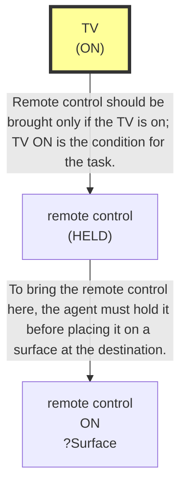
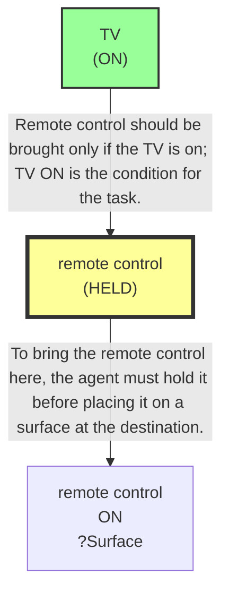
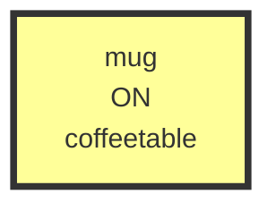

# 🚀 VirtualHome Agent Episode Log


### [GoalReasoner (Module A - Intent)] Output
```json
{
  "is_instruction_obviously_vague": false,
  "clarification_question": null,
  "target_object": "remote control",
  "location_hint": null,
  "reasoning_chain": [
    {
      "question": "Why does the user want this object?",
      "answer": "To control the television if it is currently on."
    },
    {
      "question": "Why is that important?",
      "answer": "Having the control device nearby lets the user change settings or turn the television off without having to go to it."
    },
    {
      "question": "What fundamental need does this fulfill?",
      "answer": "It fulfills the need to manage the television from the user's current location."
    },
    {
      "question": "Are there any deeper psychological or physical motivations?",
      "answer": "The user likely wants convenience and immediate access to control the television."
    }
  ],
  "deep_intent": "The user wants convenient control over the television from their current location.",
  "acceptable_alternatives_properties": [
    {
      "priority": 1,
      "description": "Another compatible television control device, such as a different remote for the same TV or a universal remote already paired to it."
    },
    {
      "priority": 2,
      "description": "A nearby physical control method for the television, such as the TV's built-in buttons or a connected smart-home controller if it can operate the TV."
    },
    {
      "priority": 3,
      "description": "Any device that can issue the needed TV commands from the current location, such as a phone app or tablet app already configured to control the television."
    },
    {
      "priority": 4,
      "description": "If direct TV control is unavailable, a way to manage viewing at the source, such as turning the television off at its power button or outlet switch."
    }
  ]
}
```

### [PerceptionFilter] Output
```json
{
  "reasoning": "The goal is to retrieve and handle the remote control for the TV. Per the SDG, the TV must be on, and the target object is the remote control. To allow alternative compatible control methods and exact matches, I keep the TV and the remote control only; other visible objects are irrelevant to this task.",
  "selected_classes": [
    "tv",
    "character",
    "remotecontrol"
  ],
  "raw_class_count": 40
}
```

### [LLMExecutor] Output
```json
{
  "reasoning": "The SDG requires the TV to be ON before bringing the remote, but the current graph shows tv(426) is OFF. The remote control is in the living room and should be the target object to hold for the task, but the immediate prerequisite state gap is the TV being OFF. Since the TV is already CLOSE to the character, the next atomic step is to switch it on. This progresses toward satisfying N1 before acquiring the remote for N2 and later placing it on a surface for N3.",
  "satisfied_nodes": [],
  "current_node_focus": "N1",
  "mapped_variables": {},
  "action": "[switchon] <tv> (426)"
}
```

### [RoboStateMultiTaskController] Output
```json
{
  "action": "[switchon] <tv> (426)",
  "active_task_id": "task_1",
  "task_context": {
    "active_task_id": "task_1",
    "pending_task_ids": [
      "task_2",
      "task_3",
      "task_4",
      "task_5",
      "task_6",
      "task_7"
    ],
    "satisfied_task_ids": []
  },
  "source": "llm_executor"
}
```
## Step 0
- **Action**: `[switchon] <tv> (426)`
- **Action Success**: `True`
- **Action Message**: Faked switch operation in Python layer (bypassed Unity failure)
- **Active Task**: `task_1`
- **Decision Source**: `llm_executor`
- **Task Progress**: G1_03=pending, E1_11=pending, E1_03=pending, E1_17=pending, E1_07=pending, E1_05=pending, E1_15=pending
- **SDG Status**:

- **Observed Items (7)**: tv(426) [OFF], remotecontrol(452) [OFF], character(1), bathroom(11), bedroom(73), kitchen(205), livingroom(335)


### [PerceptionFilter] Output
```json
{
  "reasoning": "Reused cached class selection.",
  "selected_classes": [
    "tv",
    "character",
    "remotecontrol"
  ],
  "raw_class_count": 40
}
```

### [LLMExecutor] Output
```json
{
  "reasoning": "The TV is already ON, satisfying N1. The remote control exists in the living room but is not yet held, so the next step toward fulfilling N2 is to move to it before grabbing it. Since grabbing requires proximity and we are not currently adjacent to the remote control by explicit graph relation, the correct atomic action is to walk to the remote control.",
  "satisfied_nodes": [
    "N1"
  ],
  "current_node_focus": "N2",
  "mapped_variables": {
    "?Surface": "character(1)"
  },
  "action": "[walk] <remotecontrol> (452)"
}
```

### [RoboStateMultiTaskController] Output
```json
{
  "action": "[walk] <remotecontrol> (452)",
  "active_task_id": "task_1",
  "task_context": {
    "active_task_id": "task_1",
    "pending_task_ids": [
      "task_2",
      "task_3",
      "task_4",
      "task_5",
      "task_6",
      "task_7"
    ],
    "satisfied_task_ids": []
  },
  "source": "llm_executor"
}
```
## Step 1
- **Action**: `[walk] <remotecontrol> (452)`
- **Action Success**: `True`
- **Action Message**: {'0': {'message': 'Success'}}
- **Active Task**: `task_1`
- **Decision Source**: `llm_executor`
- **Task Progress**: G1_03=pending, E1_11=pending, E1_03=pending, E1_17=pending, E1_07=pending, E1_05=pending, E1_15=pending
- **SDG Status**:

- **Observed Items (7)**: tv(426) [ON], remotecontrol(452) [OFF], character(1), bathroom(11), bedroom(73), kitchen(205), livingroom(335)


### [PerceptionFilter] Output
```json
{
  "reasoning": "Reused cached class selection.",
  "selected_classes": [
    "tv",
    "character",
    "remotecontrol"
  ],
  "raw_class_count": 40
}
```

### [LLMExecutor] Output
```json
{
  "reasoning": "The TV is already ON, satisfying N1. The remote control is nearby and currently close to the character, but it is not yet HELD, so the next step to satisfy N2 is to pick it up. No placement relation is required until after it is held.",
  "satisfied_nodes": [
    "N1"
  ],
  "current_node_focus": "N2",
  "mapped_variables": {},
  "action": "[grab] <remotecontrol> (452)"
}
```

### [RoboStateMultiTaskController] Output
```json
{
  "action": "[grab] <remotecontrol> (452)",
  "active_task_id": "task_1",
  "task_context": {
    "active_task_id": "task_1",
    "pending_task_ids": [
      "task_2",
      "task_3",
      "task_4",
      "task_5",
      "task_6",
      "task_7"
    ],
    "satisfied_task_ids": []
  },
  "source": "llm_executor"
}
```
## Step 2
- **Action**: `[grab] <remotecontrol> (452)`
- **Action Success**: `True`
- **Action Message**: {'0': {'message': 'Success'}}
- **Active Task**: `task_1`
- **Decision Source**: `llm_executor`
- **Task Progress**: G1_03=done, E1_11=pending, E1_03=pending, E1_17=pending, E1_07=pending, E1_05=pending, E1_15=pending
- **SDG Status**:

- **Observed Items (7)**: tv(426) [ON], remotecontrol(452) [OFF], character(1), bathroom(11), bedroom(73), kitchen(205), livingroom(335)


### [GoalReasoner (Module A - Intent)] Output
```json
{
  "is_instruction_obviously_vague": false,
  "clarification_question": null,
  "target_object": "mug",
  "location_hint": "coffeetable",
  "reasoning_chain": [
    {
      "question": "Why does the user want this object?",
      "answer": "To keep the mug in a specific location."
    },
    {
      "question": "Why is that important?",
      "answer": "To maintain a desired organization or placement of the mug on the coffeetable."
    },
    {
      "question": "What fundamental need does this fulfill?",
      "answer": "It fulfills the need to keep an item consistently located in a designated place."
    },
    {
      "question": "Are there any deeper psychological or physical motivations?",
      "answer": "The user may want convenience, tidiness, or easy access to the mug in that area."
    }
  ],
  "deep_intent": "The user wants an item to remain consistently placed in a designated location for convenience or organization.",
  "acceptable_alternatives_properties": [
    {
      "priority": 1,
      "description": "Other drinkware or small household items that can be kept in the same designated spot, such as a cup or glass."
    },
    {
      "priority": 2,
      "description": "Other tabletop items that are commonly kept in place for organization, such as a coaster, remote, or small bowl."
    },
    {
      "priority": 3,
      "description": "Any small personal item that can be stored on a table to maintain order, such as keys or a phone."
    },
    {
      "priority": 4,
      "description": "A nearby storage surface or container that supports keeping belongings organized in a consistent location."
    }
  ]
}
```

### [PerceptionFilter] Output
```json
{
  "reasoning": "The goal and SDG require keeping a mug on a coffeetable. So the only strictly necessary classes are the target object mug and the location coffeetable. No extra tools or alternative receptacles are required for this placement task.",
  "selected_classes": [
    "character",
    "mug",
    "coffeetable"
  ],
  "raw_class_count": 40
}
```

### [LLMExecutor] Output
```json
{
  "reasoning": "The active goal is to ensure the mug is on the coffeetable. The current graph already shows the coffeetable is close to the character, but the mug is only inside the livingroom and not yet confirmed on the table. Because I cannot put an object onto a surface unless I first walk to the destination surface and I must be holding the mug to place it, the next progress-making step is to go to the mug first so it can be grabbed before transporting it to the coffeetable.",
  "satisfied_nodes": [],
  "current_node_focus": "N1",
  "mapped_variables": {},
  "action": "[walk] <mug> (447)"
}
```

### [RoboStateMultiTaskController] Output
```json
{
  "action": "[walk] <mug> (447)",
  "active_task_id": "task_5",
  "task_context": {
    "active_task_id": "task_5",
    "pending_task_ids": [
      "task_2",
      "task_3",
      "task_4",
      "task_6",
      "task_7"
    ],
    "satisfied_task_ids": [
      "task_1"
    ]
  },
  "source": "llm_executor"
}
```
## Step 3
- **Action**: `[walk] <mug> (447)`
- **Action Success**: `True`
- **Action Message**: {'0': {'message': 'Success'}}
- **Active Task**: `task_5`
- **Decision Source**: `llm_executor`
- **Task Progress**: G1_03=done, E1_11=pending, E1_03=pending, E1_17=pending, E1_07=pending, E1_05=pending, E1_15=pending
- **SDG Status**:

- **Observed Items (7)**: coffeetable(371), mug(447), character(1), bathroom(11), bedroom(73), kitchen(205), livingroom(335)


### [PerceptionFilter] Output
```json
{
  "reasoning": "Reused cached class selection.",
  "selected_classes": [
    "character",
    "mug",
    "coffeetable"
  ],
  "raw_class_count": 40
}
```

### [LLMExecutor] Output
```json
{
  "reasoning": "The active task is to place the mug on the coffeetable. The mug is already close to the character, but to satisfy the ON relation I must first be near the destination surface before putting it down. The mug is currently available and not dirty, and no other prerequisite is needed. The single next atomic action is to walk to the coffeetable.",
  "satisfied_nodes": [],
  "current_node_focus": "N1",
  "mapped_variables": {
    "?TargetSurface": "coffeetable(371)"
  },
  "action": "[walk] <coffeetable> (371)"
}
```

### [RoboStateMultiTaskController] Output
```json
{
  "action": "[walk] <coffeetable> (371)",
  "active_task_id": "task_5",
  "task_context": {
    "active_task_id": "task_5",
    "pending_task_ids": [
      "task_2",
      "task_3",
      "task_4",
      "task_6",
      "task_7"
    ],
    "satisfied_task_ids": [
      "task_1"
    ]
  },
  "source": "llm_executor"
}
```
## Step 4
- **Action**: `[walk] <coffeetable> (371)`
- **Action Success**: `True`
- **Action Message**: {'0': {'message': 'Success'}}
- **Active Task**: `task_5`
- **Decision Source**: `llm_executor`
- **Task Progress**: G1_03=done, E1_11=pending, E1_03=pending, E1_17=pending, E1_07=pending, E1_05=pending, E1_15=pending
- **SDG Status**:

- **Observed Items (7)**: coffeetable(371), mug(447), character(1), bathroom(11), bedroom(73), kitchen(205), livingroom(335)


### [PerceptionFilter] Output
```json
{
  "reasoning": "Reused cached class selection.",
  "selected_classes": [
    "character",
    "mug",
    "coffeetable"
  ],
  "raw_class_count": 40
}
```

### [LLMExecutor] Output
```json
{
  "reasoning": "The active goal is to have the mug on the coffeetable. The current graph already shows the character is close to coffeetable(371), but the mug(447) is not yet on it and is not held. Since the mug is the target object and we are already at the destination surface, the next required step is to grab the mug before placing it on the coffeetable.",
  "satisfied_nodes": [],
  "current_node_focus": "N1",
  "mapped_variables": {},
  "action": "[grab] <mug> (447)"
}
```

### [RoboStateMultiTaskController] Output
```json
{
  "action": "[walk] <mug> (447)",
  "active_task_id": "task_5",
  "task_context": {
    "active_task_id": "task_5",
    "pending_task_ids": [
      "task_2",
      "task_3",
      "task_4",
      "task_6",
      "task_7"
    ],
    "satisfied_task_ids": [
      "task_1"
    ]
  },
  "source": "llm_executor_repaired"
}
```
## Step 5
- **Action**: `[walk] <mug> (447)`
- **Action Success**: `True`
- **Action Message**: {'0': {'message': 'Success'}}
- **Active Task**: `task_5`
- **Decision Source**: `llm_executor_repaired`
- **Task Progress**: G1_03=done, E1_11=pending, E1_03=pending, E1_17=pending, E1_07=pending, E1_05=pending, E1_15=pending
- **SDG Status**:

- **Observed Items (7)**: coffeetable(371), mug(447), character(1), bathroom(11), bedroom(73), kitchen(205), livingroom(335)


### [PerceptionFilter] Output
```json
{
  "reasoning": "Reused cached class selection.",
  "selected_classes": [
    "character",
    "mug",
    "coffeetable"
  ],
  "raw_class_count": 40
}
```

### [LLMExecutor] Output
```json
{
  "reasoning": "The active SDG requires mug(447) to be ON coffeetable(371). The mug is currently close to the character, so it is reachable. The last action was already a walk to the mug, and the task has no need for clarification. The next atomic step is to pick up the mug so it can later be placed on the coffeetable.",
  "satisfied_nodes": [],
  "current_node_focus": "N1",
  "mapped_variables": {},
  "action": "[grab] <mug> (447)"
}
```

### [RoboStateMultiTaskController] Output
```json
{
  "action": "[grab] <mug> (447)",
  "active_task_id": "task_5",
  "task_context": {
    "active_task_id": "task_5",
    "pending_task_ids": [
      "task_2",
      "task_3",
      "task_4",
      "task_6",
      "task_7"
    ],
    "satisfied_task_ids": [
      "task_1"
    ]
  },
  "source": "llm_executor"
}
```
## Step 6
- **Action**: `[grab] <mug> (447)`
- **Action Success**: `True`
- **Action Message**: {'0': {'message': 'Success'}}
- **Active Task**: `task_5`
- **Decision Source**: `llm_executor`
- **Task Progress**: G1_03=done, E1_11=pending, E1_03=pending, E1_17=pending, E1_07=pending, E1_05=pending, E1_15=pending
- **SDG Status**:

- **Observed Items (7)**: coffeetable(371), mug(447), character(1), bathroom(11), bedroom(73), kitchen(205), livingroom(335)


### [PerceptionFilter] Output
```json
{
  "reasoning": "Reused cached class selection.",
  "selected_classes": [
    "character",
    "mug",
    "coffeetable"
  ],
  "raw_class_count": 40
}
```

### [LLMExecutor] Output
```json
{
  "reasoning": "The active SDG node N1 requires the mug to be ON the coffeetable. The current graph shows the mug is already held by the character and the coffeetable is nearby, but the mug is not yet placed on the surface. Since putback requires being near the destination surface, the next atomic step should be to walk to the coffeetable before placing the mug there.",
  "satisfied_nodes": [],
  "current_node_focus": "N1",
  "mapped_variables": {},
  "action": "[walk] <coffeetable> (371)"
}
```

### [RoboStateMultiTaskController] Output
```json
{
  "action": "[walk] <coffeetable> (371)",
  "active_task_id": "task_5",
  "task_context": {
    "active_task_id": "task_5",
    "pending_task_ids": [
      "task_2",
      "task_3",
      "task_4",
      "task_6",
      "task_7"
    ],
    "satisfied_task_ids": [
      "task_1"
    ]
  },
  "source": "llm_executor"
}
```
## Step 7
- **Action**: `[walk] <coffeetable> (371)`
- **Action Success**: `True`
- **Action Message**: {'0': {'message': 'Success'}}
- **Active Task**: `task_5`
- **Decision Source**: `llm_executor`
- **Task Progress**: G1_03=done, E1_11=pending, E1_03=pending, E1_17=pending, E1_07=pending, E1_05=pending, E1_15=pending
- **SDG Status**:

- **Observed Items (7)**: coffeetable(371), mug(447), character(1), bathroom(11), bedroom(73), kitchen(205), livingroom(335)


### [PerceptionFilter] Output
```json
{
  "reasoning": "Reused cached class selection.",
  "selected_classes": [
    "character",
    "mug",
    "coffeetable"
  ],
  "raw_class_count": 40
}
```

### [LLMExecutor] Output
```json
{
  "reasoning": "The active SDG node N1 requires the mug to be ON the coffeetable. The current graph shows the mug is already held and the character is close to the coffeetable, so the remaining gap is to place the mug onto that surface. Since the destination is a flat surface and we are already at it, the next atomic action is to put the mug back on the coffeetable.",
  "satisfied_nodes": [],
  "current_node_focus": "N1",
  "mapped_variables": {
    "?Surface": "coffeetable(371)"
  },
  "action": "[putback] <mug> (447) <coffeetable> (371)"
}
```

### [RoboStateMultiTaskController] Output
```json
{
  "action": "[putback] <mug> (447) <coffeetable> (371)",
  "active_task_id": "task_5",
  "task_context": {
    "active_task_id": "task_5",
    "pending_task_ids": [
      "task_2",
      "task_3",
      "task_4",
      "task_6",
      "task_7"
    ],
    "satisfied_task_ids": [
      "task_1"
    ]
  },
  "source": "llm_executor"
}
```
## Step 8
- **Action**: `[putback] <mug> (447) <coffeetable> (371)`
- **Action Success**: `True`
- **Action Message**: {'0': {'message': 'Success'}}
- **Active Task**: `task_5`
- **Decision Source**: `llm_executor`
- **Task Progress**: G1_03=done, E1_11=pending, E1_03=pending, E1_17=pending, E1_07=pending, E1_05=pending, E1_15=pending
- **SDG Status**:

- **Observed Items (7)**: coffeetable(371), mug(447), character(1), bathroom(11), bedroom(73), kitchen(205), livingroom(335)


### [PerceptionFilter] Output
```json
{
  "reasoning": "Reused cached class selection.",
  "selected_classes": [
    "character",
    "mug",
    "coffeetable"
  ],
  "raw_class_count": 40
}
```

### [LLMExecutor] Output
```json
{
  "reasoning": "The active SDG node N1 requires the mug to be ON the coffeetable. The current graph already shows mug(447) ON coffeetable(371) and both are close to the character, so the goal state is satisfied. Since no further physical change is needed, the best next action is to do nothing or simply acknowledge completion; however, among available atomic actions, [wait] is the safest no-op.",
  "satisfied_nodes": [
    "N1"
  ],
  "current_node_focus": "N1",
  "mapped_variables": {
    "?Container": "coffeetable(371)"
  },
  "action": "[wait]"
}
```

### [RoboStateMultiTaskController] Output
```json
{
  "action": "[wait]",
  "active_task_id": "task_5",
  "task_context": {
    "active_task_id": "task_5",
    "pending_task_ids": [
      "task_2",
      "task_3",
      "task_4",
      "task_6",
      "task_7"
    ],
    "satisfied_task_ids": [
      "task_1"
    ]
  },
  "source": "llm_executor"
}
```
## Step 9
- **Action**: `[wait]`
- **Action Success**: `True`
- **Action Message**: Time passes. You waited for a while.
- **Active Task**: `task_5`
- **Decision Source**: `llm_executor`
- **Task Progress**: G1_03=done, E1_11=pending, E1_03=pending, E1_17=pending, E1_07=pending, E1_05=pending, E1_15=pending
- **SDG Status**:

- **Observed Items (7)**: coffeetable(371), mug(447), character(1), bathroom(11), bedroom(73), kitchen(205), livingroom(335)


### [PerceptionFilter] Output
```json
{
  "reasoning": "Reused cached class selection.",
  "selected_classes": [
    "character",
    "mug",
    "coffeetable"
  ],
  "raw_class_count": 40
}
```

### [LLMExecutor] Output
```json
{
  "reasoning": "The active SDG node N1 requires the mug to be ON the coffeetable. The current graph already shows mug(447) ON coffeetable(371), and the character is CLOSE to both, so the goal state is already satisfied. No further physical action is needed.",
  "satisfied_nodes": [
    "N1"
  ],
  "current_node_focus": "N1",
  "mapped_variables": {
    "?Mug": "mug(447)",
    "?Table": "coffeetable(371)"
  },
  "action": "[wait]"
}
```

### [RoboStateMultiTaskController] Output
```json
{
  "action": "[wait]",
  "active_task_id": "task_5",
  "task_context": {
    "active_task_id": "task_5",
    "pending_task_ids": [
      "task_2",
      "task_3",
      "task_4",
      "task_6",
      "task_7"
    ],
    "satisfied_task_ids": [
      "task_1"
    ]
  },
  "source": "llm_executor"
}
```
## Step 10
- **Action**: `[wait]`
- **Action Success**: `True`
- **Action Message**: Time passes. You waited for a while.
- **Active Task**: `task_5`
- **Decision Source**: `llm_executor`
- **Task Progress**: G1_03=done, E1_11=pending, E1_03=pending, E1_17=pending, E1_07=pending, E1_05=pending, E1_15=pending
- **SDG Status**:

- **Observed Items (7)**: coffeetable(371), mug(447), character(1), bathroom(11), bedroom(73), kitchen(205), livingroom(335)


### [PerceptionFilter] Output
```json
{
  "reasoning": "Reused cached class selection.",
  "selected_classes": [
    "character",
    "mug",
    "coffeetable"
  ],
  "raw_class_count": 40
}
```

### [LLMExecutor] Output
```json
{
  "reasoning": "The active SDG node N1 requires the mug to be ON the coffeetable. The filtered graph already shows mug(447) ON coffeetable(371), and the character is CLOSE to both, so the node is satisfied. No further physical action is needed for this task, and repeating walk or putback would be unnecessary.",
  "satisfied_nodes": [
    "N1"
  ],
  "current_node_focus": "N1",
  "mapped_variables": {},
  "action": "[wait]"
}
```

### [RoboStateMultiTaskController] Output
```json
{
  "action": "[wait]",
  "active_task_id": "task_5",
  "task_context": {
    "active_task_id": "task_5",
    "pending_task_ids": [
      "task_2",
      "task_3",
      "task_4",
      "task_6",
      "task_7"
    ],
    "satisfied_task_ids": [
      "task_1"
    ]
  },
  "source": "llm_executor"
}
```
## Step 11
- **Action**: `[wait]`
- **Action Success**: `True`
- **Action Message**: Time passes. You waited for a while.
- **Active Task**: `task_5`
- **Decision Source**: `llm_executor`
- **Task Progress**: G1_03=done, E1_11=pending, E1_03=pending, E1_17=pending, E1_07=pending, E1_05=pending, E1_15=pending
- **SDG Status**:

- **Observed Items (7)**: coffeetable(371), mug(447), character(1), bathroom(11), bedroom(73), kitchen(205), livingroom(335)


### [PerceptionFilter] Output
```json
{
  "reasoning": "Reused cached class selection.",
  "selected_classes": [
    "character",
    "mug",
    "coffeetable"
  ],
  "raw_class_count": 40
}
```

### [LLMExecutor] Output
```json
{
  "reasoning": "The active SDG node N1 is already satisfied: the mug(447) is currently ON the coffeetable(371) in the filtered graph. No further physical action is needed for this task. Since the task is complete and the instruction is not ambiguous, the safest next step is to wait rather than disturb the arrangement.",
  "satisfied_nodes": [
    "N1"
  ],
  "current_node_focus": "N1",
  "mapped_variables": {},
  "action": "[wait]"
}
```

### [RoboStateMultiTaskController] Output
```json
{
  "action": "[wait]",
  "active_task_id": "task_5",
  "task_context": {
    "active_task_id": "task_5",
    "pending_task_ids": [
      "task_2",
      "task_3",
      "task_4",
      "task_6",
      "task_7"
    ],
    "satisfied_task_ids": [
      "task_1"
    ]
  },
  "source": "llm_executor"
}
```
## Step 12
- **Action**: `[wait]`
- **Action Success**: `True`
- **Action Message**: Time passes. You waited for a while.
- **Active Task**: `task_5`
- **Decision Source**: `llm_executor`
- **Task Progress**: G1_03=done, E1_11=pending, E1_03=pending, E1_17=pending, E1_07=pending, E1_05=pending, E1_15=pending
- **SDG Status**:

- **Observed Items (7)**: coffeetable(371), mug(447), character(1), bathroom(11), bedroom(73), kitchen(205), livingroom(335)


### [PerceptionFilter] Output
```json
{
  "reasoning": "Reused cached class selection.",
  "selected_classes": [
    "character",
    "mug",
    "coffeetable"
  ],
  "raw_class_count": 40
}
```

### [LLMExecutor] Output
```json
{
  "reasoning": "The active SDG node N1 requires the mug to be ON the coffeetable. The current graph already shows mug(447) ON coffeetable(371), and the character is CLOSE to both objects, so the goal state is satisfied. No further physical action is needed. Since the instruction says not to repeat a walk action if just did it, and there is no new task to progress toward, the safest next atomic action is to wait while preserving the satisfied placement.",
  "satisfied_nodes": [
    "N1"
  ],
  "current_node_focus": "N1",
  "mapped_variables": {
    "?Container": "coffeetable(371)"
  },
  "action": "[wait]"
}
```

### [RoboStateMultiTaskController] Output
```json
{
  "action": "[wait]",
  "active_task_id": "task_5",
  "task_context": {
    "active_task_id": "task_5",
    "pending_task_ids": [
      "task_2",
      "task_3",
      "task_4",
      "task_6",
      "task_7"
    ],
    "satisfied_task_ids": [
      "task_1"
    ]
  },
  "source": "llm_executor"
}
```
