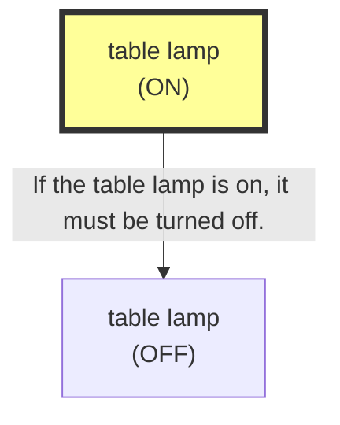
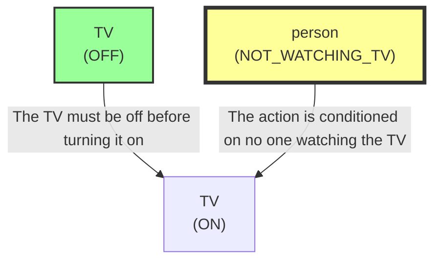
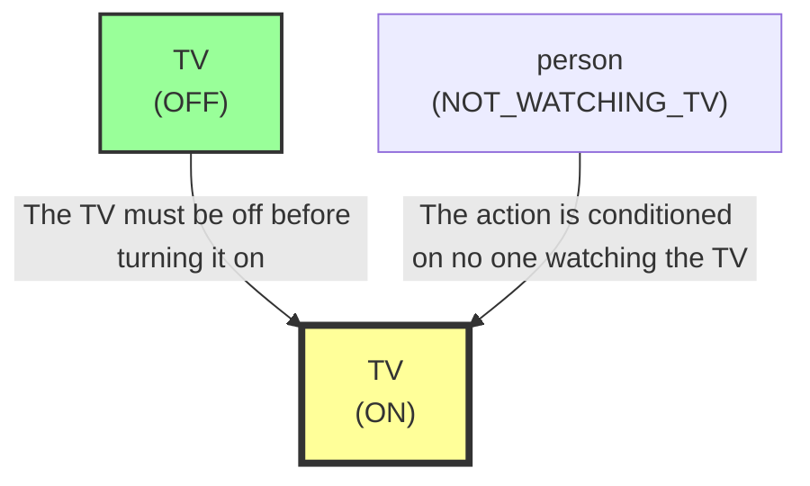

# 🚀 VirtualHome Agent Episode Log


### [GoalReasoner (Module A - Intent)] Output
```json
{
  "is_instruction_obviously_vague": false,
  "clarification_question": null,
  "target_object": "table lamp",
  "location_hint": null,
  "reasoning_chain": [
    {
      "question": "Why does the user want this object?",
      "answer": "The user does not want the object itself; they want its current state to change if it is on."
    },
    {
      "question": "Why is that important?",
      "answer": "Turning it off likely reduces unwanted light, glare, or energy use."
    },
    {
      "question": "What fundamental need does this fulfill?",
      "answer": "It fulfills the need to control illumination in the room."
    },
    {
      "question": "Are there any deeper psychological or physical motivations?",
      "answer": "The user may want a more comfortable visual environment, rest, or to avoid wasting electricity."
    }
  ],
  "deep_intent": "The user wants to reduce unnecessary indoor illumination.",
  "acceptable_alternatives_properties": [
    {
      "priority": 1,
      "description": "Other indoor light sources that can be switched off, such as a floor lamp, desk lamp, or overhead light."
    },
    {
      "priority": 2,
      "description": "Any nearby artificial lighting device with an off switch or dimmer that can reduce brightness."
    },
    {
      "priority": 3,
      "description": "Methods to lower room brightness, such as closing blinds or curtains if lighting is coming from outside."
    },
    {
      "priority": 4,
      "description": "Reducing other sources of glare or light pollution in the room to make the space darker."
    }
  ]
}
```

### [PerceptionFilter] Output
```json
{
  "reasoning": "The goal is to turn off the specified table lamp to reduce indoor illumination. The minimum necessary classes are the target light source itself and a plausible control tool if needed. Since the visible list includes the exact target class and an obvious alternative indoor light source plus a switch control, keep the tablelamp, ceilinglamp, and lightswitch. Curtains and window are not needed unless using external light reduction, which is only an alternative if no indoor light can be controlled.",
  "selected_classes": [
    "lightswitch",
    "desk",
    "curtains",
    "tablelamp",
    "ceilinglamp",
    "character",
    "floor"
  ],
  "raw_class_count": 34
}
```

### [LLMExecutor] Output
```json
{
  "reasoning": "The active goal is to change the table lamp from ON to OFF. There are two candidate table lamps in the bedroom, and both are currently ON. Since the instruction says table lamp without a location hint, either instance could satisfy the intent, but I should choose one exact object and operate on it. The lamp has HAS_SWITCH and HAS_PLUG, but the SDG only requires switching it off; no plug action is needed for turning it off. Because I cannot switch an object from across the room, the next step must be to walk to the chosen lamp before attempting to switch it off. I will target tablelamp(102) as the first available matching instance.",
  "satisfied_nodes": [],
  "current_node_focus": "N1",
  "mapped_variables": {
    "?Lamp": "tablelamp(102)"
  },
  "action": "[walk] <tablelamp> (102)"
}
```

### [RoboStateMultiTaskController] Output
```json
{
  "action": "[walk] <tablelamp> (102)",
  "active_task_id": "task_1",
  "task_context": {
    "active_task_id": "task_1",
    "pending_task_ids": [
      "task_2",
      "task_3"
    ],
    "satisfied_task_ids": []
  },
  "source": "llm_executor"
}
```
## Step 0
- **Action**: `[walk] <tablelamp> (102)`
- **Action Success**: `True`
- **Action Message**: {'0': {'message': 'Success'}}
- **Active Task**: `task_1`
- **Decision Source**: `llm_executor`
- **Task Progress**: G1_04=pending, E1_01=pending, E1_03=pending
- **SDG Status**:

- **Observed Items (22)**: floor(74), floor(75), floor(76), floor(77), floor(78), floor(79), floor(80), floor(81), floor(82), ceilinglamp(101), tablelamp(102) [ON], tablelamp(103) [ON], desk(108) [CLOSED], lightswitch(173) [ON], curtains(183) [CLOSED]...


### [PerceptionFilter] Output
```json
{
  "reasoning": "Reused cached class selection.",
  "selected_classes": [
    "lightswitch",
    "desk",
    "curtains",
    "tablelamp",
    "ceilinglamp",
    "character",
    "floor"
  ],
  "raw_class_count": 34
}
```

### [LLMExecutor] Output
```json
{
  "reasoning": "The active goal is to turn the table lamp OFF. The current graph shows tablelamp(102) is ON and already CLOSE to the character, so no further walking is needed. Since it has HAS_SWITCH and is not plugged-related to the action itself, the correct next step is to switch it off. This directly satisfies the final SDG node N2 after the action succeeds.",
  "satisfied_nodes": [],
  "current_node_focus": "N1",
  "mapped_variables": {
    "?Lamp": "tablelamp(102)"
  },
  "action": "[switchoff] <tablelamp> (102)"
}
```

### [RoboStateMultiTaskController] Output
```json
{
  "action": "[switchoff] <tablelamp> (102)",
  "active_task_id": "task_1",
  "task_context": {
    "active_task_id": "task_1",
    "pending_task_ids": [
      "task_2",
      "task_3"
    ],
    "satisfied_task_ids": []
  },
  "source": "llm_executor"
}
```
## Step 1
- **Action**: `[switchoff] <tablelamp> (102)`
- **Action Success**: `True`
- **Action Message**: Faked switch operation in Python layer (bypassed Unity failure)
- **Active Task**: `task_1`
- **Decision Source**: `llm_executor`
- **Task Progress**: G1_04=done, E1_01=pending, E1_03=pending
- **SDG Status**:

- **Observed Items (22)**: floor(74), floor(75), floor(76), floor(77), floor(78), floor(79), floor(80), floor(81), floor(82), ceilinglamp(101), tablelamp(102) [ON], tablelamp(103) [ON], desk(108) [CLOSED], lightswitch(173) [ON], curtains(183) [CLOSED]...


### [GoalReasoner (Module A - Intent)] Output
```json
{
  "is_instruction_obviously_vague": false,
  "clarification_question": null,
  "target_object": "book",
  "location_hint": "sofa",
  "reasoning_chain": [
    {
      "question": "Why does the user want this object moved?",
      "answer": "To put an unorganized book somewhere more orderly or designated."
    },
    {
      "question": "Why is that important?",
      "answer": "Because the user wants the book to be in a preferred resting or storage location instead of left out of place."
    },
    {
      "question": "What fundamental need does this fulfill?",
      "answer": "The user wants to organize or tidy the environment by relocating the book to the sofa."
    },
    {
      "question": "Are there any deeper psychological or physical motivations?",
      "answer": "This may reflect a desire for a less cluttered space, easier access to the book, or a more orderly room setup."
    }
  ],
  "deep_intent": "The user wants to organize a misplaced item by moving it to a preferred seating area.",
  "acceptable_alternatives_properties": [
    {
      "priority": 1,
      "description": "Other loose reading materials or similarly small household items that can be relocated to the sofa for tidying or staging."
    },
    {
      "priority": 2,
      "description": "Other portable paper-based items such as magazines, notebooks, or documents."
    },
    {
      "priority": 3,
      "description": "Small clutter items from the same area that can be grouped together in a designated spot to improve order."
    },
    {
      "priority": 4,
      "description": "Any nearby portable household item that the user wants consolidated into the same seating area for organization."
    }
  ]
}
```

### [RoboStateMultiTaskController] Output
```json
{
  "action": "[walk] <bathroom> (11)",
  "active_task_id": "task_3",
  "task_context": {
    "active_task_id": "task_3",
    "pending_task_ids": [
      "task_2"
    ],
    "satisfied_task_ids": [
      "task_1"
    ]
  },
  "source": "room_frontier"
}
```
## Step 2
- **Action**: `[walk] <bathroom> (11)`
- **Action Success**: `True`
- **Action Message**: {'0': {'message': 'Success'}}
- **Active Task**: `task_3`
- **Decision Source**: `room_frontier`
- **Task Progress**: G1_04=done, E1_01=pending, E1_03=pending
- **SDG Status**:

- **Observed Items (75)**: floor(74), floor(75), floor(76), floor(77), floor(78), floor(79), floor(80), floor(81), floor(82), wall(83), wall(84), wall(85), wall(86), wall(87), wall(88)...


### [RoboStateMultiTaskController] Output
```json
{
  "action": "[walk] <kitchen> (205)",
  "active_task_id": "task_3",
  "task_context": {
    "active_task_id": "task_3",
    "pending_task_ids": [
      "task_2"
    ],
    "satisfied_task_ids": [
      "task_1"
    ]
  },
  "source": "room_frontier"
}
```
## Step 3
- **Action**: `[walk] <kitchen> (205)`
- **Action Success**: `True`
- **Action Message**: {'0': {'message': 'Success'}}
- **Active Task**: `task_3`
- **Decision Source**: `room_frontier`
- **Task Progress**: G1_04=done, E1_01=pending, E1_03=pending
- **SDG Status**:

- **Observed Items (136)**: floor(74), floor(75), floor(76), floor(77), floor(78), floor(79), floor(80), floor(81), floor(82), wall(83), wall(84), wall(85), wall(86), wall(87), wall(88)...


### [RoboStateMultiTaskController] Output
```json
{
  "action": "[walk] <livingroom> (335)",
  "active_task_id": "task_3",
  "task_context": {
    "active_task_id": "task_3",
    "pending_task_ids": [
      "task_2"
    ],
    "satisfied_task_ids": [
      "task_1"
    ]
  },
  "source": "room_frontier"
}
```
## Step 4
- **Action**: `[walk] <livingroom> (335)`
- **Action Success**: `True`
- **Action Message**: {'0': {'message': 'Success'}}
- **Active Task**: `task_3`
- **Decision Source**: `room_frontier`
- **Task Progress**: G1_04=done, E1_01=pending, E1_03=pending
- **SDG Status**:

- **Observed Items (243)**: floor(74), floor(75), floor(76), floor(77), floor(78), floor(79), floor(80), floor(81), floor(82), wall(83), wall(84), wall(85), wall(86), wall(87), wall(88)...


### [PerceptionFilter] Output
```json
{
  "reasoning": "The goal is to move a book to the sofa, so the only strictly necessary classes are the target object and the destination furniture. No tools or alternate appliances are needed for this simple relocation task.",
  "selected_classes": [
    "book",
    "character",
    "sofa",
    "paper"
  ],
  "raw_class_count": 101
}
```

### [LLMExecutor] Output
```json
{
  "reasoning": "The active goal is to have a book ON the sofa. The character is already close to sofa(368) in the living room, but the candidate book that is currently closest and available is book(268) inside kitchen(205), while book(190) is inside bedroom(73). Since the task does not specify a particular book identity, I should use the accessible book already observed and move it onto the sofa. However, I cannot put it back without holding it first, so the immediate next step is to walk to the book before grabbing it.",
  "satisfied_nodes": [],
  "current_node_focus": "N1",
  "mapped_variables": {},
  "action": "[walk] <book> (268)"
}
```

### [RoboStateMultiTaskController] Output
```json
{
  "action": "[walk] <book> (268)",
  "active_task_id": "task_3",
  "task_context": {
    "active_task_id": "task_3",
    "pending_task_ids": [
      "task_2"
    ],
    "satisfied_task_ids": [
      "task_1"
    ]
  },
  "source": "llm_executor"
}
```
## Step 5
- **Action**: `[walk] <book> (268)`
- **Action Success**: `True`
- **Action Message**: {'0': {'message': 'Success'}}
- **Active Task**: `task_3`
- **Decision Source**: `llm_executor`
- **Task Progress**: G1_04=done, E1_01=pending, E1_03=pending
- **SDG Status**:

- **Observed Items (9)**: book(190) [CLOSED], character(1), bathroom(11), bedroom(73), kitchen(205), livingroom(335), book(268) [CLOSED], sofa(368), paper(451)


### [PerceptionFilter] Output
```json
{
  "reasoning": "Reused cached class selection.",
  "selected_classes": [
    "book",
    "character",
    "sofa",
    "paper"
  ],
  "raw_class_count": 101
}
```

### [LLMExecutor] Output
```json
{
  "reasoning": "The active goal is to place a book on the sofa. In the current graph, book(268) is already close to the character, while sofa(368) is also close and is a valid flat surface for putback. The book is movable and grabbable, so the next required step is to pick it up before moving it onto the sofa. I will focus on satisfying N1 by grabbing the nearby target book(268).",
  "satisfied_nodes": [],
  "current_node_focus": "N1",
  "mapped_variables": {},
  "action": "[grab] <book> (268)"
}
```

### [RoboStateMultiTaskController] Output
```json
{
  "action": "[grab] <book> (268)",
  "active_task_id": "task_3",
  "task_context": {
    "active_task_id": "task_3",
    "pending_task_ids": [
      "task_2"
    ],
    "satisfied_task_ids": [
      "task_1"
    ]
  },
  "source": "llm_executor"
}
```
## Step 6
- **Action**: `[grab] <book> (268)`
- **Action Success**: `True`
- **Action Message**: {'0': {'message': 'Success'}}
- **Active Task**: `task_3`
- **Decision Source**: `llm_executor`
- **Task Progress**: G1_04=done, E1_01=pending, E1_03=pending
- **SDG Status**:

- **Observed Items (9)**: book(190) [CLOSED], character(1), bathroom(11), bedroom(73), kitchen(205), livingroom(335), book(268) [CLOSED], sofa(368), paper(451)


### [PerceptionFilter] Output
```json
{
  "reasoning": "Reused cached class selection.",
  "selected_classes": [
    "book",
    "character",
    "sofa",
    "paper"
  ],
  "raw_class_count": 101
}
```

### [LLMExecutor] Output
```json
{
  "reasoning": "The active goal is to place the book on the sofa. I am already holding book(268) and the sofa(368) is currently close to the character, so the next required step is to move to the sofa before placing the book on it. The alternative book(190) is in the bedroom and not part of the currently held object; I should continue with the held book(268).",
  "satisfied_nodes": [],
  "current_node_focus": "N1",
  "mapped_variables": {},
  "action": "[walk] <sofa> (368)"
}
```

### [RoboStateMultiTaskController] Output
```json
{
  "action": "[walk] <sofa> (368)",
  "active_task_id": "task_3",
  "task_context": {
    "active_task_id": "task_3",
    "pending_task_ids": [
      "task_2"
    ],
    "satisfied_task_ids": [
      "task_1"
    ]
  },
  "source": "llm_executor"
}
```
## Step 7
- **Action**: `[walk] <sofa> (368)`
- **Action Success**: `True`
- **Action Message**: {'0': {'message': 'Success'}}
- **Active Task**: `task_3`
- **Decision Source**: `llm_executor`
- **Task Progress**: G1_04=done, E1_01=pending, E1_03=pending
- **SDG Status**:

- **Observed Items (9)**: book(190) [CLOSED], character(1), bathroom(11), bedroom(73), kitchen(205), livingroom(335), book(268) [CLOSED], sofa(368), paper(451)


### [PerceptionFilter] Output
```json
{
  "reasoning": "Reused cached class selection.",
  "selected_classes": [
    "book",
    "character",
    "sofa",
    "paper"
  ],
  "raw_class_count": 101
}
```

### [LLMExecutor] Output
```json
{
  "reasoning": "The active goal is to place book(268) on sofa(368). The filtered graph shows I am already holding book(268) and I am close to sofa(368), so the next step is to place the held book onto the sofa. This directly satisfies N1.",
  "satisfied_nodes": [],
  "current_node_focus": "N1",
  "mapped_variables": {},
  "action": "[putback] <book> (268) <sofa> (368)"
}
```

### [RoboStateMultiTaskController] Output
```json
{
  "action": "[putback] <book> (268) <sofa> (368)",
  "active_task_id": "task_3",
  "task_context": {
    "active_task_id": "task_3",
    "pending_task_ids": [
      "task_2"
    ],
    "satisfied_task_ids": [
      "task_1"
    ]
  },
  "source": "llm_executor"
}
```
## Step 8
- **Action**: `[putback] <book> (268) <sofa> (368)`
- **Action Success**: `True`
- **Action Message**: {'0': {'message': 'Success'}}
- **Active Task**: `task_3`
- **Decision Source**: `llm_executor`
- **Task Progress**: G1_04=done, E1_01=pending, E1_03=done
- **SDG Status**:

- **Observed Items (9)**: book(190) [CLOSED], character(1), bathroom(11), bedroom(73), kitchen(205), livingroom(335), book(268) [CLOSED], sofa(368), paper(451)


### [GoalReasoner (Module A - Intent)] Output
```json
{
  "is_instruction_obviously_vague": true,
  "clarification_question": "Do you want me to turn on the TV only when nobody is watching it, or do you want me to turn it on if the room is empty? Also, should I treat 'watching' as anyone actively looking at the screen?",
  "target_object": "TV",
  "location_hint": null,
  "reasoning_chain": [
    {
      "question": "Why does the user want this object?",
      "answer": "To have the television powered on under the condition that nobody is watching it."
    },
    {
      "question": "Why is that important?",
      "answer": "To ensure the TV is on when it is not currently being observed or used by a person."
    },
    {
      "question": "What fundamental need does this fulfill?",
      "answer": "It fulfills a need to control the TV's state based on occupancy or attention."
    },
    {
      "question": "Are there any deeper psychological or physical motivations?",
      "answer": "The instruction reflects a conditional preference about device operation, likely to manage viewing behavior or device usage."
    }
  ],
  "deep_intent": "The user wants to control a television's power state based on whether it is being watched.",
  "acceptable_alternatives_properties": [
    {
      "priority": 1,
      "description": "Other household display devices or monitors that can be powered on under the same condition."
    },
    {
      "priority": 2,
      "description": "Any screen-based entertainment device with a similar on/off function."
    },
    {
      "priority": 3,
      "description": "Other indoor electronic devices whose operation can be conditionally controlled."
    },
    {
      "priority": 4,
      "description": "A different media output device, such as a radio, if the goal is simply to have ambient entertainment available when no one is watching."
    }
  ]
}
```

### [PerceptionFilter] Output
```json
{
  "reasoning": "The goal is to control the TV power state based on whether it is being watched. The minimum required objects are the TV itself and the person/character needed to satisfy the NOT_WATCHING_TV condition in the SDG. No other tools or locations are necessary.",
  "selected_classes": [
    "character",
    "tv",
    "door"
  ],
  "raw_class_count": 101
}
```

### [LLMExecutor] Output
```json
{
  "reasoning": "The active task is explicitly marked vague: the instruction depends on what counts as 'watching' the TV and whether the TV should be turned on only when nobody is watching or simply when the room is empty. This is an ambiguity in the user intent, so I should not guess or perform physical actions yet. I will ask for clarification.",
  "satisfied_nodes": [
    "N2"
  ],
  "current_node_focus": "N3",
  "mapped_variables": {},
  "action": "[ask] Do you want me to turn on the TV only when nobody is watching it, or do you want me to turn it on if the room is empty? Also, should I treat 'watching' as anyone actively looking at the screen?"
}
```

### [RoboStateMultiTaskController] Output
```json
{
  "action": "[ask] Do you want me to turn on the TV only when nobody is watching it, or do you want me to turn it on if the room is empty? Also, should I treat 'watching' as anyone actively looking at the screen?",
  "active_task_id": "task_2",
  "task_context": {
    "active_task_id": "task_2",
    "pending_task_ids": [],
    "satisfied_task_ids": [
      "task_1",
      "task_3"
    ]
  },
  "source": "llm_executor"
}
```
## Step 9
- **Action**: `[ask] Do you want me to turn on the TV only when nobody is watching it, or do you want me to turn it on if the room is empty? Also, should I treat 'watching' as anyone actively looking at the screen?`
- **Action Success**: `True`
- **Action Message**: nothing to claim
- **Active Task**: `task_2`
- **Decision Source**: `llm_executor`
- **Task Progress**: G1_04=done, E1_01=pending, E1_03=done
- **SDG Status**:

- **Observed Items (9)**: character(1), bathroom(11), bedroom(73), kitchen(205), livingroom(335), door(51) [OPEN], door(224) [OPEN], tv(264) [OFF], tv(426) [OFF]


### [PerceptionFilter] Output
```json
{
  "reasoning": "Reused cached class selection.",
  "selected_classes": [
    "character",
    "tv",
    "door"
  ],
  "raw_class_count": 101
}
```

### [LLMExecutor] Output
```json
{
  "reasoning": "The clarification has already been handled, so I must proceed autonomously. The active SDG requires TV OFF then TV ON, conditioned on a person NOT_WATCHING_TV. In the current graph, the living room contains the character and a TV(426) is present there. Since the instruction is about the TV being on when nobody is watching it, the safest next step is to position near the living-room TV and inspect/operate it; the TV is already OFF, so the outstanding need is to turn it ON once near it. I choose the living room TV because it is colocated with the person and is the most relevant instance for the 'watching' condition.",
  "satisfied_nodes": [
    "N2"
  ],
  "current_node_focus": "N1",
  "mapped_variables": {},
  "action": "[walk] <tv> (426)"
}
```

### [RoboStateMultiTaskController] Output
```json
{
  "action": "[walk] <tv> (426)",
  "active_task_id": "task_2",
  "task_context": {
    "active_task_id": "task_2",
    "pending_task_ids": [],
    "satisfied_task_ids": [
      "task_1",
      "task_3"
    ]
  },
  "source": "llm_executor"
}
```
## Step 10
- **Action**: `[walk] <tv> (426)`
- **Action Success**: `True`
- **Action Message**: {'0': {'message': 'Success'}}
- **Active Task**: `task_2`
- **Decision Source**: `llm_executor`
- **Task Progress**: G1_04=done, E1_01=pending, E1_03=done
- **SDG Status**:

- **Observed Items (9)**: character(1), bathroom(11), bedroom(73), kitchen(205), livingroom(335), door(51) [OPEN], door(224) [OPEN], tv(264) [OFF], tv(426) [OFF]


### [PerceptionFilter] Output
```json
{
  "reasoning": "Reused cached class selection.",
  "selected_classes": [
    "character",
    "tv",
    "door"
  ],
  "raw_class_count": 101
}
```

### [LLMExecutor] Output
```json
{
  "reasoning": "The TV in the living room is already OFF, satisfying N2. The remaining missing condition is N3: no person watching the TV. The current graph only shows the character close to the TV, but does not show anyone actively watching it, so the safest autonomous progression is to turn the TV on now. Since we are already close to tv(426) and it has a switch, no additional walk is needed.",
  "satisfied_nodes": [
    "N2"
  ],
  "current_node_focus": "N1",
  "mapped_variables": {
    "?TV": "tv(426)"
  },
  "action": "[switchon] <tv> (426)"
}
```

### [RoboStateMultiTaskController] Output
```json
{
  "action": "[switchon] <tv> (426)",
  "active_task_id": "task_2",
  "task_context": {
    "active_task_id": "task_2",
    "pending_task_ids": [],
    "satisfied_task_ids": [
      "task_1",
      "task_3"
    ]
  },
  "source": "llm_executor"
}
```
## Step 11
- **Action**: `[switchon] <tv> (426)`
- **Action Success**: `True`
- **Action Message**: Faked switch operation in Python layer (bypassed Unity failure)
- **Active Task**: `task_2`
- **Decision Source**: `llm_executor`
- **Task Progress**: G1_04=done, E1_01=done, E1_03=done
- **SDG Status**:

- **Observed Items (9)**: character(1), bathroom(11), bedroom(73), kitchen(205), livingroom(335), door(51) [OPEN], door(224) [OPEN], tv(264) [OFF], tv(426) [OFF]

