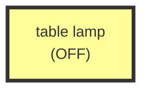
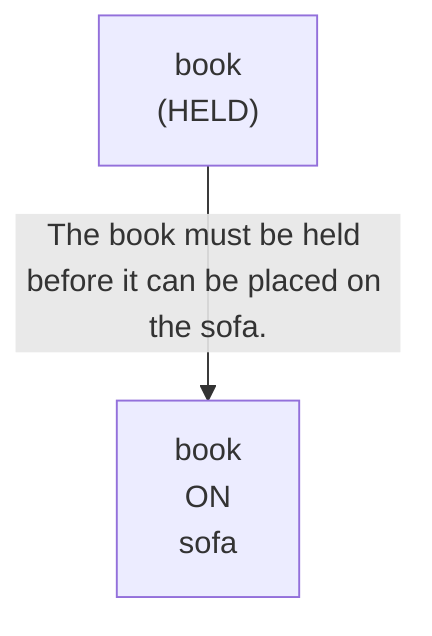
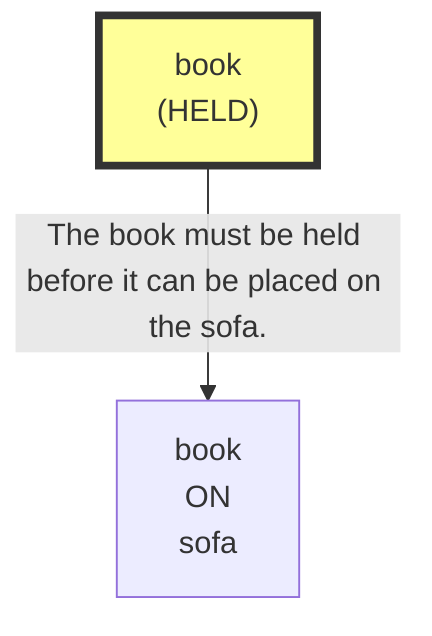
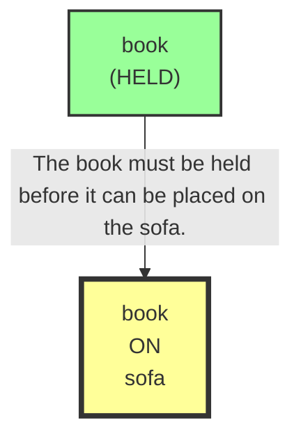
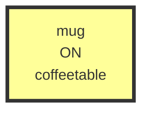
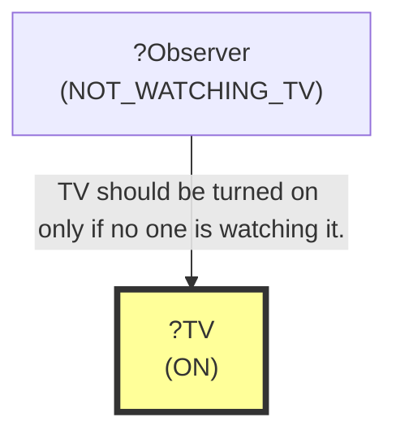
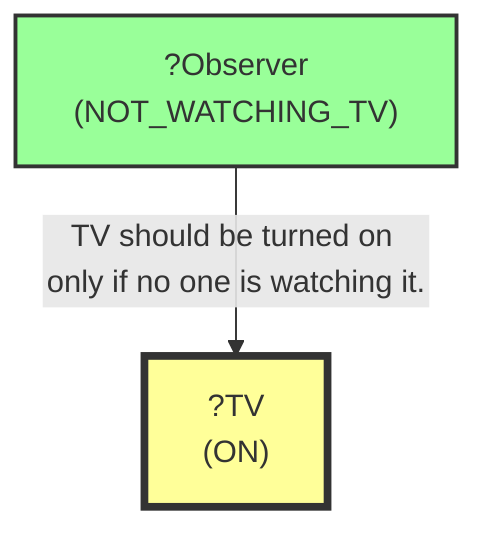
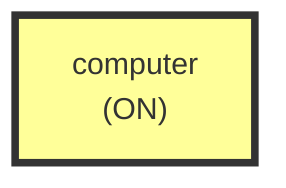

# 🚀 VirtualHome Agent Episode Log


### [GoalReasoner (Module A - Intent)] Output
```json
{
  "is_instruction_obviously_vague": false,
  "clarification_question": null,
  "target_object": "table lamp",
  "location_hint": null,
  "reasoning_chain": [
    {
      "question": "Why does the user want this object?",
      "answer": "To have the lamp's current state changed if it is on."
    },
    {
      "question": "Why is that important?",
      "answer": "To stop the lamp from emitting light."
    },
    {
      "question": "What fundamental need does this fulfill?",
      "answer": "To reduce illumination in the room."
    },
    {
      "question": "Are there any deeper psychological or physical motivations?",
      "answer": "The user likely wants to control the room's lighting for comfort, rest, focus, or energy savings."
    }
  ],
  "deep_intent": "The user wants to reduce illumination in the room.",
  "acceptable_alternatives_properties": [
    {
      "priority": 1,
      "description": "Other nearby indoor light sources that can be turned off, such as a floor lamp or desk lamp"
    },
    {
      "priority": 2,
      "description": "Other room lighting fixtures or devices that provide light, such as a ceiling light or wall sconce"
    },
    {
      "priority": 3,
      "description": "Any indoor lighting source that can be switched off to darken the space"
    },
    {
      "priority": 4,
      "description": "Closing blinds or curtains to reduce ambient light if no lamp is available"
    }
  ]
}
```

### [PerceptionFilter] Output
```json
{
  "reasoning": "The goal is to reduce illumination by turning off the target table lamp, so the target lamp class must be kept. Because acceptable alternatives include other indoor light sources and ambient-light blockers, I also keep other nearby light fixtures that can be switched off and the window coverings that could reduce light if needed. The lightswitch is also relevant as the likely control tool for turning lights off.",
  "selected_classes": [
    "ceiling",
    "wall",
    "lightswitch",
    "desk",
    "window",
    "curtains",
    "tablelamp",
    "ceilinglamp",
    "character",
    "floor"
  ],
  "raw_class_count": 33
}
```

### [LLMExecutor] Output
```json
{
  "reasoning": "The active SDG has a single sink node: the table lamp must be OFF. In the filtered graph, both tablelamp(102) and tablelamp(103) are currently ON. Since there are two candidate lamps and either could satisfy the user’s intent of reducing illumination, the best immediate step is to approach one table lamp to inspect/operate it next. I will focus on tablelamp(102) as a valid nearby indoor light source and move toward it before any switch action, per proximity rules.",
  "satisfied_nodes": [],
  "current_node_focus": "N1",
  "mapped_variables": {},
  "action": "[walk] <tablelamp> (102)"
}
```

### [RoboStateMultiTaskController] Output
```json
{
  "action": "[walk] <tablelamp> (102)",
  "active_task_id": "task_1",
  "task_context": {
    "active_task_id": "task_1",
    "pending_task_ids": [
      "task_2",
      "task_3",
      "task_4",
      "task_5"
    ],
    "satisfied_task_ids": []
  },
  "source": "llm_executor"
}
```
## Step 0
- **Action**: `[walk] <tablelamp> (102)`
- **Action Success**: `True`
- **Action Message**: {'0': {'message': 'Success'}}
- **Active Task**: `task_1`
- **Decision Source**: `llm_executor`
- **Task Progress**: G1_04=pending, E1_01=pending, E1_03=pending, E1_11=pending, E1_07=pending
- **SDG Status**:

- **Observed Items (40)**: floor(74), floor(75), floor(76), floor(77), floor(78), floor(79), floor(80), floor(81), floor(82), wall(83), wall(84), wall(85), wall(86), wall(87), wall(88)...


### [PerceptionFilter] Output
```json
{
  "reasoning": "Reused cached class selection.",
  "selected_classes": [
    "ceiling",
    "wall",
    "lightswitch",
    "desk",
    "window",
    "curtains",
    "tablelamp",
    "ceilinglamp",
    "character",
    "floor"
  ],
  "raw_class_count": 33
}
```

### [LLMExecutor] Output
```json
{
  "reasoning": "The active goal is to turn the table lamp OFF. The current graph shows tablelamp(102) is ON and already CLOSE to the character, so no additional walking is needed. Since it has a switch, the correct next atomic action is to switch it off. The other table lamp(103) is also ON, but the SDG specifically targets the table lamp currently identified as tablelamp(102) from the prior walk and close proximity.",
  "satisfied_nodes": [],
  "current_node_focus": "N1",
  "mapped_variables": {
    "?Lamp": "tablelamp(102)"
  },
  "action": "[switchoff] <tablelamp> (102)"
}
```

### [RoboStateMultiTaskController] Output
```json
{
  "action": "[switchoff] <tablelamp> (102)",
  "active_task_id": "task_1",
  "task_context": {
    "active_task_id": "task_1",
    "pending_task_ids": [
      "task_2",
      "task_3",
      "task_4",
      "task_5"
    ],
    "satisfied_task_ids": []
  },
  "source": "llm_executor"
}
```
## Step 1
- **Action**: `[switchoff] <tablelamp> (102)`
- **Action Success**: `True`
- **Action Message**: Faked switch operation in Python layer (bypassed Unity failure)
- **Active Task**: `task_1`
- **Decision Source**: `llm_executor`
- **Task Progress**: G1_04=done, E1_01=pending, E1_03=pending, E1_11=pending, E1_07=pending
- **SDG Status**:

- **Observed Items (40)**: floor(74), floor(75), floor(76), floor(77), floor(78), floor(79), floor(80), floor(81), floor(82), wall(83), wall(84), wall(85), wall(86), wall(87), wall(88)...


### [GoalReasoner (Module A - Intent)] Output
```json
{
  "is_instruction_obviously_vague": false,
  "clarification_question": null,
  "target_object": "book",
  "location_hint": "sofa",
  "reasoning_chain": [
    {
      "question": "Why does the user want this object moved?",
      "answer": "To place the book in the sofa area when it is found unorganized."
    },
    {
      "question": "Why is that important?",
      "answer": "So the book is no longer left out of place and is positioned where the user wants it."
    },
    {
      "question": "What fundamental need does this fulfill?",
      "answer": "It fulfills the need to organize and tidy the living space by relocating misplaced items to a preferred resting area."
    },
    {
      "question": "Are there any deeper psychological or physical motivations?",
      "answer": "The user likely wants reduced clutter and improved order in the room, which can make the space feel more orderly and easier to use."
    }
  ],
  "deep_intent": "The user wants to organize a misplaced item by moving it to a preferred location.",
  "acceptable_alternatives_properties": [
    {
      "priority": 1,
      "description": "Other small household items that are out of place, such as magazines, notebooks, or remote controls, moved to the sofa or nearby seating area"
    },
    {
      "priority": 2,
      "description": "Other paper-based or reading items that are lying around unorganized, such as a pamphlet or journal, placed with the book area"
    },
    {
      "priority": 3,
      "description": "General clutter items in the living space that can be tidied into a seating-area collection spot"
    },
    {
      "priority": 4,
      "description": "Any lightweight misplaced household object that helps reduce clutter when relocated to a more appropriate indoor spot"
    }
  ]
}
```

### [RoboStateMultiTaskController] Output
```json
{
  "action": "[walk] <bathroom> (11)",
  "active_task_id": "task_3",
  "task_context": {
    "active_task_id": "task_3",
    "pending_task_ids": [
      "task_2",
      "task_4",
      "task_5"
    ],
    "satisfied_task_ids": [
      "task_1"
    ]
  },
  "source": "room_frontier"
}
```
## Step 2
- **Action**: `[walk] <bathroom> (11)`
- **Action Success**: `True`
- **Action Message**: {'0': {'message': 'Success'}}
- **Active Task**: `task_3`
- **Decision Source**: `room_frontier`
- **Task Progress**: G1_04=done, E1_01=pending, E1_03=pending, E1_11=pending, E1_07=pending
- **SDG Status**:

- **Observed Items (74)**: floor(74), floor(75), floor(76), floor(77), floor(78), floor(79), floor(80), floor(81), floor(82), wall(83), wall(84), wall(85), wall(86), wall(87), wall(88)...


### [RoboStateMultiTaskController] Output
```json
{
  "action": "[walk] <kitchen> (205)",
  "active_task_id": "task_3",
  "task_context": {
    "active_task_id": "task_3",
    "pending_task_ids": [
      "task_2",
      "task_4",
      "task_5"
    ],
    "satisfied_task_ids": [
      "task_1"
    ]
  },
  "source": "room_frontier"
}
```
## Step 3
- **Action**: `[walk] <kitchen> (205)`
- **Action Success**: `True`
- **Action Message**: {'0': {'message': 'Success'}}
- **Active Task**: `task_3`
- **Decision Source**: `room_frontier`
- **Task Progress**: G1_04=done, E1_01=pending, E1_03=pending, E1_11=pending, E1_07=pending
- **SDG Status**:

- **Observed Items (135)**: floor(74), floor(75), floor(76), floor(77), floor(78), floor(79), floor(80), floor(81), floor(82), wall(83), wall(84), wall(85), wall(86), wall(87), wall(88)...


### [RoboStateMultiTaskController] Output
```json
{
  "action": "[walk] <livingroom> (335)",
  "active_task_id": "task_3",
  "task_context": {
    "active_task_id": "task_3",
    "pending_task_ids": [
      "task_2",
      "task_4",
      "task_5"
    ],
    "satisfied_task_ids": [
      "task_1"
    ]
  },
  "source": "room_frontier"
}
```
## Step 4
- **Action**: `[walk] <livingroom> (335)`
- **Action Success**: `True`
- **Action Message**: {'0': {'message': 'Success'}}
- **Active Task**: `task_3`
- **Decision Source**: `room_frontier`
- **Task Progress**: G1_04=done, E1_01=pending, E1_03=pending, E1_11=pending, E1_07=pending
- **SDG Status**:

- **Observed Items (243)**: floor(74), floor(75), floor(76), floor(77), floor(78), floor(79), floor(80), floor(81), floor(82), wall(83), wall(84), wall(85), wall(86), wall(87), wall(88)...


### [PerceptionFilter] Output
```json
{
  "reasoning": "The goal is to move the book and place it on the sofa. Only the target object and the destination location are necessary, plus the book must be held before placement per the SDG. No extra tools or alternatives are required for this simple relocation task.",
  "selected_classes": [
    "sofa",
    "book",
    "paper",
    "character",
    "door"
  ],
  "raw_class_count": 101
}
```

### [LLMExecutor] Output
```json
{
  "reasoning": "The active goal is to have the book on the sofa, and the SDG requires the book to be held first. In the current graph, book(190) is a valid grabbable book object and is located inside bedroom(73), while the character is currently in the livingroom(335). Since grabbing requires being near the object and we are not already near book(190), the next step must be to walk to that book. The sofa(368) is also present in the livingroom for the eventual placement step, but that comes later.",
  "satisfied_nodes": [],
  "current_node_focus": "N2",
  "mapped_variables": {},
  "action": "[walk] <book> (190)"
}
```

### [RoboStateMultiTaskController] Output
```json
{
  "action": "[walk] <book> (190)",
  "active_task_id": "task_3",
  "task_context": {
    "active_task_id": "task_3",
    "pending_task_ids": [
      "task_2",
      "task_4",
      "task_5"
    ],
    "satisfied_task_ids": [
      "task_1"
    ]
  },
  "source": "llm_executor"
}
```
## Step 5
- **Action**: `[walk] <book> (190)`
- **Action Success**: `True`
- **Action Message**: {'0': {'message': 'Success'}}
- **Active Task**: `task_3`
- **Decision Source**: `llm_executor`
- **Task Progress**: G1_04=done, E1_01=pending, E1_03=pending, E1_11=pending, E1_07=pending
- **SDG Status**:

- **Observed Items (11)**: book(190) [CLOSED], character(1), bathroom(11), bedroom(73), kitchen(205), livingroom(335), door(51) [OPEN], door(224) [OPEN], book(268) [CLOSED], sofa(368), paper(451)


### [PerceptionFilter] Output
```json
{
  "reasoning": "Reused cached class selection.",
  "selected_classes": [
    "sofa",
    "book",
    "paper",
    "character",
    "door"
  ],
  "raw_class_count": 101
}
```

### [LLMExecutor] Output
```json
{
  "reasoning": "The active task is to place a book on the sofa. The SDG requires the book to be held before it can be put on the sofa. The current graph shows book(190) is close to the character and inside the bedroom, so the next needed step is to grab it. I will use the book already at hand in the current room and then later move toward the sofa for placement.",
  "satisfied_nodes": [],
  "current_node_focus": "N2",
  "mapped_variables": {},
  "action": "[grab] <book> (190)"
}
```

### [RoboStateMultiTaskController] Output
```json
{
  "action": "[grab] <book> (190)",
  "active_task_id": "task_3",
  "task_context": {
    "active_task_id": "task_3",
    "pending_task_ids": [
      "task_2",
      "task_4",
      "task_5"
    ],
    "satisfied_task_ids": [
      "task_1"
    ]
  },
  "source": "llm_executor"
}
```
## Step 6
- **Action**: `[grab] <book> (190)`
- **Action Success**: `True`
- **Action Message**: {'0': {'message': 'Success'}}
- **Active Task**: `task_3`
- **Decision Source**: `llm_executor`
- **Task Progress**: G1_04=done, E1_01=pending, E1_03=pending, E1_11=pending, E1_07=pending
- **SDG Status**:

- **Observed Items (11)**: book(190) [CLOSED], character(1), bathroom(11), bedroom(73), kitchen(205), livingroom(335), door(51) [OPEN], door(224) [OPEN], book(268) [CLOSED], sofa(368), paper(451)


### [PerceptionFilter] Output
```json
{
  "reasoning": "Reused cached class selection.",
  "selected_classes": [
    "sofa",
    "book",
    "paper",
    "character",
    "door"
  ],
  "raw_class_count": 101
}
```

### [LLMExecutor] Output
```json
{
  "reasoning": "The active task is to place the book on the sofa. We already satisfied the prerequisite holding state: character(1) is holding book(190), so SDG node N2 is satisfied. The next required step toward N1 is to get near the sofa before putting the book down; the sofa is the correct target surface and is available in the living room. Since the last successful movement was not to the sofa, the correct next atomic action is to walk to it.",
  "satisfied_nodes": [
    "N2"
  ],
  "current_node_focus": "N1",
  "mapped_variables": {},
  "action": "[walk] <sofa> (368)"
}
```

### [RoboStateMultiTaskController] Output
```json
{
  "action": "[walk] <sofa> (368)",
  "active_task_id": "task_3",
  "task_context": {
    "active_task_id": "task_3",
    "pending_task_ids": [
      "task_2",
      "task_4",
      "task_5"
    ],
    "satisfied_task_ids": [
      "task_1"
    ]
  },
  "source": "llm_executor"
}
```
## Step 7
- **Action**: `[walk] <sofa> (368)`
- **Action Success**: `True`
- **Action Message**: {'0': {'message': 'Success'}}
- **Active Task**: `task_3`
- **Decision Source**: `llm_executor`
- **Task Progress**: G1_04=done, E1_01=pending, E1_03=pending, E1_11=pending, E1_07=pending
- **SDG Status**:

- **Observed Items (11)**: book(190) [CLOSED], character(1), bathroom(11), bedroom(73), kitchen(205), livingroom(335), door(51) [OPEN], door(224) [OPEN], book(268) [CLOSED], sofa(368), paper(451)


### [PerceptionFilter] Output
```json
{
  "reasoning": "Reused cached class selection.",
  "selected_classes": [
    "sofa",
    "book",
    "paper",
    "character",
    "door"
  ],
  "raw_class_count": 101
}
```

### [LLMExecutor] Output
```json
{
  "reasoning": "The active goal is to place the held book onto the sofa. The current graph shows the robot is already close to the sofa and is holding book(190) in the right hand, so the prerequisite state N2 (book HELD) is satisfied. The next atomic step to satisfy N1 is to place the book on the sofa surface.",
  "satisfied_nodes": [
    "N2"
  ],
  "current_node_focus": "N1",
  "mapped_variables": {},
  "action": "[putback] <book> (190) <sofa> (368)"
}
```

### [RoboStateMultiTaskController] Output
```json
{
  "action": "[putback] <book> (190) <sofa> (368)",
  "active_task_id": "task_3",
  "task_context": {
    "active_task_id": "task_3",
    "pending_task_ids": [
      "task_2",
      "task_4",
      "task_5"
    ],
    "satisfied_task_ids": [
      "task_1"
    ]
  },
  "source": "llm_executor"
}
```
## Step 8
- **Action**: `[putback] <book> (190) <sofa> (368)`
- **Action Success**: `True`
- **Action Message**: {'0': {'message': 'Success'}}
- **Active Task**: `task_3`
- **Decision Source**: `llm_executor`
- **Task Progress**: G1_04=done, E1_01=pending, E1_03=done, E1_11=pending, E1_07=pending
- **SDG Status**:

- **Observed Items (11)**: book(190) [CLOSED], character(1), bathroom(11), bedroom(73), kitchen(205), livingroom(335), door(51) [OPEN], door(224) [OPEN], book(268) [CLOSED], sofa(368), paper(451)


### [GoalReasoner (Module A - Intent)] Output
```json
{
  "is_instruction_obviously_vague": false,
  "clarification_question": null,
  "target_object": "mug",
  "location_hint": "coffeetable",
  "reasoning_chain": [
    {
      "question": "Why does the user want this object?",
      "answer": "The user wants the mug to remain in a specific place."
    },
    {
      "question": "Why is that important?",
      "answer": "To keep the mug consistently located on the coffeetable rather than elsewhere."
    },
    {
      "question": "What fundamental need does this fulfill?",
      "answer": "It fulfills the need to maintain the mug in a desired resting position within the home."
    },
    {
      "question": "Are there any deeper psychological or physical motivations?",
      "answer": "The user may want convenience, organization, or easy access to the mug."
    }
  ],
  "deep_intent": "The user wants to keep an object in a designated place for organization and easy access.",
  "acceptable_alternatives_properties": [
    {
      "priority": 1,
      "description": "Other drinkware or small tabletop items that can be kept on the same surface for similar organization and access."
    },
    {
      "priority": 2,
      "description": "Similar household items that are typically stored on a coffee table, such as cups, glasses, or coasters."
    },
    {
      "priority": 3,
      "description": "Small everyday objects used for tidiness or convenience in a living area."
    },
    {
      "priority": 4,
      "description": "Any manageable household item that can be placed and left on a table to satisfy the organization goal."
    }
  ]
}
```

### [PerceptionFilter] Output
```json
{
  "reasoning": "The goal is to keep the mug on the coffeetable, so the only necessary classes are the target object and the supporting location surface. No tools or alternative appliances are needed for this placement task.",
  "selected_classes": [
    "mug",
    "character",
    "coffeetable"
  ],
  "raw_class_count": 101
}
```

### [LLMExecutor] Output
```json
{
  "reasoning": "The active goal is to have a mug on the coffeetable. The clearest matching mug in the current graph is mug(447), which is already in the livingroom, while coffeetable(371) is also in the livingroom and close to the character. Since the target surface is a flat surface, the correct next step is to move near the coffeetable before placing the mug on it. I am not repeating a walk to the same object; the character is currently close to coffeetable(371), so the next atomic action should position for placement if needed. However, because the rules require an explicit walk to the destination before putback, the immediate action remains to walk to the coffeetable that will receive the mug.",
  "satisfied_nodes": [],
  "current_node_focus": "N1",
  "mapped_variables": {
    "?TargetSurface": "coffeetable(371)",
    "?Mug": "mug(447)"
  },
  "action": "[walk] <coffeetable> (371)"
}
```

### [RoboStateMultiTaskController] Output
```json
{
  "action": "[walk] <coffeetable> (371)",
  "active_task_id": "task_5",
  "task_context": {
    "active_task_id": "task_5",
    "pending_task_ids": [
      "task_2",
      "task_4"
    ],
    "satisfied_task_ids": [
      "task_1",
      "task_3"
    ]
  },
  "source": "llm_executor"
}
```
## Step 9
- **Action**: `[walk] <coffeetable> (371)`
- **Action Success**: `True`
- **Action Message**: {'0': {'message': 'Success'}}
- **Active Task**: `task_5`
- **Decision Source**: `llm_executor`
- **Task Progress**: G1_04=done, E1_01=pending, E1_03=done, E1_11=pending, E1_07=pending
- **SDG Status**:

- **Observed Items (9)**: coffeetable(111), character(1), bathroom(11), bedroom(73), kitchen(205), livingroom(335), mug(194), coffeetable(371), mug(447)


### [PerceptionFilter] Output
```json
{
  "reasoning": "Reused cached class selection.",
  "selected_classes": [
    "mug",
    "character",
    "coffeetable"
  ],
  "raw_class_count": 101
}
```

### [LLMExecutor] Output
```json
{
  "reasoning": "The active goal is to have a mug on the coffeetable. We are already close to coffeetable(371), so no further walk is needed. Among the mug candidates, mug(447) is in the livingroom and is the most accessible/likely nearby option; mug(194) is in the kitchen and would require travel. Since the goal only requires a mug on the coffeetable, the next step is to grab the nearby mug so it can be placed onto the table in the following action.",
  "satisfied_nodes": [],
  "current_node_focus": "N1",
  "mapped_variables": {
    "?TargetMug": "mug(447)",
    "?Table": "coffeetable(371)"
  },
  "action": "[grab] <mug> (447)"
}
```

### [RoboStateMultiTaskController] Output
```json
{
  "action": "[walk] <mug> (447)",
  "active_task_id": "task_5",
  "task_context": {
    "active_task_id": "task_5",
    "pending_task_ids": [
      "task_2",
      "task_4"
    ],
    "satisfied_task_ids": [
      "task_1",
      "task_3"
    ]
  },
  "source": "llm_executor_repaired"
}
```
## Step 10
- **Action**: `[walk] <mug> (447)`
- **Action Success**: `True`
- **Action Message**: {'0': {'message': 'Success'}}
- **Active Task**: `task_5`
- **Decision Source**: `llm_executor_repaired`
- **Task Progress**: G1_04=done, E1_01=pending, E1_03=done, E1_11=pending, E1_07=pending
- **SDG Status**:

- **Observed Items (9)**: coffeetable(111), character(1), bathroom(11), bedroom(73), kitchen(205), livingroom(335), mug(194), coffeetable(371), mug(447)


### [PerceptionFilter] Output
```json
{
  "reasoning": "Reused cached class selection.",
  "selected_classes": [
    "mug",
    "character",
    "coffeetable"
  ],
  "raw_class_count": 101
}
```

### [LLMExecutor] Output
```json
{
  "reasoning": "The active goal is to place a mug on the coffeetable. In the current graph, mug(447) is the only mug close to the character, and coffeetable(371) is the matching target surface in the living room. I have already walked to the mug in the previous step, so the next required action is to grab it before moving it onto the coffeetable. The coffeetable(371) is currently the best binding for the goal's location hint. ",
  "satisfied_nodes": [],
  "current_node_focus": "N1",
  "mapped_variables": {
    "?Mug": "mug(447)",
    "?Surface": "coffeetable(371)"
  },
  "action": "[grab] <mug> (447)"
}
```

### [RoboStateMultiTaskController] Output
```json
{
  "action": "[grab] <mug> (447)",
  "active_task_id": "task_5",
  "task_context": {
    "active_task_id": "task_5",
    "pending_task_ids": [
      "task_2",
      "task_4"
    ],
    "satisfied_task_ids": [
      "task_1",
      "task_3"
    ]
  },
  "source": "llm_executor"
}
```
## Step 11
- **Action**: `[grab] <mug> (447)`
- **Action Success**: `True`
- **Action Message**: {'0': {'message': 'Success'}}
- **Active Task**: `task_5`
- **Decision Source**: `llm_executor`
- **Task Progress**: G1_04=done, E1_01=pending, E1_03=done, E1_11=pending, E1_07=pending
- **SDG Status**:

- **Observed Items (9)**: coffeetable(111), character(1), bathroom(11), bedroom(73), kitchen(205), livingroom(335), mug(194), coffeetable(371), mug(447)


### [PerceptionFilter] Output
```json
{
  "reasoning": "Reused cached class selection.",
  "selected_classes": [
    "mug",
    "character",
    "coffeetable"
  ],
  "raw_class_count": 101
}
```

### [LLMExecutor] Output
```json
{
  "reasoning": "The active goal is to have a mug ON the coffeetable. I am already holding mug(447) and am close to coffeetable(111) according to the current graph, so the next required step is to place the mug on that surface. The alternative mug(194) is farther away in the kitchen and unnecessary because the held mug already satisfies the object type and is the correct active-task object to move.",
  "satisfied_nodes": [],
  "current_node_focus": "N1",
  "mapped_variables": {
    "?TargetSurface": "coffeetable(111)"
  },
  "action": "[putback] <mug> (447) <coffeetable> (111)"
}
```

### [RoboStateMultiTaskController] Output
```json
{
  "action": "[putback] <mug> (447) <coffeetable> (111)",
  "active_task_id": "task_5",
  "task_context": {
    "active_task_id": "task_5",
    "pending_task_ids": [
      "task_2",
      "task_4"
    ],
    "satisfied_task_ids": [
      "task_1",
      "task_3"
    ]
  },
  "source": "llm_executor"
}
```
## Step 12
- **Action**: `[putback] <mug> (447) <coffeetable> (111)`
- **Action Success**: `True`
- **Action Message**: {'0': {'message': 'Success'}}
- **Active Task**: `task_5`
- **Decision Source**: `llm_executor`
- **Task Progress**: G1_04=done, E1_01=pending, E1_03=done, E1_11=pending, E1_07=done
- **SDG Status**:

- **Observed Items (9)**: coffeetable(111), character(1), bathroom(11), bedroom(73), kitchen(205), livingroom(335), mug(194), coffeetable(371), mug(447)


### [GoalReasoner (Module A - Intent)] Output
```json
{
  "is_instruction_obviously_vague": true,
  "clarification_question": "What should I do with the TV when nobody is watching it: turn it on or turn it off?",
  "target_object": "TV",
  "location_hint": null,
  "reasoning_chain": [
    {
      "question": "Why does the user want this object?",
      "answer": "To change the TV's power state based on whether it is being watched."
    },
    {
      "question": "Why is that important?",
      "answer": "To keep the TV in the desired state when it is unattended."
    },
    {
      "question": "What fundamental need does this fulfill?",
      "answer": "To manage an appliance's operating state according to occupancy or attention."
    },
    {
      "question": "Are there any deeper psychological or physical motivations?",
      "answer": "It may be about conserving energy, automating routine device control, or maintaining a preferred environment."
    }
  ],
  "deep_intent": "The user wants to control a device's power state based on whether it is being watched.",
  "acceptable_alternatives_properties": [
    {
      "priority": 1,
      "description": "Other controllable household devices or screens that can be turned on or off, such as a monitor or projector"
    },
    {
      "priority": 2,
      "description": "Other appliances with a clear power state, such as a lamp or radio"
    },
    {
      "priority": 3,
      "description": "Any household device that can be automatically enabled or disabled based on presence or use"
    },
    {
      "priority": 4,
      "description": "A different device that serves the same purpose of providing audiovisual information or ambient activity"
    }
  ]
}
```

### [PerceptionFilter] Output
```json
{
  "reasoning": "The goal is to control the power state of the TV based on whether it is being watched. The only strictly necessary target object is the TV itself; no other tools, locations, or alternative devices are required by the SDG or goal for this selection task.",
  "selected_classes": [
    "character",
    "tv"
  ],
  "raw_class_count": 101
}
```

### [LLMExecutor] Output
```json
{
  "reasoning": "The active instruction is explicitly vague and the clarification rule is available. The SDG requires turning the TV ON only when nobody is watching it, but the user intent itself asks what to do when nobody is watching: turn it on or off. This is an ambiguity about the desired end state, not a physical execution step. I should ask for clarification before manipulating either TV.",
  "satisfied_nodes": [],
  "current_node_focus": "N1",
  "mapped_variables": {
    "?TV": "tv(426)"
  },
  "action": "[ask] What should I do with the TV when nobody is watching it: turn it on or turn it off?"
}
```

### [RoboStateMultiTaskController] Output
```json
{
  "action": "[ask] What should I do with the TV when nobody is watching it: turn it on or turn it off?",
  "active_task_id": "task_2",
  "task_context": {
    "active_task_id": "task_2",
    "pending_task_ids": [
      "task_4"
    ],
    "satisfied_task_ids": [
      "task_1",
      "task_3",
      "task_5"
    ]
  },
  "source": "llm_executor"
}
```
## Step 13
- **Action**: `[ask] What should I do with the TV when nobody is watching it: turn it on or turn it off?`
- **Action Success**: `True`
- **Action Message**: nothing to claim
- **Active Task**: `task_2`
- **Decision Source**: `llm_executor`
- **Task Progress**: G1_04=done, E1_01=pending, E1_03=done, E1_11=pending, E1_07=done
- **SDG Status**:

- **Observed Items (7)**: character(1), bathroom(11), bedroom(73), kitchen(205), livingroom(335), tv(264) [OFF], tv(426) [OFF]


### [PerceptionFilter] Output
```json
{
  "reasoning": "Reused cached class selection.",
  "selected_classes": [
    "character",
    "tv"
  ],
  "raw_class_count": 101
}
```

### [LLMExecutor] Output
```json
{
  "reasoning": "The instruction was clarified earlier in the episode, so I cannot ask again. The SDG requires the TV to be ON and the observer to be NOT_WATCHING_TV first. Among the available TVs, the living room TV (tv 426) is the most plausible controllable target in the current area. It is currently OFF, so the next step toward satisfying N1 is to move to it before switching it on.",
  "satisfied_nodes": [],
  "current_node_focus": "N1",
  "mapped_variables": {
    "?TV": "tv(426)",
    "?Observer": "character(1)"
  },
  "action": "[walk] <tv> (426)"
}
```

### [RoboStateMultiTaskController] Output
```json
{
  "action": "[walk] <tv> (426)",
  "active_task_id": "task_2",
  "task_context": {
    "active_task_id": "task_2",
    "pending_task_ids": [
      "task_4"
    ],
    "satisfied_task_ids": [
      "task_1",
      "task_3",
      "task_5"
    ]
  },
  "source": "llm_executor"
}
```
## Step 14
- **Action**: `[walk] <tv> (426)`
- **Action Success**: `True`
- **Action Message**: {'0': {'message': 'Success'}}
- **Active Task**: `task_2`
- **Decision Source**: `llm_executor`
- **Task Progress**: G1_04=done, E1_01=pending, E1_03=done, E1_11=pending, E1_07=done
- **SDG Status**:

- **Observed Items (7)**: character(1), bathroom(11), bedroom(73), kitchen(205), livingroom(335), tv(264) [OFF], tv(426) [OFF]


### [PerceptionFilter] Output
```json
{
  "reasoning": "Reused cached class selection.",
  "selected_classes": [
    "character",
    "tv"
  ],
  "raw_class_count": 101
}
```

### [LLMExecutor] Output
```json
{
  "reasoning": "The task is about controlling the TV's power state when nobody is watching it. The clarification was already resolved earlier, and the episode override forbids asking again. The SDG requires the observer to be NOT_WATCHING_TV before the TV becomes ON. The current graph shows the character is facing and close to tv(426), which is the best binding for ?TV because it is near the agent and has HAS_SWITCH / HAS_PLUG. Since the TV is currently OFF and there is no evidence anyone is watching it, the next step is to turn it on. No additional setup is needed because tv(426) is already reachable and appears to be the active target.",
  "satisfied_nodes": [
    "N2"
  ],
  "current_node_focus": "N1",
  "mapped_variables": {
    "?TV": "tv(426)",
    "?Observer": "character(1)"
  },
  "action": "[switchon] <tv> (426)"
}
```

### [RoboStateMultiTaskController] Output
```json
{
  "action": "[switchon] <tv> (426)",
  "active_task_id": "task_2",
  "task_context": {
    "active_task_id": "task_2",
    "pending_task_ids": [
      "task_4"
    ],
    "satisfied_task_ids": [
      "task_1",
      "task_3",
      "task_5"
    ]
  },
  "source": "llm_executor"
}
```
## Step 15
- **Action**: `[switchon] <tv> (426)`
- **Action Success**: `True`
- **Action Message**: Faked switch operation in Python layer (bypassed Unity failure)
- **Active Task**: `task_2`
- **Decision Source**: `llm_executor`
- **Task Progress**: G1_04=done, E1_01=done, E1_03=done, E1_11=pending, E1_07=done
- **SDG Status**:

- **Observed Items (7)**: character(1), bathroom(11), bedroom(73), kitchen(205), livingroom(335), tv(264) [OFF], tv(426) [OFF]


### [GoalReasoner (Module A - Intent)] Output
```json
{
  "is_instruction_obviously_vague": false,
  "clarification_question": null,
  "target_object": "computer",
  "location_hint": null,
  "reasoning_chain": [
    {
      "question": "Why does the user want this object?",
      "answer": "To change its power state from off to on."
    },
    {
      "question": "Why is that important?",
      "answer": "Because the computer needs to be operating for the user to use it."
    },
    {
      "question": "What fundamental need does this fulfill?",
      "answer": "It fulfills the need to have a functioning computing device available for use."
    },
    {
      "question": "Are there any deeper psychological or physical motivations?",
      "answer": "The user likely wants to continue an activity that requires the computer, such as accessing information, communication, or work tasks."
    }
  ],
  "deep_intent": "The user wants to restore access to a functioning computing device.",
  "acceptable_alternatives_properties": [
    {
      "priority": 1,
      "description": "Other powered-on personal computing devices, such as a laptop or desktop computer."
    },
    {
      "priority": 2,
      "description": "Another available computer-like device that can perform the needed task, such as a tablet."
    },
    {
      "priority": 3,
      "description": "A nearby device that can provide similar digital access, such as a workstation or all-in-one computer."
    },
    {
      "priority": 4,
      "description": "Any indoor device that can support the same immediate digital task, if a computer is unavailable."
    }
  ]
}
```

### [PerceptionFilter] Output
```json
{
  "reasoning": "The goal is to turn a computer ON, so the only strictly necessary object class is the computer itself. No tools, locations, or alternative appliances are required by the SDG or goal.",
  "selected_classes": [
    "computer",
    "character",
    "door",
    "desk"
  ],
  "raw_class_count": 101
}
```

### [LLMExecutor] Output
```json
{
  "reasoning": "The active task is to satisfy N1 by turning a computer ON. There are two computer candidates in the graph: computer(174) in the bedroom and computer(433) in the living room. Since both are valid, I should act on the nearest plausible one without needing further clarification. The last action switched on the TV, not a computer, so N1 is still unsatisfied. To interact with the computer, I must first walk to it before switching it on.",
  "satisfied_nodes": [],
  "current_node_focus": "N1",
  "mapped_variables": {
    "?Computer": "computer(433)"
  },
  "action": "[walk] <computer> (433)"
}
```

### [RoboStateMultiTaskController] Output
```json
{
  "action": "[walk] <computer> (433)",
  "active_task_id": "task_4",
  "task_context": {
    "active_task_id": "task_4",
    "pending_task_ids": [],
    "satisfied_task_ids": [
      "task_1",
      "task_2",
      "task_3",
      "task_5"
    ]
  },
  "source": "llm_executor"
}
```
## Step 16
- **Action**: `[walk] <computer> (433)`
- **Action Success**: `True`
- **Action Message**: {'0': {'message': 'Success'}}
- **Active Task**: `task_4`
- **Decision Source**: `llm_executor`
- **Task Progress**: G1_04=done, E1_01=done, E1_03=done, E1_11=pending, E1_07=done
- **SDG Status**:

- **Observed Items (11)**: desk(108) [CLOSED], computer(174) [OFF], character(1), bathroom(11), bedroom(73), kitchen(205), livingroom(335), door(51) [OPEN], door(224) [OPEN], desk(373) [CLOSED], computer(433) [OFF]


### [PerceptionFilter] Output
```json
{
  "reasoning": "Reused cached class selection.",
  "selected_classes": [
    "computer",
    "character",
    "door",
    "desk"
  ],
  "raw_class_count": 101
}
```

### [LLMExecutor] Output
```json
{
  "reasoning": "The active SDG has a single node: turn the computer ON. The filtered graph shows computer(433) is the relevant physical instance: it is in the living room, marked OFF, and the character is already CLOSE to it. Therefore the next atomic step is to switch it on. No other prerequisites apply because it has HAS_SWITCH and there is no plug requirement listed.",
  "satisfied_nodes": [],
  "current_node_focus": "N1",
  "mapped_variables": {
    "?Computer": "computer(433)"
  },
  "action": "[switchon] <computer> (433)"
}
```

### [RoboStateMultiTaskController] Output
```json
{
  "action": "[switchon] <computer> (433)",
  "active_task_id": "task_4",
  "task_context": {
    "active_task_id": "task_4",
    "pending_task_ids": [],
    "satisfied_task_ids": [
      "task_1",
      "task_2",
      "task_3",
      "task_5"
    ]
  },
  "source": "llm_executor"
}
```
## Step 17
- **Action**: `[switchon] <computer> (433)`
- **Action Success**: `True`
- **Action Message**: Faked switch operation in Python layer (bypassed Unity failure)
- **Active Task**: `task_4`
- **Decision Source**: `llm_executor`
- **Task Progress**: G1_04=done, E1_01=done, E1_03=done, E1_11=done, E1_07=done
- **SDG Status**:

- **Observed Items (11)**: desk(108) [CLOSED], computer(174) [OFF], character(1), bathroom(11), bedroom(73), kitchen(205), livingroom(335), door(51) [OPEN], door(224) [OPEN], desk(373) [CLOSED], computer(433) [OFF]

