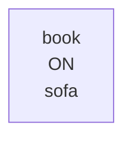
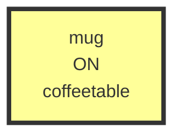

# 🚀 VirtualHome Agent Episode Log


### [GoalReasoner (Module A - Intent)] Output
```json
{
  "is_instruction_obviously_vague": false,
  "clarification_question": null,
  "target_object": "book",
  "location_hint": "sofa",
  "reasoning_chain": [
    {
      "question": "Why does the user want this object?",
      "answer": "To relocate an unorganized book to the sofa."
    },
    {
      "question": "Why is that important?",
      "answer": "To place the book in a more orderly or intended spot."
    },
    {
      "question": "What fundamental need does this fulfill?",
      "answer": "The user wants to organize household items."
    },
    {
      "question": "Are there any deeper psychological or physical motivations?",
      "answer": "The user may want to reduce clutter, improve tidiness, or prepare the living area for use."
    }
  ],
  "deep_intent": "The user wants to organize household items by relocating misplaced items to a designated resting area.",
  "acceptable_alternatives_properties": [
    {
      "priority": 1,
      "description": "Other small household items that are out of place and can be moved to the sofa or another designated resting surface"
    },
    {
      "priority": 2,
      "description": "Other reading materials or paper items that are similarly out of place and can be grouped together"
    },
    {
      "priority": 3,
      "description": "Nearby clutter or loose household objects that can be tidied into a more organized arrangement"
    },
    {
      "priority": 4,
      "description": "Any small portable item contributing to clutter reduction when moved from an unorganized area"
    }
  ]
}
```

### [RoboStateMultiTaskController] Output
```json
{
  "action": "[walk] <bathroom> (11)",
  "active_task_id": "task_3",
  "task_context": {
    "active_task_id": "task_3",
    "pending_task_ids": [
      "task_1",
      "task_2",
      "task_4",
      "task_5"
    ],
    "satisfied_task_ids": []
  },
  "source": "room_frontier"
}
```
## Step 0
- **Action**: `[walk] <bathroom> (11)`
- **Action Success**: `True`
- **Action Message**: {'0': {'message': 'Success'}}
- **Active Task**: `task_3`
- **Decision Source**: `room_frontier`
- **Task Progress**: G1_04=pending, E1_01=pending, E1_03=pending, E1_11=pending, E1_07=pending
- **SDG Status**:

- **Observed Items (74)**: floor(74), floor(75), floor(76), floor(77), floor(78), floor(79), floor(80), floor(81), floor(82), wall(83), wall(84), wall(85), wall(86), wall(87), wall(88)...


### [RoboStateMultiTaskController] Output
```json
{
  "action": "[walk] <kitchen> (205)",
  "active_task_id": "task_3",
  "task_context": {
    "active_task_id": "task_3",
    "pending_task_ids": [
      "task_1",
      "task_2",
      "task_4",
      "task_5"
    ],
    "satisfied_task_ids": []
  },
  "source": "room_frontier"
}
```
## Step 1
- **Action**: `[walk] <kitchen> (205)`
- **Action Success**: `True`
- **Action Message**: {'0': {'message': 'Success'}}
- **Active Task**: `task_3`
- **Decision Source**: `room_frontier`
- **Task Progress**: G1_04=pending, E1_01=pending, E1_03=pending, E1_11=pending, E1_07=pending
- **SDG Status**:

- **Observed Items (135)**: floor(74), floor(75), floor(76), floor(77), floor(78), floor(79), floor(80), floor(81), floor(82), wall(83), wall(84), wall(85), wall(86), wall(87), wall(88)...


### [RoboStateMultiTaskController] Output
```json
{
  "action": "[walk] <livingroom> (335)",
  "active_task_id": "task_3",
  "task_context": {
    "active_task_id": "task_3",
    "pending_task_ids": [
      "task_1",
      "task_2",
      "task_4",
      "task_5"
    ],
    "satisfied_task_ids": []
  },
  "source": "room_frontier"
}
```
## Step 2
- **Action**: `[walk] <livingroom> (335)`
- **Action Success**: `True`
- **Action Message**: {'0': {'message': 'Success'}}
- **Active Task**: `task_3`
- **Decision Source**: `room_frontier`
- **Task Progress**: G1_04=pending, E1_01=pending, E1_03=pending, E1_11=pending, E1_07=pending
- **SDG Status**:

- **Observed Items (243)**: floor(74), floor(75), floor(76), floor(77), floor(78), floor(79), floor(80), floor(81), floor(82), wall(83), wall(84), wall(85), wall(86), wall(87), wall(88)...


### [PerceptionFilter] Output
```json
{
  "reasoning": "The goal and SDG require moving a book onto a sofa. To satisfy this, only the target object and the destination location are needed. No tool is implied for simply relocating the book.",
  "selected_classes": [
    "book",
    "character",
    "sofa",
    "paper"
  ],
  "raw_class_count": 101
}
```

### [LLMExecutor] Output
```json
{
  "reasoning": "The active goal is to place a book on the sofa. The character is already close to sofa(368), and there is a grabbable book(190) currently close by in the bedroom. To satisfy the ON relation, the next required step is to grab the target book before walking back to the sofa for placement.",
  "satisfied_nodes": [],
  "current_node_focus": "N1",
  "mapped_variables": {
    "?Book": "book(190)",
    "?Surface": "sofa(368)"
  },
  "action": "[grab] <book> (190)"
}
```

### [RoboStateMultiTaskController] Output
```json
{
  "action": "[grab] <book> (190)",
  "active_task_id": "task_3",
  "task_context": {
    "active_task_id": "task_3",
    "pending_task_ids": [
      "task_1",
      "task_2",
      "task_4",
      "task_5"
    ],
    "satisfied_task_ids": []
  },
  "source": "llm_executor"
}
```
## Step 3
- **Action**: `[grab] <book> (190)`
- **Action Success**: `True`
- **Action Message**: {'0': {'message': 'Success'}}
- **Active Task**: `task_3`
- **Decision Source**: `llm_executor`
- **Task Progress**: G1_04=pending, E1_01=pending, E1_03=pending, E1_11=pending, E1_07=pending
- **SDG Status**:

- **Observed Items (9)**: book(190) [CLOSED], character(1), bathroom(11), bedroom(73), kitchen(205), livingroom(335), book(268) [CLOSED], sofa(368), paper(451)


### [PerceptionFilter] Output
```json
{
  "reasoning": "Reused cached class selection.",
  "selected_classes": [
    "book",
    "character",
    "sofa",
    "paper"
  ],
  "raw_class_count": 101
}
```

### [LLMExecutor] Output
```json
{
  "reasoning": "The active SDG requires book(190) to end up ON the sofa. The book is already held in the right hand, and the sofa is currently close to the character in the living room. Since putting an object onto a surface requires being near the destination first, the next atomic step is to walk to the sofa before placing the book there.",
  "satisfied_nodes": [],
  "current_node_focus": "N1",
  "mapped_variables": {
    "?TargetSurface": "sofa(368)"
  },
  "action": "[walk] <sofa> (368)"
}
```

### [RoboStateMultiTaskController] Output
```json
{
  "action": "[walk] <sofa> (368)",
  "active_task_id": "task_3",
  "task_context": {
    "active_task_id": "task_3",
    "pending_task_ids": [
      "task_1",
      "task_2",
      "task_4",
      "task_5"
    ],
    "satisfied_task_ids": []
  },
  "source": "llm_executor"
}
```
## Step 4
- **Action**: `[walk] <sofa> (368)`
- **Action Success**: `True`
- **Action Message**: {'0': {'message': 'Success'}}
- **Active Task**: `task_3`
- **Decision Source**: `llm_executor`
- **Task Progress**: G1_04=pending, E1_01=pending, E1_03=pending, E1_11=pending, E1_07=pending
- **SDG Status**:

- **Observed Items (9)**: book(190) [CLOSED], character(1), bathroom(11), bedroom(73), kitchen(205), livingroom(335), book(268) [CLOSED], sofa(368), paper(451)


### [PerceptionFilter] Output
```json
{
  "reasoning": "Reused cached class selection.",
  "selected_classes": [
    "book",
    "character",
    "sofa",
    "paper"
  ],
  "raw_class_count": 101
}
```

### [LLMExecutor] Output
```json
{
  "reasoning": "The active SDG requires book(190) to be ON sofa(368). The robot is already close to the sofa and currently holding book(190), so the next atomic step is to place the book onto the sofa surface. This directly progresses toward satisfying N1.",
  "satisfied_nodes": [],
  "current_node_focus": "N1",
  "mapped_variables": {},
  "action": "[putback] <book> (190) <sofa> (368)"
}
```

### [RoboStateMultiTaskController] Output
```json
{
  "action": "[putback] <book> (190) <sofa> (368)",
  "active_task_id": "task_3",
  "task_context": {
    "active_task_id": "task_3",
    "pending_task_ids": [
      "task_1",
      "task_2",
      "task_4",
      "task_5"
    ],
    "satisfied_task_ids": []
  },
  "source": "llm_executor"
}
```
## Step 5
- **Action**: `[putback] <book> (190) <sofa> (368)`
- **Action Success**: `True`
- **Action Message**: {'0': {'message': 'Success'}}
- **Active Task**: `task_3`
- **Decision Source**: `llm_executor`
- **Task Progress**: G1_04=pending, E1_01=pending, E1_03=done, E1_11=pending, E1_07=pending
- **SDG Status**:

- **Observed Items (9)**: book(190) [CLOSED], character(1), bathroom(11), bedroom(73), kitchen(205), livingroom(335), book(268) [CLOSED], sofa(368), paper(451)


### [GoalReasoner (Module A - Intent)] Output
```json
{
  "is_instruction_obviously_vague": false,
  "clarification_question": null,
  "target_object": "mug",
  "location_hint": "coffeetable",
  "reasoning_chain": [
    {
      "question": "Why does the user want this object?",
      "answer": "To keep the mug in a specific place rather than elsewhere."
    },
    {
      "question": "Why is that important?",
      "answer": "So the mug remains consistently positioned on the coffeetable."
    },
    {
      "question": "What fundamental need does this fulfill?",
      "answer": "Maintaining a desired organized state for the mug in the room."
    },
    {
      "question": "Are there any deeper psychological or physical motivations?",
      "answer": "Likely convenience, tidiness, or making the mug easy to find and use on the coffeetable."
    }
  ],
  "deep_intent": "The user wants to maintain a specific household object in a designated location.",
  "acceptable_alternatives_properties": [
    {
      "priority": 1,
      "description": "Other cup-like drink containers that can serve the same storage and placement purpose on a table."
    },
    {
      "priority": 2,
      "description": "Other small tabletop containers or vessels that can be kept in the same location."
    },
    {
      "priority": 3,
      "description": "Any similarly sized household object that can be stably placed on a coffee table."
    },
    {
      "priority": 4,
      "description": "Other personal items that can be kept on a table for convenience or tidiness."
    }
  ]
}
```

### [PerceptionFilter] Output
```json
{
  "reasoning": "The goal is to keep the mug on the coffeetable, so the only strictly necessary classes are the target object and the location it must be on. No extra tools or alternative containers are required for this placement task.",
  "selected_classes": [
    "character",
    "mug",
    "coffeetable"
  ],
  "raw_class_count": 101
}
```

### [LLMExecutor] Output
```json
{
  "reasoning": "The active SDG requires a mug to be ON the coffeetable. In the current graph, coffeetable(371) is in the livingroom and close to the character, while mug(447) is also in the livingroom and is a valid mug instance. Since we are already close to the coffeetable(371), the next step should be to move to the mug so it can be grabbed before placing it on the table. This does not repeat the last action and follows the required walk->grab->walk->putback sequence.",
  "satisfied_nodes": [],
  "current_node_focus": "N1",
  "mapped_variables": {
    "?TargetTable": "coffeetable(371)",
    "?Mug": "mug(447)"
  },
  "action": "[walk] <mug> (447)"
}
```

### [RoboStateMultiTaskController] Output
```json
{
  "action": "[walk] <mug> (447)",
  "active_task_id": "task_5",
  "task_context": {
    "active_task_id": "task_5",
    "pending_task_ids": [
      "task_1",
      "task_2",
      "task_4"
    ],
    "satisfied_task_ids": [
      "task_3"
    ]
  },
  "source": "llm_executor"
}
```
## Step 6
- **Action**: `[walk] <mug> (447)`
- **Action Success**: `True`
- **Action Message**: {'0': {'message': 'Success'}}
- **Active Task**: `task_5`
- **Decision Source**: `llm_executor`
- **Task Progress**: G1_04=pending, E1_01=pending, E1_03=done, E1_11=pending, E1_07=pending
- **SDG Status**:

- **Observed Items (9)**: coffeetable(111), character(1), bathroom(11), bedroom(73), kitchen(205), livingroom(335), mug(194), coffeetable(371), mug(447)


### [PerceptionFilter] Output
```json
{
  "reasoning": "Reused cached class selection.",
  "selected_classes": [
    "character",
    "mug",
    "coffeetable"
  ],
  "raw_class_count": 101
}
```

### [LLMExecutor] Output
```json
{
  "reasoning": "The active goal is to have a mug ON the coffeetable. We are already close to mug(447), and coffeetable(111) is also close to the character. The mug is grabbable and there is a valid coffee table surface to place it on. Since the previous step already walked to the mug, the next atomic step should be to grab it before walking to the table.",
  "satisfied_nodes": [],
  "current_node_focus": "N1",
  "mapped_variables": {
    "?TargetMug": "mug(447)",
    "?Table": "coffeetable(111)"
  },
  "action": "[grab] <mug> (447)"
}
```

### [RoboStateMultiTaskController] Output
```json
{
  "action": "[grab] <mug> (447)",
  "active_task_id": "task_5",
  "task_context": {
    "active_task_id": "task_5",
    "pending_task_ids": [
      "task_1",
      "task_2",
      "task_4"
    ],
    "satisfied_task_ids": [
      "task_3"
    ]
  },
  "source": "llm_executor"
}
```
## Step 7
- **Action**: `[grab] <mug> (447)`
- **Action Success**: `True`
- **Action Message**: {'0': {'message': 'Success'}}
- **Active Task**: `task_5`
- **Decision Source**: `llm_executor`
- **Task Progress**: G1_04=pending, E1_01=pending, E1_03=done, E1_11=pending, E1_07=pending
- **SDG Status**:

- **Observed Items (9)**: coffeetable(111), character(1), bathroom(11), bedroom(73), kitchen(205), livingroom(335), mug(194), coffeetable(371), mug(447)


### [PerceptionFilter] Output
```json
{
  "reasoning": "Reused cached class selection.",
  "selected_classes": [
    "character",
    "mug",
    "coffeetable"
  ],
  "raw_class_count": 101
}
```

### [LLMExecutor] Output
```json
{
  "reasoning": "The active task is to have the mug on the coffeetable. We are already holding mug(447), and the current filtered graph shows coffeetable(111) is close to the character. The next required step is to place the held mug onto the target coffee table. Since putback requires being explicitly walked to the surface first, and we are already close to coffeetable(111), the correct next atomic action is to put the mug back on that surface.",
  "satisfied_nodes": [],
  "current_node_focus": "N1",
  "mapped_variables": {
    "?TargetMug": "mug(447)",
    "?TargetTable": "coffeetable(111)"
  },
  "action": "[putback] <mug> (447) <coffeetable> (111)"
}
```

### [RoboStateMultiTaskController] Output
```json
{
  "action": "[putback] <mug> (447) <coffeetable> (111)",
  "active_task_id": "task_5",
  "task_context": {
    "active_task_id": "task_5",
    "pending_task_ids": [
      "task_1",
      "task_2",
      "task_4"
    ],
    "satisfied_task_ids": [
      "task_3"
    ]
  },
  "source": "llm_executor"
}
```
## Step 8
- **Action**: `[putback] <mug> (447) <coffeetable> (111)`
- **Action Success**: `True`
- **Action Message**: {'0': {'message': 'Success'}}
- **Active Task**: `task_5`
- **Decision Source**: `llm_executor`
- **Task Progress**: G1_04=pending, E1_01=pending, E1_03=done, E1_11=pending, E1_07=pending
- **SDG Status**:

- **Observed Items (9)**: coffeetable(111), character(1), bathroom(11), bedroom(73), kitchen(205), livingroom(335), mug(194), coffeetable(371), mug(447)


### [PerceptionFilter] Output
```json
{
  "reasoning": "Reused cached class selection.",
  "selected_classes": [
    "character",
    "mug",
    "coffeetable"
  ],
  "raw_class_count": 101
}
```

### [LLMExecutor] Output
```json
{
  "reasoning": "The active SDG requires mug ON coffeetable. The current graph already shows mug(447) ON coffeetable(111) and CLOSE to the character, so the goal state is satisfied. No further physical action is needed for this task.",
  "satisfied_nodes": [
    "N1"
  ],
  "current_node_focus": "N1",
  "mapped_variables": {
    "?TargetMug": "mug(447)",
    "?TargetTable": "coffeetable(111)"
  },
  "action": "[wait]"
}
```

### [RoboStateMultiTaskController] Output
```json
{
  "action": "[wait]",
  "active_task_id": "task_5",
  "task_context": {
    "active_task_id": "task_5",
    "pending_task_ids": [
      "task_1",
      "task_2",
      "task_4"
    ],
    "satisfied_task_ids": [
      "task_3"
    ]
  },
  "source": "llm_executor"
}
```
## Step 9
- **Action**: `[wait]`
- **Action Success**: `True`
- **Action Message**: Time passes. You waited for a while.
- **Active Task**: `task_5`
- **Decision Source**: `llm_executor`
- **Task Progress**: G1_04=pending, E1_01=pending, E1_03=done, E1_11=pending, E1_07=pending
- **SDG Status**:

- **Observed Items (9)**: coffeetable(111), character(1), bathroom(11), bedroom(73), kitchen(205), livingroom(335), mug(194), coffeetable(371), mug(447)


### [PerceptionFilter] Output
```json
{
  "reasoning": "Reused cached class selection.",
  "selected_classes": [
    "character",
    "mug",
    "coffeetable"
  ],
  "raw_class_count": 101
}
```

### [LLMExecutor] Output
```json
{
  "reasoning": "The active SDG node N1 requires the mug to be ON the coffeetable. The filtered graph already shows mug(447) is ON coffeetable(111), so the goal relation is satisfied. No further physical action is needed for this task; I should avoid manipulating any other mug or moving objects unnecessarily.",
  "satisfied_nodes": [
    "N1"
  ],
  "current_node_focus": "N1",
  "mapped_variables": {
    "?mug": "mug(447)",
    "?coffeetable": "coffeetable(111)"
  },
  "action": "[wait]"
}
```

### [RoboStateMultiTaskController] Output
```json
{
  "action": "[wait]",
  "active_task_id": "task_5",
  "task_context": {
    "active_task_id": "task_5",
    "pending_task_ids": [
      "task_1",
      "task_2",
      "task_4"
    ],
    "satisfied_task_ids": [
      "task_3"
    ]
  },
  "source": "llm_executor"
}
```
## Step 10
- **Action**: `[wait]`
- **Action Success**: `True`
- **Action Message**: Time passes. You waited for a while.
- **Active Task**: `task_5`
- **Decision Source**: `llm_executor`
- **Task Progress**: G1_04=pending, E1_01=pending, E1_03=done, E1_11=pending, E1_07=pending
- **SDG Status**:

- **Observed Items (9)**: coffeetable(111), character(1), bathroom(11), bedroom(73), kitchen(205), livingroom(335), mug(194), coffeetable(371), mug(447)


### [PerceptionFilter] Output
```json
{
  "reasoning": "Reused cached class selection.",
  "selected_classes": [
    "character",
    "mug",
    "coffeetable"
  ],
  "raw_class_count": 101
}
```

### [LLMExecutor] Output
```json
{
  "reasoning": "The active SDG requires the mug to be ON the coffeetable. The current Filtered Graph already shows mug(447) ON coffeetable(111), and the character is close to both, so N1 is satisfied. No further physical action is needed for the active task. Since the instruction says not to repeat a walk action if we just did it, and the goal state is already met, the best next step is to do nothing.",
  "satisfied_nodes": [
    "N1"
  ],
  "current_node_focus": "N1",
  "mapped_variables": {
    "?Mug": "mug(447)",
    "?Table": "coffeetable(111)"
  },
  "action": "[wait]"
}
```

### [RoboStateMultiTaskController] Output
```json
{
  "action": "[wait]",
  "active_task_id": "task_5",
  "task_context": {
    "active_task_id": "task_5",
    "pending_task_ids": [
      "task_1",
      "task_2",
      "task_4"
    ],
    "satisfied_task_ids": [
      "task_3"
    ]
  },
  "source": "llm_executor"
}
```
## Step 11
- **Action**: `[wait]`
- **Action Success**: `True`
- **Action Message**: Time passes. You waited for a while.
- **Active Task**: `task_5`
- **Decision Source**: `llm_executor`
- **Task Progress**: G1_04=pending, E1_01=pending, E1_03=done, E1_11=pending, E1_07=pending
- **SDG Status**:

- **Observed Items (9)**: coffeetable(111), character(1), bathroom(11), bedroom(73), kitchen(205), livingroom(335), mug(194), coffeetable(371), mug(447)


### [PerceptionFilter] Output
```json
{
  "reasoning": "Reused cached class selection.",
  "selected_classes": [
    "character",
    "mug",
    "coffeetable"
  ],
  "raw_class_count": 101
}
```

### [LLMExecutor] Output
```json
{
  "reasoning": "The active SDG node N1 requires the mug to be ON the coffeetable. The current graph already shows mug(447) ON coffeetable(111), which is close to the character and inside the bedroom. Therefore the goal for this active task is already satisfied, and no further physical action is needed. Since I must still output a single next action, the safest no-op is to wait rather than disturb the satisfied arrangement.",
  "satisfied_nodes": [
    "N1"
  ],
  "current_node_focus": "N1",
  "mapped_variables": {
    "?Container": "coffeetable(111)"
  },
  "action": "[wait]"
}
```

### [RoboStateMultiTaskController] Output
```json
{
  "action": "[wait]",
  "active_task_id": "task_5",
  "task_context": {
    "active_task_id": "task_5",
    "pending_task_ids": [
      "task_1",
      "task_2",
      "task_4"
    ],
    "satisfied_task_ids": [
      "task_3"
    ]
  },
  "source": "llm_executor"
}
```
## Step 12
- **Action**: `[wait]`
- **Action Success**: `True`
- **Action Message**: Time passes. You waited for a while.
- **Active Task**: `task_5`
- **Decision Source**: `llm_executor`
- **Task Progress**: G1_04=pending, E1_01=pending, E1_03=done, E1_11=pending, E1_07=pending
- **SDG Status**:

- **Observed Items (9)**: coffeetable(111), character(1), bathroom(11), bedroom(73), kitchen(205), livingroom(335), mug(194), coffeetable(371), mug(447)


### [PerceptionFilter] Output
```json
{
  "reasoning": "Reused cached class selection.",
  "selected_classes": [
    "character",
    "mug",
    "coffeetable"
  ],
  "raw_class_count": 101
}
```

### [LLMExecutor] Output
```json
{
  "reasoning": "The active goal is already satisfied: mug(447) is ON coffeetable(111), matching N1. No further physical action is needed for this task, and repeated waiting would be unnecessary because the desired relation is present in the graph.",
  "satisfied_nodes": [
    "N1"
  ],
  "current_node_focus": "N1",
  "mapped_variables": {
    "?TargetMug": "mug(447)",
    "?Table": "coffeetable(111)"
  },
  "action": "[wait]"
}
```

### [RoboStateMultiTaskController] Output
```json
{
  "action": "[wait]",
  "active_task_id": "task_5",
  "task_context": {
    "active_task_id": "task_5",
    "pending_task_ids": [
      "task_1",
      "task_2",
      "task_4"
    ],
    "satisfied_task_ids": [
      "task_3"
    ]
  },
  "source": "llm_executor"
}
```
