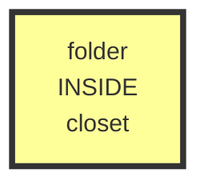

# 🚀 VirtualHome Agent Episode Log


### [GoalReasoner (Module A - Intent)] Output
```json
{
  "is_instruction_obviously_vague": false,
  "clarification_question": null,
  "target_object": "folder",
  "location_hint": "closet",
  "reasoning_chain": [
    {
      "question": "Why does the user want this object placed in that location?",
      "answer": "To store the folder away in a designated storage area."
    },
    {
      "question": "Why is that important?",
      "answer": "To keep the folder organized and out of the way."
    },
    {
      "question": "What fundamental need does this fulfill?",
      "answer": "It fulfills the need to organize and store an item properly."
    },
    {
      "question": "Are there any deeper psychological or physical motivations?",
      "answer": "It may reduce clutter, protect the item, and make the space easier to use."
    }
  ],
  "deep_intent": "The user wants to store and organize an item away from the main space.",
  "acceptable_alternatives_properties": [
    {
      "priority": 1,
      "description": "Other document storage items, such as a file, notebook, or papers that can be put away in the closet."
    },
    {
      "priority": 2,
      "description": "Similar office or paper-based items that can be stored neatly, such as envelopes or magazines."
    },
    {
      "priority": 3,
      "description": "Small household items that are meant to be stored out of sight and kept organized."
    },
    {
      "priority": 4,
      "description": "Any compact item that can be safely placed in a storage area to reduce clutter."
    }
  ]
}
```

### [PerceptionFilter] Output
```json
{
  "reasoning": "The goal is to place the folder inside the closet. The only strictly necessary classes are the target item and the storage location; no tools or alternative receptacles are required for this simple storage task.",
  "selected_classes": [
    "folder",
    "closet",
    "book",
    "character"
  ],
  "raw_class_count": 36
}
```

### [LLMExecutor] Output
```json
{
  "reasoning": "The active goal is to place the folder inside the closet. A suitable target exists: closet(127) is closed and can be opened. The folder(203) is present in the bedroom and is grabbable. Since I am not currently holding the folder and must be near it before grabbing, the first progress-making step is to walk to the folder.",
  "satisfied_nodes": [],
  "current_node_focus": "N1",
  "mapped_variables": {
    "?Container": "closet(127)"
  },
  "action": "[walk] <folder> (203)"
}
```

### [RoboStateMultiTaskController] Output
```json
{
  "action": "[walk] <folder> (203)",
  "active_task_id": "task_7",
  "task_context": {
    "active_task_id": "task_7",
    "pending_task_ids": [
      "task_1",
      "task_2",
      "task_3",
      "task_4",
      "task_5",
      "task_6"
    ],
    "satisfied_task_ids": []
  },
  "source": "llm_executor"
}
```
## Step 0
- **Action**: `[walk] <folder> (203)`
- **Action Success**: `True`
- **Action Message**: {'0': {'message': 'Success'}}
- **Active Task**: `task_7`
- **Decision Source**: `llm_executor`
- **Task Progress**: G1_04=pending, E1_01=pending, E1_03=pending, E1_11=pending, E1_07=pending, E1_17=pending, E1_15=pending
- **SDG Status**:

- **Observed Items (9)**: closet(112) [OPEN], closet(127) [CLOSED], book(190) [CLOSED], folder(203) [CLOSED], character(1), bathroom(11), bedroom(73), kitchen(205), livingroom(335)


### [PerceptionFilter] Output
```json
{
  "reasoning": "Reused cached class selection.",
  "selected_classes": [
    "folder",
    "closet",
    "book",
    "character"
  ],
  "raw_class_count": 36
}
```

### [LLMExecutor] Output
```json
{
  "reasoning": "The active goal is to place the folder inside the closet. The folder (203) is already nearby and may be held/could be interacted with, but the destination closet must be specifically the closed closet(127) or the open closet(112). Since the task is to store the folder away in a closet and closet(127) is a valid closed container while closet(112) is already open, the next progress-making step is to move to the intended storage container before opening or putting anything inside. Because the prior action was only walking to the folder, the immediate next atomic action should target the closet, not repeat a walk to the folder.",
  "satisfied_nodes": [],
  "current_node_focus": "N1",
  "mapped_variables": {
    "?Container": "closet(127)"
  },
  "action": "[walk] <closet> (127)"
}
```

### [RoboStateMultiTaskController] Output
```json
{
  "action": "[walk] <closet> (127)",
  "active_task_id": "task_7",
  "task_context": {
    "active_task_id": "task_7",
    "pending_task_ids": [
      "task_1",
      "task_2",
      "task_3",
      "task_4",
      "task_5",
      "task_6"
    ],
    "satisfied_task_ids": []
  },
  "source": "llm_executor"
}
```
## Step 1
- **Action**: `[walk] <closet> (127)`
- **Action Success**: `True`
- **Action Message**: {'0': {'message': 'Success'}}
- **Active Task**: `task_7`
- **Decision Source**: `llm_executor`
- **Task Progress**: G1_04=pending, E1_01=pending, E1_03=pending, E1_11=pending, E1_07=pending, E1_17=pending, E1_15=pending
- **SDG Status**:

- **Observed Items (9)**: closet(112) [OPEN], closet(127) [CLOSED], book(190) [CLOSED], folder(203) [CLOSED], character(1), bathroom(11), bedroom(73), kitchen(205), livingroom(335)


### [PerceptionFilter] Output
```json
{
  "reasoning": "Reused cached class selection.",
  "selected_classes": [
    "folder",
    "closet",
    "book",
    "character"
  ],
  "raw_class_count": 36
}
```

### [LLMExecutor] Output
```json
{
  "reasoning": "The active goal is to get folder(203) inside closet(127). The robot already walked to folder(203) and then walked to closet(127), so it is now in position to interact with the closet. The closet is currently CLOSED, and to put the folder inside it must be opened first. The folder itself is the correct target object from the SDG and there is no evidence it is held yet, so the immediate next step is to open the closet before attempting to grab/put the folder.",
  "satisfied_nodes": [],
  "current_node_focus": "N1",
  "mapped_variables": {
    "?Container": "closet(127)"
  },
  "action": "[open] <closet> (127)"
}
```

### [RoboStateMultiTaskController] Output
```json
{
  "action": "[open] <closet> (127)",
  "active_task_id": "task_7",
  "task_context": {
    "active_task_id": "task_7",
    "pending_task_ids": [
      "task_1",
      "task_2",
      "task_3",
      "task_4",
      "task_5",
      "task_6"
    ],
    "satisfied_task_ids": []
  },
  "source": "llm_executor"
}
```
## Step 2
- **Action**: `[open] <closet> (127)`
- **Action Success**: `False`
- **Action Message**: {'0': {'message': 'ScriptExcutor 0: EXECUTION_GENERAL: Script is impossible to execute\n\n'}}
- **Active Task**: `task_7`
- **Decision Source**: `llm_executor`
- **Task Progress**: G1_04=pending, E1_01=pending, E1_03=pending, E1_11=pending, E1_07=pending, E1_17=pending, E1_15=pending
- **SDG Status**:

- **Observed Items (9)**: closet(112) [OPEN], closet(127) [CLOSED], book(190) [CLOSED], folder(203) [CLOSED], character(1), bathroom(11), bedroom(73), kitchen(205), livingroom(335)


### [PerceptionFilter] Output
```json
{
  "reasoning": "Reused cached class selection.",
  "selected_classes": [
    "folder",
    "closet",
    "book",
    "character"
  ],
  "raw_class_count": 36
}
```

### [LLMExecutor] Output
```json
{
  "reasoning": "The active task is to place the folder inside the closet. The previous attempt to open closet(127) failed, but the filtered graph shows an alternative closet(112) that is already OPEN and is close to the character. Since the folder(203) is available in the bedroom and appears grabbable, the next progress step is to grab the folder first while near it. This is necessary before moving it into the open closet. The SDG node N1 is not yet satisfied because the folder is not inside any closet.",
  "satisfied_nodes": [],
  "current_node_focus": "N1",
  "mapped_variables": {
    "?Container": "closet(112)"
  },
  "action": "[grab] <folder> (203)"
}
```

### [RoboStateMultiTaskController] Output
```json
{
  "action": "[walk] <folder> (203)",
  "active_task_id": "task_7",
  "task_context": {
    "active_task_id": "task_7",
    "pending_task_ids": [
      "task_1",
      "task_2",
      "task_3",
      "task_4",
      "task_5",
      "task_6"
    ],
    "satisfied_task_ids": []
  },
  "source": "llm_executor_repaired"
}
```
## Step 3
- **Action**: `[walk] <folder> (203)`
- **Action Success**: `True`
- **Action Message**: {'0': {'message': 'Success'}}
- **Active Task**: `task_7`
- **Decision Source**: `llm_executor_repaired`
- **Task Progress**: G1_04=pending, E1_01=pending, E1_03=pending, E1_11=pending, E1_07=pending, E1_17=pending, E1_15=pending
- **SDG Status**:

- **Observed Items (9)**: closet(112) [OPEN], closet(127) [CLOSED], book(190) [CLOSED], folder(203) [CLOSED], character(1), bathroom(11), bedroom(73), kitchen(205), livingroom(335)


### [PerceptionFilter] Output
```json
{
  "reasoning": "Reused cached class selection.",
  "selected_classes": [
    "folder",
    "closet",
    "book",
    "character"
  ],
  "raw_class_count": 36
}
```

### [LLMExecutor] Output
```json
{
  "reasoning": "The active goal is to place the folder inside the closet. The previously tried closet(127) appears to be a bad target because opening it failed, but the graph shows another valid closet instance, closet(112), which is already OPEN and can accept the folder. The folder(203) is currently close to the character, so the best next step is to move to the open closet before attempting to put the folder inside it.",
  "satisfied_nodes": [],
  "current_node_focus": "N1",
  "mapped_variables": {
    "?Container": "closet(112)"
  },
  "action": "[walk] <closet> (112)"
}
```

### [RoboStateMultiTaskController] Output
```json
{
  "action": "[walk] <closet> (112)",
  "active_task_id": "task_7",
  "task_context": {
    "active_task_id": "task_7",
    "pending_task_ids": [
      "task_1",
      "task_2",
      "task_3",
      "task_4",
      "task_5",
      "task_6"
    ],
    "satisfied_task_ids": []
  },
  "source": "llm_executor"
}
```
## Step 4
- **Action**: `[walk] <closet> (112)`
- **Action Success**: `True`
- **Action Message**: {'0': {'message': 'Success'}}
- **Active Task**: `task_7`
- **Decision Source**: `llm_executor`
- **Task Progress**: G1_04=pending, E1_01=pending, E1_03=pending, E1_11=pending, E1_07=pending, E1_17=pending, E1_15=pending
- **SDG Status**:

- **Observed Items (9)**: closet(112) [OPEN], closet(127) [CLOSED], book(190) [CLOSED], folder(203) [CLOSED], character(1), bathroom(11), bedroom(73), kitchen(205), livingroom(335)


### [PerceptionFilter] Output
```json
{
  "reasoning": "Reused cached class selection.",
  "selected_classes": [
    "folder",
    "closet",
    "book",
    "character"
  ],
  "raw_class_count": 36
}
```

### [LLMExecutor] Output
```json
{
  "reasoning": "The active goal is to get folder(203) inside closet(127). The folder is currently in the bedroom and is grabbable. Closet(127) is the intended storage location, but the previous attempt to open it failed, so the most likely issue is that we were not at the correct closet instance. Current graph shows closet(112) is open and close to the character, while closet(127) is still closed and also close. Since the target SDG specifically requires the folder inside a closet and closet(127) is the named target, the next progress-making step is to approach the folder again so it can be grabbed before moving it to the correct closet.",
  "satisfied_nodes": [],
  "current_node_focus": "N1",
  "mapped_variables": {
    "?Container": "closet(127)"
  },
  "action": "[walk] <folder> (203)"
}
```

### [RoboStateMultiTaskController] Output
```json
{
  "action": "[walk] <folder> (203)",
  "active_task_id": "task_7",
  "task_context": {
    "active_task_id": "task_7",
    "pending_task_ids": [
      "task_1",
      "task_2",
      "task_3",
      "task_4",
      "task_5",
      "task_6"
    ],
    "satisfied_task_ids": []
  },
  "source": "llm_executor"
}
```
## Step 5
- **Action**: `[walk] <folder> (203)`
- **Action Success**: `True`
- **Action Message**: {'0': {'message': 'Success'}}
- **Active Task**: `task_7`
- **Decision Source**: `llm_executor`
- **Task Progress**: G1_04=pending, E1_01=pending, E1_03=pending, E1_11=pending, E1_07=pending, E1_17=pending, E1_15=pending
- **SDG Status**:

- **Observed Items (9)**: closet(112) [OPEN], closet(127) [CLOSED], book(190) [CLOSED], folder(203) [CLOSED], character(1), bathroom(11), bedroom(73), kitchen(205), livingroom(335)


### [PerceptionFilter] Output
```json
{
  "reasoning": "Reused cached class selection.",
  "selected_classes": [
    "folder",
    "closet",
    "book",
    "character"
  ],
  "raw_class_count": 36
}
```

### [LLMExecutor] Output
```json
{
  "reasoning": "The active goal is to get the folder inside a closet. We already know the folder is close to the character, and closet(112) is OPEN, while closet(127) is CLOSED. Since the previous open attempt on closet(127) failed and closet(112) is available and open, the next progress-making step is to move to the open closet so we can later put the folder inside it. I will target the open closet(112) rather than the closed one.",
  "satisfied_nodes": [],
  "current_node_focus": "N1",
  "mapped_variables": {
    "?Container": "closet(112)"
  },
  "action": "[walk] <closet> (112)"
}
```

### [RoboStateMultiTaskController] Output
```json
{
  "action": "[walk] <closet> (112)",
  "active_task_id": "task_7",
  "task_context": {
    "active_task_id": "task_7",
    "pending_task_ids": [
      "task_1",
      "task_2",
      "task_3",
      "task_4",
      "task_5",
      "task_6"
    ],
    "satisfied_task_ids": []
  },
  "source": "llm_executor"
}
```
## Step 6
- **Action**: `[walk] <closet> (112)`
- **Action Success**: `True`
- **Action Message**: {'0': {'message': 'Success'}}
- **Active Task**: `task_7`
- **Decision Source**: `llm_executor`
- **Task Progress**: G1_04=pending, E1_01=pending, E1_03=pending, E1_11=pending, E1_07=pending, E1_17=pending, E1_15=pending
- **SDG Status**:

- **Observed Items (9)**: closet(112) [OPEN], closet(127) [CLOSED], book(190) [CLOSED], folder(203) [CLOSED], character(1), bathroom(11), bedroom(73), kitchen(205), livingroom(335)


### [PerceptionFilter] Output
```json
{
  "reasoning": "Reused cached class selection.",
  "selected_classes": [
    "folder",
    "closet",
    "book",
    "character"
  ],
  "raw_class_count": 36
}
```

### [LLMExecutor] Output
```json
{
  "reasoning": "The active task is to place folder(203) inside the closet. The valid closet candidate is closet(112), which is already OPEN and close to the character. The folder is not currently held, and since we just walked to the folder and then back to the closet in prior steps, the next progress-making action is to grab the folder while near it before we can put it into the closet. closet(127) is closed and was previously impossible to open, so closet(112) is the best target.",
  "satisfied_nodes": [],
  "current_node_focus": "N1",
  "mapped_variables": {
    "?Folder": "folder(203)",
    "?Closet": "closet(112)"
  },
  "action": "[grab] <folder> (203)"
}
```

### [RoboStateMultiTaskController] Output
```json
{
  "action": "[walk] <folder> (203)",
  "active_task_id": "task_7",
  "task_context": {
    "active_task_id": "task_7",
    "pending_task_ids": [
      "task_1",
      "task_2",
      "task_3",
      "task_4",
      "task_5",
      "task_6"
    ],
    "satisfied_task_ids": []
  },
  "source": "llm_executor_repaired"
}
```
## Step 7
- **Action**: `[walk] <folder> (203)`
- **Action Success**: `True`
- **Action Message**: {'0': {'message': 'Success'}}
- **Active Task**: `task_7`
- **Decision Source**: `llm_executor_repaired`
- **Task Progress**: G1_04=pending, E1_01=pending, E1_03=pending, E1_11=pending, E1_07=pending, E1_17=pending, E1_15=pending
- **SDG Status**:

- **Observed Items (9)**: closet(112) [OPEN], closet(127) [CLOSED], book(190) [CLOSED], folder(203) [CLOSED], character(1), bathroom(11), bedroom(73), kitchen(205), livingroom(335)


### [PerceptionFilter] Output
```json
{
  "reasoning": "Reused cached class selection.",
  "selected_classes": [
    "folder",
    "closet",
    "book",
    "character"
  ],
  "raw_class_count": 36
}
```

### [LLMExecutor] Output
```json
{
  "reasoning": "The active SDG is to get folder(203) INSIDE a closet. The folder is already close to the character and is a grabbable container-like item. Since it is currently CLOSED, the next progress step is to pick it up so it can later be placed into the open closet. I should not repeat a walk action because I just walked to the folder in the previous step.",
  "satisfied_nodes": [],
  "current_node_focus": "N1",
  "mapped_variables": {
    "?Folder": "folder(203)",
    "?Closet": "closet(112)"
  },
  "action": "[grab] <folder> (203)"
}
```

### [RoboStateMultiTaskController] Output
```json
{
  "action": "[grab] <folder> (203)",
  "active_task_id": "task_7",
  "task_context": {
    "active_task_id": "task_7",
    "pending_task_ids": [
      "task_1",
      "task_2",
      "task_3",
      "task_4",
      "task_5",
      "task_6"
    ],
    "satisfied_task_ids": []
  },
  "source": "llm_executor"
}
```
## Step 8
- **Action**: `[grab] <folder> (203)`
- **Action Success**: `True`
- **Action Message**: {'0': {'message': 'Success'}}
- **Active Task**: `task_7`
- **Decision Source**: `llm_executor`
- **Task Progress**: G1_04=pending, E1_01=pending, E1_03=pending, E1_11=pending, E1_07=pending, E1_17=pending, E1_15=pending
- **SDG Status**:

- **Observed Items (9)**: closet(112) [OPEN], closet(127) [CLOSED], book(190) [CLOSED], folder(203) [CLOSED], character(1), bathroom(11), bedroom(73), kitchen(205), livingroom(335)


### [PerceptionFilter] Output
```json
{
  "reasoning": "Reused cached class selection.",
  "selected_classes": [
    "folder",
    "closet",
    "book",
    "character"
  ],
  "raw_class_count": 36
}
```

### [LLMExecutor] Output
```json
{
  "reasoning": "The folder is already held in the right hand, and the SDG requires it to be inside a closet. There are two closets in the graph: closet(112) is OPEN, while closet(127) is CLOSED. Since the folder can only be put inside an open container, and closet(112) is the open storage target, the next step is to move near that closet before placing the folder inside it.",
  "satisfied_nodes": [],
  "current_node_focus": "N1",
  "mapped_variables": {
    "?Container": "closet(112)"
  },
  "action": "[walk] <closet> (112)"
}
```

### [RoboStateMultiTaskController] Output
```json
{
  "action": "[walk] <closet> (112)",
  "active_task_id": "task_7",
  "task_context": {
    "active_task_id": "task_7",
    "pending_task_ids": [
      "task_1",
      "task_2",
      "task_3",
      "task_4",
      "task_5",
      "task_6"
    ],
    "satisfied_task_ids": []
  },
  "source": "llm_executor"
}
```
## Step 9
- **Action**: `[walk] <closet> (112)`
- **Action Success**: `True`
- **Action Message**: {'0': {'message': 'Success'}}
- **Active Task**: `task_7`
- **Decision Source**: `llm_executor`
- **Task Progress**: G1_04=pending, E1_01=pending, E1_03=pending, E1_11=pending, E1_07=pending, E1_17=pending, E1_15=pending
- **SDG Status**:

- **Observed Items (9)**: closet(112) [OPEN], closet(127) [CLOSED], book(190) [CLOSED], folder(203) [CLOSED], character(1), bathroom(11), bedroom(73), kitchen(205), livingroom(335)


### [PerceptionFilter] Output
```json
{
  "reasoning": "Reused cached class selection.",
  "selected_classes": [
    "folder",
    "closet",
    "book",
    "character"
  ],
  "raw_class_count": 36
}
```

### [LLMExecutor] Output
```json
{
  "reasoning": "The folder is already held in the right hand, and the target closet that is open and nearby is closet(112). The SDG requires the folder to be INSIDE the closet, so the next step is to place the held folder into the open closet. Since putin requires being near the destination and we are currently close to closet(112), this is the correct progress step.",
  "satisfied_nodes": [],
  "current_node_focus": "N1",
  "mapped_variables": {
    "?Container": "closet(112)"
  },
  "action": "[putin] <folder> (203) <closet> (112)"
}
```

### [RoboStateMultiTaskController] Output
```json
{
  "action": "[putin] <folder> (203) <closet> (112)",
  "active_task_id": "task_7",
  "task_context": {
    "active_task_id": "task_7",
    "pending_task_ids": [
      "task_1",
      "task_2",
      "task_3",
      "task_4",
      "task_5",
      "task_6"
    ],
    "satisfied_task_ids": []
  },
  "source": "llm_executor"
}
```
## Step 10
- **Action**: `[putin] <folder> (203) <closet> (112)`
- **Action Success**: `True`
- **Action Message**: {'0': {'message': 'Success'}}
- **Active Task**: `task_7`
- **Decision Source**: `llm_executor`
- **Task Progress**: G1_04=pending, E1_01=pending, E1_03=pending, E1_11=pending, E1_07=pending, E1_17=pending, E1_15=done
- **SDG Status**:

- **Observed Items (9)**: closet(112) [OPEN], closet(127) [CLOSED], book(190) [CLOSED], folder(203) [CLOSED], character(1), bathroom(11), bedroom(73), kitchen(205), livingroom(335)


### [GoalReasoner (Module A - Intent)] Output
```json
{
  "is_instruction_obviously_vague": false,
  "clarification_question": null,
  "target_object": "book",
  "location_hint": "sofa",
  "reasoning_chain": [
    {
      "question": "Why does the user want this object moved to the sofa?",
      "answer": "To relocate an unorganized book to a specific resting place."
    },
    {
      "question": "Why is that important?",
      "answer": "To organize the book by placing it where it belongs or is expected to be."
    },
    {
      "question": "What fundamental need does this fulfill?",
      "answer": "The user wants to restore order by putting misplaced reading material into a designated location."
    },
    {
      "question": "Are there any deeper psychological or physical motivations?",
      "answer": "This likely supports tidiness and reduces clutter in the room."
    }
  ],
  "deep_intent": "The user wants to organize misplaced reading material and reduce clutter by placing it in a designated seating area.",
  "acceptable_alternatives_properties": [
    {
      "priority": 1,
      "description": "Other reading materials or paper items that are similarly out of place, such as magazines or notebooks"
    },
    {
      "priority": 2,
      "description": "Other household items that belong in the living area and can be neatly relocated, such as remote controls or cushions"
    },
    {
      "priority": 3,
      "description": "Any small portable items contributing to clutter that can be tidied into a more orderly arrangement"
    },
    {
      "priority": 4,
      "description": "Different objects that help restore room order, such as grouping loose items into a basket or stack"
    }
  ]
}
```

### [RoboStateMultiTaskController] Output
```json
{
  "action": "[walk] <bathroom> (11)",
  "active_task_id": "task_3",
  "task_context": {
    "active_task_id": "task_3",
    "pending_task_ids": [
      "task_1",
      "task_2",
      "task_4",
      "task_5",
      "task_6"
    ],
    "satisfied_task_ids": [
      "task_7"
    ]
  },
  "source": "room_frontier"
}
```
## Step 11
- **Action**: `[walk] <bathroom> (11)`
- **Action Success**: `True`
- **Action Message**: {'0': {'message': 'Success'}}
- **Active Task**: `task_3`
- **Decision Source**: `room_frontier`
- **Task Progress**: G1_04=pending, E1_01=pending, E1_03=pending, E1_11=pending, E1_07=pending, E1_17=pending, E1_15=done
- **SDG Status**:

- **Observed Items (89)**: floor(74), floor(75), floor(76), floor(77), floor(78), floor(79), floor(80), floor(81), floor(82), wall(83), wall(84), wall(85), wall(86), wall(87), wall(88)...


### [RoboStateMultiTaskController] Output
```json
{
  "action": "[walk] <kitchen> (205)",
  "active_task_id": "task_3",
  "task_context": {
    "active_task_id": "task_3",
    "pending_task_ids": [
      "task_1",
      "task_2",
      "task_4",
      "task_5",
      "task_6"
    ],
    "satisfied_task_ids": [
      "task_7"
    ]
  },
  "source": "room_frontier"
}
```
## Step 12
- **Action**: `[walk] <kitchen> (205)`
- **Action Success**: `True`
- **Action Message**: {'0': {'message': 'Success'}}
- **Active Task**: `task_3`
- **Decision Source**: `room_frontier`
- **Task Progress**: G1_04=pending, E1_01=pending, E1_03=pending, E1_11=pending, E1_07=pending, E1_17=pending, E1_15=done
- **SDG Status**:

- **Observed Items (150)**: floor(74), floor(75), floor(76), floor(77), floor(78), floor(79), floor(80), floor(81), floor(82), wall(83), wall(84), wall(85), wall(86), wall(87), wall(88)...


### [RoboStateMultiTaskController] Output
```json
{
  "action": "[walk] <livingroom> (335)",
  "active_task_id": "task_3",
  "task_context": {
    "active_task_id": "task_3",
    "pending_task_ids": [
      "task_1",
      "task_2",
      "task_4",
      "task_5",
      "task_6"
    ],
    "satisfied_task_ids": [
      "task_7"
    ]
  },
  "source": "room_frontier"
}
```
## Step 13
- **Action**: `[walk] <livingroom> (335)`
- **Action Success**: `True`
- **Action Message**: {'0': {'message': 'Success'}}
- **Active Task**: `task_3`
- **Decision Source**: `room_frontier`
- **Task Progress**: G1_04=pending, E1_01=pending, E1_03=pending, E1_11=pending, E1_07=pending, E1_17=pending, E1_15=done
- **SDG Status**:

- **Observed Items (258)**: floor(74), floor(75), floor(76), floor(77), floor(78), floor(79), floor(80), floor(81), floor(82), wall(83), wall(84), wall(85), wall(86), wall(87), wall(88)...


### [PerceptionFilter] Output
```json
{
  "reasoning": "The goal is to move the book onto the sofa, so the only strictly necessary classes are the target object and the destination location. No extra tools or alternatives are required for this simple relocation task.",
  "selected_classes": [
    "book",
    "character",
    "sofa",
    "paper"
  ],
  "raw_class_count": 103
}
```

### [LLMExecutor] Output
```json
{
  "reasoning": "The active task is to place a book on the sofa. The character is already close to the sofa, and there are two candidate books in view. Book(190) is inside the bedroom, while book(268) is inside the kitchen and marked CLOSE to the character, making it the most accessible book to satisfy the ON-sofa relation. Since the next required step before grabbing is to be near the target object itself, the best single atomic action is to walk to book(268).",
  "satisfied_nodes": [],
  "current_node_focus": "N1",
  "mapped_variables": {},
  "action": "[walk] <book> (268)"
}
```

### [RoboStateMultiTaskController] Output
```json
{
  "action": "[walk] <book> (268)",
  "active_task_id": "task_3",
  "task_context": {
    "active_task_id": "task_3",
    "pending_task_ids": [
      "task_1",
      "task_2",
      "task_4",
      "task_5",
      "task_6"
    ],
    "satisfied_task_ids": [
      "task_7"
    ]
  },
  "source": "llm_executor"
}
```
## Step 14
- **Action**: `[walk] <book> (268)`
- **Action Success**: `True`
- **Action Message**: {'0': {'message': 'Success'}}
- **Active Task**: `task_3`
- **Decision Source**: `llm_executor`
- **Task Progress**: G1_04=pending, E1_01=pending, E1_03=pending, E1_11=pending, E1_07=pending, E1_17=pending, E1_15=done
- **SDG Status**:

- **Observed Items (9)**: book(190) [CLOSED], character(1), bathroom(11), bedroom(73), kitchen(205), livingroom(335), book(268) [CLOSED], sofa(368), paper(451)


### [PerceptionFilter] Output
```json
{
  "reasoning": "Reused cached class selection.",
  "selected_classes": [
    "book",
    "character",
    "sofa",
    "paper"
  ],
  "raw_class_count": 103
}
```

### [LLMExecutor] Output
```json
{
  "reasoning": "The active goal is to place a book ON the sofa. The current graph shows book(268) is already close to the character, while sofa(368) is in the livingroom and also close to the character. To satisfy the ON relation, the next required atomic step is to be near the sofa before any putback action. Since the book is the target object and likely needs to be moved, the immediate progression is to walk to the sofa so we can later place the book on it.",
  "satisfied_nodes": [],
  "current_node_focus": "N1",
  "mapped_variables": {
    "?TargetSurface": "sofa(368)"
  },
  "action": "[walk] <sofa> (368)"
}
```

### [RoboStateMultiTaskController] Output
```json
{
  "action": "[walk] <sofa> (368)",
  "active_task_id": "task_3",
  "task_context": {
    "active_task_id": "task_3",
    "pending_task_ids": [
      "task_1",
      "task_2",
      "task_4",
      "task_5",
      "task_6"
    ],
    "satisfied_task_ids": [
      "task_7"
    ]
  },
  "source": "llm_executor"
}
```
## Step 15
- **Action**: `[walk] <sofa> (368)`
- **Action Success**: `True`
- **Action Message**: {'0': {'message': 'Success'}}
- **Active Task**: `task_3`
- **Decision Source**: `llm_executor`
- **Task Progress**: G1_04=pending, E1_01=pending, E1_03=pending, E1_11=pending, E1_07=pending, E1_17=pending, E1_15=done
- **SDG Status**:

- **Observed Items (9)**: book(190) [CLOSED], character(1), bathroom(11), bedroom(73), kitchen(205), livingroom(335), book(268) [CLOSED], sofa(368), paper(451)


### [PerceptionFilter] Output
```json
{
  "reasoning": "Reused cached class selection.",
  "selected_classes": [
    "book",
    "character",
    "sofa",
    "paper"
  ],
  "raw_class_count": 103
}
```

### [LLMExecutor] Output
```json
{
  "reasoning": "The active goal is to place a book ON the sofa. The current graph shows the character is already CLOSE to sofa(368), so the proximity requirement for putting an object onto the sofa is satisfied. However, we are not currently holding the target book. Among visible books, book(268) is in the kitchen and likely the same active-task target instance previously approached, but the filtered graph also shows book(190) in the bedroom. Since the task is to move a book to the sofa and we are already by the sofa, the next required step is to acquire the nearest viable book before placing it. Because the user asked for a book on the sofa and book(268) was previously targeted, but only the current graph can be trusted for current state, the safest next atomic action is to walk to the current visible target book instance only if needed; however the instruction says not to repeat a walk action if you just did it, and we already walked to sofa. We must therefore first select the book to retrieve. The best choice is book(268) because it is the previously approached book and likely the intended item for this task.",
  "satisfied_nodes": [],
  "current_node_focus": "N1",
  "mapped_variables": {},
  "action": "[walk] <book> (268)"
}
```

### [RoboStateMultiTaskController] Output
```json
{
  "action": "[walk] <book> (268)",
  "active_task_id": "task_3",
  "task_context": {
    "active_task_id": "task_3",
    "pending_task_ids": [
      "task_1",
      "task_2",
      "task_4",
      "task_5",
      "task_6"
    ],
    "satisfied_task_ids": [
      "task_7"
    ]
  },
  "source": "llm_executor"
}
```
## Step 16
- **Action**: `[walk] <book> (268)`
- **Action Success**: `True`
- **Action Message**: {'0': {'message': 'Success'}}
- **Active Task**: `task_3`
- **Decision Source**: `llm_executor`
- **Task Progress**: G1_04=pending, E1_01=pending, E1_03=pending, E1_11=pending, E1_07=pending, E1_17=pending, E1_15=done
- **SDG Status**:

- **Observed Items (9)**: book(190) [CLOSED], character(1), bathroom(11), bedroom(73), kitchen(205), livingroom(335), book(268) [CLOSED], sofa(368), paper(451)


### [PerceptionFilter] Output
```json
{
  "reasoning": "Reused cached class selection.",
  "selected_classes": [
    "book",
    "character",
    "sofa",
    "paper"
  ],
  "raw_class_count": 103
}
```

### [LLMExecutor] Output
```json
{
  "reasoning": "The active task is to place the book on the sofa. The currently visible candidates are book(190) in the bedroom and book(268) in the kitchen. Because the character is already close to book(268) and the sofa is also close to the character, the next needed step is to grab the book before moving it onto the sofa. I am not yet holding any book, so no placement action is possible yet.",
  "satisfied_nodes": [],
  "current_node_focus": "N1",
  "mapped_variables": {
    "?TargetBook": "book(268)",
    "?TargetSurface": "sofa(368)"
  },
  "action": "[grab] <book> (268)"
}
```

### [RoboStateMultiTaskController] Output
```json
{
  "action": "[grab] <book> (268)",
  "active_task_id": "task_3",
  "task_context": {
    "active_task_id": "task_3",
    "pending_task_ids": [
      "task_1",
      "task_2",
      "task_4",
      "task_5",
      "task_6"
    ],
    "satisfied_task_ids": [
      "task_7"
    ]
  },
  "source": "llm_executor"
}
```
## Step 17
- **Action**: `[grab] <book> (268)`
- **Action Success**: `True`
- **Action Message**: {'0': {'message': 'Success'}}
- **Active Task**: `task_3`
- **Decision Source**: `llm_executor`
- **Task Progress**: G1_04=pending, E1_01=pending, E1_03=pending, E1_11=pending, E1_07=pending, E1_17=pending, E1_15=done
- **SDG Status**:

- **Observed Items (9)**: book(190) [CLOSED], character(1), bathroom(11), bedroom(73), kitchen(205), livingroom(335), book(268) [CLOSED], sofa(368), paper(451)


### [PerceptionFilter] Output
```json
{
  "reasoning": "Reused cached class selection.",
  "selected_classes": [
    "book",
    "character",
    "sofa",
    "paper"
  ],
  "raw_class_count": 103
}
```

### [LLMExecutor] Output
```json
{
  "reasoning": "The active goal is to place a book on the sofa. The current graph shows book(268) is already held and the sofa(368) is close to the character, so the next required step is to place the held book onto the sofa surface. The other book(190) is in the bedroom and should not be used because we are already holding the correct active-task book(268).",
  "satisfied_nodes": [],
  "current_node_focus": "N1",
  "mapped_variables": {},
  "action": "[putback] <book> (268) <sofa> (368)"
}
```

### [RoboStateMultiTaskController] Output
```json
{
  "action": "[putback] <book> (268) <sofa> (368)",
  "active_task_id": "task_3",
  "task_context": {
    "active_task_id": "task_3",
    "pending_task_ids": [
      "task_1",
      "task_2",
      "task_4",
      "task_5",
      "task_6"
    ],
    "satisfied_task_ids": [
      "task_7"
    ]
  },
  "source": "llm_executor"
}
```
## Step 18
- **Action**: `[putback] <book> (268) <sofa> (368)`
- **Action Success**: `True`
- **Action Message**: {'0': {'message': 'Success'}}
- **Active Task**: `task_3`
- **Decision Source**: `llm_executor`
- **Task Progress**: G1_04=pending, E1_01=pending, E1_03=pending, E1_11=pending, E1_07=pending, E1_17=pending, E1_15=done
- **SDG Status**:

- **Observed Items (9)**: book(190) [CLOSED], character(1), bathroom(11), bedroom(73), kitchen(205), livingroom(335), book(268) [CLOSED], sofa(368), paper(451)


### [PerceptionFilter] Output
```json
{
  "reasoning": "Reused cached class selection.",
  "selected_classes": [
    "book",
    "character",
    "sofa",
    "paper"
  ],
  "raw_class_count": 103
}
```

### [LLMExecutor] Output
```json
{
  "reasoning": "The active task is to place a book on the sofa. The current graph already shows book(268) ON sofa(368), so the SDG node N1 is satisfied. Since the instruction says not to repeat a walk action if you just did it, and no further physical action is needed for the active task, the best next step is to do nothing and let the task remain satisfied.",
  "satisfied_nodes": [
    "N1"
  ],
  "current_node_focus": "N1",
  "mapped_variables": {
    "?TargetBook": "book(268)",
    "?TargetSurface": "sofa(368)"
  },
  "action": "[wait]"
}
```

### [RoboStateMultiTaskController] Output
```json
{
  "action": "[wait]",
  "active_task_id": "task_3",
  "task_context": {
    "active_task_id": "task_3",
    "pending_task_ids": [
      "task_1",
      "task_2",
      "task_4",
      "task_5",
      "task_6"
    ],
    "satisfied_task_ids": [
      "task_7"
    ]
  },
  "source": "llm_executor"
}
```
## Step 19
- **Action**: `[wait]`
- **Action Success**: `True`
- **Action Message**: Time passes. You waited for a while.
- **Active Task**: `task_3`
- **Decision Source**: `llm_executor`
- **Task Progress**: G1_04=pending, E1_01=pending, E1_03=pending, E1_11=pending, E1_07=pending, E1_17=pending, E1_15=done
- **SDG Status**:

- **Observed Items (9)**: book(190) [CLOSED], character(1), bathroom(11), bedroom(73), kitchen(205), livingroom(335), book(268) [CLOSED], sofa(368), paper(451)


### [PerceptionFilter] Output
```json
{
  "reasoning": "Reused cached class selection.",
  "selected_classes": [
    "book",
    "character",
    "sofa",
    "paper"
  ],
  "raw_class_count": 103
}
```

### [LLMExecutor] Output
```json
{
  "reasoning": "The active task is to place a book on the sofa. The Filtered Graph shows book(268) is already ON sofa(368), which satisfies the SDG relation N1. No further physical action is needed for this task. Since the object is already in the required relation and we should not repeat a walk action, the correct next step is to do nothing and allow the state to remain as-is.",
  "satisfied_nodes": [
    "N1"
  ],
  "current_node_focus": "N1",
  "mapped_variables": {},
  "action": "[wait]"
}
```

### [RoboStateMultiTaskController] Output
```json
{
  "action": "[wait]",
  "active_task_id": "task_3",
  "task_context": {
    "active_task_id": "task_3",
    "pending_task_ids": [
      "task_1",
      "task_2",
      "task_4",
      "task_5",
      "task_6"
    ],
    "satisfied_task_ids": [
      "task_7"
    ]
  },
  "source": "llm_executor"
}
```
## Step 20
- **Action**: `[wait]`
- **Action Success**: `True`
- **Action Message**: Time passes. You waited for a while.
- **Active Task**: `task_3`
- **Decision Source**: `llm_executor`
- **Task Progress**: G1_04=pending, E1_01=pending, E1_03=pending, E1_11=pending, E1_07=pending, E1_17=pending, E1_15=done
- **SDG Status**:
```mermaid
graph TD
    N1["book<br>ON<br>sofa"]
    style N1 fill:#ff9,stroke:#333,stroke-width:4px
```
- **Observed Items (9)**: book(190) [CLOSED], character(1), bathroom(11), bedroom(73), kitchen(205), livingroom(335), book(268) [CLOSED], sofa(368), paper(451)


### [PerceptionFilter] Output
```json
{
  "reasoning": "Reused cached class selection.",
  "selected_classes": [
    "book",
    "character",
    "sofa",
    "paper"
  ],
  "raw_class_count": 103
}
```

### [LLMExecutor] Output
```json
{
  "reasoning": "The active SDG requires a book to be ON the sofa. The graph shows book(268) is already ON sofa(368), and we are close to both. Therefore the task’s single relation node is satisfied, and no further physical action is needed. However, since the instruction asks for the next atomic action and there is no progress to make, the safest valid action is to wait and verify stability rather than manipulate anything already satisfied. The other book(190) is in the bedroom and unrelated to the current satisfied relation, so it should not be touched.",
  "satisfied_nodes": [
    "N1"
  ],
  "current_node_focus": "N1",
  "mapped_variables": {
    "?Book": "book(268)",
    "?TargetSurface": "sofa(368)"
  },
  "action": "[wait]"
}
```

### [RoboStateMultiTaskController] Output
```json
{
  "action": "[wait]",
  "active_task_id": "task_3",
  "task_context": {
    "active_task_id": "task_3",
    "pending_task_ids": [
      "task_1",
      "task_2",
      "task_4",
      "task_5",
      "task_6"
    ],
    "satisfied_task_ids": [
      "task_7"
    ]
  },
  "source": "llm_executor"
}
```
## Step 21
- **Action**: `[wait]`
- **Action Success**: `True`
- **Action Message**: Time passes. You waited for a while.
- **Active Task**: `task_3`
- **Decision Source**: `llm_executor`
- **Task Progress**: G1_04=pending, E1_01=pending, E1_03=pending, E1_11=pending, E1_07=pending, E1_17=pending, E1_15=done
- **SDG Status**:
```mermaid
graph TD
    N1["book<br>ON<br>sofa"]
    style N1 fill:#ff9,stroke:#333,stroke-width:4px
```
- **Observed Items (9)**: book(190) [CLOSED], character(1), bathroom(11), bedroom(73), kitchen(205), livingroom(335), book(268) [CLOSED], sofa(368), paper(451)


### [PerceptionFilter] Output
```json
{
  "reasoning": "Reused cached class selection.",
  "selected_classes": [
    "book",
    "character",
    "sofa",
    "paper"
  ],
  "raw_class_count": 103
}
```

### [LLMExecutor] Output
```json
{
  "reasoning": "The active SDG requires book( on sofa ). There are two book instances visible: book(268) is already on the sofa and therefore satisfies N1. Since we must not manipulate objects from satisfied tasks and the graph already shows the required relation, no physical action is needed to progress this active task. However, the interface still requires a single next action; to avoid unnecessary manipulation or duplicating already satisfied work, I will wait one step rather than touching the task-complete object again.",
  "satisfied_nodes": [
    "N1"
  ],
  "current_node_focus": "N1",
  "mapped_variables": {
    "?TargetBook": "book(268)",
    "?TargetSurface": "sofa(368)"
  },
  "action": "[wait]"
}
```

### [RoboStateMultiTaskController] Output
```json
{
  "action": "[wait]",
  "active_task_id": "task_3",
  "task_context": {
    "active_task_id": "task_3",
    "pending_task_ids": [
      "task_1",
      "task_2",
      "task_4",
      "task_5",
      "task_6"
    ],
    "satisfied_task_ids": [
      "task_7"
    ]
  },
  "source": "llm_executor"
}
```
## Step 22
- **Action**: `[wait]`
- **Action Success**: `True`
- **Action Message**: Time passes. You waited for a while.
- **Active Task**: `task_3`
- **Decision Source**: `llm_executor`
- **Task Progress**: G1_04=pending, E1_01=pending, E1_03=pending, E1_11=pending, E1_07=pending, E1_17=pending, E1_15=done
- **SDG Status**:
```mermaid
graph TD
    N1["book<br>ON<br>sofa"]
    style N1 fill:#ff9,stroke:#333,stroke-width:4px
```
- **Observed Items (9)**: book(190) [CLOSED], character(1), bathroom(11), bedroom(73), kitchen(205), livingroom(335), book(268) [CLOSED], sofa(368), paper(451)


### [PerceptionFilter] Output
```json
{
  "reasoning": "Reused cached class selection.",
  "selected_classes": [
    "book",
    "character",
    "sofa",
    "paper"
  ],
  "raw_class_count": 103
}
```

### [LLMExecutor] Output
```json
{
  "reasoning": "The active SDG requires book ON sofa. The currently tracked book(268) is already on sofa(368), which satisfies N1. No further physical action is needed for the active task. To avoid touching unrelated objects and since the goal state appears satisfied for the active task, I will wait rather than disturb the scene.",
  "satisfied_nodes": [
    "N1"
  ],
  "current_node_focus": "N1",
  "mapped_variables": {
    "?Book": "book(268)",
    "?TargetSurface": "sofa(368)"
  },
  "action": "[wait]"
}
```

### [RoboStateMultiTaskController] Output
```json
{
  "action": "[wait]",
  "active_task_id": "task_3",
  "task_context": {
    "active_task_id": "task_3",
    "pending_task_ids": [
      "task_1",
      "task_2",
      "task_4",
      "task_5",
      "task_6"
    ],
    "satisfied_task_ids": [
      "task_7"
    ]
  },
  "source": "llm_executor"
}
```
