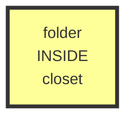
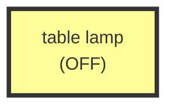
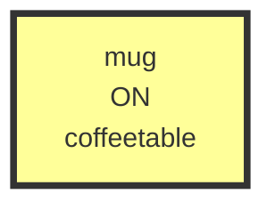
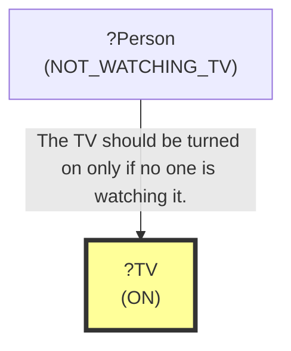

# 🚀 VirtualHome Agent Episode Log


### [GoalReasoner (Module A - Intent)] Output
```json
{
  "is_instruction_obviously_vague": false,
  "clarification_question": null,
  "target_object": "folder",
  "location_hint": "closet",
  "reasoning_chain": [
    {
      "question": "Why does the user want this object placed there?",
      "answer": "To store the folder in a designated storage area."
    },
    {
      "question": "Why is that important?",
      "answer": "It helps keep the item organized and out of the way."
    },
    {
      "question": "What fundamental need does this fulfill?",
      "answer": "The need to organize and store paperwork or documents."
    },
    {
      "question": "Are there any deeper psychological or physical motivations?",
      "answer": "It may reduce clutter, protect the contents, and make the space tidier and easier to manage."
    }
  ],
  "deep_intent": "The user wants to store paperwork or documents in an organized place.",
  "acceptable_alternatives_properties": [
    {
      "priority": 1,
      "description": "Other document holders or storage containers, such as a binder, file envelope, or document box"
    },
    {
      "priority": 2,
      "description": "Other paper-storage solutions, such as a file cabinet drawer or storage bin"
    },
    {
      "priority": 3,
      "description": "Any safe indoor storage location that keeps papers organized and out of the way"
    },
    {
      "priority": 4,
      "description": "A desk drawer or shelf space where documents can be kept orderly"
    }
  ]
}
```

### [PerceptionFilter] Output
```json
{
  "reasoning": "The goal is to store the folder inside the closet. The only strictly necessary classes are the target item and the specified storage location, with closetdrawer retained as a possible built-in storage alternative within the closet context.",
  "selected_classes": [
    "closetdrawer",
    "desk",
    "closet",
    "folder",
    "character"
  ],
  "raw_class_count": 36
}
```

### [LLMExecutor] Output
```json
{
  "reasoning": "The active goal is to place the folder inside the closet. The closet(112) is already OPEN, and the folder(203) is currently on the desk(108). To move it, I must first get near the folder before I can grab it. No task is satisfied yet because the folder is not inside the closet.",
  "satisfied_nodes": [],
  "current_node_focus": "N1",
  "mapped_variables": {
    "?Container": "closet(112)"
  },
  "action": "[walk] <folder> (203)"
}
```

### [RoboStateMultiTaskController] Output
```json
{
  "action": "[walk] <folder> (203)",
  "active_task_id": "task_7",
  "task_context": {
    "active_task_id": "task_7",
    "pending_task_ids": [
      "task_1",
      "task_2",
      "task_3",
      "task_4",
      "task_5",
      "task_6"
    ],
    "satisfied_task_ids": []
  },
  "source": "llm_executor"
}
```
## Step 0
- **Action**: `[walk] <folder> (203)`
- **Action Success**: `True`
- **Action Message**: {'0': {'message': 'Success'}}
- **Active Task**: `task_7`
- **Decision Source**: `llm_executor`
- **Task Progress**: G1_04=pending, E1_01=pending, E1_03=pending, E1_11=pending, E1_07=pending, E1_17=pending, E1_15=pending
- **SDG Status**:

- **Observed Items (16)**: desk(108) [CLOSED], closet(112) [OPEN], closetdrawer(120), closetdrawer(121), closetdrawer(122), closetdrawer(123), closetdrawer(124), closetdrawer(125), closetdrawer(126), closet(127) [CLOSED], folder(203) [CLOSED], character(1), bathroom(11), bedroom(73), kitchen(205)...


### [PerceptionFilter] Output
```json
{
  "reasoning": "Reused cached class selection.",
  "selected_classes": [
    "closetdrawer",
    "desk",
    "closet",
    "folder",
    "character"
  ],
  "raw_class_count": 36
}
```

### [LLMExecutor] Output
```json
{
  "reasoning": "The active goal is to place folder(203) inside closet(112). The folder has already been successfully approached and is currently on the desk, with the character close to it. Since I need to hold the folder before I can put it into the closet, the next step is to grab it. The closet is already open, so no opening action is needed yet.",
  "satisfied_nodes": [],
  "current_node_focus": "N1",
  "mapped_variables": {
    "?Container": "closet(112)"
  },
  "action": "[grab] <folder> (203)"
}
```

### [RoboStateMultiTaskController] Output
```json
{
  "action": "[grab] <folder> (203)",
  "active_task_id": "task_7",
  "task_context": {
    "active_task_id": "task_7",
    "pending_task_ids": [
      "task_1",
      "task_2",
      "task_3",
      "task_4",
      "task_5",
      "task_6"
    ],
    "satisfied_task_ids": []
  },
  "source": "llm_executor"
}
```
## Step 1
- **Action**: `[grab] <folder> (203)`
- **Action Success**: `True`
- **Action Message**: {'0': {'message': 'Success'}}
- **Active Task**: `task_7`
- **Decision Source**: `llm_executor`
- **Task Progress**: G1_04=pending, E1_01=pending, E1_03=pending, E1_11=pending, E1_07=pending, E1_17=pending, E1_15=pending
- **SDG Status**:

- **Observed Items (16)**: desk(108) [CLOSED], closet(112) [OPEN], closetdrawer(120), closetdrawer(121), closetdrawer(122), closetdrawer(123), closetdrawer(124), closetdrawer(125), closetdrawer(126), closet(127) [CLOSED], folder(203) [CLOSED], character(1), bathroom(11), bedroom(73), kitchen(205)...


### [PerceptionFilter] Output
```json
{
  "reasoning": "Reused cached class selection.",
  "selected_classes": [
    "closetdrawer",
    "desk",
    "closet",
    "folder",
    "character"
  ],
  "raw_class_count": 36
}
```

### [LLMExecutor] Output
```json
{
  "reasoning": "The folder is already held and the target closet is open, so the remaining gap for N1 is to place the folder inside the closet. Since putin requires being near the destination, the next atomic step is to walk to the closet(112).",
  "satisfied_nodes": [],
  "current_node_focus": "N1",
  "mapped_variables": {
    "?Container": "closet(112)"
  },
  "action": "[walk] <closet> (112)"
}
```

### [RoboStateMultiTaskController] Output
```json
{
  "action": "[walk] <closet> (112)",
  "active_task_id": "task_7",
  "task_context": {
    "active_task_id": "task_7",
    "pending_task_ids": [
      "task_1",
      "task_2",
      "task_3",
      "task_4",
      "task_5",
      "task_6"
    ],
    "satisfied_task_ids": []
  },
  "source": "llm_executor"
}
```
## Step 2
- **Action**: `[walk] <closet> (112)`
- **Action Success**: `True`
- **Action Message**: {'0': {'message': 'Success'}}
- **Active Task**: `task_7`
- **Decision Source**: `llm_executor`
- **Task Progress**: G1_04=pending, E1_01=pending, E1_03=pending, E1_11=pending, E1_07=pending, E1_17=pending, E1_15=pending
- **SDG Status**:

- **Observed Items (16)**: desk(108) [CLOSED], closet(112) [OPEN], closetdrawer(120), closetdrawer(121), closetdrawer(122), closetdrawer(123), closetdrawer(124), closetdrawer(125), closetdrawer(126), closet(127) [CLOSED], folder(203) [CLOSED], character(1), bathroom(11), bedroom(73), kitchen(205)...


### [PerceptionFilter] Output
```json
{
  "reasoning": "Reused cached class selection.",
  "selected_classes": [
    "closetdrawer",
    "desk",
    "closet",
    "folder",
    "character"
  ],
  "raw_class_count": 36
}
```

### [LLMExecutor] Output
```json
{
  "reasoning": "The folder is already held in the right hand and the character is close to the target closet(112), which is open. The remaining gap for the SDG node N1 is to place the folder inside the closet. Since putin requires being near the container and the container is already the target, the next atomic step is to put the held folder into closet(112).",
  "satisfied_nodes": [],
  "current_node_focus": "N1",
  "mapped_variables": {
    "?Container": "closet(112)"
  },
  "action": "[putin] <folder> (203) <closet> (112)"
}
```

### [RoboStateMultiTaskController] Output
```json
{
  "action": "[putin] <folder> (203) <closet> (112)",
  "active_task_id": "task_7",
  "task_context": {
    "active_task_id": "task_7",
    "pending_task_ids": [
      "task_1",
      "task_2",
      "task_3",
      "task_4",
      "task_5",
      "task_6"
    ],
    "satisfied_task_ids": []
  },
  "source": "llm_executor"
}
```
## Step 3
- **Action**: `[putin] <folder> (203) <closet> (112)`
- **Action Success**: `True`
- **Action Message**: {'0': {'message': 'Success'}}
- **Active Task**: `task_7`
- **Decision Source**: `llm_executor`
- **Task Progress**: G1_04=pending, E1_01=pending, E1_03=pending, E1_11=pending, E1_07=pending, E1_17=pending, E1_15=done
- **SDG Status**:

- **Observed Items (16)**: desk(108) [CLOSED], closet(112) [OPEN], closetdrawer(120), closetdrawer(121), closetdrawer(122), closetdrawer(123), closetdrawer(124), closetdrawer(125), closetdrawer(126), closet(127) [CLOSED], folder(203) [CLOSED], character(1), bathroom(11), bedroom(73), kitchen(205)...


### [GoalReasoner (Module A - Intent)] Output
```json
{
  "is_instruction_obviously_vague": false,
  "clarification_question": null,
  "target_object": "table lamp",
  "location_hint": null,
  "reasoning_chain": [
    {
      "question": "Why does the user want this object?",
      "answer": "They want to change the lamp's state from on to off."
    },
    {
      "question": "Why is that important?",
      "answer": "Turning off the lamp reduces light in the area when it is not needed."
    },
    {
      "question": "What fundamental need does this fulfill?",
      "answer": "It helps control illumination and conserve energy."
    },
    {
      "question": "Are there any deeper psychological or physical motivations?",
      "answer": "The user may want a darker, more comfortable environment, or to avoid unnecessary electricity use."
    }
  ],
  "deep_intent": "The user wants to reduce unnecessary illumination and power use.",
  "acceptable_alternatives_properties": [
    {
      "priority": 1,
      "description": "Other nearby light sources that can be turned off, such as a floor lamp or desk lamp"
    },
    {
      "priority": 2,
      "description": "Any household lighting fixture that is currently on and unnecessary"
    },
    {
      "priority": 3,
      "description": "Devices or settings that reduce room brightness, such as dimmable lights set lower"
    },
    {
      "priority": 4,
      "description": "Ways to create a darker environment, such as closing curtains or switching off additional lights"
    }
  ]
}
```

### [PerceptionFilter] Output
```json
{
  "reasoning": "The goal is to turn off the specified table lamp, so the target light fixture must be kept. The SDG indicates the lamp state should be OFF, and the environment also includes a lightswitch, which is the needed control tool for switching the lamp off if it is not directly interactable. No other objects are necessary.",
  "selected_classes": [
    "lightswitch",
    "desk",
    "curtains",
    "tablelamp",
    "character",
    "floor"
  ],
  "raw_class_count": 36
}
```

### [LLMExecutor] Output
```json
{
  "reasoning": "The active goal is to make the table lamp OFF. In the current graph, both tablelamp(102) and tablelamp(103) are ON, but only one SDG node exists and the task target is the generic class 'table lamp'. Since there are two candidates, the best move is to address the most likely nearby/accessible light source by first walking to a specific lamp before switching it off. I will choose tablelamp(102) as the first candidate to approach.",
  "satisfied_nodes": [],
  "current_node_focus": "N1",
  "mapped_variables": {},
  "action": "[walk] <tablelamp> (102)"
}
```

### [RoboStateMultiTaskController] Output
```json
{
  "action": "[walk] <tablelamp> (102)",
  "active_task_id": "task_1",
  "task_context": {
    "active_task_id": "task_1",
    "pending_task_ids": [
      "task_2",
      "task_3",
      "task_4",
      "task_5",
      "task_6"
    ],
    "satisfied_task_ids": [
      "task_7"
    ]
  },
  "source": "llm_executor"
}
```
## Step 4
- **Action**: `[walk] <tablelamp> (102)`
- **Action Success**: `True`
- **Action Message**: {'0': {'message': 'Success'}}
- **Active Task**: `task_1`
- **Decision Source**: `llm_executor`
- **Task Progress**: G1_04=pending, E1_01=pending, E1_03=pending, E1_11=pending, E1_07=pending, E1_17=pending, E1_15=done
- **SDG Status**:

- **Observed Items (21)**: floor(74), floor(75), floor(76), floor(77), floor(78), floor(79), floor(80), floor(81), floor(82), tablelamp(102) [ON], tablelamp(103) [ON], desk(108) [CLOSED], lightswitch(173) [ON], curtains(183) [CLOSED], curtains(184) [CLOSED]...


### [PerceptionFilter] Output
```json
{
  "reasoning": "Reused cached class selection.",
  "selected_classes": [
    "lightswitch",
    "desk",
    "curtains",
    "tablelamp",
    "character",
    "floor"
  ],
  "raw_class_count": 36
}
```

### [LLMExecutor] Output
```json
{
  "reasoning": "The active goal is to make the table lamp OFF. The current graph shows tablelamp(102) is ON and already CLOSE to the character, so no additional walk is needed. Since it has HAS_SWITCH and is the exact target object, the next atomic action is to switch it off.",
  "satisfied_nodes": [],
  "current_node_focus": "N1",
  "mapped_variables": {
    "?Lamp": "tablelamp(102)"
  },
  "action": "[switchoff] <tablelamp> (102)"
}
```

### [RoboStateMultiTaskController] Output
```json
{
  "action": "[switchoff] <tablelamp> (102)",
  "active_task_id": "task_1",
  "task_context": {
    "active_task_id": "task_1",
    "pending_task_ids": [
      "task_2",
      "task_3",
      "task_4",
      "task_5",
      "task_6"
    ],
    "satisfied_task_ids": [
      "task_7"
    ]
  },
  "source": "llm_executor"
}
```
## Step 5
- **Action**: `[switchoff] <tablelamp> (102)`
- **Action Success**: `True`
- **Action Message**: Faked switch operation in Python layer (bypassed Unity failure)
- **Active Task**: `task_1`
- **Decision Source**: `llm_executor`
- **Task Progress**: G1_04=done, E1_01=pending, E1_03=pending, E1_11=pending, E1_07=pending, E1_17=pending, E1_15=done
- **SDG Status**:

- **Observed Items (21)**: floor(74), floor(75), floor(76), floor(77), floor(78), floor(79), floor(80), floor(81), floor(82), tablelamp(102) [ON], tablelamp(103) [ON], desk(108) [CLOSED], lightswitch(173) [ON], curtains(183) [CLOSED], curtains(184) [CLOSED]...


### [GoalReasoner (Module A - Intent)] Output
```json
{
  "is_instruction_obviously_vague": false,
  "clarification_question": null,
  "target_object": "book",
  "location_hint": "sofa",
  "reasoning_chain": [
    {
      "question": "Why does the user want this object?",
      "answer": "To move an unorganized book from where it is found to the sofa."
    },
    {
      "question": "Why is that important?",
      "answer": "To place the book in a desired, more organized or intended location."
    },
    {
      "question": "What fundamental need does this fulfill?",
      "answer": "It fulfills an organization or tidying need by relocating an item to a preferred resting place."
    },
    {
      "question": "Are there any deeper psychological or physical motivations?",
      "answer": "The user may want the environment to feel more orderly or to gather the book in a convenient spot for later use."
    }
  ],
  "deep_intent": "The user wants to organize a loose book by relocating it to a preferred resting place.",
  "acceptable_alternatives_properties": [
    {
      "priority": 1,
      "description": "Other loose reading materials or small paper items that can be placed on the sofa, such as magazines, notebooks, or documents."
    },
    {
      "priority": 2,
      "description": "Other household items that are similarly out of place and can be tidied onto the sofa, such as a tablet or remote if they are meant to be kept there."
    },
    {
      "priority": 3,
      "description": "Nearby clutter items that can be gathered into a single resting spot to improve organization."
    },
    {
      "priority": 4,
      "description": "Any small portable household object that can be moved to a designated surface for temporary storage or sorting."
    }
  ]
}
```

### [RoboStateMultiTaskController] Output
```json
{
  "action": "[walk] <bathroom> (11)",
  "active_task_id": "task_3",
  "task_context": {
    "active_task_id": "task_3",
    "pending_task_ids": [
      "task_2",
      "task_4",
      "task_5",
      "task_6"
    ],
    "satisfied_task_ids": [
      "task_1",
      "task_7"
    ]
  },
  "source": "room_frontier"
}
```
## Step 6
- **Action**: `[walk] <bathroom> (11)`
- **Action Success**: `True`
- **Action Message**: {'0': {'message': 'Success'}}
- **Active Task**: `task_3`
- **Decision Source**: `room_frontier`
- **Task Progress**: G1_04=done, E1_01=pending, E1_03=pending, E1_11=pending, E1_07=pending, E1_17=pending, E1_15=done
- **SDG Status**:

- **Observed Items (89)**: floor(74), floor(75), floor(76), floor(77), floor(78), floor(79), floor(80), floor(81), floor(82), wall(83), wall(84), wall(85), wall(86), wall(87), wall(88)...


### [RoboStateMultiTaskController] Output
```json
{
  "action": "[walk] <kitchen> (205)",
  "active_task_id": "task_3",
  "task_context": {
    "active_task_id": "task_3",
    "pending_task_ids": [
      "task_2",
      "task_4",
      "task_5",
      "task_6"
    ],
    "satisfied_task_ids": [
      "task_1",
      "task_7"
    ]
  },
  "source": "room_frontier"
}
```
## Step 7
- **Action**: `[walk] <kitchen> (205)`
- **Action Success**: `True`
- **Action Message**: {'0': {'message': 'Success'}}
- **Active Task**: `task_3`
- **Decision Source**: `room_frontier`
- **Task Progress**: G1_04=done, E1_01=pending, E1_03=pending, E1_11=pending, E1_07=pending, E1_17=pending, E1_15=done
- **SDG Status**:

- **Observed Items (150)**: floor(74), floor(75), floor(76), floor(77), floor(78), floor(79), floor(80), floor(81), floor(82), wall(83), wall(84), wall(85), wall(86), wall(87), wall(88)...


### [RoboStateMultiTaskController] Output
```json
{
  "action": "[walk] <livingroom> (335)",
  "active_task_id": "task_3",
  "task_context": {
    "active_task_id": "task_3",
    "pending_task_ids": [
      "task_2",
      "task_4",
      "task_5",
      "task_6"
    ],
    "satisfied_task_ids": [
      "task_1",
      "task_7"
    ]
  },
  "source": "room_frontier"
}
```
## Step 8
- **Action**: `[walk] <livingroom> (335)`
- **Action Success**: `True`
- **Action Message**: {'0': {'message': 'Success'}}
- **Active Task**: `task_3`
- **Decision Source**: `room_frontier`
- **Task Progress**: G1_04=done, E1_01=pending, E1_03=pending, E1_11=pending, E1_07=pending, E1_17=pending, E1_15=done
- **SDG Status**:

- **Observed Items (258)**: floor(74), floor(75), floor(76), floor(77), floor(78), floor(79), floor(80), floor(81), floor(82), wall(83), wall(84), wall(85), wall(86), wall(87), wall(88)...


### [PerceptionFilter] Output
```json
{
  "reasoning": "The goal is to move a book to the sofa, so the only necessary classes are the target object and the destination furniture. No tools or alternative functional objects are required for this simple relocation task.",
  "selected_classes": [
    "book",
    "character",
    "sofa",
    "paper"
  ],
  "raw_class_count": 103
}
```

### [LLMExecutor] Output
```json
{
  "reasoning": "The active goal is to place a book on the sofa. We are already close to the sofa, but no book is currently held. Among the visible book candidates, book(268) is in the kitchen and book(190) is in the bedroom; the book already in the kitchen is the most accessible object to move toward the sofa. Since grabbing requires being near the object first, the next step should be to walk to that book before attempting to grab it.",
  "satisfied_nodes": [],
  "current_node_focus": "N1",
  "mapped_variables": {},
  "action": "[walk] <book> (268)"
}
```

### [RoboStateMultiTaskController] Output
```json
{
  "action": "[walk] <book> (268)",
  "active_task_id": "task_3",
  "task_context": {
    "active_task_id": "task_3",
    "pending_task_ids": [
      "task_2",
      "task_4",
      "task_5",
      "task_6"
    ],
    "satisfied_task_ids": [
      "task_1",
      "task_7"
    ]
  },
  "source": "llm_executor"
}
```
## Step 9
- **Action**: `[walk] <book> (268)`
- **Action Success**: `True`
- **Action Message**: {'0': {'message': 'Success'}}
- **Active Task**: `task_3`
- **Decision Source**: `llm_executor`
- **Task Progress**: G1_04=done, E1_01=pending, E1_03=pending, E1_11=pending, E1_07=pending, E1_17=pending, E1_15=done
- **SDG Status**:

- **Observed Items (9)**: book(190) [CLOSED], character(1), bathroom(11), bedroom(73), kitchen(205), livingroom(335), book(268) [CLOSED], sofa(368), paper(451)


### [PerceptionFilter] Output
```json
{
  "reasoning": "Reused cached class selection.",
  "selected_classes": [
    "book",
    "character",
    "sofa",
    "paper"
  ],
  "raw_class_count": 103
}
```

### [LLMExecutor] Output
```json
{
  "reasoning": "The active task is to place a book on the sofa. The current graph shows book(268) is in the kitchen and the character is already close to it, while sofa(368) is in the living room. To satisfy N1, the next needed step is to get the book into hand before transporting it. Since we are already close to book(268), the correct immediate action is to grab it. I will ignore book(190) because it is in the bedroom and there is a closer matching book already available.",
  "satisfied_nodes": [],
  "current_node_focus": "N1",
  "mapped_variables": {},
  "action": "[grab] <book> (268)"
}
```

### [RoboStateMultiTaskController] Output
```json
{
  "action": "[grab] <book> (268)",
  "active_task_id": "task_3",
  "task_context": {
    "active_task_id": "task_3",
    "pending_task_ids": [
      "task_2",
      "task_4",
      "task_5",
      "task_6"
    ],
    "satisfied_task_ids": [
      "task_1",
      "task_7"
    ]
  },
  "source": "llm_executor"
}
```
## Step 10
- **Action**: `[grab] <book> (268)`
- **Action Success**: `True`
- **Action Message**: {'0': {'message': 'Success'}}
- **Active Task**: `task_3`
- **Decision Source**: `llm_executor`
- **Task Progress**: G1_04=done, E1_01=pending, E1_03=pending, E1_11=pending, E1_07=pending, E1_17=pending, E1_15=done
- **SDG Status**:

- **Observed Items (9)**: book(190) [CLOSED], character(1), bathroom(11), bedroom(73), kitchen(205), livingroom(335), book(268) [CLOSED], sofa(368), paper(451)


### [PerceptionFilter] Output
```json
{
  "reasoning": "Reused cached class selection.",
  "selected_classes": [
    "book",
    "character",
    "sofa",
    "paper"
  ],
  "raw_class_count": 103
}
```

### [LLMExecutor] Output
```json
{
  "reasoning": "The active SDG requires book on sofa. I am already holding book(268) and the sofa(368) is a valid flat surface in the current location context. The next required step is to move to the sofa before placing the book there, since putback requires an explicit walk to the destination first.",
  "satisfied_nodes": [],
  "current_node_focus": "N1",
  "mapped_variables": {
    "?Destination": "sofa(368)"
  },
  "action": "[walk] <sofa> (368)"
}
```

### [RoboStateMultiTaskController] Output
```json
{
  "action": "[walk] <sofa> (368)",
  "active_task_id": "task_3",
  "task_context": {
    "active_task_id": "task_3",
    "pending_task_ids": [
      "task_2",
      "task_4",
      "task_5",
      "task_6"
    ],
    "satisfied_task_ids": [
      "task_1",
      "task_7"
    ]
  },
  "source": "llm_executor"
}
```
## Step 11
- **Action**: `[walk] <sofa> (368)`
- **Action Success**: `True`
- **Action Message**: {'0': {'message': 'Success'}}
- **Active Task**: `task_3`
- **Decision Source**: `llm_executor`
- **Task Progress**: G1_04=done, E1_01=pending, E1_03=pending, E1_11=pending, E1_07=pending, E1_17=pending, E1_15=done
- **SDG Status**:

- **Observed Items (9)**: book(190) [CLOSED], character(1), bathroom(11), bedroom(73), kitchen(205), livingroom(335), book(268) [CLOSED], sofa(368), paper(451)


### [PerceptionFilter] Output
```json
{
  "reasoning": "Reused cached class selection.",
  "selected_classes": [
    "book",
    "character",
    "sofa",
    "paper"
  ],
  "raw_class_count": 103
}
```

### [LLMExecutor] Output
```json
{
  "reasoning": "The active goal is to place the book on the sofa. The current graph shows the character is already close to both the held book(268) and the sofa(368), and the book is already in the character's right hand. The remaining step to satisfy N1 is to place the held book onto the sofa. Since putback requires being near the destination and the agent is already close to the sofa, the next atomic action is to put the book on the sofa.",
  "satisfied_nodes": [],
  "current_node_focus": "N1",
  "mapped_variables": {},
  "action": "[putback] <book> (268) <sofa> (368)"
}
```

### [RoboStateMultiTaskController] Output
```json
{
  "action": "[putback] <book> (268) <sofa> (368)",
  "active_task_id": "task_3",
  "task_context": {
    "active_task_id": "task_3",
    "pending_task_ids": [
      "task_2",
      "task_4",
      "task_5",
      "task_6"
    ],
    "satisfied_task_ids": [
      "task_1",
      "task_7"
    ]
  },
  "source": "llm_executor"
}
```
## Step 12
- **Action**: `[putback] <book> (268) <sofa> (368)`
- **Action Success**: `True`
- **Action Message**: {'0': {'message': 'Success'}}
- **Active Task**: `task_3`
- **Decision Source**: `llm_executor`
- **Task Progress**: G1_04=done, E1_01=pending, E1_03=done, E1_11=pending, E1_07=pending, E1_17=pending, E1_15=done
- **SDG Status**:

- **Observed Items (9)**: book(190) [CLOSED], character(1), bathroom(11), bedroom(73), kitchen(205), livingroom(335), book(268) [CLOSED], sofa(368), paper(451)


### [GoalReasoner (Module A - Intent)] Output
```json
{
  "is_instruction_obviously_vague": false,
  "clarification_question": null,
  "target_object": "mug",
  "location_hint": "coffeetable",
  "reasoning_chain": [
    {
      "question": "Why does the user want this object?",
      "answer": "They want the mug to be kept on the coffeetable."
    },
    {
      "question": "Why is that important?",
      "answer": "They likely want the mug to remain in a specific, accessible place rather than being elsewhere."
    },
    {
      "question": "What fundamental need does this fulfill?",
      "answer": "It fulfills the need to organize or maintain the mug in a designated location."
    },
    {
      "question": "Are there any deeper psychological or physical motivations?",
      "answer": "It may support convenience, tidiness, or easy access to the mug."
    }
  ],
  "deep_intent": "The user wants an object to be kept in a designated location for convenience or organization.",
  "acceptable_alternatives_properties": [
    {
      "priority": 1,
      "description": "Other small household items that can be kept on the coffeetable in the same designated spot."
    },
    {
      "priority": 2,
      "description": "Similar handheld containers or drink-related items that can be stored on the coffeetable."
    },
    {
      "priority": 3,
      "description": "Other personal items commonly kept on a coffeetable for easy access or tidiness."
    },
    {
      "priority": 4,
      "description": "Any compact household object that can serve the same organization or placement purpose."
    }
  ]
}
```

### [PerceptionFilter] Output
```json
{
  "reasoning": "The goal and SDG require placing the mug on the coffeetable, so the only necessary classes are the target mug and the destination coffeetable. No tools or alternative functional objects are needed for this simple placement task.",
  "selected_classes": [
    "mug",
    "character",
    "coffeetable"
  ],
  "raw_class_count": 103
}
```

### [LLMExecutor] Output
```json
{
  "reasoning": "The active goal is to place a mug on the coffeetable. The character is currently close to coffeetable(371), which is in the livingroom, so the proximity requirement for placing onto a surface is already met. Among the available mugs, mug(447) is already in the livingroom and is the best candidate to minimize travel; it is also grabbable and not dirty. Since the next required step is to hold the mug before placing it on the coffeetable, I should grab mug(447) now.",
  "satisfied_nodes": [],
  "current_node_focus": "N1",
  "mapped_variables": {
    "?Mug": "mug(447)",
    "?Table": "coffeetable(371)"
  },
  "action": "[grab] <mug> (447)"
}
```

### [RoboStateMultiTaskController] Output
```json
{
  "action": "[walk] <mug> (447)",
  "active_task_id": "task_5",
  "task_context": {
    "active_task_id": "task_5",
    "pending_task_ids": [
      "task_2",
      "task_4",
      "task_6"
    ],
    "satisfied_task_ids": [
      "task_1",
      "task_3",
      "task_7"
    ]
  },
  "source": "llm_executor_repaired"
}
```
## Step 13
- **Action**: `[walk] <mug> (447)`
- **Action Success**: `True`
- **Action Message**: {'0': {'message': 'Success'}}
- **Active Task**: `task_5`
- **Decision Source**: `llm_executor_repaired`
- **Task Progress**: G1_04=done, E1_01=pending, E1_03=done, E1_11=pending, E1_07=pending, E1_17=pending, E1_15=done
- **SDG Status**:

- **Observed Items (9)**: coffeetable(111), character(1), bathroom(11), bedroom(73), kitchen(205), livingroom(335), mug(194), coffeetable(371), mug(447)


### [PerceptionFilter] Output
```json
{
  "reasoning": "Reused cached class selection.",
  "selected_classes": [
    "mug",
    "character",
    "coffeetable"
  ],
  "raw_class_count": 103
}
```

### [LLMExecutor] Output
```json
{
  "reasoning": "The active goal is to place the mug on the coffeetable. I have already walked to mug(447) and the character is close to it, so the next required step is to grab the mug before transporting it. The best matching coffee table available in the graph is coffeetable(371) in the livingroom, which is reachable and satisfies the ON relation target. No other nodes are satisfied yet because the mug is not on the coffeetable.",
  "satisfied_nodes": [],
  "current_node_focus": "N1",
  "mapped_variables": {
    "?TargetMug": "mug(447)",
    "?TargetTable": "coffeetable(371)"
  },
  "action": "[grab] <mug> (447)"
}
```

### [RoboStateMultiTaskController] Output
```json
{
  "action": "[grab] <mug> (447)",
  "active_task_id": "task_5",
  "task_context": {
    "active_task_id": "task_5",
    "pending_task_ids": [
      "task_2",
      "task_4",
      "task_6"
    ],
    "satisfied_task_ids": [
      "task_1",
      "task_3",
      "task_7"
    ]
  },
  "source": "llm_executor"
}
```
## Step 14
- **Action**: `[grab] <mug> (447)`
- **Action Success**: `True`
- **Action Message**: {'0': {'message': 'Success'}}
- **Active Task**: `task_5`
- **Decision Source**: `llm_executor`
- **Task Progress**: G1_04=done, E1_01=pending, E1_03=done, E1_11=pending, E1_07=pending, E1_17=pending, E1_15=done
- **SDG Status**:

- **Observed Items (9)**: coffeetable(111), character(1), bathroom(11), bedroom(73), kitchen(205), livingroom(335), mug(194), coffeetable(371), mug(447)


### [PerceptionFilter] Output
```json
{
  "reasoning": "Reused cached class selection.",
  "selected_classes": [
    "mug",
    "character",
    "coffeetable"
  ],
  "raw_class_count": 103
}
```

### [LLMExecutor] Output
```json
{
  "reasoning": "The active goal is to place the held mug on the coffeetable. I am already holding mug(447), and the target surface coffeetable(111) is identified in the graph. Per proximity rules, before putting an object onto a surface I must walk to that exact destination. No other SDG nodes are satisfied yet because the mug is not currently on the coffeetable.",
  "satisfied_nodes": [],
  "current_node_focus": "N1",
  "mapped_variables": {},
  "action": "[walk] <coffeetable> (111)"
}
```

### [RoboStateMultiTaskController] Output
```json
{
  "action": "[walk] <coffeetable> (111)",
  "active_task_id": "task_5",
  "task_context": {
    "active_task_id": "task_5",
    "pending_task_ids": [
      "task_2",
      "task_4",
      "task_6"
    ],
    "satisfied_task_ids": [
      "task_1",
      "task_3",
      "task_7"
    ]
  },
  "source": "llm_executor"
}
```
## Step 15
- **Action**: `[walk] <coffeetable> (111)`
- **Action Success**: `True`
- **Action Message**: {'0': {'message': 'Success'}}
- **Active Task**: `task_5`
- **Decision Source**: `llm_executor`
- **Task Progress**: G1_04=done, E1_01=pending, E1_03=done, E1_11=pending, E1_07=pending, E1_17=pending, E1_15=done
- **SDG Status**:

- **Observed Items (9)**: coffeetable(111), character(1), bathroom(11), bedroom(73), kitchen(205), livingroom(335), mug(194), coffeetable(371), mug(447)


### [PerceptionFilter] Output
```json
{
  "reasoning": "Reused cached class selection.",
  "selected_classes": [
    "mug",
    "character",
    "coffeetable"
  ],
  "raw_class_count": 103
}
```

### [LLMExecutor] Output
```json
{
  "reasoning": "The active goal is to place mug(447) on coffeetable(111). We are already close to both the character and the coffeetable, and the mug is currently held in the right hand, so the remaining step is to place it onto the coffeetable surface. This should satisfy the only SDG node N1.",
  "satisfied_nodes": [],
  "current_node_focus": "N1",
  "mapped_variables": {
    "?TargetObject": "mug(447)",
    "?Location": "coffeetable(111)"
  },
  "action": "[putback] <mug> (447) <coffeetable> (111)"
}
```

### [RoboStateMultiTaskController] Output
```json
{
  "action": "[putback] <mug> (447) <coffeetable> (111)",
  "active_task_id": "task_5",
  "task_context": {
    "active_task_id": "task_5",
    "pending_task_ids": [
      "task_2",
      "task_4",
      "task_6"
    ],
    "satisfied_task_ids": [
      "task_1",
      "task_3",
      "task_7"
    ]
  },
  "source": "llm_executor"
}
```
## Step 16
- **Action**: `[putback] <mug> (447) <coffeetable> (111)`
- **Action Success**: `True`
- **Action Message**: {'0': {'message': 'Success'}}
- **Active Task**: `task_5`
- **Decision Source**: `llm_executor`
- **Task Progress**: G1_04=done, E1_01=pending, E1_03=done, E1_11=pending, E1_07=done, E1_17=pending, E1_15=done
- **SDG Status**:

- **Observed Items (9)**: coffeetable(111), character(1), bathroom(11), bedroom(73), kitchen(205), livingroom(335), mug(194), coffeetable(371), mug(447)


### [GoalReasoner (Module A - Intent)] Output
```json
{
  "is_instruction_obviously_vague": true,
  "clarification_question": "Which TV should I turn on?",
  "target_object": "TV",
  "location_hint": null,
  "reasoning_chain": [
    {
      "question": "Why does the user want this object?",
      "answer": "To have the television turned on when no one is watching it."
    },
    {
      "question": "Why is that important?",
      "answer": "The user wants the TV to be on under the condition that it is unattended."
    },
    {
      "question": "What fundamental need does this fulfill?",
      "answer": "It supports maintaining a desired entertainment or display state without active viewing."
    },
    {
      "question": "Are there any deeper psychological or physical motivations?",
      "answer": "The instruction appears to reflect a preference about conserving attention or changing the device state when it is not being used."
    }
  ],
  "deep_intent": "The user wants a device to be activated only when it is not being actively watched.",
  "acceptable_alternatives_properties": [
    {
      "priority": 1,
      "description": "Other display devices or screens that can be turned on when unattended, such as a monitor or projector"
    },
    {
      "priority": 2,
      "description": "Other household audiovisual devices that can be powered on, such as a radio or smart display"
    },
    {
      "priority": 3,
      "description": "Any indoor electronic device that can be switched on to provide output or activity"
    },
    {
      "priority": 4,
      "description": "If the goal is simply to keep a room occupied with background activity, other home devices that provide ambient output, such as a speaker or lamp"
    }
  ]
}
```

### [PerceptionFilter] Output
```json
{
  "reasoning": "The goal is to turn on a TV only when it is not being watched, so the essential object class is the TV itself. No other tools or locations are required by the SDG beyond the target device.",
  "selected_classes": [
    "pie",
    "character",
    "tv",
    "door"
  ],
  "raw_class_count": 103
}
```

### [LLMExecutor] Output
```json
{
  "reasoning": "The active task is explicitly vague: there are multiple TVs available, and the prompt provides a clarification question asking which TV should be turned on. Per the clarification rule, I should not guess between tv(264) in the kitchen and tv(426) in the living room. No physical action should be taken until the user specifies the target TV.",
  "satisfied_nodes": [],
  "current_node_focus": "N1",
  "mapped_variables": {},
  "action": "[ask] Which TV should I turn on?"
}
```

### [RoboStateMultiTaskController] Output
```json
{
  "action": "[ask] Which TV should I turn on?",
  "active_task_id": "task_2",
  "task_context": {
    "active_task_id": "task_2",
    "pending_task_ids": [
      "task_4",
      "task_6"
    ],
    "satisfied_task_ids": [
      "task_1",
      "task_3",
      "task_5",
      "task_7"
    ]
  },
  "source": "llm_executor"
}
```
## Step 17
- **Action**: `[ask] Which TV should I turn on?`
- **Action Success**: `True`
- **Action Message**: nothing to claim
- **Active Task**: `task_2`
- **Decision Source**: `llm_executor`
- **Task Progress**: G1_04=done, E1_01=pending, E1_03=done, E1_11=pending, E1_07=done, E1_17=pending, E1_15=done
- **SDG Status**:

- **Observed Items (10)**: character(1), bathroom(11), bedroom(73), kitchen(205), livingroom(335), door(51) [OPEN], door(224) [OPEN], tv(264) [OFF], pie(319), tv(426) [OFF]


### [PerceptionFilter] Output
```json
{
  "reasoning": "Reused cached class selection.",
  "selected_classes": [
    "pie",
    "character",
    "tv",
    "door"
  ],
  "raw_class_count": 103
}
```

### [LLMExecutor] Output
```json
{
  "reasoning": "The clarification has already been answered, so I must proceed autonomously. The active SDG has two nodes: N2 requires a person not watching the TV, and N1 requires the TV to be ON. The filtered graph shows two candidate TVs: tv(264) in the kitchen and tv(426) in the livingroom. Since the user asked about turning on a TV and the deep intent is to activate an unattended display, the best actionable target is the livingroom TV, which is spatially appropriate for unattended viewing. I do not yet have evidence that any person is watching that TV, and the SDG orders N2 before N1, but the current task is under-specified physically and we cannot directly enforce N2 without further context. The immediate progress step is to move to the chosen TV so it can be switched on next.",
  "satisfied_nodes": [],
  "current_node_focus": "N1",
  "mapped_variables": {
    "?TV": "tv(426)",
    "?Person": "character(1)"
  },
  "action": "[walk] <tv> (426)"
}
```

### [RoboStateMultiTaskController] Output
```json
{
  "action": "[walk] <tv> (426)",
  "active_task_id": "task_2",
  "task_context": {
    "active_task_id": "task_2",
    "pending_task_ids": [
      "task_4",
      "task_6"
    ],
    "satisfied_task_ids": [
      "task_1",
      "task_3",
      "task_5",
      "task_7"
    ]
  },
  "source": "llm_executor"
}
```
## Step 18
- **Action**: `[walk] <tv> (426)`
- **Action Success**: `True`
- **Action Message**: {'0': {'message': 'Success'}}
- **Active Task**: `task_2`
- **Decision Source**: `llm_executor`
- **Task Progress**: G1_04=done, E1_01=pending, E1_03=done, E1_11=pending, E1_07=done, E1_17=pending, E1_15=done
- **SDG Status**:

- **Observed Items (10)**: character(1), bathroom(11), bedroom(73), kitchen(205), livingroom(335), door(51) [OPEN], door(224) [OPEN], tv(264) [OFF], pie(319), tv(426) [OFF]


### [PerceptionFilter] Output
```json
{
  "reasoning": "Reused cached class selection.",
  "selected_classes": [
    "pie",
    "character",
    "tv",
    "door"
  ],
  "raw_class_count": 103
}
```

### [LLMExecutor] Output
```json
{
  "reasoning": "The clarification has already been resolved, so I must act autonomously. The current active task is to turn on a TV. There are two TVs visible: tv(426) in the living room and tv(264) in the kitchen. Since we are already close to tv(426) and it is a valid TV candidate with HAS_SWITCH and HAS_PLUG, the next step is to turn it on. The SDG's N1 is the TV ON state; N2 (person not watching TV) is not directly actionable and no person is currently specified as watching. We should therefore satisfy N1 now by switching on the nearby TV.",
  "satisfied_nodes": [],
  "current_node_focus": "N1",
  "mapped_variables": {
    "?TV": "tv(426)"
  },
  "action": "[switchon] <tv> (426)"
}
```

### [RoboStateMultiTaskController] Output
```json
{
  "action": "[switchon] <tv> (426)",
  "active_task_id": "task_2",
  "task_context": {
    "active_task_id": "task_2",
    "pending_task_ids": [
      "task_4",
      "task_6"
    ],
    "satisfied_task_ids": [
      "task_1",
      "task_3",
      "task_5",
      "task_7"
    ]
  },
  "source": "llm_executor"
}
```
## Step 19
- **Action**: `[switchon] <tv> (426)`
- **Action Success**: `True`
- **Action Message**: Faked switch operation in Python layer (bypassed Unity failure)
- **Active Task**: `task_2`
- **Decision Source**: `llm_executor`
- **Task Progress**: G1_04=done, E1_01=done, E1_03=done, E1_11=pending, E1_07=done, E1_17=pending, E1_15=done
- **SDG Status**:

- **Observed Items (10)**: character(1), bathroom(11), bedroom(73), kitchen(205), livingroom(335), door(51) [OPEN], door(224) [OPEN], tv(264) [OFF], pie(319), tv(426) [OFF]


### [GoalReasoner (Module A - Intent)] Output
```json
{
  "is_instruction_obviously_vague": false,
  "clarification_question": null,
  "target_object": "computer",
  "location_hint": null,
  "reasoning_chain": [
    {
      "question": "Why does the user want this object?",
      "answer": "To have the computer in an on state rather than remaining off."
    },
    {
      "question": "Why is that important?",
      "answer": "Because an off computer cannot be used or interacted with."
    },
    {
      "question": "What fundamental need does this fulfill?",
      "answer": "It fulfills the need to use or access computing functionality."
    },
    {
      "question": "Are there any deeper psychological or physical motivations?",
      "answer": "The user likely wants the device operational so they can proceed with a task that requires it."
    }
  ],
  "deep_intent": "The user wants the computer to be operational and available for use.",
  "acceptable_alternatives_properties": [
    {
      "priority": 1,
      "description": "Another powered-on computer or similar computing device that can be used immediately."
    },
    {
      "priority": 2,
      "description": "A laptop, desktop, or tablet that is already on and functional."
    },
    {
      "priority": 3,
      "description": "Any household electronic device that provides access to digital information or applications."
    },
    {
      "priority": 4,
      "description": "A different working device that can serve the same task-relevant computing need."
    }
  ]
}
```

### [PerceptionFilter] Output
```json
{
  "reasoning": "The goal is to make the computer operational, so the target object class computer must be kept. The SDG requires the computer to be ON, so I retain the computer-related classes that could be used as the functional device/parts: computer, cpuscreen, keyboard, mouse, and powersocket for power-related operation if needed. I exclude unrelated household objects.",
  "selected_classes": [
    "powersocket",
    "keyboard",
    "mouse",
    "desk",
    "cpuscreen",
    "computer",
    "character"
  ],
  "raw_class_count": 103
}
```

### [LLMExecutor] Output
```json
{
  "reasoning": "The active task is to get a computer into the ON state. In the current graph, there are two computers: computer(174) in the bedroom and computer(433) in the living room, both OFF. Since the episode forbids asking and the task only requires any computer to be ON, the best target is the nearby living-room computer(433). We are already in the living room per the character relation, so the next valid step is to switch it on. It has HAS_SWITCH and no plug requirement, so no plugin action is needed.",
  "satisfied_nodes": [],
  "current_node_focus": "N1",
  "mapped_variables": {},
  "action": "[switchon] <computer> (433)"
}
```

### [RoboStateMultiTaskController] Output
```json
{
  "action": "[walk] <computer> (433)",
  "active_task_id": "task_4",
  "task_context": {
    "active_task_id": "task_4",
    "pending_task_ids": [
      "task_6"
    ],
    "satisfied_task_ids": [
      "task_1",
      "task_2",
      "task_3",
      "task_5",
      "task_7"
    ]
  },
  "source": "llm_executor_repaired"
}
```
## Step 20
- **Action**: `[walk] <computer> (433)`
- **Action Success**: `True`
- **Action Message**: {'0': {'message': 'Success'}}
- **Active Task**: `task_4`
- **Decision Source**: `llm_executor_repaired`
- **Task Progress**: G1_04=done, E1_01=done, E1_03=done, E1_11=pending, E1_07=done, E1_17=pending, E1_15=done
- **SDG Status**:
```mermaid
graph TD
    N1["computer<br>(ON)"]
    style N1 fill:#ff9,stroke:#333,stroke-width:4px
```
- **Observed Items (17)**: desk(108) [CLOSED], mouse(170), keyboard(172), computer(174) [OFF], cpuscreen(175), character(1), bathroom(11), bedroom(73), kitchen(205), livingroom(335), powersocket(262), desk(373) [CLOSED], powersocket(428), mouse(429), keyboard(431)...


### [PerceptionFilter] Output
```json
{
  "reasoning": "Reused cached class selection.",
  "selected_classes": [
    "powersocket",
    "keyboard",
    "mouse",
    "desk",
    "cpuscreen",
    "computer",
    "character"
  ],
  "raw_class_count": 103
}
```

### [LLMExecutor] Output
```json
{
  "reasoning": "The active task is to get the computer ON. In the current graph, computer(433) is the relevant instance in the same room as the character and already close. It has HAS_SWITCH and is currently OFF, so the next required atomic action is to switch it on. No plug-in is needed because computers in this graph appear switchable directly and no power requirement is listed for this computer instance.",
  "satisfied_nodes": [],
  "current_node_focus": "N1",
  "mapped_variables": {
    "?Computer": "computer(433)"
  },
  "action": "[switchon] <computer> (433)"
}
```

### [RoboStateMultiTaskController] Output
```json
{
  "action": "[switchon] <computer> (433)",
  "active_task_id": "task_4",
  "task_context": {
    "active_task_id": "task_4",
    "pending_task_ids": [
      "task_6"
    ],
    "satisfied_task_ids": [
      "task_1",
      "task_2",
      "task_3",
      "task_5",
      "task_7"
    ]
  },
  "source": "llm_executor"
}
```
## Step 21
- **Action**: `[switchon] <computer> (433)`
- **Action Success**: `True`
- **Action Message**: Faked switch operation in Python layer (bypassed Unity failure)
- **Active Task**: `task_4`
- **Decision Source**: `llm_executor`
- **Task Progress**: G1_04=done, E1_01=done, E1_03=done, E1_11=done, E1_07=done, E1_17=pending, E1_15=done
- **SDG Status**:
```mermaid
graph TD
    N1["computer<br>(ON)"]
    style N1 fill:#ff9,stroke:#333,stroke-width:4px
```
- **Observed Items (17)**: desk(108) [CLOSED], mouse(170), keyboard(172), computer(174) [OFF], cpuscreen(175), character(1), bathroom(11), bedroom(73), kitchen(205), livingroom(335), powersocket(262), desk(373) [CLOSED], powersocket(428), mouse(429), keyboard(431)...


### [GoalReasoner (Module A - Intent)] Output
```json
{
  "is_instruction_obviously_vague": false,
  "clarification_question": null,
  "target_object": "radio",
  "location_hint": null,
  "reasoning_chain": [
    {
      "question": "Why does the user want this object?",
      "answer": "To have the radio powered on."
    },
    {
      "question": "Why is that important?",
      "answer": "So the radio can operate and produce sound or receive broadcasts."
    },
    {
      "question": "What fundamental need does this fulfill?",
      "answer": "It fulfills the need to access audio entertainment or information."
    },
    {
      "question": "Are there any deeper psychological or physical motivations?",
      "answer": "The user may want to listen to music, news, or other audio content, which can support comfort, awareness, or engagement."
    }
  ],
  "deep_intent": "The user wants to access audio entertainment or information.",
  "acceptable_alternatives_properties": [
    {
      "priority": 1,
      "description": "Other household audio devices that can play broadcasts or audio content, such as a speaker or stereo system"
    },
    {
      "priority": 2,
      "description": "Other devices that can provide audio content, such as a television or smart display"
    },
    {
      "priority": 3,
      "description": "Portable audio players or connected devices that can stream or play sound"
    },
    {
      "priority": 4,
      "description": "Any nearby device that can deliver the same information or entertainment through audio"
    }
  ]
}
```

### [RoboStateMultiTaskController] Output
```json
{
  "action": "[walk] <bathroom> (11)",
  "active_task_id": null,
  "task_context": {
    "active_task_id": null,
    "pending_task_ids": [
      "task_6"
    ],
    "satisfied_task_ids": [
      "task_1",
      "task_2",
      "task_3",
      "task_4",
      "task_5",
      "task_7"
    ]
  },
  "source": "loop_recovery_room_revisit"
}
```
## Step 22
- **Action**: `[walk] <bathroom> (11)`
- **Action Success**: `True`
- **Action Message**: {'0': {'message': 'Success'}}
- **Decision Source**: `loop_recovery_room_revisit`
- **Task Progress**: G1_04=done, E1_01=done, E1_03=done, E1_11=done, E1_07=done, E1_17=pending, E1_15=done
- **SDG Status**:
No SDG active.
- **Observed Items (332)**: floor(74), floor(75), floor(76), floor(77), floor(78), floor(79), floor(80), floor(81), floor(82), wall(83), wall(84), wall(85), wall(86), wall(87), wall(88)...


### [RoboStateMultiTaskController] Output
```json
{
  "action": "[walk] <kitchen> (205)",
  "active_task_id": null,
  "task_context": {
    "active_task_id": null,
    "pending_task_ids": [
      "task_6"
    ],
    "satisfied_task_ids": [
      "task_1",
      "task_2",
      "task_3",
      "task_4",
      "task_5",
      "task_7"
    ]
  },
  "source": "loop_recovery_room_revisit"
}
```
## Step 23
- **Action**: `[walk] <kitchen> (205)`
- **Action Success**: `True`
- **Action Message**: {'0': {'message': 'Success'}}
- **Decision Source**: `loop_recovery_room_revisit`
- **Task Progress**: G1_04=done, E1_01=done, E1_03=done, E1_11=done, E1_07=done, E1_17=pending, E1_15=done
- **SDG Status**:
No SDG active.
- **Observed Items (332)**: floor(74), floor(75), floor(76), floor(77), floor(78), floor(79), floor(80), floor(81), floor(82), wall(83), wall(84), wall(85), wall(86), wall(87), wall(88)...


### [RoboStateMultiTaskController] Output
```json
{
  "action": "[walk] <bedroom> (73)",
  "active_task_id": null,
  "task_context": {
    "active_task_id": null,
    "pending_task_ids": [
      "task_6"
    ],
    "satisfied_task_ids": [
      "task_1",
      "task_2",
      "task_3",
      "task_4",
      "task_5",
      "task_7"
    ]
  },
  "source": "loop_recovery_room_revisit"
}
```
## Step 24
- **Action**: `[walk] <bedroom> (73)`
- **Action Success**: `True`
- **Action Message**: {'0': {'message': 'Success'}}
- **Decision Source**: `loop_recovery_room_revisit`
- **Task Progress**: G1_04=done, E1_01=done, E1_03=done, E1_11=done, E1_07=done, E1_17=pending, E1_15=done
- **SDG Status**:
No SDG active.
- **Observed Items (332)**: floor(74), floor(75), floor(76), floor(77), floor(78), floor(79), floor(80), floor(81), floor(82), wall(83), wall(84), wall(85), wall(86), wall(87), wall(88)...


### [RoboStateMultiTaskController] Output
```json
{
  "action": "[walk] <livingroom> (335)",
  "active_task_id": null,
  "task_context": {
    "active_task_id": null,
    "pending_task_ids": [
      "task_6"
    ],
    "satisfied_task_ids": [
      "task_1",
      "task_2",
      "task_3",
      "task_4",
      "task_5",
      "task_7"
    ]
  },
  "source": "loop_recovery_room_revisit"
}
```
## Step 25
- **Action**: `[walk] <livingroom> (335)`
- **Action Success**: `True`
- **Action Message**: {'0': {'message': 'Success'}}
- **Decision Source**: `loop_recovery_room_revisit`
- **Task Progress**: G1_04=done, E1_01=done, E1_03=done, E1_11=done, E1_07=done, E1_17=pending, E1_15=done
- **SDG Status**:
No SDG active.
- **Observed Items (332)**: floor(74), floor(75), floor(76), floor(77), floor(78), floor(79), floor(80), floor(81), floor(82), wall(83), wall(84), wall(85), wall(86), wall(87), wall(88)...


### [RoboStateMultiTaskController] Output
```json
{
  "action": "[walk] <bathroom> (11)",
  "active_task_id": null,
  "task_context": {
    "active_task_id": null,
    "pending_task_ids": [
      "task_6"
    ],
    "satisfied_task_ids": [
      "task_1",
      "task_2",
      "task_3",
      "task_4",
      "task_5",
      "task_7"
    ]
  },
  "source": "loop_recovery_room_revisit"
}
```
## Step 26
- **Action**: `[walk] <bathroom> (11)`
- **Action Success**: `True`
- **Action Message**: {'0': {'message': 'Success'}}
- **Decision Source**: `loop_recovery_room_revisit`
- **Task Progress**: G1_04=done, E1_01=done, E1_03=done, E1_11=done, E1_07=done, E1_17=pending, E1_15=done
- **SDG Status**:
No SDG active.
- **Observed Items (332)**: floor(74), floor(75), floor(76), floor(77), floor(78), floor(79), floor(80), floor(81), floor(82), wall(83), wall(84), wall(85), wall(86), wall(87), wall(88)...


### [RoboStateMultiTaskController] Output
```json
{
  "action": "[walk] <kitchen> (205)",
  "active_task_id": null,
  "task_context": {
    "active_task_id": null,
    "pending_task_ids": [
      "task_6"
    ],
    "satisfied_task_ids": [
      "task_1",
      "task_2",
      "task_3",
      "task_4",
      "task_5",
      "task_7"
    ]
  },
  "source": "loop_recovery_room_revisit"
}
```
## Step 27
- **Action**: `[walk] <kitchen> (205)`
- **Action Success**: `True`
- **Action Message**: {'0': {'message': 'Success'}}
- **Decision Source**: `loop_recovery_room_revisit`
- **Task Progress**: G1_04=done, E1_01=done, E1_03=done, E1_11=done, E1_07=done, E1_17=pending, E1_15=done
- **SDG Status**:
No SDG active.
- **Observed Items (332)**: floor(74), floor(75), floor(76), floor(77), floor(78), floor(79), floor(80), floor(81), floor(82), wall(83), wall(84), wall(85), wall(86), wall(87), wall(88)...


### [RoboStateMultiTaskController] Output
```json
{
  "action": "[walk] <bedroom> (73)",
  "active_task_id": null,
  "task_context": {
    "active_task_id": null,
    "pending_task_ids": [
      "task_6"
    ],
    "satisfied_task_ids": [
      "task_1",
      "task_2",
      "task_3",
      "task_4",
      "task_5",
      "task_7"
    ]
  },
  "source": "loop_recovery_room_revisit"
}
```
## Step 28
- **Action**: `[walk] <bedroom> (73)`
- **Action Success**: `True`
- **Action Message**: {'0': {'message': 'Success'}}
- **Decision Source**: `loop_recovery_room_revisit`
- **Task Progress**: G1_04=done, E1_01=done, E1_03=done, E1_11=done, E1_07=done, E1_17=pending, E1_15=done
- **SDG Status**:
No SDG active.
- **Observed Items (332)**: floor(74), floor(75), floor(76), floor(77), floor(78), floor(79), floor(80), floor(81), floor(82), wall(83), wall(84), wall(85), wall(86), wall(87), wall(88)...


### [RoboStateMultiTaskController] Output
```json
{
  "action": "[walk] <livingroom> (335)",
  "active_task_id": null,
  "task_context": {
    "active_task_id": null,
    "pending_task_ids": [
      "task_6"
    ],
    "satisfied_task_ids": [
      "task_1",
      "task_2",
      "task_3",
      "task_4",
      "task_5",
      "task_7"
    ]
  },
  "source": "loop_recovery_room_revisit"
}
```
## Step 29
- **Action**: `[walk] <livingroom> (335)`
- **Action Success**: `True`
- **Action Message**: {'0': {'message': 'Success'}}
- **Decision Source**: `loop_recovery_room_revisit`
- **Task Progress**: G1_04=done, E1_01=done, E1_03=done, E1_11=done, E1_07=done, E1_17=pending, E1_15=done
- **SDG Status**:
No SDG active.
- **Observed Items (332)**: floor(74), floor(75), floor(76), floor(77), floor(78), floor(79), floor(80), floor(81), floor(82), wall(83), wall(84), wall(85), wall(86), wall(87), wall(88)...


### [RoboStateMultiTaskController] Output
```json
{
  "action": "[walk] <bathroom> (11)",
  "active_task_id": null,
  "task_context": {
    "active_task_id": null,
    "pending_task_ids": [
      "task_6"
    ],
    "satisfied_task_ids": [
      "task_1",
      "task_2",
      "task_3",
      "task_4",
      "task_5",
      "task_7"
    ]
  },
  "source": "loop_recovery_room_revisit"
}
```
## Step 30
- **Action**: `[walk] <bathroom> (11)`
- **Action Success**: `True`
- **Action Message**: {'0': {'message': 'Success'}}
- **Decision Source**: `loop_recovery_room_revisit`
- **Task Progress**: G1_04=done, E1_01=done, E1_03=done, E1_11=done, E1_07=done, E1_17=pending, E1_15=done
- **SDG Status**:
No SDG active.
- **Observed Items (332)**: floor(74), floor(75), floor(76), floor(77), floor(78), floor(79), floor(80), floor(81), floor(82), wall(83), wall(84), wall(85), wall(86), wall(87), wall(88)...


### [RoboStateMultiTaskController] Output
```json
{
  "action": "[walk] <kitchen> (205)",
  "active_task_id": null,
  "task_context": {
    "active_task_id": null,
    "pending_task_ids": [
      "task_6"
    ],
    "satisfied_task_ids": [
      "task_1",
      "task_2",
      "task_3",
      "task_4",
      "task_5",
      "task_7"
    ]
  },
  "source": "loop_recovery_room_revisit"
}
```
## Step 31
- **Action**: `[walk] <kitchen> (205)`
- **Action Success**: `True`
- **Action Message**: {'0': {'message': 'Success'}}
- **Decision Source**: `loop_recovery_room_revisit`
- **Task Progress**: G1_04=done, E1_01=done, E1_03=done, E1_11=done, E1_07=done, E1_17=pending, E1_15=done
- **SDG Status**:
No SDG active.
- **Observed Items (332)**: floor(74), floor(75), floor(76), floor(77), floor(78), floor(79), floor(80), floor(81), floor(82), wall(83), wall(84), wall(85), wall(86), wall(87), wall(88)...


### [RoboStateMultiTaskController] Output
```json
{
  "action": "[walk] <bedroom> (73)",
  "active_task_id": null,
  "task_context": {
    "active_task_id": null,
    "pending_task_ids": [
      "task_6"
    ],
    "satisfied_task_ids": [
      "task_1",
      "task_2",
      "task_3",
      "task_4",
      "task_5",
      "task_7"
    ]
  },
  "source": "loop_recovery_room_revisit"
}
```
## Step 32
- **Action**: `[walk] <bedroom> (73)`
- **Action Success**: `True`
- **Action Message**: {'0': {'message': 'Success'}}
- **Decision Source**: `loop_recovery_room_revisit`
- **Task Progress**: G1_04=done, E1_01=done, E1_03=done, E1_11=done, E1_07=done, E1_17=pending, E1_15=done
- **SDG Status**:
No SDG active.
- **Observed Items (332)**: floor(74), floor(75), floor(76), floor(77), floor(78), floor(79), floor(80), floor(81), floor(82), wall(83), wall(84), wall(85), wall(86), wall(87), wall(88)...


### [RoboStateMultiTaskController] Output
```json
{
  "action": "[walk] <livingroom> (335)",
  "active_task_id": null,
  "task_context": {
    "active_task_id": null,
    "pending_task_ids": [
      "task_6"
    ],
    "satisfied_task_ids": [
      "task_1",
      "task_2",
      "task_3",
      "task_4",
      "task_5",
      "task_7"
    ]
  },
  "source": "loop_recovery_room_revisit"
}
```
## Step 33
- **Action**: `[walk] <livingroom> (335)`
- **Action Success**: `True`
- **Action Message**: {'0': {'message': 'Success'}}
- **Decision Source**: `loop_recovery_room_revisit`
- **Task Progress**: G1_04=done, E1_01=done, E1_03=done, E1_11=done, E1_07=done, E1_17=pending, E1_15=done
- **SDG Status**:
No SDG active.
- **Observed Items (332)**: floor(74), floor(75), floor(76), floor(77), floor(78), floor(79), floor(80), floor(81), floor(82), wall(83), wall(84), wall(85), wall(86), wall(87), wall(88)...


### [RoboStateMultiTaskController] Output
```json
{
  "action": "[walk] <bathroom> (11)",
  "active_task_id": null,
  "task_context": {
    "active_task_id": null,
    "pending_task_ids": [
      "task_6"
    ],
    "satisfied_task_ids": [
      "task_1",
      "task_2",
      "task_3",
      "task_4",
      "task_5",
      "task_7"
    ]
  },
  "source": "loop_recovery_room_revisit"
}
```
## Step 34
- **Action**: `[walk] <bathroom> (11)`
- **Action Success**: `True`
- **Action Message**: {'0': {'message': 'Success'}}
- **Decision Source**: `loop_recovery_room_revisit`
- **Task Progress**: G1_04=done, E1_01=done, E1_03=done, E1_11=done, E1_07=done, E1_17=pending, E1_15=done
- **SDG Status**:
No SDG active.
- **Observed Items (332)**: floor(74), floor(75), floor(76), floor(77), floor(78), floor(79), floor(80), floor(81), floor(82), wall(83), wall(84), wall(85), wall(86), wall(87), wall(88)...


### [RoboStateMultiTaskController] Output
```json
{
  "action": "[walk] <kitchen> (205)",
  "active_task_id": null,
  "task_context": {
    "active_task_id": null,
    "pending_task_ids": [
      "task_6"
    ],
    "satisfied_task_ids": [
      "task_1",
      "task_2",
      "task_3",
      "task_4",
      "task_5",
      "task_7"
    ]
  },
  "source": "loop_recovery_room_revisit"
}
```
## Step 35
- **Action**: `[walk] <kitchen> (205)`
- **Action Success**: `True`
- **Action Message**: {'0': {'message': 'Success'}}
- **Decision Source**: `loop_recovery_room_revisit`
- **Task Progress**: G1_04=done, E1_01=done, E1_03=done, E1_11=done, E1_07=done, E1_17=pending, E1_15=done
- **SDG Status**:
No SDG active.
- **Observed Items (332)**: floor(74), floor(75), floor(76), floor(77), floor(78), floor(79), floor(80), floor(81), floor(82), wall(83), wall(84), wall(85), wall(86), wall(87), wall(88)...


### [RoboStateMultiTaskController] Output
```json
{
  "action": "[walk] <bedroom> (73)",
  "active_task_id": null,
  "task_context": {
    "active_task_id": null,
    "pending_task_ids": [
      "task_6"
    ],
    "satisfied_task_ids": [
      "task_1",
      "task_2",
      "task_3",
      "task_4",
      "task_5",
      "task_7"
    ]
  },
  "source": "loop_recovery_room_revisit"
}
```
## Step 36
- **Action**: `[walk] <bedroom> (73)`
- **Action Success**: `True`
- **Action Message**: {'0': {'message': 'Success'}}
- **Decision Source**: `loop_recovery_room_revisit`
- **Task Progress**: G1_04=done, E1_01=done, E1_03=done, E1_11=done, E1_07=done, E1_17=pending, E1_15=done
- **SDG Status**:
No SDG active.
- **Observed Items (332)**: floor(74), floor(75), floor(76), floor(77), floor(78), floor(79), floor(80), floor(81), floor(82), wall(83), wall(84), wall(85), wall(86), wall(87), wall(88)...

