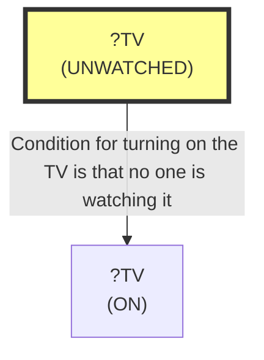
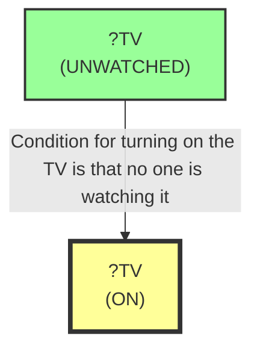
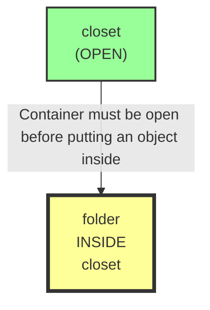
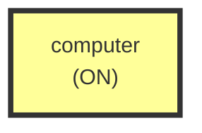

# 🚀 VirtualHome Agent Episode Log


### [GoalReasoner (Module A - Intent)] Output
```json
{
  "is_instruction_obviously_vague": false,
  "clarification_question": null,
  "target_object": "TV",
  "location_hint": null,
  "reasoning_chain": [
    {
      "question": "Why does the user want this object to be turned on?",
      "answer": "Because they want the television to be active when nobody is watching it."
    },
    {
      "question": "Why is that important?",
      "answer": "It may be intended to keep the TV ready for use, maintain a desired state in the room, or support some ongoing viewing or ambient activity."
    },
    {
      "question": "What fundamental need does this fulfill?",
      "answer": "It supports maintaining a desired entertainment or ambient audiovisual state."
    },
    {
      "question": "Are there any deeper psychological or physical motivations?",
      "answer": "The motivation may be to ensure the TV is on when unattended, possibly for convenience, habit, or to create background sound or visual presence."
    }
  ],
  "deep_intent": "The user wants to maintain an active audiovisual state in the room when it is unattended.",
  "acceptable_alternatives_properties": [
    {
      "priority": 1,
      "description": "Other household devices that can provide similar audiovisual output, such as a monitor or streaming display"
    },
    {
      "priority": 2,
      "description": "Other indoor entertainment devices that can remain active, such as a radio or speaker system"
    },
    {
      "priority": 3,
      "description": "Other devices that create background media presence, such as a tablet or smart display"
    },
    {
      "priority": 4,
      "description": "Any indoor device that can provide ambient sound or light, if the goal is simply to avoid a silent or inactive room"
    }
  ]
}
```

### [PerceptionFilter] Output
```json
{
  "reasoning": "The goal is to turn the TV on while it is unwatched. The only required target object is the TV itself; no additional tools or locations are needed from the observed list for this state goal.",
  "selected_classes": [
    "tv",
    "door",
    "character"
  ],
  "raw_class_count": 55
}
```

### [LLMExecutor] Output
```json
{
  "reasoning": "The active task is to turn the TV on while it is unwatched. The filtered graph shows the TV is currently OFF in the kitchen, and the character is also in the kitchen. Since the TV has HAS_SWITCH and HAS_PLUG, the next prerequisite is to ensure it is unwatched; the graph does not show any watcher other than the character, who is in the same room but not necessarily watching. However, because turning it on requires being near it and the SDG indicates UNWATCHED must precede ON, the best immediate action is to move to the TV to establish proximity for the next interaction and verify/continue toward the condition.",
  "satisfied_nodes": [],
  "current_node_focus": "N2",
  "mapped_variables": {
    "?TV": "tv(264)"
  },
  "action": "[walk] <tv> (264)"
}
```

### [RoboStateMultiTaskController] Output
```json
{
  "action": "[walk] <tv> (264)",
  "active_task_id": "task_2",
  "task_context": {
    "active_task_id": "task_2",
    "pending_task_ids": [
      "task_1",
      "task_3",
      "task_4",
      "task_5"
    ],
    "satisfied_task_ids": []
  },
  "source": "llm_executor"
}
```
## Step 0
- **Action**: `[walk] <tv> (264)`
- **Action Success**: `True`
- **Action Message**: {'0': {'message': 'Success'}}
- **Active Task**: `task_2`
- **Decision Source**: `llm_executor`
- **Task Progress**: G1_05=pending, E1_01=pending, E1_03=pending, E1_11=pending, E1_15=pending
- **SDG Status**:

- **Observed Items (7)**: door(224) [OPEN], tv(264) [OFF], character(1), bathroom(11), bedroom(73), kitchen(205), livingroom(335)


### [PerceptionFilter] Output
```json
{
  "reasoning": "Reused cached class selection.",
  "selected_classes": [
    "tv",
    "door",
    "character"
  ],
  "raw_class_count": 55
}
```

### [LLMExecutor] Output
```json
{
  "reasoning": "The active task is to turn the TV on while it is unwatched. The current graph shows the TV is OFF and the character is already CLOSE to the TV in the kitchen, so the proximity requirement is satisfied. There is no indication that anyone is watching it, so the prerequisite N2 (UNWATCHED) is effectively satisfied from the current state. The next step is to switch the TV on to satisfy N1.",
  "satisfied_nodes": [
    "N2"
  ],
  "current_node_focus": "N1",
  "mapped_variables": {
    "?TV": "tv(264)"
  },
  "action": "[switchon] <tv> (264)"
}
```

### [RoboStateMultiTaskController] Output
```json
{
  "action": "[switchon] <tv> (264)",
  "active_task_id": "task_2",
  "task_context": {
    "active_task_id": "task_2",
    "pending_task_ids": [
      "task_1",
      "task_3",
      "task_4",
      "task_5"
    ],
    "satisfied_task_ids": []
  },
  "source": "llm_executor"
}
```
## Step 1
- **Action**: `[switchon] <tv> (264)`
- **Action Success**: `True`
- **Action Message**: Faked switch operation in Python layer (bypassed Unity failure)
- **Active Task**: `task_2`
- **Decision Source**: `llm_executor`
- **Task Progress**: G1_05=pending, E1_01=done, E1_03=pending, E1_11=pending, E1_15=pending
- **SDG Status**:

- **Observed Items (7)**: door(224) [OPEN], tv(264) [OFF], character(1), bathroom(11), bedroom(73), kitchen(205), livingroom(335)


### [GoalReasoner (Module A - Intent)] Output
```json
{
  "is_instruction_obviously_vague": true,
  "clarification_question": "Which specific book should I move, and what do you mean by \"unorganized\"—should I move any book that is not on a shelf, or only a book that is out of place in a particular area?",
  "target_object": "book",
  "location_hint": "sofa",
  "reasoning_chain": [
    {
      "question": "Why does the user want this object?",
      "answer": "To move a book from an undesired or disorganized location to the sofa."
    },
    {
      "question": "Why is that important?",
      "answer": "The user likely wants the book to be relocated into a preferred place and the space where it was found to be less cluttered."
    },
    {
      "question": "What fundamental need does this fulfill?",
      "answer": "It supports organization of the living space by placing an item in a desired resting location."
    },
    {
      "question": "Are there any deeper psychological or physical motivations?",
      "answer": "The user may want to tidy the environment, reduce visual clutter, or make the item easier to access later."
    }
  ],
  "deep_intent": "The user wants to organize a space by relocating an item to a preferred resting place.",
  "acceptable_alternatives_properties": [
    {
      "priority": 1,
      "description": "Other small household items that are out of place and can be moved to the sofa as part of tidying."
    },
    {
      "priority": 2,
      "description": "Other portable reading materials, such as magazines or notebooks, if the specific item is unavailable."
    },
    {
      "priority": 3,
      "description": "Other lightweight clutter items that can be temporarily gathered in one place to improve organization."
    },
    {
      "priority": 4,
      "description": "Different household objects that help reduce clutter, such as papers or remote controls, if the goal is simply tidying the area."
    }
  ]
}
```

### [RoboStateMultiTaskController] Output
```json
{
  "action": "[walk] <bathroom> (11)",
  "active_task_id": "task_3",
  "task_context": {
    "active_task_id": "task_3",
    "pending_task_ids": [
      "task_1",
      "task_4",
      "task_5"
    ],
    "satisfied_task_ids": [
      "task_2"
    ]
  },
  "source": "room_frontier"
}
```
## Step 2
- **Action**: `[walk] <bathroom> (11)`
- **Action Success**: `True`
- **Action Message**: {'0': {'message': 'Success'}}
- **Active Task**: `task_3`
- **Decision Source**: `room_frontier`
- **Task Progress**: G1_05=pending, E1_01=done, E1_03=pending, E1_11=pending, E1_15=pending
- **SDG Status**:

- **Observed Items (113)**: floor(206), floor(207), floor(208), floor(209), floor(210), floor(211), wall(212), wall(213), wall(214), wall(215), wall(216), wall(217), ceiling(218), ceiling(219), ceiling(220)...


### [RoboStateMultiTaskController] Output
```json
{
  "action": "[walk] <bedroom> (73)",
  "active_task_id": "task_3",
  "task_context": {
    "active_task_id": "task_3",
    "pending_task_ids": [
      "task_1",
      "task_4",
      "task_5"
    ],
    "satisfied_task_ids": [
      "task_2"
    ]
  },
  "source": "room_frontier"
}
```
## Step 3
- **Action**: `[walk] <bedroom> (73)`
- **Action Success**: `True`
- **Action Message**: {'0': {'message': 'Success'}}
- **Active Task**: `task_3`
- **Decision Source**: `room_frontier`
- **Task Progress**: G1_05=pending, E1_01=done, E1_03=pending, E1_11=pending, E1_15=pending
- **SDG Status**:

- **Observed Items (174)**: floor(206), floor(207), floor(208), floor(209), floor(210), floor(211), wall(212), wall(213), wall(214), wall(215), wall(216), wall(217), ceiling(218), ceiling(219), ceiling(220)...


### [RoboStateMultiTaskController] Output
```json
{
  "action": "[walk] <livingroom> (335)",
  "active_task_id": "task_3",
  "task_context": {
    "active_task_id": "task_3",
    "pending_task_ids": [
      "task_1",
      "task_4",
      "task_5"
    ],
    "satisfied_task_ids": [
      "task_2"
    ]
  },
  "source": "room_frontier"
}
```
## Step 4
- **Action**: `[walk] <livingroom> (335)`
- **Action Success**: `True`
- **Action Message**: {'0': {'message': 'Success'}}
- **Active Task**: `task_3`
- **Decision Source**: `room_frontier`
- **Task Progress**: G1_05=pending, E1_01=done, E1_03=pending, E1_11=pending, E1_15=pending
- **SDG Status**:

- **Observed Items (258)**: floor(206), floor(207), floor(208), floor(209), floor(210), floor(211), wall(212), wall(213), wall(214), wall(215), wall(216), wall(217), ceiling(218), ceiling(219), ceiling(220)...


### [PerceptionFilter] Output
```json
{
  "reasoning": "The goal and SDG require moving a book onto the sofa, so the only strictly necessary classes are the target object and the destination location. No extra tools or backups are needed for a simple relocation task.",
  "selected_classes": [
    "sofa",
    "character",
    "book",
    "paper"
  ],
  "raw_class_count": 103
}
```

### [LLMExecutor] Output
```json
{
  "reasoning": "The active instruction is explicitly vague: the user asks to move a book to the sofa but also asks what counts as \"unorganized.\" Per the clarification rule, I should not guess which book to move or which exact interpretation of the task is intended. No physical action should be taken until the user clarifies the target book and the selection criterion.",
  "satisfied_nodes": [],
  "current_node_focus": "N1",
  "mapped_variables": {},
  "action": "[ask] Which specific book should I move, and what do you mean by \"unorganized\"—should I move any book that is not on a shelf, or only a book that is out of place in a particular area?"
}
```

### [RoboStateMultiTaskController] Output
```json
{
  "action": "[ask] Which specific book should I move, and what do you mean by \"unorganized\"—should I move any book that is not on a shelf, or only a book that is out of place in a particular area?",
  "active_task_id": "task_3",
  "task_context": {
    "active_task_id": "task_3",
    "pending_task_ids": [
      "task_1",
      "task_4",
      "task_5"
    ],
    "satisfied_task_ids": [
      "task_2"
    ]
  },
  "source": "llm_executor"
}
```
## Step 5
- **Action**: `[ask] Which specific book should I move, and what do you mean by "unorganized"—should I move any book that is not on a shelf, or only a book that is out of place in a particular area?`
- **Action Success**: `True`
- **Action Message**: nothing to claim
- **Active Task**: `task_3`
- **Decision Source**: `llm_executor`
- **Task Progress**: G1_05=pending, E1_01=done, E1_03=pending, E1_11=pending, E1_15=pending
- **SDG Status**:

- **Observed Items (9)**: book(268) [CLOSED], character(1), bathroom(11), bedroom(73), kitchen(205), livingroom(335), book(190) [CLOSED], sofa(368), paper(451)


### [PerceptionFilter] Output
```json
{
  "reasoning": "Reused cached class selection.",
  "selected_classes": [
    "sofa",
    "character",
    "book",
    "paper"
  ],
  "raw_class_count": 103
}
```

### [LLMExecutor] Output
```json
{
  "reasoning": "The active SDG requires a book to be ON the sofa. The clarification was already handled, so I must act autonomously. In the current graph, the character is already close to the sofa in the living room, but the candidate books are elsewhere: book(190) is in the bedroom and book(268) is in the kitchen. To satisfy the goal, the first necessary step is to go to one of the books so it can be picked up before carrying it to the sofa. Book(190) is the closest/most accessible candidate because it is in a directly listed room and is a valid book object.",
  "satisfied_nodes": [],
  "current_node_focus": "N1",
  "mapped_variables": {},
  "action": "[walk] <book> (190)"
}
```

### [RoboStateMultiTaskController] Output
```json
{
  "action": "[walk] <book> (190)",
  "active_task_id": "task_3",
  "task_context": {
    "active_task_id": "task_3",
    "pending_task_ids": [
      "task_1",
      "task_4",
      "task_5"
    ],
    "satisfied_task_ids": [
      "task_2"
    ]
  },
  "source": "llm_executor"
}
```
## Step 6
- **Action**: `[walk] <book> (190)`
- **Action Success**: `True`
- **Action Message**: {'0': {'message': 'Success'}}
- **Active Task**: `task_3`
- **Decision Source**: `llm_executor`
- **Task Progress**: G1_05=pending, E1_01=done, E1_03=pending, E1_11=pending, E1_15=pending
- **SDG Status**:

- **Observed Items (9)**: book(268) [CLOSED], character(1), bathroom(11), bedroom(73), kitchen(205), livingroom(335), book(190) [CLOSED], sofa(368), paper(451)


### [PerceptionFilter] Output
```json
{
  "reasoning": "Reused cached class selection.",
  "selected_classes": [
    "sofa",
    "character",
    "book",
    "paper"
  ],
  "raw_class_count": 103
}
```

### [LLMExecutor] Output
```json
{
  "reasoning": "The active SDG requires a book to be ON the sofa. The current graph shows book(190) is the nearest valid book candidate: it is close to the character and in the bedroom, while the sofa(368) is in the livingroom and is the required surface. Since I am already close to book(190) from the previous step, the next atomic action should be to grab it before transporting it to the sofa.",
  "satisfied_nodes": [],
  "current_node_focus": "N1",
  "mapped_variables": {
    "?Book": "book(190)",
    "?Sofa": "sofa(368)"
  },
  "action": "[grab] <book> (190)"
}
```

### [RoboStateMultiTaskController] Output
```json
{
  "action": "[grab] <book> (190)",
  "active_task_id": "task_3",
  "task_context": {
    "active_task_id": "task_3",
    "pending_task_ids": [
      "task_1",
      "task_4",
      "task_5"
    ],
    "satisfied_task_ids": [
      "task_2"
    ]
  },
  "source": "llm_executor"
}
```
## Step 7
- **Action**: `[grab] <book> (190)`
- **Action Success**: `True`
- **Action Message**: {'0': {'message': 'Success'}}
- **Active Task**: `task_3`
- **Decision Source**: `llm_executor`
- **Task Progress**: G1_05=pending, E1_01=done, E1_03=pending, E1_11=pending, E1_15=pending
- **SDG Status**:

- **Observed Items (9)**: book(268) [CLOSED], character(1), bathroom(11), bedroom(73), kitchen(205), livingroom(335), book(190) [CLOSED], sofa(368), paper(451)


### [PerceptionFilter] Output
```json
{
  "reasoning": "Reused cached class selection.",
  "selected_classes": [
    "sofa",
    "character",
    "book",
    "paper"
  ],
  "raw_class_count": 103
}
```

### [LLMExecutor] Output
```json
{
  "reasoning": "The active goal is to have a book ON the sofa. I am already holding book(190), and the sofa(368) is available and close in the livingroom. Since placing onto a surface requires being near the surface, the next step should be to walk to the sofa before any putback action. The held book matches the target object type, so it is the correct item to place.",
  "satisfied_nodes": [],
  "current_node_focus": "N1",
  "mapped_variables": {
    "?TargetBook": "book(190)",
    "?Surface": "sofa(368)"
  },
  "action": "[walk] <sofa> (368)"
}
```

### [RoboStateMultiTaskController] Output
```json
{
  "action": "[walk] <sofa> (368)",
  "active_task_id": "task_3",
  "task_context": {
    "active_task_id": "task_3",
    "pending_task_ids": [
      "task_1",
      "task_4",
      "task_5"
    ],
    "satisfied_task_ids": [
      "task_2"
    ]
  },
  "source": "llm_executor"
}
```
## Step 8
- **Action**: `[walk] <sofa> (368)`
- **Action Success**: `True`
- **Action Message**: {'0': {'message': 'Success'}}
- **Active Task**: `task_3`
- **Decision Source**: `llm_executor`
- **Task Progress**: G1_05=pending, E1_01=done, E1_03=pending, E1_11=pending, E1_15=pending
- **SDG Status**:

- **Observed Items (9)**: book(268) [CLOSED], character(1), bathroom(11), bedroom(73), kitchen(205), livingroom(335), book(190) [CLOSED], sofa(368), paper(451)


### [PerceptionFilter] Output
```json
{
  "reasoning": "Reused cached class selection.",
  "selected_classes": [
    "sofa",
    "character",
    "book",
    "paper"
  ],
  "raw_class_count": 103
}
```

### [LLMExecutor] Output
```json
{
  "reasoning": "The active SDG requires a book to be ON the sofa. I am already close to the sofa, and I am currently holding book(190), which is not yet placed on the sofa. The sofa is a flat surface, so the correct next step is to put the held book onto it.",
  "satisfied_nodes": [],
  "current_node_focus": "N1",
  "mapped_variables": {},
  "action": "[putback] <book> (190) <sofa> (368)"
}
```

### [RoboStateMultiTaskController] Output
```json
{
  "action": "[putback] <book> (190) <sofa> (368)",
  "active_task_id": "task_3",
  "task_context": {
    "active_task_id": "task_3",
    "pending_task_ids": [
      "task_1",
      "task_4",
      "task_5"
    ],
    "satisfied_task_ids": [
      "task_2"
    ]
  },
  "source": "llm_executor"
}
```
## Step 9
- **Action**: `[putback] <book> (190) <sofa> (368)`
- **Action Success**: `True`
- **Action Message**: {'0': {'message': 'Success'}}
- **Active Task**: `task_3`
- **Decision Source**: `llm_executor`
- **Task Progress**: G1_05=pending, E1_01=done, E1_03=done, E1_11=pending, E1_15=pending
- **SDG Status**:

- **Observed Items (9)**: book(268) [CLOSED], character(1), bathroom(11), bedroom(73), kitchen(205), livingroom(335), book(190) [CLOSED], sofa(368), paper(451)


### [GoalReasoner (Module A - Intent)] Output
```json
{
  "is_instruction_obviously_vague": false,
  "clarification_question": null,
  "target_object": "folder",
  "location_hint": "closet",
  "reasoning_chain": [
    {
      "question": "Why does the user want this object?",
      "answer": "To place the folder away in a storage location."
    },
    {
      "question": "Why is that important?",
      "answer": "To organize or store the item in a designated indoor place."
    },
    {
      "question": "What fundamental need does this fulfill?",
      "answer": "It fulfills the need to put an item away for storage or tidiness."
    },
    {
      "question": "Are there any deeper psychological or physical motivations?",
      "answer": "The user may want to reduce clutter, keep the item accessible for later, or maintain an orderly space."
    }
  ],
  "deep_intent": "The user wants to store an item in an indoor storage location and reduce clutter.",
  "acceptable_alternatives_properties": [
    {
      "priority": 1,
      "description": "Other flat paper organizers or document holders that can be stored in a closet."
    },
    {
      "priority": 2,
      "description": "Other similar paper-based office items such as binders, envelopes, or notebooks."
    },
    {
      "priority": 3,
      "description": "Small household items that are normally kept in storage to tidy a room."
    },
    {
      "priority": 4,
      "description": "Any portable item that can be safely put away to organize the space."
    }
  ]
}
```

### [PerceptionFilter] Output
```json
{
  "reasoning": "The goal is to store the folder in the closet, so the only necessary classes are the target object and the required location/container. The SDG also requires the closet to be open before placing the folder inside.",
  "selected_classes": [
    "book",
    "character",
    "folder",
    "door",
    "closet",
    "paper"
  ],
  "raw_class_count": 103
}
```

### [LLMExecutor] Output
```json
{
  "reasoning": "The active goal is to place a folder inside an open closet. In the current graph, closet(112) is already OPEN and is the best matching target container in the bedroom. The folder to use should be the nearby portable folder(453) in the livingroom, since it is currently accessible and not part of satisfied tasks. To proceed toward INSIDE(folder, closet), the next required step is to get near the folder before grabbing it; no action on the closet is needed yet because it's already open.",
  "satisfied_nodes": [
    "N2"
  ],
  "current_node_focus": "N1",
  "mapped_variables": {
    "?Container": "closet(112)",
    "?Folder": "folder(453)"
  },
  "action": "[walk] <folder> (453)"
}
```

### [RoboStateMultiTaskController] Output
```json
{
  "action": "[walk] <folder> (453)",
  "active_task_id": "task_5",
  "task_context": {
    "active_task_id": "task_5",
    "pending_task_ids": [
      "task_1",
      "task_4"
    ],
    "satisfied_task_ids": [
      "task_2",
      "task_3"
    ]
  },
  "source": "llm_executor"
}
```
## Step 10
- **Action**: `[walk] <folder> (453)`
- **Action Success**: `True`
- **Action Message**: {'0': {'message': 'Success'}}
- **Active Task**: `task_5`
- **Decision Source**: `llm_executor`
- **Task Progress**: G1_05=pending, E1_01=done, E1_03=done, E1_11=pending, E1_15=pending
- **SDG Status**:

- **Observed Items (15)**: door(224) [OPEN], book(268) [CLOSED], character(1), bathroom(11), bedroom(73), kitchen(205), livingroom(335), door(51) [OPEN], closet(112) [OPEN], closet(127) [CLOSED], book(190) [CLOSED], folder(203) [CLOSED], closet(374) [CLOSED], paper(451), folder(453) [CLOSED]


### [PerceptionFilter] Output
```json
{
  "reasoning": "Reused cached class selection.",
  "selected_classes": [
    "book",
    "character",
    "folder",
    "door",
    "closet",
    "paper"
  ],
  "raw_class_count": 103
}
```

### [LLMExecutor] Output
```json
{
  "reasoning": "Active task is to store the folder inside a closet. The current graph shows folder(453) is already close to the character in the living room, while closet(112) is open but located in the bedroom. Since putin requires being near the destination container, and the folder must be placed inside a closet, the next necessary step is to walk to the open closet(112). N2 (closet OPEN) is already satisfied, and N1 is not yet satisfied because the folder is not inside any closet.",
  "satisfied_nodes": [
    "N2"
  ],
  "current_node_focus": "N1",
  "mapped_variables": {
    "?Container": "closet(112)"
  },
  "action": "[walk] <closet> (112)"
}
```

### [RoboStateMultiTaskController] Output
```json
{
  "action": "[walk] <closet> (112)",
  "active_task_id": "task_5",
  "task_context": {
    "active_task_id": "task_5",
    "pending_task_ids": [
      "task_1",
      "task_4"
    ],
    "satisfied_task_ids": [
      "task_2",
      "task_3"
    ]
  },
  "source": "llm_executor"
}
```
## Step 11
- **Action**: `[walk] <closet> (112)`
- **Action Success**: `True`
- **Action Message**: {'0': {'message': 'Success'}}
- **Active Task**: `task_5`
- **Decision Source**: `llm_executor`
- **Task Progress**: G1_05=pending, E1_01=done, E1_03=done, E1_11=pending, E1_15=pending
- **SDG Status**:

- **Observed Items (15)**: door(224) [OPEN], book(268) [CLOSED], character(1), bathroom(11), bedroom(73), kitchen(205), livingroom(335), door(51) [OPEN], closet(112) [OPEN], closet(127) [CLOSED], book(190) [CLOSED], folder(203) [CLOSED], closet(374) [CLOSED], paper(451), folder(453) [CLOSED]


### [PerceptionFilter] Output
```json
{
  "reasoning": "Reused cached class selection.",
  "selected_classes": [
    "book",
    "character",
    "folder",
    "door",
    "closet",
    "paper"
  ],
  "raw_class_count": 103
}
```

### [LLMExecutor] Output
```json
{
  "reasoning": "The active goal is to place a folder inside closet(112). The closet is already OPEN in the current graph, and the robot is already CLOSE to closet(112). The folder that best matches the target is folder(203) in the bedroom, since it is a folder and not part of satisfied tasks. The next required step toward N1 is to get the folder into hand; since I am not yet holding it, I should first move to the folder before grabbing it.",
  "satisfied_nodes": [
    "N2"
  ],
  "current_node_focus": "N1",
  "mapped_variables": {
    "?Container": "closet(112)"
  },
  "action": "[walk] <folder> (203)"
}
```

### [RoboStateMultiTaskController] Output
```json
{
  "action": "[walk] <folder> (203)",
  "active_task_id": "task_5",
  "task_context": {
    "active_task_id": "task_5",
    "pending_task_ids": [
      "task_1",
      "task_4"
    ],
    "satisfied_task_ids": [
      "task_2",
      "task_3"
    ]
  },
  "source": "llm_executor"
}
```
## Step 12
- **Action**: `[walk] <folder> (203)`
- **Action Success**: `True`
- **Action Message**: {'0': {'message': 'Success'}}
- **Active Task**: `task_5`
- **Decision Source**: `llm_executor`
- **Task Progress**: G1_05=pending, E1_01=done, E1_03=done, E1_11=pending, E1_15=pending
- **SDG Status**:

- **Observed Items (15)**: door(224) [OPEN], book(268) [CLOSED], character(1), bathroom(11), bedroom(73), kitchen(205), livingroom(335), door(51) [OPEN], closet(112) [OPEN], closet(127) [CLOSED], book(190) [CLOSED], folder(203) [CLOSED], closet(374) [CLOSED], paper(451), folder(453) [CLOSED]


### [PerceptionFilter] Output
```json
{
  "reasoning": "Reused cached class selection.",
  "selected_classes": [
    "book",
    "character",
    "folder",
    "door",
    "closet",
    "paper"
  ],
  "raw_class_count": 103
}
```

### [LLMExecutor] Output
```json
{
  "reasoning": "The active task is to put the folder inside the closet. The best matched target folder is folder(203), which is already in the bedroom and close to the character. The closet(112) is open, satisfying the SDG prerequisite N2. Since the folder is not yet held and I cannot put it in from across the room, the next required step is to walk directly to folder(203) before attempting to grab it.",
  "satisfied_nodes": [
    "N2"
  ],
  "current_node_focus": "N1",
  "mapped_variables": {
    "?Container": "closet(112)",
    "?Item": "folder(203)"
  },
  "action": "[walk] <folder> (203)"
}
```

### [RoboStateMultiTaskController] Output
```json
{
  "action": "[walk] <folder> (203)",
  "active_task_id": "task_5",
  "task_context": {
    "active_task_id": "task_5",
    "pending_task_ids": [
      "task_1",
      "task_4"
    ],
    "satisfied_task_ids": [
      "task_2",
      "task_3"
    ]
  },
  "source": "llm_executor"
}
```
## Step 13
- **Action**: `[walk] <folder> (203)`
- **Action Success**: `True`
- **Action Message**: {'0': {'message': 'Success'}}
- **Active Task**: `task_5`
- **Decision Source**: `llm_executor`
- **Task Progress**: G1_05=pending, E1_01=done, E1_03=done, E1_11=pending, E1_15=pending
- **SDG Status**:

- **Observed Items (15)**: door(224) [OPEN], book(268) [CLOSED], character(1), bathroom(11), bedroom(73), kitchen(205), livingroom(335), door(51) [OPEN], closet(112) [OPEN], closet(127) [CLOSED], book(190) [CLOSED], folder(203) [CLOSED], closet(374) [CLOSED], paper(451), folder(453) [CLOSED]


### [PerceptionFilter] Output
```json
{
  "reasoning": "Reused cached class selection.",
  "selected_classes": [
    "book",
    "character",
    "folder",
    "door",
    "closet",
    "paper"
  ],
  "raw_class_count": 103
}
```

### [LLMExecutor] Output
```json
{
  "reasoning": "The active goal is to place folder(203) inside closet(112), and the closet is already OPEN, satisfying N2. Folder(203) is the correct target object in the bedroom, while the robot is currently close to it. To proceed toward N1, the next required physical step is to grab the folder before it can be carried to the closet.",
  "satisfied_nodes": [
    "N2"
  ],
  "current_node_focus": "N1",
  "mapped_variables": {
    "?Container": "closet(112)"
  },
  "action": "[grab] <folder> (203)"
}
```

### [RoboStateMultiTaskController] Output
```json
{
  "action": "[grab] <folder> (203)",
  "active_task_id": "task_5",
  "task_context": {
    "active_task_id": "task_5",
    "pending_task_ids": [
      "task_1",
      "task_4"
    ],
    "satisfied_task_ids": [
      "task_2",
      "task_3"
    ]
  },
  "source": "llm_executor"
}
```
## Step 14
- **Action**: `[grab] <folder> (203)`
- **Action Success**: `True`
- **Action Message**: {'0': {'message': 'Success'}}
- **Active Task**: `task_5`
- **Decision Source**: `llm_executor`
- **Task Progress**: G1_05=pending, E1_01=done, E1_03=done, E1_11=pending, E1_15=pending
- **SDG Status**:

- **Observed Items (15)**: door(224) [OPEN], book(268) [CLOSED], character(1), bathroom(11), bedroom(73), kitchen(205), livingroom(335), door(51) [OPEN], closet(112) [OPEN], closet(127) [CLOSED], book(190) [CLOSED], folder(203) [CLOSED], closet(374) [CLOSED], paper(451), folder(453) [CLOSED]


### [PerceptionFilter] Output
```json
{
  "reasoning": "Reused cached class selection.",
  "selected_classes": [
    "book",
    "character",
    "folder",
    "door",
    "closet",
    "paper"
  ],
  "raw_class_count": 103
}
```

### [LLMExecutor] Output
```json
{
  "reasoning": "The active task is to place the held folder(203) inside closet(112). The closet(112) is already OPEN, so the remaining state gap is to move the held folder to the closet and put it inside. I must explicitly walk to the destination before putin, and the folder is already in hand, so the next atomic step is to walk to the open closet.",
  "satisfied_nodes": [
    "N2"
  ],
  "current_node_focus": "N1",
  "mapped_variables": {
    "?Container": "closet(112)"
  },
  "action": "[walk] <closet> (112)"
}
```

### [RoboStateMultiTaskController] Output
```json
{
  "action": "[walk] <closet> (112)",
  "active_task_id": "task_5",
  "task_context": {
    "active_task_id": "task_5",
    "pending_task_ids": [
      "task_1",
      "task_4"
    ],
    "satisfied_task_ids": [
      "task_2",
      "task_3"
    ]
  },
  "source": "llm_executor"
}
```
## Step 15
- **Action**: `[walk] <closet> (112)`
- **Action Success**: `True`
- **Action Message**: {'0': {'message': 'Success'}}
- **Active Task**: `task_5`
- **Decision Source**: `llm_executor`
- **Task Progress**: G1_05=pending, E1_01=done, E1_03=done, E1_11=pending, E1_15=pending
- **SDG Status**:

- **Observed Items (15)**: door(224) [OPEN], book(268) [CLOSED], character(1), bathroom(11), bedroom(73), kitchen(205), livingroom(335), door(51) [OPEN], closet(112) [OPEN], closet(127) [CLOSED], book(190) [CLOSED], folder(203) [CLOSED], closet(374) [CLOSED], paper(451), folder(453) [CLOSED]


### [PerceptionFilter] Output
```json
{
  "reasoning": "Reused cached class selection.",
  "selected_classes": [
    "book",
    "character",
    "folder",
    "door",
    "closet",
    "paper"
  ],
  "raw_class_count": 103
}
```

### [LLMExecutor] Output
```json
{
  "reasoning": "The active goal is to place the held folder(203) inside closet(112). The closet is already OPEN in the current graph, and the character is CLOSE to both the folder and the closet. Since the folder is already in hand and the destination container is open, the next required step is to put the folder into the closet. This should satisfy N1; N2 is already satisfied.",
  "satisfied_nodes": [
    "N2"
  ],
  "current_node_focus": "N1",
  "mapped_variables": {
    "?Container": "closet(112)"
  },
  "action": "[putin] <folder> (203) <closet> (112)"
}
```

### [RoboStateMultiTaskController] Output
```json
{
  "action": "[putin] <folder> (203) <closet> (112)",
  "active_task_id": "task_5",
  "task_context": {
    "active_task_id": "task_5",
    "pending_task_ids": [
      "task_1",
      "task_4"
    ],
    "satisfied_task_ids": [
      "task_2",
      "task_3"
    ]
  },
  "source": "llm_executor"
}
```
## Step 16
- **Action**: `[putin] <folder> (203) <closet> (112)`
- **Action Success**: `True`
- **Action Message**: {'0': {'message': 'Success'}}
- **Active Task**: `task_5`
- **Decision Source**: `llm_executor`
- **Task Progress**: G1_05=pending, E1_01=done, E1_03=done, E1_11=pending, E1_15=done
- **SDG Status**:

- **Observed Items (15)**: door(224) [OPEN], book(268) [CLOSED], character(1), bathroom(11), bedroom(73), kitchen(205), livingroom(335), door(51) [OPEN], closet(112) [OPEN], closet(127) [CLOSED], book(190) [CLOSED], folder(203) [CLOSED], closet(374) [CLOSED], paper(451), folder(453) [CLOSED]


### [GoalReasoner (Module A - Intent)] Output
```json
{
  "is_instruction_obviously_vague": false,
  "clarification_question": null,
  "target_object": "cup",
  "location_hint": "cabinet",
  "reasoning_chain": [
    {
      "question": "Why does the user want this object?",
      "answer": "To have the cup emptied and stored away in the cabinet."
    },
    {
      "question": "Why is that important?",
      "answer": "To remove the water from the cup and put the cup in its proper storage place."
    },
    {
      "question": "What fundamental need does this fulfill?",
      "answer": "It fulfills the need to tidy up and organize the cup while clearing any liquid from it."
    },
    {
      "question": "Are there any deeper psychological or physical motivations?",
      "answer": "The user likely wants to reduce clutter and leave the cup ready for storage or later use."
    }
  ],
  "deep_intent": "The user wants to empty a container and store it away neatly.",
  "acceptable_alternatives_properties": [
    {
      "priority": 1,
      "description": "Other drinkware or small containers that can be emptied and stored, such as a mug, glass, or small bowl"
    },
    {
      "priority": 2,
      "description": "Similar kitchen containers that can be dried and put away, such as a tumbler or measuring cup"
    },
    {
      "priority": 3,
      "description": "Any clean, empty household container suitable for cabinet storage"
    },
    {
      "priority": 4,
      "description": "Other items that help organize kitchen storage, such as lids or small dishes that can be put away neatly"
    }
  ]
}
```

### [GoalReasoner (Module A - Intent)] Output
```json
{
  "is_instruction_obviously_vague": false,
  "clarification_question": null,
  "target_object": "computer",
  "location_hint": null,
  "reasoning_chain": [
    {
      "question": "Why does the user want this object?",
      "answer": "To have the computer powered on and available for use."
    },
    {
      "question": "Why is that important?",
      "answer": "Because a powered-off computer cannot perform tasks or be interacted with."
    },
    {
      "question": "What fundamental need does this fulfill?",
      "answer": "It fulfills the need to access and use a computing device."
    },
    {
      "question": "Are there any deeper psychological or physical motivations?",
      "answer": "The user likely wants to continue an activity that requires the computer to be on, such as work, communication, or entertainment."
    }
  ],
  "deep_intent": "The user wants to enable access to a functioning computing device.",
  "acceptable_alternatives_properties": [
    {
      "priority": 1,
      "description": "Another powered computing device that can serve the same immediate purpose, such as a laptop or desktop already turned on."
    },
    {
      "priority": 2,
      "description": "A different electronic device capable of completing the same task, such as a tablet or all-in-one computer."
    },
    {
      "priority": 3,
      "description": "Any available device that provides digital access to the needed function, such as a shared household computer."
    },
    {
      "priority": 4,
      "description": "A non-computing workaround that still supports the user's task, if applicable, such as using a phone for basic communication or web access."
    }
  ]
}
```

### [PerceptionFilter] Output
```json
{
  "reasoning": "The goal is to have a computer powered on and usable. The only strictly necessary object class in view that directly satisfies this is the computer itself; no separate tool is required by the SDG. Possible alternative computing devices are not needed unless the main target is unavailable, but the task explicitly requires the computer state ON.",
  "selected_classes": [
    "computer",
    "character",
    "desk"
  ],
  "raw_class_count": 103
}
```

### [LLMExecutor] Output
```json
{
  "reasoning": "The active task is to power on a computer. Two candidate computers are available, both currently OFF. The closest/most directly relevant object in the current bedroom context is computer(174), and it has a switch, so the next step is to move to it before switching it on. Since interaction requires proximity and the previous action was unrelated, the correct next atomic action is to walk to the bedroom computer.",
  "satisfied_nodes": [],
  "current_node_focus": "N1",
  "mapped_variables": {},
  "action": "[walk] <computer> (174)"
}
```

### [RoboStateMultiTaskController] Output
```json
{
  "action": "[walk] <computer> (174)",
  "active_task_id": "task_4",
  "task_context": {
    "active_task_id": "task_4",
    "pending_task_ids": [
      "task_1"
    ],
    "satisfied_task_ids": [
      "task_2",
      "task_3",
      "task_5"
    ]
  },
  "source": "llm_executor"
}
```
## Step 17
- **Action**: `[walk] <computer> (174)`
- **Action Success**: `True`
- **Action Message**: {'0': {'message': 'Success'}}
- **Active Task**: `task_4`
- **Decision Source**: `llm_executor`
- **Task Progress**: G1_05=pending, E1_01=done, E1_03=done, E1_11=pending, E1_15=done
- **SDG Status**:

- **Observed Items (9)**: character(1), bathroom(11), bedroom(73), kitchen(205), livingroom(335), desk(108) [CLOSED], computer(174) [OFF], desk(373) [CLOSED], computer(433) [OFF]


### [PerceptionFilter] Output
```json
{
  "reasoning": "Reused cached class selection.",
  "selected_classes": [
    "computer",
    "character",
    "desk"
  ],
  "raw_class_count": 103
}
```

### [LLMExecutor] Output
```json
{
  "reasoning": "The active goal is to satisfy N1: the computer must be ON. We are already close to computer(174), and it has HAS_SWITCH, so the next required step is to turn it on. No other prerequisite like opening the desk is needed because the computer itself is directly interactable and the graph shows it is CLOSE to the character.",
  "satisfied_nodes": [],
  "current_node_focus": "N1",
  "mapped_variables": {
    "?Computer": "computer(174)"
  },
  "action": "[switchon] <computer> (174)"
}
```

### [RoboStateMultiTaskController] Output
```json
{
  "action": "[switchon] <computer> (174)",
  "active_task_id": "task_4",
  "task_context": {
    "active_task_id": "task_4",
    "pending_task_ids": [
      "task_1"
    ],
    "satisfied_task_ids": [
      "task_2",
      "task_3",
      "task_5"
    ]
  },
  "source": "llm_executor"
}
```
## Step 18
- **Action**: `[switchon] <computer> (174)`
- **Action Success**: `True`
- **Action Message**: Faked switch operation in Python layer (bypassed Unity failure)
- **Active Task**: `task_4`
- **Decision Source**: `llm_executor`
- **Task Progress**: G1_05=pending, E1_01=done, E1_03=done, E1_11=done, E1_15=done
- **SDG Status**:

- **Observed Items (9)**: character(1), bathroom(11), bedroom(73), kitchen(205), livingroom(335), desk(108) [CLOSED], computer(174) [OFF], desk(373) [CLOSED], computer(433) [OFF]


### [RoboStateMultiTaskController] Output
```json
{
  "action": "[walk] <kitchen> (205)",
  "active_task_id": null,
  "task_context": {
    "active_task_id": null,
    "pending_task_ids": [
      "task_1"
    ],
    "satisfied_task_ids": [
      "task_2",
      "task_3",
      "task_4",
      "task_5"
    ]
  },
  "source": "loop_recovery_room_revisit"
}
```
## Step 19
- **Action**: `[walk] <kitchen> (205)`
- **Action Success**: `True`
- **Action Message**: {'0': {'message': 'Success'}}
- **Decision Source**: `loop_recovery_room_revisit`
- **Task Progress**: G1_05=pending, E1_01=done, E1_03=done, E1_11=done, E1_15=done
- **SDG Status**:
No SDG active.
- **Observed Items (332)**: floor(206), floor(207), floor(208), floor(209), floor(210), floor(211), wall(212), wall(213), wall(214), wall(215), wall(216), wall(217), ceiling(218), ceiling(219), ceiling(220)...


### [RoboStateMultiTaskController] Output
```json
{
  "action": "[walk] <bathroom> (11)",
  "active_task_id": null,
  "task_context": {
    "active_task_id": null,
    "pending_task_ids": [
      "task_1"
    ],
    "satisfied_task_ids": [
      "task_2",
      "task_3",
      "task_4",
      "task_5"
    ]
  },
  "source": "loop_recovery_room_revisit"
}
```
## Step 20
- **Action**: `[walk] <bathroom> (11)`
- **Action Success**: `True`
- **Action Message**: {'0': {'message': 'Success'}}
- **Decision Source**: `loop_recovery_room_revisit`
- **Task Progress**: G1_05=pending, E1_01=done, E1_03=done, E1_11=done, E1_15=done
- **SDG Status**:
No SDG active.
- **Observed Items (332)**: floor(206), floor(207), floor(208), floor(209), floor(210), floor(211), wall(212), wall(213), wall(214), wall(215), wall(216), wall(217), ceiling(218), ceiling(219), ceiling(220)...


### [RoboStateMultiTaskController] Output
```json
{
  "action": "[walk] <livingroom> (335)",
  "active_task_id": null,
  "task_context": {
    "active_task_id": null,
    "pending_task_ids": [
      "task_1"
    ],
    "satisfied_task_ids": [
      "task_2",
      "task_3",
      "task_4",
      "task_5"
    ]
  },
  "source": "loop_recovery_room_revisit"
}
```
## Step 21
- **Action**: `[walk] <livingroom> (335)`
- **Action Success**: `True`
- **Action Message**: {'0': {'message': 'Success'}}
- **Decision Source**: `loop_recovery_room_revisit`
- **Task Progress**: G1_05=pending, E1_01=done, E1_03=done, E1_11=done, E1_15=done
- **SDG Status**:
No SDG active.
- **Observed Items (332)**: floor(206), floor(207), floor(208), floor(209), floor(210), floor(211), wall(212), wall(213), wall(214), wall(215), wall(216), wall(217), ceiling(218), ceiling(219), ceiling(220)...


### [RoboStateMultiTaskController] Output
```json
{
  "action": "[walk] <bedroom> (73)",
  "active_task_id": null,
  "task_context": {
    "active_task_id": null,
    "pending_task_ids": [
      "task_1"
    ],
    "satisfied_task_ids": [
      "task_2",
      "task_3",
      "task_4",
      "task_5"
    ]
  },
  "source": "loop_recovery_room_revisit"
}
```
## Step 22
- **Action**: `[walk] <bedroom> (73)`
- **Action Success**: `True`
- **Action Message**: {'0': {'message': 'Success'}}
- **Decision Source**: `loop_recovery_room_revisit`
- **Task Progress**: G1_05=pending, E1_01=done, E1_03=done, E1_11=done, E1_15=done
- **SDG Status**:
No SDG active.
- **Observed Items (332)**: floor(206), floor(207), floor(208), floor(209), floor(210), floor(211), wall(212), wall(213), wall(214), wall(215), wall(216), wall(217), ceiling(218), ceiling(219), ceiling(220)...


### [RoboStateMultiTaskController] Output
```json
{
  "action": "[walk] <kitchen> (205)",
  "active_task_id": null,
  "task_context": {
    "active_task_id": null,
    "pending_task_ids": [
      "task_1"
    ],
    "satisfied_task_ids": [
      "task_2",
      "task_3",
      "task_4",
      "task_5"
    ]
  },
  "source": "loop_recovery_room_revisit"
}
```
## Step 23
- **Action**: `[walk] <kitchen> (205)`
- **Action Success**: `True`
- **Action Message**: {'0': {'message': 'Success'}}
- **Decision Source**: `loop_recovery_room_revisit`
- **Task Progress**: G1_05=pending, E1_01=done, E1_03=done, E1_11=done, E1_15=done
- **SDG Status**:
No SDG active.
- **Observed Items (332)**: floor(206), floor(207), floor(208), floor(209), floor(210), floor(211), wall(212), wall(213), wall(214), wall(215), wall(216), wall(217), ceiling(218), ceiling(219), ceiling(220)...


### [RoboStateMultiTaskController] Output
```json
{
  "action": "[walk] <bathroom> (11)",
  "active_task_id": null,
  "task_context": {
    "active_task_id": null,
    "pending_task_ids": [
      "task_1"
    ],
    "satisfied_task_ids": [
      "task_2",
      "task_3",
      "task_4",
      "task_5"
    ]
  },
  "source": "loop_recovery_room_revisit"
}
```
## Step 24
- **Action**: `[walk] <bathroom> (11)`
- **Action Success**: `True`
- **Action Message**: {'0': {'message': 'Success'}}
- **Decision Source**: `loop_recovery_room_revisit`
- **Task Progress**: G1_05=pending, E1_01=done, E1_03=done, E1_11=done, E1_15=done
- **SDG Status**:
No SDG active.
- **Observed Items (332)**: floor(206), floor(207), floor(208), floor(209), floor(210), floor(211), wall(212), wall(213), wall(214), wall(215), wall(216), wall(217), ceiling(218), ceiling(219), ceiling(220)...


### [RoboStateMultiTaskController] Output
```json
{
  "action": "[walk] <livingroom> (335)",
  "active_task_id": null,
  "task_context": {
    "active_task_id": null,
    "pending_task_ids": [
      "task_1"
    ],
    "satisfied_task_ids": [
      "task_2",
      "task_3",
      "task_4",
      "task_5"
    ]
  },
  "source": "loop_recovery_room_revisit"
}
```
## Step 25
- **Action**: `[walk] <livingroom> (335)`
- **Action Success**: `True`
- **Action Message**: {'0': {'message': 'Success'}}
- **Decision Source**: `loop_recovery_room_revisit`
- **Task Progress**: G1_05=pending, E1_01=done, E1_03=done, E1_11=done, E1_15=done
- **SDG Status**:
No SDG active.
- **Observed Items (332)**: floor(206), floor(207), floor(208), floor(209), floor(210), floor(211), wall(212), wall(213), wall(214), wall(215), wall(216), wall(217), ceiling(218), ceiling(219), ceiling(220)...


### [RoboStateMultiTaskController] Output
```json
{
  "action": "[walk] <bedroom> (73)",
  "active_task_id": null,
  "task_context": {
    "active_task_id": null,
    "pending_task_ids": [
      "task_1"
    ],
    "satisfied_task_ids": [
      "task_2",
      "task_3",
      "task_4",
      "task_5"
    ]
  },
  "source": "loop_recovery_room_revisit"
}
```
## Step 26
- **Action**: `[walk] <bedroom> (73)`
- **Action Success**: `True`
- **Action Message**: {'0': {'message': 'Success'}}
- **Decision Source**: `loop_recovery_room_revisit`
- **Task Progress**: G1_05=pending, E1_01=done, E1_03=done, E1_11=done, E1_15=done
- **SDG Status**:
No SDG active.
- **Observed Items (332)**: floor(206), floor(207), floor(208), floor(209), floor(210), floor(211), wall(212), wall(213), wall(214), wall(215), wall(216), wall(217), ceiling(218), ceiling(219), ceiling(220)...


### [RoboStateMultiTaskController] Output
```json
{
  "action": "[walk] <kitchen> (205)",
  "active_task_id": null,
  "task_context": {
    "active_task_id": null,
    "pending_task_ids": [
      "task_1"
    ],
    "satisfied_task_ids": [
      "task_2",
      "task_3",
      "task_4",
      "task_5"
    ]
  },
  "source": "loop_recovery_room_revisit"
}
```
## Step 27
- **Action**: `[walk] <kitchen> (205)`
- **Action Success**: `True`
- **Action Message**: {'0': {'message': 'Success'}}
- **Decision Source**: `loop_recovery_room_revisit`
- **Task Progress**: G1_05=pending, E1_01=done, E1_03=done, E1_11=done, E1_15=done
- **SDG Status**:
No SDG active.
- **Observed Items (332)**: floor(206), floor(207), floor(208), floor(209), floor(210), floor(211), wall(212), wall(213), wall(214), wall(215), wall(216), wall(217), ceiling(218), ceiling(219), ceiling(220)...


### [RoboStateMultiTaskController] Output
```json
{
  "action": "[walk] <bathroom> (11)",
  "active_task_id": null,
  "task_context": {
    "active_task_id": null,
    "pending_task_ids": [
      "task_1"
    ],
    "satisfied_task_ids": [
      "task_2",
      "task_3",
      "task_4",
      "task_5"
    ]
  },
  "source": "loop_recovery_room_revisit"
}
```
## Step 28
- **Action**: `[walk] <bathroom> (11)`
- **Action Success**: `True`
- **Action Message**: {'0': {'message': 'Success'}}
- **Decision Source**: `loop_recovery_room_revisit`
- **Task Progress**: G1_05=pending, E1_01=done, E1_03=done, E1_11=done, E1_15=done
- **SDG Status**:
No SDG active.
- **Observed Items (332)**: floor(206), floor(207), floor(208), floor(209), floor(210), floor(211), wall(212), wall(213), wall(214), wall(215), wall(216), wall(217), ceiling(218), ceiling(219), ceiling(220)...


### [RoboStateMultiTaskController] Output
```json
{
  "action": "[walk] <livingroom> (335)",
  "active_task_id": null,
  "task_context": {
    "active_task_id": null,
    "pending_task_ids": [
      "task_1"
    ],
    "satisfied_task_ids": [
      "task_2",
      "task_3",
      "task_4",
      "task_5"
    ]
  },
  "source": "loop_recovery_room_revisit"
}
```
## Step 29
- **Action**: `[walk] <livingroom> (335)`
- **Action Success**: `True`
- **Action Message**: {'0': {'message': 'Success'}}
- **Decision Source**: `loop_recovery_room_revisit`
- **Task Progress**: G1_05=pending, E1_01=done, E1_03=done, E1_11=done, E1_15=done
- **SDG Status**:
No SDG active.
- **Observed Items (332)**: floor(206), floor(207), floor(208), floor(209), floor(210), floor(211), wall(212), wall(213), wall(214), wall(215), wall(216), wall(217), ceiling(218), ceiling(219), ceiling(220)...


### [RoboStateMultiTaskController] Output
```json
{
  "action": "[walk] <bedroom> (73)",
  "active_task_id": null,
  "task_context": {
    "active_task_id": null,
    "pending_task_ids": [
      "task_1"
    ],
    "satisfied_task_ids": [
      "task_2",
      "task_3",
      "task_4",
      "task_5"
    ]
  },
  "source": "loop_recovery_room_revisit"
}
```
## Step 30
- **Action**: `[walk] <bedroom> (73)`
- **Action Success**: `True`
- **Action Message**: {'0': {'message': 'Success'}}
- **Decision Source**: `loop_recovery_room_revisit`
- **Task Progress**: G1_05=pending, E1_01=done, E1_03=done, E1_11=done, E1_15=done
- **SDG Status**:
No SDG active.
- **Observed Items (332)**: floor(206), floor(207), floor(208), floor(209), floor(210), floor(211), wall(212), wall(213), wall(214), wall(215), wall(216), wall(217), ceiling(218), ceiling(219), ceiling(220)...


### [RoboStateMultiTaskController] Output
```json
{
  "action": "[walk] <kitchen> (205)",
  "active_task_id": null,
  "task_context": {
    "active_task_id": null,
    "pending_task_ids": [
      "task_1"
    ],
    "satisfied_task_ids": [
      "task_2",
      "task_3",
      "task_4",
      "task_5"
    ]
  },
  "source": "loop_recovery_room_revisit"
}
```
## Step 31
- **Action**: `[walk] <kitchen> (205)`
- **Action Success**: `True`
- **Action Message**: {'0': {'message': 'Success'}}
- **Decision Source**: `loop_recovery_room_revisit`
- **Task Progress**: G1_05=pending, E1_01=done, E1_03=done, E1_11=done, E1_15=done
- **SDG Status**:
No SDG active.
- **Observed Items (332)**: floor(206), floor(207), floor(208), floor(209), floor(210), floor(211), wall(212), wall(213), wall(214), wall(215), wall(216), wall(217), ceiling(218), ceiling(219), ceiling(220)...


### [RoboStateMultiTaskController] Output
```json
{
  "action": "[walk] <bathroom> (11)",
  "active_task_id": null,
  "task_context": {
    "active_task_id": null,
    "pending_task_ids": [
      "task_1"
    ],
    "satisfied_task_ids": [
      "task_2",
      "task_3",
      "task_4",
      "task_5"
    ]
  },
  "source": "loop_recovery_room_revisit"
}
```
## Step 32
- **Action**: `[walk] <bathroom> (11)`
- **Action Success**: `True`
- **Action Message**: {'0': {'message': 'Success'}}
- **Decision Source**: `loop_recovery_room_revisit`
- **Task Progress**: G1_05=pending, E1_01=done, E1_03=done, E1_11=done, E1_15=done
- **SDG Status**:
No SDG active.
- **Observed Items (332)**: floor(206), floor(207), floor(208), floor(209), floor(210), floor(211), wall(212), wall(213), wall(214), wall(215), wall(216), wall(217), ceiling(218), ceiling(219), ceiling(220)...


### [RoboStateMultiTaskController] Output
```json
{
  "action": "[walk] <livingroom> (335)",
  "active_task_id": null,
  "task_context": {
    "active_task_id": null,
    "pending_task_ids": [
      "task_1"
    ],
    "satisfied_task_ids": [
      "task_2",
      "task_3",
      "task_4",
      "task_5"
    ]
  },
  "source": "loop_recovery_room_revisit"
}
```
## Step 33
- **Action**: `[walk] <livingroom> (335)`
- **Action Success**: `True`
- **Action Message**: {'0': {'message': 'Success'}}
- **Decision Source**: `loop_recovery_room_revisit`
- **Task Progress**: G1_05=pending, E1_01=done, E1_03=done, E1_11=done, E1_15=done
- **SDG Status**:
No SDG active.
- **Observed Items (332)**: floor(206), floor(207), floor(208), floor(209), floor(210), floor(211), wall(212), wall(213), wall(214), wall(215), wall(216), wall(217), ceiling(218), ceiling(219), ceiling(220)...

