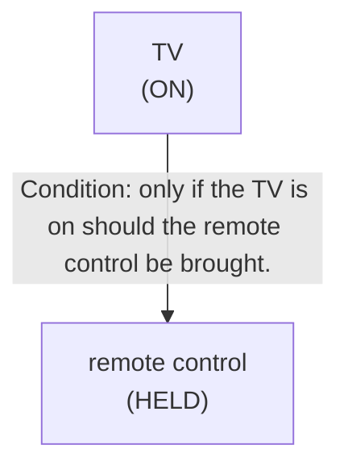
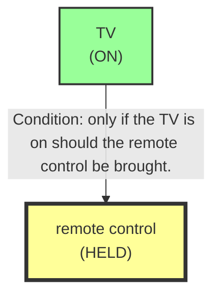

# 🚀 VirtualHome Agent Episode Log


### [GoalReasoner (Module A - Intent)] Output
```json
{
  "is_instruction_obviously_vague": false,
  "clarification_question": null,
  "target_object": "remote control",
  "location_hint": null,
  "reasoning_chain": [
    {
      "question": "Why does the user want this object?",
      "answer": "To control the TV if it is currently on."
    },
    {
      "question": "Why is that important?",
      "answer": "Because the user likely wants to adjust or manage the TV's state or viewing experience without getting up."
    },
    {
      "question": "What fundamental need does this fulfill?",
      "answer": "It fulfills the need to conveniently control an active device."
    },
    {
      "question": "Are there any deeper psychological or physical motivations?",
      "answer": "It may be about convenience, comfort, or reducing effort while interacting with the television."
    }
  ],
  "deep_intent": "The user wants convenient control over an active device.",
  "acceptable_alternatives_properties": [
    {
      "priority": 1,
      "description": "Other handheld controls or input devices that can operate the TV, such as a universal remote or a remote app on a phone/tablet"
    },
    {
      "priority": 2,
      "description": "Any compatible controller for the same entertainment device, such as a set-top box remote or media player remote"
    },
    {
      "priority": 3,
      "description": "Alternative ways to manage the TV's operation, such as the TV's physical buttons if available"
    },
    {
      "priority": 4,
      "description": "Other household devices that allow easy control of electronics, such as a smart speaker or home automation hub"
    }
  ]
}
```

### [RoboStateMultiTaskController] Output
```json
{
  "action": "[walk] <bathroom> (11)",
  "active_task_id": "task_1",
  "task_context": {
    "active_task_id": "task_1",
    "pending_task_ids": [],
    "satisfied_task_ids": []
  },
  "source": "room_frontier"
}
```
## Step 0
- **Action**: `[walk] <bathroom> (11)`
- **Action Success**: `True`
- **Action Message**: {'0': {'message': 'Success'}}
- **Active Task**: `task_1`
- **Decision Source**: `room_frontier`
- **Task Progress**: M1_01=pending
- **SDG Status**:

- **Observed Items (63)**: wall(262), wall(263), wall(264), wall(265), wall(266), wall(267), wall(268), wall(269), ceiling(270), ceiling(271), ceiling(272), ceiling(273), ceiling(274), ceiling(275), ceiling(276)...


### [RoboStateMultiTaskController] Output
```json
{
  "action": "[walk] <bedroom> (50)",
  "active_task_id": "task_1",
  "task_context": {
    "active_task_id": "task_1",
    "pending_task_ids": [],
    "satisfied_task_ids": []
  },
  "source": "room_frontier"
}
```
## Step 1
- **Action**: `[walk] <bedroom> (50)`
- **Action Success**: `True`
- **Action Message**: {'0': {'message': 'Success'}}
- **Active Task**: `task_1`
- **Decision Source**: `room_frontier`
- **Task Progress**: M1_01=pending
- **SDG Status**:

- **Observed Items (101)**: wall(262), wall(263), wall(264), wall(265), wall(266), wall(267), wall(268), wall(269), ceiling(270), ceiling(271), ceiling(272), ceiling(273), ceiling(274), ceiling(275), ceiling(276)...


### [PerceptionFilter] Output
```json
{
  "reasoning": "The goal is to obtain the remote control, and the SDG explicitly requires the TV to be ON as a condition. So the only necessary classes are the target remote control and the TV itself. No extra tools or locations are required by the goal as stated.",
  "selected_classes": [
    "character",
    "remotecontrol",
    "tv"
  ],
  "raw_class_count": 61
}
```

### [LLMExecutor] Output
```json
{
  "reasoning": "The SDG requires the remote control to be HELD, and the TV is already ON, so the condition for pursuing the remote is satisfied. The character is already CLOSE to remotecontrol(321) in the bedroom, so the next atomic step is to grab it. This directly progresses N1.",
  "satisfied_nodes": [
    "N2"
  ],
  "current_node_focus": "N1",
  "mapped_variables": {
    "?Remote": "remotecontrol(321)"
  },
  "action": "[grab] <remotecontrol> (321)"
}
```

### [RoboStateMultiTaskController] Output
```json
{
  "action": "[grab] <remotecontrol> (321)",
  "active_task_id": "task_1",
  "task_context": {
    "active_task_id": "task_1",
    "pending_task_ids": [],
    "satisfied_task_ids": []
  },
  "source": "llm_executor"
}
```
## Step 2
- **Action**: `[grab] <remotecontrol> (321)`
- **Action Success**: `False`
- **Action Message**: temporary_unavailable: target disappeared; wait or search and retry
- **Active Task**: `task_1`
- **Decision Source**: `llm_executor`
- **Task Progress**: M1_01=pending
- **SDG Status**:

- **Observed Items (7)**: tv(300) [ON], character(1), bathroom(11), bedroom(50), kitchen(126), livingroom(261), remotecontrol(321) [OFF]


### [PerceptionFilter] Output
```json
{
  "reasoning": "Reused cached class selection.",
  "selected_classes": [
    "character",
    "remotecontrol",
    "tv"
  ],
  "raw_class_count": 61
}
```

### [LLMExecutor] Output
```json
{
  "reasoning": "The TV is already ON, so SDG node N2 is satisfied. The remote control is currently listed as CLOSE to the character in the bedroom, and the previous grab failed due to temporary unavailability. Per the disappearance strategy, the correct next step is to wait in place for the object to reappear rather than repeating walk or grab prematurely. This keeps progress toward N1 (holding the remote) while respecting the temporary-unavailable event.",
  "satisfied_nodes": [
    "N2"
  ],
  "current_node_focus": "N1",
  "mapped_variables": {},
  "action": "[wait]"
}
```

### [RoboStateMultiTaskController] Output
```json
{
  "action": "[walk] <kitchen> (126)",
  "active_task_id": null,
  "task_context": {
    "active_task_id": null,
    "pending_task_ids": [
      "task_1"
    ],
    "satisfied_task_ids": []
  },
  "source": "loop_recovery_room_revisit"
}
```
## Step 3
- **Action**: `[walk] <kitchen> (126)`
- **Action Success**: `True`
- **Action Message**: {'0': {'message': 'Success'}}
- **Decision Source**: `loop_recovery_room_revisit`
- **Task Progress**: M1_01=pending
- **SDG Status**:
No SDG active.
- **Observed Items (172)**: wall(262), wall(263), wall(264), wall(265), wall(266), wall(267), wall(268), wall(269), ceiling(270), ceiling(271), ceiling(272), ceiling(273), ceiling(274), ceiling(275), ceiling(276)...


### [PerceptionFilter] Output
```json
{
  "reasoning": "The goal is to obtain a remote control for an active TV, so the only strictly necessary classes are the remote control and the TV itself. The SDG explicitly requires the remote control to be held and the TV to be on.",
  "selected_classes": [
    "character",
    "remotecontrol",
    "tv"
  ],
  "raw_class_count": 86
}
```

### [LLMExecutor] Output
```json
{
  "reasoning": "The TV is already ON, so the condition for bringing the remote is satisfied. The remote control is currently in the bedroom and was previously temporarily unavailable while close to the character, but the current graph shows it again and still close to us? However, because we are now in the kitchen and the remote is in the bedroom, we must first walk to the remote before we can grab it. The next atomic action should therefore move us to the remote control.",
  "satisfied_nodes": [
    "N2"
  ],
  "current_node_focus": "N1",
  "mapped_variables": {
    "?Remote": "remotecontrol(321)"
  },
  "action": "[walk] <remotecontrol> (321)"
}
```

### [RoboStateMultiTaskController] Output
```json
{
  "action": "[walk] <remotecontrol> (321)",
  "active_task_id": "task_1",
  "task_context": {
    "active_task_id": "task_1",
    "pending_task_ids": [],
    "satisfied_task_ids": []
  },
  "source": "llm_executor"
}
```
## Step 4
- **Action**: `[walk] <remotecontrol> (321)`
- **Action Success**: `False`
- **Action Message**: temporary_unavailable: target is temporarily hidden
- **Active Task**: `task_1`
- **Decision Source**: `llm_executor`
- **Task Progress**: M1_01=pending
- **SDG Status**:

- **Observed Items (7)**: tv(300) [ON], character(1), bathroom(11), bedroom(50), kitchen(126), livingroom(261), remotecontrol(321) [OFF]


### [RoboStateMultiTaskController] Output
```json
{
  "action": "[walk] <livingroom> (261)",
  "active_task_id": null,
  "task_context": {
    "active_task_id": null,
    "pending_task_ids": [
      "task_1"
    ],
    "satisfied_task_ids": []
  },
  "source": "loop_recovery_room_revisit"
}
```
## Step 5
- **Action**: `[walk] <livingroom> (261)`
- **Action Success**: `True`
- **Action Message**: {'0': {'message': 'Success'}}
- **Decision Source**: `loop_recovery_room_revisit`
- **Task Progress**: M1_01=pending
- **SDG Status**:
No SDG active.
- **Observed Items (291)**: wall(262), wall(263), wall(264), wall(265), wall(266), wall(267), wall(268), wall(269), ceiling(270), ceiling(271), ceiling(272), ceiling(273), ceiling(274), ceiling(275), ceiling(276)...


### [PerceptionFilter] Output
```json
{
  "reasoning": "Reused cached class selection.",
  "selected_classes": [
    "character",
    "remotecontrol",
    "tv"
  ],
  "raw_class_count": 86
}
```

### [LLMExecutor] Output
```json
{
  "reasoning": "The SDG requires the remote control to be HELD, and the remotecontrol(321) is now visible in the bedroom and marked CLOSE to the character, so the temporary disappearance has resolved. We are already in the livingroom, but the prompt says not to repeat a walk action if we just did it; however, the remote is not in the current room and the last action was walking to the livingroom, so the correct next step is to move toward the remote's location before attempting to grab it. This progresses toward N1 without violating proximity rules.",
  "satisfied_nodes": [
    "N2"
  ],
  "current_node_focus": "N1",
  "mapped_variables": {},
  "action": "[walk] <bedroom> (50)"
}
```

### [RoboStateMultiTaskController] Output
```json
{
  "action": "[walk] <bedroom> (50)",
  "active_task_id": "task_1",
  "task_context": {
    "active_task_id": "task_1",
    "pending_task_ids": [],
    "satisfied_task_ids": []
  },
  "source": "llm_executor"
}
```
## Step 6
- **Action**: `[walk] <bedroom> (50)`
- **Action Success**: `True`
- **Action Message**: {'0': {'message': 'Success'}}
- **Active Task**: `task_1`
- **Decision Source**: `llm_executor`
- **Task Progress**: M1_01=pending
- **SDG Status**:

- **Observed Items (7)**: tv(300) [ON], character(1), bathroom(11), bedroom(50), kitchen(126), livingroom(261), remotecontrol(321) [OFF]


### [PerceptionFilter] Output
```json
{
  "reasoning": "Reused cached class selection.",
  "selected_classes": [
    "character",
    "remotecontrol",
    "tv"
  ],
  "raw_class_count": 86
}
```

### [LLMExecutor] Output
```json
{
  "reasoning": "The SDG requires the TV to be ON before bringing the remote control. The current graph confirms tv(300) is ON, so N2 is already satisfied. The remote control is CLOSE to the character and inside the bedroom, and we are in the bedroom, but to satisfy N1 we still need to pick it up. Since grabbing requires being near the object and the object is already close, the next atomic action is to grab the remote control.",
  "satisfied_nodes": [
    "N2"
  ],
  "current_node_focus": "N1",
  "mapped_variables": {},
  "action": "[grab] <remotecontrol> (321)"
}
```

### [RoboStateMultiTaskController] Output
```json
{
  "action": "[grab] <remotecontrol> (321)",
  "active_task_id": "task_1",
  "task_context": {
    "active_task_id": "task_1",
    "pending_task_ids": [],
    "satisfied_task_ids": []
  },
  "source": "llm_executor"
}
```
## Step 7
- **Action**: `[grab] <remotecontrol> (321)`
- **Action Success**: `False`
- **Action Message**: temporary_unavailable: target disappeared; wait or search and retry
- **Active Task**: `task_1`
- **Decision Source**: `llm_executor`
- **Task Progress**: M1_01=pending
- **SDG Status**:

- **Observed Items (7)**: tv(300) [ON], character(1), bathroom(11), bedroom(50), kitchen(126), livingroom(261), remotecontrol(321) [OFF]


### [PerceptionFilter] Output
```json
{
  "reasoning": "Reused cached class selection.",
  "selected_classes": [
    "character",
    "remotecontrol",
    "tv"
  ],
  "raw_class_count": 86
}
```

### [LLMExecutor] Output
```json
{
  "reasoning": "The TV is already ON, so the prerequisite for bringing the remote is satisfied and N2 is already satisfied. The remote control is currently reported INSIDE the bedroom and CLOSE to the character, but previous grab attempts failed because it was temporarily unavailable/hidden. Per the disappearance strategy, I should wait in place for it to reappear rather than repeating the same grab or walking again.",
  "satisfied_nodes": [
    "N2"
  ],
  "current_node_focus": "N1",
  "mapped_variables": {
    "?Washer": "n/a"
  },
  "action": "[wait]"
}
```

### [RoboStateMultiTaskController] Output
```json
{
  "action": "[walk] <bathroom> (11)",
  "active_task_id": null,
  "task_context": {
    "active_task_id": null,
    "pending_task_ids": [
      "task_1"
    ],
    "satisfied_task_ids": []
  },
  "source": "loop_recovery_room_revisit"
}
```
## Step 8
- **Action**: `[walk] <bathroom> (11)`
- **Action Success**: `True`
- **Action Message**: {'0': {'message': 'Success'}}
- **Decision Source**: `loop_recovery_room_revisit`
- **Task Progress**: M1_01=pending
- **SDG Status**:
No SDG active.
- **Observed Items (291)**: wall(262), wall(263), wall(264), wall(265), wall(266), wall(267), wall(268), wall(269), ceiling(270), ceiling(271), ceiling(272), ceiling(273), ceiling(274), ceiling(275), ceiling(276)...


### [PerceptionFilter] Output
```json
{
  "reasoning": "Reused cached class selection.",
  "selected_classes": [
    "character",
    "remotecontrol",
    "tv"
  ],
  "raw_class_count": 86
}
```

### [LLMExecutor] Output
```json
{
  "reasoning": "The SDG requires the remote control to be HELD, but the current graph shows the remotecontrol(321) is already CLOSE to the character(1) in the bedroom and temporarily unavailable earlier due to being hidden. Since I just walked to the bathroom in the last step and should not repeat a walk immediately, the best next atomic action is to wait for the temporarily hidden remote to reappear; this is the correct response for a temporarily unavailable/disappeared target. The TV is already ON, so N2 is satisfied.",
  "satisfied_nodes": [
    "N2"
  ],
  "current_node_focus": "N1",
  "mapped_variables": {
    "?Remote": "remotecontrol(321)"
  },
  "action": "[wait]"
}
```

### [RoboStateMultiTaskController] Output
```json
{
  "action": "[walk] <kitchen> (126)",
  "active_task_id": null,
  "task_context": {
    "active_task_id": null,
    "pending_task_ids": [
      "task_1"
    ],
    "satisfied_task_ids": []
  },
  "source": "loop_recovery_room_revisit"
}
```
## Step 9
- **Action**: `[walk] <kitchen> (126)`
- **Action Success**: `True`
- **Action Message**: {'0': {'message': 'Success'}}
- **Decision Source**: `loop_recovery_room_revisit`
- **Task Progress**: M1_01=pending
- **SDG Status**:
No SDG active.
- **Observed Items (291)**: wall(262), wall(263), wall(264), wall(265), wall(266), wall(267), wall(268), wall(269), ceiling(270), ceiling(271), ceiling(272), ceiling(273), ceiling(274), ceiling(275), ceiling(276)...


### [PerceptionFilter] Output
```json
{
  "reasoning": "Reused cached class selection.",
  "selected_classes": [
    "character",
    "remotecontrol",
    "tv"
  ],
  "raw_class_count": 86
}
```

### [LLMExecutor] Output
```json
{
  "reasoning": "The SDG requires the remote control to be HELD, and the TV is already ON, so the only remaining gap is to obtain the remote. The filtered graph shows remotecontrol(321) is CLOSE to the character and inside the bedroom, while the character is currently in the kitchen. Since grabbing requires proximity, the next step is to walk to the remote control's location/object before attempting to grab it. The remote is not dirty and is grabbable, so no cleaning or other prep is needed.",
  "satisfied_nodes": [
    "N2"
  ],
  "current_node_focus": "N1",
  "mapped_variables": {
    "?Remote": "remotecontrol(321)"
  },
  "action": "[walk] <remotecontrol> (321)"
}
```

### [RoboStateMultiTaskController] Output
```json
{
  "action": "[walk] <remotecontrol> (321)",
  "active_task_id": "task_1",
  "task_context": {
    "active_task_id": "task_1",
    "pending_task_ids": [],
    "satisfied_task_ids": []
  },
  "source": "llm_executor"
}
```
## Step 10
- **Action**: `[walk] <remotecontrol> (321)`
- **Action Success**: `False`
- **Action Message**: temporary_unavailable: target is temporarily hidden
- **Active Task**: `task_1`
- **Decision Source**: `llm_executor`
- **Task Progress**: M1_01=pending
- **SDG Status**:

- **Observed Items (7)**: tv(300) [ON], character(1), bathroom(11), bedroom(50), kitchen(126), livingroom(261), remotecontrol(321) [OFF]


### [RoboStateMultiTaskController] Output
```json
{
  "action": "[walk] <livingroom> (261)",
  "active_task_id": null,
  "task_context": {
    "active_task_id": null,
    "pending_task_ids": [
      "task_1"
    ],
    "satisfied_task_ids": []
  },
  "source": "loop_recovery_room_revisit"
}
```
## Step 11
- **Action**: `[walk] <livingroom> (261)`
- **Action Success**: `True`
- **Action Message**: {'0': {'message': 'Success'}}
- **Decision Source**: `loop_recovery_room_revisit`
- **Task Progress**: M1_01=pending
- **SDG Status**:
No SDG active.
- **Observed Items (291)**: wall(262), wall(263), wall(264), wall(265), wall(266), wall(267), wall(268), wall(269), ceiling(270), ceiling(271), ceiling(272), ceiling(273), ceiling(274), ceiling(275), ceiling(276)...


### [PerceptionFilter] Output
```json
{
  "reasoning": "Reused cached class selection.",
  "selected_classes": [
    "character",
    "remotecontrol",
    "tv"
  ],
  "raw_class_count": 86
}
```

### [LLMExecutor] Output
```json
{
  "reasoning": "The TV is already ON, satisfying N2. The remote control is now visible in the bedroom and is CLOSE to the character, so the next step toward holding it is to grab it. No additional walk is needed because the graph indicates proximity.",
  "satisfied_nodes": [
    "N2"
  ],
  "current_node_focus": "N1",
  "mapped_variables": {
    "?Remote": "remotecontrol(321)"
  },
  "action": "[grab] <remotecontrol> (321)"
}
```

### [RoboStateMultiTaskController] Output
```json
{
  "action": "[grab] <remotecontrol> (321)",
  "active_task_id": "task_1",
  "task_context": {
    "active_task_id": "task_1",
    "pending_task_ids": [],
    "satisfied_task_ids": []
  },
  "source": "llm_executor"
}
```
## Step 12
- **Action**: `[grab] <remotecontrol> (321)`
- **Action Success**: `False`
- **Action Message**: temporary_unavailable: target disappeared; wait or search and retry
- **Active Task**: `task_1`
- **Decision Source**: `llm_executor`
- **Task Progress**: M1_01=pending
- **SDG Status**:

- **Observed Items (7)**: tv(300) [ON], character(1), bathroom(11), bedroom(50), kitchen(126), livingroom(261), remotecontrol(321) [OFF]


### [RoboStateMultiTaskController] Output
```json
{
  "action": "[walk] <bedroom> (50)",
  "active_task_id": null,
  "task_context": {
    "active_task_id": null,
    "pending_task_ids": [
      "task_1"
    ],
    "satisfied_task_ids": []
  },
  "source": "loop_recovery_room_revisit"
}
```
## Step 13
- **Action**: `[walk] <bedroom> (50)`
- **Action Success**: `True`
- **Action Message**: {'0': {'message': 'Success'}}
- **Decision Source**: `loop_recovery_room_revisit`
- **Task Progress**: M1_01=pending
- **SDG Status**:
No SDG active.
- **Observed Items (291)**: wall(262), wall(263), wall(264), wall(265), wall(266), wall(267), wall(268), wall(269), ceiling(270), ceiling(271), ceiling(272), ceiling(273), ceiling(274), ceiling(275), ceiling(276)...


### [PerceptionFilter] Output
```json
{
  "reasoning": "Reused cached class selection.",
  "selected_classes": [
    "character",
    "remotecontrol",
    "tv"
  ],
  "raw_class_count": 86
}
```

### [LLMExecutor] Output
```json
{
  "reasoning": "The SDG has two nodes: N2 requires the TV to be ON, which is already satisfied in the filtered graph, and N1 requires the remote control to be HELD. The remotecontrol(321) is currently CLOSE to the character in the bedroom, so the next atomic step is to grab it. No walk is needed because proximity is already satisfied.",
  "satisfied_nodes": [
    "N2"
  ],
  "current_node_focus": "N1",
  "mapped_variables": {},
  "action": "[grab] <remotecontrol> (321)"
}
```

### [RoboStateMultiTaskController] Output
```json
{
  "action": "[grab] <remotecontrol> (321)",
  "active_task_id": "task_1",
  "task_context": {
    "active_task_id": "task_1",
    "pending_task_ids": [],
    "satisfied_task_ids": []
  },
  "source": "llm_executor"
}
```
## Step 14
- **Action**: `[grab] <remotecontrol> (321)`
- **Action Success**: `False`
- **Action Message**: temporary_unavailable: target is temporarily hidden
- **Active Task**: `task_1`
- **Decision Source**: `llm_executor`
- **Task Progress**: M1_01=pending
- **SDG Status**:

- **Observed Items (7)**: tv(300) [ON], character(1), bathroom(11), bedroom(50), kitchen(126), livingroom(261), remotecontrol(321) [OFF]


### [RoboStateMultiTaskController] Output
```json
{
  "action": "[walk] <bathroom> (11)",
  "active_task_id": null,
  "task_context": {
    "active_task_id": null,
    "pending_task_ids": [
      "task_1"
    ],
    "satisfied_task_ids": []
  },
  "source": "loop_recovery_room_revisit"
}
```
## Step 15
- **Action**: `[walk] <bathroom> (11)`
- **Action Success**: `True`
- **Action Message**: {'0': {'message': 'Success'}}
- **Decision Source**: `loop_recovery_room_revisit`
- **Task Progress**: M1_01=pending
- **SDG Status**:
No SDG active.
- **Observed Items (291)**: wall(262), wall(263), wall(264), wall(265), wall(266), wall(267), wall(268), wall(269), ceiling(270), ceiling(271), ceiling(272), ceiling(273), ceiling(274), ceiling(275), ceiling(276)...


### [PerceptionFilter] Output
```json
{
  "reasoning": "Reused cached class selection.",
  "selected_classes": [
    "character",
    "remotecontrol",
    "tv"
  ],
  "raw_class_count": 86
}
```

### [LLMExecutor] Output
```json
{
  "reasoning": "The SDG requires the remote control to be HELD, and the TV is already ON, so the prerequisite condition is satisfied. The remotecontrol(321) is currently marked CLOSE to the character, so the next step should be to grab it. Since the last action was a walk to the bathroom and the remote is not in the bathroom graph, I should not repeat a walk to the same location; instead I can take advantage of the CLOSE relation and attempt the grab now.",
  "satisfied_nodes": [
    "N2"
  ],
  "current_node_focus": "N1",
  "mapped_variables": {},
  "action": "[grab] <remotecontrol> (321)"
}
```

### [RoboStateMultiTaskController] Output
```json
{
  "action": "[grab] <remotecontrol> (321)",
  "active_task_id": "task_1",
  "task_context": {
    "active_task_id": "task_1",
    "pending_task_ids": [],
    "satisfied_task_ids": []
  },
  "source": "llm_executor"
}
```
## Step 16
- **Action**: `[grab] <remotecontrol> (321)`
- **Action Success**: `True`
- **Action Message**: {'0': {'message': 'Success'}}
- **Active Task**: `task_1`
- **Decision Source**: `llm_executor`
- **Task Progress**: M1_01=done
- **SDG Status**:

- **Observed Items (7)**: tv(300) [ON], character(1), bathroom(11), bedroom(50), kitchen(126), livingroom(261), remotecontrol(321) [OFF]

