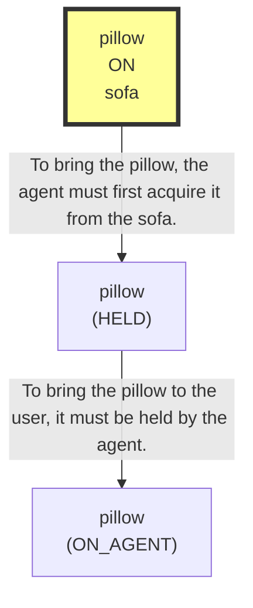
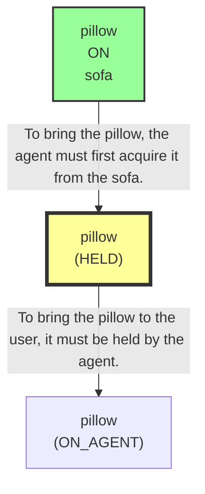

# 🚀 VirtualHome Agent Episode Log


### [GoalReasoner (Module A - Intent)] Output
```json
{
  "is_instruction_obviously_vague": false,
  "clarification_question": null,
  "target_object": "pillow",
  "location_hint": "sofa",
  "reasoning_chain": [
    {
      "question": "Why does the user want this object?",
      "answer": "They want a pillow brought to them if one is available on the sofa."
    },
    {
      "question": "Why is that important?",
      "answer": "A pillow can provide comfort, support, or convenience to the user."
    },
    {
      "question": "What fundamental need does this fulfill?",
      "answer": "The user wants physical comfort or support."
    },
    {
      "question": "Are there any deeper psychological or physical motivations?",
      "answer": "They may want to rest more comfortably, reduce strain, or have a cushion available nearby."
    }
  ],
  "deep_intent": "The user wants physical comfort or support.",
  "acceptable_alternatives_properties": [
    {
      "priority": 1,
      "description": "Other soft cushion-like items for support, such as a throw pillow or cushion"
    },
    {
      "priority": 2,
      "description": "Similar soft padded items used for resting or support"
    },
    {
      "priority": 3,
      "description": "Any comfortable soft household item that can function as padding or support"
    },
    {
      "priority": 4,
      "description": "A folded blanket or towel that can provide temporary cushioning if no pillow is available"
    }
  ]
}
```

### [PerceptionFilter] Output
```json
{
  "reasoning": "The goal is to bring a pillow, and the SDG says it is on the sofa and must be held by the agent. So only the target object and the required location/furniture are needed. No tools or other alternatives are necessary beyond the pillow itself.",
  "selected_classes": [
    "sofa",
    "pillow",
    "character"
  ],
  "raw_class_count": 30
}
```

### [LLMExecutor] Output
```json
{
  "reasoning": "The target pillow is already in the same room and is on the sofa. Since the SDG requires first acquiring the pillow (N1 -> N2), and grabbing requires being near the object, the next step is to walk directly to the pillow so it can be picked up on the following action.",
  "satisfied_nodes": [],
  "current_node_focus": "N1",
  "mapped_variables": {},
  "action": "[walk] <pillow> (303)"
}
```

### [RoboStateMultiTaskController] Output
```json
{
  "action": "[walk] <pillow> (303)",
  "active_task_id": "task_1",
  "task_context": {
    "active_task_id": "task_1",
    "pending_task_ids": [],
    "satisfied_task_ids": []
  },
  "source": "llm_executor"
}
```
## Step 0
- **Action**: `[walk] <pillow> (303)`
- **Action Success**: `True`
- **Action Message**: {'0': {'message': 'Success'}}
- **Active Task**: `task_1`
- **Decision Source**: `llm_executor`
- **Task Progress**: M1_04=pending
- **SDG Status**:

- **Observed Items (7)**: sofa(288), pillow(303), character(1), bathroom(11), bedroom(50), kitchen(126), livingroom(261)


### [PerceptionFilter] Output
```json
{
  "reasoning": "Reused cached class selection.",
  "selected_classes": [
    "sofa",
    "pillow",
    "character"
  ],
  "raw_class_count": 30
}
```

### [LLMExecutor] Output
```json
{
  "reasoning": "The pillow on the sofa is already close to the agent, so the next step is to acquire it. N1 (pillow ON sofa) is satisfied in the current graph, and N2 (pillow HELD) is the next prerequisite toward bringing it to the user.",
  "satisfied_nodes": [
    "N1"
  ],
  "current_node_focus": "N2",
  "mapped_variables": {},
  "action": "[grab] <pillow> (303)"
}
```

### [RoboStateMultiTaskController] Output
```json
{
  "action": "[grab] <pillow> (303)",
  "active_task_id": "task_1",
  "task_context": {
    "active_task_id": "task_1",
    "pending_task_ids": [],
    "satisfied_task_ids": []
  },
  "source": "llm_executor"
}
```
## Step 1
- **Action**: `[grab] <pillow> (303)`
- **Action Success**: `True`
- **Action Message**: {'0': {'message': 'Success'}}
- **Active Task**: `task_1`
- **Decision Source**: `llm_executor`
- **Task Progress**: M1_04=done
- **SDG Status**:

- **Observed Items (7)**: sofa(288), pillow(303), character(1), bathroom(11), bedroom(50), kitchen(126), livingroom(261)

