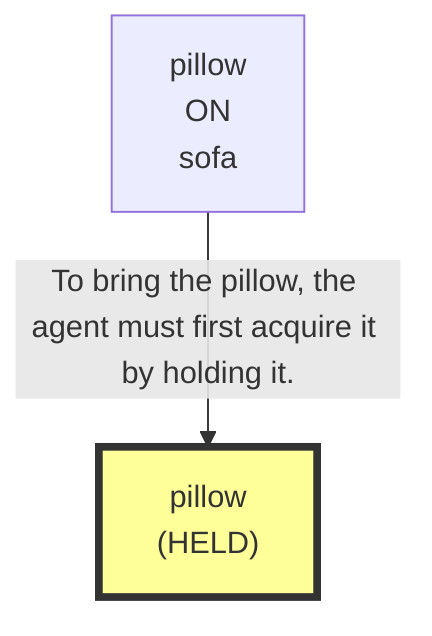
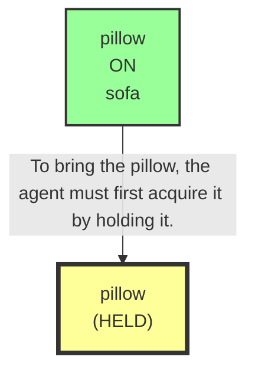

# 🚀 VirtualHome Agent Episode Log


### [GoalReasoner (Module A - Intent)] Output
```json
{
  "is_instruction_obviously_vague": false,
  "clarification_question": null,
  "target_object": "pillow",
  "location_hint": "sofa",
  "reasoning_chain": [
    {
      "question": "Why does the user want this object?",
      "answer": "They want a pillow brought to them from the sofa."
    },
    {
      "question": "Why is that important?",
      "answer": "They likely want something soft for comfort or support."
    },
    {
      "question": "What fundamental need does this fulfill?",
      "answer": "It helps provide physical comfort and support."
    },
    {
      "question": "Are there any deeper psychological or physical motivations?",
      "answer": "The user may want to rest more comfortably, reduce strain, or feel more settled."
    }
  ],
  "deep_intent": "The user wants physical comfort or support.",
  "acceptable_alternatives_properties": [
    {
      "priority": 1,
      "description": "Other soft cushions or support items that can be used similarly, such as a throw pillow or cushion"
    },
    {
      "priority": 2,
      "description": "Other padded household items that provide support, such as a bolster or seat cushion"
    },
    {
      "priority": 3,
      "description": "Soft bedding or resting aids that can improve comfort, such as a folded blanket"
    },
    {
      "priority": 4,
      "description": "Any nearby soft item that can provide a comfortable resting surface or support"
    }
  ]
}
```

### [PerceptionFilter] Output
```json
{
  "reasoning": "The goal is to bring the pillow, and the SDG says it is on the sofa and must be held. The only strictly needed object classes are the target pillow and the location furniture sofa to identify where it is. No tools or backups are required beyond the acceptable soft-item alternatives, but none of those are explicitly needed to satisfy the current SDG.",
  "selected_classes": [
    "character",
    "sofa",
    "pillow"
  ],
  "raw_class_count": 30
}
```

### [LLMExecutor] Output
```json
{
  "reasoning": "The goal is to bring the pillow that is currently on the sofa. The agent is already close to the sofa, and the pillow is grabbable and not dirty. The next required step toward satisfying HOLD for the pillow is to pick it up. Walking is unnecessary because proximity to the sofa is already established in the graph.",
  "satisfied_nodes": [],
  "current_node_focus": "N2",
  "mapped_variables": {},
  "action": "[grab] <pillow> (303)"
}
```

### [RoboStateMultiTaskController] Output
```json
{
  "action": "[walk] <pillow> (303)",
  "active_task_id": "task_1",
  "task_context": {
    "active_task_id": "task_1",
    "pending_task_ids": [],
    "satisfied_task_ids": []
  },
  "source": "llm_executor_repaired"
}
```
## Step 0
- **Action**: `[walk] <pillow> (303)`
- **Action Success**: `True`
- **Action Message**: {'0': {'message': 'Success'}}
- **Active Task**: `task_1`
- **Decision Source**: `llm_executor_repaired`
- **Task Progress**: M1_04=pending
- **SDG Status**:

- **Observed Items (7)**: sofa(288), pillow(303), character(1), bathroom(11), bedroom(50), kitchen(126), livingroom(261)


### [PerceptionFilter] Output
```json
{
  "reasoning": "The goal is to retrieve a pillow from the sofa, so the only strictly necessary classes are the target item and its indicated location. No extra tools or alternative support items are required by the SDG.",
  "selected_classes": [
    "character",
    "sofa",
    "pillow"
  ],
  "raw_class_count": 64
}
```

### [LLMExecutor] Output
```json
{
  "reasoning": "The pillow is already the target object and the graph shows it is ON the sofa. The previous action walked to the pillow successfully, so the next atomic step is to grab it. This satisfies the required HELD state (N2) and is the prerequisite for later relocating it, while preserving the pillow-on-sofa relation until we move it.",
  "satisfied_nodes": [],
  "current_node_focus": "N2",
  "mapped_variables": {},
  "action": "[grab] <pillow> (303)"
}
```

### [RoboStateMultiTaskController] Output
```json
{
  "action": "[walk] <pillow> (303)",
  "active_task_id": "task_1",
  "task_context": {
    "active_task_id": "task_1",
    "pending_task_ids": [],
    "satisfied_task_ids": []
  },
  "source": "llm_executor_repaired"
}
```
## Step 1
- **Action**: `[walk] <pillow> (303)`
- **Action Success**: `True`
- **Action Message**: {'0': {'message': 'Success'}}
- **Active Task**: `task_1`
- **Decision Source**: `llm_executor_repaired`
- **Task Progress**: M1_04=pending
- **SDG Status**:

- **Observed Items (9)**: sofa(288), pillow(303), character(1), bathroom(11), bedroom(50), kitchen(126), bedroom(73), kitchen(205), livingroom(335)


### [PerceptionFilter] Output
```json
{
  "reasoning": "Reused cached class selection.",
  "selected_classes": [
    "character",
    "sofa",
    "pillow"
  ],
  "raw_class_count": 64
}
```

### [LLMExecutor] Output
```json
{
  "reasoning": "The pillow is the target object and is currently on the sofa. The previous action already walked to the pillow successfully, and the filtered graph shows the pillow is still present with no HELD state. Since the next required SDG node is to hold the pillow, the correct next atomic step is to grab it. I will not repeat walking because the prompt says not to repeat a walk action if it was just done.",
  "satisfied_nodes": [],
  "current_node_focus": "N2",
  "mapped_variables": {},
  "action": "[grab] <pillow> (303)"
}
```

### [RoboStateMultiTaskController] Output
```json
{
  "action": "[walk] <pillow> (303)",
  "active_task_id": "task_1",
  "task_context": {
    "active_task_id": "task_1",
    "pending_task_ids": [],
    "satisfied_task_ids": []
  },
  "source": "llm_executor_repaired"
}
```
## Step 2
- **Action**: `[walk] <pillow> (303)`
- **Action Success**: `True`
- **Action Message**: {'0': {'message': 'Success'}}
- **Active Task**: `task_1`
- **Decision Source**: `llm_executor_repaired`
- **Task Progress**: M1_04=pending
- **SDG Status**:

- **Observed Items (9)**: sofa(288), pillow(303), character(1), bathroom(11), bedroom(50), kitchen(126), bedroom(73), kitchen(205), livingroom(335)


### [PerceptionFilter] Output
```json
{
  "reasoning": "Reused cached class selection.",
  "selected_classes": [
    "character",
    "sofa",
    "pillow"
  ],
  "raw_class_count": 64
}
```

### [LLMExecutor] Output
```json
{
  "reasoning": "The SDG requires the pillow to be HELD before it can be moved to the sofa. The current graph shows pillow(303) is GRABBABLE and on the sofa, and the character is already CLOSE to sofa(288). Since prior actions already walked to the pillow/sofa area and we should not repeat a walk, the next atomic step is to grab the pillow.",
  "satisfied_nodes": [
    "N1"
  ],
  "current_node_focus": "N2",
  "mapped_variables": {},
  "action": "[grab] <pillow> (303)"
}
```

### [RoboStateMultiTaskController] Output
```json
{
  "action": "[walk] <pillow> (303)",
  "active_task_id": "task_1",
  "task_context": {
    "active_task_id": "task_1",
    "pending_task_ids": [],
    "satisfied_task_ids": []
  },
  "source": "llm_executor_repaired"
}
```
## Step 3
- **Action**: `[walk] <pillow> (303)`
- **Action Success**: `True`
- **Action Message**: {'0': {'message': 'Success'}}
- **Active Task**: `task_1`
- **Decision Source**: `llm_executor_repaired`
- **Task Progress**: M1_04=pending
- **SDG Status**:

- **Observed Items (9)**: sofa(288), pillow(303), character(1), bathroom(11), bedroom(50), kitchen(126), bedroom(73), kitchen(205), livingroom(335)


### [PerceptionFilter] Output
```json
{
  "reasoning": "Reused cached class selection.",
  "selected_classes": [
    "character",
    "sofa",
    "pillow"
  ],
  "raw_class_count": 64
}
```

### [LLMExecutor] Output
```json
{
  "reasoning": "The pillow is already adjacent and on the sofa, but the SDG requires it to be HELD before it can be brought elsewhere or considered acquired. Since we are already close to the pillow, the next atomic step is to grab it. This directly progresses toward N2 (HELD), which is required before any later placement action can satisfy N1 (ON sofa) in the task flow.",
  "satisfied_nodes": [
    "N1"
  ],
  "current_node_focus": "N2",
  "mapped_variables": {},
  "action": "[grab] <pillow> (303)"
}
```

### [RoboStateMultiTaskController] Output
```json
{
  "action": "[walk] <pillow> (303)",
  "active_task_id": "task_1",
  "task_context": {
    "active_task_id": "task_1",
    "pending_task_ids": [],
    "satisfied_task_ids": []
  },
  "source": "llm_executor_repaired"
}
```
## Step 4
- **Action**: `[walk] <pillow> (303)`
- **Action Success**: `True`
- **Action Message**: {'0': {'message': 'Success'}}
- **Active Task**: `task_1`
- **Decision Source**: `llm_executor_repaired`
- **Task Progress**: M1_04=pending
- **SDG Status**:

- **Observed Items (9)**: sofa(288), pillow(303), character(1), bathroom(11), bedroom(50), kitchen(126), bedroom(73), kitchen(205), livingroom(335)


### [PerceptionFilter] Output
```json
{
  "reasoning": "Reused cached class selection.",
  "selected_classes": [
    "character",
    "sofa",
    "pillow"
  ],
  "raw_class_count": 64
}
```

### [LLMExecutor] Output
```json
{
  "reasoning": "The SDG requires the pillow to be HELD before it can later be placed on the sofa. The current graph shows the character is already CLOSE to the sofa and the pillow is the target object with GRABBABLE/MOVABLE properties. Since the last actions were repeated walks and no grab has been attempted yet, the best progress is to pick up the pillow now. This should satisfy N2 once successful.",
  "satisfied_nodes": [],
  "current_node_focus": "N2",
  "mapped_variables": {},
  "action": "[grab] <pillow> (303)"
}
```

### [RoboStateMultiTaskController] Output
```json
{
  "action": "[walk] <pillow> (303)",
  "active_task_id": "task_1",
  "task_context": {
    "active_task_id": "task_1",
    "pending_task_ids": [],
    "satisfied_task_ids": []
  },
  "source": "llm_executor_repaired"
}
```
## Step 5
- **Action**: `[walk] <pillow> (303)`
- **Action Success**: `True`
- **Action Message**: {'0': {'message': 'Success'}}
- **Active Task**: `task_1`
- **Decision Source**: `llm_executor_repaired`
- **Task Progress**: M1_04=pending
- **SDG Status**:

- **Observed Items (9)**: sofa(288), pillow(303), character(1), bathroom(11), bedroom(50), kitchen(126), bedroom(73), kitchen(205), livingroom(335)


### [PerceptionFilter] Output
```json
{
  "reasoning": "Reused cached class selection.",
  "selected_classes": [
    "character",
    "sofa",
    "pillow"
  ],
  "raw_class_count": 64
}
```

### [LLMExecutor] Output
```json
{
  "reasoning": "The active SDG requires the pillow to be HELD before it can be brought anywhere. The filtered graph shows the pillow is already on the sofa and the character is close to the sofa, so the next atomic step is to grab the pillow. This will satisfy node N2 if successful and is the prerequisite for placing it later on the sofa relation if needed.",
  "satisfied_nodes": [],
  "current_node_focus": "N2",
  "mapped_variables": {},
  "action": "[grab] <pillow> (303)"
}
```

### [RoboStateMultiTaskController] Output
```json
{
  "action": "[walk] <pillow> (303)",
  "active_task_id": "task_1",
  "task_context": {
    "active_task_id": "task_1",
    "pending_task_ids": [],
    "satisfied_task_ids": []
  },
  "source": "llm_executor_repaired"
}
```
## Step 6
- **Action**: `[walk] <pillow> (303)`
- **Action Success**: `True`
- **Action Message**: {'0': {'message': 'Success'}}
- **Active Task**: `task_1`
- **Decision Source**: `llm_executor_repaired`
- **Task Progress**: M1_04=pending
- **SDG Status**:

- **Observed Items (9)**: sofa(288), pillow(303), character(1), bathroom(11), bedroom(50), kitchen(126), bedroom(73), kitchen(205), livingroom(335)


### [PerceptionFilter] Output
```json
{
  "reasoning": "Reused cached class selection.",
  "selected_classes": [
    "character",
    "sofa",
    "pillow"
  ],
  "raw_class_count": 64
}
```

### [LLMExecutor] Output
```json
{
  "reasoning": "The pillow is already adjacent to the character and is not held yet. Since the SDG requires the pillow to be HELD before it can later be placed on the sofa, the next atomic step is to grab it. Repeating walk would be redundant because the graph shows the character is already close to the pillow/sofa area.",
  "satisfied_nodes": [],
  "current_node_focus": "N2",
  "mapped_variables": {},
  "action": "[grab] <pillow> (303)"
}
```

### [RoboStateMultiTaskController] Output
```json
{
  "action": "[walk] <pillow> (303)",
  "active_task_id": "task_1",
  "task_context": {
    "active_task_id": "task_1",
    "pending_task_ids": [],
    "satisfied_task_ids": []
  },
  "source": "llm_executor_repaired"
}
```
## Step 7
- **Action**: `[walk] <pillow> (303)`
- **Action Success**: `True`
- **Action Message**: {'0': {'message': 'Success'}}
- **Active Task**: `task_1`
- **Decision Source**: `llm_executor_repaired`
- **Task Progress**: M1_04=pending
- **SDG Status**:

- **Observed Items (9)**: sofa(288), pillow(303), character(1), bathroom(11), bedroom(50), kitchen(126), bedroom(73), kitchen(205), livingroom(335)


### [PerceptionFilter] Output
```json
{
  "reasoning": "Reused cached class selection.",
  "selected_classes": [
    "character",
    "sofa",
    "pillow"
  ],
  "raw_class_count": 64
}
```

### [LLMExecutor] Output
```json
{
  "reasoning": "The pillow is already the target object and is reachable now, but the SDG requires it to be HELD before it can later be moved to the sofa. Since the previous repeated walks have already brought the agent close to pillow(303), the next atomic progress action is to grab it. This satisfies the holding prerequisite for N2 and moves toward placing it on the sofa for N1.",
  "satisfied_nodes": [],
  "current_node_focus": "N2",
  "mapped_variables": {},
  "action": "[grab] <pillow> (303)"
}
```

### [RoboStateMultiTaskController] Output
```json
{
  "action": "[walk] <pillow> (303)",
  "active_task_id": "task_1",
  "task_context": {
    "active_task_id": "task_1",
    "pending_task_ids": [],
    "satisfied_task_ids": []
  },
  "source": "llm_executor_repaired"
}
```
## Step 8
- **Action**: `[walk] <pillow> (303)`
- **Action Success**: `True`
- **Action Message**: {'0': {'message': 'Success'}}
- **Active Task**: `task_1`
- **Decision Source**: `llm_executor_repaired`
- **Task Progress**: M1_04=pending
- **SDG Status**:

- **Observed Items (9)**: sofa(288), pillow(303), character(1), bathroom(11), bedroom(50), kitchen(126), bedroom(73), kitchen(205), livingroom(335)


### [PerceptionFilter] Output
```json
{
  "reasoning": "Reused cached class selection.",
  "selected_classes": [
    "character",
    "sofa",
    "pillow"
  ],
  "raw_class_count": 64
}
```

### [LLMExecutor] Output
```json
{
  "reasoning": "The pillow is already identified at pillow(303), and repeated walk actions have not changed its status. The SDG requires the pillow to become HELD first, so the next progress-making action is to grab it. The graph does not show any hand conflicts or dirtiness issues.",
  "satisfied_nodes": [],
  "current_node_focus": "N2",
  "mapped_variables": {},
  "action": "[grab] <pillow> (303)"
}
```

### [RoboStateMultiTaskController] Output
```json
{
  "action": "[walk] <pillow> (303)",
  "active_task_id": "task_1",
  "task_context": {
    "active_task_id": "task_1",
    "pending_task_ids": [],
    "satisfied_task_ids": []
  },
  "source": "llm_executor_repaired"
}
```
## Step 9
- **Action**: `[walk] <pillow> (303)`
- **Action Success**: `True`
- **Action Message**: {'0': {'message': 'Success'}}
- **Active Task**: `task_1`
- **Decision Source**: `llm_executor_repaired`
- **Task Progress**: M1_04=pending
- **SDG Status**:

- **Observed Items (9)**: sofa(288), pillow(303), character(1), bathroom(11), bedroom(50), kitchen(126), bedroom(73), kitchen(205), livingroom(335)


### [PerceptionFilter] Output
```json
{
  "reasoning": "Reused cached class selection.",
  "selected_classes": [
    "character",
    "sofa",
    "pillow"
  ],
  "raw_class_count": 64
}
```

### [LLMExecutor] Output
```json
{
  "reasoning": "The pillow is already the correct target object and it is currently on the sofa. We are close to it, and the SDG requires the pillow to be HELD before it can be brought anywhere else. The next atomic step is to grab the pillow.",
  "satisfied_nodes": [
    "N1"
  ],
  "current_node_focus": "N2",
  "mapped_variables": {},
  "action": "[grab] <pillow> (303)"
}
```

### [RoboStateMultiTaskController] Output
```json
{
  "action": "[walk] <pillow> (303)",
  "active_task_id": "task_1",
  "task_context": {
    "active_task_id": "task_1",
    "pending_task_ids": [],
    "satisfied_task_ids": []
  },
  "source": "llm_executor_repaired"
}
```
## Step 10
- **Action**: `[walk] <pillow> (303)`
- **Action Success**: `True`
- **Action Message**: {'0': {'message': 'Success'}}
- **Active Task**: `task_1`
- **Decision Source**: `llm_executor_repaired`
- **Task Progress**: M1_04=pending
- **SDG Status**:

- **Observed Items (9)**: sofa(288), pillow(303), character(1), bathroom(11), bedroom(50), kitchen(126), bedroom(73), kitchen(205), livingroom(335)


### [PerceptionFilter] Output
```json
{
  "reasoning": "Reused cached class selection.",
  "selected_classes": [
    "character",
    "sofa",
    "pillow"
  ],
  "raw_class_count": 64
}
```

### [LLMExecutor] Output
```json
{
  "reasoning": "The pillow is already identified on the sofa, and the repeated walks indicate we are likely already near it. The SDG requires first satisfying HELD for pillow before we can later place it appropriately. The next atomic step is to grab the pillow. This should progress toward N2, while N1 remains pending until the pillow is held and can be transported if needed.",
  "satisfied_nodes": [],
  "current_node_focus": "N2",
  "mapped_variables": {},
  "action": "[grab] <pillow> (303)"
}
```

### [RoboStateMultiTaskController] Output
```json
{
  "action": "[walk] <pillow> (303)",
  "active_task_id": "task_1",
  "task_context": {
    "active_task_id": "task_1",
    "pending_task_ids": [],
    "satisfied_task_ids": []
  },
  "source": "llm_executor_repaired"
}
```
## Step 11
- **Action**: `[walk] <pillow> (303)`
- **Action Success**: `True`
- **Action Message**: {'0': {'message': 'Success'}}
- **Active Task**: `task_1`
- **Decision Source**: `llm_executor_repaired`
- **Task Progress**: M1_04=pending
- **SDG Status**:

- **Observed Items (9)**: sofa(288), pillow(303), character(1), bathroom(11), bedroom(50), kitchen(126), bedroom(73), kitchen(205), livingroom(335)


### [PerceptionFilter] Output
```json
{
  "reasoning": "The goal is to retrieve a pillow from the sofa and hold it. The only strictly necessary object classes are the target item and its location support: pillow and sofa. No extra tools or alternatives are needed because this is a simple pick-up task, though the target must be retained exactly.",
  "selected_classes": [
    "character",
    "sofa",
    "bed",
    "pillow"
  ],
  "raw_class_count": 76
}
```

### [LLMExecutor] Output
```json
{
  "reasoning": "The SDG requires the pillow to be HELD before it can later be placed on the sofa. The current graph shows pillow(303) is present and is GRABBABLE, but the agent is not holding it yet. Since the last action was repeatedly walking to the pillow, the next progress-making step is to grab that exact pillow instance. The sofa relation is already satisfied in the environment because pillow(303) is on sofa(288), but N2 is still unsatisfied because the pillow is not HELD.",
  "satisfied_nodes": [
    "N1"
  ],
  "current_node_focus": "N2",
  "mapped_variables": {},
  "action": "[grab] <pillow> (303)"
}
```

### [RoboStateMultiTaskController] Output
```json
{
  "action": "[walk] <pillow> (303)",
  "active_task_id": "task_1",
  "task_context": {
    "active_task_id": "task_1",
    "pending_task_ids": [],
    "satisfied_task_ids": []
  },
  "source": "llm_executor_repaired"
}
```
## Step 12
- **Action**: `[walk] <pillow> (303)`
- **Action Success**: `True`
- **Action Message**: {'0': {'message': 'Success'}}
- **Active Task**: `task_1`
- **Decision Source**: `llm_executor_repaired`
- **Task Progress**: M1_04=pending
- **SDG Status**:

- **Observed Items (12)**: sofa(288), pillow(303), character(1), bathroom(11), bedroom(50), kitchen(126), bedroom(73), kitchen(205), livingroom(335), bed(109), pillow(186), pillow(187)


### [PerceptionFilter] Output
```json
{
  "reasoning": "Reused cached class selection.",
  "selected_classes": [
    "character",
    "sofa",
    "bed",
    "pillow"
  ],
  "raw_class_count": 76
}
```

### [LLMExecutor] Output
```json
{
  "reasoning": "The active SDG requires the pillow to be HELD before it can later satisfy the ON sofa relation. The current graph shows pillow(303) is on sofa(288), and the character is already CLOSE to the sofa, so the next progress-making step is to grab the pillow. I should not walk again because the graph already indicates proximity to the sofa and the pillow is the target object on that sofa.",
  "satisfied_nodes": [
    "N1"
  ],
  "current_node_focus": "N2",
  "mapped_variables": {},
  "action": "[grab] <pillow> (303)"
}
```

### [RoboStateMultiTaskController] Output
```json
{
  "action": "[walk] <pillow> (303)",
  "active_task_id": "task_1",
  "task_context": {
    "active_task_id": "task_1",
    "pending_task_ids": [],
    "satisfied_task_ids": []
  },
  "source": "llm_executor_repaired"
}
```
## Step 13
- **Action**: `[walk] <pillow> (303)`
- **Action Success**: `True`
- **Action Message**: {'0': {'message': 'Success'}}
- **Active Task**: `task_1`
- **Decision Source**: `llm_executor_repaired`
- **Task Progress**: M1_04=pending
- **SDG Status**:

- **Observed Items (12)**: sofa(288), pillow(303), character(1), bathroom(11), bedroom(50), kitchen(126), bedroom(73), kitchen(205), livingroom(335), bed(109), pillow(186), pillow(187)


### [PerceptionFilter] Output
```json
{
  "reasoning": "Reused cached class selection.",
  "selected_classes": [
    "character",
    "sofa",
    "bed",
    "pillow"
  ],
  "raw_class_count": 76
}
```

### [LLMExecutor] Output
```json
{
  "reasoning": "The active task requires the pillow to be HELD, and the filtered graph shows pillow(303) on the sofa and already close to the character. The next step is to grab it. The recent repeated walk actions indicate we are already at the target, so repeating walk would not progress the SDG.",
  "satisfied_nodes": [],
  "current_node_focus": "N2",
  "mapped_variables": {},
  "action": "[grab] <pillow> (303)"
}
```

### [RoboStateMultiTaskController] Output
```json
{
  "action": "[walk] <pillow> (303)",
  "active_task_id": "task_1",
  "task_context": {
    "active_task_id": "task_1",
    "pending_task_ids": [],
    "satisfied_task_ids": []
  },
  "source": "llm_executor_repaired"
}
```
## Step 14
- **Action**: `[walk] <pillow> (303)`
- **Action Success**: `True`
- **Action Message**: {'0': {'message': 'Success'}}
- **Active Task**: `task_1`
- **Decision Source**: `llm_executor_repaired`
- **Task Progress**: M1_04=pending
- **SDG Status**:

- **Observed Items (12)**: sofa(288), pillow(303), character(1), bathroom(11), bedroom(50), kitchen(126), bedroom(73), kitchen(205), livingroom(335), bed(109), pillow(186), pillow(187)


### [PerceptionFilter] Output
```json
{
  "reasoning": "Reused cached class selection.",
  "selected_classes": [
    "character",
    "sofa",
    "bed",
    "pillow"
  ],
  "raw_class_count": 76
}
```

### [LLMExecutor] Output
```json
{
  "reasoning": "The current SDG requires the pillow to be HELD before it can be delivered. We are already close to pillow(303) from prior successful walk actions, and the graph shows no held object yet. The next atomic step to satisfy N2 is to grab the nearby pillow. N1 (pillow on sofa) is already satisfied in the current graph.",
  "satisfied_nodes": [
    "N1"
  ],
  "current_node_focus": "N2",
  "mapped_variables": {},
  "action": "[grab] <pillow> (303)"
}
```

### [RoboStateMultiTaskController] Output
```json
{
  "action": "[walk] <pillow> (303)",
  "active_task_id": "task_1",
  "task_context": {
    "active_task_id": "task_1",
    "pending_task_ids": [],
    "satisfied_task_ids": []
  },
  "source": "llm_executor_repaired"
}
```
## Step 15
- **Action**: `[walk] <pillow> (303)`
- **Action Success**: `True`
- **Action Message**: {'0': {'message': 'Success'}}
- **Active Task**: `task_1`
- **Decision Source**: `llm_executor_repaired`
- **Task Progress**: M1_04=pending
- **SDG Status**:

- **Observed Items (12)**: sofa(288), pillow(303), character(1), bathroom(11), bedroom(50), kitchen(126), bedroom(73), kitchen(205), livingroom(335), bed(109), pillow(186), pillow(187)


### [PerceptionFilter] Output
```json
{
  "reasoning": "Reused cached class selection.",
  "selected_classes": [
    "character",
    "sofa",
    "bed",
    "pillow"
  ],
  "raw_class_count": 76
}
```

### [LLMExecutor] Output
```json
{
  "reasoning": "The active task requires the pillow to be HELD, and the filtered graph shows pillow(303) is already nearby/on the sofa while the character is close to the sofa. Past actions repeatedly walking to the pillow did not change its state, so the next progress-making step is to grab the target pillow. This should satisfy N2 once successful, and then N1 can be addressed afterward by moving/place action, but the current single-step focus is acquiring the pillow.",
  "satisfied_nodes": [],
  "current_node_focus": "N2",
  "mapped_variables": {},
  "action": "[grab] <pillow> (303)"
}
```

### [RoboStateMultiTaskController] Output
```json
{
  "action": "[walk] <pillow> (303)",
  "active_task_id": "task_1",
  "task_context": {
    "active_task_id": "task_1",
    "pending_task_ids": [],
    "satisfied_task_ids": []
  },
  "source": "llm_executor_repaired"
}
```
## Step 16
- **Action**: `[walk] <pillow> (303)`
- **Action Success**: `True`
- **Action Message**: {'0': {'message': 'Success'}}
- **Active Task**: `task_1`
- **Decision Source**: `llm_executor_repaired`
- **Task Progress**: M1_04=pending
- **SDG Status**:

- **Observed Items (12)**: sofa(288), pillow(303), character(1), bathroom(11), bedroom(50), kitchen(126), bedroom(73), kitchen(205), livingroom(335), bed(109), pillow(186), pillow(187)


### [PerceptionFilter] Output
```json
{
  "reasoning": "Reused cached class selection.",
  "selected_classes": [
    "character",
    "sofa",
    "bed",
    "pillow"
  ],
  "raw_class_count": 76
}
```

### [LLMExecutor] Output
```json
{
  "reasoning": "The active SDG has two nodes: the pillow must be held (N2) before it can be brought to/kept on the sofa (N1). The current graph shows pillow(303) is already at the sofa and close to the character, but it is not held yet. Since I am already adjacent to the pillow from prior walking, the next atomic step is to grab it to satisfy N2.",
  "satisfied_nodes": [
    "N1"
  ],
  "current_node_focus": "N2",
  "mapped_variables": {},
  "action": "[grab] <pillow> (303)"
}
```

### [RoboStateMultiTaskController] Output
```json
{
  "action": "[walk] <pillow> (303)",
  "active_task_id": "task_1",
  "task_context": {
    "active_task_id": "task_1",
    "pending_task_ids": [],
    "satisfied_task_ids": []
  },
  "source": "llm_executor_repaired"
}
```
## Step 17
- **Action**: `[walk] <pillow> (303)`
- **Action Success**: `True`
- **Action Message**: {'0': {'message': 'Success'}}
- **Active Task**: `task_1`
- **Decision Source**: `llm_executor_repaired`
- **Task Progress**: M1_04=pending
- **SDG Status**:

- **Observed Items (12)**: sofa(288), pillow(303), character(1), bathroom(11), bedroom(50), kitchen(126), bedroom(73), kitchen(205), livingroom(335), bed(109), pillow(186), pillow(187)


### [PerceptionFilter] Output
```json
{
  "reasoning": "Reused cached class selection.",
  "selected_classes": [
    "character",
    "sofa",
    "bed",
    "pillow"
  ],
  "raw_class_count": 76
}
```

### [LLMExecutor] Output
```json
{
  "reasoning": "The pillow to satisfy the goal is pillow(303), which is already on the sofa(288). The SDG requires it to be HELD next, and the current graph shows the character is already close to the sofa. Since grabbing requires being near the object and we are already at the target area, the next atomic step is to grab the pillow.",
  "satisfied_nodes": [
    "N1"
  ],
  "current_node_focus": "N2",
  "mapped_variables": {},
  "action": "[grab] <pillow> (303)"
}
```

### [RoboStateMultiTaskController] Output
```json
{
  "action": "[walk] <pillow> (303)",
  "active_task_id": "task_1",
  "task_context": {
    "active_task_id": "task_1",
    "pending_task_ids": [],
    "satisfied_task_ids": []
  },
  "source": "llm_executor_repaired"
}
```
## Step 18
- **Action**: `[walk] <pillow> (303)`
- **Action Success**: `True`
- **Action Message**: {'0': {'message': 'Success'}}
- **Active Task**: `task_1`
- **Decision Source**: `llm_executor_repaired`
- **Task Progress**: M1_04=pending
- **SDG Status**:

- **Observed Items (12)**: sofa(288), pillow(303), character(1), bathroom(11), bedroom(50), kitchen(126), bedroom(73), kitchen(205), livingroom(335), bed(109), pillow(186), pillow(187)


### [PerceptionFilter] Output
```json
{
  "reasoning": "Reused cached class selection.",
  "selected_classes": [
    "character",
    "sofa",
    "bed",
    "pillow"
  ],
  "raw_class_count": 76
}
```

### [LLMExecutor] Output
```json
{
  "reasoning": "The SDG requires the pillow to be HELD before it can later be placed on the sofa. The filtered graph shows pillow(303) is already at the sofa and the character is close to the sofa, but there is no indication the pillow is held yet. Since I just walked to the pillow repeatedly and should not repeat another walk, the next atomic step is to grab the pillow now.",
  "satisfied_nodes": [
    "N1"
  ],
  "current_node_focus": "N2",
  "mapped_variables": {},
  "action": "[grab] <pillow> (303)"
}
```

### [RoboStateMultiTaskController] Output
```json
{
  "action": "[walk] <pillow> (303)",
  "active_task_id": "task_1",
  "task_context": {
    "active_task_id": "task_1",
    "pending_task_ids": [],
    "satisfied_task_ids": []
  },
  "source": "llm_executor_repaired"
}
```
## Step 19
- **Action**: `[walk] <pillow> (303)`
- **Action Success**: `True`
- **Action Message**: {'0': {'message': 'Success'}}
- **Active Task**: `task_1`
- **Decision Source**: `llm_executor_repaired`
- **Task Progress**: M1_04=pending
- **SDG Status**:

- **Observed Items (12)**: sofa(288), pillow(303), character(1), bathroom(11), bedroom(50), kitchen(126), bedroom(73), kitchen(205), livingroom(335), bed(109), pillow(186), pillow(187)


### [PerceptionFilter] Output
```json
{
  "reasoning": "Reused cached class selection.",
  "selected_classes": [
    "character",
    "sofa",
    "bed",
    "pillow"
  ],
  "raw_class_count": 76
}
```

### [LLMExecutor] Output
```json
{
  "reasoning": "The active SDG requires the pillow to be HELD before any further delivery/placement can happen. The current graph shows pillow(303) is already close to the character and is the target pillow on the sofa. Since we are adjacent to it and have not yet grabbed it, the next progress-making step is to pick it up.",
  "satisfied_nodes": [
    "N1"
  ],
  "current_node_focus": "N2",
  "mapped_variables": {},
  "action": "[grab] <pillow> (303)"
}
```

### [RoboStateMultiTaskController] Output
```json
{
  "action": "[walk] <pillow> (303)",
  "active_task_id": "task_1",
  "task_context": {
    "active_task_id": "task_1",
    "pending_task_ids": [],
    "satisfied_task_ids": []
  },
  "source": "llm_executor_repaired"
}
```
## Step 20
- **Action**: `[walk] <pillow> (303)`
- **Action Success**: `True`
- **Action Message**: {'0': {'message': 'Success'}}
- **Active Task**: `task_1`
- **Decision Source**: `llm_executor_repaired`
- **Task Progress**: M1_04=pending
- **SDG Status**:
```mermaid
graph TD
    N1["pillow<br>ON<br>sofa"]
    style N1 fill:#9f9,stroke:#333,stroke-width:2px
    N2["pillow<br>(HELD)"]
    style N2 fill:#ff9,stroke:#333,stroke-width:4px
    N1 -->|"To bring the pillow, the agent must first acquire it by holding it."| N2
```
- **Observed Items (12)**: sofa(288), pillow(303), character(1), bathroom(11), bedroom(50), kitchen(126), bedroom(73), kitchen(205), livingroom(335), bed(109), pillow(186), pillow(187)


### [PerceptionFilter] Output
```json
{
  "reasoning": "Reused cached class selection.",
  "selected_classes": [
    "character",
    "sofa",
    "bed",
    "pillow"
  ],
  "raw_class_count": 76
}
```

### [LLMExecutor] Output
```json
{
  "reasoning": "The pillow on the sofa is the target object and is already in the same area as the character (sofa is CLOSE). The next required SDG state is to make the pillow HELD. Since I am near it and it is grabbable, the correct next atomic action is to grab pillow(303).",
  "satisfied_nodes": [
    "N1"
  ],
  "current_node_focus": "N2",
  "mapped_variables": {},
  "action": "[grab] <pillow> (303)"
}
```

### [RoboStateMultiTaskController] Output
```json
{
  "action": "[walk] <pillow> (303)",
  "active_task_id": "task_1",
  "task_context": {
    "active_task_id": "task_1",
    "pending_task_ids": [],
    "satisfied_task_ids": []
  },
  "source": "llm_executor_repaired"
}
```
## Step 21
- **Action**: `[walk] <pillow> (303)`
- **Action Success**: `True`
- **Action Message**: {'0': {'message': 'Success'}}
- **Active Task**: `task_1`
- **Decision Source**: `llm_executor_repaired`
- **Task Progress**: M1_04=pending
- **SDG Status**:
```mermaid
graph TD
    N1["pillow<br>ON<br>sofa"]
    style N1 fill:#9f9,stroke:#333,stroke-width:2px
    N2["pillow<br>(HELD)"]
    style N2 fill:#ff9,stroke:#333,stroke-width:4px
    N1 -->|"To bring the pillow, the agent must first acquire it by holding it."| N2
```
- **Observed Items (12)**: sofa(288), pillow(303), character(1), bathroom(11), bedroom(50), kitchen(126), bedroom(73), kitchen(205), livingroom(335), bed(109), pillow(186), pillow(187)


### [PerceptionFilter] Output
```json
{
  "reasoning": "Reused cached class selection.",
  "selected_classes": [
    "character",
    "sofa",
    "bed",
    "pillow"
  ],
  "raw_class_count": 76
}
```

### [LLMExecutor] Output
```json
{
  "reasoning": "The SDG requires the pillow to be HELD before it can be moved to satisfy the ON sofa relation. The current graph shows pillow(303) is on the sofa and the character is already close to the sofa, so the next step should be to grab the pillow. I will target pillow(303) because it matches the task exactly and is currently accessible.",
  "satisfied_nodes": [
    "N1"
  ],
  "current_node_focus": "N2",
  "mapped_variables": {},
  "action": "[grab] <pillow> (303)"
}
```

### [RoboStateMultiTaskController] Output
```json
{
  "action": "[walk] <pillow> (303)",
  "active_task_id": "task_1",
  "task_context": {
    "active_task_id": "task_1",
    "pending_task_ids": [],
    "satisfied_task_ids": []
  },
  "source": "llm_executor_repaired"
}
```
## Step 22
- **Action**: `[walk] <pillow> (303)`
- **Action Success**: `True`
- **Action Message**: {'0': {'message': 'Success'}}
- **Active Task**: `task_1`
- **Decision Source**: `llm_executor_repaired`
- **Task Progress**: M1_04=pending
- **SDG Status**:
```mermaid
graph TD
    N1["pillow<br>ON<br>sofa"]
    style N1 fill:#9f9,stroke:#333,stroke-width:2px
    N2["pillow<br>(HELD)"]
    style N2 fill:#ff9,stroke:#333,stroke-width:4px
    N1 -->|"To bring the pillow, the agent must first acquire it by holding it."| N2
```
- **Observed Items (12)**: sofa(288), pillow(303), character(1), bathroom(11), bedroom(50), kitchen(126), bedroom(73), kitchen(205), livingroom(335), bed(109), pillow(186), pillow(187)


### [PerceptionFilter] Output
```json
{
  "reasoning": "Reused cached class selection.",
  "selected_classes": [
    "character",
    "sofa",
    "bed",
    "pillow"
  ],
  "raw_class_count": 76
}
```

### [LLMExecutor] Output
```json
{
  "reasoning": "The goal requires the pillow to be HELD, and the current graph shows pillow(303) is on the sofa and the character is already close to the sofa. The prior repeated walk actions indicate we're already at the destination area, so the next required step is to grab the pillow to satisfy N2.",
  "satisfied_nodes": [
    "N1"
  ],
  "current_node_focus": "N2",
  "mapped_variables": {
    "?TargetPillow": "pillow(303)"
  },
  "action": "[grab] <pillow> (303)"
}
```

### [RoboStateMultiTaskController] Output
```json
{
  "action": "[walk] <pillow> (303)",
  "active_task_id": "task_1",
  "task_context": {
    "active_task_id": "task_1",
    "pending_task_ids": [],
    "satisfied_task_ids": []
  },
  "source": "llm_executor_repaired"
}
```
## Step 23
- **Action**: `[walk] <pillow> (303)`
- **Action Success**: `True`
- **Action Message**: {'0': {'message': 'Success'}}
- **Active Task**: `task_1`
- **Decision Source**: `llm_executor_repaired`
- **Task Progress**: M1_04=pending
- **SDG Status**:
```mermaid
graph TD
    N1["pillow<br>ON<br>sofa"]
    style N1 fill:#9f9,stroke:#333,stroke-width:2px
    N2["pillow<br>(HELD)"]
    style N2 fill:#ff9,stroke:#333,stroke-width:4px
    N1 -->|"To bring the pillow, the agent must first acquire it by holding it."| N2
```
- **Observed Items (12)**: sofa(288), pillow(303), character(1), bathroom(11), bedroom(50), kitchen(126), bedroom(73), kitchen(205), livingroom(335), bed(109), pillow(186), pillow(187)


### [PerceptionFilter] Output
```json
{
  "reasoning": "Reused cached class selection.",
  "selected_classes": [
    "character",
    "sofa",
    "bed",
    "pillow"
  ],
  "raw_class_count": 76
}
```

### [LLMExecutor] Output
```json
{
  "reasoning": "The task requires the pillow to be HELD, and the current graph shows pillow(303) on the sofa while the character is already close to the sofa. The previous repeated walk actions indicate no further need to walk. The next atomic step to satisfy N2 is to grab the pillow.",
  "satisfied_nodes": [
    "N1"
  ],
  "current_node_focus": "N2",
  "mapped_variables": {},
  "action": "[grab] <pillow> (303)"
}
```

### [RoboStateMultiTaskController] Output
```json
{
  "action": "[walk] <pillow> (303)",
  "active_task_id": "task_1",
  "task_context": {
    "active_task_id": "task_1",
    "pending_task_ids": [],
    "satisfied_task_ids": []
  },
  "source": "llm_executor_repaired"
}
```
## Step 24
- **Action**: `[walk] <pillow> (303)`
- **Action Success**: `True`
- **Action Message**: {'0': {'message': 'Success'}}
- **Active Task**: `task_1`
- **Decision Source**: `llm_executor_repaired`
- **Task Progress**: M1_04=pending
- **SDG Status**:
```mermaid
graph TD
    N1["pillow<br>ON<br>sofa"]
    style N1 fill:#9f9,stroke:#333,stroke-width:2px
    N2["pillow<br>(HELD)"]
    style N2 fill:#ff9,stroke:#333,stroke-width:4px
    N1 -->|"To bring the pillow, the agent must first acquire it by holding it."| N2
```
- **Observed Items (12)**: sofa(288), pillow(303), character(1), bathroom(11), bedroom(50), kitchen(126), bedroom(73), kitchen(205), livingroom(335), bed(109), pillow(186), pillow(187)


### [PerceptionFilter] Output
```json
{
  "reasoning": "Reused cached class selection.",
  "selected_classes": [
    "character",
    "sofa",
    "bed",
    "pillow"
  ],
  "raw_class_count": 76
}
```

### [LLMExecutor] Output
```json
{
  "reasoning": "The active goal requires the pillow to become HELD, and the graph shows pillow(303) is already close to the character and on the sofa. Since the last repeated actions were only walking to the pillow and no grab has been attempted yet, the next step is to pick it up. This directly satisfies N2 and progresses toward the full task.",
  "satisfied_nodes": [
    "N1"
  ],
  "current_node_focus": "N2",
  "mapped_variables": {},
  "action": "[grab] <pillow> (303)"
}
```

### [RoboStateMultiTaskController] Output
```json
{
  "action": "[walk] <pillow> (303)",
  "active_task_id": "task_1",
  "task_context": {
    "active_task_id": "task_1",
    "pending_task_ids": [],
    "satisfied_task_ids": []
  },
  "source": "llm_executor_repaired"
}
```
## Step 25
- **Action**: `[walk] <pillow> (303)`
- **Action Success**: `True`
- **Action Message**: {'0': {'message': 'Success'}}
- **Active Task**: `task_1`
- **Decision Source**: `llm_executor_repaired`
- **Task Progress**: M1_04=pending
- **SDG Status**:
```mermaid
graph TD
    N1["pillow<br>ON<br>sofa"]
    style N1 fill:#9f9,stroke:#333,stroke-width:2px
    N2["pillow<br>(HELD)"]
    style N2 fill:#ff9,stroke:#333,stroke-width:4px
    N1 -->|"To bring the pillow, the agent must first acquire it by holding it."| N2
```
- **Observed Items (12)**: sofa(288), pillow(303), character(1), bathroom(11), bedroom(50), kitchen(126), bedroom(73), kitchen(205), livingroom(335), bed(109), pillow(186), pillow(187)


### [PerceptionFilter] Output
```json
{
  "reasoning": "Reused cached class selection.",
  "selected_classes": [
    "character",
    "sofa",
    "bed",
    "pillow"
  ],
  "raw_class_count": 76
}
```

### [LLMExecutor] Output
```json
{
  "reasoning": "The active SDG requires the pillow to be HELD before any later placement action can satisfy the ON-sofa relation. The current graph shows pillow(303) is on the sofa and the character is already close to the sofa, so the next logical step is to grab the target pillow. Repeated walk actions have already been attempted, so I should now attempt the interaction directly.",
  "satisfied_nodes": [
    "N1"
  ],
  "current_node_focus": "N2",
  "mapped_variables": {},
  "action": "[grab] <pillow> (303)"
}
```

### [RoboStateMultiTaskController] Output
```json
{
  "action": "[walk] <pillow> (303)",
  "active_task_id": "task_1",
  "task_context": {
    "active_task_id": "task_1",
    "pending_task_ids": [],
    "satisfied_task_ids": []
  },
  "source": "llm_executor_repaired"
}
```
## Step 26
- **Action**: `[walk] <pillow> (303)`
- **Action Success**: `True`
- **Action Message**: {'0': {'message': 'Success'}}
- **Active Task**: `task_1`
- **Decision Source**: `llm_executor_repaired`
- **Task Progress**: M1_04=pending
- **SDG Status**:
```mermaid
graph TD
    N1["pillow<br>ON<br>sofa"]
    style N1 fill:#9f9,stroke:#333,stroke-width:2px
    N2["pillow<br>(HELD)"]
    style N2 fill:#ff9,stroke:#333,stroke-width:4px
    N1 -->|"To bring the pillow, the agent must first acquire it by holding it."| N2
```
- **Observed Items (12)**: sofa(288), pillow(303), character(1), bathroom(11), bedroom(50), kitchen(126), bedroom(73), kitchen(205), livingroom(335), bed(109), pillow(186), pillow(187)


### [PerceptionFilter] Output
```json
{
  "reasoning": "Reused cached class selection.",
  "selected_classes": [
    "character",
    "sofa",
    "bed",
    "pillow"
  ],
  "raw_class_count": 76
}
```

### [LLMExecutor] Output
```json
{
  "reasoning": "The goal node N2 (pillow HELD) is not yet satisfied. The target pillow is pillow(303) on the sofa, and the current graph shows the character is already close to sofa(288). Since grabbing requires proximity and no additional walk is needed, the next atomic action should be to grab the pillow to satisfy the HELD state.",
  "satisfied_nodes": [
    "N1"
  ],
  "current_node_focus": "N2",
  "mapped_variables": {},
  "action": "[grab] <pillow> (303)"
}
```

### [RoboStateMultiTaskController] Output
```json
{
  "action": "[walk] <pillow> (303)",
  "active_task_id": "task_1",
  "task_context": {
    "active_task_id": "task_1",
    "pending_task_ids": [],
    "satisfied_task_ids": []
  },
  "source": "llm_executor_repaired"
}
```
## Step 27
- **Action**: `[walk] <pillow> (303)`
- **Action Success**: `True`
- **Action Message**: {'0': {'message': 'Success'}}
- **Active Task**: `task_1`
- **Decision Source**: `llm_executor_repaired`
- **Task Progress**: M1_04=pending
- **SDG Status**:
```mermaid
graph TD
    N1["pillow<br>ON<br>sofa"]
    style N1 fill:#9f9,stroke:#333,stroke-width:2px
    N2["pillow<br>(HELD)"]
    style N2 fill:#ff9,stroke:#333,stroke-width:4px
    N1 -->|"To bring the pillow, the agent must first acquire it by holding it."| N2
```
- **Observed Items (12)**: sofa(288), pillow(303), character(1), bathroom(11), bedroom(50), kitchen(126), bedroom(73), kitchen(205), livingroom(335), bed(109), pillow(186), pillow(187)


### [PerceptionFilter] Output
```json
{
  "reasoning": "Reused cached class selection.",
  "selected_classes": [
    "character",
    "sofa",
    "bed",
    "pillow"
  ],
  "raw_class_count": 76
}
```

### [LLMExecutor] Output
```json
{
  "reasoning": "The SDG requires the pillow to be HELD before it can be brought elsewhere. The filtered graph shows pillow(303) is the target pillow and is on the sofa, while the character is already close to the sofa. Since the last actions were repeated walks to the pillow and the next logical step is acquisition, the single next action is to grab pillow(303).",
  "satisfied_nodes": [],
  "current_node_focus": "N2",
  "mapped_variables": {},
  "action": "[grab] <pillow> (303)"
}
```

### [RoboStateMultiTaskController] Output
```json
{
  "action": "[walk] <pillow> (303)",
  "active_task_id": "task_1",
  "task_context": {
    "active_task_id": "task_1",
    "pending_task_ids": [],
    "satisfied_task_ids": []
  },
  "source": "llm_executor_repaired"
}
```
## Step 28
- **Action**: `[walk] <pillow> (303)`
- **Action Success**: `True`
- **Action Message**: {'0': {'message': 'Success'}}
- **Active Task**: `task_1`
- **Decision Source**: `llm_executor_repaired`
- **Task Progress**: M1_04=pending
- **SDG Status**:
```mermaid
graph TD
    N1["pillow<br>ON<br>sofa"]
    N2["pillow<br>(HELD)"]
    style N2 fill:#ff9,stroke:#333,stroke-width:4px
    N1 -->|"To bring the pillow, the agent must first acquire it by holding it."| N2
```
- **Observed Items (12)**: sofa(288), pillow(303), character(1), bathroom(11), bedroom(50), kitchen(126), bedroom(73), kitchen(205), livingroom(335), bed(109), pillow(186), pillow(187)


### [PerceptionFilter] Output
```json
{
  "reasoning": "Reused cached class selection.",
  "selected_classes": [
    "character",
    "sofa",
    "bed",
    "pillow"
  ],
  "raw_class_count": 76
}
```

### [LLMExecutor] Output
```json
{
  "reasoning": "The active goal is to satisfy N2 by holding the target pillow. The current graph shows pillow(303) is on the sofa(288), and the character is already close to the sofa. Since the previous repeated walks to the pillow were ineffective and we are now positioned to interact, the next atomic step is to grab the pillow to make progress toward holding it.",
  "satisfied_nodes": [
    "N1"
  ],
  "current_node_focus": "N2",
  "mapped_variables": {},
  "action": "[grab] <pillow> (303)"
}
```

### [RoboStateMultiTaskController] Output
```json
{
  "action": "[walk] <pillow> (303)",
  "active_task_id": "task_1",
  "task_context": {
    "active_task_id": "task_1",
    "pending_task_ids": [],
    "satisfied_task_ids": []
  },
  "source": "llm_executor_repaired"
}
```
## Step 29
- **Action**: `[walk] <pillow> (303)`
- **Action Success**: `True`
- **Action Message**: {'0': {'message': 'Success'}}
- **Active Task**: `task_1`
- **Decision Source**: `llm_executor_repaired`
- **Task Progress**: M1_04=pending
- **SDG Status**:
```mermaid
graph TD
    N1["pillow<br>ON<br>sofa"]
    style N1 fill:#9f9,stroke:#333,stroke-width:2px
    N2["pillow<br>(HELD)"]
    style N2 fill:#ff9,stroke:#333,stroke-width:4px
    N1 -->|"To bring the pillow, the agent must first acquire it by holding it."| N2
```
- **Observed Items (12)**: sofa(288), pillow(303), character(1), bathroom(11), bedroom(50), kitchen(126), bedroom(73), kitchen(205), livingroom(335), bed(109), pillow(186), pillow(187)


### [PerceptionFilter] Output
```json
{
  "reasoning": "Reused cached class selection.",
  "selected_classes": [
    "character",
    "sofa",
    "bed",
    "pillow"
  ],
  "raw_class_count": 76
}
```

### [LLMExecutor] Output
```json
{
  "reasoning": "The current goal has two nodes: the pillow must be HELD (N2) and then be ON the sofa (N1). The filtered graph shows pillow(303) is on the sofa and is grabbable, and the character is already close to the sofa. The last ten actions were repeated walks to the pillow, so repeating another walk would not progress. The next required atomic step is to grab the target pillow to satisfy N2.",
  "satisfied_nodes": [
    "N1"
  ],
  "current_node_focus": "N2",
  "mapped_variables": {},
  "action": "[grab] <pillow> (303)"
}
```

### [RoboStateMultiTaskController] Output
```json
{
  "action": "[walk] <pillow> (303)",
  "active_task_id": "task_1",
  "task_context": {
    "active_task_id": "task_1",
    "pending_task_ids": [],
    "satisfied_task_ids": []
  },
  "source": "llm_executor_repaired"
}
```
## Step 30
- **Action**: `[walk] <pillow> (303)`
- **Action Success**: `True`
- **Action Message**: {'0': {'message': 'Success'}}
- **Active Task**: `task_1`
- **Decision Source**: `llm_executor_repaired`
- **Task Progress**: M1_04=pending
- **SDG Status**:
```mermaid
graph TD
    N1["pillow<br>ON<br>sofa"]
    style N1 fill:#9f9,stroke:#333,stroke-width:2px
    N2["pillow<br>(HELD)"]
    style N2 fill:#ff9,stroke:#333,stroke-width:4px
    N1 -->|"To bring the pillow, the agent must first acquire it by holding it."| N2
```
- **Observed Items (12)**: sofa(288), pillow(303), character(1), bathroom(11), bedroom(50), kitchen(126), bedroom(73), kitchen(205), livingroom(335), bed(109), pillow(186), pillow(187)


### [PerceptionFilter] Output
```json
{
  "reasoning": "Reused cached class selection.",
  "selected_classes": [
    "character",
    "sofa",
    "bed",
    "pillow"
  ],
  "raw_class_count": 76
}
```

### [LLMExecutor] Output
```json
{
  "reasoning": "The active task requires the pillow to be HELD before it can be brought to the user. The current target pillow is pillow(303) on the sofa, and the prior repeated walk actions suggest we are already at the pillow/sofa location. The next atomic step should therefore be to grab the pillow, which would satisfy N2 if successful and progress toward the final transport goal.",
  "satisfied_nodes": [
    "N1"
  ],
  "current_node_focus": "N2",
  "mapped_variables": {},
  "action": "[grab] <pillow> (303)"
}
```

### [RoboStateMultiTaskController] Output
```json
{
  "action": "[walk] <pillow> (303)",
  "active_task_id": "task_1",
  "task_context": {
    "active_task_id": "task_1",
    "pending_task_ids": [],
    "satisfied_task_ids": []
  },
  "source": "llm_executor_repaired"
}
```
## Step 31
- **Action**: `[walk] <pillow> (303)`
- **Action Success**: `True`
- **Action Message**: {'0': {'message': 'Success'}}
- **Active Task**: `task_1`
- **Decision Source**: `llm_executor_repaired`
- **Task Progress**: M1_04=pending
- **SDG Status**:
```mermaid
graph TD
    N1["pillow<br>ON<br>sofa"]
    style N1 fill:#9f9,stroke:#333,stroke-width:2px
    N2["pillow<br>(HELD)"]
    style N2 fill:#ff9,stroke:#333,stroke-width:4px
    N1 -->|"To bring the pillow, the agent must first acquire it by holding it."| N2
```
- **Observed Items (12)**: sofa(288), pillow(303), character(1), bathroom(11), bedroom(50), kitchen(126), bedroom(73), kitchen(205), livingroom(335), bed(109), pillow(186), pillow(187)


### [PerceptionFilter] Output
```json
{
  "reasoning": "Reused cached class selection.",
  "selected_classes": [
    "character",
    "sofa",
    "bed",
    "pillow"
  ],
  "raw_class_count": 76
}
```

### [LLMExecutor] Output
```json
{
  "reasoning": "The active task requires the pillow to be HELD, and the graph shows pillow(303) is on the sofa and currently nearby (sofa is CLOSE to the character). Since I am already positioned near the pillow from prior walk actions, the next atomic step is to grab it to satisfy N2. N1 is not yet satisfied because the pillow is still on the sofa, but holding it is the required progression step.",
  "satisfied_nodes": [],
  "current_node_focus": "N2",
  "mapped_variables": {},
  "action": "[grab] <pillow> (303)"
}
```

### [RoboStateMultiTaskController] Output
```json
{
  "action": "[walk] <pillow> (303)",
  "active_task_id": "task_1",
  "task_context": {
    "active_task_id": "task_1",
    "pending_task_ids": [],
    "satisfied_task_ids": []
  },
  "source": "llm_executor_repaired"
}
```
## Step 32
- **Action**: `[walk] <pillow> (303)`
- **Action Success**: `True`
- **Action Message**: {'0': {'message': 'Success'}}
- **Active Task**: `task_1`
- **Decision Source**: `llm_executor_repaired`
- **Task Progress**: M1_04=pending
- **SDG Status**:
```mermaid
graph TD
    N1["pillow<br>ON<br>sofa"]
    N2["pillow<br>(HELD)"]
    style N2 fill:#ff9,stroke:#333,stroke-width:4px
    N1 -->|"To bring the pillow, the agent must first acquire it by holding it."| N2
```
- **Observed Items (12)**: sofa(288), pillow(303), character(1), bathroom(11), bedroom(50), kitchen(126), bedroom(73), kitchen(205), livingroom(335), bed(109), pillow(186), pillow(187)


### [PerceptionFilter] Output
```json
{
  "reasoning": "Reused cached class selection.",
  "selected_classes": [
    "character",
    "sofa",
    "bed",
    "pillow"
  ],
  "raw_class_count": 76
}
```

### [LLMExecutor] Output
```json
{
  "reasoning": "The SDG requires the pillow to be HELD before it can be brought to satisfy the ON-sofa relation. The current graph shows pillow(303) is on sofa(288) and the character is already close to the sofa, so the next atomic step is to grab the pillow. This should satisfy N2 if successful and is the prerequisite for placing it later if needed.",
  "satisfied_nodes": [
    "N1"
  ],
  "current_node_focus": "N2",
  "mapped_variables": {},
  "action": "[grab] <pillow> (303)"
}
```

### [RoboStateMultiTaskController] Output
```json
{
  "action": "[walk] <pillow> (303)",
  "active_task_id": "task_1",
  "task_context": {
    "active_task_id": "task_1",
    "pending_task_ids": [],
    "satisfied_task_ids": []
  },
  "source": "llm_executor_repaired"
}
```
## Step 33
- **Action**: `[walk] <pillow> (303)`
- **Action Success**: `True`
- **Action Message**: {'0': {'message': 'Success'}}
- **Active Task**: `task_1`
- **Decision Source**: `llm_executor_repaired`
- **Task Progress**: M1_04=pending
- **SDG Status**:
```mermaid
graph TD
    N1["pillow<br>ON<br>sofa"]
    style N1 fill:#9f9,stroke:#333,stroke-width:2px
    N2["pillow<br>(HELD)"]
    style N2 fill:#ff9,stroke:#333,stroke-width:4px
    N1 -->|"To bring the pillow, the agent must first acquire it by holding it."| N2
```
- **Observed Items (12)**: sofa(288), pillow(303), character(1), bathroom(11), bedroom(50), kitchen(126), bedroom(73), kitchen(205), livingroom(335), bed(109), pillow(186), pillow(187)


### [PerceptionFilter] Output
```json
{
  "reasoning": "Reused cached class selection.",
  "selected_classes": [
    "character",
    "sofa",
    "bed",
    "pillow"
  ],
  "raw_class_count": 76
}
```

### [LLMExecutor] Output
```json
{
  "reasoning": "The SDG requires the pillow to be HELD before it can be brought anywhere else. The current graph shows pillow(303) on the sofa and the character is already CLOSE to the sofa, so the next progress-making step is to grab the pillow. The repeated prior walks to pillow(303) suggest we are already at its location; therefore the next atomic action should attempt the pickup.",
  "satisfied_nodes": [
    "N1"
  ],
  "current_node_focus": "N2",
  "mapped_variables": {},
  "action": "[grab] <pillow> (303)"
}
```

### [RoboStateMultiTaskController] Output
```json
{
  "action": "[walk] <pillow> (303)",
  "active_task_id": "task_1",
  "task_context": {
    "active_task_id": "task_1",
    "pending_task_ids": [],
    "satisfied_task_ids": []
  },
  "source": "llm_executor_repaired"
}
```
## Step 34
- **Action**: `[walk] <pillow> (303)`
- **Action Success**: `True`
- **Action Message**: {'0': {'message': 'Success'}}
- **Active Task**: `task_1`
- **Decision Source**: `llm_executor_repaired`
- **Task Progress**: M1_04=pending
- **SDG Status**:
```mermaid
graph TD
    N1["pillow<br>ON<br>sofa"]
    style N1 fill:#9f9,stroke:#333,stroke-width:2px
    N2["pillow<br>(HELD)"]
    style N2 fill:#ff9,stroke:#333,stroke-width:4px
    N1 -->|"To bring the pillow, the agent must first acquire it by holding it."| N2
```
- **Observed Items (12)**: sofa(288), pillow(303), character(1), bathroom(11), bedroom(50), kitchen(126), bedroom(73), kitchen(205), livingroom(335), bed(109), pillow(186), pillow(187)


### [PerceptionFilter] Output
```json
{
  "reasoning": "Reused cached class selection.",
  "selected_classes": [
    "character",
    "sofa",
    "bed",
    "pillow"
  ],
  "raw_class_count": 76
}
```

### [LLMExecutor] Output
```json
{
  "reasoning": "The active goal is to have the pillow held first (N2), then later place it on the sofa (N1). The current graph shows pillow(303) is on the sofa and is grabbable, and the character is already close to the sofa. Since repeated walking to the same pillow has already occurred and proximity is sufficient, the next progress-making action is to grab the pillow to satisfy the HELD state.",
  "satisfied_nodes": [],
  "current_node_focus": "N2",
  "mapped_variables": {},
  "action": "[grab] <pillow> (303)"
}
```

### [RoboStateMultiTaskController] Output
```json
{
  "action": "[walk] <pillow> (303)",
  "active_task_id": "task_1",
  "task_context": {
    "active_task_id": "task_1",
    "pending_task_ids": [],
    "satisfied_task_ids": []
  },
  "source": "llm_executor_repaired"
}
```
## Step 35
- **Action**: `[walk] <pillow> (303)`
- **Action Success**: `True`
- **Action Message**: {'0': {'message': 'Success'}}
- **Active Task**: `task_1`
- **Decision Source**: `llm_executor_repaired`
- **Task Progress**: M1_04=pending
- **SDG Status**:
```mermaid
graph TD
    N1["pillow<br>ON<br>sofa"]
    N2["pillow<br>(HELD)"]
    style N2 fill:#ff9,stroke:#333,stroke-width:4px
    N1 -->|"To bring the pillow, the agent must first acquire it by holding it."| N2
```
- **Observed Items (12)**: sofa(288), pillow(303), character(1), bathroom(11), bedroom(50), kitchen(126), bedroom(73), kitchen(205), livingroom(335), bed(109), pillow(186), pillow(187)


### [PerceptionFilter] Output
```json
{
  "reasoning": "Reused cached class selection.",
  "selected_classes": [
    "character",
    "sofa",
    "bed",
    "pillow"
  ],
  "raw_class_count": 76
}
```

### [LLMExecutor] Output
```json
{
  "reasoning": "The active goal is to have the pillow held, and the current graph shows pillow(303) on sofa(288) with no HELD state yet. The repeated prior walk actions indicate we are already at the pillow/sofa area, so the next atomic step should be to grab the target pillow to satisfy N2 and enable eventual completion of N1.",
  "satisfied_nodes": [],
  "current_node_focus": "N2",
  "mapped_variables": {},
  "action": "[grab] <pillow> (303)"
}
```

### [RoboStateMultiTaskController] Output
```json
{
  "action": "[walk] <pillow> (303)",
  "active_task_id": "task_1",
  "task_context": {
    "active_task_id": "task_1",
    "pending_task_ids": [],
    "satisfied_task_ids": []
  },
  "source": "llm_executor_repaired"
}
```
## Step 36
- **Action**: `[walk] <pillow> (303)`
- **Action Success**: `True`
- **Action Message**: {'0': {'message': 'Success'}}
- **Active Task**: `task_1`
- **Decision Source**: `llm_executor_repaired`
- **Task Progress**: M1_04=pending
- **SDG Status**:
```mermaid
graph TD
    N1["pillow<br>ON<br>sofa"]
    N2["pillow<br>(HELD)"]
    style N2 fill:#ff9,stroke:#333,stroke-width:4px
    N1 -->|"To bring the pillow, the agent must first acquire it by holding it."| N2
```
- **Observed Items (12)**: sofa(288), pillow(303), character(1), bathroom(11), bedroom(50), kitchen(126), bedroom(73), kitchen(205), livingroom(335), bed(109), pillow(186), pillow(187)


### [PerceptionFilter] Output
```json
{
  "reasoning": "Reused cached class selection.",
  "selected_classes": [
    "character",
    "sofa",
    "bed",
    "pillow"
  ],
  "raw_class_count": 76
}
```

### [LLMExecutor] Output
```json
{
  "reasoning": "The active task requires the pillow to end up HELD, and the current graph shows pillow(303) is on the sofa and the character is already close to the sofa. The next atomic step toward satisfying N2 is to grab the pillow. Walking again would be redundant because proximity is already satisfied by the sofa relation.",
  "satisfied_nodes": [
    "N1"
  ],
  "current_node_focus": "N2",
  "mapped_variables": {},
  "action": "[grab] <pillow> (303)"
}
```

### [RoboStateMultiTaskController] Output
```json
{
  "action": "[walk] <pillow> (303)",
  "active_task_id": "task_1",
  "task_context": {
    "active_task_id": "task_1",
    "pending_task_ids": [],
    "satisfied_task_ids": []
  },
  "source": "llm_executor_repaired"
}
```
## Step 37
- **Action**: `[walk] <pillow> (303)`
- **Action Success**: `True`
- **Action Message**: {'0': {'message': 'Success'}}
- **Active Task**: `task_1`
- **Decision Source**: `llm_executor_repaired`
- **Task Progress**: M1_04=pending
- **SDG Status**:
```mermaid
graph TD
    N1["pillow<br>ON<br>sofa"]
    style N1 fill:#9f9,stroke:#333,stroke-width:2px
    N2["pillow<br>(HELD)"]
    style N2 fill:#ff9,stroke:#333,stroke-width:4px
    N1 -->|"To bring the pillow, the agent must first acquire it by holding it."| N2
```
- **Observed Items (12)**: sofa(288), pillow(303), character(1), bathroom(11), bedroom(50), kitchen(126), bedroom(73), kitchen(205), livingroom(335), bed(109), pillow(186), pillow(187)


### [PerceptionFilter] Output
```json
{
  "reasoning": "Reused cached class selection.",
  "selected_classes": [
    "character",
    "sofa",
    "bed",
    "pillow"
  ],
  "raw_class_count": 76
}
```

### [LLMExecutor] Output
```json
{
  "reasoning": "The goal is to satisfy N2 by holding a pillow. The current graph shows pillow(303) is the target pillow and is already on the sofa, but the graph does not show it as held. Since the last repeated action was walking to pillow(303) multiple times with no progress, the next required step is to attempt grabbing it now that we are presumably near it. This is the atomic action that directly advances toward holding the pillow.",
  "satisfied_nodes": [
    "N1"
  ],
  "current_node_focus": "N2",
  "mapped_variables": {},
  "action": "[grab] <pillow> (303)"
}
```

### [RoboStateMultiTaskController] Output
```json
{
  "action": "[walk] <pillow> (303)",
  "active_task_id": "task_1",
  "task_context": {
    "active_task_id": "task_1",
    "pending_task_ids": [],
    "satisfied_task_ids": []
  },
  "source": "llm_executor_repaired"
}
```
## Step 38
- **Action**: `[walk] <pillow> (303)`
- **Action Success**: `True`
- **Action Message**: {'0': {'message': 'Success'}}
- **Active Task**: `task_1`
- **Decision Source**: `llm_executor_repaired`
- **Task Progress**: M1_04=pending
- **SDG Status**:
```mermaid
graph TD
    N1["pillow<br>ON<br>sofa"]
    style N1 fill:#9f9,stroke:#333,stroke-width:2px
    N2["pillow<br>(HELD)"]
    style N2 fill:#ff9,stroke:#333,stroke-width:4px
    N1 -->|"To bring the pillow, the agent must first acquire it by holding it."| N2
```
- **Observed Items (12)**: sofa(288), pillow(303), character(1), bathroom(11), bedroom(50), kitchen(126), bedroom(73), kitchen(205), livingroom(335), bed(109), pillow(186), pillow(187)


### [PerceptionFilter] Output
```json
{
  "reasoning": "Reused cached class selection.",
  "selected_classes": [
    "character",
    "sofa",
    "bed",
    "pillow"
  ],
  "raw_class_count": 76
}
```

### [LLMExecutor] Output
```json
{
  "reasoning": "The active task requires the pillow to be HELD, and the current filtered graph shows pillow(303) is still on the sofa and nearby. Since the last actions were repeated walks to the same pillow without progress, the next useful step is to attempt the actual acquisition. I am already close to the sofa/pillow, so the next atomic action should be grabbing the pillow to satisfy N2 and enable later completion of N1.",
  "satisfied_nodes": [],
  "current_node_focus": "N2",
  "mapped_variables": {},
  "action": "[grab] <pillow> (303)"
}
```

### [RoboStateMultiTaskController] Output
```json
{
  "action": "[walk] <pillow> (303)",
  "active_task_id": "task_1",
  "task_context": {
    "active_task_id": "task_1",
    "pending_task_ids": [],
    "satisfied_task_ids": []
  },
  "source": "llm_executor_repaired"
}
```
## Step 39
- **Action**: `[walk] <pillow> (303)`
- **Action Success**: `True`
- **Action Message**: {'0': {'message': 'Success'}}
- **Active Task**: `task_1`
- **Decision Source**: `llm_executor_repaired`
- **Task Progress**: M1_04=pending
- **SDG Status**:
```mermaid
graph TD
    N1["pillow<br>ON<br>sofa"]
    N2["pillow<br>(HELD)"]
    style N2 fill:#ff9,stroke:#333,stroke-width:4px
    N1 -->|"To bring the pillow, the agent must first acquire it by holding it."| N2
```
- **Observed Items (12)**: sofa(288), pillow(303), character(1), bathroom(11), bedroom(50), kitchen(126), bedroom(73), kitchen(205), livingroom(335), bed(109), pillow(186), pillow(187)


### [PerceptionFilter] Output
```json
{
  "reasoning": "Reused cached class selection.",
  "selected_classes": [
    "character",
    "sofa",
    "bed",
    "pillow"
  ],
  "raw_class_count": 76
}
```

### [LLMExecutor] Output
```json
{
  "reasoning": "The active goal requires the pillow to be HELD first (N2), and the graph shows pillow(303) is currently on the sofa and the character is already close to the sofa. Since the previous actions repeatedly walked to the pillow, the next logical step is to grab it rather than walking again. This should satisfy the HELD state and progress toward bringing the pillow from the sofa.",
  "satisfied_nodes": [
    "N1"
  ],
  "current_node_focus": "N2",
  "mapped_variables": {},
  "action": "[grab] <pillow> (303)"
}
```

### [RoboStateMultiTaskController] Output
```json
{
  "action": "[walk] <pillow> (303)",
  "active_task_id": "task_1",
  "task_context": {
    "active_task_id": "task_1",
    "pending_task_ids": [],
    "satisfied_task_ids": []
  },
  "source": "llm_executor_repaired"
}
```
## Step 40
- **Action**: `[walk] <pillow> (303)`
- **Action Success**: `True`
- **Action Message**: {'0': {'message': 'Success'}}
- **Active Task**: `task_1`
- **Decision Source**: `llm_executor_repaired`
- **Task Progress**: M1_04=pending
- **SDG Status**:
```mermaid
graph TD
    N1["pillow<br>ON<br>sofa"]
    style N1 fill:#9f9,stroke:#333,stroke-width:2px
    N2["pillow<br>(HELD)"]
    style N2 fill:#ff9,stroke:#333,stroke-width:4px
    N1 -->|"To bring the pillow, the agent must first acquire it by holding it."| N2
```
- **Observed Items (12)**: sofa(288), pillow(303), character(1), bathroom(11), bedroom(50), kitchen(126), bedroom(73), kitchen(205), livingroom(335), bed(109), pillow(186), pillow(187)


### [PerceptionFilter] Output
```json
{
  "reasoning": "Reused cached class selection.",
  "selected_classes": [
    "character",
    "sofa",
    "bed",
    "pillow"
  ],
  "raw_class_count": 76
}
```

### [LLMExecutor] Output
```json
{
  "reasoning": "The active SDG requires the pillow to be HELD first (N2) before it can later be placed on the sofa (N1). The current graph shows pillow(303) is grabbable and on the sofa, and the character is already close to the sofa. Since grab requires being near the object and we are already at the sofa area, the next step is to pick up the target pillow.",
  "satisfied_nodes": [],
  "current_node_focus": "N2",
  "mapped_variables": {},
  "action": "[grab] <pillow> (303)"
}
```

### [RoboStateMultiTaskController] Output
```json
{
  "action": "[walk] <pillow> (303)",
  "active_task_id": "task_1",
  "task_context": {
    "active_task_id": "task_1",
    "pending_task_ids": [],
    "satisfied_task_ids": []
  },
  "source": "llm_executor_repaired"
}
```
## Step 41
- **Action**: `[walk] <pillow> (303)`
- **Action Success**: `True`
- **Action Message**: {'0': {'message': 'Success'}}
- **Active Task**: `task_1`
- **Decision Source**: `llm_executor_repaired`
- **Task Progress**: M1_04=pending
- **SDG Status**:
```mermaid
graph TD
    N1["pillow<br>ON<br>sofa"]
    N2["pillow<br>(HELD)"]
    style N2 fill:#ff9,stroke:#333,stroke-width:4px
    N1 -->|"To bring the pillow, the agent must first acquire it by holding it."| N2
```
- **Observed Items (12)**: sofa(288), pillow(303), character(1), bathroom(11), bedroom(50), kitchen(126), bedroom(73), kitchen(205), livingroom(335), bed(109), pillow(186), pillow(187)


### [PerceptionFilter] Output
```json
{
  "reasoning": "Reused cached class selection.",
  "selected_classes": [
    "character",
    "sofa",
    "bed",
    "pillow"
  ],
  "raw_class_count": 76
}
```

### [LLMExecutor] Output
```json
{
  "reasoning": "The target pillow for the active task is pillow(303), which is on the sofa and the character is already close to the sofa. The next required SDG step is to satisfy N2 by holding the pillow. Since I am near it and have not yet grabbed it, the correct next atomic action is to grab pillow(303).",
  "satisfied_nodes": [
    "N1"
  ],
  "current_node_focus": "N2",
  "mapped_variables": {},
  "action": "[grab] <pillow> (303)"
}
```

### [RoboStateMultiTaskController] Output
```json
{
  "action": "[walk] <pillow> (303)",
  "active_task_id": "task_1",
  "task_context": {
    "active_task_id": "task_1",
    "pending_task_ids": [],
    "satisfied_task_ids": []
  },
  "source": "llm_executor_repaired"
}
```
## Step 42
- **Action**: `[walk] <pillow> (303)`
- **Action Success**: `True`
- **Action Message**: {'0': {'message': 'Success'}}
- **Active Task**: `task_1`
- **Decision Source**: `llm_executor_repaired`
- **Task Progress**: M1_04=pending
- **SDG Status**:
```mermaid
graph TD
    N1["pillow<br>ON<br>sofa"]
    style N1 fill:#9f9,stroke:#333,stroke-width:2px
    N2["pillow<br>(HELD)"]
    style N2 fill:#ff9,stroke:#333,stroke-width:4px
    N1 -->|"To bring the pillow, the agent must first acquire it by holding it."| N2
```
- **Observed Items (12)**: sofa(288), pillow(303), character(1), bathroom(11), bedroom(50), kitchen(126), bedroom(73), kitchen(205), livingroom(335), bed(109), pillow(186), pillow(187)


### [PerceptionFilter] Output
```json
{
  "reasoning": "Reused cached class selection.",
  "selected_classes": [
    "character",
    "sofa",
    "bed",
    "pillow"
  ],
  "raw_class_count": 76
}
```

### [LLMExecutor] Output
```json
{
  "reasoning": "The SDG requires the pillow to be HELD, and the current graph shows pillow(303) is already in the same room relation set and on the sofa. We are not holding it yet, so the next progress-making step is to grab it. The repeated walks suggest proximity has already been established, and the instruction says not to repeat a walk action if we just did it.",
  "satisfied_nodes": [
    "N1"
  ],
  "current_node_focus": "N2",
  "mapped_variables": {},
  "action": "[grab] <pillow> (303)"
}
```

### [RoboStateMultiTaskController] Output
```json
{
  "action": "[walk] <pillow> (303)",
  "active_task_id": "task_1",
  "task_context": {
    "active_task_id": "task_1",
    "pending_task_ids": [],
    "satisfied_task_ids": []
  },
  "source": "llm_executor_repaired"
}
```
## Step 43
- **Action**: `[walk] <pillow> (303)`
- **Action Success**: `True`
- **Action Message**: {'0': {'message': 'Success'}}
- **Active Task**: `task_1`
- **Decision Source**: `llm_executor_repaired`
- **Task Progress**: M1_04=pending
- **SDG Status**:
```mermaid
graph TD
    N1["pillow<br>ON<br>sofa"]
    style N1 fill:#9f9,stroke:#333,stroke-width:2px
    N2["pillow<br>(HELD)"]
    style N2 fill:#ff9,stroke:#333,stroke-width:4px
    N1 -->|"To bring the pillow, the agent must first acquire it by holding it."| N2
```
- **Observed Items (12)**: sofa(288), pillow(303), character(1), bathroom(11), bedroom(50), kitchen(126), bedroom(73), kitchen(205), livingroom(335), bed(109), pillow(186), pillow(187)


### [PerceptionFilter] Output
```json
{
  "reasoning": "Reused cached class selection.",
  "selected_classes": [
    "character",
    "sofa",
    "bed",
    "pillow"
  ],
  "raw_class_count": 76
}
```

### [LLMExecutor] Output
```json
{
  "reasoning": "The active SDG requires the pillow to be HELD and on the sofa. The current graph shows pillow(303) is on sofa(288), so N1 is already satisfied. The remaining unmet node is holding the pillow. Since the last repeated actions were walks to the pillow and no held state is present, the next required step is to grab the nearby pillow now that we are positioned at it.",
  "satisfied_nodes": [
    "N1"
  ],
  "current_node_focus": "N2",
  "mapped_variables": {},
  "action": "[grab] <pillow> (303)"
}
```

### [RoboStateMultiTaskController] Output
```json
{
  "action": "[walk] <pillow> (303)",
  "active_task_id": "task_1",
  "task_context": {
    "active_task_id": "task_1",
    "pending_task_ids": [],
    "satisfied_task_ids": []
  },
  "source": "llm_executor_repaired"
}
```
## Step 44
- **Action**: `[walk] <pillow> (303)`
- **Action Success**: `True`
- **Action Message**: {'0': {'message': 'Success'}}
- **Active Task**: `task_1`
- **Decision Source**: `llm_executor_repaired`
- **Task Progress**: M1_04=pending
- **SDG Status**:
```mermaid
graph TD
    N1["pillow<br>ON<br>sofa"]
    style N1 fill:#9f9,stroke:#333,stroke-width:2px
    N2["pillow<br>(HELD)"]
    style N2 fill:#ff9,stroke:#333,stroke-width:4px
    N1 -->|"To bring the pillow, the agent must first acquire it by holding it."| N2
```
- **Observed Items (12)**: sofa(288), pillow(303), character(1), bathroom(11), bedroom(50), kitchen(126), bedroom(73), kitchen(205), livingroom(335), bed(109), pillow(186), pillow(187)

