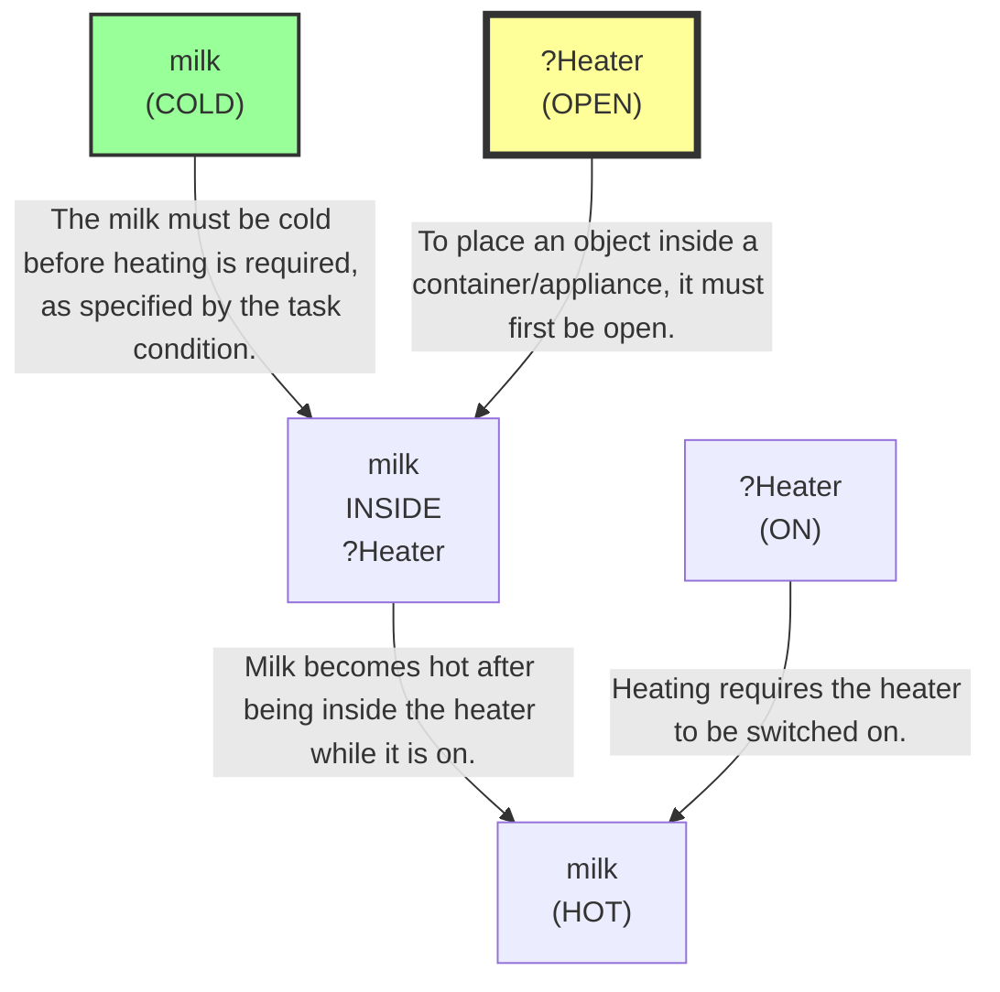
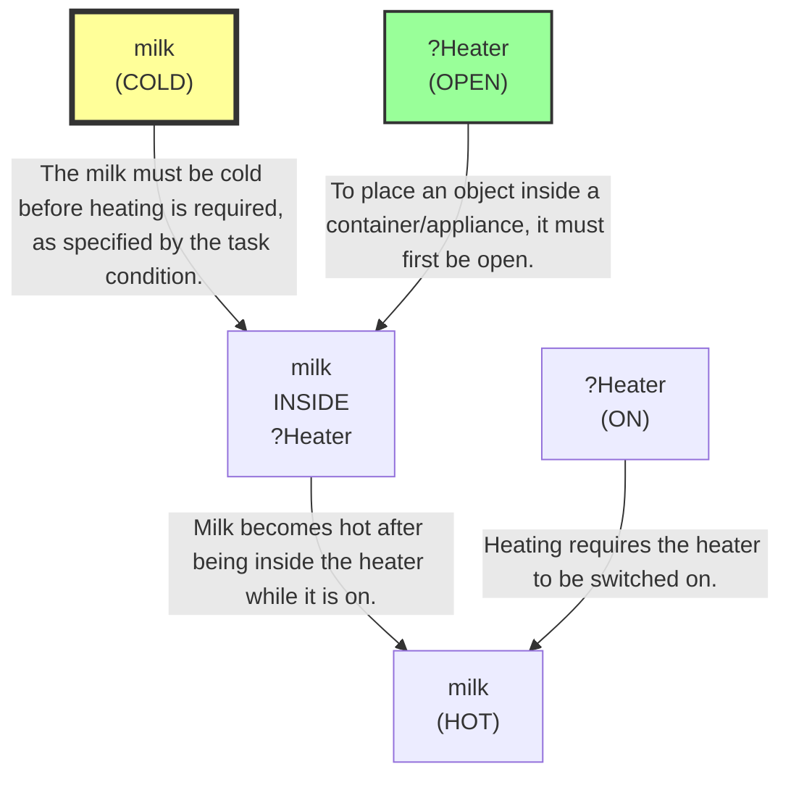
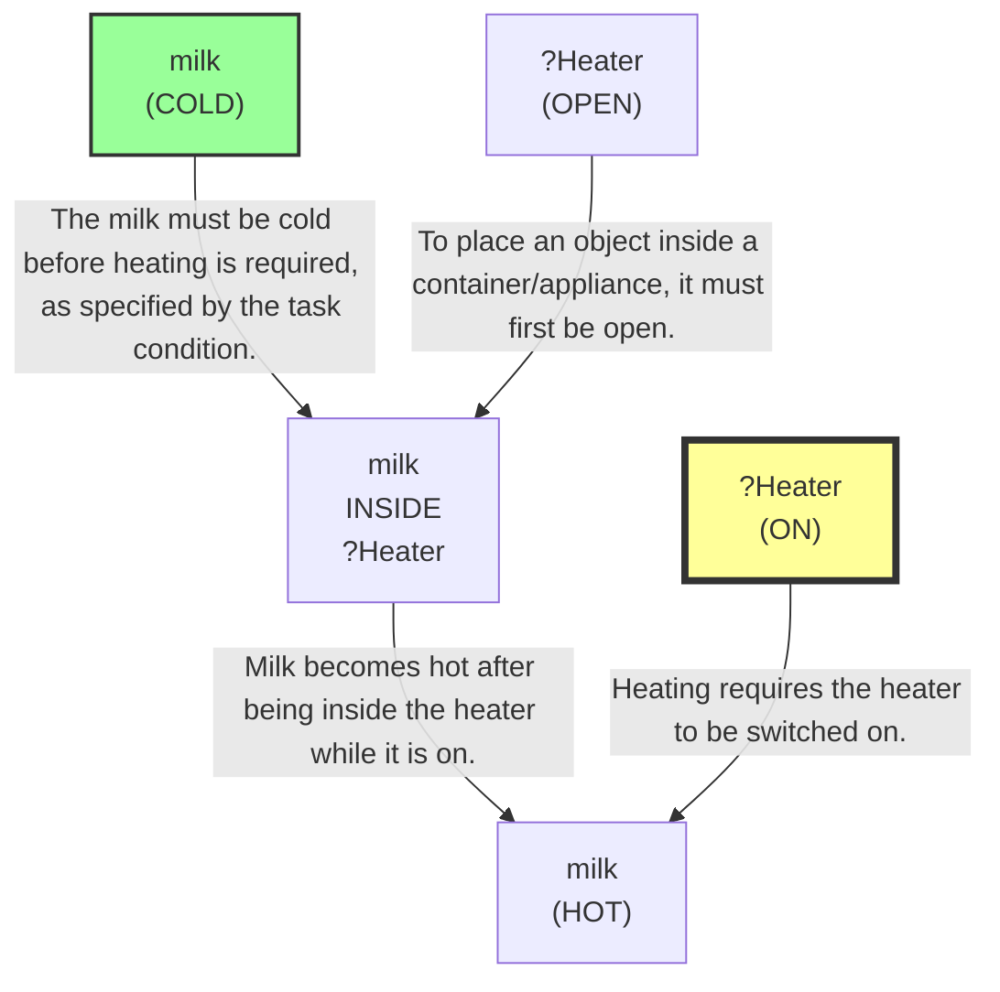
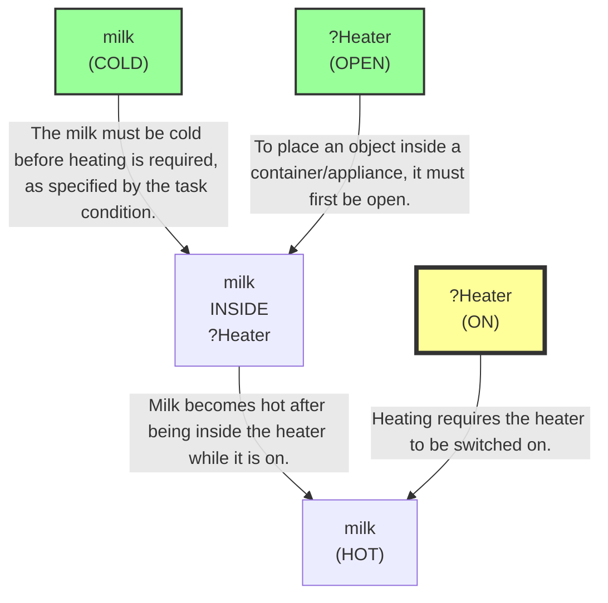
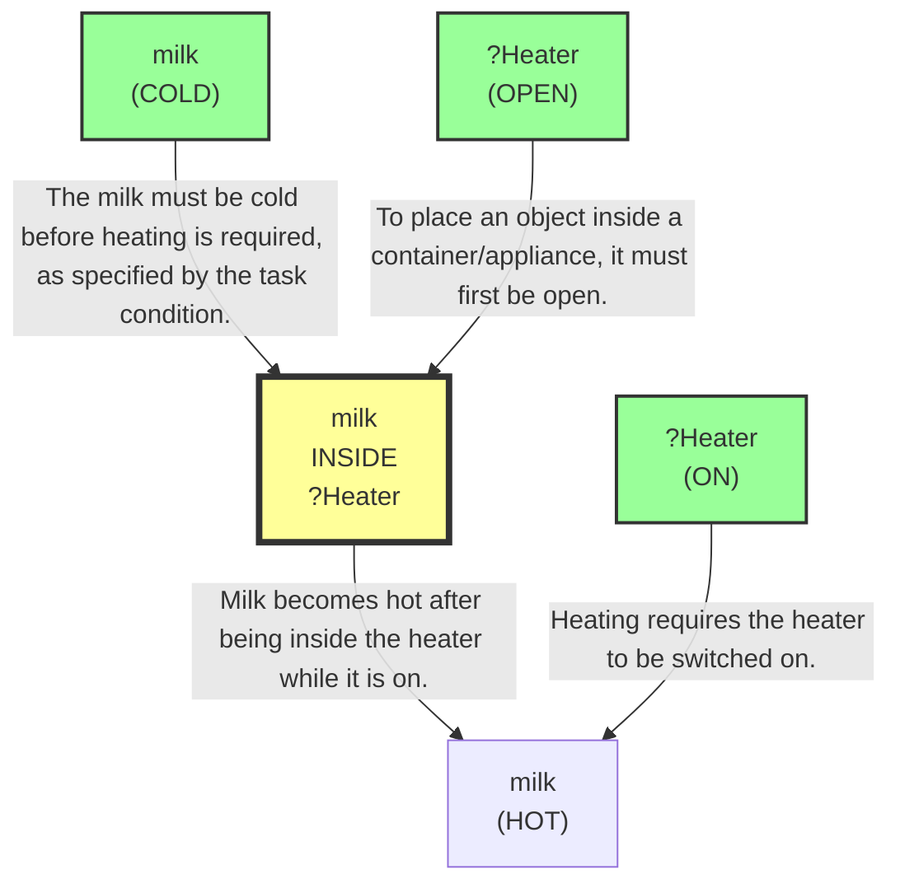
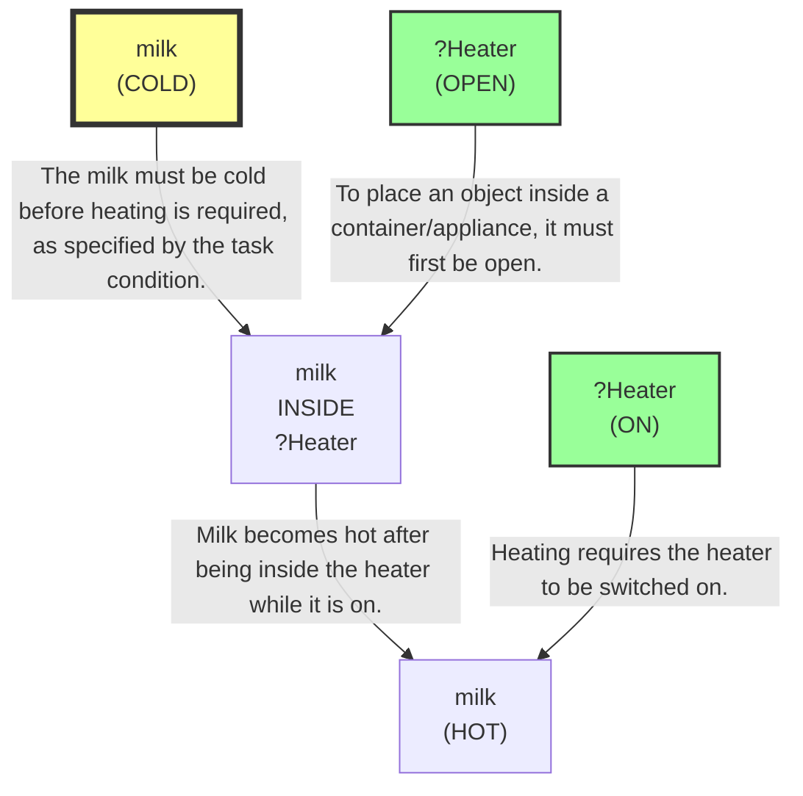
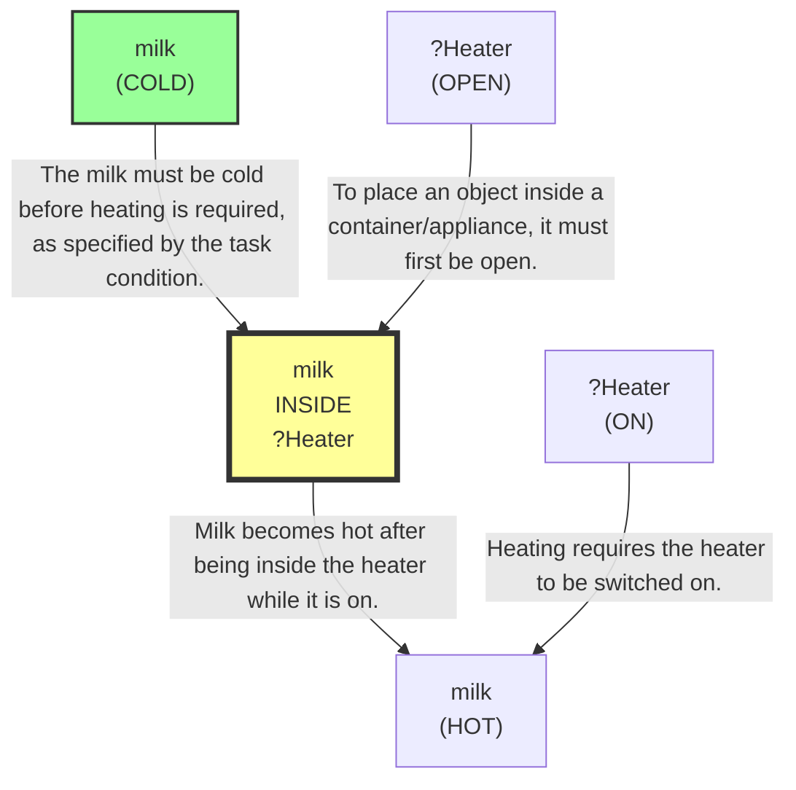
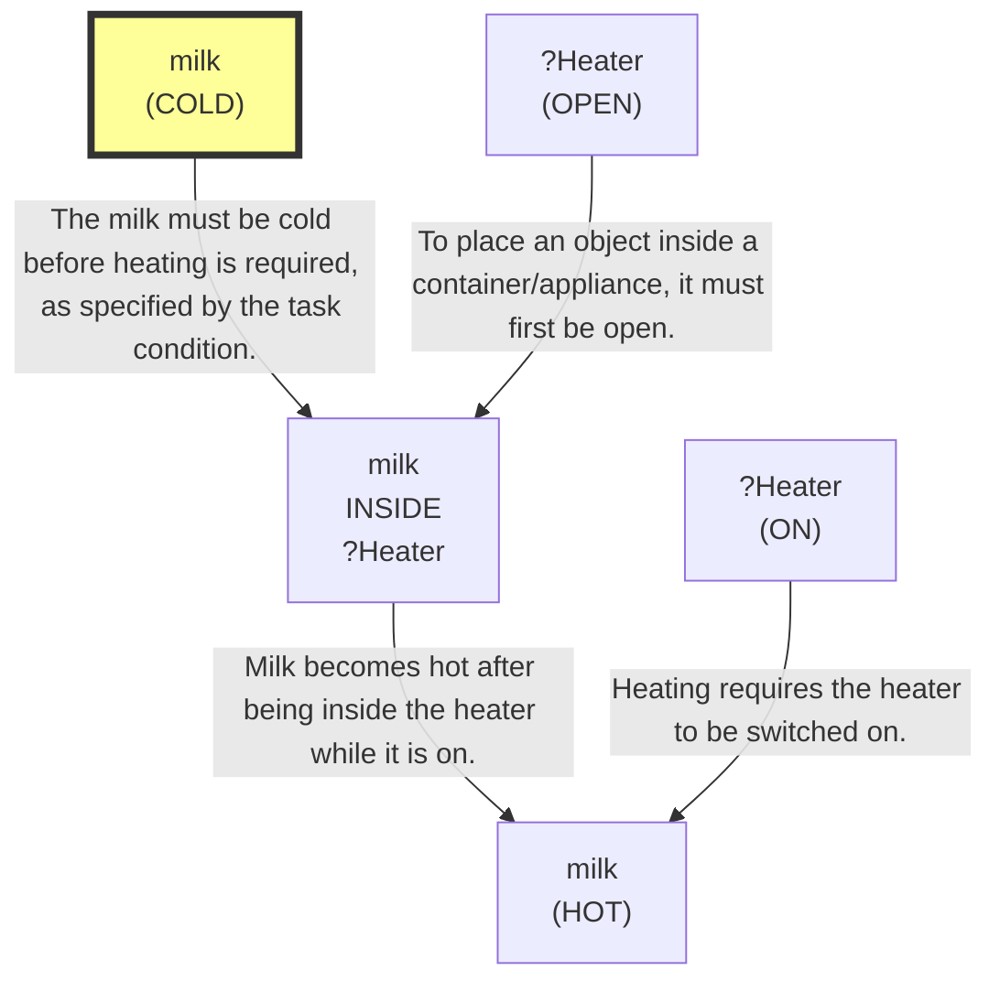

# 🚀 VirtualHome Agent Episode Log


### [GoalReasoner (Module A - Intent)] Output
```json
{
  "is_instruction_obviously_vague": false,
  "clarification_question": null,
  "target_object": "milk",
  "location_hint": null,
  "reasoning_chain": [
    {
      "question": "Why does the user want this object?",
      "answer": "To warm the milk if it is cold."
    },
    {
      "question": "Why is that important?",
      "answer": "Because the user wants the milk at a warmer, usable temperature."
    },
    {
      "question": "What fundamental need does this fulfill?",
      "answer": "It fulfills the need to have a beverage or ingredient at a desired warm temperature."
    },
    {
      "question": "Are there any deeper psychological or physical motivations?",
      "answer": "The physical motivation is to make the milk more comfortable or suitable for drinking or use in a recipe."
    }
  ],
  "deep_intent": "The user wants a cold liquid to be heated to a warmer, usable temperature.",
  "acceptable_alternatives_properties": [
    {
      "priority": 1,
      "description": "Other cold drinkable liquids that can be safely heated, such as water or prepared beverages"
    },
    {
      "priority": 2,
      "description": "Other dairy or milk-like liquids that can be warmed, such as plant-based milk alternatives"
    },
    {
      "priority": 3,
      "description": "Warmable beverage ingredients or ready-to-drink liquids intended to be served hot"
    },
    {
      "priority": 4,
      "description": "Any safe microwave-heatable liquid meant to be consumed warm"
    }
  ]
}
```

### [PerceptionFilter] Output
```json
{
  "reasoning": "The goal is to warm milk, so the target object milk must be kept. The SDG requires a heater that can be opened and turned on; in the visible objects, microwave and stove are the relevant heating appliances and must both be retained as functional alternatives/backups. No other objects are necessary.",
  "selected_classes": [
    "milk",
    "character",
    "stove",
    "microwave"
  ],
  "raw_class_count": 50
}
```

### [LLMExecutor] Output
```json
{
  "reasoning": "The task is to warm the cold milk. The SDG requires selecting a heater that can be opened and switched on. In the current graph, microwave(171) is the best match for ?Heater because it has CAN_OPEN, HAS_SWITCH, and is a container. Before any later grab/open/putin actions, the first required step is to walk to the chosen heater. The cold milk instance is milk(176), which matches N1.",
  "satisfied_nodes": [
    "N1"
  ],
  "current_node_focus": "N4",
  "mapped_variables": {
    "?Heater": "microwave(171)"
  },
  "action": "[walk] <microwave> (171)"
}
```

### [RoboStateMultiTaskController] Output
```json
{
  "action": "[walk] <microwave> (171)",
  "active_task_id": "task_1",
  "task_context": {
    "active_task_id": "task_1",
    "pending_task_ids": [],
    "satisfied_task_ids": []
  },
  "source": "llm_executor"
}
```
## Step 0
- **Action**: `[walk] <microwave> (171)`
- **Action Success**: `True`
- **Action Message**: {'0': {'message': 'Success'}}
- **Active Task**: `task_1`
- **Decision Source**: `llm_executor`
- **Task Progress**: M1_05=pending
- **SDG Status**:

- **Observed Items (10)**: stove(163) [OFF,CLOSED], microwave(171) [CLOSED,OFF], milk(177) [CLOSED], milk(176) [COLD,CLOSED], character(1), kitchen(11), livingroom(183), bedroom(241), bathroom(285), bedroom(346)


### [PerceptionFilter] Output
```json
{
  "reasoning": "Reused cached class selection.",
  "selected_classes": [
    "milk",
    "character",
    "stove",
    "microwave"
  ],
  "raw_class_count": 50
}
```

### [LLMExecutor] Output
```json
{
  "reasoning": "The task is to warm the cold milk. The SDG requires a heater that is open, on, and contains the milk. We are already close to the microwave from the previous successful walk, and the microwave is the best match for ?Heater because it is a container appliance with a switch and can be opened. The next required precondition is to open it before putting milk inside.",
  "satisfied_nodes": [
    "N1"
  ],
  "current_node_focus": "N4",
  "mapped_variables": {
    "?Heater": "microwave(171)"
  },
  "action": "[open] <microwave> (171)"
}
```

### [RoboStateMultiTaskController] Output
```json
{
  "action": "[open] <microwave> (171)",
  "active_task_id": "task_1",
  "task_context": {
    "active_task_id": "task_1",
    "pending_task_ids": [],
    "satisfied_task_ids": []
  },
  "source": "llm_executor"
}
```
## Step 1
- **Action**: `[open] <microwave> (171)`
- **Action Success**: `True`
- **Action Message**: {'0': {'message': 'Success'}}
- **Active Task**: `task_1`
- **Decision Source**: `llm_executor`
- **Task Progress**: M1_05=pending
- **SDG Status**:

- **Observed Items (10)**: stove(163) [OFF,CLOSED], microwave(171) [CLOSED,OFF], milk(177) [CLOSED], milk(176) [COLD,CLOSED], character(1), kitchen(11), livingroom(183), bedroom(241), bathroom(285), bedroom(346)


### [PerceptionFilter] Output
```json
{
  "reasoning": "Reused cached class selection.",
  "selected_classes": [
    "milk",
    "character",
    "stove",
    "microwave"
  ],
  "raw_class_count": 50
}
```

### [LLMExecutor] Output
```json
{
  "reasoning": "The SDG requires a COLD milk object to be placed inside an ON, OPEN heater. We have already walked to and opened the microwave, so the next missing prerequisite is the milk itself. There are two milk instances: milk(176) is explicitly COLD, matching N1, while milk(177) is not cold. To progress toward putting the correct milk into the microwave, I should first move to the cold milk(176) so it can be grabbed next.",
  "satisfied_nodes": [
    "N4"
  ],
  "current_node_focus": "N1",
  "mapped_variables": {
    "?Heater": "microwave(171)"
  },
  "action": "[walk] <milk> (176)"
}
```

### [RoboStateMultiTaskController] Output
```json
{
  "action": "[walk] <milk> (176)",
  "active_task_id": "task_1",
  "task_context": {
    "active_task_id": "task_1",
    "pending_task_ids": [],
    "satisfied_task_ids": []
  },
  "source": "llm_executor"
}
```
## Step 2
- **Action**: `[walk] <milk> (176)`
- **Action Success**: `True`
- **Action Message**: {'0': {'message': 'Success'}}
- **Active Task**: `task_1`
- **Decision Source**: `llm_executor`
- **Task Progress**: M1_05=pending
- **SDG Status**:

- **Observed Items (10)**: stove(163) [OFF,CLOSED], microwave(171) [OFF,OPEN], milk(177) [CLOSED], milk(176) [COLD,CLOSED], character(1), kitchen(11), livingroom(183), bedroom(241), bathroom(285), bedroom(346)


### [PerceptionFilter] Output
```json
{
  "reasoning": "Reused cached class selection.",
  "selected_classes": [
    "milk",
    "character",
    "stove",
    "microwave"
  ],
  "raw_class_count": 50
}
```

### [LLMExecutor] Output
```json
{
  "reasoning": "The goal is to heat the cold milk. The correct milk instance is milk(176) because it is explicitly COLD and currently near the character. The microwave(171) has already been opened, so the next required step is to turn it on before placing the milk inside. Since interaction with the heater requires being near it, the next atomic action should be to walk to the microwave. This advances the SDG by preparing for N3 (heater ON) and then N5 (milk inside heater).",
  "satisfied_nodes": [
    "N1"
  ],
  "current_node_focus": "N3",
  "mapped_variables": {
    "?Heater": "microwave(171)"
  },
  "action": "[walk] <microwave> (171)"
}
```

### [RoboStateMultiTaskController] Output
```json
{
  "action": "[walk] <microwave> (171)",
  "active_task_id": "task_1",
  "task_context": {
    "active_task_id": "task_1",
    "pending_task_ids": [],
    "satisfied_task_ids": []
  },
  "source": "llm_executor"
}
```
## Step 3
- **Action**: `[walk] <microwave> (171)`
- **Action Success**: `True`
- **Action Message**: {'0': {'message': 'Success'}}
- **Active Task**: `task_1`
- **Decision Source**: `llm_executor`
- **Task Progress**: M1_05=pending
- **SDG Status**:

- **Observed Items (10)**: stove(163) [OFF,CLOSED], microwave(171) [OFF,OPEN], milk(177) [CLOSED], milk(176) [COLD,CLOSED], character(1), kitchen(11), livingroom(183), bedroom(241), bathroom(285), bedroom(346)


### [PerceptionFilter] Output
```json
{
  "reasoning": "Reused cached class selection.",
  "selected_classes": [
    "milk",
    "character",
    "stove",
    "microwave"
  ],
  "raw_class_count": 50
}
```

### [LLMExecutor] Output
```json
{
  "reasoning": "The goal is to warm cold milk using the heater. The microwave(171) is already open and close to the character, but it is currently OFF. Since the milk(176) is the clearly COLD instance and the next prerequisite for heating is to turn the heater on, the best next step is to switch on the microwave before placing the milk inside.",
  "satisfied_nodes": [
    "N1",
    "N4"
  ],
  "current_node_focus": "N3",
  "mapped_variables": {
    "?Heater": "microwave(171)"
  },
  "action": "[switchon] <microwave> (171)"
}
```

### [RoboStateMultiTaskController] Output
```json
{
  "action": "[switchon] <microwave> (171)",
  "active_task_id": "task_1",
  "task_context": {
    "active_task_id": "task_1",
    "pending_task_ids": [],
    "satisfied_task_ids": []
  },
  "source": "llm_executor"
}
```
## Step 4
- **Action**: `[switchon] <microwave> (171)`
- **Action Success**: `True`
- **Action Message**: Faked switch operation in Python layer (bypassed Unity failure)
- **Active Task**: `task_1`
- **Decision Source**: `llm_executor`
- **Task Progress**: M1_05=pending
- **SDG Status**:

- **Observed Items (10)**: stove(163) [OFF,CLOSED], microwave(171) [OFF,OPEN], milk(177) [CLOSED], milk(176) [COLD,CLOSED], character(1), kitchen(11), livingroom(183), bedroom(241), bathroom(285), bedroom(346)


### [PerceptionFilter] Output
```json
{
  "reasoning": "Reused cached class selection.",
  "selected_classes": [
    "milk",
    "character",
    "stove",
    "microwave"
  ],
  "raw_class_count": 50
}
```

### [LLMExecutor] Output
```json
{
  "reasoning": "The SDG requires milk to be cold before heating, then inside an open heater while the heater is on. The currently tracked milk(176) is COLD, and the microwave(171) is already OPEN and ON, but the milk is still not inside it. I am already close to the milk and the microwave, so the next required step is to grab the cold milk before placing it into the heater.",
  "satisfied_nodes": [
    "N1",
    "N3",
    "N4"
  ],
  "current_node_focus": "N5",
  "mapped_variables": {
    "?Heater": "microwave(171)"
  },
  "action": "[grab] <milk> (176)"
}
```

### [RoboStateMultiTaskController] Output
```json
{
  "action": "[walk] <milk> (176)",
  "active_task_id": "task_1",
  "task_context": {
    "active_task_id": "task_1",
    "pending_task_ids": [],
    "satisfied_task_ids": []
  },
  "source": "llm_executor_repaired"
}
```
## Step 5
- **Action**: `[walk] <milk> (176)`
- **Action Success**: `True`
- **Action Message**: {'0': {'message': 'Success'}}
- **Active Task**: `task_1`
- **Decision Source**: `llm_executor_repaired`
- **Task Progress**: M1_05=pending
- **SDG Status**:

- **Observed Items (10)**: stove(163) [OFF,CLOSED], microwave(171) [ON,OPEN], milk(177) [CLOSED], milk(176) [COLD,CLOSED], character(1), kitchen(11), livingroom(183), bedroom(241), bathroom(285), bedroom(346)


### [PerceptionFilter] Output
```json
{
  "reasoning": "Reused cached class selection.",
  "selected_classes": [
    "milk",
    "character",
    "stove",
    "microwave"
  ],
  "raw_class_count": 50
}
```

### [LLMExecutor] Output
```json
{
  "reasoning": "The active SDG requires milk to be placed inside an open, on heater so it can become hot. Microwave(171) is already OPEN and ON, and the correct milk instance is milk(176) because it is explicitly COLD and close to the character. Since I am currently near milk(176) from the previous successful walk, the next atomic step is to grab it before returning to the microwave.",
  "satisfied_nodes": [
    "N1",
    "N3",
    "N4"
  ],
  "current_node_focus": "N5",
  "mapped_variables": {
    "?Heater": "microwave(171)"
  },
  "action": "[grab] <milk> (176)"
}
```

### [RoboStateMultiTaskController] Output
```json
{
  "action": "[grab] <milk> (176)",
  "active_task_id": "task_1",
  "task_context": {
    "active_task_id": "task_1",
    "pending_task_ids": [],
    "satisfied_task_ids": []
  },
  "source": "llm_executor"
}
```
## Step 6
- **Action**: `[grab] <milk> (176)`
- **Action Success**: `False`
- **Action Message**: temporary_unavailable: target disappeared; wait or search and retry
- **Active Task**: `task_1`
- **Decision Source**: `llm_executor`
- **Task Progress**: M1_05=pending
- **SDG Status**:

- **Observed Items (10)**: stove(163) [OFF,CLOSED], microwave(171) [ON,OPEN], milk(177) [CLOSED], milk(176) [COLD,CLOSED], character(1), kitchen(11), livingroom(183), bedroom(241), bathroom(285), bedroom(346)


### [PerceptionFilter] Output
```json
{
  "reasoning": "Reused cached class selection.",
  "selected_classes": [
    "milk",
    "character",
    "stove",
    "microwave"
  ],
  "raw_class_count": 50
}
```

### [LLMExecutor] Output
```json
{
  "reasoning": "The previous grab failed because milk(176) temporarily disappeared, which indicates another agent may be using it. Per the failure handling rules, I should wait in place rather than switching targets or retrying immediately. The microwave is already open and on, so the current blocking issue is access to the specific milk object, not the heater state.",
  "satisfied_nodes": [
    "N3",
    "N4"
  ],
  "current_node_focus": "N5",
  "mapped_variables": {
    "?Heater": "microwave(171)"
  },
  "action": "[wait]"
}
```

### [RoboStateMultiTaskController] Output
```json
{
  "action": "[walk] <livingroom> (183)",
  "active_task_id": null,
  "task_context": {
    "active_task_id": null,
    "pending_task_ids": [
      "task_1"
    ],
    "satisfied_task_ids": []
  },
  "source": "loop_recovery_room_revisit"
}
```
## Step 7
- **Action**: `[walk] <livingroom> (183)`
- **Action Success**: `True`
- **Action Message**: {'0': {'message': 'Success'}}
- **Decision Source**: `loop_recovery_room_revisit`
- **Task Progress**: M1_05=pending
- **SDG Status**:
No SDG active.
- **Observed Items (160)**: wall(12), wall(13), wall(14), wall(15), wall(16), wall(17), wall(18), wall(19), wall(20), wall(21), floor(22), floor(23), floor(24), floor(25), floor(26)...


### [PerceptionFilter] Output
```json
{
  "reasoning": "The goal is to heat milk, so the necessary items are the target liquid and the possible heating appliances. The SDG indicates the heater must be open and on, so we keep all valid heater candidates that could warm milk.",
  "selected_classes": [
    "fridge",
    "character",
    "stove",
    "milk",
    "microwave"
  ],
  "raw_class_count": 59
}
```

### [LLMExecutor] Output
```json
{
  "reasoning": "The previous grab on milk(176) failed because that exact object temporarily disappeared, which indicates another agent is using it. Per the failure-handling rule, I should wait in place rather than substituting with a different milk instance, because we already identified the intended milk as the cold one. The microwave is already open and on, so once the milk returns the next step will be to grab it. For now, waiting is the only progress-preserving atomic action.",
  "satisfied_nodes": [
    "N3",
    "N4"
  ],
  "current_node_focus": "N1",
  "mapped_variables": {
    "?Heater": "microwave (171)"
  },
  "action": "[wait]"
}
```

### [RoboStateMultiTaskController] Output
```json
{
  "action": "[walk] <bedroom> (241)",
  "active_task_id": null,
  "task_context": {
    "active_task_id": null,
    "pending_task_ids": [
      "task_1"
    ],
    "satisfied_task_ids": []
  },
  "source": "loop_recovery_room_revisit"
}
```
## Step 8
- **Action**: `[walk] <bedroom> (241)`
- **Action Success**: `True`
- **Action Message**: {'0': {'message': 'Success'}}
- **Decision Source**: `loop_recovery_room_revisit`
- **Task Progress**: M1_05=pending
- **SDG Status**:
No SDG active.
- **Observed Items (212)**: wall(12), wall(13), wall(14), wall(15), wall(16), wall(17), wall(18), wall(19), wall(20), wall(21), floor(22), floor(23), floor(24), floor(25), floor(26)...


### [PerceptionFilter] Output
```json
{
  "reasoning": "The goal is to heat milk, so the essential objects are the target milk and a valid heater appliance. The SDG requires the heater to be open and on, so a microwave or stove are the relevant heating options, and both must be retained as functional alternatives.",
  "selected_classes": [
    "milk",
    "character",
    "stove",
    "microwave"
  ],
  "raw_class_count": 65
}
```

### [LLMExecutor] Output
```json
{
  "reasoning": "The active task is to warm milk in the microwave. The correct milk instance is milk(176) because it is explicitly COLD, matching N1. The microwave(171) is already ON and OPEN, so N3 and N4 are satisfied. The previous grab attempt failed because the milk temporarily disappeared, but the current graph shows milk(176) is present again and close to the character in the bedroom. To proceed toward N5, I should first walk back to the milk before attempting to grab it.",
  "satisfied_nodes": [
    "N3",
    "N4",
    "N1"
  ],
  "current_node_focus": "N5",
  "mapped_variables": {
    "?Heater": "microwave(171)"
  },
  "action": "[walk] <milk> (176)"
}
```

### [RoboStateMultiTaskController] Output
```json
{
  "action": "[walk] <milk> (176)",
  "active_task_id": "task_1",
  "task_context": {
    "active_task_id": "task_1",
    "pending_task_ids": [],
    "satisfied_task_ids": []
  },
  "source": "llm_executor"
}
```
## Step 9
- **Action**: `[walk] <milk> (176)`
- **Action Success**: `False`
- **Action Message**: temporary_unavailable: target is temporarily hidden
- **Active Task**: `task_1`
- **Decision Source**: `llm_executor`
- **Task Progress**: M1_05=pending
- **SDG Status**:

- **Observed Items (10)**: stove(163) [OFF,CLOSED], microwave(171) [ON,OPEN], milk(177) [CLOSED], milk(176) [COLD,CLOSED], character(1), kitchen(11), livingroom(183), bedroom(241), bathroom(285), bedroom(346)


### [RoboStateMultiTaskController] Output
```json
{
  "action": "[walk] <bathroom> (285)",
  "active_task_id": null,
  "task_context": {
    "active_task_id": null,
    "pending_task_ids": [
      "task_1"
    ],
    "satisfied_task_ids": []
  },
  "source": "loop_recovery_room_revisit"
}
```
## Step 10
- **Action**: `[walk] <bathroom> (285)`
- **Action Success**: `True`
- **Action Message**: {'0': {'message': 'Success'}}
- **Decision Source**: `loop_recovery_room_revisit`
- **Task Progress**: M1_05=pending
- **SDG Status**:
No SDG active.
- **Observed Items (244)**: wall(12), wall(13), wall(14), wall(15), wall(16), wall(17), wall(18), wall(19), wall(20), wall(21), floor(22), floor(23), floor(24), floor(25), floor(26)...


### [PerceptionFilter] Output
```json
{
  "reasoning": "The goal is to heat milk, so the target object milk must be kept along with all plausible heating appliances and required access states implied by the SDG. A microwave and stove are the functional alternatives for heating, and a fridge is relevant as a possible cold source/backup for the milk. Since the SDG requires the heater to be open and on, the selected classes should cover those physical heater options only.",
  "selected_classes": [
    "fridge",
    "character",
    "stove",
    "milk",
    "microwave"
  ],
  "raw_class_count": 81
}
```

### [LLMExecutor] Output
```json
{
  "reasoning": "The active task is to warm cold milk in a heater. The current graph shows milk(176) is the cold milk and microwave(171) is already open and on, so the remaining gap is to physically obtain the milk before placing it into the microwave. Since the last grab failed because the milk temporarily disappeared, but the current graph now shows milk(176) present again in the kitchen, the next progress-making action is to walk to the milk so it can be grabbed next.",
  "satisfied_nodes": [
    "N3",
    "N4"
  ],
  "current_node_focus": "N1",
  "mapped_variables": {
    "?Heater": "microwave(171)"
  },
  "action": "[walk] <milk> (176)"
}
```

### [RoboStateMultiTaskController] Output
```json
{
  "action": "[walk] <milk> (176)",
  "active_task_id": "task_1",
  "task_context": {
    "active_task_id": "task_1",
    "pending_task_ids": [],
    "satisfied_task_ids": []
  },
  "source": "llm_executor"
}
```
## Step 11
- **Action**: `[walk] <milk> (176)`
- **Action Success**: `True`
- **Action Message**: {'0': {'message': 'Success'}}
- **Active Task**: `task_1`
- **Decision Source**: `llm_executor`
- **Task Progress**: M1_05=pending
- **SDG Status**:

- **Observed Items (11)**: fridge(162) [CLOSED], stove(163) [OFF,CLOSED], microwave(171) [ON,OPEN], milk(177) [CLOSED], milk(176) [COLD,CLOSED], character(1), kitchen(11), livingroom(183), bedroom(241), bathroom(285), bedroom(346)


### [PerceptionFilter] Output
```json
{
  "reasoning": "Reused cached class selection.",
  "selected_classes": [
    "fridge",
    "character",
    "stove",
    "milk",
    "microwave"
  ],
  "raw_class_count": 81
}
```

### [LLMExecutor] Output
```json
{
  "reasoning": "The target milk instance that matches the heating precondition is milk(176), which is already COLD and currently close to the character. The next required step toward making it hot is to pick it up before moving it into the microwave. The microwave is already ON and OPEN, so no further heater setup is needed yet. I should not repeat a walk action because the graph already shows the character is close to milk(176).",
  "satisfied_nodes": [
    "N1",
    "N3",
    "N4"
  ],
  "current_node_focus": "N5",
  "mapped_variables": {
    "?Heater": "microwave(171)"
  },
  "action": "[grab] <milk> (176)"
}
```

### [RoboStateMultiTaskController] Output
```json
{
  "action": "[grab] <milk> (176)",
  "active_task_id": "task_1",
  "task_context": {
    "active_task_id": "task_1",
    "pending_task_ids": [],
    "satisfied_task_ids": []
  },
  "source": "llm_executor"
}
```
## Step 12
- **Action**: `[grab] <milk> (176)`
- **Action Success**: `False`
- **Action Message**: temporary_unavailable: target disappeared; wait or search and retry
- **Active Task**: `task_1`
- **Decision Source**: `llm_executor`
- **Task Progress**: M1_05=pending
- **SDG Status**:

- **Observed Items (11)**: fridge(162) [CLOSED], stove(163) [OFF,CLOSED], microwave(171) [ON,OPEN], milk(177) [CLOSED], milk(176) [COLD,CLOSED], character(1), kitchen(11), livingroom(183), bedroom(241), bathroom(285), bedroom(346)


### [PerceptionFilter] Output
```json
{
  "reasoning": "Reused cached class selection.",
  "selected_classes": [
    "fridge",
    "character",
    "stove",
    "milk",
    "microwave"
  ],
  "raw_class_count": 81
}
```

### [LLMExecutor] Output
```json
{
  "reasoning": "The active goal is to heat cold milk in the microwave. N3 (heater on) is already satisfied because the microwave is ON, and N4 (heater open) is already satisfied because the microwave is OPEN. The next missing prerequisite is to get the milk into the microwave. Since milk(176) is the closest and explicitly marked COLD, it is the best bind for the target milk. I am already near it per the graph relation CLOSE character(1), so the next atomic step is to grab it.",
  "satisfied_nodes": [
    "N3",
    "N4",
    "N1"
  ],
  "current_node_focus": "N5",
  "mapped_variables": {
    "?Heater": "microwave(171)"
  },
  "action": "[grab] <milk> (176)"
}
```

### [RoboStateMultiTaskController] Output
```json
{
  "action": "[grab] <milk> (176)",
  "active_task_id": "task_1",
  "task_context": {
    "active_task_id": "task_1",
    "pending_task_ids": [],
    "satisfied_task_ids": []
  },
  "source": "llm_executor"
}
```
## Step 13
- **Action**: `[grab] <milk> (176)`
- **Action Success**: `False`
- **Action Message**: temporary_unavailable: target is temporarily hidden
- **Active Task**: `task_1`
- **Decision Source**: `llm_executor`
- **Task Progress**: M1_05=pending
- **SDG Status**:

- **Observed Items (11)**: fridge(162) [CLOSED], stove(163) [OFF,CLOSED], microwave(171) [ON,OPEN], milk(177) [CLOSED], milk(176) [COLD,CLOSED], character(1), kitchen(11), livingroom(183), bedroom(241), bathroom(285), bedroom(346)


### [RoboStateMultiTaskController] Output
```json
{
  "action": "[walk] <bedroom> (346)",
  "active_task_id": null,
  "task_context": {
    "active_task_id": null,
    "pending_task_ids": [
      "task_1"
    ],
    "satisfied_task_ids": []
  },
  "source": "loop_recovery_room_revisit"
}
```
## Step 14
- **Action**: `[walk] <bedroom> (346)`
- **Action Success**: `True`
- **Action Message**: {'0': {'message': 'Success'}}
- **Decision Source**: `loop_recovery_room_revisit`
- **Task Progress**: M1_05=pending
- **SDG Status**:
No SDG active.
- **Observed Items (304)**: wall(12), wall(13), wall(14), wall(15), wall(16), wall(17), wall(18), wall(19), wall(20), wall(21), floor(22), floor(23), floor(24), floor(25), floor(26)...


### [PerceptionFilter] Output
```json
{
  "reasoning": "The goal is to heat milk, so the minimum needed is the target object plus a heating appliance that can contain it. Since the heater type is abstract in the SDG and alternatives must be retained, both visible heating options are kept. The heater must also be open and on, but those are states, not object classes.",
  "selected_classes": [
    "milk",
    "character",
    "stove",
    "microwave"
  ],
  "raw_class_count": 91
}
```

### [LLMExecutor] Output
```json
{
  "reasoning": "The goal is to warm cold milk by placing it inside an on/open heater. The current graph shows two milk candidates: milk(176) is cold but temporarily unavailable and already close to the character; milk(177) is visible in the kitchen but not marked cold. Because the task specifically requires milk and the task intent is to warm cold milk, milk(176) is the best binding for the target object. Since it is currently unavailable/hidden, the correct autonomous behavior is to wait for it to reappear rather than switching to a non-cold substitute. No heater interaction can progress until the milk is retrievable.",
  "satisfied_nodes": [],
  "current_node_focus": "N1",
  "mapped_variables": {
    "?Heater": "microwave(171)"
  },
  "action": "[wait]"
}
```

### [RoboStateMultiTaskController] Output
```json
{
  "action": "[walk] <livingroom> (183)",
  "active_task_id": null,
  "task_context": {
    "active_task_id": null,
    "pending_task_ids": [
      "task_1"
    ],
    "satisfied_task_ids": []
  },
  "source": "loop_recovery_room_revisit"
}
```
## Step 15
- **Action**: `[walk] <livingroom> (183)`
- **Action Success**: `True`
- **Action Message**: {'0': {'message': 'Success'}}
- **Decision Source**: `loop_recovery_room_revisit`
- **Task Progress**: M1_05=pending
- **SDG Status**:
No SDG active.
- **Observed Items (362)**: wall(12), wall(13), wall(14), wall(15), wall(16), wall(17), wall(18), wall(19), wall(20), wall(21), floor(22), floor(23), floor(24), floor(25), floor(26)...


### [PerceptionFilter] Output
```json
{
  "reasoning": "Reused cached class selection.",
  "selected_classes": [
    "milk",
    "character",
    "stove",
    "microwave"
  ],
  "raw_class_count": 91
}
```

### [LLMExecutor] Output
```json
{
  "reasoning": "The task requires heating cold milk. The exact target milk instance that matches the SDG's cold precondition is milk(176), which is inside the kitchen. We are currently in the livingroom, so the next required step is to walk to the microwave, since it is the available heater that is already ON and OPEN. We cannot put milk inside it until we are near the appliance, and this also aligns with the SDG path toward placing the milk into the heater.",
  "satisfied_nodes": [
    "N1",
    "N3",
    "N4"
  ],
  "current_node_focus": "N5",
  "mapped_variables": {
    "?Heater": "microwave(171)"
  },
  "action": "[walk] <microwave> (171)"
}
```

### [RoboStateMultiTaskController] Output
```json
{
  "action": "[walk] <microwave> (171)",
  "active_task_id": "task_1",
  "task_context": {
    "active_task_id": "task_1",
    "pending_task_ids": [],
    "satisfied_task_ids": []
  },
  "source": "llm_executor"
}
```
## Step 16
- **Action**: `[walk] <microwave> (171)`
- **Action Success**: `True`
- **Action Message**: {'0': {'message': 'Success'}}
- **Active Task**: `task_1`
- **Decision Source**: `llm_executor`
- **Task Progress**: M1_05=pending
- **SDG Status**:

- **Observed Items (10)**: stove(163) [OFF,CLOSED], microwave(171) [ON,OPEN], milk(177) [CLOSED], milk(176) [COLD,CLOSED], character(1), kitchen(11), livingroom(183), bedroom(241), bathroom(285), bedroom(346)


### [PerceptionFilter] Output
```json
{
  "reasoning": "Reused cached class selection.",
  "selected_classes": [
    "milk",
    "character",
    "stove",
    "microwave"
  ],
  "raw_class_count": 91
}
```

### [LLMExecutor] Output
```json
{
  "reasoning": "The current goal is to heat the cold milk. The best bound milk object for the SDG is milk(176), because it is explicitly COLD and thus satisfies N1. We are already close to microwave(171) per the graph, and it is OPEN and ON, so N4 and N3 are already satisfied. The remaining gap is to place the milk inside the heater, but the SDG and engine rules require holding the milk first, and the milk is currently inside the kitchen and not held. Since we just walked to the microwave, the next atomic action should be to walk to the specific milk object before grabbing it.",
  "satisfied_nodes": [
    "N1",
    "N3",
    "N4"
  ],
  "current_node_focus": "N5",
  "mapped_variables": {
    "?Heater": "microwave(171)"
  },
  "action": "[walk] <milk> (176)"
}
```

### [RoboStateMultiTaskController] Output
```json
{
  "action": "[walk] <milk> (176)",
  "active_task_id": "task_1",
  "task_context": {
    "active_task_id": "task_1",
    "pending_task_ids": [],
    "satisfied_task_ids": []
  },
  "source": "llm_executor"
}
```
## Step 17
- **Action**: `[walk] <milk> (176)`
- **Action Success**: `True`
- **Action Message**: {'0': {'message': 'Success'}}
- **Active Task**: `task_1`
- **Decision Source**: `llm_executor`
- **Task Progress**: M1_05=pending
- **SDG Status**:

- **Observed Items (10)**: stove(163) [OFF,CLOSED], microwave(171) [ON,OPEN], milk(177) [CLOSED], milk(176) [COLD,CLOSED], character(1), kitchen(11), livingroom(183), bedroom(241), bathroom(285), bedroom(346)


### [PerceptionFilter] Output
```json
{
  "reasoning": "Reused cached class selection.",
  "selected_classes": [
    "milk",
    "character",
    "stove",
    "microwave"
  ],
  "raw_class_count": 91
}
```

### [LLMExecutor] Output
```json
{
  "reasoning": "The task is to warm the cold milk. The current best matching heater is microwave(171), which is already ON and OPEN, but the milk is not yet being held and we cannot put it inside from across the room. Since I have already walked to the milk and need to interact with it next, the immediate progress step is to grab the cold milk(176) so I can later place it into the microwave.",
  "satisfied_nodes": [
    "N1",
    "N3",
    "N4"
  ],
  "current_node_focus": "N5",
  "mapped_variables": {
    "?Heater": "microwave(171)"
  },
  "action": "[grab] <milk> (176)"
}
```

### [RoboStateMultiTaskController] Output
```json
{
  "action": "[grab] <milk> (176)",
  "active_task_id": "task_1",
  "task_context": {
    "active_task_id": "task_1",
    "pending_task_ids": [],
    "satisfied_task_ids": []
  },
  "source": "llm_executor"
}
```
## Step 18
- **Action**: `[grab] <milk> (176)`
- **Action Success**: `False`
- **Action Message**: temporary_unavailable: target disappeared; wait or search and retry
- **Active Task**: `task_1`
- **Decision Source**: `llm_executor`
- **Task Progress**: M1_05=pending
- **SDG Status**:

- **Observed Items (10)**: stove(163) [OFF,CLOSED], microwave(171) [ON,OPEN], milk(177) [CLOSED], milk(176) [COLD,CLOSED], character(1), kitchen(11), livingroom(183), bedroom(241), bathroom(285), bedroom(346)


### [PerceptionFilter] Output
```json
{
  "reasoning": "Reused cached class selection.",
  "selected_classes": [
    "milk",
    "character",
    "stove",
    "microwave"
  ],
  "raw_class_count": 91
}
```

### [LLMExecutor] Output
```json
{
  "reasoning": "The target milk is currently visible again as milk(176) and is COLD/CLOSED, so the next prerequisite toward heating is to pick it up. I am already in the kitchen and near the object from the last successful walk, so the best next atomic step is to grab milk(176).",
  "satisfied_nodes": [
    "N1"
  ],
  "current_node_focus": "N5",
  "mapped_variables": {},
  "action": "[grab] <milk> (176)"
}
```

### [RoboStateMultiTaskController] Output
```json
{
  "action": "[grab] <milk> (176)",
  "active_task_id": "task_1",
  "task_context": {
    "active_task_id": "task_1",
    "pending_task_ids": [],
    "satisfied_task_ids": []
  },
  "source": "llm_executor"
}
```
## Step 19
- **Action**: `[grab] <milk> (176)`
- **Action Success**: `False`
- **Action Message**: temporary_unavailable: target is temporarily hidden
- **Active Task**: `task_1`
- **Decision Source**: `llm_executor`
- **Task Progress**: M1_05=pending
- **SDG Status**:

- **Observed Items (10)**: stove(163) [OFF,CLOSED], microwave(171) [ON,OPEN], milk(177) [CLOSED], milk(176) [COLD,CLOSED], character(1), kitchen(11), livingroom(183), bedroom(241), bathroom(285), bedroom(346)


### [RoboStateMultiTaskController] Output
```json
{
  "action": "[walk] <bedroom> (241)",
  "active_task_id": null,
  "task_context": {
    "active_task_id": null,
    "pending_task_ids": [
      "task_1"
    ],
    "satisfied_task_ids": []
  },
  "source": "loop_recovery_room_revisit"
}
```
## Step 20
- **Action**: `[walk] <bedroom> (241)`
- **Action Success**: `True`
- **Action Message**: {'0': {'message': 'Success'}}
- **Decision Source**: `loop_recovery_room_revisit`
- **Task Progress**: M1_05=pending
- **SDG Status**:
No SDG active.
- **Observed Items (362)**: wall(12), wall(13), wall(14), wall(15), wall(16), wall(17), wall(18), wall(19), wall(20), wall(21), floor(22), floor(23), floor(24), floor(25), floor(26)...


### [PerceptionFilter] Output
```json
{
  "reasoning": "Reused cached class selection.",
  "selected_classes": [
    "milk",
    "character",
    "stove",
    "microwave"
  ],
  "raw_class_count": 91
}
```

### [LLMExecutor] Output
```json
{
  "reasoning": "The task is to warm the cold milk. The correct milk instance for the SDG is milk(176), since it is explicitly COLD and currently in the kitchen. It is also close to the character, but the last attempted grabs failed because it was temporarily unavailable/hidden, so the next appropriate recovery step is to wait for it to reappear rather than changing targets or moving elsewhere. The microwave(171) is already ON and OPEN, so once the milk is available again, the next progression will be to grab it and place it inside the microwave.",
  "satisfied_nodes": [
    "N3",
    "N4"
  ],
  "current_node_focus": "N1",
  "mapped_variables": {
    "?Heater": "microwave(171)"
  },
  "action": "[wait]"
}
```

### [RoboStateMultiTaskController] Output
```json
{
  "action": "[walk] <bathroom> (285)",
  "active_task_id": null,
  "task_context": {
    "active_task_id": null,
    "pending_task_ids": [
      "task_1"
    ],
    "satisfied_task_ids": []
  },
  "source": "loop_recovery_room_revisit"
}
```
## Step 21
- **Action**: `[walk] <bathroom> (285)`
- **Action Success**: `True`
- **Action Message**: {'0': {'message': 'Success'}}
- **Decision Source**: `loop_recovery_room_revisit`
- **Task Progress**: M1_05=pending
- **SDG Status**:
No SDG active.
- **Observed Items (362)**: wall(12), wall(13), wall(14), wall(15), wall(16), wall(17), wall(18), wall(19), wall(20), wall(21), floor(22), floor(23), floor(24), floor(25), floor(26)...


### [PerceptionFilter] Output
```json
{
  "reasoning": "Reused cached class selection.",
  "selected_classes": [
    "milk",
    "character",
    "stove",
    "microwave"
  ],
  "raw_class_count": 91
}
```

### [LLMExecutor] Output
```json
{
  "reasoning": "The active task is to heat the cold milk. The exact milk object matching the SDG is milk(176), which is currently COLD and inside the kitchen. It is not yet being manipulated, and the immediate prerequisite progress is to get to the milk so it can later be grabbed and placed into a heater. Since we just walked to the bathroom in the prior step, I should not repeat that action. The next atomic step is to walk to the target milk object in the kitchen.",
  "satisfied_nodes": [
    "N1"
  ],
  "current_node_focus": "N5",
  "mapped_variables": {
    "?Heater": "microwave(171)"
  },
  "action": "[walk] <milk> (176)"
}
```

### [RoboStateMultiTaskController] Output
```json
{
  "action": "[walk] <milk> (176)",
  "active_task_id": "task_1",
  "task_context": {
    "active_task_id": "task_1",
    "pending_task_ids": [],
    "satisfied_task_ids": []
  },
  "source": "llm_executor"
}
```
## Step 22
- **Action**: `[walk] <milk> (176)`
- **Action Success**: `True`
- **Action Message**: {'0': {'message': 'Success'}}
- **Active Task**: `task_1`
- **Decision Source**: `llm_executor`
- **Task Progress**: M1_05=pending
- **SDG Status**:

- **Observed Items (10)**: stove(163) [OFF,CLOSED], microwave(171) [ON,OPEN], milk(177) [CLOSED], milk(176) [COLD,CLOSED], character(1), kitchen(11), livingroom(183), bedroom(241), bathroom(285), bedroom(346)


### [PerceptionFilter] Output
```json
{
  "reasoning": "Reused cached class selection.",
  "selected_classes": [
    "milk",
    "character",
    "stove",
    "microwave"
  ],
  "raw_class_count": 91
}
```

### [LLMExecutor] Output
```json
{
  "reasoning": "The active task is to heat the cold milk. In the current graph, milk(176) is the correct cold instance and is close to the character, but it is still inside the kitchen and not held. Because the next required step toward placing milk into a heater is to first pick it up, the immediate atomic action should be to grab milk(176).",
  "satisfied_nodes": [
    "N1"
  ],
  "current_node_focus": "N1",
  "mapped_variables": {
    "?Heater": "microwave(171)"
  },
  "action": "[grab] <milk> (176)"
}
```

### [RoboStateMultiTaskController] Output
```json
{
  "action": "[grab] <milk> (176)",
  "active_task_id": "task_1",
  "task_context": {
    "active_task_id": "task_1",
    "pending_task_ids": [],
    "satisfied_task_ids": []
  },
  "source": "llm_executor"
}
```
## Step 23
- **Action**: `[grab] <milk> (176)`
- **Action Success**: `True`
- **Action Message**: {'0': {'message': 'Success'}}
- **Active Task**: `task_1`
- **Decision Source**: `llm_executor`
- **Task Progress**: M1_05=pending
- **SDG Status**:

- **Observed Items (10)**: stove(163) [OFF,CLOSED], microwave(171) [ON,OPEN], milk(177) [CLOSED], milk(176) [COLD,CLOSED], character(1), kitchen(11), livingroom(183), bedroom(241), bathroom(285), bedroom(346)


### [PerceptionFilter] Output
```json
{
  "reasoning": "Reused cached class selection.",
  "selected_classes": [
    "milk",
    "character",
    "stove",
    "microwave"
  ],
  "raw_class_count": 91
}
```

### [LLMExecutor] Output
```json
{
  "reasoning": "The milk that is actually held and already cold is milk(176), satisfying N1. To heat it in the microwave, the next prerequisite is to make the heater open before placing the milk inside. The microwave(171) is the best match for ?Heater because it is a container appliance with ON, OPEN, and HAS_PLUG, and it is already in the kitchen. Since the user asked to warm milk, the next atomic step is to stay focused on the heater prerequisite by interacting with the microwave directly. However, because the current graph shows the character is holding milk(176) and is not explicitly close to the microwave, I cannot place it yet; the immediate actionable progression is to move to the microwave first. Wait: the instruction says do not repeat a walk action if you just did it, but the last actions were grab-based, so walking is allowed. I will walk to the microwave to prepare for opening it and then inserting the milk.",
  "satisfied_nodes": [
    "N1"
  ],
  "current_node_focus": "N4",
  "mapped_variables": {
    "?Heater": "microwave(171)"
  },
  "action": "[walk] <microwave> (171)"
}
```

### [RoboStateMultiTaskController] Output
```json
{
  "action": "[walk] <microwave> (171)",
  "active_task_id": "task_1",
  "task_context": {
    "active_task_id": "task_1",
    "pending_task_ids": [],
    "satisfied_task_ids": []
  },
  "source": "llm_executor"
}
```
## Step 24
- **Action**: `[walk] <microwave> (171)`
- **Action Success**: `True`
- **Action Message**: {'0': {'message': 'Success'}}
- **Active Task**: `task_1`
- **Decision Source**: `llm_executor`
- **Task Progress**: M1_05=pending
- **SDG Status**:

- **Observed Items (10)**: stove(163) [OFF,CLOSED], microwave(171) [ON,OPEN], milk(177) [CLOSED], milk(176) [COLD,CLOSED], character(1), kitchen(11), livingroom(183), bedroom(241), bathroom(285), bedroom(346)


### [PerceptionFilter] Output
```json
{
  "reasoning": "Reused cached class selection.",
  "selected_classes": [
    "milk",
    "character",
    "stove",
    "microwave"
  ],
  "raw_class_count": 91
}
```

### [LLMExecutor] Output
```json
{
  "reasoning": "The SDG requires milk to be placed inside the heater (microwave) and the microwave is already open and on. I am already close to the microwave according to the graph, and I am holding the cold milk(176), so the next progress-making step is to insert it into the microwave. This advances N5 and is necessary before the milk can become hot.",
  "satisfied_nodes": [
    "N1",
    "N3",
    "N4"
  ],
  "current_node_focus": "N5",
  "mapped_variables": {
    "?Heater": "microwave(171)"
  },
  "action": "[putin] <milk> (176) <microwave> (171)"
}
```

### [RoboStateMultiTaskController] Output
```json
{
  "action": "[putin] <milk> (176) <microwave> (171)",
  "active_task_id": "task_1",
  "task_context": {
    "active_task_id": "task_1",
    "pending_task_ids": [],
    "satisfied_task_ids": []
  },
  "source": "llm_executor"
}
```
## Step 25
- **Action**: `[putin] <milk> (176) <microwave> (171)`
- **Action Success**: `True`
- **Action Message**: {'0': {'message': 'Success'}}
- **Active Task**: `task_1`
- **Decision Source**: `llm_executor`
- **Task Progress**: M1_05=done
- **SDG Status**:

- **Observed Items (10)**: stove(163) [OFF,CLOSED], microwave(171) [ON,OPEN], milk(177) [CLOSED], milk(176) [COLD,CLOSED], character(1), kitchen(11), livingroom(183), bedroom(241), bathroom(285), bedroom(346)

