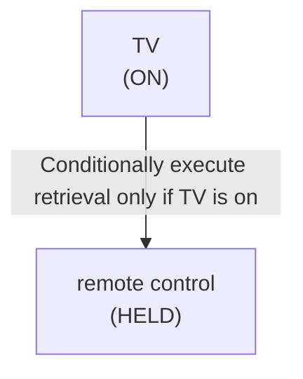
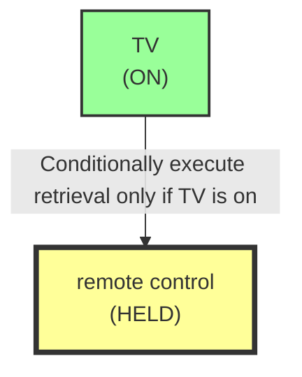

# 🚀 VirtualHome Agent Episode Log


### [GoalReasoner (Module A - Intent)] Output
```json
{
  "is_instruction_obviously_vague": false,
  "clarification_question": null,
  "target_object": "remote control",
  "location_hint": null,
  "reasoning_chain": [
    {
      "question": "Why does the user want this object?",
      "answer": "To operate the television from a distance."
    },
    {
      "question": "Why is that important?",
      "answer": "It allows the user to control the TV without getting up."
    },
    {
      "question": "What fundamental need does this fulfill?",
      "answer": "It fulfills the need to conveniently manage a device's settings and playback."
    },
    {
      "question": "Are there any deeper psychological or physical motivations?",
      "answer": "The user likely wants ease, comfort, and immediate access to TV control."
    }
  ],
  "deep_intent": "The user wants convenient remote control of the television.",
  "acceptable_alternatives_properties": [
    {
      "priority": 1,
      "description": "Other handheld TV control devices, such as a universal remote or replacement remote"
    },
    {
      "priority": 2,
      "description": "Alternative controls that operate the TV directly, such as a TV panel button set or a compatible remote app on a phone"
    },
    {
      "priority": 3,
      "description": "Any device or method that lets the user change TV power, volume, or channels without walking to the TV"
    },
    {
      "priority": 4,
      "description": "A similarly convenient control method for a household entertainment device, if TV control is unavailable"
    }
  ]
}
```

### [RoboStateMultiTaskController] Output
```json
{
  "action": "[walk] <bathroom> (11)",
  "active_task_id": "task_1",
  "task_context": {
    "active_task_id": "task_1",
    "pending_task_ids": [],
    "satisfied_task_ids": []
  },
  "source": "room_frontier"
}
```
## Step 0
- **Action**: `[walk] <bathroom> (11)`
- **Action Success**: `True`
- **Action Message**: {'0': {'message': 'Success'}}
- **Active Task**: `task_1`
- **Decision Source**: `room_frontier`
- **Task Progress**: M1_01=pending
- **SDG Status**:

- **Observed Items (63)**: wall(262), wall(263), wall(264), wall(265), wall(266), wall(267), wall(268), wall(269), ceiling(270), ceiling(271), ceiling(272), ceiling(273), ceiling(274), ceiling(275), ceiling(276)...


### [RoboStateMultiTaskController] Output
```json
{
  "action": "[walk] <bedroom> (50)",
  "active_task_id": "task_1",
  "task_context": {
    "active_task_id": "task_1",
    "pending_task_ids": [],
    "satisfied_task_ids": []
  },
  "source": "room_frontier"
}
```
## Step 1
- **Action**: `[walk] <bedroom> (50)`
- **Action Success**: `True`
- **Action Message**: {'0': {'message': 'Success'}}
- **Active Task**: `task_1`
- **Decision Source**: `room_frontier`
- **Task Progress**: M1_01=pending
- **SDG Status**:

- **Observed Items (101)**: wall(262), wall(263), wall(264), wall(265), wall(266), wall(267), wall(268), wall(269), ceiling(270), ceiling(271), ceiling(272), ceiling(273), ceiling(274), ceiling(275), ceiling(276)...


### [PerceptionFilter] Output
```json
{
  "reasoning": "The goal is to obtain the remote control needed to operate the TV. The SDG also requires the TV to be ON, so the TV must be kept as the related target device. No other objects are necessary.",
  "selected_classes": [
    "character",
    "remotecontrol",
    "tv"
  ],
  "raw_class_count": 61
}
```

### [LLMExecutor] Output
```json
{
  "reasoning": "The TV is already ON, so SDG node N1 is satisfied. The remote control is CLOSE to the character in the bedroom, and the character is currently inside the bedroom; therefore the next atomic step to satisfy N2 is to grab the remote control. No additional walking is needed because proximity is already indicated.",
  "satisfied_nodes": [
    "N1"
  ],
  "current_node_focus": "N2",
  "mapped_variables": {},
  "action": "[grab] <remotecontrol> (321)"
}
```

### [RoboStateMultiTaskController] Output
```json
{
  "action": "[grab] <remotecontrol> (321)",
  "active_task_id": "task_1",
  "task_context": {
    "active_task_id": "task_1",
    "pending_task_ids": [],
    "satisfied_task_ids": []
  },
  "source": "llm_executor"
}
```
## Step 2
- **Action**: `[grab] <remotecontrol> (321)`
- **Action Success**: `False`
- **Action Message**: temporary_unavailable: target disappeared; wait or search and retry
- **Active Task**: `task_1`
- **Decision Source**: `llm_executor`
- **Task Progress**: M1_01=pending
- **SDG Status**:

- **Observed Items (7)**: tv(300) [ON], character(1), bathroom(11), bedroom(50), kitchen(126), livingroom(261), remotecontrol(321) [OFF]


### [PerceptionFilter] Output
```json
{
  "reasoning": "Reused cached class selection.",
  "selected_classes": [
    "character",
    "remotecontrol",
    "tv"
  ],
  "raw_class_count": 61
}
```

### [LLMExecutor] Output
```json
{
  "reasoning": "The TV is already ON, satisfying N1. The remote control was temporarily unavailable when I tried to grab it, and the filtered graph now shows it in the bedroom and close to the character, so the correct autonomous recovery is to retry the grab rather than wait or walk. Since the task goal is to have the remote control HELD, the next atomic action is to pick it up.",
  "satisfied_nodes": [
    "N1"
  ],
  "current_node_focus": "N2",
  "mapped_variables": {},
  "action": "[grab] <remotecontrol> (321)"
}
```

### [RoboStateMultiTaskController] Output
```json
{
  "action": "[grab] <remotecontrol> (321)",
  "active_task_id": "task_1",
  "task_context": {
    "active_task_id": "task_1",
    "pending_task_ids": [],
    "satisfied_task_ids": []
  },
  "source": "llm_executor"
}
```
## Step 3
- **Action**: `[grab] <remotecontrol> (321)`
- **Action Success**: `False`
- **Action Message**: temporary_unavailable: target is temporarily hidden
- **Active Task**: `task_1`
- **Decision Source**: `llm_executor`
- **Task Progress**: M1_01=pending
- **SDG Status**:

- **Observed Items (7)**: tv(300) [ON], character(1), bathroom(11), bedroom(50), kitchen(126), livingroom(261), remotecontrol(321) [OFF]


### [RoboStateMultiTaskController] Output
```json
{
  "action": "[walk] <kitchen> (126)",
  "active_task_id": null,
  "task_context": {
    "active_task_id": null,
    "pending_task_ids": [
      "task_1"
    ],
    "satisfied_task_ids": []
  },
  "source": "loop_recovery_room_revisit"
}
```
## Step 4
- **Action**: `[walk] <kitchen> (126)`
- **Action Success**: `True`
- **Action Message**: {'0': {'message': 'Success'}}
- **Decision Source**: `loop_recovery_room_revisit`
- **Task Progress**: M1_01=pending
- **SDG Status**:
No SDG active.
- **Observed Items (172)**: wall(262), wall(263), wall(264), wall(265), wall(266), wall(267), wall(268), wall(269), ceiling(270), ceiling(271), ceiling(272), ceiling(273), ceiling(274), ceiling(275), ceiling(276)...


### [PerceptionFilter] Output
```json
{
  "reasoning": "The goal is to obtain a remote control for TV operation. The SDG specifically requires the TV to be ON and the remote control to be HELD, so both the TV and the exact target class remotecontrol must be kept. No other objects are necessary.",
  "selected_classes": [
    "character",
    "tv",
    "remotecontrol"
  ],
  "raw_class_count": 86
}
```

### [LLMExecutor] Output
```json
{
  "reasoning": "The SDG requires TV to be ON before retrieving the remote control, and the TV is already ON. The remote control is currently in the bedroom and close to the character according to the graph, so the next step is to grab it. We are not already holding anything, and no additional precondition is missing.",
  "satisfied_nodes": [
    "N1"
  ],
  "current_node_focus": "N2",
  "mapped_variables": {},
  "action": "[grab] <remotecontrol> (321)"
}
```

### [RoboStateMultiTaskController] Output
```json
{
  "action": "[grab] <remotecontrol> (321)",
  "active_task_id": "task_1",
  "task_context": {
    "active_task_id": "task_1",
    "pending_task_ids": [],
    "satisfied_task_ids": []
  },
  "source": "llm_executor"
}
```
## Step 5
- **Action**: `[grab] <remotecontrol> (321)`
- **Action Success**: `False`
- **Action Message**: temporary_unavailable: target is temporarily hidden
- **Active Task**: `task_1`
- **Decision Source**: `llm_executor`
- **Task Progress**: M1_01=pending
- **SDG Status**:

- **Observed Items (7)**: tv(300) [ON], character(1), bathroom(11), bedroom(50), kitchen(126), livingroom(261), remotecontrol(321) [OFF]


### [RoboStateMultiTaskController] Output
```json
{
  "action": "[walk] <livingroom> (261)",
  "active_task_id": null,
  "task_context": {
    "active_task_id": null,
    "pending_task_ids": [
      "task_1"
    ],
    "satisfied_task_ids": []
  },
  "source": "loop_recovery_room_revisit"
}
```
## Step 6
- **Action**: `[walk] <livingroom> (261)`
- **Action Success**: `True`
- **Action Message**: {'0': {'message': 'Success'}}
- **Decision Source**: `loop_recovery_room_revisit`
- **Task Progress**: M1_01=pending
- **SDG Status**:
No SDG active.
- **Observed Items (291)**: wall(262), wall(263), wall(264), wall(265), wall(266), wall(267), wall(268), wall(269), ceiling(270), ceiling(271), ceiling(272), ceiling(273), ceiling(274), ceiling(275), ceiling(276)...


### [PerceptionFilter] Output
```json
{
  "reasoning": "Reused cached class selection.",
  "selected_classes": [
    "character",
    "tv",
    "remotecontrol"
  ],
  "raw_class_count": 86
}
```

### [LLMExecutor] Output
```json
{
  "reasoning": "The TV is already ON, satisfying N1. The remote control is now reported as inside the bedroom and CLOSE to the character, but the last successful action moved the character into the living room, so the previous proximity likely no longer applies. Since grabbing requires being near the object and the last step was a walk to livingroom, the correct next step is to walk to the remote control's current location/object context to re-establish proximity before attempting to grab it.",
  "satisfied_nodes": [
    "N1"
  ],
  "current_node_focus": "N2",
  "mapped_variables": {},
  "action": "[walk] <remotecontrol> (321)"
}
```

### [RoboStateMultiTaskController] Output
```json
{
  "action": "[walk] <remotecontrol> (321)",
  "active_task_id": "task_1",
  "task_context": {
    "active_task_id": "task_1",
    "pending_task_ids": [],
    "satisfied_task_ids": []
  },
  "source": "llm_executor"
}
```
## Step 7
- **Action**: `[walk] <remotecontrol> (321)`
- **Action Success**: `True`
- **Action Message**: {'0': {'message': 'Success'}}
- **Active Task**: `task_1`
- **Decision Source**: `llm_executor`
- **Task Progress**: M1_01=pending
- **SDG Status**:

- **Observed Items (7)**: tv(300) [ON], character(1), bathroom(11), bedroom(50), kitchen(126), livingroom(261), remotecontrol(321) [OFF]


### [PerceptionFilter] Output
```json
{
  "reasoning": "Reused cached class selection.",
  "selected_classes": [
    "character",
    "tv",
    "remotecontrol"
  ],
  "raw_class_count": 86
}
```

### [LLMExecutor] Output
```json
{
  "reasoning": "The TV is already ON, which satisfies N1's condition and unlocks the retrieval branch. The remote control is currently CLOSE to the character and marked GRABBABLE, so the next required state is to hold it. Since we already performed a walk to the remote in the last step, the correct next atomic action is to grab it.",
  "satisfied_nodes": [
    "N1"
  ],
  "current_node_focus": "N2",
  "mapped_variables": {},
  "action": "[grab] <remotecontrol> (321)"
}
```

### [RoboStateMultiTaskController] Output
```json
{
  "action": "[grab] <remotecontrol> (321)",
  "active_task_id": "task_1",
  "task_context": {
    "active_task_id": "task_1",
    "pending_task_ids": [],
    "satisfied_task_ids": []
  },
  "source": "llm_executor"
}
```
## Step 8
- **Action**: `[grab] <remotecontrol> (321)`
- **Action Success**: `True`
- **Action Message**: {'0': {'message': 'Success'}}
- **Active Task**: `task_1`
- **Decision Source**: `llm_executor`
- **Task Progress**: M1_01=done
- **SDG Status**:

- **Observed Items (7)**: tv(300) [ON], character(1), bathroom(11), bedroom(50), kitchen(126), livingroom(261), remotecontrol(321) [OFF]

