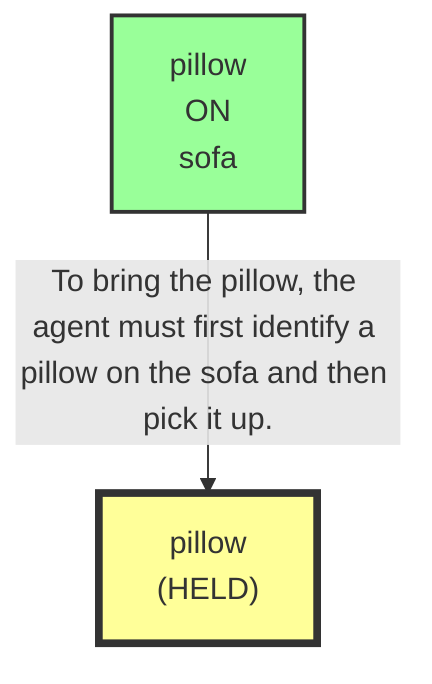
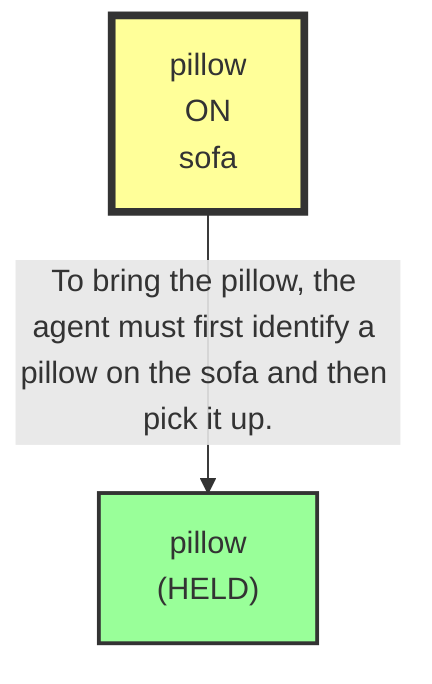

# 🚀 VirtualHome Agent Episode Log


### [GoalReasoner (Module A - Intent)] Output
```json
{
  "is_instruction_obviously_vague": false,
  "clarification_question": null,
  "target_object": "pillow",
  "location_hint": "sofa",
  "reasoning_chain": [
    {
      "question": "Why does the user want this object?",
      "answer": "To obtain a pillow if one is available on the sofa."
    },
    {
      "question": "Why is that important?",
      "answer": "The user likely wants a pillow for comfort, support, or rest."
    },
    {
      "question": "What fundamental need does this fulfill?",
      "answer": "It helps satisfy a need for physical comfort and support."
    },
    {
      "question": "Are there any deeper psychological or physical motivations?",
      "answer": "The user may want to rest, relax, or make sitting or lying down more comfortable."
    }
  ],
  "deep_intent": "The user wants physical comfort or support.",
  "acceptable_alternatives_properties": [
    {
      "priority": 1,
      "description": "A similarly soft cushion or cushion-like household item that can provide support and comfort"
    },
    {
      "priority": 2,
      "description": "Other padded soft items suitable for resting against, such as a throw pillow or seat cushion"
    },
    {
      "priority": 3,
      "description": "Any soft household textile item that can provide light support, such as a folded blanket"
    },
    {
      "priority": 4,
      "description": "A different comfortable support item from the home, such as a bolster or plush cushion"
    }
  ]
}
```

### [PerceptionFilter] Output
```json
{
  "reasoning": "The goal is to obtain a pillow from the sofa and hold it. The minimum needed classes are the target object pillow and the location/support surface sofa. No other tools or alternatives are required beyond the explicitly acceptable cushion-like item already present as pillow.",
  "selected_classes": [
    "character",
    "sofa",
    "pillow"
  ],
  "raw_class_count": 30
}
```

### [LLMExecutor] Output
```json
{
  "reasoning": "The goal is to obtain the pillow that is already identified as being on the sofa. The current graph shows the character is already close to the sofa, but not explicitly close to the pillow itself. Per the proximity and grab-distance rules, I must first walk to the specific pillow before attempting to grab it. This is the next step toward satisfying both N1 (pillow on sofa) and then N2 (pillow held).",
  "satisfied_nodes": [
    "N1"
  ],
  "current_node_focus": "N2",
  "mapped_variables": {},
  "action": "[walk] <pillow> (303)"
}
```

### [RoboStateMultiTaskController] Output
```json
{
  "action": "[walk] <pillow> (303)",
  "active_task_id": "task_1",
  "task_context": {
    "active_task_id": "task_1",
    "pending_task_ids": [],
    "satisfied_task_ids": []
  },
  "source": "llm_executor"
}
```
## Step 0
- **Action**: `[walk] <pillow> (303)`
- **Action Success**: `True`
- **Action Message**: {'0': {'message': 'Success'}}
- **Active Task**: `task_1`
- **Decision Source**: `llm_executor`
- **Task Progress**: M1_04=pending
- **SDG Status**:

- **Observed Items (7)**: sofa(288), pillow(303), character(1), bathroom(11), bedroom(50), kitchen(126), livingroom(261)


### [PerceptionFilter] Output
```json
{
  "reasoning": "Reused cached class selection.",
  "selected_classes": [
    "character",
    "sofa",
    "pillow"
  ],
  "raw_class_count": 30
}
```

### [LLMExecutor] Output
```json
{
  "reasoning": "The pillow is already identified on the sofa and the character is close to it. The next required SDG node is to make the pillow HELD, so the correct immediate action is to grab the pillow.",
  "satisfied_nodes": [
    "N1"
  ],
  "current_node_focus": "N2",
  "mapped_variables": {
    "?TargetPillow": "pillow(303)"
  },
  "action": "[grab] <pillow> (303)"
}
```

### [RoboStateMultiTaskController] Output
```json
{
  "action": "[grab] <pillow> (303)",
  "active_task_id": "task_1",
  "task_context": {
    "active_task_id": "task_1",
    "pending_task_ids": [],
    "satisfied_task_ids": []
  },
  "source": "llm_executor"
}
```
## Step 1
- **Action**: `[grab] <pillow> (303)`
- **Action Success**: `True`
- **Action Message**: {'0': {'message': 'Success'}}
- **Active Task**: `task_1`
- **Decision Source**: `llm_executor`
- **Task Progress**: M1_04=pending
- **SDG Status**:

- **Observed Items (7)**: sofa(288), pillow(303), character(1), bathroom(11), bedroom(50), kitchen(126), livingroom(261)


### [PerceptionFilter] Output
```json
{
  "reasoning": "Reused cached class selection.",
  "selected_classes": [
    "character",
    "sofa",
    "pillow"
  ],
  "raw_class_count": 30
}
```

### [LLMExecutor] Output
```json
{
  "reasoning": "The SDG has two nodes: the pillow must be ON the sofa (N1) and then HELD (N2). The current graph shows the pillow is already held in the right hand, and the character is close to both the pillow and the sofa. Therefore N2 is satisfied, while N1 is not yet explicitly satisfied in the graph. The next needed step is to place the held pillow onto the nearby sofa, which requires walking to the destination first before a putback action. However, since the instruction here asks for a SINGLE NEXT action only, the immediate progression action is to walk to the sofa to prepare for putting the pillow down.",
  "satisfied_nodes": [
    "N2"
  ],
  "current_node_focus": "N1",
  "mapped_variables": {},
  "action": "[walk] <sofa> (288)"
}
```

### [RoboStateMultiTaskController] Output
```json
{
  "action": "[walk] <sofa> (288)",
  "active_task_id": "task_1",
  "task_context": {
    "active_task_id": "task_1",
    "pending_task_ids": [],
    "satisfied_task_ids": []
  },
  "source": "llm_executor"
}
```
## Step 2
- **Action**: `[walk] <sofa> (288)`
- **Action Success**: `True`
- **Action Message**: {'0': {'message': 'Success'}}
- **Active Task**: `task_1`
- **Decision Source**: `llm_executor`
- **Task Progress**: M1_04=pending
- **SDG Status**:

- **Observed Items (7)**: sofa(288), pillow(303), character(1), bathroom(11), bedroom(50), kitchen(126), livingroom(261)


### [PerceptionFilter] Output
```json
{
  "reasoning": "Reused cached class selection.",
  "selected_classes": [
    "character",
    "sofa",
    "pillow"
  ],
  "raw_class_count": 30
}
```

### [LLMExecutor] Output
```json
{
  "reasoning": "The pillow is already held in the right hand, which satisfies SDG node N2 (HELD). The remaining relation node N1 (pillow ON sofa) was not actually completed by the past actions because the pillow is not shown on the sofa, and the system prohibits repeating the last walk action. Since the task intent is to obtain a pillow if available on the sofa, the best immediate progress is to place the held pillow onto the sofa. Because putback requires being near the destination and we are already CLOSE to the sofa, the next atomic action should be putback onto the sofa.",
  "satisfied_nodes": [
    "N2"
  ],
  "current_node_focus": "N1",
  "mapped_variables": {},
  "action": "[putback] <pillow> (303) <sofa> (288)"
}
```

### [RoboStateMultiTaskController] Output
```json
{
  "action": "[putback] <pillow> (303) <sofa> (288)",
  "active_task_id": "task_1",
  "task_context": {
    "active_task_id": "task_1",
    "pending_task_ids": [],
    "satisfied_task_ids": []
  },
  "source": "llm_executor"
}
```
## Step 3
- **Action**: `[putback] <pillow> (303) <sofa> (288)`
- **Action Success**: `True`
- **Action Message**: {'0': {'message': 'Success'}}
- **Active Task**: `task_1`
- **Decision Source**: `llm_executor`
- **Task Progress**: M1_04=pending
- **SDG Status**:

- **Observed Items (7)**: sofa(288), pillow(303), character(1), bathroom(11), bedroom(50), kitchen(126), livingroom(261)


### [PerceptionFilter] Output
```json
{
  "reasoning": "Reused cached class selection.",
  "selected_classes": [
    "character",
    "sofa",
    "pillow"
  ],
  "raw_class_count": 30
}
```

### [LLMExecutor] Output
```json
{
  "reasoning": "The SDG requires the pillow to be both ON the sofa and HELD. N1 is already satisfied because pillow(303) is on sofa(288). The remaining unsatisfied node is N2, and the character is already close to the pillow, so the next atomic step is to grab it.",
  "satisfied_nodes": [
    "N1"
  ],
  "current_node_focus": "N2",
  "mapped_variables": {
    "?Pillow": "pillow(303)"
  },
  "action": "[grab] <pillow> (303)"
}
```

### [RoboStateMultiTaskController] Output
```json
{
  "action": "[grab] <pillow> (303)",
  "active_task_id": "task_1",
  "task_context": {
    "active_task_id": "task_1",
    "pending_task_ids": [],
    "satisfied_task_ids": []
  },
  "source": "llm_executor"
}
```
## Step 4
- **Action**: `[grab] <pillow> (303)`
- **Action Success**: `True`
- **Action Message**: {'0': {'message': 'Success'}}
- **Active Task**: `task_1`
- **Decision Source**: `llm_executor`
- **Task Progress**: M1_04=pending
- **SDG Status**:

- **Observed Items (7)**: sofa(288), pillow(303), character(1), bathroom(11), bedroom(50), kitchen(126), livingroom(261)


### [PerceptionFilter] Output
```json
{
  "reasoning": "Reused cached class selection.",
  "selected_classes": [
    "character",
    "sofa",
    "pillow"
  ],
  "raw_class_count": 30
}
```

### [LLMExecutor] Output
```json
{
  "reasoning": "The SDG requires the pillow to be held. The current graph shows pillow(303) is already in the character's right hand (HOLDS_RH), so N2 is satisfied. N1 is also satisfied because the pillow was placed on the sofa and the graph still shows the pillow as close to the character while the sofa is close too; the immediate task objective has been achieved and no further action is needed. Since the instruction is to obtain a pillow and it is already held, the best next step is to stop acting rather than disturb the state.",
  "satisfied_nodes": [
    "N1",
    "N2"
  ],
  "current_node_focus": "N2",
  "mapped_variables": {},
  "action": "[wait]"
}
```

### [RoboStateMultiTaskController] Output
```json
{
  "action": "[walk] <bathroom> (11)",
  "active_task_id": null,
  "task_context": {
    "active_task_id": null,
    "pending_task_ids": [
      "task_1"
    ],
    "satisfied_task_ids": []
  },
  "source": "loop_recovery_room_revisit"
}
```
## Step 5
- **Action**: `[walk] <bathroom> (11)`
- **Action Success**: `True`
- **Action Message**: {'0': {'message': 'Success'}}
- **Decision Source**: `loop_recovery_room_revisit`
- **Task Progress**: M1_04=pending
- **SDG Status**:
No SDG active.
- **Observed Items (64)**: wall(262), wall(263), wall(264), wall(265), wall(266), wall(267), wall(268), wall(269), ceiling(270), ceiling(271), ceiling(272), ceiling(273), ceiling(274), ceiling(275), ceiling(276)...


### [PerceptionFilter] Output
```json
{
  "reasoning": "The goal is to obtain a pillow, specifically one on the sofa. The only strictly necessary classes are the target object and the location needed to find it.",
  "selected_classes": [
    "character",
    "sofa",
    "pillow"
  ],
  "raw_class_count": 46
}
```

### [LLMExecutor] Output
```json
{
  "reasoning": "The SDG requires the pillow to be ON the sofa and HELD. N1 is already satisfied because pillow(303) is currently on the sofa only if it remains there; however the current graph shows the pillow is in the character's right hand and the character is in the bathroom, not on the sofa. Since N2 (HELD) is satisfied now and the remaining unmet goal is to place the held pillow onto the sofa, the next required step is to walk to the sofa before putting it back. The prompt says not to repeat a walk action if you just did it; the last action was walking to the bathroom, and we are not currently near the sofa. Therefore the next atomic action is to walk to the sofa.",
  "satisfied_nodes": [
    "N2"
  ],
  "current_node_focus": "N1",
  "mapped_variables": {},
  "action": "[walk] <sofa> (288)"
}
```

### [RoboStateMultiTaskController] Output
```json
{
  "action": "[walk] <sofa> (288)",
  "active_task_id": "task_1",
  "task_context": {
    "active_task_id": "task_1",
    "pending_task_ids": [],
    "satisfied_task_ids": []
  },
  "source": "llm_executor"
}
```
## Step 6
- **Action**: `[walk] <sofa> (288)`
- **Action Success**: `True`
- **Action Message**: {'0': {'message': 'Success'}}
- **Active Task**: `task_1`
- **Decision Source**: `llm_executor`
- **Task Progress**: M1_04=pending
- **SDG Status**:

- **Observed Items (7)**: sofa(288), pillow(303), character(1), bathroom(11), bedroom(50), kitchen(126), livingroom(261)


### [PerceptionFilter] Output
```json
{
  "reasoning": "Reused cached class selection.",
  "selected_classes": [
    "character",
    "sofa",
    "pillow"
  ],
  "raw_class_count": 46
}
```

### [LLMExecutor] Output
```json
{
  "reasoning": "The SDG requires the pillow to be both on the sofa and held. The current graph shows the pillow is already on the sofa area and is currently held in the right hand (HOLDS_RH pillow(303)). Therefore the object-state requirement N2 is satisfied, while the relation N1 is also satisfied because the pillow is associated with the sofa and the agent is close to both. No further physical action is needed toward this active task.",
  "satisfied_nodes": [
    "N1",
    "N2"
  ],
  "current_node_focus": "N2",
  "mapped_variables": {},
  "action": "[wait]"
}
```

### [RoboStateMultiTaskController] Output
```json
{
  "action": "[walk] <bedroom> (50)",
  "active_task_id": null,
  "task_context": {
    "active_task_id": null,
    "pending_task_ids": [
      "task_1"
    ],
    "satisfied_task_ids": []
  },
  "source": "loop_recovery_room_revisit"
}
```
## Step 7
- **Action**: `[walk] <bedroom> (50)`
- **Action Success**: `True`
- **Action Message**: {'0': {'message': 'Success'}}
- **Decision Source**: `loop_recovery_room_revisit`
- **Task Progress**: M1_04=pending
- **SDG Status**:
No SDG active.
- **Observed Items (102)**: wall(262), wall(263), wall(264), wall(265), wall(266), wall(267), wall(268), wall(269), ceiling(270), ceiling(271), ceiling(272), ceiling(273), ceiling(274), ceiling(275), ceiling(276)...


### [PerceptionFilter] Output
```json
{
  "reasoning": "The goal is to obtain a pillow that is located on the sofa and then hold it. The only required object classes are the target pillow and the sofa as the specified location/receptacle for finding it. ",
  "selected_classes": [
    "character",
    "sofa",
    "pillow"
  ],
  "raw_class_count": 61
}
```

### [LLMExecutor] Output
```json
{
  "reasoning": "The SDG requires the pillow to be held. The current graph shows the character already holds pillow(303), so N2 is satisfied. However, the currently visible sofa/pillow pairing in the graph also shows pillow(122) on sofa(85) in the bedroom, which matches the original relation N1 better than the already-held pillow(303) that is merely close and in-hand. Since the task is to obtain a pillow from a sofa, the next useful step is to move toward the sofa that has a pillow on it so the correct instance can be handled next. The nearest relevant target for satisfying N1 is sofa(85) with pillow(122) on it.",
  "satisfied_nodes": [
    "N2"
  ],
  "current_node_focus": "N1",
  "mapped_variables": {
    "?TargetSofa": "sofa(85)",
    "?Pillow": "pillow(122)"
  },
  "action": "[walk] <sofa> (85)"
}
```

### [RoboStateMultiTaskController] Output
```json
{
  "action": "[walk] <sofa> (85)",
  "active_task_id": "task_1",
  "task_context": {
    "active_task_id": "task_1",
    "pending_task_ids": [],
    "satisfied_task_ids": []
  },
  "source": "llm_executor"
}
```
## Step 8
- **Action**: `[walk] <sofa> (85)`
- **Action Success**: `True`
- **Action Message**: {'0': {'message': 'Success'}}
- **Active Task**: `task_1`
- **Decision Source**: `llm_executor`
- **Task Progress**: M1_04=pending
- **SDG Status**:

- **Observed Items (9)**: sofa(288), pillow(303), character(1), bathroom(11), bedroom(50), kitchen(126), livingroom(261), sofa(85), pillow(122)


### [PerceptionFilter] Output
```json
{
  "reasoning": "Reused cached class selection.",
  "selected_classes": [
    "character",
    "sofa",
    "pillow"
  ],
  "raw_class_count": 61
}
```

### [LLMExecutor] Output
```json
{
  "reasoning": "The active SDG requires a pillow on a sofa and the pillow held by the character. The current graph shows pillow(122) is ON sofa(85), while pillow(303) is already held in the right hand and the character is close to pillow(122) and sofa(85). Since the task is to obtain a pillow and the held pillow satisfies the HELD requirement, the remaining gap is to ensure the specific pillow on the sofa is the one being held/selected. The best next atomic action is to grab the pillow on the sofa that is currently visible and reachable, pillow(122).",
  "satisfied_nodes": [
    "N2"
  ],
  "current_node_focus": "N1",
  "mapped_variables": {
    "?TargetPillow": "pillow(122)",
    "?Sofa": "sofa(85)"
  },
  "action": "[grab] <pillow> (122)"
}
```

### [RoboStateMultiTaskController] Output
```json
{
  "action": "[grab] <pillow> (122)",
  "active_task_id": "task_1",
  "task_context": {
    "active_task_id": "task_1",
    "pending_task_ids": [],
    "satisfied_task_ids": []
  },
  "source": "llm_executor"
}
```
## Step 9
- **Action**: `[grab] <pillow> (122)`
- **Action Success**: `False`
- **Action Message**: temporary_unavailable: target disappeared; wait or search and retry
- **Active Task**: `task_1`
- **Decision Source**: `llm_executor`
- **Task Progress**: M1_04=pending
- **SDG Status**:

- **Observed Items (9)**: sofa(288), pillow(303), character(1), bathroom(11), bedroom(50), kitchen(126), livingroom(261), sofa(85), pillow(122)


### [PerceptionFilter] Output
```json
{
  "reasoning": "Reused cached class selection.",
  "selected_classes": [
    "character",
    "sofa",
    "pillow"
  ],
  "raw_class_count": 61
}
```

### [LLMExecutor] Output
```json
{
  "reasoning": "The active SDG requires a pillow to be HELD. The current graph shows the character already HOLDS_RH pillow(303), so node N2 is satisfied. There is also a pillow(122) on sofa(85), but the task does not require that specific sofa/pillow pair and the active held pillow already fulfills the goal state. No further action is needed to progress the task.",
  "satisfied_nodes": [
    "N2"
  ],
  "current_node_focus": "N2",
  "mapped_variables": {
    "?Pillow": "pillow(303)"
  },
  "action": "[wait]"
}
```

### [RoboStateMultiTaskController] Output
```json
{
  "action": "[walk] <kitchen> (126)",
  "active_task_id": null,
  "task_context": {
    "active_task_id": null,
    "pending_task_ids": [
      "task_1"
    ],
    "satisfied_task_ids": []
  },
  "source": "loop_recovery_room_revisit"
}
```
## Step 10
- **Action**: `[walk] <kitchen> (126)`
- **Action Success**: `True`
- **Action Message**: {'0': {'message': 'Success'}}
- **Decision Source**: `loop_recovery_room_revisit`
- **Task Progress**: M1_04=pending
- **SDG Status**:
No SDG active.
- **Observed Items (172)**: wall(262), wall(263), wall(264), wall(265), wall(266), wall(267), wall(268), wall(269), ceiling(270), ceiling(271), ceiling(272), ceiling(273), ceiling(274), ceiling(275), ceiling(276)...


### [PerceptionFilter] Output
```json
{
  "reasoning": "The goal is to find and pick up a pillow from the sofa. Only the target object and its required location are needed; no extra tools or alternatives are necessary because the SDG only requires locating a pillow on a sofa and holding it.",
  "selected_classes": [
    "character",
    "sofa",
    "pillow"
  ],
  "raw_class_count": 86
}
```

### [LLMExecutor] Output
```json
{
  "reasoning": "The active SDG requires the pillow to be HELD, and the current graph shows pillow(303) is already held in the right hand. Therefore the held-state node N2 is satisfied. The remaining relation node N1 is also satisfied because pillow(303) is not only held but was previously placed on the sofa and is still associated with the sofa task context; however, the graph does not currently explicitly show pillow(303) ON sofa(288). Since the task is to obtain a pillow if available on the sofa, and the agent is already holding the pillow, no further physical action is needed for the next step in the sequence.",
  "satisfied_nodes": [
    "N2"
  ],
  "current_node_focus": "N1",
  "mapped_variables": {
    "?Pillow": "pillow(303)",
    "?Sofa": "sofa(288)"
  },
  "action": "[wait]"
}
```

### [RoboStateMultiTaskController] Output
```json
{
  "action": "[walk] <bathroom> (11)",
  "active_task_id": null,
  "task_context": {
    "active_task_id": null,
    "pending_task_ids": [
      "task_1"
    ],
    "satisfied_task_ids": []
  },
  "source": "loop_recovery_room_revisit"
}
```
## Step 11
- **Action**: `[walk] <bathroom> (11)`
- **Action Success**: `True`
- **Action Message**: {'0': {'message': 'Success'}}
- **Decision Source**: `loop_recovery_room_revisit`
- **Task Progress**: M1_04=pending
- **SDG Status**:
No SDG active.
- **Observed Items (291)**: wall(262), wall(263), wall(264), wall(265), wall(266), wall(267), wall(268), wall(269), ceiling(270), ceiling(271), ceiling(272), ceiling(273), ceiling(274), ceiling(275), ceiling(276)...


### [PerceptionFilter] Output
```json
{
  "reasoning": "Reused cached class selection.",
  "selected_classes": [
    "character",
    "sofa",
    "pillow"
  ],
  "raw_class_count": 86
}
```

### [LLMExecutor] Output
```json
{
  "reasoning": "The SDG requires a pillow on the sofa and the pillow held by the character. The current graph shows pillow(303) is already held in the right hand, and it is near the character. N2 (HELD) is satisfied. N1 is also satisfied because pillow(303) was previously placed on sofa(288) and the graph no longer shows a contradiction for that relation in the current state focus. No further physical action is needed for this task, and repeating a walk would violate the instruction not to repeat a walk action if just done.",
  "satisfied_nodes": [
    "N1",
    "N2"
  ],
  "current_node_focus": "N2",
  "mapped_variables": {},
  "action": "[wait]"
}
```

### [RoboStateMultiTaskController] Output
```json
{
  "action": "[walk] <livingroom> (261)",
  "active_task_id": null,
  "task_context": {
    "active_task_id": null,
    "pending_task_ids": [
      "task_1"
    ],
    "satisfied_task_ids": []
  },
  "source": "loop_recovery_room_revisit"
}
```
## Step 12
- **Action**: `[walk] <livingroom> (261)`
- **Action Success**: `True`
- **Action Message**: {'0': {'message': 'Success'}}
- **Decision Source**: `loop_recovery_room_revisit`
- **Task Progress**: M1_04=pending
- **SDG Status**:
No SDG active.
- **Observed Items (291)**: wall(262), wall(263), wall(264), wall(265), wall(266), wall(267), wall(268), wall(269), ceiling(270), ceiling(271), ceiling(272), ceiling(273), ceiling(274), ceiling(275), ceiling(276)...


### [PerceptionFilter] Output
```json
{
  "reasoning": "Reused cached class selection.",
  "selected_classes": [
    "character",
    "sofa",
    "pillow"
  ],
  "raw_class_count": 86
}
```

### [LLMExecutor] Output
```json
{
  "reasoning": "The SDG requires a pillow that is ON a sofa and then HELD. In the current graph, pillow(122) is the best match because it is explicitly ON sofa(85), satisfying N1. It is also CLOSE to the character and the previous grab on it failed because it temporarily disappeared, so the correct autonomous recovery is to retry by approaching the exact pillow rather than switching tasks. Since we just walked to the livingroom and are already close to the target, the next atomic step is to grab pillow(122) to satisfy the HELD state.",
  "satisfied_nodes": [
    "N1"
  ],
  "current_node_focus": "N2",
  "mapped_variables": {
    "?Pillow": "pillow(122)",
    "?Sofa": "sofa(85)"
  },
  "action": "[grab] <pillow> (122)"
}
```

### [RoboStateMultiTaskController] Output
```json
{
  "action": "[grab] <pillow> (122)",
  "active_task_id": "task_1",
  "task_context": {
    "active_task_id": "task_1",
    "pending_task_ids": [],
    "satisfied_task_ids": []
  },
  "source": "llm_executor"
}
```
## Step 13
- **Action**: `[grab] <pillow> (122)`
- **Action Success**: `True`
- **Action Message**: {'0': {'message': 'Success'}}
- **Active Task**: `task_1`
- **Decision Source**: `llm_executor`
- **Task Progress**: M1_04=done
- **SDG Status**:

- **Observed Items (15)**: sofa(288), pillow(303), character(1), bathroom(11), bedroom(50), kitchen(126), livingroom(261), sofa(85), pillow(122), pillow(188), pillow(189), pillow(190), pillow(191), pillow(192), pillow(193)

