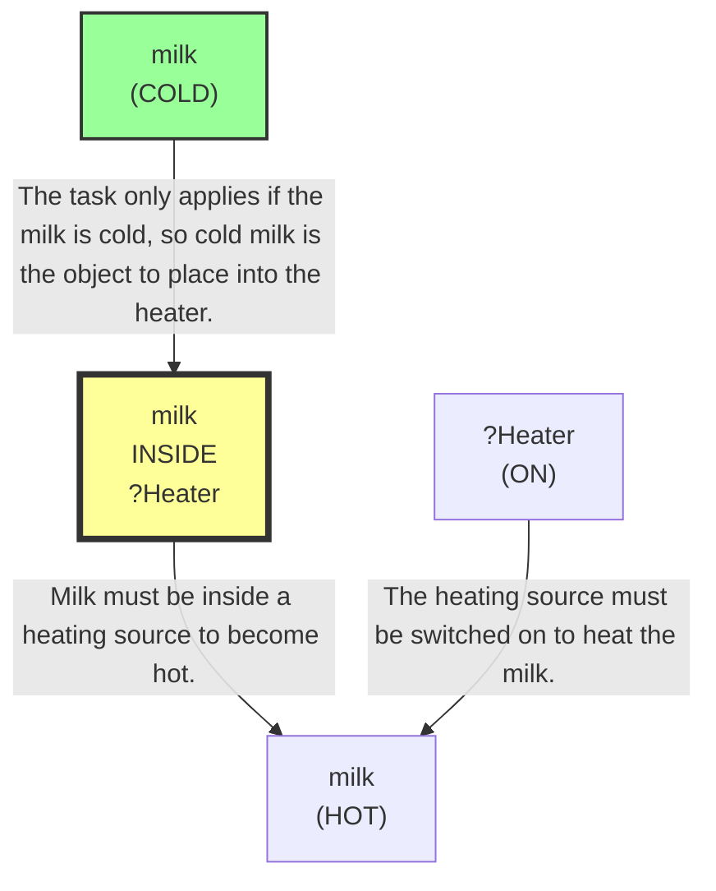
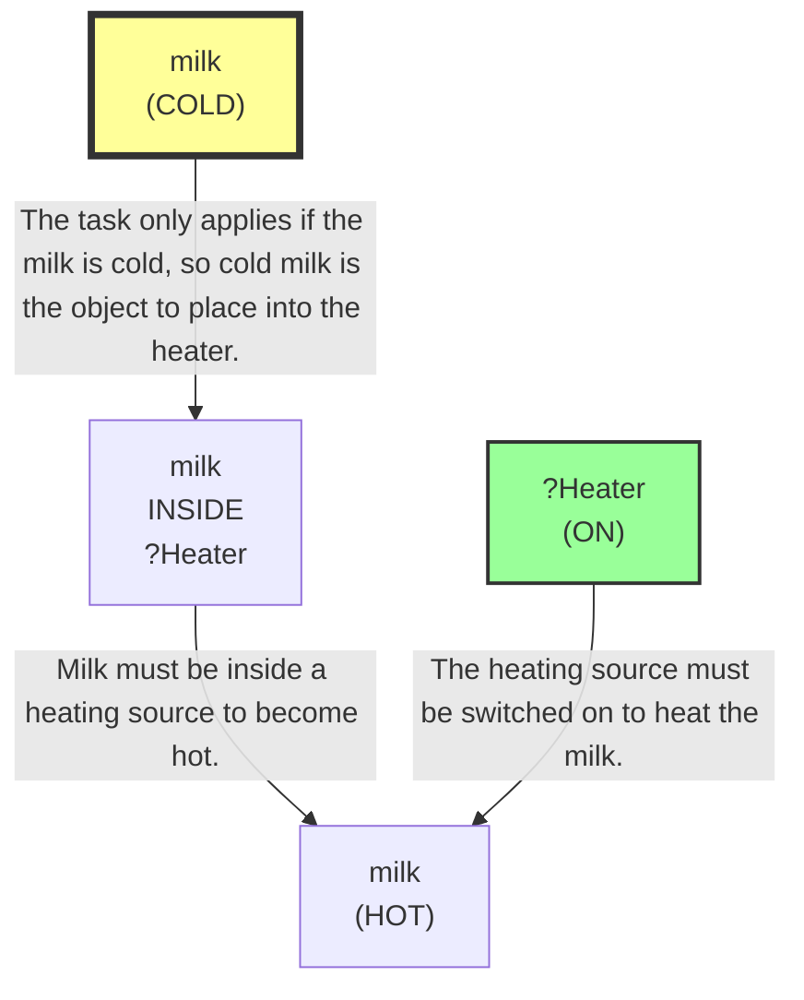
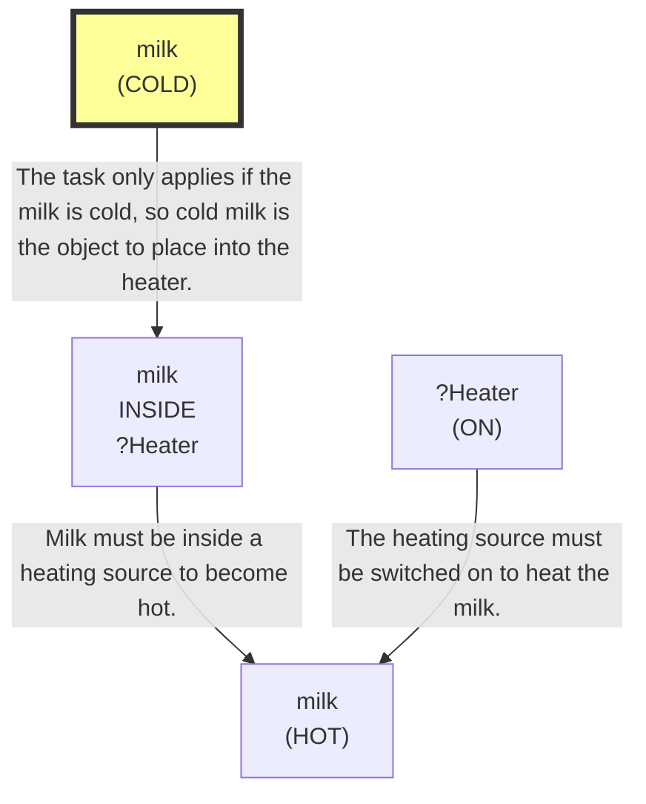
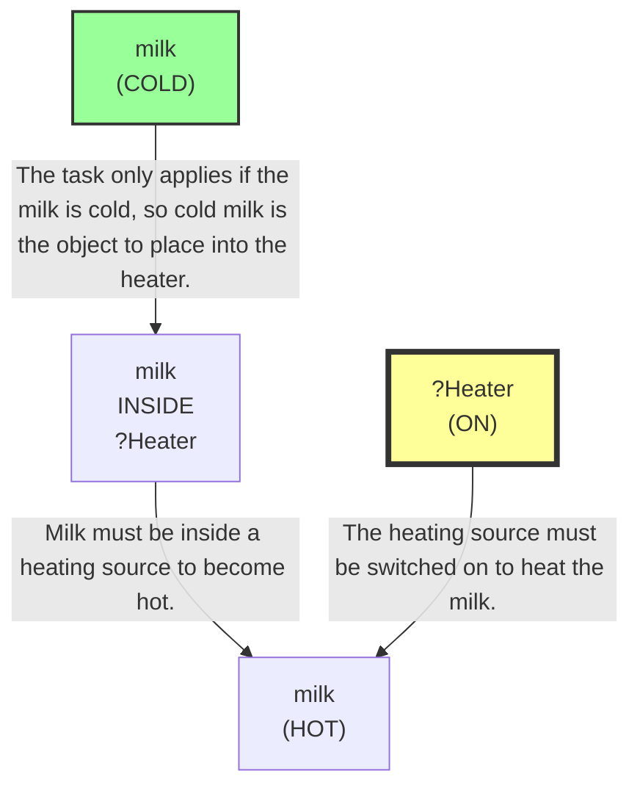
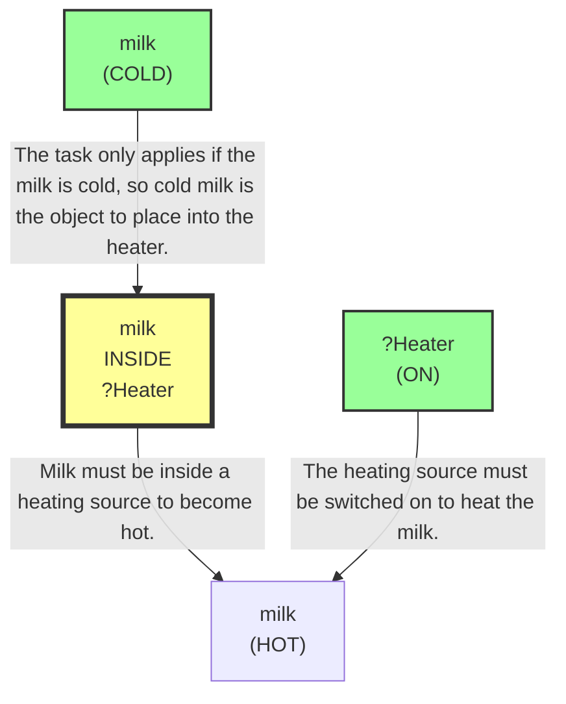

# 🚀 VirtualHome Agent Episode Log


### [GoalReasoner (Module A - Intent)] Output
```json
{
  "is_instruction_obviously_vague": false,
  "clarification_question": null,
  "target_object": "milk",
  "location_hint": null,
  "reasoning_chain": [
    {
      "question": "Why does the user want this object?",
      "answer": "To have the milk heated if it is cold."
    },
    {
      "question": "Why is that important?",
      "answer": "Because the user likely wants the milk at a warmer, usable drinking or mixing temperature."
    },
    {
      "question": "What fundamental need does this fulfill?",
      "answer": "To make a beverage or ingredient more comfortable or suitable for consumption/use."
    },
    {
      "question": "Are there any deeper psychological or physical motivations?",
      "answer": "A warmer liquid may be more pleasant to drink, easier to use in a recipe, or more suitable for the user's immediate preference."
    }
  ],
  "deep_intent": "The user wants a cold liquid food item warmed to a more usable temperature.",
  "acceptable_alternatives_properties": [
    {
      "priority": 1,
      "description": "Other cold drinkable dairy or non-dairy liquids that can be safely warmed, such as cream, plant milk, or a prepared beverage."
    },
    {
      "priority": 2,
      "description": "Other refrigerated liquid ingredients commonly heated for consumption or mixing, such as broth or cocoa."
    },
    {
      "priority": 3,
      "description": "Warm-ready packaged beverages or liquids that can serve the same comforting or usable-temperature purpose."
    },
    {
      "priority": 4,
      "description": "Any other warm liquid drink that can satisfy the need for a heated beverage, such as tea or warm water."
    }
  ]
}
```

### [PerceptionFilter] Output
```json
{
  "reasoning": "The goal is to warm cold milk, so we must keep the target object milk and all possible heating sources implied by the SDG. The heater can be a microwave or stove, and the task requires them to be on. Since milk must be placed inside a heater, the relevant heating appliances are retained.",
  "selected_classes": [
    "milk",
    "character",
    "stove",
    "microwave"
  ],
  "raw_class_count": 50
}
```

### [LLMExecutor] Output
```json
{
  "reasoning": "The target milk instance is milk(176), which is explicitly COLD and therefore the correct object for the task. To satisfy the heating plan, the next required step is to bring the milk to a heater. Since interaction requires proximity and no previous walk has been done, the best immediate action is to walk to the microwave, which is a valid heater and is currently OFF but can be switched on afterward.",
  "satisfied_nodes": [
    "N1"
  ],
  "current_node_focus": "N3",
  "mapped_variables": {
    "?Heater": "microwave(171)"
  },
  "action": "[walk] <microwave> (171)"
}
```

### [RoboStateMultiTaskController] Output
```json
{
  "action": "[walk] <microwave> (171)",
  "active_task_id": "task_1",
  "task_context": {
    "active_task_id": "task_1",
    "pending_task_ids": [],
    "satisfied_task_ids": []
  },
  "source": "llm_executor"
}
```
## Step 0
- **Action**: `[walk] <microwave> (171)`
- **Action Success**: `True`
- **Action Message**: {'0': {'message': 'Success'}}
- **Active Task**: `task_1`
- **Decision Source**: `llm_executor`
- **Task Progress**: M1_05=pending
- **SDG Status**:

- **Observed Items (10)**: stove(163) [OFF,CLOSED], microwave(171) [CLOSED,OFF], milk(177) [CLOSED], milk(176) [COLD,CLOSED], character(1), kitchen(11), livingroom(183), bedroom(241), bathroom(285), bedroom(346)


### [PerceptionFilter] Output
```json
{
  "reasoning": "Reused cached class selection.",
  "selected_classes": [
    "milk",
    "character",
    "stove",
    "microwave"
  ],
  "raw_class_count": 50
}
```

### [LLMExecutor] Output
```json
{
  "reasoning": "The SDG requires cold milk to be placed inside a heater and the heater turned on. The current graph shows milk(177) is close to the character but is not marked COLD, while milk(176) is explicitly COLD but is not close. Since the task is specifically about heating cold milk, the best match is milk(176). I already walked to the microwave, so the next progress-making step is to move toward the cold milk so it can later be grabbed and heated.",
  "satisfied_nodes": [
    "N4"
  ],
  "current_node_focus": "N1",
  "mapped_variables": {
    "?Heater": "microwave(171)"
  },
  "action": "[walk] <milk> (176)"
}
```

### [RoboStateMultiTaskController] Output
```json
{
  "action": "[walk] <milk> (176)",
  "active_task_id": "task_1",
  "task_context": {
    "active_task_id": "task_1",
    "pending_task_ids": [],
    "satisfied_task_ids": []
  },
  "source": "llm_executor"
}
```
## Step 1
- **Action**: `[walk] <milk> (176)`
- **Action Success**: `True`
- **Action Message**: {'0': {'message': 'Success'}}
- **Active Task**: `task_1`
- **Decision Source**: `llm_executor`
- **Task Progress**: M1_05=pending
- **SDG Status**:

- **Observed Items (10)**: stove(163) [OFF,CLOSED], microwave(171) [CLOSED,OFF], milk(177) [CLOSED], milk(176) [COLD,CLOSED], character(1), kitchen(11), livingroom(183), bedroom(241), bathroom(285), bedroom(346)


### [PerceptionFilter] Output
```json
{
  "reasoning": "Reused cached class selection.",
  "selected_classes": [
    "milk",
    "character",
    "stove",
    "microwave"
  ],
  "raw_class_count": 50
}
```

### [LLMExecutor] Output
```json
{
  "reasoning": "The target milk is the cold instance milk(176), which is already close to the character. The SDG requires placing the milk inside a heater and turning that heater on. Since the microwave is a valid heater, the next progress step is to move to it so we can open it and later place the milk inside. I will not grab yet because the last action already walked to the milk, and the next required interaction for the heater sequence is to approach the microwave.",
  "satisfied_nodes": [
    "N1"
  ],
  "current_node_focus": "N3",
  "mapped_variables": {
    "?Heater": "microwave(171)"
  },
  "action": "[walk] <microwave> (171)"
}
```

### [RoboStateMultiTaskController] Output
```json
{
  "action": "[walk] <microwave> (171)",
  "active_task_id": "task_1",
  "task_context": {
    "active_task_id": "task_1",
    "pending_task_ids": [],
    "satisfied_task_ids": []
  },
  "source": "llm_executor"
}
```
## Step 2
- **Action**: `[walk] <microwave> (171)`
- **Action Success**: `True`
- **Action Message**: {'0': {'message': 'Success'}}
- **Active Task**: `task_1`
- **Decision Source**: `llm_executor`
- **Task Progress**: M1_05=pending
- **SDG Status**:

- **Observed Items (10)**: stove(163) [OFF,CLOSED], microwave(171) [CLOSED,OFF], milk(177) [CLOSED], milk(176) [COLD,CLOSED], character(1), kitchen(11), livingroom(183), bedroom(241), bathroom(285), bedroom(346)


### [PerceptionFilter] Output
```json
{
  "reasoning": "Reused cached class selection.",
  "selected_classes": [
    "milk",
    "character",
    "stove",
    "microwave"
  ],
  "raw_class_count": 50
}
```

### [LLMExecutor] Output
```json
{
  "reasoning": "The target milk that matches the SDG is milk(176), which is explicitly COLD. To heat it, I need to place it inside a heater. The microwave(171) is a valid heater candidate because it has CAN_OPEN, HAS_SWITCH, and is currently nearby, and the task requires the heater to be ON. Since the microwave is currently CLOSED/OFF, the immediate next atomic step should be to open it before I can put the milk inside. I should not grab milk(176) yet until the microwave is open and I am properly positioned for the container interaction sequence.",
  "satisfied_nodes": [
    "N1"
  ],
  "current_node_focus": "N3",
  "mapped_variables": {
    "?Heater": "microwave(171)"
  },
  "action": "[open] <microwave> (171)"
}
```

### [RoboStateMultiTaskController] Output
```json
{
  "action": "[open] <microwave> (171)",
  "active_task_id": "task_1",
  "task_context": {
    "active_task_id": "task_1",
    "pending_task_ids": [],
    "satisfied_task_ids": []
  },
  "source": "llm_executor"
}
```
## Step 3
- **Action**: `[open] <microwave> (171)`
- **Action Success**: `True`
- **Action Message**: {'0': {'message': 'Success'}}
- **Active Task**: `task_1`
- **Decision Source**: `llm_executor`
- **Task Progress**: M1_05=pending
- **SDG Status**:

- **Observed Items (10)**: stove(163) [OFF,CLOSED], microwave(171) [CLOSED,OFF], milk(177) [CLOSED], milk(176) [COLD,CLOSED], character(1), kitchen(11), livingroom(183), bedroom(241), bathroom(285), bedroom(346)


### [PerceptionFilter] Output
```json
{
  "reasoning": "Reused cached class selection.",
  "selected_classes": [
    "milk",
    "character",
    "stove",
    "microwave"
  ],
  "raw_class_count": 50
}
```

### [LLMExecutor] Output
```json
{
  "reasoning": "The cold milk that matches the task is milk(176), which is still inside the kitchen and not yet held. The microwave is already open and nearby, so the next progress step is to move to the milk so it can be grabbed before placing it into the heater.",
  "satisfied_nodes": [],
  "current_node_focus": "N1",
  "mapped_variables": {
    "?Heater": "microwave(171)"
  },
  "action": "[walk] <milk> (176)"
}
```

### [RoboStateMultiTaskController] Output
```json
{
  "action": "[walk] <milk> (176)",
  "active_task_id": "task_1",
  "task_context": {
    "active_task_id": "task_1",
    "pending_task_ids": [],
    "satisfied_task_ids": []
  },
  "source": "llm_executor"
}
```
## Step 4
- **Action**: `[walk] <milk> (176)`
- **Action Success**: `True`
- **Action Message**: {'0': {'message': 'Success'}}
- **Active Task**: `task_1`
- **Decision Source**: `llm_executor`
- **Task Progress**: M1_05=pending
- **SDG Status**:

- **Observed Items (10)**: stove(163) [OFF,CLOSED], microwave(171) [OFF,OPEN], milk(177) [CLOSED], milk(176) [COLD,CLOSED], character(1), kitchen(11), livingroom(183), bedroom(241), bathroom(285), bedroom(346)


### [PerceptionFilter] Output
```json
{
  "reasoning": "Reused cached class selection.",
  "selected_classes": [
    "milk",
    "character",
    "stove",
    "microwave"
  ],
  "raw_class_count": 50
}
```

### [LLMExecutor] Output
```json
{
  "reasoning": "The active goal is to heat the cold milk. The current graph shows the relevant cold milk is milk(176), and the microwave(171) is already open but still OFF. To satisfy the heater-on prerequisite before placing the milk inside, the next progress-making step is to turn the microwave on. Since the microwave has a plug, but there is no indication it is unplugged, the minimal next action is switching it on.",
  "satisfied_nodes": [
    "N1"
  ],
  "current_node_focus": "N4",
  "mapped_variables": {
    "?Heater": "microwave(171)"
  },
  "action": "[switchon] <microwave> (171)"
}
```

### [RoboStateMultiTaskController] Output
```json
{
  "action": "[walk] <microwave> (171)",
  "active_task_id": "task_1",
  "task_context": {
    "active_task_id": "task_1",
    "pending_task_ids": [],
    "satisfied_task_ids": []
  },
  "source": "llm_executor_repaired"
}
```
## Step 5
- **Action**: `[walk] <microwave> (171)`
- **Action Success**: `True`
- **Action Message**: {'0': {'message': 'Success'}}
- **Active Task**: `task_1`
- **Decision Source**: `llm_executor_repaired`
- **Task Progress**: M1_05=pending
- **SDG Status**:

- **Observed Items (10)**: stove(163) [OFF,CLOSED], microwave(171) [OFF,OPEN], milk(177) [CLOSED], milk(176) [COLD,CLOSED], character(1), kitchen(11), livingroom(183), bedroom(241), bathroom(285), bedroom(346)


### [PerceptionFilter] Output
```json
{
  "reasoning": "Reused cached class selection.",
  "selected_classes": [
    "milk",
    "character",
    "stove",
    "microwave"
  ],
  "raw_class_count": 50
}
```

### [LLMExecutor] Output
```json
{
  "reasoning": "The goal is to heat cold milk. The SDG requires a cold milk instance, inside a heater, with the heater on. The current graph shows milk(176) is COLD and available in the kitchen, and the microwave(171) is open, but milk is not yet held or inside the microwave. Since the next prerequisite toward placing the milk into the heater is to grab the cold milk, I should first move to the milk instance that matches the required cold state. I am choosing milk(176) rather than milk(177) because only milk(176) is explicitly COLD.",
  "satisfied_nodes": [],
  "current_node_focus": "N1",
  "mapped_variables": {
    "?Heater": "microwave(171)"
  },
  "action": "[walk] <milk> (176)"
}
```

### [RoboStateMultiTaskController] Output
```json
{
  "action": "[walk] <milk> (176)",
  "active_task_id": "task_1",
  "task_context": {
    "active_task_id": "task_1",
    "pending_task_ids": [],
    "satisfied_task_ids": []
  },
  "source": "llm_executor"
}
```
## Step 6
- **Action**: `[walk] <milk> (176)`
- **Action Success**: `True`
- **Action Message**: {'0': {'message': 'Success'}}
- **Active Task**: `task_1`
- **Decision Source**: `llm_executor`
- **Task Progress**: M1_05=pending
- **SDG Status**:

- **Observed Items (10)**: stove(163) [OFF,CLOSED], microwave(171) [OFF,OPEN], milk(177) [CLOSED], milk(176) [COLD,CLOSED], character(1), kitchen(11), livingroom(183), bedroom(241), bathroom(285), bedroom(346)


### [PerceptionFilter] Output
```json
{
  "reasoning": "Reused cached class selection.",
  "selected_classes": [
    "milk",
    "character",
    "stove",
    "microwave"
  ],
  "raw_class_count": 50
}
```

### [LLMExecutor] Output
```json
{
  "reasoning": "The goal is to heat the cold milk. The SDG requires milk to be inside a heater and the heater to be ON. We have already located the correct milk instance: milk(176) is COLD and therefore matches N1. The microwave(171) is a valid heater and is currently OPEN and OFF. Since switching it on requires being near it, and we just walked to the milk last, the next useful step toward placing the milk into the heater is to return focus to the microwave so we can interact with it and then use it for heating.",
  "satisfied_nodes": [
    "N1"
  ],
  "current_node_focus": "N4",
  "mapped_variables": {
    "?Heater": "microwave(171)"
  },
  "action": "[walk] <microwave> (171)"
}
```

### [RoboStateMultiTaskController] Output
```json
{
  "action": "[walk] <microwave> (171)",
  "active_task_id": "task_1",
  "task_context": {
    "active_task_id": "task_1",
    "pending_task_ids": [],
    "satisfied_task_ids": []
  },
  "source": "llm_executor"
}
```
## Step 7
- **Action**: `[walk] <microwave> (171)`
- **Action Success**: `True`
- **Action Message**: {'0': {'message': 'Success'}}
- **Active Task**: `task_1`
- **Decision Source**: `llm_executor`
- **Task Progress**: M1_05=pending
- **SDG Status**:

- **Observed Items (10)**: stove(163) [OFF,CLOSED], microwave(171) [OFF,OPEN], milk(177) [CLOSED], milk(176) [COLD,CLOSED], character(1), kitchen(11), livingroom(183), bedroom(241), bathroom(285), bedroom(346)


### [PerceptionFilter] Output
```json
{
  "reasoning": "Reused cached class selection.",
  "selected_classes": [
    "milk",
    "character",
    "stove",
    "microwave"
  ],
  "raw_class_count": 50
}
```

### [LLMExecutor] Output
```json
{
  "reasoning": "The SDG requires cold milk to be placed inside a heater that is ON. We already have the microwave identified as the heater, and it is currently OPEN but OFF. Since the next prerequisite toward heating is to turn the heater on, the single next atomic action is to switch on the microwave. It is already close to the character, so no walk is needed.",
  "satisfied_nodes": [
    "N1"
  ],
  "current_node_focus": "N4",
  "mapped_variables": {
    "?Heater": "microwave(171)"
  },
  "action": "[switchon] <microwave> (171)"
}
```

### [RoboStateMultiTaskController] Output
```json
{
  "action": "[switchon] <microwave> (171)",
  "active_task_id": "task_1",
  "task_context": {
    "active_task_id": "task_1",
    "pending_task_ids": [],
    "satisfied_task_ids": []
  },
  "source": "llm_executor"
}
```
## Step 8
- **Action**: `[switchon] <microwave> (171)`
- **Action Success**: `True`
- **Action Message**: Faked switch operation in Python layer (bypassed Unity failure)
- **Active Task**: `task_1`
- **Decision Source**: `llm_executor`
- **Task Progress**: M1_05=pending
- **SDG Status**:

- **Observed Items (10)**: stove(163) [OFF,CLOSED], microwave(171) [OFF,OPEN], milk(177) [CLOSED], milk(176) [COLD,CLOSED], character(1), kitchen(11), livingroom(183), bedroom(241), bathroom(285), bedroom(346)


### [PerceptionFilter] Output
```json
{
  "reasoning": "Reused cached class selection.",
  "selected_classes": [
    "milk",
    "character",
    "stove",
    "microwave"
  ],
  "raw_class_count": 50
}
```

### [LLMExecutor] Output
```json
{
  "reasoning": "The goal is to heat the cold milk(176) by placing it inside the heater and ensuring the heater is on. The microwave(171) is already ON and OPEN, and the cold milk(176) is the correct target object because it explicitly has the COLD state. Since the next required step is to place the milk into the microwave, I must first be near the destination container before any putin action. The previous steps already walked to both the microwave and milk, and the microwave is now open/on, so the next progress-making action is to walk to the milk(176) so it can be grabbed next.",
  "satisfied_nodes": [
    "N4"
  ],
  "current_node_focus": "N1",
  "mapped_variables": {
    "?Heater": "microwave(171)"
  },
  "action": "[walk] <milk> (176)"
}
```

### [RoboStateMultiTaskController] Output
```json
{
  "action": "[walk] <milk> (176)",
  "active_task_id": "task_1",
  "task_context": {
    "active_task_id": "task_1",
    "pending_task_ids": [],
    "satisfied_task_ids": []
  },
  "source": "llm_executor"
}
```
## Step 9
- **Action**: `[walk] <milk> (176)`
- **Action Success**: `True`
- **Action Message**: {'0': {'message': 'Success'}}
- **Active Task**: `task_1`
- **Decision Source**: `llm_executor`
- **Task Progress**: M1_05=pending
- **SDG Status**:

- **Observed Items (10)**: stove(163) [OFF,CLOSED], microwave(171) [ON,OPEN], milk(177) [CLOSED], milk(176) [COLD,CLOSED], character(1), kitchen(11), livingroom(183), bedroom(241), bathroom(285), bedroom(346)


### [PerceptionFilter] Output
```json
{
  "reasoning": "Reused cached class selection.",
  "selected_classes": [
    "milk",
    "character",
    "stove",
    "microwave"
  ],
  "raw_class_count": 50
}
```

### [LLMExecutor] Output
```json
{
  "reasoning": "The goal is to heat the cold milk. The current focus is milk(176), which is already identified as COLD and near the character. The microwave(171) is the selected heater and is already ON and OPEN, so the remaining progress is to get the milk into the microwave. Since the milk is close and we just walked to it, the next atomic step is to grab it before walking back to the microwave for insertion.",
  "satisfied_nodes": [
    "N1",
    "N4"
  ],
  "current_node_focus": "N3",
  "mapped_variables": {
    "?Heater": "microwave(171)"
  },
  "action": "[grab] <milk> (176)"
}
```

### [RoboStateMultiTaskController] Output
```json
{
  "action": "[grab] <milk> (176)",
  "active_task_id": "task_1",
  "task_context": {
    "active_task_id": "task_1",
    "pending_task_ids": [],
    "satisfied_task_ids": []
  },
  "source": "llm_executor"
}
```
## Step 10
- **Action**: `[grab] <milk> (176)`
- **Action Success**: `False`
- **Action Message**: temporary_unavailable: target disappeared; wait or search and retry
- **Active Task**: `task_1`
- **Decision Source**: `llm_executor`
- **Task Progress**: M1_05=pending
- **SDG Status**:

- **Observed Items (10)**: stove(163) [OFF,CLOSED], microwave(171) [ON,OPEN], milk(177) [CLOSED], milk(176) [COLD,CLOSED], character(1), kitchen(11), livingroom(183), bedroom(241), bathroom(285), bedroom(346)


### [PerceptionFilter] Output
```json
{
  "reasoning": "Reused cached class selection.",
  "selected_classes": [
    "milk",
    "character",
    "stove",
    "microwave"
  ],
  "raw_class_count": 50
}
```

### [LLMExecutor] Output
```json
{
  "reasoning": "The previous grab failed because milk(176) temporarily disappeared, and the filtered graph now shows a different milk instance, milk(177), available in the kitchen. To continue the heating task without looping, I should wait for the temporarily unavailable milk to reappear rather than switching to an unverified substitute, since the exact cold milk target is still present in memory and the failure was temporary. Waiting is the correct recovery action.",
  "satisfied_nodes": [
    "N4"
  ],
  "current_node_focus": "N1",
  "mapped_variables": {
    "?Heater": "microwave(171)"
  },
  "action": "[wait]"
}
```

### [RoboStateMultiTaskController] Output
```json
{
  "action": "[walk] <livingroom> (183)",
  "active_task_id": null,
  "task_context": {
    "active_task_id": null,
    "pending_task_ids": [
      "task_1"
    ],
    "satisfied_task_ids": []
  },
  "source": "loop_recovery_room_revisit"
}
```
## Step 11
- **Action**: `[walk] <livingroom> (183)`
- **Action Success**: `True`
- **Action Message**: {'0': {'message': 'Success'}}
- **Decision Source**: `loop_recovery_room_revisit`
- **Task Progress**: M1_05=pending
- **SDG Status**:
No SDG active.
- **Observed Items (160)**: wall(12), wall(13), wall(14), wall(15), wall(16), wall(17), wall(18), wall(19), wall(20), wall(21), floor(22), floor(23), floor(24), floor(25), floor(26)...


### [PerceptionFilter] Output
```json
{
  "reasoning": "The goal is to heat milk, so the essential target is milk plus all plausible heating appliances present. The SDG requires a heater that is on, so I keep every functional heating alternative visible: microwave, stove, coffeemaker, dishwasher if used as a heat source is not appropriate, but it is not a heater so excluded. Fridge is not needed because the milk is already cold and the task is heating, not retrieving.",
  "selected_classes": [
    "coffeemaker",
    "character",
    "stove",
    "milk",
    "microwave"
  ],
  "raw_class_count": 59
}
```

### [LLMExecutor] Output
```json
{
  "reasoning": "The target milk instance that matches the SDG is milk(176), because it is explicitly COLD. The microwave heater(171) is already ON, and the microwave is open, so the next progress step is to regain proximity to the cold milk so it can be grabbed again after its temporary disappearance. Since the last grab failed due to temporary_unavailable and the milk has now reappeared in the kitchen, the appropriate next atomic action is to walk to milk(176) before retrying grab.",
  "satisfied_nodes": [
    "N1",
    "N4"
  ],
  "current_node_focus": "N3",
  "mapped_variables": {
    "?Heater": "microwave(171)"
  },
  "action": "[walk] <milk> (176)"
}
```

### [RoboStateMultiTaskController] Output
```json
{
  "action": "[walk] <milk> (176)",
  "active_task_id": "task_1",
  "task_context": {
    "active_task_id": "task_1",
    "pending_task_ids": [],
    "satisfied_task_ids": []
  },
  "source": "llm_executor"
}
```
## Step 12
- **Action**: `[walk] <milk> (176)`
- **Action Success**: `False`
- **Action Message**: temporary_unavailable: target is temporarily hidden
- **Active Task**: `task_1`
- **Decision Source**: `llm_executor`
- **Task Progress**: M1_05=pending
- **SDG Status**:

- **Observed Items (11)**: stove(163) [OFF,CLOSED], coffeemaker(169) [OFF], microwave(171) [ON,OPEN], milk(177) [CLOSED], milk(176) [COLD,CLOSED], character(1), kitchen(11), livingroom(183), bedroom(241), bathroom(285), bedroom(346)


### [RoboStateMultiTaskController] Output
```json
{
  "action": "[walk] <bedroom> (241)",
  "active_task_id": null,
  "task_context": {
    "active_task_id": null,
    "pending_task_ids": [
      "task_1"
    ],
    "satisfied_task_ids": []
  },
  "source": "loop_recovery_room_revisit"
}
```
## Step 13
- **Action**: `[walk] <bedroom> (241)`
- **Action Success**: `True`
- **Action Message**: {'0': {'message': 'Success'}}
- **Decision Source**: `loop_recovery_room_revisit`
- **Task Progress**: M1_05=pending
- **SDG Status**:
No SDG active.
- **Observed Items (212)**: wall(12), wall(13), wall(14), wall(15), wall(16), wall(17), wall(18), wall(19), wall(20), wall(21), floor(22), floor(23), floor(24), floor(25), floor(26)...


### [PerceptionFilter] Output
```json
{
  "reasoning": "Need the target milk plus all plausible heating appliances available as the ?Heater, keeping backups for the warming task. A microwave and stove are direct heaters; a coffeemaker can also heat liquids, so it is retained as an alternative. No other objects are necessary.",
  "selected_classes": [
    "coffeemaker",
    "character",
    "stove",
    "milk",
    "microwave"
  ],
  "raw_class_count": 65
}
```

### [LLMExecutor] Output
```json
{
  "reasoning": "The milk to satisfy the task is still the cold instance milk(176), which is located inside the kitchen and was temporarily unavailable earlier. The correct next step is to wait in place so the temporary hidden/disappeared object can reappear, rather than guessing another milk instance or repeating movement without progress. The microwave is already on, so once milk(176) returns, the next progression will be to grab it and bring it to the heater.",
  "satisfied_nodes": [
    "N4"
  ],
  "current_node_focus": "N1",
  "mapped_variables": {
    "?Heater": "microwave(171)"
  },
  "action": "[wait]"
}
```

### [RoboStateMultiTaskController] Output
```json
{
  "action": "[walk] <bathroom> (285)",
  "active_task_id": null,
  "task_context": {
    "active_task_id": null,
    "pending_task_ids": [
      "task_1"
    ],
    "satisfied_task_ids": []
  },
  "source": "loop_recovery_room_revisit"
}
```
## Step 14
- **Action**: `[walk] <bathroom> (285)`
- **Action Success**: `True`
- **Action Message**: {'0': {'message': 'Success'}}
- **Decision Source**: `loop_recovery_room_revisit`
- **Task Progress**: M1_05=pending
- **SDG Status**:
No SDG active.
- **Observed Items (244)**: wall(12), wall(13), wall(14), wall(15), wall(16), wall(17), wall(18), wall(19), wall(20), wall(21), floor(22), floor(23), floor(24), floor(25), floor(26)...


### [PerceptionFilter] Output
```json
{
  "reasoning": "Need the target item milk plus a heating source to warm it. The SDG requires a heater that is ON, so I keep all plausible heating appliances visible as backups: microwave, stove, coffeemaker, toaster, and dishwasher is not a heater so excluded. No extra furniture or decor needed.",
  "selected_classes": [
    "coffeemaker",
    "character",
    "stove",
    "milk",
    "microwave",
    "toaster"
  ],
  "raw_class_count": 81
}
```

### [LLMExecutor] Output
```json
{
  "reasoning": "The active goal is to heat cold milk. The SDG requires the milk to be inside a heater and the heater to be on. In the current graph, microwave(171) is already ON and OPEN, and milk(176) is the best bound instance because it is explicitly COLD. However, we are currently in the bathroom and cannot put milk into the microwave from across the room. Per the proximity rule, the next atomic step must be to walk to the milk so it can be grabbed afterward; I should not repeat a walk to the same destination if I just did it, but the recent walks were to other rooms, not to the milk itself in the current context.",
  "satisfied_nodes": [
    "N1",
    "N4"
  ],
  "current_node_focus": "N3",
  "mapped_variables": {
    "?Heater": "microwave(171)"
  },
  "action": "[walk] <milk> (176)"
}
```

### [RoboStateMultiTaskController] Output
```json
{
  "action": "[walk] <milk> (176)",
  "active_task_id": "task_1",
  "task_context": {
    "active_task_id": "task_1",
    "pending_task_ids": [],
    "satisfied_task_ids": []
  },
  "source": "llm_executor"
}
```
## Step 15
- **Action**: `[walk] <milk> (176)`
- **Action Success**: `True`
- **Action Message**: {'0': {'message': 'Success'}}
- **Active Task**: `task_1`
- **Decision Source**: `llm_executor`
- **Task Progress**: M1_05=pending
- **SDG Status**:

- **Observed Items (12)**: stove(163) [OFF,CLOSED], toaster(166) [OFF], coffeemaker(169) [OFF], microwave(171) [ON,OPEN], milk(177) [CLOSED], milk(176) [COLD,CLOSED], character(1), kitchen(11), livingroom(183), bedroom(241), bathroom(285), bedroom(346)


### [PerceptionFilter] Output
```json
{
  "reasoning": "Reused cached class selection.",
  "selected_classes": [
    "coffeemaker",
    "character",
    "stove",
    "milk",
    "microwave",
    "toaster"
  ],
  "raw_class_count": 81
}
```

### [LLMExecutor] Output
```json
{
  "reasoning": "The active task requires cold milk to become hot inside a heater that is on. The current graph shows milk(176) is cold and close to the character, and the microwave(171) is already ON and OPEN, so the remaining gap is to place the milk into the microwave. Because I am already close to milk and the heater is already accessible, the next atomic action should be to grab the milk before it can be inserted on the following step.",
  "satisfied_nodes": [
    "N1",
    "N4"
  ],
  "current_node_focus": "N3",
  "mapped_variables": {
    "?Heater": "microwave(171)"
  },
  "action": "[grab] <milk> (176)"
}
```

### [RoboStateMultiTaskController] Output
```json
{
  "action": "[grab] <milk> (176)",
  "active_task_id": "task_1",
  "task_context": {
    "active_task_id": "task_1",
    "pending_task_ids": [],
    "satisfied_task_ids": []
  },
  "source": "llm_executor"
}
```
## Step 16
- **Action**: `[grab] <milk> (176)`
- **Action Success**: `True`
- **Action Message**: {'0': {'message': 'Success'}}
- **Active Task**: `task_1`
- **Decision Source**: `llm_executor`
- **Task Progress**: M1_05=pending
- **SDG Status**:

- **Observed Items (12)**: stove(163) [OFF,CLOSED], toaster(166) [OFF], coffeemaker(169) [OFF], microwave(171) [ON,OPEN], milk(177) [CLOSED], milk(176) [COLD,CLOSED], character(1), kitchen(11), livingroom(183), bedroom(241), bathroom(285), bedroom(346)


### [PerceptionFilter] Output
```json
{
  "reasoning": "Reused cached class selection.",
  "selected_classes": [
    "coffeemaker",
    "character",
    "stove",
    "milk",
    "microwave",
    "toaster"
  ],
  "raw_class_count": 81
}
```

### [LLMExecutor] Output
```json
{
  "reasoning": "The active milk object is already held in the right hand (milk(176)) and the heater candidate is the microwave(171), which is ON and OPEN. To satisfy the remaining SDG relation, the next required atomic step is to place the held milk into the microwave. Because put-in actions require being near the destination, and the last action was not a walk to the microwave, the next action should be to walk to the microwave before any putin attempt.",
  "satisfied_nodes": [
    "N1",
    "N4"
  ],
  "current_node_focus": "N3",
  "mapped_variables": {
    "?Heater": "microwave(171)"
  },
  "action": "[walk] <microwave> (171)"
}
```

### [RoboStateMultiTaskController] Output
```json
{
  "action": "[walk] <microwave> (171)",
  "active_task_id": "task_1",
  "task_context": {
    "active_task_id": "task_1",
    "pending_task_ids": [],
    "satisfied_task_ids": []
  },
  "source": "llm_executor"
}
```
## Step 17
- **Action**: `[walk] <microwave> (171)`
- **Action Success**: `True`
- **Action Message**: {'0': {'message': 'Success'}}
- **Active Task**: `task_1`
- **Decision Source**: `llm_executor`
- **Task Progress**: M1_05=pending
- **SDG Status**:

- **Observed Items (12)**: stove(163) [OFF,CLOSED], toaster(166) [OFF], coffeemaker(169) [OFF], microwave(171) [ON,OPEN], milk(177) [CLOSED], milk(176) [COLD,CLOSED], character(1), kitchen(11), livingroom(183), bedroom(241), bathroom(285), bedroom(346)


### [PerceptionFilter] Output
```json
{
  "reasoning": "Reused cached class selection.",
  "selected_classes": [
    "coffeemaker",
    "character",
    "stove",
    "milk",
    "microwave",
    "toaster"
  ],
  "raw_class_count": 81
}
```

### [LLMExecutor] Output
```json
{
  "reasoning": "The milk is already held in the right hand (milk(176)), and the microwave(171) is already ON and currently OPEN. To satisfy the remaining SDG edge, the next required step is to place the milk inside the heater. Because putin requires being near the destination and we are already close to the microwave per the graph, but the task rule still requires an explicit walk to the destination before putin, the next atomic action should be to walk to the microwave.",
  "satisfied_nodes": [
    "N1",
    "N4"
  ],
  "current_node_focus": "N3",
  "mapped_variables": {
    "?Heater": "microwave(171)"
  },
  "action": "[walk] <microwave> (171)"
}
```

### [RoboStateMultiTaskController] Output
```json
{
  "action": "[walk] <microwave> (171)",
  "active_task_id": "task_1",
  "task_context": {
    "active_task_id": "task_1",
    "pending_task_ids": [],
    "satisfied_task_ids": []
  },
  "source": "llm_executor"
}
```
## Step 18
- **Action**: `[walk] <microwave> (171)`
- **Action Success**: `True`
- **Action Message**: {'0': {'message': 'Success'}}
- **Active Task**: `task_1`
- **Decision Source**: `llm_executor`
- **Task Progress**: M1_05=pending
- **SDG Status**:

- **Observed Items (12)**: stove(163) [OFF,CLOSED], toaster(166) [OFF], coffeemaker(169) [OFF], microwave(171) [ON,OPEN], milk(177) [CLOSED], milk(176) [COLD,CLOSED], character(1), kitchen(11), livingroom(183), bedroom(241), bathroom(285), bedroom(346)


### [PerceptionFilter] Output
```json
{
  "reasoning": "Reused cached class selection.",
  "selected_classes": [
    "coffeemaker",
    "character",
    "stove",
    "milk",
    "microwave",
    "toaster"
  ],
  "raw_class_count": 81
}
```

### [LLMExecutor] Output
```json
{
  "reasoning": "The active target is milk, and the graph shows milk(176) is already held in the right hand and we are close to the microwave(171), which is currently ON and OPEN. The next progress step toward making the milk HOT is to place the held milk into the heating source. Because the microwave is open and we are adjacent, the correct next atomic action is to put the milk inside it.",
  "satisfied_nodes": [
    "N1",
    "N4"
  ],
  "current_node_focus": "N3",
  "mapped_variables": {
    "?Heater": "microwave(171)"
  },
  "action": "[putin] <milk> (176) <microwave> (171)"
}
```

### [RoboStateMultiTaskController] Output
```json
{
  "action": "[putin] <milk> (176) <microwave> (171)",
  "active_task_id": "task_1",
  "task_context": {
    "active_task_id": "task_1",
    "pending_task_ids": [],
    "satisfied_task_ids": []
  },
  "source": "llm_executor"
}
```
## Step 19
- **Action**: `[putin] <milk> (176) <microwave> (171)`
- **Action Success**: `True`
- **Action Message**: {'0': {'message': 'Success'}}
- **Active Task**: `task_1`
- **Decision Source**: `llm_executor`
- **Task Progress**: M1_05=done
- **SDG Status**:

- **Observed Items (12)**: stove(163) [OFF,CLOSED], toaster(166) [OFF], coffeemaker(169) [OFF], microwave(171) [ON,OPEN], milk(177) [CLOSED], milk(176) [COLD,CLOSED], character(1), kitchen(11), livingroom(183), bedroom(241), bathroom(285), bedroom(346)

