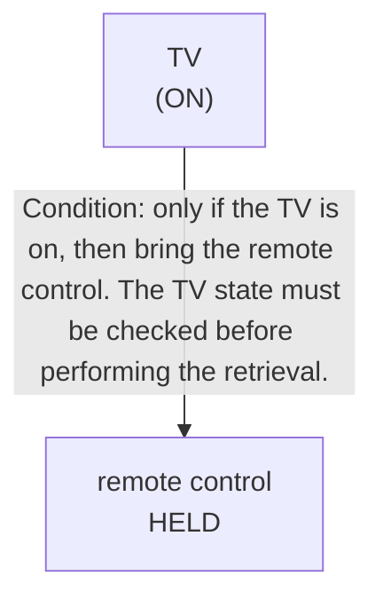
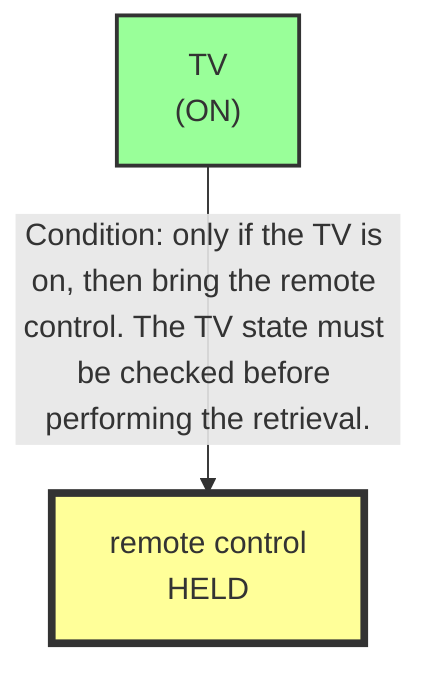

# 🚀 VirtualHome Agent Episode Log


### [GoalReasoner (Module A - Intent)] Output
```json
{
  "is_instruction_obviously_vague": false,
  "clarification_question": null,
  "target_object": "remote control",
  "location_hint": null,
  "reasoning_chain": [
    {
      "question": "Why does the user want this object?",
      "answer": "To control the TV if it is currently on."
    },
    {
      "question": "Why is that important?",
      "answer": "The user likely wants to change the TV's state or operation from a distance."
    },
    {
      "question": "What fundamental need does this fulfill?",
      "answer": "It helps the user control or manage an active entertainment device."
    },
    {
      "question": "Are there any deeper psychological or physical motivations?",
      "answer": "The user may want convenience, immediate access to controls, or to avoid manually interacting with the TV."
    }
  ],
  "deep_intent": "The user wants convenient control over an active entertainment device.",
  "acceptable_alternatives_properties": [
    {
      "priority": 1,
      "description": "Other handheld devices or controllers that can operate the TV, such as a compatible universal remote or another TV controller."
    },
    {
      "priority": 2,
      "description": "Any direct TV control interface, such as physical buttons on the TV or a compatible remote app on a nearby device."
    },
    {
      "priority": 3,
      "description": "Other simple input devices that can manage the same entertainment system, such as a set-top box remote or media player controller."
    },
    {
      "priority": 4,
      "description": "A smartphone or tablet with a remote-control function, if it can perform the same control task."
    }
  ]
}
```

### [RoboStateMultiTaskController] Output
```json
{
  "action": "[walk] <bathroom> (11)",
  "active_task_id": "task_1",
  "task_context": {
    "active_task_id": "task_1",
    "pending_task_ids": [],
    "satisfied_task_ids": []
  },
  "source": "room_frontier"
}
```
## Step 0
- **Action**: `[walk] <bathroom> (11)`
- **Action Success**: `True`
- **Action Message**: {'0': {'message': 'Success'}}
- **Active Task**: `task_1`
- **Decision Source**: `room_frontier`
- **Task Progress**: M1_01=pending
- **SDG Status**:

- **Observed Items (63)**: wall(262), wall(263), wall(264), wall(265), wall(266), wall(267), wall(268), wall(269), ceiling(270), ceiling(271), ceiling(272), ceiling(273), ceiling(274), ceiling(275), ceiling(276)...


### [RoboStateMultiTaskController] Output
```json
{
  "action": "[walk] <bedroom> (50)",
  "active_task_id": "task_1",
  "task_context": {
    "active_task_id": "task_1",
    "pending_task_ids": [],
    "satisfied_task_ids": []
  },
  "source": "room_frontier"
}
```
## Step 1
- **Action**: `[walk] <bedroom> (50)`
- **Action Success**: `True`
- **Action Message**: {'0': {'message': 'Success'}}
- **Active Task**: `task_1`
- **Decision Source**: `room_frontier`
- **Task Progress**: M1_01=pending
- **SDG Status**:

- **Observed Items (101)**: wall(262), wall(263), wall(264), wall(265), wall(266), wall(267), wall(268), wall(269), ceiling(270), ceiling(271), ceiling(272), ceiling(273), ceiling(274), ceiling(275), ceiling(276)...


### [PerceptionFilter] Output
```json
{
  "reasoning": "The goal is to obtain a remote control for an active TV. The SDG requires the TV to be ON and the remote control to be held, so both the TV and the remote control must be kept. No other tools or locations are necessary from the provided objects.",
  "selected_classes": [
    "character",
    "tv",
    "remotecontrol"
  ],
  "raw_class_count": 61
}
```

### [LLMExecutor] Output
```json
{
  "reasoning": "The TV state required by N1 is already satisfied because tv(300) is ON. The remaining unsatisfied node is to have the remote control held. The character is already CLOSE to remotecontrol(321), so the next atomic step is to grab it.",
  "satisfied_nodes": [
    "N1"
  ],
  "current_node_focus": "N2",
  "mapped_variables": {
    "?Remote": "remotecontrol(321)"
  },
  "action": "[grab] <remotecontrol> (321)"
}
```

### [RoboStateMultiTaskController] Output
```json
{
  "action": "[grab] <remotecontrol> (321)",
  "active_task_id": "task_1",
  "task_context": {
    "active_task_id": "task_1",
    "pending_task_ids": [],
    "satisfied_task_ids": []
  },
  "source": "llm_executor"
}
```
## Step 2
- **Action**: `[grab] <remotecontrol> (321)`
- **Action Success**: `False`
- **Action Message**: temporary_unavailable: target disappeared; wait or search and retry
- **Active Task**: `task_1`
- **Decision Source**: `llm_executor`
- **Task Progress**: M1_01=pending
- **SDG Status**:

- **Observed Items (7)**: tv(300) [ON], character(1), bathroom(11), bedroom(50), kitchen(126), livingroom(261), remotecontrol(321) [OFF]


### [PerceptionFilter] Output
```json
{
  "reasoning": "Reused cached class selection.",
  "selected_classes": [
    "character",
    "tv",
    "remotecontrol"
  ],
  "raw_class_count": 61
}
```

### [LLMExecutor] Output
```json
{
  "reasoning": "N1 is already satisfied because the TV is explicitly ON. N2 is not yet satisfied because the remote control is not currently held. The remotecontrol(321) is marked CLOSE to the character and is in the bedroom, so the next step is to grab it directly. A walk is unnecessary because the graph already indicates proximity, and the past failed grab was due to temporary unavailability, which has likely cleared or can be retried now.",
  "satisfied_nodes": [
    "N1"
  ],
  "current_node_focus": "N2",
  "mapped_variables": {
    "?Remote": "remotecontrol(321)"
  },
  "action": "[grab] <remotecontrol> (321)"
}
```

### [RoboStateMultiTaskController] Output
```json
{
  "action": "[grab] <remotecontrol> (321)",
  "active_task_id": "task_1",
  "task_context": {
    "active_task_id": "task_1",
    "pending_task_ids": [],
    "satisfied_task_ids": []
  },
  "source": "llm_executor"
}
```
## Step 3
- **Action**: `[grab] <remotecontrol> (321)`
- **Action Success**: `False`
- **Action Message**: temporary_unavailable: target is temporarily hidden
- **Active Task**: `task_1`
- **Decision Source**: `llm_executor`
- **Task Progress**: M1_01=pending
- **SDG Status**:

- **Observed Items (7)**: tv(300) [ON], character(1), bathroom(11), bedroom(50), kitchen(126), livingroom(261), remotecontrol(321) [OFF]


### [RoboStateMultiTaskController] Output
```json
{
  "action": "[walk] <kitchen> (126)",
  "active_task_id": null,
  "task_context": {
    "active_task_id": null,
    "pending_task_ids": [
      "task_1"
    ],
    "satisfied_task_ids": []
  },
  "source": "loop_recovery_room_revisit"
}
```
## Step 4
- **Action**: `[walk] <kitchen> (126)`
- **Action Success**: `True`
- **Action Message**: {'0': {'message': 'Success'}}
- **Decision Source**: `loop_recovery_room_revisit`
- **Task Progress**: M1_01=pending
- **SDG Status**:
No SDG active.
- **Observed Items (172)**: wall(262), wall(263), wall(264), wall(265), wall(266), wall(267), wall(268), wall(269), ceiling(270), ceiling(271), ceiling(272), ceiling(273), ceiling(274), ceiling(275), ceiling(276)...


### [PerceptionFilter] Output
```json
{
  "reasoning": "The goal is to retrieve a remote control for an active TV. The SDG requires the TV to be ON and the remote control to be held, so the only necessary classes are the TV and the remote control. No extra tools or locations are needed because the task is retrieval, not operation of another appliance.",
  "selected_classes": [
    "character",
    "tv",
    "remotecontrol"
  ],
  "raw_class_count": 86
}
```

### [LLMExecutor] Output
```json
{
  "reasoning": "The SDG requires the TV to be ON before obtaining the remote control. The current graph confirms tv(300) is already ON, so N1 is satisfied. The remotecontrol(321) is listed as CLOSE to the character, but the user wants the remote control held; since it's already nearby and no closer destination is needed, the next atomic step is to grab it. The previous grab attempts failed due to temporary unavailability, but it is now visible in the filtered graph, so retrying the grab is appropriate.",
  "satisfied_nodes": [
    "N1"
  ],
  "current_node_focus": "N2",
  "mapped_variables": {},
  "action": "[grab] <remotecontrol> (321)"
}
```

### [RoboStateMultiTaskController] Output
```json
{
  "action": "[grab] <remotecontrol> (321)",
  "active_task_id": "task_1",
  "task_context": {
    "active_task_id": "task_1",
    "pending_task_ids": [],
    "satisfied_task_ids": []
  },
  "source": "llm_executor"
}
```
## Step 5
- **Action**: `[grab] <remotecontrol> (321)`
- **Action Success**: `False`
- **Action Message**: temporary_unavailable: target is temporarily hidden
- **Active Task**: `task_1`
- **Decision Source**: `llm_executor`
- **Task Progress**: M1_01=pending
- **SDG Status**:

- **Observed Items (7)**: tv(300) [ON], character(1), bathroom(11), bedroom(50), kitchen(126), livingroom(261), remotecontrol(321) [OFF]


### [RoboStateMultiTaskController] Output
```json
{
  "action": "[walk] <livingroom> (261)",
  "active_task_id": null,
  "task_context": {
    "active_task_id": null,
    "pending_task_ids": [
      "task_1"
    ],
    "satisfied_task_ids": []
  },
  "source": "loop_recovery_room_revisit"
}
```
## Step 6
- **Action**: `[walk] <livingroom> (261)`
- **Action Success**: `True`
- **Action Message**: {'0': {'message': 'Success'}}
- **Decision Source**: `loop_recovery_room_revisit`
- **Task Progress**: M1_01=pending
- **SDG Status**:
No SDG active.
- **Observed Items (291)**: wall(262), wall(263), wall(264), wall(265), wall(266), wall(267), wall(268), wall(269), ceiling(270), ceiling(271), ceiling(272), ceiling(273), ceiling(274), ceiling(275), ceiling(276)...


### [PerceptionFilter] Output
```json
{
  "reasoning": "Reused cached class selection.",
  "selected_classes": [
    "character",
    "tv",
    "remotecontrol"
  ],
  "raw_class_count": 86
}
```

### [LLMExecutor] Output
```json
{
  "reasoning": "N1 is already satisfied because the TV is ON. The remaining unsatisfied node is N2, requiring the remote control to be HELD. The current graph says remotecontrol(321) is in the bedroom and is CLOSE to the character, but previous grab attempts failed because it was temporarily unavailable/hidden. Since the latest observation is from the living room and the task explicitly says not to repeat a walk action if just done, the best next step is to wait for the temporarily hidden remote to reappear.",
  "satisfied_nodes": [
    "N1"
  ],
  "current_node_focus": "N2",
  "mapped_variables": {
    "?Remote": "remotecontrol(321)"
  },
  "action": "[wait]"
}
```

### [RoboStateMultiTaskController] Output
```json
{
  "action": "[walk] <bathroom> (11)",
  "active_task_id": null,
  "task_context": {
    "active_task_id": null,
    "pending_task_ids": [
      "task_1"
    ],
    "satisfied_task_ids": []
  },
  "source": "loop_recovery_room_revisit"
}
```
## Step 7
- **Action**: `[walk] <bathroom> (11)`
- **Action Success**: `True`
- **Action Message**: {'0': {'message': 'Success'}}
- **Decision Source**: `loop_recovery_room_revisit`
- **Task Progress**: M1_01=pending
- **SDG Status**:
No SDG active.
- **Observed Items (291)**: wall(262), wall(263), wall(264), wall(265), wall(266), wall(267), wall(268), wall(269), ceiling(270), ceiling(271), ceiling(272), ceiling(273), ceiling(274), ceiling(275), ceiling(276)...


### [PerceptionFilter] Output
```json
{
  "reasoning": "Reused cached class selection.",
  "selected_classes": [
    "character",
    "tv",
    "remotecontrol"
  ],
  "raw_class_count": 86
}
```

### [LLMExecutor] Output
```json
{
  "reasoning": "N1 is already satisfied because the TV is ON. The remaining unsatisfied node is N2: the remote control must be HELD. The remotecontrol(321) is currently in the bedroom(50) and is reported CLOSE to the character, so the next atomic step is to grab it. I will not repeat a walk action because the last action already moved the character to the bathroom and the graph says the remote is close to the character.",
  "satisfied_nodes": [
    "N1"
  ],
  "current_node_focus": "N2",
  "mapped_variables": {},
  "action": "[grab] <remotecontrol> (321)"
}
```

### [RoboStateMultiTaskController] Output
```json
{
  "action": "[grab] <remotecontrol> (321)",
  "active_task_id": "task_1",
  "task_context": {
    "active_task_id": "task_1",
    "pending_task_ids": [],
    "satisfied_task_ids": []
  },
  "source": "llm_executor"
}
```
## Step 8
- **Action**: `[grab] <remotecontrol> (321)`
- **Action Success**: `False`
- **Action Message**: temporary_unavailable: target disappeared; wait or search and retry
- **Active Task**: `task_1`
- **Decision Source**: `llm_executor`
- **Task Progress**: M1_01=pending
- **SDG Status**:

- **Observed Items (7)**: tv(300) [ON], character(1), bathroom(11), bedroom(50), kitchen(126), livingroom(261), remotecontrol(321) [OFF]


### [RoboStateMultiTaskController] Output
```json
{
  "action": "[walk] <bedroom> (50)",
  "active_task_id": null,
  "task_context": {
    "active_task_id": null,
    "pending_task_ids": [
      "task_1"
    ],
    "satisfied_task_ids": []
  },
  "source": "loop_recovery_room_revisit"
}
```
## Step 9
- **Action**: `[walk] <bedroom> (50)`
- **Action Success**: `True`
- **Action Message**: {'0': {'message': 'Success'}}
- **Decision Source**: `loop_recovery_room_revisit`
- **Task Progress**: M1_01=pending
- **SDG Status**:
No SDG active.
- **Observed Items (291)**: wall(262), wall(263), wall(264), wall(265), wall(266), wall(267), wall(268), wall(269), ceiling(270), ceiling(271), ceiling(272), ceiling(273), ceiling(274), ceiling(275), ceiling(276)...


### [PerceptionFilter] Output
```json
{
  "reasoning": "Reused cached class selection.",
  "selected_classes": [
    "character",
    "tv",
    "remotecontrol"
  ],
  "raw_class_count": 86
}
```

### [LLMExecutor] Output
```json
{
  "reasoning": "The SDG requires the TV to be ON before retrieving the remote control. The TV is already ON, so N1 is satisfied. The remote control is now shown as CLOSE to the character and inside the bedroom, so the next step toward satisfying N2 is to grab it. I should not walk again because I just walked to the bedroom in the previous step and the remote is already nearby.",
  "satisfied_nodes": [
    "N1"
  ],
  "current_node_focus": "N2",
  "mapped_variables": {},
  "action": "[grab] <remotecontrol> (321)"
}
```

### [RoboStateMultiTaskController] Output
```json
{
  "action": "[grab] <remotecontrol> (321)",
  "active_task_id": "task_1",
  "task_context": {
    "active_task_id": "task_1",
    "pending_task_ids": [],
    "satisfied_task_ids": []
  },
  "source": "llm_executor"
}
```
## Step 10
- **Action**: `[grab] <remotecontrol> (321)`
- **Action Success**: `False`
- **Action Message**: temporary_unavailable: target is temporarily hidden
- **Active Task**: `task_1`
- **Decision Source**: `llm_executor`
- **Task Progress**: M1_01=pending
- **SDG Status**:

- **Observed Items (7)**: tv(300) [ON], character(1), bathroom(11), bedroom(50), kitchen(126), livingroom(261), remotecontrol(321) [OFF]


### [RoboStateMultiTaskController] Output
```json
{
  "action": "[walk] <kitchen> (126)",
  "active_task_id": null,
  "task_context": {
    "active_task_id": null,
    "pending_task_ids": [
      "task_1"
    ],
    "satisfied_task_ids": []
  },
  "source": "loop_recovery_room_revisit"
}
```
## Step 11
- **Action**: `[walk] <kitchen> (126)`
- **Action Success**: `True`
- **Action Message**: {'0': {'message': 'Success'}}
- **Decision Source**: `loop_recovery_room_revisit`
- **Task Progress**: M1_01=pending
- **SDG Status**:
No SDG active.
- **Observed Items (291)**: wall(262), wall(263), wall(264), wall(265), wall(266), wall(267), wall(268), wall(269), ceiling(270), ceiling(271), ceiling(272), ceiling(273), ceiling(274), ceiling(275), ceiling(276)...


### [PerceptionFilter] Output
```json
{
  "reasoning": "Reused cached class selection.",
  "selected_classes": [
    "character",
    "tv",
    "remotecontrol"
  ],
  "raw_class_count": 86
}
```

### [LLMExecutor] Output
```json
{
  "reasoning": "N1 is already satisfied because the TV is ON. The remaining unmet node is N2: the remote control must be HELD. The filtered graph shows remotecontrol(321) is currently in the bedroom(50) and is marked CLOSE to the character, but current location is kitchen(126). Because grab requires proximity and the previous direct grabs failed due to temporary unavailability, the correct next step is to move to the remote's location so we can retry grabbing it there. This also aligns with the disappearance strategy: first reach the location where it is currently observed.",
  "satisfied_nodes": [
    "N1"
  ],
  "current_node_focus": "N2",
  "mapped_variables": {},
  "action": "[walk] <bedroom> (50)"
}
```

### [RoboStateMultiTaskController] Output
```json
{
  "action": "[walk] <bedroom> (50)",
  "active_task_id": "task_1",
  "task_context": {
    "active_task_id": "task_1",
    "pending_task_ids": [],
    "satisfied_task_ids": []
  },
  "source": "llm_executor"
}
```
## Step 12
- **Action**: `[walk] <bedroom> (50)`
- **Action Success**: `True`
- **Action Message**: {'0': {'message': 'Success'}}
- **Active Task**: `task_1`
- **Decision Source**: `llm_executor`
- **Task Progress**: M1_01=pending
- **SDG Status**:

- **Observed Items (7)**: tv(300) [ON], character(1), bathroom(11), bedroom(50), kitchen(126), livingroom(261), remotecontrol(321) [OFF]


### [PerceptionFilter] Output
```json
{
  "reasoning": "Reused cached class selection.",
  "selected_classes": [
    "character",
    "tv",
    "remotecontrol"
  ],
  "raw_class_count": 86
}
```

### [LLMExecutor] Output
```json
{
  "reasoning": "N1 is already satisfied because the TV is ON. The remaining unsatisfied node is N2: the remote control must be HELD. The filtered graph shows the remotecontrol(321) is CLOSE to the character and INSIDE the bedroom, so the next atomic step is to grab it. Since we are already in the bedroom, no additional walk is needed before grabbing.",
  "satisfied_nodes": [
    "N1"
  ],
  "current_node_focus": "N2",
  "mapped_variables": {
    "?Remote": "remotecontrol(321)"
  },
  "action": "[grab] <remotecontrol> (321)"
}
```

### [RoboStateMultiTaskController] Output
```json
{
  "action": "[grab] <remotecontrol> (321)",
  "active_task_id": "task_1",
  "task_context": {
    "active_task_id": "task_1",
    "pending_task_ids": [],
    "satisfied_task_ids": []
  },
  "source": "llm_executor"
}
```
## Step 13
- **Action**: `[grab] <remotecontrol> (321)`
- **Action Success**: `True`
- **Action Message**: {'0': {'message': 'Success'}}
- **Active Task**: `task_1`
- **Decision Source**: `llm_executor`
- **Task Progress**: M1_01=done
- **SDG Status**:

- **Observed Items (7)**: tv(300) [ON], character(1), bathroom(11), bedroom(50), kitchen(126), livingroom(261), remotecontrol(321) [OFF]

