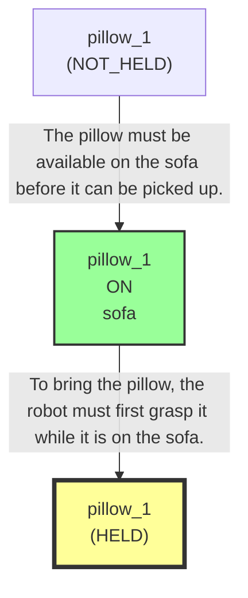

# 🚀 VirtualHome Agent Episode Log


### [GoalReasoner (Module A - Intent)] Output
```json
{
  "is_instruction_obviously_vague": false,
  "clarification_question": null,
  "target_object": "pillow",
  "location_hint": "sofa",
  "reasoning_chain": [
    {
      "question": "Why does the user want this object?",
      "answer": "To have a pillow brought to them."
    },
    {
      "question": "Why is that important?",
      "answer": "To make a nearby pillow available for their use."
    },
    {
      "question": "What fundamental need does this fulfill?",
      "answer": "To improve comfort or support while resting."
    },
    {
      "question": "Are there any deeper psychological or physical motivations?",
      "answer": "It likely helps the user relax, sit, or lie more comfortably."
    }
  ],
  "deep_intent": "The user wants to increase comfort or support while resting.",
  "acceptable_alternatives_properties": [
    {
      "priority": 1,
      "description": "Other soft cushions or throw pillows that can provide similar comfort and support"
    },
    {
      "priority": 2,
      "description": "Similar household cushioning items such as a cushion, bolster, or padded blanket"
    },
    {
      "priority": 3,
      "description": "Any soft supportive item that can be used for resting, such as a folded blanket or seat cushion"
    },
    {
      "priority": 4,
      "description": "Other indoor comfort items that help with resting posture, such as a small mattress topper or back support pillow"
    }
  ]
}
```

### [PerceptionFilter] Output
```json
{
  "reasoning": "The goal is to bring a pillow from the sofa. The SDG explicitly requires the pillow and its location, the sofa, to identify and pick up the target item. No extra tools or alternative receptacles are needed beyond the target and its support surface.",
  "selected_classes": [
    "sofa",
    "pillow",
    "character"
  ],
  "raw_class_count": 30
}
```

### [LLMExecutor] Output
```json
{
  "reasoning": "The target pillow(303) is already on the sofa(288), and the character is already CLOSE to the sofa. To satisfy the first unsatisfied prerequisite before holding the pillow, the next step is to grab the pillow. No other objects are involved and no clarification is needed.",
  "satisfied_nodes": [
    "N1"
  ],
  "current_node_focus": "N2",
  "mapped_variables": {},
  "action": "[grab] <pillow> (303)"
}
```

### [RoboStateMultiTaskController] Output
```json
{
  "action": "[walk] <pillow> (303)",
  "active_task_id": "task_1",
  "task_context": {
    "active_task_id": "task_1",
    "pending_task_ids": [],
    "satisfied_task_ids": []
  },
  "source": "llm_executor_repaired"
}
```
## Step 0
- **Action**: `[walk] <pillow> (303)`
- **Action Success**: `True`
- **Action Message**: {'0': {'message': 'Success'}}
- **Active Task**: `task_1`
- **Decision Source**: `llm_executor_repaired`
- **Task Progress**: M1_04=pending
- **SDG Status**:

- **Observed Items (7)**: sofa(288), pillow(303), character(1), bathroom(11), bedroom(50), kitchen(126), livingroom(261)


### [PerceptionFilter] Output
```json
{
  "reasoning": "Reused cached class selection.",
  "selected_classes": [
    "sofa",
    "pillow",
    "character"
  ],
  "raw_class_count": 30
}
```

### [LLMExecutor] Output
```json
{
  "reasoning": "The pillow is already on the sofa and is currently close to the character, so the prerequisite relation N1 is satisfied. The next required SDG node is to make pillow_1 HELD, which requires grabbing it now. No additional walking is needed because we are already close to the pillow.",
  "satisfied_nodes": [
    "N1"
  ],
  "current_node_focus": "N2",
  "mapped_variables": {},
  "action": "[grab] <pillow> (303)"
}
```

### [RoboStateMultiTaskController] Output
```json
{
  "action": "[grab] <pillow> (303)",
  "active_task_id": "task_1",
  "task_context": {
    "active_task_id": "task_1",
    "pending_task_ids": [],
    "satisfied_task_ids": []
  },
  "source": "llm_executor"
}
```
## Step 1
- **Action**: `[grab] <pillow> (303)`
- **Action Success**: `True`
- **Action Message**: {'0': {'message': 'Success'}}
- **Active Task**: `task_1`
- **Decision Source**: `llm_executor`
- **Task Progress**: M1_04=done
- **SDG Status**:

- **Observed Items (7)**: sofa(288), pillow(303), character(1), bathroom(11), bedroom(50), kitchen(126), livingroom(261)

