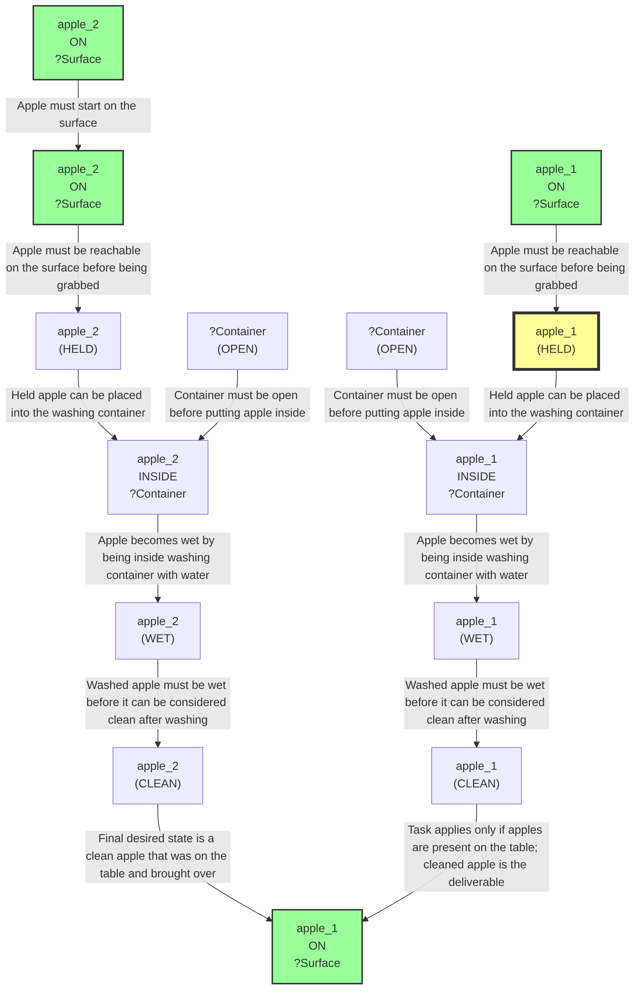
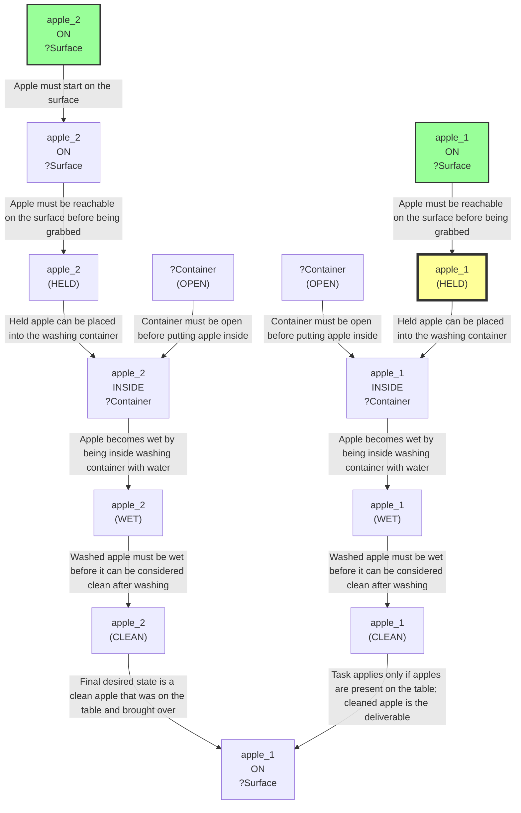
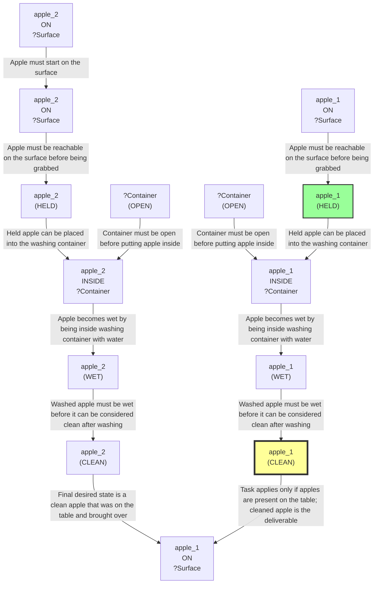

# 🚀 VirtualHome Agent Episode Log


### [GoalReasoner (Module A - Intent)] Output
```json
{
  "is_instruction_obviously_vague": false,
  "clarification_question": null,
  "target_object": "apples",
  "location_hint": "the table",
  "reasoning_chain": [
    {
      "question": "Why does the user want this object?",
      "answer": "To have the apples cleaned and delivered to them."
    },
    {
      "question": "Why is that important?",
      "answer": "Clean apples are more suitable for handling and eating."
    },
    {
      "question": "What fundamental need does this fulfill?",
      "answer": "It helps satisfy the need for ready-to-eat food."
    },
    {
      "question": "Are there any deeper psychological or physical motivations?",
      "answer": "The user likely wants convenient access to edible food and may also want to avoid dirt or residue on the fruit."
    }
  ],
  "deep_intent": "The user wants ready-to-eat food that has been cleaned and delivered to them.",
  "acceptable_alternatives_properties": [
    {
      "priority": 1,
      "description": "Other whole fruits that can be washed and brought over, such as pears, oranges, or grapes."
    },
    {
      "priority": 2,
      "description": "Other washable fresh produce items that are typically eaten raw, such as berries or plums."
    },
    {
      "priority": 3,
      "description": "Prepared ready-to-eat snack foods that serve the same eating need if fresh fruit is unavailable."
    },
    {
      "priority": 4,
      "description": "Other convenient edible items that can satisfy hunger, such as crackers, granola bars, or sliced vegetables."
    }
  ]
}
```

### [PerceptionFilter] Output
```json
{
  "reasoning": "Need the target apples, the table they are on, and the washing setup implied by the SDG: a sink/faucet with dishwashing liquid and sponge, plus a container to hold/wash the apples (dishbowl). Backup/alternative heating or holding tools are not needed for this goal.",
  "selected_classes": [
    "crackers",
    "faucet",
    "apple",
    "sink",
    "kitchentable",
    "washingsponge",
    "dishbowl",
    "character",
    "dishwashingliquid"
  ],
  "raw_class_count": 55
}
```

### [LLMExecutor] Output
```json
{
  "reasoning": "The goal is to deliver a clean apple. The filtered graph shows one apple (apple_437) on the kitchen table and it is DIRTY. The character is already CLOSE to the kitchen table, so the next needed step is to pick up the apple before washing it at the sink. This advances toward the SDG by satisfying the reachability prerequisite for the held state and eventual washing/cleaning.",
  "satisfied_nodes": [
    "N1",
    "N4",
    "N8",
    "N11"
  ],
  "current_node_focus": "N3",
  "mapped_variables": {
    "?Surface": "kitchentable(231)"
  },
  "action": "[grab] <apple> (437)"
}
```

### [RoboStateMultiTaskController] Output
```json
{
  "action": "[walk] <apple> (437)",
  "active_task_id": "task_1",
  "task_context": {
    "active_task_id": "task_1",
    "pending_task_ids": [],
    "satisfied_task_ids": []
  },
  "source": "llm_executor_repaired"
}
```
## Step 0
- **Action**: `[walk] <apple> (437)`
- **Action Success**: `True`
- **Action Message**: {'0': {'message': 'Success'}}
- **Active Task**: `task_1`
- **Decision Source**: `llm_executor_repaired`
- **Task Progress**: G1_02=pending
- **SDG Status**:

- **Observed Items (13)**: kitchentable(231), sink(247), faucet(248) [ON], washingsponge(266), dishwashingliquid(267), dishbowl(326), crackers(332), apple(437) [DIRTY], character(1), bathroom(11), bedroom(73), kitchen(205), livingroom(335)


### [PerceptionFilter] Output
```json
{
  "reasoning": "Reused cached class selection.",
  "selected_classes": [
    "crackers",
    "faucet",
    "apple",
    "sink",
    "kitchentable",
    "washingsponge",
    "dishbowl",
    "character",
    "dishwashingliquid"
  ],
  "raw_class_count": 55
}
```

### [LLMExecutor] Output
```json
{
  "reasoning": "The active goal is to deliver a clean apple. The current apple_437 is already on the kitchen table, close to the character, but it is DIRTY and not yet held. Per the task chain, the next required step is to pick up the apple before it can be washed at the sink. I will therefore grab apple_437 now.",
  "satisfied_nodes": [
    "N11",
    "N4"
  ],
  "current_node_focus": "N3",
  "mapped_variables": {
    "?Surface": "kitchentable(231)",
    "?Container": "sink(247)"
  },
  "action": "[grab] <apple> (437)"
}
```

### [RoboStateMultiTaskController] Output
```json
{
  "action": "[grab] <apple> (437)",
  "active_task_id": "task_1",
  "task_context": {
    "active_task_id": "task_1",
    "pending_task_ids": [],
    "satisfied_task_ids": []
  },
  "source": "llm_executor"
}
```
## Step 1
- **Action**: `[grab] <apple> (437)`
- **Action Success**: `True`
- **Action Message**: {'0': {'message': 'Success'}}
- **Active Task**: `task_1`
- **Decision Source**: `llm_executor`
- **Task Progress**: G1_02=pending
- **SDG Status**:

- **Observed Items (13)**: kitchentable(231), sink(247), faucet(248) [ON], washingsponge(266), dishwashingliquid(267), dishbowl(326), crackers(332), apple(437) [DIRTY], character(1), bathroom(11), bedroom(73), kitchen(205), livingroom(335)


### [PerceptionFilter] Output
```json
{
  "reasoning": "Reused cached class selection.",
  "selected_classes": [
    "crackers",
    "faucet",
    "apple",
    "sink",
    "kitchentable",
    "washingsponge",
    "dishbowl",
    "character",
    "dishwashingliquid"
  ],
  "raw_class_count": 55
}
```

### [LLMExecutor] Output
```json
{
  "reasoning": "The active apple_1 is currently already held in the right hand but is DIRTY. The SDG requires the apple to end up CLEAN and eventually ON the table, so the next prerequisite is to clean it. Since washing requires being near a sink and holding the object, and the sink is available in the kitchen, the next atomic step is to walk to the sink. This also respects the requirement to explicitly approach the washing destination before washing.",
  "satisfied_nodes": [
    "N3"
  ],
  "current_node_focus": "N2",
  "mapped_variables": {
    "?Surface": "kitchentable(231)",
    "?Container": "sink(247)"
  },
  "action": "[walk] <sink> (247)"
}
```

### [RoboStateMultiTaskController] Output
```json
{
  "action": "[walk] <sink> (247)",
  "active_task_id": "task_1",
  "task_context": {
    "active_task_id": "task_1",
    "pending_task_ids": [],
    "satisfied_task_ids": []
  },
  "source": "llm_executor"
}
```
## Step 2
- **Action**: `[walk] <sink> (247)`
- **Action Success**: `True`
- **Action Message**: {'0': {'message': 'Success'}}
- **Active Task**: `task_1`
- **Decision Source**: `llm_executor`
- **Task Progress**: G1_02=pending
- **SDG Status**:

- **Observed Items (13)**: kitchentable(231), sink(247), faucet(248) [ON], washingsponge(266), dishwashingliquid(267), dishbowl(326), crackers(332), apple(437) [DIRTY], character(1), bathroom(11), bedroom(73), kitchen(205), livingroom(335)


### [PerceptionFilter] Output
```json
{
  "reasoning": "Reused cached class selection.",
  "selected_classes": [
    "crackers",
    "faucet",
    "apple",
    "sink",
    "kitchentable",
    "washingsponge",
    "dishbowl",
    "character",
    "dishwashingliquid"
  ],
  "raw_class_count": 55
}
```

### [LLMExecutor] Output
```json
{
  "reasoning": "The apple(437) is already held and we are already close to the sink(247). The next required step to satisfy the CLEAN state is to wash the dirty apple at the sink. Since washing requires holding the object and being near a sink, this is the correct atomic action.",
  "satisfied_nodes": [
    "N3"
  ],
  "current_node_focus": "N2",
  "mapped_variables": {
    "?Washer": "sink(247)"
  },
  "action": "[wash] <apple> (437)"
}
```

### [RoboStateMultiTaskController] Output
```json
{
  "action": "[wash] <apple> (437)",
  "active_task_id": "task_1",
  "task_context": {
    "active_task_id": "task_1",
    "pending_task_ids": [],
    "satisfied_task_ids": []
  },
  "source": "llm_executor"
}
```
## Step 3
- **Action**: `[wash] <apple> (437)`
- **Action Success**: `True`
- **Action Message**: Washed successfully.
- **Active Task**: `task_1`
- **Decision Source**: `llm_executor`
- **Task Progress**: G1_02=done
- **SDG Status**:

- **Observed Items (13)**: kitchentable(231), sink(247), faucet(248) [ON], washingsponge(266), dishwashingliquid(267), dishbowl(326), crackers(332), apple(437) [DIRTY], character(1), bathroom(11), bedroom(73), kitchen(205), livingroom(335)

