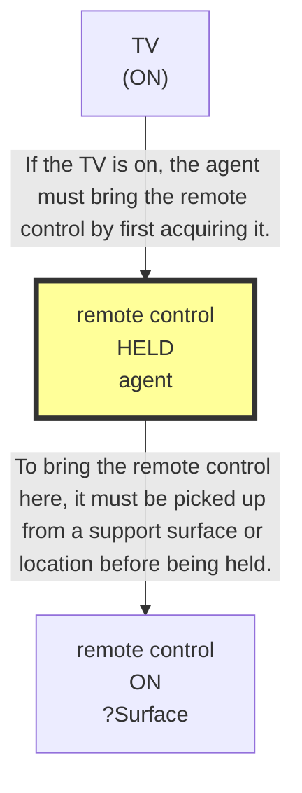

# 🚀 VirtualHome Agent Episode Log


### [GoalReasoner (Module A - Intent)] Output
```json
{
  "is_instruction_obviously_vague": false,
  "clarification_question": null,
  "target_object": "remote control",
  "location_hint": null,
  "reasoning_chain": [
    {
      "question": "Why does the user want this object?",
      "answer": "To control the TV if it is currently on."
    },
    {
      "question": "Why is that important?",
      "answer": "So they can operate the TV without needing to move to it directly."
    },
    {
      "question": "What fundamental need does this fulfill?",
      "answer": "It fulfills the need to control or manage an active entertainment device."
    },
    {
      "question": "Are there any deeper psychological or physical motivations?",
      "answer": "The user likely wants convenience and immediate access to device controls."
    }
  ],
  "deep_intent": "The user wants convenient control over an active entertainment device.",
  "acceptable_alternatives_properties": [
    {
      "priority": 1,
      "description": "Other input devices that can control the TV, such as a universal remote or compatible controller"
    },
    {
      "priority": 2,
      "description": "A smartphone or tablet app that functions as a TV remote"
    },
    {
      "priority": 3,
      "description": "Any nearby device or controller that can perform the same TV control functions"
    },
    {
      "priority": 4,
      "description": "A physical button interface on the TV itself if remote control is unavailable"
    }
  ]
}
```

### [PerceptionFilter] Output
```json
{
  "reasoning": "The goal is to obtain the remote control to operate the TV. The SDG requires the TV, the remote control target, and the surface/location where the remote may be placed so it can be picked up. Since the goal includes controlling an active TV, the TV itself must be retained, along with the exact target class remotecontrol and any plausible nearby support surface relevant to the SDG.",
  "selected_classes": [
    "tvstand",
    "coffeetable",
    "character",
    "tv",
    "remotecontrol"
  ],
  "raw_class_count": 40
}
```

### [LLMExecutor] Output
```json
{
  "reasoning": "The active task is to obtain the remote control. The TV is currently OFF, so SDG node N1 is not satisfied yet; however the immediate actionable progress is to acquire the remote control. The remotecontrol(452) is visible in the living room and is grabbable. Since grabbing requires being near it, the next atomic action is to walk to the remote control first. No other prerequisite like opening or cleaning is needed.",
  "satisfied_nodes": [],
  "current_node_focus": "N2",
  "mapped_variables": {
    "?Surface": "tvstand(369)"
  },
  "action": "[walk] <remotecontrol> (452)"
}
```

### [RoboStateMultiTaskController] Output
```json
{
  "action": "[walk] <remotecontrol> (452)",
  "active_task_id": "task_1",
  "task_context": {
    "active_task_id": "task_1",
    "pending_task_ids": [],
    "satisfied_task_ids": []
  },
  "source": "llm_executor"
}
```
## Step 0
- **Action**: `[walk] <remotecontrol> (452)`
- **Action Success**: `True`
- **Action Message**: {'0': {'message': 'Success'}}
- **Active Task**: `task_1`
- **Decision Source**: `llm_executor`
- **Task Progress**: G1_03=pending
- **SDG Status**:

- **Observed Items (9)**: tvstand(369), coffeetable(371), tv(426) [OFF], remotecontrol(452) [OFF], character(1), bathroom(11), bedroom(73), kitchen(205), livingroom(335)


### [PerceptionFilter] Output
```json
{
  "reasoning": "Reused cached class selection.",
  "selected_classes": [
    "tvstand",
    "coffeetable",
    "character",
    "tv",
    "remotecontrol"
  ],
  "raw_class_count": 40
}
```

### [LLMExecutor] Output
```json
{
  "reasoning": "The TV is currently OFF, so SDG node N1 is not satisfied yet. The remote control is already CLOSE to the agent and was previously approached successfully, so the next required step toward holding it is to grab it. This also progresses toward N2. No other prerequisite actions are needed before grabbing because the remote is grabbable and near the agent.",
  "satisfied_nodes": [],
  "current_node_focus": "N2",
  "mapped_variables": {
    "?Surface": "coffeetable(371)"
  },
  "action": "[grab] <remotecontrol> (452)"
}
```

### [RoboStateMultiTaskController] Output
```json
{
  "action": "[grab] <remotecontrol> (452)",
  "active_task_id": "task_1",
  "task_context": {
    "active_task_id": "task_1",
    "pending_task_ids": [],
    "satisfied_task_ids": []
  },
  "source": "llm_executor"
}
```
## Step 1
- **Action**: `[grab] <remotecontrol> (452)`
- **Action Success**: `True`
- **Action Message**: {'0': {'message': 'Success'}}
- **Active Task**: `task_1`
- **Decision Source**: `llm_executor`
- **Task Progress**: G1_03=done
- **SDG Status**:

- **Observed Items (9)**: tvstand(369), coffeetable(371), tv(426) [OFF], remotecontrol(452) [OFF], character(1), bathroom(11), bedroom(73), kitchen(205), livingroom(335)

